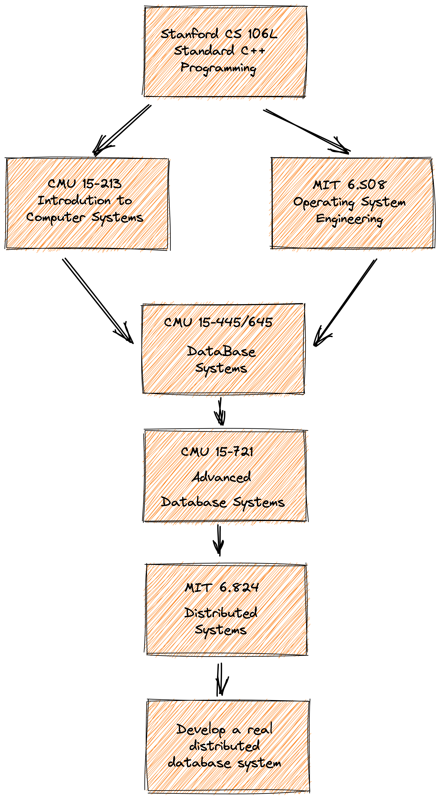

### 概述

eraft 项目的是将 mit6.824 lab 大作业工业化成一个分布式存储系统，我们会用全网最简单，直白的语言介绍分布式系统的原理，并带着你设计和实现一个工业化的分布式存储系统。

我们团队致力于解读国外优秀的分布式存储相关开源课程，下面是课程体系图



我们始终坚信优秀的本科教学不应该是照本宣科以及应付考试，一门优秀的课程，应该具备让学生学会思考、动手实践、找到问题、反复试错、并解决问题的能力，同时应该尽量用最直白，最简单的语言传达关键的知识点。作为计算机工业界的工作者，我相信做课程和做技术一样，并不是越复杂越好，应该尽量的让设计出来的东西简单化。

好了，虾BB 的话就说这么多，找到我们的最新动态，欢迎关注 

https://www.zhihu.com/people/liu-jie-84-52

接下来我们进入正题，如何实现一个分布式系统。

## 理论原理

### 为什么需要分布式？

### 一致性算法

### 数据分片

## 实验项目

### 集群架构


首先我们先介绍下架构介绍

#### 概念介绍

##### bucket

它是集群做数据管理的逻辑单元，一个分组的服务可以负责多个 bucket 的数据

##### config table

集群配置表，它主要维护了集群服务分组与 bucket 的映射关系，客户端访问集群数据之前需要先到这个表查询要访问 bucket 所在的服务分组列表

#### 服务模块

##### configserver

它主要负责集群配置表版本管理，它内部维护了一个集群配置表的版本链，可以记录集群配置的变更。

##### shardserver

它主要负责集群数据存储，一般有三台机器组成一个 raft 组，对外提供高可用的服务。

### 基本功能的实现

#### 1.领导选举

#### 2.日志复制

#### 3.存储引擎

#### 4.数据持久化存储

#### 5.快照恢复

#### 6.集群配置变更

#### 7.bucket 数据迁移

#### 8.客户端实现

### 下载构建代码

```
git clone https://github.com/eraft-io/mit6.824lab2product.git

cd mit6.824lab2product

go mod tidy

make
```

产出物的 bin 在 output 目录下

### 快速动手开始

1.启动一组配置服务

```
# 8088 leader
./cfgserver 0 127.0.0.1:8088,127.0.0.1:8089,127.0.0.1:8090

# 8089
./cfgserver 1 127.0.0.1:8088,127.0.0.1:8089,127.0.0.1:8090

# 8090
./cfgserver 2 127.0.0.1:8088,127.0.0.1:8089,127.0.0.1:8090

```

2.添加一个初始化的集群分组

```
# join 一个初始的 server 分组，这里第一个参数不一定是 127.0.0.1:8088，要对应具体的配置服务 leader 地址

./cfgcli 127.0.0.1:8088 join 1 127.0.0.1:6088,127.0.0.1:6089,127.0.0.1:6090
```

3.启动集群分组

```
./shardserver 0 1 127.0.0.1:8088 127.0.0.1:6088,127.0.0.1:6089,127.0.0.1:6090

./shardserver 1 1 127.0.0.1:8088 127.0.0.1:6088,127.0.0.1:6089,127.0.0.1:6090

./shardserver 2 1 127.0.0.1:8088 127.0.0.1:6088,127.0.0.1:6089,127.0.0.1:6090
```

4.再次添加并启动一个分组

```

// 再加入一个分组
./cfgcli 127.0.0.1:8088 join 2 127.0.0.1:7088,127.0.0.1:7089,127.0.0.1:7090

./shardserver 0 2 127.0.0.1:8088 127.0.0.1:7088,127.0.0.1:7089,127.0.0.1:7090

./shardserver 1 2 127.0.0.1:8088 127.0.0.1:7088,127.0.0.1:7089,127.0.0.1:7090

./shardserver 2 2 127.0.0.1:8088 127.0.0.1:7088,127.0.0.1:7089,127.0.0.1:7090
```

5.查询分组状态
```
./cfgcli 127.0.0.1:8088 query
```

6.读写数据
```
./shardcli 127.0.0.1:8088 put testkey testvalue
./shardcli 127.0.0.1:8088 get key
```
