<div align="center">

<!-- omit in toc -->
# 从零开始训练大语言模型

   [](https://fareedkhan-dev.github.io/train-llm-from-scratch/)

**我正在寻找 AI 方向的博士职位**。[GitHub](https://github.com/FareedKhan-dev)

</div>

我基于论文 [Attention is All You Need](https://arxiv.org/abs/1706.03762)，使用 PyTorch 从零实现了一个 Transformer 模型。你可以使用我的脚本，仅用一块 GPU 训练属于你自己的**十亿级**或**百万级**参数的大语言模型。

这个项目最初是一个预训练教程。现在它涵盖了从原始文本到对齐的、具有推理风格模型的完整流程，每个算法都用纯 PyTorch 手写实现（不使用 `trl`、`peft`、`transformers`）。整个旅程围绕一个核心思想反复展开：将文本转化为数字，预测下一个 token，然后不断调整数据和损失函数，直到模型表现出我们期望的行为。

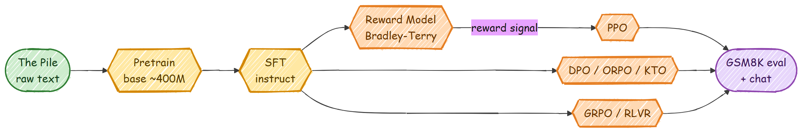

以下是我们将要完整走过的路径：

```
原始文本  ->  tokens  ->  Transformer  ->  下一token损失  ->  基础模型
基础模型  ->  SFT  ->  奖励模型  ->  {PPO, DPO}  ->  GRPO  ->  评估与对话
```

下面是一个已训练的 1300 万参数大语言模型的输出，让你了解这个项目从小规模起步的效果：

```
In ***1978, The park was returned to the factory-plate that
the public share to the lower of the electronic fence that
follow from the Station's cities. The Canal of ancient Western
nations were confined to the city spot. The villages were directly
linked to cities in China that revolt that the US budget and in
Odambinais is uncertain and fortune established in rural areas.
```

<!-- omit in toc -->
## 目录
- [适用人群](#适用人群)
- [前置知识与训练时间](#前置知识与训练时间)
- [环境搭建](#环境搭建)
- [代码结构](#代码结构)
- [第一步：准备数据](#第一步准备数据)
- [第二步：模型——由小部件构建](#第二步模型由小部件构建)
  - [多层感知机（MLP）](#多层感知机mlp)
  - [单头注意力](#单头注意力)
  - [多头注意力](#多头注意力)
  - [Transformer 块](#transformer-块)
  - [完整的 Transformer](#完整的-transformer)
- [第三步：预训练基础模型](#第三步预训练基础模型)
- [第四步：生成文本](#第四步生成文本)
- [第五步：后训练——将基础模型变成助手](#第五步后训练将基础模型变成助手)
  - [SFT（监督微调）](#sft监督微调)
  - [奖励模型](#奖励模型)
  - [DPO、ORPO 和 KTO](#dpoorpo-和-kto)
  - [PPO](#ppo)
  - [GRPO / RLVR](#grpo--rlvr)
- [第六步：评估](#第六步评估)
- [第七步：与模型对话](#第七步与模型对话)
- [Streamlit 控制面板](#streamlit-控制面板)
- [文档网站](#文档网站)
- [运行完整流程](#运行完整流程)
- [下一步](#下一步)

## 适用人群

我试图这样编写，让一个页面能适用于截然不同的读者：

- 如果你是**学生**，请从头到尾阅读。每段代码之前都有对其功能和原因的通俗解释，大多数代码块之后会附上你应该看到的输出。
- 如果你是**开发者**，所有命令和文件路径都在这里。你可以直接复制、运行并阅读引用的源文件。
- 如果你是**研究者**，后训练部分是有趣的重点：SFT、Bradley-Terry 奖励模型、带 GAE 的 PPO、DPO/ORPO/KTO 以及 GRPO，全部在同一个小型 Transformer 上从零实现，使用真实的公开数据集训练。

本 README 中的每张图都使用相同的配色方案，颜色含义如下：

- 绿色代表原始数据
- 青色代表已存储的、tokenized 的磁盘数据
- 蓝色代表普通处理步骤
- 黄色代表模型或训练步骤
- 橙色代表强化学习和奖励部分
- 红色代表损失
- 灰色代表保存的检查点
- 紫色代表最终输出或评估

## 前置知识与训练时间

你需要对面向对象编程、神经网络和 PyTorch 有基本的了解。以下是一些帮助你入门的资源：

| 主题               | 视频链接                                                |
|---------------------|-----------------------------------------------------------|
| 面向对象编程                 | [OOP 视频](https://www.youtube.com/watch?v=Ej_02ICOIgs) |
| 神经网络      | [神经网络视频](https://www.youtube.com/watch?v=Jy4wM2X21u0) |
| Pytorch             | [Pytorch 视频](https://www.youtube.com/watch?v=V_xro1bcAuA) |

你需要一块 GPU 来进行训练。免费的 Colab 或 Kaggle T4 足以训练 1300 万参数的模型，但无法容纳十亿级参数的模型。以下是大致参考：

| GPU 名称                 | 显存 | 2B 大模型训练 | 13M 大模型训练 | 最大实用大模型规模（训练） |
|--------------------------|--------|-----------------|------------------|-----------------------------------|
| NVIDIA A100              | 40 GB  | ✔               | ✔                | ~6B 到 8B                          |
| NVIDIA V100              | 16 GB  | ✘               | ✔                | ~2B                               |
| NVIDIA RTX 4090          | 24 GB  | ✔               | ✔                | ~4B                               |
| NVIDIA RTX 5090          | 32 GB  | ✔               | ✔                | 13M 已验证，更大配置待定  |
| NVIDIA RTX 3090          | 24 GB  | ✔               | ✔                | ~3.5B 到 4B                        |
| NVIDIA RTX 4080          | 16 GB  | ✘               | ✔                | ~2B                               |
| NVIDIA RTX 4060          | 8 GB   | ✘               | ✔                | ~1B                               |
| Tesla T4                 | 16 GB  | ✘               | ✔                | ~1.5B 到 2B                        |

如果大规模配置内存不足，预训练脚本提供了可选的优化标志（`--amp`、`--grad-checkpointing`、`--grad-accum`），可以大幅降低内存占用。后面会详细介绍。

## 环境搭建

克隆仓库并以可编辑模式安装。可编辑安装会将 `config`、`src`、`data_loader` 和 `ui` 加入你的导入路径，因此你不再需要手动设置 `PYTHONPATH`：

```bash
git clone https://github.com/FareedKhan-dev/train-llm-from-scratch.git
cd train-llm-from-scratch
pip install -e .
```

还有可选的扩展依赖，按你需要的部分安装：

```bash
pip install -e ".[train]"   # datasets + wandb，用于下载数据和记录日志
pip install -e ".[ui]"      # streamlit + pandas + altair，用于控制面板
pip install -e ".[docs]"    # mkdocs，用于文档网站
pip install -e ".[all]"     # 全部安装
```

有两套配置系统，从一开始就了解它们的区别会有帮助：

- `config/config.py` 是原始的、简单的配置，用于旧版预训练脚本 `scripts/train_transformer.py`。它是纯 Python 常量。
- `config/post_training_config.py` 加上 `configs/` 目录中的 JSON 文件驱动其他所有流程（预训练更大的基础模型、SFT、奖励模型、DPO、PPO、GRPO）。你为每个阶段编辑一个小型 JSON 文件，任何字段也可以在命令行覆盖，例如 `--lr 2e-5 --batch_size 16`。

为了快速检查，每个阶段都有一个微型的 `configs/smoke/` 变体配置，它缩小了模型规模，使得完整运行在 CPU 或单 GPU 上几秒钟即可完成。

## 代码结构

```bash
train-llm-from-scratch/
├── src/
│   ├── models/                  # Transformer，由小部件构建
│   │   ├── mlp.py               # 前馈网络块
│   │   ├── attention.py         # 单头注意力和多头注意力
│   │   ├── transformer_block.py # 一个块：注意力 + MLP + 残差连接
│   │   └── transformer.py       # 完整模型：嵌入层 + 块 + lm_head
│   └── post_training/           # SFT、奖励模型、PPO、DPO、GRPO、评估、推理
├── config/
│   ├── config.py                # 旧版预训练配置（纯常量）
│   ├── post_training_config.py  # 每个后训练阶段的数据类
│   └── loader.py                # 合并 默认值 < base.json < stage.json < CLI
├── configs/                     # 可编辑的 JSON，每个阶段一个文件（+ smoke/）
├── data_loader/                 # 各类数据的批量迭代器
├── scripts/                     # 每个可运行步骤都在这里
├── ui/                          # Streamlit 控制面板
├── docs/                        # MkDocs 网站（理论 + 图示）
├── images/                      # 本 README 中的图示（+ 生成器）
└── pyproject.toml               # pip install -e .
```

## 第一步：准备数据

模型只能看到整数。因此第一步始终相同：获取文本，将其转化为 token id，然后以训练时能快速读取的格式将这些 id 存储在磁盘上。我们要做四次，分别对应后续要进行的四种训练。

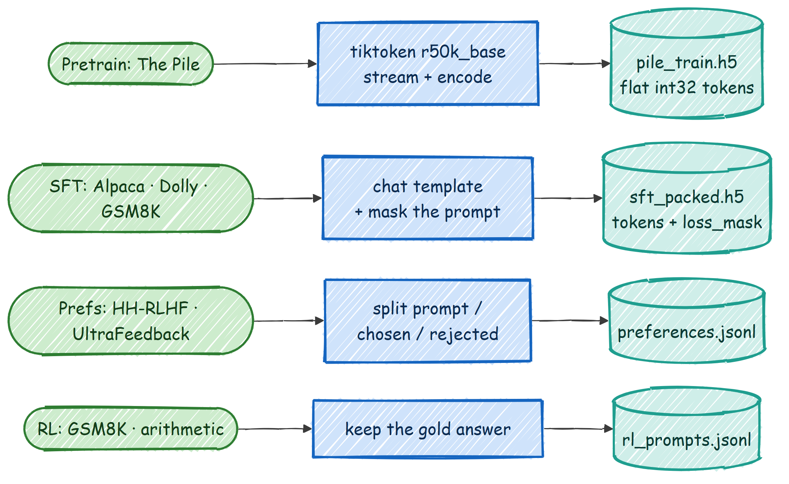

四个数据流分别是：

1. **预训练文本**，来自 [The Pile](https://huggingface.co/datasets/monology/pile-uncopyrighted)，以扁平的 token id 数组存储在 HDF5 文件中。
2. **指令数据**（Alpaca、Dolly、GSM8K），用于 SFT，打包成固定长度的行，并附带一个掩码来标识哪些 token 是助手的回答。
3. **偏好对**（Anthropic HH-RLHF、UltraFeedback），用于奖励模型和 DPO，存储为 `{prompt, chosen, rejected}`。
4. **RL 提示**（GSM8K 和一个简单的算术热身），用于 PPO 和 GRPO，存储为 `{prompt, gold}`。

### 分词（Tokenization）

我们使用 OpenAI `tiktoken` 中的 `r50k_base` 分词器，也就是 GPT-3 使用的那个。文本变成一个整数列表，我们在每个文档末尾追加一个特殊的 `<|endoftext|>` token（id 50256），这样模型就能学到一段文本在哪里结束、下一段从哪里开始。

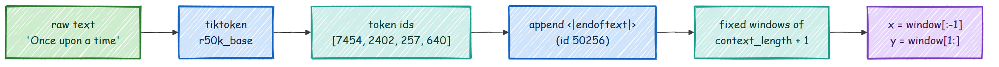

对于旧版路径，下载 The Pile 的一个分片并将其 tokenize 到 HDF5：

```bash
python scripts/data_download.py            # 下载验证文件 + 1 个训练分片
python scripts/data_preprocess.py          # tokenize 到 data/train/pile_train.h5 和 data/val/pile_dev.h5
```

更新的、更快的路径会以流式方式批量编码同样的数据，直接写入扁平 token 数组：

```bash
python scripts/prepare_pretrain_data.py --split val   --out data/pile_dev.h5
python scripts/prepare_pretrain_data.py --split train --num_shards 1 --out data/pile_train.h5
```

一旦完成 tokenize，数据就只是一长串整数。以下是对我为本 README 准备的验证文件（876 万个 token）的真实预览，展示了前十个 id 以及它们解码回的内容：

```python
#### 输出 ####
dtype: int32 | shape: (8762951,) | 总 token 数: 8762951
前 10 个 token id: [18610, 286, 3993, 3081, 319, 4088, 11, 4640, 2163, 11]
解码回文本:
'Effect of sleep quality on memory, executive function, and language
 performance in patients with refractory focal epilepsy ...'
```

这就是分词的全部思想：文本输入，扁平整数数组输出，整数可以直接解码回原始词语。

### 对话格式与损失掩码

在预训练之后的所有步骤中，模型需要知道谁在说话。`r50k_base` 分词器只有一个特殊 token，因此我们不发明新的特殊 token，而是使用纯文本角色标记，模型在 SFT 期间会自然地学习它们。单轮对话看起来像这样（见 `src/post_training/chat_template.py`）：

```
<|user|>
{用户内容}<|endoftext|><|assistant|>
{助手内容}<|endoftext|>
```

对于数学和推理任务，我们要求助手以固定结构展示其推理过程，因为后续强化学习的奖励会检查答案标签内的数字：

```
<think>逐步推理 ...</think><answer>42</answer>
```

关键的技巧是**损失掩码**。当我们编码一段对话时，还会构建一个 0/1 掩码，仅在助手 token（以及结束该轮的 `<|endoftext|>`）上为 1。这样 SFT 训练模型生成回答，而不是复述提示。以下是构建 id 和对齐掩码的精确代码：

```python
def encode_chat(messages, add_generation_prompt=False):
    ids, mask = [], []
    for m in messages:
        role = m["role"]
        # 角色头部始终被掩码遮蔽（我们从不训练模型输出它）。
        header_ids = _encode_ordinary(_header_for(role))
        ids.extend(header_ids)
        mask.extend([0] * len(header_ids))

        content_ids = _encode_ordinary(m["content"])
        is_completion = role == "assistant"
        ids.extend(content_ids)
        mask.extend([1 if is_completion else 0] * len(content_ids))   # 仅在助手内容上训练

        ids.append(EOT_ID)                                            # 轮次终止符
        mask.append(1 if is_completion else 0)                        # 学习停止
    return ids, mask
```

以下是一个真实渲染的对话和验证器奖励的实际效果，来自本仓库的输出：

```python
#### 输出 ####
渲染的对话:
<|user|>
What is 13 + 29?<|endoftext|><|assistant|>
<think>13 + 29 = 42</think><answer>42</answer><|endoftext|>

extract_answer("<answer>42</answer>")        -> 42.0
reward_gsm8k("<answer>42</answer>", 42.0)    -> 1.2    # 正确且格式良好
reward_gsm8k("<answer>7</answer>",  42.0)    -> 0.2    # 错误，但使用了格式
```

以下是一个真实的打包 SFT 数据行，展示了只有助手 token 被训练（在这一行的 512 个 token 中，掩码在 48 个 token 上为 1）：

```python
#### 输出 ####
tokens shape: (2131, 512) | loss_mask shape: (2131, 512)
第 0 行: 被训练（mask=1）的 token 数 = 48 / 512
第 0 行解码:
  <|user|>
  What is the world's oldest annual marathon based on the reference text below? ...
  <|assistant|>
  The Boston Marathon is the world's oldest annual marathon, beginning on April 19th 1897.
```

这些阶段的数据准备脚本如下：

```bash
python scripts/prepare_sft_data.py          # Alpaca + Dolly + GSM8K  -> sft_packed.h5
python scripts/prepare_preference_data.py   # HH-RLHF + UltraFeedback -> preferences.jsonl
python scripts/prepare_rl_prompts.py        # GSM8K + 算术             -> rl_prompts.jsonl
```

## 第二步：模型——由小部件构建

一个 Transformer 作为一整块代码看起来很吓人，所以我们用四个小部件来构建它，然后将它们堆叠起来。每个部件都是一个微型的 `nn.Module`。我们从最底层开始。

### 多层感知机（MLP）

MLP 是每个块中进行逐 token "思考"的部分。它接收每个 token 向量，将其扩展到四倍大小，应用 `ReLU`，然后压缩回原始大小。扩展为层提供了混合特征的空间，然后再投影回来。

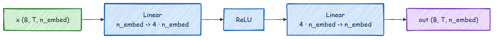

```python
class MLP(nn.Module):
    """一个简单的多层感知机，包含一个隐藏层。"""
    def __init__(self, n_embed):
        super().__init__()
        self.hidden = nn.Linear(n_embed, 4 * n_embed)   # 扩展到 4 倍
        self.relu = nn.ReLU()                           # 非线性激活
        self.proj = nn.Linear(4 * n_embed, n_embed)     # 投影回原始大小

    def forward(self, x):
        x = self.relu(self.hidden(x))
        x = self.proj(x)
        return x
```

`__init__` 设置了两个线性层和激活函数。`forward` 按顺序执行它们。输入和输出形状相同，都是 `(B, T, n_embed)`，因此块可以直接堆叠而无需任何形状变换。代码位于 `src/models/mlp.py`。

### 单头注意力

注意力是让 token 能够查看其他 token 的部分。每个头构建输入的三个视图：query（我在寻找什么）、key（我包含什么）和 value（如果被选中我将传递什么）。我们将每个 query 与每个 key 打分，缩放分数，用因果掩码隐藏未来位置，通过 softmax 将分数转化为权重，然后对 value 进行加权求和。

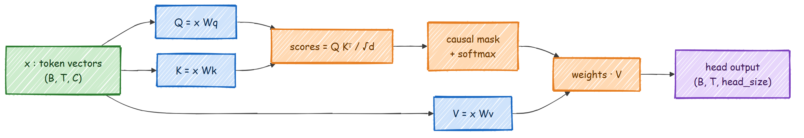

```python
class Head(nn.Module):
    """带有因果掩码的单头注意力。"""
    def __init__(self, head_size, n_embed, context_length):
        super().__init__()
        self.key   = nn.Linear(n_embed, head_size, bias=False)
        self.query = nn.Linear(n_embed, head_size, bias=False)
        self.value = nn.Linear(n_embed, head_size, bias=False)
        # 下三角矩阵，用于遮蔽未来位置
        self.register_buffer('tril', torch.tril(torch.ones(context_length, context_length)))

    def forward(self, x):
        B, T, C = x.shape
        k = self.key(x)
        q = self.query(x)
        scale_factor = 1 / math.sqrt(C)
        attn_weights = q @ k.transpose(-2, -1) * scale_factor          # (B, T, T) 分数
        attn_weights = attn_weights.masked_fill(self.tril[:T, :T] == 0, float('-inf'))  # 禁止偷看未来
        attn_weights = F.softmax(attn_weights, dim=-1)
        v = self.value(x)
        out = attn_weights @ v                                         # value 的加权求和
        return out
```

因果掩码是使其成为语言模型的关键：位置 `t` 只能关注位置 `0..t`，永远不能看到它试图预测的未来。代码位于 `src/models/attention.py`。

### 多头注意力

一个头学习一种关系。我们想要多个头并行运行，这样模型可以同时追踪多种模式（例如，一个代词和它所指代的名词）。我们运行 `n_head` 个头，拼接它们的输出，然后通过一个额外的线性层。

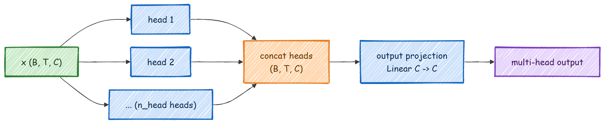

```python
class MultiHeadAttention(nn.Module):
    def __init__(self, n_head, n_embed, context_length):
        super().__init__()
        self.heads = nn.ModuleList(
            [Head(n_embed // n_head, n_embed, context_length) for _ in range(n_head)]
        )
        self.proj = nn.Linear(n_embed, n_embed)   # 将各个头的输出混合在一起

    def forward(self, x):
        x = torch.cat([h(x) for h in self.heads], dim=-1)   # 沿特征维度拼接
        x = self.proj(x)
        return x
```

每个头在一个大小为 `n_embed // n_head` 的较小子空间中工作，因此拼接后恰好回到 `n_embed`。最终的投影让各个头之间能够相互通信。

### Transformer 块

现在我们将注意力和 MLP 组合成一个块。该块使用预归一化残差连接：我们先归一化，运行子层，然后将结果加回输入。"加回"（残差）使得梯度能够流经深层堆叠而不会消失。

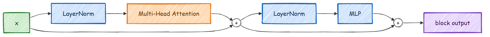

```python
class Block(nn.Module):
    def __init__(self, n_head, n_embed, context_length):
        super().__init__()
        self.ln1 = nn.LayerNorm(n_embed)
        self.attn = MultiHeadAttention(n_head, n_embed, context_length)
        self.ln2 = nn.LayerNorm(n_embed)
        self.mlp = MLP(n_embed)

    def forward(self, x):
        x = x + self.attn(self.ln1(x))   # 注意力子层 + 残差
        x = x + self.mlp(self.ln2(x))    # MLP 子层 + 残差
        return x
```

将 `x = x + self.attn(self.ln1(x))` 理解为"查看其他 token，然后将学到的东西加回自身"。MLP 那行是同样的思想，用于逐 token 的思考。代码位于 `src/models/transformer_block.py`。

### 完整的 Transformer

最后我们封装所有内容。Token id 通过嵌入表变成向量，我们加上位置嵌入让模型知道 token 的顺序，运行块堆叠，做最后一次归一化，然后投影到词汇表大小的分数（称为 logits）。如果传入了目标，模型还会返回交叉熵损失。

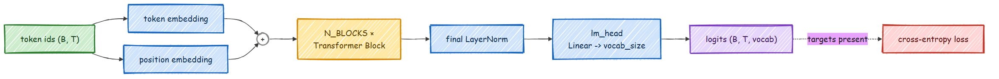

```python
class Transformer(nn.Module):
    def __init__(self, n_head, n_embed, context_length, vocab_size, N_BLOCKS):
        super().__init__()
        self.token_embed = nn.Embedding(vocab_size, n_embed)
        self.position_embed = nn.Embedding(context_length, n_embed)
        self.attn_blocks = nn.ModuleList(
            [Block(n_head, n_embed, context_length) for _ in range(N_BLOCKS)]
        )
        self.layer_norm = nn.LayerNorm(n_embed)
        self.lm_head = nn.Linear(n_embed, vocab_size)
        self.register_buffer('pos_idxs', torch.arange(context_length))

    def forward(self, idx, targets=None):
        x = self.forward_hidden(idx)        # token + 位置嵌入，然后块 + 最终归一化
        logits = self.lm_head(x)            # (B, T, vocab_size)
        loss = None
        if targets is not None:
            B, T, C = logits.shape
            # 使用 reshape 而非 view：目标切片不是连续的，.view() 在 CPU 上会失败
            flat_logits = logits.reshape(B * T, C)
            targets = targets.reshape(B * T).long()
            loss = F.cross_entropy(flat_logits, targets)
        return logits, loss
```

一个值得指出的小细节：我们在目标上使用 `.reshape` 而非 `.view`。目标批次是数据的一个非连续切片，`.view` 在 CPU 上会拒绝处理。`.reshape` 两种情况都能处理，其他方面完全相同。完整模型，包括 `forward_hidden`（后续奖励头和值头会复用它）以及 `generate`，位于 `src/models/transformer.py`。

当我们构建模型时，它会打印参数数量。以下是本仓库使用的三种规模：

```python
#### 输出 ####
13M 小配置 (n_embed=128, n_head=8, n_blocks=1):      13,142,656 参数
本教程的基础模型 (n_embed=512, n_head=8, n_blocks=8):  77,031,552 参数
后训练默认配置 (n_embed=1024, n_head=16, n_blocks=24): 406,359,168 参数
```

## 第三步：预训练基础模型

预训练是最耗时的环节。我们读取随机的 token 窗口，要求模型在每个位置预测下一个 token，用交叉熵衡量它错得有多离谱，然后微调权重。我们重复这个过程几千次。

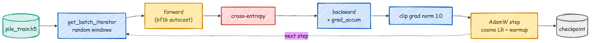

最简单的版本是原始的 `scripts/train_transformer.py`，它读取 `config/config.py` 并在单 GPU 上训练。要训练 1300 万参数的模型，在 `config/config.py` 中设置以下值：

```python
VOCAB_SIZE = 50304
CONTEXT_LENGTH = 128
N_EMBED = 128
N_HEAD = 8
N_BLOCKS = 1
```

然后运行：

```bash
python scripts/train_transformer.py
```

对于长时间运行，你可以保存周期性检查点并在中断后恢复：

```bash
python scripts/train_transformer.py --checkpoint-every 1000 --keep-last 3
python scripts/train_transformer.py --resume latest
```

如果更大的配置内存不足，可以开启可选的内存优化选项（默认全部关闭，因此默认行为永远不会改变）：

```bash
python scripts/train_transformer.py --amp --grad-checkpointing --grad-accum 8
```

更大的、现代化的路径是 `scripts/pretrain_base.py`。它是相同的方案，但加入了训练中等规模基础模型所需的功能：跨 GPU 的 DistributedDataParallel、bf16 自动混合精度、梯度累积、带预热的余弦学习率调度，以及周期性检查点。单 GPU 或多 GPU，命令格式相同：

```bash
# 单 GPU
python scripts/pretrain_base.py
# 双 GPU
torchrun --standalone --nproc_per_node=2 scripts/pretrain_base.py
```

循环的核心很简洁。每一步拉取一个批次，在 bf16 下运行前向传播，按梯度累积缩放损失，反向传播，裁剪梯度，然后更新优化器：

```python
for micro in range(cfg.grad_accum):
    xb, yb = next(batch_iter)
    with amp_autocast(cfg.amp_dtype, ctx.device):
        _, loss = model(xb, yb)
        loss = loss / cfg.grad_accum       # 使累积后的梯度为全批次的均值
    loss.backward()
torch.nn.utils.clip_grad_norm_(model.parameters(), cfg.grad_clip)
optimizer.step()
```

训练过程中会打印步数、损失、学习率和吞吐量，在评估时还会打印开发集损失和 GPU 峰值内存：

```
#### 输出 ####
模型参数: 77,031,552 (~77M) | world_size=2
有效批次 = 24*4*2 = 192 序列/步
step 0    | loss 11.1393 | lr 7.50e-06 | 0 tok/s
step 20   | loss 8.6159  | lr 1.57e-04 | 148,936 tok/s
step 100  | loss 6.3108  | lr 6.00e-04 | 150,609 tok/s
  [eval] step 100  | train 6.2501 | dev 6.1745
step 500  | loss 4.5317  | lr 5.39e-04 | 137,334 tok/s
  [eval] step 500  | train 4.7066 | dev 4.6499
step 1000 | loss 4.0100  | lr 3.48e-04 | 131,348 tok/s
  [eval] step 1000 | train 4.1200 | dev 4.1419
step 1500 | loss 3.6483  | lr 1.45e-04 | 123,781 tok/s
  [eval] step 1500 | train 3.8393 | dev 3.8985
step 1900 | loss 3.7725  | lr 6.36e-05 | 151,488 tok/s
  [eval] step 1900 | train 3.7345 | dev 3.7607
完成。最终检查点 -> /ephemeral/ckpts/base_pretrained.pt
```

### 损失曲线

以下是我为本 README 在 2 块 L40 GPU 上训练的 7700 万参数基础模型的真实训练和开发集损失。损失起始于 `ln(vocab_size)` 附近，约为 10.8（即均匀猜测的模型的损失），随着模型学习文本的统计规律而下降：

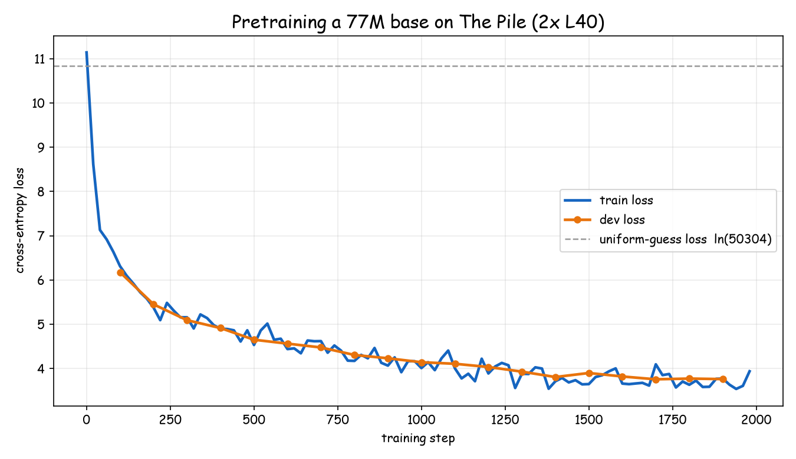

这次运行起始损失为 **11.14**（略高于均匀猜测线 `ln(50304) = 10.83`），在 2000 步后降至约 **3.73 训练集 / 3.76 开发集**，在两块 L40 上以大约 **130,000 到 150,000 token 每秒**的速度训练。下降的曲线就是预训练的全部故事：模型正在缓慢地将语言的模式压缩到其权重中。

## 第四步：生成文本

训练好的模型预测下一个 token 的分布。要生成文本，我们从该分布中采样一个 token，将其追加，然后把更长的序列重新输入。我们重复这个过程直到获得足够多的 token。

```python
def generate(self, idx, max_new_tokens):
    for _ in range(max_new_tokens):
        idx_cond = idx[:, -self.context_length:]    # 永远不超过上下文窗口
        logits, _ = self(idx_cond)
        logits = logits[:, -1, :]                   # 只有最后一个位置对下一个 token 有意义
        probs = F.softmax(logits, dim=-1)
        idx_next = torch.multinomial(probs, num_samples=1)
        idx = torch.cat((idx, idx_next), dim=1)
    return idx
```

从保存的检查点运行：

```bash
python scripts/generate_text.py --model_path models/transformer_B.pt --input_text "The" --max_new_tokens 100
```

1300 万参数的模型已经能生成真实的词语和大致正确的语法，这是从小规模起步令人鼓舞的地方。

## 第五步：后训练——将基础模型变成助手

基础模型能够续写文本，但它无法遵循指令或有意识地进行推理。这需要后训练。好消息是模型本身不会改变。我们在每个阶段复用完全相同的 Transformer 骨干网络，只改变两件事：数据和损失函数。


使所有这些适合一个小仓库的核心设计理念是**封装，而非重写**。教学用的 `Transformer` 增加了一个额外的方法 `forward_hidden`，它返回 `lm_head` 之前的隐藏状态。奖励头、值头以及所有对数概率计算都围绕这个方法组合。`src/models/` 中的代码无需任何重写。

### SFT（监督微调）

SFT 教基础模型以对话格式回答。它仍然是下一 token 预测，只有一个变化：损失仅在助手 token 上计算，使用我们在第一步中构建的掩码。

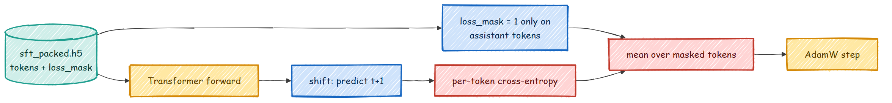

```python
def sft_loss(logits, tokens, loss_mask):
    logits = logits[:, :-1, :]        # 从位置 t 预测 token t+1
    targets = tokens[:, 1:]
    mask = loss_mask[:, 1:].to(logits.dtype)

    V = logits.size(-1)
    ce = F.cross_entropy(logits.reshape(-1, V).float(), targets.reshape(-1).long(), reduction="none")
    ce = ce.view(targets.shape) * mask          # 将提示位置的损失置零
    return ce.sum() / mask.sum().clamp(min=1.0) # 仅在助手 token 上求平均
```

准备数据并训练：

```bash
python scripts/prepare_sft_data.py --context_length 1024
torchrun --standalone --nproc_per_node=2 scripts/train_sft.py
```

损失代码位于 `src/post_training/sft.py`，训练器位于 `scripts/train_sft.py`。

### 奖励模型

要进行强化学习，我们需要一个数值来表示回答的好坏。获得它的一种方法是在人类偏好对上训练一个奖励模型。我们在 SFT 骨干网络顶部添加一个小型线性头，从最后一个实际 token 读取一个标量，然后用 Bradley-Terry 损失训练它，使被选中的回答始终比被拒绝的回答得分更高。

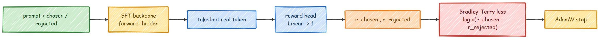

```python
def bradley_terry_loss(chosen_rewards, rejected_rewards):
    """对一批偏好对求 -log sigmoid(chosen - rejected) 的均值。"""
    return -F.logsigmoid(chosen_rewards - rejected_rewards).mean()
```

```bash
python scripts/prepare_preference_data.py --source both
torchrun --standalone --nproc_per_node=2 scripts/train_reward.py
```

核心指标是偏好准确率，即在留出的偏好对中模型给选中回答更高分的比例。在这次使用 7974 个真实偏好对的运行中，准确率达到了 **0.574**（高于 0.5 的随机线）；使用更大的模型和更多数据，这个值可以攀升到 0.65 至 0.75。

```
#### 输出 ####
从 sft.pt 构建奖励模型 | 7974 对 | total_steps=996
  [eval] step 250 | test_acc 0.539 | margin 0.006
  [eval] step 750 | test_acc 0.576 | margin 0.063
完成 RM。test_acc 0.574 margin 0.063 -> reward.pt
```

代码位于 `src/post_training/reward_model.py` 和 `src/post_training/reward_train.py`。

### DPO、ORPO 和 KTO

DPO 完全跳过了奖励模型和 RL 循环。它直接在偏好对上工作，比较策略模型使选中回答比被拒绝回答更可能的程度（相对于冻结的 SFT 模型参考副本）。

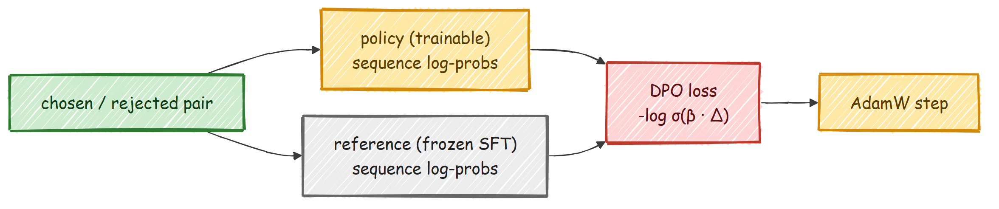

```python
def dpo_loss(policy_chosen_logps, policy_rejected_logps,
             ref_chosen_logps, ref_rejected_logps, beta=0.1):
    pi_logratios = policy_chosen_logps - policy_rejected_logps
    ref_logratios = ref_chosen_logps - ref_rejected_logps
    logits = pi_logratios - ref_logratios
    loss = -F.logsigmoid(beta * logits).mean()
    return loss, ...
```

```bash
torchrun --standalone --nproc_per_node=2 scripts/train_dpo.py --loss_type dpo
#   --loss_type orpo   无需参考模型，将 SFT 和对齐合并为一个阶段
#   --loss_type kto    使用未配对的正面/负面信号
```

在这次运行中，DPO 在留出偏好对上的隐式奖励准确率达到了 **0.574**（策略模型比冻结参考模型更偏好选中回答的比例）。三种目标函数都在 `src/post_training/dpo.py` 中。

### PPO

PPO 是经典的 RLHF 循环。对于每个提示，模型生成一个回答（一次 rollout），我们对其打分（使用奖励模型或 GSM8K 答案检查器），加上一个小的逐 token 惩罚以防止偏离参考模型太远，用 GAE 估计每个 token 的好坏，然后进行几步裁剪的梯度更新。

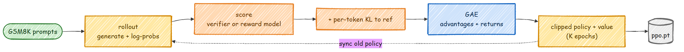

两个关键部分——优势估计和裁剪策略损失——很简洁：

```python
def ppo_policy_loss(new_logp, old_logp, advantages, mask, clip=0.2):
    ratio = torch.exp(new_logp - old_logp)
    surr1 = ratio * advantages
    surr2 = torch.clamp(ratio, 1.0 - clip, 1.0 + clip) * advantages   # 裁剪使步长保持较小
    loss = -masked_mean(torch.min(surr1, surr2), mask)
    return loss, ...
```

```bash
python scripts/prepare_rl_prompts.py
torchrun --standalone --nproc_per_node=2 scripts/train_ppo.py --reward_source verifier
#   --reward_source rm   使用训练好的奖励模型而非答案检查器
```

演员-评论家架构通过一个小型值头（`src/post_training/value_head.py`）共享骨干网络，GAE、裁剪策略损失和裁剪值损失位于 `src/post_training/ppo.py`。

### GRPO / RLVR

GRPO 是 2025 年 DeepSeek-R1 风格的方法。它抛弃了值网络。对于每个提示，它采样一整组回答，用可验证的奖励（最终数字是否匹配正确答案）打分，并使用该组自身的均值和标准差作为基线。一个回答的优势就是它比同组其他回答好多少。

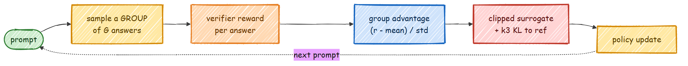

```python
def group_advantages(rewards, group_size, eps=1e-4):
    r = rewards.view(-1, group_size)
    mean = r.mean(dim=1, keepdim=True)
    std = r.std(dim=1, keepdim=True)
    adv = (r - mean) / (std + eps)     # 比同组其他回答好多少
    return adv.reshape(-1)
```

```bash
torchrun --standalone --nproc_per_node=2 scripts/train_grpo.py --group_size 8
```

一个简短的算术课程先运行，这样模型在面对完整的 GSM8K 之前能获得一些非零奖励来学习。组相对优势、裁剪代理目标和 k3 KL 惩罚位于 `src/post_training/grpo.py`。

## 第六步：评估

将所有阶段联系在一起的单一指标是贪心 GSM8K 准确率。我们给模型一道数学题，让它生成回答，从 `<answer>` 标签中提取数字，然后与正确答案比对。

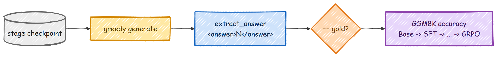

```bash
for s in base_pretrained sft dpo ppo grpo; do
  python scripts/eval_post_training.py --ckpt models/$s.pt --label $s --limit 200 --append logs/table.jsonl
done
python scripts/eval_post_training.py --table logs/table.jsonl
```

这会构建核心对比，让你可以在一个维度上追踪每个阶段——基础模型、SFT、DPO、PPO 和 GRPO——全部使用相同的贪心解码和相同的可验证奖励：解析 `<answer>` 标签内的数字并与正确答案比对。同样的命令可以在任何检查点上运行，因此你可以为自己的运行填充表格，基础模型越大、预训练算力越多，这些分数就越高。

### SFT 之后的变化

SFT 最显著的效果是行为的变化。基础模型只知道如何续写文本，所以当你给它一个问题时，它只是写更多文本。经过 SFT 后，模型学会了对话格式：它在其训练过的 `<think>...</think><answer>...</answer>` 结构中回答，这正是奖励模型和 RL 阶段随后优化的结构。这种学到的格式是后续每个阶段构建的基础。你可以用 `scripts/chat.py` 与任何阶段的检查点对话并直接观察这一点，这就是下一节的内容。

## 第七步：与模型对话

`scripts/chat.py` 加载任何检查点，从检查点本身读取模型维度，并让你与它对话。它对指令模型应用对话模板，或对基础模型进行原始续写。

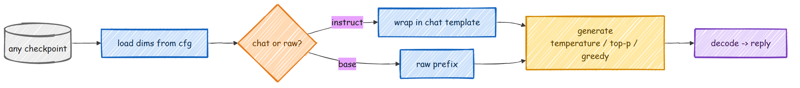

```bash
# 指令微调模型
python scripts/chat.py --ckpt models/sft.pt --prompt "What is 13 + 29?"
python scripts/chat.py --ckpt models/grpo.pt --prompt "..." --greedy
# 基础模型，原始续写
python scripts/chat.py --ckpt models/base_pretrained.pt --raw --prompt "Once upon a time"
# 交互模式，不指定 --prompt
python scripts/chat.py --ckpt models/sft.pt
```

生成复用了与训练和评估相同的经过测试的核心，因此你在对话中看到的正是 RL 阶段优化的内容。采样由 `--temperature`、`--top_p`、`--top_k` 或 `--greedy` 控制。代码位于 `src/post_training/inference.py`。

## Streamlit 控制面板

如果你更愿意点击而不是输入，这里有一个小型控制面板，可以启动每个阶段、实时观察损失、运行评估以及与检查点对话：

```bash
pip install -e ".[ui]"
streamlit run ui/app.py
```

每个阶段有一个页面（数据、预训练、SFT、奖励模型、DPO、PPO、GRPO、评估、对话），每个页面都是一个表单，基于与你手动编辑相同的 JSON 配置。

## 文档网站

每个阶段都有更详细的说明，包括理论、图示、实际代码以及每个指标的含义，都在文档网站上：

**https://fareedkhan-dev.github.io/train-llm-from-scratch/**

在本地运行：

```bash
pip install -e ".[docs]"
mkdocs serve
```

还有一个基础部分，解释了本代码假设你已了解的概念（分词、仅解码器 Transformer、注意力、目标函数、优化和生成）。

## 运行完整流程

一旦基础模型预训练完成且数据准备就绪，一个脚本就能运行整个后训练链并打印跨阶段对比表：

```bash
bash scripts/run_posttraining.sh            # 通过 torchrun 使用双 GPU
NPROC=1 bash scripts/run_posttraining.sh    # 单 GPU
```

要快速进行端到端检查（几秒钟内完成的小型模型），每个阶段都有 smoke 配置：

```bash
python tests/test_post_training_smoke.py                          # 核心数学运算，在 CPU 上
python scripts/train_sft.py --config configs/smoke/sft.json       # 一个真实的（微型）训练运行
```

## 下一步

我建议你先从训练 1300 万参数的模型开始，看它生成有意义的词语，然后配合内存优化标志逐步增大 `n_embed` 和 `n_blocks`，直到达到你的 GPU 极限。之后，逐个阶段走完后训练链，观察 GSM8K 数字的变化。每个阶段都足够小，可以一次读完，而且它们共享同一个模型。

如果你想深入了解任何单个阶段，文档网站为每个阶段都有专门的页面。

<hr>

想聊聊什么？[我的 LinkedIn](https://www.linkedin.com/in/fareed-khan-dev/)

## Star 历史

[](https://star-history.com/#FareedKhan-dev/train-llm-from-scratch&Date)
