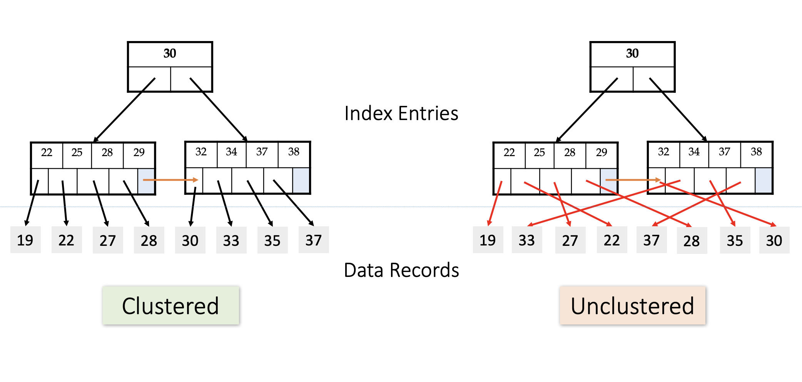

[首页](https://eraft.cn)  ｜ [UHP-SQL 文档](https://eraft.cn/uhp_sql)  ｜   [博客](https://eraft.cn/blogs)   ｜   [数据库研究](https://eraft.cn/database_theory) 

## LEC10-1-数据库排序

### 为什么需要排序

因为在关系模型中，表中的元组(tuple)数据并没有特定的顺序，通常 ORDER BY, GROUP BY, JOIN, DISTINCT 操作是需要依赖排序实现的。

### 使用 B+ 树索引？

通过从左到右扫描叶节点，我们可以使用一个聚簇B+树索引（clustered B+ tree）来加速排序。
但是如果我们使用非聚簇B+树索引unclustered B+ tree）去排序，将会导致大量的磁盘 IO 读取（需要大量的随机访问，
通过叶子节点上的指针找数据，非顺序，随机的 IO）

### 聚簇索引和非聚簇索引

聚簇索引
- 优点：提高数据访问性能
- 缺点：维护索引很昂贵（插入新行，或者主键被更新导致 page split）

### 如何做排序

如果我们需要的数据都在内存里面，那么 DBMS 可以使用标准的排序算法（例如，quicksort）。
如果数据没有在内存里面，那么 DBMS 需要使用到外部排序（external sort），这时候 DBMS 
根据需要溢出数据到磁盘，这样做是顺序的 IO 而不是随机 IO。
