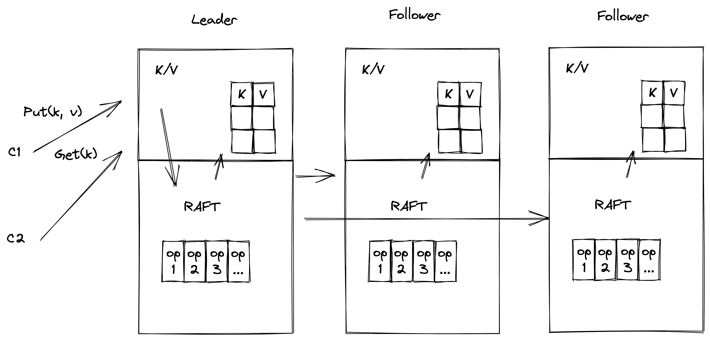
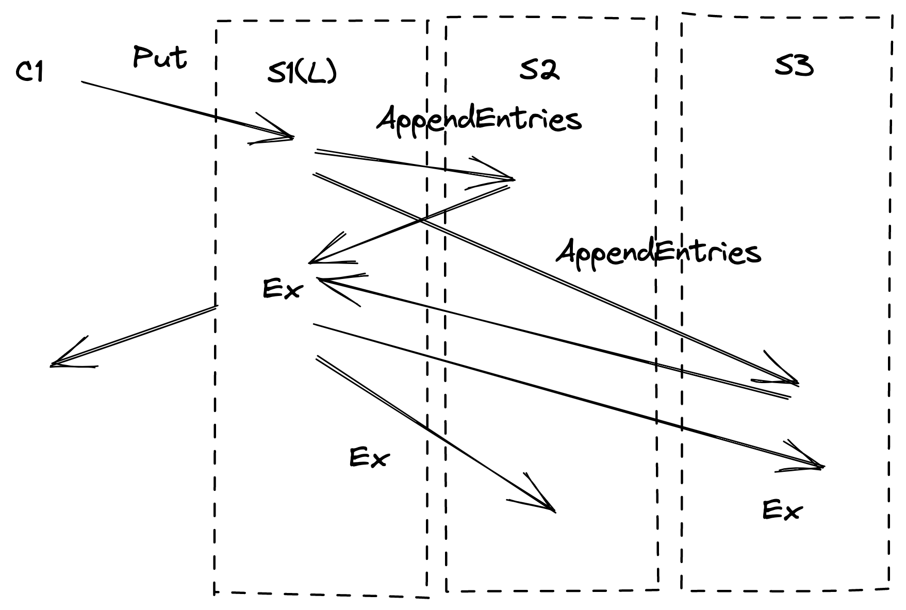

# 第五讲

a pattern in the fault-tolerant systems we've seen

我们之前课程见过了容错系统的的模式

- MR replicates computation but relies on a single master to organize

MR 操作复制计算给 worker 指定，但是它依赖于单个主节点来组织

- GFS replicates data but relies on the master to pick primaries

GFS 复制了数据容错，但是它依赖 master 节点来选择主服务

- VMware FT replicates service but relies on test-and-set to pick primary

VMware FT 复制了服务但是依赖于 test-and-set 来选出主服务

all rely on a single entity to make critical decisions

以上所有的系统都依赖一个节点去做出关键决策

nice: decisions by a single entity avoid split brain

优点：单个节点的决策避免了脑裂

it's easy to make a single entity always agree with itself

单个节点很容易与自己保持一致

how can we make e.g. a fault-tolerant test-and-set service?

我们如何设计一个容错的 test-and-set 服务呢？

we need replication
我们需要做复制
how about two servers, S1 and S2
if both are up, S1 is in charge, forwards decisions to S2

有 S1 和 S2 两个服务, 如果它们都在线，S1 管理请求，并转发给 S2

if S2 sees S1 is down, S2 takes over as sole test-and-set server
what could go wrong?

如果 S2 发现 S1 已关闭，则 S2 接管作为 test-and-set 服务，会出现什么问题呢？

network partition! split brain!

网络分区！ 脑裂！

### 1.the problem: computers cannot distinguish "server crashed" from "network broken"

问题：计算机无法区分 “服务器崩溃” 和 “网络中断”

the symptom is the same: no response to a query over the network
症状是一样的：对网络上的查询没有响应

this difficulty seemed insurmountable for a long time
这个难点在很长的一段时间内似乎没法解决

seemed to require outside agent (a human) to decide when to switch servers
需要人肉来决定什么时候切换服务器

we'd prefer an automated scheme!
当然，我们更喜欢自动化的方案

the big insight for coping w/ partition: majority vote have an odd number of servers, e.g. 3

应对网络分区的重要解决方案：使用多数派选举协议，集群有奇数个节点，一般为 3 个

agreement from a majority is required to do anything -- 2 out of 3 if no majority, wait

做任何决策都需要获得多数人的同意 -- 如果没有多数人同意，例如 3 节点里面 < 2 票，那么得等待，不能提交这个决策

why does majority help avoid split brain?

为什么多数派选举协议可以帮助避免脑裂出现呢？

at most one partition can have a majority breaks the symmetry we saw with just two servers

最多一个分组可以拥有多数，这打破了我们在两台服务器上看到的对称性

note: majority is out of all servers, not just out of live ones

注意：这里的大多数指定是在配置的所有服务器中，而不仅仅是当前还在线的服务器数

note: proceed after acquiring majority don't wait for more since they may be dead

注意：获得多数节点的同意后不需要再等待其他的节点，因为它们可能因为故障已经死了，没法恢复。

more generally 2f+1 can tolerate f failed servers
更通俗的来说，一般 2f+1 个服务节点可以容忍 f 个失败的服务节点

since the remaining f+1 is a majority of 2f+1

if more than f fail (or can't be contacted), no progress

如果超过 f 个失败（或者不能联系到），进展会被阻塞

often called "quorum" systems

这也通常被叫做仲裁系统

a key property of majorities is that any two intersect servers in the intersection can convey information about previous decisions e.g. another Raft leader has already been elected for this term

Two partition-tolerant replication schemes were invented around 1990,
1990 年左右发明了两种分区容错的复制方案

Paxos and View-Stamped Replication

called "consensus" or "agreement" protocols
叫做 “共识协议”

in the last 15 years this technology has seen a lot of real-world use
在过去的 15 年里，这项技术在现实世界中得到了广泛的应用

the Raft paper is a good introduction to modern techniques
Raft 论文很好的介绍了现代的技术

Raft overview

#### Raft 概述

state machine replication with Raft -- Lab 3 as example: Raft is a library included in each replica

使用 raft 进行状态机复制，raft 作为算法库包含在每一个副本中

1.client sends Put/Get "command" to k/v layer in leader
客户端发送 Put/Get 请求到 leader 的 k/v 层

2.leader sends AppendEntries RPCs to followers
leader 发送 AppendEntries rpc 给 follower

3.followers add command to log
follower 添加命令到日志中

4.leader waits for replies from a bare majority (including itself)
leader 等待多数节点成功复制（当然包括他自己）

5.entry is "committed" if a majority put it in their logs
多数节点复制好之后, 日志条目被提交

committed means won't be forgotten even if failures
提交了意味着就算遇到故障失败，这个提案也不会丢失

majority -> will be seen by the next leader's vote requests

6.leader executes command, replies to client
leader 执行命令，回复客户端

7.leader "piggybacks" commit info in next AppendEntries
leader 将 commit 信息带在下一次 AppendEntries(注意心跳也是一个 apppendEntires, 可以在下一次心跳的时候带过去) 请求中通知到 follower 们

8.followers execute entry once leader says it's committed
一旦 leader 说日志提交了，follower 们就会执行日志条目李曼的操作

#### why the logs?
为什么需要日志

the service keeps the state machine state, e.g. key/value DB
服务需要保持状态机的状态，例如: 键/值 数据库系统

the log is an alternate representation of the same information!
日志用来表示操作

why both?

the log orders the commands
日志可以维护命令的排序

to help replicas agree on a single execution order
可以帮助副本就操作执行顺序达成一致

to help the leader ensure followers have identical logs
可以帮助 leader 确保 followers 有相同的日志

the log stores tentative commands until committed
日志存储的临时的命令序列直到提交

the log stores commands in case leader must re-send to followers
日志存储了命令，以防 leader 需要重新发送给 followers

the log stores commands persistently for replay after reboot
日志会持久化存储命令，以防机器重启的时候重放

应用层接口设计

Lab2 描述... 这里关联 eraft 接口介绍

there are two main parts to Raft's design:
Raft 设计中有两个重要的

electing a new leader
选举出一个 leader

ensuring identical logs despite failures
就算遇到失败也要确保日志完全一致

leader election 

#### why a leader?
ensures all replicas execute the same commands, in the same order
确保所有的副本以相同的顺序执行相同的命令

(some designs, e.g. Paxos, don't have a leader)
有些设计，例如 paxos 不止有一个 leader

Raft numbers the sequence of leaders
对 leader 的顺序进行编号

new leader -> new term
任期号反映了 leader 的新旧

a term has at most one leader; might have no leader
一个任期最多只有一个 leader; 也可能没有 leader

the numbering helps servers follow latest leader, not superseded leader
这个编号 （term）有助于帮助服务器跟随最新的 leader，而不是已经被取代的旧 leader

when does a Raft peer start a leader election?
什么时候开始 raft 节点开始一轮新的 leader 选举

when it doesn't hear from current leader for an "election timeout"
当它在一个选举超时时间内没有听到现任 leader 的心跳，follower 收到心跳后会重设选举超时时间

increments local currentTerm, tries to collect votes
递增本地的任期号，尝试收集投票

note: this can lead to un-needed elections; that's slow but safe
注意: 这可能导致不必要的选举，它很慢，但是很安全

note: old leader may still be alive and think it is the leader
注意：可能出现老的 leader 还活着，并且认为自己是领导的情况

#### how to ensure at most one leader in a term?
如何确保在一个任期中最多只有一个 leader

leader must get "yes" votes from a majority of servers
leader 必须收到大多数服务器的同意投票响应

each server can cast only one vote per term
每个服务器在每个任期内只能投出一票

if candidate, votes for itself
如果是候选人状态，给自己投票

if not a candidate, votes for first that asks 
？？

at most one server can get majority of votes for a given term
在一个任期里面最多有一个服务可以获取大多数选票

-> at most one leader even if network partition
就算出现网络分区，也只能出现一个 leader

-> election can succeed even if some servers have failed
即使某些服务器故障，选举也能成功

note: again, majority is out of all servers (not just the live servers)
注意：再次重申一遍，多数派选举是的总数是所有服务的数量，挂了的也算，不能仅仅算活着的服务

#### how does a server learn about a newly elected leader?
一个服务怎么知道一个新的 leader 被选出来了

the leader sends out AppendEntries heart-beats 
leader 通过 AppendEntries 发送心跳

with the new higher term number
并且有更高的任期号（例如网络恢复的情况下，如果收心跳的节点自己的任期号比收到心跳节点的第，它就知道那是一个更新的 leader）

only the leader sends AppendEntries
只有 leader 可以发送 AppendEntries

only one leader per term
一个任期内只能有一个 leader

so if you see AppendEntries with term T, you know who the leader for T is the heart-beats suppress any new election
如果你在任期 T 内看到了 AppendEntries，你就知道谁是 leader 并且通过心跳抑制新的选举

leader must send heart-beats more often than the election timeout
leader 必须在选举超时触发之前发出心跳的声音

an election may not succeed for two reasons:
选举可能不成功的原因

less than a majority of servers are reachable
多数派的服务器网络不可达，或者挂了

simultaneous candidates split the vote, none gets majority
出现了同时参选的人得到相同票数的情况，没人或者多数选票

#### what happens if an election doesn't succeed?
如果选举没有成功，会发生什么？

no heartbeats -> another timeout -> a new election for a new term
没有心跳 -> 下一次超时到达 -> 新任期内的一次新的选举

higher term takes precedence, candidates for older terms quit
更高任期的优先，旧任期的候选人退出

without special care, elections will often fail due to split vote
如果没有特别注意，选举往往会因为选票分割而失败

all election timers likely to go off at around the same time
所有的选举超时器都可能在同一个时间点关闭

every candidate votes for itself
每个候选人为自己投票

so no-one will vote for anyone else!
所以没有人会投票给其他人

so everyone will get exactly one vote, no-one will have a majority
所以每个人都会获得一个选票，没人拥有多数派选票

#### how does Raft avoid split votes?
raft 如何避免选票分割的情况

each server adds some randomness to its election timeout period
每个服务器周期的为自己的选举超时时间添加一些随机性

randomness breaks symmetry among the servers
随机性打破了服务器之前的对称性

one will choose lowest random delay
我们将选中最小的随机延迟

hopefully enough time to elect before next timeout expires others will see new leader's AppendEntries heartbeats and not become candidates

希望有足够的时间在下一次超时时间到来之前进行选举，其他人将看到 leader 的心跳，而不是称为候选人，再次进入选举

randomized delays are a common pattern in network protocols
随机的延迟是网络协议中一种常见的模式

#### how to choose the election timeout?
如何选取一个选举超市时间？

* at least a few heartbeat intervals (in case network drops a heartbeat) to avoid needless elections, which waste time
这个时间内至少有多个心跳间隔（以防网络中断心跳，比如网络闪断），来避免必要的选举浪费时间

* random part long enough to let one candidate succeed before next starts
随机的时长足以让下一个候选人成功选举

* short enough to react quickly to failure, avoid long pauses
短的租后快速的响应失败，避免长时间不可用

* short enough to allow a few re-tries before tester gets upset tester requires election to complete in 5 seconds or less

what if old leader isn't aware a new leader is elected?
如果老的 leader 不知道新的 leader 已经被选出来了怎么办？

perhaps old leader didn't see election messages

perhaps old leader is in a minority network partition

也许旧的 leader 因为网络分区没有收到消息，它在一个小的分区内（拥有少数节点）

new leader means a majority of servers have incremented currentTerm
新的 leader出现 意味着大多数服务器都增加了 currentTerm

either old leader will see new term in a AppendEntries reply and step down
任何一个老的 leader 都会在收到一个新任期的 append entries 后辞职，成为新任期的 follower

or old leader won't be able to get a majority of replies
否则老的 leader 没法获得多数的恢复

so old leader won't commit or execute any new log entries thus no split brain
所以老的 leader 不会提交或者执行任何新的日志，因此不会有脑裂的情况

but a minority may accept old server's AppendEntries
但是少数的节点可能收到老 leader 的 AppendEntries 请求

so logs may diverge at end of old term
所以在旧任期结束的时候，日志可能出现分歧

