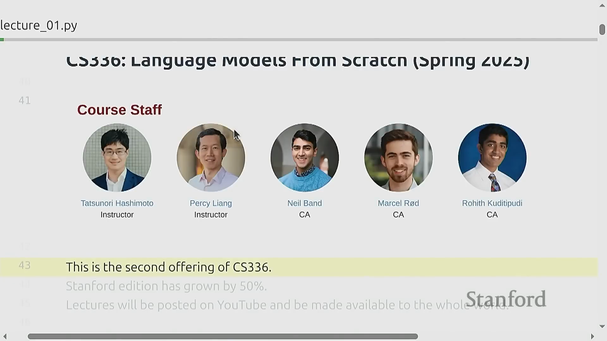
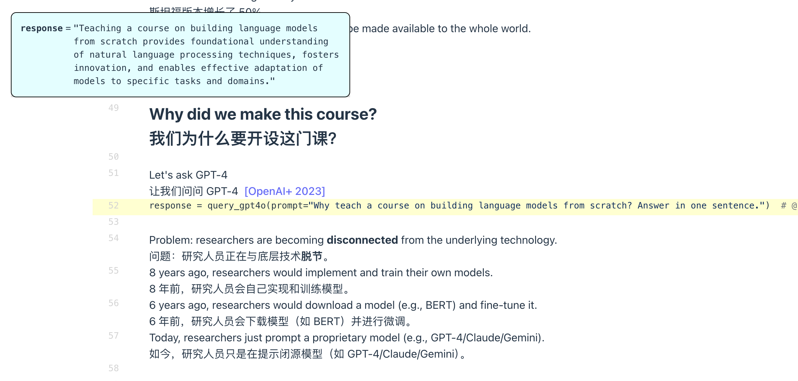
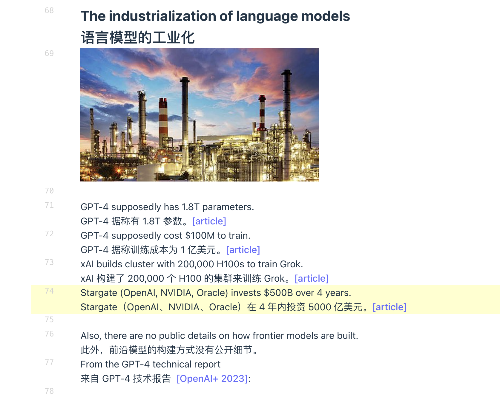
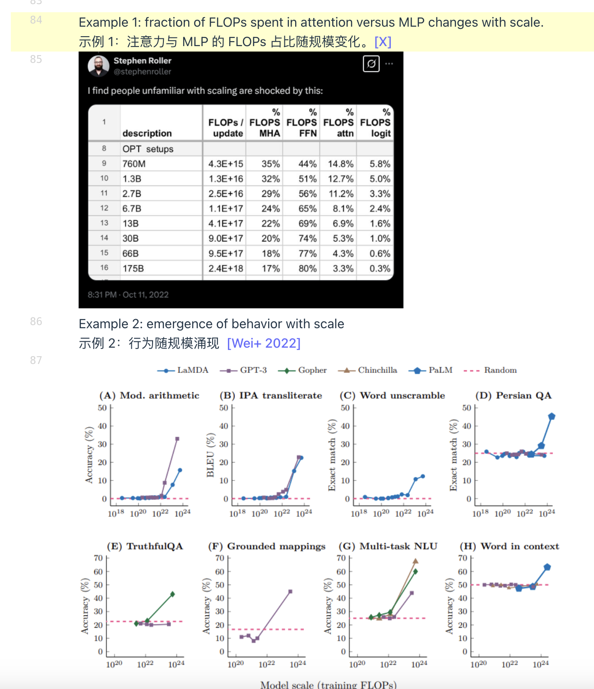
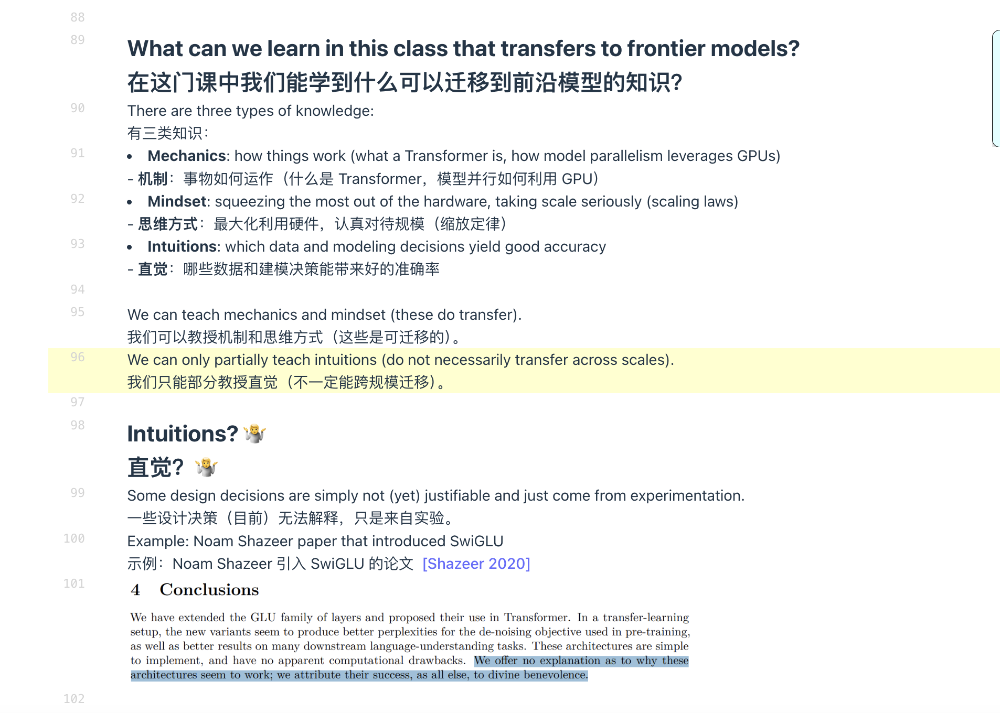
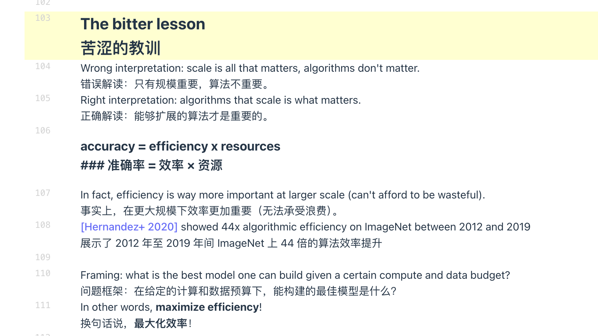
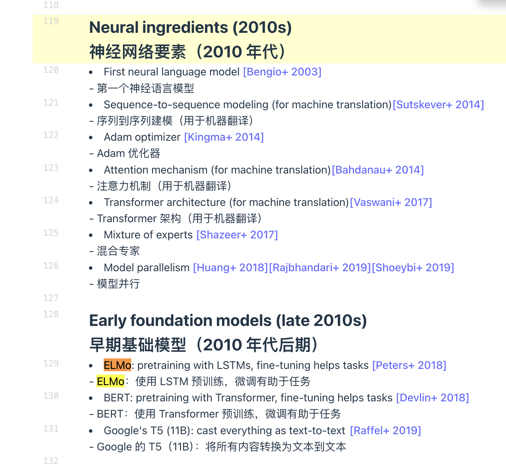
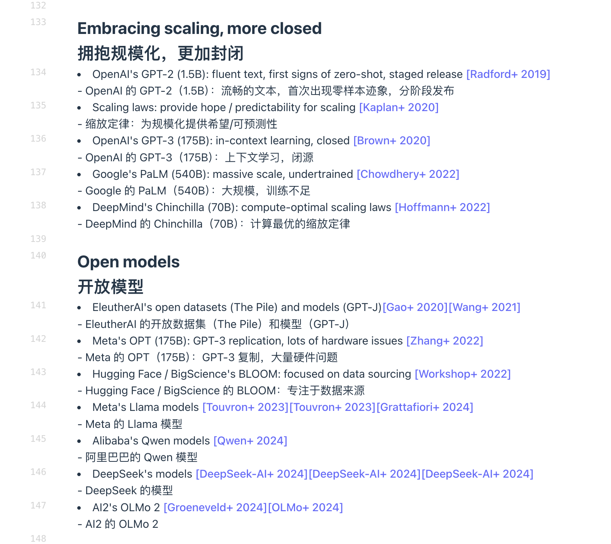
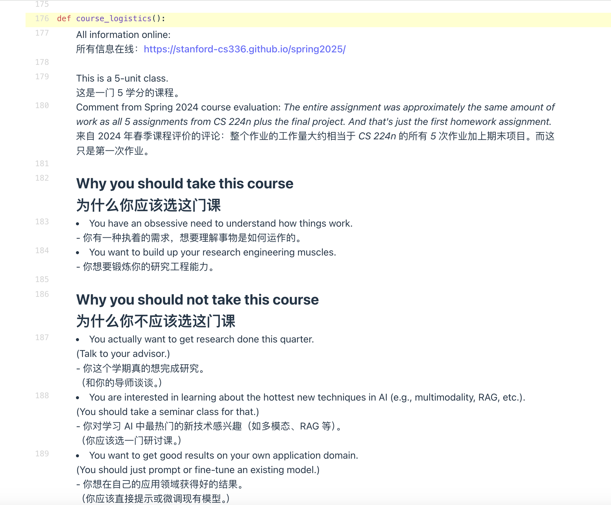
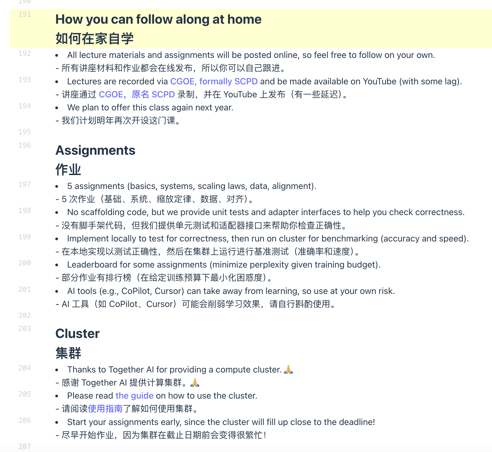

# Lecture 1： Overview and Tokenization

生成时间: 2026-03-08 14:10:58

---

**英文**: Welcome everyone. This is CS336, language models from scratch. And this is the core staff. So I'm Percy, one of your instructors. I'm really excited about this class because it really allows you to see the whole language modeling building pipeline and the end including data systems and modeling. Tatsu, I'll be co-teaching with him. So I'll let everyone introduce themselves. Hi everyone. I'm Tatsu. I'm one of the co-instructor.

**中文**: 欢迎各位。这是CS336，从零开始的语言模型。这是核心团队。我是Percy，你们的讲师之一。我非常期待这门课程，因为它能让你们看到整个语言建模流程，包括数据系统和建模。Tatsu将和我一起授课。现在我让每个人自我介绍一下。大家好。我是Tatsu。我是其中一位助教。

**英文**: I'll be giving lecture and we're two probably weeks. I'm really excited about this class. Percy and I spent a while being able to. just run call thinking like, what's literally deep technical stuff that we can keep our students today. I think one of the things that is really you got to build it from scratch to understand it. So I'm hoping that that's sort of the ethos that I'm going to be going from. Hey everyone. I'm Robyn. I actually failed this class when I took it. I'm not doing it.

**中文**: 我将要进行讲座，我们大概还有两周的时间。我真的很期待这门课。Percy 和我花了一段时间来思考，像现在这样，我们能给学生们带来哪些真正深入的技术内容。我认为其中一件事是你必须从零开始构建它才能理解它。所以我希望这就是我将要遵循的宗旨。大家好，我是 Robyn。实际上我当初上这门课的时候挂科了。我现在不打算再上了。

**英文**: But now I'm your TA. So I'm really worried they say anything possible. And everyone I've yielded, I'm a third year student, PhD student in CS department. Or with Tatsu and Tatsu. Yeah, mostly interested in my research on the synthetic data and the models, these things, all that stuff. So yeah, it should be a fun quarter. Hey guys, I'm ourselves. I'm a second year PhD. I worked as a student in the last class. These days I work on the other day first.

**中文**: 不过现在我是你们的助教了。所以我真的很担心他们会说出什么‘一切皆有可能’之类的话（笑）。刚才大家介绍过了，我是 CS 系的三年级博士生。主要是跟着 Tatsu 做研究，我对合成数据和模型这些方向很感兴趣。总之，这应该是一个充满乐趣的学期。嘿大家好，我是 Ourselves（注：此处可能是人名或口误）。我是二年级博士生，上学期还是这门课的助教学生，这段时间我也在做相关的工作。

**英文**: And he was a top or a many leaderboards from last year. So he's the number to beat. OK. All right. Well, thanks everyone. So let's continue. As Tatsu mentioned, this is the second time we're teaching the class. We've grown the class by around 50% because I have three TAs instead of two. And one big thing is we're making all the lectures on YouTube so that the world can learn how to build a language model from scratch. OK.

**中文**: 他去年霸榜了很多个排行榜，绝对是顶尖高手，所以他是大家想要挑战的头号目标。好的，谢谢大家。那我们继续。
就像 Tatsu 刚才提到的，这是我们第二次教这门课了。因为今年我有三个助教而不是两个，所以班级规模扩大了大约 50%。
还有一个大动作是，我们会把所有讲座视频都传到 YouTube 上，这样全世界的人都能学会如何从零开始构建一个大语言模型。好的。

**英文**: So why do we decide to make this a course and endure all the pain?. So let's ask GPT4. So if you ask a why teach a course on building language models from scratch, the reply is teaching a course provides foundational understanding of techniques, fosters, innovation, the typical generic flowers. OK. So here's a real reason. So we're in a bit of a crisis, I would say. Researchers are becoming more and more disconnected from the underlying technology. Eight years ago, researchers would implement and train their own models in AI. Even six years ago, you at least take the models like Bert and download them and fine tune them. And now, many people can just get away with prompting a proprietary model.

**中文**: 那我们为什么要决定开这门课，还要忍受所有的痛苦呢？咱们先问问 GPT-4 吧。如果你问它‘为什么要教一门从零构建大语言模型的课’，它的回答肯定是：‘这能提供对技术的基础理解，培养创新能力’……全是些典型的、漂亮的废话（generic flowers）。好吧，这才是真正的原因。我觉得我们正处于某种危机之中。研究人员正变得与底层技术越来越脱节。八年前，AI 研究员还会自己编写代码、训练自己的模型。哪怕就在六年前，你至少还会下载像 BERT 这样的模型来进行微调。但现在，许多人只要对着专有模型写写提示词（Prompt）就能混下去了。

**英文**: So this is not necessarily bad, because as you introduce these layers of abstraction, we can all do more. And a lot of research has been unlocked by the simplicity of even a prompt to language model. And I do a very much share of prompting. So there's nothing wrong with that. But it's also remember that these abstractions are leaky. So in contrast to programming languages or operating systems, you don't really understand what the abstraction is. It's a string in and string out, I guess. And I would say that there's still a lot of fundamental research to be done that required carrying up the stack and co-designing different aspects of the data and the systems and the model. And I think really that full understanding. of this technology is necessary for fundamental research.

**中文**: 这倒也不一定是坏事，因为随着这些抽象层的引入，我们大家都能做更多的事情。而且，正是得益于调用大模型这种简单的 Prompt 方式，很多研究才得以开展。我自己也写了不少 Prompt，所以这本身没什么问题。但我们要记住，这些抽象是‘会泄露’的（leaky abstractions，意指抽象并不完美，底层细节还是会暴露出来影响上层）。与编程语言或操作系统不同，你其实并不真正理解这个抽象到底是什么。它大概就是一个‘字符串进，字符串出’的黑盒。我想说的是，仍然有很多基础性的研究有待完成，而这些研究需要我们要深入技术栈的底层（carrying up the stack），对数据、系统和模型的不同方面进行协同设计。我认为，要对这项技术进行根本性的研究，这种全方位的理解是必不可少的。

**英文**: So that's why this class exists. We want to enable the fundamental research to continue. And our philosophy is to understand it, you have to build it. So there's one small problem here. And this is because of the industrialization of language models. So GVD4 has rumored to be 1. 8 trillion parameters,. cost $100 million to train. You have XAI building the clusters with 200,000 H100s. If you can imagine that.

**中文**: 这就是这门课存在的意义。我们希望能让基础研究得以延续。我们的理念是：要想理解它，你就得亲手构建它。不过，这里有个小问题。这主要是由大语言模型的‘工业化’造成的。拿 GPT-4 来说，据传它的参数量高达 1.8 万亿，训练成本更是耗资 1 亿美元。还有像 xAI 这样的公司，正在建设拥有 20 万块 H100 显卡的超级集群。你们可以想象一下那个规模。

**英文**: There's investment of over 500 billion, supposedly, over four years. So these are pretty large numbers. And furthermore, there's no public details on how these models are being built. Here from GPT-4, this is even two years ago. They very honestly say that due to the competitive landscape safety limitations, we're going to disclose no details. So this is the state of the world right now. And so in some sense, frontier models are out of reach for us. So if you came into this class thinking, you're each going to train your own GPT4. Sorry. So we're going to build small language models.

**中文**: 据说四年内的投资超过了 5000 亿美元。这些数字可是相当惊人的。而且，关于这些模型到底是怎么构建的，没有任何公开的细节。 看看 GPT-4，哪怕是两年前，他们就很诚实地表示：‘由于竞争环境和安全限制，我们不会透露任何细节’。所以这就是当今世界的现状。在某种程度上，前沿模型对我们来说是遥不可及的。所以，如果你来上这门课，是想着每个人都能训练一个自己的 GPT-4……那很抱歉。我们将要构建的是小型语言模型（Small Language Models）。

**英文**: But the problem is that these might not be representative. And here's some of two examples to illustrate why. So here's kind of a simple one. If you look at the fraction of Flops spent in the attention layers of a transformer versus a MLP, this changes quite a bit. So this is a tweet from Stephen Roller from quite a few years ago. But this is still true. If you look at small models, it looks like the number of Flops into the attention versus the MLP layers are roughly comparable. But if you go up to 175 billion, then the MLP is really dominate. So what does this matter? Well, if you spend a lot of time at small scale and you're optimizing the attention, you might be optimizing the wrong thing because at larger scale, it gets washed out. This is kind of a simple example.

**中文**: 但问题是，这些可能并不具有代表性。这里有一些例子来说明原因。这是一个简单的例子。如果你看一下Transformer中注意力层与MLP所花费的Flops比例，这个比例变化很大。这是一条几年前Stephen Roller发布的推文。但这个情况仍然成立。如果你看一下小模型，看起来注意力层与MLP层的Flops数量大致相当。但如果你看到1750亿参数的模型，那么MLP就占了主导地位。这有什么关系呢？如果你在小规模上花了很多时间，并且优化了注意力机制，你可能会优化错误的东西，因为在更大规模下，这种优化效果会被削弱。这是一个简单的例子。

**英文**: Because you can literally make this plot without actually any computers. You just do its napkin math. Here's something that's a little harder to grapple with. It's just emergent behavior. So this is a paper from Jason Wei from 2022. And this plot shows that, as you increase the amount of training Flops and you look at accuracy a bunch on a bunch of tasks, you'll. see that for a while, it looks like the accuracy, and nothing is happening. And all of a sudden, you get the kind of emergent of various phenomena like in context learning. So if you were hanging around at this scale, you would be concluding that, well, these language models really don't work. When, in fact, you had to scale up to get that behavior.

**中文**: 因为你实际上可以不用任何计算机来制作这个图表。你只需要进行一些粗略的估算。这里有一些更难理解的东西。这是某种涌现行为。这是一篇来自Jason Wei在2022年的论文。这张图显示，当你增加训练Flops的数量，并在多个任务上观察准确率时，一开始看起来准确率没有变化，什么也没发生。但突然之间，你会看到各种现象的 *涌现*，比如上下文学习。所以如果你在这个规模上停留，你可能会得出结论，这些语言模型真的不起作用。但实际上，你必须扩大规模才能获得这种行为。

**英文**: So don't despair. We can still learn something in this class. But we have to be very precise about what we're learning. So there's three types of knowledge. There's the mechanics of how things work. This we can teach you. We can teach you what a transformer is. You'll implement a transformer. We can teach you how model parallelism leverages GPUs efficiently. These are just like kind of the raw ingredients, the mechanics.

**中文**: 所以别灰心，我们在这门课里还是能学到东西的。但我们必须非常精准地界定我们要学什么。知识大概分三种，其中一种是‘运作机制’（Mechanics）。这个我们能教你。我们可以教你什么是 Transformer。你们会亲手实现一个 Transformer。我们可以教你模型并行化是如何高效利用 GPU 的。这些就像是原材料，是底层的机械原理。

**英文**: So that's fine. We can also teach you mindset. So this is something a bit more subtle and seems like a little bit fuzzy. This is actually, in some ways, more important, I would say. Because the mindset that we're going to take is that we want to squeeze as much out of a hardware as possible and take scaling seriously. Because in some sense, the mechanics, all of those will see later that all of these ingredients have been around for a while. But it was really, I think, the scaling mindset that OpenAI pioneered that led to this next generation. of AI models. So mindset, I think, hopefully we can bang into you that to think in a certain way. And then thirdly is intuitions.

**中文**: 那挺好的。除此之外，我们还能教你们一种‘思维模式’。
这东西有点微妙，听起来可能有点虚。但实际上，我觉得在某种程度上，它比技术细节更重要。因为我们要建立的思维模式是：我们要想办法把硬件的性能压榨到极致，并且要认真对待‘规模化’（Scaling）。因为在某种意义上，那些技术细节（Mechanics），你们后面会看到，其实这些‘原材料’都已经存在很久了。但我认为，真正引领这一代AI模型爆发的，其实是 OpenAI 开创的这种‘规模化思维’。所以关于思维模式，我希望我们能把它强行灌输给你们（bang into you），让你们学会用某种特定的方式去思考。然后第三点，就是直觉（Intuitions）。

**英文**: And this is about which data and modeling decisions lead to good models. This, unfortunately, we can only partially teach you. And this is because what architectures and what data sets. work at, in other scales, might not be the same ones that work at large scales. But hopefully you got two and a half out of three. So that's pretty good being for your buck. OK, speaking of intuitions, there's this sort of, I guess, sad reality of things that you can tell a lot of stories about why certain things in the transformer the way they are. But sometimes it's just, you do the experiments and the experiments speak. So for example, there's this known Shazier paper that introduced the Swigloo, which is something that will see a bit more in this class, which is a type of non-linearity. And in the conclusion, the results are quite good.

**中文**: 

*教授这番话简直是太实在了，直接承认了AI领域里最让人头秃的“玄学”部分——直觉。毕竟很多模型架构的设计，有时候真不是靠推导出来的，而是靠“大力出奇迹”试出来的。*

这关乎什么样的数据和建模决策能造就好的模型。遗憾的是，这部分我们只能教你们一知半解。这是因为在小规模下管用的架构和数据集，到了大规模下未必还管用（反之亦然）。
但希望你们能拿到‘三分之二’的分（指学会前两点：机制和思维），这样算下来性价比还是挺高的。好了，说到直觉，这里有个挺无奈的现状：关于 Transformer 为什么设计成这样，你能编出一大堆故事来解释。
但有时候事实就是，你得去做实验，让实验结果说话。比如，大家知道的那篇 Shazeer 的论文引入了 SwiGLU，这东西咱们课上会细讲，它是一种非线性激活函数。结论就是：结果相当不错（所以我们就用它了）。

**英文**: And it's got adopted. But in the conclusion, there's this honest statement that we offer no explanation, except for this is divine benevolence. So there you go. And this is the extent to our understanding. OK, so now let's talk about this bitter lesson that I'm sure people have heard about. I think there's a sort of a misconception. that a bitter lesson means that scale is all that matters. Algorithms don't matter. All you do is pump more capital into building the model and you're good to go. I think this couldn't be farther from the truth.

**中文**: 而且它（SwiGLU）已经被广泛采用了。但在那篇论文的结论部分，作者非常诚实地写道：‘我们对此没有任何解释，只能说这是神的恩赐（divine benevolence）。’你们看，这就是我们目前理解的极限。
好了，现在咱们来聊聊那个大家肯定都听说过的‘惨痛教训’（The Bitter Lesson）。我觉得大家对它有个误区。很多人以为‘惨痛教训’的意思就是：规模决定一切，算法根本不重要。只要你拼命砸钱去堆模型，你就万事大吉了。我觉得这种看法简直是大错特错（离事实十万八千里）。

**英文**: I think the right interpretation is that algorithms at scale is what matters. And because at the end of the day, your accuracy of your model. is really a product of your efficiency and the number of resources you put in. And actually, efficiency, if you think about, is way more important at larger scale. Because if you're spending hundreds of millions dollars, you cannot afford to be wasteful in the same way that if you're looking at running a job on your local cluster, you might run it again, you fail,. you debug it. And if you look at actually the utilization and the use, I'm sure opening it has way more efficient than any of us right now. So efficiency really is important. And furthermore, I think at this point is maybe not as well appreciated in the scaling rhetoric, so to speak, which is that if you look at efficiency,. which is combination of hardware algorithms, but if you just look at the algorithm efficiency, there's this nice open-air paper from 2020 that showed over the period of 2012 to 2019, there's a 44X if algorithmic efficiency improvement in the time that it took to train, image net to a certain level of accuracy.

**中文**: 我觉得正确的解读应该是：在大规模下的算法才是关键。毕竟说到底，你模型的准确率，其实就是你的效率和你投入的资源数量的乘积。
而且实际上，如果你仔细想想，规模越大，效率就越重要。因为如果你要花费数亿美元，你根本负担不起任何浪费。这跟你在本地集群上跑任务完全不一样，在本地你可能跑挂了、调试一下再跑一次就是了。如果你看看实际的利用率和使用情况，我敢打赌，OpenAI 的效率绝对比我们在座的任何人都要高得多。所以效率真的很重要。而且，我觉得在某种程度上，这一点在关于‘规模化’的讨论中可能还没得到足够的重视。也就是说，如果你关注效率——这是硬件和算法的结合体——但如果你单看算法效率，有一篇2020年的 OpenAI 论文指出，在2012年到2019年期间，将 ImageNet 训练到特定准确率所需的算法效率提升了44倍。

**英文**: So this is huge. And I think if you, I don't know if you could see the abstract here, this is faster than Moore's law. So algorithms do matter if you didn't have this efficiency, you would be paying 44 times more cost. This is for image models, but there's some results for language as well. Okay, so with all that, I think the right framing on mindset to have is what is the best model. one can build given a certain compute and data budget? Okay, and this question makes sense, no matter what scale you're at, because it's accuracy per resources. And of course, if you can raise the capital and get more resources, you'll get better models. But as researchers, our goal is to improve the efficiency of the algorithms. Okay, so maximize efficiency, we're gonna hear a lot of that. Okay, so now let me talk a little bit about the current landscape and a little bit of, I guess, obligatory history.

**中文**: 

*教授这番话简直是给“算法无用论”的当头一棒！不仅用44倍的效率提升数据打了脸，还重新定义了研究者的使命——不是比谁钱多，而是比谁更会“省钱”。*

所以这可是个大数字。我不知道你们能不能看到这里的摘要，这速度比摩尔定律还要快。所以算法真的很重要！如果没有这种效率提升，你们得付出44倍的成本。虽然这是针对图像模型的，但在语言模型方面也有一些类似的结果。好了，综上所述，我觉得我们应该建立的思维框架是：在给定的算力和数据预算下，能构建出的最好的模型是什么？这个问题无论在什么规模下都有意义，因为它关注的是单位资源的准确率。当然，如果你能拉到投资、搞到更多资源，你的模型肯定会更好。但作为研究人员，我们的目标是提高算法的效率。好了，最大化效率——咱们后面会经常听到这个词。那么现在，让我来聊聊当前的局势，还有稍微讲点那种‘例行公事’的历史背景。

**英文**: So language models have been around for a while now. Going back to Shannon, who looked at language models a way to estimate the entropy of English. I think in AI, they really were prominent in NLP where they were a component of larger systems like machine translation, speech recognition. And one thing that's maybe not as appreciated these days is that if you look back in 2007, Google's training 30 large N-gram models, so five-gram models over two trillion tokens, which is a lot more tokens than GPT-3. And it was only, I guess, in the last two years that we've gotten to that token count. But they were N-gram models. So they didn't really exhibit any of the interesting phenomenon that we know of language models today. Okay, so in the 2010s, I think a lot of the, you can think about this a lot of the deep learning revolution happened and a lot of the ingredients. sort of kind of falling into place. Right, so there is a first neural language model from Yachtropenzio's group in back in 2003.

**中文**: 所以语言模型其实已经存在很久了。最早可以追溯到香农（Shannon），他把语言模型当作一种估算英语熵（信息量）的方法。在 AI 领域，它们真正崭露头角是在自然语言处理（NLP）中，当时它们只是作为机器翻译、语音识别等大型系统中的一个组件。还有一点现在可能大家不太在意了，但如果你回顾 2007 年，Google 当时训练了 30 个大型 N-gram 模型（也就是 5-gram 模型），处理了 2 万亿个 token。这个数据量甚至比 GPT-3 用的还要多！而且直到最近两年，我们才重新达到这个 token 数量级。但问题在于，它们是 N-gram 模型。所以它们并没有展现出我们今天在语言模型中看到的那些有趣的现象（比如涌现能力）。好了，到了 2010 年代，我想大家都很清楚，深度学习革命发生了，各种‘原材料’开始逐渐到位。比如，早在 2003 年，Yoshua Bengio（教授口误说成了 Yachtropenzio）的团队就提出了第一个神经语言模型。

**英文**: There is seq-to-seq models. This I think was a big deal for, how do you basically model sequences from Ilya and Google folks? There's an atom optimizer, which still is used. by the majority of people, dating over a decade ago. There's a tension mechanism, which was developed in the context of machine translation, which then led up to the famous attention all you need, or the AKA the transformer paper in 2017. People were looking at how to scale mixture of experts. There's a lot of work around late 2010s on how to essentially do model parallelism. And they were actually figuring out how you could train 100 billion prime models. They didn't train it for very long because these were more systems work, but all the ingredients were kind of in place before in, or in by the time the 2020 came around. So I think one, you know, other trend, which was starting NLP,. was the idea of, you know, these foundation models that could be trained on a lot of texts and adapted to a wide range of downstream tasks.

**中文**: 还有 Seq2Seq（序列到序列）模型。我觉得这对如何对序列进行建模是个大事情，这主要归功于 Ilya（Sutskever）和 Google 的那帮人。
还有 Adam 优化器，这东西到现在还是大多数人在用，虽然它已经是十多年前的老古董了。还有注意力机制（Attention Mechanism），最初是在机器翻译的背景下开发出来的，这直接引出了 2017 年那篇著名的《Attention Is All You Need》，也就是 Transformer 论文。当时人们还在研究如何扩展混合专家模型（Mixture of Experts）。在 2010 年代末，有很多关于如何进行模型并行化的工作。他们当时其实已经搞定了如何训练 1000 亿参数的模型。虽然因为那些主要是系统层面的工作，模型没训练太久，但等到 2020 年左右的时候，所有的‘原材料’其实都已经到位了。所以我觉得，另一个趋势——也就是 NLP 领域的变革——就是‘基础模型’（Foundation Models）的概念：可以在海量文本上训练，然后适配各种下游任务的模型。

**英文**: So Elmo, Bert, you know, T5, these were models that were, for their time, very exciting. We kind of maybe forget how excited people were about, you know, things like Bert, but it was a big deal. And then I think, I mean, this is abbreviated history, but I think one critical piece of the puzzle is, you know, open AI, just taking these ingredients, you know, they end up applying very nice engineering and really kind of pushing on the kind of the scaling laws, embracing it as, you know, this is the kind of mindset piece and that led to GPT-2 and GPT-3. Google, you know, obviously was in the game and trying to, you know, compete as well. But that sort of paved the way, I think, to another kind of line of work, which is these were all closed models. So models that weren't released and you can only access via API, but they were all,. though, NLP models, starting with early work by, you know, Eluther, right after GPT-3 came out, Meta's early attempt, which didn't work, maybe as quite as well, Bloom. And then Meta, Alibaba, deep seek, AI-2, and there's a few others, which I am a listed, having creating these open models where the weights are released. One other piece of, I think, tidbit about openness, I think is important, is that there's many levels of openness. There's closed models like GPT-4.

**中文**: 所以像 ELMo、BERT，还有 T5 这些模型，在它们那个年代可是非常令人兴奋的。我们可能有点忘了当时大家对 BERT 有多狂热，但那在当时确实是个大事件。然后我觉得——虽然这是简略版的历史——但拼图中关键的一块是：OpenAI 把这些现有的‘原材料’拿过来，运用了非常出色的工程能力，并且真正地去推动和拥抱‘缩放定律’（Scaling Laws）。这就是我之前说的思维模式，这也直接带来了 GPT-2 和 GPT-3。Google 显然也在局中，试图与之竞争。但这某种程度上为另一条技术路线铺平了道路。之前的那些都是闭源模型，也就是不发布模型，你只能通过 API 访问，而且它们都是 NLP 模型。但后来开始有了开源的工作，最早是 EleutherAI（教授口误说成了 Eluther）在 GPT-3 出来后做的工作。还有 Meta 早期的尝试（虽然效果可能没那么好），以及 BLOOM。然后是 Meta、阿里、DeepSeek、AI2 等几家（我就不一一列举了），它们开始创建这些开源模型，也就是把模型权重公开发布。关于‘开源’，我觉得还有一个重要的小细节：开源其实分很多层级。比如像 GPT-4 就是闭源模型。

**英文**: There's open weight models where the weights are available and there's actually a paper, a very nice paper with lots of architectural details, but no details about the data set. And then there's open source models where all the weights and data are available in the paper that were there honestly trying to explain as much as they can. But of course, you can't really capture everything in a paper and there's no substitute for learning how to build it, except for kind of doing it yourself. Okay, so that leads to kind of the present day where there's a whole host of frontier models from OpenAI and Thropic, XAI, Google, Meta, DeepSeek, Alibaba, Tencent, and probably a few others that sort of dominate the current landscape. So we're kind of interested in interesting time where just to kind of reflect a lot of the ingredients, like I said, were developed, which is good. because I think we're gonna revisit some of those ingredients and trace how these techniques work. And then we're going to try to move us close as we can to best practices on frontier models, but you're using information from essentially the open community. And reading between the lines from what we know about the closed models. Okay, so just as an interlude, so what are you looking at here? So this is an executable lecture. So it's a program where I'm stepping through and it delivers a content of lecture.

**中文**: 有公开权重的模型，其中权重是公开的，并且确实有一篇论文，一篇非常不错的论文，包含很多架构细节，但没有关于数据集的细节。然后还有开源模型，其中所有的权重和数据都在论文中，他们诚实地试图尽可能多地解释。但当然，你不能在一篇论文中真正涵盖一切，除了自己动手做之外，没有其他替代方法。好的，这样就导致了现在的情况，有很多前沿模型来自OpenAI、Thropic、XAI、Google、Meta、DeepSeek、阿里巴巴、腾讯，可能还有其他一些公司，它们目前主导着整个局面。所以我们对这个时期很感兴趣，正如我所说，很多成分都是在这个时期开发出来的，这很好。因为我认为我们将重新审视这些成分，并追踪这些技术是如何工作的。然后我们会尽量接近前沿模型的最佳实践，但你使用的信息基本上来自开放社区。以及从我们对封闭模型的了解中推测出来。好的，所以作为一段插曲，你现在看到的是什么？这是一堂可执行的课程。这是一个程序，我逐步进行，它会传递课程内容。

**英文**: So one thing that I think is interesting here is that you can embed code. So if you can just step through code. and I think this is a smaller screen than I'm used to, but you can look at the environment variables as you're stepping through code. So that's a useful later when we start actually trying to drill down and giving code examples. You can see the hierarchical structure of a lecture, like we're in this module and you can see where it's called for main. And you can jump to definitions, like supervised fine tuning, which we'll talk about later. Okay, and if you think this looks like a Python program, well, it is a Python program, but I've made it, you'll process it so for your viewing pleasure. Okay, so let's move on to the course logistics now. Actually, maybe I'll pause for questions. Any questions about what we're learning in this class? Yeah.

**中文**: 我觉得这里有个很有趣的功能，就是可以嵌入代码。你可以逐步跟踪代码的执行过程。虽然这个屏幕比我平时用的要小一些，但你仍然可以在调试代码时查看环境变量。等我们后面开始深入讲解并提供代码示例时，这个功能会非常有用。你还可以看到课程内容的层级结构，比如当前我们所在的模块，以及主程序是如何调用它的。你还可以跳转到定义处，比如“监督式微调”（supervised fine tuning），这个我们稍后会讲到。如果你觉得这看起来像一个 Python 程序，没错，它确实是用 Python 编写的，但我已经对它做了一些处理，让它更便于大家观看。好了，接下来我们进入课程的后勤安排部分。不过，也许我应该先暂停一下，看看大家有没有问题。关于我们这门课要学的内容，大家有什么问题吗？好的，有请。

**英文**: So the question is, would I expect a graduate from this class to be able to lead a team and build a frontier model? Of course, with like a billion dollars of capital. Yeah, of course. I would say that it's a good step, but there's definitely many pieces that are missing. And I think, we thought about, we should really teach like a series of classes that eventually leads up to as close as we can get. But I think this is maybe the first step of the puzzle, but there are a lot of things and I'm happy to talk offline about that. But I like the ambition. Yeah. That's what you should be doing, taking the class so you can go lead teams and build frontier models. Okay. Okay.

**中文**: 所以问题是，我会期望这个班级的毕业生能够带领一个团队并构建前沿模型吗？当然，如果有十亿美元的资金。是的，当然。我认为这是一个好的步骤，但显然还有很多缺失的部分。我认为，我们考虑过，我们应该真正开设一系列课程，最终尽可能接近。但我觉得这可能是拼图的第一步，但还有很多事情要做，我很高兴私下讨论这个问题。但我喜欢这种雄心。是的。这就是你应该做的，参加这门课程，这样你就可以去带领团队并构建前沿模型。好的。好的。

**英文**: Let's talk a little bit about the course. So here's a website, everything's online. This is a five unit class. But I think that maybe it doesn't express the level here as well as this quote that I pulled out from a course evaluation. The entire assignment was approximately the same amount of work as all five assignments from the CS24N plus the final project. And that's the first homework assignment. So not to scare you off,. but just giving some data here. So why should you endure that? Why should you do it? I think this class is really for people who have sort of an obsessive need to understand how things work all the way down to the atom, so to speak. And I think if you, you know, when you get through this class, I think you will have really leveled up.

**中文**: 我们来简单聊聊这门课程。这是课程网站，所有内容都在线上。这是一门5学分的课程。但我觉得，或许下面这句我从课程评估中摘录的话，更能体现这门课的难度：“整个作业的工作量大约相当于CS24N课程五次作业加上期末项目的总和。”而且，这还仅仅是第一次作业。这么说并不是要吓跑大家，只是想提供一些真实的数据。那么，为什么要忍受这样的强度？为什么要选择这门课呢？我认为，这门课真正适合那些对理解事物运作原理有着近乎执着需求的人——可以说，是想要一直探究到“原子”级别的人。我相信，当你完成这门课程后，你的能力将会实现真正的飞跃。

**英文**: in terms of your research engineering and the level of comfort that you'll have in building ML systems at scale will just be, I think, you know, something. There's also a bunch of reasons that you shouldn't take the class. For example, if you wanna get any research done this quarter, maybe this class isn't for you. If you're interested in learning just about the hottest new techniques, there are many other classes that can probably deliver on that, you know, better than, for example, you spending a lot of time debugging BPE. And this is really, I think, a class about, you know, the primitives and learning things bottom up as opposed to the kind of the latest. And also if you're interested in building language models or, you know, 4x, this is probably not the first class I, you would take. I think practically speaking, you know, as much as I kind of made a fun prompting, prompting is great. Find tuning is great. If you can do that and it works, then I think that is something you should absolutely start with. So I don't want people taking this class and thinking of the great, any problem.

**中文**: 在研究工程能力方面，以及你在构建大规模机器学习系统时的熟练程度，我认为这门课将带来质的飞跃。不过，也有很多理由说明你不应该选修这门课。例如，如果你这个季度打算做研究工作，那么这门课可能不适合你。如果你只想学习最新、最热门的技术，那么有很多其他课程可能比我这门课更能满足你的需求——毕竟，与其花大量时间去调试 BPE（字节对编码），不如去那些课程。实际上，这门课的核心在于讲解“原语”（primitives），倡导自底向上的学习方式，而不是追逐最新的潮流。此外，如果你的目标是直接构建语言模型或者实现 4 倍的性能提升，那么这门课可能也不是你的首选入门课。从实际角度来看，尽管我刚才开玩笑地提到了提示工程（prompting），但提示工程确实很棒，微调（fine-tuning）也很棒。如果你能直接使用这些方法并让它们奏效，那么我绝对建议你从那里开始。我不希望大家选了这门课后，误以为它是解决任何问题的万能钥匙。

**英文**: The first step is to train a language model from scratch. That is not the right way of thinking about it. Okay, and I know that many of you, you know, some of you are enrolled, but we didn't, we did have a cap so we weren't able to enroll everyone. And although for the people online,. you can follow it at home. All the lecture materials and assignments are online so you can look at them. The lectures are also recorded and will be put on YouTube, although there will be some number of weak lag there. And also will offer this class next year. So if you were not able to take it this year, don't fret. There will be next time.

**中文**: “第一步是从零开始训练一个语言模型。”但这其实并不是正确的思考方式。我知道你们很多人——其实有些同学已经注册了——但我们确实有人数上限，所以没法让所有人都进来。对于在线上观看的同学，你们在家也可以跟着学。所有的讲座资料和作业都在网上，大家可以随时查看。讲座也会录下来放到 YouTube 上，虽然可能会有几天的延迟。而且我们明年也会开这门课。所以，如果今年没能选上，别发愁，明年还有机会。

**英文**: Okay, so the class has five assignments. And each of the assignments, we don't provide scaffolding code in a sense that you're literally give you a blank file and you're supposed to build things up. And in the spirit of building from scratch. But we're not that mean. We do provide unit tests and some adapter interfaces. that allow you to check on correctness of different pieces and also the assignment write up. If you walk through it does do it for sort of a gentle job of doing that. But you're kind of on your own for making good software design decisions and figuring out what you name your functions and how to organize your code, which is a useful skill, I think. So one strategy, I think, for all assignments is that there is a piece of assignment which is just implement the thing and make sure it's correct. That, mostly you can do locally on your laptop.

**中文**: 好的，这门课一共有五次作业。关于这些作业，我们在某种意义上不提供脚手架代码——也就是说，我们实际上给你的就是一个空白文件，你需要从头开始构建所有内容，这也符合“从零开始”的精神。不过我们也没那么“狠”。我们确实会提供单元测试和一些适配器接口，让你能检查各个部分的正确性，此外还有详细的作业说明文档。如果你仔细阅读，会发现引导过程其实挺循序渐进的。但在做出良好的软件设计决策、决定函数命名以及如何组织代码这些方面，基本上得靠你自己，我认为这是一项非常有用的技能。所以，我觉得应对所有作业的一个策略是：作业中有一部分仅仅是实现功能并确保其正确性。这部分工作，你大多可以在自己的笔记本电脑上本地完成。

**英文**: You shouldn't need compute for that. And then you should, we have a cluster that you can run for benchmarking both accuracy and speed. Right, so I want everyone to kind of embrace this idea of that. You want to use as a small data set or as few resources possible to prototype before running large jobs. You shouldn't be debugging with 1 billion parameter models on the cluster if you can help it. OK, there's some assignments which will have a leaderboard, which usually is of the form do things to make perplexity go down given a particular training budget. Last year it was, I think, pretty exciting for people to try to try different things that you either learn from the class or you read online. And then finally, I guess this year is, this was less of a problem last year because I guess Copilot wasn't as good, but Cursus is pretty good. So I think our general strategy is that AI tools are can take away from learning because there are cases where it can just solve the thing you want it to do. But I think you can obviously use them judiciously, so but use at your own risk.

**中文**: 做原型验证时，你不需要动用大型计算资源。我们有一个集群，你可以用它来跑基准测试，评估模型的准确率和速度。对，所以我希望大家能接受这样一个理念：在运行大规模任务之前，你应该尽可能使用小规模数据集或最少的资源来进行原型设计。如果条件允许，你不应该在集群上调试 10 亿参数的模型。有些作业会设有排行榜，通常的形式是在给定的训练预算下，想办法降低困惑度（perplexity）。去年，大家尝试从课上学到的或者网上看到的各种方法，我觉得那挺让人兴奋的。最后，我想今年和去年有点不同，去年因为 Copilot 还没那么强，所以问题不大，但 Cursus 现在相当厉害。所以，我们总体的策略是：AI 工具可能会妨碍学习，因为在某些情况下，它们能直接帮你把问题解决了。但我认为你显然可以明智地使用它们，不过要“风险自负”。

**英文**: You're kind of responsible for your own learning experience here. OK, so we do have a cluster. So thank you together AI for providing. a bunch of H100s for us. There's a guide to please read it carefully to learn how to use a cluster. And start your assignments early because the cluster will fill up towards the end of a deadline as everyone's trying to get their large runs in. OK, any questions about that? You mentioned it was a five-year class. Were you able to sign up for it for the three of the minutes of the good time? Right, so the question is, can you sign up for less than five units? I think administratively, if you have to sign up for less, that is possible. But it's the same class and the same workload. Yeah.

**中文**: 在这里，你们得对自己的学习体验负责。好的，我们确实有一个计算集群。所以要感谢 Together AI 为我们提供了一批 H100 显卡。有一份使用指南，请务必仔细阅读，学习如何使用集群。另外，作业要尽早开始，因为快到截止日期时，大家都会挤进去跑大型任务，集群资源很快就会爆满。关于这点有什么问题吗？
（听众提问）：你刚才提到这是一门 5 学分的课。那能在选课系统开放的那几分钟里选少一点学分吗？
（教授回答）：对，问题是能不能选少于 5 学分。从行政管理的角度来看，如果你必须少选，那是可以的。但这还是同一门课，工作量也是一样的。是的。

**英文**: Any other questions? OK, so in this part, I'm going to go through all the different components of the course and just give a broad overview, a preview of what you're going to experience. So remember, it's all about efficiency, given hardware and data, how do you train the best model given your resources? So for example, if I give you a common crawl dump, a web dump, and 32 H100s for two weeks, what should you do?. There are a lot of different design decisions. There's questions about the tokenizer, the architecture, systems optimizations. You can do data things you can do. And we've organized the class into these five units or pillars. So I'm going to go through each of them in turn and talk about what will cover, what the assignment will involve, and then I'll kind of wrap up. OK, so the goal of the basics unit is just get a basic version of a full pipeline working. So here you implement a tokenizer, model architecture, and training. So I'll just say a bit more about what these components are.

**中文**: 还有其他问题吗？好的，在这一部分，我将带大家浏览课程的所有不同组件，对你们即将体验的内容做一个宽泛的概览和预览。请记住，这门课的核心在于效率——即在给定的硬件和数据条件下，如何利用你的资源训练出最好的模型？举个例子，如果我给你一份 Common Crawl 数据转储（dump）、一份网络数据转储，以及 32 张 H100 显卡供你使用两周，你该怎么做？这里面有非常多的设计决策：关于分词器（tokenizer）的问题、关于架构的问题、关于系统优化的问题，还有你可以对数据做的各种处理。我们将课程组织成了这五个单元（或者说五大支柱）。接下来我将逐一讲解，谈谈每个单元涵盖的内容、作业涉及的内容，最后做一个总结。好的，那么“基础”单元的目标，仅仅是让一个完整流程的基础版本跑通。在这里，你需要实现一个分词器、模型架构以及训练过程。我再多说一点关于这些组件的细节。

**英文**: So a tokenizer is something that converts between strings and sequences of integers. Intuitively, you can think about the integers corresponding. to breaking up the string into segments. And mapping each segment to an integer. And the idea is that your sequence of integers is what goes into the actual model, which has to be a fixed dimension. OK, so in this course, we'll talk about the by pair encoding BPE tokenizer, which is relatively simple and still is used. There are a promising set of methods on tokenizer free approaches. So these are methods that just start with the raw bytes and don't do tokenization and develop a particular architecture that just takes the raw bytes. This work is promising, but so far I haven't seen it been scaled to the frontier yet. So we'll go with BPE for now.

**中文**: 分词器是一种在字符串和整数序列之间进行转换的工具。直观地理解，你可以认为这些整数对应着将字符串切分成不同的片段，并将每个片段映射为一个整数。其核心思想是，你的整数序列才是实际输入到模型中的内容，而模型必须接收固定维度的输入。在这门课中，我们将讨论字节对编码（BPE）分词器，它相对简单，而且目前仍在使用。同时也有一些很有前景的“无分词器”方法。这些方法直接从原始字节开始，不进行分词，而是开发一种专门处理原始字节的特定架构。这项工作很有希望，但到目前为止，我还没看到它被扩展到最前沿的规模。所以，我们暂时还是采用 BPE。

## 段落 31

**英文**: OK, so once you've tokenized your sequence or strings into a sequence of integers, now we. define a model architecture over these sequences. So the starting point here is original transformer. That's what is the backbone of basically all frontier models. And here's architectural diagram. We won't go into details here, but there's attention, piece, and then there's a MLP layer with some normalization. So a lot has actually happened since 2017. I think there's a sort of sense to which all the transformer is invented, and then everyone's just using transformer. And to a first approximation, that's true. We're still using the same recipe.

**中文**: 好的，所以一旦你将你的序列或字符串分词成整数序列，现在我们就在这些序列上定义一个模型架构。这里的起点是原始的Transformer。这是基本上所有前沿模型的骨干。这是架构图。我们这里不会深入细节，但有注意力机制、位置编码，然后有一个带有某些归一化的MLP层。自2017年以来实际上发生了许多变化。我认为在某种程度上，所有的Transformer都是被发明出来的，然后每个人都只是使用Transformer。在第一近似情况下，这是正确的。我们仍在使用同样的配方。

## 段落 32

**英文**: But there have been a bunch of the smaller improvements that do make a substantial difference when you add them all up. So for example, there is the activation, not linear activation function, so. swiggly, which we saw a little bit before. Positional embeddings, there's new positional embeddings, these rotary positional embeddings, which we'll talk about. Normalization, instead of using a layer norm, we're going to look at something called RMS norm, which is similar, but simpler. There's a question, where you place the normalization, which has been changed from the original transformer. The MLP use the canonical version as a dense MLP, and you can replace that with mixture of experts. Attention is something that has actually been getting a lot of attention, I guess. There's full attention, and then there's sliding window attention and linear attention. All of these are trying to prevent the quadratic blow up.

**中文**: 但有很多小的改进，当它们全部加起来时确实会产生显著的影响。例如，有非线性激活函数，比如我们之前稍微提到过的swiggly。位置嵌入方面，有新的位置嵌入，即旋转位置嵌入，我们会进行讨论。归一化方面，我们不再使用层归一化，而是使用一种称为RMS归一化的技术，它类似但更简单。有一个问题是归一化的位置，这与原始Transformer有所不同。MLP使用的是标准版本的密集MLP，但可以替换为专家混合模型。注意力机制实际上已经引起了大量关注。有完整的注意力机制，还有滑动窗口注意力和线性注意力。所有这些都在试图防止二次爆炸。

## 段落 33

**英文**: There's also lower dimensional versions,. like GQA and MLA, which will get to in a second, or not in a second, but in a future lecture. And then the most radical thing is other alternatives to the transformer like state space models like hyena, where they're not doing attention, but some other operation. And sometimes you get best forwards by mixing a hybrid model that mixes these in with transformers. OK, so once you define your architecture,. you need a train. So design decisions include optimizer. So Adam W, which is a very, basically, Adam fixed up, is still very prominent. So we'll mostly work with that. But it is worth mentioning that there is more recent optimizers like Moon and Soap that have shown promise.

**中文**: 还有低维版本，比如GQA和MLA，稍后会讲到，或者不会马上讲，而是在以后的课程中。然后最激进的是其他替代transformer的方法，比如状态空间模型，如hyena，它们不进行注意力计算，而是进行其他操作。有时通过混合包含这些模型和transformer的混合模型可以获得最佳效果。好的，所以一旦定义了你的架构，就需要进行训练。因此，设计决策包括优化器。Adam W，基本上是修复后的Adam，仍然非常突出。所以我们主要会使用它。但值得一提的是，还有像Moon和Soap这样的较新的优化器，显示出一定的前景。

## 段落 34

**英文**: Learning rate schedule, batch size, whether you do regularization or not, hyper parameters. There's a lot of details here. And I think this class is one where the details do matter, because you can easily have order of magnitude difference between a well-tuned architecture and something that's just like vanilla transformer. So an assignment one, basically, you'll. implement the BP tokenizer. I'll warn you that this is actually the part that seems to have been a lot of surprising, maybe, a lot of work for people. So just, you're warned. And you also implement the transformer, cross-MP3P loss, Adam W optimizer, and training loop. So again, the whole stack, and we're not. making you implement PyTorch from scratch.

**中文**: 学习率调度、批次大小、是否进行正则化、超参数。这里有很多细节。我认为这个课程中，细节确实很重要，因为一个调优良好的架构和一个普通的Transformer之间可能会有数量级的差异。所以作业一，基本上你要实现BP分词器。我提醒你，这部分似乎让很多人感到意外，可能需要做很多工作。所以，只是提醒你一下。你还要实现Transformer、跨-MP3P损失、Adam W优化器和训练循环。所以，再次强调，整个流程都要实现，但我们不会让你从头开始实现PyTorch。

## 段落 35

**英文**: So you can use PyTorch, but you can't use the transformer implementation for PyTorch. There's a small list of functions that you can use, and you can only use those. So we're going to have some tiny stories and open web text datasets that you'll train on. And then there will be a leaderboard. to minimize the open web text perplexity. We'll give you 90 minutes on a H100 and see what you can do. So this is last year. So we'll see. We have the top. So this is the number to beat for this year.

**中文**: 所以你可以使用PyTorch，但不能使用PyTorch的transformer实现。有一小部分函数是可以使用的，你只能使用这些函数。因此，我们将有一些小型的故事和开放网络文本数据集供你训练。然后会有一个排行榜，以最小化开放网络文本的困惑度。我们会给你在H100上90分钟的时间，看看你能做到什么程度。这是去年的情况。我们来看看。我们有顶尖的水平。这就是今年需要超越的数字。

## 段落 36

**英文**: OK. All right. So that's the basics. Now, after basics, in some sense, you're done. Like you have ability to train a transformer. What well do you need? So the system part really goes into how you can optimize this further. So how do you get the most out of hardware? And for this, we need to take a closer look at the hardware. and how we can leverage it. So there's kernels, parallelism, and inference. So the three components of this unit.

**中文**: 好的。没错。那么这就是基础知识。现在，在某种意义上，你已经完成了。就像你已经具备了训练变压器的能力。你还需要什么？因此，系统部分将深入探讨如何进一步优化。那么，如何充分利用硬件呢？为此，我们需要更仔细地看一下硬件以及如何利用它。所以有内核、并行性和推理。因此，这个单元的三个组成部分。

## 段落 37

**英文**: So OK. So to first talk about kernels, let's talk a little bit about what a GPU looks like. OK. So a GPU, which we'll get much more into,. is basically a huge array of these little units that do floating point operations. And maybe the one thing to note is that this is the GPU chip. And here is the memory that's actually off-chip. And then there's some other memory like L2 caches and L1 caches on-chip. And so the basic idea is that compute has to happen here. Your data might be somewhere else.

**中文**: 好的。那么首先谈谈内核，我们先稍微了解一下GPU是什么样子的。好的。所以，GPU（我们之后会更深入地讨论），基本上是一组巨大的小单元，这些单元执行浮点运算。可能需要注意的一点是，这是GPU芯片。这里是实际在芯片外的内存。然后还有其他一些内存，比如芯片上的L2缓存和L1缓存。因此基本的想法是，计算必须在这里发生。你的数据可能在别处。

## 段落 38

**英文**: And how do you basically organize your compute so that you can be most efficient? So one quick analogy is imagine that your memory is where you can store your data and model parameters is make a warehouse. And your compute is like the factory. And what ends up being a big bottleneck is just data movement costs. So the thing that we have to do is how do you organize the compute, even a matrix multiplication, to maximize the utilization of the GPUs by minimizing the data movement? And there's a bunch of techniques like fusion entirely in that allow you to do that. So we'll get all into the details of that. And to implement and leverage a kernel,. we're going to look at Triton. There's other things you can do with various levels of sophistication, but we're going to use Triton, which is developed by OpenAI in a popular way, to build kernels. So we're going to write some kernels. That's for one GPU.

**中文**: 那么你基本上是如何组织计算，以便最有效地进行？一个快速的类比是，想象你的内存是你存储数据和模型参数的地方，就像一个仓库。而你的计算就像一个工厂。最终成为瓶颈的是数据移动成本。所以我们需要做的是如何组织计算，即使是矩阵乘法，以最大限度地利用GPU，同时最小化数据移动。有一些技术可以实现这一点，比如融合。我们会深入探讨这些细节。要实现并利用内核，我们将研究Triton。你还可以用各种复杂程度的方法来做这件事，但我们将使用Triton，这是一种由OpenAI开发的流行方式，用于构建内核。所以我们将会编写一些内核。这是针对一个GPU的。

## 段落 39

**英文**: So now, in general, you have these big runs take 10,000s if not tens of thousands of GPUs. But even at 8, it starts becoming interesting, because you have a lot of GPUs. They're connected to some CPU nodes. And they also have our directly connected via NV switch, NV link. And it's the same idea. Now, the only thing is that data movement between GPUs is even slower. And so we need to figure out how to put model parameters and activations and gradients and put them on the GPUs and do the computation and to minimize the amount of your movement. And then, so we're going to explore different type of techniques like data parallelism and tensor parallelism and so on. So that's all I'll say about that. And finally, inference is something that we didn't actually do last year in the class, although we had a guest lecture.

**中文**: 因此，现在一般来说，这些大规模运行需要10,000块甚至数万块GPU。但即使在8块的情况下，也开始变得有趣，因为你可以使用很多GPU。它们连接到一些CPU节点上。而且它们也通过NV交换机、NV链接直接连接。想法是一样的。现在唯一的问题是，GPU之间的数据传输速度更慢。因此我们需要想办法将模型参数、激活值和梯度放在GPU上进行计算，并尽量减少数据移动的量。然后，我们将探索不同的技术，如数据并行性和张量并行性等。这就是我对此要说的全部内容。最后，推理是我们去年在课程中实际上没有进行过的，尽管我们有一节 guest lecture（客座讲座）。

## 段落 40

**英文**: But this isn't important because inference is how you actually use a model. It's basically the task of generating tokens given a prompt, given a train model. And it also turns out to be really useful for a bunch. of other things besides just chatting with your favorite model. You need it for reinforcement learning, test time compute, which has been very popular lately. And even evaluating models, you need to do inference. So we're going to spend some time talking about inference. Actually, if you think about the globally, the cost that's spent on inference is. eclipsing the cost that it is used to train models. Because training, despite it being very intensive, is ultimately a one-time cost.

**中文**: 但这一点并不重要，因为推理是你实际使用模型的方式。它基本上是在给定提示和训练好的模型的情况下生成标记的任务。而且，它在除了与你最喜欢的模型聊天之外的许多其他方面也非常有用。你需要它进行强化学习、测试时计算，这最近非常流行。甚至在评估模型时，你也需要进行推理。所以我们将会花一些时间来讨论推理。实际上，如果你从全局来看，用于推理的成本已经超过了训练模型的成本。因为尽管训练非常耗资源，但最终它是一次性成本。

## 段落 41

**英文**: And inference is cost scales with every use. And the more people use your model, the more you'll need inference to be efficient. OK, so in inference, there's two phases. There's a pre-fill and a decode. Pre-fill is you take the prompt and you can run it through the model and get some activations. And then decode is you go aggressively one by one and generate tokens. So pre-fill, all the tokens are given. So you can process everything at once. So this is exactly what you see at training time. And generally, this is a good setting to be in because it's.

**中文**: 推理的开销随着每次使用而增加。你模型被使用的人越多，你就越需要推理高效。好的，所以在推理过程中，有两个阶段。一个是预填充，一个是解码。预填充是您将提示输入模型并获得一些激活值。然后解码是逐个积极地生成标记。所以预填充时，所有标记都是给定的。因此你可以一次性处理所有内容。这正是你在训练时看到的情况。通常，这种情况是一个好的状态，因为它。

## 段落 42

**英文**: naturally parallel and you're mostly compute bound. What makes inference, I think, special and difficult is that this auto-regressive decoding, you need to generate one token at a time. It's hard to actually saturate all your GPUs and it becomes memory bound because you're constantly moving data around. And we'll talk about a few ways to speed the models up. This speed inference up. You can use a cheaper model. You can use this really cool technique called speculative decoding. We're using a cheaper model to sort of scout ahead and generate multiple tokens. And then if these tokens happen to be good by some percent definition good,. you can have the full model just score in and accept them all in parallel.

**中文**: 自然并行，而且你大部分时间都是计算密集型的。我认为推理特别且困难的原因是这种自回归解码，你需要一次生成一个标记。实际上很难让所有GPU都满负荷运行，因为它会变成内存瓶颈，因为你在不断移动数据。我们将讨论几种加快模型速度的方法。这可以加快推理速度。你可以使用一个更便宜的模型。你可以使用一种非常酷的技术，称为推测解码。我们使用一个更便宜的模型来预先探测并生成多个标记。然后如果这些标记在某种百分比定义下是好的，你可以让完整模型一次性对它们进行评分并并行接受它们。

## 段落 43

**英文**: And then there's a bunch of systems optimizations that you can do as well. OK, so after the systems, oh, OK, assignment two. So you're going to implement a kernel. You're going to implement some parallelism. So data parallel is very natural. And so we'll do that. Some of the model parallelism like FSTP turns out to be a bit kind of complicated due from scratch. So we'll do sort of a baby version of that. But I encourage you to learn about the full version. We'll go over the full version in class, but implementing from scratch might be a bit too much.

**中文**: 然后还有一些系统优化措施也可以进行。好的，那么在系统之后，哦，对，作业二。所以你要实现一个内核。你要实现一些并行性。所以数据并行非常自然。所以我们将会这么做。一些模型并行，比如FSTP，由于从头开始实现会有点复杂，所以我们会做一个简化的版本。但我鼓励你们去了解完整版本。我们会在课堂上讲解完整版本，但从头实现可能会有点困难。

## 段落 44

**英文**: And then I think an important thing. is getting in the habit of always benchmarking profile. I think that's actually probably the most important thing is that you can implement things. But unless you have a feedback on how well your implementation is going and where the bottleneck's are, you're just going to be kind of flying blind. OK, so Unit 3 is scaling loss. And here the goal is you want to do experiments at small scale. and figure things out and then predict the hyperprimaries and loss at large scale. So here's a fundamental question. So if I give you a Flops budget, what model size should you use? If you use a larger model, that means you can train on less data. And if you use a smaller model, you can train on more data.

**中文**: 然后我认为一件重要的事情是养成始终进行性能基准测试的习惯。我认为这实际上可能是最重要的事情，因为你能够实现某些东西。但除非你有反馈来了解你的实现效果如何以及瓶颈在哪里，你就会像在黑暗中飞行一样。好的，所以第三单元是关于缩放损失的。在这里的目标是你要在小规模上进行实验，弄清楚问题，然后预测大规模的超参数和损失。这里有一个基本问题。如果我给你一个Flops预算，你应该使用什么大小的模型？如果你使用更大的模型，这意味着你只能用更少的数据进行训练。而如果你使用更小的模型，你就可以用更多的数据进行训练。

## 段落 45

**英文**: So what's the right balance here? And this has been quite a study quite extensively. and figured out by a series of paper from OpenAry and DeepMind. So if you hear the term Chinchilla optimal, this is what this is referring to. And the basic idea is that for every compute budget, number of Flops, you can vary the number of parameters of your model. And then you measure how good that model is. So for every level of compute, you can get the optimal parameter count. And then what you do is you can fit a curve to extrapolate and see if you had, let's say, 1e, 22 Flops, what would it be, the parameter size. And it turns out these minimum when you plot them, it's actually remarkably linear. Which leads leads to this very actually simple,. but useful rule of thumb, which is that if you have a particular model of size n, if you multiply by 20, that's the number of tokens you should train on.

**中文**: 那么这里的正确平衡是什么？这已经进行了相当广泛的研究。并通过一系列来自OpenAry和DeepMind的论文得出结论。所以如果你听到“Chinchilla最优”这个术语，这就是它所指的内容。基本思路是，对于每个计算预算，即Flops的数量，你可以调整模型的参数数量。然后测量该模型的效果如何。因此，对于每个计算水平，你可以得到最佳参数数量。然后你就可以拟合一条曲线来外推，看看如果你有1e，22 FLOPS，参数规模会是多少。结果发现，当把这些数据画出来时，实际上非常线性。这导致了一个非常简单但有用的启发式规则，即如果你有一个大小为n的模型，如果乘以20，那就是你应该训练的token数量。

## 段落 46

**英文**: It's actually. So that means if I say 1. 4 billion parameter model should be trained on 28 billion tokens. But this doesn't take into account inference cost. This is literally how can you train the best model. regardless of how big that model is. So there's some limitations here, but it's not less been extremely useful for model development. So in this assignment, this is kind of fun, because we define a quote unquote training API, which you can query with a particular set of hyper parameters, you specify the architecture and batch size and so on. And we return you a loss that your decisions will get you. So your job is you have a Flops budget, and you're going to try to figure out how to train a bunch of models and then gather the data.

**中文**: 实际上，这意味着如果我说一个140亿参数的模型应该在2800亿个标记上进行训练。但这没有考虑到推理成本。这实际上是你可以如何训练最佳模型，无论该模型有多大。因此这里有一些限制，但它对模型开发非常有用。所以在本次作业中，这有点有趣，因为我们定义了一个所谓的训练API，你可以用一组特定的超参数来查询，你指定架构和批量大小等。我们会返回给你你的决策会得到的损失值。所以你的任务是，你有一个Flops预算，你要尝试确定如何训练多个模型并收集数据。

## 段落 47

**英文**: You're going to fill a scale a lot to the gather data. And then you're going to submit your prediction on what you would choose to be the hyper parameters, what model size, and so on at a larger scale. So this is the case where you have to be really,. we want to put you in this position where there's some stakes. I mean, this is not like burning real compute, but once you run out of your Flops budget, that's it. So you have to be very careful in terms of how you prioritize what experiments to run, which is something that the frontier labs have to do all the time. And there will be a leaderboard for this, which is minimize loss given your Flops budget. Question? So those are links from the point 24. So if we're working ahead, should we expect assignments to change over time or these going to finals? Yeah. So the questions that these links are from 2024, the rough assignment, the rough structure.

**中文**: 你将需要填充一个规模以收集数据。然后，你将提交你的预测，即在更大规模下你会选择什么样的超参数、模型大小等等。所以这种情况需要你非常认真，我们希望把你放在一个有风险的位置。我的意思是，这不像烧掉真实的计算资源，但一旦你的Flops预算用完了，就结束了。因此，你在决定运行哪些实验的优先级时必须非常小心，这也是前沿实验室一直需要做的事情。这里将有一个排行榜，其目标是在给定的Flops预算下最小化损失。问题？这些是来自第24点的链接。如果我们提前工作，是否应该预期任务会随时间变化，还是这些会成为最终任务？是的。这些链接的问题来自2024年，粗略的任务和结构。

## 段落 48

**英文**: will be the same from 2025. There will be some modifications. But if you look at these, you should have a pretty good idea of what to expect. OK. So let's go into data now. OK. So up until now, you have scaling laws, you have systems,. you have transformer implementation, everything. You're really kind of good to go. But data, I would say, is a really kind of key ingredient that I think differentiates in some sense.

**中文**: 从2025年开始会保持一致。会有某些修改。但如果你看一下这些内容，你应该能对预期有很好的了解。好的。那么我们现在进入数据部分。好的。到目前为止，你已经掌握了缩放定律、系统、变压器实现，所有的一切。你基本上已经准备好了。但数据方面，我认为是一个非常关键的要素，从某种意义上说，它能够起到区分作用。

## 段落 49

**英文**: And the question to ask here is, what do I want this model to do? Because what the model does is completely determine, I mean, mostly determined by the data. If I put, if I train on multilingual data,. it will have multilingual capabilities. If I train on code, it will have code capabilities. And it's very natural. And usually, data sets are a conglomeration of a lot of different pieces. This is from a pile, which is four years ago. But the same idea I think holds. You have data from the web. This is common crawl.

**中文**: 这里要问的问题是，我想要这个模型做什么？因为模型所做的基本上是由数据决定的。如果我使用多语言数据进行训练，它将具备多语言能力。如果我用代码进行训练，它将具备代码处理能力。这很自然。通常，数据集是由许多不同部分组成的集合。这是四年前的堆栈数据，但我想同样的理念仍然适用。你有来自网络的数据，这是Common Crawl。

## 段落 50

**英文**: You have stack exchange, Wikipedia, GitHub, and different sources, which are curated. And so in the data section, we're going to start talking about evaluation, which is given a model how do you evaluate whether it's any good. So we're going to talk about perplexity, where measures standardized testing like MMOU. If you have models that generate other instances for instruction following, how do you evaluate that? So decisions about if you can ensemble or do chain-of-fought test time, how does that affect your evaluation? And then you can talk about entire systems, evaluation of entire system, not just the language model, because language models often get these days plugged into some agentic system or something. So now, after establishing evaluation, let's look at data curation. So this is, I think, an important point that people don't realize. So I often hear people say, oh, we're training the model on the internet. This just doesn't make sense. Data doesn't just fall from the sky,. and there's the internet that you can pipe into your model.

**中文**: 你有Stack Exchange、Wikipedia、GitHub和不同的来源，这些都经过了整理。因此在数据部分，我们将开始讨论评估，即给定一个模型，如何评估它是否良好。我们将讨论困惑度，它类似于标准化测试如MMOU。如果你有生成其他示例的模型用于指令遵循，如何评估这一点？那么关于是否可以集成或进行思维链测试时的决策，这会如何影响你的评估？然后你可以讨论整个系统，对整个系统的评估，而不仅仅是语言模型，因为如今语言模型常常被接入某种代理系统中。现在，在建立评估之后，让我们看看数据整理。我认为这是一个人们没有意识到的重要观点。我经常听到人们说，我们是通过互联网训练模型的。这并不合理。数据不会从天而降，而且你有互联网，可以将其输入到你的模型中。

## 段落 51

**英文**: Data has to always be actively acquired somehow. So even if you just as an example of, I always tell people, look at the data. And so let's look at some data. So this is some common crawl data. I'm going to take 10 documents. And I think hopefully this works. OK, I think the rendering is off, but you can kind of see this is a sort of random sample of common crawl. And you can see that this is maybe not exactly the data. Oh, here's some actually real text here. OK, that's cool.

**中文**: 数据必须以某种方式主动获取。所以，即使你只是举个例子，我总是告诉人们，看看数据。那么我们来看看一些数据。这是某些Common Crawl数据。我要选取10个文档。我希望这能正常工作。好的，我认为显示有问题，但你可以大概看到这是Common Crawl的一个随机样本。你可以看到这可能并不是精确的数据。哦，这里有一些实际的文本。好的，这很酷。

## 段落 52

**英文**: But if you look at most of common crawl, this is a different language. But you can also see this is very spammy sites. And you quickly realize that a lot of the web is just trash. And so, well, OK, maybe that's not surprising, but it's more trash than you would actually expect, I promise. So what I'm saying is that there's a lot of work that needs to happen in data. So you can crawl the internet. You can take books, archives, papers, GitHub. And there's actually a lot of processing that needs to happen. There's also legal questions about what data you can in your train on, which we'll touch on. Nowadays, a lot of frontier models have to actually buy data because the data on the internet that's publicly accessible is actually turns out to be a bit limited for the really frontier performance.

**中文**: 但如果你看看大多数Common Crawl的数据，这是一种不同的语言。你也可以看到这些是非常垃圾的网站。你很快就会意识到，网络上的很多内容其实就是垃圾。所以，嗯，也许这并不令人惊讶，但我保证，实际的垃圾比你想象的要多得多。我所说的是，数据方面还有很多工作要做。你可以爬取互联网，可以获取书籍、档案、论文、GitHub。实际上需要进行大量的处理工作。关于你可以使用哪些数据进行训练，也存在一些法律问题，我们之后会提到。如今，很多前沿模型实际上必须购买数据，因为互联网上公开可访问的数据实际上对于实现真正的前沿性能来说有点有限。

## 段落 53

**英文**: And also, I think it's important to remember that this data that's great, it's not actually text. First of all, it's HTML, or PDFs, or in the case of code, it's just directories. So there has to be an explicit process that takes this data and turns it into text. OK, so we're going to talk about the transformation from HTML to text. And this is going to be a lossy process. So the trick is how can you preserve the content and some of the structure without basically just having an HTML? Filtering, as you could, you know, surmise is going to be very important, both for getting high quality data, but also removing harmful content. Generally, people train classifiers to do this. Deduplication is also an important step, which we'll talk about. OK, so assignment four is all about data. We're going to give you the raw common crawl dump, so you can see just how bad it is.

**中文**: 而且，我认为记住这一点很重要，这些数据虽然很好，但实际上是文本。首先，它是HTML，或者是PDF，或者在代码的情况下，只是目录。因此，必须有一个明确的流程将这些数据转换为文本。好的，我们将讨论从HTML到文本的转换。这个过程将是损失性的。所以关键是如何在不基本上只是拥有HTML的情况下保留内容和一些结构。过滤，正如你可能推测的那样，对于获得高质量的数据以及去除有害内容非常重要。通常，人们会训练分类器来完成这项工作。去重也是一个重要步骤，我们稍后会讨论。好的，所以作业四全部关于数据。我们会给你原始的common crawl转储，这样你可以看到它有多糟糕。

## 段落 54

**英文**: And you're going to train classifiers, dedupe, and then there's going to be a leaderboard where you're going to try to minimize the complexity given your token budget. So now you have the data. You've done this, built all your fancy kernels. Now you can really train models. But at this point, what you'll get is a model that can complete the next token. And this is called a essentially base model. And I think about it as a model that has a lot of raw potential, but it needs to be aligned. or modified some way. And alignment is a process of making it useful. So in alignment, capture is a lot of different things.

**中文**: 你将训练分类器、去重，然后会有一个排行榜，你将尝试在你的标记预算下最小化复杂性。现在你有了数据。你已经完成了这些工作，构建了所有花哨的内核。现在你可以真正训练模型了。但此时，你得到的只是一个能够完成下一个标记的模型。这被称为基础模型。我认为它具有很大的潜在能力，但需要进行对齐或以某种方式进行修改。对齐是一个使其有用的过程。因此，在对齐过程中，捕获涉及很多不同的方面。

## 段落 55

**英文**: But three things, I think it captures, is that you want to get the language model to follow instructions. Completing the next token is not necessarily following the instruction. It would just complete the instruction or whatever it thinks will follow the instruction. You get to hear, specify the style of the generation, whether you want to be long or short, whether you want bullets, whether you wanted to be witty or have sass or not. And when you play with your chat GPT versus Rock, you'll see that there's different alignment that has happened. And then also safety. And one important thing is for these models to be able to refuse answers that can be harmful. So that's where alignment also kicks in. So there's generally two phases of alignment. There's supervised fine tuning.

**中文**: 但有三件事，我认为它捕捉到了，就是你希望语言模型遵循指令。完成下一个标记并不一定意味着遵循指令。它只是会完成指令或它认为符合指令的内容。你可以听到，指定生成的风格，是否想要长或短，是否想要要点，是否想要幽默或带点傲气。当你在聊天GPT和Rock之间进行测试时，你会看到已经发生了不同的对齐。还有安全方面。其中一个重要的是，这些模型能够拒绝可能有害的答案。这就是对齐也起作用的地方。一般来说，对齐分为两个阶段。一个是监督微调。

## 段落 56

**英文**: And here the goal is, I mean, it's very simple. You basically gather a set of user assistant pairs,. so prompt response pairs. And then you do supervised learning. And the idea here is that the base model already has the sort of the raw potential. So just fine tuning it on a few examples is sufficient. Of course, the more examples you have, the better the results. But there's papers like this one that shows even like 1,000 examples suffices. to give you instruction following capabilities from a base, good base model. So this part is actually very simple.

**中文**: 这里的目标是，我的意思是，非常简单。你基本上收集一组用户助手配对，即提示响应配对。然后进行监督学习。这里的理念是，基础模型已经具备了原始潜力。因此，在少量例子上进行微调就足够了。当然，你拥有的例子越多，结果越好。但有一些论文表明，甚至1000个例子就足以使一个基础良好的基础模型具备指令遵循能力。所以这一部分实际上非常简单。

## 段落 57

**英文**: And it's not that different from pre-training, because you're given text and you just maximize the probability of the text. So the second part is a bit more interesting from an algorithmic perspective. So the idea here is that even with the SFT phase, you will have a decent model. And now, how do you improve it? Well, you can get there more SFT data, but that can be very expensive because you have to have someone sit down and annotate data. So the goal of learning from feedback is that you can leverage lighter forms and annotation. and have the algorithms do a bit more work. So one type of data you can learn from is preference data. So this is where you generate multiple responses from a model to your given prompt, like A or B. And the user rates whether A or B is better. And so the data might look like it generates what's the best way to train a language model, use a large data set or use a small data set.

**中文**: 这与预训练并没有太大不同，因为你会得到文本并只需最大化文本的概率。因此，第二部分从算法角度来看更有趣。这里的思路是，即使在SFT阶段后，你也会得到一个不错的模型。现在，如何进一步改进它呢？你可以获取更多的SFT数据，但这可能非常昂贵，因为你需要有人坐下来标注数据。因此，从反馈中学习的目标是利用更轻量的标注形式，并让算法多做一些工作。你可以学习的一种数据类型是偏好数据。也就是说，你可以从模型中生成多个对给定提示的响应，比如A或B。用户会评估A或B哪个更好。因此，数据可能看起来像这样：生成最佳训练语言模型的方式是使用大量数据集还是使用小数据集。

## 段落 58

**英文**: And of course, the answer should be A. So that is a unit of expressing preferences. Another type of supervision you could have is using verifiers. So for some domains, you're lucky enough to have a formal verifier, like for math or code. Or you can use learned verifiers where you train the actual language model to rate the response. And of course, this relates to evaluation again. Algorithms, this is where in the realm of reinforcement learning. So one of the earliest algorithms that was developed, that was applied to instruction tuning models was PPO, proximal policy optimization. Turns out that if you just have preference data, there's a much simpler algorithm called DPO. that works really well.

**中文**: 当然，答案应该是A。所以这是一个表达偏好的单位。你可以拥有的另一种监督类型是使用验证器。因此，在某些领域，你很幸运地拥有一个形式验证器，比如数学或代码领域。或者你可以使用学习到的验证器，即训练实际的语言模型来对响应进行评分。当然，这又与评估有关。算法方面，这是强化学习领域的问题。最早开发并应用于指令调优模型的算法之一是PPO，即近端策略优化。结果发现，如果你只有偏好数据，有一个更简单的算法叫做DPO，效果非常好。

## 段落 59

**英文**: But in general, if you want to learn from verifiers data, you have to, it's not preference data. So you have to embrace RL fully. And there's this method, which will do in this class, which is called group relative preference optimization, which simplifies PPO, makes it more efficient by removing the value function, developed by deep seek,. which seems to work pretty well. Okay, so assignment five, implement supervised tuning, DPO and GRPO, and of course evaluate. Question? You'll be able to, I think. Quote from the horizontal. About assignment one, did the bottom of the line face the same as. the ones that it's too high or hard? Yeah, the question is, assignment one seems a bit daunting, what about the other ones? I would say that assignment one and two are definitely the most heavy and hardest. Assignment three is a bit more of a breather.

**中文**: 但一般来说，如果你想从验证者数据中学习，你必须这样做，这不是偏好数据。因此，你必须完全接受强化学习。在本课程中将介绍一种方法，称为组相对偏好优化，它简化了PPO，通过去除价值函数使其更高效，由Deep Seek开发，看起来效果不错。好的，所以作业五是实现监督调优、DPO和GRPO，并且当然要进行评估。有问题吗？我认为你能做到。引用于横向。关于作业一，最底端的型号是否与那些过高或过难的型号相同？是的，问题是，作业一看起来有点令人望而却步，其他作业呢？我认为作业一和二肯定是最繁重和最难的。作业三则稍微轻松一些。

## 段落 60

**英文**: And assignment four and five,. at least last year where I would say a notch is all assignment two. Although, I don't know, depends on, we haven't fully worked out the details for this. Yeah, that was good, better. Okay, so just to recap of the different pieces here, you know, remember, efficiency is this driving principle. And there's a bunch of different design decisions. And you can, I think if you view efficiency, everything through the lens of efficiency, I think a lot of things kind of make sense. And importantly, I think, you know, we are, it's worth pointing out there, we are currently in this compute constrained regime, at least this class, and most people who are somewhat GPU poor. So we have a lot of data, but we don't have that much compute. And so these design decisions will reflect squeezing the most out of the hardware.

**中文**: 第四项和第五项任务，至少去年我所说的第二项任务是一个档次。虽然，我不确定，这取决于我们还没有完全确定细节。是的，那很好，更好。好的，所以只是回顾一下这里的不同部分，你知道，记住，效率是这个主导原则。有很多不同的设计决定。我认为如果你通过效率的视角来看待一切，很多事情都会变得合理。而且重要的是，我认为，我们目前处于计算受限的阶段，至少在这个课程中，大多数人GPU资源不足。所以我们有很多数据，但计算资源不多。因此这些设计决定将反映在硬件上尽可能发挥最大效能。

## 段落 61

**英文**: So for example, data processing, we're filtering fairly aggressively because we don't want to waste precious compute on better relevant data. Tokenization, like it's nice to have a model over bytes, that's very elegant, but it's very compute inefficient with today's model architectures. So we have to do tokenization to, as an efficiency gain. Model architecture, there are a lot of design decisions that are essentially motivated by efficiency training. I think the fact that we're most of what we're doing to do is just a single epoch. This is clearly we're in a hurry. We just need to see more data as opposed to spend a lot of time on any given data point. Schaing laws is completely about efficiency. We use less compute to figure out the high-profile numbers. And alignment is maybe a little bit different,.

**中文**: 举个例子，在数据处理上，我们过滤得非常激进，因为我们不想把宝贵的算力浪费在相关性不高的数据上。还有分词，虽然直接基于字节构建模型听起来很优雅，但在目前的模型架构下，这种方式的计算效率太低了。所以我们必须做分词，纯粹是为了提升效率。在模型架构方面，很多设计决策本质上也是由训练效率驱动的。
我觉得一个很明显的事实是，我们现在大多只做单轮训练。这显然说明我们很赶时间——我们需要看到更多的数据，而不是在任何一个特定的数据点上浪费太多时间。缩放定律的核心也完全是关于效率的。我们试图用更少的算力来推算出那些关键的指标数字。至于对齐，可能稍微有点不一样。

## 段落 62

**英文**: but the connection to efficiency is that if you can put resources into alignment, then you actually require less smaller base models. So there's two paths. If your use cases fairly narrow, you can probably use a smaller model, you align it or fine tune it, and you can do well. But if your use cases are very broad,. then there might not be a substitute for training, a big model. So that's today. So increasingly now, at least for frontier labs, they're becoming data constrained, which is interesting because I think that the design's decisions will presumably completely change. Well, I mean, compute will always be important,. but I think the design decisions will change. For example, learning, taking one epoch over data, I think doesn't really make sense if you have more compute.

**中文**: 但与效率的联系在于，如果你能将资源对齐，那么实际上你需要的较小基础模型会更少。因此有两种路径。如果您的使用场景比较狭窄，您可能可以使用较小的模型，对其进行对齐或微调，就能取得不错的效果。但如果您的使用场景非常广泛，那么可能无法替代训练一个大模型。这就是现状。现在，至少对于前沿实验室来说，他们越来越受到数据的限制，这很有趣，因为我认为设计决策可能会完全改变。我的意思是，计算能力始终很重要，但我觉得设计决策会发生变化。例如，如果计算能力更强，那么对数据进行一次遍历的学习方法可能就不再有意义了。

## 段落 63

**英文**: Why wouldn't you take more epochs at least or do something smarter? Or maybe there will be different architectures, for example, because a transformer was really motivated by compute efficiency. So that's something to kind of ponder. Still it's about efficiency, but the design decisions reflect what regime you're in. Okay. So now I'm going to dive into the first unit. Before that, any questions? We have a slot for a pen. The question is that we have a slot for a pen. We will have a slot. We'll send out details after this. Yeah.

**中文**: 你为什么不多训练几个周期，或者做些更聪明的事情呢？或者可能会有不同的架构，例如，因为transformer主要是出于计算效率的考虑。所以这值得思考。尽管如此，这仍然与效率有关，但设计决策反映了你所处的环境。好的。现在我要进入第一个单元。在此之前，有什么问题吗？我们有一个插笔的槽。问题是，我们有一个插笔的槽。我们将在此之后发送详细信息。对。

## 段落 64

**英文**: Yeah. Well, students auditing the course of cloud access to the same material. The question is students auditing the class will have access to all the online materials assignments,. and will give you access to Canvas, so you can watch the lecture videos. Yeah. What's the grading? What's the grading of the assignments? Good question. So there will be a set of unit tests that you will have to pass. So part of the grading is, did you implement this correctly? There will be also parts of the grade which will, did you implement a model that achieved a certain level of loss or is efficient enough? In the assignment, every problem part has a number of points associated with it. And so that gives you a fairly granular level. of what grading looks like.

**中文**: 是的。嗯，选修这门课程的学生可以访问相同的资料。问题是，选修课程的学生将能够访问所有在线材料和作业，并且会给你提供对Canvas的访问权限，这样你就可以观看讲座视频。是的。那评分标准是什么？作业的评分标准是什么？很好的问题。因此，将有一组单元测试你需要通过。所以评分的一部分是，你是否正确地实现了这个？还将有评分的其他部分，是否实现了达到一定损失水平或足够高效的模型？在作业中，每个问题部分都有相应的分数。这样就能比较细致地了解评分情况。

## 段落 65

**英文**: OK, let's jump into tokenization. So Andre Kapati has this really nice video on tokenization. And in general, he makes a lot of these videos on that actually inspired a lot of this class, how you can build things from scratch. So you should go check out some of his videos. So tokenization, as we talked about it,. is the process of taking raw text, which is generally represented as unicode strings, and turning it into a set of integers, essentially, and where each integer is represents a token. So we need a procedure that encodes strings to tokens and decodes them back into strings. And the vocabulary size is just the number of values that are token tick-on, the number of the range of the integers. OK, so just to give you an example of how tokenizers work, let's play around with this really nice website, which allows you to look at different tokenizers and just type in something like, hello, hello, or whatever. Maybe I'll do this.

**中文**: 好的，我们开始讲解分词。安德烈·卡帕蒂有一段非常棒的关于分词的视频。总的来说，他制作了很多这样的视频，实际上启发了这门课程的很多内容，教你如何从零开始构建东西。所以你应该去看看他的某些视频。那么分词，正如我们之前讨论的，是将原始文本（通常以Unicode字符串形式表示）转换为一组整数的过程，每个整数代表一个标记。我们需要一种将字符串编码为标记并解码回字符串的程序。词汇表的大小就是标记所对应的数值数量，也就是整数的范围数量。好的，为了让你了解分词器的工作原理，让我们在这个非常棒的网站上玩一玩，你可以查看不同的分词器，并输入一些内容，比如“hello, hello”之类的。也许我现在就这么做。

## 段落 66

**英文**: And one thing it does is it shows you the list of integers. This is the output of tokenizer. It also nicely maps out the decomposition. of the original string into a bunch of segments. And a few things to note. First of all, the space is part of a token. So unlike classical NLP, where the space just disappears, everything is accounted for. These are meant to be reversible operations, tokenization. And by convention, for whatever reason, the space is usually proceeding the token. Also, notice that hello is a completely different token than space hello, which you might make you a little bit squeamish, but it seems and it can cause problems, but that's just how it is.

**中文**: 它做的一件事就是给你展示一串整数列表。这就是分词器的输出。它还很好地展示了原始字符串是如何被分解成一堆片段的。这里有几点需要注意。首先，空格也是 Token 的一部分。这跟传统的自然语言处理不一样，在以前空格直接就消失了，但在这里所有的字符都要被计算在内。因为分词这个操作必须是可逆的（也就是说，你得能通过这些 Token 把原来的句子还原回去）。而且按照惯例，不管是因为什么历史原因，空格通常是跟在 Token 后面的。另外请注意，'hello' 和 ' hello'（前面带空格的 hello）完全是两个不同的 Token。这可能会让你觉得有点别扭，甚至可能会引发一些问题，但这就是现状，没办法。

## 段落 67

**英文**: Question? Is the space beam of eating instead of trailing intentional? Or is it just an artifact of the BPP process?. So the question is, is the spacing before intentional or not? So in the BP process, I will talk about, you actually pre-tokenize and then you tokenize each part. And I think the pre-tokenizer does put the space in the front. So it is built into the algorithm. You could put it at the end, but I think it probably makes more sense to put in the beginning, but I guess it could go either way. That's my sense. OK, so then if you look at numbers, you see that the numbers are chopped down into different D. O. Pieces. It's a little bit interesting that it's left to right, so it's definitely not grouping by thousands or anything like semantic.

**中文**: 有个问题：空格是放在前面（Leading）而不是后面（Trailing），这是有意为之的吗？还是仅仅是 BPE（字节对编码）算法过程中的一个产物？这个问题问的是：前面的空格是故意设计的吗？在讲 BPE 算法时我会提到，你其实是先进行‘预分词’，然后再对每个部分进行分词。我认为预分词器确实会把空格放在前面。所以这是算法内置的逻辑。当然你也可以把它放在后面，但我觉得放在前面可能更合理一些，不过我想两种方式应该都行。这是我的理解。好，接下来如果你看看数字，你会发现数字被切分成了不同的片段。有一点很有意思，它是从左到右切分的，所以它绝对不是按照千位分组或者任何具有语义逻辑的方式来分组的。

## 段落 68

**英文**: But anyway, I encourage you to play with it. and get a sense of what these existing tokenizers look like. So this is a tokenizer for GPT4, for example. So there are some observations that we made. So if you look at the GPT2 tokenizer, which will use this as a reference, let me see if I can. Hopefully this is, let me know if this is getting too small in the back. You can take a string. If you apply the GPT2 tokenizer, you get your indices. So it maps strings and indices. And then you can decode to get back the string.

**中文**: 不管怎样，我鼓励大家亲自去试一试，感受一下现有的这些分词器到底是什么样子的。比如，这就是 GPT-4 的分词器。
我们总结了一些观察结果。如果我们看看 GPT-2 的分词器——我们将把它作为一个参考基准——让我看看能不能……希望这行字没有太小，后排的同学如果觉得看不清请告诉我。你可以输入一个字符串，应用 GPT-2 分词器，然后得到你的索引编号。所以，它实现了字符串和索引之间的映射。然后你可以通过解码，再把字符串还原回来。

## 段落 69

**英文**: And this is just a sanity check to make sure that you actually run trips. Another thing that's interesting to look at is this compression ratio, which is if you look at the number. of bytes divided by the number of tokens. So how many bytes are represented by a token? And the answer here is 1. 6. So every token represents 1. 6 bytes of data. So that's just a GP2 tokenizer, that open-air trained. To motivate kind of BPE, I want to go through a sequence of attempts. So I suppose you wanted to do tokenization.

**中文**: 这只是一个合理性检查，以确保你真的运行了行程。另一个值得关注的有趣点是这个压缩比，即字节数除以标记数。所以一个标记代表多少字节？答案是1.6。因此每个标记代表1.6字节的数据。这只是GPT2分词器，是在开放环境中训练的。为了说明BPE的动机，我想通过一系列尝试来讲解。所以我猜你想要进行分词。

## 段落 70

**英文**: What would be the simplest thing? The simplest thing is probably character-based tokenization. A unicode string is a sequence of unicode characters. And each character can be converted into an integer in a code point. So a maps to 97. The world emoji maps to 127,757. And you can see that it converts back. So you can define a tokenizer which simply maps each character into a code point. So what's one problem with this? Yeah. The compression ratio is 1. The compression ratio is 1.

**中文**: 最简单的事情会是什么？最简单的可能是基于字符的分词。一个Unicode字符串是一系列Unicode字符。每个字符都可以转换为一个代码点中的整数。所以a对应97。世界表情符号对应127,757。你可以看到它会转换回来。因此，你可以定义一个分词器，只需将每个字符映射到一个代码点。那么这个问题有什么问题呢？是的。压缩比是1。压缩比是1。

## 段落 71

**英文**: So that's, well, actually, the compression ratio is not quite one because a character is not a byte. But it's maybe not as good as you want. One problem with that, if you look at some code points, they're actually really large. So you're basically allocating each one slot in your vocabulary for every character uniformly. And some characters appear way more frequently than others. So this is not a very effective use of your budget. OK?. So the vocabulary size is huge. I mean, the vocabulary size being 127 is actually a big deal. But the bigger problem is that some characters are rare.

**中文**: 所以，实际上，压缩比并不是1，因为一个字符并不等于一个字节。但可能不如你期望的那么好。其中一个问题是，如果你看一下一些代码点，它们实际上非常大。因此，你基本上为每个字符在词汇表中分配一个槽位，均匀分布。而有些字符出现的频率远高于其他字符。因此，这并不是对你的预算的有效利用。对吧？所以词汇表的大小很大。我的意思是，词汇表大小为127实际上是一个大问题。但更大的问题是有些字符很罕见。

## 段落 72

**英文**: And this is inefficient use of the vocab. OK, so the compression ratio is 1. 5 in this case, because it's the number of bytes per token. And a character can be multiple bytes. OK, so that was a very naive approach. On the other hand, you can do byte-based tokenization. So unicode strings can be represented as sequence of bytes, because every string can just be converted into bytes. So some A is already just one byte. But some characters take up as many as four bytes. And this is using the UTAF-8 encoding of unicode.

**中文**: 这是对词汇的低效使用。好的，所以在这种情况下，压缩比是1.5，因为这是每个标记的字节数。一个字符可以是多个字节。好的，所以这是一种非常简单的方法。另一方面，你可以进行基于字节的分词。因此，Unicode字符串可以表示为字节序列，因为每个字符串都可以转换为字节。所以有些A只需要一个字节。但有些字符最多需要四个字节。这是使用Unicode的UTF-8编码。

## 段落 73

**英文**: There's other encodings, but this is the most common one. That's subdynamic. So let's just convert everything into bytes and see what happens. So if you do it into bytes, now all the indices are between 0 and 256, because they're only 256 possible values for a byte-by definition. So your vocabulary is very small. And each byte is, I guess, not all bytes are equally used, but it's not too, you don't have too many sparsely problems. But what's the problem with byte-based encoding? Long sequences. In some ways, I really wish byte encoding would work. It's the most elegant thing. But you have long sequences.

**中文**: 还有其他编码方式，但这是最常见的一种。那是子动态的。所以让我们把所有内容转换为字节，看看会发生什么。所以如果你将其转换为字节，现在所有的索引都在0到256之间，因为字节的可能值只有256个，按定义是这样。所以你的词表非常小。每个字节，我想说，并不是所有字节都被同等使用，但你不会遇到太多稀疏性问题。但基于字节的编码有什么问题呢？长序列。在某些方面，我真的希望字节编码能奏效。这是最优雅的方法。但你会遇到长序列。

## 段落 74

**英文**: Your compression ratio is 1. One byte per token. And this is just terrible. Of compression ratio, one is terrible, because your sequences will be really long. Attention is quadratic, naively, in the sequence line. So you're just going to have a bad time in terms of efficiency. So that wasn't really good. So now the thing that you might think about is, well, maybe we kind of have to be adaptive here. Like we can't allocate a character or a byte per token, but maybe some tokens can represent lots of bytes, and some tokens can represent few bytes. So one way to do this is word-based tokenization.

**中文**: 你的压缩比是1。每个标记一个字节。这非常糟糕。压缩比为1是非常糟糕的，因为你的序列会变得非常长。注意力机制在序列长度上是二次方的，如果是天真地实现的话。所以在效率方面你会遇到很大的问题。所以这并不是很好。那么你可能会想到，也许我们在这里必须采取适应性的方法。比如，我们不能为每个标记分配一个字符或一个字节，但有些标记可以表示很多字节，而有些标记可以表示很少字节。一种实现方式是基于单词的分词。

## 段落 75

**英文**: And this is something that was actually very classic in NLP. So here's a string. And you can just split it into a sequence of segments. And you can call each of these tokens. So you just use a regular expression. Here's a different regular expression that GPT2 uses to pre-tokenize. And it just splits your string into a sequence of strings. So and then what you do with each segment is that you assign each of these to integer,. and then you're done. OK? So what's the problem with this? OK.

**中文**: 这在自然语言处理中实际上是非常经典的方法。这里有一个字符串。你可以将其拆分为一系列片段。你可以将每个片段称为一个标记。因此，你只需使用正则表达式。这是GPT2用来预分词的不同正则表达式。它只是将你的字符串拆分为一系列字符串。然后你对每个片段所做的就是将每个片段分配给一个整数，这样就完成了。明白吗？那么这种方法有什么问题呢？明白吗？

## 段落 76

**英文**: So the problem is that your vocabulary size is sort of unbounded. Well, not. Maybe not quite unbounded, but you don't know how big it is. Right?. Because on a given new input, you might get a segment that's that just you've never seen before. And that's actually a kind of a big problem. This is actually a word-based. A really big pain in the butt, because some real words are rare. And actually, it's really annoying because new words have to receive this unctocon. And if you're not careful about how you compute the perplexity, then you're just going to mess up.

**中文**: 所以问题在于你的词汇量是某种意义上无限制的。嗯，不是说真的无限制，但你不知道它有多大。对吧？因为在给定的新输入中，你可能会得到一个之前从未见过的词段。这实际上是一个大问题。这实际上是基于单词的，非常麻烦，因为一些真正的单词很罕见。实际上，这真的很烦人，因为新词必须接受这种不确定性。如果你不注意如何计算困惑度，那么你就会出错。

## 段落 77

**英文**: So word-based isn't, I think it captures the right intuition of adeptivity, but it's not exactly what we want here. So here, we're finally going to talk about the BPE encoding or byte-pair encoding. So this was actually a very old algorithm developed by. Philip Gaige in 94 for data compression. And it was first introduced into NLP for neural machine translation. So before, papers that did machine translation or any basic all NLP used word-based tokenization. And again, word-based was a pain. So this paper, pioneered this idea well. We can use this nice algorithm form 94. And we can just make the tokenization kind of round trip.

**中文**: 所以基于词的方法并不是，我认为它捕捉到了熟练度的正确直觉，但并不是我们这里想要的。因此，我们现在终于要讨论BPE编码或字节对编码。这个算法实际上是由Philip Gage在1994年开发的用于数据压缩的非常古老的算法。它首次被引入到自然语言处理中用于神经机器翻译。所以在那之前，进行机器翻译或任何基础NLP的论文都使用基于词的分词方法。同样，基于词的方法很麻烦。所以这篇论文率先提出了这个想法。我们可以使用这个1994年的优秀算法，并且可以使得分词过程大致往返。

## 段落 78

**英文**: And we don't have to deal with unks or any of that stuff. And then finally, this entered the kind of language modeling era of through GPT-2, which was trained on using the BPE tokenizer. OK, so the basic idea is instead of defining some sort of pre-conceived notion of how to split up, we're going to train the tokenizer on raw text. That's the basic kind of inside, if you will. And so organically, common sequences that span multiple characters, we're going to try to represent as one token. And rare sequences are going to be represented by multiple tokens. There's a sort of a site detail, which is for efficiency, the GPT-2 paper uses word-based tokenizer as a sort of pre-processing to break it up into segments and then runs. the BPE on each of segments, which is what you're going to do in this class as well. The algorithm BPE is actually very simple. So we first convert the string into sequence of bytes, which we already did when we talked about bi-based tokenization.

**中文**: 而且我们不需要去处理那些未知词（UNK）之类的东西。最后，随着 GPT-2 的出现，我们真正进入了大语言模型时代，它就是使用 BPE 分词器进行训练的。那么，基本的思路是：我们不再预先设定一套死板的规则来切分单词，而是直接在原始文本上训练分词器。这就是它的核心理念，你可以这么理解。因此，那些跨越多个字符的常见组合，我们会自然而然地将其表示为一个 Token；而那些罕见的组合，则会被表示为多个 Token。这里还有一个技术细节：为了效率起见，GPT-2 的论文中使用了一种基于单词的分词器作为预处理步骤，先把文本切分成片段，然后再对每个片段运行 BPE 算法。这也是你们在这门课里要做的事情。BPE 算法其实非常简单。我们首先将字符串转换为字节序列，这在我们讨论基于字节的分词时已经做过了。”

## 段落 79

**英文**: And now we're going to successfully merge the most common pair of adjacent tokens over and over again. So that intuition is that if a pair of tokens. has shows up a lot, then we're going to compress it into one token. We're just going to dedicate space for that. OK. So let's walk through what this algorithm looks like. So we're going to use this kind of hat as an example. And we're going to convert this into a sequence of integers. These are the bytes. And then we're going to keep track of what we've merged.

**中文**: 现在我们将反复成功地合并最常见的相邻标记对。所以这个直觉是，如果一对标记出现的次数很多，我们就把它压缩成一个标记。我们只是为它专门留出空间。好的。那么让我们来走一遍这个算法的流程。我们将使用这种帽子作为例子。然后将其转换为整数序列。这些是字节。然后我们将跟踪我们已经合并的内容。

## 段落 80

**英文**: So remember, merges is a map from two integers, which can represent bytes or other existing tokens. And we're going to create a new token. And the Volcab is just going to kind of be a handy way to represent the index to bytes. OK. So we're going to the BPE algorithm. I mean, it's very simple. So I'm just actually going to run through the code. You're going to do this number of times. So number is just three in this case. We're going to first count up the number of occurrences of pairs of bytes.

**中文**: 所以请记住，合并是一个从两个整数到的映射，这些整数可以表示字节或其他现有的标记。我们将创建一个新标记。而词表只是用来表示字节索引的一种方便方式。好的。我们现在进入BPE算法。我的意思是，它非常简单。所以我实际上将运行一遍代码。你将执行这个次数。次数在这个情况下是三。我们首先统计字节对的出现次数。

## 段落 81

**英文**: So hopefully this doesn't become too small. So we're going to just step through this sequence. And we're going to see that. OK. So once 1 1 6, 1 1 4, we're going to increment that count. 1 1 1 1 increment that count. We're going to go through the sequence. And we're going to count up the bytes. OK. So now after we have these counts, we're.

**中文**: 希望这不会变得太小。所以我们将逐步完成这个序列。我们会看到。好的。一旦1 1 6，1 1 4，我们将增加该计数。1 1 1 1 增加该计数。我们将遍历这个序列，并统计字节数。好的。所以现在在我们有了这些计数之后，我们。

## 段落 82

**英文**: going to find the pair that occurs the most number of times. So I guess there's multiple ones, but we're just going to break ties and say 1 1 6 and 1 1 4. So that occurred twice. So now we're going to merge that pair. So we're going to create a new slot in our vocab, which is going to be 256. So so far it's 0 through 1 255. And now we're expanding the vocab to 256. And we're going to say every time we see 1 1 6 and 1 4, we're going to replace it with 256. OK. And then we're going to just apply that merge to our training set.

**中文**: 要找到出现次数最多的配对。所以我想有多个这样的配对，但我们只是要打破平局，说1 1 6和1 1 4。这样出现了两次。现在我们要合并这个配对。我们要在我们的词典中创建一个新的槽位，即256。到目前为止是0到1 255。现在我们将词典扩展到256。每当看到1 1 6和1 4时，我们都会用256来替换它。好的。然后我们将把这个合并应用到我们的训练集上。

## 段落 83

**英文**: So after we do that, the 1 1 16 1 1 4 became 256. And this 256, remember a curve twice. OK. So now we're just going to loop through this algorithm one more time. The second time, it decided to merge 256 and 1 1 and now I'm going to replace that in indices. And notice that the indices is going to shrink, right? Because our compression ratio is getting better as we make room for more vocabular items. And we have a greater vocabulary to represent everything. OK. So let me do this one more time. And then the next merge is 257, 3.

**中文**: 所以在那之后，1 1 16 1 1 4 变成了 256。而这个 256，记得是一个曲线的两倍。好的。现在我们再运行一次这个算法。第二次时，它决定将 256 和 1 1 合并，现在我要在索引中进行替换。注意索引会缩小，对吧？因为随着我们为更多的词项腾出空间，压缩比变得更好了。我们有更大的词汇量来表示所有内容。好的。让我再这样做一次。然后下一步的合并是 257，3。

## 段落 84

**英文**: And this is shrinking one more time. OK. And then now we're done. OK. So let's try out this tokenizer. So we have the string, the quick brown fox. We're going to encode into a sequence of indices. And then we're going to use our BP tokenizer to decode. So let's actually step through what that looks like. This, well, actually maybe decoding isn't actually interesting.

**中文**: 而且这又缩小了一次。好的。然后现在我们完成了。好的。那么我们来试一下这个分词器。我们有字符串“the quick brown fox”。我们要将其编码成一个索引序列。然后我们将使用我们的BP分词器进行解码。那么我们实际走一遍这个过程是什么样的。这个，实际上可能解码并不太有趣。

## 段落 85

**英文**: Sorry. I should have gone through the encode. Let's go back to encode. So encode, you take a string, you convert to indices, and you just replay the merges. And importantly, in the order of that occur. So I'm going to replay this.

**中文**: 抱歉，我刚才应该先讲编码的部分。让我们回到编码。
在编码时，你拿到一个字符串，把它转换成索引，然后只需要重复合并的过程。而且有一点很重要，必须按照它们发生的顺序来进行。
所以我现在要重新演示一下这个过程。

---

*共 85 个段落，846 句话*
