# Lecture 10： Inference

生成时间: 2026-03-08 22:22:00

---

**英文**: So this is lecture 10. We're going to take a brief respite from scaling laws, and we're going to talk about inference. So the question of inference is a very simple one. Given a fixed model that we've trained, generate responses given prompts. First, we're going to start by understanding what the implications of inference are,. and the workload that it entails. And then we're going to talk about ways of making inference faster. And throughout this lecture, you're going to see that there's a lot of inferences a very deep topic. We didn't do inference last year in lectures, so this is the first year we're doing it. But there's actually many, many topics that could span multiple lectures, which I'll try to condense into one.

**中文**: 这是第10讲。我们将暂时从缩放定律（scaling laws）的话题中抽身，转而讨论推理（inference）。推理的问题非常简单：给定一个我们已经训练好的固定模型，根据提示（prompts）生成响应。

首先，我们将着手理解推理带来的影响及其所涉及的工作负载。随后，我们将探讨加速推理的方法。在本讲座的整个过程中，你会发现推理是一个非常深奥的主题。去年我们在课程中并未涉及推理内容，因此今年是首次进行讲解。实际上，推理包含众多主题，足以支撑多场讲座，但我会尝试将其浓缩到这一讲中。

**英文**: So inference shows up in multiple different places. The most obvious place is if you actually want to use a model, you want to use it to chat. You're using cursor or something to do code completion. If you're running batch data processing. job using your language model, all of these cases demand inference because you need to generate tokens from your actual model. But it also shows up in other contexts. If you want to even evaluate your model, as I say, on instruction following, you need to do inference. There is a lot of interest and test time. compute, which means thinking more before you actually output some the final answer. And that's also more inference, because thinking is basically generate tokens.

**中文**: 推理出现在多个不同的场景中。最显而易见的应用是当你实际想要使用模型时，例如用它来进行对话聊天，或者使用 Cursor 等工具进行代码补全。如果你正在利用语言模型运行批量数据处理任务，所有这些情况都需要推理，因为你需要通过实际模型来生成令牌（tokens）。

但推理也出现在其他语境中。如果你想评估模型在指令遵循（instruction following）等方面的表现，你就需要进行推理。目前，人们对“测试时计算”（test-time compute）有着浓厚的兴趣，这意味着在输出最终答案之前进行更多的思考。而这本质上也是更多的推理，因为“思考”基本上就是生成 token 的过程。

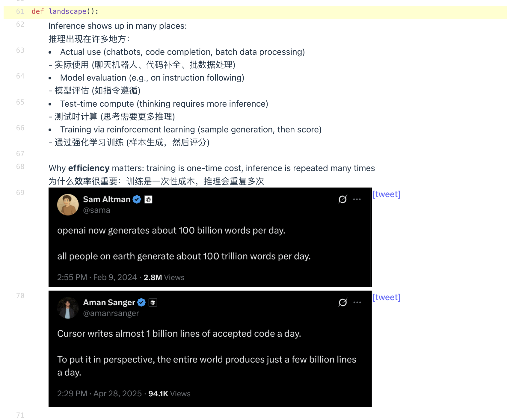

**英文**: And then finally, even training itself, if you're using reinforcement learning, you need to sample responses and then evaluate them based on some reward. And that also requires inference. So inference isn't just, I want to put up a chatbot demo. Infrains actually is going to underlie many of the basic functions of a language model. And even though it's one lecture, I want to stress how actually important it is for many things. And we'll probably come back to this when we talk about an alignment later in the class. So now inference is important. So the theme of this class is efficiency, clearly matters. Training is a one-time cost, but inference you repeat multiple times. So here's some the old anecdote.

**中文**: 最后，即使是训练过程本身，如果你使用强化学习（reinforcement learning），也需要采样响应并根据某种奖励对其进行评估，这同样需要推理。因此，推理不仅仅是“我想搭建一个聊天机器人演示”那么简单。实际上，推理构成了语言模型许多基本功能的基石。尽管我们只用一节课来讲解，但我必须强调它对众多任务的重要性。稍后当我们讨论对齐（alignment）问题时，可能还会回过头来探讨这一话题。

既然推理如此重要，那么本课程的主题——效率，显然就至关重要了。训练是一次性成本，而推理则需要重复多次。这里有一个老生常谈的轶事：

**英文**: Stats on why inference is a big deal. So Sam says, opening out generates. a hundred billion words a day, which is quite a lot. And even cursor, which is not that new of a product, is allegedly generating a billion lines of accept the code each day. So it's just gave you an idea of how much inference is a counting for. And a cost of inference compared to training are definitely increasing. So how do you measure what inference, good inference looks like? So there's time to first token, TTFT. So this is how long an individual user needs to wait before any generation happens at all. And this matters clearly for interactive applications. If you have a big prompt and then you have to wait there for 10 seconds, that may not be a good user experience.

**中文**: 以下是关于“为何推理如此重要”的统计数据。山姆（Sam）表示，OpenAI 每天生成一千亿个单词，这是一个相当庞大的数字。即使是 Cursor 这样一个相对较新的产品，据称每天也能生成十亿行被用户接受的代码。这些数据足以让你了解推理的规模之大。而且，与训练相比，推理的成本正在显著增加。

那么，如何衡量什么是“良好的推理”呢？其中一个指标是“首令牌时间”（Time to First Token, TTFT）。这指的是单个用户在生成任何内容之前需要等待的时间。对于交互式应用来说，这一点显然至关重要。如果你的提示（prompt）很长，而用户必须等待 10 秒才能看到反应，那用户体验恐怕不会太好。

**英文**: Latency is how fast tokens are arriving after maybe the first token. This also matters for interactive applications. Thruplud is something a bit different. Thruplud is how many tokens in general generated per not for overall users. So this is particularly useful in batch processing applications. So you can think about that Thruplud is,. high Thruplud doesn't mean low latency because some requests might just take very long time and you still have high throughput. Latency is kind of like the worst case over any of your user. So what do you need to think about when you think about the efficiency of inference? So in training, the key idea is that you get to see all the tokens,. at least it provides training, which means that you can paralyze over the sequence.

**中文**: 延迟（Latency）是指首个 token 生成后，后续 token 到达的速度。这对于交互式应用同样至关重要。

吞吐量（Throughput）则有所不同，它衡量的是整体系统每秒能生成多少个令牌（通常针对所有用户而言）。这在批量处理应用中特别有用。需要注意的是，高吞吐量并不等同于低延迟，因为某些请求可能耗时很长，但系统整体的吞吐量依然可以很高。延迟更像是针对任意单个用户的最坏情况等待时间。

那么，在考虑推理效率时，你需要思考哪些因素呢？在训练中，关键理念是你能够看到所有的令牌（至少在用于训练的数据中），这意味着你可以对序列进行并行化处理。

**英文**: This is exploited heavily in the transformer. So you've done the transformer training. You know that you basically construct these tensors over the entire sequence. And it's just like tensor, tensor, tensor, you know, mammals. And then you get your output. But the key defining feature of inference, at least for transformers, is that you have to generate sequentially. You can't paralyze because the generation of a token depends on all of the past. So this is going to be the key thing that's going to make inference a lot harder. And in particular, it's going to be harder to utilize all of the compute that's available. And it's going to be memory limited, as we'll see in detail later.

**中文**: 这在 Transformer 架构中得到了充分利用。如果你进行过 Transformer 训练，就会知道基本上需要针对整个序列构建这些张量（tensors）。整个过程就是张量、张量、再张量的运算（原文此处 "mammals" 应为语音识别错误，实指 "matmuls"，即矩阵乘法），最终得到输出。

然而，推理（至少对于 Transformer 而言）的关键定义特征在于：你必须按顺序生成内容。你无法进行并行化处理，因为每个令牌的生成都依赖于之前所有的内容。这正是导致推理变得困难重重的核心原因。

具体而言，这将使得充分利用所有可用的计算资源变得更加困难。此外，正如我们稍后将详细讨论的那样，推理过程还将受到内存的限制。

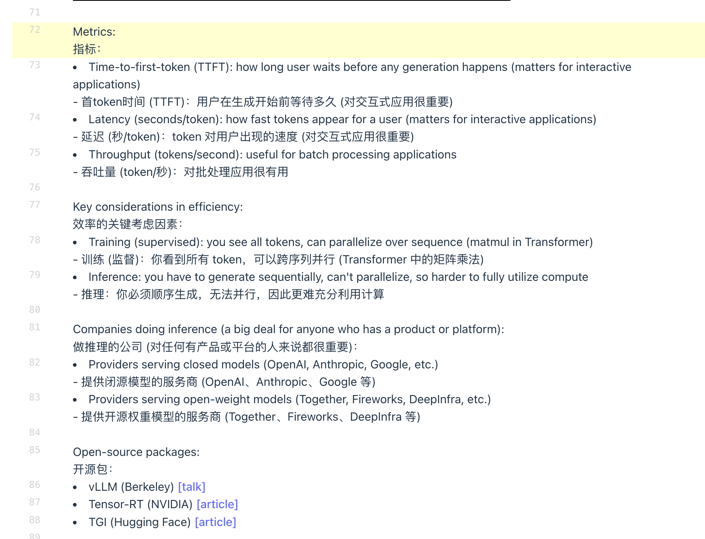

**英文**: So a lot of people are doing inference. Anyone who's actually has a product and platform quickly realizes that these costs in doing large models is going to go up. So they spend a lot of time and engineering. effort trying to reduce that time. So both provider serving close models and provider serving open weight models pay a lot of attention to inference. More so than, I think, the average academic, because we're not actually serving any models. We're just training and getting a score and putting in the paper. But people who are actually serving models. pay a lot of attention to inference. So there's also a bunch of open source packages, which are interesting to look at as well.

**中文**: 因此，许多人都投身于推理领域。任何拥有实际产品和平台的人很快都会意识到，运行大模型的成本将会不断攀升。于是，他们投入了大量的时间和工程精力，试图降低这些成本。

无论是提供闭源模型的服务商，还是提供开源权重模型的服务商，都对推理给予了高度关注。我认为，他们的重视程度远超普通学术界人士，因为学术界通常只是训练模型、获取评分并将其写入论文，而无需真正部署服务。相反，那些实际部署模型的人必须高度重视推理环节。此外，还有一些有趣的开源软件包也值得关注。

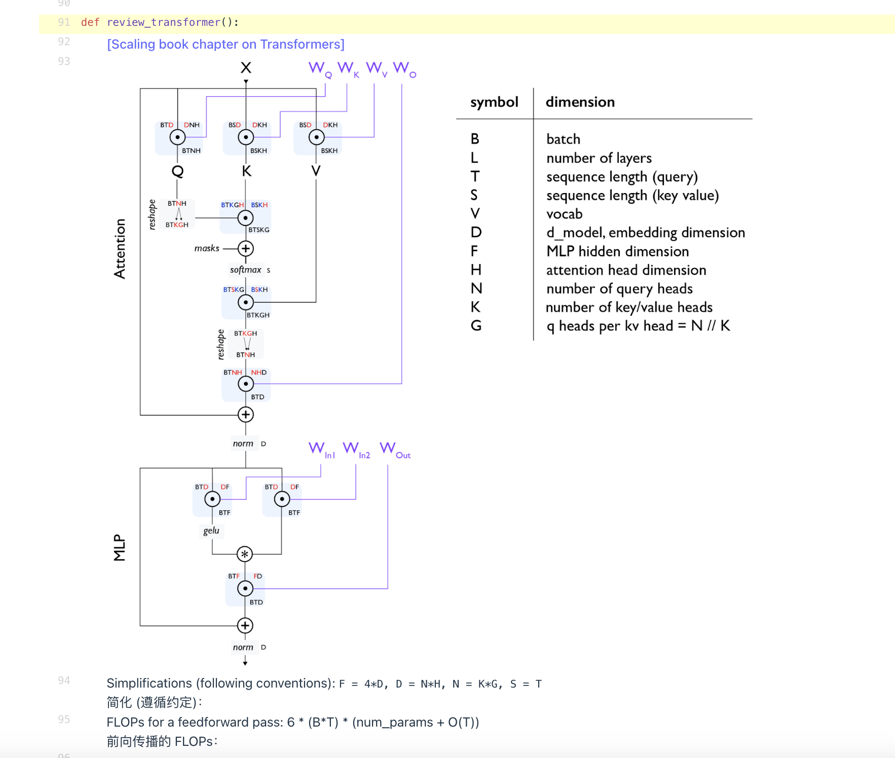

**英文**: OK, so I want to understand the inference workload kind of in detail. So I'm going to review briefly the sort of this transformer math that you did in assignment 1. We talked a little bit about it during the first week of class. So this is from the scaling JaxML book, which is something you guys should really take a look at. I think it does an excellent job of outlining many of the key concepts here. And they have this really nice diagram that shows essentially the computation graph taken in input and having go through attention and the MLP layers. In particular, we're going to use this notation. So just to kind of review this quickly. So B is the number of sequences in your batch, L is the number of layers, T is the sequence length. You can think about as the number of tokens you're going to generate or query using. As is also the sequence length, but how many are kind of conditioning on in your prompt. V is of a vocabulary, D is the dimensionality of your model. F is the MLP hidden dimension, which is usually 4 times D. H is the attention head dimension N is the number of query heads, or generally N times H equals D. And then in GQA, group query attention, you have a different number of key value heads as query heads, usually K is smaller than N. And G is the number of groups. So K times G equals N. And this diagram. shows that you take your X, you feed through the QKV matrices, and you do a bunch of things. OK.

**中文**: 好的，我想详细地了解一下推理工作负载（Inference Workload）。

为此，我将简要回顾一下大家在作业 1中接触过的 Transformer 数学原理。我们在课程第一周也稍微讨论过这部分内容。

这些内容主要参考了 《Scaling Laws for Neural Language Models》（或者更可能是指相关的 JAX/ML 系统书籍，如Deep Learning with JAX 或The Scaling of Transformer Models 相关章节，原文提到的 "scaling JaxML book" 可能指代特定的教材资源），我强烈建议大家去阅读这本书，它在梳理许多关键概念方面做得非常出色。

书中有一张非常棒的图表，清晰地展示了计算图（Computation Graph）：输入数据进入模型后，依次经过 注意力层（Attention） 和 前馈神经网络层（MLP） 的处理。

特别是，我们将采用以下符号约定，先快速回顾一下：

B：批次大小（Batch Size），即批次中的序列数量。
L：层数（Number of Layers），模型的深度。
T：序列长度（Sequence Length），在这里可以理解为我们要生成的 token 数量，或者是查询（Query）所使用的长度。
S：也是序列长度，但特指在提示词（Prompt）中用于条件约束（Conditioning）的 token 数量（即预填充阶段的长度）。
V：词表大小（Vocabulary Size）。
D：模型维度（Model Dimensionality），即隐藏层的大小。
F：MLP 隐藏层维度（MLP Hidden Dimension），通常是 4 times D。
H：注意力头维度（Attention Head Dimension），即每个头的向量大小。
N：查询头数量（Number of Query Heads）。通常满足 N times H = D。
GQA (Grouped Query Attention)：在分组查询注意力机制中，键值头（Key-Value Heads）的数量与查询头数量不同。
    K：键值头的数量，通常 K < N。
    G：组数（Number of Groups）。
    关系式：K times G = N（即每组查询头共享一个键值头）。

这张图表展示了整个流程：你将输入 X 送入，经过 QKV 矩阵（查询、键、值投影矩阵）进行变换，然后执行一系列复杂的计算操作

**英文**: So remember that the flops required for a fee for pass is 6 times the number of tokens, which is B times T, times the number of parameters for the attention. There's another order T. So T times T is T squared dependence. OK. So let's also review arithmetic and intensity, which is going to help us characterize when something is compute limited versus memory limited. So just to start with the basic mammal. So let's take matrix X, which is B by D, and a matrix W, D by F. And just to give some color to this computation, B is the batch size D that hidden dimension, and F is the upper projection matrix in the gate at MLP. So let's do count the number of flops and memory reading rights for just doing X times W. OK.

**中文**: 请记住，前向传播（forward pass）所需的浮点运算次数（FLOPs）大约是 **6 倍** 的令牌数量（即 $B \times T$）乘以注意力机制中的参数数量。此外，这里还存在一个关于 $T$ 的阶数依赖关系，即 $T \times T$，呈现出 $T^2$ 的依赖性。

接下来，让我们回顾一下**算术强度**（Arithmetic Intensity）的概念。这将有助于我们区分某个操作是受限于计算能力（compute-limited）还是受限于内存带宽（memory-limited）。

我们先从基础的矩阵乘法（matmul）开始。假设有一个 $B \times D$ 的矩阵 **X** 和一个 $D \times F$ 的矩阵 **W**。为了让这个计算过程更具体一些，我们可以这样定义：
*   **B**：批次大小（batch size）；
*   **D**：隐藏层维度（hidden dimension）；
*   **F**：门控 MLP（Gated MLP）中的上投影矩阵维度。

现在，让我们仅仅针对 **X 乘以 W** 这一操作，来统计其所需的浮点运算次数（FLOPs）以及内存的读取和写入量。

**英文**: So we can start with initialize is 0. And what one has to do for this is we're going to read X from HBM. So that means it can encourage a memory cost of 2 times B times D, assuming everything is a BF16. You also read W. So that's 2 times D times F. Then you do the mammal. And that encouraged 2 times B times D times F flops. So remember this is from the first lecture. So hopefully this is review. And then you have to write it back out, which is you have to pay another transfer.

**中文**: 我们可以从初始化为 0 开始。具体操作步骤如下：

首先，我们需要从高带宽内存（HBM）中读取矩阵 **X**。假设所有数据均为 BF16 格式，这将产生 $2 \times B \times D$ 的内存传输开销（字节数）。
接着，我们读取矩阵 **W**，这将产生 $2 \times D \times F$ 的内存传输开销。

然后，我们执行矩阵乘法运算。这一步需要 $2 \times B \times D \times F$ 次浮点运算（FLOPs）。希望大家还记得这是第一讲的内容，所以这应该是一次复习。

最后，我们需要将计算结果写回内存，这意味着还需要支付一次数据传输的开销。

**英文**: So the total number of flops is just the mammal. And the number of bytes transferred. is essentially the size of all the matrices that are red and written. And everyth American density is basically the ratio. So the ratio is this expression. And in general, just to simplify things a bit, generally the batch size is much less than D and F. B may be 100 and D and F might be 1,000 or 1,000 or 1,000. So I'm using Sympi here just to keep myself from making silly mistakes. So basically, I'm letting C go in infinity and D scales as C times B and F scales as C times B. And that gets you a simplified equation of B.

**中文**: 因此，总的浮点运算次数（FLOPs）仅来自矩阵乘法部分。而传输的字节数本质上就是所有被读取和写入的矩阵大小之和。**算术强度**（Arithmetic Intensity）基本上就是这个比率。

具体来说，这个比率的表达式如上所示。为了简化问题，通常情况下批次大小（$B$）远小于维度 $D$ 和 $F$。例如，$B$ 可能是 100，而 $D$ 和 $F$ 可能是 1000 或更大。

我在这里使用 SymPy（符号计算库）只是为了避免犯低级的计算错误。基本上，我假设一个缩放因子 $C$ 趋向于无穷大，其中 $D$ 按 $C \times B$ 的比例缩放，$F$ 也按 $C \times B$ 的比例缩放。经过这样的推导，最终得到了一个简化的方程，结果约为 $B$。

**英文**: So the arithmetic intensity is B for this particular matrix multiplication. And the way to interpret this is how many flops are done per byte that was transferred. So now the second part is you look at the accelerator, which. for H100, a flops per second is 98, 98, 89, terror flops, memory bandwidth, 3. 3, terror bytes per second. And you divide. And that gives you what is called the accelerator intensity. And if you look at the computation intensity, which is B, if it's greater than a accelerated intensity, that means you're compute limited. That means you're able to use all the GPUs or TPUs. And if you're less than that, then your memory limited, which is bad.

**中文**: 因此，对于这个特定的矩阵乘法运算，其**算术强度**（Arithmetic Intensity）等于 $B$。

对此的解读是：每传输一个字节的数据，能执行多少次浮点运算（FLOPs）。

接下来第二部分，我们来看加速器硬件本身。以 **H100** 为例：
*   其浮点运算能力约为 **989 TFLOPS**（原文口语中的 "98, 98, 89" 应指代约 989 Tera FLOPS）；
*   其内存带宽约为 **3.3 TB/s**（3.3 Tera Bytes per second）。

将这两者相除（计算能力除以带宽），得到的值被称为**加速器强度**（Accelerator Intensity，即硬件的临界算术强度）。

现在进行对比：
*   如果你的计算算术强度（即这里的 $B$）**大于**加速器强度，说明系统是**计算受限**（compute-limited）的。这意味着你能够充分利用 GPU 或 TPU 的计算能力。
*   如果你的计算算术强度**小于**加速器强度，说明系统是**内存受限**（memory-limited）的，这通常是不理想的情况（因为计算单元会因为等待数据而空闲）。

**英文**: And so your compute limited in this matrix multiplication case, if B is greater than 295 for a H100. And all of this is a bit idealized, the actual details. This is giving you a first order approximation. So in an extreme case, that means if you use batches of size, let's say 300, then you'll be able to saturate the GPU. But what happens if your batch is really small? So in particular, B equals 1, which essentially corresponds to a matrix vector product, then the arithmetic intensity is basically 1. And that is really, really bad. That means you're going to be memory limited, and which makes sense because basically, you're reading and writing this D times,. actually, you're just reading this D times F matrix. And you're performing essentially in the same number of flops. So the ratio between the flops and the reads is the same, which gives you 1.

**中文**: 因此，在这种矩阵乘法场景下，**只有当批次大小 $B$ 大于 295（针对 H100 GPU）时，计算才会成为瓶颈（Compute-bound）**。

当然，上述所有分析都带有一定的**理想化色彩**，实际情况的细节要复杂得多。但这为我们提供了一个很好的**一阶近似（First-order approximation）**视角。

*   **极端情况（大批次）**：
    如果你使用较大的批次（例如 $B=300$），你就能够**饱和（Saturate）** GPU 的计算能力，使其火力全开，此时系统受限于计算速度。

*   **极端情况（小批次）**：
    但是，如果你的批次非常小会怎样？
    *   特别是当 **$B=1$** 时，这本质上变成了一个**矩阵 - 向量乘法（Matrix-Vector Product）**。
    *   此时，**算术强度（Arithmetic Intensity）** 基本上降到了 **1**。
    *   **这非常糟糕**。这意味着系统将完全受限于**内存带宽（Memory-bound）**。

**为什么这么差？**
道理很直观：
1.  你需要从显存中读取整个权重矩阵（大小为 $D \times F$）。
2.  而你执行的浮点运算量（FLOPs）大致与读取的数据量相当。
3.  **算术强度 = 浮点运算量 / 内存访问量**。
4.  在这种情况下，每读取一个数据元素，你只进行了大约一次运算，比率约为 1:1。
5.  由于现代 GPU 的计算速度远快于内存读写速度，这种低比率导致 GPU 大部分时间都在**等待数据从显存传输过来**，而不是在进行计算，从而造成了巨大的性能浪费。

**英文**: And 1 is bad. You want a lot of flops to be done for any memory read, because memory reads are slow. But this is an essence what happens with generation. Because you're proceeding token by token, we'll see that basically, your arithmetic intensity is going to be like 1. And that's why generations can be memory limited and not computer limited. So this is a very simple example that I think gets at the core of why generation is going to slow. So maybe I'll pause and take any questions on this,. just to make sure everyone's clear. Yeah. I mean, when do we get through? Why don't we have a batch? I don't see it.

**中文**: 值为 1 是很糟糕的。我们希望每读取一个字节的数据，就能执行尽可能多的浮点运算（FLOPs），因为内存读取的速度很慢。

但这恰恰是**文本生成**（generation）阶段的本质情况。由于生成过程是逐个令牌（token-by-token）进行的，我们会发现其算术强度大约只有 **1**。正因如此，生成阶段往往是**内存受限**（memory-limited）的，而不是计算受限的。

这是一个非常简单的例子，但它揭示了生成过程为何会变慢的核心原因。

那么，我暂时停在这里，看看大家是否有疑问，以确保每个人都理解了。

（听众提问）： “我是说，我们什么时候能处理完？为什么我们没有使用批次（batch）处理？我没看到相关部分。”

**英文**: Why should I find it? So I think I heard the question, why don't we have a batch size more than 1?. So I'll get to why you can. But there's batch sizes going to mean batch size time sequence length later. OK. So in summary, matrix multiplications are the core computation. So we just studied a matrix multiplication and counted the number of flops it requires. over the number of written writes. And we show that that ratio, which is the arithmetic intensity, depends on one of the dimensions, in case, in this case, the batch dimension. And that's why big matrices are good, because I can saturate your compute whereas if you have even a thin matrix B equals 1, that's really bad, because you're. spending a lot of time reading from memory and not doing that much compute.

**中文**: “我为什么要去找它？”

我想我听到了这个问题：**为什么我们的批次大小（batch size）不能大于 1？**

我会解释为什么你可以这样做。但请注意，这里的“批次大小”在稍后实际上意味着“批次大小乘以序列长度”（batch size $\times$ sequence length）。

**总结一下：**
矩阵乘法是核心计算任务。我们刚刚研究了一个矩阵乘法案例，计算了其所需的浮点运算次数（FLOPs）与内存读写字节数的比值。我们证明了这个比值——即**算术强度**（Arithmetic Intensity）——取决于其中一个维度，在本例中就是**批次维度**（$B$）。

这就是为什么**大矩阵**是好的：因为它们能够让你的计算单元达到饱和状态（充分利用算力）。相反，如果你使用的是非常“薄”的矩阵（例如 $B=1$），情况就会很糟糕，因为你会花费大量时间在内存读取上，而实际执行的计算量却很少。

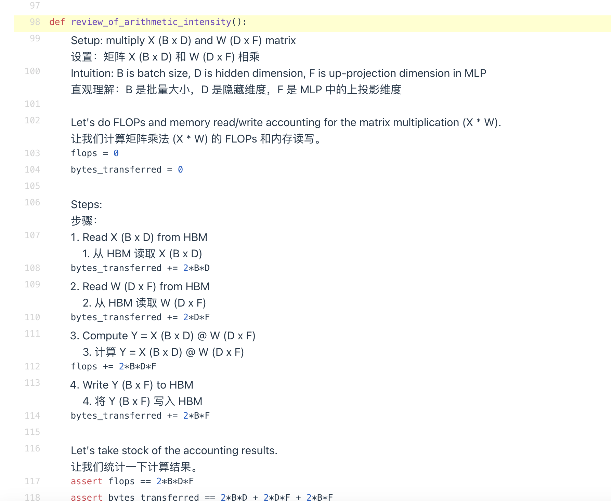

**英文**: OK. So now let's talk about the arithmetic intensity of inference. OK. So let's just get more into the weeds of what inference looks like. So the naive thing you can imagine doing, and all these nice pictures are taken from this book, is that you have a transformer. You give the prompt in. It gives you logits over the vocabulary of the next token. And you just sample from that. And then once you get that, you attach it to the prompt. And then you speed it through the transformer.

**中文**: 好的，现在让我们来谈谈**推理**（inference）的算术强度。

让我们更深入地探讨一下推理过程的具体细节。你可以想象一种最**朴素**（naive）的做法（这些精美的示意图都摘自这本书）：

你有一个 Transformer 模型，输入提示词（prompt），模型会输出关于下一个令牌（token）在整个词汇表上的 **logits**（未归一化的预测分数）。然后你从中采样得到一个令牌。一旦得到这个令牌，你就把它附加到原来的提示词后面，接着将这个更新后的序列再次送入 Transformer 中进行处理。

（注：这个过程不断重复，每次只生成一个令牌，即所谓的“自回归”生成方式。）

**英文**: And you look at the logit, sample again. And you repeat. So that's the sort of most naive thing to do. And the complexity here is pretty bad, because each token you generate is n squared or t squared your computation through the transformer. So that's no good. But if you look at this closely, you'll notice that you're doing a lot of redundant work. All of these, the work in computing the prefix basically stays the same. So this is for a bidirectional transformer would be different, but at least for a autogressive causal transformer, it is the case that you should be able to share a lot between prefixes. And so the solution is you cache. And you cache in the IBM HVM, because that's where you have enough space to store stuff.

**中文**: 然后你查看生成的 **logits（未归一化概率）**，再次进行采样，并重复这个过程。

这是最**朴素（Naive）**的生成方式，但其**计算复杂度非常糟糕**：
*   每生成一个 token，你都需要通过 Transformer 进行一次完整的前向传播。
*   由于注意力机制（Attention）的计算量与序列长度呈平方关系（$O(T^2)$ 或 $O(N^2)$），随着生成的 token 越来越多，计算负担会急剧增加。这显然是不可接受的。

**然而，仔细观察你会发现，这里面存在大量的冗余计算：**
*   在每一步生成新 token 时，前面所有 **前缀（Prefix）** 部分的计算结果其实并没有改变。
*   对于**双向 Transformer**（如 BERT），情况可能不同；但对于**自回归因果 Transformer**（如 GPT 系列，用于生成的模型），前面的计算完全是可以复用的。
*   理论上，我们应该能够在不同的生成步骤之间**共享**这些前缀的计算结果。

**解决方案：缓存（Caching）**
*   我们引入 **KV Cache（键值缓存）** 机制。
*   我们将之前计算过的 Key 和 Value 向量存储起来，这样在生成下一个 token 时，就不需要重新计算整个序列的注意力，只需计算新 token 的 QKV，并与缓存中的历史 KV 进行交互即可。
*   **存储位置**：这些缓存必须存放在 **GPU 的高带宽内存（HBM, High Bandwidth Memory）** 中。
    *   *注：原文提到的 "IBM HVM" 极有可能是语音转文字的错误，结合上下文应指 "in the HBM" (High Bandwidth Memory) 或者 "in GPU HBM"。因为只有 HBM 才有足够的容量和速度来存储这些巨大的中间状态数据，而片上内存（SRAM）通常太小存不下整个序列的缓存。*

通过这种缓存机制，我们将每步生成的计算复杂度从 $O(T^2)$ 降低到了 $O(T)$，极大地提升了推理速度。

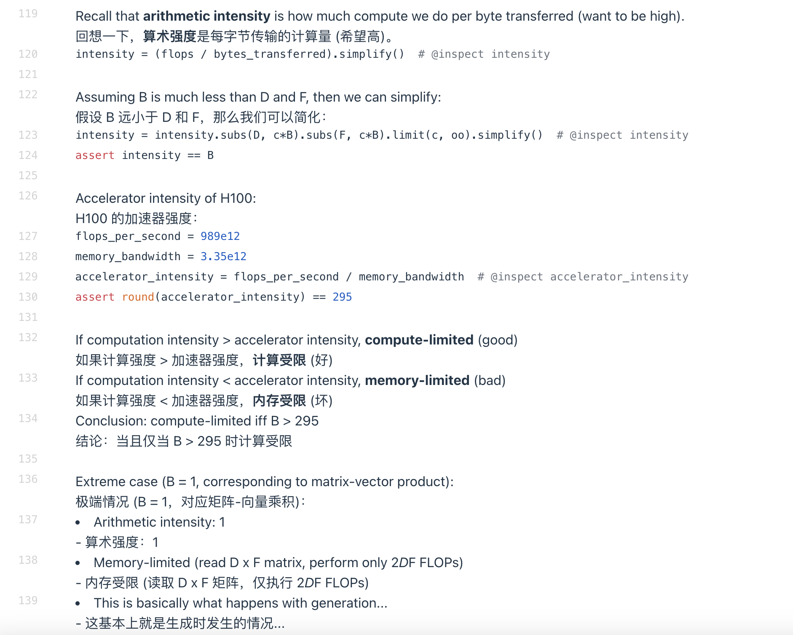

**英文**: So this is what looks like if you have a kV cache, it acts schematically. So you take your prompt. The pre-fill step is you feed it through the transformer, and you compute this kV cache. And then you generate the logits over the next token. And then you put that into take that generated token and the cache. And then you can feed it through the transformer, but you've already computed these. So you don't have to do that again. You just need to compute this new kV vector for this token. And now that allows you to more quickly generate. the next token and so on.

**中文**: 这就是引入 **KV 缓存**（KV Cache）后的工作原理示意图：

1.  **预填充阶段**（Pre-fill Step）：首先输入你的提示词（prompt），将其送入 Transformer，并计算出对应的 **KV 缓存**。
2.  **生成 Logits**：基于这些缓存，计算出下一个令牌的 logits（预测分数）。
3.  **迭代生成**：采样得到新生成的令牌后，将该令牌与现有的 KV 缓存结合，再次送入 Transformer。
    *   **关键点**：由于之前的计算结果已经保存在缓存中，你**无需重新计算**它们。
    *   你只需要为这个**新生成的令牌**计算新的 KV 向量。

这种机制使得生成下一个令牌的过程变得更加快速，并以此类推，持续进行后续令牌的生成。

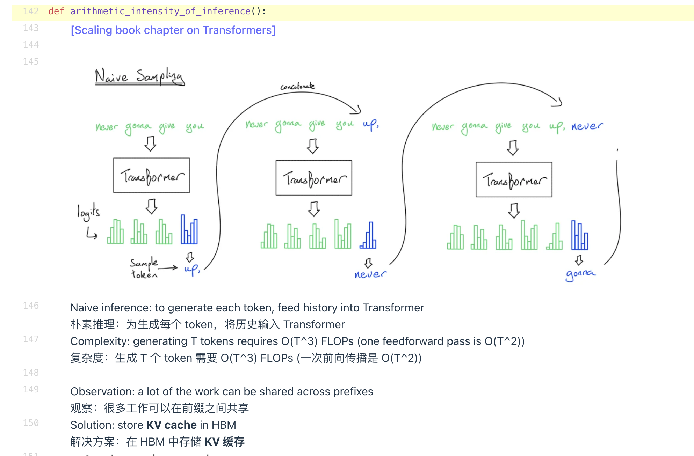

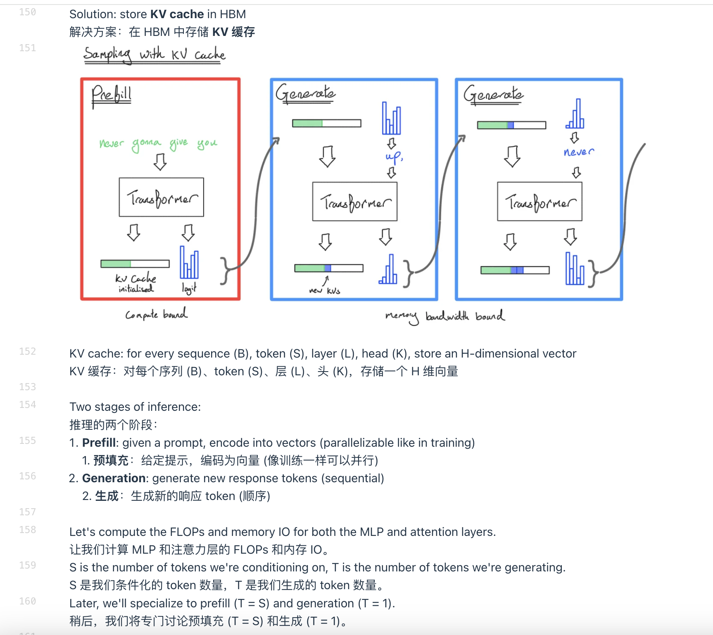

**英文**: So basically, you're filling up this kV cache, which corresponds to the tokens that you've either prefilled with or that you've generated so far. So instead of t squared per token, it's going to be more like t. So concretely, the kV cache is for every sequence in your batch, for every token in your sequence,. for every layer of the transformer, for every head, you're going to store an h-dimensional vector. So you might think that this is going to take a lot of memory and you wouldn't be wrong. So there's two stages of inference. So prefill is you're given your product and coded in a vector. So this is just like what you do in training. It's paralyzable. It's fast.

**中文**: 基本上，你正在填充这个 **KV 缓存**，其中包含了你预填充（prefill）的令牌以及迄今为止已生成的所有令牌。

因此，每个令牌的计算复杂度从 $O(T^2)$ 降低到了大约 $O(T)$（线性增长）。

具体来说，KV 缓存的存储需求如下：
对于批次（batch）中的**每一个序列**，序列中的**每一个令牌**，Transformer 的**每一层**，以及**每一个注意力头**（head），你都需要存储一个维度为 $h$ 的向量。

你可能会认为这会占用大量内存，你的直觉是正确的。

推理过程主要分为两个阶段：
1.  **预填充阶段**（Prefill）：你将输入的提示词（prompt）编码成向量。这一步的操作与训练时非常相似，具有高度的**可并行性**，因此速度很快。

**英文**: Your compute limited. A life is good. And then you're doing generation, which is your generating response tokens one by one, sequentially. And this is a part that's going to give us a lot of trouble in terms of efficiency. So now let's compute the flops and memory IO for both for the transformer. So we're going to break it down into MLP layers and attention layers. And just notation wise, we're going to do this computation with s being the number of tokens we're conditioning on, think about the length of the prompt. And t is the number of tokens we're generating or are querying using. And in prefill, t is going to be s because we're sort of,. I mean, we're not generating t tokens, but we're sort of like querying using each of these tokens.

**中文**: 此时计算是瓶颈（Compute-bound），日子过得很滋润。

然而，接下来进入**生成阶段（Generation）**，我们需要**逐个、顺序地**生成回复的 token。正是这一部分将在**效率**方面给我们带来巨大的麻烦。

现在，让我们分别计算 Transformer 中 **MLP 层**和**注意力层 Attention Layers**的 **浮点运算量 FLOPs**与**内存输入/输出 Memory IO**。

在符号表示上，我们将基于以下定义进行计算：
*   **$S$**：**条件 token 的数量**，你可以将其理解为**提示词（Prompt）的长度**。
*   **$T$**：我们要**生成**的 token 数量，或者是用于**查询 Query**的 token 数量。

**关于预填充阶段（Prefill）的说明：**
在预填充阶段，$T$ 实际上等于 $S$。
*   这并不是说我们要生成 $T$ 个新 token。
*   而是指我们利用这 $S$ 个 prompt token 中的**每一个**作为查询（Query）来进行前向传播计算（即并行处理整个 prompt）。

**英文**: And a generation where t is just 1. OK. So hopefully the matrix multiplication is so fresh in your head because this is going to be essentially that, but a little bit more complicated because it's a transformer. So we're going to count the flops and bytes generated. So first, we're going to take x, which is a b by t by d matrix. I think maybe these t should be s's, but anyway. So that involves doing a bunch of transfers. Basically the size of that matrix times 2 because b of 16. Then there's the three-way matrices, the up projection, the gate, and the down projection. They're all the same, you know, size up to transposition.

**中文**: 而在生成阶段（Generation），T 仅仅为 1。

好吧，希望大家脑海中对矩阵乘法的印象还非常清晰，因为接下来的内容本质上就是矩阵乘法，只不过因为是在 Transformer 架构中，所以稍微复杂了一些。

我们将具体计算生成的 浮点运算量（FLOPs） 和 数据传输量（Bytes）。

首先，我们处理输入 X，它是一个维度为 B X T X D 的矩阵。注：讲师提到这里可能有些混淆，某些情况下这里的 T 其实应该是 S（提示词长度），但暂且不管它，我们继续分析。

这一步涉及大量的数据传输：
数据量基本上是该矩阵大小的 2 倍。
这是因为我们通常使用 BF16（Bfloat16） 精度，每个元素占 2 个字节（读取一次权重，读取/写入一次激活值，或者指权重量化前后的搬运，具体语境通常指读写总流量）。

接下来是 三组矩阵变换，对应 MLP 层中的：

- 上投影（Up Projection）
- 门控投影（Gate Projection）
- 下投影（Down Projection）

这三个矩阵的规模在本质上是相同的（最多只是转置的区别）：
上投影和门控投影通常将维度从 D 扩展到 F（通常是 4D）。
下投影将维度从 F 压缩回 D。
因此，它们的参数量级和计算模式是非常相似的。

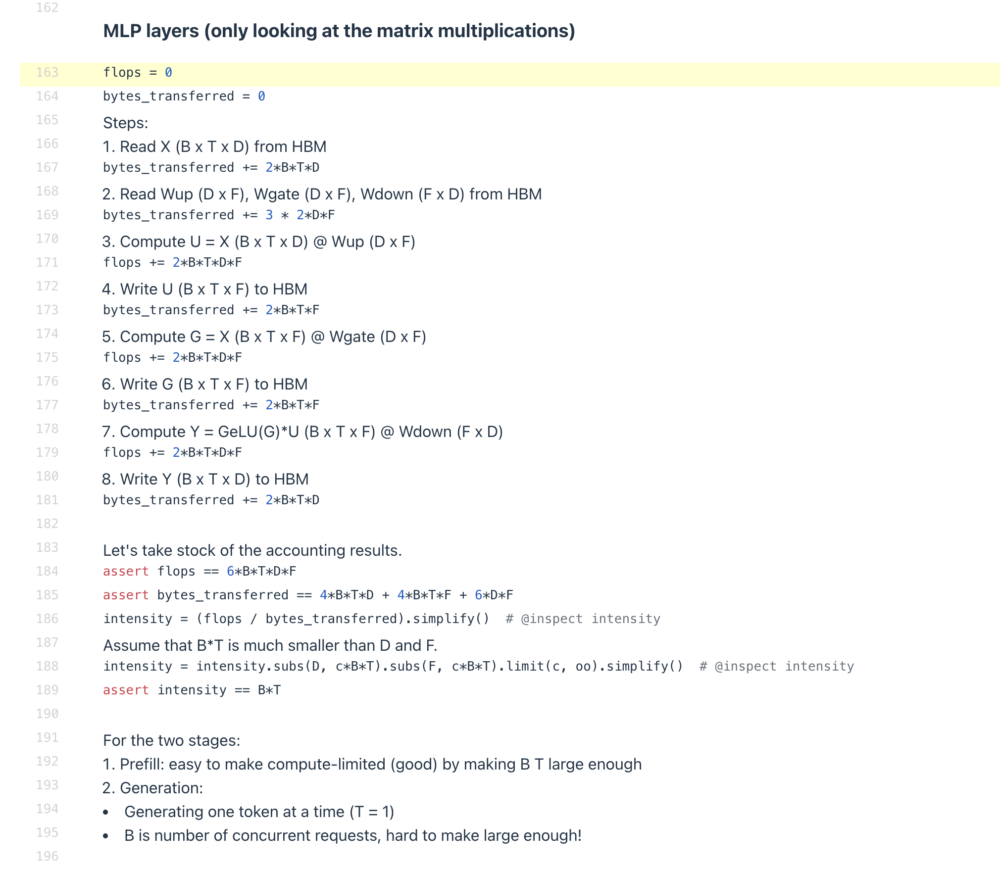

**英文**: So you need to transfer those. Then you do the up projection. That's some number of flops. So b times the dependency times f. So we're going to multiply two tensors, basically contracting dimension only gets counted once. Whereas other dimensions, you just kind of gather together. You need to write it out. You also have the gate, which is the same thing. You write it out. You compute your non-linearity.

**中文**: 所以，你需要传输这些权重数据。

接着执行**上投影**（up projection），这会消耗一定的浮点运算量（FLOPs）。具体来说，运算量约为 $b \times \text{序列长度} \times f$（其中 $f$ 通常指中间层的隐藏维度）。
*   本质上，这是两个张量的乘法：在收缩维度（contracting dimension，即相乘后消失的维度）上只计算一次，而其他维度则是进行聚合。
*   计算完成后，你需要将结果写回内存。

**门控**（gate）操作也是同样的过程：读取数据、计算，然后将结果写回。

最后，你还需要计算**非线性激活函数**（non-linearity）。

**英文**: You multiply some stuff in your down project. And that's a b times t times d times f, which is basically the same number of flops. And you write out the result. So if you look at the counting, I guess maybe I'll just you can check the results. Actually, you don't need to check it because this is simple. And it's guaranteed to be correct. So again, we're going to assume that b times d is much smaller than dn f. And we get that the intensity is b times t. So this is analogous to the matrix multiplication case where the arithmetic intensity, which we want to be high, depends on how large your batch is and how many tokens you're essentially generating. So now if you look at the two stages, pre-fill, life is good.

**中文**: 你在**下投影**（down projection）中执行一些乘法运算。其浮点运算量（FLOPs）约为 $b \times t \times d \times f$，这与前面的运算量基本相同。计算完成后，你需要将结果写回内存。

如果你查看具体的计数过程，我想你可以自行验证一下结果。其实也没必要验证，因为逻辑很简单，结果是确定正确的。

再次强调，我们假设 $b \times d$ 远小于 $d_{\text{intermediate}}$（即 $f$）。
由此我们可以得出，**计算强度**（Arithmetic Intensity）约为 $b \times t$。

这与矩阵乘法的情况类似：**计算强度**（我们希望它越高越好）取决于你的**批次大小**（batch size, $b$）以及你本质上正在生成或处理的**令牌数量**（$t$）。

现在，如果我们回顾这两个阶段：在**预填充**（prefill）阶段，一切都很顺利（因为 $t$ 很大，计算强度高，计算单元利用率高）。

**英文**: Remember, because we can just make b t large enough. You use a batch size. Even a batch size of 1 actually is maybe OK if you have long enough sequence. So that's not a problem. Now, generation, this is where it becomes a little bit harder. because you're generating one token at a time. So t is 1. So if t is 1, that means for b t to be large, you need b to be large. And b is essentially the number of concurrent requests. So this is kind of interesting because your sort of efficiency depends on having large batch sizes.

**中文**: 记住，在预填充阶段，我们只需让 $b \times t$ 足够大即可。你可以利用**批次大小**（batch size）来实现这一点；实际上，即使批次大小为 1，只要**序列长度**足够长，也是可以的。所以这不成问题。

然而，到了**生成**（generation）阶段，情况就变得有些棘手了。
因为你是**逐个令牌**（one token at a time）进行生成的，所以 $t = 1$。

如果 $t = 1$，那么为了让 $b \times t$ 保持较大数值，你就必须让 **$b$**（批次大小）变得很大。而这里的 $b$ 本质上就是**并发请求的数量**。

这就引出了一个有趣的结论：你的系统**效率**在很大程度上取决于能否维持**较大的批次大小**。

**英文**: Because intuitively it makes sense. If you can take a lot of requests batching together, then you can get better efficiency, at least through put. But this also depends on what b is. Because if you're only getting a few requests at a time, then you're not going to be able to use your hardware very efficiently. And this talks speaks to the sort of the very dynamic aspect of inference, which we'll come back to later in the lecture. OK, so now what about attention? Turns out attention is even worse for reasons I'll try to get into. So let's do the accounting, flops, bytes transferred. OK, so I'm going to read the QKV matrices from HBM. I'm going to compute the attention, which is matrix, which is Q times K. And the number of flops is b times s times t times d.

**中文**: 这一直观上是合理的：如果你能将大量请求**批处理**（batching）在一起，那么至少从**吞吐量**（throughput）的角度来看，效率会更高。

但这同时也取决于 **$b$** 的大小。如果你每次只能收到少量请求，那么你就无法高效地利用硬件资源。这也揭示了推理（inference）过程中非常**动态**的一面，我们在讲座的后面部分还会再回到这个话题。

好了，那么**注意力机制**（Attention）的情况如何呢？事实证明，由于我接下来要解释的原因，注意力机制的情况甚至更糟。

让我们来进行一下核算，计算**浮点运算量**（FLOPs）和**传输字节数**（Bytes transferred）。

首先，我需要从**高带宽内存**（HBM）中读取 **Q、K、V 矩阵**。
接着，我要执行注意力计算，核心是矩阵乘法 $Q \times K^T$。
这部分的浮点运算量约为 $b \times s \times t \times d$。
*(注：这里 $s$ 通常指序列长度或键值对的长度，$t$ 指查询的长度，在预填充阶段两者往往相等；在生成阶段 $t=1$)*

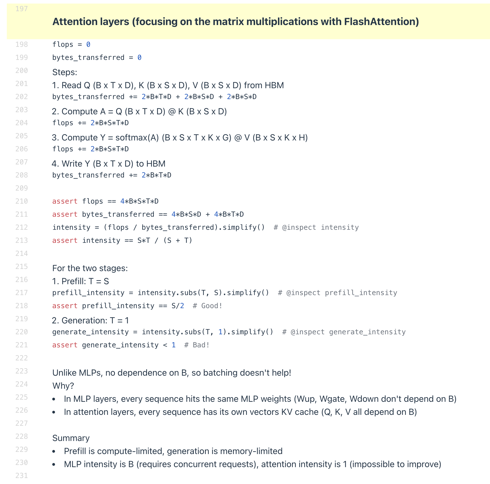

**英文**: So remember, s and t are the same during a prefel. So that's your sequence length squared times b times d. And then I'm sort of only looking at the matrix multiplications because the flops from other steps don't really matter. And then you project out to, oh, sorry, you take a combination of this and v. So actually, this is mathematically incorrect because there's some softmaxes there. But the essence of the map balls are the same. So that's the same number of flops. And then you write to HBM. OK, so here I'm assuming there'll be more bytes transferred. If you didn't use flash attention, flash attention means that you don't have to keep on writing back to HBM into intermediate steps.

**中文**: 记住，在**预填充**（prefill）阶段，$s$ 和 $t$ 是相等的。因此，这部分的运算量大致为 $b \times d \times (\text{序列长度})^2$。

这里我主要关注**矩阵乘法**部分，因为其他步骤产生的浮点运算量（FLOPs）相对微不足道，可以忽略不计。

接下来，你需要将结果与 **V**（Value）矩阵进行组合（即加权求和）。
*注：严格来说，这里的描述在数学上是不完全准确的，因为中间还包含 **Softmax** 操作。但从计算量（FLOPs）的估算角度来看，其数量级是相同的，所以我们可以认为这部分的运算量与前面相当。*

计算完成后，你需要将结果写回 **HBM**（高带宽内存）。

在这里，我假设会有大量的字节需要进行传输。
*   **如果不使用 Flash Attention**：你就必须在中间的每一步都将数据反复写回 HBM，然后再读出来，这会导致巨大的内存带宽开销。
*   **如果使用 Flash Attention**：其核心优势就在于避免了这种在中间步骤频繁读写 HBM 的操作，从而显著减少了数据传输量。

**英文**: But the order is actually not really affected. So qualitatively, it doesn't really matter whether you use flash attention or not. But the math here depends on the constants matter. But let's look at the flops and the bytes transferred. And if you divide and simplify, you get this rather nice expression. I mean, nice in that it's simple, not nice in that it's good efficiency, which is s times t divided by s plus t. So let's try to interpret this a bit. So in prefill, t equals s. So that means your prefill intensity is order s. So that's good, right? Because as long as you have long enough sequences, then you're good to go.

**中文**: 不过，（是否使用 Flash Attention）在**量级**（order）上其实并没有太大影响。

从**定性**（qualitively）的角度来看，用不用 Flash Attention 区别不大；但在**定量**计算时，具体的常数系数确实会有所不同。

让我们来看看**浮点运算量**（FLOPs）与**传输字节数**（Bytes transferred）的比值。如果我们将两者相除并化简，会得到一个相当简洁的表达式：
$$ \frac{s \times t}{s + t} $$
我说它“简洁”是指公式形式简单，但这并不意味着它的**效率**很高——事实上，这个效率往往并不理想。

让我们来解读一下这个公式：
在**预填充**（prefill）阶段，$t = s$（查询长度等于键值序列长度）。
这意味着预填充阶段的**计算强度**（Arithmetic Intensity）的量级为 **$O(s)$**（即与序列长度成正比）。

这其实是好事，对吧？因为只要你的**序列长度**（$s$）足够长，计算强度就会很高，从而能够很好地利用硬件资源。

**英文**: And generally, the sequences can assume long enough. During generation, however, you'll. see that the intensity is essentially 1, s over s plus 1. But that's basically 1. And remember, 1 is really bad. So but notice like, what? There's no dependence on v at all. So unlike an MLP, remember an MLP's, the generation of the prefill was bt, which is great. And then every mega intensity was b, which was not great because it depends on the whims of your users and workloads, but still could be larger than 1. Whereas for attention, it's actually just always less than 1. No matter how long your sequences are, how many users there are, it's always 1.

**中文**: 通常来说，我们可以假设序列长度足够长。

然而，在**生成**（generation）阶段，你会发现计算强度本质上约为 **1**（即 $\frac{s}{s+1} \approx 1$）。
请记住，计算强度为 **1** 是非常糟糕的（意味着内存带宽是瓶颈，而非计算能力）。

但请注意一个关键点：这个结果**完全不依赖于 $b$**（批次大小/并发请求数）。

这与 **MLP**（多层感知机）层形成了鲜明对比：
*   **回顾 MLP**：
    *   在**预填充**阶段，其计算强度与 $b \times t$ 成正比，这非常理想。
    *   在**生成**阶段，其计算强度与 $b$ 成正比。虽然这不够完美（因为它取决于用户行为和负载的波动），但至少它**有可能大于 1**。
*   **对于注意力机制**（Attention）：
    *   在生成阶段，无论你的序列有多长，也无论有多少用户（即无论 $b$ 多大），其计算强度**始终小于或等于 1**。

**这意味着在生成阶段，注意力机制永远无法摆脱内存带宽的限制，无法通过增加批次大小来提升计算效率**。

**英文**: So why is this intuitively that there's no dependence on b, the batch dimension?. So the reason is that in the MLP layers, intuitively, every sequence hits the same MLP weights. So whereas in attention layer, each sequence has its own kv cache, because the kv cache is sequence specific, which means that you can't really use in the MLP case, you can read all the weights and then you process a batch intuitively. Whereas in an attention case, every sequence. kind of requires additional memory. You don't get any kind of savings if you batch them up. Mathematically, I guess you can look at it through here, where the number of flops, there's a b here, which is expected. But the number of bytes transferred is b times that there's a scaling in mb. So when you divide that b cancels, whereas over here, there is a b here, but we're assuming that df dominates. So when you divide, basically, there's no b essentially left in the denominator.

**中文**: 那么，直观上为什么这里**完全不依赖于 $b$**（批次大小/批处理维度）呢？

原因在于：
*   **在 MLP 层中**：直观地说，所有序列都共享同一组 **MLP 权重**。这意味着你可以一次性读取这些权重，然后对整个批次（batch）的数据进行处理，从而摊薄内存读取的开销。
*   **在注意力层**（Attention）：每个序列都有自己独立的 **KV Cache**（键值缓存），因为缓存是特定于每个序列的。这意味着每个序列都需要额外的内存空间。如果你将多个序列打包成批，你并不能像在 MLP 中那样获得“共享权重”带来的收益；相反，你需要为每个序列加载其独有的 KV 数据，因此无法通过批处理来节省单位数据的传输成本。

从**数学角度**来看，我们可以通过公式推导来理解这一点：
1.  **对于注意力机制**：
    *   **浮点运算量**（FLOPs）中包含因子 $b$（这是预期的，因为计算量随批次线性增加）。
    *   **传输字节数**（Bytes transferred）中也包含因子 $b$（因为每个序列都要读取自己的 KV 缓存，总传输量也随批次线性增加，即 $b \times \dots$）。
    *   当你计算**计算强度**（FLOPs / Bytes）时，分子和分母中的 $b$ **相互抵消**了。因此，最终结果与 $b$ 无关。

2.  **对于 MLP 层**（作为对比）：
    *   **浮点运算量**中包含因子 $b$。
    *   **传输字节数**主要取决于权重的大小（假设权重维度 $d_f$ 占主导地位），而权重是共享的，不随 $b$ 线性增长（或者说增长幅度远小于计算量的增长）。
    *   当你相除时，分母中基本上没有 $b$ 来抵消分子中的 $b$，因此最终的计算强度仍然保留了对 $b$ 的依赖性（即批次越大，效率越高）。

**英文**: So you can look at it mathematically, or you can just kind of reason about it intuitively as, for the attention, the kv cache is sort of every sequence is own unique snowflake. So the summary is, pre-fill is compute limited, where generation is memory limited. The MLP arithmetic intensity is b, which to make good enough, you need a bunch of concurrent requests. But attention intensity is 1, which, and it's also even possible to improve that. I'll pause a bit for any questions. OK, so let's move on. So now we know that inference is due thanks to generation is memory limited. Let's try to study the throughput and latency, at least in theory. So let's focus on, let's see, actually, OK. Let's see, actually, OK.

**中文**: 你可以从数学角度去分析，也可以直观地理解：对于注意力机制（Attention）来说，每个序列的 **KV Cache** 都是独一无二的（就像“独特的雪花”一样），无法像权重那样被批次内的所有序列共享。

**总结如下：**
*   **预填充（Prefill）阶段**：受限于**计算能力**（Compute-limited）。
*   **生成（Generation）阶段**：受限于**内存带宽**（Memory-limited）。

具体对比：
*   **MLP 层**的计算强度为 $b$（批次大小）。为了达到较好的效率，你需要大量的**并发请求**来增大 $b$。
*   **注意力层**的计算强度仅为 **1**，而且甚至很难通过常规手段去提升它。

我先暂停一下，看看大家有没有什么问题。

……

好的，那我们继续。
既然我们现在知道了推理过程（尤其是生成阶段）是受限于**内存带宽**的，接下来让我们尝试从理论上研究一下**吞吐量（Throughput）**和**延迟（Latency）**。

让我们把重点放在……让我看看……好吧，我们开始吧。

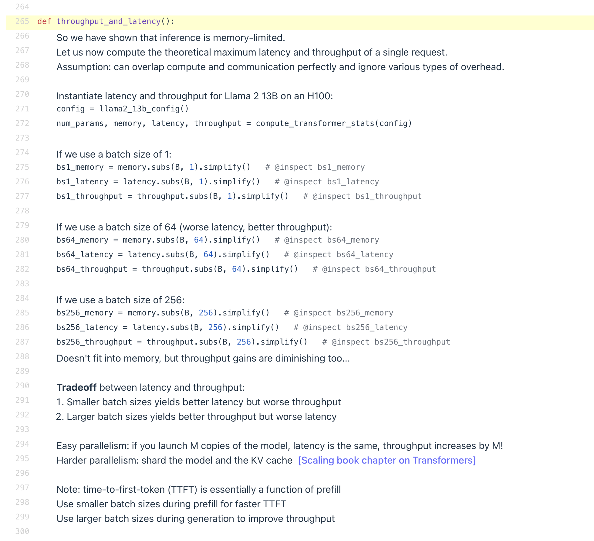

**英文**: So we're going to make some assumptions. So all of this sort of napkin math is a little bit stylized, but it gives you roughly the right kind of scaling and the right way to think about things. So we're going to assume that communication and compute can be perfectly overlapped, which is obviously false, but it's good enough for making these qualitative estimates. So what we're going to do is we're going to instantiate the latency and throughput for a long time to 13b on H100. So for a 13b, here are the values. So let's just put the sequence length to be 1,000,. hidden dimension to be 5,000, 4 times, actually. I don't know if that's not 4 times. But anyway, F is some multiple of that, number of heads, number of key value, I guess query heads, number of key value heads, which for a long time, two is the same. We'll get to that point later and so on.

**中文**: 所以，我们需要做一些假设。

所有这些“餐巾纸上的数学推导”（即粗略估算）虽然有些理想化，但它们能为你提供大致正确的**缩放规律**（scaling）和**思考方式**。

我们的假设如下：
*   **通信**（Communication）与**计算**（Compute）可以**完美重叠**。
    *   *注：这显然在现实中是不成立的，但对于进行这种**定性估算**来说已经足够好了。*

接下来，我们将以 **Llama-3 13B** 模型在 **H100 GPU** 上的运行为例，具体实例化其**延迟**（Latency）和**吞吐量**（Throughput）的计算。

对于 **13B** 模型，相关参数值如下：
*   **序列长度**（Sequence Length, $s$）：设为 **1,000**。
*   **隐藏层维度**（Hidden Dimension, $d$）：设为 **5,000**。
*   **中间层维度**（Feed-forward dimension, $d_f$）：通常是隐藏层维度的 4 倍（即 $4 \times 5,000$）。*（注：演讲者此处稍作迟疑，不确定是否严格为 4 倍，但通常如此设定）*。
*   **注意力头数**：包括查询头数（Query Heads）和键值头数（KV Heads）。
    *   对于 **Llama-3** 模型，我们稍后会详细讨论，但在某些配置或简化理解中，查询头数与键值头数可能是相同的（即标准多头注意力，而非分组查询注意力 GQA，或者此处演讲者是在做简化假设）。

我们将基于这些参数继续推导。

**英文**: And for the memory bandwidth of H100, that's the number. OK, so that's the config. And we're going to compute the memory, latency, and throughput. OK, so. So first, let's just quickly get the number of parameters. You guys did this in Simon 1, so I won't be labor this, but it's some expression that depends on all the different variables. And to store the parameters, we're going to use F, BF16, because inference is generally going to be 16 bit, not 32 bit. So we're going to multiply it to you. So that's the memory that the parameters take. OK, we don't need gradients, we don't need optimizer states because we're not training.

**中文**: 对于 **H100 GPU**，其**内存带宽**（Memory Bandwidth）就是那个数值（指代前文提到的具体带宽数据，如 3.35 TB/s 等）。

好了，配置参数已经确定。接下来我们将计算**内存占用**、**延迟**和**吞吐量**。

首先，让我们快速计算一下**参数量**。
大家在“Simon 1”（可能指之前的课程或练习）中已经做过这个了，所以我就不详细展开了。参数量是一个依赖于上述所有变量（如层数、隐藏维度、头数等）的表达式。

为了存储这些参数，我们将使用 **BF16**（Bfloat16）格式。
*   原因是：**推理**（Inference）通常使用 **16 位**精度，而不是训练时常用的 32 位。
*   因此，我们需要将参数量乘以 **2 字节**（即 16 位 = 2 字节），从而得到参数所占用的**内存大小**。

请注意：
*   我们**不需要**存储梯度（Gradients）。
*   我们**不需要**存储优化器状态（Optimizer States）。
*   因为我们要进行的任务是**推理**，而不是训练。

**英文**: But we do have to store the KV cache, which. are some of the activations, not all the activations, but some of them, for every sequence of length S. And how much do we have to per store per sequence? It's basically the sequence length times the number of key value heads times the dimension of that head, times the number of layers, times basically 2 for basically both the key and the value and 2 for BF16. OK, so that's how much the cache size takes. And so the total memory is the batch size times the cache per sequence plus the parameter size. So now, latency is going to be determined by memory. It's memory limited. So we're just going to compute how much memory needs to be transferred into the GPU to do this computation. And it's simply memory over the memory bandwidth. And throughput is essentially the inverse of latency,.ut scaled up by B, because we're looking at generating B tokens in parallel. So now, if we substitute our Lama 2 config, we'll see that the number of parameters checks out. It's 13 billion. Roughly, the memory, latency and throughput have these expressions. So memory grows, obviously, this is the parameter size. This is the key value cache size times B. latency also goes up as a function of B. throughput increases, but you'll see that it increases up to a point. The B shows up in both the numerator and the denominator. So there's limits to how much you can search throughput, even if you could put everything in memory.

**中文**: 但是，我们确实需要存储 **KV Cache**（键值缓存）。
*   它属于**激活值**（Activations）的一部分（并非所有激活值，只是其中一部分）。
*   对于每一个长度为 $S$ 的序列，都需要存储这份缓存。

**每个序列需要存储多少数据呢？**
计算公式如下：
$$ \text{单序列缓存大小} = \text{序列长度}(S) \times \text{KV头数} \times \text{每头维度} \times \text{层数} \times 2 (\text{Key和Value}) \times 2 (\text{BF16精度占用的字节数}) $$
这就是 **KV Cache** 所占用的内存大小。

因此，**总内存占用**为：
$$ \text{总内存} = (\text{批次大小 } B \times \text{单序列缓存大小}) + \text{参数总量} $$

接下来分析性能指标：
由于生成阶段是**受限于内存带宽**（Memory-limited）的，所以**延迟**（Latency）主要由需要从主机传输到 GPU 的内存总量决定。
*   **延迟** = $\frac{\text{需传输的总内存量}}{\text{内存带宽}}$
*   **吞吐量**（Throughput）本质上是延迟的倒数，但需要乘以批次大小 $B$，因为我们是在并行生成 $B$ 个 token。
    *   $\text{吞吐量} \approx \frac{B}{\text{延迟}}$

现在，如果我们代入 **Llama-2** 的配置参数进行验证：
*   **参数量**：计算结果约为 **130 亿**（13 Billion），与预期相符。
*   **内存、延迟和吞吐量**的表达式大致如下：
    *   **内存**：显然会随着 $B$ 增长。第一部分是固定的参数大小，第二部分是随 $B$ 线性增长的 KV Cache 大小。
    *   **延迟**：也会随着 $B$ 的增加而上升（因为要读取更多的 KV Cache 数据）。
    *   **吞吐量**：虽然会随着 $B$ 增加而提高，但你会发现它**存在上限**。
        *   原因：在吞吐量的公式中，$B$ 同时出现在**分子**和**分母**中（分母中的延迟项包含了与 $B$ 成正比的 KV Cache 读取时间）。
        *   结论：即使内存足够大能装下所有内容，**吞吐量也无法无限提升**，它会趋于一个饱和值。

**英文**: OK, so those are the expressions for latency, throughput, and memory for this particular model. So now, let's instantiate with different batch sizes. So if B equals 1, then the latency is about 8 milliseconds. So every 8 milliseconds, you generate a token. And the throughput is 124 tokens per second. So that's 13B on H100 if you're using batch size of 1. So now, what happens if you use batch size of 16? So you'll see that the memory usage increases because you need to store the KV cache for all 64 sequences now. The latency goes up because you kind of have to, instead of just processing one, you have to kind of wait for everything to finish. But the throughput also goes up actually quite a lot. So you're seeing kind of this immediate trade-off between latency and throughput.

**中文**: 好的，以上就是该模型在**延迟**、**吞吐量**和**内存占用**方面的理论表达式。

现在，让我们代入不同的**批次大小**（Batch Size, $B$）来进行具体计算：

*   **当 $B = 1$ 时**：
    *   **延迟**（Latency）：约为 **8 毫秒**。这意味着每 8 毫秒生成一个 token。
    *   **吞吐量**（Throughput）：约为 **124 tokens/秒**。
    *   这就是在 **H100 GPU** 上运行 **13B 模型**且批次大小为 1 时的性能表现。

*   **当 $B = 16$ 时**（注：原文此处口误说成了“64 个序列”，但根据上下文逻辑“batch size of 16”，应指 16 个序列）：
    *   **内存占用增加**：因为现在需要为所有 **16 个序列**存储 KV Cache。
    *   **延迟上升**：因为你不再只处理一个序列，而是必须等待整个批次中的所有序列都完成计算，这增加了单个请求的等待时间。
    *   **吞吐量显著提升**：尽管延迟增加了，但单位时间内生成的 token 总数（吞吐量）实际上大幅提高了。

这里我们看到了**延迟**与**吞吐量**之间直接的**权衡**（Trade-off）：
*   增大批次大小可以显著提高系统的整体吞吐量。
*   但代价是单个请求的延迟会变高。

**英文**: If you want low latency, you just use one B equals 1. But if you want high throughput, you want larger B in general. What happens if you use batch size of even larger? So 256. You'll see that low latency goes up, throughput goes up. But you see that throughput isn't going up that much because you get the machine returns after a while. But the most kind of, you can actually do this on A or 200. Because if you look at the memory, it's 240 gigs. So it doesn't even fit. So the batch size, you can only increase to a certain point because of memory. So just to recap, there's a trade-off between latency and throughput.

**中文**: 如果你想要**低延迟**，只需使用 **$B=1$**（批次大小为 1）。
但如果你想要**高吞吐量**，通常需要使用更大的 **$B$**。

那么，如果使用更大的批次大小，比如 **$B=256$**，会发生什么呢？
*   **延迟**会继续上升。
*   **吞吐量**也会继续上升。
*   **但是**，你会发现吞吐量的增长幅度开始变小，因为系统逐渐达到了**硬件性能的饱和点**（即前文提到的“machine returns”，意指收益递减或达到瓶颈）。

更关键的问题在于**显存容量**：
*   如果你尝试在 **A100**（原文口误说成 "A or 200"，结合语境应指 A100）上运行这个配置，会发现总内存需求高达 **240 GB**。
*   这显然**超出了显存限制**（A100 通常为 40GB 或 80GB），根本放不下。
*   因此，受限于**显存容量**，批次大小 $B$ 只能增加到某个特定的上限，无法无限增大。

**总结一下**：
在**延迟**和**吞吐量**之间存在一个核心的**权衡**（Trade-off）：
*   小批次 = 低延迟，低吞吐量。
*   大批次 = 高吞吐量，高延迟，且受限于显存大小和硬件饱和点。

**英文**: Smaller batch sizes, you would better latency, larger batch sizes, you'd better throughput. And finally, last week we talked about parallelism for training. And it was kind of complicated annoying. At least one type of parallelism for inference is really, really nice and simple. You just launch M copies of a model. No communication because you don't need to update the models. The latency is the same. And the throughput increases by M. So that's pretty good. So always remember that, don't forget easy things.

**中文**: **批次大小越小，延迟表现越好；批次大小越大，吞吐量表现越好。**

最后，上周我们讨论了用于**训练**的并行化策略，那些方法相当复杂且令人头疼。
但至少有一种用于**推理**的并行化策略非常简单、优雅：
*   **方法**：直接启动 **$M$ 个模型副本**。
*   **通信**：**不需要任何通信**。因为推理过程中不需要更新模型参数（没有梯度同步或参数平均的需求）。
*   **效果**：
    *   **延迟**保持不变（单个请求的处理时间不变）。
    *   **吞吐量**直接提升 **$M$ 倍**。

这非常高效。所以请务必记住这一点：**不要忘记那些简单易懂的解决方案。**

**英文**: Now, there are cases where if you have a large enough model,. then maybe it doesn't even fit on a single GPU. And you need to charge the model. And in this case, you also want to start sharding the KV cache in some cases to get better efficiency. So for more details, check out this book chapter. OK, so the time to first token, which is a metric I mentioned earlier, is essentially. a function of the pre-fill. It's basically how long does it take to encode the prompt. And usually, this is compute-limited. So you're basically going as fast as you can.

**中文**: 现在，有些情况下，如果模型足够大，它甚至**无法放入单个 GPU** 中。
*   这时，你就需要对模型进行**切分**（Sharding/Partitioning），将其分布在多个设备上。
*   在某些场景下，为了获得更高的效率，你还需要对 **KV Cache** 进行切分。
*   关于这些细节，可以参考相关的书籍章节（原文提及的参考资料）。

接下来讨论 **首字延迟**（Time to First Token, TTFT），这是我之前提到过的一个关键指标：
*   **定义**：它本质上取决于 **预填充阶段**（Pre-fill）的时间。
*   **含义**：也就是编码输入提示词（Prompt）需要花费多长时间。
*   **瓶颈**：这个阶段通常是**计算受限**（Compute-limited）的，而不是内存受限。
    *   这意味着系统会全速运行，尽可能快地完成计算，其速度主要取决于 GPU 的计算能力（FLOPS），而非内存带宽。

**英文**: And there's not much you can do about it given a fixed architecture. And well, OK, so sorry. You can improve it if you reduce the batch size still. But if you want to improve the throughput, you have to increase the batch size. So any questions about that? So this was on computing the throughput and latency. And because of the memory-limited argument that I gave in the previous part, I just focus on memory and compute how many bytes need to be sent. And that gives me a rough bound on the latency. In practice, the compute, there are some regimes where a compute does matter. But I'm sort of ignoring that just to keep things simple. OK, question? Is this a Ziumi-A-S-A-G-V-E? Yes, this is a Ziumi-A-S-A-G-V-E-G-V-E.

**中文**: 在架构固定的情况下，你对此**能做的优化非常有限**。

好吧，抱歉，刚才说得有点绝对：
*   如果你**减小批次大小（Batch Size）**，确实可以**改善延迟**。
*   但如果你想**提高吞吐量**，就必须**增大批次大小**。
关于这点大家有什么问题吗？

以上就是关于计算**吞吐量**和**延迟**的内容。
*   基于我在前一部分提到的**内存受限**（Memory-limited）论点，我主要关注了**内存**因素，即计算需要传输多少字节的数据。
*   这为我估算**延迟**提供了一个大致的上限（Bound）。
*   **实际情况**中，在某些特定区间内，**计算能力**（Compute）确实会成为瓶颈并影响结果。但为了保持讲解的**简洁性**，我暂时忽略了计算受限的情况，主要聚焦于内存带宽的限制。

好了，有问题吗？

（听众提问）：这是 **Ziumi-A-S-A-G-V-E** 吗？
（讲师回答）：是的，这是 **Ziumi-A-S-A-G-V-E-G-V-E**。
*(注：此处 "Ziumi-A-S-A-G-V-E" 极有可能是语音识别错误或特定的内部缩写/人名拼写，原文转录可能存在误差，直译保留原音译以便对照)*

**英文**: Why are you creating a batch from anybody who's a feature of this?. No, it's a little bit complicated. No, they have a feature. This is a little bit complicated. So they use this one to use it. Yeah, so the question is, if you have multiple users and your batches together, they might arrive at different times. They're going to finish at different times. So we're going to get to that. That's going to be a special issue that we're going to have to deal with. Any other questions? OK, so now we have a good handle on what the inference workload looks like. We looked at the arithmetic intensity. We looked at the transformer inference with respect to arithmetic intensity. We saw that was memory limited thanks to the tension, where the KV cache has to be special for every sequence. And then using that, we can compute throughput and latency, which are the main inference metrics that we care about. Now, how do we make things better? So there are some things that you can do on that are lossless. You can write better kernels. You can improve your systems. But I would say that there's a lot you can do if you're willing to take shortcuts. And these are really interesting because technically, this lecture is on inference, but secretly, it's on model architectures. Because what you'll see is that a lot of the changes in model architecture are going to have direct impact on inference and were actually inspired.

**中文**: “为什么要把不同用户的请求强行凑成一个批次？这难道不是这个场景的一个特征吗？”

不，情况稍微有点复杂。确实，不同用户请求的到达是一个特征，但处理起来很棘手：
*   **问题核心**：如果你有多个用户，并将他们的请求打包成一个批次（Batch），这些请求可能会在**不同时间到达**，并且也会在**不同时间完成**。
*   这就引出了一个我们需要专门处理的特殊问题（通常指如何处理动态批次中的请求完成时间不一致，例如使用 *Continuous Batching* 或 *PagedAttention* 等技术）。
*   我们稍后会深入讨论这一点。

还有其他问题吗？

好的，现在我们已经对**推理工作负载**有了很好的掌握：
1.  我们分析了**算术强度**（Arithmetic Intensity）。
2.  我们探讨了 Transformer 推理在算术强度方面的表现。
3.  我们发现，由于 **KV Cache** 必须为每个序列单独存储，导致推理过程通常是**内存受限**（Memory-limited）的，而非计算受限。
4.  基于此，我们可以计算**吞吐量**和**延迟**，这两个是我们最关心的核心推理指标。

那么，**如何让性能变得更好？**
*   **无损优化（Lossless）**：你可以编写更高效的算子（Kernels），或者改进系统架构。这些方法不会牺牲模型质量。
*   **有损优化（取巧/Shortcuts）**：如果你愿意做一些“捷径”（通常指近似计算或修改模型结构），那能做的事情就非常多了。

这部分内容非常有趣。虽然从表面上看，这节课讲的是**推理**，但**实际上它是在讲模型架构**。
*   你会发现，许多**模型架构的变革**直接就是为了优化推理性能而设计的，或者说，推理的需求反过来**启发**了这些架构的演变。

**英文**: by needing to do inference quickly. So the big bottleneck here is the KV cache, because memory limited, which means that the less memory stuff takes, then the faster you go. Not just because of flops, even though that's department, but mostly due to memory, because it's mostly about memory transfers. If that's one thing you take away from the lecture,. it's all about the memory for speed. OK, so the problem is that if you just start walking away at the KV cache, you might lose accuracy. So how can you make sure you don't lose too much accuracy, but still maintain your KV cache small? So there's a bunch of ideas I'm going to go through that all essentially try to change architecture. to reduce your KV cache. Some of these ideas I think you've seen, but I'll go through them in this or more systematic way. So there's this idea called group query attention.

**中文**: 正是由于需要**快速进行推理**，才催生了这些架构上的变革。

这里的**最大瓶颈是 KV Cache**。
*   因为推理过程是**内存受限**（Memory-limited）的，所以**占用的内存越少，速度就越快**。
*   这不仅仅是因为计算量（FLOPS）的问题（尽管那也有影响），更主要的原因是**内存传输**（Memory Transfers）。
*   如果这节课你只记住一件事，那就是：**速度关键在于内存优化**。

当然，问题在于：如果你随意地削减或“丢弃”KV Cache 中的数据，可能会导致**精度下降**（Accuracy Loss）。
*   **核心挑战**：如何在**不损失太多精度**的前提下，尽可能保持 **KV Cache 的小巧**？

为了解决这个问题，有一系列的想法，它们的本质都是通过**改变模型架构**来**减少 KV Cache 的大小**。
*   其中一些概念你们可能已经见过，但今天我将以一种更系统的方式逐一梳理。
*   首先我们要讨论的一个想法叫做：**分组查询注意力机制**（Group Query Attention, GQA）。

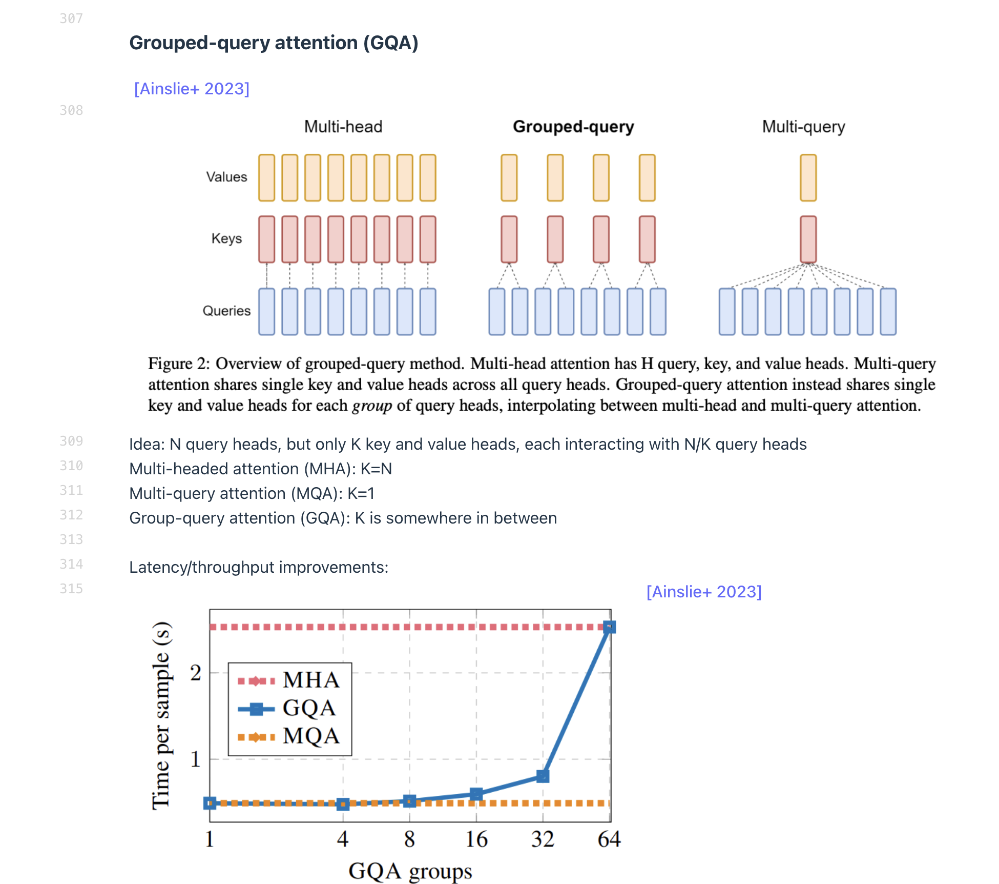

**英文**: So multi-head attention, which is the vanilla transformer, keeps around basically a number of heads. And for each of those, that number, you have same number of keys, values, and queries. There was one time a multi-query attention, which you only have one key and one value, basically one key value head. Turn out that that was not very expressive. So there was a intermediate point where you have a reduced number of keys and values, and then you have more queries. So why are we doing this? Well, remember, we want to reduce the KV cache size. So the fewer keys and values there are, the better. So the batch size and the sequence length doesn't get changed, but it's in the dimensionality of these vectors don't change, but it's the number of key value heads that we're reducing. So that's basically the idea. And this paper shows that you do get latency and throughput improvements, so times percent sample.

**中文**: **多头注意力机制**（Multi-Head Attention, MHA）是标准 Transformer（Vanilla Transformer）的做法：
*   它保留了多个“头”（Heads）。
*   对于每一个头，都对应着相同数量的 **键**（Keys）、**值**（Values）和 **查询**（Queries）。也就是说，查询头、键头和值头的数量是完全一致的。

曾经出现过一种叫做 **多查询注意力**（Multi-Query Attention, MQA）的变体：
*   在这种机制下，所有的查询头共享**唯一的一个键头和一个值头**。
*   结果发现，这种做法虽然极大地节省了内存，但模型的**表达能力**（Expressiveness），导致精度下降明显。

因此，人们找到了一个**折中方案**，也就是现在要讲的：
*   保留**较多**的查询头（Queries）。
*   但只使用**较少**的键头和值头（Keys & Values）。
*   这就是所谓的 **分组查询注意力**（Group Query Attention, GQA）：多个查询头共享同一组键值头。

**为什么要这样做**？
*   回顾我们的目标：**减小 KV Cache 的大小**。
*   KV Cache 的大小主要取决于键和值的数量。**键值头的数量越少，显存占用就越低**。
*   注意：这里我们并没有改变批次大小（Batch Size）或序列长度（Sequence Length），向量的维度也没有变。我们唯一减少的是**键值头**（Key-Value Heads）。

**效果如何**？
*   相关论文表明，这种方法确实能带来显著的**延迟**（Latency）和**吞吐量**（Throughput）提升（通常以百分比来衡量性能增益）。

**英文**: And as you increase the number of groups,. then up to eight or so, basically there's a negligible, it's really fast compared to the full attention. And as you increase the number of groups, obviously, you end up at the original. So that's latency and throughput improvements. And just to actually do this more rigorously, so we have our Lama to 13b model. And if we compute the statistics, this. is using a batch size of 64. Remember, this is what we got. I guess I should print out latency here, well. And then if you run it with a GQA, you see that the memory is reduced, and the throughput goes way up.

**中文**: 随着分组数量的增加（最多约八组），其开销几乎可以忽略不计，速度远快于全注意力机制。而当分组数持续增加时，最终将回归原始的全注意力形式。这带来了延迟降低和吞吐量提升的效果。为更严谨地验证这一点，我们以Llama-13B模型为例，在批处理大小为64的条件下进行统计分析——此处应显示延迟数据。而若采用分组查询注意力（GQA）运行，则可观察到内存占用显著减少，吞吐量大幅提升。

**英文**: So this is actually great. So this is what happens if I take the Lama to 13b architecture,. and I just reduce for every key value head I have five query heads. That's what one to five ratio means. So this also means we can use a larger batch size, because remember, last time we tried to do 256, it even fit in an H-1-100's memory. So now we can actually comfortably fit into the H-1-100 memory, and then we can further improve the throughput. by using a larger batch size. So you can see kind of a lot of different effects here by reducing the number of key value pairs, the memory of the KV cache reduces. That means the throughput and latency go up automatically because fewer memory transfers, and furthermore, as a secondary effect, I can increase the batch size within the GPU, and that further improves the throughput. OK, so that's wonderful.

**中文**: 这实际上非常棒。

让我们以 **Llama-13B** 架构为例来看看具体效果：
*   如果我们设定 **每 5 个查询头（Query Heads）共享 1 个键值头（Key-Value Head）**，这就是所谓的 **1:5 比例**。

**这带来了什么直接好处？**
*   回想一下，之前我们尝试使用 **256** 的批次大小（Batch Size）时，甚至无法装入一张 **H100** GPU 的显存中。
*   但现在，由于 KV Cache 大幅缩小，我们可以**轻松地将更大的批次大小装入 H100 的显存**，从而进一步提升吞吐量。

**总结一下这里的多重效应：**
1.  **直接效应**：通过减少键值对的数量，**KV Cache 的内存占用显著降低**。
    *   这意味着**内存传输量减少**，从而自动提升了**吞吐量**并降低了**延迟**。
2.  **次要效应（连锁反应）**：由于显存节省出来了，我们可以在同一张 GPU 上**增大批次大小（Batch Size）**。
    *   这又进一步大幅提高了**吞吐量**。

所以，这是一个非常完美的优化方案！

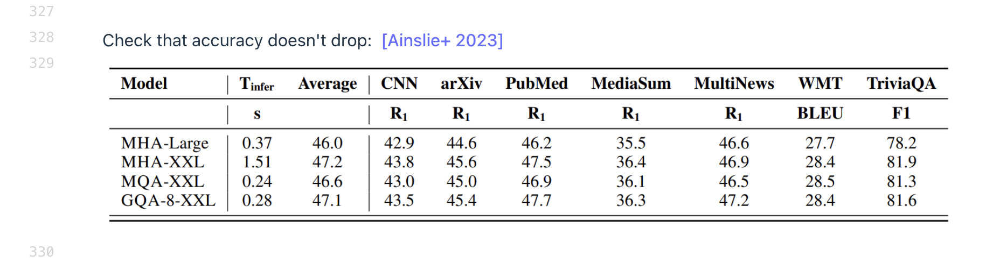

**英文**: We have to also make sure the accuracy doesn't drop. So this is this original paper that shows that this is full attention. This is GPUA. The time is much less, but the accuracy is basically the same. Now, what actually happened? So Lama II did not use this ratio,. but Lama III actually picked up a GQA, and probably motivated by the kind of inference cost. Actually, Lama II, I think the large model did have GQA, but not the smaller ones. So that's a GQA. There's another way to reduce the key value cache. And this comes from deep seek. So this is actually from the deep seek V2 paper,. and it's called multi-head latent tension, which taught to lecture it about previously, but I'll try to talk about it in the context of inference and its implications. So the basic idea is here's full attention. And GQA says, I'm going to use fewer keys and values. MLA says, I'm not going to change the number of key and values. I'm going to project these into a lower dimensional space. So it's another way of shrinking the KV size, but just in a different dimension. So instead of using n times h dimensions for the KV cache of each token, I'm going to project out to C dimensions. And this is what deep seek did. It's actually quite a aggressive reduction from 16,000 to 512.

**中文**: 我们还必须确保**精度不会下降**。

*   这篇原始论文展示了对比结果：**全注意力机制**（Full Attention）与 **分组查询注意力**（GQA）。
*   结果显示：GQA 的**耗时大幅减少**，但**精度基本保持一致**。

**实际上发生了什么**？
*   **Llama 2** 并没有全面采用这种（1:5）比例。
*   但 **Llama 3** 正式采用了 **GQA**，这很可能是受**推理成本**优化的驱动。
    *   *注：其实 Llama 2 的大参数模型版本已经使用了 GQA，但其较小参数的模型并未使用。*

除了 GQA，还有另一种减少 **KV Cache** 的方法，来自 **DeepSeek**：
*   这出自 **DeepSeek V2** 的论文，称为 **多头潜在注意力**（Multi-Head Latent Attention, MLA）。
*   我之前在讲座中提到过这个概念，但现在我将结合**推理场景**及其影响来具体探讨。

**核心思路对比**：
*   **全注意力**（Full Attention）：标准的做法。
*   **GQA** 说：“我要减少键（Keys）和值（Values）的**数量**（即头数）。”
*   **MLA** 说：“我不改变键和值的**数量**，但我将它们**投影**（Project）到一个**更低维的空间**。”

**总结**：
*   这是缩小 KV Cache 大小的另一种途径，只不过它是在**维度**（Dimension）上做文章，而不是在头数上做文章。
*   具体来说：对于每个 token，原本需要使用 `n × h`（头数 × 头维度）的维度来存储 KV Cache，现在将其投影压缩到 `C` 维。
*   **DeepSeek** 正是这样做的：他们进行了一次非常激进的压缩，将维度从 **16,000** 直接降到了 **512**。

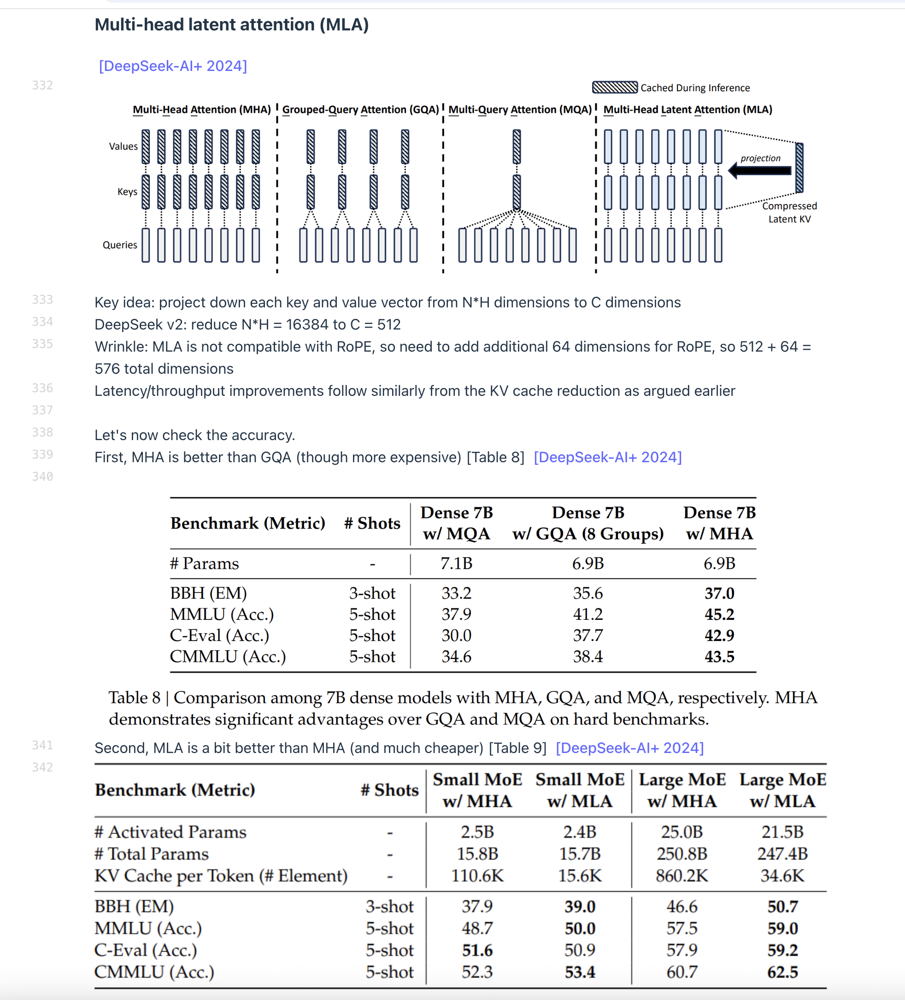

**英文**: Only wrinkle is that this is not compatible with ropes,. so they need to add a few more dimensions to put rope back in. But overall, this is actually quite promising from a KV reduction perspective. I'm not going to do the math, but you can just trust me that you can see how the KV cache would be reduced a lot, and you get to the same latency and throughput advantages. And in terms of accuracy, they actually showed that compared to GQA, the mh. Sorry, actually, maybe I'm showing the wrong thing here. Maybe mh. OK. I meant to show that the MLA actually improves, but this table does not show that, so I have to dig that up later. But anyway, the MLA does preserve the accuracy as well. OK, so there's another idea, which says, well, GQA basically shares, you can think about it. as a sharing key value vectors, right? Within a token and within a sequence. But we can also look at something called cross layer attention, which there's a paper on this. But I think many people have been thinking about this and doing this. So I know none of this is actually the first paper. But basically, if you look at the Transformer I diagram,. you have the key value projection of one layer, and then you have the next layer. And these key value vectors are separate, usually. But the idea here with CLA is that we're just going to use the same key value projection across layers. That's why it's called cross layer attention.

**中文**: 唯一的小波折是：这种压缩方法与 **RoPE**（旋转位置编码）不兼容。
*   因此，他们需要额外增加几个维度，以便将 RoPE 重新整合进去。

但总体而言，从 **减少 KV Cache** 的角度来看，这非常有前景。
*   我就不展开具体的数学计算了，但请相信我：你可以直观地看到 **KV Cache 被大幅缩减**，从而获得与之前类似的 **延迟降低** 和 **吞吐量提升** 的优势。

**关于精度**：
*   他们实际上展示了，与 **GQA** 相比，**MLA**（多头潜在注意力）的表现……
*   *（讲师停顿并自我纠正）* 抱歉，我好像放错了图表。这张表并没有直接展示这一点，我稍后需要再找一下准确的数据。
*   不过无论如何，结论是：**MLA 同样能够保持模型的精度**。

---

**接下来是另一个思路**：

我们可以这样理解 **GQA**：它本质上是在**同一个序列内的同一个时间步**（Token），让多个查询头**共享**同一组键值向量。

但我们还可以从另一个角度思考，这就是 **跨层注意力**（Cross-Layer Attention, CLA）：
*   虽然有一篇专门的论文讨论这个，但我认为很多人早已在思考和实践这一概念（所以这篇论文可能并非该想法的绝对首创）。

**核心思想**：
*   回顾一下标准的 Transformer 架构图：
    *   第 $L$ 层有自己独立的键值投影（Key-Value Projections）。
    *   第 $L+1$ 层也有自己独立的一套。
    *   通常情况下，每一层的键值向量都是**相互独立**的。
*   **CLA 的想法**是：我们不再为每一层单独计算键值投影，而是**在不同层之间共享同一组键值投影**。
*   正因为是在“层与层之间”进行共享，所以被称为 **跨层注意力**（Cross-Layer Attention）。

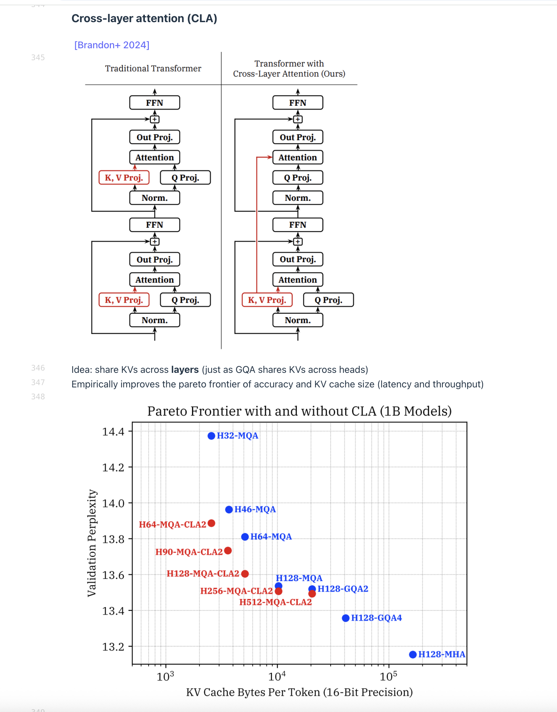

**英文**: So just as GQA shares across heads, CLA shares across layers. So here they show that they empirically improve the Pareto Frontier of accuracy and the KV cache size. So KV cache size, which relates to throughput and latency, you want to be small, and you want perplexity also to be small. So they're able to improve that. OK. So notice that, I mean, for example, H64 heads, the cache size goes, it gets reduced, but the validation perplexity does go up a little bit. But overall, there's kind of a advantage in making that trade off. So there's another way to do things. So local attention, which has been explored actually quite a bit since even there's a long former, there's. an opening-eye paper, and then mistro, and I think many others use this as well. It's a very, I guess, a natural idea. Instead of, if you look at a full attention diagram, it's dense and squared. And that's where a lot of your complexity comes from. And basically, the idea is you're going to just attempt to only the past k tokens, which. means that in the kv cache, as you're generating the sequence, you don't have to remember everything. As soon as the token kind of falls outside your window that you have attention, you can just throw it away. So local attention is very, you could say, that the kv cache size remains constant, as opposed to growing with a sequence length. So this is really good, because that even. long sequences you can have quite a small cache. But the problem is that this still hurts accuracy, because if you just think about it, why are we doing attention instead of RNNs, is that we needed to have long range to match model-run long range dependencies.

**中文**: 正如 **GQA** 是在**头**（Heads）之间进行共享，**CLA**（跨层注意力）则是在**层**（Layers）之间进行共享。

*   论文通过实证表明，这种方法优化了 **精度** 与 **KV Cache 大小** 之间的 **帕累托前沿**（Pareto Frontier）。
    *   我们的目标是：既希望 **KV Cache 越小越好**（这意味着更高的吞吐量和更低的延迟），又希望 **困惑度**（Perplexity，衡量精度的指标）。
    *   结果显示，CLA 确实改善了这一平衡。

**需要注意的细节**：
*   举个例子，当设置为 **64个头**（H64）时，虽然 **Cache 大小显著减小**了，但 **验证集困惑度** 确实有轻微上升。
*   不过总体而言，这种权衡（Trade-off）带来的优势是显而易见的。

**还有另一种方法：局部注意力**（Local Attention）

*   这个方法其实已经被广泛探索很久了，从早期的 **Longformer**、**OpenAI** 的论文，到 **Mistral** 等模型，许多架构都采用了它。
*   这是一个非常直观自然的想法：
    *   回顾 **全注意力**（Full Attention）的图示，它是一个密集的方形矩阵，这正是计算复杂度高的根源。
    *   **局部注意力** 的核心思想是：模型只关注 **过去的 $k$ 个 token**。
    *   这意味着在生成序列时，你不需要记住所有内容。一旦某个 token 超出了你的 **注意力窗口**（Attention Window），就可以直接将其丢弃。

**局部注意力的优势**：
*   **KV Cache 大小保持恒定**，不再随序列长度增长而线性增加。
*   这非常棒，因为即使是处理 **超长序列**，你也只需要维持一个很小的 Cache。

**然而，问题依然存在**：
*   这种做法仍然会 **损害精度**。
*   思考一下我们为什么要用 **Attention** 而不是 **RNN**？正是因为我们需要捕捉 **长程依赖**（Long-range Dependencies）。
*   如果简单地切断长程连接，就违背了引入注意力机制的初衷，导致模型无法处理需要远距离上下文的任务。

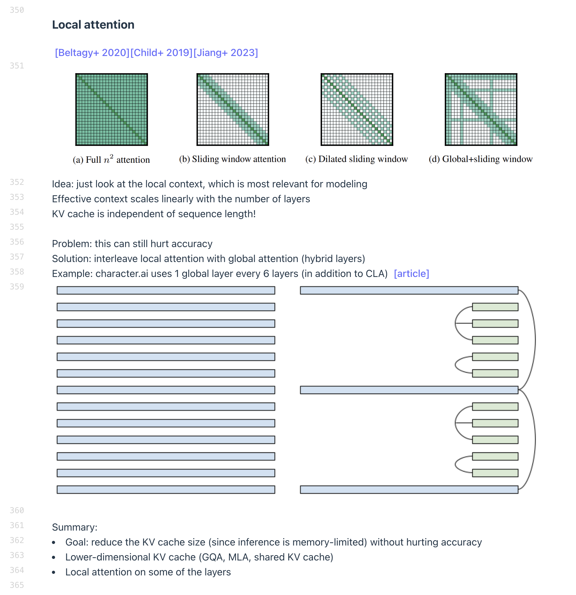

**英文**: And this is, in some sense, even the color attention is a little bit overselling. This is only looking at the local context, which is not very expressive. So what you do here is you can interleave local attention with full global attention, hybrid layers. So for example, a character I used for every six layers, they had one global layer and five local layers. So it looks something, it deductions to cross-layer attention. So it looks something like this, where full attention, every layer, you have to store the kv cache. And for what they did is that for every six layers, you have the full attention. But in between you have this local attention. And on top of that, they have kv cache sharing locally, both for the local attention and the global attention. So this is like all the tricks, not all the tricks,.but many of the tricks combined together. So in summary, these are a few ways to reduce the kv cache size, because remember, inference is memory-limited. So you want to reduce the cache size, but you don't want her accuracy too much. And there's many ways to do it. You can lower the dimensionality of the kv cache. You can have few kv cache vectors. You can reduce the dimensionality of a kv vector. You can share the kv cache across layers. And also, you can use local attention on some of the layers. OK.

**中文**: 从某种意义上说，甚至**局部注意力（Local Attention）**机制本身都有点“名过其实”（overselling），因为它仅关注**局部上下文**，表达能力相对有限。

因此，实际的做法是将**局部注意力**与**全量全局注意力（Full Global Attention）**交错排列，形成**混合层（Hybrid Layers）**架构。
*   **举例**：比如每 **6 层**中，设置 **1 层全局注意力层**和 **5 层局部注意力层**。

这种架构看起来有点像**跨层注意力（Cross-layer Attention）**的变体，具体结构如下：
*   **全量注意力层**：在每一层（指那 1/6 的全局层）中，你仍然需要存储完整的 **KV Cache**。
*   **局部注意力层**：在中间的 5 层中，只使用局部注意力。
*   **额外优化**：在此基础上，他们还在局部范围内实现了 **KV Cache 共享**，这不仅适用于局部注意力层，也应用于全局注意力层。

这就像是把各种优化技巧（虽然不是全部，但是很多）结合在了一起。

**总结：**
以上介绍了几种**减少 KV Cache 显存占用**的方法。请记住，**推理阶段通常是受限于内存带宽（Memory-limited）的**。
我们的目标是在**尽量不牺牲模型准确率**的前提下，减小缓存大小。实现这一目标的方法有很多：
1.  **降低 KV Cache 的维度**（例如通过投影压缩）。
2.  **减少 KV Cache 向量的数量**（例如通过稀疏化或滑动窗口，只保留部分 token）。
3.  **降低单个 KV 向量的维度**（量化或低秩分解）。
4.  **跨层共享 KV Cache**（让多层复用同一组缓存）。
5.  **在某些层中使用局部注意力**（只关注最近的上下文，无需存储长序列的历史缓存）。

**英文**: Any questions about the set of tricks for reducing the kv cache? Oh, yeah. Yeah. I'm talking about the cross layer. And so like, I mean, like, the weights are people being shared across the layers. Like, do you just have one set of weights? We're just like kv. And that's shared across the group. Yeah. So the question is, are the weights shared? So the kv cache is shared, but the weights are shared. So what happens is the weights for doing the projection need be shared, so there's some consistency. Yeah, there's another question.

**中文**: 关于这套**减少 KV Cache**的技巧，大家还有什么问题吗？

哦，好的，有请。
（听众提问）：是的，我想问问关于**跨层（Cross-layer）**的部分。您的意思是，**权重（Weights）**是在这些层之间共享的吗？比如，是不是只有一套权重？就像 KV Cache 一样，是在这一组层之间共享的？

（讲师回答）：
好，这个问题问的是：**权重是否共享？**
答案是：**是的，KV Cache 是共享的，同时权重也是共享的。**

具体来说，用于执行**投影（Projection）**操作的权重需要在这些层之间共享，以确保计算的一致性。

好的，还有另一个问题吗？

**英文**: The context size is too large. Have we, and then it increases the kv cache as well to context size?. And you come there and there. The context that is limited to the large length of the kv cache. Yeah. It can be too long. Then it increases the range. So for me, probably, using those context size, some of the context of your context. Yeah. So the question is, if you have really long context, let's say your prompt is huge, that's going to intrinsically take a log of kv cache.

**中文**: **上下文长度（Context Size）过大**的问题。

（听众提问）：
如果上下文太长，这是否也会导致 **KV Cache** 随着上下文长度同步增加？也就是说，上下文长度实际上受限于巨大的 KV Cache 占用量。如果上下文太长，显存需求就会激增。对我来说，在这种情况下，可能只能利用部分上下文信息了？

（讲师回答）：
是的，问题就在于此：**如果你拥有超长的上下文**（比如你的提示词 Prompt 非常巨大），那么从本质上讲，这将**消耗大量的 KV Cache 显存**。

*   **核心逻辑**：KV Cache 的大小与上下文长度（Sequence Length）成正比。
*   **后果**：当 Prompt 极长时，仅存储这些初始的 KV Cache 就可能占满显存，导致无法进行后续的生成，或者迫使你必须舍弃部分上下文信息（即你提到的“只使用部分上下文”）。

**英文**: So all these tricks can try to reduce that. You can do more aggressive things that there's ideas like just tokens or ways to summarize the prompt, which we're not going to talk about in this class, but there's ways of that address the long prompt situation as well. OK. So now I'm going to talk about even more radical ways of making inference go faster by changing the transformer. So the kv cache, these are basically variants of the transformer. But maybe you can actually go outside the transformer and do better, because the transformer wasn't really designed with heavy inference workloads in mind. They were just trying to train a good model that efficiently. It was mostly about training efficiency. And the order regression, as we sort of pointed out, is really causing this bottleneck here with all the regression plus the forward tension. So we're going to talk about two directions, state space models and diffusion models.

**中文**: 所以，上述所有这些技巧都旨在尝试减少这种显存占用。

当然，还有一些更激进的方法，例如**直接丢弃部分 Token**，或者采用某种方式来**对提示词（Prompt）进行摘要总结**。虽然我们在本课程中不会深入讨论这些具体方法，但确实存在针对**长提示词场景**的解决方案。

好了，接下来我要讨论一些更为激进的方案，通过**改变 Transformer 架构本身**来进一步加速推理过程。

*   **现状**：前面提到的关于 KV Cache 的优化，本质上还是 **Transformer 的变体**。
*   **新思路**：也许我们可以完全**跳出 Transformer 的框架**，做得更好。毕竟，Transformer 最初的设计初衷并不是为了应对繁重的**推理负载（Inference Workloads）**，它主要关注的是如何高效地**训练**出一个好模型（即训练效率）。
*   **瓶颈**：正如我们之前指出的，**自回归（Autoregression）**机制（即每一步生成都需要依赖前一步的结果，加上前向传播的开销）确实是造成当前推理瓶颈的根本原因。

因此，我们将重点探讨两个新的方向：
1.  **状态空间模型（State Space Models, SSMs）**
2.  **扩散模型（Diffusion Models）**

**英文**: This is going to be fairly quick. So the idea of state space models is actually drawing ideas from signal processing and control theory. Initially, the motivation was trying to model long context sequences without suffering the n-squared blowup. So it wasn't necessary about inference speed, but it turns out if you solve that problem, you get faster inference, too. So there's a kind of early paper on s4, which uses classical state space models, which are basically these linear dynamical systems, which are used to model long contexts and sort of shoehorning them into the kind of a modern neural setup. This work is nice in that. It has sort of this RNN kind of interpretation due to the linearity structure and also has a convolution. interpretation as well. So they published this paper and show that it worked really well on these long context synthetic tasks. But what they found is that what discovered is that they don't really work well for language modeling.

**中文**: 这部分内容将简要介绍**状态空间模型（State Space Models, SSMs）**。

其核心思想实际上借鉴了**信号处理**和**控制理论**领域的概念。
*   **最初动机**：旨在对**长上下文序列**进行建模，同时避免传统 Transformer 中出现的 $O(N^2)$ 计算量爆炸问题。
*   **意外收获**：虽然初衷并非直接为了提升推理速度，但一旦解决了长序列建模的复杂度问题，**推理速度自然也随之加快**。

早期有一篇关于 **S4** 的开创性论文，它使用了经典的**状态空间模型**（本质上是**线性动态系统**），试图将其融入现代神经网络的架构中，以处理长上下文任务。
这项工作的巧妙之处在于，得益于其**线性结构**，该模型既具有类似 **RNN（循环神经网络）** 的递归解释视角，同时也具备 **卷积（Convolution）** 的解释视角。

研究人员发表了这篇论文，并证明该方法在**长上下文合成任务**上表现非常出色。
**然而**，他们随后发现，这种经典方法在**语言建模（Language Modeling）**任务上的表现并不理想。

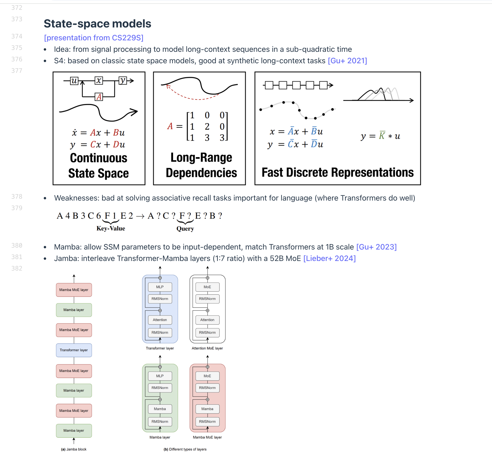

**英文**: And that's obviously kind of a disappointment because a lot of the value of transformers is being able to do language well. So in a series of papers, there was the sort of identified a set of kind of synthetic tasks that captured the essence of why these models weren't working well. And that's basically these associative recall tasks. So here's a synthetic task where you're given a basically sequence of key value pairs. And the goal is to predict basically look up the key output value. So in some sense, it's kind of a logically a trivial task. But it's long sequence because I can have a lot of key value pairs. And I'm going to have to look far back. It can be arbitrary long dependence. And you can see that local attention is not going to work very well because it's just going to remember the last few sequences.

**中文**: 这显然令人有些失望，因为 Transformer 的核心价值很大程度上在于其出色的**语言处理能力**。

因此，在一系列后续研究中，研究人员识别出了一组**合成任务**，这些任务揭示了此类模型表现不佳的根本原因。这些问题主要集中在**关联回忆（Associative Recall）**任务上。

*   **任务描述**：这是一个合成任务，输入基本上是一系列**键值对（Key-Value Pairs）**。
*   **目标**：模型需要根据给定的“键”，检索并预测对应的“值”（类似于查找操作）。
*   **难点分析**：
    *   从逻辑上看，这似乎是一个微不足道的任务。
    *   但实际上，由于序列中可能包含大量的键值对，序列长度会变得非常长。
    *   模型需要**回溯到很远的地方**去查找信息，这意味着它必须处理**任意长度的依赖关系**。
*   **局限性**：你可以看到，**局部注意力机制（Local Attention）**在这种情况下效果很差，因为它只能记住最近的几个序列片段，无法捕捉到远距离的依赖信息。

**英文**: And what the problem with state space models is that they were sort of good for these kind of signal processing tasks. But really, this is like you need to isolate a particular key value pair and pull out the answer. And for those types of tasks, it didn't really work. So there's a bunch of work. I'm not citing. There's a Kainah, H3, and then Mamba, which basically tweak or change the HSSM to basically handle these associative recall tasks. And eventually it worked better. Up to kind of 1B scale was matching transformers. And Mamba, the idea of Mamba has been popular and scaled up even to 52B MOE by A21 folks. Notice that in this case, they still had to use a transformer.

**中文**: 状态空间模型（SSM）的问题在于，它们虽然擅长处理各类**信号处理任务**，但在需要**隔离特定键值对并提取答案**的任务上却表现不佳。

针对这一问题，学术界涌现了大量研究工作（此处不一一列举），其中包括 **Kainah**、**H3** 以及后来的 **Mamba**。这些研究本质上是对经典线性状态空间模型（LSSM/HSSM）进行了改进或调整，使其能够有效地处理上述的**关联回忆（Associative Recall）**任务。

改进后的效果显著提升：
*   在参数量达到 **10 亿（1B）** 规模时，其性能已经能够与 Transformer **相媲美**。
*   **Mamba** 架构尤其受到关注并得到了大规模扩展，甚至由 **A21**（注：指 AI21 Labs）团队将其扩展到了 **520 亿（52B）参数的混合专家（MoE）** 规模。

**值得注意的是**，在这种情况下（指 A21 的大规模实践），他们仍然不得不结合使用 **Transformer** 架构（通常是将 Mamba 层与注意力层混合使用），以发挥各自的优势。

**英文**: So a transformer. But only every, I guess, eight layers, they had a transformer, the rest of them were Mamba layers. And so that's so good led to a fairly big savings and speed up. And more recently, there's this revival of this older idea called linear attention, where instead of,. let's see if you're going to miss this bigger, is actually a very simple idea. So you know what local attention or sliding window attention is. Linear attention is this idea that you essentially, so basically in the attention computation, there's a key and a query, and you dot product on the NA take the exp of that, which is basically giving you a kernel. So you can basically take a Taylor expansion of that. and write that computation as basically dot products of some nonlinear map. So then what you essentially have is you can think about for every key value position, you are basically applying some sort of nonlinearly blowing up into some space and then doing some linear computation over it.

**中文**: 因此，他们采用的架构是：**每隔大约八层**才插入一个标准的 Transformer 层，而其余所有层均采用 **Mamba** 层。这种混合设计在保持性能的同时，带来了显著的**显存节省**和**推理加速**。

最近，一个被称为**线性注意力（Linear Attention）**的旧概念重新受到了关注。这其实是一个非常简单的想法：

*   **背景**：大家都知道**局部注意力（Local Attention）**或**滑动窗口注意力（Sliding Window Attention）**的概念。
*   **核心原理**：
    1.  在标准的注意力计算中，我们需要计算 **Query（查询）** 和 **Key（键）** 的点积，然后对其结果取指数（$\exp$），这本质上定义了一个**核函数（Kernel）**。
    2.  **线性注意力**的思路是对这个核函数进行**泰勒展开（Taylor Expansion）**。
    3.  通过这种展开，原本的注意力计算可以被重写为：先将数据映射到某个非线性空间（即应用某种**非线性映射**），然后在该空间内进行简单的**点积运算**（即线性计算）。

换句话说，对于每一个键值对位置，你实际上是先将其通过非线性映射“膨胀”到高维空间，然后在这个空间上执行线性操作。这种方法避免了传统注意力机制中昂贵的 $N^2$ 复杂度矩阵运算。

**英文**: And because it's linear attention, it actually kind of behaves. like an RNN, and it's linear in the sequence length rather than quadratic. I know that was a little bit fast, but I just want to give you sort of the taste of it. And so this idea has been actually scaled up quite successfully. So there's this organization called Minimax that's training pretty legitimate models up to 456 billion parameter MOEs. And they use this basically linear attention idea. Now they have to use full attention still once in a while. It seems. I don't think people have been able to get around having some full attention, but at least it seems like people have been able to get rid of most of full attention in. Like most of the layers are not full attention anymore.

**中文**: 由于采用了**线性注意力（Linear Attention）**机制，该模型的行为表现实际上类似于 **RNN（循环神经网络）**，其计算复杂度随序列长度呈**线性增长**，而非传统注意力的**二次方增长**。

我知道刚才讲得有点快，但这只是为了让大家对其核心思想有个初步的了解。

事实上，这一思路已经被非常成功地扩展到了大规模应用中：
*   **案例**：一家名为 **MiniMax** 的公司正在训练相当成熟的模型，其规模高达 **4560 亿参数的混合专家（MoE）** 模型。
*   **技术路线**：他们主要采用的正是这种**线性注意力**机制。

**现状与挑战**：
*   目前看来，完全摒弃标准的全局注意力（Full Attention）似乎还不太可能，模型中仍需要**偶尔使用**一次全局注意力层。
*   尽管尚未有人能彻底摆脱对全局注意力的依赖，但业界已经成功**去除了绝大多数**的全局注意力层。
*   现在的趋势是：**大部分网络层**已不再使用计算昂贵的全局注意力机制。

**英文**: They're just either linear layers or local attention layers, which are much, much more efficient. So the linear plus local attention now are actually yielding serious state of our models. And it's probably safe to say that, well, I don't know what exactly the close model providers are doing. But I would suspect that there would be at least as advanced in terms of as efficient as this in leveraging sparsity. So it's kind of an interesting question. When people ask, well, it's attention all you need. as transformers at, well, yes and no. I mean, I guess in some sense there is still the sense it's squared there. Maybe we'll be able to get rid of it. But most of the transformer has been like pretty radically changed by having other much lighter weight components.

**中文**: 这些层现在要么是**线性层（Linear Layers）**，要么是**局部注意力层（Local Attention Layers）**，它们的效率要高出许多。

目前，“线性层 + 局部注意力”的组合实际上已经催生出了真正的**最先进（SOTA）模型**。

虽然我不确定各大闭源模型提供商具体在做什么，但我推测，他们在利用**稀疏性（Sparsity）**提升效率方面，至少已经达到了同等先进的水平。

这就引出了一个有趣的问题：当人们问“是不是只要注意力机制就够了（Attention is All You Need）？”或者“这是否还是纯粹的 Transformer？”时，答案既是**肯定**的，也是**否定**的。

*   **肯定的一面**：从某种意义上说，标准的二次方复杂度（$N^2$）的注意力机制依然存在（尽管可能只在少数层中使用）。也许未来我们最终能彻底摆脱它。
*   **否定的一面**：绝大多数 Transformer 架构已经发生了**根本性的变革**，其中大部分组件已被替换为更轻量级的结构（如线性层或状态空间模型等），不再依赖昂贵的全局注意力。

**英文**: And you're still able to get much of the same and kind of accuracies. And all of this is really helpful for inference because on these non-full attention layers, you're basically replacing the ordered T KV cache, which grows as a sequence link with something that's constant. And there's papers by that fall up. I think they on the base paper where they go. Either in this paper or in follow-up work, analyzing basically the trade-off between the KV size. and the ability to do various types of recall tasks, which makes sense because if you don't store very much, you won't be able to solve certain tasks. But there is this trade-off curve that you can try to play with. So that's all I'll say about the state space models. So now let's talk about a completely different style of generation models. Defusion models.

**中文**: 你仍然能够获得**相当的性能和准确率**。

所有这些改进对**推理（Inference）**阶段尤其有益：
*   在这些非全局注意力层中，原本随序列长度线性增长的有序 **KV Cache（键值缓存）**，被替换成了**恒定大小（Constant Size）**的存储。这意味着无论输入多长，显存占用都保持稳定。

关于这一点，已有相关论文（包括基础论文及其后续研究）深入分析了 **KV 缓存大小**与执行各类**回忆任务（Recall Tasks）**能力之间的**权衡（Trade-off）**：
*   **逻辑很直观**：如果存储的信息量过少，模型就无法解决某些需要长程记忆的任务。
*   **权衡曲线**：研究人员发现存在一条权衡曲线，可以通过调整缓存大小来在“显存效率”和“任务能力”之间寻找最佳平衡点。

关于**状态空间模型（SSM）**的话题就聊到这里。接下来，让我们讨论一种完全不同风格的生成模型：**扩散模型（Diffusion Models）**。

**英文**: So diffusion models have been very popular image generation, but it turned out to be fairly tricky to get working in text, although there recently have been some advances here. So the idea of diffusion is that you, instead of generating art regressively, you're just generating every token in parallel. So obviously, if you only do that via some simple layer, it's not going to be very good. You can't generate all the words in parallel and expect it to be coherent. But what you do is you iterate, and you keep on refining this generation until it gets your final generation that you output. And the idea behind generating parallel, you're no longer art regressively bound. And that generating all tokens in parallel. well can be done in parallel. So you get to saturate your GPUs relatively easy as long as your context length is large enough. So recently, there's this in session labs has produced some pretty interesting models.

**中文**: **扩散模型（Diffusion Models）**在图像生成领域一直非常流行，但将其应用于文本生成曾被认为相当棘手，尽管近期在这一领域已取得了一些进展。

扩散模型的核心思想是：
*   **并行生成**：与传统的自回归（逐词）生成不同，扩散模型尝试**并行生成所有令牌（Token）**。
*   **迭代优化**：显然，如果仅通过简单的层一次性并行生成所有单词，结果很难保持连贯性。因此，扩散模型采用**迭代（Iterative）**的方式：先生成一个初步版本，然后不断对其进行**细化（Refining）**和去噪，直到最终输出高质量的文本。

这种并行生成方式带来的主要优势是：
*   **打破自回归限制**：你不再受限于必须按顺序逐个生成令牌。
*   **硬件利用率最大化**：由于所有令牌可以并行处理，只要上下文长度（Context Length）足够大，就能相对轻松地**饱和利用 GPU 算力**，从而显著提升训练和推理效率。

近期，一家名为 **Session Labs** 的公司已经推出了一些非常有趣的此类模型。

**英文**: There's not much written about them, but you can see kind of a demo of the generation in process. It just kind of generates code instantaneously,. but it's obviously kind of broken code, and then it kind of refines over time. And this is one of their benchmarks that show that, at least on coding, I'm not sure about other tests, that if you look at that tokens per second, these models are way out here in terms of speed compared to anything that's transformed. Even Jamba remembers like a hybrid,. Mamba transformer architecture is quite slow compared to these diffusion models. So now whether the diffusion models will be general purpose and powerful enough in all of these, that remains to be seen. But I think you have such a lead on the token speed here that even if you can put more compute and kind of recover some of the accuracy losses, if you need to. OK, so the summary here is that I think this whole architecture, novel architecture thing is actually really exciting for inference, because they allow you to side-sep kind of fundamental obstacles. So if you're dealing with attention, you just have this fundamental KVCache obstacle that you can quantize, you can optimize, but it's still there.

**中文**: 关于这些模型的公开资料并不多，但你可以看到其生成过程的演示：
*   **生成过程**：模型似乎能**瞬间生成代码**，但初始生成的代码显然是**破碎或不完整**的；随后，模型会随着时间的推移不断对其进行**修正和细化**，直到代码变得可用。

根据他们的一项基准测试显示（至少在**代码生成**任务上，其他测试尚不确定）：
*   **速度优势**：如果对比**每秒令牌数（Tokens Per Second）**，这些扩散模型的速度**远超**任何基于 Transformer 架构的模型。
*   **对比混合架构**：即使是像 **Jamba** 这样结合了 Mamba 和 Transformer 的混合架构，与这些扩散模型相比，速度也显得相当缓慢。

当然，扩散模型是否能在所有任务中都具备足够的**通用性**和**强大能力**，目前仍有待观察。但我认为，它们在**令牌生成速度**上拥有的巨大领先优势意味着：即使我们需要投入更多的计算资源来通过多次迭代以弥补潜在的准确率损失，这种权衡也是值得的。

**总结来说**：
我认为这些**新颖的架构探索**对于**推理（Inference）**阶段令人非常兴奋，因为它们让我们能够**绕过（Side-step）**一些根本性的障碍。
*   **传统注意力的瓶颈**：如果你沿用传统的注意力机制，就始终无法摆脱 **KV Cache** 这一根本性障碍。虽然我们可以对其进行量化或优化，但这个瓶颈依然存在。
*   **新架构的突破**：而像扩散模型或线性注意力这样的新架构，则从根本上改变了游戏规则，不再受限于此。

**英文**: And so by making a kind of state-space model,. you're shrinking that to like a constant size. And as long as you can keep up the accuracy, which is big if, then you win big time. Same with the diffusion models. Audio-aggressive generation is a key bottleneck. Now, if you just generalize, generate things in parallel, now all of a sudden you kind of change the game completely. So there's much more work to be done here,. improving inference. So as you can see now, inference is, the inference game is much broader than it seems at first sight. It's not really about kind of necessary the systems optimizations to make it fast, although you obviously need those.

**中文**: 因此，通过构建**状态空间模型（State-Space Models, SSM）**，你可以将原本随序列增长的内存占用压缩为**恒定大小（Constant Size）**。只要你能在这样做的前提下**保持模型的准确率**（这本身是一个巨大的挑战），那么一旦成功，你将获得巨大的收益。

**扩散模型**也是同样的道理：
*   **打破瓶颈**：**自回归生成（Auto-regressive generation）**一直是一个关键的瓶颈。
*   **改变游戏规则**：如果你能将其泛化为**并行生成**，那么突然间，整个游戏的规则就彻底改变了。

在这方面，为了进一步提升**推理（Inference）**性能，还有大量的工作要做。

正如你现在所看到的，**“推理竞赛”**的范围远比初看之下要广阔得多：
*   它不仅仅局限于通过**系统优化**来加速（虽然这些优化显然是必不可少的）；
*   更在于通过**架构创新**（如 SSM 或扩散模型）来从根本上突破现有的限制。

**英文**: But I think the real gains are coming from like real radical changes in architecture. OK, so about 10 minutes left, I'll. go through these quickly quantization and model pruning. So quantization, the key idea is just reduce the precision of the numbers. So easy, very easy to do. And the thought is that less memory means a less bytes transferred higher, sorry, this should be lower latency higher throughput. And you do have to worry about accuracy, of course. That's the trade-off. If you look at the different types of formats, FP32 used for training, not used for inference, really. BF16 is sort of a default for inference.

**中文**: 但我认为，真正的收益将来自于**架构上的根本性变革**。

好的，我们还剩下大约 10 分钟，我将快速过一下**量化（Quantization）**和**模型剪枝（Model Pruning）**。

关于**量化**：
*   **核心思想**：非常简单，就是**降低数值的精度**。
*   **预期效果**：占用更少的内存意味着需要传输的字节数更少，从而带来**更低的延迟（Lower Latency）**和**更高的吞吐量（Higher Throughput）**。（注：原文口误修正为“更低延迟”）。
*   **权衡取舍**：当然，你必须关注**准确率**的影响。这就是量化过程中的主要权衡点。

如果看看不同的数据格式：
*   **FP32**：主要用于**训练**阶段，实际上很少用于推理。
*   **BF16 (Bfloat16)**：目前通常是**推理**的默认格式。

**英文**: You can go down to FP8 or int8, which now is less accurate, but much cheaper than even FP8. So people do a bunch of inference in int8, which if you look at the range, I mean, it's an integer. between 127 minus 128, which is not that. It's pretty low precision. And people even go down to int4, which is they're not OK. So int4 is pretty low. There's also other ways you can do. OK, so once you kind of decide that you want to quantize, I guess you could do several things. You can train with the quantization,. but obviously that means you need to retrain models. And more, I guess commonly, you do post-training quantization where you take an existing model and you try to quantize it and try not to screw things up too much. So there's a paper called element int8, which I'll talk through briefly. So in quantization, basically what happens is that you take your vector, which is let's say,. FP16, and then you need to figure out the dynamic range. If you want to pack it into int8, you need to figure out what the largest value is. And once you figure that out, you can divide by that at multiply by 128. And then you get your integers. And then if you need to de-quantize, then you go the other way. So basically, quantization means that remember, memory is a bandwidth. So bottleneck.

**中文**: 你可以将精度进一步降低到 **FP8** 或 **INT8**。虽然它们的精度较低，但计算成本甚至比 FP8 还要低得多。
*   **INT8 的现状**：目前许多人使用 **INT8** 进行推理。如果你看一下它的数值范围，它只是一个介于 **-128 到 127** 之间的整数，这意味着它的精度确实相当低。
*   **INT4 的尝试**：甚至还有人尝试使用 **INT4**，但这通常会导致模型效果不可接受（原文 "they're not OK"），因为精度实在太低了。

当然，还有其他方法可以实现量化。一旦你决定要进行量化，大致有几种路径可选：
1.  **量化感知训练（Quantization-Aware Training, QAT）**：你可以在训练过程中就引入量化。但这显然意味着你需要**重新训练模型**，成本较高。
2.  **训练后量化（Post-Training Quantization, PTQ）**：这是更常见的做法。你直接拿一个**现有的模型**，尝试对其进行量化，并尽力确保在这个过程中**不会严重破坏模型的性能**。

这里有一篇名为 **"Element INT8"** 的论文，我会简要介绍一下。

**量化的基本原理**：
*   **确定动态范围**：假设你有一个 **FP16** 精度的向量，首先需要确定其**动态范围（Dynamic Range）**，即找出其中的**最大值**。
*   **映射过程**：一旦确定了最大值，你就可以通过将数值除以该最大值再乘以 **127**（注：INT8 最大值为 127，原文口误说成 128，实际操作通常是映射到 -128~127 的范围），从而将其转换为整数。
*   **反量化**：如果需要还原（反量化），则执行相反的操作。

**核心意义**：
基本上，量化的核心在于解决**内存带宽瓶颈**。记住，**内存带宽往往是系统的瓶颈**，而量化通过减少需要传输的数据量，直接缓解了这一问题。

**英文**: So all your transfers are happening in int8, but when you actually do the, I guess, you sometimes have to upcast to a floating point to actually do the arithmetic. So the problem with int8 is that not everything fits nicely. And you have these outliers, which appear in larger networks that screw things up. So what this paper did is that you take this matrix, you identify the really large outlier values, and then you handle them separately, use in full 16-bit precision, and then do the most of the mass majority in int8. So this works well, but it's actually a bit slower. So the motivation here wasn't an inference speed,. but more, they even be able to fit your model into memory. There's another paper called activation-aware quantization. And here, the idea is that you're kind of quantizing the weights, but you're going to figure out which weights to quantize based on the activations. Really quickly, you're going down to actually in 3.

**中文**: 因此，所有的数据传输都以 **INT8** 格式进行，但在实际执行算术运算时，你有时不得不将其**上转换（Upcast）**回浮点数格式。

**INT8 的问题与挑战：**
*   **异常值问题**：并非所有数据都能完美适配 INT8。在大型网络中，会出现一些**异常值（Outliers）**，这些值会严重破坏量化效果。
*   **"Element INT8"论文的解决方案**：这篇论文提出了一种混合策略：
    1.  识别矩阵中那些巨大的异常值。
    2.  对这些异常值**单独处理**，保留使用完整的 **16位精度（FP16）**。
    3.  对其余绝大多数数据使用 **INT8** 进行计算。
*   **权衡**：这种方法效果很好，但实际运行速度反而**稍慢一些**。
*   **核心动机**：这里的目标**并不是为了提升推理速度**，而是为了让模型能够**装入内存（Fit into memory）**，解决显存容量不足的问题。

**另一种方法：感知激活的量化（Activation-Aware Quantization）**
*   **核心思想**：虽然我们要对权重进行量化，但决定“哪些权重需要量化”的依据是**激活值（Activations）**。通过分析激活值的分布，可以更智能地选择量化策略，以减少精度损失。

（注：原文最后一句 "Really quickly, you're going down to actually in 3." 似乎话未说完或存在口误，可能是指快速过渡到更低的精度如 INT3 或某种特定的3比特量化技术，但在当前语境下信息不完整。）

**英文**: And this obviously reduces memory by quite a bit, and leads to a 3x speed up. So the general idea here is that you get a trained model and just happens that some of the weights or activations are going to be abnormally large. So for those, you handle separately, and then everything else you can work in low precision. Talk about model pruning ideas. Very like quantization, it's sort of the basic idea is very simple. You just rip out parts of an expensive model to make it cheaper, and then you fix it up. So in this MVD paper, what they do is they first identify important either layers or heads or hidden dimensions using a small calibration size. They use some simple scores to compute that. And then you just remove the unimportant layers or hidden units or heads. And then, now if you just take that model, it's going to be clearly worse.

**中文**: 这显然能**大幅减少内存占用**，并带来**3 倍的加速**。

**核心思路总结**：
你拿到一个训练好的模型后，会发现其中一些**权重（Weights）**或**激活值（Activations）**异常大。
*   **处理策略**：对这些异常大的部分进行**单独处理**（通常保留高精度），而对其余大部分数据则使用**低精度**进行计算。

---

接下来谈谈**模型剪枝（Model Pruning）**的理念。
它与量化非常相似，基本思想非常简单：
1.  **剔除**：从一个昂贵的模型中**剔除（Rip out）**一部分组件，使其变得更轻量、更便宜。
2.  **修复**：然后对剩下的模型进行**修复（Fix it up）**（通常指微调），以恢复性能。

**以 "MVD" 这篇论文为例**：
*   **识别重要部分**：他们首先使用一个小型的**校准数据集（Calibration Set）**和一些简单的**评分标准（Scores）**，来识别出哪些**层（Layers）**、**注意力头（Heads）**或**隐藏维度（Hidden Dimensions）**是重要的。
*   **执行剪枝**：直接**移除**那些被判定为不重要的层、隐藏单元或注意力头。
*   **初始后果**：如果你直接拿剪枝后的模型使用，其性能**显然会变差**（因此后续通常需要进行微调/修复步骤）。

**英文**: But so then the last step is you distill the original model into the prune model. So you kind of repair the model from the initialization, which is your prune. So you're not starting from scratch. You're starting from something that's worse,. but hopefully not worse, and hopefully retains a lot of the same structural properties of the original model. It's just maybe not calibrated in some sense. And the results are pretty good on that. So they have these 15 billion parameter models that they're able to reduce to 8B with hardly any drop in this, I guess, at least according to MNLU,. and then down to 4B with some drop. But you're also going down quite a bit to a 4B model.

**中文**: 但接下来的最后一步是**知识蒸馏（Distillation）**：将原始模型的知识蒸馏到已剪枝的模型中。

这实际上是对剪枝后的模型进行**修复（Repair）**：
*   **初始化起点**：你不是从零开始训练，而是以**剪枝后的模型**作为初始化起点。
*   **状态描述**：虽然这个起点的性能比原模型差，但希望它不要差得太离谱，并且能够**保留原模型的大部分结构特性**。它可能只是在某些方面尚未“校准”好。

**实验结果相当不错**：
*   **15B $\to$ 8B**：他们成功将一个 **150 亿参数** 的模型缩减为 **80 亿参数**，根据 **MNLU**（注：此处可能是口误，通常指 **MMLU** 基准测试）的评估，性能**几乎没有下降**。
*   **15B $\to$ 4B**：甚至可以将模型进一步压缩至 **40 亿参数**，虽然此时性能**出现了一定程度的下降**，但考虑到模型规模已经大幅缩小（减少了一半以上），这种权衡通常是可以接受的。

**英文**: OK, so maybe just summarize this taking shortcuts idea. You can reduce inference completely without hurting accuracy. You can do it from scratch. We just define a fresh architecture that's by construction fast and just train it. Or you can still define our architecture. You can take a slow model, and you figure out a some sort of scheme to initialize the new model with the old model. And then you basically do distillation. So now all of these are a little bit unsatisfying because they're lossy. So you get massive speed ups, but you always wonder,. well, maybe this model isn't as actually good as original. So speculative decoding or speculative sampling allows you to basically have your kick and eat it too. So recall there's two stages of inference. You pre-fill what you're given a sequence. You encode all the tokens in parallel. There's a compute limited, which is great. Notice that this also gives you log probabilities. for each of the tokens. And then there's generation, which is one token at a time. It's memory limit. It's slow.

**中文**: 好的，我们来总结一下这种“走捷径”的思路。

**模型压缩与加速的三种主要路径：**
1.  **从头设计（From Scratch）**：你可以定义一种**天生就快**的全新架构，然后从头开始训练。这样可以在完全不损害准确率的情况下降低推理成本。
2.  **架构转换与蒸馏**：你也可以先定义好目标架构，然后拿一个现有的“慢模型”，设计某种方案用旧模型来**初始化**新模型，接着进行**知识蒸馏**。

**现有方法的局限性：**
上述所有方法都有一个令人不太满意的地方：它们都是**有损的（Lossy）**。虽然你能获得巨大的速度提升，但心里总会犯嘀咕：“这个模型是不是真的不如原始模型好？”

**投机采样（Speculative Decoding/Sampling）：鱼与熊掌兼得**
投机采样技术让你能够**两全其美**（既保持原始模型的质量，又获得加速）。

回顾一下推理的两个阶段：
1.  **预填充阶段（Pre-fill）**：
    *   当你给定一个序列时，系统会**并行编码**所有令牌（Tokens）。
    *   这是一个**计算受限（Compute-limited）**的过程，效率很高。
    *   值得注意的是，这一步会输出每个令牌的**对数概率（Log probabilities）**。
2.  **生成阶段（Generation）**：
    *   这是**逐个令牌（One token at a time）**生成的过程。
    *   这是一个**内存受限（Memory-limited）**的过程，因此速度很慢。

*(注：投机采样的核心思想通常是利用一个小而快的模型来“猜测”多个令牌，然后用那个大而慢但准确的模型来并行验证这些猜测，从而在保持准确性的同时突破生成阶段的内存带宽瓶颈。)*

**英文**: So in other words, checking is faster than generation. So in two of these, this makes sense, but hopefully now you also appreciate the math behind why this is true. And the speculative sampling idea is actually really, really again. It was proposed in parallel by these two independent teams from Google. And the idea is to use a cheap draft model P to just run ahead and generate some tokens. And then you're going to evaluate those tokens with a target model. And because evaluation of given tokens is just pre-fill, so you can do that in parallel, which is fast. And then you accept it if it looks good. So this is what it looks like in real life. So if you're using a big model, generating one token at a time, that's slow, but in speculative decoding, you have a draft model that's racing ahead, generating a lot of tokens, and using the big model to essentially verify.

**中文**: 换句话说，**验证（Checking）**的速度远快于**生成（Generation）**。

在前两种方法中，这一点显而易见，但希望现在你也能从**数学原理**上理解为什么这是成立的。

**投机采样（Speculative Sampling）**的想法其实非常巧妙：
*   **提出背景**：该技术由 **Google 的两个独立团队**几乎同时提出。
*   **核心机制**：
    1.  **草稿模型（Draft Model, $P_q$）**：使用一个廉价、快速的小模型“抢跑”，提前生成若干个令牌（Tokens）。
    2.  **目标模型验证（Target Model, $P$）**：使用原本的大模型（目标模型）来评估这些生成的令牌。
    3.  **并行加速**：由于对给定令牌的评估本质上就是**预填充（Pre-fill）**阶段，因此可以**并行处理**，速度极快。
    4.  **接受策略**：如果大模型认为小模型的猜测质量足够好（符合概率分布），就接受这些令牌；否则进行修正。

**实际运行场景对比**：
*   **传统大模型推理**：大模型必须逐个生成令牌，速度缓慢（受限于内存带宽）。
*   **投机解码（Speculative Decoding）**：
    *   有一个**草稿模型**在前方“疾驰”，快速生成一串令牌。
    *   **大模型**则紧随其后，本质上是在**并行验证**这些猜测。
    *   这种“小模型猜、大模型验”的模式，极大地提升了整体吞吐率。

**英文**: And sometimes it will reject, and sometimes it will accept. And the acceptance rate basically determines how fast of a speed up you have. OK, so here is the more formal algorithm. So you're going to have a look ahead of k. So you're going to use your draft model and generate k tokens all regressively. So this is hopefully fast because your draft model is small. And then you've given these k tokens that you generated. And I'm going to score them based on, I'm going to compute the probability under the target model Q. Now I'm going to decide whether I want to accept this or not. So I go through each token, and I'm going to essentially accept it with probability Q over P. And the one just is make sure that this probability is out between zero and one. If this kind of looks like, if people are familiar with Matropolis Hastings, this is kind of where this kind of comes from. So intuitively, you're sampling with P, so you need to divide that out because you don't want P, you are Q. So this is kind of an important weight on this. So if you accept it, then great, you kind of move on, and you look at the next draft token and so on. And if you don't accept it, then you're going to sample from the target model, the slow model, but you kind of do this correction where you've already tried to sample using P. So you don't need to do that anymore. You subtract it out and you sample from Q. So this is basically kind of a rejection sampling with a proposal P and a target Q. The only difference is that you are sampling your injection.

**中文**: 有时它会**拒绝**猜测，有时则会**接受**。**接受率（Acceptance Rate）**基本上决定了你能获得多大的加速比。

下面是更正式的**算法流程**：

1.  **前瞻生成（Look-ahead）**：
    *   设定一个前瞻长度 $k$。
    *   使用**草稿模型（Draft Model, $P$）**自回归地生成 $k$ 个令牌。由于草稿模型很小，这一步非常快。

2.  **目标模型评分**：
    *   拿到这 $k$ 个生成的令牌后，计算它们在**目标模型（Target Model, $Q$）**下的概率。

3.  **接受/拒绝决策**：
    *   逐个检查每个令牌，以 $\min(1, \frac{Q}{P})$ 的概率决定是否接受它。（注：这里确保概率值在 0 到 1 之间）。
    *   **数学直觉**：如果你熟悉 **Metropolis-Hastings (M-H) 算法**，会发现这与其原理同源。
        *   直观理解：我们是用 $P$ 进行采样的，但我们真正想要的是符合 $Q$ 分布的样本。因此，我们需要除以 $P$ 来“抵消”草稿模型的采样偏差，从而得到正确的权重。这是一个非常关键的修正项。

4.  **执行逻辑**：
    *   **如果接受**：太好了，直接采纳该令牌，继续检查下一个草稿令牌。
    *   **如果拒绝**：
        *   此时需要从**目标模型（慢模型）**中重新采样一个令牌。
        *   但在采样时需要进行**修正**：既然我们已经尝试用 $P$ 采样但被拒绝了，就不需要再重复那部分工作。我们需要从 $Q$ 中减去 $P$ 的贡献部分（即从残差分布 $Q - P$ 中采样），以确保最终分布严格符合 $Q$。

**总结**：
这本质上是一种**拒绝采样（Rejection Sampling）**，其中：
*   **提议分布（Proposal）**是 $P$（草稿模型）。
*   **目标分布（Target）**是 $Q$（大模型）。
*   **唯一区别**：传统的拒绝采样通常是一次性的，而这里是**序列化地（Sequentially）**对生成的令牌流进行采样和验证。

**英文**: sampling if you reject it and you reject it, and you just try again and try again. And here, we don't want to keep on kind of looping forever because if you reject, we're just going to say, OK, fine, we'll bite the bullet and just sample from the next more expensive model. So the cool thing here is that you're guaranteed to get an exact sample from the target model. So those of you familiar with sampling, this is what shouldn't be too surprising. You're able to use kind of prior information to speed up sampling. But in the language modeling context, this is kind of nice. I'm going to skip the, this is not really a proof. This is just kind of some derivation to show that for a case of vocab 2,. it's why these formulas kind of give you the right unbiased sampling procedure. And it works pretty well. So the accuracy should be actually the same, since it's the same model. But maybe there's some randomists there. But the speed up is you're getting a factor of 2, speed up, essentially. So in practice, what you do is you have something like a 70B model. In draft model is much, much smaller. And if your target model is 80B, 8B, then your draft model might be 1B. And you generally want to make the draft model as close as you target as possible. And so if you're doing some distillation,. that could make it even better. There's a bunch of, this is a pretty hot area of research in inference.

**中文**: 如果在拒绝采样中你拒绝了样本，通常的做法是**不断重试、循环往复**。

但在这里，我们不想陷入无限循环。因此策略是：**如果拒绝，我们就“咬紧牙关”（bite the bullet），直接从这个更昂贵的大模型（目标模型）中采样一个令牌**。

**这一方法的核心优势：**
*   **数学保证**：你可以**保证**最终得到的样本严格服从目标模型的分布（即获得**精确采样**）。
*   **直观理解**：对于熟悉采样理论的人来说，这并不令人惊讶——你利用了**先验信息**（草稿模型的预测）来加速采样过程，同时保持了无偏性。
*   **语言建模中的应用**：这在语言建模场景下非常实用。
    *   **准确性**：理论上，由于最终分布与原始大模型完全一致，**准确率应该是一样的**（尽管随机种子的不同可能导致具体输出有细微差异，但统计特性不变）。
    *   **加速效果**：实际应用中，通常能获得约 **2 倍** 的加速比。

**实际部署策略：**
*   **模型搭配**：
    *   **目标模型**：通常是一个巨大的模型（例如 70B 或 80B 参数）。
    *   **草稿模型**：必须小得多（例如，如果目标是 80B，草稿模型可能是 1B；如果目标是 8B，草稿模型可能更小）。
*   **优化方向**：
    *   你通常希望草稿模型在行为上**尽可能接近**目标模型。
    *   因此，如果对草稿模型进行专门的**知识蒸馏（Distillation）**，使其更好地模仿目标模型，往往能进一步提高接受率，从而获得更好的加速效果。

**研究现状：**
目前，推理加速（Inference Acceleration）是一个非常**热门的研究领域**，涌现了大量相关技术和论文。

**英文**: There's a lot of ways to improve this process. You can use Medusa, which is this way to have the draft model instead of generally order aggressively, sample multiple tokens in parallel, or EGLE, where you're actually taking. high-level features of the target model and pumping them into the draft model to generate. So the draft model doesn't actually have to stand alone. It can be kind of glombo onto the target model to help it generate. So summary, exact sampling from the target model, thanks to math, and this exploits the symmetry between checking. and generation, right? So, or pre-fill in generation. And there's actually a lot of room for innovation on the draft model, which can, you know, everything that we've talked about before, where you can have different radical architectures, different ways of quantizing, all those apply. The only thing is that you get to basically guarantee. that you're getting exact sample.

**中文**: 有很多方法可以进一步优化这一过程：

*   **Medusa**：这种方法让草稿模型不再局限于传统的自回归（逐个）生成，而是能够**并行采样多个令牌**。
*   **EAGLE**：这种方法提取**目标模型的高层特征**，并将其“注入”到草稿模型中辅助生成。这意味着草稿模型不必完全独立运行，它可以像是一个**依附（glom onto）**在目标模型上的组件，利用大模型的特征来提升自己的预测能力。

**总结：**

1.  **数学保证的精确采样**：得益于数学原理，该方法能保证从目标模型中获得**精确的样本分布**（无偏差）。
2.  **利用对称性**：它巧妙地利用了推理过程中**验证（检查）**与**生成**（或者说**预填充**与**生成**）之间的不对称性——即验证比生成快得多。
3.  **草稿模型的创新空间巨大**：
    *   我们在之前讨论过的所有优化手段都适用于草稿模型，例如采用**激进的架构设计**、不同的**量化（Quantization）**策略等。
    *   无论草稿模型如何变化（哪怕是有损的或近似度不高的），唯一的硬性约束和最终保障是：**整个系统最终输出的样本分布严格等同于目标模型**。

这是一个非常灵活且强大的框架，既允许在草稿模型上大胆创新以追求极致速度，又通过数学机制兜底保证了最终结果的质量。

**英文**: OK, so now I'll go out of time, but quickly go through the question that came up earlier, which is that in practice, when you're serving, there's life traffic. Requests come at different times. They finish at different times. They have some of them have shared prefixes,. some of them don't. They have different lanes. So it's very heterogeneous in comparison to training where you get basically a dense block of tokens, and you're basically going to push it through your GPU at full speed. So what do you do in this case? So there's a series of papers that kind of explore this. And the basic idea is, so the last two parties are more of a kind of systems level contribution. So the idea is that you don't wait for batches to, the train leaves.

**中文**: 好的，虽然时间到了，但我还是快速回应一下之前提出的那个问题：

**实际服务中的挑战：**
在实际部署（Serving）场景中，流量是**动态且异构的（Heterogeneous）**：
*   **请求到达与结束时间不一**：请求在不同时间点进入系统，也在不同时间点完成。
*   **前缀共享情况复杂**：有些请求共享相同的前缀（Prompt），有些则完全不同。
*   **序列长度各异**：每个请求生成的序列长度（Sequence Length）各不相同。

这与**训练（Training）**场景形成了鲜明对比：
*   在训练中，数据通常是密集的块（Dense Blocks），你可以让 GPU 全速运转，高效地处理这些数据。
*   而在推理服务中，这种不规则性使得资源利用变得非常困难。

**解决方案与研究进展：**
针对这一问题，有一系列论文进行了深入探索（其中最后两篇主要侧重于**系统层面**的贡献）。

**核心理念：**
*   **拒绝等待“满员发车”**：传统的做法可能是等待一批请求凑齐后再统一处理（就像等火车坐满了才开）。
*   **持续迭代调度**：新的思路是**不要等待批次填满**。系统应采用更灵活的调度机制（如连续批处理 Continuous Batching 或迭代级调度 Iteration-level Scheduling），一旦有请求完成或新请求到达，就立即更新批次并推进计算，从而最大限度地减少 GPU 的空闲等待时间，适应这种高度异构的流量特征。

**英文**: The train doesn't wait for you. So when a new batch comes, you're just going to put it in, which means that the worker that's generating tokens needs to hand control back to the scheduler every step. So you generate token, come back to the scheduler, and say, if there's new requests, then they get stuck in, and then it kind of continues. So you're not wasting any time waiting around for requests. Now there's a problem with batching, I think, which is behind the question. Batching works when everything's at same dimensionality, but every quest might be a different length. So there's this idea of selective batching where you basically break up your computation for attention. Everything has to be handled separately, but for your MFPs remember, which are the bulk of the computation, you can actually take tensors of different sizes and you just flatten them. And because they don't interact, they. can just be kind of along for the right in the batch dimension.

**中文**: “火车”不会等你。因此，当有新请求（批次）到达时，你要立即将其加入处理队列。

这意味着**生成令牌的工人（Worker）必须在每一步都将控制权交还给调度器（Scheduler）**：
1.  生成一个令牌。
2.  返回调度器检查：“是否有新请求？”
3.  如果有，立即将它们插入当前批次。
4.  继续生成下一个令牌。

通过这种机制，系统**不会因为等待新请求而浪费任何时间**。

**关于批处理（Batching）的难点与解决方案：**

*   **难点**：传统的批处理要求所有数据的维度一致。但在实际场景中，每个请求的序列长度各不相同，这给批处理带来了挑战。
*   **解决方案：选择性批处理（Selective Batching）**
    *   **注意力机制（Attention）**：由于注意力机制涉及序列内不同位置之间的交互，不同长度的序列必须**分开处理**，无法直接合并。
    *   **前馈网络（MLP/FFN）**：这是计算量的主要部分（Bulk of computation）。在 MLP 层中，每个令牌的计算是独立的，彼此之间没有交互。
        *   **扁平化技巧**：你可以将不同长度的序列张量**展平（Flatten）**成一维长向量。
        *   **虚拟填充**：虽然它们的原始长度不同，但因为互不影响，可以将它们简单地沿着**批处理维度（Batch Dimension）**拼接在一起进行并行计算。这就好比让不同长度的队伍手拉手排成一条长龙一起通过关卡，极大地提高了计算效率。

**英文**: OK, I know that was fast, but I'll just quickly go over page attention now. This is the paper behind VLM, which some of you probably have used. And this addresses the memory usage problem. So if you have a KV cache and prompts are coming in and finishing, then your cache is going to get fragmented. So you're going to allocate a bunch of space for a request,. but you don't know how many tokens are going to generate. So there's going to be internal fragmentation, and then there's also an external fragmentation where there's padding between the requests and responses. So that's no good. So the page attention basically says, remember operating systems. And how virtual memory works.

**中文**: 好的，虽然讲得很快，但我现在快速过一下 **分页注意力机制（Page Attention）**。

这是支撑 **vLLM**（您提到的 "VLM" 在此语境下极大概率是指 **vLLM**，一个著名的大模型推理框架，而非视觉语言模型）的核心论文技术，想必在座各位可能已经使用过它。

**它主要解决了显存（Memory）使用效率的问题：**

1.  **碎片化问题（Fragmentation）**：
    *   在推理过程中，KV Cache（键值缓存）会随着请求的进入和结束而动态变化。
    *   **内部碎片（Internal Fragmentation）**：当你为一个请求分配显存时，你无法预知它最终会生成多少个令牌。如果你预先分配了大块连续空间，而实际生成的令牌很少，那么剩余的空间就被浪费了。
    *   **外部碎片（External Fragmentation）**：由于不同请求的生命周期和长度不同，显存中会在各个请求和响应之间产生空隙（Padding），导致即使总空闲显存足够，也无法分配给新的长序列请求。

2.  **核心思想：借鉴操作系统**
    *   Page Attention 的基本理念是**回忆操作系统中虚拟内存（Virtual Memory）的工作原理**。
    *   就像操作系统将物理内存划分为固定大小的“页（Pages）”，并通过页表将进程的虚拟地址映射到非连续的物理页一样，Page Attention 也将 KV Cache 划分为固定大小的块（Blocks）。
    *   这样，系统就可以动态地为每个请求分配非连续的显存块，彻底消除了内部和外部碎片，极大地提高了显存利用率，从而允许更大的批处理大小（Batch Size）和更长的上下文。

**英文**: We divide the KV cache into a sequence of contiguous blocks, and then we just put them wherever we find Y space. So if you have two requests coming in, then they might just, you know, the first request might be here, here, and here, and the second request might be here and here. So the blocks are the things that you're going to keep contiguous, and that's. going to give you your allowing times to call a lecture memory. So you can also play these tricks where if you have sharing of prefixes, then there's another idea from operating systems, which is copy on right. So you basically maintain reference counters for how many basically sequences are using this particular block. And then if you need to kind of diverge and have blocks go in different directions, then you copy and you reduce the reference count. There's a bunch of other VM optimizations, which I won't go through. But basically, the summary is remembering your operating systems classes, you can apply them to inference as well. OK, so quick summary.

**中文**: 我们将 **KV Cache** 划分为一系列**连续的块（Blocks）**，然后只要有空闲空间，就可以将这些块放置在显存的任何位置。

*   **非连续存储示例**：假设有两个请求进入系统：
    *   第一个请求的数据块可能分散在显存的位置 A、B 和 C。
    *   第二个请求的数据块可能位于位置 D 和 E。
    *   **关键点**：我们只保证每个**块内部**是连续的，而块与块之间在物理显存上不需要连续。这种机制允许我们高效地利用碎片化的显存空间。

*   **前缀共享与“写时复制”（Copy-on-Write, CoW）**：
    *   如果多个请求共享相同的前缀（Prompt），我们可以借鉴操作系统的另一个经典概念：**写时复制**。
    *   **引用计数**：系统会为每个显存块维护一个**引用计数器**，记录有多少个序列正在使用该块。
    *   **分流处理**：当某个序列需要生成不同的后续内容（即发生分歧）时，系统会**复制**该块的数据，并相应地**减少**原块的引用计数。这样，多个请求可以安全地共享只读的前缀数据，直到需要修改时才进行复制，极大地节省了显存。

*   **总结**：
    除了写时复制，还有许多其他虚拟内存（VM）优化技术可以应用。核心思想非常简单：**回顾你在操作系统课程中学到的知识（如分页、虚拟内存、写时复制），并将它们直接应用到深度学习推理系统中**，就能解决显存碎片化和利用率低下的难题。

好了，快速总结一下。

**英文**: Inference is really, really important. It's where the characteristics are distinct from training. You're memory limited, and it's also a dynamic, so which leads a bunch of new challenges. We saw a whole host of different techniques around new architectures, quantization, pruning, distillation, speculative decoding. There's ideas from systems, which. can allow you to a better user memory, overlap, communication, and compute, and things like that. But I would say that there's probably even more opportunity in sort of modeling and architecture, because if you think about it, all you don't inference, not generally, is inference in a particular model. How do I run this particular model? But who cares about that particular model?. You care about developing good accuracy given your resource budget. So a lot of these ideas that are trying to change the reduced to KV cache, changing the transformer are basically ways to sidestep the problem and say, well, I have something that's more efficient. And then I can train it a way that gets me better accuracy than I went. So that's all I have, and I will see you next time. Then we're back to scaling loss.

**中文**: **推理（Inference）至关重要**，因为它具有与训练（Training）截然不同的特征：
*   **显存受限（Memory Limited）**：推理过程往往受限于显存容量，而非计算能力。
*   **动态性（Dynamic）**：请求的到达和处理是动态变化的。
这两点带来了一系列全新的挑战。

我们刚才探讨了一系列应对这些挑战的技术：
*   **模型层面**：新架构设计、量化（Quantization）、剪枝（Pruning）、知识蒸馏（Distillation）、投机采样（Speculative Decoding）。
*   **系统层面**：优化显存使用、重叠通信与计算（Overlap Communication and Compute）等技巧。

**未来的机遇：**
但我认为，**在建模和架构设计方面仍有更大的机遇**。原因如下：
*   目前的许多推理优化只是针对“如何运行某个特定模型”这一具体问题。
*   但归根结底，用户并不关心你具体用的是哪个模型，他们关心的是：**在给定的资源预算下，如何获得最佳的准确率？**

因此，许多试图通过改变架构来减少 KV Cache 占用或改造 Transformer 的想法，本质上是在**绕过问题**：
*   与其费力优化一个低效的旧模型，不如直接设计一个**天生更高效的新模型**。
*   通过训练这种新架构，我们可以在相同的资源消耗下获得比旧模型更高的准确率。

这就是我今天要讲的全部内容，下次见。接下来，我们将回到**缩放定律（Scaling Laws）**的话题。

---

