## 课程介绍与缩放定律基础（Scaling Laws）
好的，我们开始吧。

今天是关于缩放定律的第二讲，也是最后一讲。今天的讲座将更侧重于细节丰富的案例研究。我将探讨两个独立的主题。
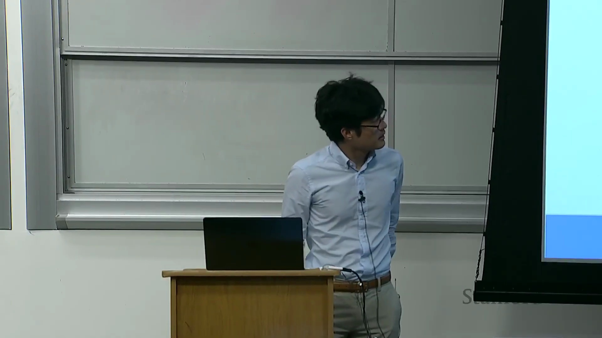
首先，我将梳理几篇论文，这些研究在模型构建过程中对缩放定律进行了细致探讨。

借此，我将向大家展示现代大语言模型（Large Language Model, LLM）构建者是如何将缩放定律融入其设计流程的。
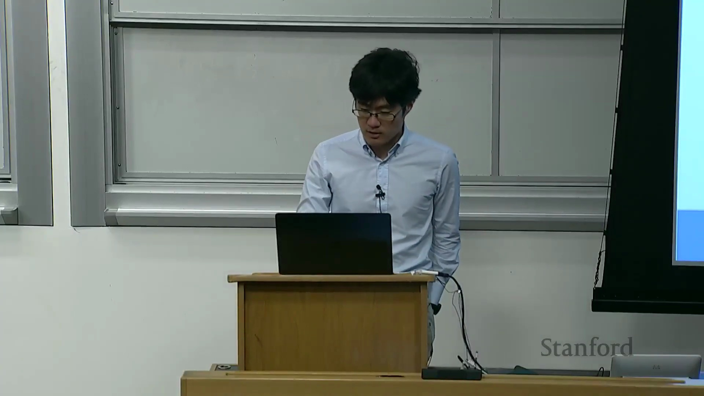
结合上节课与本节课，我们的核心动机在于探讨：缩放大型模型的最佳实践是什么？我们的目标是获得具备优异超参数（Hyperparameter）与合理架构选择的大语言模型。
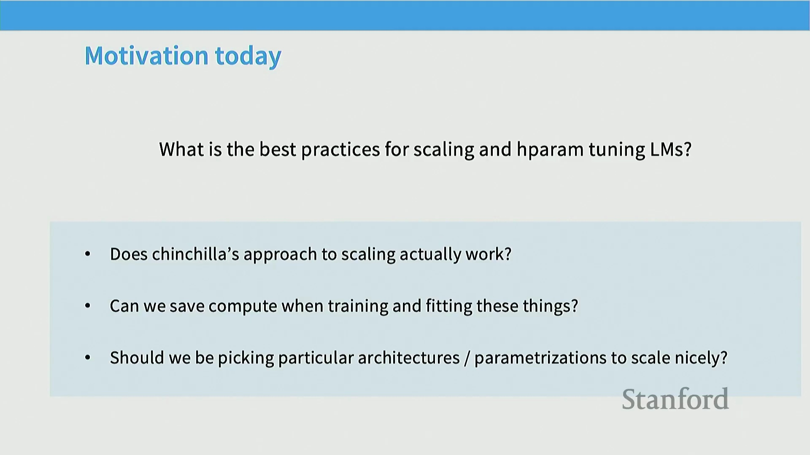
此前我已介绍过 Chinchilla 模型以及如何利用缩放定律验证其训练策略。但我认为大家理应对缩放定律保持合理的质疑。例如，它本质上只是双对数坐标图上的曲线拟合（Curve Fitting）。它真的像上节课所说的那么完美吗？Chinchilla 的缩放定律方法是否切实有效？大家将在作业中亲自验证。例如，若拟合一条等计算量（IsoFLOP）曲线，它能否准确指示词元（Token）数量与模型规模之间的最优权衡？能否借此设定最佳学习率（Learning Rate）？我们是否应选择特定的架构参数化（Parameterization）配置以实现更佳的扩展性？
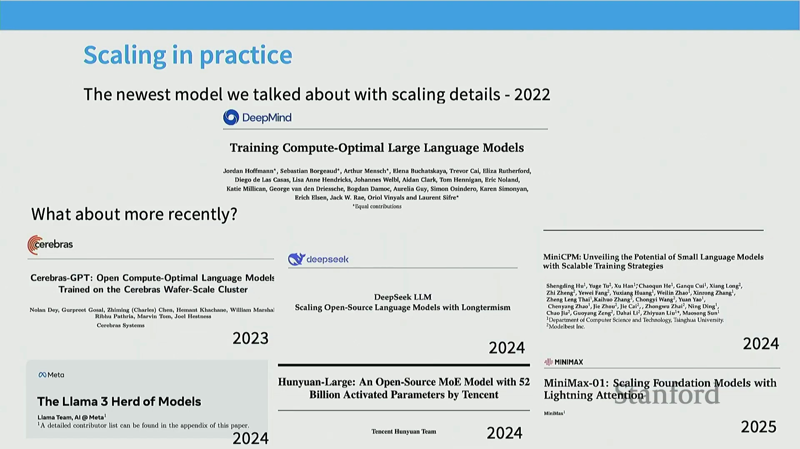

## 保密时代与关键的开源缩放研究
上节课我们讨论的最后一篇（也是当时最新）包含大量详细缩放研究的论文，是 DeepMind 的 Chinchilla 论文。此后，随着 ChatGPT 的问世，大语言模型构建的竞争格局发生了剧变。业界基本上不再公开披露关于训练数据、缩放策略等方面的具体信息了，对吧？整个行业转向了高度保密。我曾与一些前沿实验室的研究人员交流，询问他们：“你们在模型缩放方面做了哪些工作？”得到的答复通常是：“抱歉，我们不会透露任何缩放策略的细节。”因此，我们只能依赖其他渠道来了解工业界实际的缩放实践。尽管如此，市面上已涌现出多个训练得当、成功实现有效缩放的大规模模型。因此，在去年本课程中，我讲解了 3D-BIS GPT、DeepSeek LLM 和 MiniCPM。顺带一提，去年我还得费尽口舌解释为何要重点分析这些“中国模型”。但今年值得庆幸的是，希望大家在听到 DeepSeek 时已经感到兴奋，而无需我再费力证明其重要性。过去一年里，我密切关注了大量新发布的模型。然而，关于缩放定律的新见解与学术论文的产出却相对稀疏。本节课我将简要提及去年年底发布的 Llama 3 的部分结果，以及腾讯推出的混合专家（Mixture of Experts, MoE）模型——混元大模型（Hunyuan Large）。此外，还有今年发布的 Minimax-01，这是一款支持长上下文、采用线性时间混合注意力（Linear-time Hybrid Attention）机制的模型。这三项工作均包含一定的缩放研究，但其全面性确实不及 DeepSeek 或 MiniCPM。我认为，DeepSeek 与 MiniCPM 才是当前现代缩放定律研究的黄金标准。

## 深入探讨：用于稳定缩放的 muP 方法
这是今天讲座的第一部分。我希望确保大家能够理解，在真实的准生产级（Pre-production）模型中，缩放过程究竟是如何运作的。
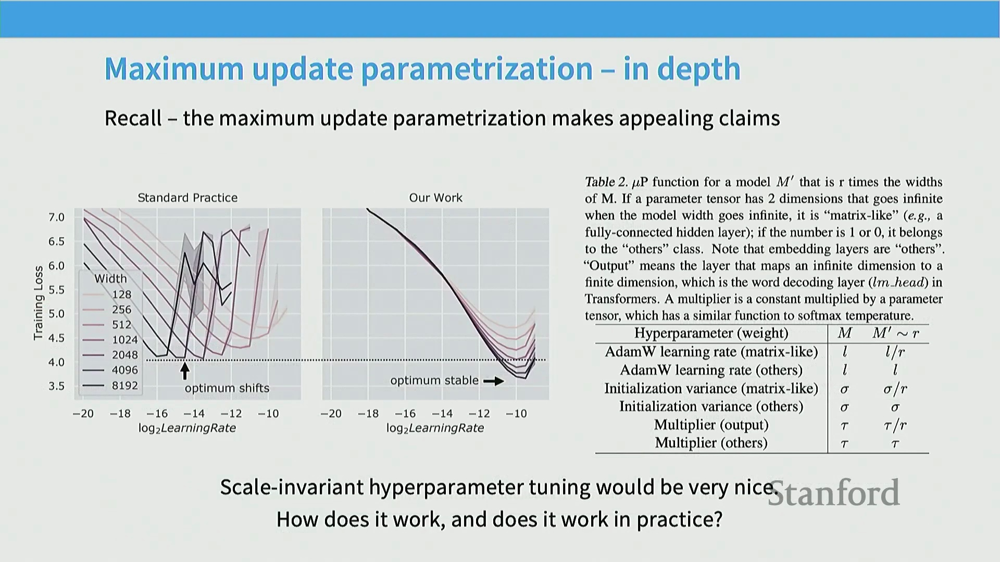
另一项重点深入探讨的主题，是我上节课提及的 muP 方法。简单回顾：当我们训练模型并不断扩展其规模时，通常必须调整部分超参数。如图所示左侧，随着模型宽度增加（例如多层感知机（Multi-Layer Perceptron, MLP）），最优学习率会逐渐下降。这意味着模型越大，所需的学习率反而越小。这会引发一个严重问题：为了在极大规模下找到合适的超参数，我们必须重新进行昂贵的网格搜索（Grid Search），带来巨大的计算开销。然而，若我们能通过不同的参数化方式对模型进行改造，使最优学习率在不同规模下保持恒定，那将极为理想。这能大幅简化超参数搜索流程。我们期望所有超参数及整体架构设计在不同规模下均能保持稳定。muP 正是一类极具潜力的方法，为该问题提供了启发性的解决思路。接下来，我将带大家梳理其中的关键数学推导。去年讲解此部分时，网络上涌现了多篇优秀的 muP 教程，我将借鉴其中清晰易懂的数学证明。随后，我会介绍针对 muP 类方法的第三方验证与评估工作。
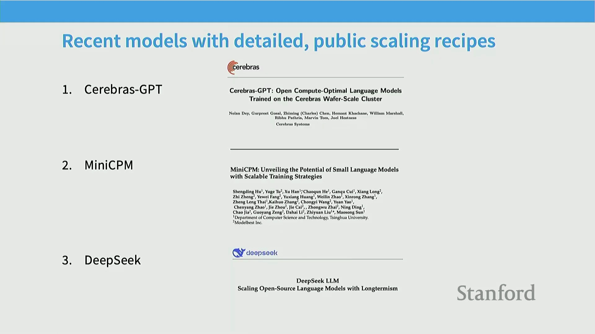

## 案例研究：Cerebras GPT 与 muP 的实际验证
本讲座第一部分的案例研究将聚焦于三个核心模型。尽管我还提及了另外三个较新的模型，但它们公开的细节相对较少。大家能从中学到的核心经验，主要源于接下来要分析的三篇论文。因此，我将重点讲解 Cerebras GPT、MiniCPM 和 DeepSeek。这三个模型采用了截然不同的缩放策略组合，能从不同维度为我们揭示如何正确地进行模型缩放。我们正式开始。首先探讨的是 Cerebras GPT 及其相关的缩放实践。
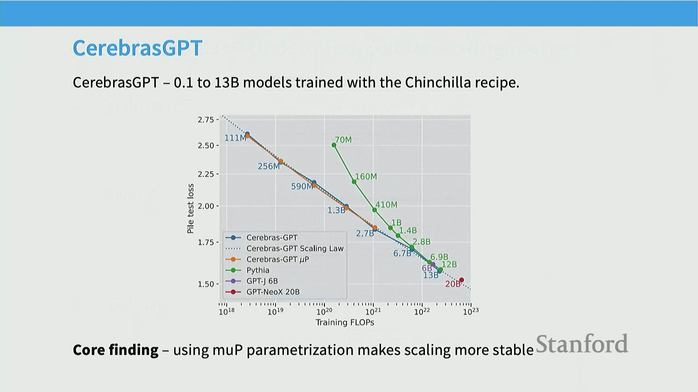
这是一个庞大的模型家族，参数量覆盖 0.1 亿至 130 亿，且均采用 Chinchilla 训练配方（Recipe）进行训练。换言之，其词元数量与参数量的比例大致处于最优状态。Cerebras 团队对缩放与参数化研究抱有浓厚兴趣，并得出了一项核心发现：他们对前述的 muP 方法进行了大规模验证，结果表明该方法能显著提升缩放过程的稳定性，并降低调优难度。直接来看结论：图中纵轴表示在 The Pile 数据集上的测试损失（Test Loss），横轴代表模型规模缩放曲线。蓝色曲线代表采用标准参数化（Standard Parameterization, SP）训练的 Cerebras GPT；橙色曲线则代表采用最大更新参数化（Maximal Update Parameterization, muP）训练的模型。结果显示，在缩放平滑度方面，muP 版本的表现更为优异，至少与 Pythia 或 GPT-J 等模型相当，甚至更胜一筹。
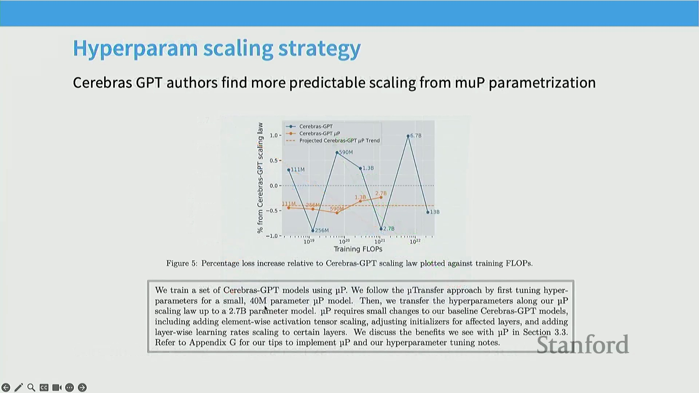
这一结果颇具价值。我想在此强调的是，这几乎是 muP 方法首次（或为数不多）获得公开的工业级验证。众所周知，绝大多数致力于大语言模型缩放的实验室，都会重点关注如何根据模型规模调整网络参数化、权重初始化（Weight Initialization）策略，以及逐层学习率（Layer-wise Learning Rate）的设置。这些细节正是确保缩放过程稳定性的关键所在。因此，muP 类方法在该领域具有重要地位。例如，Anthropic 实验室虽未公开相关论文（未来是否公开亦未可知），但曾提及一种名为 MetaPy 的技术，这正是 muP 思想的一种变体。

## muP 实现细节与代理模型策略
实验结果表明，当采用标准参数化训练模型时，模型性能会在预测的缩放基准点附近出现剧烈波动。即图中虚线附近，大家可以看到明显的性能震荡。这主要是因为研究团队必须根据模型规模动态调整学习率，导致实际性能难以精确贴合虚线所示的缩放定律预测值。另一方面，他们发现若采用 muP 进行缩放（注：此处口误更正为 muP 而非 Cerebras GPT），则会得到图中的橙色曲线。该曲线与 muP 版本的缩放定律拟合曲线高度吻合。因此，他们在此提出的核心主张是：采用此类替代参数化方案，能够实现更具可预测性的缩放过程，并使超参数调优（Hyperparameter Tuning）更为顺畅。我们将在后文对此进行更详细的剖析。待我完成 muP 的数学推导后，将再次回顾此幻灯片的内容。
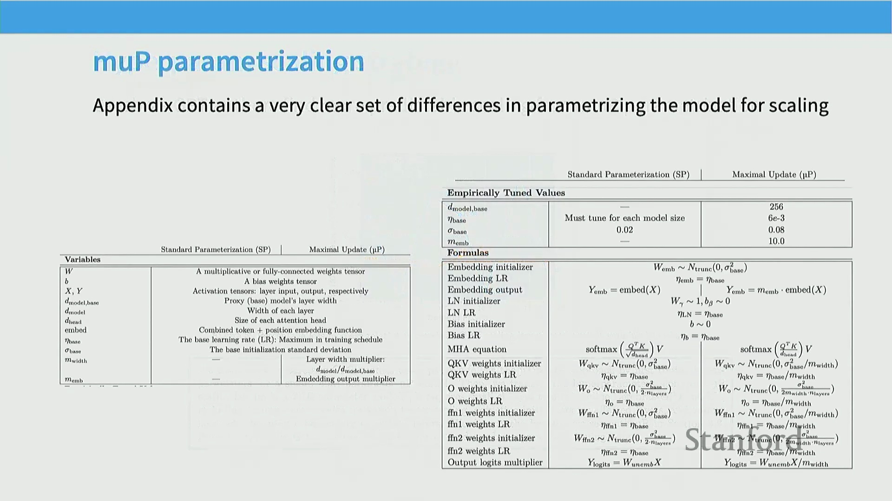
若大家有兴趣亲自实现该方法，Cerebras 团队发布的研究成果对理解 muP 极具参考价值。他们在论文附录中提供了一份详尽的对比表格，清晰列出了标准初始化与参数化（SP）和最大更新版本（muP）在权重更新上的具体差异。简而言之，一句话概括：所有非嵌入参数（Non-Embedding Parameters）均采用 $1/\text{宽度}$ 的比例进行初始化，且每一层的学习率也按 $1/\text{宽度}$ 的比例进行缩放。与标准参数化的一个关键区别在于：即便初始化已按宽度进行了缩放，真正的核心差异仍在于逐层学习率的调整策略。我稍后将对此展开详细讲解，并提供完整的数学推导。当前大家可将其视为一份实用的快速参考指南。此外，在其他缩放策略中我们还观察到一个有趣的现象：研究团队常将 muP 这类能维持超参数稳定性的方法，与极具侵略性（Aggressive）的缩放策略结合使用。
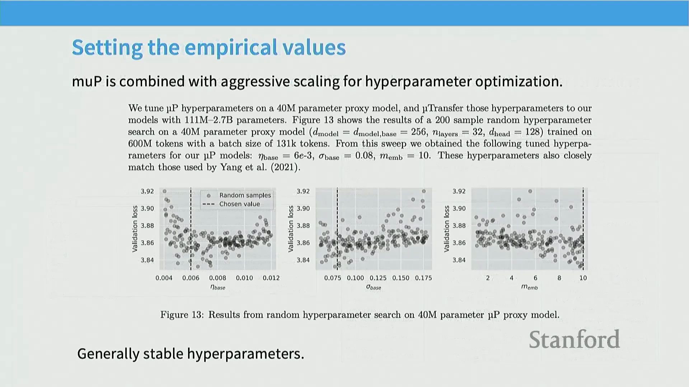
具体而言，他们首先将实验规模缩小至 4000 万参数的代理模型（Proxy Model），在此规模下进行极其详尽的超参数搜索。随后，借助 muP 的尺度不变性特性将模型重新放大至目标规模，从而成功维持了超参数选择的稳定性。

---

## 超参数稳定性与代理模型策略
核心目标是尽可能保持超参数(Hyperparameter)的稳定性。因此，这就是他们在小规模超参数搜索中观察到的结果：图中的每一个点代表一次模型训练运行，每个点对应一组特定的超参数。随后，他们从这些运行结果中选取损失最小值，从而构建出超参数搜索网格(Hyperparameter Grid)。这是一种非常直观的超参数选择方法。目前尚不清楚这种激进的下缩放(Downscaling)策略在训练超大规模模型时是否始终为最优解，但这确实是一种行之有效的实践。我们在 MiniCPM 和 DeepSeek 的训练流程中也观察到了类似的做法：首先训练规模小得多的代理模型(Proxy Model)，随后探索如何稳定地将这些配置扩展回大模型。这将成为贯穿本次讨论的核心主题。如果大家有任何疑问，请随时打断我。我打算在此稍作停顿，看看各位对 Cerebras GPT 部分是否有疑问。当然，待我稍后详细推导 muP 时，相关内容可能会更加清晰。
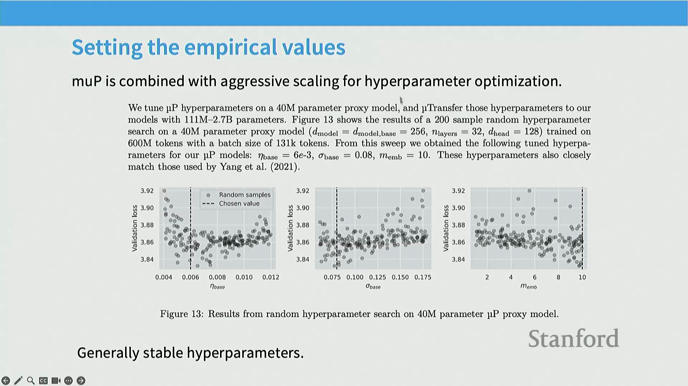
好的。
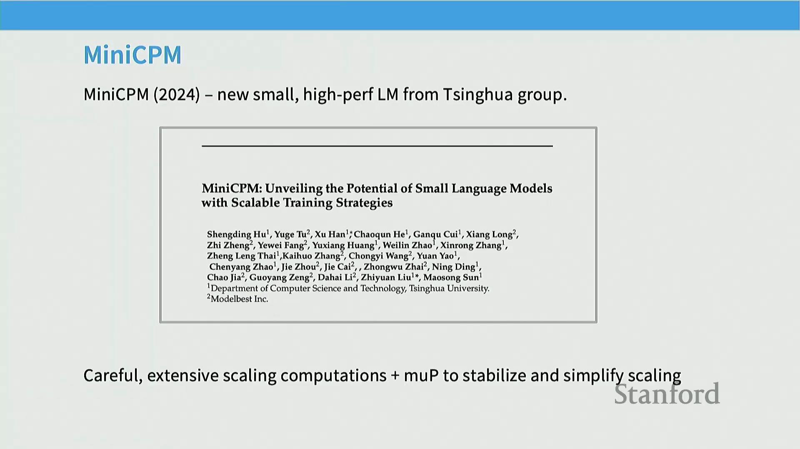

## MiniCPM：将小型模型扩展至前沿性能
接下来我想探讨的另一篇重要论文（或研究成果）是 MiniCPM。不知为何，MiniCPM 在西方学术界的讨论度似乎相对有限。但对我而言，这是我最早接触到的由中国研究团队发布的成果之一。该团队在缩放定律(Scaling Laws)及其他相关领域进行了极为深入且出色的研究，其工作水准完全媲美国际前沿实验室。为了让各位了解其研究概况，他们的核心目标是：利用充足的计算算力(Compute)，训练出性能卓越的小型语言模型。在这一过程中，他们开展了大量细致严谨的缩放实验与分析。
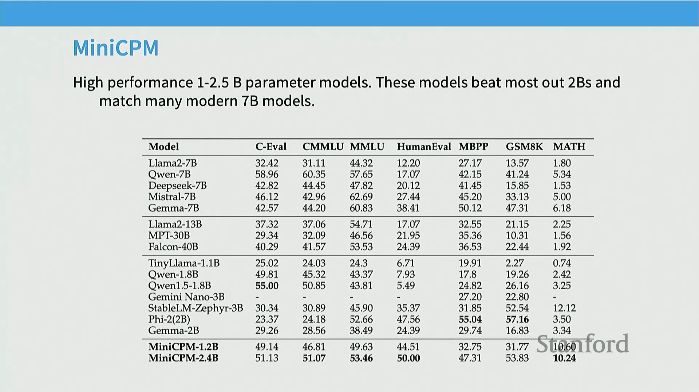
同样地，当他们对模型进行扩展时（此处主要指扩展训练数据量，而非模型尺寸），他们再次引入了 muP(Maximal Update Parameterization) 以稳定并简化缩放过程。为了证明这篇论文的价值，值得一提的是，在这些模型训练完成的时期，其 12 亿至 24 亿参数(Parameters)的版本表现极为优异。它们不仅击败了当时市面上大多数 20 亿参数模型，甚至能与众多 70 亿参数模型（以 2024 年的标准衡量）媲美。当然，如今 70 亿参数模型的竞赛已愈发激烈，出现了更优秀的模型。但这足以说明，结合 2024 年中期可用的算力与技术条件，该成果确实处于行业前沿。正是因为他们做对了一些关键决策，才训练出如此高质量的模型。

## muP 参数化与模型缩放策略
与 Cerebras GPT 类似，该团队也必须制定一套严谨的策略来确保缩放过程的正确性。假设你需要执行一次超大规模的模型训练，首要步骤是什么？你必须选定超参数，并确保这些超参数在不同规模下具有良好的可迁移性（即可稳定缩放），随后再将模型放大。我们可以效仿 Cerebras GPT 团队的做法：尝试在小规模模型上搜索超参数，期望其保持稳定，再将配置平移至大规模模型。实现这一目标的关键正是采用 muP 类技术。MiniCPM 在此采用的策略与之完全一致。如图所示，对于嵌入层(Embedding Layer)，基本无需复杂操作，仅需乘以一个常数进行缩放即可。每当涉及类似多层感知机(Multi-Layer Perceptron, MLP)的残差连接(Residual Connection)时，则按网络深度的平方根进行缩放。在权重初始化阶段，则采用扇入(Fan-in)除以基础宽度(Base Width)的策略。
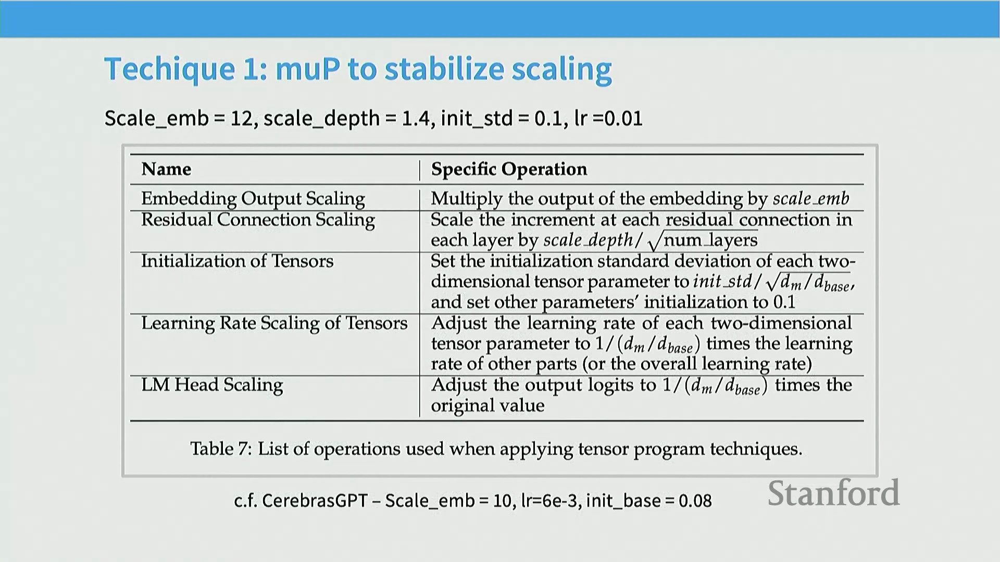
随后，学习率(Learning Rate)也需按模型宽度进行相应缩放。我们可以看到，此处采用的策略与缩放因子类型与 Cerebras GPT 案例高度一致。他们最终确定的超参数配置也与 Cerebras GPT 极为相似：采用相同的嵌入层缩放方式，学习率数值相近（仅存在约两倍的差异）。总体而言，这类超参数的收敛区间是相似的。一旦确定这些基础配置，你便可以信赖最优学习率的稳定性，从而将其大致固定。众所周知，参数量与数据量的比例(Aspect Ratio)是影响模型性能的关键因素。因此，在确定合适的比例后将其固定，随后再逐步扩大整体模型规模，即可从 900 万或 3000 万参数平滑扩展至 5 亿或 10 亿参数的模型。
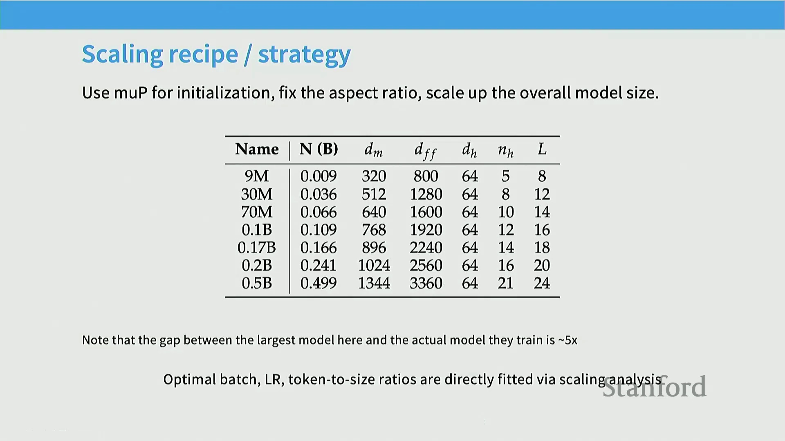
通过这一策略，他们从最小规模模型到最大规模的试点运行模型(Pilot Run)，实现了约 5 倍（甚至略高）的计算算力节省。

## 关键批次大小（Critical Batch Size）的确定
基于上述稳定性，你可以进一步探究最优批次大小(Batch Size)是否随模型规模呈函数关系变化。这就需要确定 $B_{\text{crit}}$，即关键批次大小(Critical Batch Size)。据我回忆，关键批次大小大致对应于训练效率的收益递减点(Point of Diminishing Returns)。随着模型规模增大，训练损失(Training Loss)降低；而在损失较低时，模型能够承受更大的批次大小。关键批次大小的核心作用在于：它指示了在给定的模型尺寸与训练数据量下，最适合用于训练的全局批次大小(Global Batch Size)。
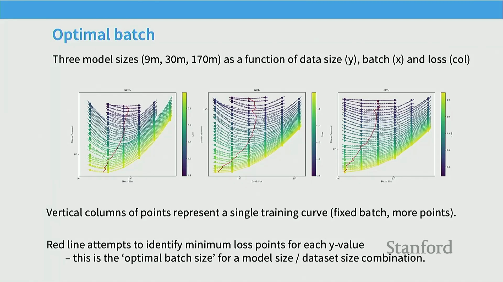
与 Kaplan 等人的论文非常相似，他们遵循了相近的实验配方。尽管图表呈现形式与 Kaplan 论文有所不同，但底层分析策略基本一致。他们的目标是确定训练过程中的关键批次大小（或称最优批次大小）。为此，针对不同的模型配置，他们试图在批次大小与数据量或损失值之间建立可预测的缩放关系。图中的每一列大致代表一次独立的训练曲线。随后，他们通过拟合二次曲线来定位损失最小值。随着数据量/模型规模向上增加，图中红线标示了各配置下的最优损失点。这旨在揭示：针对特定的模型尺寸与数据集大小组合，其对应的最优批次大小究竟为何。

## 学习率稳定性与缩放可预测性
此时，你可以沿用 Kaplan 论文中的逻辑来确定批次大小。具体而言，你需要复现同类分析图表。如果大家还记得前两节课关于 Kaplan 论文及关键批次大小的讨论（若不记得，建议查阅课件），便会知道：一个高度可预测的指标，即模型期望达到的终端损失(Terminal Loss)，与关键批次大小处的批次大小之间存在明确的关联。我们再次观察到，与 Kaplan 的研究一致，目标损失（或终端损失）与期望批次大小之间呈现对数线性关系(Log-linear Relationship)。基于此，你便能大致推算出所需的批次大小。例如，若你设定了特定的目标模型规模，可利用缩放定律预测其终端损失；一旦获知预期损失，即可反推适用的批次大小。图中呈现出一个清晰的趋势：随着目标损失的下降，最优批次大小呈多项式级增长。
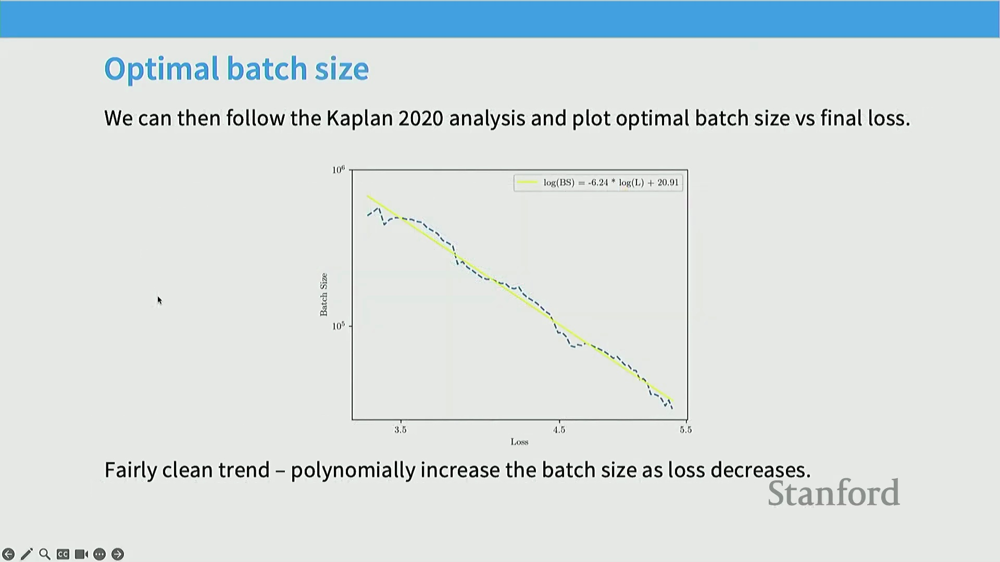

当然，批次大小会随目标损失（进而随算力预算）的变化而浮动，因此我们必须为其拟合一条缩放定律。然而，由于我们已应用了 muP，理论上若该方法有效，我们应观察到：此处的最优学习率将保持稳定。如图所示，我们对比了不同规模的模型，从浅色代表的小模型到深色代表的大模型。尽管受限于算力，大模型仅进行了短时间的训练，但图中仍呈现出相当清晰的趋势。此外，该结果再次与 Kaplan 等人早期的研究高度吻合：损失曲面(Loss Landscape)存在一个相对宽阔的极小值区域(Valley)，而当超参数偏离该区域导致模型不稳定时，损失会急剧上升。此处的关键在于，在跨越数个数量级的规模变化中，损失最小值（或接近最小值的区域）始终保持固定。无论从小模型到大模型，最优学习率基本都稳定在同一位置，即约 $10^{-2}$。这为 muP 的有效性提供了有力验证：正确缩放模型初始化权重及逐层学习率，能够避免繁琐的学习率调优，甚至无需专门拟合学习率的缩放定律即可准确预测最优值。

## 高效的 Chinchilla 风格缩放与余弦学习率挑战
最后一点，你可能需要明确模型尺寸与训练数据量之间的权衡关系(Trade-off)。若训练小型模型，极易出现过度训练(Overtraining)。因此，你至少需要为给定的词元(Token)数量找到合理的训练依据。为此，通常需要复现类似 Chinchilla 的分析方法。
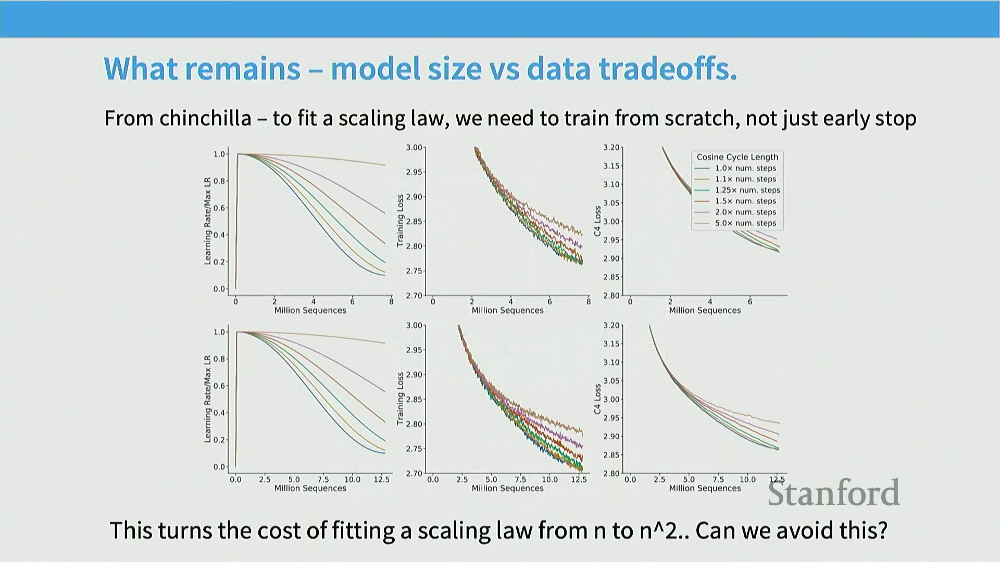
MiniCPM 团队在此提出了一项极为巧妙且出色的创新。尽管此前也有学者尝试过类似思路，但我认为他们是首个在大语言模型语境下将其广泛应用并普及的团队，尤其是在 Chinchilla 风格缩放的背景下。具体而言：假设我想拟合一条 Chinchilla 缩放定律曲线。我需要同时改变词元数量与模型尺寸。在实际操作中，通常会固定模型尺寸，然后延长训练时间（即增加数据量）。理想情况下，若能通过早停(Early Stopping)机制提取不同训练阶段的检查点(Checkpoint)，并用它们代表不同的数据集规模，那将极为高效。因为较早的检查点对应较少的训练数据，单次运行即可收集所有与数据缩放相关的样本。然而，问题在于：针对不同的数据训练目标，余弦学习率调度(Cosine Learning Rate Schedule)曲线是不同的。若数据量较小，余弦曲线的衰减阶段会非常短暂（或退火/冷却(Annealing)极快），训练不久后学习率便迅速下降；若数据量较大，学习率则会非常平缓地下降至训练结束。因此，小数据量与大数据量训练运行的学习率调度截然不同。这是一个极其关键且常被忽视的细节，许多研究都曾在此处受挫。你无法仅凭单次固定步长的余弦学习率运行，来准确拟合所有数据规模下的缩放关系。
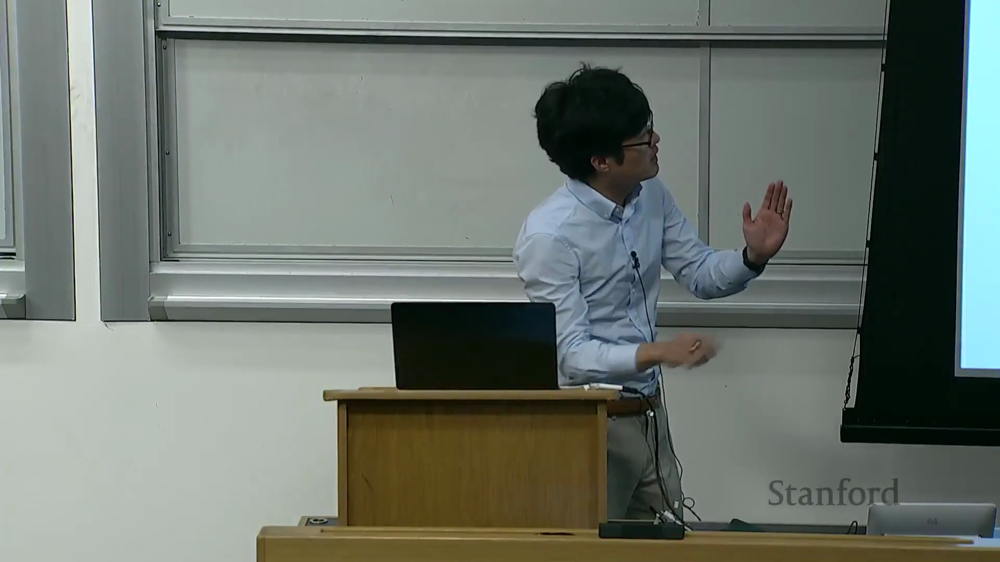

---

## 余弦学习率在数据缩放中的局限性
切勿仅凭单次余弦学习率(Cosine Learning Rate)运行的早期检查点(Checkpoint)来推断数据缩放(Data Scaling)行为。这一误区在实际操作中极易导致结果偏差。因此，为避免此问题，通常需要从训练起点开始，针对每一个目标数据量终点单独进行完整训练。这意味着必须为每个目标数据量执行一次独立的训练任务。这基本上会导致 $O(n^2)$ 次训练运行。尽管部分运行规模较小，但仍需执行大量独立实验，每次针对特定终止点，而非单次运行并收集中间检查点。这种做法显得极为低效。
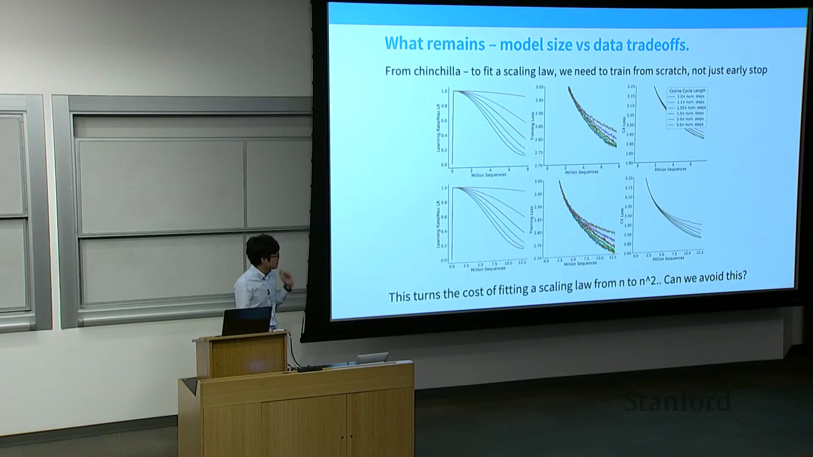

## WSD（预热-稳定-衰减）学习率调度
为此，MiniCPM 团队推广了 WSD（Warm-up Stable Decay，预热-稳定-衰减）学习率调度策略。左侧图表清晰阐释了其核心原理。传统训练中，我们通常采用图中黄色曲线所示的余弦学习率。该曲线先经历一个短暂的预热期(Warm-up)以快速达到峰值学习率，随后沿余弦轨迹持续衰减至训练终点。此后，学习率可能维持在最低值。当然，具体实现可选：既可在终点直接停止训练，也可让学习率降至 0。余弦调度大致呈现此形态。其局限性在于，若训练目标（即数据总量）不同，余弦衰减曲线将截然不同，导致预热阶段后的轨迹无法跨实验复用。相比之下，新型 WSD 策略本质上呈现为梯形学习率调度，包含三个阶段：与余弦调度相同的预热阶段、保持学习率恒定的稳定阶段(Stable Phase)，以及使模型迅速降至最低学习率的快速退火(Annealing)/衰减阶段。当然，研究者可设计多种变体，例如先升后降再在极小值平台期保持平稳等。但总体而言，其最简化的核心逻辑可概括为：预热、稳定、衰减、终止。该策略的优势何在？关键在于它允许复用稳定阶段。具体而言，若希望仅凭单次运行完成 Chinchilla 缩放分析，可先进行预热，随后进入稳定训练阶段直至数据量达标，最后执行退火。若需评估“使用较少数据量时的模型表现”，只需回滚至对应历史检查点，再次执行退火即可。由此，你便能获得精确的“预热-稳定-衰减”学习率轨迹，而无需从头开始训练。这一设计极为巧妙。稳定阶段的存在使得研究者几乎能在单次训练运行中完成 Chinchilla 风格的数据缩放分析，其计算成本仅相当于一次常规训练。目前，该方法已在业界得到广泛采用。

## 训练曲线动态与 WSD 的优势
WSD 调度策略效果显著。我认为 MiniCPM 团队对其推广功不可没，随后众多研究团队纷纷跟进。如今，WSD 风格的调度策略已在诸多训练流程中普及。如图所示，若采用余弦学习率调度，训练曲线通常呈现为相对平滑且可预测的下降轨迹，逐渐逼近终端损失(Terminal Loss)，即图中黄线所示。而采用 WSD 训练时，损失曲线则会呈现更明显的波动与曲折特征，如图中深色曲线所示。由于预热期极短，其在整体训练曲线中几乎难以察觉。进入稳定阶段后，损失按预期平稳下降。一旦步入衰减阶段（即退火期），损失会急剧下降，直至学习率降至 0 或预设最小值，此时即达到终端损失。此类损失曲线初看或许显得异常，但在使用快速退火学习率调度时，实属正常现象。需要强调的一点是：在任意词元(Token)数量节点上，WSD 曲线的损失最低点通常优于或至少持平于余弦调度。尽管并非绝对（两者互有胜负），但整体表现相当。总体而言，业界普遍认为这两种调度策略的最终性能大致相当，但 WSD 具备一项显著优势：无需预先固定训练终止点。研究者可灵活地反复执行退火操作，从而高效获取不同数据量规模下的模型检查点。
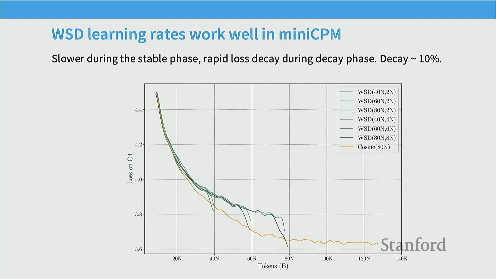

## Chinchilla 惩罚估算与缩放方法论
此外，亦有其他研究致力于估算 Chinchilla 惩罚(Chinchilla Penalty)。例如，华盛顿大学与苹果公司合作发表了一篇相关论文，专门探讨该指标。所谓 Chinchilla 惩罚，即指当持续增加训练数据时，模型损失相较于遵循 Chinchilla 最优比例(Aspect Ratio)缩放时的性能差距。图中青色曲线对应 $m=20$ 的配置（即每 1 个参数对应 20 个词元）。试想若采用 320 词元/参数的比例进行训练，所得缩放曲线将大致与青色线平行。图中带圆圈标记的曲线则代表 640 词元/参数的训练结果，以及更深色线代表的更高比例配置。该研究表明：除采用 WSD 策略外，我们亦可探究“随着词元-参数比(Token-Parameter Ratio)的提升，模型性能将下降多少”。事实证明，该性能衰减同样具备高度可预测的规律，可基于小规模实验的性能下降趋势进行有效外推。尽管尚未见业界在超大规模训练中直接应用此法，但该思路极具启发性：通过在小模型上外推“超额词元惩罚(Overtraining Penalty)”，我们同样能以接近单次训练的成本完成 Chinchilla 分析。回归 MiniCPM 的研究，借助现有工具，WSD 学习率调度使我们仅需单次训练运行，即可衍生出多种数据量变体。该单次运行赋予了我们在训练流程中灵活截取不同数据规模的能力。结合针对不同模型规模的多次独立训练，我们便具备了开展 Chinchilla 分析的全部数据基础。该团队采用了方法一与方法三进行拟合。回顾前文，方法一通过叠加所有训练曲线并提取下包络线(Lower Envelope)，其趋势应大致符合幂律(Power Law)。方法三则采用联合双变量拟合：假设一个双变量缩放定律(Bivariate Scaling Law)，利用曲线拟合技术将其映射至全部实验数据，进而求解出最优的词元-参数比例。
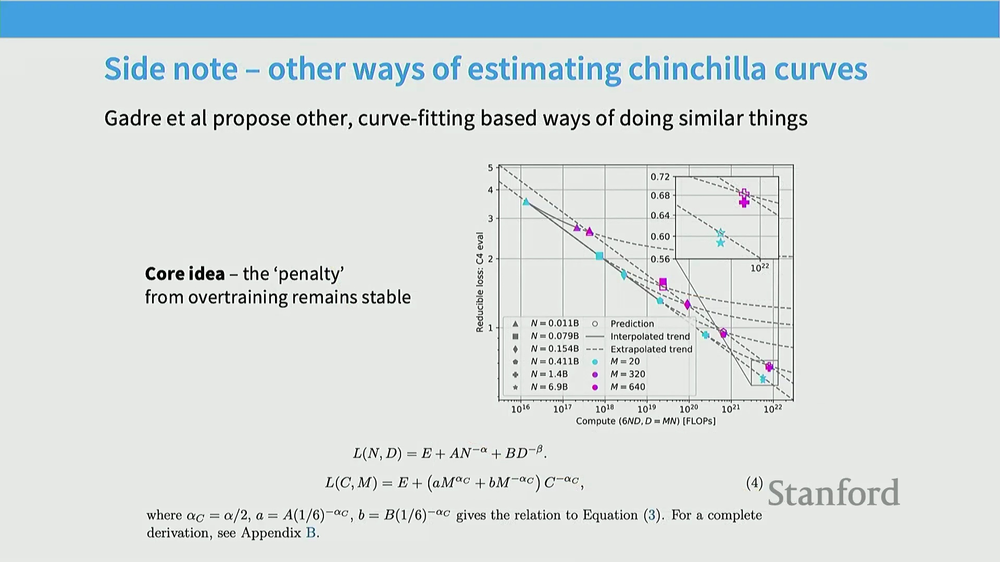

## 高 Token-参数比与缩放定律拟合
团队同时应用了这两种方法。针对方法一，他们观察到了清晰（虽非完全线性）的下降趋势，从而能够大致从计算算力(Compute Budget)推导出词元配比。然而，用于论证诸多架构设计决策的核心依据是方法三（曲线拟合）。图中展示的等值线(Contour Lines)即为拟合所得曲线，散点则代表为拟合 Chinchilla 参数所执行的小规模实验。为验证其方法的有效性，他们得出了极高的词元-参数比。该数值之高令我倾向于视其为离群值(Outlier)，与多数现有文献的结论存在一定偏差。研究者辩称，得益于数据质量的提升与模型架构效率的优化，LLaMA 类架构理应采用更高的训练比例。但其估算的词元-参数比高达 192:1，在既往研究中实属罕见。尽管业界不乏 Chinchilla 定律的复现工作，但鲜有研究真正提出或主张过 192:1 的词元-参数比。尽管如此，我们确实观察到 Llama 3 等近期模型采用了显著更高的数据-模型比例(Data-to-Model Ratio)，且并未出现明显的收益递减(Diminishing Returns)。这些模型的性能并未逊于遵循传统 Chinchilla 缩放的 Llama 2。这表明，通过精细的优化与超参数调优，我们完全有能力大幅突破“20 倍词元量对应模型参数”的经验法则。因此，若从最后两张幻灯片中仅汲取一条核心启示，那不应是盲从 MiniCPM 拟合的特定缩放定律，而是认识到：Chinchilla 分析并非不可逾越的严格约束，“20 倍比例”仅是基线起点。大家应放心大幅提升词元-参数比。最终，其拟合曲线整体表现良好。图中展示了数据规模与模型规模的缩放关系，以及英文与代码困惑度(Perplexity, PPL)的缩放定律。尽管图中存在若干难以解释的异常离群点，但随着他们在相对较小的模型上持续增加数据量，所拟合出的缩放定律整体仍具备较高的可靠性与参考价值。
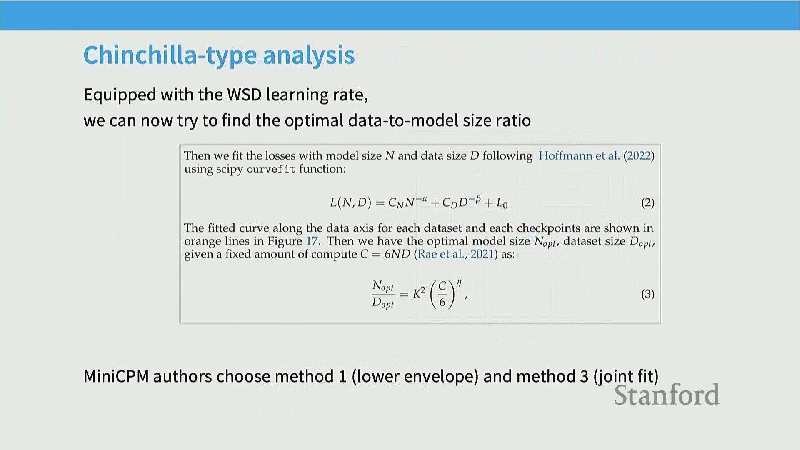
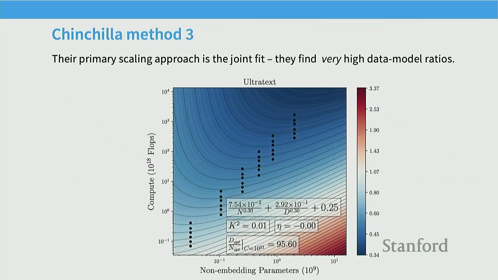
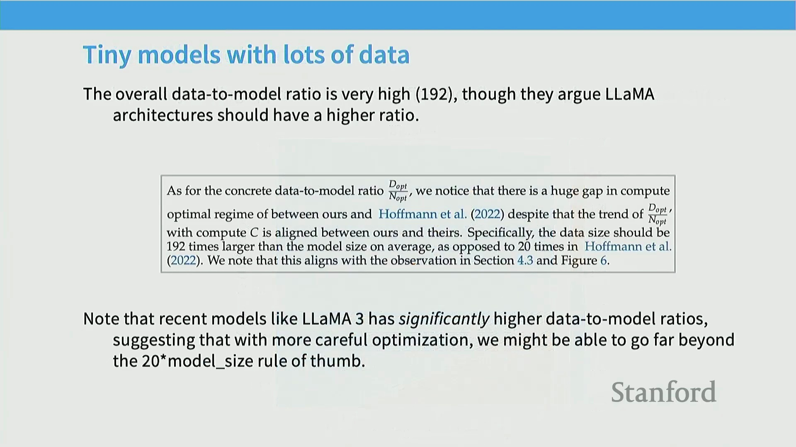

## 问答：muP 实现与学习率调整
以上即为大规模模型训练中缩放配方(Scaling Recipe)的典型实例。我的讲解暂告一段落。WSD 等概念或许对各位而言较为新颖。若有任何疑问，或针对 Chinchilla 复现、muP 等其他环节存在不解，请随时提问。好的，确实有同学提问。该问题聚焦于应用 muP 时的核心调整。简言之，muP 的改动主要集中在两点：一是权重初始化(Weight Initialization)策略的调整；二是学习率的修改。muP 要求采用逐层学习率(Layer-wise Learning Rate)，这可能比大家习惯的全局统一学习率(Global Learning Rate)稍显复杂。至于初始化部分，实际改动并不剧烈。若你原本已采用标准的 Kaiming 初始化(Kaiming Initialization)，其本身已包含 $1/\text{fan\_in}$ 或 $1/\sqrt{\text{fan\_in}}$ 的缩放因子，这已符合 muP 的基本要求。真正的差异在于学习率的逐层缩放配置。通常情况下，除非你引入了特定的优化器变体……
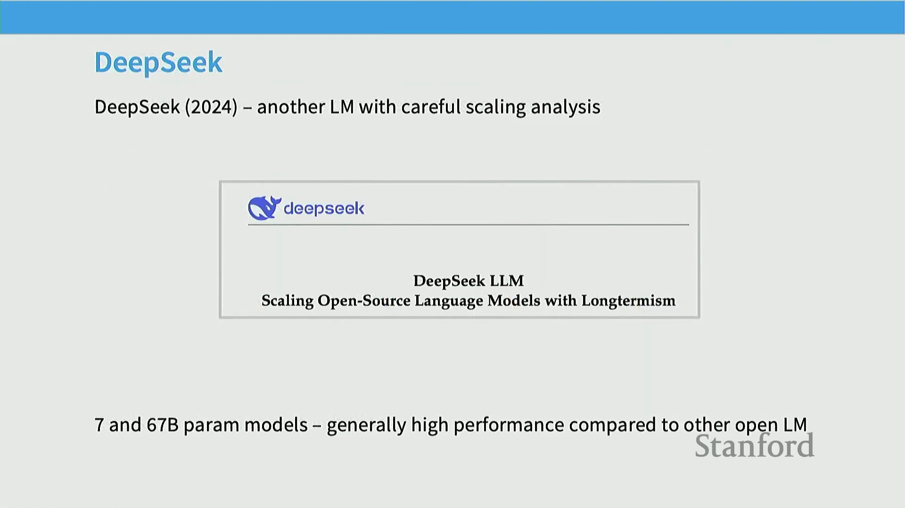
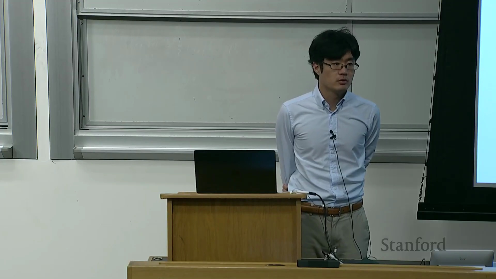

---

## 学习率参数化的实际差异
通常情况下，除非采用某些特殊优化策略，否则模型训练通常采用全局学习率(Global Learning Rate)。而在实际应用最大更新参数化(Maximal Update Parameterization, muP) 等方法时，一个核心区别在于引入了逐层学习率(Per-layer Learning Rate)，这与标准的全局统一学习率设置存在显著差异。
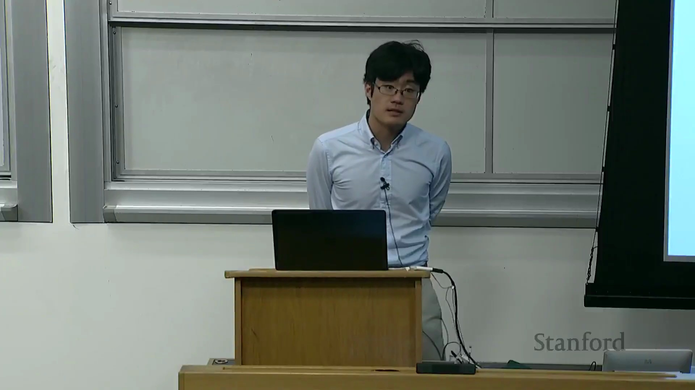

## 理解 WSD 动态与退火阶段的重要性
观察预热-稳定-衰减(Warm-up Stable Decay, WSD) 调度策略的稳定阶段时，其训练曲线(Training Curve) 与余弦学习率调度(Cosine Learning Rate Schedule) 相对接近，但并非完全重合。在进入衰减阶段前，两者之间通常会出现明显的性能差距。这揭示了深度学习优化中的一个有趣现象：尽管稳定阶段对于帮助模型充分脱离初始化状态(Initialization State) 至关重要，但真正促使损失(Loss) 大幅下降的关键在于退火/衰减阶段(Annealing/Decay Phase)。若缺乏恰当的退火过程，最终损失值将显著偏高。因此，众多优化器与学习率调度策略的设计核心，均在于如何平衡两者：既要在探索阶段(Exploration Phase) 维持较高的学习率以充分探索损失曲面(Loss Landscape)，又要通过精心设计的衰减阶段将损失平滑退火至全局极小值附近。
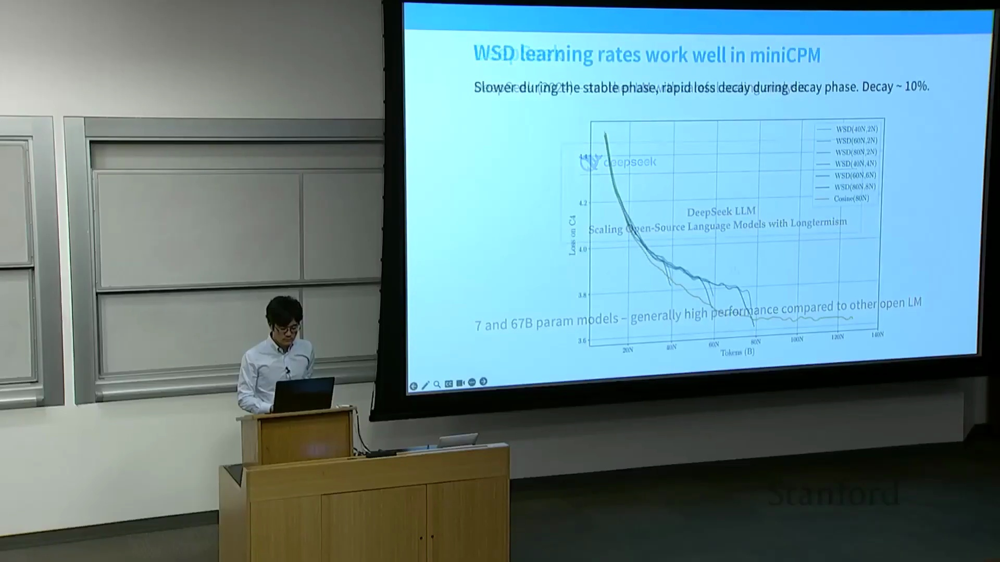
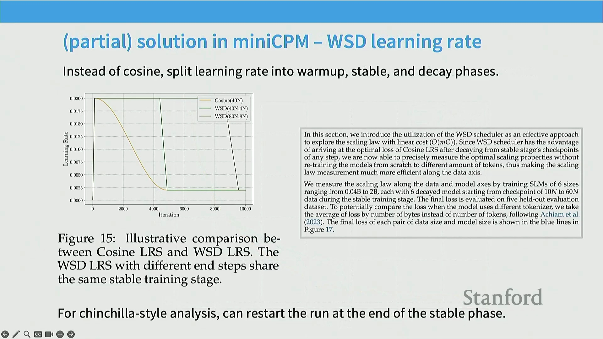

## DeepSeek 严谨的缩放方法论
2024 年发布的 DeepSeek LLM 原始论文展示了一种极为严谨且科学的模型开发范式(Model Development Paradigm)。研究团队进行了细致的缩放消融实验(Scaling Ablation Studies)，以确保模型规模扩展时的配置正确性，这也是成功掌握缩放定律(Scaling Laws) 的团队所秉持的一贯态度。其最初发布的 70 亿(7B) 和 670 亿(67B) 参数模型在当时取得了卓越性能，直接与 Llama 2 和 Mistral 展开正面竞争。尽管其初期影响力未及后来的 DeepSeek-V3 匹敌 GPT-4 那般轰动，但这仍是一项极具价值且值得深入剖析的典范工作。
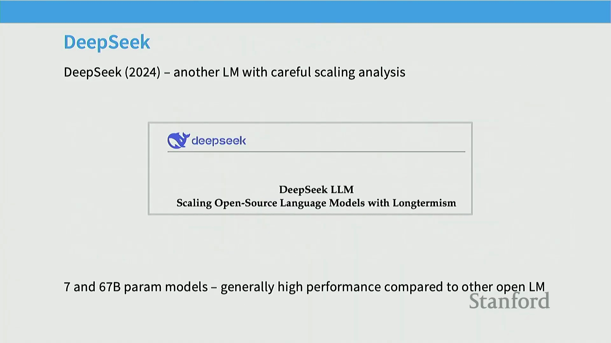

## 无需 muP 的直接超参数估算
与 MiniCPM 和 Cerebras GPT 不同，DeepSeek 的缩放方案并未依赖 muP 技术。相反，他们选择直接估算最优批次大小(Batch Size) 与学习率(Learning Rate)。这种直接估算的方法建立在对缩放定律的高度自信之上。团队首先在较小规模模型上对批次大小和学习率进行网格搜索(Grid Search) 以定位最优值，随后将该流程复现至更大规模。鉴于损失曲面(Loss Landscape) 呈现出相对宽阔的极小值盆地(Valley/Basin)，他们得出结论：超参数的精确数值并非绝对关键，但确保其数量级(Order of Magnitude) 正确则至关重要。通过在不同非嵌入层浮点运算量(Non-embedding FLOPs) 下训练模型并动态调整批次大小与学习率，他们成功外推(Extrapolation) 出更大规模模型的最优超参数(Hyperparameters)。尽管批次大小的缩放趋势清晰明确，学习率的拟合曲线略显波动，但该结果依然有效地指导了整体缩放策略的制定。
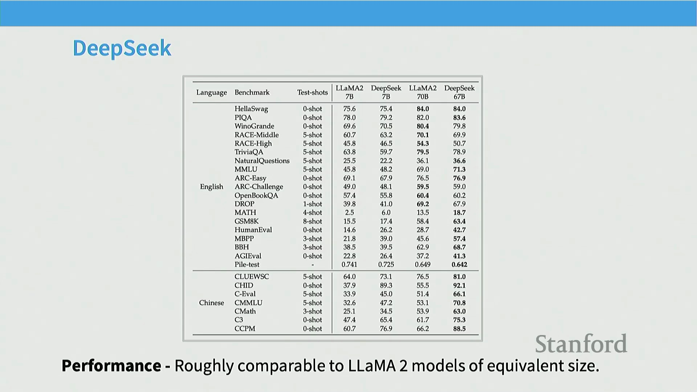
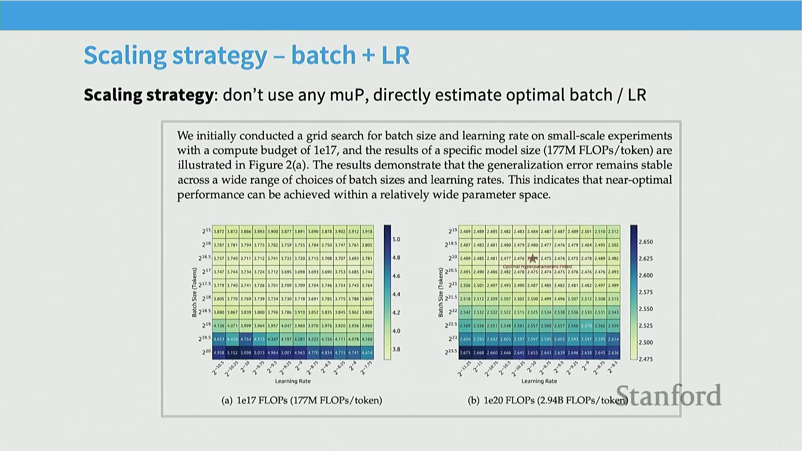
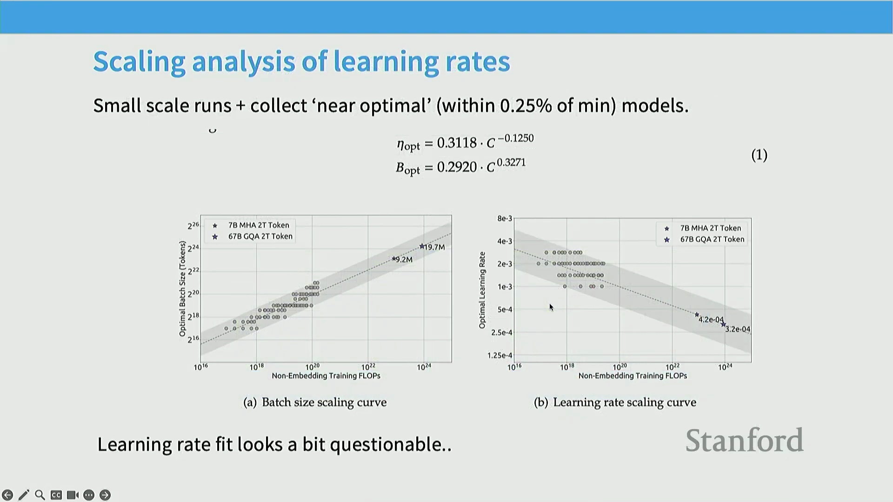

## Chinchilla 风格分析与预测性缩放
DeepSeek 同样遵循业界最佳实践(Best Practices)，采用 WSD 学习率调度策略开展 Chinchilla 风格的分析，以最大限度减少冗余计算(Redundant Computation)。他们设计了一种改进型调度方案，包含预热、稳定以及两个连续的衰减阶段（各占总计算量的 10%），将约 20% 的总算力预算(Compute Budget) 专门用于退火。与其他研究机构一致，他们发现基于等计算量(Iso-FLOPs) 的 Chinchilla 分析拟合结果极为平滑可靠，而超参数的拟合则往往伴随较高噪声。通过连接不同算力预算下二次损失曲线拟合的最低点，他们从零开始独立推导出了最优的词元-参数比(Token-Parameter Ratio)，而非盲目沿用传统的“20 倍”经验法则。在确立缩放策略后，团队成功基于小规模实验（约 $10^{20}$ FLOPs）进行外推，精准预测了 70 亿与 670 亿参数模型的最终性能，充分印证了经过良好校准(Calibration) 的缩放定律所具备的强大预测能力。
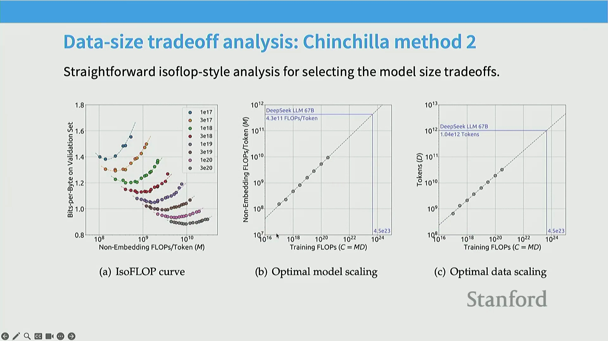
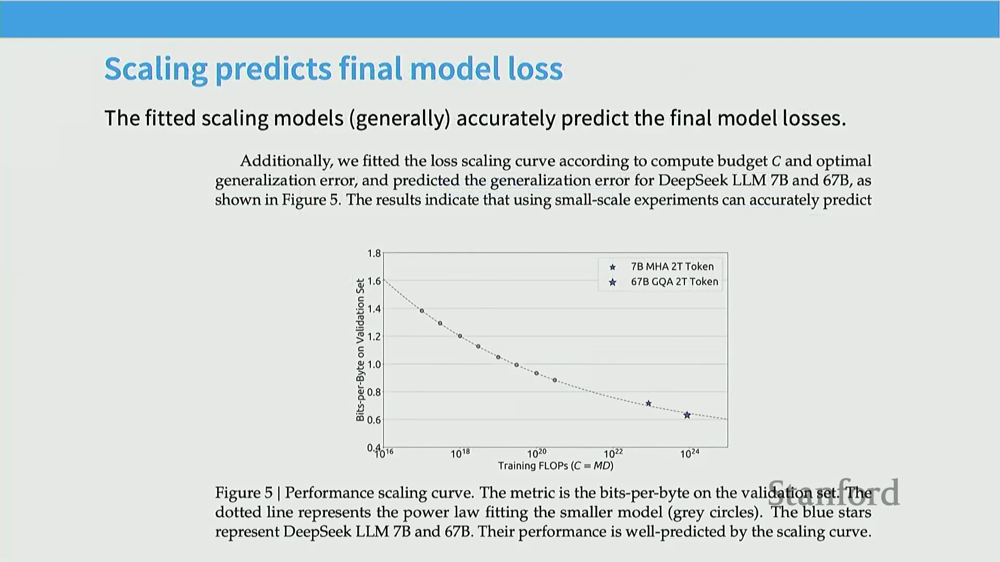

## 前沿模型开发实践的演变
业界经常探讨的一个问题是：前沿实验室是否仍会为每一款新模型重复执行如此广泛的缩放分析。观察表明，随着大语言模型的持续演进，公开发表的缩放方法论详细报告已逐渐减少。以 DeepSeek 后续版本（V2 与 V3）为例，其技术报告更侧重于强调多头潜在注意力(Multi-head Latent Attention, MLA) 等架构创新，以及低位宽训练(Low-bitwidth Training) 等系统级优化，而非继续发表新的缩放定律研究。这一趋势表明，尽管各大实验室内部可能仍在持续验证相关原则，但核心缩放策略已日趋标准化，或不再具备足够的学术新颖性，因此业界的研究重心已全面转向模型架构设计与训练效率的突破性创新。
 *（注：时间戳 504.03 与此前部分进入本问答环节的过渡相对应，出于讲座结构连贯性考虑放置于此）*

---

## 近期缩放研究概览
对过去一年缩放定律(Scaling Laws)相关论文与模型发布的最新调研表明，极少有研究能达到 MiniCPM 或 DeepSeek 所展现的细节深度。截至 2025 年，这两项工作仍是关于实用缩放方法论(Scaling Methodology)最为全面的开源研究。尽管如此，近期发布的几款主流模型仍提供了宝贵且更具针对性的见解，进一步揭示了缩放定律在现代模型训练中的实际应用。
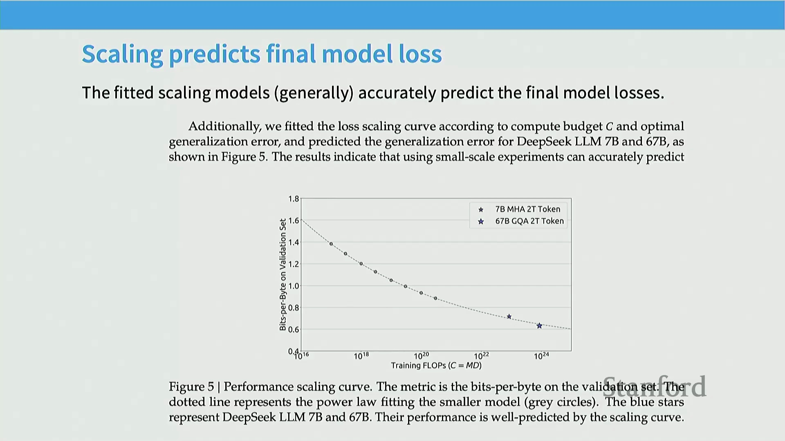

## Llama 3：不断演进的 Token-参数比
Llama 3 是近期最具标志性的模型发布之一。值得注意的是，该团队明确复现了 Chinchilla 风格的等计算量(Iso-FLOPs)缩放分析。与经典的 20:1 词元-参数比(Token-Parameter Ratio)不同，他们的拟合结果显示最优比例接近 39:1 或 40:1。这表明 20:1 的经验法则并非一成不变；随着架构效率的提升、算法优化以及训练数据质量的提高，最优比例正持续向更高数值演进。
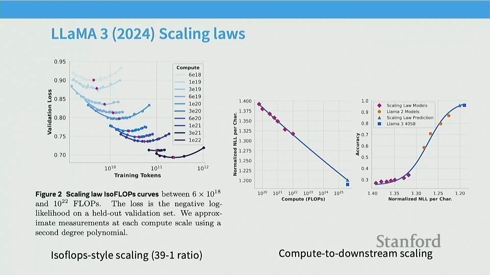
除参数缩放外，Llama 3 团队还探索了将计算算力预算(Compute Budget)与负对数似然(Negative Log-Likelihood, NLL)相关联，进而将 NLL 值映射至下游基准测试(Benchmark)准确率上。其目标不仅在于优化损失值(Loss)，更在于预测模型在 MMLU 或 LAMBADA 等基准测试中的实际表现。通过在小规模实验及旧版 Llama 2 模型上拟合 S型(Sigmoid)曲线，他们成功预测了超大规模 Llama 3 405B 模型的性能。尽管该方法在数据筛选(Data Curation)中的具体应用细节尚有限，但这一思路凸显了一个日益显著的趋势：将缩放定律作为连接理论损失指标与实际基准性能的关键桥梁。

## 混元大模型（Hunyuan Large）：混合专家模型的缩放
另一项执行严谨的近期研究聚焦于混元大模型(Hunyuan Large)，该模型采用混合专家(Mixture of Experts, MoE)架构。由于 MoE 的运行机制与稠密模型(Dense Model)存在根本性差异，研究团队必须重新推导其最优的缩放比例。
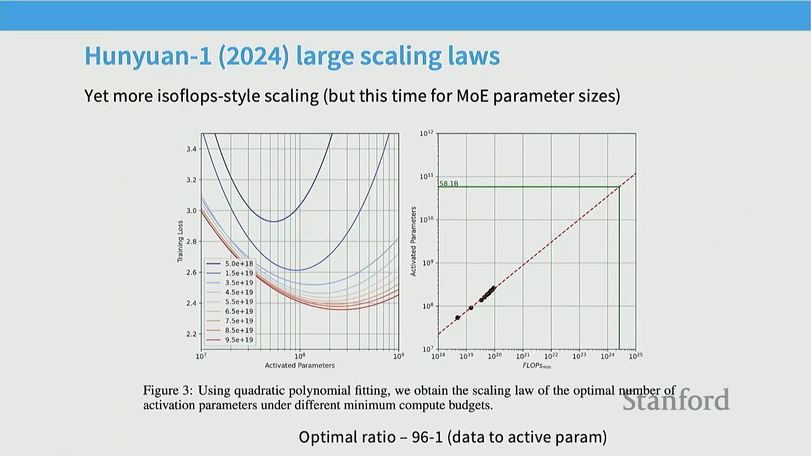
通过独立开展等计算量(Iso-FLOPs)分析并拟合二次曲线以定位损失最低点，他们得出了显著更高的比例：数据量与激活参数(Active Parameters)之比约为 96:1。这凸显了最优词元-参数比高度依赖于模型架构本身。从这些复现研究中获得的更广泛启示并非具体的数值，而是等计算量方法论的稳健性。各团队不断复现此类分析，力求将词元-参数比推至尽可能高的水平，从而在最大化数据利用率的同时，将模型规模控制在能够实现低成本推理(Inference)的范围内。

## Minimax01：在大规模下验证线性注意力
Minimax01 引入了一种更具创新性的缩放定律应用场景，其焦点在于架构验证(Architecture Validation)，而非单纯的超参数调优(Hyperparameter Tuning)。作为一家专注于长上下文(Long Context)生成的初创公司，他们试图量化从二次时间复杂度(Quadratic Time Complexity)的 Softmax 注意力机制转向线性时间复杂度(Linear Time Complexity)的“闪电注意力(Lightning Attention)”及其混合变体所带来的性能权衡(Performance Trade-off)。
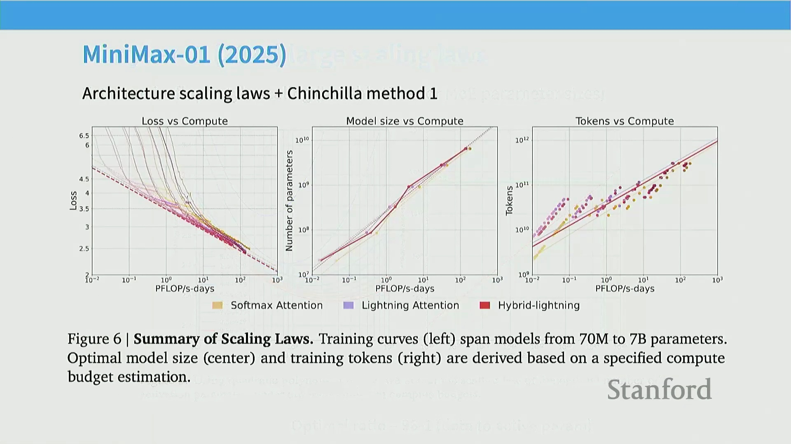
借助 Chinchilla 方法一（即分析损失曲线的下包络线(Lower Envelope)），他们对比了不同架构下隐含的最优模型尺寸与词元数量。其缩放分析表明，随着算力规模的增长，线性注意力与混合注意力机制的扩展能力(Scaling Capability)与标准 Softmax 注意力大致相当。尽管类似的对比缩放图在学术文献中较为常见（如 Mamba、DeltaNet 等研究），但 Minimax01 提供了一个难得的工业级案例，证实了此类验证在大规模模型发布中已切实落地，从而为在高效长上下文训练中采用线性注意力提供了坚实依据。

## 现代缩放策略综合
综合上述案例研究，现代缩放策略配方(Scaling Recipe)中已涌现出一套清晰的共性要素。Cerebras GPT 与 MiniCPM 广泛利用最大更新参数化(Maximal Update Parameterization, muP) 来跨尺度稳定超参数，并结合预热-稳定-衰减(Warm-up Stable Decay, WSD) 学习率调度策略，以实现高效且仅需单次运行的 Chinchilla 分析。DeepSeek 则采取了更为直接的路径：他们未采用 muP，转而在不同浮点运算量(FLOPs) 尺度上执行广泛的网格搜索(Grid Search)，以拟合最优批次大小(Batch Size) 与学习率的缩放定律，同时假定其余超参数保持稳定。
 *（注：时间戳与回顾上下文对齐）*
近期发布的模型（如 Llama 3 与 Hunyuan）主要侧重于等计算量(Iso-FLOPs)分析以确定模型规模，而 Minimax01 则利用缩放曲线验证架构效率(Architecture Efficiency)。在所有方法论中，各团队均固定模型的深度与宽度比例(Depth-to-Width Ratio)，随后扩展模型总容量，并投入充足的计算预算以精细调优批次大小与学习率。实践表明，这依然是实现可预测缩放过程(Predictable Scaling)中最关键的变量。

## muP 简介：探索尺度不变的超参数
本次讲座的后半部分将深入探讨 muP（最大更新参数化，Maximal Update Parameterization）。前述案例研究表明，如何精准设定学习率与批次大小是一个普遍存在的核心挑战。当前，权重初始化(Weight Initialization)与逐层学习率(Layer-wise Learning Rate)的选择在很大程度上仍依赖经验法则或试错法(Trial-and-Error)。若能通过系统化调整初始化与参数化策略，实现尺度不变的超参数(Scale-invariant Hyperparameters)，将极大简化训练流程。这将使研究人员能够在小型代理模型(Proxy Model)上可靠地完成超参数调优，并将其直接迁移至全规模训练，从而避免耗费巨额算力重新调参或进行复杂的缩放定律拟合。
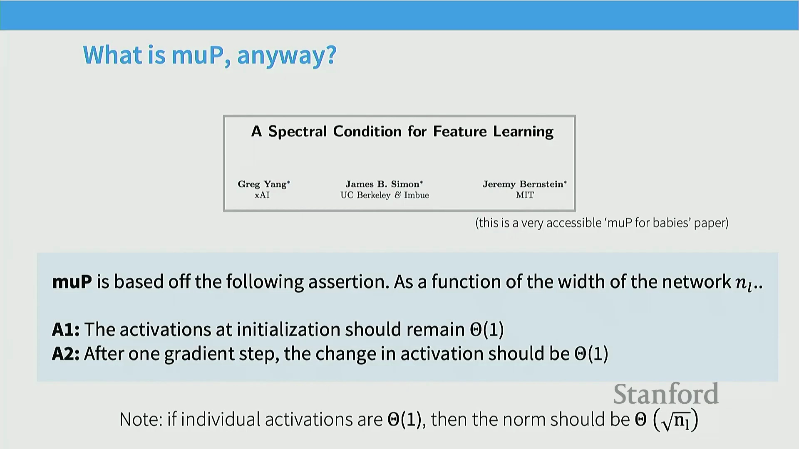
接下来的内容将逐步拆解 muP 背后的数学推导，阐释实现可预测缩放的核心概念与数学对象，并回顾近期的独立消融研究(Independent Ablation Studies)。这些研究深入探讨了导致 muP 失效的边界条件、其对架构变更的鲁棒性(Robustness)，以及其在实际 Transformer 语言模型训练中的具体表现。

---

## 揭秘 muP(Maximal Update Parameterization)：核心概念与基础目标
尽管最大更新参数化(muP) 在实践中常被简化为“按 $1/\text{width}$（宽度倒数）缩放权重初始化(Weight Initialization)与学习率(Learning Rate)”，但其底层理论框架揭示了神经网络动力学(Neural Network Dynamics)的更深层原理。理解 muP 对于实现尺度不变超参数(Scale-invariant Hyperparameters) 至关重要，它使得研究人员能够利用小规模代理模型(Proxy Model) 可靠地预测大规模架构的最优训练配置。针对希望进行严谨数学推导的读者，演讲者推荐参阅该领域的奠基性预印本(Fundamental Preprint)，并结合面向工程实践的指南(Practitioner's Guide)。后者系统梳理了不同文献在数学表述上的差异与不一致之处。

## 尺度不变训练(Scale-invariant Training) 的两大支柱
muP 建立在两个核心稳定性条件之上。在无限宽网络极限(Infinite Width Limit)下，这两个条件必须严格成立：
1. **条件 A1（初始化稳定性 Initialization Stability）：** 初始化时，单坐标激活值(Per-coordinate Activation)必须保持在 $\Theta(1)$ 量级（对应向量范数(Vector Norm)为 $\Theta(\sqrt{n_L})$）。该条件可防止模型增宽时出现信号爆炸(Exploding)或消失(Vanishing)现象，确保训练起始点的稳定性。
2. **条件 A2（更新稳定性 Update Stability）：** 经历单次梯度更新(Gradient Update)后，激活值的*变化量*在各坐标上同样须维持在 $\Theta(1)$ 量级。若违背此条件，模型在扩大规模时，其初始学习动态(Learning Dynamics)将面临停滞或不可预测的发散(Divergence)风险。

上述条件要求权重初始化方案(Weight Initialization Scheme)与逐层学习率(Layer-wise Learning Rate)必须经过精密的参数化(Parameterization)设计，以确保前向传播(Forward Propagation)与反向传播(Backward Propagation)过程中信号流的一致性。

## 推导合适的初始化策略（条件 A1）
为满足条件 A1，演讲者以采用高斯初始化(Gaussian Initialization)的简化深度线性网络(Deep Linear Network)为例展开推导。借助随机矩阵理论(Random Matrix Theory)，权重矩阵 $W_L$ 的算子范数(Operator Norm)将集中于 $\sigma_L \sqrt{n_{L} n_{L-1}}$ 附近，其中 $\sigma_L$ 表示初始化方差尺度(Variance Scale)。基于数学归纳假设（即假定第 $L-1$ 层及之前各层的激活值范数(Activation Norm)已保持稳定），我们可反推出满足条件的 $\sigma_L$ 表达式。设定 $\sigma_L \propto 1/\sqrt{\text{fan-in}}$（扇入，并辅以微小的宽高比修正(Aspect Ratio Correction)），可确保矩阵范数引入的 $\sqrt{n}$ 缩放因子与初始化策略提供的缩放作用相互抵消。这一设计保证了第 $L$ 层激活值(Activations)的 $L_2$ 范数(L2 Norm)严格遵循 $\sqrt{n_L}$ 的缩放比例，从而满足逐坐标 $\Theta(1)$ 的理论要求，并彻底规避初始化阶段的信号爆炸风险。
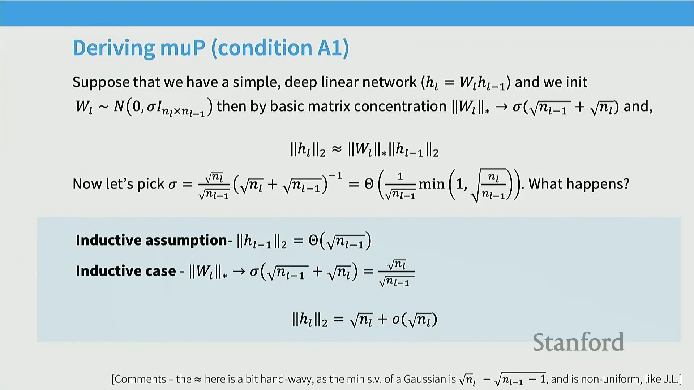

## 过渡至学习率缩放推导（条件 A2）
确立稳定的初始化方案后，推导重心转向条件 A2：明确学习率应遵循何种缩放规律，方能确保激活值更新量(Activation Updates)始终保持有界(Bounded)。在随机梯度下降(Stochastic Gradient Descent, SGD)优化器下，第 $L$ 层的权重更新(Weight Update)公式为 $\Delta W_L = -\eta_L \nabla L \cdot H_{L-1}^T$。由此引发的第 $L$ 层激活值变化量可拆解为三项：$\Delta H_L = W_L \Delta H_{L-1} + \Delta W_L H_{L-1} + \Delta W_L \Delta H_{L-1}$。其中，第一项已通过条件 A1 的归纳假设得到有效控制。推导的难点集中于第二项与第三项，这两项直接关联权重更新量 $\Delta W_L$，进而直接依赖于逐层学习率(Layer-wise Learning Rate) $\eta_L$ 的设定。通过严谨分析这些更新项的范数(Norms)，我们可推导出 $\eta_L$ 的精确缩放定律(Scaling Law)，从而确保网络在任意宽度下，其总激活值变化(Total Activation Change)均能维持稳定。
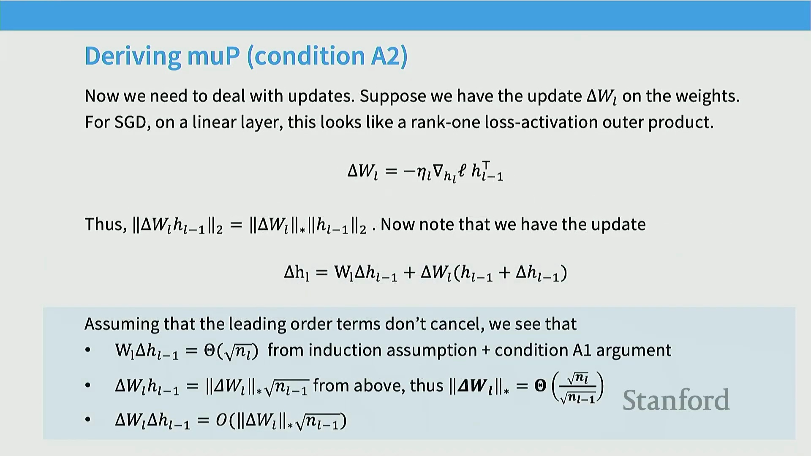

---

## 推导激活值更新稳定性（条件 A2）
在确立初始化稳定性(Initialization Stability)后，推导重心转向条件 A2：确保经历单次梯度更新(Gradient Update)后，激活值(Activations)的变化量在每一个坐标上仍保持在 $\Theta(1)$ 量级。激活值更新量 $\Delta H_L$ 可分解为三项，其中最关键的一项是前一层激活值范数(Activation Norm)与权重更新量 $\Delta W_L$ 的算子范数(Operator Norm)之积。核心挑战在于量化权重矩阵 $W_L$ 在单步优化后的变化幅度，因为这直接决定了随着网络宽度增加，更新信号是会逐渐消失(Vanishing)还是发生爆炸(Exploding)。
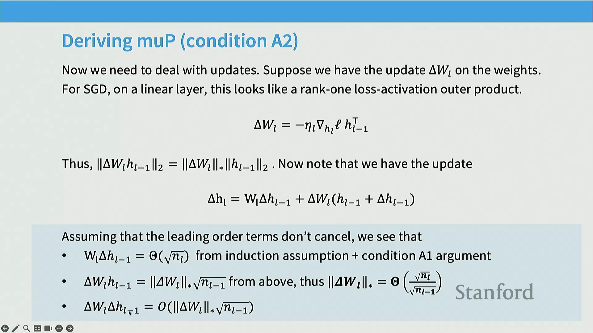

为攻克这一难题，我们引入一项关键的渐近假设(Asymptotic Assumption)：若训练过程稳定有效，单次梯度更新后的损失变化量(Loss Change) $\Delta L$ 必须同样维持在 $\Theta(1)$ 量级。我们期望损失优化的幅度不应随模型规模扩大而衰减或发散。
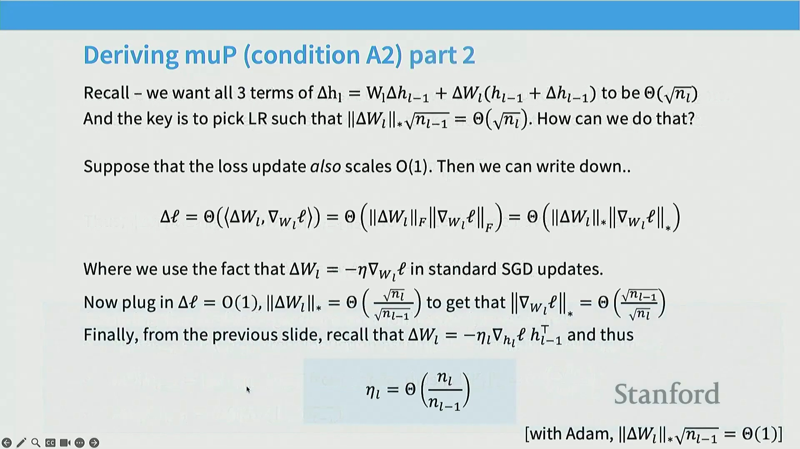

通过将 $\Delta L$ 近似为梯度(Gradient)与权重变化量(Weight Change)之间的内积相互作用，我们可以从有界的 $\Delta L$ 出发进行逆向推导，从而估算出梯度的量级，并进一步推算出权重更新的量级。

## 求解最优学习率缩放
在条件 A1 与 A2 分别约束了激活值、梯度及权重更新的量级后，我们可通过代数运算求解出逐层学习率(Layer-wise Learning Rate) $\eta_L$。
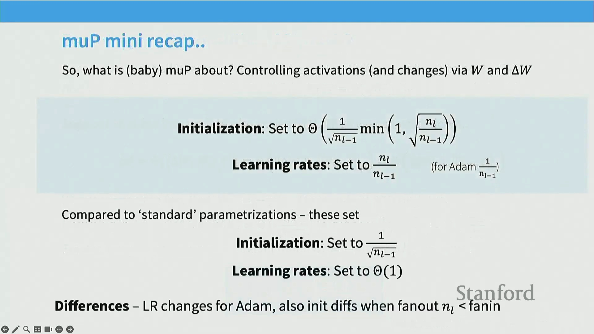

将这些渐近边界(Asymptotic Bounds)代入更新方程后，可为随机梯度下降(Stochastic Gradient Descent, SGD)推导出一项极为简洁的结论：最优学习率需按 $\text{fan-out} / \text{fan-in}$（扇出/扇入）的比例进行缩放。该推导过程依赖于对大 $\Theta$ 符号(Big-Theta Notation)的严谨代入，但最终得出的公式优雅地建立了学习率与各权重矩阵几何维度(Geometric Dimensions)之间的内在联系。

## Adam 优化器与标准参数化
尽管基于 SGD 的推导得出了扇出/扇入比例，但对于 Adam 等自适应优化器(Adaptive Optimizer)，其缩放规律将有所不同。对 Adam 优化器进行同等渐近分析表明，其最优学习率仅需按 $1 / \text{fan-in}$ 的比例进行缩放。在标准参数化(Standard Parameterization, SP)方案中，模型通常采用全局恒定学习率(Global Constant Learning Rate)，并以 $1/\sqrt{\text{fan-in}}$ 初始化权重。尽管其权重初始化策略已与 muP 一致，但学习率调度策略却截然不同。
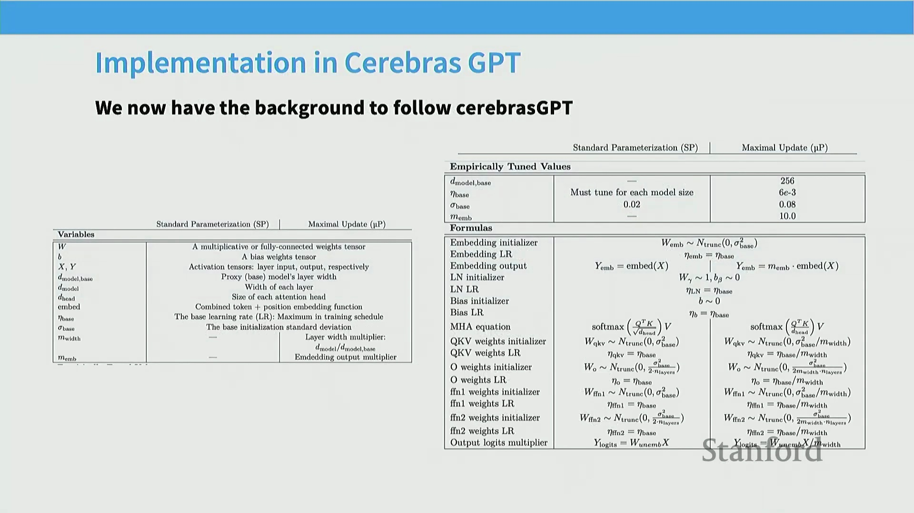

muP 的核心创新在于引入了逐层学习率缩放，旨在抵消网络增宽时更新量级自然增长（甚至爆炸）的趋势。

## 在 Transformer 中的实际实现与架构细节
将上述理论准则应用于 Cerebras GPT 等实际模型架构，有助于厘清具体的工程实现细节。嵌入层(Embedding Layer)需进行特殊处理，因为其输出范数并不随词表大小(Vocabulary Size)呈线性缩放关系。对于其余所有网络层（如多层感知机(Multi-Layer Perceptron, MLP)、注意力投影层(Attention Projection Layer)），其权重初始化均采用 $1/\text{width}$ 缩放，且 Adam 学习率亦按相同的 $1/\text{width}$ 比例进行缩放。
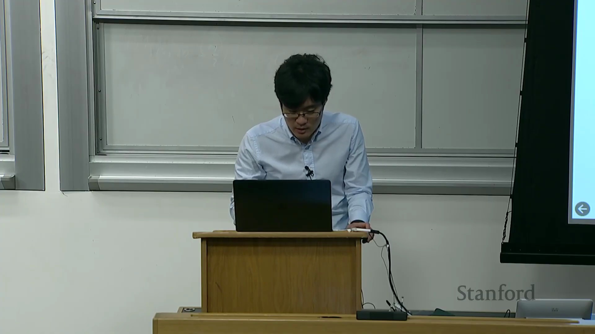

该方法与物理学中的重整化(Renormalization)思想异曲同工，旨在确保信号传播(Signal Propagation)在无限宽度极限(Infinite Width Limit)下保持稳定。

尽管该推导最初为简化模型而假设了深度线性网络(Deep Linear Network)，但通过适当的架构调整，这些原则同样适用于非线性激活函数(Non-linear Activations)、注意力机制(Attention Mechanisms)以及门控线性单元(Gated Linear Unit, GLU)。公式中的 $n_L$ 与 $n_{L-1}$ 仅指代特定矩阵乘法操作的输出维度(Output Dimension)与输入维度(Input Dimension)（即扇出与扇入），例如标准 MLP 块中常见的 $4d_{model}$ 维度扩展操作。

## 协调全局学习率与经验现实
当观察到如 DeepSeek 等采用全局学习率而非 muP 的模型时，业界常存疑问：这是否会导致更新量爆炸？

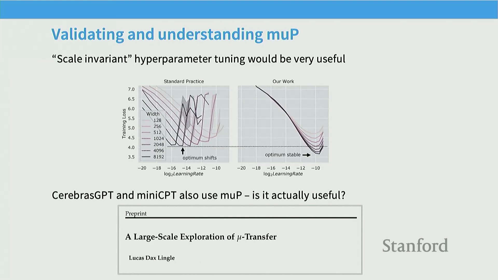

答案是肯定的：在标准参数化下，激活值更新量确实会随网络宽度增加而自然增长。然而，muP 并非实现成功训练的绝对必要条件；它本质上是一种工程工具，旨在最小化超参数(Hyperparameters)随模型尺度变化而产生的偏移(Drift)。诸如 DeepSeek 等顶尖实验室通过经验性拟合缩放定律(Empirical Fitting of Scaling Laws)来补偿日益增长的更新量，从而精准预测：随着模型规模扩大，全局学习率应如何相应衰减。

若能在目标规模上精准调优学习率，muP 便不再是必选项。其核心价值在于使代理模型调参(Proxy Model Tuning)具备高度可靠性：它确保了最优学习率在不同网络宽度下大致恒定，使研究人员能够凭借小规模实验(Small-scale Experiments)自信地外推大规模模型的行为特征，而无需为每一项超参数重新拟合缩放定律。
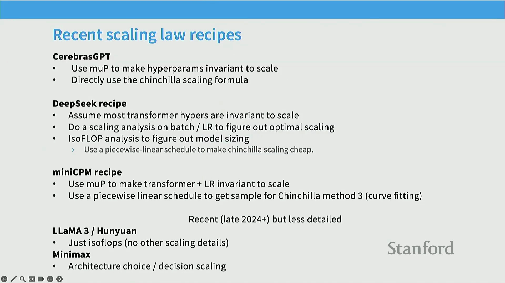

## 过渡到实证检验
在夯实 muP 的数学推导与概念基础后，下一步便是检验其在真实训练环境中的实际表现。该理论能否在复杂的实际约束下经受住考验？接下来，我们将深入探讨一篇由独立研究者撰写的综合性预印本(Comprehensive Preprint)。该研究对 muP 展开了系统的实证检验(Empirical Validation)，深入调查了其在复杂条件下的鲁棒性(Robustness)、潜在失效模式(Failure Modes)，以及在实际 Transformer 语言模型中的性能表现，从而有效弥合了无限宽度理论(Infinite Width Theory)与现实大语言模型(LLM)训练实践之间的鸿沟。
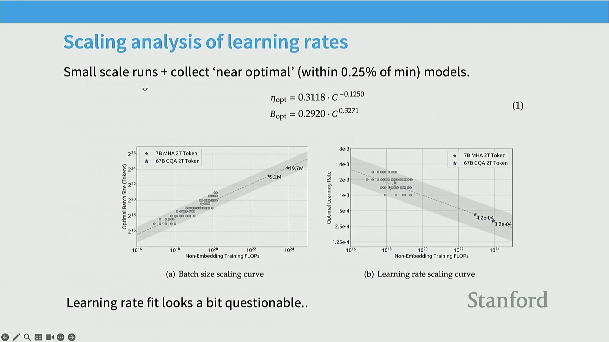

---

## 实证检验与实验设置
muP 的实证评估主要围绕预印本论文《A Large Scale Exploration of Mu Transfer》（大规模 Mu 迁移探索）展开。该研究通过广泛的消融实验(Ablation Studies)检验了该框架在实际应用中的可行性。实验设计专注于扩展模型宽度(Model Width)，同时特意固定网络深度(Network Depth)，从而构建受控环境以隔离并研究与宽度相关的动力学变化(Dynamics)。在此类 muP 研究中，一项微妙却至关重要的架构选择涉及注意力缩放因子(Attention Scaling Factor)：muP 的实现通常摒弃标准的 $1/\sqrt{d}$ 缩放，转而采用 $1/d$ 缩放。从理论层面看，这一调整旨在无限宽度极限(Infinite Width Limit)下维持激活值(Activations)与更新量级(Update Magnitude)的稳定性。
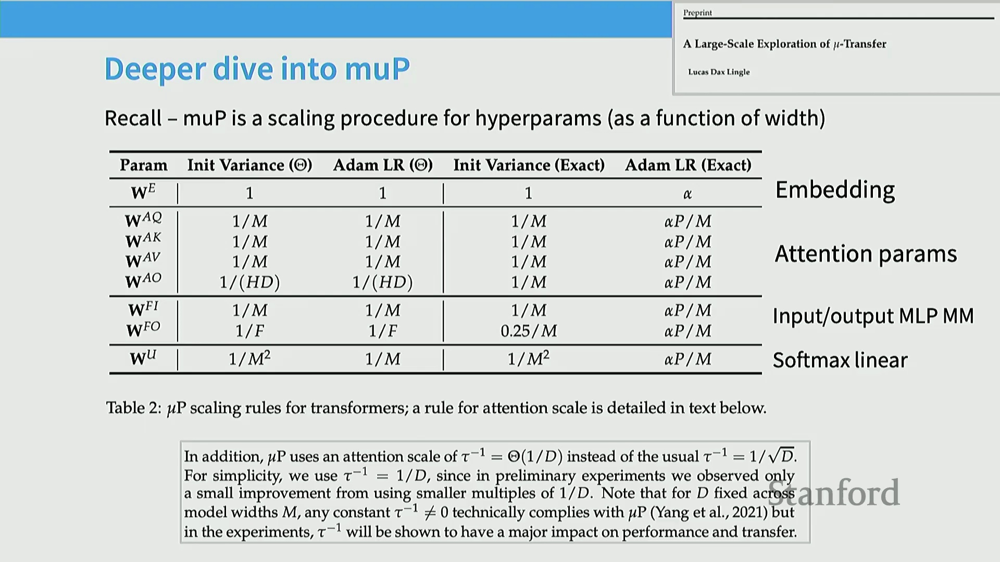
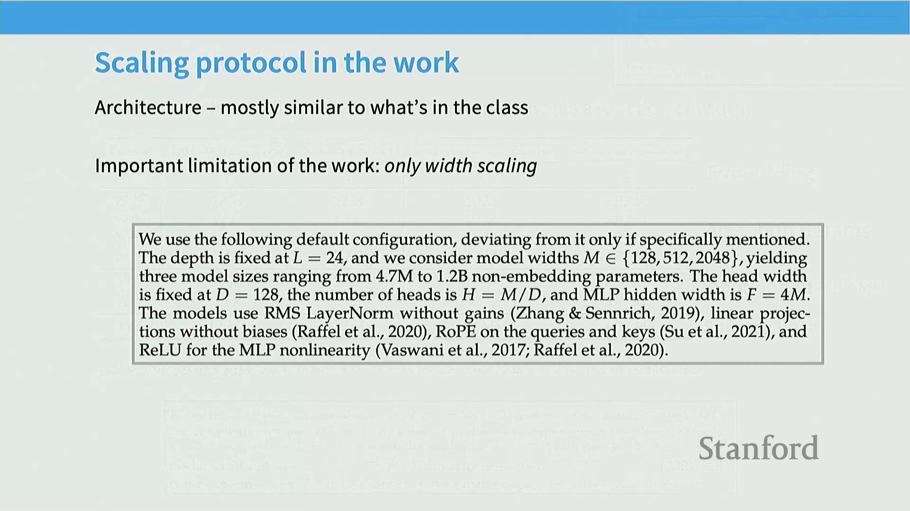

## 跨宽度的学习率迁移
这些实验的核心目标十分明确：随着模型宽度的增加，最优学习率(Optimal Learning Rate)能否保持恒定？实验结果证实 muP 成功实现了这一目标。研究人员首先在基线模型(Baseline Model)上执行学习率扫描(Learning Rate Sweep)，随后将该最优学习率直接迁移至更宽的模型变体中（例如宽度从 128 逐步扩展至 512，再到 2048）。观察结果表明，学习率迁移(Learning Rate Transfer)效果高度可靠。各规模下的损失曲面(Loss Landscape)实现完美对齐，充分证明 muP 有效消除了扩展模型容量(Model Capacity)时重新调优学习率的繁琐需求。
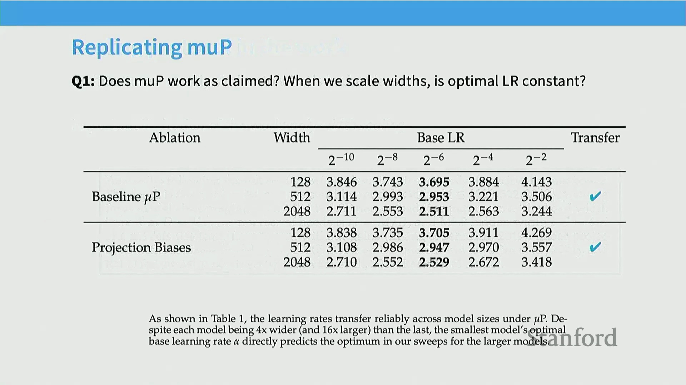

## 架构变体下的鲁棒性
为验证 muP 的实际适用性，研究人员系统测试了其对各类常见现代架构变体(Architecture Variants)的鲁棒性(Robustness)。结果表明，该框架在多个维度上均展现出极强的稳定性。替换激活函数(Activation Functions)（例如采用 SwiGLU、SquaredReLU 或标准 ReLU）并不会破坏学习率迁移特性，仅会影响最终收敛的损失值(Loss Value)。同理，将全局批次大小(Global Batch Size)上下浮动四倍，最优学习率依然保持恒定。此外，采用替代的初始化策略(Initialization Strategies)，例如将查询矩阵(Query Matrix)初始化为零以实现均匀的初始注意力分布，或调整反嵌入层(Unembedding Layer)的缩放比例，均能维持稳定的迁移效果。这些发现进一步证实，muP 的核心假设在不同架构设计选择下依然稳固成立。
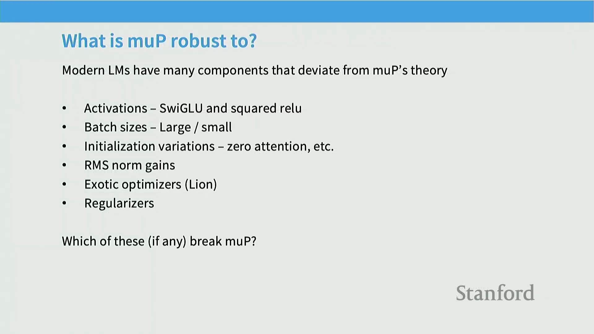
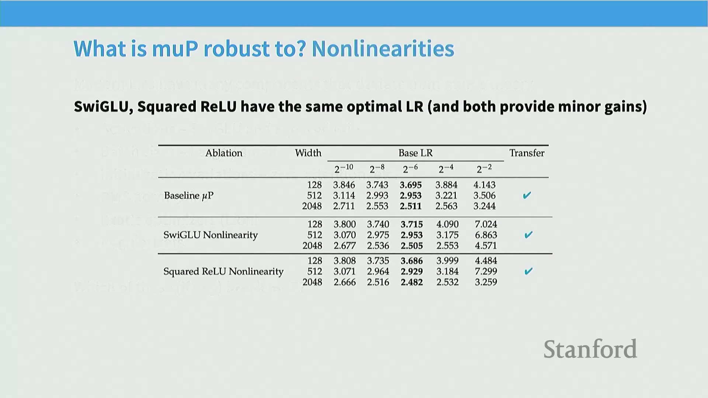
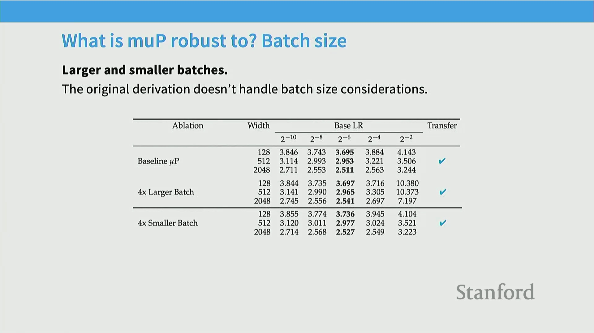

## 已知的失效模式与局限性
尽管优势显著，muP 并非在所有场景下均具备鲁棒性，其存在特定的失效模式(Failure Modes)。例如，引入可学习的 RMSNorm 增益(Gain)或偏置(Bias)会破坏该参数化方案(Parameterization Scheme)，导致超参数迁移失败。此外，muP 的理论推导与 Adam 类自适应优化器(Adaptive Optimizers)的更新机制紧密耦合。若改用高度非传统的优化器（如 Lion 优化器，其依赖符号梯度(Sign Gradients)且通过进化搜索(Evolutionary Search)发现），将会破坏 muP 的理论前提，导致迁移效果急剧恶化。研究还表明，施加过强的权重衰减(Weight Decay)会显著削弱 muP 的有效性。鉴于权重衰减本是标准训练流程中的常规正则化组件(Regularization Component)，这构成了 muP 在实际应用中最突出的局限性之一。
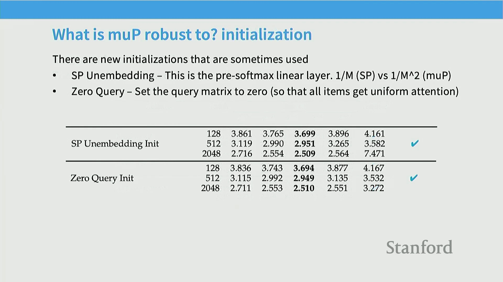
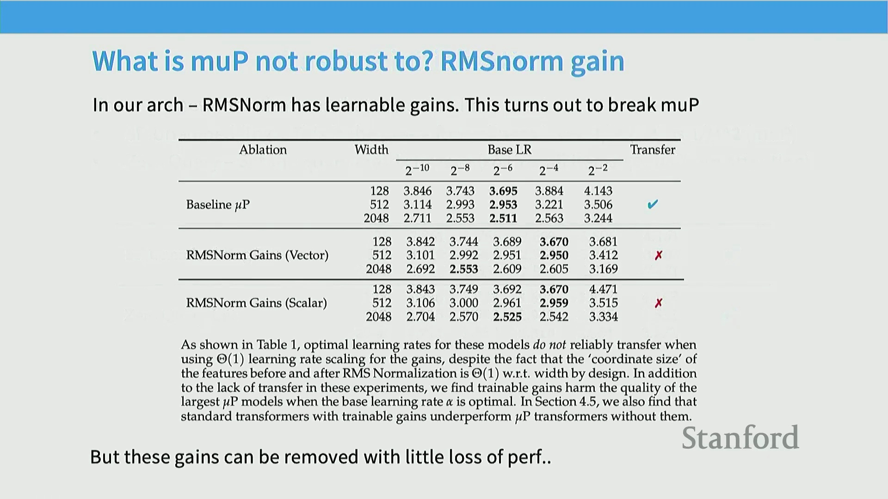
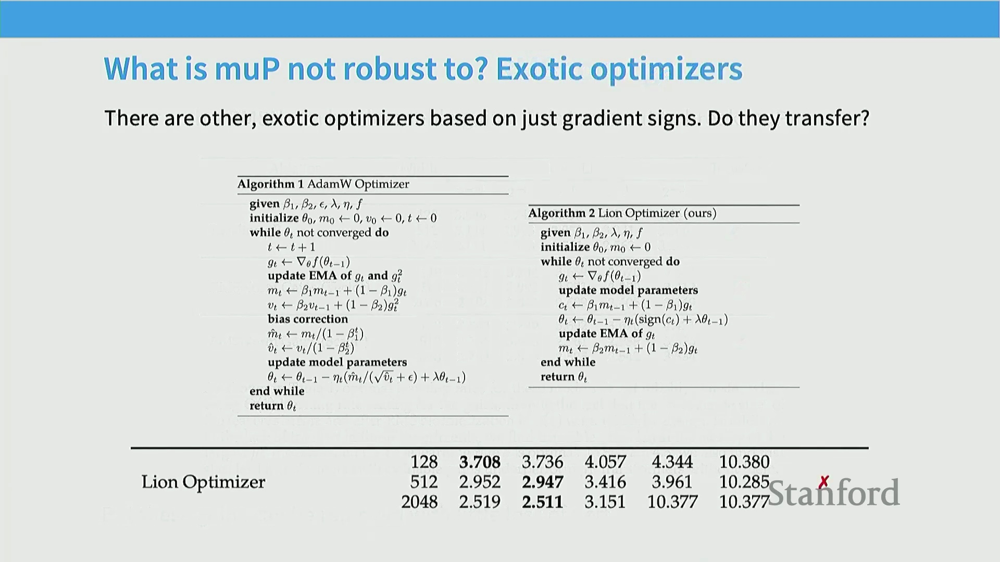

## 标准参数化与大规模验证
与 muP 形成鲜明对比的是，标准参数化(Standard Parameterization, SP)无法跨模型尺度保持学习率恒定。若将固定的全局学习率(Global Learning Rate)直接应用于更宽的 SP 模型，通常会引发更新爆炸(Update Explosion)并导致损失性能退化(Loss Degradation)。相反，SP 要求随着模型宽度增加，必须按特定比例相应降低学习率，以补偿随之增大的梯度范数(Gradient Norm)。一项针对 10B 参数模型的大规模验证实验(Large-scale Validation Experiment)为 muP 提供了强有力的实证支持：从小规模代理模型中寻得的最优学习率，在最大规模模型上依然完全有效，充分印证了该理论的卓越预测能力。尽管 Meta 已在其 Llama 系列模型中成功应用 muP，但该技术尚未在整个工业界达成普遍共识。
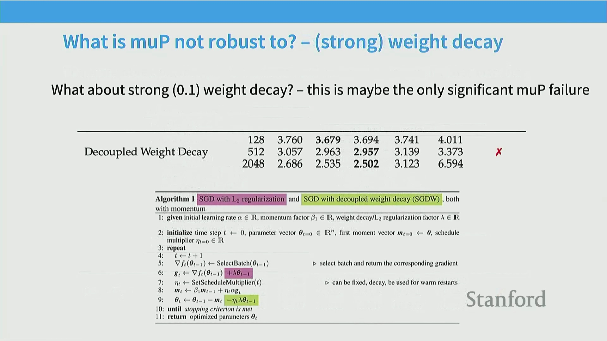
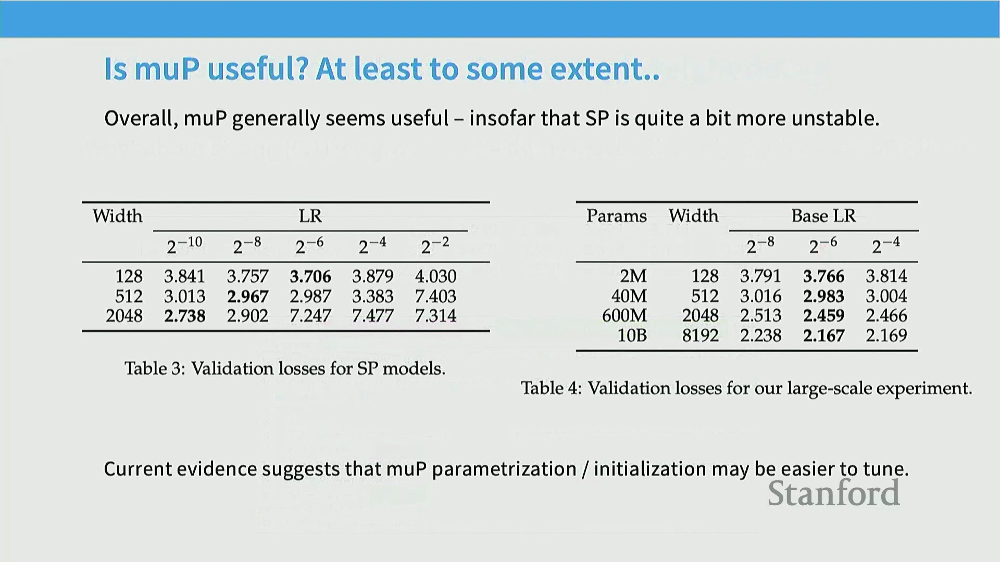
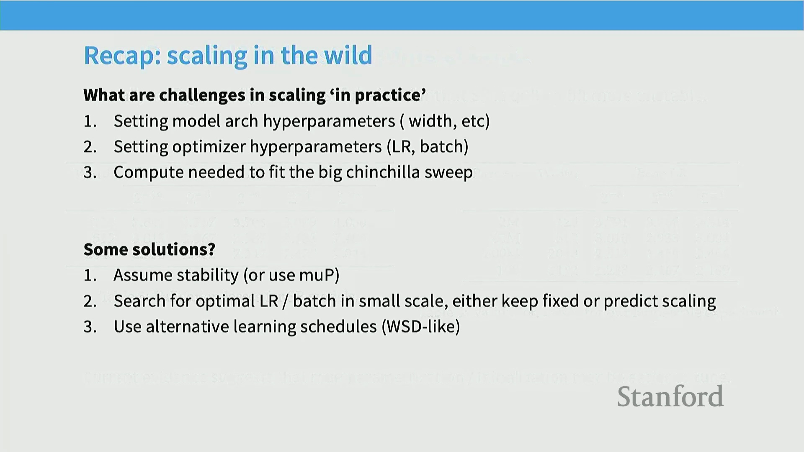

## 结论：实战中的缩放最佳实践
综合前述案例研究与实证发现，我们可以清晰勾勒出缩放现代大语言模型(Large Language Model, LLM)的实战指南。研究人员已极少依赖盲目的网格搜索(Grid Search)；取而代之的是，他们利用缩放定律(Scaling Laws)精准预测最优学习率与批次大小，从而大幅削减计算开销(Compute Overhead)。诸如 muP 的技术提供了一套严谨的理论框架，以实现跨宽度维度的超参数稳定性(Hyperparameter Stability)；而预热-稳定-衰减(Warm-up Stable Decay, WSD) 等创新学习率调度策略(Learning Rate Schedule)，则支撑了高效且仅需单次运行的 Chinchilla 风格数据缩放分析(Data Scaling Analysis)。通过深度融合严谨的缩放定律外推(Scaling Law Extrapolation)、稳定的参数化方案(Parameterization Schemes)以及优化的训练调度(Training Schedule)，研究团队得以可靠地驾驭超大规模模型训练的复杂性，并将无效计算(Invalid Compute)降至最低。
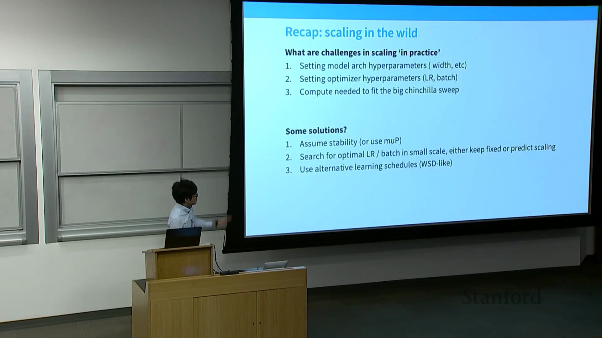
