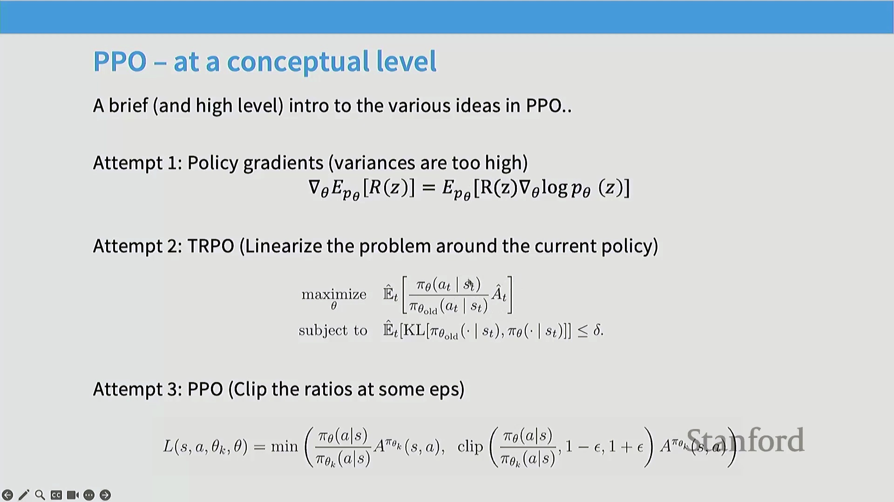
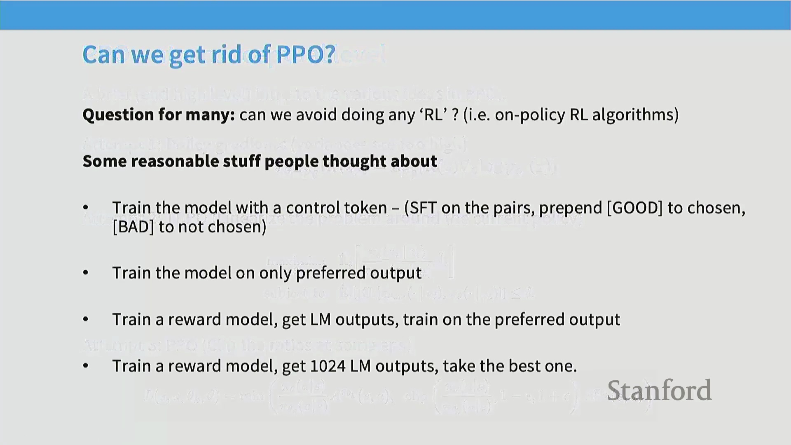
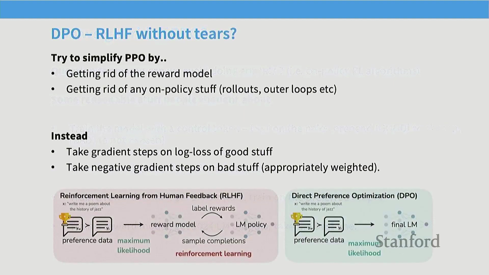
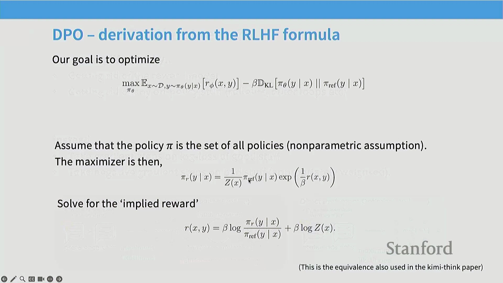
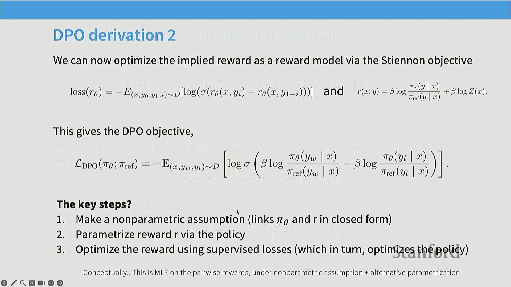

## 课程概述：转向后训练阶段

欢迎来到第15讲。随着课程接近尾声，我们的重心将完全转向后训练(Post-Training)阶段。在此之前，我们主要专注于大规模预训练(Pre-training)系统及其数据组件。现在，我们将探讨如何将这些庞大的预训练模型转化为真正实用且安全的工具。本讲将涵盖基于人类反馈的强化学习(Reinforcement Learning from Human Feedback, RLHF)与安全对齐(Safety Alignment)技术，而下一讲将深入探讨基于可验证奖励的强化学习(Reinforcement Learning with Verifiable Rewards)，重点关注推理(Reasoning)与数学训练(Math Training)。

## 从 GPT-3 到 ChatGPT 的演进
如前所述，本讲标志着从预训练向后训练的关键转变。虽然预训练为模型赋予了强大的基础能力，但并未直接转化为实际的应用成果。GPT-3 在模型规模与算力投入上取得了卓越成就，但其缺乏指令遵循(Instruction Following)能力，从产品角度来看实用性有限。ChatGPT 的发布彻底改变了这一局面，它展现出了卓越的指令遵循与复杂查询处理能力，并从根本上重塑了人类与人工智能(Artificial Intelligence, AI)的交互方式。 

今天的核心重点是理解这一确切的转变过程：我们如何将像 GPT-3 这样原始的预训练系统，转化为像 ChatGPT 那样反应灵敏、能够遵循指令的模型？我们将拆解该过程的底层工程细节，超越理论概念，深入探讨支撑现代 AI 的实际工程实践。

## 安全与护栏机制的关键作用
除了指令遵循，现代 AI 系统还必须经过严谨的安全对齐(Safety Alignment)与内容审核(Content Moderation)优化。随着这些模型的大规模部署，滥用风险（如欺诈或生成毒性/有害内容(Toxic/Harmful Content)）变得尤为突出。若要将 AI 打造为可行的商业产品，缺乏健全内容管控的平台将难以获得用户与广告商的认可。 

ChatGPT 得以广泛普及的一个核心因素在于其全面的安全护栏(Guardrails)系统。因此，后训练(Post-Training)的核心目标是对语言模型的行为施加更严格、更精确的控制。虽然预训练为模型注入了逻辑推理与事实召回(Fact Retrieval)等潜在能力，但并不能保证这些能力会被稳定地激发(Elicit)出来。后训练通过整理特定的行为数据对模型进行训练，使其能够安全且一致地展现这些能力，从而弥合了预训练与实际应用之间的差距。

## 核心挑战与 InstructGPT 框架
在开展后训练时，我们面临几个关键问题：训练数据的形态是怎样的？收集难度有多大？我们如何在算法层面高效利用不同类型的数据，例如专家示范(Expert Demonstration)数据与成对偏好(Paired Preference)反馈？最后，我们如何有效地将这些流程规模化(Scale)？ 

为解答这些问题，我们将围绕基础的 InstructGPT 流程展开讨论，该流程概述了构建指令遵循(Instruction Following)模型的三个核心步骤。我们将从基于专家示范的监督微调(Supervised Fine-Tuning, SFT)开始，随后转向利用成对偏好反馈的强化学习(Reinforcement Learning)技术。对于 SFT 而言，其成功取决于两大核心要素：高质量的训练数据与适配的训练方法。虽然梯度下降(Gradient Descent)是显而易见的起点，但要使其在大规模场景下有效运行，仍需依赖一系列精妙且非直观的策略。

## 数据质量与三种收集范式
为深入理解后训练数据，我们将通过案例剖析来探讨不同的数据集构建方法。在后训练阶段，数据质量(Data Quality)甚至比预训练阶段更为关键，因为我们使用的是规模小得多的数据集来引导(Elicit)出精确的行为表现。充满噪声或结构混乱的指令数据必然会导致模型输出不可预测的结果。 

我们将考察三种截然不同的范式，它们代表了构建指令微调(Instruction Fine-Tuning)数据集的典型路径：
1. **FLAN（Google）**：将现有的自然语言处理(Natural Language Processing, NLP)任务数据集（如问答、分类等）整合为一个庞大的元数据集(Meta-dataset)。
2. **Open Assistant**：一项由社区驱动、众包协作(Crowdsourcing)的项目。在 ChatGPT 发布后不久，全球在线爱好者共同贡献了高质量的人工指令数据。
3. **Stanford Alpaca**：代表 AI 合成(AI Synthesis)或“AI反馈”(AI Feedback)范式，即直接利用大语言模型自身来合成(Synthesize)后训练数据。

## 分析 FLAN 数据集示例
让我们通过 FLAN 数据集中的具体案例，来理解聚合的 NLP 任务如何转化为有效的指令数据。FLAN 将现有的学术基准测试(Benchmarks)重新改编为“提示-回复”(Prompt-Response)格式。你会看到诸如文本摘要(Text Summarization)（“概括这篇游记的要点”）、多项选择分类(Multiple-Choice Classification)（“这段文本涉及什么主题？”）、基于安然(Enron)公司邮件生成邮件主题行，以及结构化数据到文本生成(Structured Data-to-Text Generation)（例如，将餐厅元数据转换为描述性语句）等典型示例。 

FLAN 方法展示了研究人员如何通过复用现有的学术基准，高效且低成本地构建海量指令数据集。该工作极具影响力且颇具前瞻性。然而，其显著的局限性在于，与开放式的人类对话提示(Open-Ended Human Conversation Prompts)相比，这些经改编的学术任务有时会显得不够自然或过于刻板。这凸显了后训练数据设计中的一个关键权衡(Trade-off)：即在数据规模与可获取性(Scale & Accessibility)和自然交互质量(Natural Interaction Quality)之间进行取舍。

## 指令微调(Instruction Fine-Tuning)数据范式对比

对后训练(Post-Training)数据集的分析将继续深入，重点考察不同构建范式如何影响最终模型的性能。尽管整合现有自然语言处理(Natural Language Processing, NLP)基准测试(如 FLAN)效率极高，但由此生成的数据往往缺乏自然感。这些数据集通常需要大量人工干预，才能将标准学术任务转化为提示-回复(Prompt-Response)格式，而此类格式很难还原现实世界聊天交互的自然流畅度。

相比之下，以 **Stanford Alpaca** 为代表的早期数据合成(Data Synthesis)方法，则直接利用大语言模型来扩展指令数据。该方法以少量人工编写的提示作为种子(Seed Prompts)，由一个语言模型生成提示变体，再由另一个模型生成对应的回复。由此生成的数据高度拟真标准的 ChatGPT 交互模式，通常产出的是长篇连贯的自然语言回答，而非简短的基准测试式分类答案或单词回复。

第三种主流范式是 **Open Assistant** 数据集。这是一项由社区驱动(Community-Driven)的项目，旨在收集大量详尽的人工编写交互数据。其中的样本通常包含复杂的用户查询与经过精心打磨的高质量回复。尽管数据质量极高，但该方法暴露出一个根本性瓶颈：大规模收集此类详尽的人工监督数据(Supervised Data)极其困难、耗时且成本高昂。

## 众包(Crowdsourcing)练习与人工数据挑战

为了直观展示数据收集的实际状况，讲座中穿插了一项现场众包练习。参与者被要求针对给定提示(Prompt)撰写用于指令微调的回复。该练习迅速暴露了人工标注数据中常见的典型问题：格式不统一、过度使用表情符号、恶意灌水(Trolling)、提交“不适用(N/A)"，以及强烈的过度简化倾向。在缺乏充分准备的情况下，即时构思并撰写深思熟虑的长篇回复，对标注人员的认知负荷(Cognitive Load)要求极高。

该练习直观地说明了，为何激励标注员产出全面、详尽的回答极具挑战性。相比之下，利用 GPT-4 等先进模型生成同等详细且结构化的回复，则能实现即时响应与极低成本。这种经济与现实层面的考量，正是近期业界在后训练流程中全面转向 AI 生成反馈(AI-Generated Feedback)与合成数据(Synthetic Data)优化的核心驱动力。

## 数据集特征与评估者偏见(Evaluator Bias)

后训练数据集在输入复杂度与输出长度上呈现出巨大差异。输入长度通常与任务复杂度正相关，而输出长度则主要反映标注员投入的精力，或是否采用了 AI 辅助生成。然而，研究人员必须警惕其中固有的评估偏差。无论是人工评估者还是 AI 裁判(LLM-as-a-Judge)，均对列表式排版(List Formatting)及显著更长的输出表现出强烈偏好（偏好比例高达 60%–70%）。

单纯针对此类表面风格特征进行优化可能会适得其反。尽管增加长度和优化排版能提升用户满意度(User Satisfaction)指标，但这容易导致模型偏离后训练的核心目标：即减少幻觉(Hallucination)、提升事实准确性(Factual Accuracy)以及增强真正的逻辑推理(Reasoning)能力。从业者必须谨慎权衡风格偏好与模型实质性能力提升之间的关系，避免模型因“奖励”表面流畅性而牺牲核心能力。

## 平衡聊天式评估与基准测试(Benchmark)评估

为规避此类偏见，采用多元化的评估策略至关重要。聊天式自动评估(如 AlpacaEval 或 Chatbot Arena)在衡量用户参与度、对话流畅度及现实应用价值方面具有不可替代的作用。然而，传统学术基准测试在评估模型核心能力时依然不可或缺，且不易受输出长度或 Markdown 排版等开放性风格偏好的干扰。融合这两种评估范式，能有效防止模型过度拟合(Overfitting)表面特征，从而引导模型发展出真正的智能。

## 引用与知识注入(Knowledge Injection)的双刃剑

数据清洗与构建(Data Curation)中存在一个常见假设：“高质量”数据必然包含深厚的领域知识与学术引用。以 Open Assistant 为代表的数据集便是典型，其详细回复中常包含特定文献引用。然而，在此类数据上进行微调(Fine-Tuning)会同时引入两种可能冲突的学习信号：
1. **知识获取(Knowledge Acquisition)：** 模型真正学会将复杂概念（如“买方垄断经济学(Monopsony Economics)”）与准确的参考文献及事实解释建立关联。
2. **格式模仿(Format Mimicry)：** 模型仅学到了一条泛化的结构规则，即“回答复杂问题时应当以引用结尾”。

若模型的预训练(Pre-training)参数中未涵盖特定文献，它可能会“学会”捏造参考文献以迎合预期的输出格式。这凸显了后训练阶段的一个关键风险：无意中引导模型生成看似权威的结构化幻觉，而非切实提升事实准确性。从业者必须精心设计数据流水线(Data Pipeline)，在丰富模型领域知识的同时，避免强化具有误导性的格式模式。

## 监督微调中的幻觉风险

指令微调(Instruction Fine-Tuning)面临的一个关键挑战在于：当模型被迫生成超出其固有知识范围(Intrinsic Knowledge)的回复时。正如 John Schulman 所指出的，强迫模型回答其未知的问题会直接诱发幻觉(Hallucination)。模型可能并未真正学习事实内容，而是仅仅拟合了浅层的结构模式(Structural Patterns)——例如，形成“复杂输入必须附带引用”的刻板印象。这演变为一种词元预测(Token Prediction)的捷径(Shortcut)，而非真正的知识获取(Knowledge Acquisition)。

尽管掌握引用格式的回复是一种理想的结构化行为，但底层下一词元预测(Next-Token Prediction)机制可能会迫使模型为最小化损失(Loss)，而使用看似合理实则编造的信息进行“填空”。这揭示了一种根本性的失效模式(Failure Mode)：若监督微调(Supervised Fine-Tuning, SFT)数据显著超出基础模型(Base Model)的能力边界，模型可能会优化为仅模仿专业表象，而非真正掌握专业知识。因此，研究人员强调了同策略(On-Policy)强化学习(Reinforcement Learning)的重要性，该方法允许模型坦诚表达不确定性（如回答“我不知道”），从而避免因“沉默惩罚”而被迫产生幻觉。

## 安全微调与拒绝权衡

除能力对齐(Capability Alignment)外，语言模型的大规模部署还需依赖强有力的安全微调(Safety Fine-Tuning)。模型需配备完善的安全护栏(Safety Guardrails)，以防被滥用于传播虚假信息、实施诈骗或生成垃圾内容。早期研究表明，即便在指令微调中仅注入少量安全对齐(Safety Alignment)数据，也能显著提升模型的安全性。然而，这也在合理拒绝(Justified Refusal)与过度拒绝(Over-Refusal)之间引入了微妙的权衡(Trade-off)。

模型必须精准区分真正的恶意提示(Malicious Prompts)与仅包含敏感关键词的良性查询(Benign Queries)（例如，“如何 kill（终止）一个 Python 进程”）。纯指令微调难以捕捉此类细微差别，通常需借助精心构建(Curated)的小规模数据集来校准拒绝阈值(Refusal Threshold)。令人瞩目的是，研究表明仅需约 500 条精心编写的安全示例(Safety Examples)，即可有效构建基础安全行为，这充分印证了高质量、定向数据所具备的巨大杠杆效应。

## 指令微调出人意料的强大与简洁

尽管现代 AI 助手架构日益复杂，但指令微调的基础机制却出奇地简洁。仅需设置合理的超参数(Hyperparameters)，并在标准的开源指令数据集上对性能较强的基础模型进行微调，即可诱导出与商业级聊天机器人高度相似的行为模式。尽管前沿模型的研发涉及海量优化工作，但其核心启示在于：即便是规模适中、结构严谨的数据集，亦能对模型的行为对齐(Behavioral Alignment)产生深远影响。真正的复杂性并非源于算法本身，而在于对数据质量(Data Quality)的严苛打磨及其背后严密的设计逻辑。

## 界限模糊：预训练与中期训练

在传统学术视角中，指令微调常被视为一个独立且相对简单的微调步骤。然而，在拥有庞大算力(Compute)资源的前沿实验室中，预训练(Pre-training)与后训练(Post-Training)的边界正日益模糊。指令微调数据本质上仅为词元序列(Token Sequences)，这意味着其可直接无缝集成至预训练流水线(Pre-training Pipeline)中。

这一趋势催生了“中期训练”(Mid-Training)或连续训练(Continual Training)策略的兴起。现代训练流水线通常不再于预训练结束后硬性截断并转入独立的 SFT 阶段，而是倾向于在预训练末期（尤其是在学习率退火(Learning Rate Annealing)阶段）逐步混合高质量指令数据。

在训练后期集成指令数据优势显著：它能有效缓解灾难性遗忘(Catastrophic Forgetting)，促使模型将行为模式更深层次地内化至参数中，并最大化数据的杠杆效应。尽管后续可能仍保留一个简短、定向的微调阶段，但绝大部分对齐工作已通过这一连续过程深度融入模型权重之中。此类扩展训练范式(Extended Training Paradigm)正逐渐成为闭源实验室与先进开源社区的标准化实践。

## 现代训练流水线：预训练与指令微调的界限模糊

本节首先以 MiniCPM 论文(MiniCPM Paper)为例，探讨了当代的训练方法(Training Methods)。现代训练流水线(Training Pipeline)通常采用两阶段策略。第一阶段是在 Common Crawl、代码数据集和 The Pile 等海量多样化语料(Corpus)上进行纯预训练(Unsupervised Pre-training)。第二阶段通常发生在学习率退火(Learning Rate Annealing)的“衰减阶段”，此时会策略性地混合高质量筛选数据(Curated High-Quality Data)（如维基百科）与指令微调(Instruction Fine-Tuning, IFT)数据集（如代码监督微调(Code SFT)、OpenOrca、StackExchange、Evol-Instruct）。通过将指令数据直接融入预训练的末期，研究人员可以在不剧烈改变训练目标(Training Objective)的情况下，引导模型无缝过渡到对齐阶段(Alignment Phase)。

## “基础模型”概念的重新定义
这种混合方法对人工智能(Artificial Intelligence, AI)模型的分类方式产生了深远影响。随着指令微调数据越来越多地被融入中期训练(Mid-Training)，预训练模型(Pre-trained Models)与后训练模型(Post-trained Models)之间的传统界限日益模糊。当前沿实验室发布所谓的“基础模型”(Base Models)时，它很可能已经在训练末期经历了隐式指令微调(Implicit Instruction Fine-Tuning)。因此，“基础模型”这一概念正变得愈发模糊，因为这些模型已不再是单纯基于原始文本训练的“下一词元预测器”(Next-Token Predictors)，而是经过监督微调(Supervised Fine-Tuning, SFT)数据塑造的部分对齐系统(Partially Aligned Systems)。

## 缓解灾难性遗忘与应对幻觉

一个关键问题随之而来：在退火阶段(Annealing Phase)混合指令数据能否解决幻觉(Hallucination)问题？讲师明确指出，尽管该技术在学习率退火期间能有效缓解灾难性遗忘(Catastrophic Forgetting)并维持模型的通用能力(General Capabilities)，但它并不能从根本上解决引用幻觉(Citation Hallucination)。模型会无条件地吸收指令数据，而不考虑其先验知识储备(Prior Knowledge)。如果模型本身已具备相关事实知识，它可能会学会正确地检索并格式化(Retrieve and Format)这些内容；但如果模型缺乏相关知识，它大概率只会学到浅层的结构模式(Shallow Structural Patterns)（例如“在句末添加引用”），而非事实本身，从而生成看似自信却实为捏造的参考文献(Fabricated Citations)。

## 自适应与反应式训练的挑战

为自适应(Adaptive)地解决幻觉问题，有学生提出引入“思维词元”(Thought Tokens)或自我验证机制(Self-Verification Mechanisms)，在生成内容前检查模型是否真正掌握相关事实。讲师将这一构想与 STaR(Self-Taught Reasoner) 和 Quiet-STaR 等强化学习(Reinforcement Learning, RL)范式相联系，后者通过强化正确的推理轨迹(Reasoning Trajectories)并剔除错误的轨迹来提升模型能力。然而，在预训练规模上实施此类反应式训练(Reactive Training)在工程实现上极为艰巨。标准的预训练依赖于静态的、预先打包好的数据集(Static, Pre-packaged Datasets)以保证计算效率(Computational Efficiency)；而自适应训练则要求根据模型的实时知识状态(Real-time Knowledge State)动态调整损失函数(Loss Function)或数据分布。这本质上意味着需要将强化学习技术扩展至预训练的量级，是一项极其复杂且消耗巨大算力(Compute)的工程。

## 后训练中的浅层模式学习

讲座最后通过一个模式模仿(Pattern Mimicry)的实际案例作结：如果仅在后训练(Post-Training)阶段引入表情符号会发生什么？若表情符号的分布遵循某种复杂且高度依赖输入(Input-Dependent)的规则，而模型受限于有限的微调数据无法将其完全内化(Internalize)，它很可能会退化为随机或随意地生成表情符号。这凸显了监督微调(Supervised Fine-Tuning)中的一个根本性风险：当模型缺乏足够的能力或数据来学习底层依赖关系(Underlying Dependencies)时，它们会优先优化表面上的风格合规性(Stylistic Compliance)，而非真正的结构理解(Structural Understanding)。因此，从业者必须精心筛选后训练数据，避免让模型强化浅层的格式捷径(Format Shortcuts)，而忽视了实质性的行为对齐(Behavioral Alignment)。

## 监督微调(Supervised Fine-Tuning, SFT)的局限性与向强化学习的过渡

监督微调在引导语言模型掌握期望输出的结构范式(Structural Patterns)与风格规范方面表现卓越。然而，除非数据集规模极其庞大，否则仅凭标准指令微调来可靠地注入新事实知识(Factual Knowledge)仍充满挑战。现代的“中期训练”(Mid-Training)策略正通过将指令数据直接混合至预训练(Pre-training)的末期阶段，逐渐模糊这一界限。然而，对于传统的后训练(Post-Training)流水线而言，若要超越简单的行为模仿，则亟需一种更高效且可扩展的范式。

## 从分布匹配到策略优化
转向基于人类反馈的强化学习(Reinforcement Learning from Human Feedback, RLHF)需要根本性的概念转变。在传统的生成式建模(Generative Modeling)中，优化目标是拟合参考分布 $P^*$（如互联网文本或人工示范数据）。在 RLHF 框架中，我们很大程度上放弃了严格的分布匹配(Distribution Matching)。相反，我们将语言模型视为一个策略(Policy) $\pi(Y|X)$，其优化目标是最大化标量奖励函数(Scalar Reward Function) $R(Y, X)$。我们的目标不再是完美复刻人类的写作模式，而是探寻任意能够持续产出高奖励回复的策略。

## RLHF 的经济与质量优势
采用 RLHF 而非纯监督微调主要基于两大动机。其一是成本效益(Cost-Efficiency)。为 SFT 构建专家级长篇示范数据(Expert Demonstrations)极其消耗资源，数据收集环节通常需耗费实验室数百万美元预算。相比之下，成对偏好数据(Paired Preference Data)（标注者仅需在两个模型输出中择优选出）的采集成本显著更低、速度更快，且更易规模化扩展。其二（或许更为关键），在于通过对比评估(Comparative Evaluation)挖掘模型质量提升的巨大潜力。

## 生成与评估的差距
研究揭示了人机交互中一个有趣的“生成-验证差距”(Generator-Validator Gap)。研究表明，人类标注者通常更偏好 AI 生成的摘要，而非他们自己的原创作品。受访专家作者坦言，尽管其原创作品投入了更多心血或更具个人风格，但 AI 生成的文本往往在清晰度与有效性上更胜一筹。这揭示了一项关键洞见：在认知层面，验证并甄选高质量回复远比从零开始创作更为容易，且最终产出质量更优。这种认知不对称性使得成对反馈成为一种极其强大且可扩展的对齐信号(Alignment Signal)。

## RLHF 流水线：轨迹采样(Rollouts)与奖励建模(Reward Modeling)
标准的 RLHF 流水线始于策略模型的“轨迹采样(Rollouts)”环节——即针对给定提示(Prompt)采样生成多个候选输出。随后，标注者提供成对反馈（例如，“输出 A 是否优于输出 B？”）。此类对比数据随后用于训练一个独立的**奖励模型(Reward Model)**，使其学会根据已收集的偏好数据，为任意给定回复分配标量奖励分数。训练完成后，该奖励模型将取代人工标注员，提供自动化、持续的训练信号，语言模型的策略将依托强化学习算法针对该信号进行迭代优化。

## 实践中收集成对反馈
在实际操作层面，收集成对反馈需部署专用 Web 界面，供标注者并排查看模型生成的候选回复，并从中择优。尽管底层交互流程看似直观，但要确保数据采集的一致性，仍需依赖精细化的运营管理设计。若缺乏清晰、标准化的工作流(Workflow)，标注疲劳、主观偏见与前后不一致将严重削弱奖励信号的质量，最终导致模型对齐结果产生偏差。

## 定义质量：有用、真实、无害框架
以 InstructGPT 论文中确立的开创性框架为代表，标注质量通过三大核心支柱来定义：**有用性(Helpfulness)、真实性(Truthfulness)与无害性(Harmlessness)**。**有用性**确保回复清晰明了、精准契合用户意图，并能妥善处理地域差异等上下文细微差别(Contextual Nuances)。**真实性**要求内容事实准确，并主动将幻觉(Hallucination)发生率降至最低。**无害性**则部署严密的安全护栏(Safety Guardrails)，严防输出毒性(Toxicity)或有害内容。将上述高层原则转化为标注员可执行的具体操作指南，是一项复杂且需持续迭代的工程挑战。

项目的实际落地依赖极其详尽的标注指南(Annotation Guidelines)，以妥善处理边界案例(Boundary Cases)，并确保各项原则的一致性应用。多家大型科技公司泄露的内部文档显示，此类指南往往篇幅浩繁，涵盖错综复杂的长尾场景，并与公开发布的模型规范(Model Specifications)紧密交织。唯有依托此种严谨、指南驱动的数据收集机制，实验室方能产出足以训练强大且可靠奖励模型的高质量成对反馈数据。

## 标注指南与实际操作限制

成对偏好数据(Paired Preference Data)的收集高度依赖于精心编制的标注指南(Annotation Guidelines)。泄露的内部文档与已公开的框架均一致强调有用性(Helpfulness)、真实性(Truthfulness)和无害性(Harmlessness)等核心评估支柱，同时包含具体的风格要求与详细的评分量表(Rating Scales)。然而，该任务在实际操作中面临诸多限制。标注员通常受限于严格的时间窗口——有时针对每个提示(Prompt)的评估时间仅有一分钟——且早期数据流水线(Pipeline)高度依赖通过 Scale AI 或 Upwork 等平台组建的众包团队(Crowdsourcing Teams)。这营造了一种高压工作环境，要求标注员在面对复杂提示时仍能保持高质量且一致的判断，执行难度极高。

## 人类评估中的幻觉与长度陷阱

一次互动课堂练习生动地揭示了快速人工评估的潜在陷阱。当面对成对的模型输出时，绝大多数学生倾向于选择篇幅更长、内容更详细的回复。然而，经仔细核查后发现，这些备受青睐的回复中普遍存在严重的事实性幻觉(Factual Hallucinations)或逻辑谬误。 

在数学推理(Mathematical Reasoning)任务中，那些表现出盲目自信并给出确定性结论的模型，即便最终答案错误，也往往能赢得更多投票。这暴露出一个关键弱点：在时间压力下，人类评估者难以执行彻底的事实核查(Fact-Checking)，极易被冗长的篇幅与权威的口吻所误导，从而无意中奖励了表面流畅度(Surface Fluency)，而非事实准确性(Factual Accuracy)。

对复杂主张、数学证明或深度事实内容进行验证，需要将模型回复拆解为独立的断言(Discrete Assertions)——这是一个劳动密集型(Labor-Intensive)过程，与快节奏的众包模式格格不入。除操作层面的障碍外，RLHF 数据收集的外包模式还引发了关于公平薪酬(Fair Compensation)与劳动条件(Labor Conditions)的严峻伦理与经济争议。此外，标注群体的人口统计学特征(Demographics)直接塑造了模型的对齐方向(Alignment Direction)。针对早期指令微调(Instruction Fine-Tuning)模型的研究表明，它们往往会对特定文化视角产生过度对齐(Over-Alignment)，这恰恰反映了主力标注劳动力所处的地理与文化背景。不同的标注群体亦展现出迥异的评估侧重点：专家评估者(Expert Evaluators)更关注事实准确性与文献引用，而众包工人(Crowdworkers)通常更看重排版美观度、可读性与文体特征(Stylistic Markers)。

## AI 反馈的兴起与“大模型即裁判”(LLM-as-a-Judge)

为缓解人工评估的不一致性、高昂成本与可扩展性瓶颈，该领域正广泛转向 AI 生成反馈(AI-Generated Feedback，即基于 AI 反馈的强化学习 Reinforcement Learning from AI Feedback, RLAIF)。研究表明，先进的大语言模型(Large Language Models, LLMs)能够生成与人类评估高度一致的成对偏好判断，且所需成本与时间仅为人工评估的极小部分。这一范式转变从根本上重塑了后训练流水线(Post-Training Pipeline)。部分最初对合成反馈(Synthetic Feedback)持怀疑态度的知名开源项目最终证实，在构建高性能对齐模型方面，AI 生成的偏好数据显著优于人工众包数据。现代训练框架高度依赖大语言模型对自身输出进行批判、排序与优化，从而确立了 AI 反馈作为可扩展对齐基石的核心地位，其理论渊源可直接追溯至宪法 AI(Constitutional AI)的开创性工作。

## 长度偏差(Length Bias)：一个持久的混杂因素(Confounding Factor)
在人类与 AI 评估中普遍存在的一个核心问题是对较长输出的强烈偏好。评估者（无论人类或机器）常将篇幅冗长与高质量混为一谈，误认为更详细的回复本质上更具帮助性或准确性。因此，经偏好学习(Preference Learning)优化的模型往往会倾向于生成不必要的冗余文本。这种“长度偏差”在对齐研究中构成显著的混杂因素，可能导致模型奖励华而不实的文风，而非真正的逻辑推理能力或事实精确度。从业者必须在数据采集与评估阶段主动引入长度控制机制，以确保模型优化目标聚焦于实质能力(Substantive Capabilities)，而非单纯的文本膨胀。

## 转向同策略(On-Policy)与异策略(Off-Policy) RLHF
该讨论自然过渡到异策略与同策略强化学习(Reinforcement Learning)在方法论层面的核心差异。异策略方法依赖静态的、预先收集的偏好数据集（如 UltraFeedback 或 AI 排序输出(AI-Ranked Outputs)），而同策略方法则从当前正在训练的模型中动态采样(Dynamic Sampling)，以获取实时、针对该模型状态的特有反馈信号。深入理解这两种范式之间的权衡，对于设计高效稳健的 RLHF 流水线至关重要，同时也为后续章节深入剖析具体强化学习算法及其底层实现细节奠定了坚实基础。

## 异策略(Off-Policy)与同策略(On-Policy)偏好数据

强化学习流水线(Reinforcement Learning Pipeline)主要利用两种不同类型的偏好数据(Preference Data)。异策略(Off-Policy)数据独立于当前待训练模型进行收集，通常源自其他模型的生成输出或现有公开数据集。这提供了对响应空间(Response Space)的全局视野，帮助模型理解在不同上下文(Context)下何种行为属于高质量或低质量。相比之下，同策略(On-Policy)数据直接从模型当前的生成输出中采样(Sampling)获得。这种自我生成的反馈(Self-Generated Feedback)对于针对性的迭代优化至关重要。现代后训练(Post-Training)框架（如 Tulu3）战略性地将两者结合：异策略数据用于锚定外部质量标准(External Quality Standards)，而同策略数据则驱动持续的、针对模型自身状态的迭代改进。

## 可验证领域(Verifiable Domains)的对齐与开放式挑战

对齐领域(Alignment Field)的一个关键问题是：我们能否通过利用具有客观标准答案(Ground Truth)的领域来规避人工标注(Human Annotation)。答案是肯定的：将强化学习应用于数学等可验证任务极为高效，这将是下一讲的核心内容。然而，开放式生成(Open-Ended Generation)在本质上截然不同。针对主观或创意类提示(Creative Prompts)，通常存在多种有效的回复路径，这使得定义唯一的“正确”答案变得极为困难，或在缺乏充分上下文的情况下难以可靠评估事实准确性(Factual Accuracy)。尽管向标注者提供专家参考回复(Expert Reference Responses)等界面干预措施(Interface Interventions)能有效提升判断质量，但它们并非解决开放式任务固有模糊性(Inherent Ambiguity)的万能灵药。

## AI 反馈与自我偏好偏差(Self-Preference Bias)
当使用大语言模型(Large Language Models, LLMs)生成反馈或评判自身输出（即基于 AI 反馈的强化学习 Reinforcement Learning from AI Feedback, RLAIF）时，从业者必须警惕一种强烈且已被充分记录的自我偏好偏差。模型往往会系统性地为自身生成的内容赋予更高评分。尽管如此，自我提升(Self-Improvement)的理论潜力依然巨大，因为模型已在预训练阶段吸收了海量语料(Corpus)，这些潜在知识可通过针对性提示(Targeted Prompting)与优化循环(Optimization Loops)被有效激发(Elicit)。自我对齐(Self-Alignment)的实际性能上限仍是一个活跃的经验研究课题，大量前沿工作正致力于探索迭代自我训练(Iterative Self-Training)的扩展规律(Scaling Laws)与收益递减(Diminishing Returns)现象。

## RLHF 优化目标(Objective Function)

正如 InstructGPT 论文所形式化的，RLHF 的数学基础旨在寻找一种最优策略(Policy)，使其在保持输出稳定性的同时最大化期望奖励(Expected Reward)。其目标函数包含三个关键组成部分：
1. **奖励最大化(Reward Maximization)：** 核心目标是最大化 $R_\theta(x, y)$，即奖励模型分配给生成输出 $y$ 的标量分数。
2. **KL 散度惩罚(KL Divergence Penalty)：** 引入散度项对模型策略偏离初始监督微调(Supervised Fine-Tuning, SFT)参考分布(Reference Distribution)过远的行为进行惩罚。这充当了正则化约束(Regularization Constraint)，有效防止策略退化为模式崩溃(Mode Collapse)或生成不自然的文本。
3. **预训练损失混合(Pre-training Loss Mixing, 可选)：** 部分实现会在强化学习阶段混入预训练损失项，以进一步缓解灾难性遗忘(Catastrophic Forgetting)；不过，许多现代流水线已仅依赖 KL 约束来维持训练稳定性。

## 偏好建模：Bradley-Terry 框架(Bradley-Terry Model)

为优化奖励函数，我们首先需建立人类偏好的形式化数学模型。标准方法假设每个可能的文本序列(Text Sequence)均对应一个不可观测的潜在标量奖励(Latent Scalar Reward) $R$。人类的成对比较(Pairwise Comparisons)并不能直接观测 $R$，而是通过 Bradley-Terry 框架进行概率建模：即偏好回复 A 优于回复 B 的概率，被定义为两者奖励差值的逻辑斯蒂函数(Logistic Function)。在实际应用中，我们仅能获取带有噪声的成对比较标签(Noisy Comparison Labels)。通过最小化预测偏好概率与实际人类选择之间的差异（通常使用交叉熵损失 Cross-Entropy Loss），我们训练一个独立的奖励模型(Reward Model)以逼近该隐式奖励函数 $R$。

## 策略梯度与 PPO 简介

在获得训练完毕的奖励模型后，我们采用基于梯度(Gradient-Based)的方法对策略进行优化。策略梯度定理(Policy Gradient Theorem)指出，可通过按奖励值成比例地调整词元生成概率(Token Generation Probabilities)来更新模型权重：即提升高奖励序列的似然度(Likelihood)，同时压低低奖励序列的似然度。近端策略优化(Proximal Policy Optimization, PPO)算法对此基础方法进行了关键改进，引入了**优势函数(Advantage Function)**作为奖励信号的降方差基线(Variance-Reducing Baseline)。此外，PPO 允许对单次采样轨迹(Sampled Rollout)执行多次优化迭代(Multiple Optimization Steps)，从而显著提升了训练过程的数据效率(Data Efficiency)与收敛稳定性(Convergence Stability)。关于 PPO 核心机制的更深入技术拆解，将在后续讲座中展开详细探讨。

## TRPO 与约束的必要性

在单次轨迹采样(rollout)后执行多次梯度更新时，原始样本会迅速失效，导致训练过程偏离同策略(on-policy)假设。为弥补这一缺陷，必须引入重要性权重(importance weighting)修正以应对数据分布的偏移。这一思路构成了信任区域策略优化(Trust Region Policy Optimization, TRPO)的基础。TRPO 在应用这些修正的同时，显式地约束更新后的策略，使其与原始策略分布保持接近。

## PPO：以截断替代约束

近端策略优化(Proximal Policy Optimization, PPO)通过引入截断概率比率(clipped probability ratio)来替代显式的 KL 散度(KL divergence)约束，从而简化了 TRPO 的方法流程。该截断机制能够自然地促使模型更新幅度保持在原始策略附近，无需进行复杂的约束优化计算。然而，鉴于 PPO 实现细节的固有复杂性，本讲将不以其作为核心算法进行详细展开。

## 探索更简单的替代方案

在学术界与开源社区中，鉴于 PPO 的实现难度较高，研究人员一直积极探索更简便的替代方案。期间曾测试多种路径，例如：在偏好数据对(preference pairs)上附加显式的“优/劣”标签进行监督微调(Supervised Fine-Tuning, SFT)、仅利用偏好输出样本进行训练，以及借助奖励模型(Reward Model, RM)采样并筛选最优候选输出。然而，这些方法均未能持续取得稳定优异的效果。直到直接偏好优化(Direct Preference Optimization, DPO)算法的提出，才成功在模型架构的简洁性与训练性能的可靠性之间取得了理想平衡。

## DPO：剔除不必要的复杂性

DPO 之所以得以广泛应用，正是因为它成功剔除了 PPO 中繁琐的冗余组件。该算法完全移除了用于计算优势值(advantage values)的独立奖励模型，并摒弃了基于重要性采样比率(importance sampling ratio)的同策略(on-policy)更新限制。取而代之的是回归基础的优化范式：通过梯度上升最大化期望输出的对数似然(log-likelihood)，同时通过梯度下降最小化非期望输出的对数似然。

## DPO 目标函数的推导

DPO 的数学推导始于一个融合了奖励函数与 KL 散度(KL divergence)正则化项的目标函数，其中 KL 散度项用于约束新策略，使其不偏离参考模型(reference model)过远。通过引入策略的非参数化(non-parametric)假设（即将策略视为任意可微函数而非特定结构的神经网络），可推导出最优策略的解析解为参考策略分布与奖励函数指数形式的乘积。通过逆向求解隐式奖励(implicit reward)，可得出一个核心结论：在该非参数假设下，策略模型与奖励模型在数学表达上具有等价性。

## 从强化学习到监督最大似然估计

将上述隐式奖励代入用于成对偏好排序的 Bradley-Terry 模型(Bradley-Terry model)后，原始的强化学习问题被巧妙地转化为标准的最大似然估计(Maximum Likelihood Estimation, MLE)任务。这一数学转换将复杂的强化学习训练流程简化为纯粹的监督学习目标，模型仅需最大化正确预测偏好对相对顺序的概率即可。该推导过程的关键步骤涵盖：引入非参数化(non-parametric)假设、利用策略网络对奖励函数进行隐式参数化，以及采用标准监督损失函数进行优化。至此，DPO 的核心推导已全部完成，关于基于人类反馈的强化学习(Reinforcement Learning from Human Feedback, RLHF)的其余概念将在下一讲中继续展开。

