## 指令微调(Instruction Fine-Tuning)数据范式对比
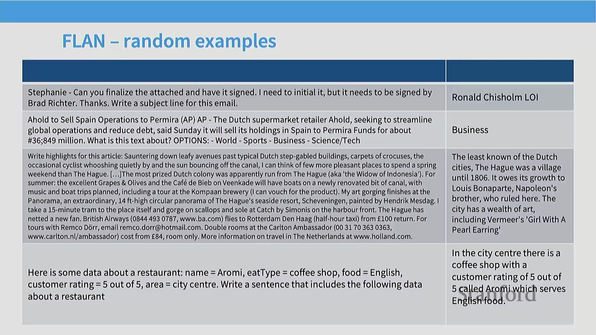
对后训练(Post-Training)数据集的分析将继续深入，重点考察不同构建范式如何影响最终模型的性能。尽管整合现有自然语言处理(Natural Language Processing, NLP)基准测试(如 FLAN)效率极高，但由此生成的数据往往缺乏自然感。这些数据集通常需要大量人工干预，才能将标准学术任务转化为提示-回复(Prompt-Response)格式，而此类格式很难还原现实世界聊天交互的自然流畅度。

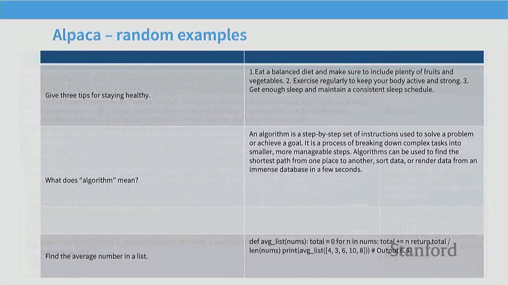
相比之下，以 **Stanford Alpaca** 为代表的早期数据合成(Data Synthesis)方法，则直接利用大语言模型来扩展指令数据。该方法以少量人工编写的提示作为种子(Seed Prompts)，由一个语言模型生成提示变体，再由另一个模型生成对应的回复。由此生成的数据高度拟真标准的 ChatGPT 交互模式，通常产出的是长篇连贯的自然语言回答，而非简短的基准测试式分类答案或单词回复。

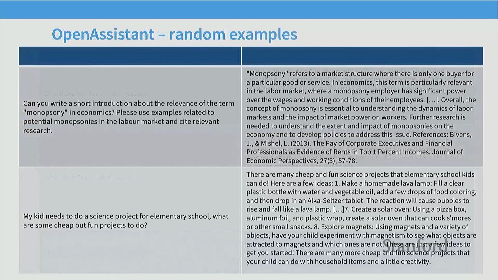
第三种主流范式是 **Open Assistant** 数据集。这是一项由社区驱动(Community-Driven)的项目，旨在收集大量详尽的人工编写交互数据。其中的样本通常包含复杂的用户查询与经过精心打磨的高质量回复。尽管数据质量极高，但该方法暴露出一个根本性瓶颈：大规模收集此类详尽的人工监督数据(Supervised Data)极其困难、耗时且成本高昂。

## 众包(Crowdsourcing)练习与人工数据挑战
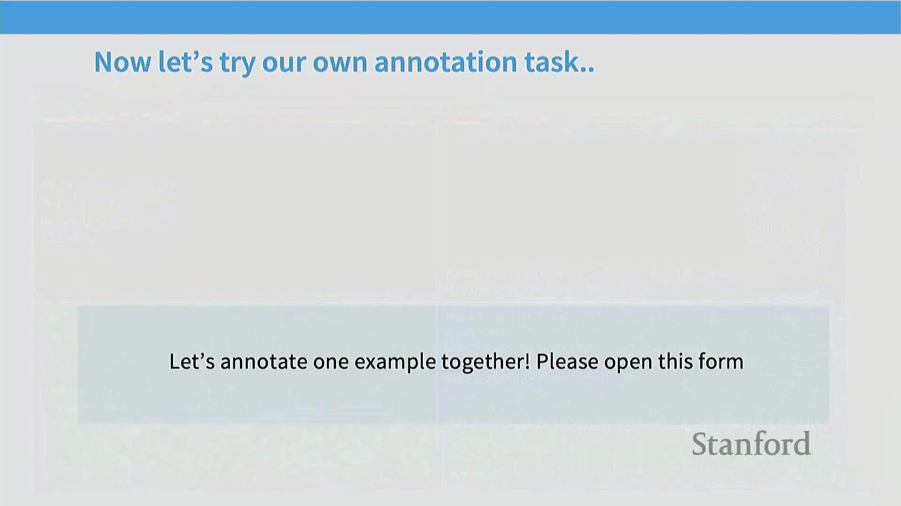
为了直观展示数据收集的实际状况，讲座中穿插了一项现场众包练习。参与者被要求针对给定提示(Prompt)撰写用于指令微调的回复。该练习迅速暴露了人工标注数据中常见的典型问题：格式不统一、过度使用表情符号、恶意灌水(Trolling)、提交“不适用(N/A)"，以及强烈的过度简化倾向。在缺乏充分准备的情况下，即时构思并撰写深思熟虑的长篇回复，对标注人员的认知负荷(Cognitive Load)要求极高。

该练习直观地说明了，为何激励标注员产出全面、详尽的回答极具挑战性。相比之下，利用 GPT-4 等先进模型生成同等详细且结构化的回复，则能实现即时响应与极低成本。这种经济与现实层面的考量，正是近期业界在后训练流程中全面转向 AI 生成反馈(AI-Generated Feedback)与合成数据(Synthetic Data)优化的核心驱动力。

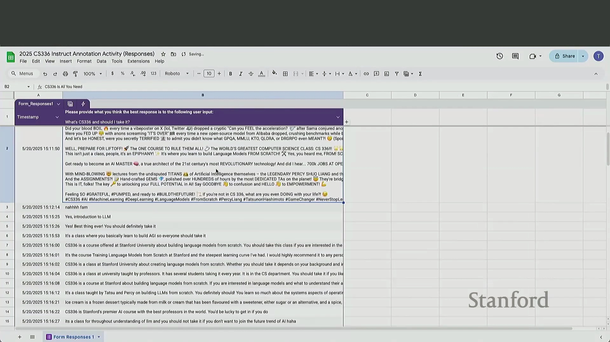

## 数据集特征与评估者偏见(Evaluator Bias)
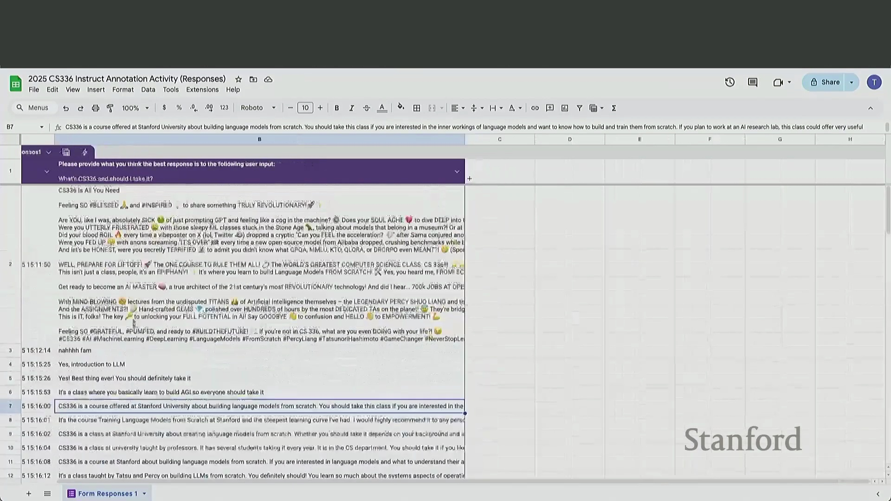
后训练数据集在输入复杂度与输出长度上呈现出巨大差异。输入长度通常与任务复杂度正相关，而输出长度则主要反映标注员投入的精力，或是否采用了 AI 辅助生成。然而，研究人员必须警惕其中固有的评估偏差。无论是人工评估者还是 AI 裁判(LLM-as-a-Judge)，均对列表式排版(List Formatting)及显著更长的输出表现出强烈偏好（偏好比例高达 60%–70%）。

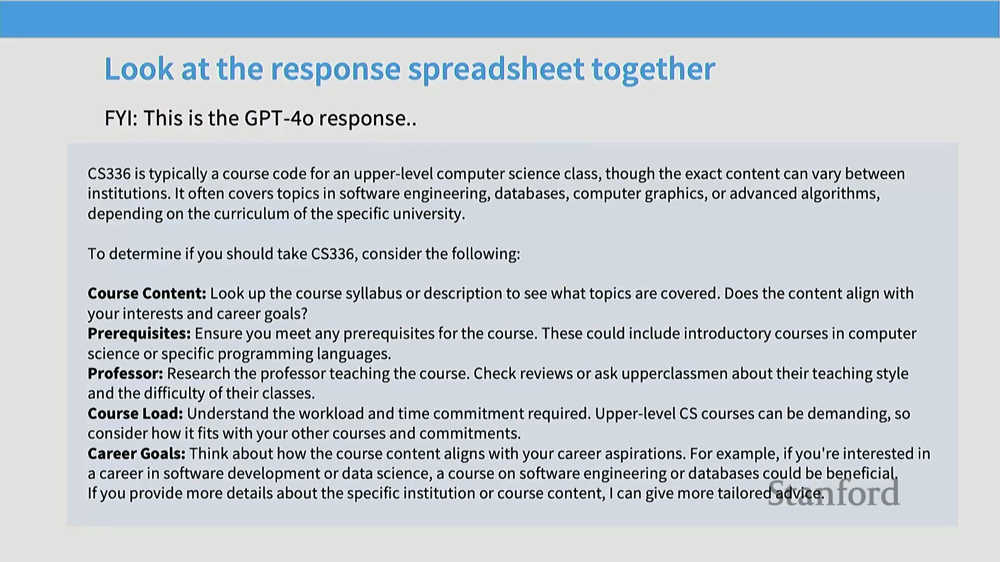
单纯针对此类表面风格特征进行优化可能会适得其反。尽管增加长度和优化排版能提升用户满意度(User Satisfaction)指标，但这容易导致模型偏离后训练的核心目标：即减少幻觉(Hallucination)、提升事实准确性(Factual Accuracy)以及增强真正的逻辑推理(Reasoning)能力。从业者必须谨慎权衡风格偏好与模型实质性能力提升之间的关系，避免模型因“奖励”表面流畅性而牺牲核心能力。

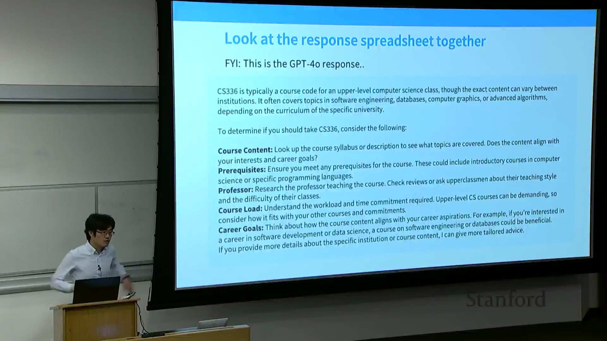

## 平衡聊天式评估与基准测试(Benchmark)评估
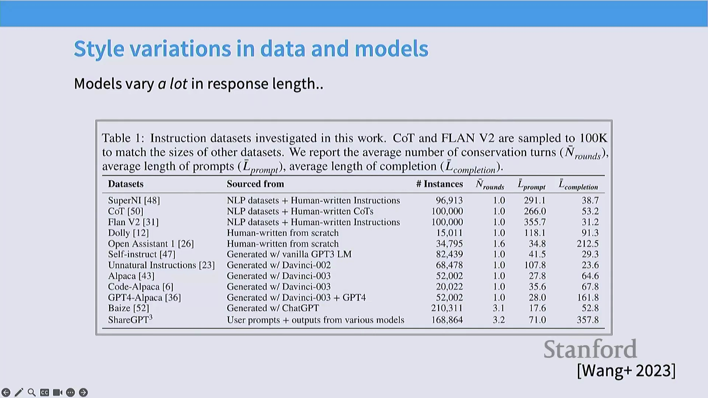
为规避此类偏见，采用多元化的评估策略至关重要。聊天式自动评估(如 AlpacaEval 或 Chatbot Arena)在衡量用户参与度、对话流畅度及现实应用价值方面具有不可替代的作用。然而，传统学术基准测试在评估模型核心能力时依然不可或缺，且不易受输出长度或 Markdown 排版等开放性风格偏好的干扰。融合这两种评估范式，能有效防止模型过度拟合(Overfitting)表面特征，从而引导模型发展出真正的智能。

## 引用与知识注入(Knowledge Injection)的双刃剑
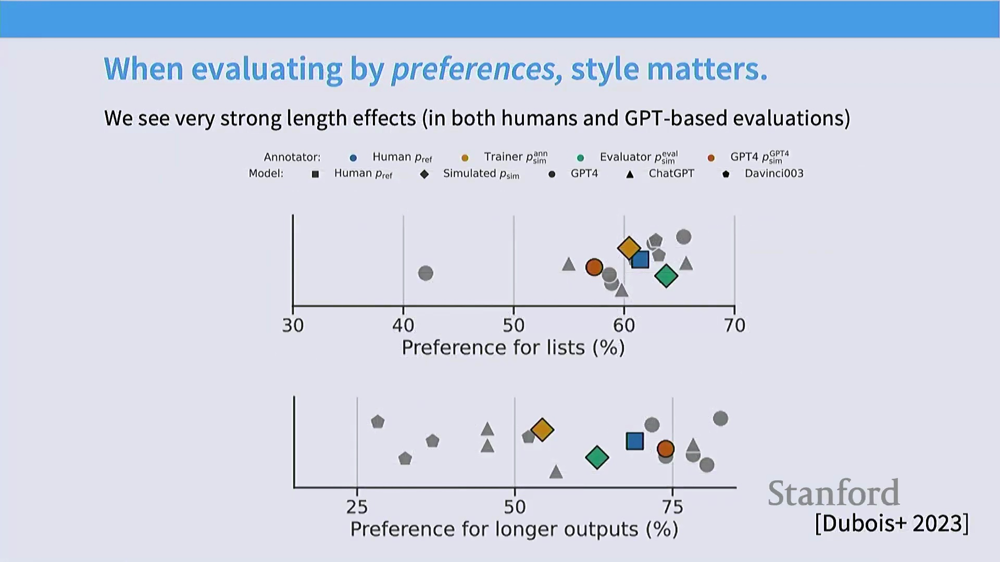
数据清洗与构建(Data Curation)中存在一个常见假设：“高质量”数据必然包含深厚的领域知识与学术引用。以 Open Assistant 为代表的数据集便是典型，其详细回复中常包含特定文献引用。然而，在此类数据上进行微调(Fine-Tuning)会同时引入两种可能冲突的学习信号：
1. **知识获取(Knowledge Acquisition)：** 模型真正学会将复杂概念（如“买方垄断经济学(Monopsony Economics)”）与准确的参考文献及事实解释建立关联。
2. **格式模仿(Format Mimicry)：** 模型仅学到了一条泛化的结构规则，即“回答复杂问题时应当以引用结尾”。

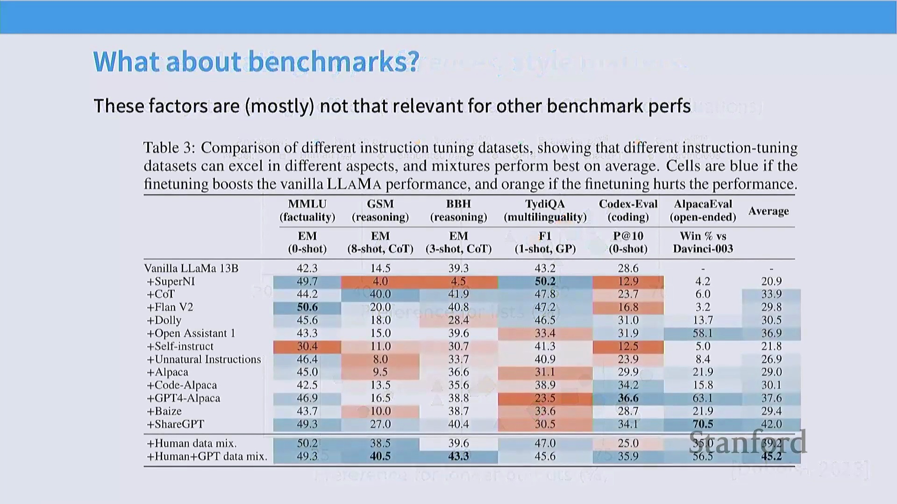
若模型的预训练(Pre-training)参数中未涵盖特定文献，它可能会“学会”捏造参考文献以迎合预期的输出格式。这凸显了后训练阶段的一个关键风险：无意中引导模型生成看似权威的结构化幻觉，而非切实提升事实准确性。从业者必须精心设计数据流水线(Data Pipeline)，在丰富模型领域知识的同时，避免强化具有误导性的格式模式。

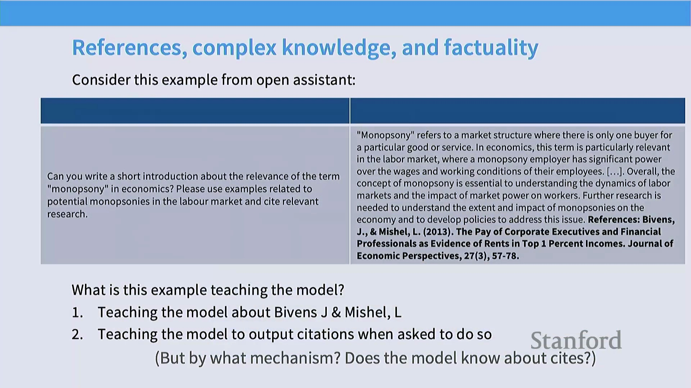