## 现代训练流水线：预训练与指令微调的界限模糊
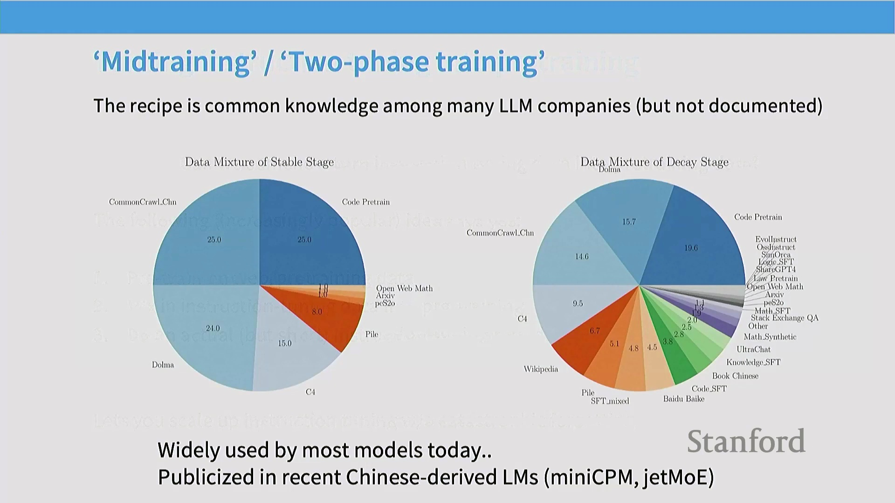
本节首先以 MiniCPM 论文(MiniCPM Paper)为例，探讨了当代的训练方法(Training Methods)。现代训练流水线(Training Pipeline)通常采用两阶段策略。第一阶段是在 Common Crawl、代码数据集和 The Pile 等海量多样化语料(Corpus)上进行纯预训练(Unsupervised Pre-training)。第二阶段通常发生在学习率退火(Learning Rate Annealing)的“衰减阶段”，此时会策略性地混合高质量筛选数据(Curated High-Quality Data)（如维基百科）与指令微调(Instruction Fine-Tuning, IFT)数据集（如代码监督微调(Code SFT)、OpenOrca、StackExchange、Evol-Instruct）。通过将指令数据直接融入预训练的末期，研究人员可以在不剧烈改变训练目标(Training Objective)的情况下，引导模型无缝过渡到对齐阶段(Alignment Phase)。

## “基础模型”概念的重新定义
这种混合方法对人工智能(Artificial Intelligence, AI)模型的分类方式产生了深远影响。随着指令微调数据越来越多地被融入中期训练(Mid-Training)，预训练模型(Pre-trained Models)与后训练模型(Post-trained Models)之间的传统界限日益模糊。当前沿实验室发布所谓的“基础模型”(Base Models)时，它很可能已经在训练末期经历了隐式指令微调(Implicit Instruction Fine-Tuning)。因此，“基础模型”这一概念正变得愈发模糊，因为这些模型已不再是单纯基于原始文本训练的“下一词元预测器”(Next-Token Predictors)，而是经过监督微调(Supervised Fine-Tuning, SFT)数据塑造的部分对齐系统(Partially Aligned Systems)。

## 缓解灾难性遗忘与应对幻觉
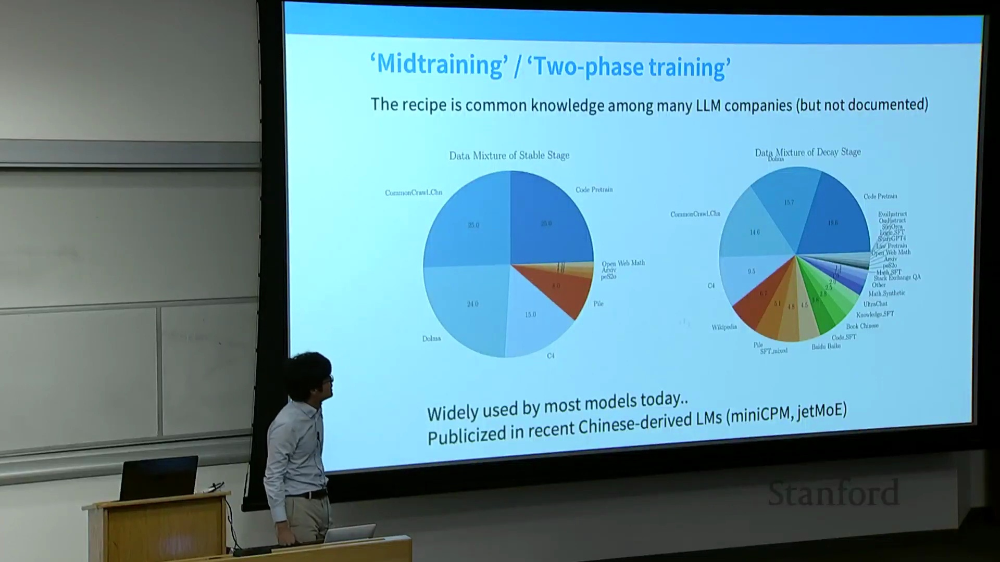
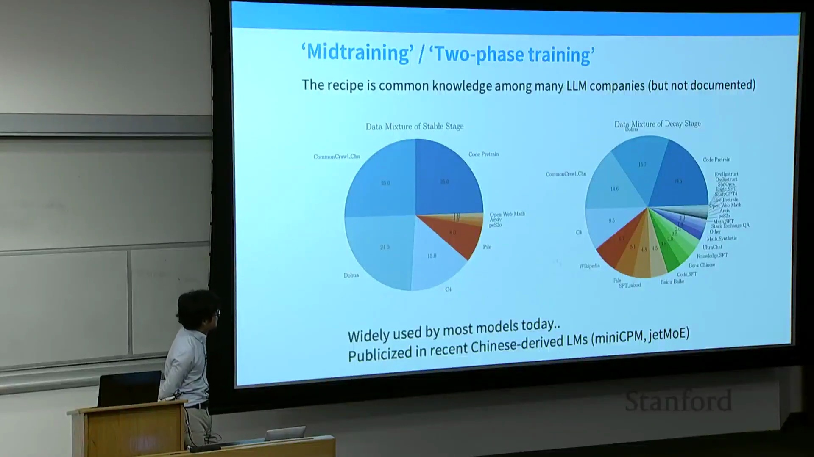
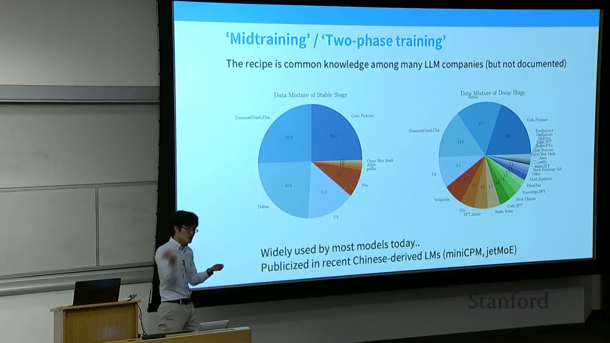
一个关键问题随之而来：在退火阶段(Annealing Phase)混合指令数据能否解决幻觉(Hallucination)问题？讲师明确指出，尽管该技术在学习率退火期间能有效缓解灾难性遗忘(Catastrophic Forgetting)并维持模型的通用能力(General Capabilities)，但它并不能从根本上解决引用幻觉(Citation Hallucination)。模型会无条件地吸收指令数据，而不考虑其先验知识储备(Prior Knowledge)。如果模型本身已具备相关事实知识，它可能会学会正确地检索并格式化(Retrieve and Format)这些内容；但如果模型缺乏相关知识，它大概率只会学到浅层的结构模式(Shallow Structural Patterns)（例如“在句末添加引用”），而非事实本身，从而生成看似自信却实为捏造的参考文献(Fabricated Citations)。

## 自适应与反应式训练的挑战
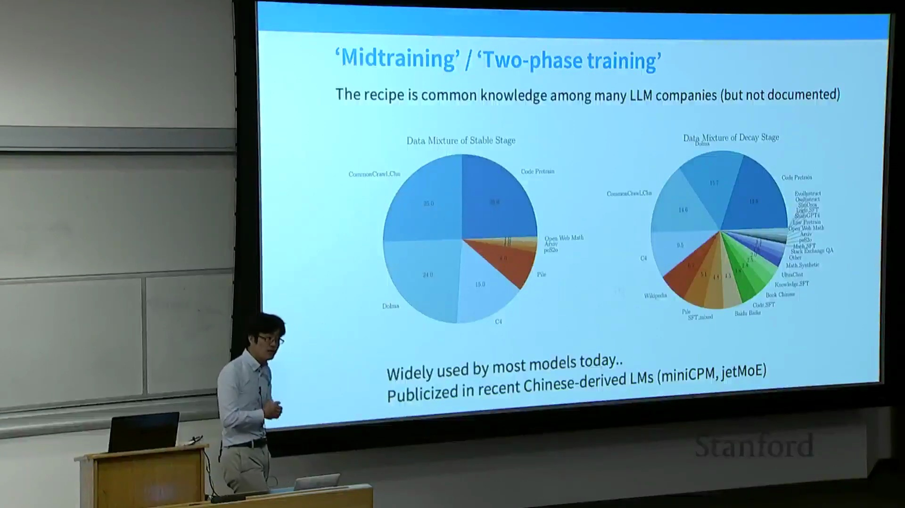
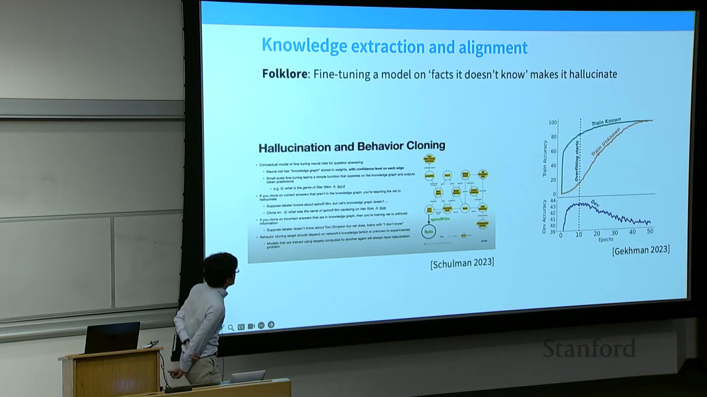
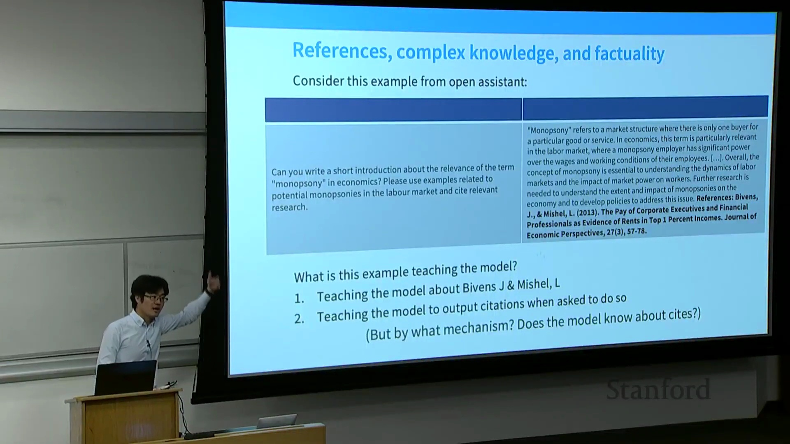
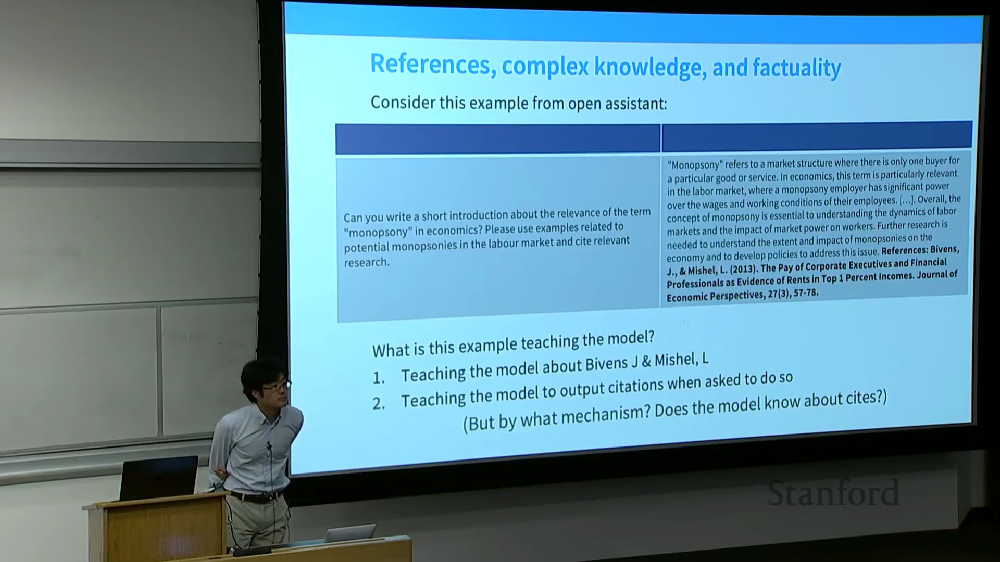
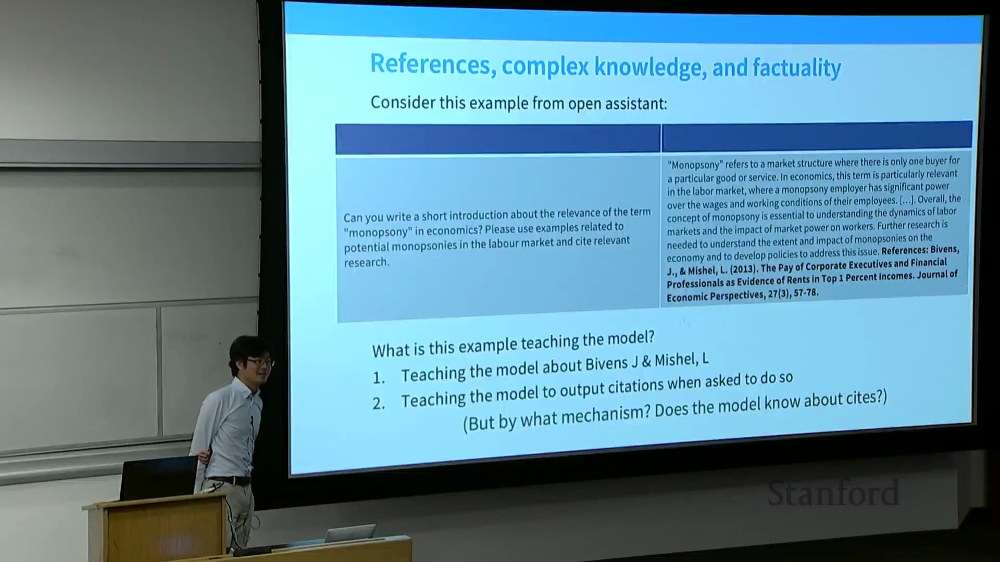
为自适应(Adaptive)地解决幻觉问题，有学生提出引入“思维词元”(Thought Tokens)或自我验证机制(Self-Verification Mechanisms)，在生成内容前检查模型是否真正掌握相关事实。讲师将这一构想与 STaR(Self-Taught Reasoner) 和 Quiet-STaR 等强化学习(Reinforcement Learning, RL)范式相联系，后者通过强化正确的推理轨迹(Reasoning Trajectories)并剔除错误的轨迹来提升模型能力。然而，在预训练规模上实施此类反应式训练(Reactive Training)在工程实现上极为艰巨。标准的预训练依赖于静态的、预先打包好的数据集(Static, Pre-packaged Datasets)以保证计算效率(Computational Efficiency)；而自适应训练则要求根据模型的实时知识状态(Real-time Knowledge State)动态调整损失函数(Loss Function)或数据分布。这本质上意味着需要将强化学习技术扩展至预训练的量级，是一项极其复杂且消耗巨大算力(Compute)的工程。

## 后训练中的浅层模式学习

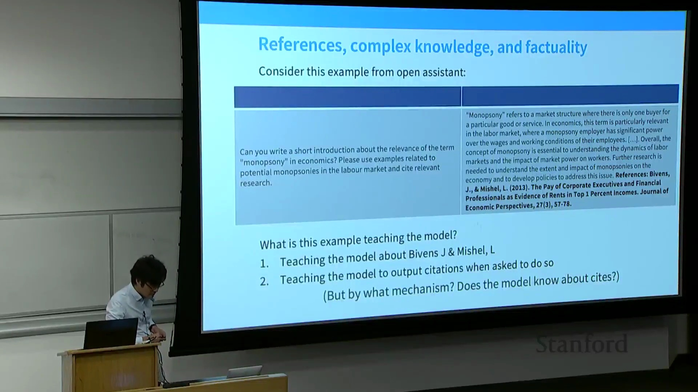
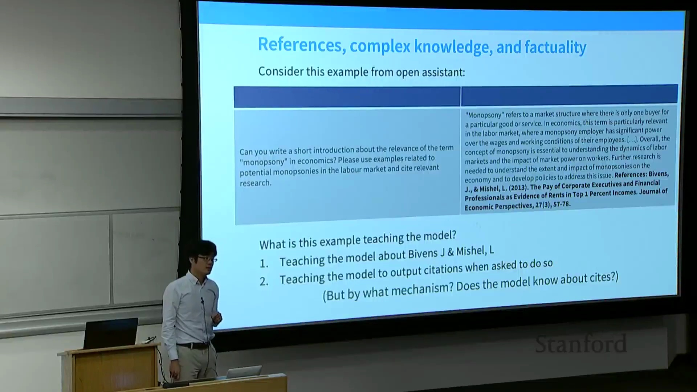
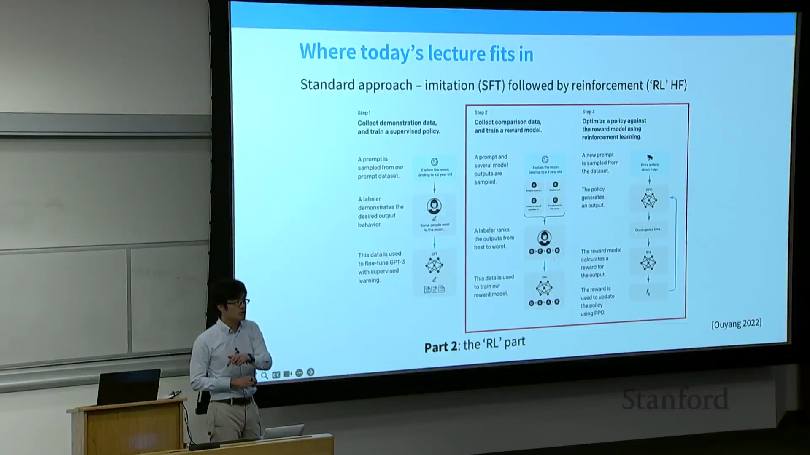

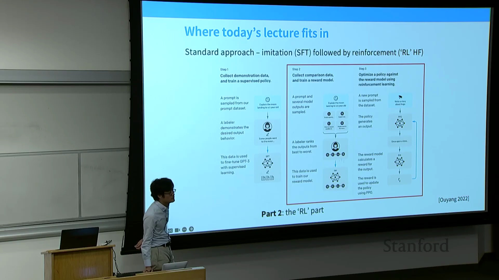
讲座最后通过一个模式模仿(Pattern Mimicry)的实际案例作结：如果仅在后训练(Post-Training)阶段引入表情符号会发生什么？若表情符号的分布遵循某种复杂且高度依赖输入(Input-Dependent)的规则，而模型受限于有限的微调数据无法将其完全内化(Internalize)，它很可能会退化为随机或随意地生成表情符号。这凸显了监督微调(Supervised Fine-Tuning)中的一个根本性风险：当模型缺乏足够的能力或数据来学习底层依赖关系(Underlying Dependencies)时，它们会优先优化表面上的风格合规性(Stylistic Compliance)，而非真正的结构理解(Structural Understanding)。因此，从业者必须精心筛选后训练数据，避免让模型强化浅层的格式捷径(Format Shortcuts)，而忽视了实质性的行为对齐(Behavioral Alignment)。