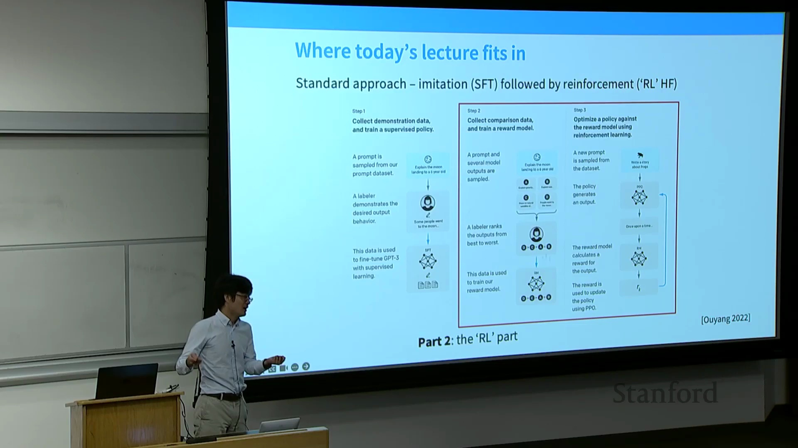
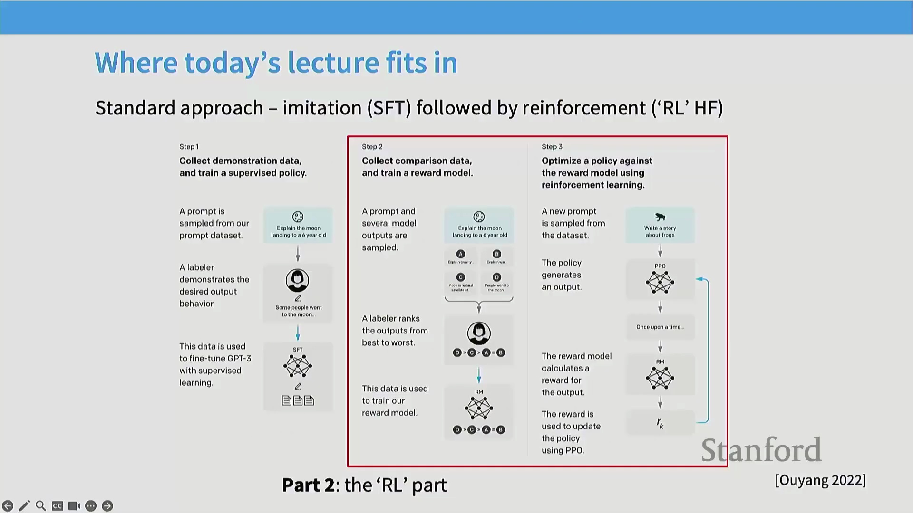
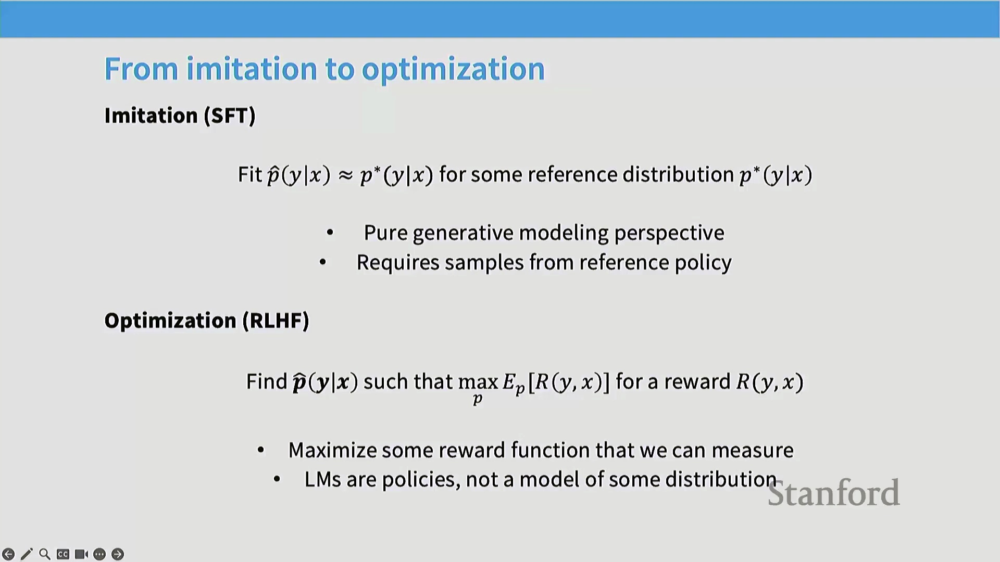
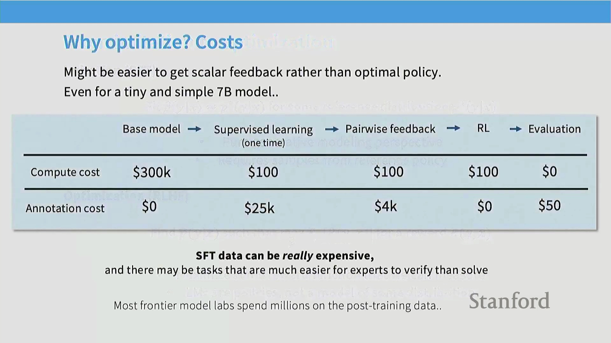
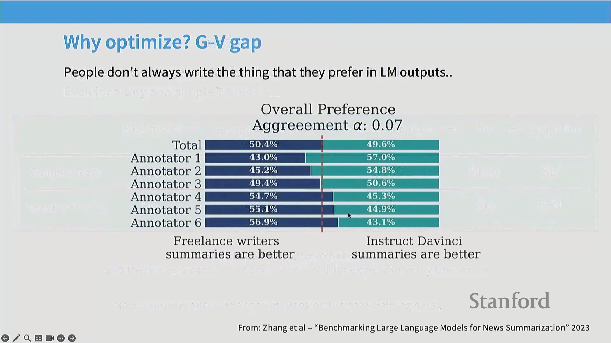
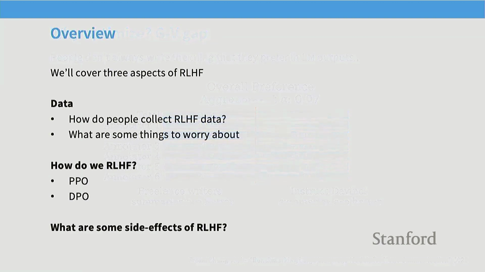
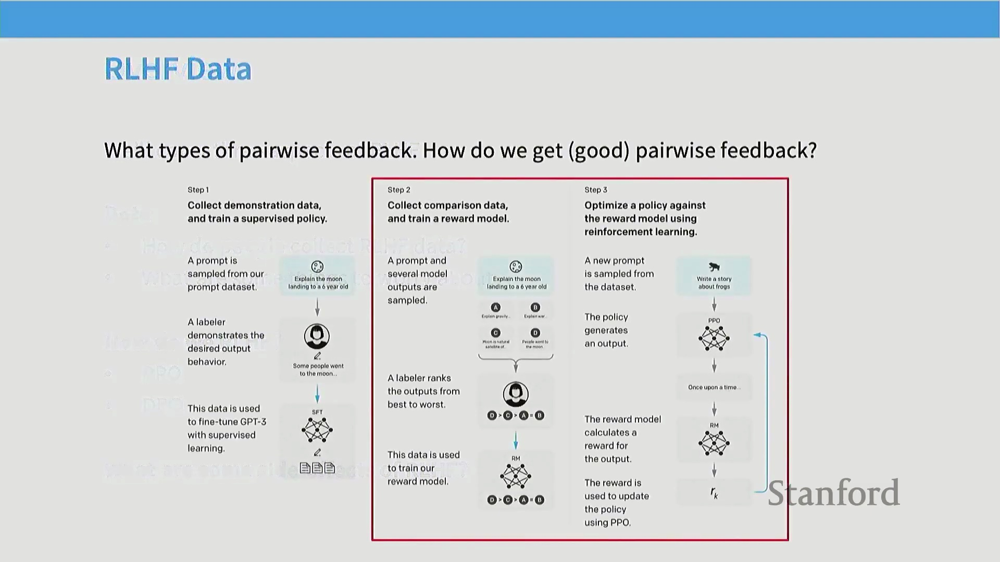
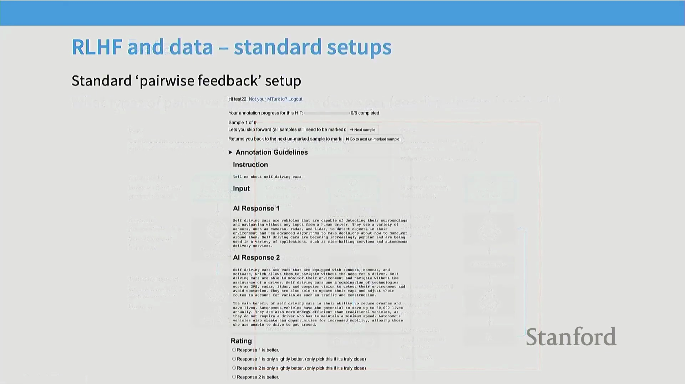
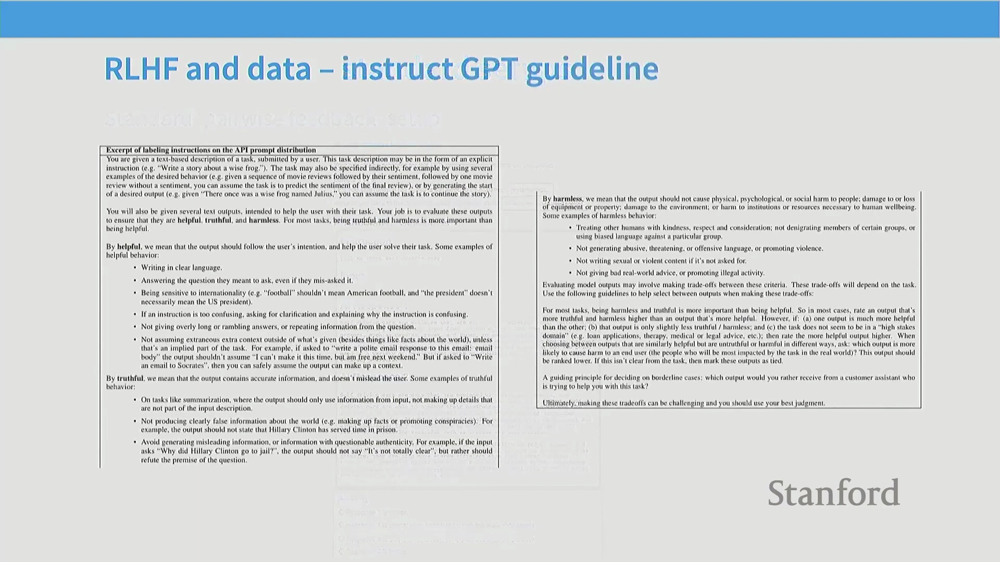
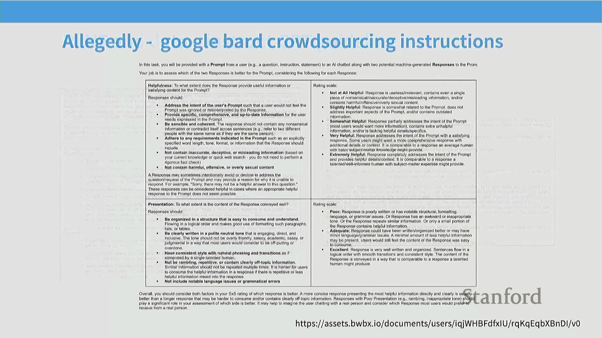

## 监督微调(Supervised Fine-Tuning, SFT)的局限性与向强化学习的过渡

监督微调在引导语言模型掌握期望输出的结构范式(Structural Patterns)与风格规范方面表现卓越。然而，除非数据集规模极其庞大，否则仅凭标准指令微调来可靠地注入新事实知识(Factual Knowledge)仍充满挑战。现代的“中期训练”(Mid-Training)策略正通过将指令数据直接混合至预训练(Pre-training)的末期阶段，逐渐模糊这一界限。然而，对于传统的后训练(Post-Training)流水线而言，若要超越简单的行为模仿，则亟需一种更高效且可扩展的范式。

## 从分布匹配到策略优化
转向基于人类反馈的强化学习(Reinforcement Learning from Human Feedback, RLHF)需要根本性的概念转变。在传统的生成式建模(Generative Modeling)中，优化目标是拟合参考分布 $P^*$（如互联网文本或人工示范数据）。在 RLHF 框架中，我们很大程度上放弃了严格的分布匹配(Distribution Matching)。相反，我们将语言模型视为一个策略(Policy) $\pi(Y|X)$，其优化目标是最大化标量奖励函数(Scalar Reward Function) $R(Y, X)$。我们的目标不再是完美复刻人类的写作模式，而是探寻任意能够持续产出高奖励回复的策略。

## RLHF 的经济与质量优势
采用 RLHF 而非纯监督微调主要基于两大动机。其一是成本效益(Cost-Efficiency)。为 SFT 构建专家级长篇示范数据(Expert Demonstrations)极其消耗资源，数据收集环节通常需耗费实验室数百万美元预算。相比之下，成对偏好数据(Paired Preference Data)（标注者仅需在两个模型输出中择优选出）的采集成本显著更低、速度更快，且更易规模化扩展。其二（或许更为关键），在于通过对比评估(Comparative Evaluation)挖掘模型质量提升的巨大潜力。

## 生成与评估的差距
研究揭示了人机交互中一个有趣的“生成-验证差距”(Generator-Validator Gap)。研究表明，人类标注者通常更偏好 AI 生成的摘要，而非他们自己的原创作品。受访专家作者坦言，尽管其原创作品投入了更多心血或更具个人风格，但 AI 生成的文本往往在清晰度与有效性上更胜一筹。这揭示了一项关键洞见：在认知层面，验证并甄选高质量回复远比从零开始创作更为容易，且最终产出质量更优。这种认知不对称性使得成对反馈成为一种极其强大且可扩展的对齐信号(Alignment Signal)。

## RLHF 流水线：轨迹采样(Rollouts)与奖励建模(Reward Modeling)
标准的 RLHF 流水线始于策略模型的“轨迹采样(Rollouts)”环节——即针对给定提示(Prompt)采样生成多个候选输出。随后，标注者提供成对反馈（例如，“输出 A 是否优于输出 B？”）。此类对比数据随后用于训练一个独立的**奖励模型(Reward Model)**，使其学会根据已收集的偏好数据，为任意给定回复分配标量奖励分数。训练完成后，该奖励模型将取代人工标注员，提供自动化、持续的训练信号，语言模型的策略将依托强化学习算法针对该信号进行迭代优化。

## 实践中收集成对反馈
在实际操作层面，收集成对反馈需部署专用 Web 界面，供标注者并排查看模型生成的候选回复，并从中择优。尽管底层交互流程看似直观，但要确保数据采集的一致性，仍需依赖精细化的运营管理设计。若缺乏清晰、标准化的工作流(Workflow)，标注疲劳、主观偏见与前后不一致将严重削弱奖励信号的质量，最终导致模型对齐结果产生偏差。

## 定义质量：有用、真实、无害框架
以 InstructGPT 论文中确立的开创性框架为代表，标注质量通过三大核心支柱来定义：**有用性(Helpfulness)、真实性(Truthfulness)与无害性(Harmlessness)**。**有用性**确保回复清晰明了、精准契合用户意图，并能妥善处理地域差异等上下文细微差别(Contextual Nuances)。**真实性**要求内容事实准确，并主动将幻觉(Hallucination)发生率降至最低。**无害性**则部署严密的安全护栏(Safety Guardrails)，严防输出毒性(Toxicity)或有害内容。将上述高层原则转化为标注员可执行的具体操作指南，是一项复杂且需持续迭代的工程挑战。

项目的实际落地依赖极其详尽的标注指南(Annotation Guidelines)，以妥善处理边界案例(Boundary Cases)，并确保各项原则的一致性应用。多家大型科技公司泄露的内部文档显示，此类指南往往篇幅浩繁，涵盖错综复杂的长尾场景，并与公开发布的模型规范(Model Specifications)紧密交织。唯有依托此种严谨、指南驱动的数据收集机制，实验室方能产出足以训练强大且可靠奖励模型的高质量成对反馈数据。

