## 标注指南与实际操作限制
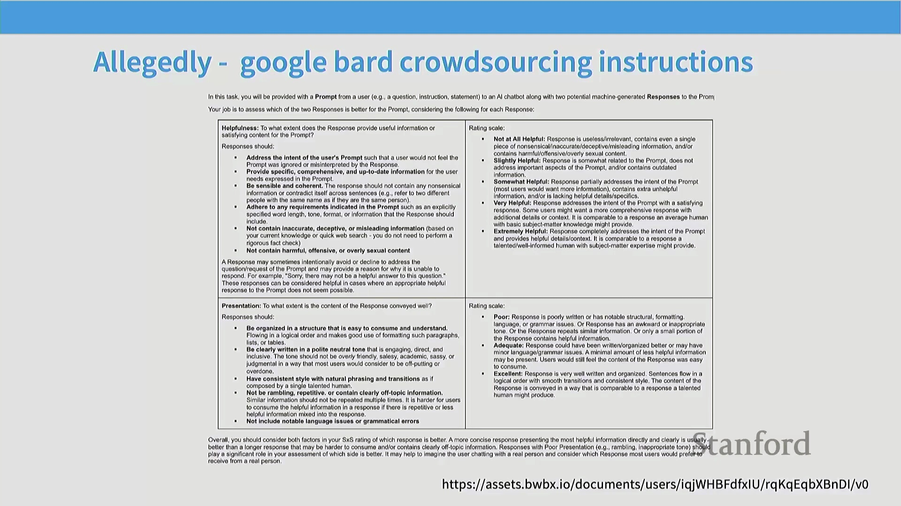
成对偏好数据(Paired Preference Data)的收集高度依赖于精心编制的标注指南(Annotation Guidelines)。泄露的内部文档与已公开的框架均一致强调有用性(Helpfulness)、真实性(Truthfulness)和无害性(Harmlessness)等核心评估支柱，同时包含具体的风格要求与详细的评分量表(Rating Scales)。然而，该任务在实际操作中面临诸多限制。标注员通常受限于严格的时间窗口——有时针对每个提示(Prompt)的评估时间仅有一分钟——且早期数据流水线(Pipeline)高度依赖通过 Scale AI 或 Upwork 等平台组建的众包团队(Crowdsourcing Teams)。这营造了一种高压工作环境，要求标注员在面对复杂提示时仍能保持高质量且一致的判断，执行难度极高。
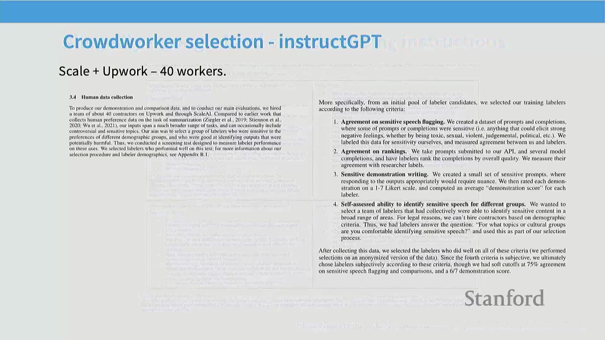

## 人类评估中的幻觉与长度陷阱
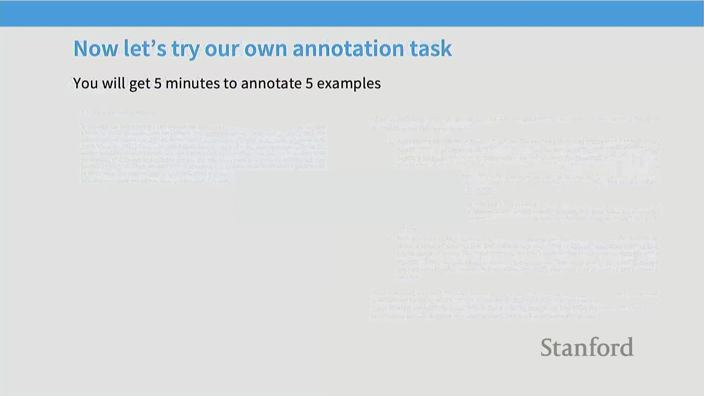
一次互动课堂练习生动地揭示了快速人工评估的潜在陷阱。当面对成对的模型输出时，绝大多数学生倾向于选择篇幅更长、内容更详细的回复。然而，经仔细核查后发现，这些备受青睐的回复中普遍存在严重的事实性幻觉(Factual Hallucinations)或逻辑谬误。 
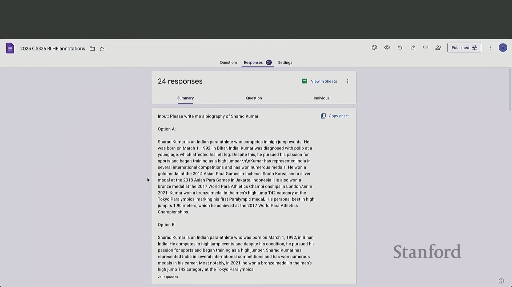

在数学推理(Mathematical Reasoning)任务中，那些表现出盲目自信并给出确定性结论的模型，即便最终答案错误，也往往能赢得更多投票。这暴露出一个关键弱点：在时间压力下，人类评估者难以执行彻底的事实核查(Fact-Checking)，极易被冗长的篇幅与权威的口吻所误导，从而无意中奖励了表面流畅度(Surface Fluency)，而非事实准确性(Factual Accuracy)。
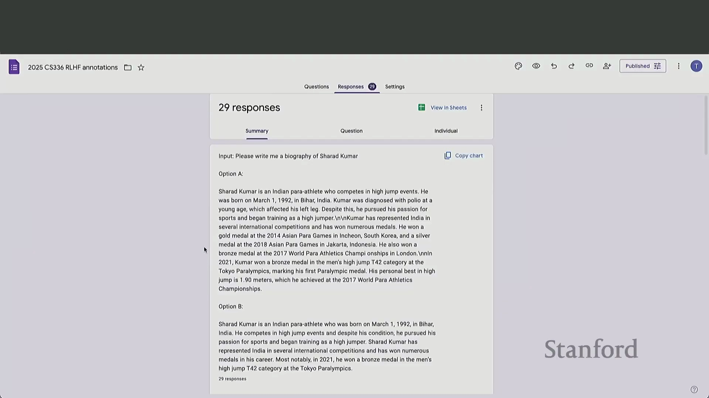
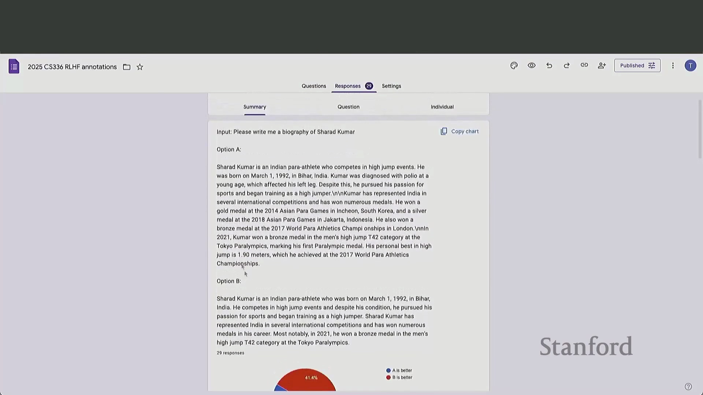

对复杂主张、数学证明或深度事实内容进行验证，需要将模型回复拆解为独立的断言(Discrete Assertions)——这是一个劳动密集型(Labor-Intensive)过程，与快节奏的众包模式格格不入。除操作层面的障碍外，RLHF 数据收集的外包模式还引发了关于公平薪酬(Fair Compensation)与劳动条件(Labor Conditions)的严峻伦理与经济争议。此外，标注群体的人口统计学特征(Demographics)直接塑造了模型的对齐方向(Alignment Direction)。针对早期指令微调(Instruction Fine-Tuning)模型的研究表明，它们往往会对特定文化视角产生过度对齐(Over-Alignment)，这恰恰反映了主力标注劳动力所处的地理与文化背景。不同的标注群体亦展现出迥异的评估侧重点：专家评估者(Expert Evaluators)更关注事实准确性与文献引用，而众包工人(Crowdworkers)通常更看重排版美观度、可读性与文体特征(Stylistic Markers)。

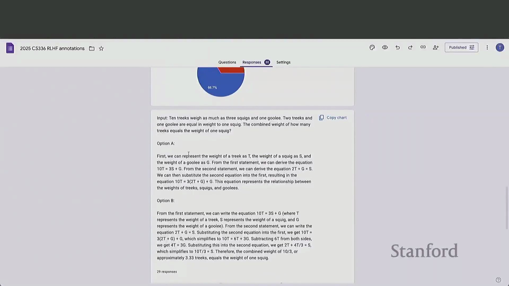

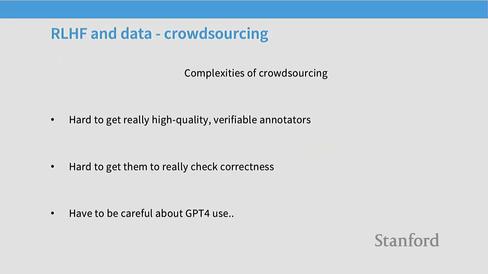

## AI 反馈的兴起与“大模型即裁判”(LLM-as-a-Judge)
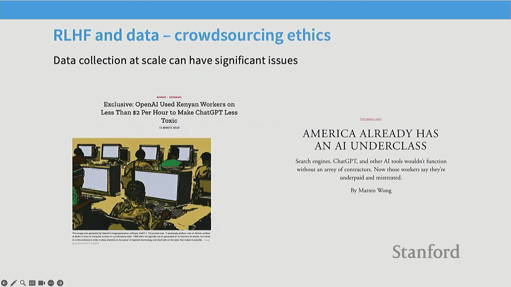
为缓解人工评估的不一致性、高昂成本与可扩展性瓶颈，该领域正广泛转向 AI 生成反馈(AI-Generated Feedback，即基于 AI 反馈的强化学习 Reinforcement Learning from AI Feedback, RLAIF)。研究表明，先进的大语言模型(Large Language Models, LLMs)能够生成与人类评估高度一致的成对偏好判断，且所需成本与时间仅为人工评估的极小部分。这一范式转变从根本上重塑了后训练流水线(Post-Training Pipeline)。部分最初对合成反馈(Synthetic Feedback)持怀疑态度的知名开源项目最终证实，在构建高性能对齐模型方面，AI 生成的偏好数据显著优于人工众包数据。现代训练框架高度依赖大语言模型对自身输出进行批判、排序与优化，从而确立了 AI 反馈作为可扩展对齐基石的核心地位，其理论渊源可直接追溯至宪法 AI(Constitutional AI)的开创性工作。
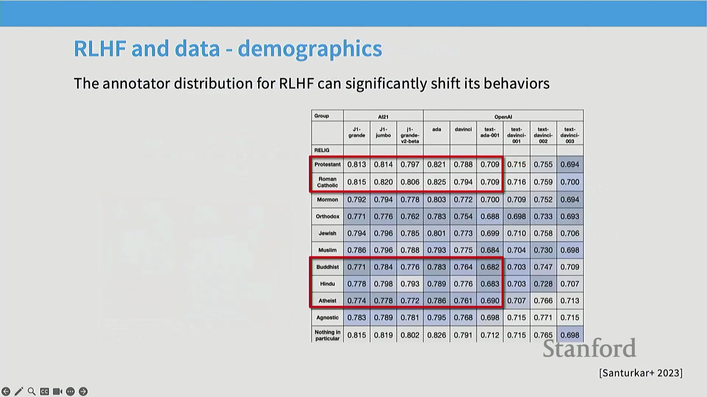
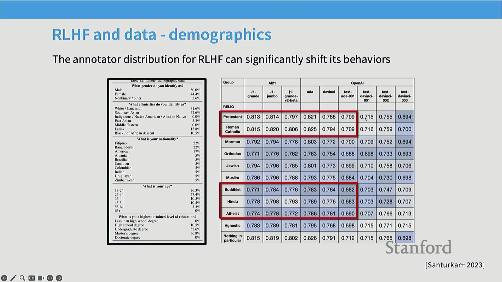
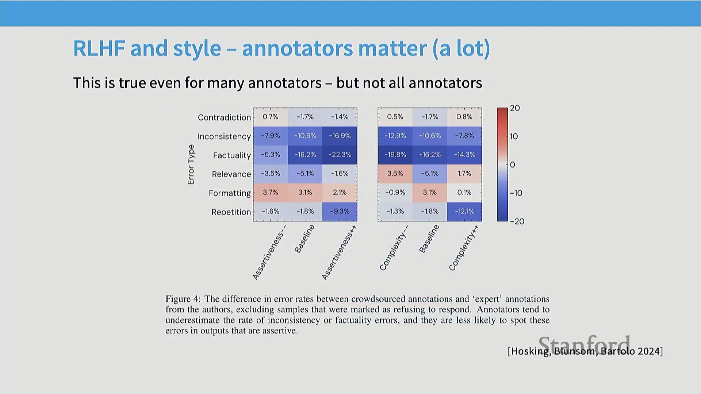

## 长度偏差(Length Bias)：一个持久的混杂因素(Confounding Factor)
在人类与 AI 评估中普遍存在的一个核心问题是对较长输出的强烈偏好。评估者（无论人类或机器）常将篇幅冗长与高质量混为一谈，误认为更详细的回复本质上更具帮助性或准确性。因此，经偏好学习(Preference Learning)优化的模型往往会倾向于生成不必要的冗余文本。这种“长度偏差”在对齐研究中构成显著的混杂因素，可能导致模型奖励华而不实的文风，而非真正的逻辑推理能力或事实精确度。从业者必须在数据采集与评估阶段主动引入长度控制机制，以确保模型优化目标聚焦于实质能力(Substantive Capabilities)，而非单纯的文本膨胀。
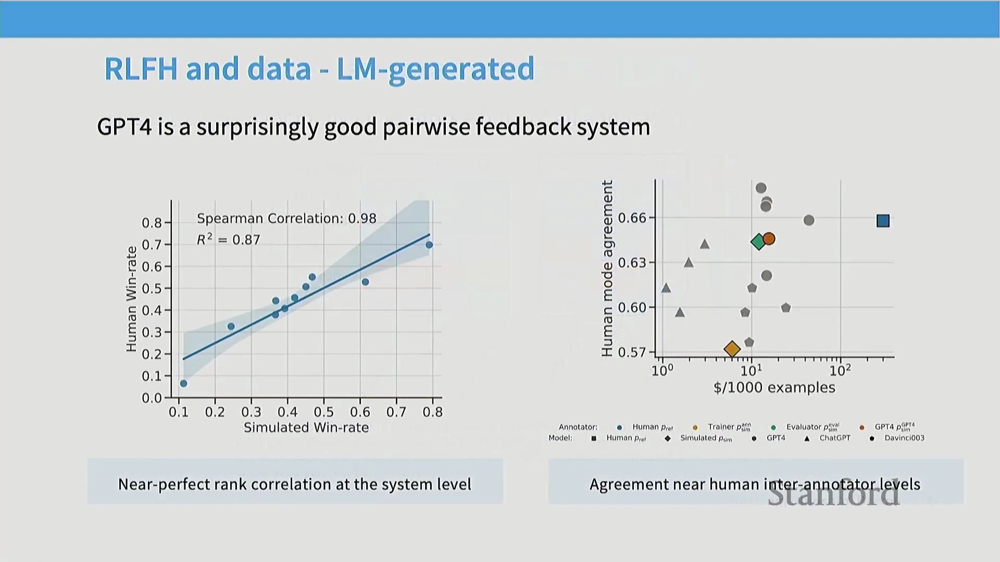
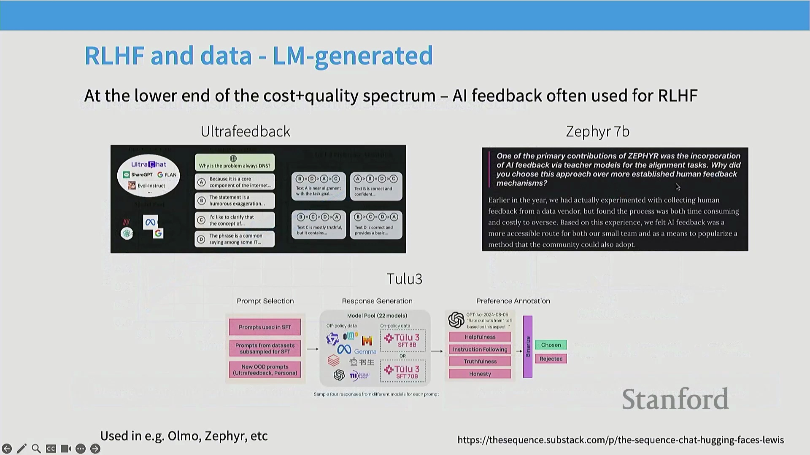

## 转向同策略(On-Policy)与异策略(Off-Policy) RLHF
该讨论自然过渡到异策略与同策略强化学习(Reinforcement Learning)在方法论层面的核心差异。异策略方法依赖静态的、预先收集的偏好数据集（如 UltraFeedback 或 AI 排序输出(AI-Ranked Outputs)），而同策略方法则从当前正在训练的模型中动态采样(Dynamic Sampling)，以获取实时、针对该模型状态的特有反馈信号。深入理解这两种范式之间的权衡，对于设计高效稳健的 RLHF 流水线至关重要，同时也为后续章节深入剖析具体强化学习算法及其底层实现细节奠定了坚实基础。
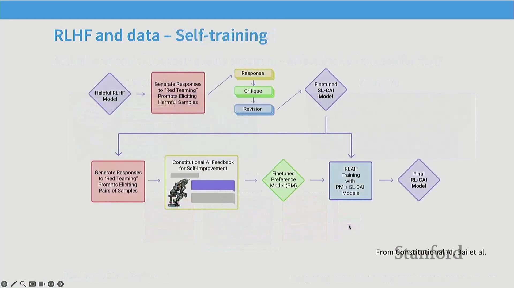
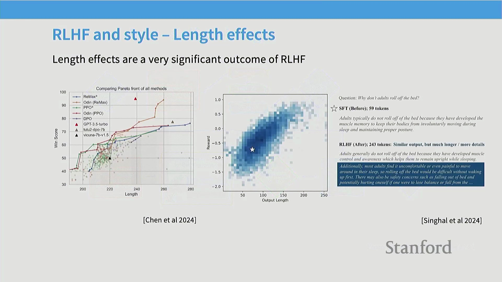