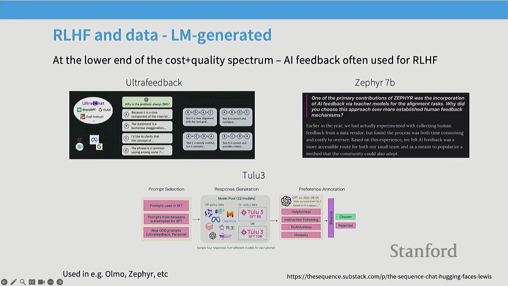
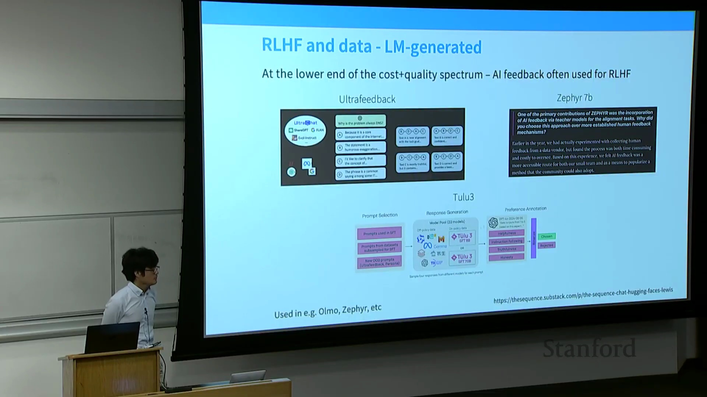
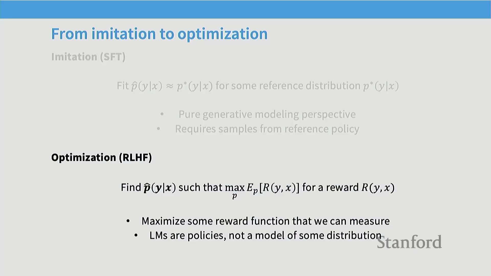
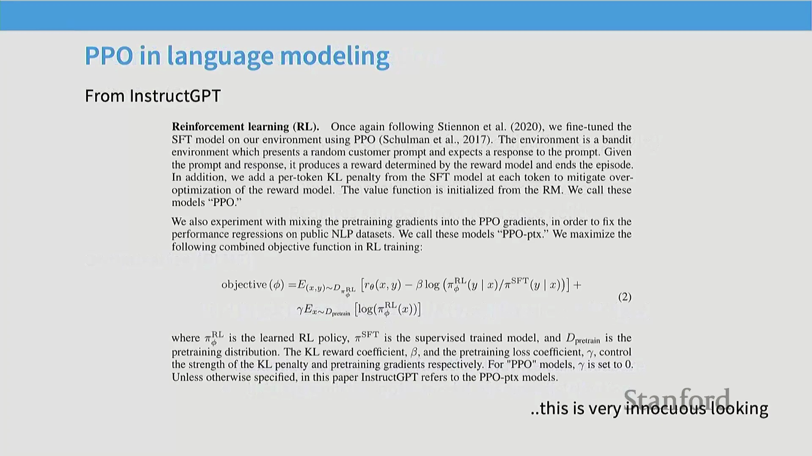
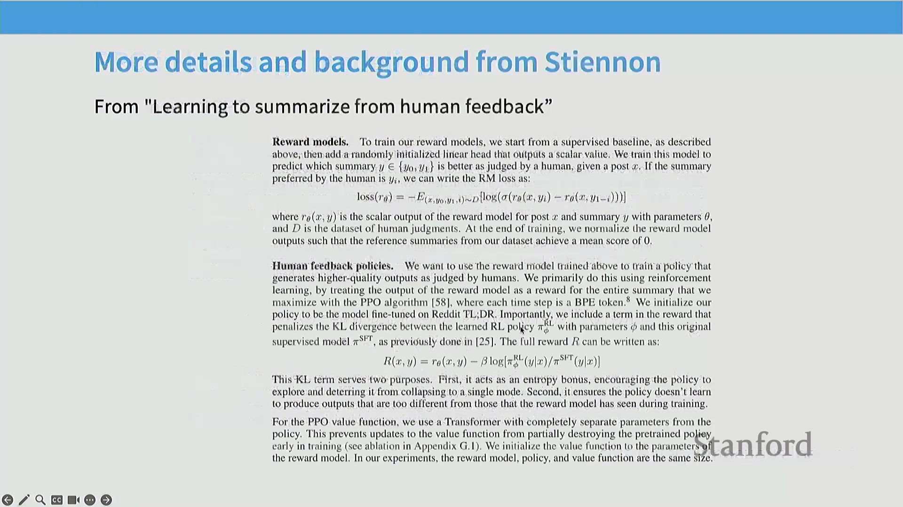
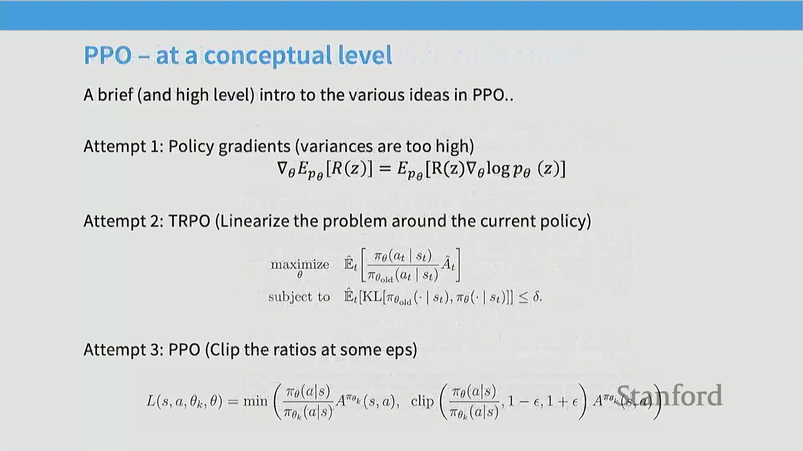

## 异策略(Off-Policy)与同策略(On-Policy)偏好数据

强化学习流水线(Reinforcement Learning Pipeline)主要利用两种不同类型的偏好数据(Preference Data)。异策略(Off-Policy)数据独立于当前待训练模型进行收集，通常源自其他模型的生成输出或现有公开数据集。这提供了对响应空间(Response Space)的全局视野，帮助模型理解在不同上下文(Context)下何种行为属于高质量或低质量。相比之下，同策略(On-Policy)数据直接从模型当前的生成输出中采样(Sampling)获得。这种自我生成的反馈(Self-Generated Feedback)对于针对性的迭代优化至关重要。现代后训练(Post-Training)框架（如 Tulu3）战略性地将两者结合：异策略数据用于锚定外部质量标准(External Quality Standards)，而同策略数据则驱动持续的、针对模型自身状态的迭代改进。

## 可验证领域(Verifiable Domains)的对齐与开放式挑战

对齐领域(Alignment Field)的一个关键问题是：我们能否通过利用具有客观标准答案(Ground Truth)的领域来规避人工标注(Human Annotation)。答案是肯定的：将强化学习应用于数学等可验证任务极为高效，这将是下一讲的核心内容。然而，开放式生成(Open-Ended Generation)在本质上截然不同。针对主观或创意类提示(Creative Prompts)，通常存在多种有效的回复路径，这使得定义唯一的“正确”答案变得极为困难，或在缺乏充分上下文的情况下难以可靠评估事实准确性(Factual Accuracy)。尽管向标注者提供专家参考回复(Expert Reference Responses)等界面干预措施(Interface Interventions)能有效提升判断质量，但它们并非解决开放式任务固有模糊性(Inherent Ambiguity)的万能灵药。

## AI 反馈与自我偏好偏差(Self-Preference Bias)
当使用大语言模型(Large Language Models, LLMs)生成反馈或评判自身输出（即基于 AI 反馈的强化学习 Reinforcement Learning from AI Feedback, RLAIF）时，从业者必须警惕一种强烈且已被充分记录的自我偏好偏差。模型往往会系统性地为自身生成的内容赋予更高评分。尽管如此，自我提升(Self-Improvement)的理论潜力依然巨大，因为模型已在预训练阶段吸收了海量语料(Corpus)，这些潜在知识可通过针对性提示(Targeted Prompting)与优化循环(Optimization Loops)被有效激发(Elicit)。自我对齐(Self-Alignment)的实际性能上限仍是一个活跃的经验研究课题，大量前沿工作正致力于探索迭代自我训练(Iterative Self-Training)的扩展规律(Scaling Laws)与收益递减(Diminishing Returns)现象。

## RLHF 优化目标(Objective Function)

正如 InstructGPT 论文所形式化的，RLHF 的数学基础旨在寻找一种最优策略(Policy)，使其在保持输出稳定性的同时最大化期望奖励(Expected Reward)。其目标函数包含三个关键组成部分：
1. **奖励最大化(Reward Maximization)：** 核心目标是最大化 $R_\theta(x, y)$，即奖励模型分配给生成输出 $y$ 的标量分数。
2. **KL 散度惩罚(KL Divergence Penalty)：** 引入散度项对模型策略偏离初始监督微调(Supervised Fine-Tuning, SFT)参考分布(Reference Distribution)过远的行为进行惩罚。这充当了正则化约束(Regularization Constraint)，有效防止策略退化为模式崩溃(Mode Collapse)或生成不自然的文本。
3. **预训练损失混合(Pre-training Loss Mixing, 可选)：** 部分实现会在强化学习阶段混入预训练损失项，以进一步缓解灾难性遗忘(Catastrophic Forgetting)；不过，许多现代流水线已仅依赖 KL 约束来维持训练稳定性。

## 偏好建模：Bradley-Terry 框架(Bradley-Terry Model)

为优化奖励函数，我们首先需建立人类偏好的形式化数学模型。标准方法假设每个可能的文本序列(Text Sequence)均对应一个不可观测的潜在标量奖励(Latent Scalar Reward) $R$。人类的成对比较(Pairwise Comparisons)并不能直接观测 $R$，而是通过 Bradley-Terry 框架进行概率建模：即偏好回复 A 优于回复 B 的概率，被定义为两者奖励差值的逻辑斯蒂函数(Logistic Function)。在实际应用中，我们仅能获取带有噪声的成对比较标签(Noisy Comparison Labels)。通过最小化预测偏好概率与实际人类选择之间的差异（通常使用交叉熵损失 Cross-Entropy Loss），我们训练一个独立的奖励模型(Reward Model)以逼近该隐式奖励函数 $R$。

## 策略梯度与 PPO 简介

在获得训练完毕的奖励模型后，我们采用基于梯度(Gradient-Based)的方法对策略进行优化。策略梯度定理(Policy Gradient Theorem)指出，可通过按奖励值成比例地调整词元生成概率(Token Generation Probabilities)来更新模型权重：即提升高奖励序列的似然度(Likelihood)，同时压低低奖励序列的似然度。近端策略优化(Proximal Policy Optimization, PPO)算法对此基础方法进行了关键改进，引入了**优势函数(Advantage Function)**作为奖励信号的降方差基线(Variance-Reducing Baseline)。此外，PPO 允许对单次采样轨迹(Sampled Rollout)执行多次优化迭代(Multiple Optimization Steps)，从而显著提升了训练过程的数据效率(Data Efficiency)与收敛稳定性(Convergence Stability)。关于 PPO 核心机制的更深入技术拆解，将在后续讲座中展开详细探讨。