## 课程介绍与 RLVR 的崛起
好的，我们开始。这是后训练(Post-training)系列的第二讲。我们首先将收尾周二的讲座内容，涵盖此前未讲的部分。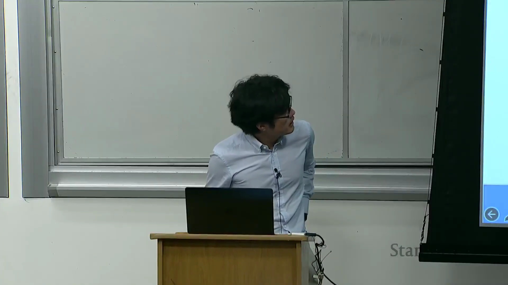 随后，我们将探讨基于可验证奖励的强化学习(Reinforcement Learning with Verifiable Rewards, RLVR)，这无疑是过去半年左右涌现出的一个令人兴奋的新趋势。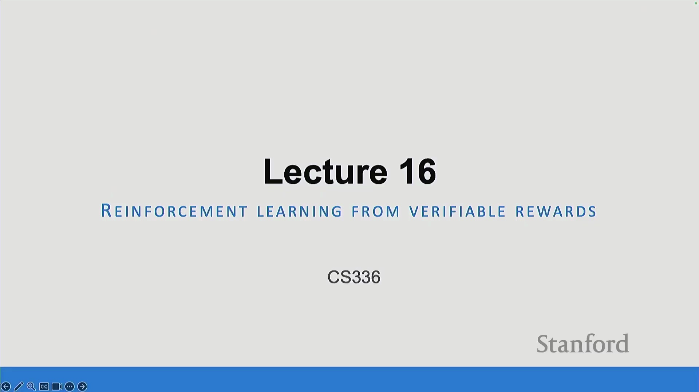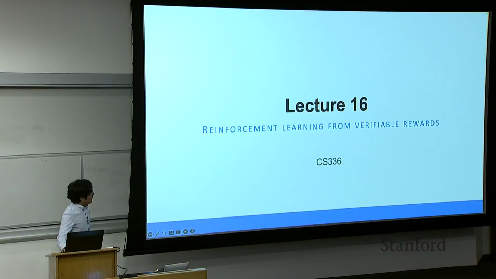 该方法正是当前占据主导地位的各类推理模型背后的核心驱动力。

## RLHF 回顾与 DPO 基础
在深入探讨可验证奖励以及相关的数学推导与强化学习(Reinforcement Learning, RL)内容之前，我将先回顾并补全基于人类反馈的强化学习(Reinforcement Learning from Human Feedback, RLHF)部分。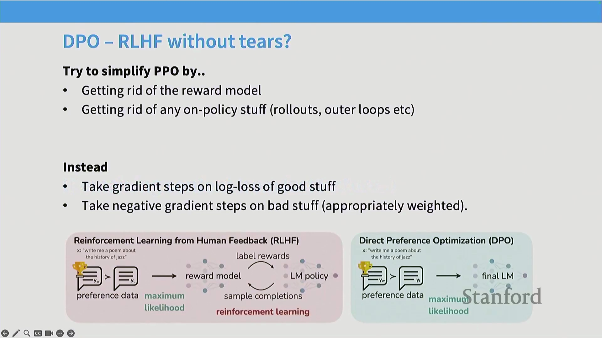 这是对周二讲座末尾几张幻灯片的简要回顾。在 RLHF 的设定中，我们观察成对偏好数据(Pairwise Preference Data)，以判断两个模型响应(Response)中哪一个更优。我们的目标是获得一个语言模型策略(Language Model Policy)，使其能够最大化这些偏好数据背后所隐含的奖励(Implicit Reward)。正如大家可能记得的，直接偏好优化(Direct Preference Optimization, DPO)正是一种用于优化该强化学习目标的算法。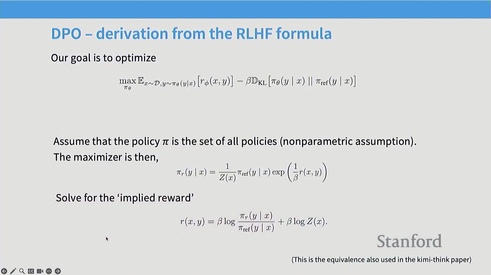

## DPO 的数学公式与更新机制
该优化目标之所以困难，是因为语言模型（即策略）被置于期望算子(Expectation Operator)内部。我们需要从语言模型中进行采样，而非仅仅在该模型下执行最大似然估计(Maximum Likelihood Estimation)。回顾推导过程可知，我们引入了一个非参数假设，即策略类包含所有可能的函数，随后将奖励重写为策略比率(Policy Ratio)，并将其代入 Bradley-Terry 模型(Bradley-Terry Model)的目标函数中。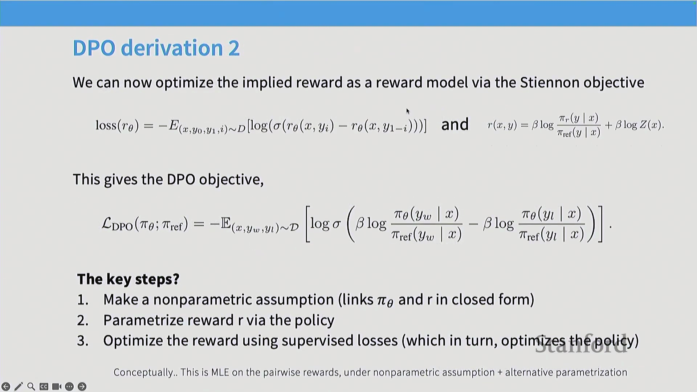 因此，我们的核心任务是寻找一个策略，使其隐含奖励能够最大化观测到偏好数据的概率。这一设计非常精妙，因为它本质上是在一个重新参数化(Reparameterized)的目标上执行的监督学习(Supervised Learning)。DPO 的更新公式如下：执行步长受正则化系数 β (Beta) 调制的梯度更新；当奖励模型估计出现偏差时，样本权重会相应提高；当隐含奖励预测不准时，更新幅度更大；其核心作用是提升优质样本的似然(Likelihood)，同时降低劣质样本的似然。如前所述，强化学习算法的最终逻辑通常都可归结为：提升优质内容的权重，抑制劣质内容的权重。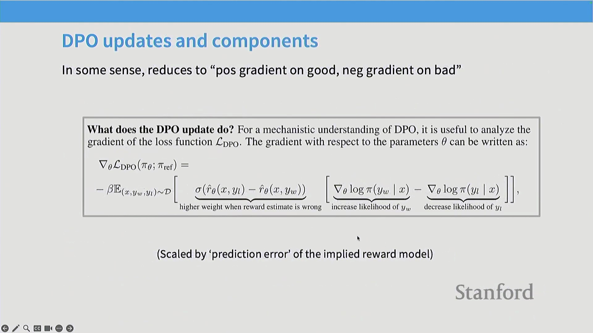

## DPO 的流行与变体泛滥
因此，DPO 的表现相当出色。在相当长的一段时间内，几乎所有开源模型的发布都采用了 DPO 的某种变体进行后训练。事实上，与近端策略优化(Proximal Policy Optimization, PPO) 相比，DPO 确实更易于实现和部署，从而在一段时期内占据了主导地位。此后，学术界涌现了大量本质上属于 DPO 变体（即各类“*-DPO”）的论文。几乎人人都想提出一种新的 DPO 变体，导致相关文献多达数十篇。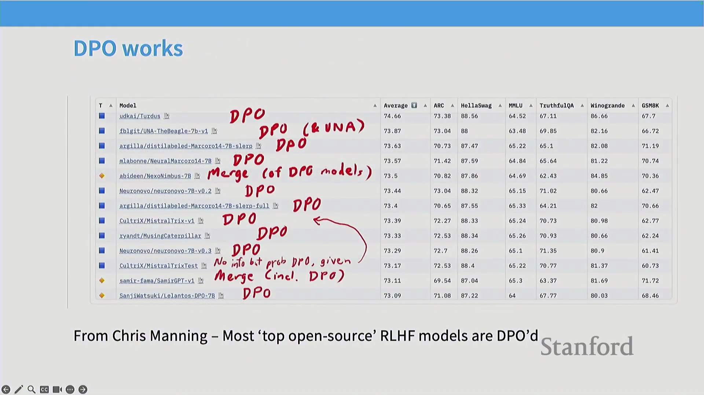 论文数量实在太多，逐一细读这片“文献海洋”并不现实，但我会提及几个近期被用于突破此类 DPO 风格后训练性能极限的重要变体。

## 关键改进：SimPO 与长度归一化
其中之一是 SimPO，它仅引入了两项简单的修改：一是按响应长度对更新步长进行归一化(Normalization)，二是直接移除了参考策略(Reference Policy)。尽管这一改动使我们丧失了 DPO 基于策略比率推导的严密数学基础，但在“纯粹提升优质样本权重、抑制劣质样本权重”的直观动机下，SimPO 依然表现出色。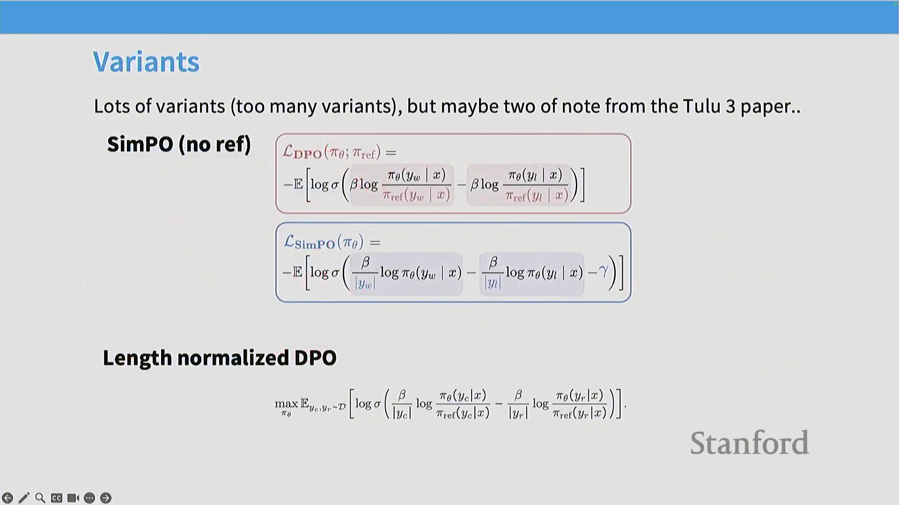 此外还有其他变体，例如保留参考策略但仅进行长度归一化的版本，即长度归一化 DPO(Length-normalized DPO)。AI2 的研究人员在其近期的模型迭代中广泛验证了这两种方案。

## RL 研究中的经验情境依赖性
在此我稍作停顿，因为这一点至关重要且属于经验性总结：在强化学习研究中，许多结论都高度依赖于具体的实验设定(Setting)。根据所使用的训练环境、基础模型(Base Model)以及后训练偏好数据的不同，你可能会得出截然不同的结论。例如，AI2 曾有一项工作对比了 DPO 与 PPO，结果表明得益于 PPO 的同策略(On-policy)特性，其表现更优。然而，在后续研究中他们发现，若采用更高质量的监督微调(Supervised Fine-Tuning, SFT)，实际上会完全抵消 PPO 和 DPO 带来的性能增益，仅使长度归一化 DPO 保持微弱领先。这并非指某篇论文有误而另一篇正确；而是提醒大家，应谨慎对待仅凭单一论文便对此类问题做出的泛化结论，切勿将任何孤立的实验结果视为绝对真理。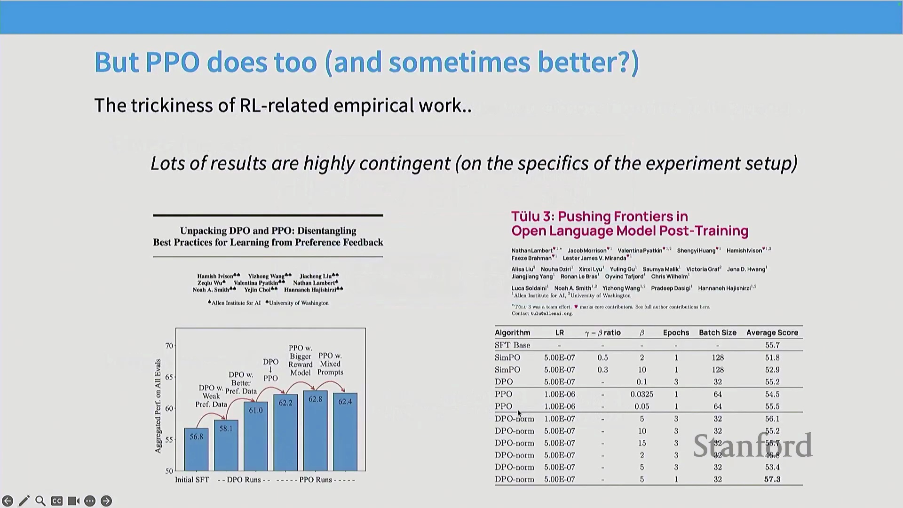

## RLHF 中的过度优化现象
最后，我想就 RLHF 补充两个关键观点，首先是过度优化(Over-optimization)。从某种意义上说，它本质上是过拟合(Overfitting)的另一种表述，但在该领域是一个极其重要的专有术语。其核心机制在于：随着策略的不断优化，初始阶段奖励值确实会上升，但最终基于人类偏好拟合的奖励模型(Reward Model)会与真实的人类偏好发生偏离。优化程度越深，模型行为偏离真实意图的程度就越大，实际上反而无法提升真实的奖励水平。这种过度优化现象广泛存在于 RLHF 的各个应用场景中，是一个亟待解决的难题。其根本原因确实在于人类偏好本身固有的噪声与复杂性。研究表明，无论是基于人类标注还是带有噪声的 AI 反馈(AI Feedback)，都会出现显著的过度优化现象；但若使用干净、无噪声的 AI 反馈，该现象则不明显。在实际进行后训练时，你通常会观察到这样的曲线：模型在代理奖励(Proxy Reward)上的表现不断提升，但这并不必然转化为在真实人类偏好胜率(Win Rate)上的优势。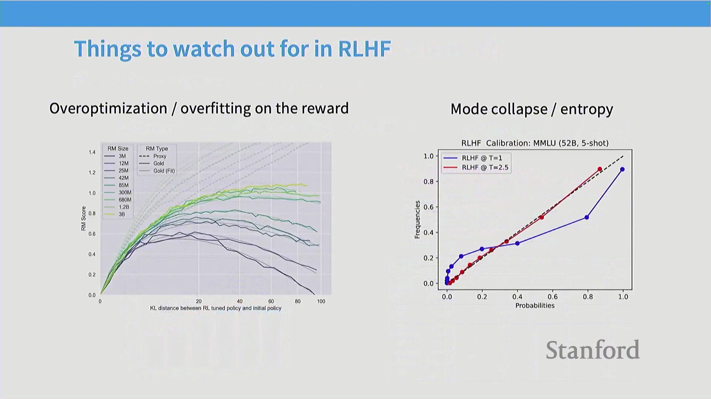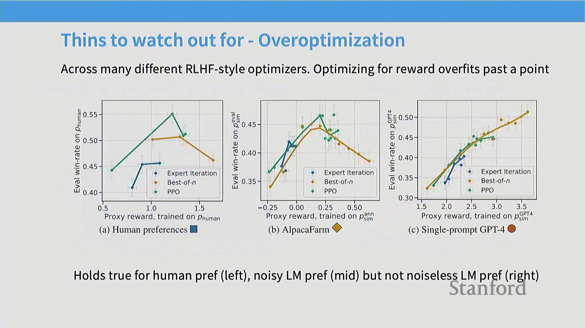

## 概率校准的丧失
另一个重要的补充说明是：一旦引入强化学习，模型便不再严格处于概率建模(Probabilistic Modeling)的框架内。在进行监督微调或预训练(Pre-training)时，我们的目标明确是进行概率建模或分布匹配(Distribution Matching)。然而，RLHF 的核心目的仅是优化策略；其背后并不必然对应一个明确的基础数据分布。这通常会导致模型的校准度(Calibration)显著下降。大量论文结果表明，RLHF 模型（尤其是在温度参数(Temperature)设为 1 时）会表现出明显的过度自信(Overconfidence)倾向。这一现象在 Anthropic 的研究、GPT-4 的技术报告以及多项学术工作中均得到了印证。在所有这些案例中，RLHF 模型的校准度均大幅降低。这本身并非致命缺陷，因为概率校准本就不是奖励设计中的优化目标；但在使用时必须格外谨慎，切勿将这些模型误认为是经过良好校准的概率模型。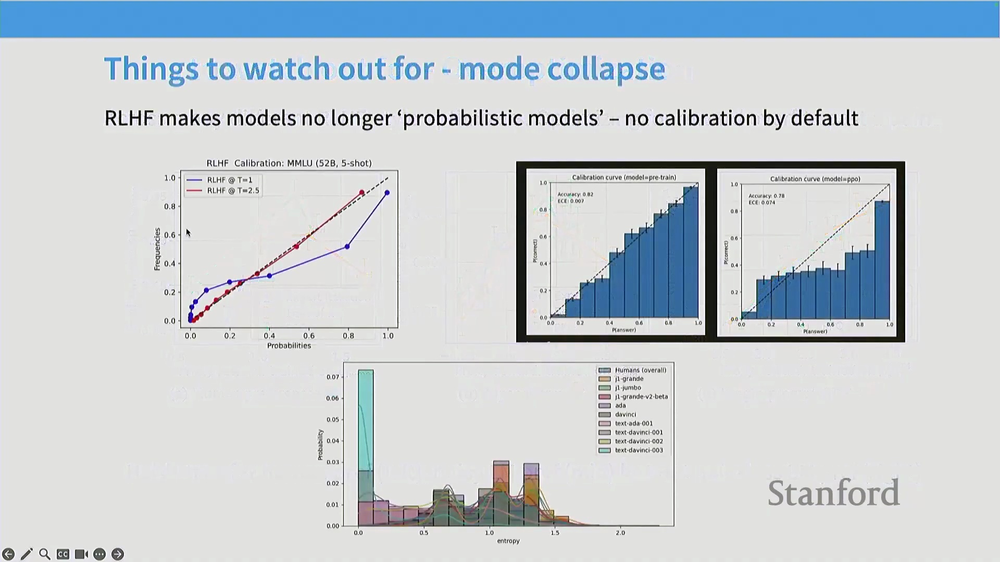

## 指标澄清与向 RLVR 的过渡
至此，我们已全面回顾了 RLHF 及其相关议题。针对前文过度优化图表的坐标轴作一澄清：X 轴表示代理奖励的优化程度（例如，PPO 算法拟合奖励分类器的效果），Y 轴则表示基于 AI 或人类反馈实测的真实胜率。随着研究重心逐渐摆脱对人类反馈的依赖，下一节我们将彻底转换视角，深入探讨基于可验证奖励的强化学习(RLVR)。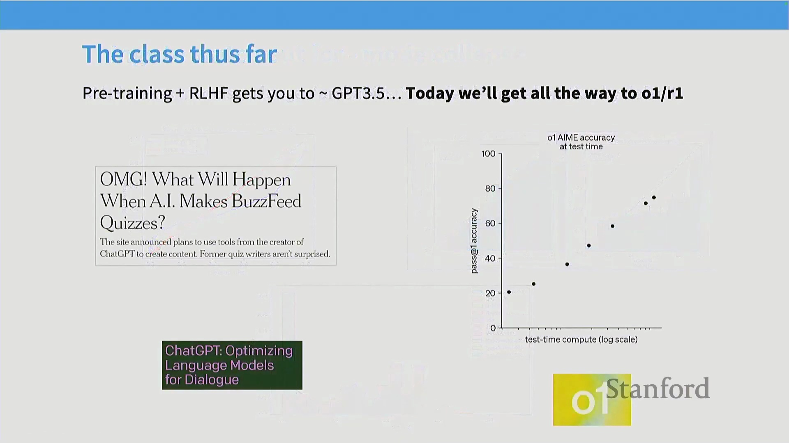

---

## 澄清过度优化指标与训练-测试差距
这意味着，在强化学习(Reinforcement Learning, RL)代理奖励上的成功，并不等同于在实际目标任务上的成功。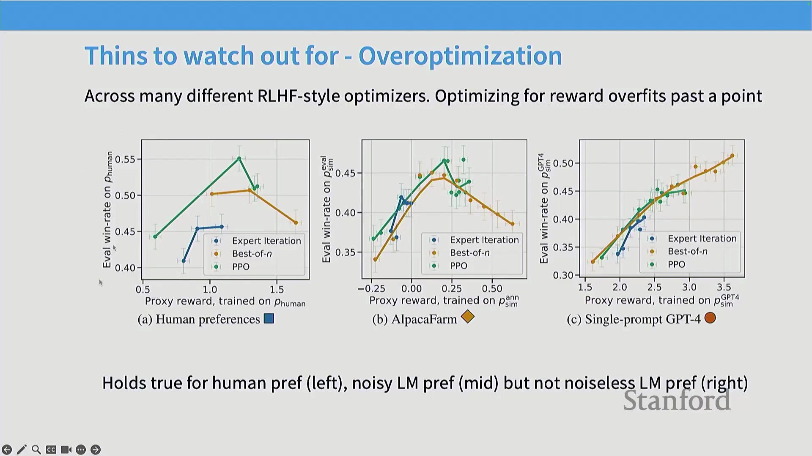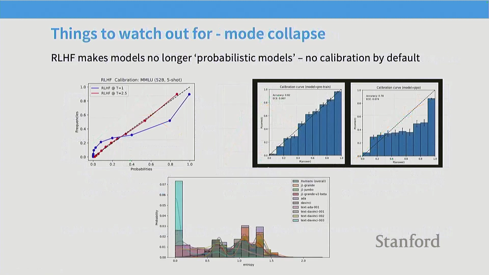 事实并非如此，模型最终会在某一点发生过拟合(Overfitting)，至少在使用人类偏好数据时如此。因此，设定明确且可泛化的优化目标至关重要。

有人可能会针对公式推导提问：为何在对数空间中不直接采用差值形式？这并非原则性错误，而更多是出于表达简洁性与数学直观性的考量。你是想问为何不将对数内的分数项提取出来吗？抑或是出于计算效率的考虑？实际上，比值形式并无不妥。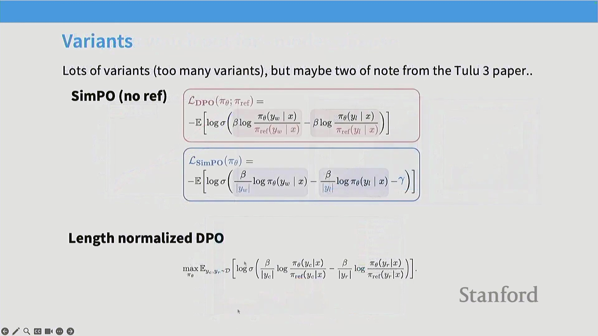 采用比值形式主要是为了表达的紧凑性与数学对象的直观性。尽管经过代数变换可化为其他等价形式，且底层数据相同，但不同推导路径背后的优化动机截然不同。此处并非简单的比值运算，而是构建了一个本质不同的数学对象。

图表实际上展示了真实奖励分数(Real Reward Score)的测量方式。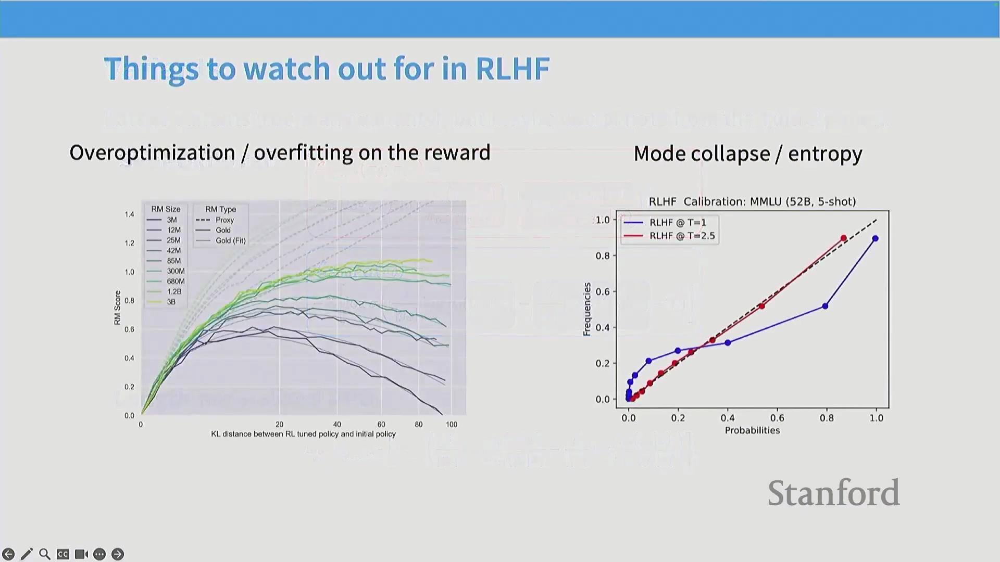 这通常基于我们已知为真的模型表现进行奖励评估。但这本质上反映了训练-测试差距(Train-Test Gap)。图中 X 轴代表训练集，我们在其上拟合奖励模型(Reward Model)并进行评估；而 Y 轴代表来自真实奖励或预言机(Oracle)的新样本。尽管两者在期望意义(Expectation)下度量的是同一目标，但在有限样本(Finite Samples)下却存在差异。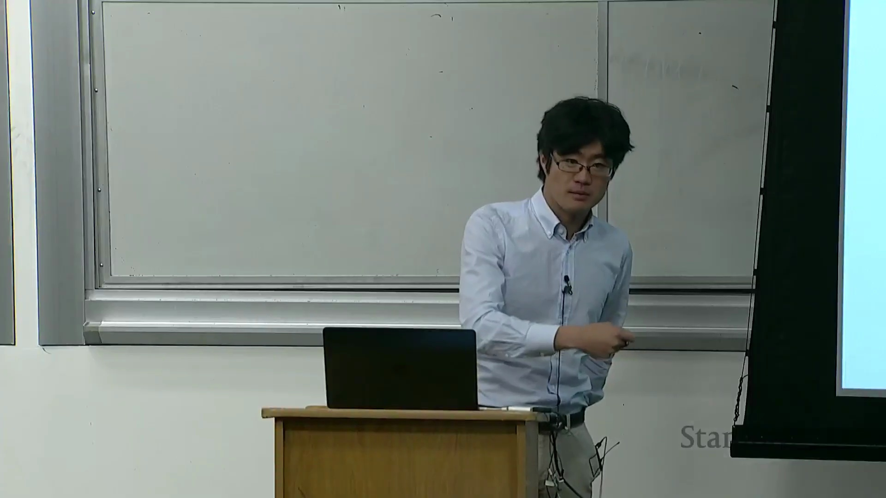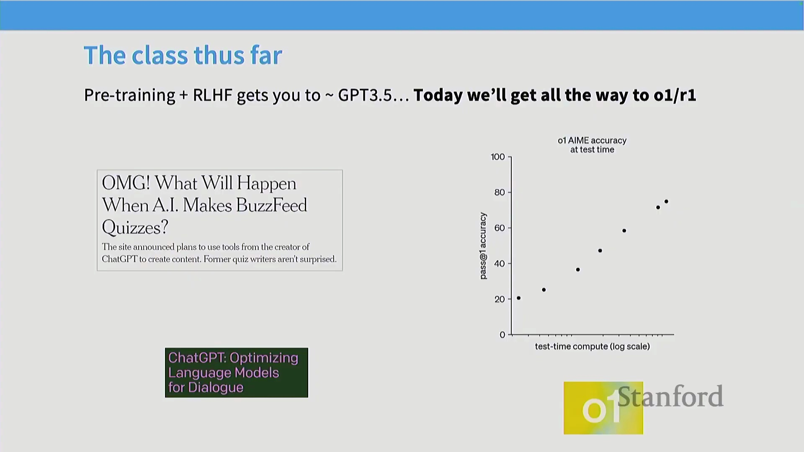 这与传统机器学习中的训练-测试差距概念完全一致：理论上期望相同，但有限样本下的实际测量值必然存在统计偏差。

## 从人类反馈转向可验证奖励
上述讨论主要围绕基于人类反馈的强化学习(RLHF)展开，并引出一个核心观点：人类反馈不仅优化难度高，且难以大规模扩展。因此，我们不禁思考：是否存在更高效的强化学习方法可用于后训练(Post-training)？这将自然过渡到当前的研究前沿。

此前我们主要讨论的是 ChatGPT-3.5 时代的模型，而现在，我们将目光转向 o1 及新一代推理模型(Reasoning Models)。我们的实现路径如下：我们已掌握一套强大的强化学习工具。最初的本能思路是，优化目标应唯一且直接，即“人类是否偏好该响应”。若能直接优化这一真实目标固然理想，但实践表明这极其困难：人类偏好极易被模型“欺骗”或触发规则博弈(Hack/Goodhart's Law)，大规模高质量数据收集成本高昂，且大规模强化学习训练难以稳定实施。正因如此，过度优化(Over-optimization)等问题频发。

反观强化学习取得统治性成功的领域（如 AlphaGo 或 AlphaFold），其共同特征是：我们拥有已知且绝对真实的奖励信号，并能以极快速度、高效率进行大规模评估。若能在语言模型中复现这一条件，便可将强化学习的成功经验直接迁移至语言建模(Language Modeling)中。这正是当前的核心研究思路：沿用已成熟的强化学习工具链，但将其应用于具备可验证真实奖励的新场景，从而汲取 RL 领域的成功范式。

## 课程结构与推理模型路线图
今天的讲座将分为两部分。第一部分聚焦于算法层面，我将详细解析近端策略优化(Proximal Policy Optimization, PPO)（因篇幅限制上节课仅作简略介绍），并逐步将其推导为分组相对策略优化(Group Relative Policy Optimization, GRPO)，后者在某种意义上是 PPO 的简化版本。随后，我们将深入剖析 GRPO 的目标函数(Objective Function)及各项实现细节，并由此衍生出 GRPO 的多个经典变体。

第二部分将以案例研究(Case Study)的形式，逐一拆解三项极具代表性的推理模型训练工作。掌握第一部分的理论后，你将具备理解后续所有内容所需的数学与工程基础。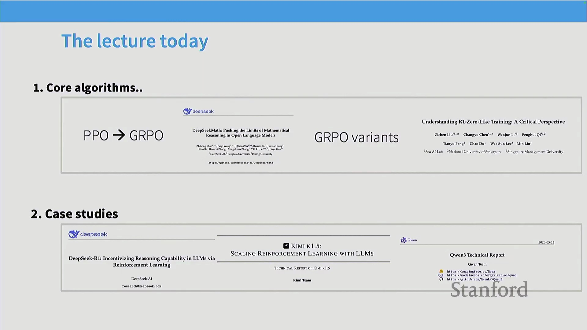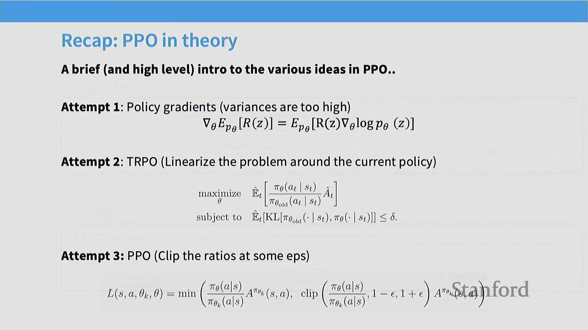 课程结束后，你将清晰理解这三款中国开源大模型(Chinese Open-source Large Language Models)的具体训练流程。

## 从策略梯度到 PPO：理论基础
接下来我们回顾 PPO。尽管我原本计划略过，但为了阐明 GRPO 的设计动机，这是必须铺垫的理论基础。PPO 究竟是什么？为便于理解，我们将从最基础的策略梯度(Policy Gradient)出发，逐步推导至 PPO。

如前所述，我们的目标是优化策略 $P_\theta$ 下的期望奖励(Expected Reward)，并通过梯度下降(Gradient Descent)进行求解。对该目标函数求导，即可得到右侧的策略梯度公式：即当前策略下奖励的期望值。算法会根据奖励的正负符号更新梯度步长，从而提升或降低对应动作的概率。这一过程非常直观，若不熟悉可复习策略梯度的相关推导。然而，该基础方法存在两个效率瓶颈。首先，它是严格的同策略(On-policy)算法：策略梯度生效的前提是，必须从当前策略 $P_\theta$ 中采样，并立即利用这些样本执行单步更新。这意味着每次梯度更新前，都需重新计算奖励并执行一次轨迹生成(Rollout)（这在作业 5 中会有所体现）。而在强化学习中，Rollout 是计算成本最高的环节：必须实际运行语言模型生成样本，速度慢且推理过程复杂。因此，我们希望能降低采样频率：执行一次 Rollout 采样后，基于同一批样本进行多次梯度更新。

这一需求催生了信任区域策略优化(Trust Region Policy Optimization, TRPO)。TRPO 允许更新存在一定“滞后性”：我们从旧策略 $P_{\theta_{\text{old}}}$ 中采样，但仍能计算有效的策略梯度。如何实现？通过引入重要性采样修正(Importance Sampling Correction)。同时，TRPO 通过约束新策略与旧策略的 KL 散度(Kullback-Leibler Divergence)，防止策略更新幅度过大，从而避免奖励估计值出现剧烈震荡。其核心思想非常简洁：仅需进行轻微的异策略(Off-policy)至同策略的修正，即可得到 TRPO 框架。公式中的 $A_t$ 为 REINFORCE 算法的低方差版本（优势估计(Advantage Estimation)细节此处暂不展开）。

PPO 在此基础上迈出了关键一步：它摒弃了复杂的 KL 散度约束，直接对优势函数进行截断(Clipping)。这一设计自然限制了策略的更新幅度——若新旧策略差异过大，优势函数将被截断在 $[1-\epsilon, 1+\epsilon]$ 区间内，导致奖励增益存在上限。因此，算法缺乏动机使新策略与当前策略产生剧烈偏离。换言之，PPO 以一种更柔和(Soft)且易于实现的方式，继承了 TRPO 的核心思想。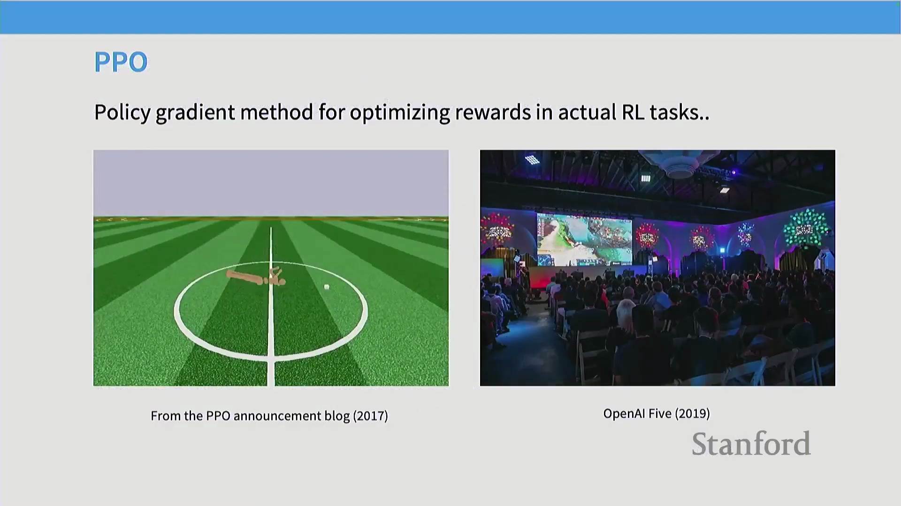

## PPO 的实际复杂性与寻找更简单替代方案的动机
PPO 无疑是强化学习领域最成功的算法之一，广泛应用于各类环境，包括早期的简单 RL 任务及 OpenAI Five（Dota 2 智能体）等复杂实战场景。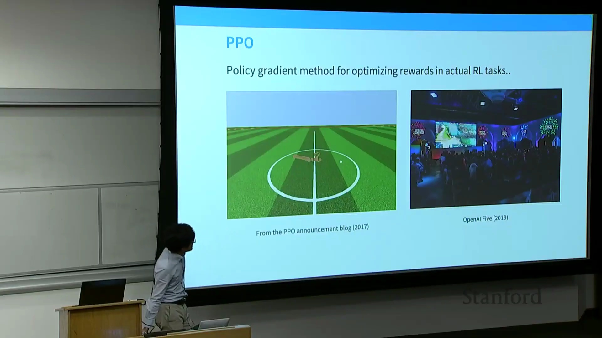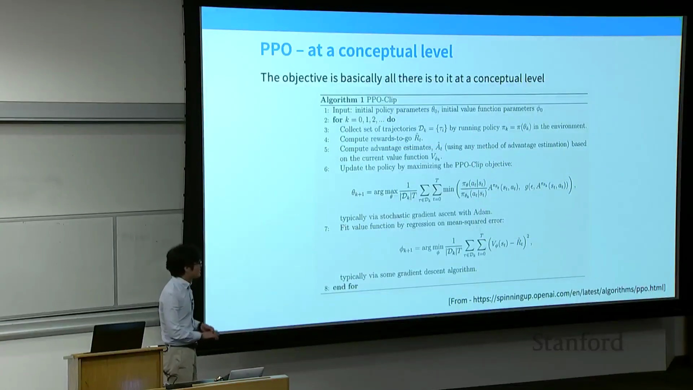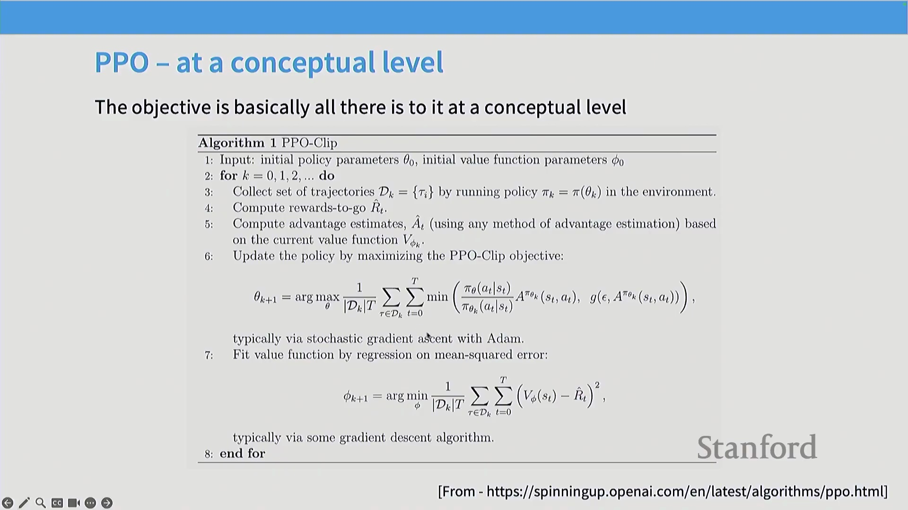 尽管从概念上看 PPO 似乎并不复杂——查阅 OpenAI 官方文档，其核心公式（即截断目标函数 Clipped Objective Function）显得相当简洁。但唯一的复杂性在于：优势函数 $A_t$ 需通过价值函数(Value Function)网络进行估算。这意味着我们需要引入第二个神经网络来拟合期望奖励，其主要作用是降低策略梯度的方差(Variance)。尽管此处不展开所有 RL 理论细节，但“依赖独立价值网络”这一实现差异，将在后文中起到关键作用。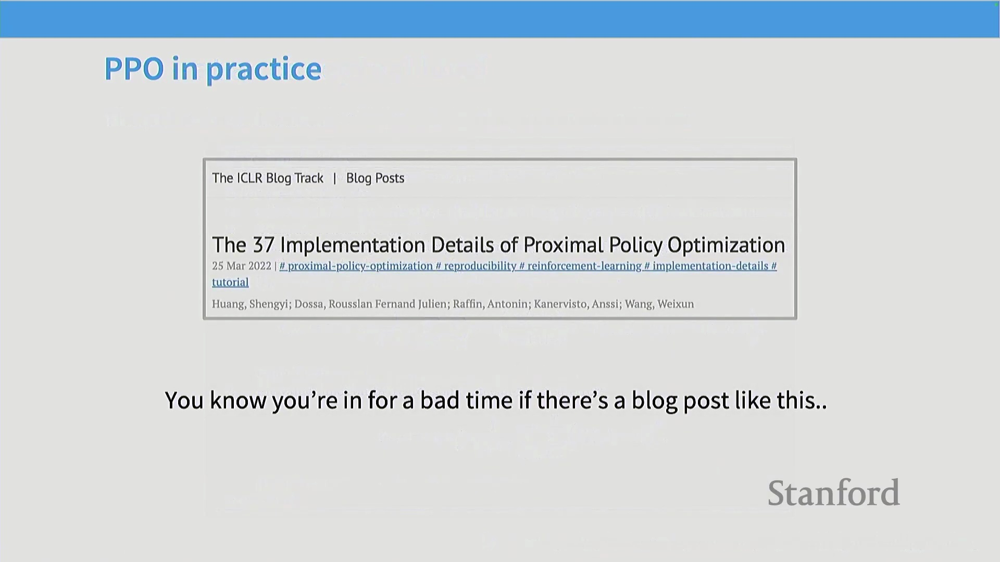

然而，理论上的 PPO 与工程实践中的 PPO 存在巨大鸿沟。若你读过题为《PPO 的 37 个实现细节》(The 37 Implementation Details of Proximal Policy Optimization) 的技术文献，便知其实绝非表面那般简单。该文献不仅罗列了众多 PPO 变体及其在不同 RL 基准测试(Benchmark)上的表现差异，还深入探讨了为何实现细节对 PPO 至关重要：某些看似偏离理论的实现，反而可能意外提升模型性能。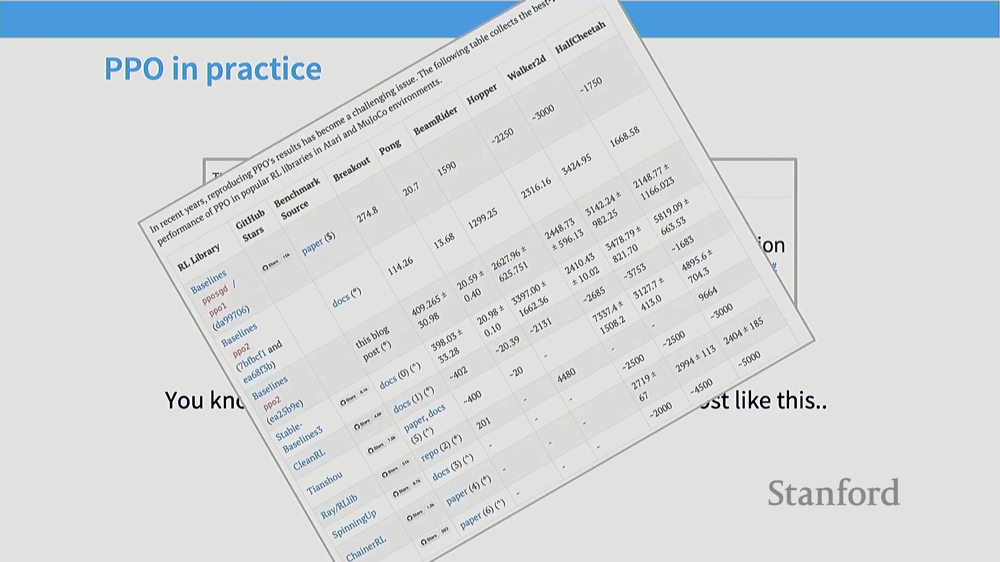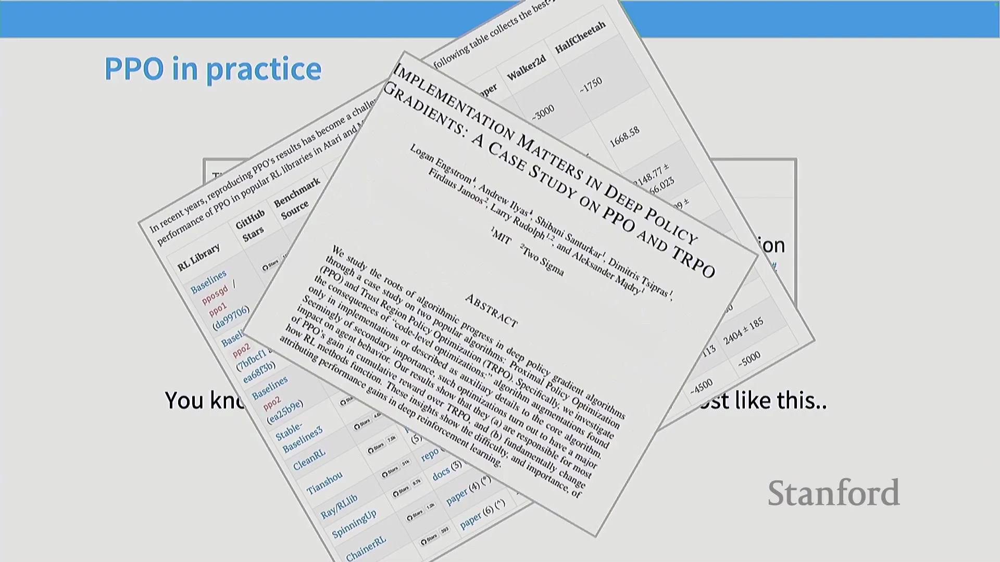

深入审视 PPO 的工程细节，会发现其复杂度确实令人却步。因此，我们有必要审视其真实实现逻辑。由于 PPO 并非本次讲座的核心，我将快速带过。但我想向非后训练领域的听众传达一个关键信息：为何学术界与工业界如此急切地寻找 PPO 的替代方案？正是因为其工程实现的“笨重”与复杂性。以 RLHF 早期的标准 PPO 实现架构图为例（见下图），系统极其错综复杂：不仅需要训练专用的奖励模型(Reward Model)，还需维护价值模型(Value Model)以跟踪期望奖励，并集成广义优势估计(Generalized Advantage Estimation, GAE)模块。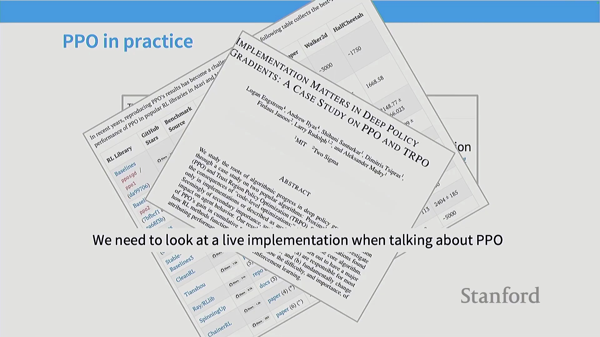

---

## PPO 的实现复杂性
此外，系统还包含广义优势估计(Generalized Advantage Estimation, GAE)模块（我尚未详细展开其原理）。该模块的输出将被馈入策略语言模型(Policy Language Model)，随后执行策略梯度更新。因此，要使近端策略优化(Proximal Policy Optimization, PPO)正常运行，上述所有组件缺一不可。我们将回顾一个数年前的开源实现版本。我曾带领学生重新实现过 PPO 等算法，该代码库也被其他研究者广泛复用。虽然它经过了充分测试，但并非绝对最优。我相信如 OpenRLHF 或火山引擎(Volcano Engine)等更现代的框架可能在工程表现上更佳。此处仅带大家通览其核心组件架构。此外，当大家在作业中实现分组相对策略优化(Group Relative Policy Optimization, GRPO)时，你们的代码结构大概率会借鉴其中的设计模式。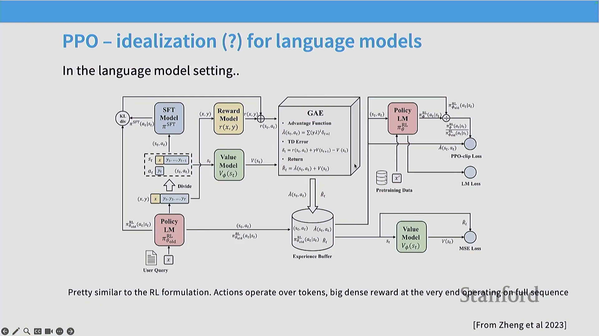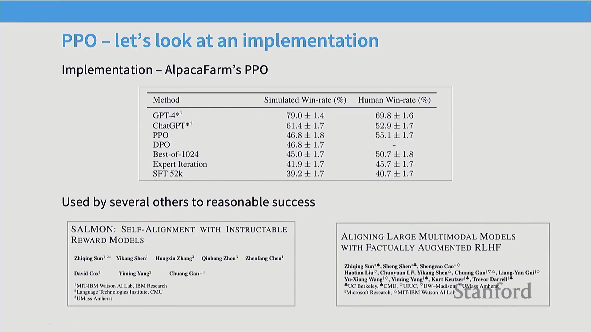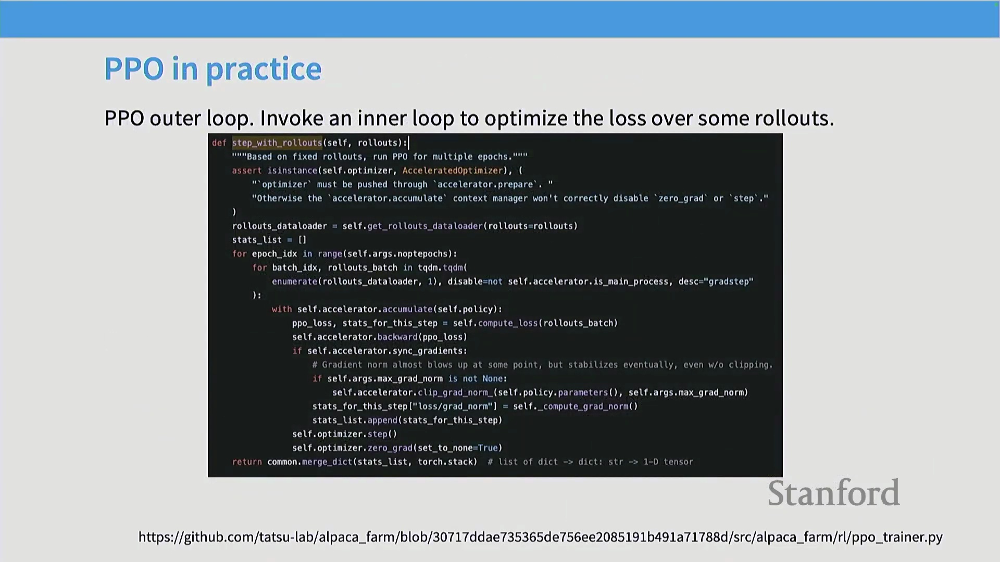

## 外层 RL 循环与损失计算
所有强化学习(Reinforcement Learning, RL)算法共享一个类似的外层循环(Outer Loop)。观察代码可知，PPO 的更新步骤与语言模型的标准梯度更新高度相似。外层循环的核心流程为：首先采集一批轨迹数据(Rollout)；随后基于该批次数据计算损失函数(Loss Function)；最后执行反向传播(Backpropagation)与梯度裁剪(Gradient Clipping)的优化步进。流程非常直观。RL 的外层循环通常较为稳定，损失计算逻辑也与监督学习类似。（注：幻灯片字号较小）但仔细查看会发现，代码中包含专门用于计算价值函数(Value Function)损失的模块。需牢记，PPO 同时维护价值网络与策略网络(Policy Network)，因此必须同步更新两者。价值损失旨在最小化价值预测与实际回报(Return，即观测到的奖励序列)之间的差距。保持两者一致至关重要，因为准确的价值估计能有效降低策略梯度的方差(Variance)。接下来是用于 PPO 策略更新的优势项，以及裁剪超参数 $1-\epsilon$ 和 $1+\epsilon$。代码几乎直接映射了上述理论逻辑。为便于理解，典型的裁剪阈值 $\epsilon$ 通常设为 0.2。这意味着新旧策略的似然比(Likelihood Ratio)被严格限制在 $[0.8, 1.2]$ 区间内浮动。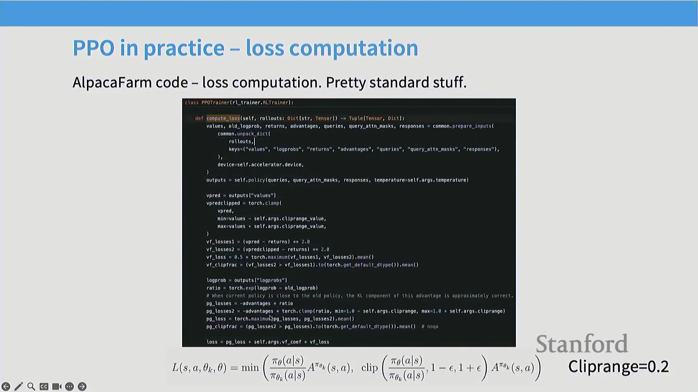

## 奖励塑形与数值稳定性技巧
Rollout 数据收集模块的实现略显复杂，但其本质仍是调用模型的推理(Inference)接口。左侧代码负责从当前策略中采样生成 Rollout 序列，并计算每个生成 Token 的对数概率(Log Probs)；右侧则处理后续逻辑。此处唯一需要注意的细节是：价值模型、奖励模型(Reward Model)与策略模型可能采用不同的分词器(Tokenizer)，因此需要进行分词对齐(Re-tokenization)。除此之外，流程仅是将 Rollout 数据输入各模型进行前向传播。初看代码或许觉得尚可接受，但真正的复杂性始于奖励塑形(Reward Shaping)机制。稍作抽象可知，从强化学习视角看，语言模型的训练具有一个特殊性质：它在技术上近似于上下文多臂老虎机(Contextual Bandit)问题。即给定输入(Prompt)，模型输出一个序列(Action)，随后立即获得奖励。该过程不存在环境状态转移(State Transition)，也无需探索外部动态，结构相对简化。在此背景下，奖励塑形的核心目的是构建逐 Token(Token-level)的奖励信号，从而为 RL 算法提供更平滑的优化梯度。因此，在实际 PPO 及后续的 GRPO 实现中，KL 散度惩罚项(作为正则化项)是按 Token 逐位计算的；而真实的外部奖励信号（如任务是否完成的二值判定），则仅在序列的末尾 Token 处计算一次。换言之，正则化提供细粒度的逐 Token 监督，而最终仅存在一个稀疏的终端奖励(Terminal Reward)。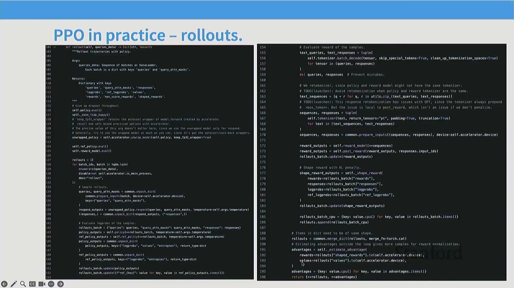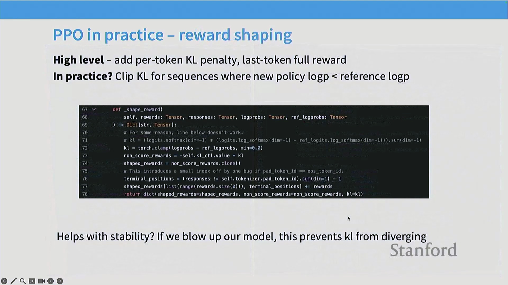 

实践中，我们通常仅引入逐 Token 的 KL 惩罚项，这属于 PPO 工程实现中颇具“特色”的细节之一。代码第二行执行了 KL 散度的真实计算。然而，当对数似然比差值为负时，直接计算会导致数值不稳定(Numerical Instability)，且该情况在实际训练中极为常见。因此，工程上通常会使用 `clamp` 操作将其下限截断为 0。众所周知，将对数似然比在 0 处截断后，其数学形式已不再是严格的 KL 散度，但作为一种鲁棒的近似处理，它在实践中表现良好。

## 广义优势估计与为何我们需要替代方案
接下来简要回顾奖励相关的更新步骤。有同学问它是否与其他部分相同？问得很好。如外层循环所述，更新操作本质上就是执行梯度步进(Gradient Step)。在代码层面，它与常规梯度更新并无二致。但其内在机制需回归至策略梯度公式：目标形式近似为 $r(z) \times p_\theta(z)$，或等价于对加权对数似然 $r(z) \log p_\theta(z)$ 关于参数 $\theta$ 求导。技术上关键在于：若严格求导，还需对概率分布 $p_\theta$ 求偏导，但 RL 中通常不这么做。此处隐含了停止梯度(Stop-Gradient)操作。因此，只需计算该内部损失项，并将其传入自动微分引擎(Autograd)，即可获得正确的策略梯度更新方向。作业中也将采用此实现。我们为这部分原理准备了补充教程，以备查阅。

最后，我认为最复杂的模块是尚未详细展开的广义优势估计(GAE)。在策略梯度算法中，原始梯度的方差通常极高，因此必须进行方差缩减。理论证明，不直接将梯度与原始奖励相乘，而是使用折扣优势函数(Discounted Advantage Function) $A_t$ 作为替代，是更优的选择。PPO 的核心改进之一便是引入此类优势估计，通过调节超参数 $\lambda$ 和 $\gamma$，可在梯度的偏差(Bias)与方差之间取得平衡。然而有趣的是，尽管维护独立价值网络与计算 GAE 带来了显著的工程负担，但若直接设置 $\gamma = \lambda = 1$，整个 GAE 模块将退化为最基础的基线策略梯度(Baseline Policy Gradient)。此时，优势函数简化为实际奖励 $R$ 减去价值基线 $V$。经验表明，这种简化版同样有效。

梳理这些流程的目的是说明：PPO 的核心逻辑其实并不复杂，本质上仍是标准的 RL 外层循环与梯度计算；但其工程细节确实繁琐，需妥善处理截断(Clipping)、GAE 计算以及价值网络训练等模块。在训练过程中，你应观察到总体奖励（含奖励模型输出）稳步上升，而负 KL 惩罚项逐渐下降。再次强调，由于语言模型生成属于上下文老虎机问题，其训练曲线应呈现平滑合理的收敛趋势，而非传统 RL 环境中常见的剧烈震荡。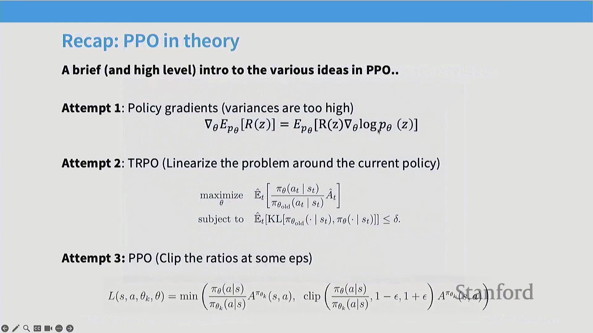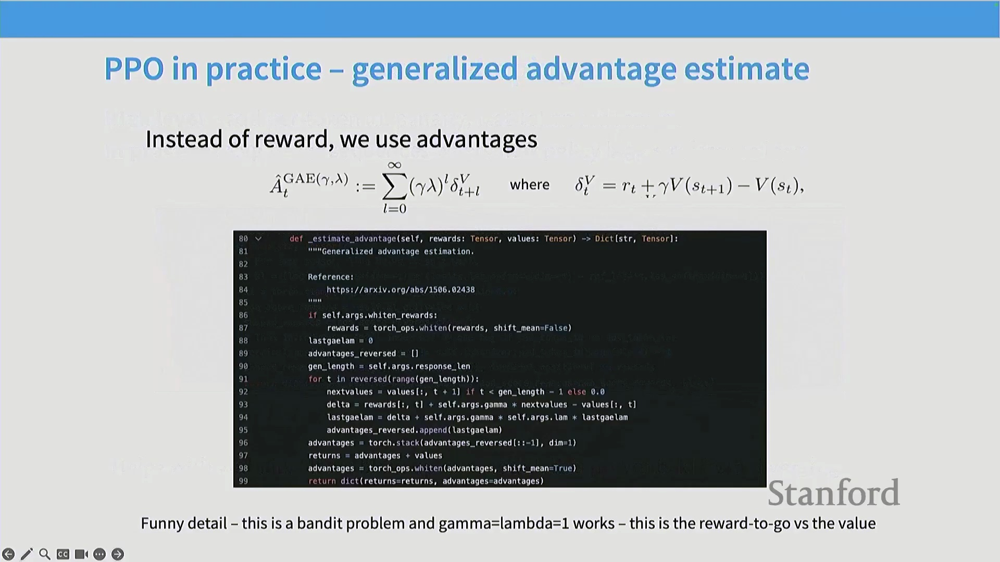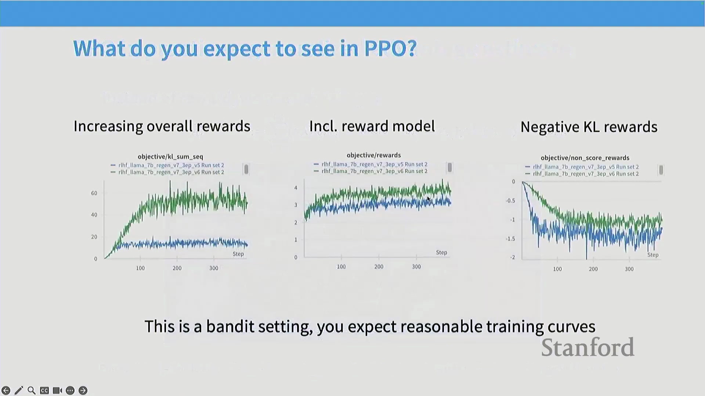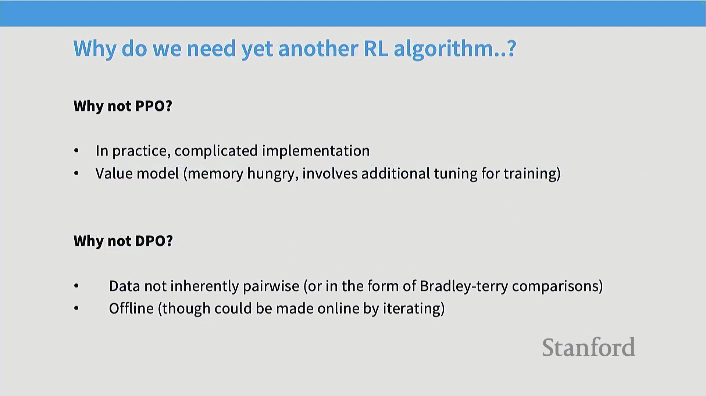 

至此，我们完成了对 PPO 的概览。这是一次快速导览，但我希望达成两个目标：其一，明确 PPO 的核心机制；其二，认识到其工程实现的复杂性。正是这种复杂性，促使学界积极寻找 PPO 的替代方案。我们的目标是将强化学习算法应用于具备明确奖励信号的任务中——PPO 在此类通用 RL 场景中固然表现优异，但我们渴望更简洁的实现架构。更为关键的是，我们希望摆脱对独立价值模型(Value Model)的依赖。任何实际部署过 PPO 的研究者都会体会到维护价值网络的繁琐：该网络规模通常与策略模型相当，这意味着 GPU 显存(VRAM)开销直接翻倍。

此时你可能会问：为何不直接使用直接偏好优化(Direct Preference Optimization, DPO)？DPO 确实极其适用于基于偏好的成对比较（如 Bradley-Terry 模型(Bradley-Terry Model)）。但若任务目标是进行数学推理强化学习，并通过规则验证答案正确性，DPO 便不再适用，因为此类任务本质上缺乏成对偏好结构。此外，DPO 在原始设定中属于离线(Offline)算法：需预先收集大量偏好数据对，随后仅在该静态数据集上更新模型。虽可通过迭代自生成数据实现在线(Online)微调，但这并非 DPO 的标准用法。

## 引入 GRPO：简化策略优化
基于上述背景，我们自然引出了当前的前沿方法：GRPO。无论从设计动机还是工程实现来看，GRPO 都极为简洁。概念上，GRPO 以 PPO 为起点，保留了相似的架构组件与截断机制，策略更新逻辑也一脉相承。但核心改进在于：彻底移除了复杂的广义优势估计模块，并以一种极其轻量的方案取而代之。

这一替代方案究竟是什么？我们将替换传统的优势函数(Advantage Function)（原为依赖价值网络的 GAE 回报累加形式），改为幻灯片底部的公式 3。其定义非常直观：第 $i$ 个响应的优势值，等于该响应获得的奖励减去同一批采样组(Group)内所有响应的平均奖励。关于“组内采样”的具体定义与计算方式，我将在稍后详细阐述。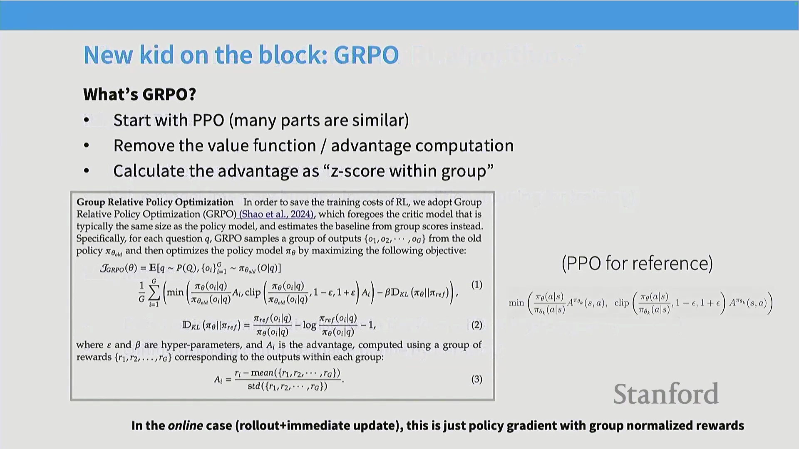

---

## GRPO 的优势计算与组定义
接着除以组内奖励的标准差。因此，这本质上计算的是组内奖励的 Z 分数(Z-score)。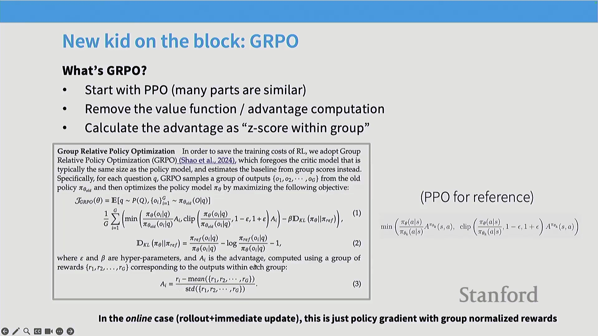 那么，什么是“组”(Group)？在某种意义上，“组”是语言模型强化学习(Reinforcement Learning for Language Models)中一个非常自然的概念。假设你输入一个问题，例如“解答这道数学题”，这便构成一个组。针对该问题，模型会生成多个候选响应(Response)。我们设定每组包含 $G$ 个不同的响应轨迹，它们共同属于同一个组。

这种设计的优势在于：仔细思考便会发现，数学题目的难度本身存在差异。某些题目天然就比其他题目困难得多。正因如此，同一组内其他样本的平均奖励，就构成了一个天然的基线(Baseline)。学术界早已探索过此类算法。若查阅文献中的“留一法策略梯度”(Leave-one-out Policy Gradients)，便会发现这正是留一法基线在实际中的具体应用。

此处的“组”，特指针对同一个提示词(Prompt)或问题生成的多个回答轨迹(Trajectory)。（针对可能的疑问：这是否意味着每个答案仅对应一个新问题，还是在多个相似问题间交叉计算？答案很明确：仅针对完全相同的同一问题生成多个回答轨迹。）这正是实现方差缩减(Variance Reduction)的有效手段。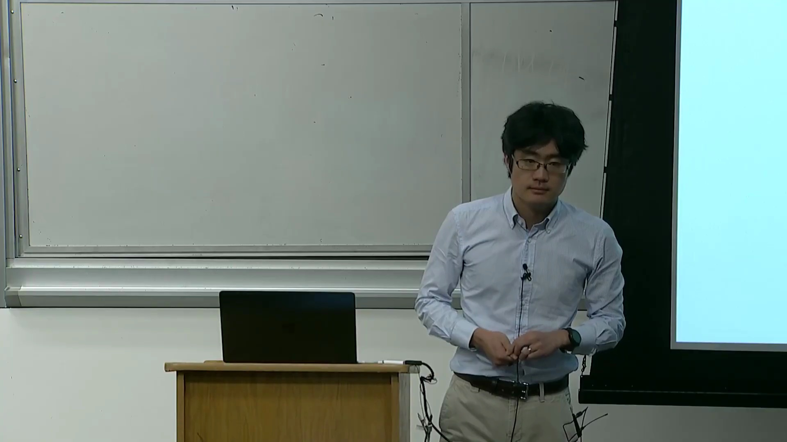 

另外，每个问题的多个答案是否针对每个样本独立计算？并非如此。对于每个具体问题 $Q$，GRPO 会独立采样一组输出。换言之，计算过程不会在批次(Batch)维度上进行跨问题混合。在实际工程中，我们通常并行处理多个问题；针对每个问题独立采样 $G$ 个响应，并仅在该组内部计算基线。不同问题之间，除了共享策略网络(Parameter Sharing)进行统一梯度更新外，基线计算完全隔离，无任何交叉。因此，基线仅在组内（同一问题下）计算。这正是其意义所在：它精准捕捉了单个问题的相对难度，并通过减去均值将其归一化。

还有一点值得注意的有趣细节：公式中的 $d_{KL}$（KL散度(Kullback-Leibler Divergence)）形式略显非标准。通常，KL 散度的蒙特卡洛估计仅需对样本的对数概率比(Log Probability Ratio)求平均（即公式中的核心项）。但 GRPO 的公式额外增加了两项：参考策略(Reference Policy, $\pi_{ref}$) 与当前策略(Current Policy, $\pi_\theta$) 的比率项，以及一个 $-1$ 的偏移项。自行推导可知，若对 $\pi_\theta$ 求期望，这两项会相互抵消。这实际上是一种控制变量(Control Variate)技巧，能有效降低 KL 散度估计的方差。对于需要从有限样本中估计 KL 散度的场景而言，这种数学处理非常精妙，提供了一种更稳健的估计方式。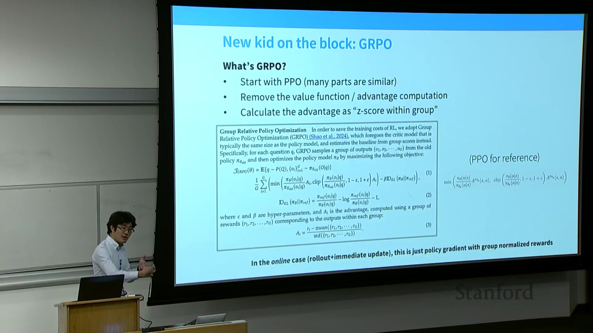

## 实现的简洁性与在线策略梯度
GRPO 的实现确实极其简洁。补充一点：若仅执行单步更新(One-step Update)，即处于纯在线(Online)设定下，所有的截断(Clipping)操作都将自然消失。此时算法退化为纯粹的策略梯度(Policy Gradient)：其核心逻辑仅是提升高奖励样本的权重、降低低奖励样本的权重，而用于加权策略梯度的奖励系数正是优势值 $a_i$。因此，在严格的在线设定下（即不基于同一批 Rollout 进行多轮迭代更新），GRPO 简化为一个极为轻量的算法。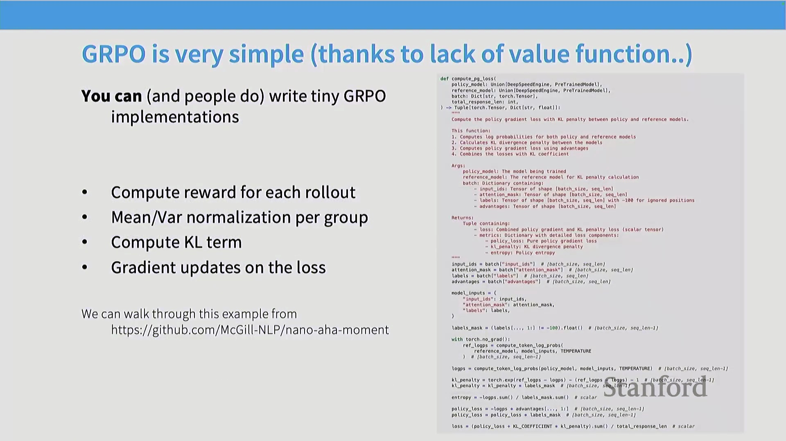 

目前已有多个开源代码库实现了 GRPO（幻灯片中列出了推荐仓库）。其核心逻辑与理论推导完全一致：在外层循环中，首先计算每次轨迹采样(Rollout)的奖励；接着针对每个组(Group)计算奖励的均值与标准差，并进行归一化(Normalization)；随后计算 KL 惩罚项（此处按序列/逐 Token 计算，在更严谨的重型实现中可能采用其他近似方式）；最后执行损失函数的梯度更新。代码示例中也展示了这一流程。与 PPO 相比，GRPO 的优势(Advantage)计算异常简单，几乎与前述公式逐行对应。唯一未显式写出的工程细节是：由于公式中除以了标准差，为防止除零错误，必须添加一个极小的平滑因子(Epsilon, 如 $1 \times 10^{-4}$)以确保数值稳定性。这也是大家在完成作业时必须实现的细节：在 GRPO 的分母中加入微小的 $\epsilon$。

## 实证表现与 DeepSeek-Math 结果
那么，GRPO 的实际效果如何？表现相当优异。该图源自 DeepSeek-Math 的原始论文（后续结合 DeepSeek-R1 的结果回顾此图将更具启发性）。图中对比了两种基于微调的方法：拒绝采样微调(Rejection Sampling Fine-Tuning, RFT) 与在线 RFT(Online RFT)。RFT 本质上是一种较弱的基线(Baseline)策略：仅筛选那些恰好输出正确答案的样本。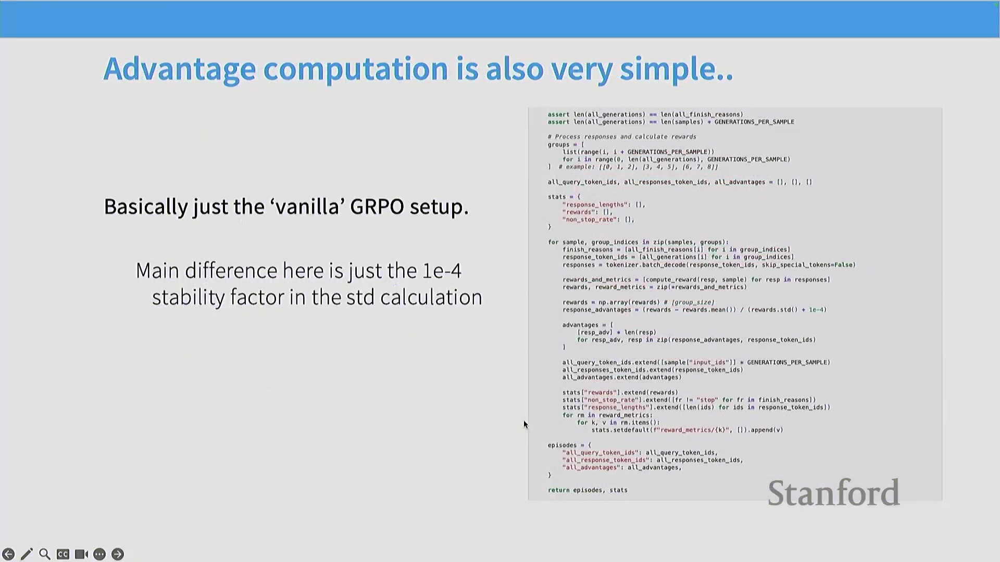 

在该数学任务中，仅收集生成正确答案的样本，并基于这些高质量输出进行监督微调，以强化模型的正确行为。黄色曲线代表采用结果级奖励(Outcome-level Reward)的 GRPO，模型仅接收“正确”或“错误”的二值反馈。蓝色曲线则对应过程级奖励(Process-level Reward)，即引入外部验证系统对推理链的每一步进行打分。研究指出过程级奖励可能更具优势，我们将在后文详细探讨。但无论如何，图表清晰表明 GRPO 不仅有效，且性能提升显著。在深入剖析 GRPO 的算法细节与内在机制前，关于其基础部分是否还有疑问？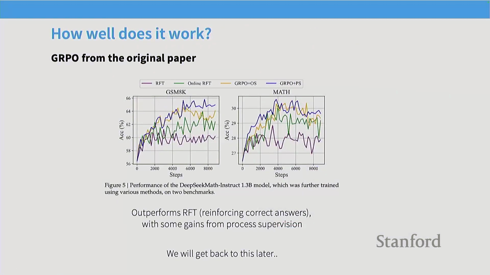

## 理论批判：对策略梯度定理的偏离
接下来，我们深入探讨 GRPO 与 PPO 的核心差异及所做的关键改动。如前所述，两者仅存在一个根本性区别（但影响深远）：GRPO 使用组内相对奖励（即 Z 分数）替换了传统的优势估计器(Advantage Estimator)。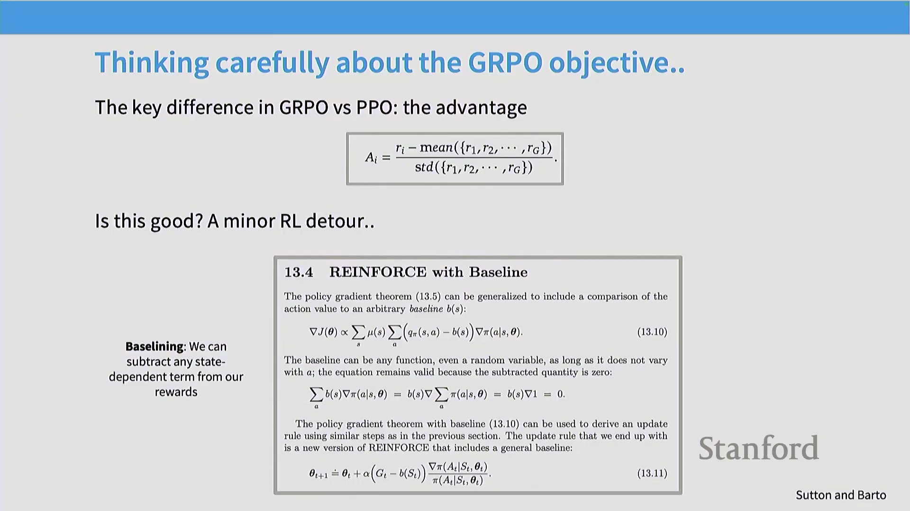 

让我们回归强化学习的基石：策略梯度定理(Policy Gradient Theorem)。回顾该定理，在策略梯度更新中，我们究竟能做什么？翻回前几页幻灯片，顶部展示的正是最基础的策略梯度公式：计算策略对数概率(Log Probability)的梯度，并与奖励相乘。这是数学上严格成立的等价操作。

在此基础上，我们还可引入基线(Baseline)技巧。对于奖励 $z$，我们可以减去任意常数，或任何不依赖于动作 $z$ 本身的随机变量，所得结果依然是无偏的策略梯度。基线之所以关键，正是因为它能在不引入偏差(Bias)的前提下，有效降低期望的方差。正如 Sutton 和 Barto 经典教材所述：策略梯度允许减去任意状态相关的基线 $B(s)$，因为 $B(s)$ 在策略分布下的期望梯度为零。这一操作在数学上完全严谨。

然而，审视 GRPO 中的优势值 $a_i$：它是否符合基线的定义？减去组内均值确实可视为一种基线，因为其他样本的奖励理论上不直接依赖于当前样本 $r_i$。但问题在于：公式中还除以了标准差。根据 Sutton 和 Barto 的理论推导，除以标准差的操作破坏了基线的无偏性假设，这最终被证明会引发理论上的偏差。

部分对 GRPO 进行严格理论重审的研究者指出，该算法至少存在两处数学偏差。其一正是除以标准差的操作。如前所述，这违背了“基线应为与当前采样无关的零均值变量”这一核心原则。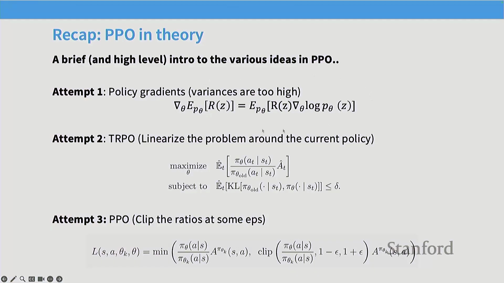 

GRPO 的另一处改动（前文略过）是：实际上对奖励进行了输出长度归一化(Length Normalization)（即除以响应长度）。从策略梯度定理的角度看，这同样缺乏理论支撑，在标准推导中并不会自然出现。因此，相关研究者建议直接移除这两项非标准操作（除以标准差与长度归一化）。实验表明，修正后的算法不仅能生成更精炼的短文本，还能获得更高的奖励，避免了模型无意义地生成长响应。接下来，我们将逐一剖析这两项修正的理论依据与实际效果。希望通过此番探讨，大家能对强化学习算法的内在机制建立更深刻的直觉。

首先探讨标准差的作用。其物理意义相对直观：（结合高亮公式讲解）将优势值除以标准差意味着什么？当组内奖励的标准差较小时，优势值的幅度会被显著放大。标准差越小，模型对该组的优化权重就越大。那么，在何种情况下标准差会偏小呢？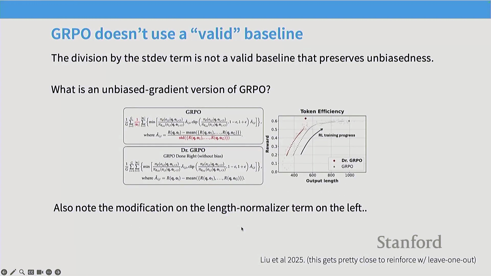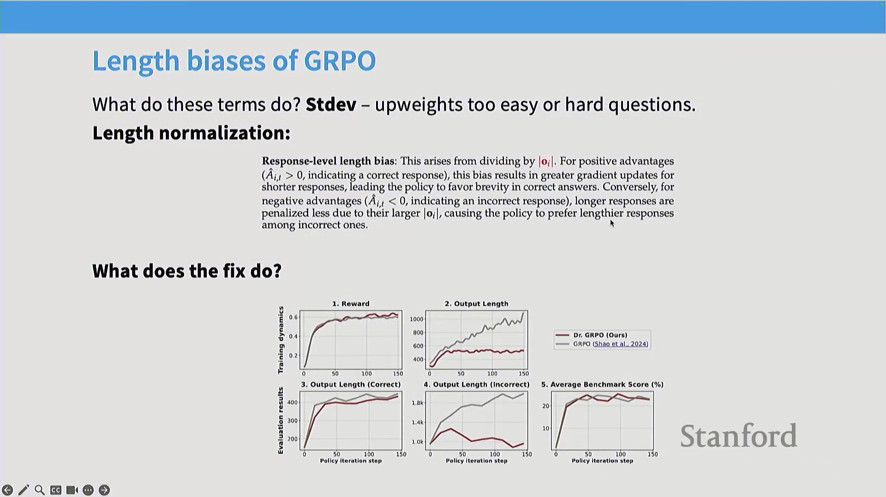

---

## GRPO 标准差与长度归一化的批判
那么，标准差何时会偏小呢？通常发生在题目过于简单或过于困难时。此时模型生成的奖励往往全为 0 或全为 1。因此，除以标准差(Standard Deviation)这一操作会引入系统性偏差(Systematic Bias)，导致模型在训练时过度关注那些极易或极难的问题。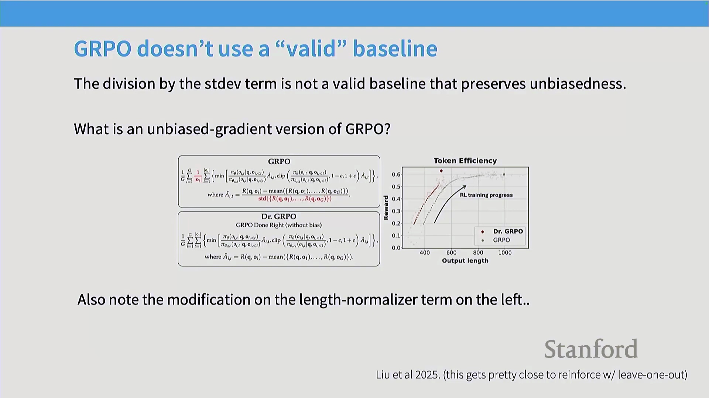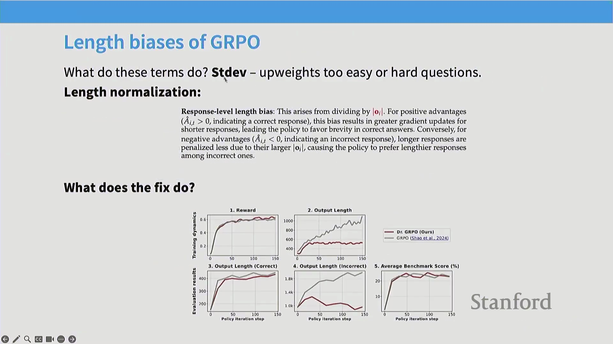 作者认为这会拖慢收敛速度(Convergence Speed)。事实或许如此？但至少，它确实破坏了策略梯度(Policy Gradient)的数学无偏性。

第二处改动更为微妙但同样关键：长度归一化(Length Normalization)。在计算 GRPO 奖励前，算法对奖励进行了长度除法操作。这会引发什么后果？若模型答错题目，它将获得负奖励。此时，为稀释单位长度的负奖励，模型的最优策略会变为尽可能拉长回复。反之，若模型答对，最优策略则是尽可能缩短答案以最大化正奖励密度。这种机制实际上会催生出行为极端化的模型：一旦模型预判自己可能答错，就会盲目生成冗长文本。这对模型而言是极差的激励信号(Incentive Signal)。若修正此问题，在 GSM8K 等基准测试(Benchmark)上会发生什么？模型仍能获得同等优异的奖励表现（图中红色曲线近似修正后的结果），但输出长度将不再无限膨胀，而是在某一点趋于稳定。由此引出一个重要观察：我们在 GRPO 等模型中观察到的超长思维链(Chain of Thought, CoT)，或许正是特定工程实现细节与设计选择的产物，而非模型性能提升的本质必要条件。这是一个颇具启发性（尽管尚待完全验证）的假设。

## 课程效应与推理模型简介
至此，GRPO 算法的核心内容已讲解完毕。相信大家已具备足够的理论背景去研读 DeepSeek-R1、Kimi k1.5 与 Q1.3 等前沿论文。是否有疑问？（听众提问）关于刚才的提问，是为了确认基础理解是否正确？实际上，核心原因并非模型“觉得题目太容易”，而是我们根本不希望模型采取过于激进或投机的优化策略。这涉及强化学习中一些尚未完全形式化的“无名氏定理”(Folk Theorem)领域，但相关论文确实会探讨此类经验法则(Heuristic)。我想强调的是：RL 算法最适宜处理的是模型“表现尚可但仍有提升空间”的问题（即有一定正确率，但非绝对掌握）。若题目过简，模型本就能轻易全对；若过难，则无法学习。这里存在明显的“课程效应”(Curriculum Effect)，我们期望为模型提供难度适中的样本。若盲目最大化标准差，优化方向将彻底偏离：算法反而会聚焦于那些“非全对即全错”的极端样本分布。

接下来，我们将深入探讨这三篇代表性论文：R1、Kimi k1.5 与 Q1.3。R1 与 k1.5 尤为有趣，因为两者几乎同期发布。遗憾的是，仅有 R1 引发了广泛的社会关注与讨论。实际上，这两项工作均展示了如何在大语言模型(Large Language Model, LLM)上应用基于强化学习的推理能力训练，涵盖数学及其他复杂领域。作为同期成果，它们展现了求解同一类问题的两条平行技术路径，对比其设计异同极具学术价值。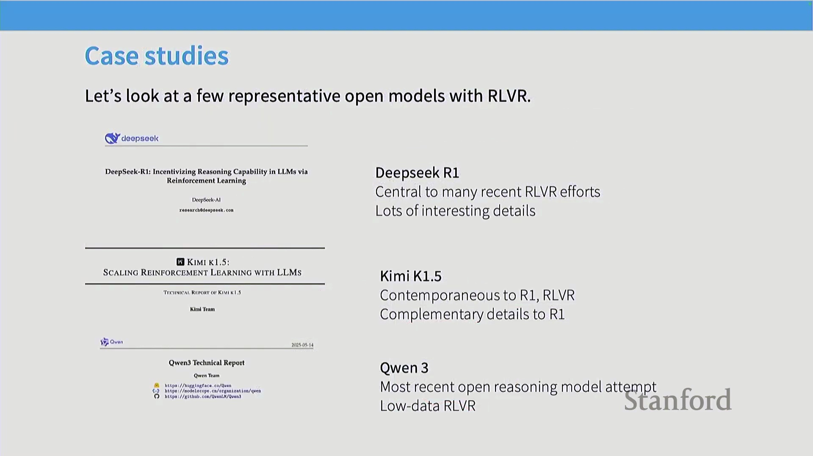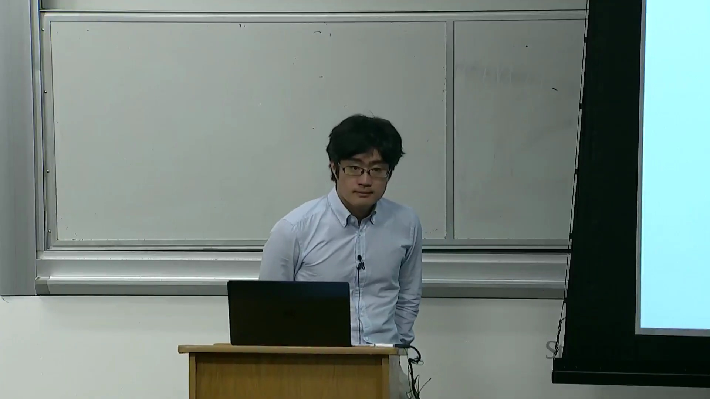 而 Q1.3 作为最新发布的工作，对 R1 的核心思想进行了有趣的变体与拓展。此外，它引入了若干 R1 未采用的新技巧，这些内容极具参考价值，尤其对于关注推理模型计算效率(Reasoning Efficiency)的研究者而言。

## DeepSeek R1-Zero：受控 RL 与涌现行为迷思
让我们从 R1 开始。R1 的发布堪称现象级：一篇发表于 arXiv 的学术论文，竟引发了跨越学术界与工业界的广泛热潮。这生动地印证了一句话：永远不要低估一篇预印本论文的潜在影响力。该论文发布后，甚至间接导致英伟达(NVIDIA)市值单日蒸发近 500 亿美元。或许未来技术社区也能产生类似的破圈效应。R1 的非凡之处在于，它以极其简洁的技术路线，在多项关键指标上复现了 OpenAI o1 的定性特征(Qualitative Characteristics)。接下来，我将重点剖析其核心贡献，请大家务必理解以下几点：首先，它在数学推理等任务上达到了与 OpenAI o1 比肩的性能水准，这在当时推理模型(Reasoning Models)备受追捧的背景下尤为振奋人心。其次，它提出了一套极简的强化学习训练范式。它并非简单的工程复现，其核心突破在于“化繁为简”：无需引入树搜索(Tree Search)或复杂的过程奖励模型(Process Reward Model, PRM)。此前业界普遍认为，构建推理模型必须依赖这些重型组件，但 R1 有力证明了事实并非如此。最后，该论文深入揭示了监督微调(Supervised Fine-Tuning, SFT)与强化学习(RL)之间的协同交互机制，提供了诸多极具指导意义的实证洞察。

R1 的技术根基可追溯至 DeepSeek-Math。实际上，前文展示的 GRPO 公式便源自该工作。DeepSeek-Math 最初提出 GRPO，旨在作为近端策略优化(PPO)的一种更轻量、系统开销更低的替代方案。对研发团队而言，最直接的工程收益是移除了价值模型(Value Model)，极大降低了维护成本。但更具启发性的是，他们在 DeepSeek-Math 中实际选择了黄色曲线所代表的“结果级监督”(Outcome-level Supervision)路径，尽管该方案在当时并非性能最优的模型。我将在本节末尾详细探讨这一选择背后的深意。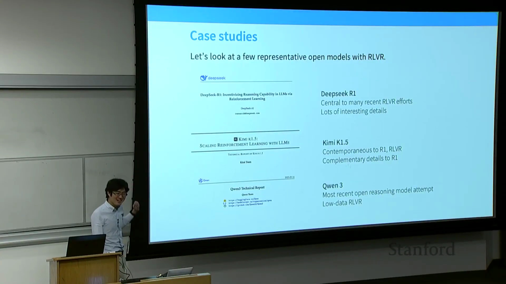 接下来，我将逐步拆解 R1 的架构组件。首先从 R1-Zero 开始，我将其视为一项严格的受控实验(Controlled Experiment)。R1-Zero 采用了一种极为纯粹的强化学习范式：直接选取已完成预训练(Pre-training)与中期训练(Mid-training)，但未经过任何指令微调(Instruction Tuning)或基于人类反馈的强化学习(RLHF)的基座模型，直接将其投入数学强化学习循环中。其目的在于观察纯 RL 训练能激发出何种能力。具体实施细节如下：训练数据涵盖一批未公开的数学任务集；基座模型采用 DeepSeek-V3。奖励机制(Reward Mechanism)由两部分构成：其一是准确率奖励(Accuracy Reward)，即验证数学答案的正确性，输出为二值信号(0/1)；其二是格式奖励(Format Reward)，强制模型将推理过程包裹在特定的 XML 标签内（如 `<thinking>` 与 `</thinking>`）。若希望模型稳定输出长程思维链，此设计至关重要。初看之下，格式奖励似乎微不足道。但综合多项研究与一线工程师反馈，这恰恰是打通推理强化学习训练链路的关键开关。一旦配置妥当，其训练流程便回归本质：仅在基座模型上执行纯粹的 RL 优化，无其他冗余设计。然而效果却令人震撼：仅凭基础的 RL 训练，模型便逼近了 OpenAI o1 的性能水准，且全程未引入任何思维链微调(Chain-of-Thought Fine-Tuning)。

论文中记载了关于 R1-Zero 的两项关键观察，值得我们深入剖析以理解其内在机制。首先，研究指出：若仅让模型在可验证奖励(Verifiable Rewards)下进行 RL 训练，思维链长度会呈现高度可预测的增长趋势。论文作者对此的解读是：“模型正在通过‘更努力地思考’来攻克更难的题目。”对此我持保留态度。其次，论文强调了模型自发学会“回溯”(Backtracking)等行为的趣味性，并将其浪漫化为“顿悟时刻”(Aha Moment)。公众舆论对此过度解读，惊叹于 RL 训练能激发模型的涌现式洞察力(Emergent Insight)。然而，回顾前文提及的 GRPO 修正研究，其作者提供了严谨且反直觉的论证，表明这些现象并非神秘的“智能涌现”。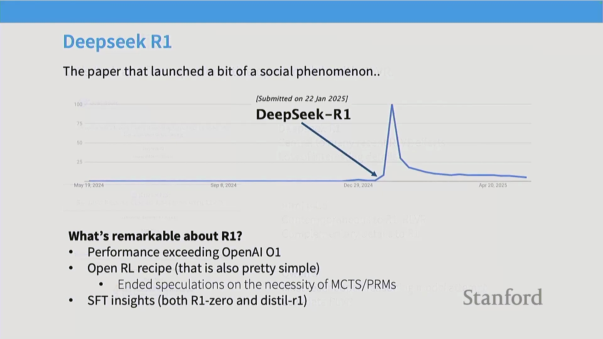 首先，思维链变长很可能仅是目标函数(Objective Function)偏差导致的副产品，而非模型内在推理能力跃升的标志。其次，即使不经 RL 训练，仅让 DeepSeek-V3 基座模型处理大量数学题，它偶尔也会输出类似“等等，我可以这样解……”的自我修正文本。这或许只是语言模型固有的模式匹配行为，而非 RL 催生的全新认知机制。结合近期多项实证研究，上述质疑颇具合理性：R1-Zero 的表现或许并非源于神秘的“涌现能力”，而是优化目标与训练动力学共同作用的结果。但这丝毫不减其工程价值——它确实是一个表现卓越的数学推理模型。

## 从研究到生产：完整的 R1 训练流水线
因此，R1-Zero 更应被视为一项探索性的研究设置(Research Setup)。研发团队在严格受控的环境下，对基座模型施加纯数学 RL 训练，最终产出了一款专用模型。然而，若要打造一款真正强大、可面向通用场景部署的工业级模型，仅靠 R1-Zero 的路径是远远不够的。在实际的全流程训练(Production Pipeline)中，策略会更为灵活：首先，引入额外的监督微调阶段。团队会利用未公开的高质量思维链数据，在 RL 训练前对 DeepSeek 模型进行预热。其次，为避免模型在强化数学能力的同时丧失通用对话或代码能力，必须在 RL 之后接入常规的后训练流水线(Post-training Pipeline)，以确保模型保留处理多领域通用任务的能力。这正是 R1-Zero 与完整 R1 版本的核心差异。无论是在数据流水线还是 RL 训练内部，最关键的改进在于引入了 SFT 初始化(SFT Initialization)，旨在为模型奠定……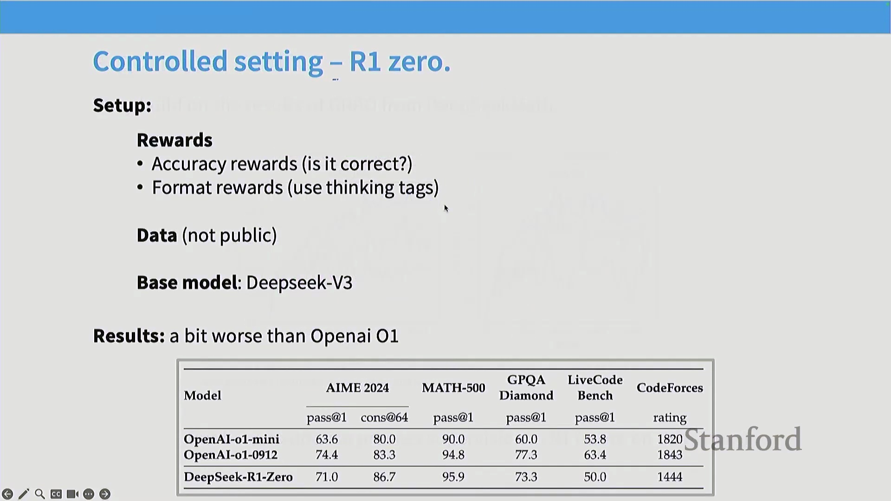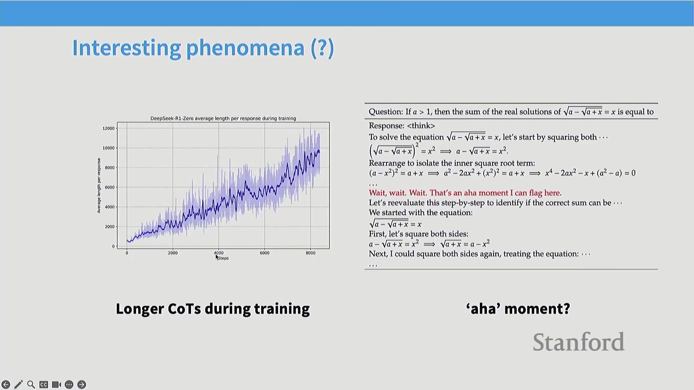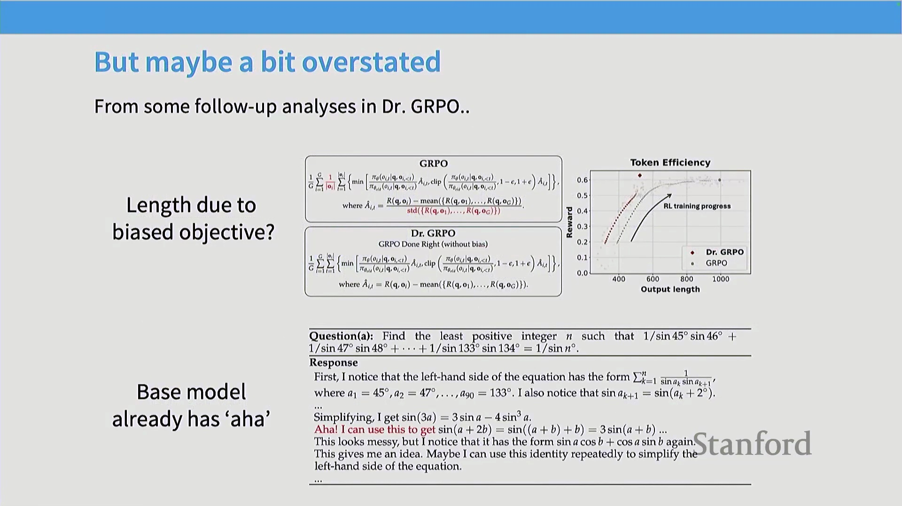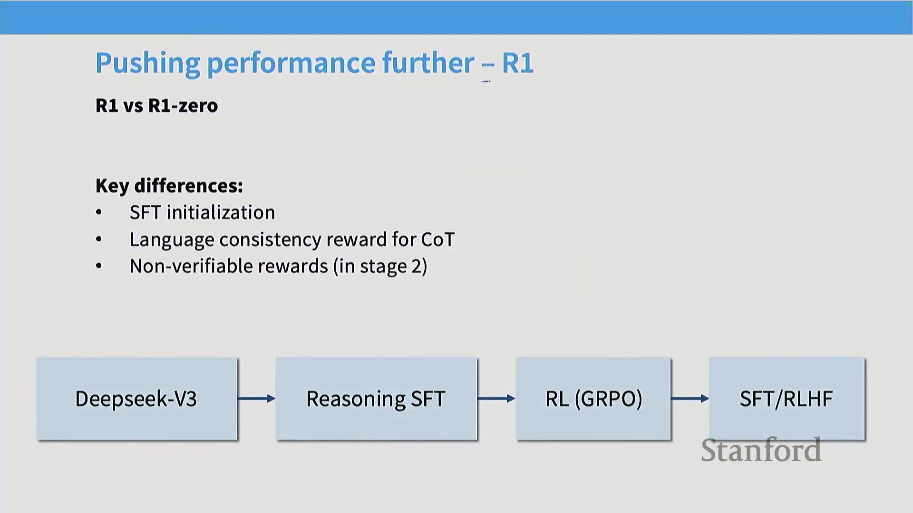

---

## R1 中的 SFT 初始化与语言一致性
在强化学习(Reinforcement Learning, RL)阶段启动前，团队首先进行了监督微调初始化(Supervised Fine-Tuning, SFT Initialization)，旨在使模型在接触 RL 前即掌握生成长思维链(Long Chain of Thought, Long CoT)的能力。同时，他们引入了语言一致性奖励(Language Consistency Reward)，以确保生成的思维链始终保持单一语言。最终在训练流水线的末尾执行第二轮基于人类反馈的强化学习(Reinforcement Learning from Human Feedback, RLHF)。这一设计逻辑非常合理：通常，在执行强化学习等高级优化任务前，预先进行少量监督微调是必要的先决条件。因此，即便对于 DeepSeek-V3 这类已具备基础推理能力的模型或长 CoT 模型，该策略同样适用。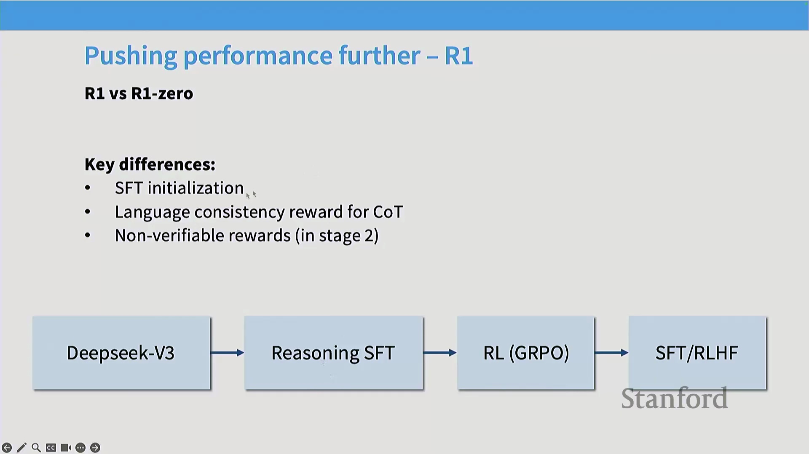 

具体而言，需先使用长 CoT 监督微调数据对模型进行预热，随后再开展 RL 训练。需指出的是，原论文对这些数据的来源与具体构成描述仍较为模糊。文中并未明确说明 CoT 数据的具体来源及过滤标准，仅凭阅读 R1 论文无法获取这些细节。作者指出，使用长篇（例如英文）CoT 数据进行微调能显著提升模型输出的可解释性(Interpretability)。在后续 RL 训练阶段，该初始化能有效防止模型生成无意义的乱码，使其输出更贴近初始阶段所学习的高质量、可解释的推理模式。这对终端用户而言体验更佳，例如在使用数学推理模型时，用户能够实时、清晰地追踪其完整的推理过程。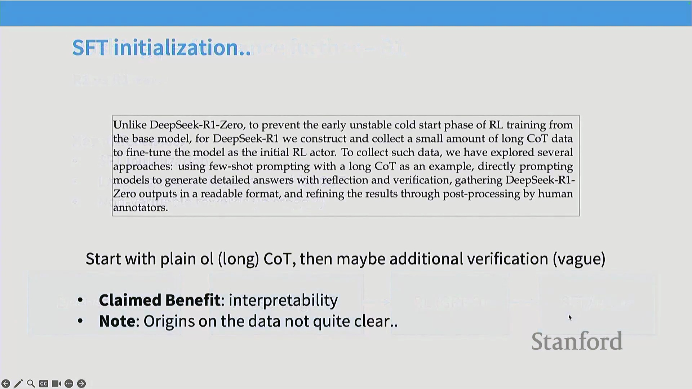 

此外还有一个关键点：尽管论文在 SFT 初始化阶段使用了海量数据，但一个有趣的现象是，对许多模型而言，仅需极少量此类长 CoT 数据进行 SFT 即可取得显著效果。我指导的部分学生与 Percy 合作的一项研究表明，从 Gemini 2.0 Flash Thinking 模型中提取大量长 CoT 数据，并用于微调 Qwen-2.5 模型。结果令人惊讶：仅使用 1000 个样本进行轻量级长 CoT 微调，即可在数学基准测试(Math Benchmark)上实现极高的准确率。综上所述，这两点均指向一个核心事实：基座模型(Base Model)本身已内蕴丰富的“推理”能力，而微调的作用仅在于激活并引导这些潜能的释放。

## 完整的 R1 训练流水线与 RLHF 阶段
完成初始化后，自然进入 RL 训练阶段。在通过 SFT 完成模型预热后，遵循标准的指令微调(Instruction Tuning)与 RLHF 流水线：首先执行 SFT，随后进行 RL，核心目标是驱动模型直接优化预设的奖励信号。此处的 RL 训练流程与 R1-Zero 高度一致，差异甚微。唯一的细微差别在于引入了语言一致性损失(Language Consistency Loss)。作者对此进行了专门说明，我认为这一细节颇具价值。尽管只是一个小细节，但仍值得展开：引入该奖励的原因是，在纯 RL 训练过程中，若不加以约束，模型生成的思维链极易出现语言混合(Language Mixing / Code-Switching)现象，即模型会在不同语言间频繁切换。许多关注推理模型实测的用户可能注意到类似现象，例如网上曾有反馈称：“Grok-3 的思维链突然毫无征兆地切换成了中文。”这与我们描述的现象完全一致：在高强度 RL 训练下，模型会自然产生跨语言混合的倾向，而非主动维持单一语言输出。因此，必须引入额外的奖励约束来强制模型保持语言一致性。

最终，在完成数学及其他可验证领域(Verifiable Domains)的 RL 训练后，模型会接入常规的后训练(Post-training)流水线。具体而言，先进行一轮指令微调，随后执行成对偏好优化(Pairwise Preference Optimization)。在此 SFT 阶段，他们融合了针对不可验证任务(如“证明某数学定理”)的推理数据。此类任务无法通过简单规则直接验证结果，为此，团队利用自有模型作为评判模型(Judge Model)来自动评估答案的正确性。数据集还涵盖了非推理类通用任务（如“撰写高质量文章”），其 SFT 数据分布与 DeepSeek-V3 保持一致。在最后的 RLHF 阶段，团队继续采用分组相对策略优化(Group Relative Policy Optimization, GRPO)，这一设计颇具巧思——全程统一使用同一套 RL 算法框架。整体流程基本沿用了 V3 的 RLHF 范式。该后训练模块本身并无颠覆性创新，对吧？那么效果如何？答案是：表现极其优异。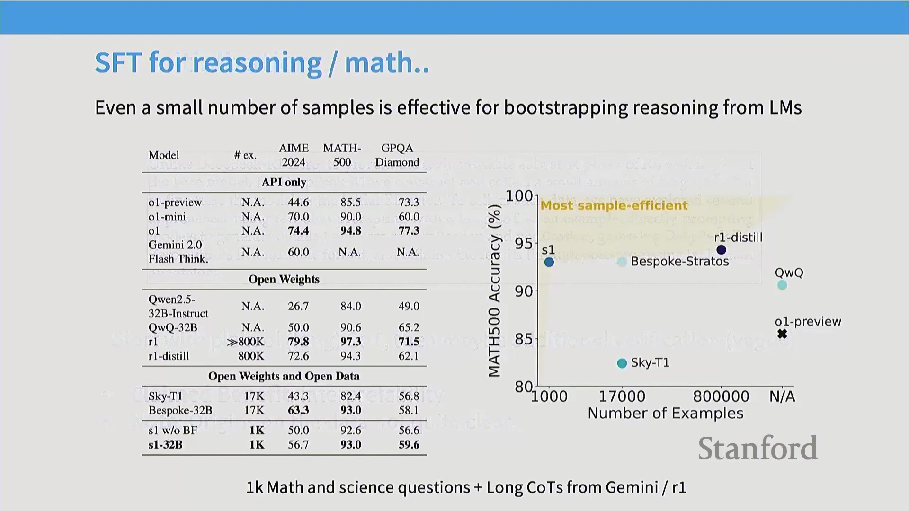

## 性能突破与模型蒸馏
相信多数人与我有同感：R1 在许多维度上令人震撼，它仅凭借一套极其精简的技术方案，便实现了对 OpenAI o1 性能的全方位追平。正如前文所述，其技术路径并无玄奥之处，大家或许不会感到意外，但最终的评测结果已充分证明了一切。在英语任务上，其表现与 o1 基本持平；在代码生成(Code Generation)任务上虽略有差距，但在各项综合基准测试中均已极度逼近。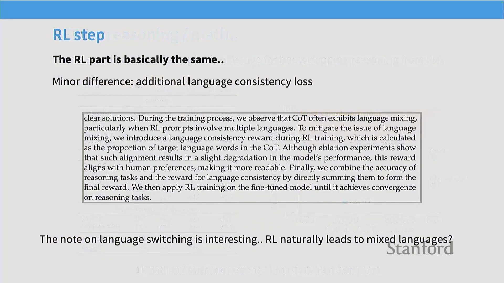 

R1 论文展示的另一项关键成果是模型蒸馏(Model Distillation)技术：可将庞大教师模型(Teacher Model)的能力迁移至更小的学生模型中。具体做法是提取大型 DeepSeek R1 模型生成的思维链数据。在该研究中，团队共提取了近一百万条高质量 CoT 轨迹。随后利用这些数据对较小模型进行微调。以 32B 参数版本为例，其基座模型在 AIME 竞赛基准上仅能达到约 50% 的得分，而经蒸馏微调后，数学推理性能实现了跨越式提升。该模型在目标任务上取得了超过 25% 的绝对性能增益(Absolute Performance Gain)，结果令人惊叹。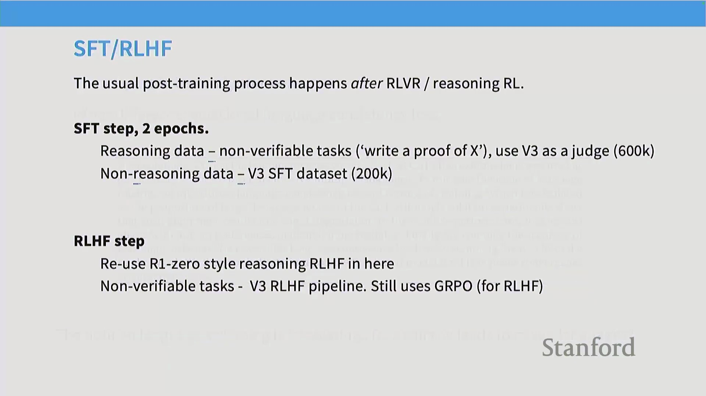

## 科学洞察：结果奖励 vs. 过程奖励模型（PRM）与搜索
最后，我认为 R1 还贡献了两项极具价值且严谨的实验观察。从学术研究视角来看，这或许是该论文最核心的贡献。总体而言，R1 在科学层面至少提供了三点重要启示。其一，它实证了结果级奖励(Outcome-level Reward)与 GRPO 结合的有效性，堪称一份强有力的正面验证(Positive Proof)。其二与其三，则是两项极具参考价值的“负面结果”(Negative Results)，均收录于 R1 技术报告末尾。作者明确指出：团队曾广泛探索两条技术路线——过程奖励模型(Process Reward Model, PRM) 与蒙特卡洛树搜索(Monte Carlo Tree Search, MCTS)。但结果表明，这两者在复现类 o1 推理模型的过程中并未带来预期收益。

展开细节来看，PRM 本质上是一种过程级奖励模型。其功能类似于在模型逐步生成证明或推理链时，提供细粒度的中间步骤奖励(Intermediate Step Reward)。当模型生成 CoT 时，PRM 能够精准定位并提示：“注意，此步骤推导存在错误。”显然，这是一种信息密度极高且反馈能力极强的监督形式。强化学习算法本可充分挖掘 PRM 的潜力，但遗憾的是，训练一个高质量、高鲁棒性的 PRM 本身即是一项极其艰巨的挑战。因此，R1 团队与早期的 DeepSeek-Math 团队曾在此路径上投入大量精力探索，但最终得出结论：在当前条件下，PRM 的实际收益不及基于结果的奖励(Outcome-based Reward)。截至目前，基于结果的奖励依然是构建此类推理模型的主流范式(Mainstream Paradigm)。

另一项未达预期的技术是基于搜索的推理方法(Search-based Reasoning)。尽管学界曾对将搜索算法作为核心推理方案寄予厚望，但迄今为止，其实际表现并未超越强化学习与结果奖励的组合方案。我依然认为，后者仍是当前该领域最强大、最可靠的基线系统(Baseline System)。好的。关于 R1 的架构设置或其他实验发现，大家是否有疑问？（听众提问）感谢 Jim 的提问。不客气。（针对提问回应）此处涉及较多 PRM 的讨论。需澄清的是，GRPO 与 PRM 属于不同维度的概念。（讲师纠正）哦，你指的是 PPO？对，是 PPO。抱歉，我此前提及但遗漏了解释，这是我的疏忽。确实如此。因此，关于 PRM 有一个极具启发性的对比点：在早期的 DeepSeek-Math 工作中，团队曾高度确信 PRM 的优势（即图表中的蓝色曲线），当时搭配使用的算法是 PPO。而在后续的 R1 迭代中，团队得出结论：该组合对 DeepSeek-Math 有效的策略，在 R1 的规模与设定下并不适用，因此最终转向了基于结果的奖励方案。感谢你的提醒，我险些遗漏了此前的承诺。没错，图表中的曲线顺序与算法配置完全对应。你的问题核心在于探究技术路线变更对最终性能的影响，对吧？是的，答案正如幻灯片备注所示。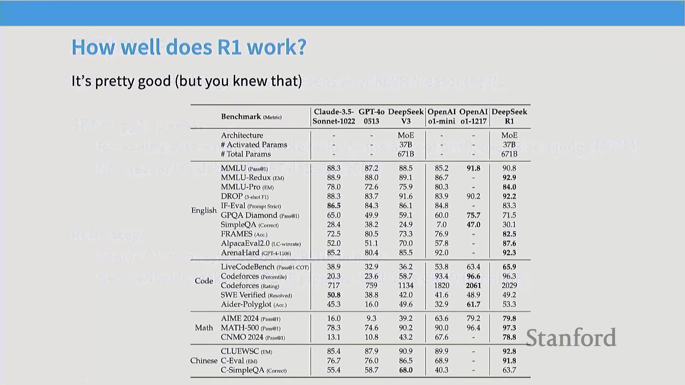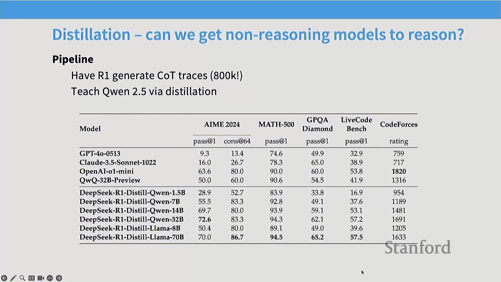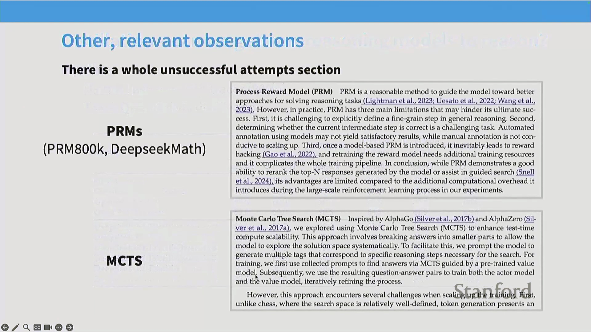

## 可解释性权衡与转向 Kimi K1.5
论文指出，若执行语言消融实验(Language Ablation Study)（即移除语言一致性约束），模型的整体性能会出现下降。尽管如此，团队仍坚持保留该约束，因其核心诉求是生成对人类用户更具可读性(Readability)的思维链。这构成了一项有趣的工程权衡(Engineering Trade-off)。学术界关于思维链忠实性(Faithfulness)已有大量研究，普遍结论是模型输出的 CoT 并非完全忠实于其内部计算逻辑。这一点大家已基本达成共识。但或许，获取相对更忠实的推理过程，其应用价值远高于在 AIME 竞赛基准上换取零点几个百分点的性能提升。

确实。我认为团队完全可以通过机器翻译(Machine Translation)或其他后处理技术进一步优化 CoT 的呈现质量。在某种程度上，OpenAI 及其他厂商致力于优化/提炼 CoT 输出的工作，亦可视为同类思路。因为原始模型生成的 CoT 往往较为冗杂，厂商通常会通过后期的合理化修正(Rationalization)与清洗来提升可读性。这是一种行之有效的工程手段，也是获取模型可解释性的实用路径。但若出于安全监控或深度可解释性分析的原则性需求，认为必须保留未经修饰的原始 CoT，那么 R1 这种原生设计将显得尤为关键。很好。

接下来，我们将视线转向 Kimi K1.5。为何要重点分析该工作？若对比 R1 与 K1.5 的发布时间，两者几乎处于同一时期。且两者取得了高度相似的性能突破。K1.5 同样是在强化学习框架下，采用基于结果的奖励机制实现的。尽管未沿用完全相同的算法，但 K1.5 在工程细节上存在诸多差异，并提供了独到的见解。因此，对比研究能让我们从中汲取……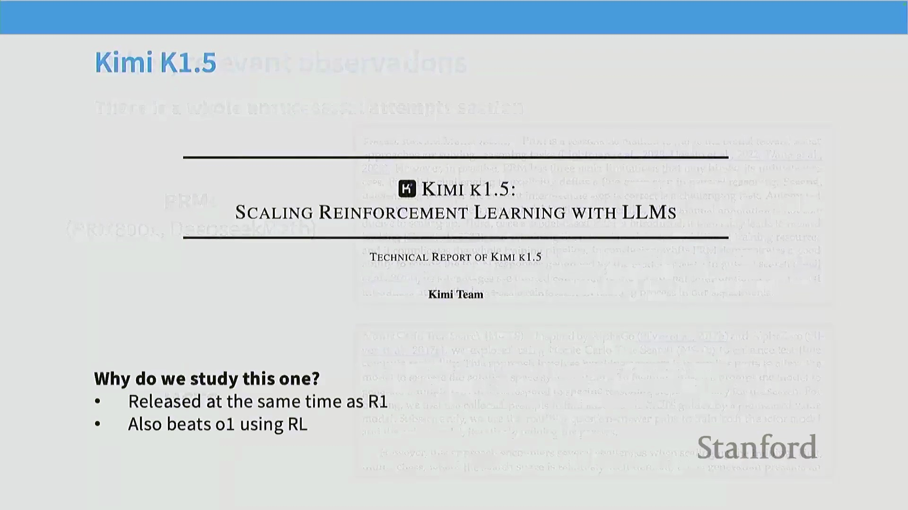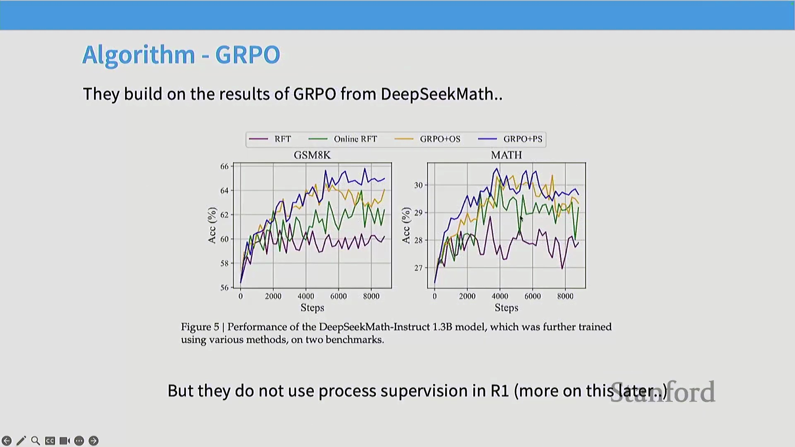

---

## Kimi K1.5 简介与性能亮点
Kimi K1.5 并未沿用与 R1 完全相同的算法，而是在实现细节上有所差异，并提供了许多独到的见解。通过对比分析，我们可以明晰哪些核心组件是共通的，哪些是差异化的，进而识别出驱动性能提升的关键要素。在深入技术细节之前，首先展示其核心评测结果，以证明该工作确实值得我们深入探讨。如图所示，深蓝色柱状图代表 Kimi K1.5，而 OpenAI 的 o1 位于次高位。这表明 Kimi K1.5 在众多关键基准测试中全面达到或超越了 o1 的性能水平。其整体训练范式与 R1 高度相似：同样采用了监督微调(Supervised Fine-Tuning, SFT) 与强化学习(Reinforcement Learning, RL) 相结合的流程。尽管底层 RL 算法有所差异，但强化学习的核心思想是一致的。此外，该论文对数据集构建过程的描述更为详尽，这一特点在后续的 Q1.3 工作中亦得到延续，因此极具讨论价值。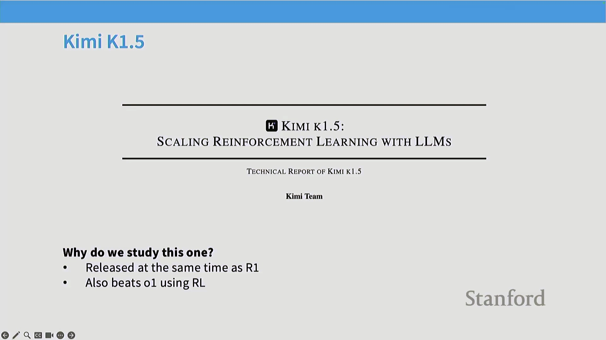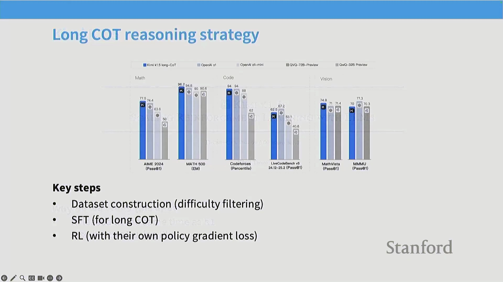

## 高级数据策展与通过率过滤
接下来探讨数据部分。正如 Percy 此前所强调的，数据质量往往是整个训练流水线中最关键的环节。因此，在阅读大规模模型训练论文时，我们应始终重点关注其数据筛选与构建(Data Curation)策略。Kimi K1.5 团队采取了多项措施来精心打磨其数据集。首先，他们致力于实现跨领域的数据均衡。团队部署了一套自动化（推测基于大语言模型(Large Language Model, LLM)）的标签系统，将数学问题按领域和学科进行分类，随后在各分类间进行采样平衡，以确保数据的多样性。其次，他们剔除了多项选择题(Multiple-Choice Questions)和判断题(True/False Questions)。尽管此类题型易于验证，但团队认为它们过于容易被模型通过模式匹配或随机猜测“破解”(Hack)。因此，数据集中仅保留了答案简短，且可通过正则表达式(Regular Expression, REGEX)或大语言模型进行自动化评估的开放性题目。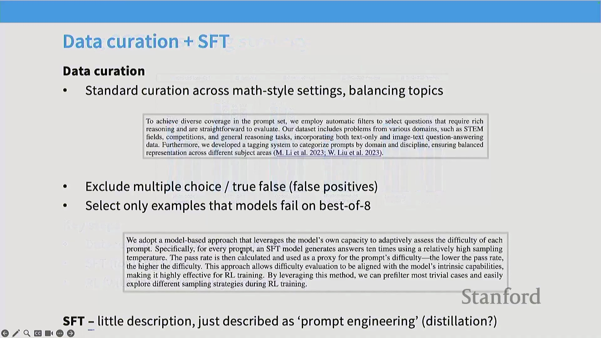 

数据构建中最具创新性的一环在于其通过率过滤机制。具体做法是：使用尚未具备强推理能力的 SFT 基座模型，针对每个问题生成 10 个候选答案。随后，依据模型的通过率(Pass Rate)来决定是否将该样本纳入训练集。其最终采用的核心筛选策略为：仅保留“8 次采样最佳(Best-of-8)”策略下依然失败的题目。换言之，只要模型在 8 次独立采样中能答对任意一次，该题目即被视为难度过低而予以剔除。关于 SFT 数据的来源，论文描述与 R1 类似，均较为简略。作者仅提及进行了特定的提示词工程(Prompt Engineering)。尽管可合理推断这些数据系通过知识蒸馏(Knowledge Distillation)获取，但具体来源与处理细节并未完全公开。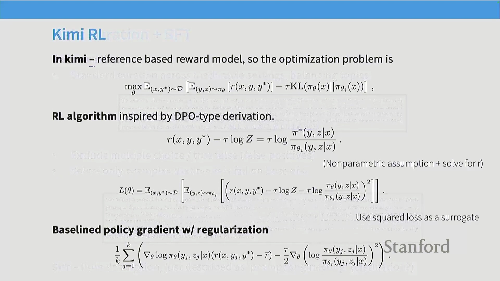

## 算法设计与趋同演化
接下来探讨 RL 算法。Kimi K1.5 采用的算法变体颇具新意，从某种意义上说，其理论推导甚至更接近直接偏好优化(Direct Preference Optimization, DPO)。然而，最终得到的算法形式大家会感到非常熟悉。这实际上展现了强化学习算法设计中的一种有趣的“趋同演化”(Convergent Evolution)现象。我们再次从顶层目标出发：经典设定是从数据集中采样，并从策略中采样生成响应，目标是最大化累积奖励，同时通过 KL 散度(Kullback-Leibler Divergence) 正则化项约束策略，防止其过度偏离参考策略。回顾 DPO 的推导，我们曾引入非参数假设(Non-parametric Assumption)，将最优策略 $\pi^*$ 视为任意函数，从而将奖励表示为对数归一化常数与策略比率(Log Policy Ratio)之和。在 DPO 中，我们将此奖励代入 Bradley-Terry 模型(Bradley-Terry Model) 以处理成对偏好数据。而在此处，我们摒弃了成对比较的逻辑，直接进行单点优化。基于最优策略的理论性质，目标方程两侧在理论上应保持等式关系。因此，算法通过计算两侧差值并施加平方损失(Squared Loss)，迫使两者在优化过程中不断逼近。这在强化学习文献中并非首创，是一种合理且稳健的设计。由此导出的损失函数，本质上即为最小化最优策略下理论等式两侧的偏差。该目标函数初看或许略显新颖，但对其求导后，其梯度形式与分组相对策略优化(Group Relative Policy Optimization, GRPO) 高度相似：其一为策略梯度(Policy Gradient)项；其二引入了基线奖励(Baseline Reward)，具体实现为对当前批次(Batch)内奖励值 $R$ 求平均。尽管归一化常数的计算方式略有不同，但其核心思想与 GRPO 的基线化(Baselining)操作如出一辙。此外，算法采用了一种变体的对数平方正则化项(Log-Squared Regularization)来约束策略更新，以此替代传统的截断(Clipping)机制。展开来看，该损失函数由两部分构成：第一部分为基线化损失，但未引入标准差归一化；第二部分则作为 GRPO 中截断操作的替代方案，通过显式正则化限制策略漂移。由此可见，两者共享相同的核心组件，仅在数学表达上存在细微差异。这也印证了一个重要结论：只要具备正确基线化的策略梯度，辅以适当的正则化约束，即可构建出稳定有效的强化学习算法。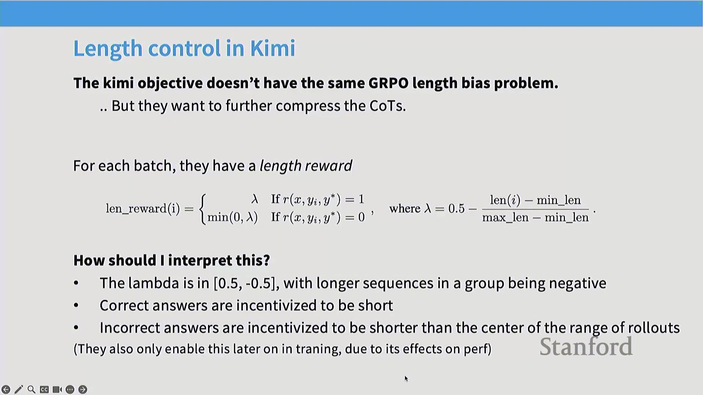

## 长度控制与推理效率优化
Kimi 团队的另一项关键创新在于对推理效率的优化。在这一点上，他们展现出了比 R1 团队更强的前瞻性，或者说对实际部署痛点的把握更为精准：若要将推理模型投入实际应用，核心瓶颈往往在于推理开销(Inference Cost)。过长的思维链(Chain of Thought, CoT)将产生高昂的计算成本，直接影响服务可用性与用户体验。因此，Kimi 团队并未盲目追求超长推理路径，而是确立了“在维持高性能的前提下，尽可能压缩思维链长度”的目标。为此，他们设计了一套精巧的长度感知奖励(Length-Aware Reward)机制。具体而言，系统会统计当前批次中生成的最大与最小序列长度，并据此计算归一化系数 $\lambda$，用于表征当前响应长度在批次内的相对位置。若 $\lambda$ 为正值（如 +0.5），表明响应较短；若为负值（如 -0.5），则表明响应较长。当模型生成正确答案时，其获得的奖励近似等于 $\lambda$。这意味着，答对问题会激励模型不断缩短输出，向更高效的短路径收敛。而当答案错误时，模型处于长度奖励的负区间，这会引导其将思维链长度控制在合理范围内（通常低于批次中位数），避免无意义的冗长生成。初看该奖励设计或许略显反直觉，但其内在优化动力学非常合理：它精准地激励正确解答趋向简短，同时避免对错误解答施加过度的长度压缩压力，防止模型因盲目求短而彻底丧失推理能力。关于该机制的部署时机，Kimi 团队指出，若在训练初期引入长度奖励，将严重阻碍 RL 优化进程。模型极易陷入局部最优(Local Optima)陷阱：既然当前无法答对问题，最优策略便退化为生成极短文本。一旦陷入此状态，模型将难以跳出并恢复有效探索。因此，团队采取了两阶段策略：训练初期先进行无约束的强化学习，让模型充分探索解题空间并建立基础推理能力；待训练进入后期，再激活长度奖励机制进行精细化调优。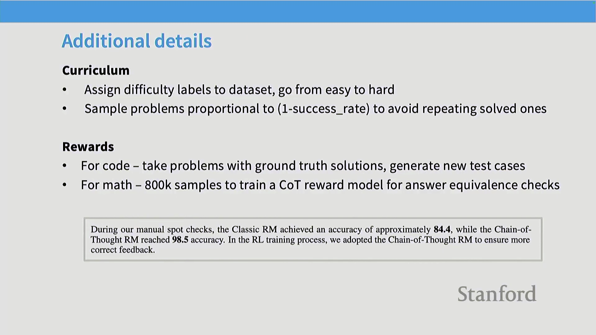

## 课程学习与高级奖励验证
Kimi 论文还披露了若干颇具巧思的工程细节，尽管其中部分组件的绝对必要性仍有待验证，但其系统设计值得借鉴。团队构建了一套完整的课程学习(Curriculum Learning)框架。他们通过人工标注或大语言模型辅助，为数据集中的题目分配了难度等级，从而构建出结构化的难度梯度。训练过程严格遵循由浅入深的渐进式路径。此外，团队引入了动态采样策略(Dynamic Sampling)：问题的采样概率与 $1$ 减去模型当前成功率成正比。这意味着，一旦模型对某道题目的正确率达到 100%，该题目将被自动移出采样池，从而将计算资源集中于模型尚未掌握的难点上。在奖励验证环节，针对代码生成任务，团队利用官方标准答案生成海量测试用例(Test Cases)进行自动化评判；针对数学任务，则部署了专用的奖励模型(Reward Model)，用于执行模型输出与人工标准答案之间的语义等价性(Semantic Equivalence)验证。令人惊讶的是，在强调可验证奖励(Verifiable Reward)的场景下，团队并未采用传统的正则表达式或 SymPy 符号计算库，而是依赖大模型进行等价性判定。然而实践表明该方案运行稳定且准确率极高，其本质可视为一种高度智能化的语义级模式匹配。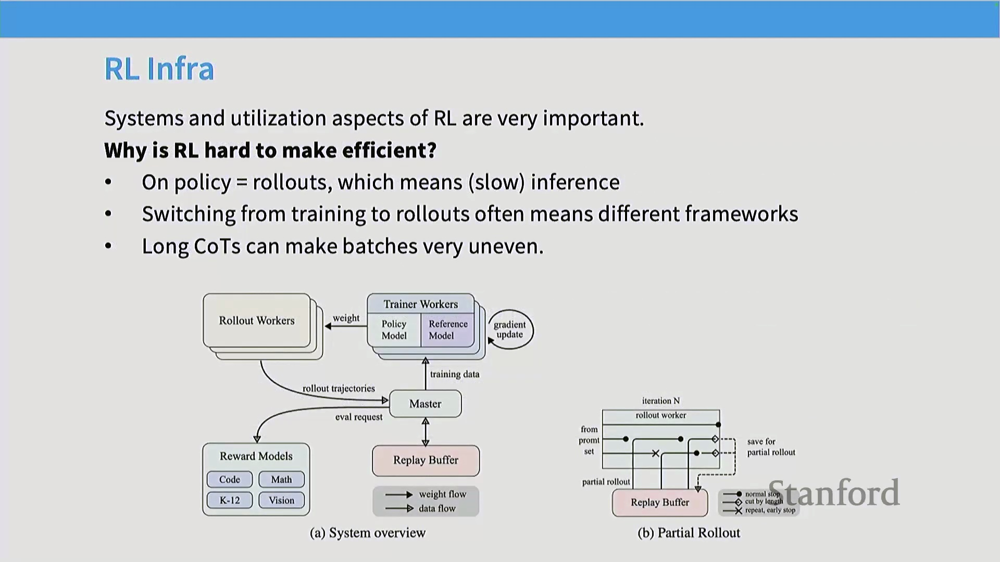

## RL 训练中的基础设施与系统挑战
Kimi 论文的另一大亮点在于，它深入探讨了强化学习训练中的系统架构(System Architecture)与工程挑战。在同类推理模型论文中，极少有工作会如此详尽地剖析底层系统实现。很高兴看到团队公开了其分布式架构与资源编排策略，这极具参考价值。大家在完成作业 5 时也会遇到类似问题，在实现强化学习的轨迹生成(Rollout)等模块时，实际上就是在实践该架构的微缩版本。需要强调的是：强化学习训练为何难以实现硬件利用率(Hardware Utilization)最大化？在多维度上，保持 RL 训练期间 GPU 的满载运行远比常规预训练困难。核心瓶颈在于 Rollout 阶段：模型必须执行自回归序列生成。这一过程不仅推理延迟较高，还引发了严重的上下文切换(Context Switching)开销。系统必须在强化学习优化节点与推理生成节点之间频繁切换角色：推理节点需将生成的轨迹数据回传至 RL 计算节点，而 RL 节点也需定期将更新后的模型权重同步回推理服务器。这种双向同步机制不可避免地引入了高昂的跨节点通信开销(Cross-node Communication Overhead)与数据同步瓶颈。最后，长思维链模型还面临一个特有的工程难题：动态序列长度管理。当思维链长度极长且差异巨大时，训练批次内的计算负载将呈现高度不均衡状态，使得动态批处理(Dynamic Batching)与内存管理变得异常复杂。

---

## RL 训练中的基础设施挑战
由于生成长度差异巨大，训练批次(Batch)的计算负载往往高度不均衡，因此需要精细的资源调度策略。Kimi 团队采用了一种较为成熟且标准化的分布式架构：部署独立的工作节点(Worker Nodes)分别负责强化学习(RL)梯度更新与模型推理(Inference)。系统通过通信机制将模型权重同步至推理节点，推理节点完成轨迹生成(Rollout)后，再将数据集回传至 RL 节点。在推理框架方面，他们采用了 vLLM，并实施了若干高阶工程优化：例如使用加载虚拟权重(Dummy Weights)的 vLLM 实例，并在跨节点传输权重的复杂流程中严格管理进程生命周期。为确保 GPU 显存(VRAM)被彻底释放，团队在每次迭代结束后通常会强制销毁并重建 vLLM 实例。这一细节充分表明，针对大语言模型(Large Language Model, LLM)的强化学习训练仍处于快速发展期，其底层基础设施(Infrastructure)与工具链尚待进一步完善。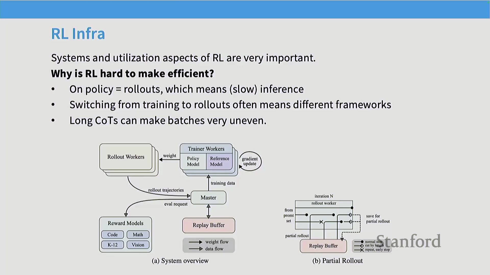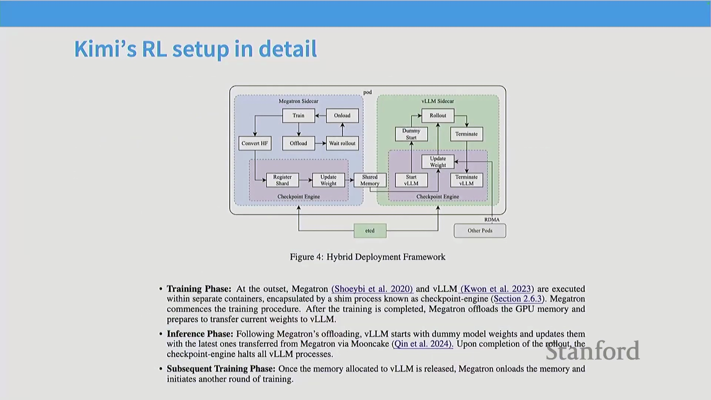

## Kimi K1.5 扩展结果与响应长度动态
最后，Kimi 论文中一项极具启发性的结果是展示了强化学习迭代过程中的性能演进轨迹。如图蓝色曲线所示，随着训练步数的增加，模型性能呈现出优异的扩展趋势(Scaling Trend)。同时，论文也记录了响应长度(Response Length)的动态变化。与经过理论修正的分组相对策略优化(GRPO)行为高度一致，由于其算法本身并不存在盲目拉长文本的优化偏向，生成序列的长度最终会在某一目标阈值处趋于稳定，而非像原始 GRPO 实现那样出现无限膨胀的现象。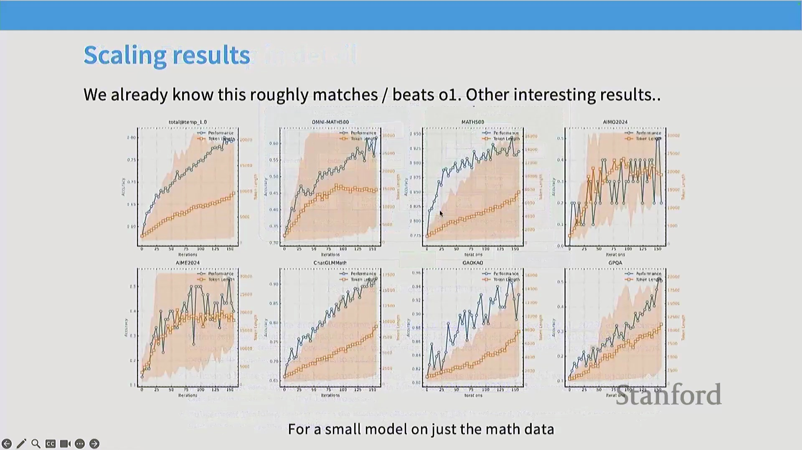

## 奖励组合与基础设施问答
关于如何融合准确率奖励(Accuracy Reward)与格式奖励(Format Reward)等多目标信号，这通常被视为强化学习调参中的“经验艺术”(Heuristic Art)。实践中，各奖励项通常采用线性加权求和(Linear Weighted Sum)的方式组合，其权重系数主要依赖经验调优(Manual Tuning)，旨在最大化下游基准任务的性能。特别是对于格式奖励，可将其视为一种塑形奖励(Shaping Reward)或代理奖励(Surrogate Reward)。研究者关注的并非格式奖励本身的数值，而是其引导作用：它作为一种优化手段，强制模型在指定标签内输出结构良好、逻辑严密的长思维链(Long Chain of Thought, CoT)，从而间接提升最终答案的求解成功率。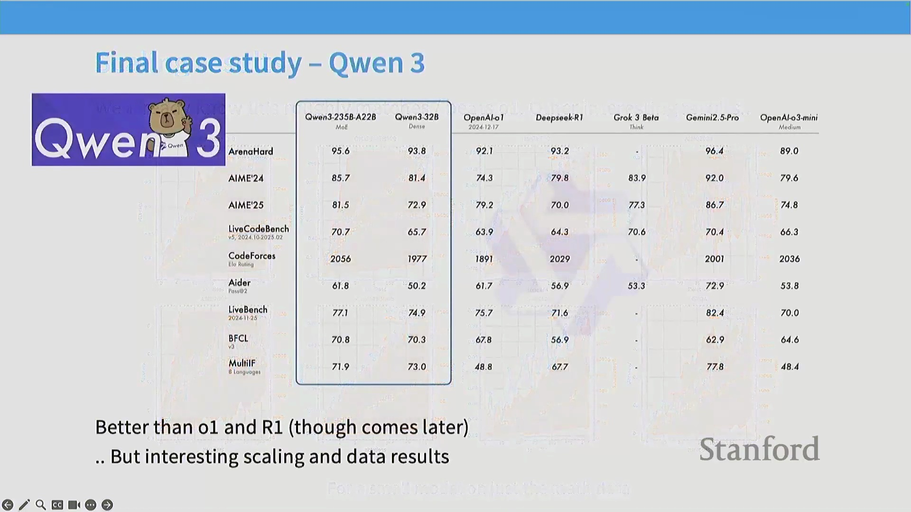

## 引入 Qwen3 (Q1.3) 与样本高效 RL
最后，我们将探讨 Qwen3（技术报告中亦称 Q1.3）。值得庆幸的是，该团队在课程末期及时发布了技术报告(Technical Report)。我认为这是目前最新发布、且处于前沿地位的基于强化学习的推理模型之一。其整体训练流水线(Training Pipeline)与 R1 和 Kimi K1.5 高度相似：Qwen 首先对基座模型进行长思维链(Long CoT)的监督微调(Supervised Fine-Tuning, SFT)，随后执行推理强化学习(Reasoning RL)，接着引入一项名为“思考模式融合”(Thinking Mode Fusion)的创新技术，最后接入常规的基于人类反馈的强化学习(RLHF)阶段。在数据构建方面，与 Kimi 类似，团队采用 N 次采样最佳(Best-of-N Sampling)策略按难度筛选数据：若基座模型已能准确解答，则将该题目从 RL 训练集中剔除。此外，团队还严格执行了数据去污染(Data Decontamination)流程，并对 SFT 数据集进行了人工精细过滤。Qwen3 在 RL 训练阶段呈现出一项极具启发性的实证结果：模型仅使用了 3,995 个高质量样本进行强化学习微调。这一极小的数据规模表明，基于可验证奖励的强化学习(Reinforcement Learning with Verifiable Rewards)具备极高的样本效率(Sample Efficiency)。这与过往研究结论相呼应：在目标明确的任务中，极少量的精准样本便足以有效引导或蒸馏模型能力。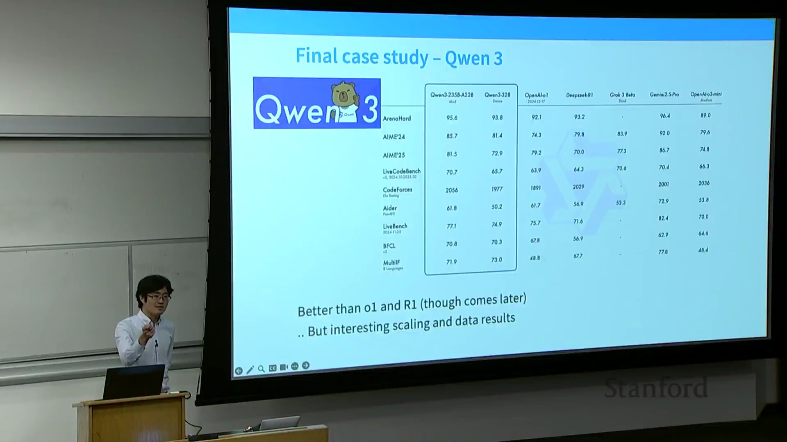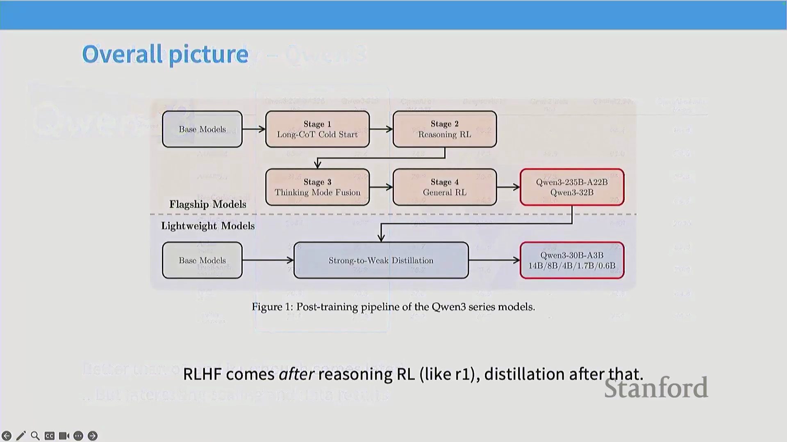

## 思考模式融合与测试时计算控制
Qwen3 的核心创新在于提出了一种名为“思考模式融合”(Thinking Mode Fusion)的技术架构。我认为，控制推理计算预算(Compute Budget)将是该领域未来的关键发展方向。该技术的目标是：在单一参数模型(Unified Model)中无缝兼容“深度思考模式”与“直接响应模式”。在完成强化学习训练后，团队利用包含 `think` 标签（触发标准思维链推理）与 `no_think` 标签（触发直接答案输出）的混合数据对模型进行二次微调。该设计产生了一个极具实用价值的涌现特性：若需在推理中途强制终止思考过程，用户可注入特定引导字符串（如“鉴于时间限制，请直接输出最终结论”），并紧跟结束思考标签，模型将精准地跳过冗余推理并输出答案。这为部署提供了一个灵活的控制旋钮(Control Knob)，允许开发者精确限制最大思考 Token 数量，从而实现基于单一模型的平滑测试时扩展(Test-Time Scaling)。实验表明，即使推理过程被提前截断，模型性能也仅呈现优雅降级(Graceful Degradation)，而非断崖式下跌。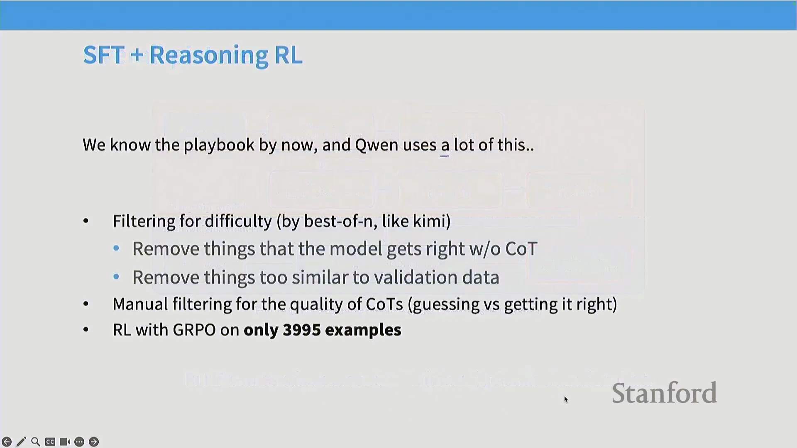

## Qwen3 消融实验结果与性能权衡
Qwen3 团队还开展了详尽的消融实验(Ablation Study)，系统评估了推理 RL 阶段、思考模式融合阶段与通用 RL 阶段对模型能力的独立贡献。在通用对话与指令遵循(Instruction Following)任务上，推理 RL、模式融合与后续的 RLHF 均呈现出持续的正向增益。然而，在数学与 STEM 领域的评测中，却显现出明显的性能权衡(Performance Trade-off)：在启用思考模式时，通用 RL 阶段反而会对推理性能产生轻微干扰；而在非思考模式下，通用 RL 则能有效提升表现。这深刻揭示了一个现状：当前模型在优化通用指令遵循能力与专精数学/编程推理能力之间，仍存在客观的互斥效应。未来研究能否打破这一权衡瓶颈，实现多能力域的协同优化，将是业界高度期待的突破方向。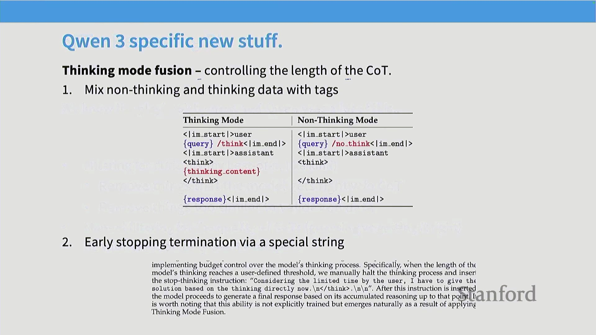

## 结论：可验证奖励范式
综上所述，本课程开篇即指出强化学习(Reinforcement Learning)在模型优化中的巨大潜力。我们已充分掌握如何在基于人类反馈的强化学习(RLHF)框架下对语言模型进行优化，然而，受限于过度优化(Over-optimization)问题，我们无法在充满噪声的成对偏好数据(Pairwise Preference Data)上无限制地持续优化。一条更为稳健的技术路径是：聚焦于规则明确、难以发生奖励欺骗(Reward Hacking)的垂直领域，引入可验证奖励(Verifiable Rewards)，并结合分组相对策略优化(GRPO)等高效算法进行直接优化。这一范式不仅能够高效、稳定地扩展模型的复杂推理能力，同时有效规避了依赖主观人类反馈所固有的优化陷阱。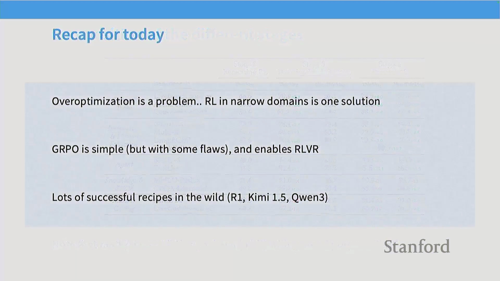

---

## 适用于可验证领域的 GRPO 与策略梯度
分组相对策略优化(Group Relative Policy Optimization, GRPO) 便是其中一种极为简洁高效的算法。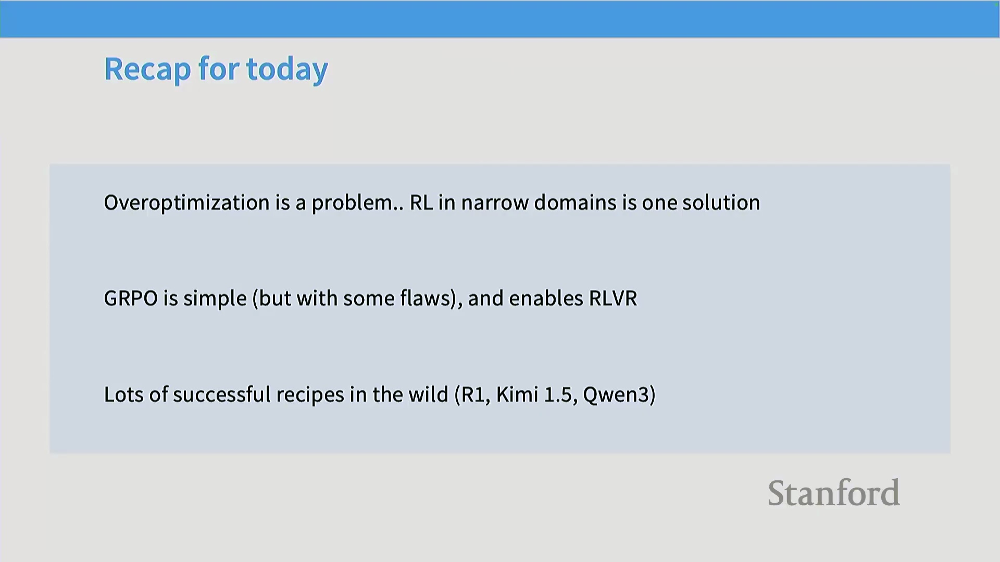 相信大家现已充分理解：只需结合设计合理的基线(Baseline)并直接应用策略梯度(Policy Gradient)算法，即可在各类具备可验证奖励(Verifiable Rewards)的任务场景中高效开展强化学习(Reinforcement Learning, RL)训练。

## 来自真实世界训练方案的启示
回顾本次课程，工业界与学术界已涌现出诸多行之有效的训练范式(Training Paradigms)。期望大家现已清晰把握这些前沿方案的底层共性，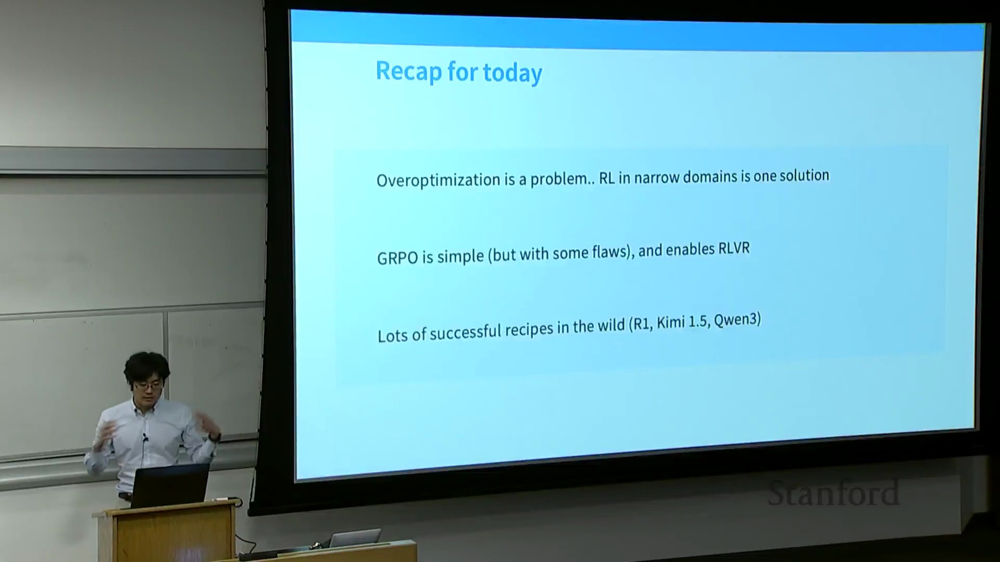 核心架构差异，以及在工程落地中至关重要的关键实现细节。 

## 课程总结
感谢各位的专注聆听与积极参与，我们下周课程再见。