# Lec. 2： Pytorch, Resource Accounting

生成时间: 2026-03-08 14:57:47

---

**英文**: Okay, so last lecture, I gave an overview of language models and what it means to build them from scratch and why we want to do that. I also talked about tokenization, which is going to be the first half of the first assignment. Today's lecture will be going through actually building a model. We'll discuss the primitives in PyTorch that are needed. We're going to start with tensors, build models, optimizers, and training loop. And we're going to place close attention to efficiency in particular how we're using resources, both memory and compute. Okay, so to motivate things a bit, here's some questions. These questions are going to be answered by napkin mats, so get your napkins out. So how long would it take to train a 70 billion parameter dense transformer model on 15 trillion tokens on 1,024 H100? Okay, so I'm just going to sketch out the sort of give you a flavor of the type of things that we want to do. Okay, so here's how you go about reasoning it.

**中文**: 好的，上一讲我概述了语言模型、从头构建它们的意义以及我们为什么要这样做。我还讨论了分词（tokenization），这将是第一次作业的前半部分内容。今天的讲座将实际演示如何构建一个模型。我们将讨论 PyTorch 中所需的 primitives（基本组件）。我们会从张量（tensors）开始，进而构建模型、优化器以及训练循环。我们将特别关注效率问题，尤其是我们如何使用资源，包括内存和算力。为了激发大家的思考，这里有一些问题。这些问题的答案将通过“餐巾纸推演”（napkin math，即快速估算）得出，所以请大家拿出餐巾纸（或草稿纸）。问题是：在 1,024 块 H100 GPU 上，训练一个拥有 700 亿参数的稠密 Transformer 模型，处理 15 万亿个 token，需要多长时间？接下来，我将大致勾勒一下推导过程，让大家感受一下我们想要进行的这类思考方式。


**英文**: You count the total number of flops needed to train. So that's six times the number of parameters times the number of tokens. Okay, and where does that come from? That will be what we'll talk about in this lecture. You can look at the promised number of flops per second that H100 gives you. The MFU, which is something we'll see later. Let's just set it to 0. 5. And you can look at the number of flops per day that your hardware is going to give you at this particular MFU. So 1,024 of them for one day. And then you just divide the total number of flops you need to train them all by the number of flops that you're supposed to get.

**中文**: 你需要计算训练所需的总浮点运算次数（FLOPs）。这个数值等于参数数量的 6 倍乘以 token 的数量。那么，这个公式是从哪里来的呢？这正是我们本节课要讨论的内容。接下来，你可以查看 H100 GPU 标称的每秒浮点运算能力。这里涉及一个叫做 MFU（模型浮点利用率，Model FLOPs Utilization）的指标，我们稍后会详细讲解。现在，我们暂时将其设定为 0.5。基于这个特定的 MFU 值，你可以计算出你的硬件在一天内能提供的总浮点运算量（即 1,024 块显卡运行一天的总量）。最后，你只需用训练所需的总 FLOPs 除以你预期能获得的总 FLOPs，就能得出所需的时间。


**英文**: Okay, and that gives you about 144. Okay, so this is very simple calculations at the end of the day. We're going to go through a bit more where these numbers come from. And in particular, where the six times number of parameters times number of tokens comes from. Okay, so here's the question. What is the largest model you can train on H800, H100 using Adam W if you're not being to clever? Okay, so H100 has 80 gigabytes of HBM memory. The number of bytes per parameter that you need for the parameters, the gradients, optimizer state is 16. And we'll talk more about where that comes from. And the number of parameters is basically total amount of memory divided by the number of bytes you need per parameter. And that gives you about 40 billion parameters.

**中文**: 好吧，这样算出来大约是 144（天）。说到底，这些计算非常简单。我们将进一步探讨这些数字的来源，特别是“6 倍参数数量乘以 token 数量”这个公式是怎么来的。接下来是这个问题：如果你不采用什么特别巧妙的优化技巧，仅使用 AdamW 优化器，在 H800 或 H100 上能训练的最大模型是多少？已知 H100 拥有 80 GB 的 HBM（高带宽内存）。对于每个参数，存储模型参数本身、梯度以及优化器状态总共需要 16 字节（关于这个数字的来源我们稍后会详细讨论）。因此，参数数量基本上等于总内存量除以每个参数所需的字节数。计算结果大约是 400 亿个参数。


**英文**: And this is very rough because it doesn't take you into a good activation, which depends on batch size and sequence length, which I'm not really going to talk about, but will be important for assignment one. Okay, so this is rough back-and-vote calculation. And this is something that you're probably not used to doing. You're just implementing the model, you train it, and what happens happens. But remember that efficiency is the name of a game. And to be efficient, you have to know exactly how many flops you're actually expending. Because when these numbers get large, these directly translate into dollars, and you want that to be as small as possible. Okay, so we'll talk more about the details of how these numbers arise. We will not actually go over the transformer. So Tatsu is going to talk over the conceptual overview of that next time.

**中文**: 这个估算非常粗略，因为它没有考虑激活值（activations）的内存占用，而激活值的大小取决于批量大小（batch size）和序列长度（sequence length）。我暂时不会深入讨论这部分，但它在第一次作业中非常重要。所以，这只是一个粗略的“信封背面的计算”（back-of-the-envelope calculation，即快速估算）。这种做法可能大家还不太习惯。通常，你们可能只是直接实现模型、开始训练，然后听天由命。但请记住，这场游戏的核心在于效率。为了实现高效，你必须确切地知道自己实际消耗了多少浮点运算量（FLOPs）。因为当这些数字变得庞大时，它们直接转化为金钱成本，而你希望这个成本尽可能低。接下来，我们会详细探讨这些数字是如何得出的。不过，我们本次课程实际上不会深入讲解 Transformer 架构本身，Tatsu 将在下次课为大家概述其概念原理。


**英文**: And there's many ways you can learn about transformer if you haven't already looked at it. If you do assignment one, you'll definitely know what a transformer is. And the handout actually does a pretty good job of walking through all the different pieces. There's a mathematical description. If you like pictures, there's pictures. There's a lot of stuff you can look online. So, but instead, I'm going to work with simpler models and really talk about the primitives and the resource accounting piece. Okay, so remember last time I said what kinds of knowledge can you learn?. So mechanics, in this lecture, it's going to be just PyTorch and understanding how PyTorch works at a fairly primitive level. So that will be pretty straightforward.

**中文**: 如果你还没有接触过 Transformer，有很多途径可以学习它。如果你完成了第一次作业，你肯定会对 Transformer 了如指掌。实际上，发放的讲义在梳理各个组成部分方面做得相当出色：既有数学描述，也有适合喜欢看图的同学的示意图。网上也有大量相关资料可供查阅。不过，本次课程我将侧重于更简单的模型，重点讲解基础组件（primitives）以及资源核算（resource accounting）部分。还记得上次我提到的“你能学到哪些知识”吗？关于“机制（mechanics）”部分，本讲座将专注于 PyTorch，并深入理解 PyTorch 在较底层的基础运作原理。这部分内容将会非常直观易懂。


**英文**: Mindset is about resource accounting, and it's not hard. It's just you just have to do it. And intuitions, unfortunately, this is just going to be broad strokes for now. Actually, there's not really much intuition that I'm going to talk about in terms of how anything we're doing translates to good models. This is more about the mechanics and mindset. Okay, so let's start with memory accounting. And then I'll talk about computer accounting and then we'll build up bottom up. Okay, so the best place to start is a tensor. So tensors are the building block for storing everything in deep learning. Parameters, gradients, optimizers, data, data, activation, there's sort of these atoms.

**中文**: “思维模式（Mindset）”关乎资源核算，这并不难，关键在于你去执行。至于“直觉（intuitions）”，遗憾的是，目前我们只能勾勒一个大致的轮廓。实际上，关于我们所做的这些工作如何转化为优质模型，我暂时不会深入探讨太多的直觉性理解。本次课程更侧重于机制和思维模式。
好吧，让我们从内存核算开始，接着讨论计算核算，然后自底向上地构建我们的知识体系。最好的起点是张量（Tensor）。张量是深度学习中存储一切的基础构建块。无论是参数、梯度、优化器状态、输入数据还是激活值，它们本质上都是由这些“原子”构成的。


**英文**: You can read lots of documentation about them. You're probably very familiar with how to create tensors. There's creating tensors in different ways. You can also create a tensor and not initialize it and use some special initialization for the parameters if you want. Okay, so those are tensors. So let's talk about memory and how much memory tensors take up. So every tensor that will probably be interested in is sort of a floating point number. And so there's many ways to represent floating point. So the most default way is float 32. And float 22 has 32 bits.

**中文**: 你可以查阅大量关于张量的文档。你可能已经非常熟悉如何创建张量了，创建方式多种多样。此外，你也可以创建一个未初始化的张量，然后根据需要对参数使用特定的初始化方法。
好了，这就是张量。接下来我们谈谈内存，以及张量会占用多少内存。我们关注的每一个张量通常都是浮点数。表示浮点数有很多方式，最默认的方式是 float32（单精度浮点数）。float32 占用 32 位（bits）。


**英文**: They're allocated one for sine, eight for exponent, and 23 for the fraction. So exponent gives you dynamic range and fraction gives you different, basically, specialized different values. So float 32 is also known as FP32 or single precision is sort of the gold standard in computing. Some people also refer to float 30 who has full precision. That's a little bit confusing because full is really depending on who you're talking to. If you're talking to a scientific computing person, they will kind of laugh at you when. you say float 32 is really full because they'll use float 64 or even more. But if you're talking to a machine learning person float 32 is the max you ever probably need to go because deep learning is kind of sloppy like that. Okay, so let's look at the memory. So the memory is very simple.

**中文**: 它们（32位）的分配方式是：1位用于符号位，8位用于指数位，23位用于尾数（分数部分）。指数位决定了动态范围，而尾数位则基本上提供了不同的具体数值。
因此，float32 也被称为 FP32 或 单精度浮点数，它在计算领域堪称“黄金标准”。有些人也将 float32 称为“全精度（full precision）”，这可能会让人有点困惑，因为“全精度”的定义取决于你的对话对象。如果你和科学计算领域的人交谈，当你说 float32 就是“全精度”时，他们可能会嘲笑你，因为他们通常会使用 float64 甚至更高精度。但如果你和机器学习领域的人交谈，float32 通常就是你需要的最高精度了，因为深度学习在这方面往往比较“粗放”，不需要那么高的精度。
好了，让我们来看看内存占用。内存的计算非常简单。


**英文**: It's determined by the number of values you have in your tensor and the data type of each value. Okay, so if you create a torched tensor of 4 by 8 matrix, the default will give you a. type of float 32. The size is 4 by 8 and the number of elements is 32. Each element size is 4 bytes. 32 bits is 4 bytes. And the memory usage is simply the number of elements times the number of size of each element and that will give you 128 bytes. So this should be pretty easy. And just to give some intuition, if you get one matrix in the f4 layer of GPT3 is this. number by this number and that gives you 2.3 gig bytes. So that's one matrix. These matrices can be pretty big. So float 32 is a default. But of course these matrices get big so you actually want to make them smaller so you use less memory. And also it turns out if you make them smaller, you also make it go faster too. So another type of representation is called float 16. And as the name suggests, it's 16 bits where both x1 and the fraction are shrunk down from 8 to 5 and 23 to 10. So this is known as half precision and it cuts down half the memory and that's all great except for the dynamic range for these float 16 isn't great. So for example, if you try to make a number like 10E1E minus 8 in float 16, it basically rounds down to 0 and you get under flow.

**中文**: 内存占用取决于张量中数值的数量以及每个数值的数据类型。
好吧，如果你创建一个 4x8 的 PyTorch 张量（矩阵），默认数据类型会是 float32。尺寸是 4x8，元素总数为 32。每个元素的大小是 4 字节（因为 32 位 = 4 字节）。内存用量 simply 就是：元素总数 × 每个元素的大小，即 32 × 4 = 128 字节。这应该非常简单。
为了给你一个直观的概念：如果在 GPT-3 模型的某个前馈层（FFN layer）中有一个矩阵，其维度是“这个数”乘以“那个数”，计算结果大约是 2.3 GB。这还仅仅是一个矩阵！这些矩阵可能非常巨大。
因此，虽然 float32 是默认选项，但鉴于这些矩阵如此庞大，你实际上希望让它们变小以节省内存。而且事实证明，缩小它们还能让计算速度更快。
另一种表示形式称为 float16。顾名思义，它占用 16 位，其中指数位从 8 位缩减到 5 位，尾数位从 23 位缩减到 10 位。这被称为 半精度（half precision）。它能将内存占用减半，这非常好，但缺点是 float16 的动态范围不够大。
例如，如果你试图在 float16 中表示像 10 ^ -8 这样小的数字，它基本上会被舍入为 0，从而导致下溢（underflow）。

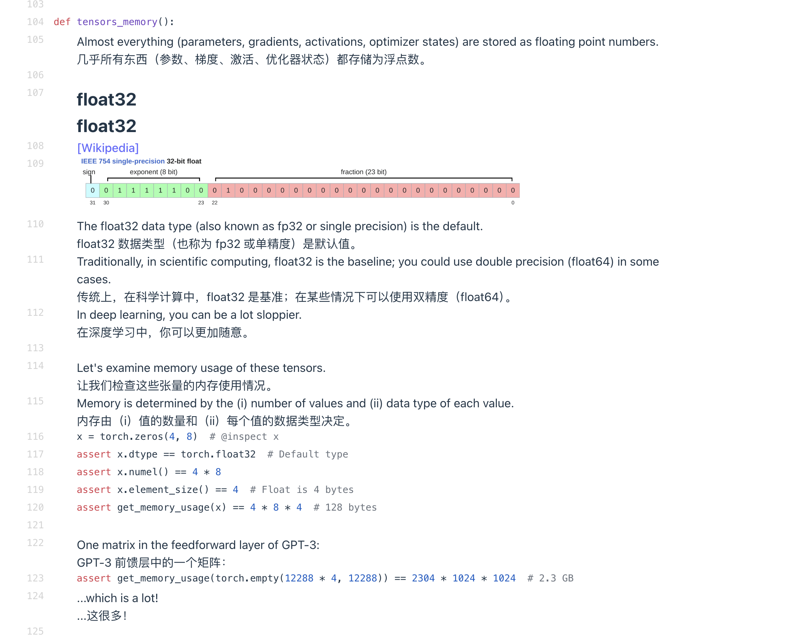


**英文**: So the float 16 is not great for representing very small numbers or very big numbers as a matter of fact. So if you use float 16 for training, for small models it's probably going to be okay but for large models when you're having lots of matrices and you can get instability or under flow or overflow and bad things happen. So one thing that has happened which is nice is there's been another representation of B float 16 which stands for brain float. This was developed in 2018 to address the issue that for deep learning we actually care about dynamic range more than we care about this fraction. So basically BF16 allocates more to the exponent and less to the fraction. So it uses the same memory as float 16 but it has a dynamic range of float 32. So that sounds really good and it actually catches that resolution which is determined by the fraction is worse but this doesn't matter as much for deep learning. So now if you try to create a tensor with 1E minus 8 in BF16 then you get something that's not 0. So you can divin into the details. I'm not going to go into this but you can stare out to the actual full specs of all the different flowing points operations.

**中文**: 因此，float16 实际上并不适合表示非常小或非常大的数字。如果你在训练中使用 float16，对于小型模型可能还行；但对于大型模型，由于涉及大量矩阵，可能会导致数值不稳定、下溢（underflow）、上溢（overflow）等严重问题。为了解决这个问题，出现了一种很好的新表示形式：BF16（Brain Float 16）。它由谷歌于 2018 年开发，旨在解决深度学习中的一个关键需求：我们更关心动态范围，而不是尾数（分数部分）的精度。基本上，BF16 将更多的位数分配给指数部分，而减少尾数部分的位数。因此，它占用的内存与 float16 相同（都是 16 位），但其动态范围与 float32 相当。这听起来非常棒。虽然它的分辨率（由尾数决定）确实较差，但这对于深度学习来说影响不大。现在，如果你尝试在 BF16 中创建一个值为 10 ^ -8 的张量，结果不会变成 0（而在 float16 中会下溢为 0）。你可以深入研究这些细节，我在此就不展开讲解了，但你可以去查阅各种浮点数运算的完整技术规格。

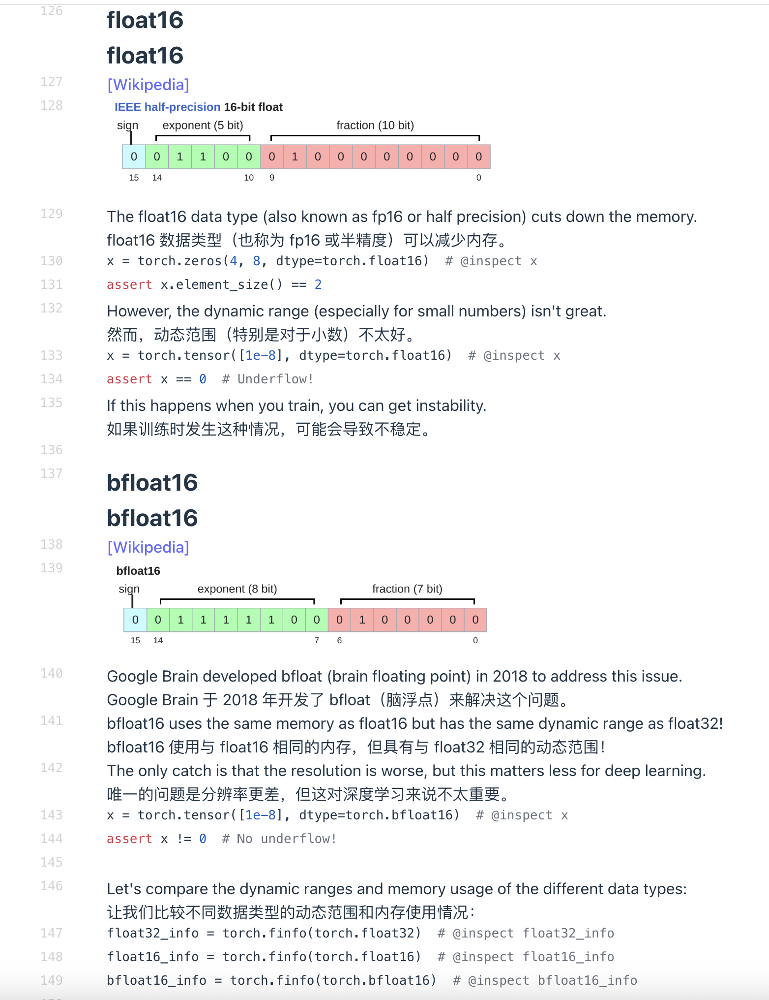


**英文**: So BF16 is basically what you will typically use to do computations because it's sort of good enough for people for a computation. It turns out that for storing optimizer states and parameters you still need float 32 for otherwise your training will go haywire. So if you're bald so now we have something called FP8 or 8bit and as the name suggests this is development 2022 by Nvidia so now they have essentially if you look at FPMBF16 it's like this and FPMBF12 you really don't have that many bits to store stuff. So it's very crude. There's two sort of variants depending on if you want to have more resolution or more dynamic range. And I'm not going to say too much about this but FP8 is supported by H100 it's not really available on previous generation. But at a high level you know training with float 32 which is I think you know is on what you would do if you're not trying to optimize you know too much and it's sort of safe. It requires more memory. You can go down to FP8 or BF16 but you can get some instability. Basically I don't think you would probably want to use a float 16 at this point for deep learning.

**中文**: 所以，BF16 基本上是你进行计算时的首选，因为对于大多数计算任务来说，它的精度已经“足够好”了。然而，事实证明，在存储优化器状态（optimizer states）和模型参数时，你仍然需要 float32，否则训练过程可能会变得混乱不堪（go haywire）。好了，现在我们来谈谈 FP8（8位浮点数）。顾名思义，这是 NVIDIA 于 2022 年 推出的一种格式。如果你观察 FP8 的结构（与 BF16 对比），你会发现用来存储数据的位数非常少，因此它非常“粗糙”。FP8 主要有两种变体，取决于你是想要更高的分辨率（精度）还是更大的动态范围。关于这点我就不多展开了，但需要注意的是：FP8 仅在 H100 及更新的 GPU 上得到支持，之前的显卡架构并不支持。
总的来说：使用 float32 进行训练是最“安全”的做法，如果你不想花太多精力去优化，这就是默认选择，但它需要更多的内存。你可以降级使用 FP8 或 BF16 来节省内存并提高速度，但这可能会带来一些数值不稳定性。基本上，我认为在目前阶段，对于深度学习任务，你可能不再推荐使用 float16 了。

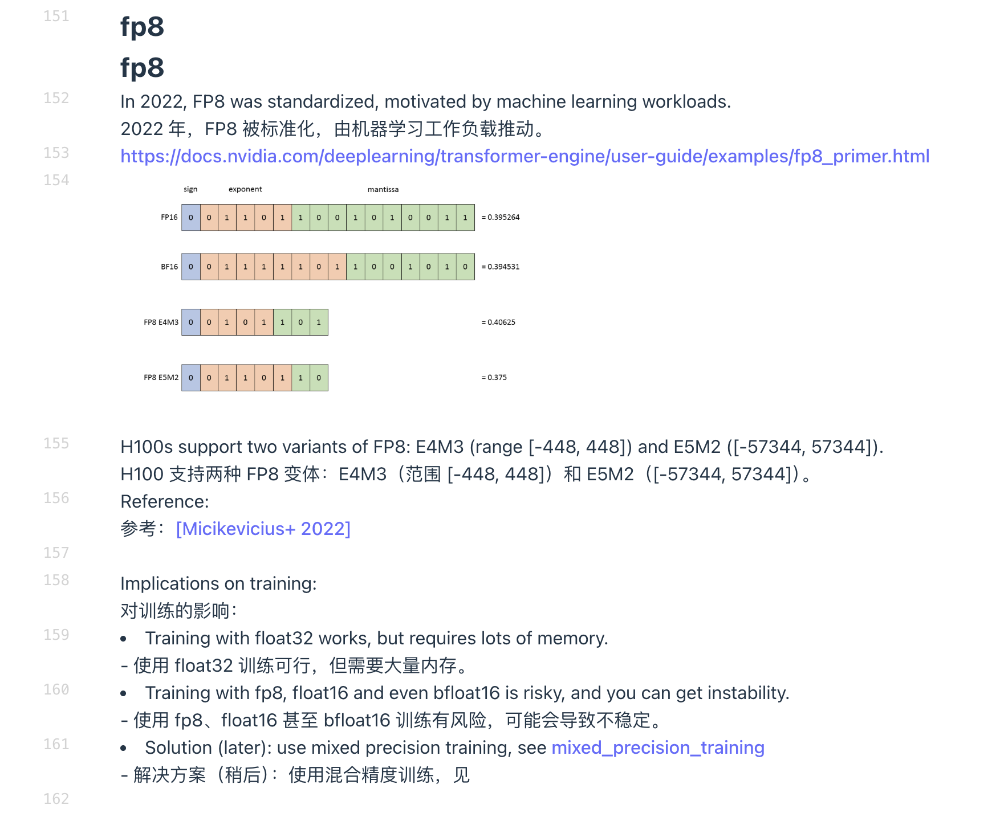


**英文**: You can become more sophisticated by looking at particular places in your pipeline either for for pass or backward pass or optimizers or gradient accumulation and really figure out what the minimum precision you need at this particular places and that's called gets into kind of mixed precision training. So for example some people like to use float 32 for the you know the attention to make sure that doesn't kind of you know get messed up for simple fee for passes with map walls. BF16 is fine. Okay pause a bit for questions. So we talked about tensors and we looked at depending on how what representation how much storage they take. Yeah. So the question is when would you use float 32 or BF16? I don't have time to get into the exact details and it's sort of very depending on the model size and everything but generally for the parameters and optimizers say you use float. 32. You can think about BF16 as something that's more transitory. Like you basically take your parameters you cast it to BF16 and you kind of run ahead with that model but then the thing that you're going to accumulate over time you want to have higher precision.

**中文**: 你可以通过深入分析流水线中的特定环节（无论是前向传播、反向传播、优化器步骤还是梯度累积），来确定这些环节所需的最低精度，从而采用更复杂的策略。这就引入了混合精度训练（Mixed Precision Training）的概念。
例如，有些人喜欢对注意力机制（Attention）部分使用 float32，以确保其计算不会出错；而对于简单的前向传播（forward passes），使用 BF16 就足够了。（注：原文中的 "map walls" 疑似语音识别错误，根据上下文推测应为 "matmuls"，即矩阵乘法）。
好，我们先暂停一下，看看大家有没有问题。
刚才我们讨论了张量，并分析了不同数据表示形式所占用的存储空间。
问：什么时候该用 float32，什么时候该用 BF16？
由于时间关系，我无法展开所有细节，因为这很大程度上取决于模型规模等因素。但一般来说：

- 对于模型参数和优化器状态，通常建议使用 float32。
- 你可以把 BF16 看作是一种更具临时性的格式。基本思路是：你将参数转换为 BF16 来进行模型的前向和反向计算（以此加速并节省显存），但对于那些需要随时间累积的量（如梯度或优化器状态中的动量），你仍然希望保持更高的精度（即 float32），以确保训练的稳定性。


**英文**: Yeah. Okay so now let's talk about compute. So that was memory. So compute obviously depends on what the hardware is. By default tensors are stored in CPU. So for example if you just impite torch say x equals torch at 0 32 32 then it will put it on your CPU. It will be in the CPU memory. Yeah of course that's no good because if you're not using your GPU then you're going to be orders of magnitude to slow. So you need to explicitly say in pytorch that you need to move it to the GPU and this. is actually just to make it very clear in pictures.

**中文**: 好的，现在我们来谈谈计算（Compute）。刚才我们讨论的是内存。显然，计算能力取决于你的硬件。默认情况下，张量是存储在 CPU 上的。例如，如果你只是执行 import torch 然后创建 x = torch.rand(32, 32)，它会被放置在你的 CPU 上，占用 CPU 内存。当然，这并不理想。因为如果你不使用 GPU，计算速度会慢上几个数量级。
因此，你需要在 PyTorch 中显式地指定将张量移动到 GPU 上。接下来我会通过图示让这一点更加清晰。

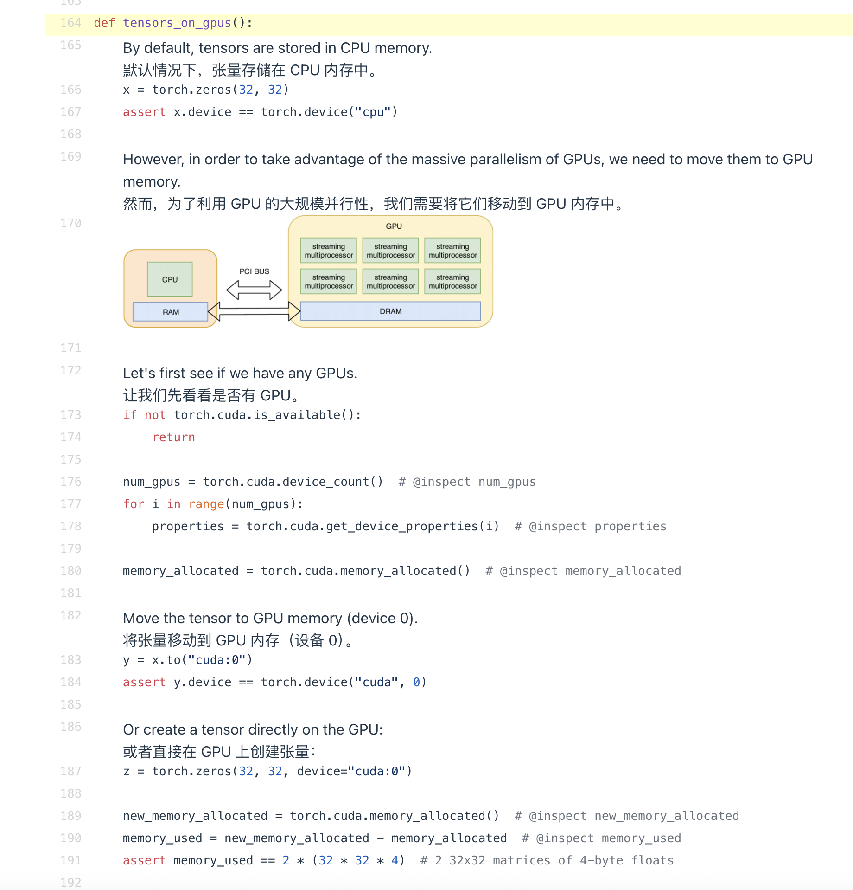


**英文**: There's a CPU, a has RAM and that has to be moved over to the GPU. There's a data transfer which is caught which takes some work. Take some time. So whenever you have a tensor in pytorch you should always keep in your mind where is this residing because just looking at the variable or just looking at the code you can't always tell. And if you want to be careful about computation and data movement you have to really know. where it is. You can probably do things like assert where it is and various places of code just to document or be sure. So let's look at what hardware we have. So in this case we have one GPU. This was run on the H100 cluster that you guys have access to.

**中文**: 这里有一个 CPU，它拥有自己的 RAM（内存）。数据必须从 CPU 传输到 GPU，这个数据传输过程是有开销的，需要消耗一定的时间。
因此，在 PyTorch 中处理张量时，你必须时刻牢记：这个张量当前驻留在哪里？ 仅仅查看变量名或代码，往往无法直接判断其位置。如果你希望优化计算效率并管理好数据移动，就必须确切地知道数据的位置。
你甚至可以在代码的各个关键位置使用 assert 语句来检查张量的设备位置，以此作为文档记录或确保无误。接下来，让我们看看我们拥有什么样的硬件。在这个例子中，我们拥有 一个 GPU。这段代码是在你们可以访问的 H100 集群上运行的。

**英文**: And this GPU is a H100, 80 gigabytes of high bandwidth memory. It gives you the cache size and so on. So if you have, remember the X is on CPU. You can move it just by specifying 2 which is a kind of a general pytorch function. You can also create a tensor direct line in GPU so you don't have to move it at all. If everything goes well, I'm looking at the memory allocated before and after. The difference should be exactly 32 by 32 matrices of 4 byte floats. So it's a 192. So this is a sanity check that the code is doing what is advertised. OK, so now you have your answers on the GPU.

**中文**: 这块 GPU 是 H100，配备了 80 GB 的高带宽内存（HBM）。它还会显示缓存大小等详细信息。

回想一下，之前的张量 x 是位于 CPU 上的。你可以通过指定设备为 'cuda'（原文中的 "2" 可能是语音识别错误，通常指代 CUDA 设备或 device='cuda'）将其移动过去，这是 PyTorch 的一个通用函数。你也可以选择直接在 GPU 上创建张量，这样就完全省去了数据传输的步骤。

如果一切运行正常，我们对比操作前后的内存分配量，其差值应该正好等于一个 32x32 矩阵所占用的空间（即 32 times 32 times 4 字节，因为 float32 占 4 字节），总共 4096 字节（注：原文口述的 "192" 可能是计算错误或口误，32 times 32 times 4 = 4096；或者是特定的测试上下文，但按标准 float32 计算应为 4KB）。这是一个健全性检查（sanity check），用于验证代码是否按预期执行。

好了，现在你的数据已经稳稳地待在 GPU 上了。


**英文**: What do you do? So there's many operations that you'll be needing for assignment one and in general to do any deep learning application. And most sensors you just create by performing operations on other tensors. And each operations has some memory and compute footprints. So let's make sure we understand that. So first of all, what is actually a tensor in pytorch? Tensors are a mathematical object. In pytorch, they're actually pointers into some allocated memory. So if you have, let's say, a matrix, 4x4 matrix, what it actually looks like is a long array. And what the tensor has is metadata that specifies how to get to address into that array. And the metadata is going to be two numbers, a stride for each or actually one number per dimension of the tensor. In this case, because there's two dimensions, it's stride zero and stride one.

**中文**: 你该怎么做呢？在作业一以及一般的深度学习应用中，你会需要用到许多操作。大多数张量都是通过对其他张量执行操作而生成的，而每个操作都会占用一定的内存和计算资源。因此，我们必须透彻理解这些概念。

首先，PyTorch 中的张量（Tensor）究竟是什么？

从数学角度看，张量是一个数学对象；但在 PyTorch 的实现中，它实际上是指向已分配内存块的指针。

举个例子，假设你有一个 4x4 的矩阵。在底层，它实际上看起来像一个长的一维数组。张量本身包含的是元数据（metadata），这些元数据指定了如何在这个数组中定位具体的地址。

这些元数据主要包括步长（stride）信息：
张量的每一个维度都对应一个步长数值。
在这个二维矩阵的例子中，就有两个步长值：stride 0（对应第0维）和 stride 1（对应第1维）。

通过这些步长，PyTorch 就能知道如何在连续的一维内存块中“跳跃”，从而逻辑上呈现出多维矩阵的结构。


**英文**: So it's stride zero specifies if you were in dimension zero to get to the next row, to increment that index, how many do you have to skip?. And so going down the rows, you skip four. So stride zero is four. And to go to the next column, you skip one. So stride one is one. Okay? So with that, you find element, let's say one two, one comma two. It's simply just multiply the indexes by the stride and you get to your index, which is six here. So that would be here or more here. Okay, so that's basically what's going underneath the hood for tensors. Okay, so this is relevant because you can have multiple tensors that use the same storage.

**中文**: Stride 0 指定了：如果你在第 0 维（行）上移动，为了到达下一行（即增加该维度的索引），你需要跳过多少个元素？
在这个例子中，向下移动一行需要跳过 4 个元素，所以 Stride 0 = 4。
而移动到下一列（第 1 维）只需要跳过 1 个元素，所以 Stride 1 = 1。

明白了吗？利用这些步长，你就可以定位任意元素。例如，要找到索引为 (1, 2) 的元素（即第 1 行第 2 列），计算方法很简单：将每个维度的索引乘以其对应的步长，然后相加。
计算过程：1 X 4 (stride0) + 2 x 1 (stride1) = 6。
这意味着该元素位于底层一维数组的第 6 个位置（如图所示）。

这就是张量在底层（under the hood）的工作原理。

理解这一点非常重要，因为它意味着：多个不同的张量可以共享同一块底层存储空间（storage）。


**英文**: And this is useful because you don't want to copy the tensor all over the place. So imagine you have a two by three matrix here. Many operations don't actually create a new tensor, they just create a different view. And it doesn't make a copy, so you have to make sure that your mutations, if you start mutating one tensor, it's going to cause other one to mutate. Okay, so for example, if you just get row zero, okay?. So remember, y is this tensor, sorry, x is one, two, three, four, five, six. And y is x zero, which is just the first row. Okay, and you can sort of double check, there's this function in a row that says if you look at the underlined storage, whether these two tensors have the same storage or not. Okay, so this definitely doesn't copy the tensor, it just creates a view. You can get column one.

**中文**: 这非常有用，因为你不需要在整个程序中到处复制张量。

想象一下这里有一个 2x3 的矩阵。许多操作实际上并不会创建新的张量，它们只是创建了一个不同的视图（view）。由于没有进行数据复制，你必须格外小心：如果你修改了其中一个张量（mutation），另一个共享同一存储的张量也会随之改变。

举个例子，如果你提取第 0 行：
假设 x 是包含元素 [1, 2, 3, 4, 5, 6] 的张量。
y = x[0]，即 x 的第一行。

你可以用 storage() 函数来双重确认：检查这两个张量的底层存储（underlying storage）是否相同。结果显示它们确实共享同一块存储。这明确表明该操作没有复制张量，而只是创建了一个视图。

同理，你也可以提取第 1 列（column one），它同样只是一个视图，而非副本。

```
def tensor_slicing():
    x = torch.tensor([[1., 2, 3], [4, 5, 6]])  # @inspect x
    Many operations simply provide a different view of the tensor.
许多操作只是提供张量的不同视图。
    This does not make a copy, and therefore mutations in one tensor affects the other.
这不会创建副本，因此对一个张量的修改会影响另一个。
    Get row 0:
获取第 0 行：
    y = x[0]  # @inspect y
    assert torch.equal(y, torch.tensor([1., 2, 3]))
    assert same_storage(x, y)
    Get column 1:
获取第 1 列：
    y = x[:, 1]  # @inspect y
    assert torch.equal(y, torch.tensor([2, 5]))
    assert same_storage(x, y)
    View 2x3 matrix as 3x2 matrix:
将 2x3 矩阵视为 3x2 矩阵：
    y = x.view(3, 2)  # @inspect y
    assert torch.equal(y, torch.tensor([[1, 2], [3, 4], [5, 6]]))
    assert same_storage(x, y)
    Transpose the matrix:
转置矩阵：
    y = x.transpose(1, 0)  # @inspect y
    assert torch.equal(y, torch.tensor([[1, 4], [2, 5], [3, 6]]))
    assert same_storage(x, y)
    Check that mutating x also mutates y.
检查修改 x 也会修改 y。
    x[0][0] = 100  # @inspect x, @inspect y
    assert y[0][0] == 100
    Note that some views are non-contiguous entries, which means that further views aren't possible.
注意，一些视图是非连续条目，这意味着无法进一步创建视图。
    x = torch.tensor([[1., 2, 3], [4, 5, 6]])  # @inspect x
    y = x.transpose(1, 0)  # @inspect y
    assert not y.is_contiguous()
    try:
        y.view(2, 3)
        assert False
    except RuntimeError as e:
        assert "view size is not compatible with input tensor's size and stride" in str(e)
    One can enforce a tensor to be contiguous first:
可以先强制张量连续：
    y = x.transpose(1, 0).contiguous().view(2, 3)  # @inspect y
    assert not same_storage(x, y)
    Views are free, copying take both (additional) memory and compute.
视图是免费的，复制需要（额外的）内存和计算。
```


**英文**: This also doesn't copy the tensor. Oops, don't need to do that. You can call a view function which can take any tensor and look at it in terms of the different dimensions. Two by three, actually this should be maybe the other way around, as a three by two tensor. So that also doesn't change, do any copying. You can transpose, that also doesn't copy. And then, like I said, if you start mutating x, then y actually gets mutated as well. Because x and y are just pointers into the same underlined storage. Okay, so things are, one thing that you have to be careful of is that some views are contiguous, which means that if you run through the tensor, it's like just slight going through the array in your storage. But some are not.

**中文**: 这同样不会复制张量。哎呀，刚才那个操作其实没必要做。

你可以调用 view 函数，它能让你以不同的维度形状来查看同一个张量。比如，将一个 2x3 的矩阵看作 3x2 的矩阵（原文提到顺序可能反了，意指形状变换）。这种操作也完全不需要进行数据复制。

同样地，转置（transpose） 操作也不会复制数据。

正如我之前所说，如果你开始修改 x，那么 y 也会随之改变。因为 x 和 y 仅仅是指向同一块底层存储（underlying storage）的不同指针。

这里有一点需要特别小心：
有些视图是连续（contiguous）的，这意味着当你遍历这个张量时，就像直接按顺序扫描底层存储数组一样顺畅。
但有些视图则是非连续的（例如经过转置或某些切片操作后），它们在逻辑上是多维的，但在底层内存中的物理位置并不是紧挨着的。


**英文**: So in particular, if you transpose it, now your, you know, what does it mean when you're transposing? So if you're sort of going down now, so you're kind of, if you imagine going through the tensor, you're kind of skipping around. And if you have a non-contiguous tensor, then if you try to further view it in a different way, then this is not going to work. Okay? So in some cases, if you have a non-contiguous tensor, you can make a contiguous first,. and then you can apply whatever viewing operation you want to it. And then in this case, x and y do not have the same storage because contiguous, in this case, makes a copy. Okay? So this is just ways of slicing and dicing a tensor. Views are free, so feel free to use them, define different variables to make it sort of easier to read your code. Because they're not allocating any memory, but remember that contiguous or reshape, which is basically contiguous. view, can create a copy, and so just be careful what you're doing. Okay, questions before moving on?.

**中文**:具体来说，如果你进行了转置（transpose）操作，这意味着什么？

想象一下遍历这个张量：转置后，你在内存中不再是顺序访问，而是需要跳跃式地读取数据（因为行和列的步长交换了）。

如果你面对的是一个非连续（non-contiguous）的张量，并试图以另一种方式对其进行 view 操作，这通常是行不通的（会报错）。

在这种情况下，如果张量是非连续的，你可以先调用 .contiguous() 方法将其变为连续张量，然后再执行你想要的任何视图操作。
注意：在这个例子中，x 和 y 不再共享同一块存储。因为 .contiguous() 在这种情况下会创建数据的副本（copy），将数据重新排列到一块连续的内存区域中。

总结一下对张量进行“切片和重组”（slicing and dicing）的方法：
视图（Views）是免费的：请放心使用它们，定义不同的变量名可以让代码更易读。因为它们不分配新内存。
警惕副本：记住，.contiguous() 或 .reshape()（在某些情况下本质上等同于 contiguous().view()）可能会创建副本。因此，操作时务必清楚自己是在创建视图还是在复制数据。

在继续之前，大家有什么问题吗？

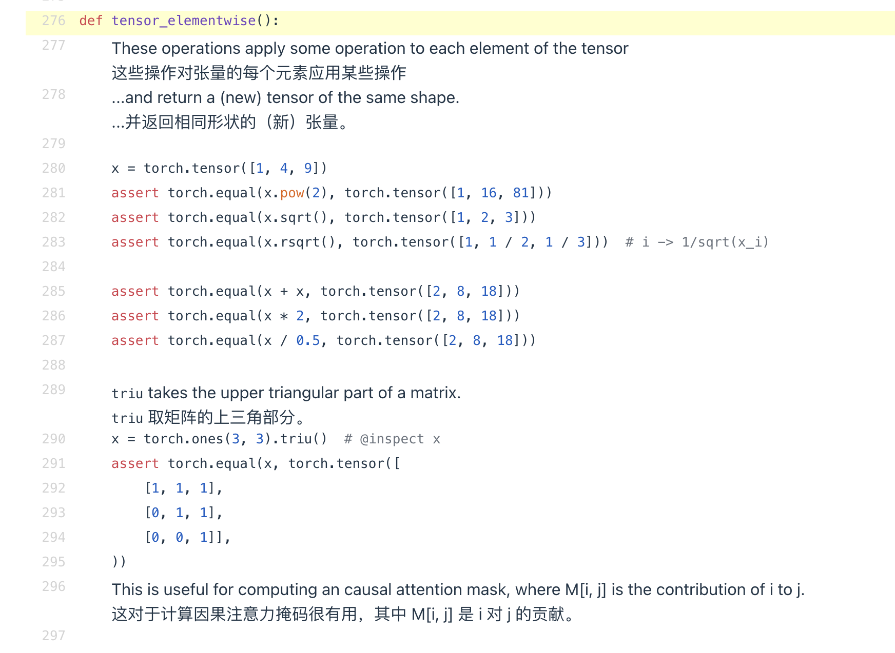


**英文**: All right. So hopefully a lot of this will be review for those of you who have done a lot of PyTorch before, but it's helpful to just do a systematically and make sure we're on the same page. So here's some operations that do create new tensors, and in particular, element-wise operations, I'll create new tensors, obviously, because you need it somewhere else to store the new value. There's a triangular U is also an element operation that comes in handy when you want to create a causal attention mask, which you'll need for your assignment. But nothing is interesting here. Okay, so let's talk about map walls. So the bread and butter of deep learning is matrix multiplications. And I'm sure all of you have done a matrix multiplication, but just in case this is what it looks like, you take a 16 by 32 times a 32 by 2 matrix, you get a 16 by 2 matrix. But in general, when we do our machine learning application, all operations are you want to do in a batch. And in the case of language models, this usually means for every example in a batch and for every sequence in a batch, you want to do something.

**中文**: 好的。希望对于之前有过大量 PyTorch 经验的同学来说，这些内容大多是复习，但系统地过一遍有助于确保我们达成共识。

这里列出了一些会创建新张量的操作：
- 逐元素操作（Element-wise operations）：显然会创建新张量，因为你需要新的内存空间来存储计算后的新值。
- 三角矩阵操作（如 triu）：这也是一种逐元素操作，非常实用。特别是在你需要构建因果注意力掩码（causal attention mask）时（这在你们的作业中会用到）。

不过，这些部分并没有什么特别深奥的地方。

接下来，我们要谈谈矩阵乘法（Matrix Multiplications）。
矩阵乘法是深度学习的核心基础（bread and butter）。我相信大家都做过矩阵乘法，但为了保险起见，我们还是回顾一下它的形式：
将一个 16x32 的矩阵乘以一个 32x2 的矩阵，会得到一个 16x2 的矩阵。

但在一般的机器学习应用中，我们所有的操作都是基于批次（batch）进行的。
特别是在语言模型中，这通常意味着：你需要对批次中的每一个样本，以及每个样本中的每一个序列位置，都执行相应的操作。

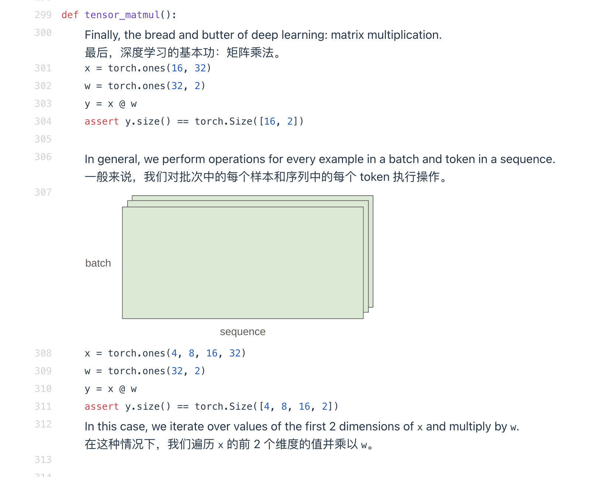


**英文**: Okay, so generally what you're going to have, instead of just a matrix, is you're going to have a tensor where the dimensions are typically batch sequence, and then whatever thing you're trying to do. In this case, it's a matrix for every token in your data set. So, you know, PyTorch is nice enough to make this work well for you. So when you take this for, you know, dimension tensor and this matrix, what actually ends up happening is that for every batch, every example and every token, you're multiplying these two matrices. Okay, and then the result is that you get your, your resulting matrix for each of the first two elements. So this is just like, there's nothing fancy going on, but this is just a pattern that I think is helpful to, you know, think about. Okay, so I'm going to take a little bit of a digression and talk about, INOPs. And so the motivation for INOPs is the following. So, you know, you know, you see things like this, where you take x and multiply by y transpose minus 2 minus 1. And you kind of look at this and you say, okay, what is minus 2? Well, I think that's the sequence.

**中文**: 好的，通常你处理的不仅仅是一个简单的矩阵，而是一个张量，其维度通常表示为：[批次大小 (Batch), 序列长度 (Sequence), ...其他维度]。

在这个例子中，这意味着数据集中的每一个 token 都对应着一个矩阵。
PyTorch 非常智能，能够很好地处理这种情况。当你将这个高维张量（例如包含 Batch 和 Sequence 维度）与一个矩阵相乘时，实际发生的情况是：
- PyTorch 会自动对每一个批次样本、每一个示例以及每一个 token，分别执行这两个矩阵的乘法运算。

结果就是，你会得到对应于前两个维度（Batch 和 Sequence）的每一个位置的计算结果矩阵。
这其实并没有什么花哨的魔法，但这是一种非常有用的思维模式，有助于你理解高维张量运算。

接下来，我要稍微偏离一下主题，谈谈 einops。
引入 einops 的动机如下：
大家经常看到类似这样的代码：取 x 乘以 y 的转置，然后进行一些像 [-2, -1] 这样的维度操作。
当你看到这些时，你可能会问：“好吧，这个 -2 到底是什么意思？”
我想，那通常指的是序列维度（sequence dimension）。


**英文**: And then minus 1 is this hidden because you're indexing backwards. And it's really easy to mess this up because if you look at your code and you see minus 1 minus 2, you're kind of, if you're good, you write a bunch of comments, but then the comments are, can get out of date with the code and then you have a bad time debugging. So the solution is to use INOPs here. So this is inspired by an Einstein summation notation. And the idea is that we're just going to name all the dimensions instead of, you know, relying on indices, essentially. Okay, so there's a library called jacks typing, which is helpful for as a way to specify the dimensions in the types. So normally in PyTorch, you would just define write your code and then you were comment, oh, here's what the dimensions would be. So if you use jacks typing, then you have this notation where as a string, you're just write down what the dimensions are. So this is a slightly kind of more natural way of documenting. Now notice that there's no enforcement here, right? Because PyTorch types are sort of a little bit of a lie in PyTorch.

**中文**: 而 -1 指的是隐藏层维度（hidden dimension），因为你是通过反向索引（从后往前数）来访问它们的。

这种写法非常容易出错。当你回头看代码时，如果看到 -1 和 -2 这样的索引，即使你当时很细心地写了一堆注释，这些注释也很容易随着代码的修改而过时。结果就是，你在调试时会非常痛苦。

解决这个问题的方案是使用 einops 库。
它的灵感来源于爱因斯坦求和约定（Einstein summation notation）。其核心思想是：我们不再依赖容易混淆的数字索引，而是直接给每个维度命名。

这里还有一个相关的库叫 jaxtyping，它对于在类型定义中指定维度非常有帮助。
传统 PyTorch 做法：你通常只是写完代码，然后在旁边写注释说：“哦，这里的维度是这样的。”
使用 jaxtyping：你可以使用一种特殊的符号，以字符串的形式直接写下维度的名称。这是一种更自然、更清晰的文档化方式。

需要注意的是：这里并没有强制性的检查机制。因为在 PyTorch 中，类型系统某种程度上是一种“谎言”（PyTorch 的动态特性使得它在运行时之前无法严格保证张量的具体形状），所以这些类型标注主要起文档和辅助静态分析的作用，而非运行时的硬性约束。

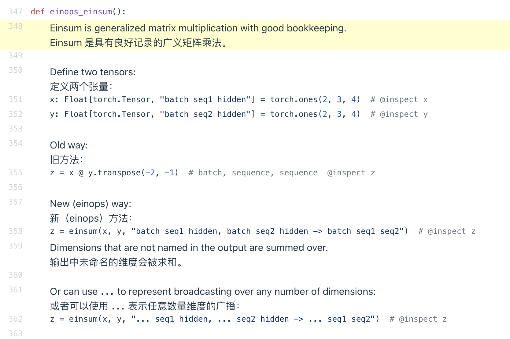


**英文**: So you can use a checker, right? Yeah, you can raise a check, but not by default. Okay, so let's look at the, you know, INOPs. So INOPs is basically matrix multiply, occasion on steroids with good bookkeeping. So here's our example here. We have x, which is, let's just think about this as, you have a batch dimension, you have a sequence dimension, and you have four hidden. And y is the same size. So you originally had to do this thing. And now what you do instead is you basically write down the dimensions, names of the dimensions of the two tensors. So batch sequence one hidden, batch sequence two hidden, and you just write what you dimensions should appear in the output. So I write batch here because I just want to basically carry that over.

**中文**: 所以你可以使用检查器，对吧？是的，你可以启用检查，但这并不是默认开启的。

好了，让我们来看看 einops。
基本上，einops 就像是加了“类固醇”的矩阵乘法与张量收缩操作，并且附带了优秀的维度管理（bookkeeping）功能。

来看这个例子：
假设我们有一个张量 x，它的维度可以理解为：[Batch (批次), Sequence (序列), Hidden (隐藏层)]。
张量 y 的大小也相同。

以前，你可能需要写一堆复杂的代码（比如转置、reshape、再相乘）来实现某种运算。
但现在，使用 einops，你只需要：

- 1.写下两个输入张量的维度名称：例如 batch sequence1 hidden 和 batch sequence2 hidden。
- 2.指定输出中应该保留哪些维度：比如我在这里写上 batch，意思就是我想把这个维度直接保留（或对应）到输出中。

通过这种声明式的方式，你清晰地定义了维度的变换逻辑，而不用去操心具体的索引数字。


**英文**: And then I write sec1 and sec2. And notice that I don't write hidden, and any dimension that is not named in the output is just summed over. And any dimension that is named is sort of just iterated over. So once you get used to this, this is actually very, very helpful. I may maybe look, if you've seen this for the first time, it might seem a bit strange along, but trust me, once you get used to it, it'll be better than doing minus two minus one. If you're a little bit slicker, you can use dot dot dot to represent broadcasting over any number of dimensions. So in this case, instead of writing batch, I can just write dot dot dot. And this would handle the case where instead of maybe batch, I have batch one, batch two, or some other arbitrary long sequence. Yeah, question? So the question is, is a guaranteed a compile to something efficient?. I think the short answer is yes.

**中文**: 接着，我写上 seq1 和 seq2。
请注意，我没有在输出中写 hidden。
- 任何未在输出中命名的维度：都会被自动求和（summed over）（即执行收缩操作）。
- 任何在输出中命名的维度：则会被保留并迭代（iterated over）。

一旦你习惯了这种写法，它会非常非常有用。
如果你第一次见到这种表示法，可能会觉得有点奇怪，但请相信我，一旦上手，它绝对比在那儿数 -2、-1 要强得多。

如果你想写得更加灵活（slicker），可以使用 省略号 (...) 来代表任意数量维度的广播（broadcasting）。
- 在这个例子中，我可以不用具体写 batch，而是直接写 ...。
- 这样就能处理更复杂的情况：比如不仅仅是单一的 batch 维度，而是可能有 batch1、batch2，或者其他任意长度的额外维度序列。它都能自动适配。

问： 它能保证编译成高效的代码吗？

答： 简短的回答是：是的。


**英文**: I don't know if you have any nuances. So if you're out the best way to reduce the best order of dimensions to use, and then use that, if you're using within Torch Compile, only do that one time, and then reuse the same representation over again. It's going to be better than anything designed by him. Okay. So let's look at reduce. So reduce operates on one tensor, and it basically aggregates some dimension or dimensions of the tensor. So if you have this tensor, before you would write mean to sum over the final dimension, and now you basically say, actually, okay, so this replaces with sum. So reduce, and again, you say, hidden, and hidden is disappeared, disappeared, so which means that you are aggregating over that dimension. Okay, so you can check that this indeed kind of works over here. Okay, so maybe one final example of this is sometimes in a tensor, one dimension actually represents multiple dimensions, and you want to unpack that and operate over one of them and pack it back.

**中文**: 我不确定你是否了解其中的细微差别。
如果你能找出最佳的维度排列顺序并加以利用，特别是在使用 torch.compile 时，只需做一次这种优化，然后反复重用相同的表示形式，其效果会比任何手动设计的方案都要好。

好了，让我们来看看 reduce 操作。
reduce 作用于单个张量。
它的基本功能是对张量的一个或多个维度进行聚合（aggregation）。

举个例子：
- 以前：如果你想对最后一个维度求均值，你会写 .mean(dim=-1) 或者类似的代码来对最终维度求和。
- 现在：你直接使用 reduce，并指定操作类型为 sum（或其他聚合函数）。
    你再次写下维度名称，比如 hidden。
    注意，hidden 在输出部分消失了。
    含义：任何在输出表达式中消失的维度，就意味着你要对该维度进行聚合（例如求和、求均值等）。

你可以验证一下，这确实能正常工作。

最后再举一个常见的例子：
有时候，张量中的某一个维度实际上代表了多个逻辑维度（例如，你把高度和宽度合并成了一个维度 H*W）。
你可能想要：

- 1.解包（Unpack）：把这个大维度拆分成两个独立的维度。
- 2.操作：只对其中某一个维度进行运算。
- 3.打包（Pack）：运算完成后，再把它合并回原来的形状。
einops 处理这种“拆分 - 操作 - 合并”的流程非常优雅且直观。

## 段落 28

**英文**: In this case, let's say you have batch sequence, and then this eight-dimensional vector is actually a flattened representation of number of heads times some hidden dimension. Okay, so, and then you have a way of vector that is needs to operate on that hidden dimension. So you can do this very elegantly using I-NOPs by calling rearrange, and this basically, you can think about it, we saw view before, it's kind of like kind of a, you know, fancier version, which basically looks at the same data, but, you know, differently. So here, it basically says this dimension is actually heads and hidden one, I'm going to explode that into two dimensions. And you have to specify the number of heads here, because there's multiple ways to split a number into, you know, two. Let's see, this might be a little bit long. Okay, maybe it's not worth looking at right now. And given that x, you can perform your transformation using I-N-SOM. So this is something hidden one, which corresponds to x, and then hidden one hidden two, which corresponds to w, and that gives you something hidden two. Okay, and then you can rearrange back.

**中文**: 在这种情况下，假设你有一个批量序列，而这个八维向量实际上是“头数 × 某一隐藏维度”所构成的展平表示。好的，接着你还有一个需要作用于该隐藏维度的向量。因此，你可以非常优雅地借助 einops 库中的 rearrange 函数来实现这一点；这本质上类似于我们之前见过的 view 操作，但功能更强大、更灵活——它本质上是在不改变底层数据的前提下，以不同方式重新组织数据的视图。此处，它明确指出：该维度实际上由“头数”和“隐藏维度一”共同构成，因此需将其拆分为两个独立维度。你必须在此处指定头数，因为一个整数可被分解为两个因子的方式可能有多种。嗯，这部分内容可能略显冗长，好吧，或许现在暂不细究。给定输入 x 后，你便可利用 einsum 对其执行变换操作：此处，“隐藏维度一”对应 x，“隐藏维度一 × 隐藏维度二”对应权重矩阵 w，最终输出为“隐藏维度二”。随后，你可再次使用 rearrange 将结果恢复为所需形状。

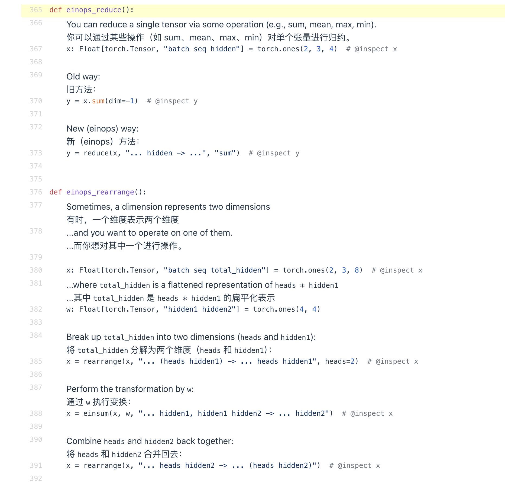


**英文**: So this is just the inverse of breaking up. So you have your two dimensions and you group it into one. So that's just a flattening operation that's, you know, with everything, all the other dimensions kind of left alone. Okay, so there is a tutorial for this that I would recommend you go through and it gives you a bit more. So on, you don't have to use this because you're building it from scratch, so you can kind of do anything you want. But in the Simon one, we do give you guidance and it's something probably to invest in. Okay, so now let's talk about computation, no cost of tensile operations. So we introduce a bunch of operations and you know how much do they cost. So a floating point operation is any operation, floating point like addition or multiplication. These are the main ones that are going to, I think matter in terms of flop count.

**中文**: 所以，这其实就是“拆分”的逆操作。
你拥有两个独立的维度，然后将它们合并（group）成一个维度。
这本质上就是一个扁平化（flattening）操作，而所有其他维度都保持原样，不受影响。

关于这一点，有一份我强烈推荐的教程，它能带你更深入地理解这些概念。
- 在你们从零开始构建（building from scratch）的项目中，你们并不强制必须使用 einops，因为你们可以随心所欲地实现任何逻辑。
- 但是，在 Simon 的项目/课程中，我们会提供具体的指导。我认为，投入时间去掌握它是非常值得的。

好了，现在让我们谈谈计算成本，具体来说是张量操作的开销。
我们引入了一系列操作，那么它们的代价究竟是多少呢？

这里的关键指标是 FLOPs（浮点运算次数）：
- 浮点运算（Floating Point Operation）：指任何针对浮点数的操作，比如加法或乘法。
- 在评估计算量（FLOP count）时，这些通常是我们要关注的主要因素。

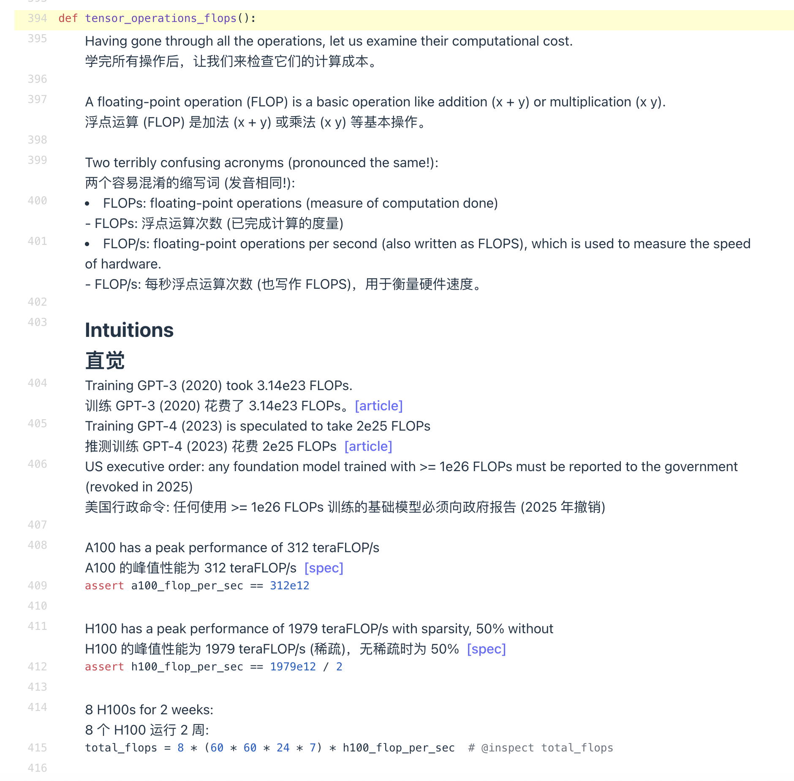

**英文**: One thing that is sort of a pepiva mine is that when you say flops, it's actually unclear what you mean. So you could mean flops with a lower case S, which stands for number of floating operations. This is measures amount of computation that you've done. Or you could mean flops also written with an uppercase S, which means floating points per second, which is used to measure the speed of hardware. So we're not going to, in this class, use uppercase S because I find out very confusing and just write slash S to denote that as floating point per second. Okay, so just to give you some intuition about flops, gbd3 took about 323 flops, gbd4 was 2e25 flops, speculation. And there was a US executive order that any foundation model with over 1e26 flops has to be reported to government, which now has been revoked. But the EU has still, they're going to still has a thumb thing that's hasn't the EU AI act, which is 1e25, which hasn't been revoked. So, you know, some intuitions A100 has a peak performance of 312 terraf flop per second. And H100 has a peak performance of 1979 terraf flop per second with sparsely and approximately 50% without.

**中文**: 一个容易引起混淆的点是：当你提到“flops”时，其具体含义其实并不明确。它可能指小写“s”的“flops”，即浮点运算次数（floating operations），用于衡量所执行的计算量；也可能指大写“s”的“FLOPS”，即每秒浮点运算次数（floating point operations per second），用于衡量硬件的运算速度。本课程中，我们不会采用大写“S”的写法，因其极易造成混淆；而是统一用“/s”来表示“每秒浮点运算次数”。  
为帮助大家建立直观认识：GPT-3 的训练约需 3.23×10²³ 次浮点运算；GPT-4 则约为 2×10²⁵ 次浮点运算（属推测值）。此前，美国曾发布一项行政命令，要求任何训练所需算力超过 10²⁶ 次浮点运算的基础模型必须向政府报备——但该命令现已撤销。而欧盟目前仍保留相关规定：根据《欧盟人工智能法案》，训练所需算力达 10²⁵ 次浮点运算及以上的模型仍须接受监管，该条款尚未被撤销。  
补充一些直观参考数据：A100 GPU 的峰值性能为 312 万亿次浮点运算每秒（TFLOPS/s）；H100 GPU 在稀疏计算模式下的峰值性能约为 1979 万亿次浮点运算每秒（TFLOPS/s），若不启用稀疏计算，其性能则约为该数值的 50%。


**英文**: And if you look at, you know, the NVIDIA has these specifications sheet sheets. So you can see that the flops actually depends on what you're trying to do. So if you're using bffp32, it's actually really, really bad. Like if you run fp32 on h100, you're not getting, it's orders of magnitude worse than if you're doing fp16 or, and if you're willing to go down to fp8, then it can be even faster. For the first time, I didn't realize, but there's an asterisk here, and this means with sparsely. So usually you're in a lot of major cities we have in this class are dense, so you don't actually get this. You get something like, you know, exactly half. Okay. Okay. So now you can do a backhand of a number of calculations.

**中文**: 如果你查看 NVIDIA 的规格说明书（spec sheets），你会发现 FLOPs（浮点运算性能） 实际上取决于你具体执行的操作类型。

精度对性能的巨大影响：

- 如果你使用 BF16/FP32（尤其是纯 FP32），性能表现其实非常糟糕。
- 举个例子：在 H100 显卡上运行 FP32，其速度比运行 FP16 要慢好几个数量级。
- 如果你愿意进一步降低精度到 FP8，速度甚至还能更快。

**关于“星号（*）”的陷阱**：
    
- 我第一次看的时候也没注意到，规格表上有个**星号（*）**。
- 这个星号意味着：仅在稀疏计算（with sparsity） 的情况下才能达到标称的峰值性能。
- 现实情况：我们在本课程中涉及的大多数矩阵运算都是稠密（dense）的，因此你无法享受到那个带星号的峰值性能。
- 对于稠密运算，你实际能得到的性能大约只有标称峰值的一半（或者说正好是 dense 模式下的理论值）。

好了，了解了这些背景知识后，我们现在就可以进行一些粗略的计算估算（back-of-the-envelope calculations）了。


**英文**: 8H100 for two weeks is just 8 times the number of flops per second times the number of seconds in a week. Actually, this is, this might be one week. Okay. So that's one week, and that's 4. 7 times e to the 21, which is, you know, some number. And you can kind of contextualize the flop counts with other model counts. Yeah. So that means if, so what does sparsely mean? That means if your matrices are spars. Is it specific like scripted sparsely? It's like two out of four elements in each like root of four elements is zero. That's only a case when you get that, that's me.

**中文**: H100运行两周的算力总量，即每秒浮点运算次数乘以一周的秒数再乘以8。实际上，这可能仅指一周。好的，那就按一周计算，结果为4.7×10²¹，这是一个具体数值。你可以将这一浮点运算量与其他模型的计算量进行对比，从而理解其规模。那么，“稀疏”具体指什么？它意味着你的矩阵是稀疏的。这种稀疏性是否属于特定类型（例如预设的稀疏模式）？比如，在每四个元素构成的一组中，恰好有两个元素为零。只有在这种情况下才会得到该结果，而这就是我所指的情形。

**英文**: No one uses it. Yeah. It's a marketing department uses it. Okay. So let's go through a simple example. So remember, we're not going to touch the transformer, but I think even a linear model gives us a lot of the building blocks and intuitions. So suppose we have endpoints. Each point is D dimensional, and the linear model is just going to match map each D dimensional vector to a K dimensional vector. Okay. So let's set some number of points.

**中文**: 没人真正用它（指那些带星号的稀疏峰值性能数据）。没错，那主要是市场部门用来宣传的。

好了，让我们来看一个简单的例子。
- 请记住，我们暂时还不会深入探讨 Transformer 架构。
- 但我认为，即使是一个简单的线性模型（Linear Model），也能向我们展示许多核心的构建模块和直观理解。

假设场景如下：
- 我们有一批数据点（points）。
- 每个点都是 D 维的向量。
- 这个线性模型的任务，就是将每一个 D 维的输入向量，映射（变换）为一个 K 维的输出向量。

接下来，让我们设定一些具体的数值（例如点的数量），以便进行计算。


**英文**: Is B. Dimension is D. K is the number of outputs. And let's create our data matrix X. Our weight matrix W. And the linear model is just some map ball. So nothing, you know, two interesting going on. And, you know, the question is how many flops was that? And the way you would, you look at this is you say, well, when you do the matrix multiplication,. you have basically for every IJK triple, I have to multiply two numbers together. And I also have to add that number to the total.

**中文**: 

- B：代表批次大小（Batch size），也就是数据点的数量。
- D：代表输入维度（Input dimension）。
- K：代表输出维度的数量（Number of outputs）。

让我们构建我们的数据矩阵 X 和 权重矩阵 W。
这个线性模型仅仅是一个简单的矩阵乘法（matrix multiplication）操作，并没有什么特别复杂或花哨的地方。

现在的问题是：这到底消耗了多少 FLOPs（浮点运算次数）？

分析这个问题的思路如下：
当你执行矩阵乘法时，基本上对于每一个 (i, j, k) 的三元组组合：
你需要将两个数相乘。
然后，你需要将这个乘积加到总和中（累加）。
(注：这意味着对于输出矩阵中的每一个元素，都需要进行 D 次乘法和 D-1 次加法，通常粗略估算为 2 times B times D times K 次浮点运算。)


**英文**: Okay. So the answer is two times the, basically the product of all the dimensions involved. So the, the left dimension, the middle dimension, and the right dimension. Okay. So this is something that you should just kind of remember. If you're doing a matrix multiplication, the number of flops is two times the product of the three dimensions. Okay. So the flops of other operations are usually kind of linear in the size of the, the matrix or tensor. And in general, no other operation you encounter, deep learning is expensive as matrix multiplication for large enough matrices. So this is why I think a lot of the napkin math is very simple because we're only looking at the matrix multiplications that are going, are performed by the model.

**中文**: 好的，所以答案很简单：基本上就是所有相关维度的乘积再乘以 2。
具体来说，就是左维度、中间维度和右维度这三个数的乘积，然后乘以 2。

这是一个你们应该牢记的结论：

- 如果你在进行矩阵乘法，FLOPs 的数量 = 2 X (维度_1 X 维度_2 X 维度_3)。

关于其他操作：
- 大多数其他操作的计算成本通常与矩阵或张量的大小成线性关系。
- 总体而言，在深度学习中，只要矩阵足够大，没有任何其他操作比矩阵乘法更昂贵（计算量更大）。

这就是为什么我认为很多“餐巾纸数学”（Napkin Math，即粗略估算）非常简单的原因：
- 我们只需要关注模型中执行的矩阵乘法部分，忽略其他相对微不足道的开销即可。


**英文**: Now, of course there are regimes where if your matrices are small enough, then the cost of other things starts to dominate. But generally, that's not a good regime you want to be in because the hardware is designed for big much versus multiplication. So, sort of by, it's a little bit circular, but by kind of, we end up in this regime where we only consider models where the mammals are at the dominant cost. Okay. Any questions about this, this number? Two times the product of the three dimensions. This is just a useful thing. So, there's a lot of negative motivation always be the same because the chip might have optimized it. And then on these, totally the same. Yeah. So the question is like, is the, does this, essentially, does this depend on the matrix multiplication? You algorithm.

**中文**: 当然，也存在一些特定情况（regimes）：如果你的矩阵足够小，那么其他操作（如内存访问、启动开销等）的成本就会开始占据主导地位。

但一般来说，这并不是我们想要处于的状态，因为硬件（如 GPU）是专门为大规模矩阵乘法而设计的。

所以，这虽然听起来有点循环论证，但结果就是：我们最终只关注那些矩阵乘法占主导成本的模型场景。

关于这个数值（2 X 三个维度的乘积），大家有什么问题吗？

- 这是一个非常实用的经验法则。
- 你可能会想：“不同的实现方式会不会导致结果不同？”或者“芯片优化会不会改变这个数？”
- 回答：不会。无论底层算法如何优化（比如使用 Tensor Cores 或特定的汇编指令），从浮点运算量（FLOPs）的理论定义来看，它始终取决于矩阵乘法的数学本质，因此这个倍数关系是恒定不变的。

所以，问题的核心在于：这本质上是否取决于你的矩阵乘法算法？
答案是：就理论计算量（FLOPs count）而言，它不依赖具体算法，只依赖于矩阵的维度；但就实际运行时间而言，算法和硬件优化会有巨大影响。


**英文**: In general, I guess we'll look at this the next week when we, or the week after when we look at kernels. I mean, actually there's a lot of optimization that goes underneath under the hood when it comes to matrix multiplications. And there's a lot of specialization depending on the shape. So this is, I would say this is just a kind of a crude, you know, estimate that is basically like the right order of magnitude. Okay. So, yeah. Additions and modifications are equivalent. Yeah. Additions and multiplications are considered. So, one way I find helpful to interpret this.

**中文**: 一般来说，我想我们会在下周或者下下周，当我们深入探讨计算内核（kernels）时再详细分析这个问题。

我的意思是，实际上在矩阵乘法的底层（under the hood）隐藏着大量的优化技术。而且，针对不同的矩阵形状（shape），往往会有专门的特化（specialization）处理。

所以，我要强调的是：

- 这只是一个粗略的估算（crude estimate）。
- 它的价值在于能给出一个正确的数量级（right order of magnitude），而不是精确到每一个时钟周期。

对了，确认一下：

- 加法（Additions）和乘法（Multiplications）在这里被视为是等价的（即各算作一次浮点运算）。

我觉得有一种理解方式非常有助于大家消化这个概念


**英文**: So, at the end of the day, this is just a matrix multiplication. But I'm going to try to give a little bit of meaning to this, which is why I've set up this. It's kind of a little toy machine learning problem. So, B is really stands for the number of data points. And DK is the number of parameters. So, for this particular model, the number of flops that's required for forward pass is two times the number of tokens or number of data points times the number of parameters. Okay. So, this turns out to actually generalize to transformers. There's an asker is there because there's, you know, the sequence length and other stuff. But this is roughly right for, if you're a sequence length, if it isn't too large.

**中文**: 归根结底，这只是一个矩阵乘法。但我试图赋予它一些实际意义，这也是我构建这个简易机器学习示例（toy problem）的原因。

在这个模型中：
- B 代表数据点（data points）的数量（在自然语言处理中通常对应 token 的数量）。
- D X K 代表参数（parameters）的数量。

因此，对于这个特定模型，执行一次前向传播（forward pass）所需的 FLOPs 计算公式为：
 FLOPs = 2 X 数据点数量 X 参数数量 (即：2 乘以 Token 数/数据点数，再乘以参数量)

事实证明，这个规律实际上可以推广到 Transformer 架构中：
- 虽然 Transformer 中因为存在序列长度（sequence length）以及其他复杂因素（如注意力机制中的 L^2 项），使得情况稍微复杂一些（这也是为什么会有额外的修正项）。
- 但是，只要序列长度不是特别大，这个估算公式（2 X Tokens X Params）仍然是大致准确的。

**英文**: So, okay. So, now this is just a number of floating point operations. So, how does this actually translate to a walk-like time, which is presumably the thing you actually care about. How long do you have to wait for your run? So, let's time this. So, I have this function that is just going to do it five times and I'm going to perform the matrix-mact operation. We'll talk a little bit later about this two weeks from now why the other code is here. But, for now, we get an actual time. So, that matrix took, you know, 0. 16 seconds. And the actual flops per second, which is how many flops did it do per second is 5.

**中文**: 好的，现在我们已经算出了浮点运算次数（FLOPs）的总量。
那么，这个数字如何转化为实际的挂钟时间（wall-clock time）呢？毕竟，这才是你真正关心的指标：你的程序运行需要等待多久？

让我们来实际计时一下：
- 我写了一个函数，它会重复执行5次矩阵乘法操作。
- （关于代码中其他部分的作用，我们两周后再详细讨论，现在先忽略它们。）
- 通过运行这段代码，我们得到了一个实际的耗时数据。

结果显示：
- 该矩阵运算耗时 0.16 秒。
- 由此我们可以计算出实际的 FLOPS（每秒浮点运算次数），即它每秒钟执行了多少次运算。结果是 5...
    
*(注：根据上下文语境，这里的“5”极有可能是指 5 TFLOPS (5 Tera-FLOPS) 或类似的量级，因为对于现代硬件而言，每秒仅做5次运算是不合理的；或者是演讲者话未说完，具体数值需结合后续内容确认。)*


**英文**: 4 E 13. Okay. So, now you can compare this with the, you know, the marketing materials and for the A 100 and A 100. And, you know, as we looked at the spec sheet, the flops depends on the data type. And we see that the promise flops per second, which, you know, for A 100, for, I guess this is for float 32. float 32 is, you know, 67, you know, terro flops as we looked. And so, that is the number of promise flops per second we had. And now, if you look at the, there's a helpful notion called model flops utilization or MFU, which is the actual number flops divided by the promise flops. Okay. So, you take the actual number of flops, remember, which is what you actually witnessed.

**中文**: 4 × 10¹³（即 40 万亿）。

好了，现在我们可以将这个实测数据与 A100 GPU 的官方营销资料进行对比了。

正如我们之前查看规格说明书（spec sheet）时所见，FLOPS 的数值取决于数据类型（data type）：
- 对于 A100，如果是 FP32（单精度浮点数），其承诺的峰值算力约为 67 TFLOPS（67 万亿次浮点运算/秒）。
- 这就是我们所说的“承诺每秒浮点运算次数”。

接下来，我们要引入一个非常有用的概念：模型 FLOPS 利用率（Model FLOPs Utilization, 简称 MFU）。
- 定义：MFU = 实际达到的 FLOPS / 承诺的峰值 FLOPS。
- 分子：取你刚才实际观测到的运算速度（即我们刚刚计算出的那个数值）。
- 分母：取硬件厂商承诺的理论峰值速度（如上面的 67 TFLOPS）。

通过这个比率，我们就能知道你的程序到底发挥了硬件多少百分比的理论性能。


**英文**: The number of floating point operations that are useful for your model divided by the actual time it took, divided by this promise flops per second, which is, you know, from the glossy brochure. You can get a MFU of 0. 8. Okay. So, usually you see people talking about their MFUs. And something greater than 0. 5 is usually considered to be good. And if you're like, you know, 5% MFU, that's considered to be really bad. You usually can't get close to that close to, you know, you know, 90 or 100. Because this is sort of ignoring all sort of communication and overhead.

**中文**: 具体来说，**模型 FLOPS 利用率MFU**的计算公式是：

$ \text{MFU} = \frac{\text{对模型有用的浮点运算总量} / \text{实际耗时}}{\text{官方宣传册上的承诺峰值 FLOPS}} $

也就是：**（实际有效算力）除以（理论峰值算力）**。

*   如果你能算出 **0.8 (80%)** 的 MFU，那已经是非常惊人的成绩了。
*   通常大家在讨论训练效率时都会引用 MFU 这个指标：
    *   **大于 0.5 (50%)**：通常被认为表现**良好**。
    *   **只有 0.05 (5%)**：则被认为表现**非常糟糕**。

你通常**无法**达到接近 **90% 或 100%** 的利用率。
这是因为理论峰值忽略了现实中的各种损耗，例如：
*   **通信开销（communication）**：GPU 之间或 GPU 与 CPU 之间的数据传输时间。
*   **其他系统开销（overhead）**：内存搬运、指令调度等非计算时间。

因此，MFU 本质上是在衡量你的系统在多大程度上克服了这些非计算瓶颈，跑出了接近硬件理论极限的速度。


**英文**: It's just like the literal computation of the flops. Okay. And usually MFU is much higher if the matrix multiplication is dominate. Okay. So, that's, and if you're any, any questions about this? Yeah. So, this promise flops per second is not considered to be a great one. So, this promise flops per second is not considered to be a smart set. One, a note is that this is actually a, you know, there's also something called hardware, you know, to flops you, like, realization. And the motivation here is that we are all, we're trying to look at the, it's called model because we're looking at the number of effective useful operations that the model is, you know, performing. Okay.

**中文**: 这仅仅是对 FLOPs 的字面计算。

通常情况下，如果矩阵乘法占主导地位（即计算量远大于其他操作），那么 MFU（模型 FLOPS 利用率） 往往会更高。

关于这部分，大家有什么问题吗？

（回答听众提问）：
是的，你说得对。这个来自宣传册的“承诺峰值 FLOPS”并不是一个绝对可靠的标准，也不能被视为一个“智能设定（smart set point）”。

这里有两点需要注意：

- 硬件层面的差异：还有一个概念叫做硬件 FLOPS 实现率（Hardware FLOPs Realization）。厂商宣传的峰值往往是在最理想、最特定的条件下测得的，实际硬件在不同负载下的表现会有所不同。
- 为什么叫“模型”FLOPS 利用率：我们之所以特意称之为“模型（Model）” FLOPS 利用率，是因为我们的关注点在于模型实际执行的有效且有用的运算数量。

1.普通的硬件利用率可能只关心硬件是否在忙（哪怕是在做无用功或等待）

2.而 MFU 专门衡量的是：在总时间内，有多少比例的时间真正花在了推动模型训练/推理前进的有效计算上。

简而言之，MFU 是为了剔除那些对模型更新没有直接贡献的开销（如通信、内存搬运、填充计算等），从而更真实地反映算法与硬件配合的效率。


**英文**: And so, it's a way of kind of standardizing. It's not the actual number of flops that are done because you could have optimization in your code that cash a few things or redo, you know, you know, recomputation of some things. And in some sense, you're still computing the same model. So, what matters is that you're, this is truly trying to look at the model complexity. And you shouldn't be penalized just because you were clever in your MFU if you were clever and you didn't actually do the flops. But you said you did. Okay. So, you can also do the same with BF16. And here we see that for BF, the time is actually much better. So, 0.03 instead of 0. 16. So, the actual flops per second is higher. Even the county first, especially the promised flops is still quite high. So, the MFU acts actually lower for BF16. This is, you know, maybe surprisingly low. But sometimes the promised flops is a bit of, you know, optimistic. So, always about benchmark your code. And don't just kind of assume that you're going to get certain levels of performance. Okay.

**中文**: 所以，这其实是一种标准化的方法。

MFU 计算的并不是代码中实际执行的浮点运算次数。因为你的代码中可能包含各种优化策略，例如：
- 缓存（caching）某些中间结果；
- 或者为了节省显存而进行重计算（recomputation）。

从某种意义上说，无论你是否进行了这些优化，你最终计算的仍然是同一个模型。因此，MFU 真正关注的是模型的复杂度。
核心逻辑：如果你很聪明，通过优化手段减少了实际的 FLOPs 消耗（例如用重计算换取显存空间），但依然完成了相同的模型训练任务，那么你不应该因此在 MFU 指标上受到“惩罚”。
   （演讲者在此处澄清：如果你实际上没有做那么多运算，但声称做了，那是不对的；但 MFU 的设计初衷是基于模型的理论复杂度来评估效率，而不是单纯看硬件计数器的数值，以免让那些做了巧妙优化的开发者吃亏。）

好了，我们也可以对 BF16（Bfloat16） 数据类型做同样的测试。
在这里我们可以看到，对于 BF16，耗时实际上要好得多：
- FP32 耗时：0.16 秒
- BF16 耗时：0.03 秒

因此，实际的每秒浮点运算次数（Actual FLOPS）变得更高了。
然而，即使实际算力提升了，尤其是当分母（厂商承诺的峰值 FLOPS）定得非常高的时候，计算出来的 MFU 反而变低了。

这个结果可能低得让人意外。但这通常是因为：

1.厂商承诺的峰值 FLOPS 有时过于乐观（optimistic），是在极度理想的条件下测得的，现实中很难达到。

2.BF16 虽然快，但可能受限于其他瓶颈（如内存带宽或通信），导致无法跑满理论峰值。

结论：
一定要对你的代码进行基准测试（benchmark）！
不要想当然地认为一定能达到某种性能水平。实际表现往往取决于具体的硬件实现、数据类型以及系统开销，必须通过实测数据说话。


**英文**: So, just to summarize, matrix multiplatients dominate the compute. And the general rule of thumb is that it's two times the product of the dimensions, flops. The flops per second, floating points per second, depends on, you know, the hardware and also the data type. So, the fancier the hardware you have, the higher it is, the smaller the data type, the usually the faster it is. And MFU is a useful notion to look at how well you're essentially squeezing your hardware. Yeah. I heard that often you get like the maximum utilization you want to use these like tensor cores on the machine. And so, like, this fighter is by default to use these tensor cores on, like, are these kind of conditions? Yeah. So, the question is, what about those tensor cores? So, if you go to this spec sheet, you'll see that, you know, these are all on the tensor core. So, the tensor core is basically, you know, specialized hardware to do map balls.

**中文**: 我们来总结一下：

1.  **计算主导因素**：**矩阵乘法**占据了绝大部分的计算量。
2.  **FLOPs 估算法则**：一个通用的经验法则是，矩阵乘法的浮点运算次数（FLOPs）大约是**矩阵维度乘积的两倍**（即 2 x M x N x K）。
3.  **算力（FLOPS）的影响因素**：每秒浮点运算次数取决于：
    *   **硬件性能**：硬件越先进（fancier），峰值算力越高。
    *   **数据类型**：数据精度越低（如 BF16, FP16 相比 FP32），通常运算速度越快。
4.  **MFU 的意义**：**模型 FLOPS 利用率（MFU）** 是一个非常有用的指标，用来衡量你**在多大程度上“榨干”了硬件的性能**。

---

**关于 Tensor Cores 的问答环节：**

**提问者**：我听说为了获得最大利用率，通常需要使用机器上的 **Tensor Cores（张量核心）**。那么，刚才提到的那些更快的速度（比如 BF16 的表现），默认就是使用了 Tensor Core 吗？是在这种条件下测得的吗？

**演讲者**：好问题，关于 **Tensor Cores** 的情况是这样的：
如果你去查看硬件的**规格说明书（spec sheet）**，你会发现上面列出的那些极高的峰值算力数据，**全都是基于 Tensor Core 计算的**。

*   **什么是 Tensor Core？**
    它本质上是一种**专用硬件单元**，专门用于执行**矩阵乘法累加（Matrix Multiply-Accumulate, 简称 MMA 或 GEMM**操作。
*   **为什么重要？**
    传统的 CUDA Core（通用核心）也能做矩阵乘法，但速度慢得多。只有当你调用并充分利用这些专用的 Tensor Core 时，才能达到规格书上宣传的那种“恐怖”的峰值速度。因此，现代深度学习框架（如 PyTorch）在处理矩阵运算时，默认都会尝试调用 Tensor Core 来加速。


**英文**: So, if you are, you know, if you're, so by default, it should use it. And especially if you're using PyTorch, you know, compile, it will generate the code that will use the hardware properly. Okay. So, let's talk a little bit about, you know, gradients. So, and the reason is that we've only looked at matrix multiplication, or in other words, basically, feet forward, forward passes and the number of flops. But there's also a computation that comes from computing gradients, and we want to track down how much that is. Okay. So, just to consider a simple example, a simple linear model, where you take the prediction of a linear model and you, you look at the MSC with respect to five. So, not a very interesting loss, but I think it's illustrated for looking at the gradients. Okay.

**中文**: 所以，默认情况下，系统应该会自动使用这些 Tensor Cores。
特别是如果你使用的是 **PyTorch** 并启用了 **`torch.compile`**（或类似的编译优化），它会自动生成能够正确调用底层硬件（即 Tensor Cores）的代码。

好了，接下来我们要稍微讨论一下 **梯度（gradients）** 的计算。

**为什么要讨论这个？**
因为到目前为止，我们只关注了**矩阵乘法**，换句话说，我们只计算了**前向传播（forward pass）**的 FLOPs。
但是，训练过程中还有一个巨大的计算开销来自于**反向传播（计算梯度）**。我们需要弄清楚这部分到底占了多少计算量。

让我们来看一个简单的例子：
假设有一个简单的**线性模型**。
*   我们取该线性模型的预测值。
*   然后计算它相对于参数 $W$（演讲者口误说成了 "five"，但在上下文中显然指权重矩阵 $W$ 或参数 $\theta$）的 **均方误差（MSE, Mean Squared Error）**。

虽然这个损失函数本身并不复杂（甚至有点过于简单），但它非常适合用来**演示梯度计算的流程和开销**。


**英文**: So, remember, in the forward pass, you have your X, you have your, your W, which, you want to compute the gradient with respect to, you make a prediction by taking a linear product and then you, you have your loss. And in the backward pass, you just call loss a backwards. And in this case, the gradient, which is this variable attached to the tensor, turns out to be what you, what you want. Okay. So, everyone has done your gradients in PyTorch before. So, let's look at how many flops are required for computing gradients. Okay. So, let's look at a slightly more complicated model. So, now it's a two-layer linear model, where you have X, which is BID, times W1, which is D by D. So, that's the first layer.

**中文**: 回想一下**前向传播（forward pass）**的过程：
你拥有输入 $X$ 和权重矩阵 $W$（你需要计算关于 $W$ 的梯度）。
1.  首先，通过计算线性乘积（$X \cdot W$）得到**预测值**。
2.  然后，基于预测值计算**损失（Loss）**。

而在**反向传播（backward pass）**中，你只需调用 `loss.backward()`。
此时，附着在张量（tensor）上的 `.grad` 属性变量，就会自动填充为你想要的**梯度值**。
我想大家在 PyTorch 中应该都做过这样的梯度计算操作了。

现在，让我们深入分析一下：**计算这些梯度究竟需要多少 FLOPs？**

为此，我们来看一个稍微复杂一点的模型：
这是一个**两层线性模型（two-layer linear model）**：
*   **输入**：$X$，维度为 $B \times D$（其中 $B$ 是批次大小 batch size，$D$ 是特征维度）。
*   **第一层权重**：$W_1$，维度为 $D \times D$。
*   **第一层运算**：即计算 $X \cdot W_1$。

*(注：演讲者正在逐步构建模型复杂度，以便推导多层网络中反向传播的浮点运算量公式。)*


**英文**: And then you take your hidden activations, H1, and you pass it through another linear layer, W2, and to get a K-dimensional vector, and you do some, compute some loss. Okay. So, this is a two-layer linear network. And just as a kind of review, if you look at the number of forward flops, what you had to do was, you have to multiply, look at W1, you have to multiply X by W1, and add it to your H1. And you have to take H1 and W2, and you have to add it to your H2. Okay. So, the total number of flops, again, is two times the product of all the dimensions in your map wall, plus two times the product dimensions in your map wall for the second matrix. Okay. In other words, two times the total number of parameters in this case. Okay.

**中文**: 然后，你取隐藏层的激活值 $H_1$，将其通过另一个线性层（权重为 $W_2$），从而得到一个 $K$ 维的向量，最后计算某种损失函数。

好了，这就是一个**两层线性网络**。

让我们简单**回顾**一下**前向传播（forward）**所需的 FLOPs 数量：
1.  **第一层**：你需要将输入 $X$ 与权重 $W_1$ 相乘，得到隐藏层激活值 $H_1$。
2.  **第二层**：你需要将 $H_1$ 与权重 $W_2$ 相乘，得到输出 $H_2$（演讲者口述中的 "add it to your H2" 实际上是指矩阵乘法运算的结果构成了 $H_2$，而非加法）。

因此，总的 FLOPs 数量计算如下：
*   对于第一个矩阵乘法：$2 \times (\text{所有维度的乘积})$
*   对于第二个矩阵乘法：$2 \times (\text{所有维度的乘积})$

**换句话说**：在这个特定的线性网络案例中，前向传播的总 FLOPs 大约等于 **参数总量的两倍**（即 $2 \times \text{Total Parameters}$）。

*(注：这是深度学习中的一个经典结论。对于纯线性层，前向传播的浮点运算量通常是模型参数量的 2 倍。而在包含反向传播的完整训练步中，总计算量通常是前向传播的 2 倍，即总约为参数的 4-6 倍，具体取决于优化器等因素。)*


**英文**: So, what about the backward pass? So, this part will be a little bit more involved. So, we can recall the model X to H1 to H2 and the loss. So, in the backward pass, you have to compute a bunch of gradients. And the gradients that are relevant is you have to compute the gradient with respect to H1, you know, H2, W1, and W2 of the loss. So, D lost each of these variables. Okay. So, how long does it take to compute that? Let's just look at W2 for now. Okay. So, the things that touch W2, you can compute by looking at the chain rule. So, W2 grad, so the gradient of D lost, D, W2, is you sum H1 times the gradient of the loss with respect to H2.

**中文**: 那么，**反向传播（backward pass）**的情况如何呢？
这部分会稍微复杂一些。

让我们回顾一下模型的数据流：从输入 $X$ 到隐藏层 $H_1$，再到输出 $H_2$，最后计算损失（Loss）。

在反向传播过程中，你需要计算一堆**梯度（gradients）**。
相关的梯度包括损失函数对以下变量的偏导数：
*   $H_1$
*   $H_2$
*   $W_1$
*   $W_2$
即：$\frac{\partial \text{Loss}}{\partial H_1}, \frac{\partial \text{Loss}}{\partial H_2}, \frac{\partial \text{Loss}}{\partial W_1}, \frac{\partial \text{Loss}}{\partial W_2}$。

那么，计算这些需要多少时间（或计算量）呢？
我们先单独看看 **$W_2$**。

根据**链式法则（chain rule）**，我们可以推导出与 $W_2$ 相关的梯度计算：
$W_2$ 的梯度（即 $\frac{\partial \text{Loss}}{\partial W_2}$）等于：
**$H_1$ 的转置** 乘以 **损失对 $H_2$ 的梯度**（$\frac{\partial \text{Loss}}{\partial H_2}$），然后通常还需要对批次维度进行求和（sum over the batch dimension）。

用公式表示大致为：
$$ \nabla W_2 = H_1^T \cdot \nabla H_2 $$
*(注：演讲者口述中的 "sum H1 times..." 指的是矩阵乘法中隐含的对批次维度的累加操作，这是计算权重梯度的标准步骤。)*


**英文**: Okay. So, that's just a chain rule for W2. And this is, so all the gradients are the same size as the underlying vectors. So, this turns out to be, essentially, looks like a matrix multiplication. And so, the same calculus holds, which is that it's two times the number of the product of all the dimensions, B times D times K. Okay. But this is only the gradient with respect to W2. We also need to compute the gradient with respect to H1, because we have to keep on back propagating to W1 and so on. Okay. So, that is going to be the product of W2 times H2.

**中文**: 好的，这只是针对 $W_2$ 的**链式法则**应用。

这里有一个关键点：**所有梯度的维度都与对应的底层向量（或矩阵）的维度相同**。

因此，计算 $W_2$ 梯度的过程本质上看起来就像一个**矩阵乘法**。
所以，同样的计算量法则也适用：
所需的 FLOPs 数量是 **2 乘以所有维度的乘积**，即 $2 \times B \times D \times K$。
*(注：这里 $B$ 是批次大小，$D$ 是隐藏层维度，$K$ 是输出维度)*

**但是**，这仅仅计算了关于 $W_2$ 的梯度。
我们还需要计算关于 **$H_1$** 的梯度，因为我们需要继续**反向传播**到 $W_1$ 以及更前面的层。

计算关于 $H_1$ 的梯度（即 $\frac{\partial \text{Loss}}{\partial H_1}$），其运算形式将是：
**$W_2$ 的转置** 乘以 **关于 $H_2$ 的梯度**。
*(注：演讲者口述中的 "product of W2 times H2" 在这里语境下略有省略，准确的数学含义是用 $W_2^T$ 乘以 $\nabla H_2$ 来得到 $\nabla H_1$，以便将误差信号传回上一层。)*


**英文**: Sorry, I think this should be that grad of H2, H2. That grad. So, that turns out to also be, essentially, looks like the matrix multiplication. And it's the same number of flops for computing the gradient of H1. Okay. So, when you add the two, so that's just for W2. You do the same thing for W1, and that's, which has D times D parameters. And when you add it all up, it's, so for this, for W2, the amount of computation was 4 times B times D times K. So, I'm going to try again for W1. It's also 4 times B times D times D, because W1 is D by D.

**中文**: 抱歉，我想这里应该是指 **$H_2$ 的梯度**（$\nabla H_2$）。

计算 $H_1$ 的梯度本质上也看起来像是一个**矩阵乘法**。
因此，计算 $H_1$ 梯度所需的 FLOPs 数量与之前是相同的。

好了，当我们把这两部分加起来时（注意：这还只是针对 $W_2$ 这一层的反向传播过程）：
你需要对 $W_1$ 做同样的事情，而 $W_1$ 拥有 $D \times D$ 个参数。

让我们汇总一下总计算量：
*   **对于 $W_2$ 层**：
    计算量是 $4 \times B \times D \times K$。
    *(推导逻辑：计算 $\nabla W_2$ 需要 $2 \times B \times D \times K$，计算 $\nabla H_1$ 也需要 $2 \times B \times D \times K$，两者相加即为 4 倍)*

*   **对于 $W_1$ 层**：
    我们要再算一次。由于 $W_1$ 的维度是 $D \times D$，其计算量同样是 **$4 \times B \times D \times D$**。
    *(推导逻辑：计算 $\nabla W_1$ 需要 $2 \times B \times D \times D$，计算 $\nabla X$ 也需要 $2 \times B \times D \times D$，合计 4 倍)*

**总结结论**：
在反向传播中，每一层的计算量大约是该层前向传播计算量的 **2 倍**（因为不仅要算权重的梯度，还要算输入梯度的传递），或者说，单层反向传播的总 FLOPs 约为 $4 \times (\text{批次大小} \times \text{输入维度} \times \text{输出维度})$。


**英文**: Okay. So, I know there's a lot of symbols here. I'm going to try also to give you a visual account for this. So, this is from a blog post that I think may work better. Okay. I have to wait for the animation to flip back. So, basically, this is one layer of the node out, which has the hidden and then the weights to the next layer. And so, I have to, okay, probably this animation has to wait. Okay. Ready, set.

**中文**: 好的。我知道这里有很多符号。我还会尽量为你们提供一个直观的图示说明。这部分内容来自一篇我认为效果可能更好的博客文章。好的，我需要等待动画翻转回来。基本上，这是节点输出的一层，其中包含隐藏层以及通往下一层的权重。因此，我需要……好吧，这个动画可能得稍等一下。好的，准备好了，开始！


**英文**: Okay. So, first, I have to multiply W and A, and have to add it to this. That's a forward pass. And now I'm going to multiply this, these two, and then add it to that. And I'm going to multiply and then add it to that. Okay. Any questions? We're just going to wait to slow this down. But, you know, the details may be all that you kind of reminit on, but the high level is that there's two times the number of parameters for the forward pass and four times the number of parameters for the backward pass. And we can just kind of work it out via the chain row here. Yeah.

**中文**: 好的。首先，我必须将 *W* 和 *A* 相乘，然后将其加到这里。这就是前向传播（forward pass）。接下来，我要将这两个数相乘，然后加到那个数上；然后再相乘，再加到另一个数上。大家有什么问题吗？我们稍微放慢一点节奏没关系。虽然你们可能主要关注的是这些细节，但从宏观层面来看：**前向传播的计算量是参数量的两倍，而反向传播的计算量是参数量的四倍**。我们可以通过这里的链式法则（chain rule）推导出来。


**英文**: For the homeworks, are we also using the, you said some types of information is last some reason, are we allowed to use the grad or we are doing the, like, entirely by hand to the gradient. So, the question is, in the homework, are you going to compute gradients by hand? And the answer is no. You're going to just use PyTorch gradient. This is just to break it down so we can do the counting flops. Okay. Any questions about this before I move on. Okay. Just to summarize, the forward pass is for this particular model is two times the number of data points times the number of parameters and backwards is four times the number of data points times the number of parameters, which means that total it's six times the number of data times times parameters. Okay. And that explains why there was a six in the beginning when I asked the motivating question.

**中文**: 关于作业，你之前提到某些信息（可能指梯度计算细节）由于某种原因被略过了，那我们是允许使用自动梯度（autograd），还是需要完全手动计算梯度？

问题是：在作业中，我们需要手动计算梯度吗？

答案是：不需要。 你们将直接使用 PyTorch 的自动梯度功能。我们刚才这样拆解分析，仅仅是为了让大家学会如何统计浮点运算量（FLOPs）。

在继续之前，大家对此还有什么问题吗？

好的，总结一下：对于这个特定的模型，前向传播的计算量是 2 倍 的（数据点数 × 参数量），而反向传播的计算量是 4 倍 的（数据点数 × 参数量）。这意味着总计算量是 6 倍 的（数据点数 × 参数量）。这也解释了为什么在我最初提出那个引导性问题时，会出现数字“6”。


**英文**: So now this is for a simple linear model, but turns out that many models, this is basically the bulk of the computation when essentially every computation you do has touches essentially a new parameters roughly. And, you know, obviously this doesn't hold, you can find models where this doesn't hold because you can have like one parameter through parameter sharing and have a billion flops, but that's generally what not what models look like. Okay. So, let me move on. So far, I've basically finished talking about the resource accounting. So we looked at tensors, we looked at some computation on tensors, we looked at how much tensors take to store and also how many flops takes tensors take when you do various operations on them. Now let's start building up different models. I think this part is necessarily going to be that conceptually interesting or challenging, but it's more for maybe just completeness. Okay. So parameters in PyTorch are stored as these NN parameter objects.

**中文**: 所以，以上是针对一个简单的线性模型而言的。但事实证明，对于许多模型来说，这基本上构成了计算的主体，因为本质上你执行的每一次计算都会大致触及一组新的参数。

当然，这并非绝对成立。你确实能找到不符合这一规律的模型，例如通过参数共享（parameter sharing），你可能只用一个参数就能产生数十亿次的浮点运算（FLOPs）。但这通常不是大多数模型的常态。

好的，我们继续。

至此，我基本上已经讲完了资源核算（resource accounting）的部分。我们探讨了张量（tensors）、张量上的计算、张量的存储占用，以及在对张量执行各种操作时所需的浮点运算量（FLOPs）。

接下来，让我们开始构建不同的模型。我认为这部分在概念上未必有多有趣或具有挑战性，更多是为了内容的完整性。

好的，在 PyTorch 中，参数是作为 nn.Parameter 对象来存储的。

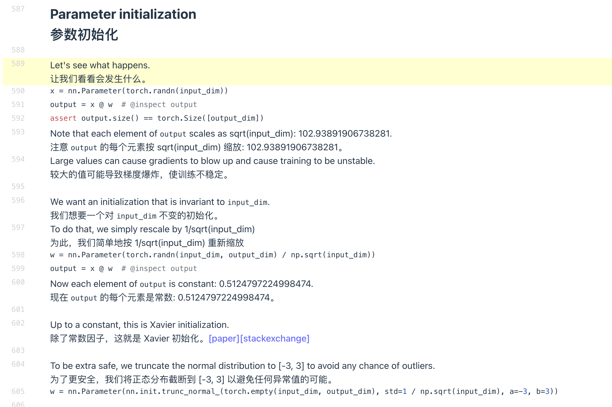

**英文**: Let's talk a little bit about parameter initialization. So if you have, let's say, a parameter that has, okay, so you generate, okay, sorry. So here you see, you know, if you have a parameter, you have to do a few things. Your W parameter is an input dimension by hidden dimension matrix. You're still in the linear model case. So let's just turn the input and let's feed it through the output. Okay. So, ran and unit Gaussian is, you know, seems innocuous. So, you get some pretty large numbers, right? And this is because when you, you know, have the number grows as essentially the square root of the hidden dimension. And so when you have large models, this is going to, you know, blow up.

**中文**: 我们来谈谈参数初始化（parameter initialization）。

假设你有一个参数……好吧，让我们生成一个……抱歉，重新组织一下。

如你所见，如果你有一个参数，你需要做几件事。在你的 W 参数是一个 输入维度（input dimension）乘以隐藏层维度（hidden dimension） 的矩阵的情况下——我们仍然是在讨论线性模型——让我们传入输入并让它通过网络产生输出。

如果你使用标准正态分布（unit Gaussian）进行随机初始化，这看起来似乎无害。但实际上，你会得到一些相当大的数值。这是因为数值的大小本质上会随着隐藏层维度的平方根


而增长。因此，当你拥有大型模型时，这种增长会导致数值爆炸（blow up）。


**英文**: And training can be a very unstable. So, so typically what you want to do is initialize in a way that's, you know, invariant to hidden or at least, you know, when you guarantee that it's not going to blow up. And one simple way to do this is just rescale by the one of the square root number of, you know, of inputs. So basically, let's redo this W equals a parameter where I simply divide by the square root of the input dimension. And then now when you feed it through the output, now you get things that are stable around, you know, this is actually concentrate to, you know, something like normal zero one. So, this is basically, you know, this has been explored pretty extensively and deep learning literature is known up to a constant as savior initialization. And typically, I guess it's a fairly common if you want to be extra safe. You don't trust it normal because it doesn't have, it has unbounded tails. And you say, I'm going to truncate to minus three three. So, I don't get any large values and I don't want any to mess with that.

**中文**: 这会导致训练过程非常不稳定。因此，通常你希望采用一种对隐藏层维度具有不变性（invariant）的初始化方式，或者至少能保证数值不会爆炸。

实现这一点的简单方法就是进行缩放（rescale）：除以输入数量的平方根。具体来说，让我们重新定义 W 参数，这次我简单地将其除以输入维度的平方根 


现在，当你将数据通过网络前向传播时，得到的结果就会保持稳定。实际上，这些结果会集中在类似标准正态分布（Normal(0, 1)）的范围内。

这种方法在深度学习文献中已经被广泛探索，被称为 Xavier 初始化（注：原文语音识别可能有误，将 "Xavier" 听成了 "savior"，但在除以输入维度平方根的语境下，这指的是 Xavier/Glorot 初始化的核心思想）。通常，如果你想更加稳妥，这是一种相当常见的做法。

有些人可能不信任正态分布，因为它的尾部是无界的（unbounded tails），可能会产生极端值。因此，他们会选择将分布截断（truncate）到 [-3, 3] 之间。这样可以确保不会产生任何过大的数值，从而避免干扰训练过程。

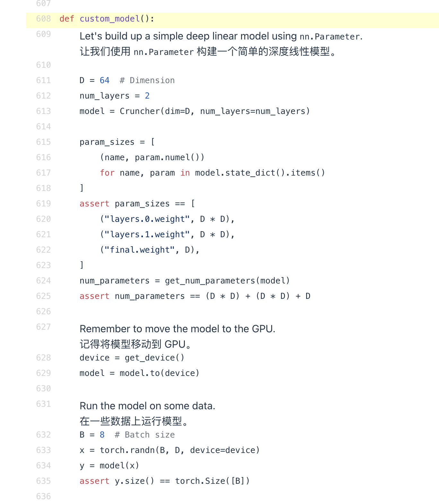

**英文**: Okay. Okay. So, let's build a, you know, just a simple model. It's going to have D dimensions and two layers. There's this, you know, I just made up this name, Cruncher. It's a custom model, which is a deep linear network, which has N, N, N, layers, layers. And each layer is a linear model, which has essentially just a matrix multiplication. Okay. So, the parameters of this model is looks like I have layers for the first layer, which is a D by D matrix. So, the second layer, which is also D by D matrix, and then I have a, a head or a final layer.

**中文**: 好的，接下来让我们构建一个简单的模型。

这个模型将具有 D 个维度，并包含两个层（注：结合后文描述，这里可能指多个隐藏层加一个输出层）。我随便起了个名字叫 "Cruncher"。这是一个自定义模型，本质上是一个深度线性网络（deep linear network），由 N 个层组成。每一层都是一个线性模型，核心操作 essentially 只是矩阵乘法。

那么这个模型的参数结构如下：

- 第一层：是一个 D X D 的矩阵；
- 第二层：同样是一个 D X D 的矩阵；
- 最后，我们还有一个输出头（head）或称为最终层（final layer）。


**英文**: Okay. So, if I get the number of, of parameters of this model, then it's going to be D squared plus D squared plus D. Okay. So, nothing too surprising there. And I'm going to move it to the GPU, so I want this to run one fast. And I'm going to generate some random data and feed it through the data. And the forward pass is just going through the layers, and then finally applying the head. Okay. So, with that model, let's try to, I'm going to use this model and do some stuff with it. But just one kind of general digression.

**中文**: 好的。那么，如果我计算该模型的参数数量，结果将是 D^2 + D^2 + D。好的，这里没什么特别意外的。接下来我会将它迁移到 GPU 上，以便快速运行。然后，我将生成一些随机数据并将其输入模型。前向传播过程就是依次经过各层，最后应用输出头。好的。有了这个模型，我们来尝试一下——我将使用该模型进行一些操作。不过，先稍作一个一般性的离题说明。


**英文**: Randomness is something that is sort of can be annoying in some cases, if you're trying to reproduce a bug, for example. It shows up in many places, initialization, dropout, data ordering. And just the best practices, I would recommend you always pass a fix the random seed. So, you can reproduce your model, or at least as well as you can. And in particular, having a different random seed for every source of randomness is nice, because then you can, for example, fix initialization or fix the data ordering, but very other things. Determinism is your friend when you're debugging. And, you know, in code, unfortunately, there's many places where you can use randomness and just be cognizant of, you know, which one you're using. And just, if you want to be safe, just set the seed to for all of them. Data loading, I guess I'll go through this quickly. It's not, it'll be useful for your assignment.

**中文**: **随机性Randomness**在某些情况下可能会令人头疼，例如当你试图复现某个 bug 时。它出现在许多地方：**参数初始化**、**Dropout**、**数据排序**等。

关于最佳实践，我建议你始终**固定随机种子（fix the random seed）**。这样你才能复现你的模型结果，或者至少尽可能接近原结果。

特别值得一提的是，为每一个随机性来源设置**独立的随机种子**是个很好的做法。因为这样一来，你就可以例如固定初始化方式或固定数据排序，同时让其他因素保持变化。当你进行调试时，**确定性Determinism**是你最好的朋友。

在代码中，不幸的是有很多地方都可以使用随机性，所以你需要清楚自己正在使用的是哪一个。如果你想要确保万无一失，最简单的方法就是为所有涉及随机性的环节都设置相同的种子。

关于**数据加载（Data loading）**，我想快速过一下这部分内容。虽然这里不会深入展开，但它对你的作业会很有帮助。

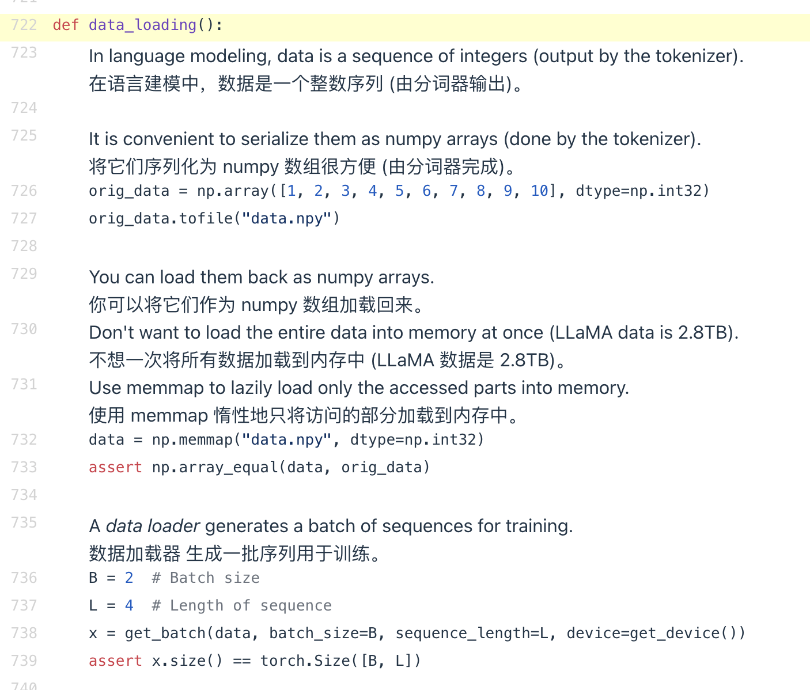

**英文**: So, in language modeling, data is typically just a sequence of integers, because this is, remember, output by the tokenizer. And you serialize them into, you can serialize them into an umpire arrays. And one, I guess, thing that's maybe useful is that you don't want to load all your data into memory at once, because, for example, the Lama data is the 2. 8 terabytes. But you can sort of pretend to load it by using this handy function called memmap, which gives you essentially a variable that is mapped to a file. So, when you try to access the data, it actually on the on demand loads the file. And then, using that, you can create a data loader that, you know, is a, you know, samples data from your batch. So, I'm going to skip over that just the interest of time. Let's talk a little bit about, you know, optimizer. So, we've defined our model.

**中文**: 在**语言建模（language modeling）**中，数据通常只是一串**整数序列**，因为这是由**分词器 tokenizer**输出的结果。你可以将这些序列序列化并存储为 **NumPy 数组**。

这里有一个可能很有用的技巧：你并不希望一次性将所有数据加载到内存中。例如，Llama 数据集的大小高达 **2.8 TB**。不过，你可以使用一个名为 **`memmap`（内存映射）** 的便捷函数来“假装”加载了数据。它本质上创建了一个映射到文件的变量；当你尝试访问数据时，系统会 **按需 on-demand** 从文件中加载相应的部分，而不是全部读入内存。

利用这种方法，你可以创建一个**数据加载器 data loader**，从中按批次（batch）采样数据。为了节省时间，这部分的具体实现我就略过了。

现在我们已经定义好了模型，接下来，让我们谈谈**优化器optimizer**。

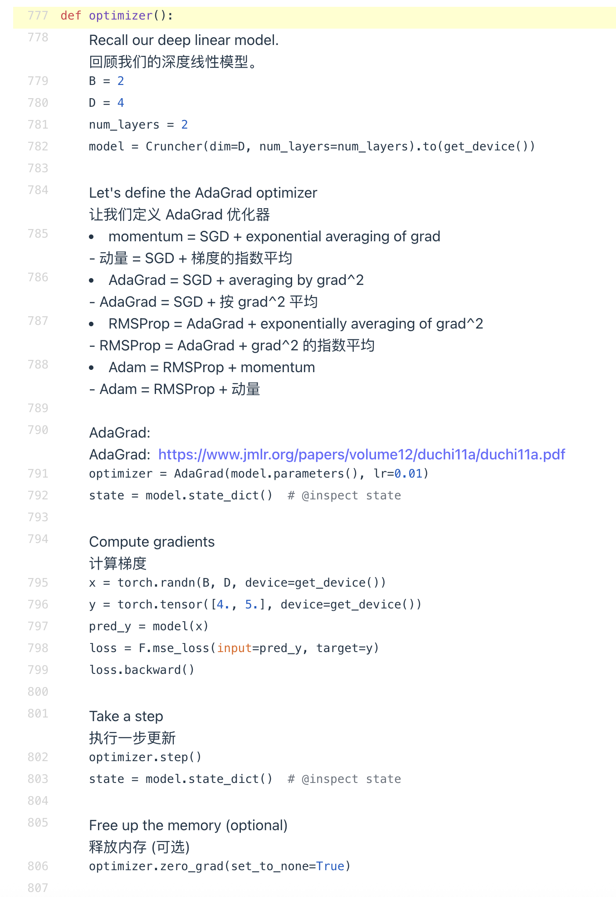

**英文**: So, there's many optimizers, just kind of maybe going through the intuitions behind some of them. So, of course, there's the Cassell gradient descent. You compute the gradient of your batch. You take a step in that direction. No questions asked. There's an idea called momentum, which dates back to classic optimization, Nesteroff, where you have a running average of your gradients, and you update against the running average instead of your instantaneous gradient. And then, you have add a grad, which you scale the gradients by your average over the norms of your, or I guess not the norms, the square of the gradients. You also have RMS prop, which is an improved version of add a grad, which uses an exponential average, rather than just like a flat average. And then, finally, add a, which appeared in 2014, which is essentially combining RMS prop and momentum. So, that's why you're maintaining both your running average of your gradients, but also running average of your gradient squared.

**中文**: 优化器有很多种，我们来简单梳理一下其中一些背后的直觉。

首先，最基础的是**随机梯度下降（Stochastic Gradient Descent, SGD）**（注：原文语音识别可能有误，将 "Stochastic" 听成了 "Cassell"）。它的逻辑很直接：计算当前批次的梯度，然后毫不犹豫地沿该方向迈出一步。

接下来是**动量（Momentum）**，这一概念源自经典优化理论（如 Nesterov 加速梯度）。它的核心思想是维护梯度的**滑动平均（running average）**，更新参数时使用的是这个平均值，而不是当前的瞬时梯度。这有助于平滑更新路径并加速收敛。

然后是 **AdaGrad**。它会通过梯度平方的累积平均值来缩放梯度（注：原文提到 "average over the norms... or square"，实际上 AdaGrad 使用的是梯度平方的累加和）。这意味着对于频繁更新的参数，学习率会自动降低；而对于稀疏更新的参数，学习率则保持较大。

紧接着是 **RMSprop**，它是 AdaGrad 的改进版本。与 AdaGrad 使用简单的累加平均不同，RMSprop 使用了**指数移动平均（exponential average）**来计算梯度平方的均值。这使得它能够更好地适应非平稳目标函数，不会像 AdaGrad 那样让学习率过早地衰减到零。

最后，是 2014 年提出的 **Adam**。它本质上是 **RMSprop 和 Momentum 的结合体**。因此，在 Adam 中，你既需要维护梯度的滑动平均（一阶矩，对应动量），也需要维护梯度平方的滑动平均（二阶矩，对应 RMSprop 的自适应学习率机制）。


**英文**: Okay, so, since you're going to implement add a, in homework one, I'm not going to do that. Instead, I'm going to implement, you know, add a grad. So, the way you implement an optimizer in, you know, PyTorch is that you override the optimizer class, and you have to, let's see, maybe I'll, and then I'll get to the implementation once we step through it. So, let's define some data, compute the forward pass on the loss, and then, you compute the gradients, and then you, when you call optimizer dot step, this is where the optimizer actually is active. What this looks like is your parameters are grouped by, for example, you have one for the layer zero, layer one, and then the final, you know, weights. And you can access a state, which is a dictionary, from parameters to, you know, whatever you want to store as optimizer state. The gradient of that parameter, you assume, is already calculated by the, the backward pass. And now you can do things like, you know, in, in add a grad, you're storing the sum of the gradient squared. So, you can get that G2 variable, and you can update that based on the square of the gradient. So, this is an element-wise squaring of the gradient, and you put it back into the state.

**中文**: 好的，既然你们在第一次作业中需要实现 **Adam** 优化器，那我就不在这里演示了。相反，我将演示如何实现 **AdaGrad**。

在 PyTorch 中实现自定义优化器的方法是：继承并覆写 `optimizer` 类。具体的实现细节，我们稍后在逐步讲解代码时再深入探讨。

现在，让我们先定义一些数据，执行前向传播（forward pass）并计算损失（loss），接着计算梯度。当你调用 `optimizer.step()` 时，优化器才真正开始工作（执行参数更新）。

其内部逻辑大致如下：
*   **参数分组**：你的参数会被分组管理，例如分为“第0层”、“第1层”以及最终的权重等。
*   **状态字典（State Dictionary）**：你可以访问一个名为 `state` 的字典，它建立了从“参数”到“你想存储的任何优化器状态”的映射。
*   **梯度前提**：此时，该参数的梯度已经被反向传播（backward pass）计算好了。
*   **更新逻辑（以 AdaGrad 为例）**：在 AdaGrad 中，你需要存储**梯度平方和**。你可以获取这个变量（代码中称为 `g2`），并根据当前梯度的平方来更新它。注意，这里是对梯度进行**逐元素平方（element-wise squaring）**，然后将结果存回 `state` 字典中，供下一次迭代使用。


**英文**: Okay, so then, your, obviously, your optimizer is responsible for updating the parameters, and this is just the, you know, you update the learning rate times the gradient divided by this scaling. So, now, this state is kept over across multiple invocations of, you know, the optimizer. Okay, so, and then at the, you know, end of your optimizer stuff, you can, you know, free up the memory just to, which is, I think, going to actually be more important when you look when we talk about model parallelism. Okay, so let's talk about the memory requirements of the optimizer states, and actually, basically, at this point, everything. So, you need to, the number of parameters in this model is D squared times the number of layers plus D for the final head. Okay, the number of activations, so this is something we didn't do before, but now, for this simple model, it's fairly easy to do. It's just B times, you know, D times the number of layers you have for every layer, for every data point, for every dimension, you have to hold the activations. For the gradients, this is the same as the number of parameters, and the number of optimizer states, and for add a grad, it's, you remember, we had to store the gradient squared, so that's another copy of the parameters. So, putting it all together, we have, the total memory is assuming, you know, FP32, which means 4 bytes times the number of parameters, number of activations, number of gradients, and number of optimizer states. Okay, and that gives us, you know, some number, which is 496 here.

**中文**: 好的，显然，优化器的职责是**更新参数**。具体的更新操作就是：用**学习率**乘以**梯度**，再除以这个**缩放因子**（在 AdaGrad 中即为累积梯度平方和的平方根）。需要注意的是，这个**状态state**会在优化器被多次调用的过程中持续保留。

在优化器步骤的最后，你可以选择**释放内存**（例如清空梯度）。我认为这一点在我们后续讨论**模型并行 model parallelism**时会变得尤为重要。

现在，让我们来谈谈**优化器状态的内存需求**，实际上也就是此刻整个系统的内存占用情况。我们需要计算以下几个部分：

1.  **参数量（Number of Parameters）**：在这个模型中，参数量等于 $D^2 \times \text{层数}$，再加上输出头（final head）的 $D$ 个参数。
2.  **激活值（Activations）**：这是我们之前没详细算过的，但对这个简单模型来说很容易计算。对于每一层、每一个数据点、每一个维度，你都需要保存激活值。因此，激活值的总量大约是 $B \times D \times \text{层数}$（其中 $B$ 是批次大小）。
3.  **梯度（Gradients）**：梯度的数量与参数量相同。
4.  **优化器状态（Optimizer States）**：对于 **AdaGrad**，正如我们之前提到的，需要存储**梯度的平方和**。这意味着你需要额外开辟一块与参数量大小相同的内存来存储这些状态（相当于参数的另一份拷贝）。

综上所述，**总内存占用**的计算逻辑如下：
假设我们使用 **FP32**（单精度浮点数），即每个数值占用 **4 字节**。
总内存 = 4 字节 $\times$ (参数量 + 激活值数量 + 梯度数量 + 优化器状态数量)。

把这些加起来，我们就得到了一个具体的数值，在这里计算结果是 **496**（单位通常取决于上下文，可能是 MB 或特定的内存块计数）。


**英文**: Okay, so this is a fairly simple calculation, in the assignment one, you're going to do this for the transformer, which is a little bit more involved, because you have to, there's not just matrix multiplications, but there's many matrices, there's attention, and there's all these other things. But the general form of the calculation is the same, you have parameters, activations, gradients, and optimizer states. Okay, and the, so, and the flops required, again, for this model is six times the number of tokens, or the number of data points times the number of parameters, and, you know, that's basically concludes the resource accounting for this particular model. And if, for reference, if you're curious about working this out for, for transformers, you can consult some of these articles. Okay, so in the remaining time, I think, maybe I'll pause for questions. And we talked about building up the tensors, and then we built a kind of a very small model, and, you know, we talked about optimization, and how many, how much memory, and how much compute was required. So the question is, why do you need to store the activations? So naively, you need to store the activations, because when you're, when you're doing the paper pass, the gradients of, let's say, the first layer depend on the activation. So the gradients of the i-clare depends on the activation there. Now, if you're smarter, you don't have to store the activations, or you don't have to store all of them, you can recompute them, and that's something a technical called activation checkpoint, in which we can talk about later. Okay, so let's just do this quick, you know, actually there's not much to say here, but, you know, here's your typical, you know, training loop, where you define the model, define the optimizer, and you get the data, and then, you know, feed forward, backward, and take a step in a parameter space.

**中文**: 好的，这个计算相对简单。在**第一次作业**中，你们将针对 **Transformer** 模型进行类似的计算，那会稍微复杂一些。因为 Transformer 不仅仅涉及矩阵乘法，还包含多个矩阵、**注意力机制（Attention）**以及其他组件。不过，计算的总体形式是一样的：你都需要统计**参数（Parameters）**、**激活值（Activations）**、**梯度（Gradients）**和**优化器状态（Optimizer States）**。

关于所需的**浮点运算量（FLOPs）**，对于这个模型，其计算量大约是 $6 \times \text{Token 数量}$（或者说是 $6 \times \text{数据点数量} \times \text{参数量}$）。至此，我们就完成了对该特定模型的**资源核算（resource accounting）**。

如果你好奇如何对 **Transformer** 进行类似的推导，可以参考这里列出的一些文章作为指引。

在接下来的时间里，我先暂停一下，看看大家有没有问题。

我们之前讨论了如何构建张量（tensors），构建了一个非常小的模型，并探讨了优化过程，以及需要多少内存和计算资源。

这里有一个关键问题：**为什么我们需要存储激活值？**
*   **直观上**：你需要存储激活值，因为在**反向传播（backward pass）**时，某一层（比如第一层）的梯度计算依赖于该层的激活值。具体来说，第 $i$ 层的梯度依赖于该层的激活输出。
*   **更聪明的做法**：你其实不必存储所有的激活值。你可以选择在使用时**重新计算（recompute）**它们。这项技术被称为**激活检查点（Activation Checkpointing）**（也常称为重计算，Recomputation），我们稍后可以详细讨论。

最后，让我们快速过一下典型的**训练循环（training loop）**，其实没什么特别复杂的：
1.  定义模型；
2.  定义优化器；
3.  获取数据；
4.  执行**前向传播（feed forward）**；
5.  执行**反向传播（backward）**；
6.  在参数空间中执行**更新步（step）**。

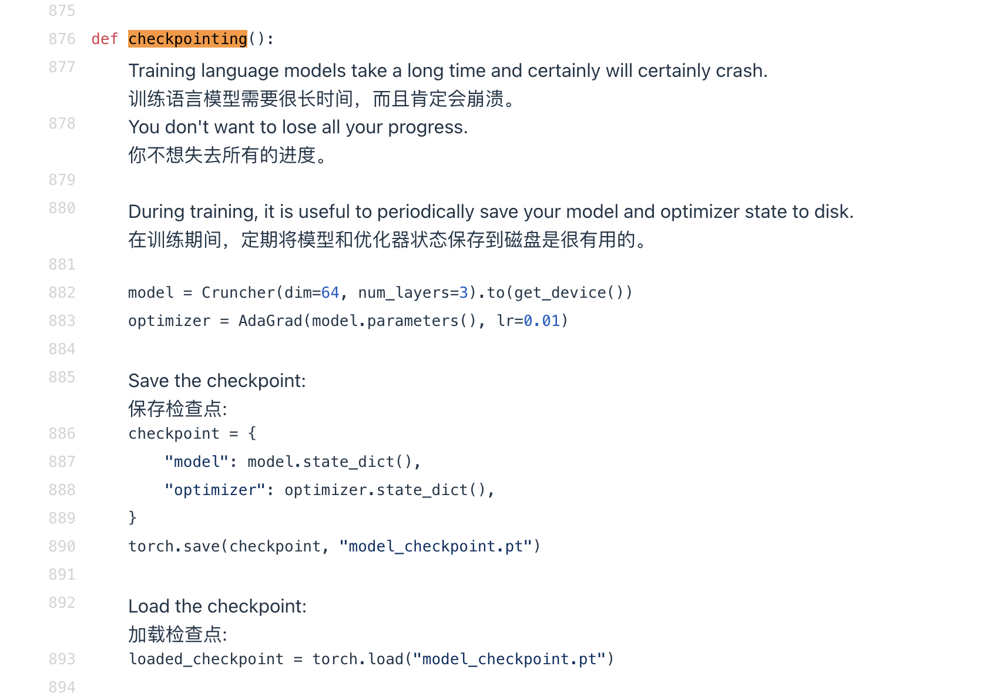

**英文**: And, I guess, it would be more interesting, I guess, next time I should show, like, actual 1D clock, which isn't available on this, on this version. So, one note about checkpointing, so training language model takes the long time, and you're certainly, well, a crash at some point, so you don't want to lose your progress. So you want to periodically save your model to disk, and just to be very clear, the thing you want to save is both the model and the optimizer, and probably, you know, which iteration you're on, which should add that. And then, you can just load it up. One, maybe, final note, and out, and is, why do you kind of mix a precision in your training? You know, choice of the data type has the different trade-offs. If you have higher precision, it's more accurate and stable, but it's more expensive, and low precision fights versa. And, as we mentioned before, by default, the recommendations use float32, but try to use BF16, or even FP8 whenever possible. So you can use lower precision for the fifth forward pass, but float32 for the rest. And this is an idea that goes back to the, you know, 2017, there's exploring mixed precision training. PyTorch has some tools that automatically allow you to do, you know, mix precision training, because it can be sort of annoying to have to specify which parts of your model it needs to be, you know, what precision.

**中文**: 我想，下次展示实际的 **1D 时钟（1D clock）** 可能会更有趣，不过当前这个版本还没有提供。

关于**检查点（checkpointing）**有一点需要说明：训练语言模型耗时很长，过程中难免会发生崩溃。为了不让之前的努力付诸东流，你需要定期将模型保存到磁盘上。这里需要非常明确的是，保存的内容不仅要包括**模型参数**，还必须包括**优化器状态**，以及当前的**迭代次数（iteration number）**。这样，你之后就可以从中断的地方继续加载并训练。

最后再补充一点：**为什么在训练中要混合使用不同的精度？**
选择不同的数据类型涉及不同的权衡：
*   **高精度**：更准确、更稳定，但计算成本更高；
*   **低精度**：反之，效率更高但可能牺牲稳定性。

正如我们之前提到的，虽然默认建议使用 **Float32**，但在可能的情况下，应尽量尝试使用 **BF16** 甚至 **FP8**。例如，你可以在**前向传播和反向传播**的主要计算部分使用较低精度，而在其他部分（如参数更新或累加）保留 **Float32** 以确保数值稳定。

这种**混合精度训练 Mixed Precision Training**的理念最早可以追溯到 2017 年的相关研究。**PyTorch** 现在提供了一些工具，可以自动帮你实现混合精度训练，因为手动指定模型各部分所需的精度确实非常繁琐且容易出错。


**英文**: Generally, you define your model as, you know, sort of this clean modular thing, and the specified in the precision is sort of like, you know, something that needs to cut across that. And one, I guess maybe one kind of general comment is that people are pushing the envelope on what precision is needed. There's some, you know, papers that show you can actually use FP8, you know, all the way, you know, through. There's, I guess one of the challenges is, of course, when you have lower precision, it gets very numerically unstable, but then you can do various tricks to, you know, control the, the numerics of your model during training so that you don't get into these, you know, bad regimes. So this is where I think the systems and the model architecture design kind of are synergistic because you want to design models now that we have, a lot of model design is just governed by hardware. So even the transformers we mentioned last time is governed by the having GPUs. And now if we notice that, you know, Nvidia chips have the property that if lower precision, even like int 4, for example, is one thing. Now, if you can make your model training actually work on in 4, which is, I think, quite, quite hard, then you can get massive, you know, speed ups and your model will be more, you know, efficient. Now, there's another thing which we'll talk about later, which is, you know, often you'll train your model using more sane, you know, floating point. But when it comes to inference, you can go crazy and you take your preach model and then you can quantize it and get a lot of the gains from very, very aggressive quantization.

**中文**: 通常，我们将模型定义为一个清晰、模块化的结构，而**精度 precision**的选择则是一个需要贯穿整个设计的考量因素。

我想提出一个普遍的观点：人们正在不断挑战精度的极限。已有一些论文表明，实际上可以全程使用 **FP8**（8位浮点数）进行训练。当然，其中的挑战在于，较低精度会导致**数值不稳定（numerically unstable）**。不过，我们可以采用各种技巧来控制在训练过程中的数值表现，从而避免模型陷入这些不稳定的“糟糕状态”。

我认为，这正是**系统（Systems）**与**模型架构设计**产生协同效应的地方。如今的模型设计在很大程度上受限于硬件特性。正如我们上次提到的，Transformer 架构的兴起就深受 **GPU** 可用性的影响。

现在，如果我们注意到 **Nvidia** 芯片的特性——它们支持更低精度的计算，例如 **INT4**（4位整数）。如果你能让模型训练在 INT4 精度下稳定运行（这确实非常困难），那么你将获得巨大的**加速效果**，模型的效率也会显著提升。

此外，还有一点我们稍后会讨论：通常情况下，我们会使用相对“稳健”的浮点精度（如 FP16 或 BF16）来**训练**模型；但在**推理（inference）**阶段，我们可以更加激进。你可以对训练好的模型进行**量化（quantize）**，通过极端的量化策略来获得显著的性能增益和内存节省。

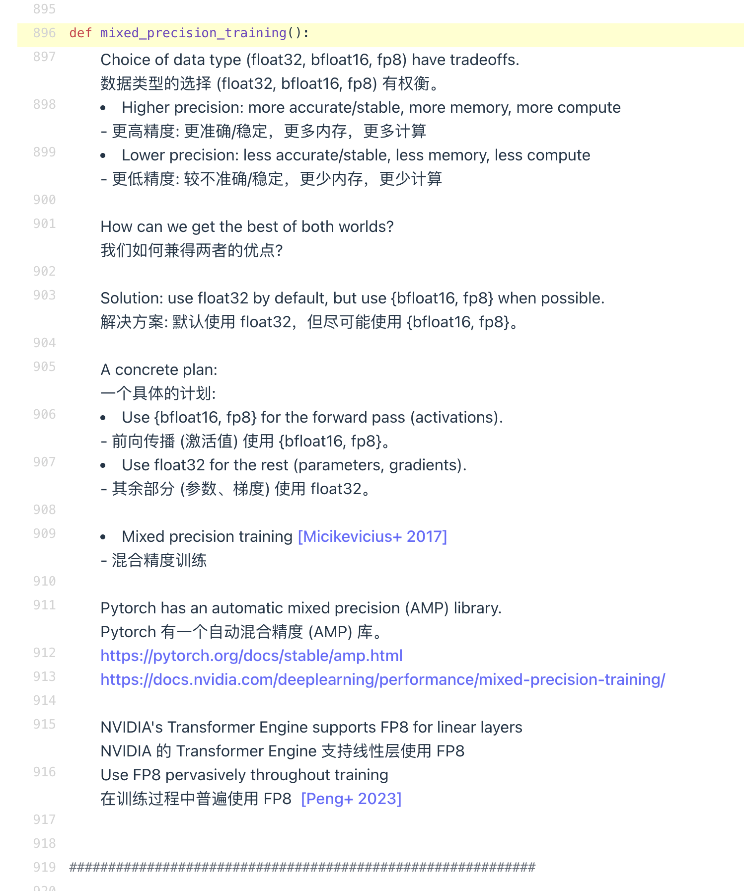

**英文**: So somehow training is a lot more difficult to do with low precision, but once you have a training model, it's much easier to make it low precision. Okay, so I will wrap up there just to conclude. We have talked about the different primitives to use to train a model building up from tensors all the way to the training loop. We talked about memory accounting and flops accounting for these simple models. Hopefully once you go through assignment one, all of these concepts will be really solid because you'll be applying these ideas for actual transformer. Okay, see you next time.

**中文**: 因此，以低精度进行训练要困难得多，但一旦完成了模型训练，再将其转为低精度则容易得多。好了，我就在此收尾总结一下。我们讨论了用于模型训练的各种基础组件，从张量开始，逐步构建到完整的训练循环；还探讨了这些简单模型的内存占用和浮点运算量（FLOPs）估算方法。希望在完成第一次作业后，所有这些概念都能真正掌握扎实，因为你们将把这些思路实际应用于Transformer模型。好的，下次见！

---
