## 课程介绍与事务安排
正如大家可能已经注意到的，我的授课风格不如 Percy 那般“前沿”，因此我会提供 PowerPoint 幻灯片，而非可执行的 Python 代码 (Python Code)。大家也可以在课程网站上下载 PDF 版本。我将本次讲座命名为《关于大语言模型架构与训练的那些你不想了解的细节》，因为我们将深入探讨一些我认为其他课程通常会略过的底层细节，例如“我的超参数 (Hyperparameters) 到底该如何设置？”等问题。另外说明一项事务性安排：作业内容会随着我们修复（主要是次要的缺陷 minor bugs）而持续更新。请务必在开发过程中随时拉取 (pull) 最新的代码版本。

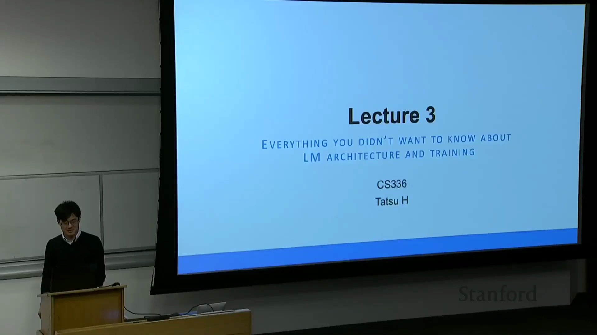
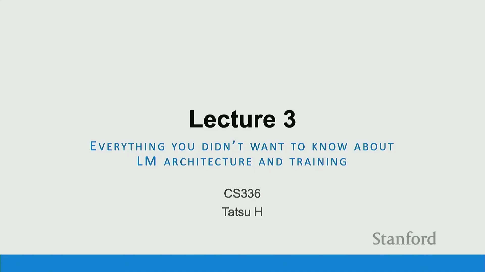
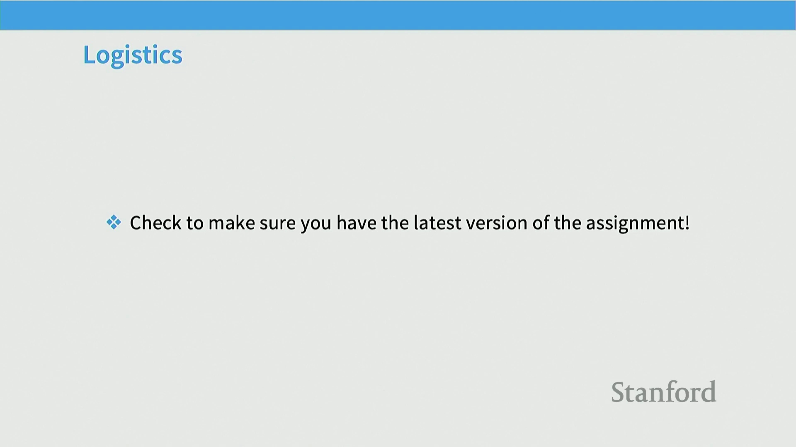
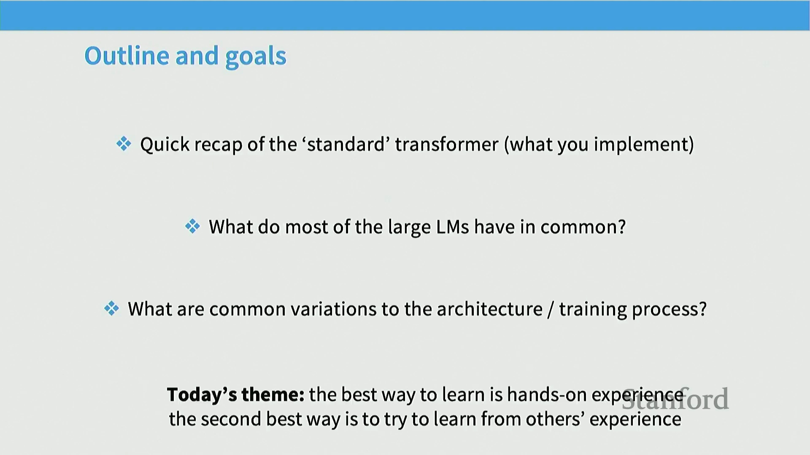

## 讲座大纲与演化分析
接下来我们要做什么呢？我们将首先快速回顾 Transformer。我会介绍两种标准的 Transformer 变体：一种可能源自大家在 224N 课程中常见的经典架构讲解；另一种则是你们即将在作业中实现的、符合当前业界共识的现代 Transformer 变体。接下来，我们将采用数据驱动的视角来剖析 Transformer 架构。核心问题在于：迄今为止，研究人员已训练了海量大语言模型 (Large Language Models, LLMs)。通过研读相关论文，我们可以分析其中的差异与共性，并尝试以近乎“演化分析”的视角，探究究竟哪些因素对 Transformer 的高效运行至关重要。因此，今天课程的宏观主旨是“实践出真知”，但本次讲座的具体切入点则是：既然我们无暇亲自训练所有这些模型，不妨“借鉴他人的实践经验”。
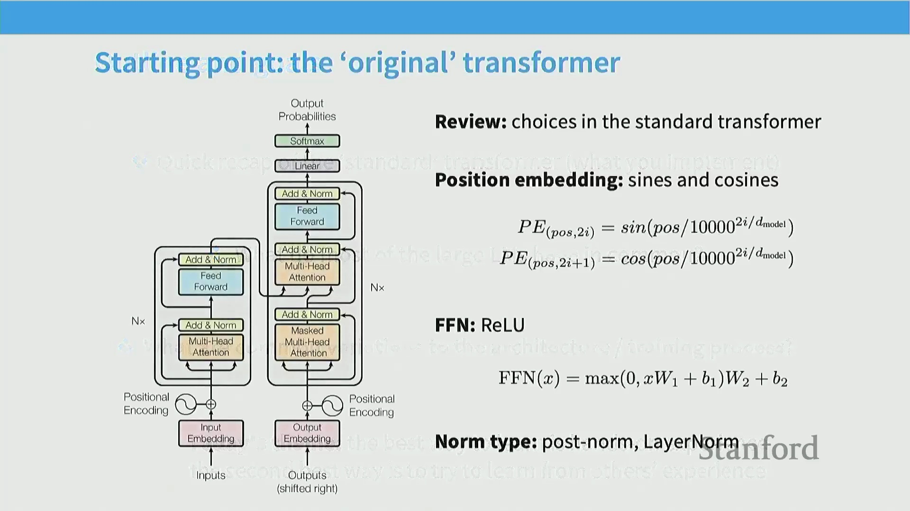

## 原始 Transformer 架构回顾
我们的起点是原始 Transformer 架构。简单回顾一下，希望大家还记得 224N 或其他深度学习课程中的内容。模型底部包含简单的位置编码 (Position Embeddings)，随后是多头注意力机制 (Multi-Head Attention) 和层归一化 (Layer Normalization)。残差流 (Residual Stream) 向上延伸，经过一个多层感知机 (MLP)，最终以 Softmax 层输出结果。我们将逐一探讨这些组件的各类变体，并追踪其演进至当前最先进的 Transformer 架构的过程。最后我将介绍几个月前刚刚问世的最新版本。
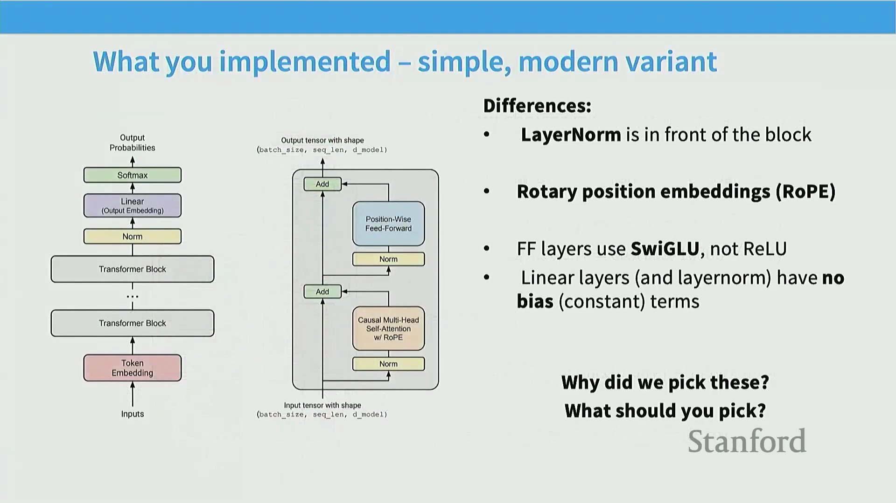

## 现代共识与作业变体
你们在作业中实现的并非原始论文中“原汁原味”的 Transformer，而是经过调整的变体。例如，我们将层归一化移到了模块前方。如幻灯片所示，在残差流进入每个子模块前都会先进行归一化处理。此外，作业要求大家实现旋转位置编码 (Rotary Position Embeddings, RoPE)。前馈网络采用了 SwiGLU 激活函数 (SwiGLU Activation)，且线性层会保留偏置项 (Biases)。大家可能会疑惑：为何不直接实现《Attention Is All You Need》中的原始架构，而要采用这种看似“奇特”的变体？接下来我们将逐一解答这些疑问。
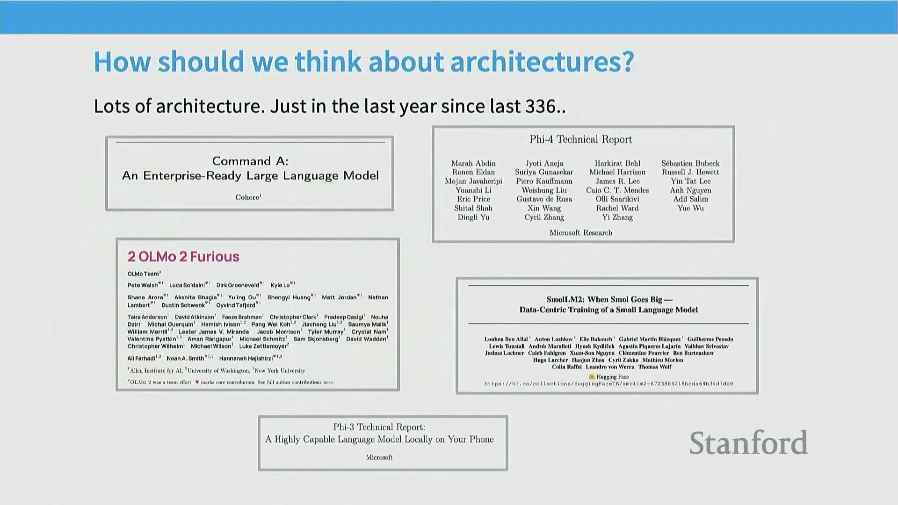

## 架构的快速演进与趋同趋势
昨天我梳理了过去一年架构领域的最新进展。Percy 曾提醒过我这项工作十分繁重，因为相关技术每年都在迭代。查阅文献后，我发现确实涌现了许多优秀的工作，例如 Command R、Qwen 2.5 以及 Llama 系列等。继续检索还能发现 Gemma 3、InternLM 等更多模型。正如幻灯片所示，模型数量庞大，甚至无法全部列出。过去一年中，大约发布了 19 个新型稠密模型 (Dense Models)，其中不少都进行了细微的架构调整。一方面，逐篇阅读并厘清每个模型的改动确实耗时费力；但另一方面，这也是一笔宝贵的知识财富，因为不同模型的设计选择各不相同。大家或许能注意到（后排同学若看不清细节请见谅），我整理了一张表格，汇总了这些模型的技术路线，时间跨度从 2017 年的原始 Transformer 一直延续至 2025 年的最新架构。我们稍后将详细探讨其中的细节。从中可以看出，各类架构改进方案正在不断演进。以位置编码 (Position Embeddings) 为例，业界曾尝试过绝对位置编码 (Absolute Position Embeddings)、相对位置编码 (Relative Position Embeddings)、RoPE，以及一度流行的 ALiBi。但自 2023 年左右起，几乎所有模型都统一采用了 RoPE。这清晰地展现了神经网络架构在实践中的“趋同演化”。我们将对这些方面逐一展开讨论。
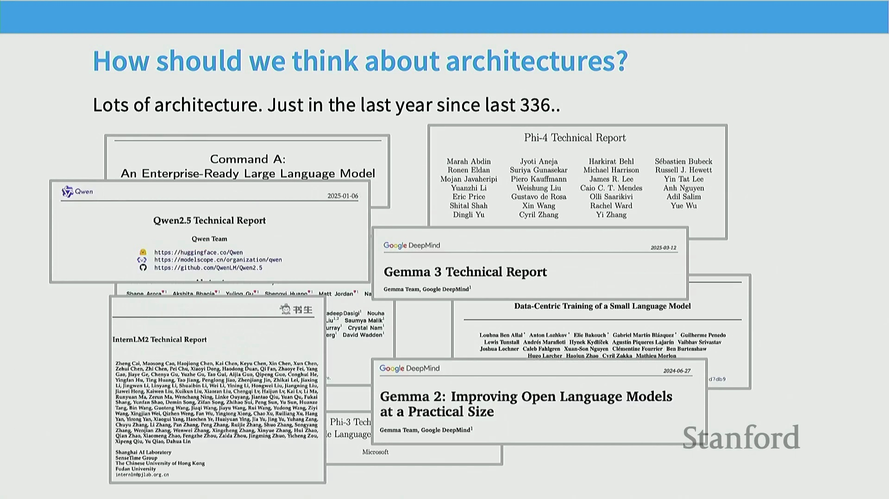
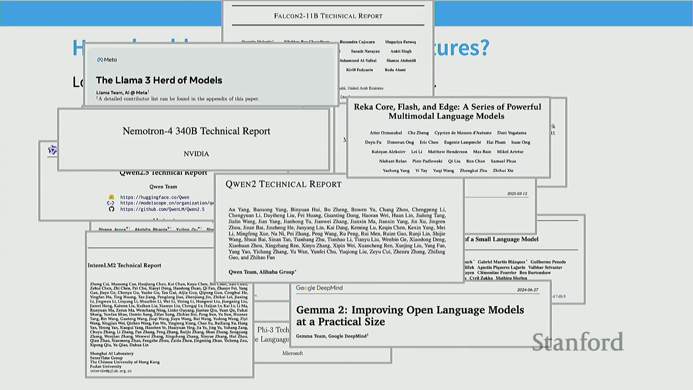
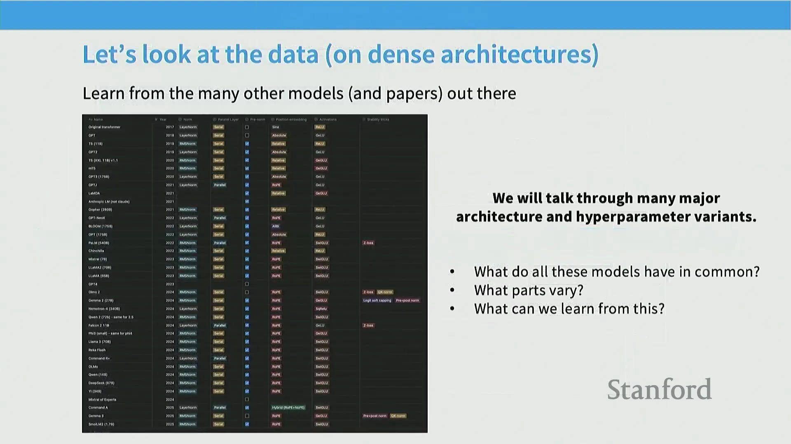
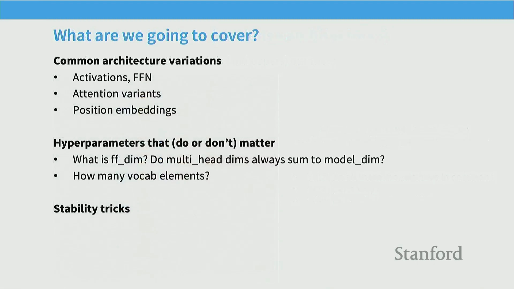

## 讲座路线图：架构与超参数
以下是本次讲座的核心内容概览，主要分为三个章节。若时间充裕，我将在最后补充讨论不同的注意力机制变体。第一部分聚焦架构变体，也是本次的重点，涵盖激活函数、前馈网络、注意力机制以及位置编码等。确定架构后，下一步便是设定超参数 (Hyperparameters)。例如：隐藏层维度 (Hidden Dimension) 应设为多大？MLP 内部的投影层 (Projection Layer) 规模如何确定？各维度如何权衡？词表大小 (Vocabulary Size) 该取何值？在实际训练语言模型时，这些都是必须审慎考量的关键参数，绝不能盲目猜测。我们需要通过科学、系统的方法来合理设定它们。
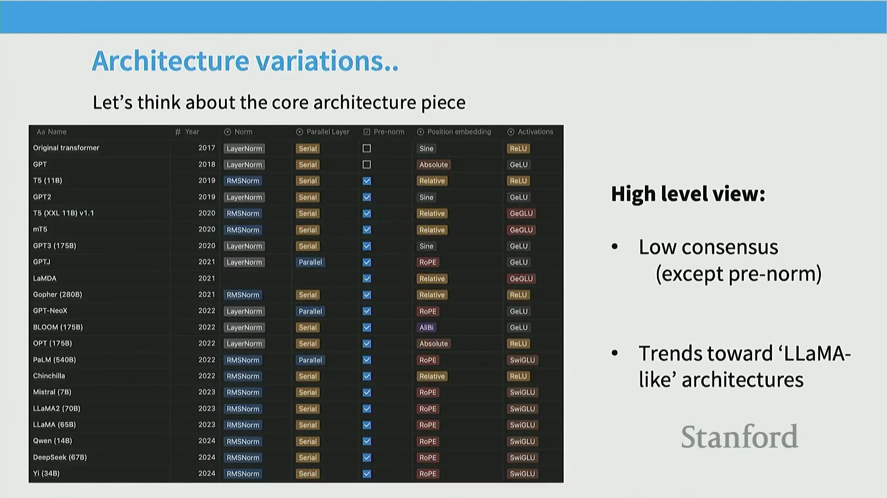

## 架构变体与业界共识
我们首先从架构变体讲起。在此我先抛出两个核心观点，并将在后续内容中反复强调。其一，业界在许多设计选择上尚未达成完全共识。尽管过去几年中，我称之为“类大语言模型架构 (LLM-like Architectures)”的底层设计已呈现出一定的趋同演化趋势，但研究者们仍在不断探索新方案。例如，在层归一化 (Layer Normalization) 与均方根归一化 (RMS Normalization) 之间切换，以及串行与并行模块结构的尝试。其中有一项设计几乎被所有模型采纳，且自初代 GPT 沿用至今，我稍后会详细讲解。但总体而言，该领域仍存在诸多值得深入研究的变体。
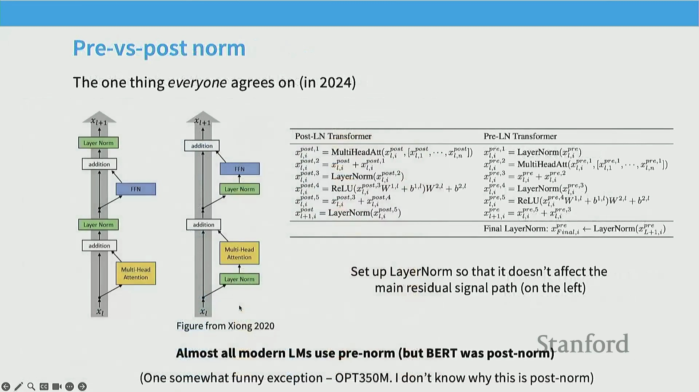

## 关键转变：前置归一化（Pre-Norm）与后置归一化（Post-Norm）
最关键的一点是归一化位置的选择。这在 224N 课程中已详细讲解过，因此熟悉该内容的同学可将其视为复习。我认为业界最早达成共识的架构调整之一，便是关于前置归一化 (Pre-Norm) 与后置归一化 (Post-Norm) 的取舍。该术语可能初听令人困惑。原始 Transformer 论文（左图所示）采用的是后置归一化：图中灰色部分代表残差流 (Residual Stream)，层归一化被置于每个子模块之后。具体流程为：先执行多头注意力计算，将输出与残差流相加，随后进行层归一化。前馈网络（全连接层）的处理逻辑亦然。早在研究初期，学界便意识到将层归一化移至子模块前方（即右图所示结构）能带来显著的性能提升。据我所知，目前几乎所有现代大语言模型均采用了这种前置归一化设计。近期涌现的少量创新我将在后续幻灯片中介绍，但主流模型已全面转向该范式。唯一的例外是 OPT-350M 模型，我认为其训练过程可能出现了偏差，在架构演进图谱中显得较为孤立。这也是我在梳理文献时发现的一个有趣现象。追溯前置与后置归一化的历史渊源，早期研究的核心论点在于：若采用后置归一化，模型训练极易出现不稳定现象，必须依赖精细的学习率预热 (Learning Rate Warm-up) 等技巧才能维持训练平稳。因此，在 Salazar 与 Yan 的早期研究以及 Xiong 等人（2020 年）的论文中，几乎都能看到如下结论：若采用前置归一化并辅以其他稳定性优化技巧，便可省略预热步骤，且模型性能至少不逊于、甚至优于依赖精细预热的后置归一化系统。这一结论不仅在机器翻译等任务中得到验证，在右侧展示的其他任务（尤其是采用后置归一化训练的 BERT 模型）中同样成立。关于前置归一化为何更优，学界曾存在诸多争论。一种主流观点认为，前置归一化能有效缓解跨层梯度衰减 (Gradient Decay) 问题。采用前置归一化时，梯度幅值可保持相对恒定；反之，若不使用预热的后置归一化，梯度则容易如图中橙色曲线所示发生梯度爆炸 (Gradient Explosion)。这一论点具备充分的理论依据。然而，从现代深度学习视角来看，更直观的解释是：前置归一化本身即是一种更稳定的训练架构。早期 Salazar 与 Yan 等人的研究已明确指出损失尖峰 (Loss Spikes) 现象：若采用蓝色曲线所示的后置归一化训练，不仅损失尖峰频发，整个训练过程也极不稳定。如图所示，后置归一化的梯度范数 (Gradient Norm) 会出现剧烈尖峰，且整体数值显著高于前置归一化。因此，在当今的实践中，前置归一化及其他层归一化变体本质上已被视为训练大规模神经网络时的关键稳定性保障机制。
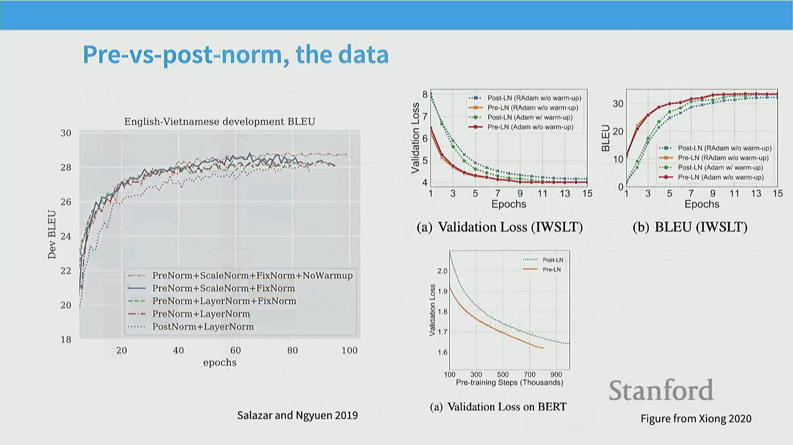
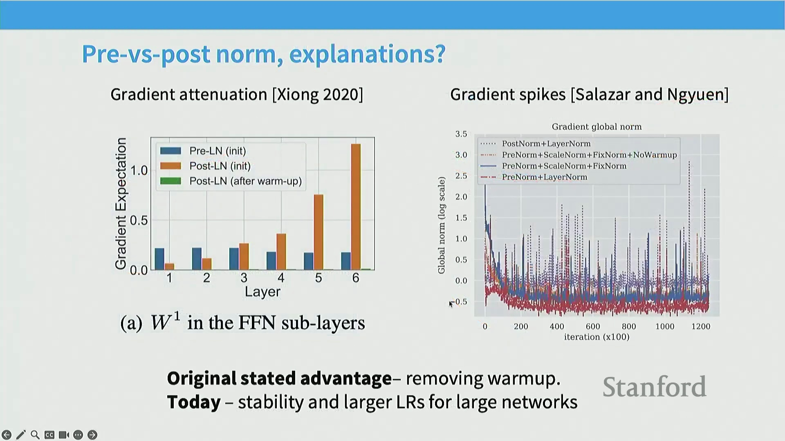

## 近期创新与“双重归一化”（Double Norm）方法
由此引出近期一项颇具新意且我认为相当重要的创新。这在我去年的课程中尚未出现，目前我暂且将其命名为“双重归一化 (Double Norm)”，虽尚未有统一的学术定名，但该架构已引起广泛关注。回顾开篇展示的原始架构图，我们已知将层归一化置于残差流末端效果不佳。但今年 224N 课程中有同学提出疑问：为何必须将归一化前置？能否将其移至前馈网络之后？事实上不仅可以，近期部分研究甚至尝试在子模块的前后同时引入层归一化。例如，Gemma 2 等模型便采用了这种“双重归一化”设计，而其他部分模型则仅采用……
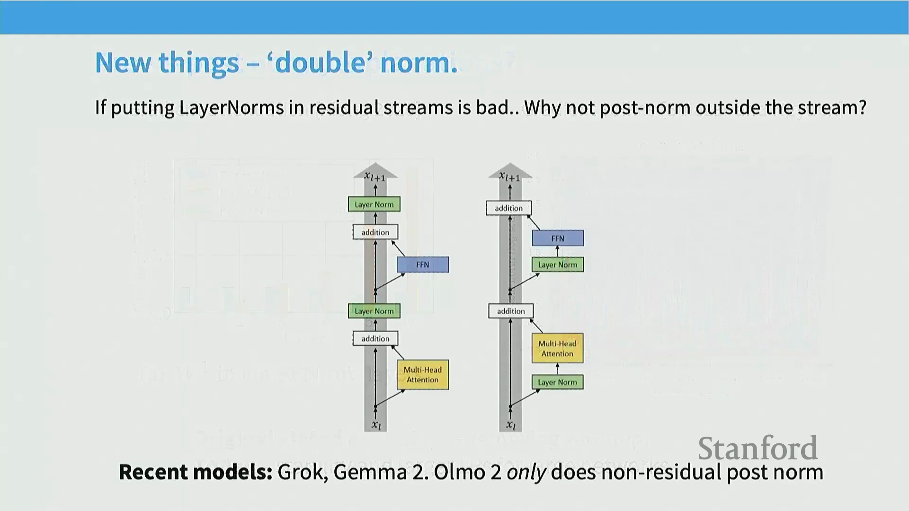

---

## 层归一化位置的演进
而 Gemma 2 模型仅在前馈网络(Feed-Forward Network, FFN)和多头注意力机制(Multi-Head Attention)之后使用层归一化(Layer Normalization)。这实际上代表了一种相当有趣的设计演进。在相当长的一段时间里，前置归一化(Pre-Norm)曾占据绝对主导地位，几乎是业界的唯一选择。但近年来情况有所变化，涌现出了新的架构变体。事实上，业界已对这种方法进行了系统评估，部分研究表明，在训练超大规模模型时，该设计能带来更高的训练稳定性(Training Stability)与更优的性能表现。
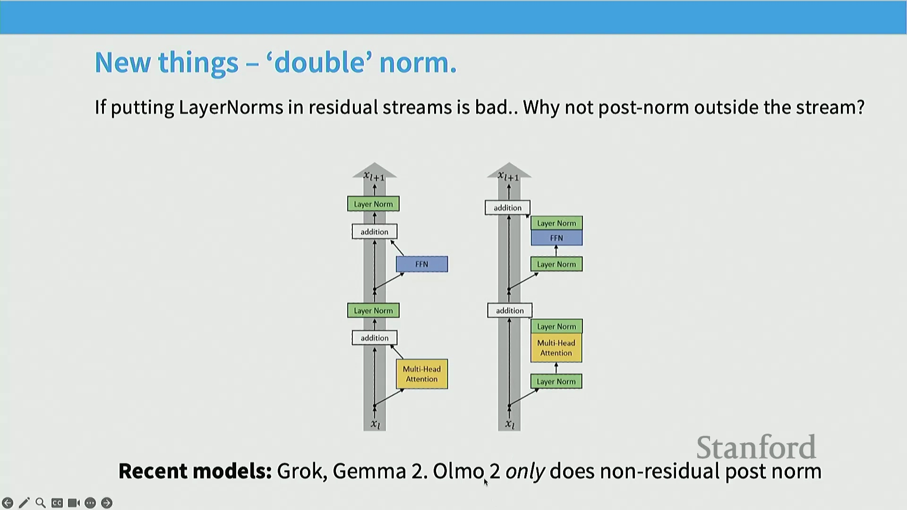

为什么将层归一化置于残差路径中效果不佳？这是一个很好的问题。目前尚难给出严格的数学证明，但可以从直观角度进行解释：残差连接(Residual Connection)为网络提供了一条从底层几乎直通顶层的恒等映射(Identity Connection)。因此，在训练极深网络时，它能极大促进梯度传播(Gradient Propagation)。尽管关于长短期记忆网络(Long Short-Term Memory, LSTM)及其他状态空间模型(State Space Models)在梯度反向传播时面临困难的讨论层出不穷，但恒等连接能有效规避此类问题。若在残差路径中间插入层归一化，则可能破坏这种高效的梯度传播特性。大家在此处的图表中也能直观看到这一现象。若理论成立，我们预期观察到的数据曲线正如下图所示。
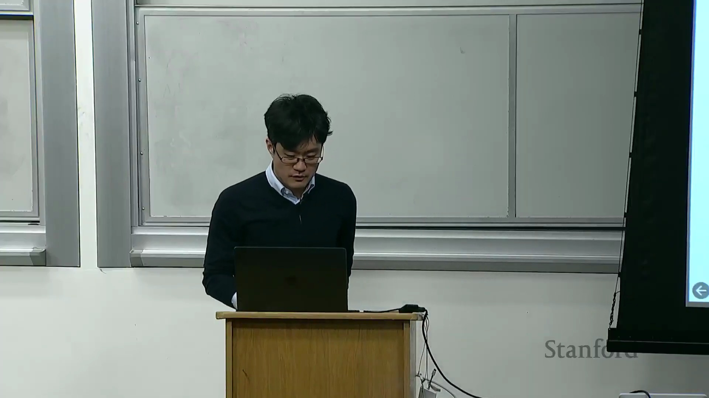
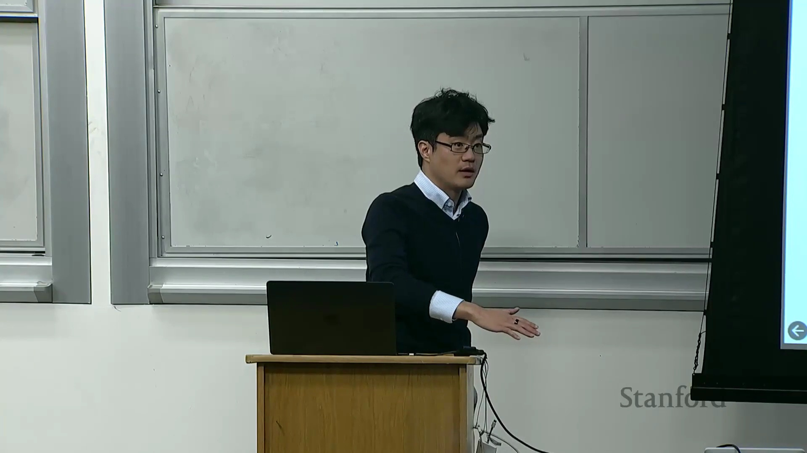
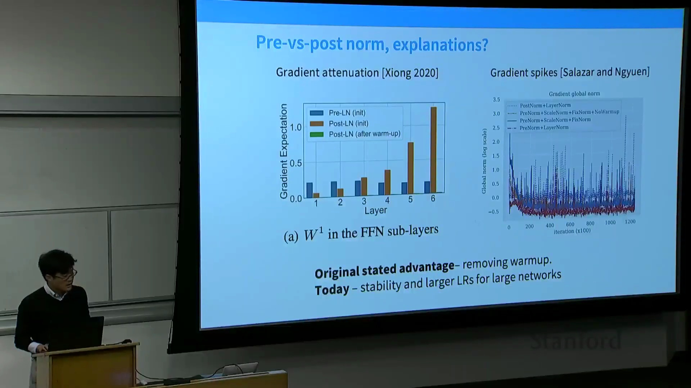

## 转向 RMS 归一化：简化与效率
当前架构演进的另一大趋势是归一化方式的替换。在原始 Transformer 中，默认使用的是层归一化(Layer Normalization)。其公式如右侧所示：首先接收激活值(Activations) $x$，减去经验均值（即 $x$ 的平均值）；随后除以（方差加上极小平滑项 $\epsilon$ 的平方根）。这一步可大致理解为计算标准差，目的是将激活值 $x$ 进行标准化处理。接着，利用可学习的缩放参数 $\gamma$ 和平移参数 $\beta$ 对其进行仿射变换(Affine Transformation)。这一设计非常合理：先对激活值进行归一化，再将其映射至模型所需的分布范围。许多早期模型均采用此方法，且表现优异。
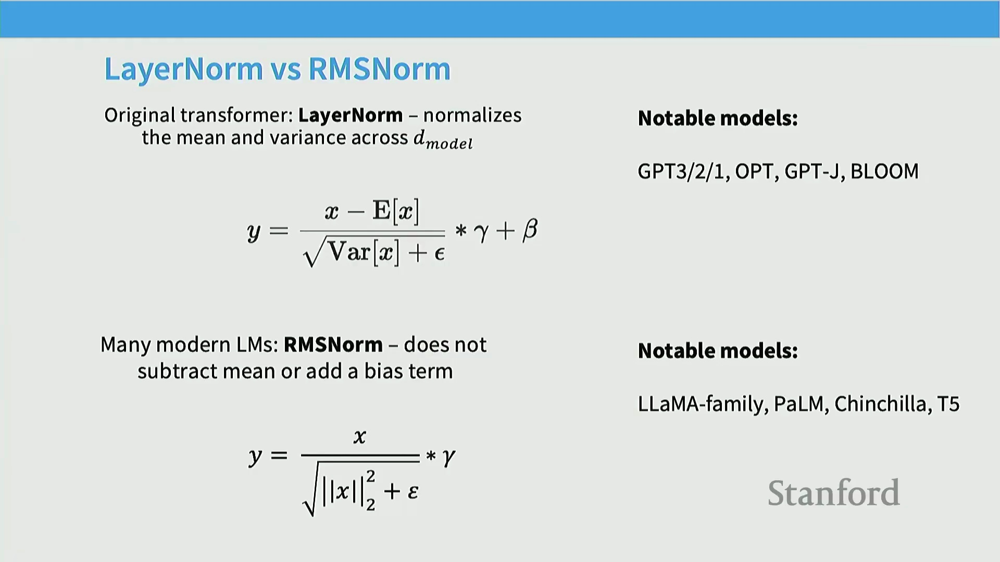
然而，目前绝大多数模型已转向均方根归一化(Root Mean Square Normalization, RMS Norm)。这已成为业界的一项共识性改进。具体而言，现代架构如何操作呢？其核心在于摒弃均值计算与偏置项($\beta$)，仅保留基于均方根的缩放。包括 Llama 系列、PaLM、Chinchilla 和 T5 在内的众多知名模型均已采用 RMS 归一化。为何会发生这一转变？首要原因是该改动并未带来明显的性能损失：实验表明，使用 RMS 归一化训练的模型效果与层归一化持平，从而实现了结构简化。但更为关键、且值得大家深入体会的一点在于：RMS 归一化能显著提升计算速度，同时保持同等出色的性能。

## 超越 FLOPs：内存移动的关键作用
那么，它为何能更快？一方面，省略均值减法直接减少了浮点运算次数(Floating Point Operations, FLOPs)。另一方面，无需加载和累加偏置项也降低了访存开销，即减少了从内存读取至计算单元的数据量。部分同学可能会疑惑：“在 224N 课程中您不是强调过吗？对于模型运行时间而言，除矩阵乘法(Matrix Multiplication)外其他操作均可忽略。而 RMS 归一化并非矩阵乘法，为何还要关注它？”这一观点在理论层面有一定合理性。若仅从 Transformer 各组件所占 FLOPs 的比例来看（参考右侧表格），2023 年一篇题为《Memory Movement Is All You Need》的优秀论文对 Transformer 各组件进行了详尽的硬件性能剖析。
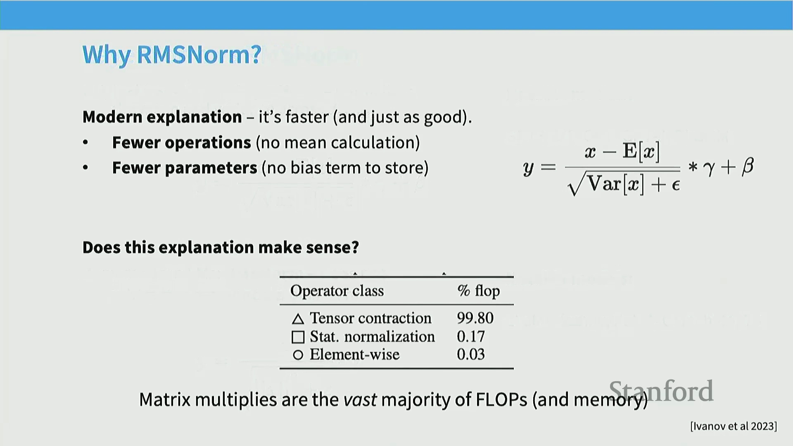
数据显示，张量收缩(Tensor Contraction，类矩阵乘法操作)占据了 Transformer 约 99.8% 的 FLOPs。表面上看，节省 0.17% 的 FLOPs 似乎微不足道。然而，现代系统架构设计的一个核心理念是：不能唯 FLOPs 论。尽管 FLOPs 至关重要，但它并非衡量计算效率的唯一指标，内存带宽与访存延迟(Memory Movement)同样关键。因此，尽管张量运算占据了绝大部分算力，但 Softmax 或层归一化等归一化操作虽然仅占 0.17% 的 FLOPs，在实际运行中却可能消耗高达 25% 的执行时间(Execution Time)。
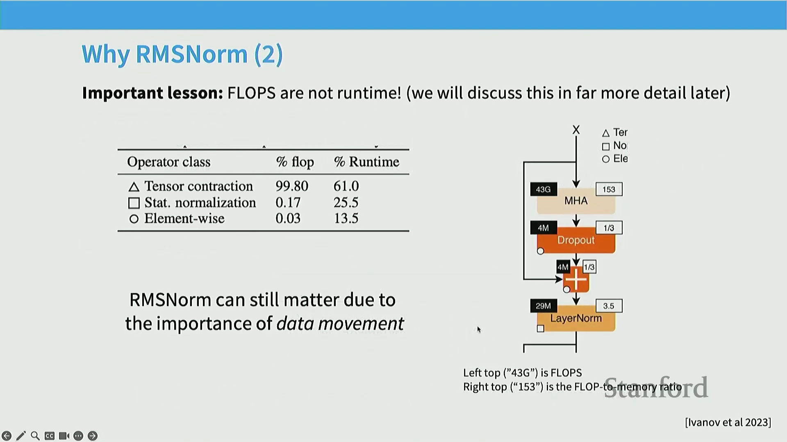
造成该现象的主因在于，此类归一化操作属于内存受限型(Memory-Bound)计算，会产生大量访存开销。因此，优化这些底层细节具有极高的工程价值，这不仅关乎 FLOPs，更直接影响内存带宽利用率。在后续的系统架构课程中，我将重点强调这一点。例如，在探讨 GPU 硬件架构时，深入分析内存访问模式而非仅仅关注 FLOPs 将变得至关重要。这正是 RMS 归一化近年来备受青睐的核心原因之一。
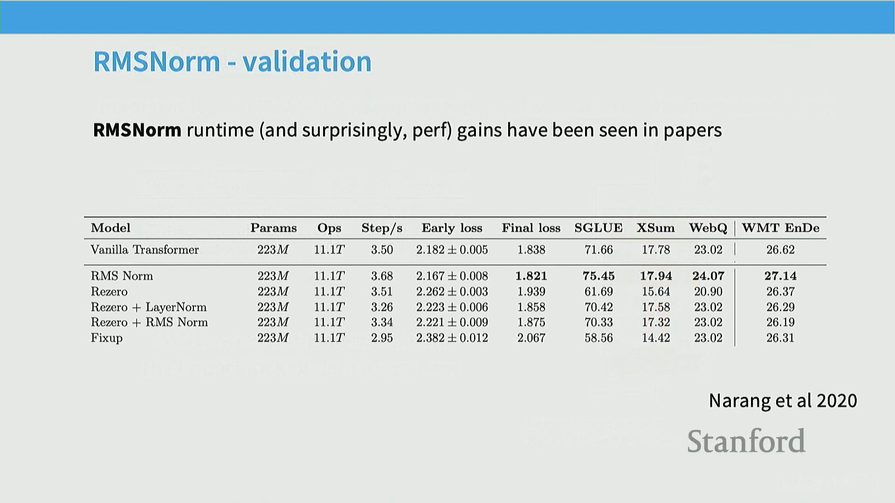
为此，我回溯查阅了早期的 RMS 归一化相关文献。遗憾的是，工业界实验室发表的配备大规模消融实验(Ablation Studies)的详尽论文相对较少，因此我在此展示的多数数据源自几年前的研究。不过，Naurang 等人于 2020 年发表了一项极为出色的消融实验。结果如下：左侧为原始 Transformer，右侧为 RMS 归一化变体。数据直观印证了我此前的观点：原始 Transformer 的训练吞吐量为每秒 3.5 步，而采用 RMS 归一化后提升至 3.68 步。尽管增幅看似不大，但这属于“零成本”的性能增益。更重要的是，其最终损失值(Loss Value)甚至低于原始模型。这无疑是双赢的局面：我们在提升训练速度的同时，至少在此案例中还优化了模型性能。
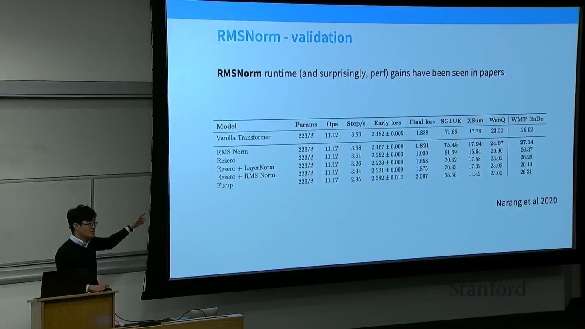

## 去除偏置项以提升优化稳定性
我要强调的下一点与 RMS 归一化的设计哲学高度一致：绝大多数现代 Transformer 已彻底移除了偏置项(Bias Terms)。回顾原始 Transformer 的前馈网络(FFN)，其标准结构为：输入 $X$ 经过带偏置的线性层，通过 ReLU 激活函数，再进入第二个线性层。然而，当前主流实现（除稍后讨论的门控机制外）普遍采用了无偏置设计，如底部结构所示。这一改动背后的底层逻辑与 RMS 归一化类似：仅凭纯矩阵乘法已足以驱动模型高效运转，且性能毫不逊色。此外，一个更为关键但稍显微妙的原因在于优化稳定性(Optimization Stability)。尽管偏置项具体如何影响稳定性的理论机制尚不完全明晰，但业界已积累大量经验证据表明：剔除偏置项能显著提升超大规模神经网络的训练稳定性。因此，当前许多架构选择完全移除偏置项，在纯线性变换的设定下进行训练。
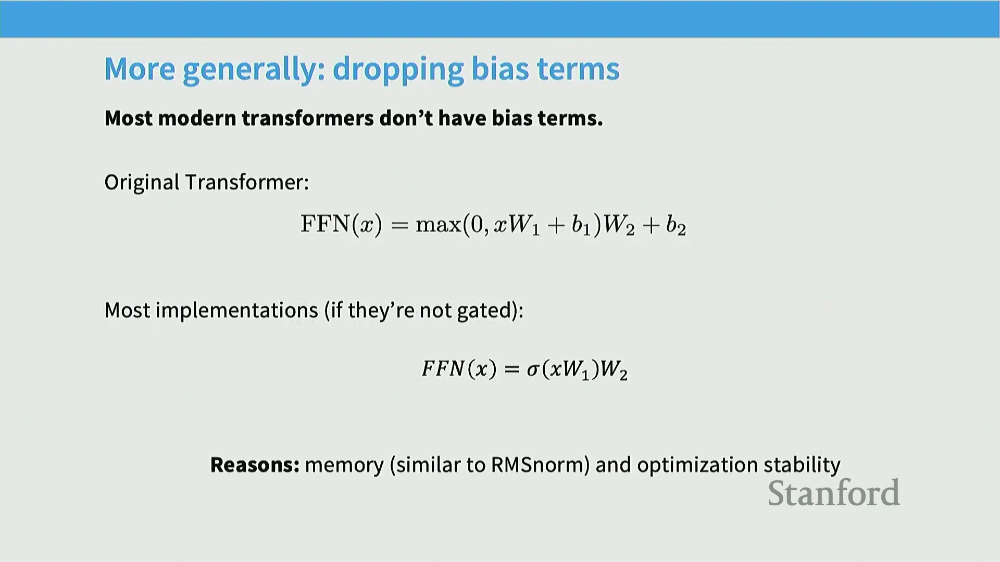

## 架构共识与可推广的经验
关于归一化与偏置的讨论暂告一段落。请大家务必牢记以下两点核心结论。这部分内容的演进脉络十分清晰，且业界已形成高度共识。首先，前置归一化(Pre-Norm)或将层归一化置于残差流(Residual Stream)之外，已成为近乎铁律的标准实践。它能有效保障梯度传播并提升训练稳定性，继续沿用后置归一化已缺乏充分理由。其次，RMS 归一化已实现全面普及。实战表明，其性能与层归一化持平，且显著降低了访存开销。同理，“去除偏置项”的设计原则也已广泛落地。目前唯一值得注意的例外可能是 Cohere 的 Command R 系列模型，据我观察它们仍保留层归一化，具体原因尚待探究。在过渡到下一章节前，关于层归一化、RMS 归一化及偏置项的设计，大家是否还有疑问？
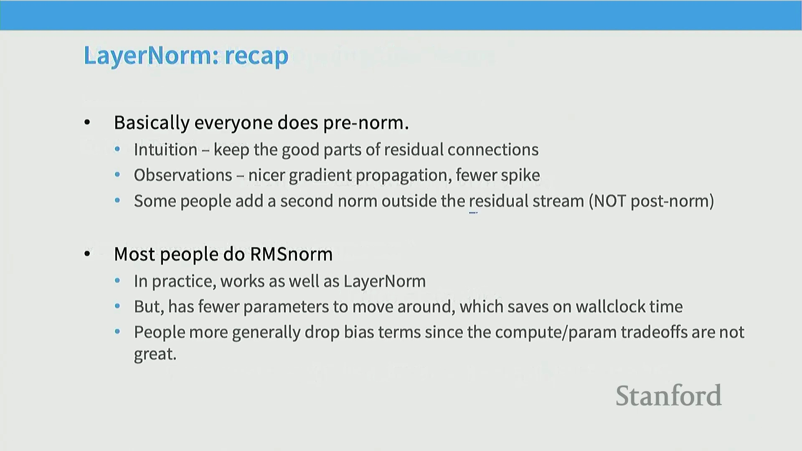

（同学提问）问：您认为能否从这些底层细节中提炼出更具前瞻性、面向未来(Future-proof)的通用设计原则？抑或它们仅仅是当前的局部最优解？答：能否总结出“未来验证”级的经验？我认为很难断言全局性的终极蓝图。深度学习的发展在很大程度上始终是经验驱动与自下而上(Bottom-up)的迭代，而非纯粹的理论推导。然而，我们确实能从中沉淀出若干可泛化的架构经验。例如，“采用简洁直接的恒等映射残差连接”这一原则，已在多种异构架构中反复得到验证，其适用性早已超越了 Transformer 本身。

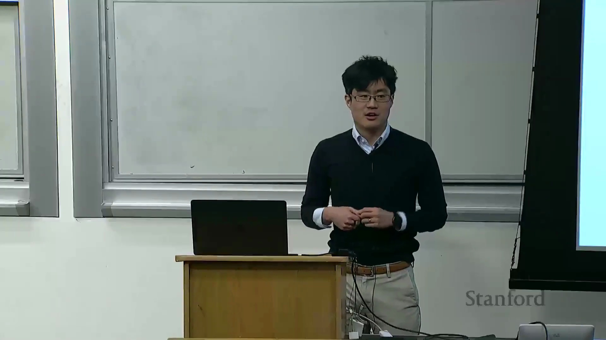
此外，归一化机制的有效性不容忽视（后续讲座中我们将再次提及）。控制激活值的尺度漂移，是维持训练稳定性的普适性法则。结合前述残差连接的设计，这两点构成了极具通用性的架构经验。同时，我们也将反复目睹系统工程思维的介入。因此，在架构设计初期，深入评估其对底层硬件与系统组件（如内存带宽、计算单元）的实际影响，是另一条至关重要的可推广原则。
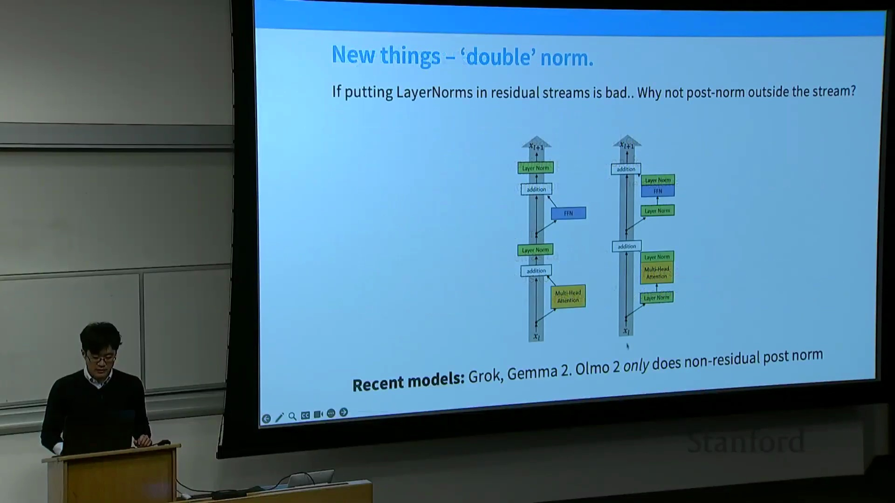

## 激活函数与 MLP 变体的“动物园”
接下来探讨另一核心组件：激活函数(Activation Functions)。当前领域内已涌现出一个庞大的激活函数“动物园”，包括 ReLU、GeLU、Swish、SiLU 以及 GLU 等。此外，严格来说它们不属于单一激活函数，而是前馈网络(MLP)的变体结构：GeGLU、ReGLU、SwiGLU 和 LiGLU 等。坦率而言，这曾是我初涉深度学习时最不愿深入的部分。当时的直觉是：“激活函数具体形式无关紧要，模型最终总能收敛(Convergence)。”但事实证明，激活函数的选择至关重要。无论从计算效率还是模型最终性能来看，SwiGLU 及其他门控线性单元(Gated Linear Unit, GLU)变体均带来了实质性的性能跃升。
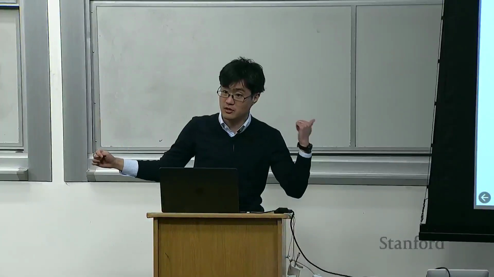
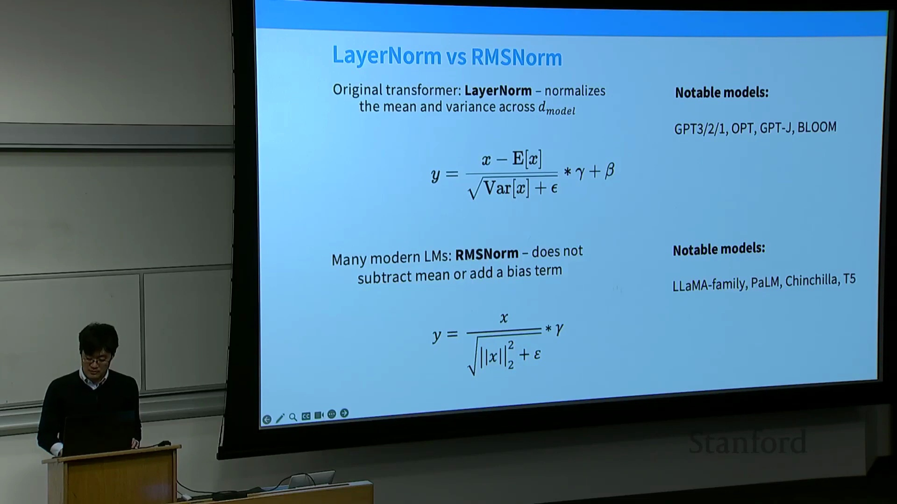

---

## SwiGLU 与门控激活函数的主导地位
SwiGLU(Switch Gated Linear Unit)及其他门控线性单元(GLU)变体始终展现出卓越的性能。我将详细剖析这些机制，希望大家深入理解并思考其设计原理，因为它们在实战中确实行之有效。在基础深度学习课程中，大家应该已经接触过 ReLU(Rectified Linear Unit)激活函数，其核心逻辑是取输入值与 0 之间的最大值。在多层感知机(MLP)的语境下，此处我暂时省略了偏置项(Bias)。计算流程为：先进行 `x·W1` 线性变换，得到中间表示后，再通过 `W2` 进行投影。整体逻辑非常直观，对吧？

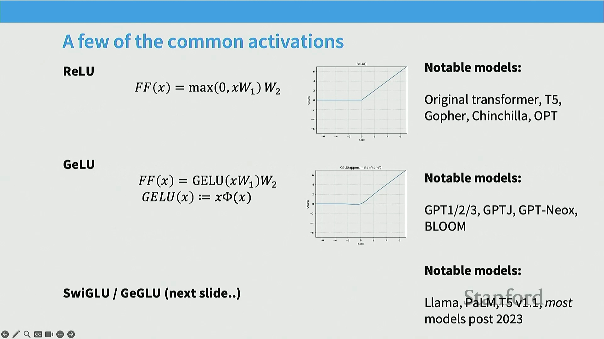

## 从 ReLU 到门控线性单元的演进
GeLU(Gaussian Error Linear Unit)的计算公式为输入值乘以标准正态分布的累积分布函数(CDF)。因此，其整体形态与 ReLU 相似，但在零点附近呈现出一段微小的平滑过渡曲线。从图中可以看出，它在负半轴并非完全平坦。这种设计提升了函数的可微性(Differentiability)，其实际收益虽因任务而异，但整体表现稳健。早期的 GPT 系列模型（包括 GPT-1、GPT-2、GPT-3 及 GPT-J）均采用了 GeLU，而原始 Transformer 及部分早期模型则沿用 ReLU。然而，当前业界已普遍转向门控线性单元(GLU)家族，如 SwiGLU、GeGLU 等。这一趋势很大程度上得益于 Google 团队在 PaLM、T5 等模型中的成功实践与推广。经过大量实验的反复验证，2023 年之后发布的绝大多数模型均已采纳门控线性单元架构。
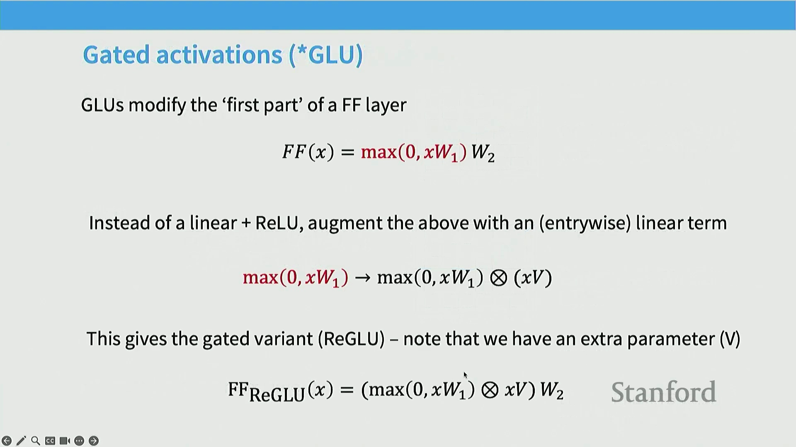

## MLP 中门控机制的运作原理
回顾前文提到的“可泛化的架构设计原则”，门控机制(Gating Mechanism)无疑是另一项被广泛验证的有效技术。这正是门控思想在 Transformer 架构中再次落地并大放异彩的例证。传统全连接层的结构相对简单，通常仅包含线性变换后接 ReLU 激活。而在引入门控机制后，设计变得更加精巧：除了常规的主路径外，我们额外引入一条门控路径。输入 `x` 首先通过权重矩阵 `V` 进行线性投影，生成一个门控向量。随后，该向量与主路径经过激活函数处理后的中间表示进行逐元素相乘(Element-wise Multiplication)。最后，整个门控结果再与输出权重矩阵 `W2` 相乘。理解该机制的关键在于：我们对 MLP 的隐藏层激活值施加了“门控”。具体而言，输入首先被映射至隐藏空间，随后由 `x·V` 生成的门控信号对该隐藏表示进行动态滤波，最终通过 `W2` 投影至目标输出维度。这种逐元素相乘的门控操作，正是该架构提升表达能力的核心所在。
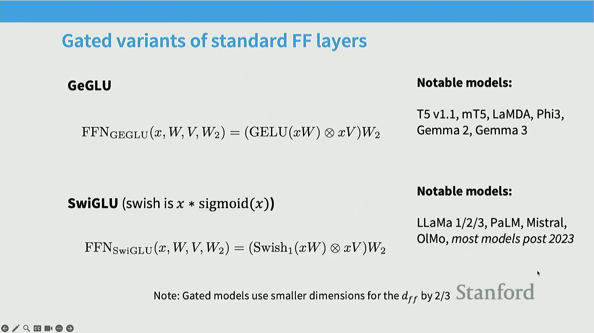

## 变体：GeGLU 与 SwiGLU
图中展示的是结合 ReLU 的门控结构，即 ReGLU。在此架构中，我们为门控分支额外引入了参数矩阵 `V`。若大家听到“GeGLU”这一名称，无需困惑，它正是基于 GeLU 激活函数的门控全连接层变体。具体而言，该结构在主路径使用 GeLU 作为非线性激活函数，同时保留完全相同的门控机制 `x·V`。这正是众多 Google 旗下模型（如 T5v1.1、Gemma 2、Gemma 3）所采用的标准配置。另一种广受青睐的变体是 SwiGLU，目前已成为业界主流。SwiGLU 的核心在于使用 Swish 激活函数（公式为 `x * σ(x)`，其中 `σ` 为 Sigmoid 函数）替代原有的非线性变换。大家可以直观对比：Sigmoid 曲线与输入值相乘后，其整体函数形态与 GeLU 高度相似。随后，我们采用与前述相同的门控逻辑：将 Swish 的输出与门控信号相乘，最终构成完整的 SwiGLU 全连接层结构。

## 应对非单调性与优化动态
（学生提问）确实存在一个值得探讨的问题：当输入值低于某一负阈值时，Swish 函数与 GeLU 函数并非单调递增，而是呈现递减趋势。在梯度下降(Gradient Descent)的理论探讨中，我们通常期望梯度方向能引导参数向最优解移动。然而，在这两类激活函数的负值区间，导数符号发生翻转，梯度方向似乎与常规认知相反。具体而言，在零点左侧存在一段非单调区间，这是否会在训练中引发问题？直觉上，人们可能会担忧这会导致大量神经元陷入“死亡”状态或激活值分布异常。但在实际的优化动态(Optimization Dynamics)观察中，情况往往不同：现代大模型训练通常采用较高的学习率(Learning Rate)并结合动量(Momentum)机制。在这种设置下，优化过程具有极强的惯性，参数极难停滞于该微小负值区域。激活值在整个特征空间内保持动态分布。因此，从实战角度来看，这一微小的非单调区间并未对模型训练造成显著的负面影响。这一解释在理论和实践中都是成立的。
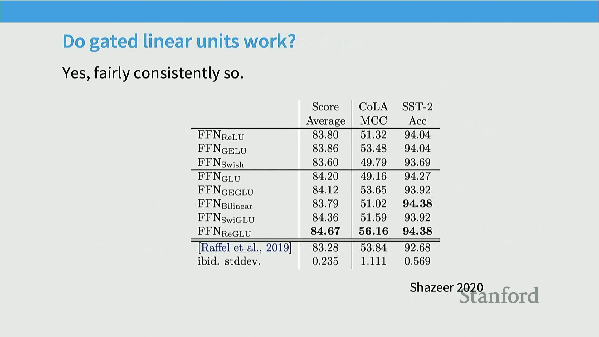
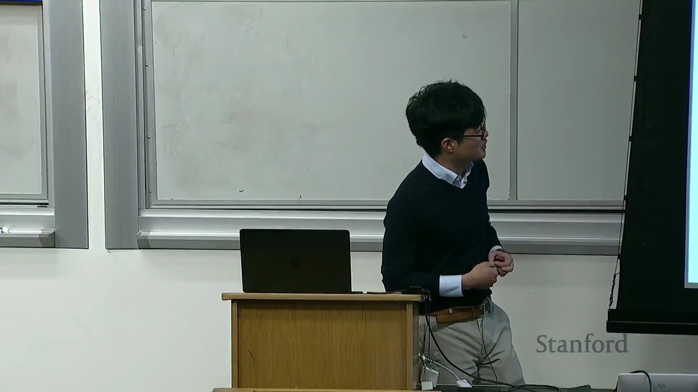
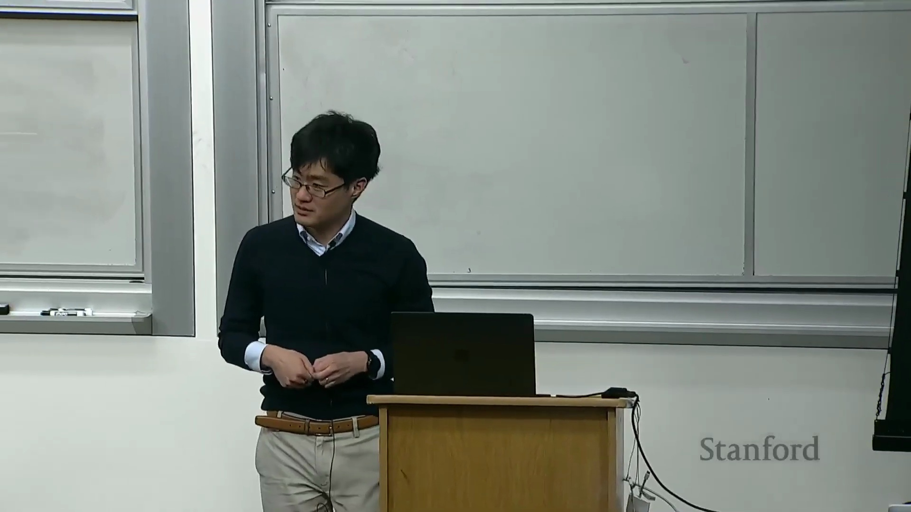

## 参数匹配与缩放惯例
回归正题，SwiGLU 已成为当前绝大多数大语言模型的标准配置，例如 Llama 系列、PaLM 和 Qwen 等。稍后我将展示详细的架构对比表，大家会直观感受到 SwiGLU 的普及程度。在此需要强调一个关键细节（我将在超参数(Hyperparameters)章节深入展开）：由于引入了额外的门控权重矩阵 `V`，模型的参数规模会随之增加。为保持与标准前馈网络相当的计算复杂度与参数量，业界形成了一项通用惯例：将门控结构的中间隐藏维度(Intermediate Hidden Dimension)缩放至原始维度的 2/3。这一设计旨在确保添加门控机制后，整个模块的总参数量与无门控版本严格对齐。若大家此刻尚未完全消化这一数学关系也无需担忧，后续课程会再次详解。当前只需牢记核心原则：在采用门控线性单元时，需按比例缩减相关维度，以实现参数预算的精准匹配。

## GLU 优越性的实证证据
那么，门控线性单元的实际效能究竟如何？除后续将展示的现代基准测试外，让我们直接回溯最权威的原始文献：Noam Shazeer 发表的奠基性论文。该研究系统评估了各类 GLU 变体。尽管这些数据源自较早的实验阶段，但结果依然极具说服力。如图所示，在 CoLA(Corpus of Linguistic Acceptability) 与 SST-2(Stanford Sentiment Treebank) 基准测试中，GLU 变体始终展现出更优的性能。各项指标得分分别为 84.2、84.12、84.36 及 84.67。值得注意的是，这篇发表于 2020 年的论文严谨地提供了标准差(Standard Deviation)，便于我们评估结果的统计显著性(Statistical Significance)。数据明确显示，性能提升具有高度显著性。这构成了支持门控架构的早期核心证据。
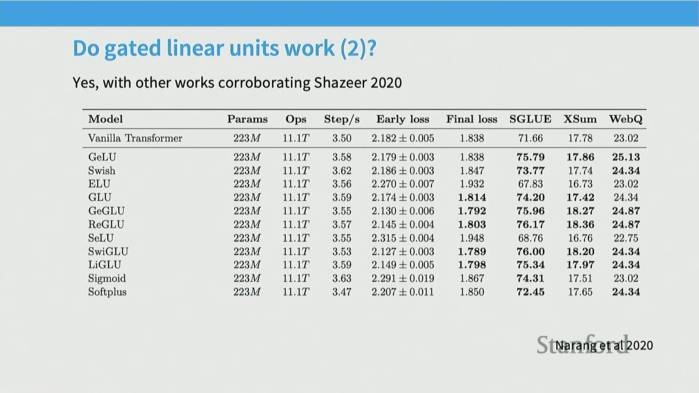
另一项关键证据来自 Narang 等人于 2020 年发表的论文。该研究在 T5 模型背景下，对各种架构变体进行了详尽的消融分析。结果再次印证：门控线性单元变体始终稳定地(Consistently)实现了低于基线对照模型的损失值(Loss Value)。如图所示，加粗曲线清晰对应 GLU 变体的训练轨迹，这一性能优势在整个训练周期内保持稳定。综上所述，尽管激活函数与门控机制的具体实现存在诸多变体，但门控线性单元已无可争议地成为主流架构选择。其背后的性能收益足以支撑这一技术趋势。
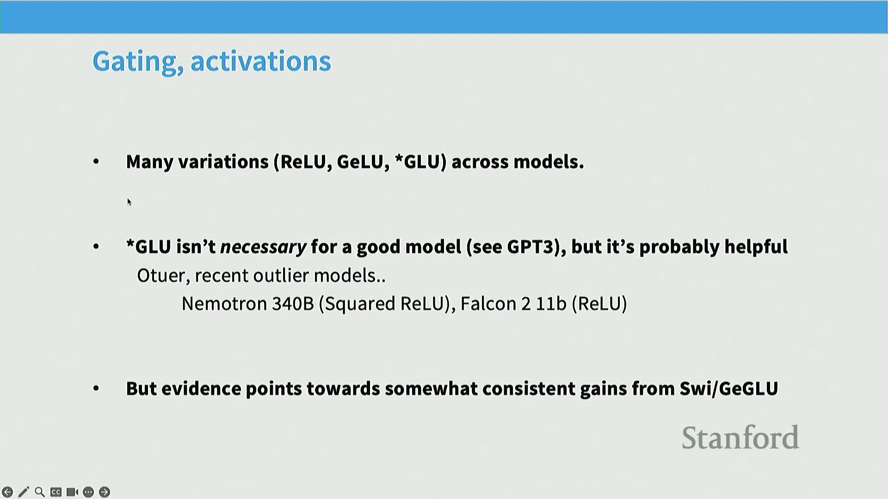

## 例外情况与架构设计的最后说明
当然，必须明确的是：GLU 并非构建高性能模型的绝对必要条件。区分“性能更优”与“不可或缺”至关重要。某项技术被广泛采用或略有优势，并不代表它是唯一解。现实中，确实存在部分顶尖模型并未采用 GLU 架构。例如，经典的 GPT-3 便未使用 GLU。较新的案例如 Nemotron-340B 采用了 Squared ReLU（平方 ReLU 激活），而 Falcon 2 11B 模型则坚持使用传统 ReLU。这两款模型均展现出卓越的性能水平。由此可见，GLU 虽好，却非唯一路径。尽管如此，大量实证数据依然确凿地表明，SwiGLU 与 GeGLU 能够带来稳定且显著的性能增益。正因如此，我们在本次作业中要求大家精准实现该变体，以深入掌握其核心机制。好的。
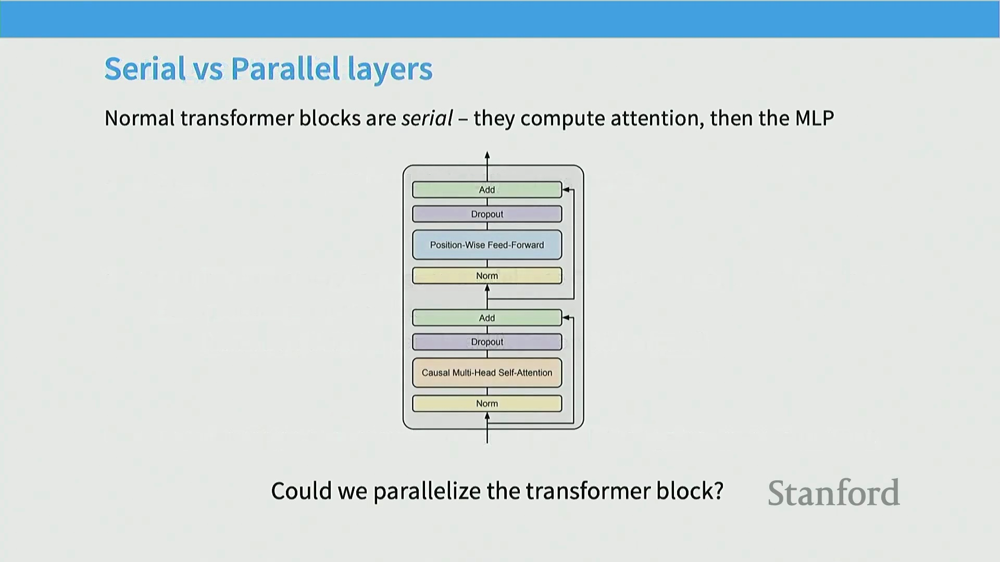
关于架构演进的最后一项重要变体，涉及 Transformer 块内部的数据流设计。在标准架构中，各子模块通常采用串行(Serial)连接：输入信号自底层进入，首先经过自注意力机制(Self-Attention)计算，输出结果传递至下一层后，再交由多层感知机(MLP)处理，最终继续向上传递。这种“先注意力，后 MLP”的串行拓扑结构虽然直观，但在超大规模分布式训练中会引入明显的并行计算瓶颈。当试图在庞大的 GPU 集群上实施模型并行(Model Parallelism)或流水线并行(Pipeline Parallelism)时，串行依赖会显著增加系统调度复杂度，并可能导致 GPU 计算单元闲置，降低整体硬件利用率(Hardware Utilization)。为此，少数前沿模型探索了一种我称之为“并行层(Parallel Layers)”的架构设计。在该方案中，注意力分支与 MLP 分支不再存在先后依赖，而是基于同一输入 `X` 进行并行计算(Parallel Computation)，最后再将两者的输出进行融合。这种设计有效打破了串行瓶颈，为系统级优化提供了更大空间。
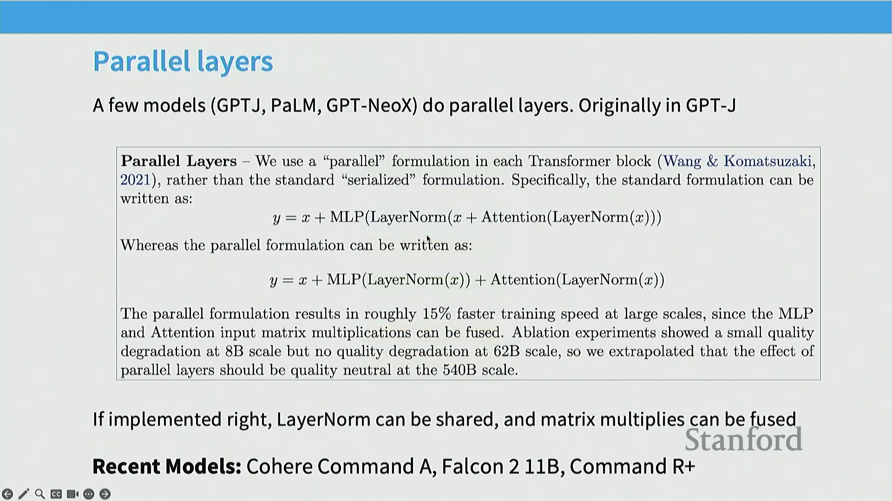

---

## 并行与串行层架构
因此，在接收上一层的输入后，模型会并行计算多层感知机(MLP)与注意力机制(Attention Mechanism)，随后将两者的输出相加并汇入残差流(Residual Stream)，即为当前层的最终输出。该架构最初由开源复现项目 GPT-J 提出。Google 的 PaLM 团队颇具远见，在超大规模模型中率先采用了这一设计，随后众多模型纷纷效仿。只要实现得当，该架构允许共享部分组件（如层归一化(Layer Normalization)），并能将多个矩阵乘法(Matrix Multiplication)融合，从而在系统层面带来一定的效率提升。然而，此后该设计的流行度有所下降，至少在过去一年中并非主流。目前观察到的大多数模型仍倾向于采用串行层(Serial Layers)而非并行层(Parallel Layers)。主要的例外情况包括此处的 Command R、Command R+ 以及 Falcon 2 11B 等模型。
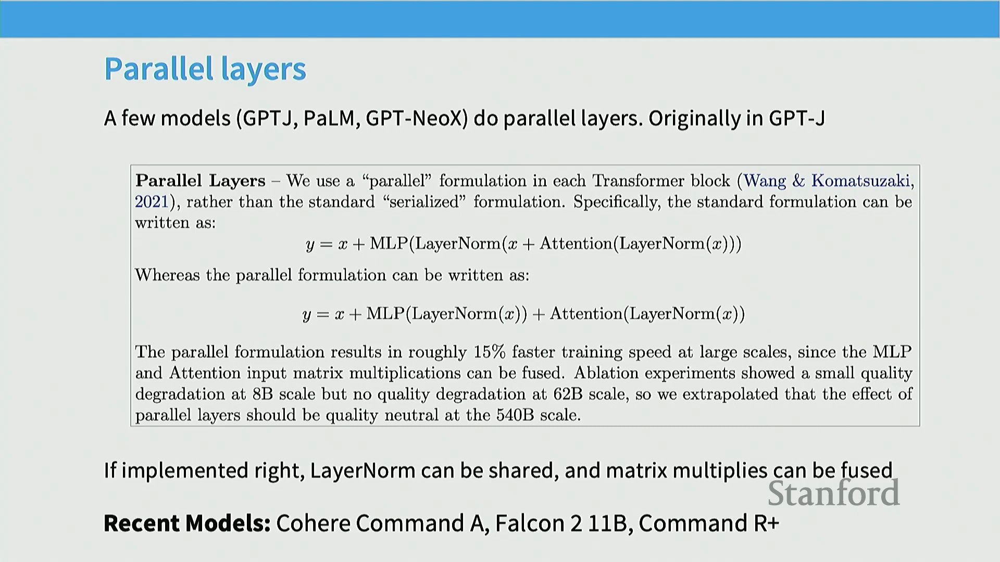

刚才有同学提问：串行架构是否比并行架构更高效？答案恰恰相反。并行架构在计算效率上更具优势，这也是业界愿意采用它的主要原因。从某种意义上说，串行架构可能被认为具有更强的表达能力(Expressive Power)，因为它对两个计算模块的结果进行了非线性组合，而非简单的逐元素相加。但并行架构的理论优势在于：若编写了高效的融合算子(Fused Kernels)，大量底层操作可并行执行，且计算负载可在不同的并行分支间有效共享。
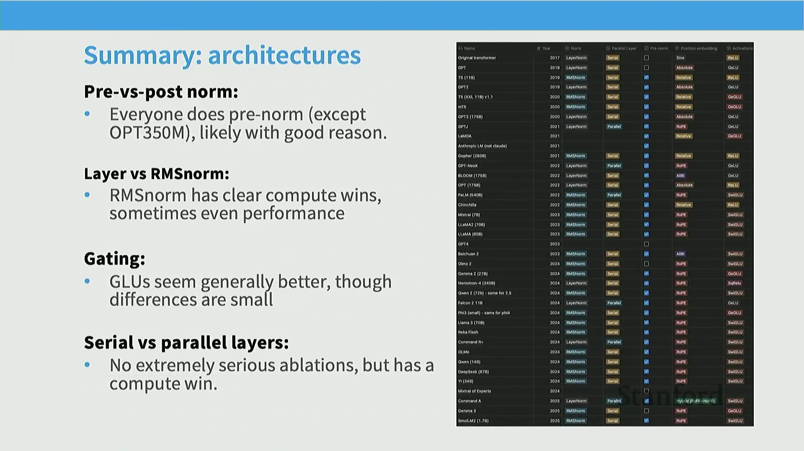

## 架构收敛与标准化
现在让我们回到这张总览图表，回顾我最初想强调的核心观点。在这一列中，大家其实无需细读文字，颜色编码已充分传达了所有关键信息。此处的对勾大致代表了前置归一化(Pre-Normalization)与后置归一化(Post-Normalization)的架构选择。在早期模型中，明确采用后置归一化的仅有原始 Transformer 与初代 GPT（若计入的话还包括 BERT）。而几乎所有后续模型，均无一例外地转向了前置归一化。图中未打勾的方框对应的是闭源模型，由于缺乏公开细节，此处暂不标注。最左侧一列对比了均方根归一化(RMS Normalization)与层归一化(Layer Normalization)。灰色代表层归一化，蓝色代表 RMS 归一化。如前所述，绝大多数模型已收敛至 RMS 归一化方案。紧邻的一列展示了串行层与并行层的分布情况。同样，串行架构占据绝对主流，但大家也能观察到部分模型采用了其他变体。
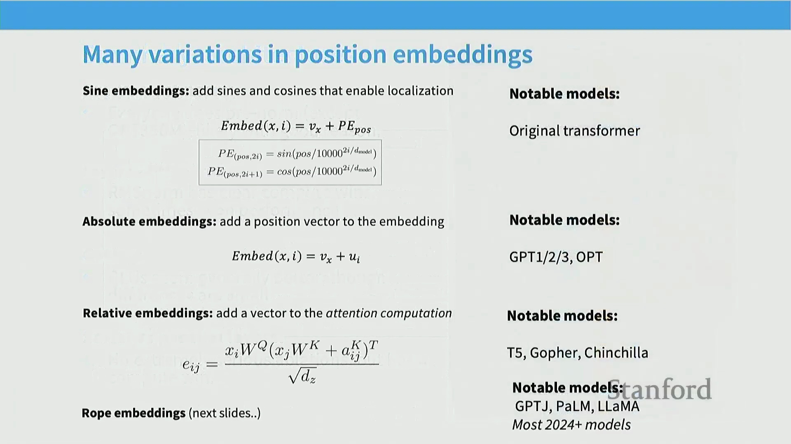

## 位置编码的演进
接下来我们将探讨位置编码(Position Embeddings)，这部分内容将非常引人入胜。关于架构设计的最后一点（我认为也是至关重要的一点），便是位置编码的演进路径。其有趣之处在于，在大语言模型(LLM)发展的早期阶段，研究者们尝试了多种截然不同的方案。正弦/余弦位置编码(Sinusoidal Position Embeddings)源自原始 Transformer 论文，大家在 224N 课程中应已学习过。它通过正弦与余弦函数的组合来表征序列位置。另一些模型（如 GPT 系列与 OPT）则采用了绝对位置编码(Absolute Position Embeddings)，其本质是为每个位置引入一个可学习的嵌入向量(Embedding Vector)。此外，T5 和 Gopher 等模型探索了各类相对位置编码(Relative Position Embeddings)，通常将位置偏置直接注入注意力计算中。最终，业界绝大多数模型收敛于旋转位置编码(Rotary Position Embeddings, RoPE)，这同样属于相对位置编码的一种。实际上，RoPE 最早由 GPT-J 项目引入，这再次彰显了开源社区的推动力。随后，该方案被众多模型迅速采纳并成为行业标准。
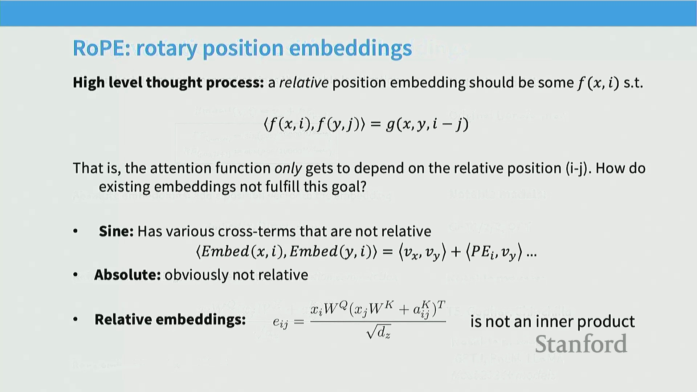

## RoPE 的数学直觉
RoPE 的核心设计直觉在于：序列中真正关键的是词元(Token)之间的相对位置。假设词 $x$ 在位置 $i$ 的嵌入表示为 $f(x, i)$（其中 $x$ 为词本身，$i$ 为绝对位置索引），理想的编码方式应满足：存在某个函数，使得 $f(x, i)$ 与 $f(x, j)$ 的内积(Inner Product)可表示为仅依赖于这两个词及其位置差值 $(i-j)$ 的函数 $g$。该数学定义本质上强制模型具备相对位置不变性(Relative Position Invariance)，即注意力分数仅由词元间的相对距离决定，而与绝对位置无关。我们可以快速验证其他编码方式：若使用正弦/余弦编码，展开内积时会产生无法消去的绝对位置交叉项(Cross Terms)，从而泄露绝对位置信息，这与其“绝对”命名相符。而传统的相对位置编码虽关注相对关系，却并非通过向量内积直接实现，在某种意义上违背了上述约束。RoPE 的精妙之处在于，它利用了几何学中的一个基本性质：旋转变换(Rotation)具有绝对位置不变性。由于向量的内积在共同旋转下保持不变，我们便巧妙地将位置信息编码为向量的旋转角度。
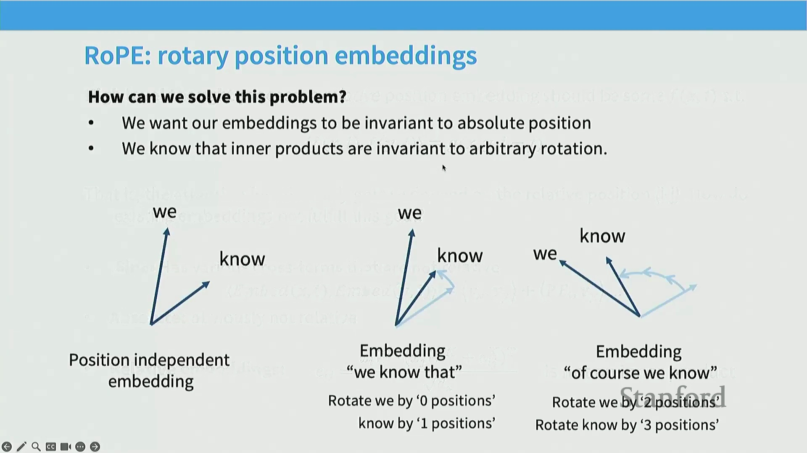

## 将 RoPE 扩展至高维空间
左侧图示展示了这一过程的起点。假设单词 "we" 的嵌入向量如图中的第一个箭头所示，而单词 "know" 的嵌入为另一个箭头。若要对包含这两个词的序列进行位置编码，我们仅关注它们的相对关系。具体操作如下："we" 位于位置 0，因此保持原向量不旋转；"know" 位于位置 1，我们将其旋转一个基础单位角度。至此，该短序列的位置编码完成。若现在引入一个更长的序列，且 "we" 和 "know" 的相对位置保持不变（例如整体序列起始索引后移），会发生什么？假设整个序列向后偏移了两个位置，此时 "we" 位于位置 2，我们将初始向量旋转两个单位角度；而 "know" 位于位置 3，则旋转三个单位角度。观察此时两个向量的相对夹角，你会发现它与之前完全一致。因此，它们的内积保持不变。这正是 RoPE 设计的精妙之处：向量仅根据其所处位置进行固定角度的旋转，而内积运算对全局旋转具有不变性，仅对相对旋转敏感。因此，注意力机制中的内积计算将自然聚焦于词元间的相对距离。在二维空间中，旋转操作非常直观。但在模型实际使用的高维向量空间(High-Dimensional Vector Space)中，直接定义旋转则复杂得多。为此，RoPE 的作者提出了一种极简且高效的解决方案：将维度为 $d$ 的高维向量切分为多个二维子空间(2D Subspaces)。每个二维子空间按照特定的频率参数 $\theta$ 进行独立旋转。通过遍历所有维度对，模型即可编码丰富的相对位置信息。与正弦/余弦编码类似，$\theta$ 值被设计为几何递减序列，使得部分维度旋转频率较快（捕捉局部/高频位置特征），而另一些维度旋转频率较慢（捕捉全局/低频位置特征），从而实现对远近位置信息的全面建模。
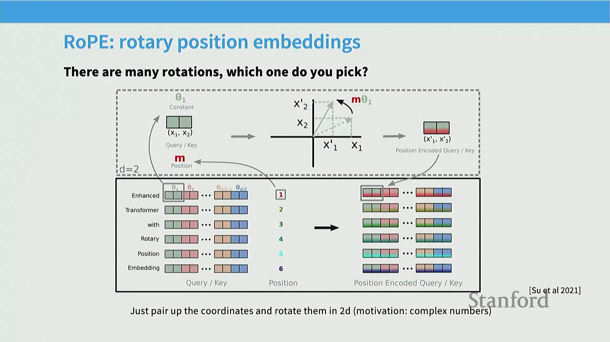

## 在注意力层直接应用 RoPE
从数学实现的角度来看，RoPE 的位置编码过程等价于将嵌入向量乘以一系列由正弦/余弦值构成的旋转矩阵(Rotation Matrix)。回顾一下大家的线性代数与三角函数知识，该操作可视为向量与多个 $2 \times 2$ 分块对角矩阵(Block Diagonal Matrix)的乘法。整个过程中不涉及额外的加法偏置或绝对位置交叉项，从而严格保证了相对位置特性。
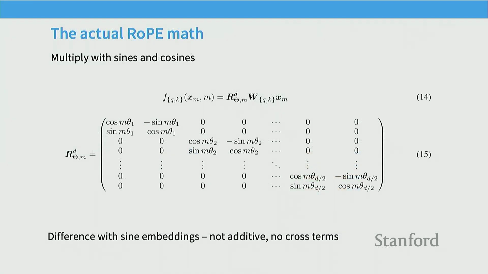

若大家已习惯绝对位置编码或传统的正弦/余弦编码，需注意一个关键差异：RoPE 并非在模型输入端（Embedding 层）直接叠加位置向量，而是在注意力机制(Attention Mechanism)内部动态应用。具体而言，在执行注意力计算前，我们对该层的 Query 和 Key 向量施加旋转变换，以此注入位置信息。本图展示了 Llama 模型中 RoPE 的具体实现流程。顶部为标准的注意力组件：输入首先经过线性投影(Linear Projection)生成 Query、Key 和 Value 向量。随后，根据位置索引计算对应的正弦与余弦值。这些三角函数值决定了 Query 和 Key 各二维子空间所需的旋转角度。接着，将生成的 Query 和 Key 向量分别与这些旋转矩阵相乘，得到带有位置信息的旋转后向量(Rotated Query/Key)。它们随后被输入至后续的注意力分数计算中。因此，位置编码并非在底层静态添加，而是在生成 Query 和 Key 的过程中实时完成。这一设计对强制模型学习相对位置关系(Relative Positional Relationships)至关重要。
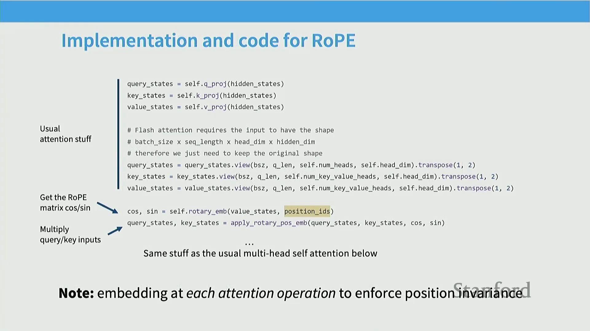

## 普遍采用与问答环节
我想强调的核心结论是：RoPE 已成为业界高度共识的标准技术。我近期梳理的这 19 篇主流论文中，几乎全部采用了 RoPE 架构。得益于其优异的数学性质，RoPE 衍生出了多种上下文长度外推(Context Length Extrapolation)算法，这已成为现代生产级语言模型不可或缺的核心组件。此外，大量实证研究证实，即便在模型规模较小或上下文较短的场景下，RoPE 依然表现卓越。可以说，它已在这场“位置编码之争”中取得了压倒性胜利。
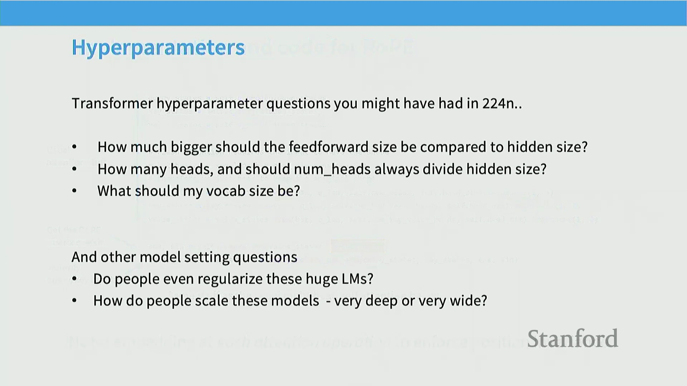

在进入超参数(Hyperparameters)章节之前，大家是否还有疑问？（同学提问）
问：所有模型使用的旋转频率是否完全一致？
答：并非完全相同。不同模型在频率参数 $\theta$ 的具体设定上会存在细微差异。
问：那么每一对维度对应的 $\theta$ 值是否不同？这些属于超参数吗？
答：是的，每一维度对的旋转频率各不相同，它们通常作为模型设计时的固定超参数进行设定。
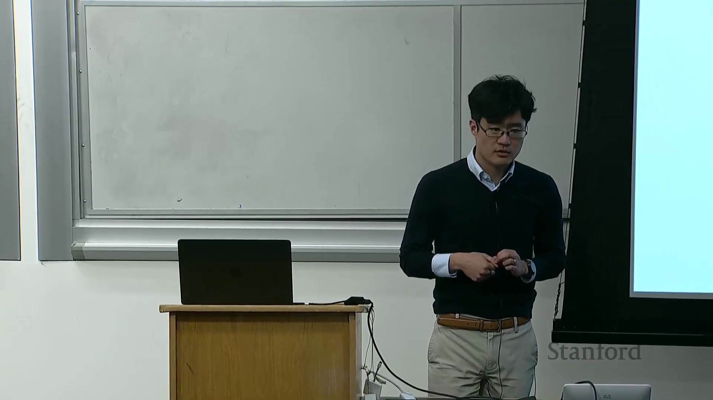

---

## 关于 RoPE 实现的澄清
针对有关旋转位置编码(Rotary Position Embeddings, RoPE)中旋转频率参数（θ 值）的疑问，需明确指出：这些并非可训练参数(Trainable Parameters)。相反，它们遵循固定的预设公式，与传统正弦/余弦位置编码(Sinusoidal Position Embeddings)的设计逻辑一致，旨在覆盖广泛的频率范围，从而同时建模高频局部特征与低频长程依赖(Long-Range Dependencies)。一个常见的疑虑是：旋转变换是否会引发梯度计算或模型优化(Optimization)方面的困难？然而，实际操作中并不会产生此类问题，因为旋转变换是通过确定的矩阵乘法(Matrix Multiplication)实现的。由于 θ 值与旋转矩阵(Rotation Matrices)均为预定义常量，该操作本质上仅为向量的线性变换(Linear Transformation)。这不仅避免了在反向传播(Backpropagation)中对三角函数进行复杂求导，还有效保障了训练过程的数值稳定性(Numerical Stability)。
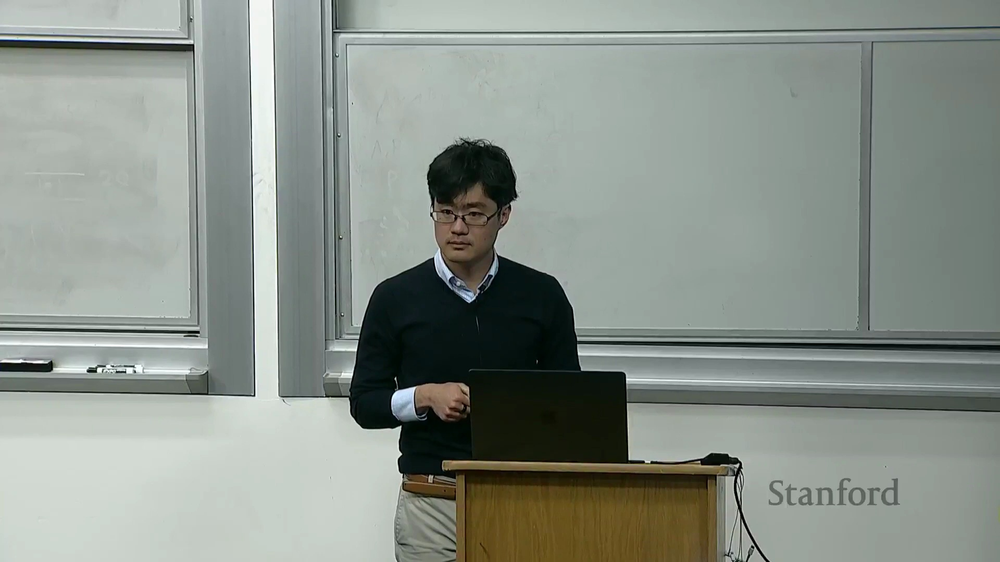
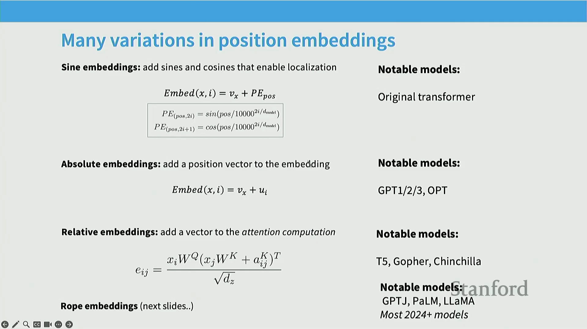
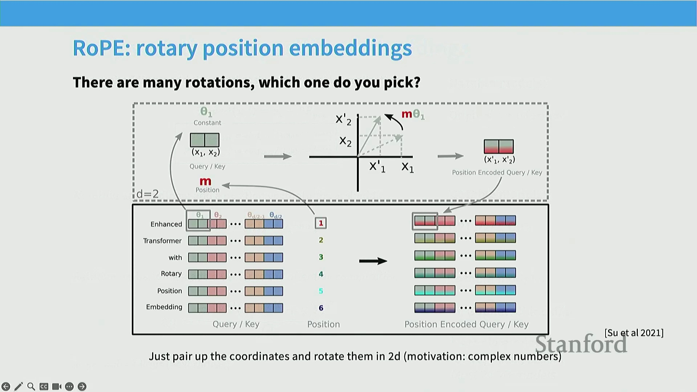
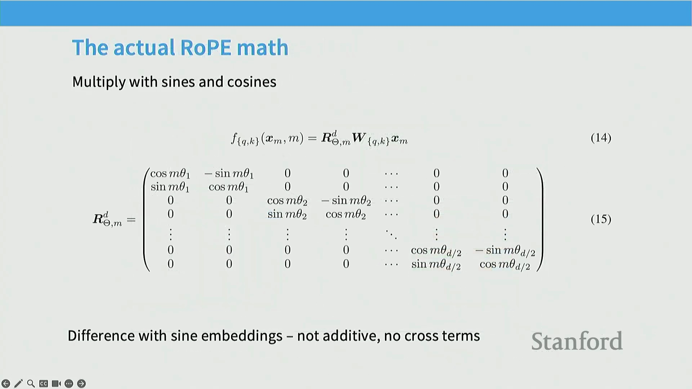

## 探索大语言模型超参数惯例
接下来我们将深入探讨超参数(Hyperparameters)的配置原则。显而易见，成功的大语言模型(Large Language Models, LLMs)训练高度依赖明确的经验法则(Empirical Rules)，而非盲目或随机的参数配置。在设计与训练新模型时，遵循业界共识能够有效约束庞大的超参数搜索空间(Hyperparameter Search Space)。核心决策主要围绕模型隐藏层维度(Model Dimension)、前馈网络(Feed-Forward Network, FFN)规模、注意力头(Attention Heads)数量以及词表大小(Vocabulary Size)展开。研究者与工程师无需凭空猜测，而是可借鉴经过充分验证的业界实践，做出科学且稳健的配置决策。
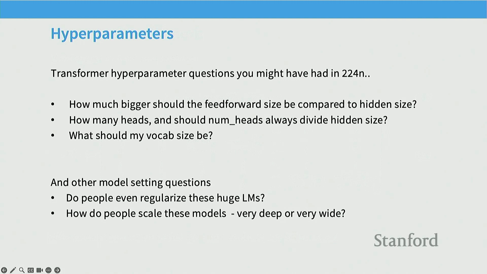

## 前馈网络维度比例
首要的基础超参数是前馈网络中间层维度(`D_FF`)与模型隐藏层维度(`D_model`)之间的比例关系。对于采用 ReLU 激活函数的标准多层感知机(Multi-Layer Perceptron, MLP)，业界普遍共识是将 `D_FF` 设定为 `D_model` 的 4 倍。若采用门控线性单元(Gated Linear Unit, GLU)变体，为维持与前馈网络相当的总参数量(Parameter Count)，该比例通常需乘以 2/3 进行缩放，最终得到约 2.67（即 `8/3`）的扩展系数。尽管 PaLM 与 Mistral 等模型采用了略高的扩展比例，但众多主流架构（如 Llama 1、Qwen 和 T5）均严格遵循约 2.6 至 2.7 倍的行业标准。当然，业界也存在突破性特例。例如，11B 参数规模的 T5 模型曾尝试高达 64 倍的极大扩展系数，而 Gemma 2 则采用了 8 倍比例。这表明既定惯例虽具指导性，但并非绝对不可逾越。
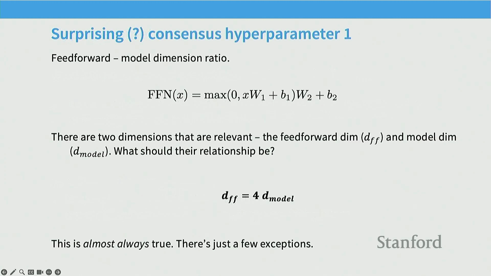
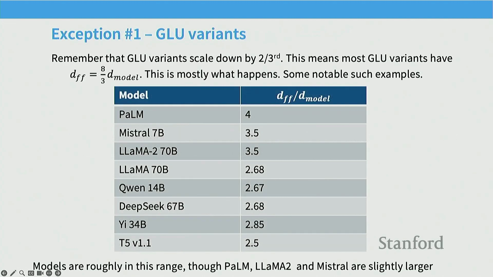
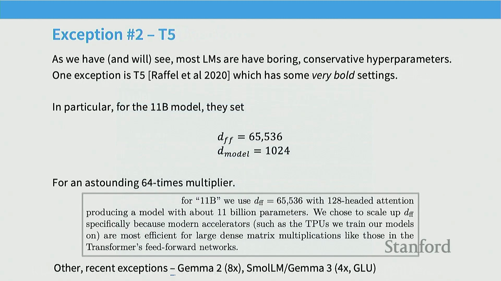

## 经验验证与缩放律的最优区间
大量定量研究(Quantitative Studies)为这些经验比例提供了坚实支撑。模型缩放律(Scaling Laws)研究指出，`D_FF / D_model` 比例的性能损失曲面呈现出宽阔的“最优平坦区(Flat Optima)”。当该比例介于 1 到 10 之间时，模型仍能维持卓越性能，这充分印证了标准的 4 倍设定正处于性能最优区间内。值得注意的是，尽管 T5 模型采用的 64 倍极端比例在技术上可行，但其迭代版本 T5v1.1 最终放弃了这一激进设计，转而采用更符合常规的约 2.5 倍 GLU 扩展系数。架构调整显著提升了模型性能。这再次凸显出一个核心观点：尽管突破常规有时可行，但遵循历经大规模实践检验的经验法则，通常能换取更优异且训练更稳定的模型。
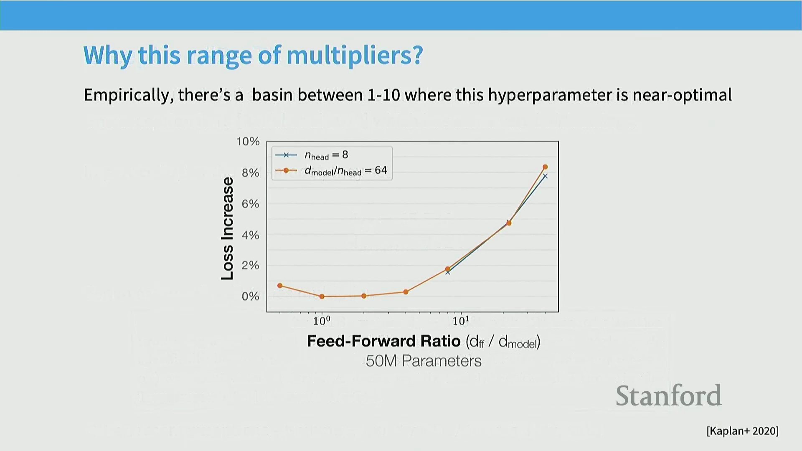
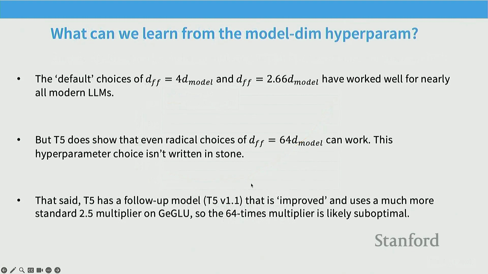

## 架构权衡：并行性 vs 表达能力
要深入理解特定比例的选择逻辑，必须审视其底层的计算权衡(Computational Trade-offs)。`D_FF` 扩展比例从根本上决定了模型参数量与浮点运算次数(Floating Point Operations, FLOPs)在并行计算与串行计算流之间的分配策略。极宽的隐藏层设计（如 T5 的 64 倍系数）能最大化并行矩阵乘法(Parallel Matrix Multiplication)的计算规模，从而在现代 GPU 架构上实现显著的硬件利用率与系统级效率提升。然而，该设计是以牺牲“单位参数表达能力(Parameter Efficiency)”为代价的。相对而言，将计算预算投入至更深的网络堆叠或维持标准宽度的串行计算模块，往往能带来更高的表征收益。因此，`D_FF` 比例的设定实质上是在“硬件计算效率(Hardware Efficiency)”与“理论模型容量(Model Capacity)”之间进行的一种精密权衡。
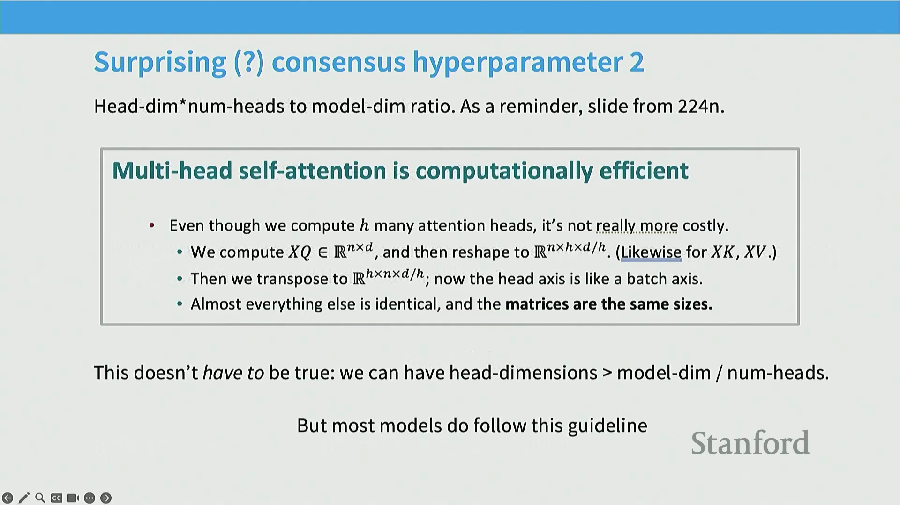

## 注意力头维度的一致性
另一项被广泛遵循的架构惯例涉及多头注意力机制(Multi-Head Attention)的配置原则。行业标准做法是维持严格的维度对应关系：模型隐藏层维度(`D_model`)严格等于单头维度(Head Dimension)与注意力头数量(Number of Attention Heads)的乘积。在工程实践中，这意味着当模型规模扩大、注意力头总数增加时，分配给每个独立注意力头的特征维度通常保持恒定。GPT-3、PaLM 及 Llama 2 等主流大模型架构均严格恪守这一设计准则。尽管部分学术研究对该固定比例提出质疑，指出过多的注意力头可能引发低秩表征瓶颈(Low-Rank Bottleneck)，但工业界的标准依然高度统一。业界优先追求可预测的模型缩放特性(Scaling Predictability)与经充分验证的训练稳定性，而非盲目追求理论上的头数扩张。
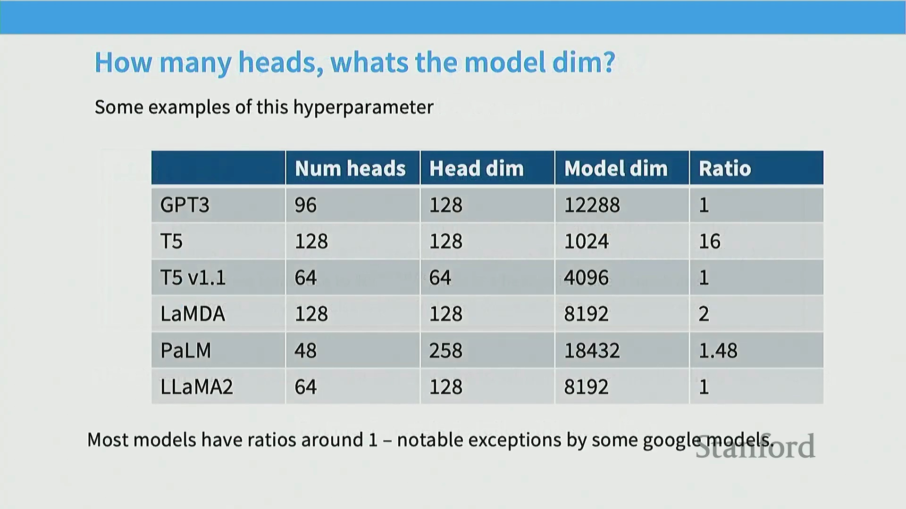
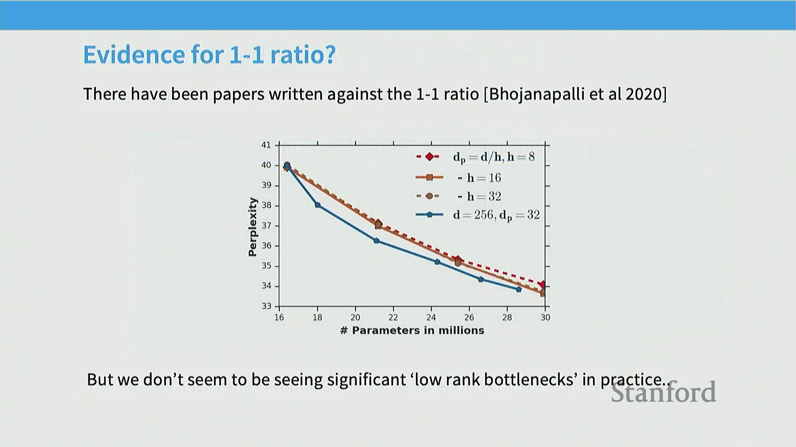

---

## 注意力头维度与 1:1 共识
针对关于低秩瓶颈(Low-Rank Bottleneck)的理论担忧，实践经验表明，为每个注意力头(Attention Heads)分配较小的特征维度并不会显著削弱注意力机制(Attention Mechanism)的表达能力(Representational Capacity)。在大多数成功的架构中，标准做法是维持模型总维度(Model Dimension)与（单头维度(Head Dimension) × 注意力头数量）乘积之间严格的 1:1 比例。这意味着在扩展模型规模时，通常保持每个头的维度固定，仅增加注意力头的总数。尽管部分学术观点认为过多的头可能引发表征能力受限的问题，但现代工业实现中该配置始终表现稳健，从而巩固了其作为行业标准的地位。
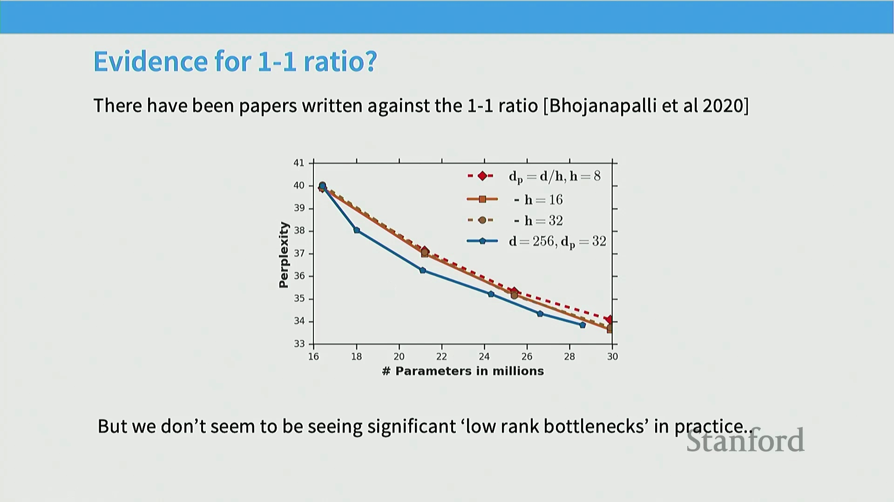

## 深度与宽度比：平衡深度与宽度
一个关键的架构超参数(Hyperparameters)是“深度与宽度比(Depth-to-Width Ratio / Aspect Ratio)”，它用于权衡网络深度(层数)与网络宽度(隐藏层维度(Hidden Dimension)大小)。尽管直觉上人们可能倾向于堆叠更深的网络以增强分层推理(Hierarchical Reasoning)能力，或拓宽网络以提升计算效率，但实证研究已定位到一个可靠的“最佳平衡点”。大多数主流架构（包括 GPT-3 与 Llama 系列变体）均收敛于隐藏维度与层数之比约为 128 的配置。该比例作为一个稳健的基准(Baseline)，有效调控了模型各项操作的计算开销(Computational Overhead)与缩放行为(Scaling Behavior)。

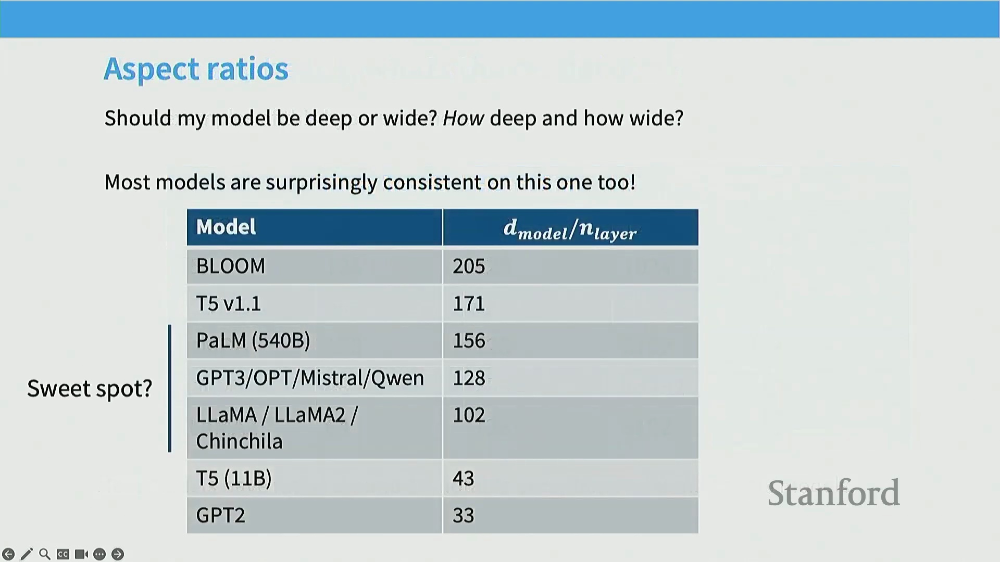

## 并行约束与经验优化
除纯粹的预测性能外，深度与宽度比还直接决定了分布式训练策略(Distributed Training Strategies)的选择。较宽的模型更便于实施张量并行(Tensor Parallelism)，即将庞大的权重矩阵(Weight Matrices)切分至多个 GPU 上进行计算，但这高度依赖高速、低延迟的互连网络(Interconnect Networks)。相反，较深的模型更契合流水线并行(Pipeline Parallelism)，该策略将连续的 Transformer 层分配至不同设备，且对通信延迟(Communication Latency)具有更高的容忍度。Kaplan 等人的经验缩放律(Empirical Scaling Laws)研究表明，在跨越多个数量级（从 5000 万至 15 亿参数(Parameters)）的模型规模下，最优的深度与宽度比展现出惊人的稳定性。这一特性极具工程价值，它使研究人员与工程师能够在安全扩展参数量与计算预算(Compute Budget)的同时，复用经过验证的固定架构比例。
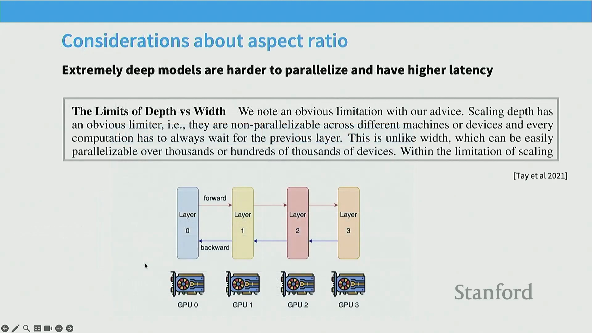
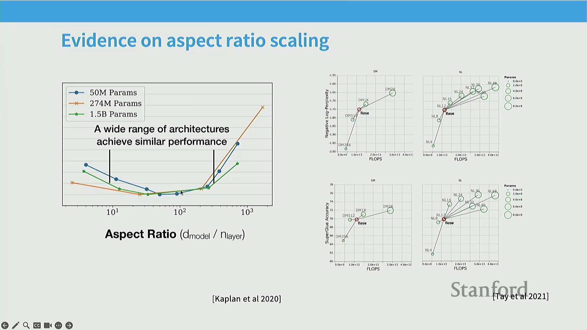

## 深度 vs 宽度：对损失与下游任务的影响
针对深度与宽度权衡(Trade-off)的研究表明，其性能差异会因评估指标的不同而呈现细微变化。就预训练损失(Pre-training Loss)而言，模型总参数量是决定性因素，具体的深宽比对损失收敛过程的影响微乎其微。然而，在评估下游任务性能时（例如在 SuperGLUE 等基准测试(Benchmarks)上的微调(Fine-tuning)准确率），在固定计算预算(FLOPs)的前提下，更深的架构往往能带来轻微的性能优势。尽管预训练阶段主要受参数效率(Parameter Efficiency)驱动，对网络拓扑形状相对不敏感，但下游任务的泛化能力(Generalization Capability)似乎更能从深层网络所提供的强分层推理(Hierarchical Reasoning)表征中获益。
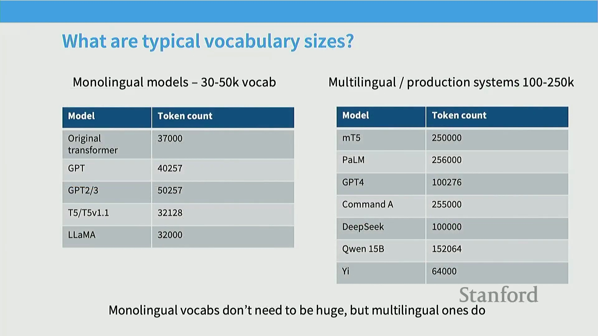

## 词表规模的演进
大语言模型(Large Language Models, LLMs)的词表规模(Vocabulary Size)持续呈现上升趋势，这折射出该领域从学术实验向现实世界多语言(Multilingual)生产系统的演进。早期模型通常采用 3 万至 5 万词元(Tokens)的词表，而当今面向广泛用户交互部署的现代架构，已将词表规模标准化至 10 万到 25 万词元。这一扩展旨在高效处理多语言文本、领域专业术语、表情符号(Emojis)以及复杂的词法形态结构(Morphological Structures)。随着模型参数规模的扩大与训练语料库(Corpus)的指数级增长，模型展现出了更强大的高维词表表征能力，使得“10 万+ 词元”已成为当前工业界的配置基准线(Baseline)。
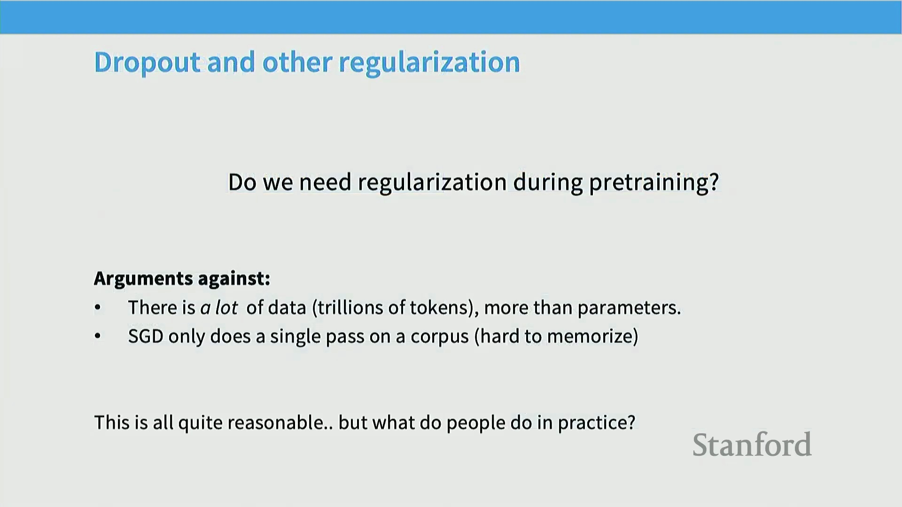

## 预训练中的正则化：Dropout 与权重衰减
在预训练(Pre-training)阶段应用正则化技术(Regularization Techniques)时，出现了一个引人深思的现象。由于大规模预训练通常基于海量数据集进行单轮遍历(Single Epoch Training)，传统的过拟合(Overfitting)问题极少构成实际威胁。因此，诸如 Dropout 等在早期网络架构中司空见惯的显式正则化(Explicit Regularization)方法，在现代训练流程中已基本被弃用。然而，即便在不存在明显过拟合风险的情况下，权重衰减(Weight Decay)依然被广泛保留。这引出了一个关键的架构与优化疑问：若模型并未对训练数据产生过拟合，为何在大规模预训练中仍需依赖权重衰减？
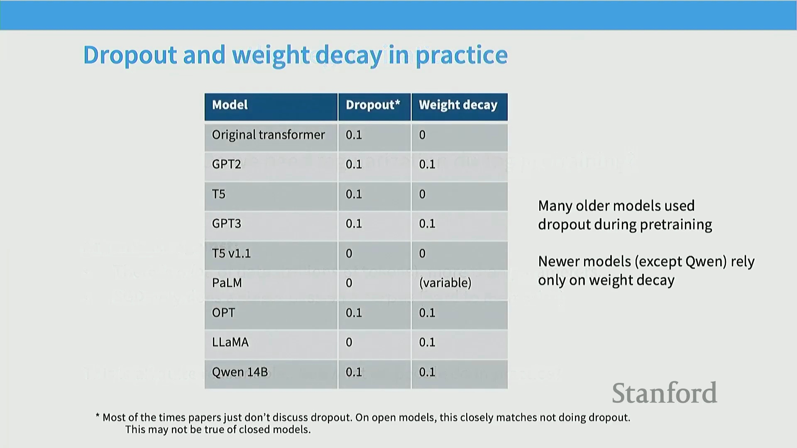

## 权重衰减的真实作用与学习率的交互
权重衰减(Weight Decay)在预训练中的持续应用，并非旨在缩小训练损失(Training Loss)与验证损失(Validation Loss)之间的差距，而是源于其与优化器动态(Optimizer Dynamics)及学习率调度(Learning Rate Scheduling)之间复杂的耦合效应。经验观察表明，权重衰减从根本上重塑了模型对学习率(Learning Rate)变化的响应模式。在恒定学习率(Constant Learning Rate)设定下，较高的权重衰减系数可能会在初期抑制模型表现；但一旦学习率开始大幅衰减或执行退火(Annealing)策略，它便能促使损失值(Loss)快速收敛。同理，在采用余弦衰减调度(Cosine Decay Schedule)时，引入权重衰减的模型初期收敛较慢，但随着学习率逐步“冷却”下降，优化过程反而展现出更强的收敛势能。这表明，权重衰减在大规模训练中实质上扮演着优化器轨迹(Optimizer Trajectory)的关键稳定器(Stabilizer)与动态调节器(Dynamic Regularizer)，其核心功能已超越传统的防过拟合(Overfitting)范畴。
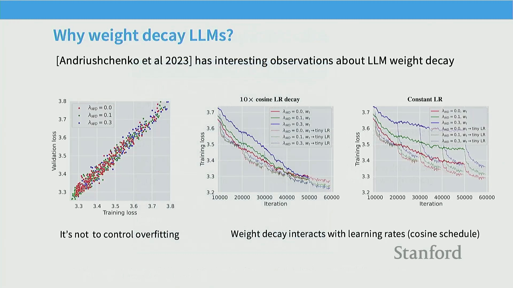

---

## 预训练中权重衰减的真实目的
大规模语言模型预训练中使用权重衰减(Weight Decay)存在一个反直觉之处：其主要目的并非传统的正则化(Regularization)或过拟合控制(Overfitting Control)。由于预训练通常在海量数据集上仅进行单轮遍历(Single Epoch Training)，过拟合(Overfitting)问题在实际中几乎不会出现。相反，权重衰减被策略性地利用，通过与优化器动态(Optimizer Dynamics)及学习率调度(Learning Rate Scheduling)之间复杂且隐式的交互，以获取更优的训练损失(Training Loss)。在训练末期，随着学习率逐渐衰减至零，权重衰减能够显著加速优化进程，最终实现更优的模型收敛(Model Convergence)。
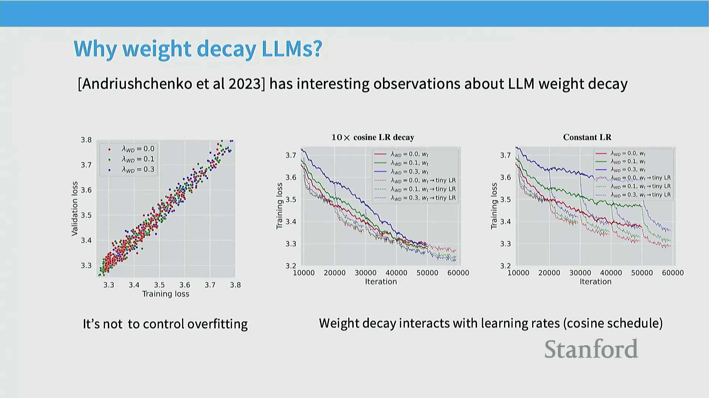

## 超参数共识与标准默认值
鉴于上述已确立的经验规律，许多基础超参数(Hyperparameters)的选择已演变为业界的“经验性默认配置(Empirical Defaults)”。从业者无需再通过穷举搜索(Exhaustive Search)来寻找多层感知机(MLP)隐藏层维度(Hidden Dimension)、注意力头维度(Head Dimension)、网络深度与宽度比(Depth-to-Width Ratio)或权重衰减系数(Weight Decay Coefficient)的最优解。大量的实证研究(Empirical Studies)已在该领域内凝聚了广泛共识，确立了稳健的默认参数集，这些参数设定与现代前沿课程的实验基线(Baselines)高度吻合。这种标准化实践使工程师得以跳过繁琐的基础调参(Hyperparameter Tuning)阶段，从而将核心精力投入到更高层级的模型缩放(Model Scaling)与训练稳定性(Training Stability)挑战中。
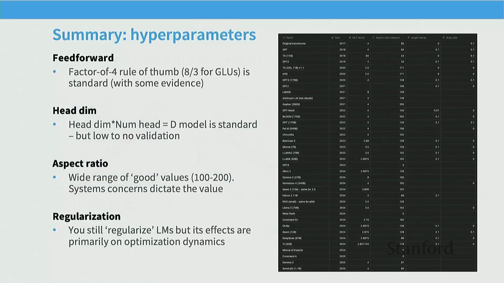

## 问答洞察：Dropout、词表与多模态融合
基于上述惯例，我们可以提炼出以下几项关键的实践启示。首先，Dropout 技术已基本被弃用，因为缺乏实证表明其能有效改善训练损失，且海量预训练数据已从根本上消除了传统过拟合的隐忧。其次，尽管庞大的多语言词表(Multilingual Vocabulary)对英语等高资源语言(High-Resource Languages)的边际收益(Marginal Gains)有限，但对低资源语言(Low-Resource Languages)却至关重要。它能将原始文本显著压缩为更少的词元(Tokens)，从而大幅降低推理成本(Inference Costs)。第三，当前大多数多模态架构(Multimodal Architectures)倾向于采用浅层融合(Shallow Fusion)或后期融合(Late Fusion)策略，即将视觉编码器(Visual Encoders)直接接入既有的大语言模型主干。尽管核心超参数保持不变，但新模态引入的优化扰动(Optimization Perturbations)却意外催生了多项新型稳定性技术，这些技术现已成功迁移并反哺至纯文本模型的训练流程中。
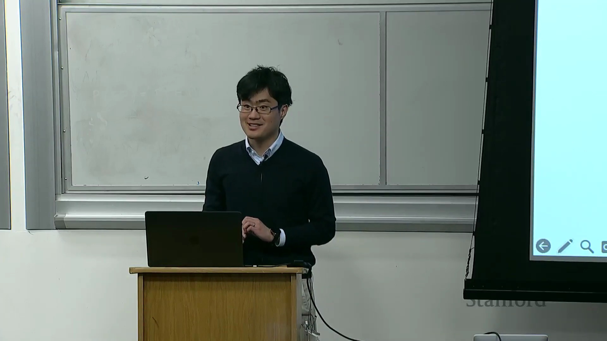
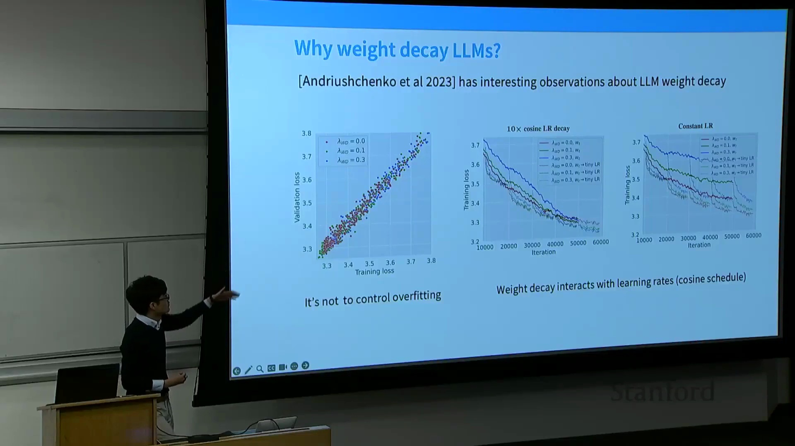
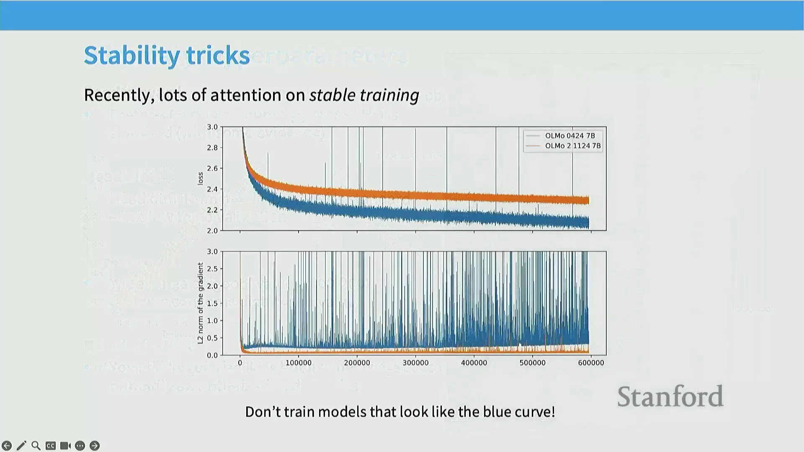

## 新兴焦点：训练稳定性
回顾近期的模型迭代可以发现，尽管核心 Transformer 架构在过去一年中趋于稳定，但业界的研发重心已大幅转向**训练稳定性(Training Stability)技术**。随着模型参数量(Parameter Count)与训练时长(Training Duration)的指数级增长，训练不稳定性已成为制约模型扩展的关键瓶颈。通过可视化梯度 L2 范数(Gradient L2 Norm)可以发现，未经优化的训练过程会频繁爆发灾难性的损失/梯度尖峰(Loss/Gradient Spikes)，这些尖峰可能突然中断收敛进程并导致巨额算力浪费。因此，当前的核心工程重心已从底层架构创新转向优化轨迹平滑化，旨在将剧烈震荡的优化地形(Optimization Landscape)重塑为平稳、可预测的收敛曲线。
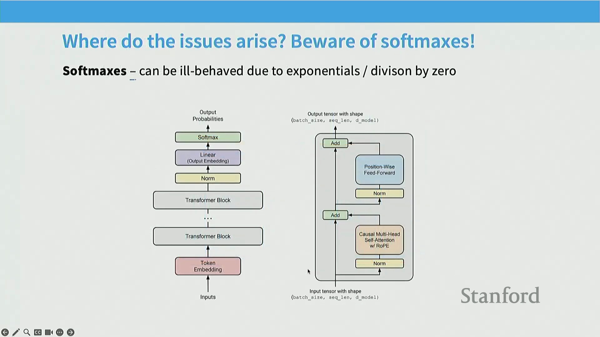

## Softmax 数值不稳定性与 Z-Loss 解决方案
此类稳定性问题的核心根源在于**Softmax 操作**（无论是在模型输出层还是自注意力机制(Self-Attention Mechanism)内部）。Softmax 固有的指数运算(Exponential Operations)及其潜在的数值不稳定性(Numerical Instability)在大规模训练中极易被放大并引发训练崩溃。一项极为有效的干预方案是引入 **Z-Loss**。作为一种辅助正则化项(Auxiliary Regularization Term)，该概念最早在机器翻译(Machine Translation)研究中被形式化定义，随后由 PaLM 团队在大语言模型训练中广泛推广。通过惩罚 Softmax 归一化常数(Normalization Constant)的对数值（`log Z`）偏离零的程度，Z-Loss 强制 `Z` 值趋近于 1。这一约束有效缓解了指数运算与除法操作引发的数值不稳定风险，保障了稳健的梯度流(Gradient Flow)，从而为超大规模语言模型的可靠训练奠定了坚实基础。
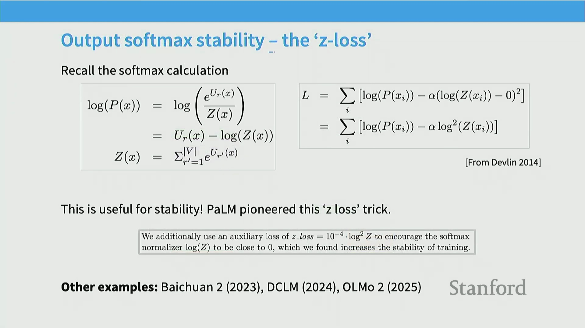
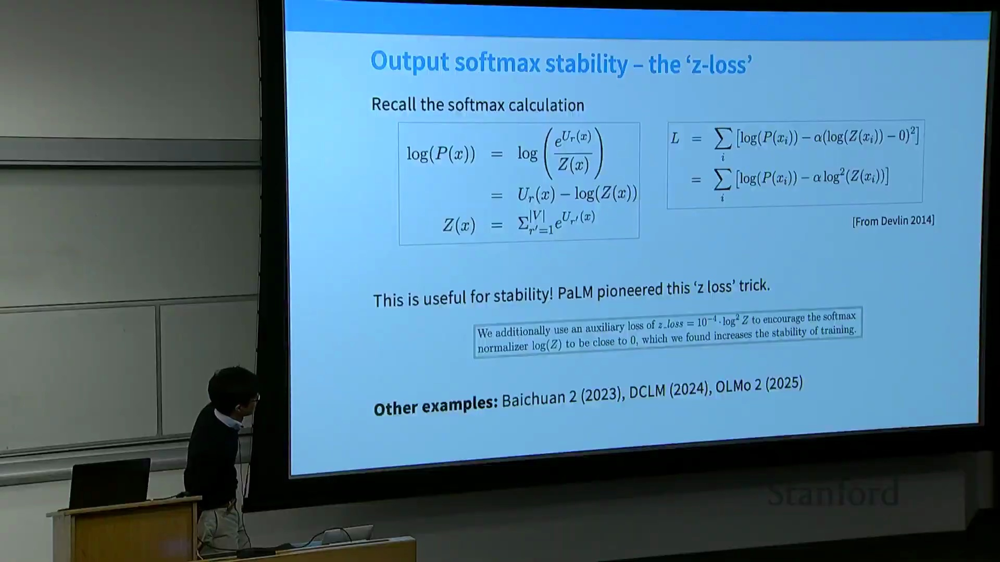

---

## 利用 Z-Loss 稳定输出 Softmax
近期大语言模型(Large Language Models, LLMs)研发的一个核心焦点在于缓解训练不稳定性(Training Instability)，尤其是由 Softmax 操作(Softmax Operation)引发的数值波动问题。PaLM 团队率先引入了 **Z-Loss**，这是一种辅助正则化项(Auxiliary Regularization Term)，旨在对 Softmax 归一化常数(Normalization Constant)的对数值（`log Z`）偏离零的程度进行惩罚。通过强制该归一化常数趋近于 1，Softmax 内部极易引发数值异常(Numerical Instability)的指数运算与除法操作被有效抑制，从而保障了更平滑的梯度流动(Gradient Flow)。尽管该技术在早期文献中未受足够重视，但如今已在 Qwen 2.5、DCLM 和 OLMo 2 等现代架构中被广泛采纳。这充分证明，它是一种极其高效且易于实现的大规模训练(Large-Scale Training)稳定性干预手段。
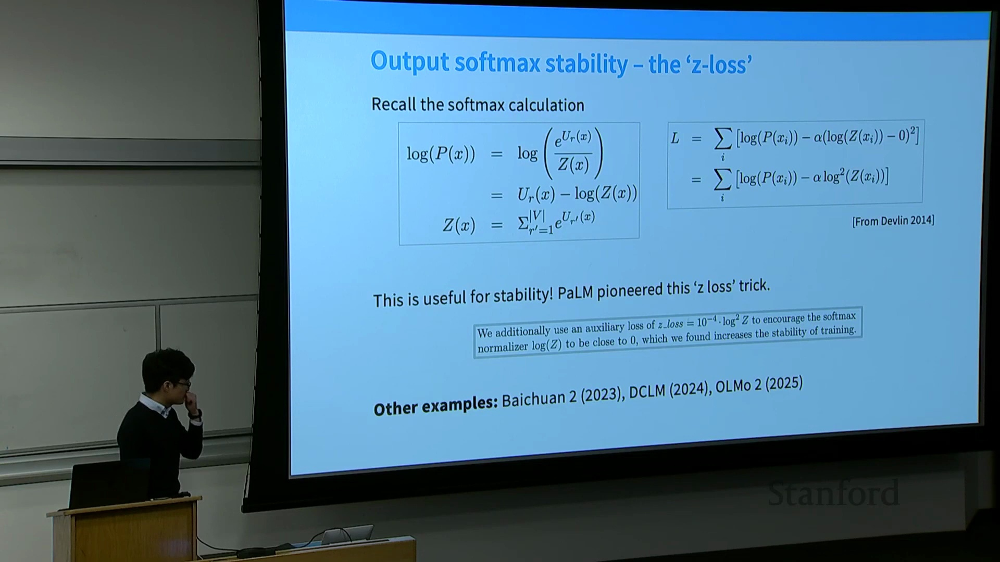

## 利用 QK 归一化稳定注意力机制
除模型输出层外，自注意力机制(Self-Attention Mechanism)内部的 Softmax 计算是另一个关键的不稳定性源头。为应对该挑战，业界广泛采用了 **QK 归一化(QK Normalization)** 技术，即在计算查询-键点积(Query-Key Dot Product)前，直接对 Query(查询) 和 Key(键) 向量施加层归一化(Layer Normalization)。该技术最初专为视觉与多模态 Transformer(Multimodal Transformers)（如 DeiT、Chameleon、Idefics）设计，通过限制输入 Softmax 的数值幅度(Magnitude)，自然平抑了异常的梯度波动。如今，该策略已成功迁移至 Yamato 和 DCLM 等纯文本模型(Text-Only Models)中，表明恰当引入的层归一化在提升训练稳定性方面成效卓著，且不会对模型最终性能造成负面影响。
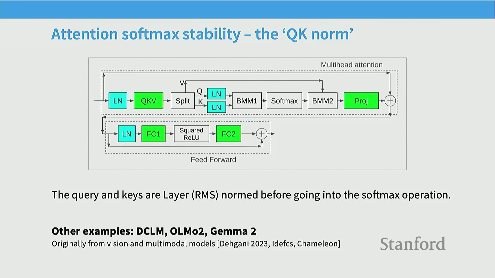

## Logit 软截断与经验权衡
另一种主流稳定性技术是 **Logit 软截断(Logit Soft Capping)**。该技术在注意力 logits(Attention Logits)输入 Softmax 之前，利用 `tanh` 函数对其进行非线性平滑截断。此举有效防止了极端 logit 值主导概率分布(Probability Distribution)，目前已被 Gemma 2 和 OLMo 2 等先进架构采纳。然而，实证对比揭示了其中存在的微妙权衡(Trade-off)。英伟达(NVIDIA)的消融研究(Ablation Studies)表明，相较于基线模型(Baseline)，软截断实际上可能导致最终困惑度(Perplexity, PPL)的轻微上升。相比之下，QK 归一化始终展现出更优的鲁棒性。它允许模型采用更高的学习率(Learning Rate)，使优化器(Optimizer)能在损失曲面(Loss Landscape)上进行更高效的全局寻优，最终产出质量更高的模型。
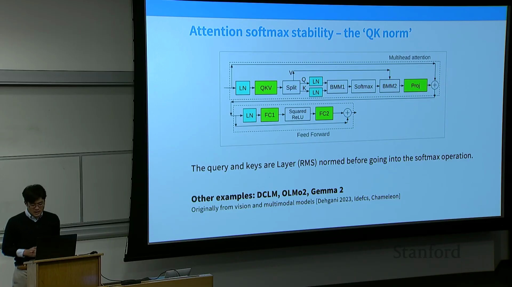
在工程实现层面需特别注意：QK 归一化在推理阶段(Inference Phase)必须保持激活状态。由于层归一化层包含可学习的缩放(Scale)与平移(Shift)参数，若在推理时将其移除，将彻底破坏模型预期的激活值分布(Activation Distribution)，导致性能崩溃。
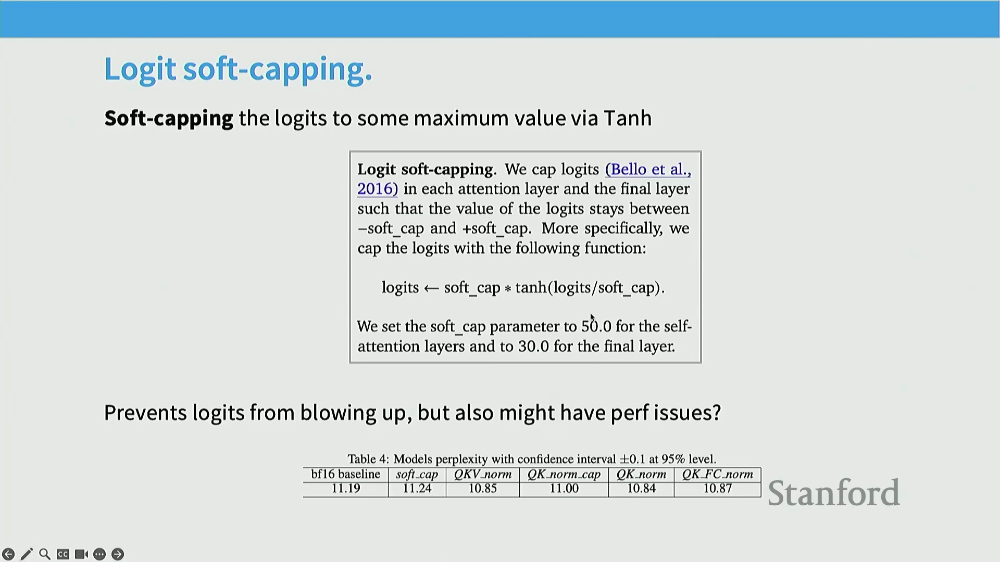

## 推理效率与 KV 缓存
尽管稳定性优化(Stability Optimization)主导了训练阶段的讨论，但诸如分组查询注意力(Grouped-Query Attention, GQA)与多查询注意力(Multi-Query Attention, MQA)等架构变体，其演进主要由**推理效率(Inference Efficiency)**需求驱动。在训练阶段，模型处理大规模的批次矩阵(Batch Matrices)，具备极高的计算强度(Arithmetic Intensity)。此时，计算开销(Compute-Bound)远超内存访问开销(Memory Access Overhead)，从而确保 GPU 维持高利用率(GPU Utilization)并实现高效的数据吞吐。
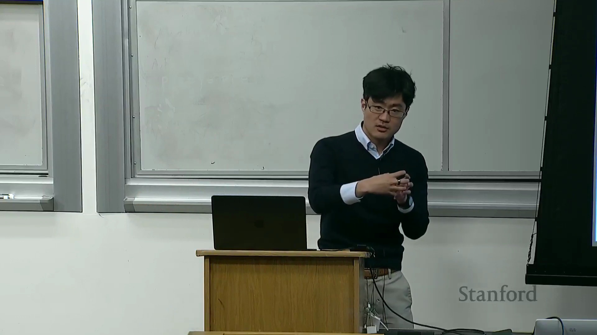
计算强度(Arithmetic Intensity)的理论公式表明，随着批量大小(Batch Size)、序列长度(Sequence Length)及注意力头数量的增加，计算量与内存访存量的比率将呈显著上升趋势。训练环境天然受益于这些大规模维度配置，使得内存带宽(Memory Bandwidth)不再构成主要性能瓶颈。
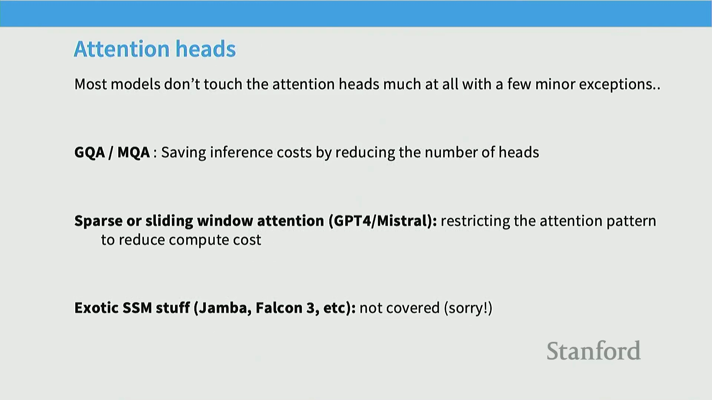
然而，自回归推理(Autoregressive Inference)的运行约束截然不同。文本生成(Text Generation)采用逐个词元(Token-by-Token)的串行模式，完全丧失了批量并行(Batch Parallelism)的算力优势。该过程属于典型的访存受限(Memory-Bound)计算，因为模型在每一步都必须反复读取庞大的历史上下文(Historical Context)以预测下一个词元的概率分布。为避免每一步都重复计算整个序列，现代 Transformer 架构高度依赖 **KV 缓存(KV Cache)** 机制，以增量方式(Incrementally)缓存历史步骤已计算完成的 Key 与 Value 向量。
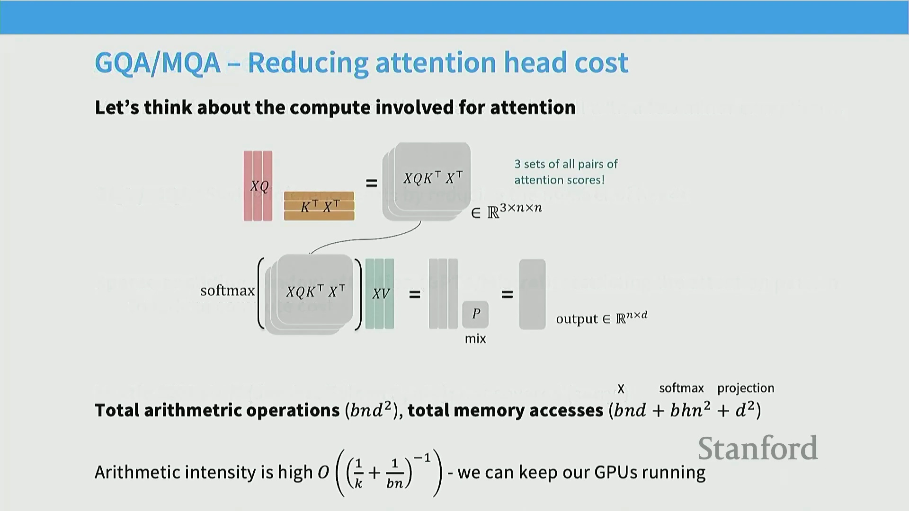
随着生成过程的推进，每个新生成的词元被编码为 Query，并与持续增长的 KV 缓存中的历史 Key 和 Value 进行注意力匹配。该缓存机制大幅削减了冗余计算与内存带宽消耗，使得尽管自回归解码(Autoregressive Decoding)本质上是串行操作，长上下文生成长文本(Long-Context Generation)在工程实现上依然切实可行。
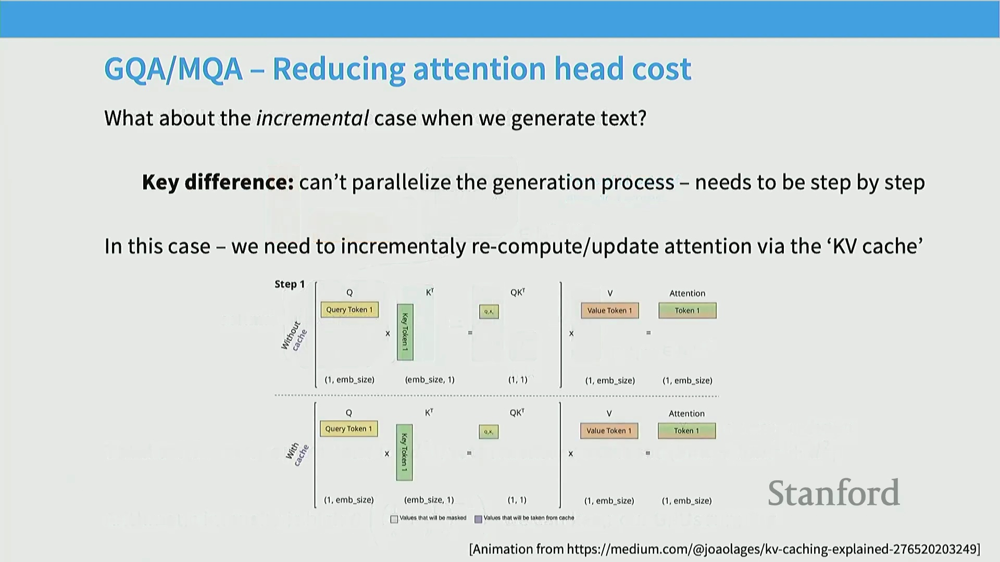

---

## 增量生成与 KV 缓存瓶颈
在自回归推理(Autoregressive Inference)过程中，模型逐个词元(Token)生成文本，这使得训练阶段用于提升吞吐量的大批量矩阵计算(Batch Matrix Multiplication)无法直接复用。为避免冗余计算，现代 Transformer 引入了 **KV 缓存(KV Cache)**，以增量方式(Incrementally)存储所有历史词元的键(Key)与值(Value)向量。每当生成新词元时，模型仅需计算注意力矩阵中当前词元对应的一行，并完全依赖已累积的缓存数据。尽管这一机制消除了冗余的矩阵乘法(Matrix Multiplication)运算，但它从根本上将计算瓶颈转移至了内存访存(Memory Access)。
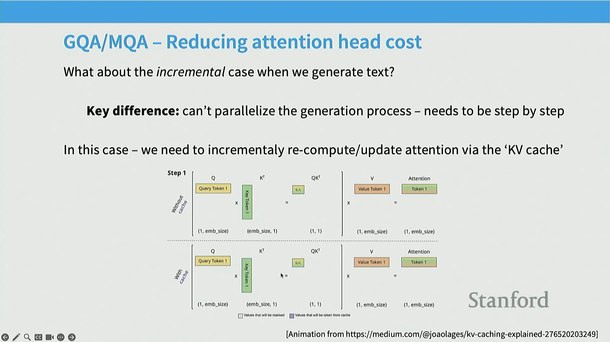

## 计算强度与访存受限挑战
推理效率由**计算强度(Arithmetic Intensity)**决定，即浮点运算次数(FLOPs)与内存访问量(Memory Access Volume)的比值。在启用 KV 缓存的场景下，模型必须在每个生成步骤中反复从内存读取或写回中间的 Key 与 Value 矩阵。这导致了一种极不利的访存模式，其计算强度主要受 $N/D$（序列长度与模型维度的比值）和 $1/B$（批量大小 Batch Size 的倒数）等因子支配。由于实际推理通常以批量大小为 1 且上下文较长(Long Context)的模式运行，系统会陷入严重的**访存受限(Memory-Bound)**状态。此时，GPU 耗费在数据传输(Data Transfer)上的时间远超实际计算时间，导致吞吐量(Throughput)大幅下降，并使得长文本生成的计算成本急剧攀升。
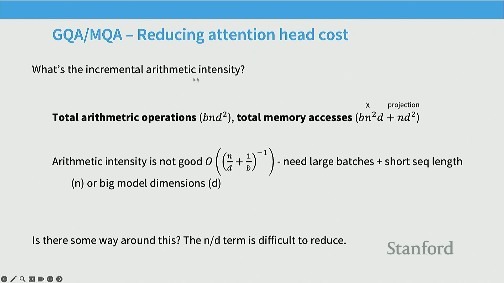
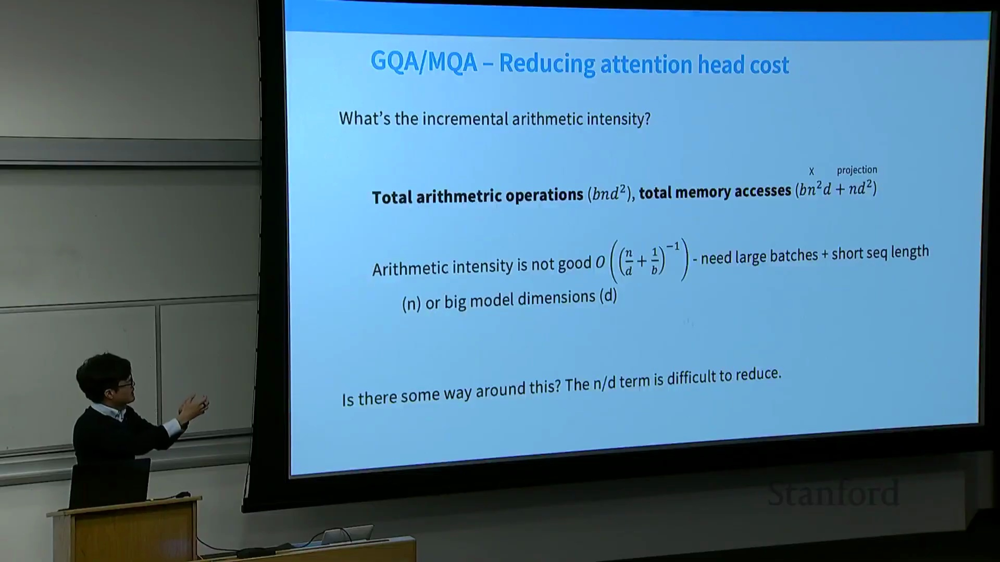

## 多查询与分组查询注意力（MQA 与 GQA）
为突破 KV 缓存带来的内存瓶颈，业界引入了**多查询注意力(Multi-Query Attention, MQA)**。MQA 摒弃了为每个查询头(Query Head)维护独立键/值头(Key/Value Heads)的传统设计，改为让所有查询头共享单一的键/值对。这一设计极大压缩了 KV 缓存的体积，显著降低了内存带宽(Memory Bandwidth)需求，从而大幅提升了计算强度，实现了高效的长序列处理。**分组查询注意力(Grouped Query Attention, GQA)** 则提供了一种更为务实的折中方案(Solution)，它将查询头划分为若干组，每组共享一小部分键/值头。该架构在推理速度与模型表达能力(Expressive Power)之间取得了精妙平衡，有效规避了 MQA 因过度压缩而可能引发的表征能力下降(Performance Degradation)风险。
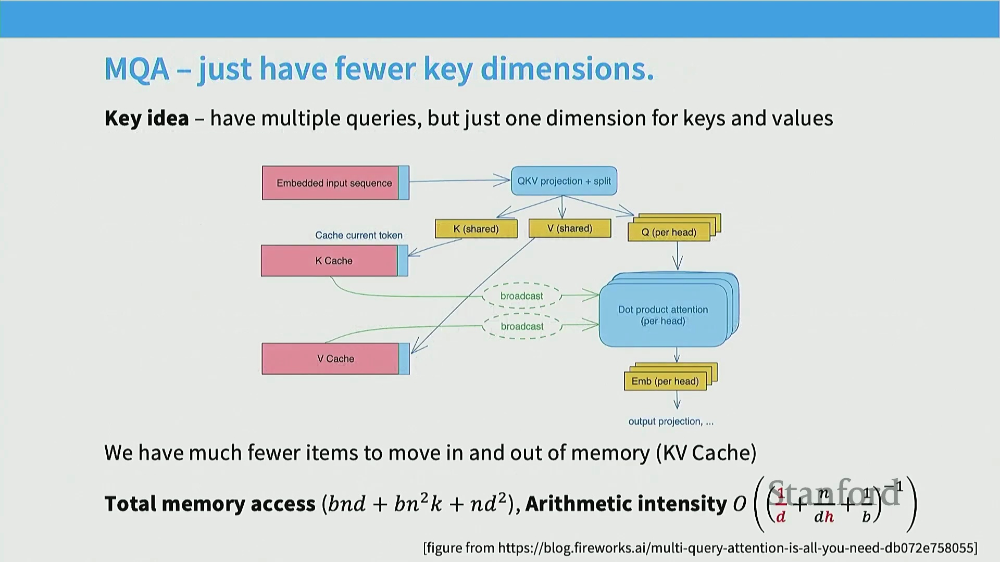
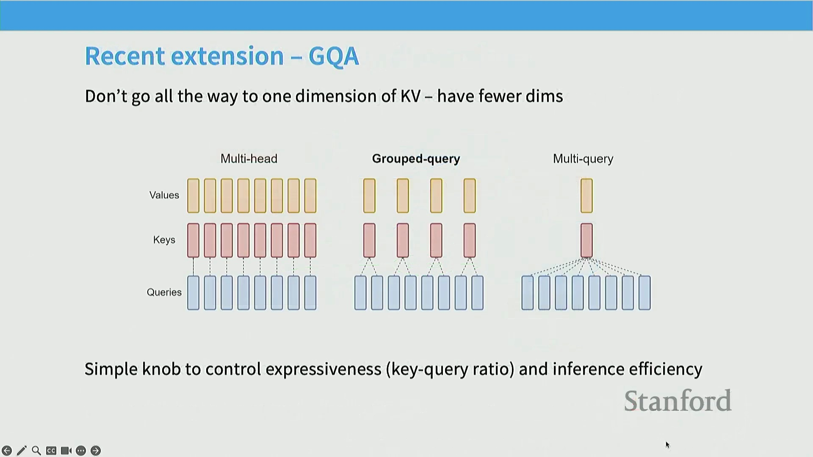

## 用于上下文扩展的滑动窗口注意力
管理长上下文(Long Context)的另一项高效策略是**滑动窗口注意力(Sliding Window Attention)**。在该机制下，网络层不再计算完整历史序列的注意力权重，而是将计算范围严格限制在当前词元周围的固定局部窗口(Local Window)内。随着网络深度的增加，模型的有效感受野(Receptive Field)得以逐步扩展，但单层网络的计算与内存开销始终保持恒定且可预测。这种稀疏注意力(Sparse Attention)模式为传统全量注意力(Full Attention)提供了一种高可靠性且资源节约的替代方案，使模型能够轻松处理超长文档，同时彻底避免了内存开销呈二次方增长(Quadratic Growth)的致命缺陷。
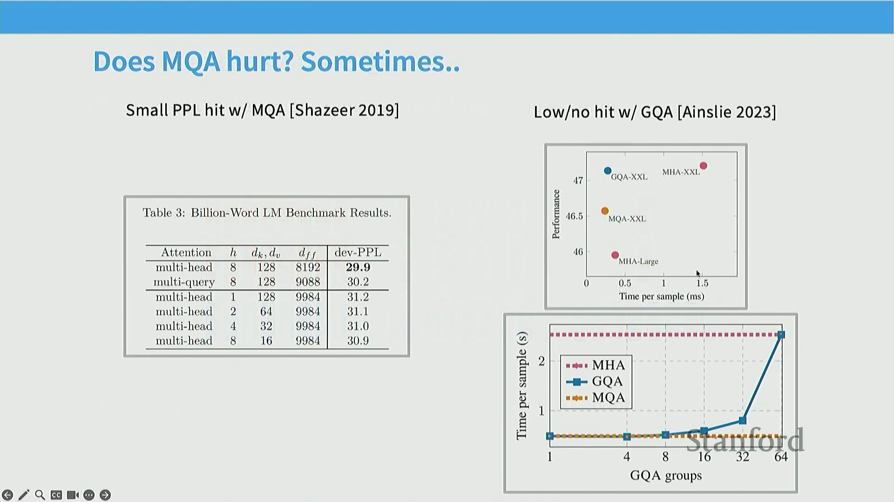
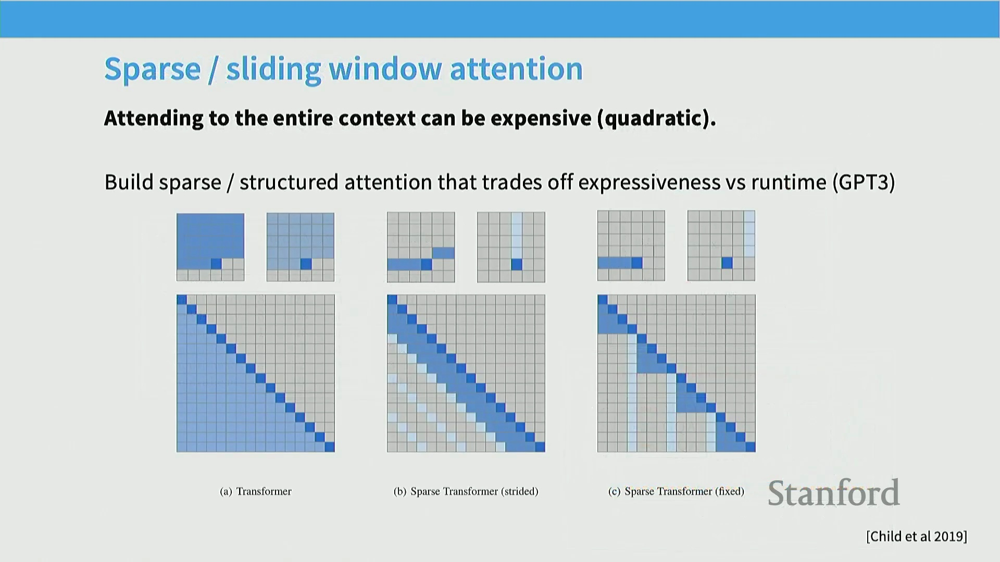

## 面向超长上下文的混合注意力模式
近期的架构突破（如 Llama 3、Gemma、Command R）将上述技术融合，演进为**混合注意力架构(Hybrid Attention Architectures)**。此类模型在网络模块中交替部署多种注意力机制。例如，一种典型配置为：首先引入一层**不依赖**位置编码(No RoPE)的全局注意力(Global Attention)，随后堆叠多层**启用**旋转位置编码(RoPE)的滑动窗口注意力。该设计巧妙地将全局信息聚合(Global Information Aggregation)与局部位置推理(Local Positional Reasoning)解耦。通过在全局注意力层中剥离位置编码，模型成功绕过了传统 RoPE 的长度外推瓶颈(Length Extrapolation Bottleneck)，从而能够稳健地扩展至百万级词元(Million-Tokens)的上下文窗口，同时依托稀疏的局部窗口机制维持了优异的计算效率。
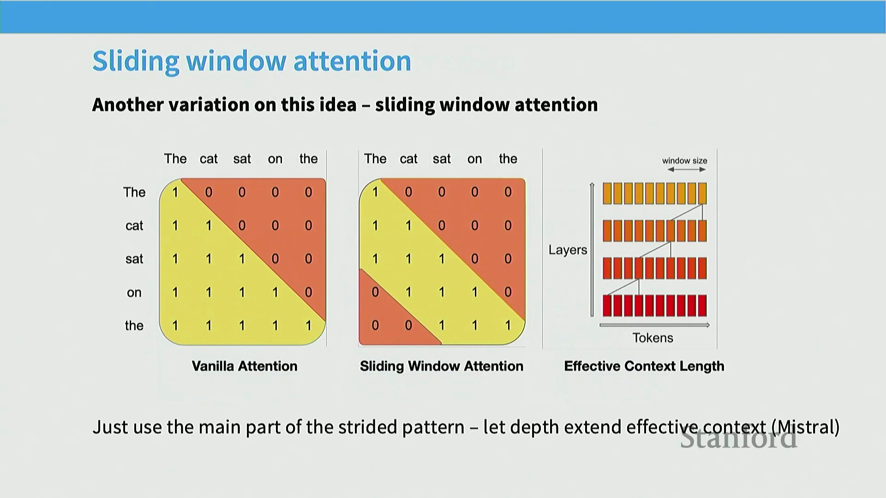
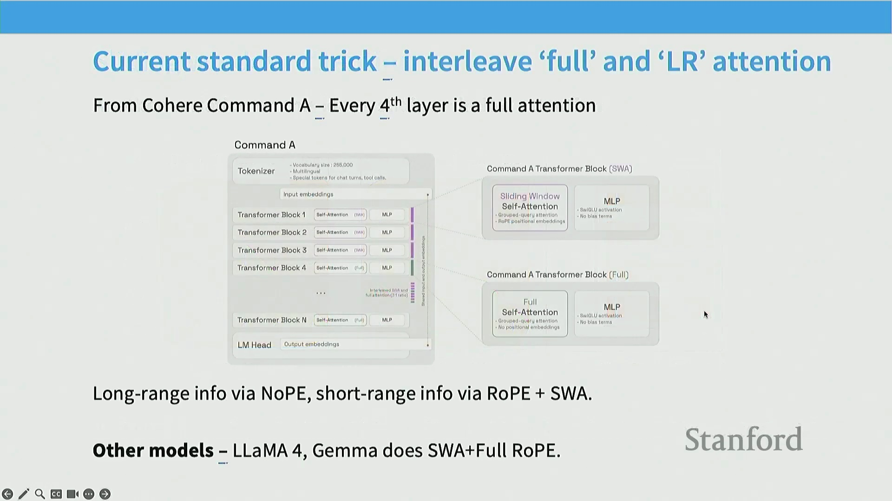

## 结论：架构最佳实践的趋同
Transformer 架构的演进轨迹，深刻反映了业界在理论模型容量(Model Capacity)、训练稳定性(Training Stability)与系统级效率(System-Level Efficiency)之间持续迭代的优化闭环。从前置归一化(Pre-Norm)、均方根归一化(RMSNorm)和门控线性单元(GLU)等基础设计规范，到 KV 缓存、多查询/分组查询注意力(MQA/GQA)以及混合注意力模式等现代推理优化策略，该领域已高度收敛至一系列经过大规模实证检验的工业标准。深入掌握这些架构权衡(Architectural Trade-offs)与超参数配置惯例(Hyperparameter Conventions)，对于设计下一代兼具高效率、高稳定性与强可扩展性(Scalability)的语言模型具有不可替代的核心价值。
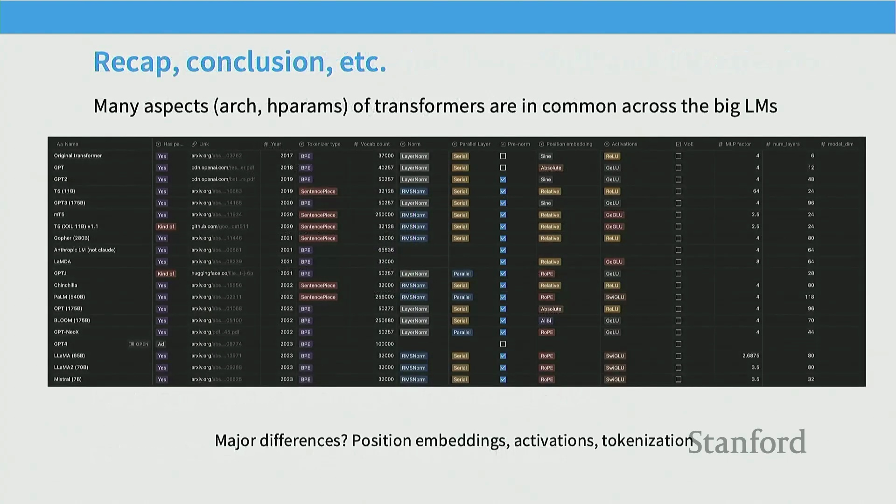
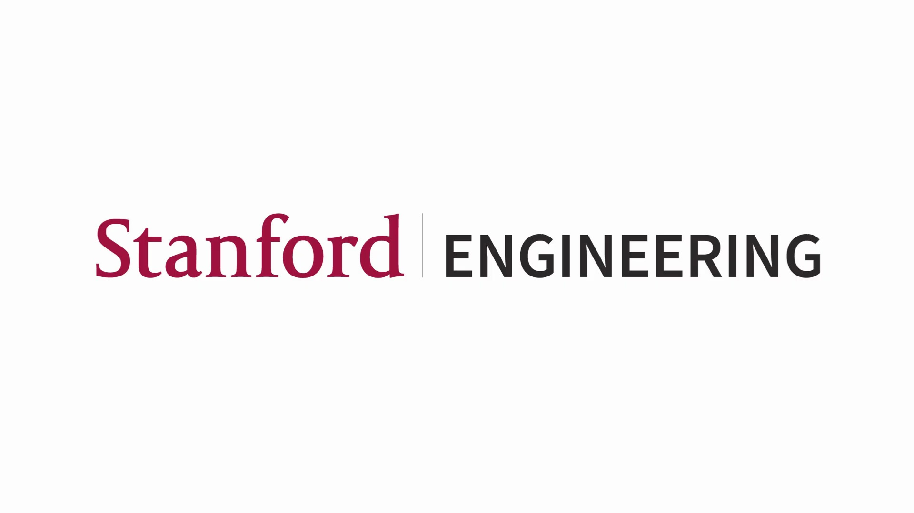