## MoE 简介与现代意义
今天我们将探讨混合专家(Mixture of Experts, MoE)架构。它最初是去年的一场补充讲座，但由于业界的广泛采用，现已成为一个核心议题。现代高性能系统越来越多地基于 MoE 架构进行构建与部署，诸如 GPT、Grok、DeepSeek 以及 Llama 4 等模型均采用了该技术。截至 2025 年，MoE 相较于密集架构(Dense Architecture)的优势已十分明确：在训练充分的前提下，投入 MoE 模型的算力几乎总能产生比同等参数规模的密集模型更高的收益。这使得深入理解 MoE 对于任何希望在给定算力预算内构建最强模型的研究者与工程师而言都至关重要。
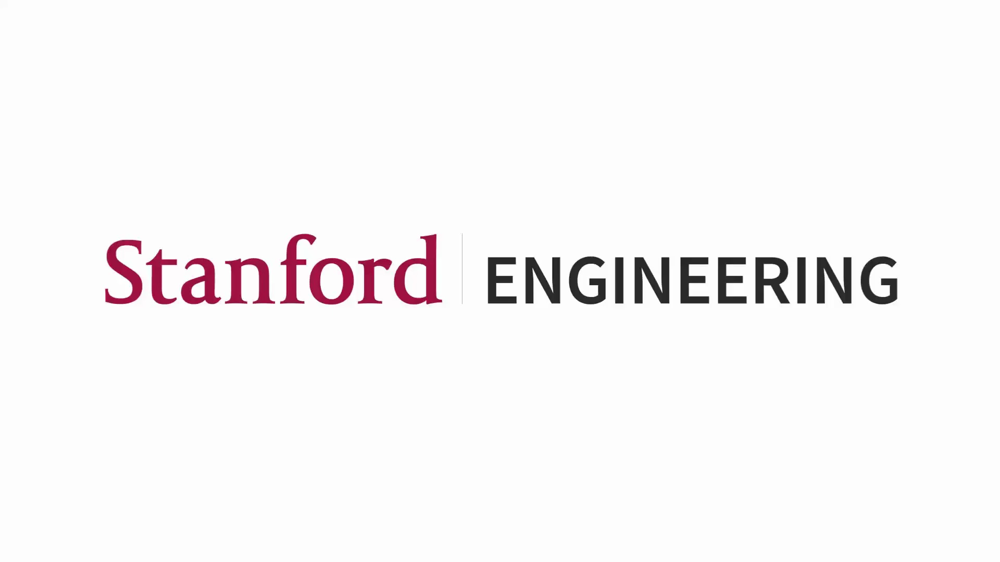
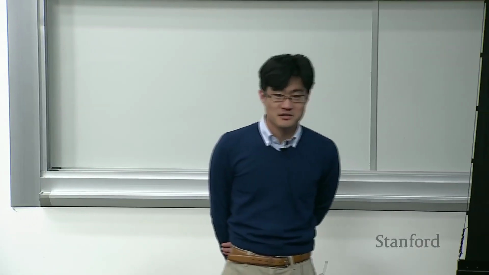
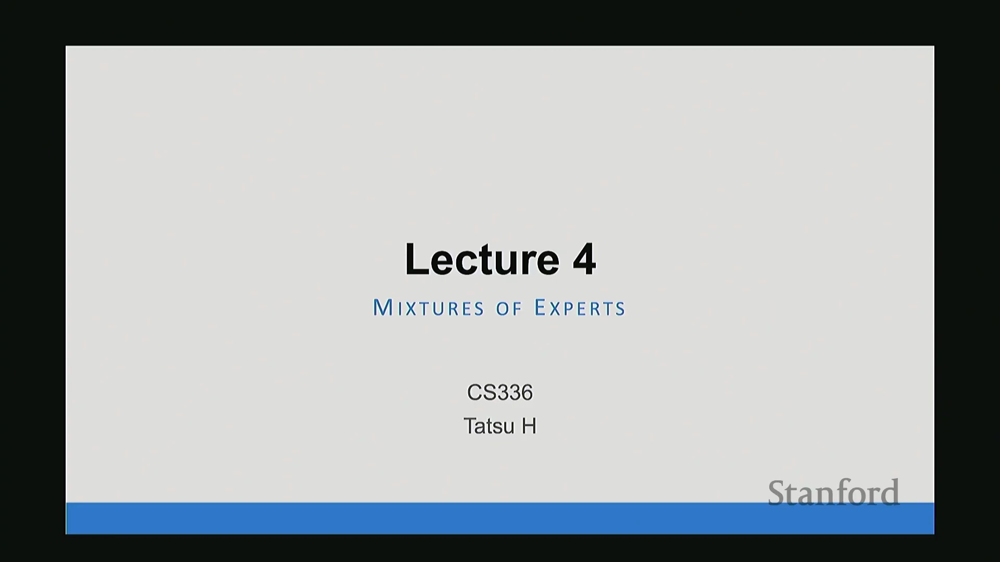
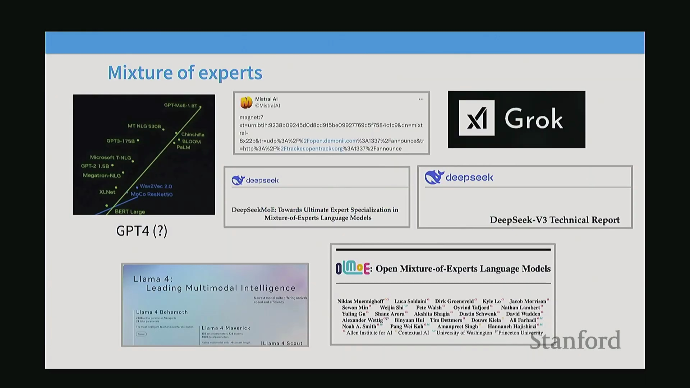

## 核心架构：MoE 的实际工作原理
尽管名为“混合专家”，但 MoE 并不意味着模型内部存在专门针对代码、自然语言或其他特定任务的领域专家。相反，它是一种稀疏架构(Sparse Architecture)，将 Transformer 中标准的前馈网络(Feed-Forward Network, FFN)替换为多个结构相同但规模更小的 FFN 副本，这些副本即被称为“专家”。在每次前向传播(Forward Pass)过程中，路由层(Routing Layer)会动态选择其中一小部分专家参与计算。密集模型通常依赖单个大型 FFN 模块，而稀疏 MoE 模型则将其替换为一个路由选择器与众多小型专家模块。其核心机制在于：若每个标记(Token)仅激活一个专家，且每个专家的参数量与原始密集 FFN 相同，则模型总体的浮点运算次数(Floating Point Operations, FLOPs)将保持不变。该架构的主要优势在于，能够在不增加计算成本的前提下大幅扩展模型参数量，从而使模型更高效地记忆与表征复杂的世界知识。
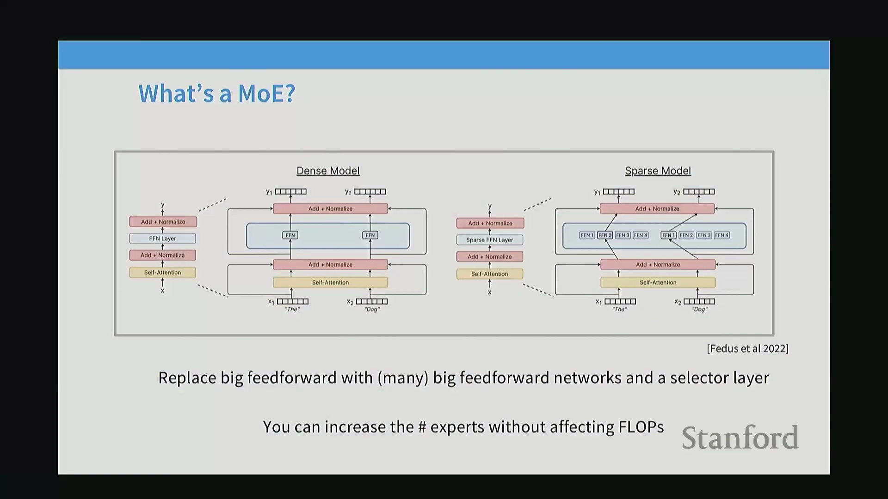

## 性能优势与实证依据
在保持 FLOPs 不变的情况下增加参数量，是否真能提升模型性能？大量研究已给出肯定答案。Fedus 等人于 2022 年发表的一篇开创性论文表明，在训练算力(FLOPs)相匹配的条件下，持续增加专家数量能有效降低训练损失(Training Loss)，并更快优化困惑度(Perplexity)指标。AI2 的 OLMo 项目所进行的类似受控消融实验(Ablation Study)也复现了这一结论，数据显示 MoE 模型在损失下降速度上可达密集模型的 7 倍。尽管增加专家数量会引入显存开销(Memory Overhead)与路由复杂性，但实证数据强烈支持 MoE 的高效性：在同等算力预算下，稀疏架构能够提供更优越的综合性能。
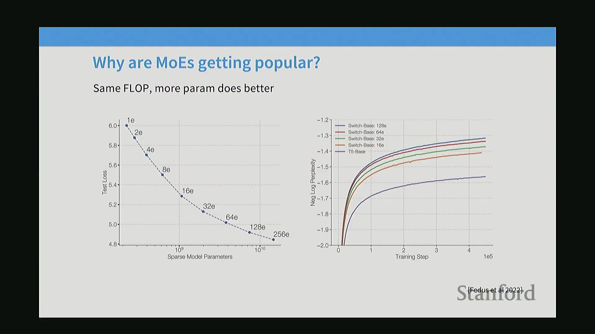

## 系统挑战与工程现实
MoE 在理论上的 FLOPs 效率伴随着显著的系统级权衡(System-level Trade-offs)。标记路由(Token Routing)、显存管理以及在硬件集群间协调稀疏激活(Sparse Activation)，极易成为实际推理延迟(Latency)的瓶颈，即便其理论计算负载依然较低。为实现高效率，系统基础设施需经过精心设计，通常会将不同专家部署在独立的计算设备上，以最小化通信开销(Communication Overhead)。尽管工程实现颇具挑战，但妥善解决这些问题能确保计算预算得到充分利用。这种架构复杂性是为换取性能优势所必须付出的代价，而现代系统级优化已使大规模 MoE 部署变得日益可行。
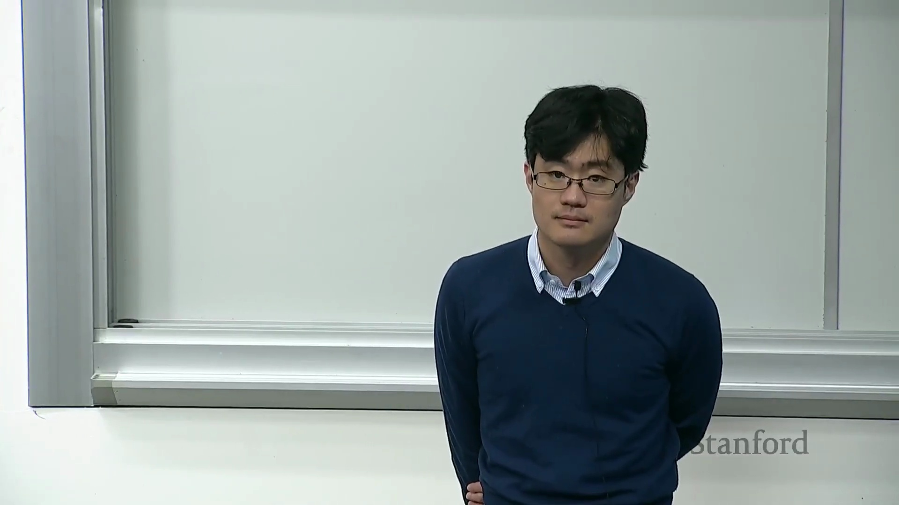
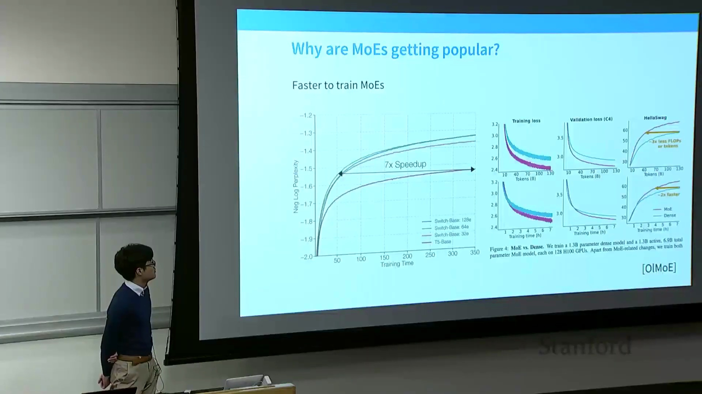
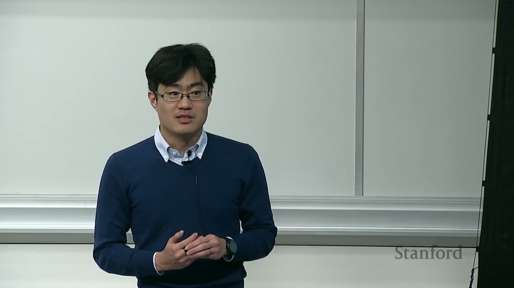
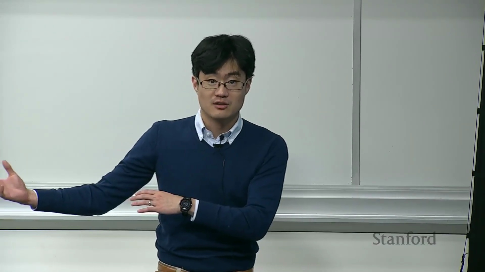
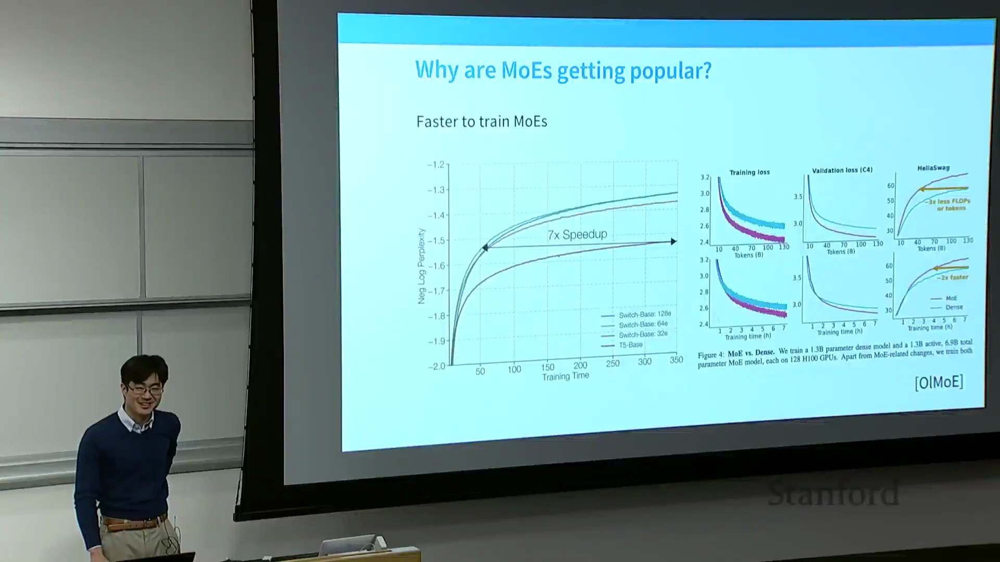

## 参数效率与现实验证
MoE 架构展现出极具说服力的效率指标，尤其是在对比激活参数量(Activated Parameters)与基准测试(Benchmark)性能时。DeepSeek-V2 的论文对此进行了有力论证：仅将 MMLU(Massive Multitask Language Understanding)分数与*激活*参数量（忽略非活跃专家）进行绘图对比，便能直观展现出模型在极低活跃计算量下的卓越性能。该指标凸显出，无论是训练效率还是推理效率，激活参数量均为决定性因素。这些并非仅停留在学术界的消融实验，而是代表了投入巨额资金并已大规模部署的工业级系统，充分证明了稀疏激活在生产环境中能够带来切实的性能收益。
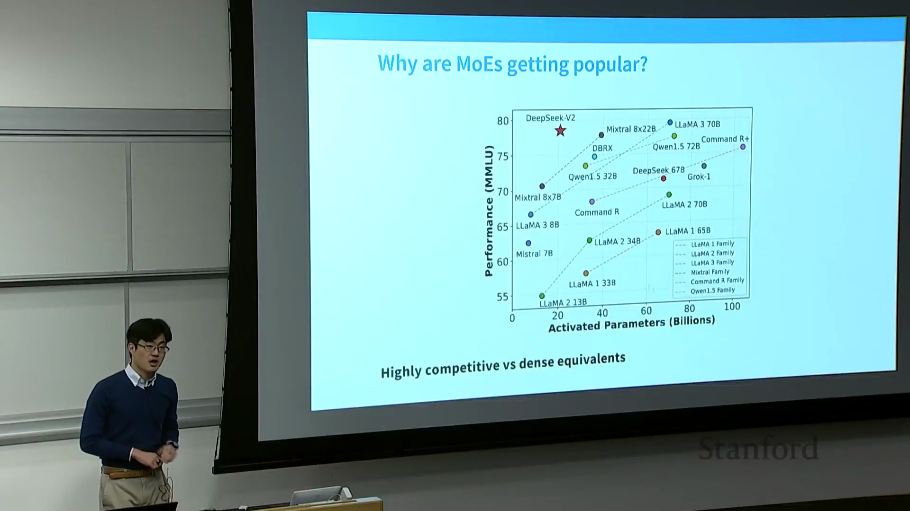
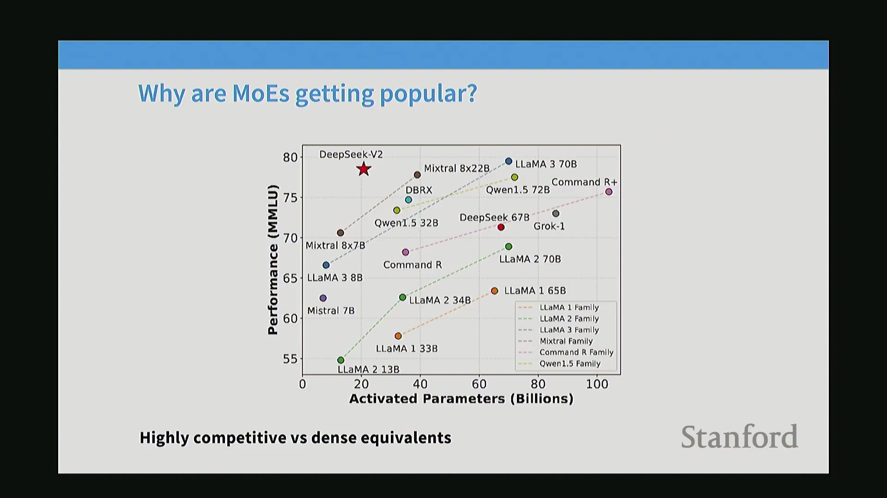

## 专家并行与开源生态
除计算效率外，MoE 天然支持专家并行(Expert Parallelism)，为模型划分(Model Partitioning)提供了强大的新维度。由于每个标记(Token)仅被路由至部分专家，开发者可将不同专家分布于独立设备上进行定向数据路由，从而大幅简化超大规模模型的扩展过程。从发展历程来看，MoE 研究早期主要由 Google 等封闭实验室推动，但开源领域的重大突破却频繁源自通义千问(Qwen)与 DeepSeek 等中国研究团队，他们在广泛的基准测试与架构优化方面持续保持领先。近期，西方开源项目也已全面拥抱 MoE 架构，Mixtral、Grok 以及最新发布的 Llama 4 等模型便是明证。本讲座将持续深入剖析这些系统，以揭示当前最前沿(State-of-the-Art, SOTA)的开源模型是如何构建的。
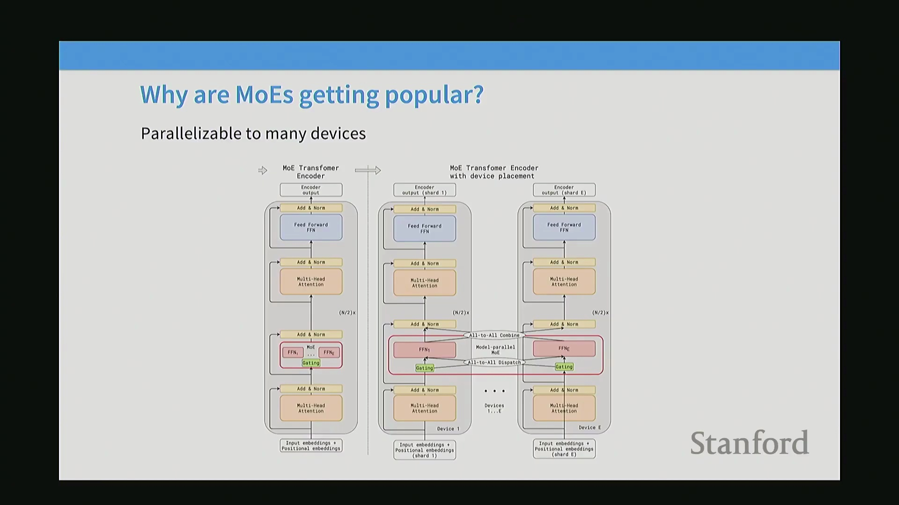
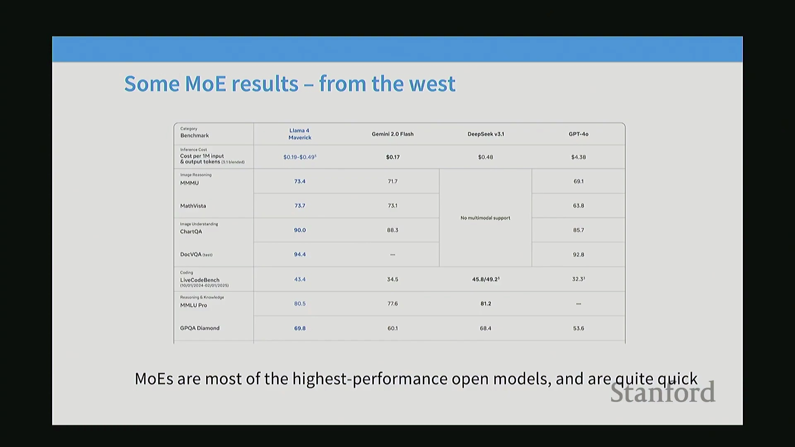

---

## 早期开源 MoE 先驱与 DeepSeek 的发展轨迹
Qwen 1.5 是首批成功实现混合专家(Mixture of Experts, MoE)架构的大规模、文档完善的开源模型之一。它引入了一种优雅的模型升级(Model Upcycling)技术，将预训练的密集模型(Dense Model)转换为 MoE 架构。在保持总参数量低于同等规模 7B 密集模型的前提下，该架构显著提升了计算效率。DeepSeek 也在开源 MoE 领域发挥了奠基性作用。其早期研究对密集模型、朴素 MoE(Vanilla MoE) 与 Switch MoE 进行了严格控制的对比实验，结果一致证明：在固定算力预算下，稀疏架构能够带来更优的基准测试(Benchmark)表现。有趣的是，后来声名大噪的 DeepSeek-V3 在架构上与其最早期的 20 亿参数 MoE 实验高度相似。核心架构蓝图早已确立；V3 的卓越表现主要归功于精细化的工程实现、模型缩放(Model Scaling)与系统优化，而非底层基础结构的颠覆。
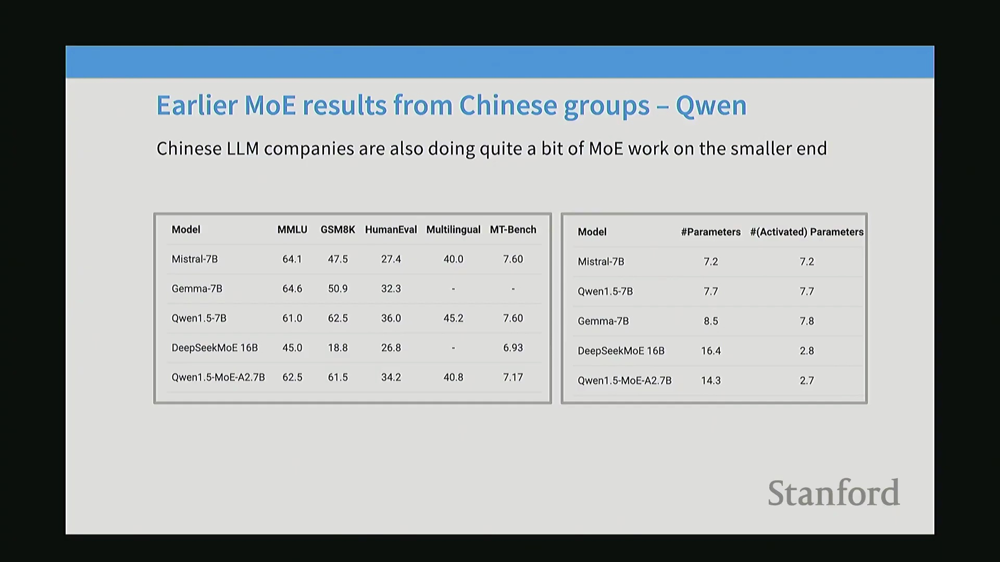
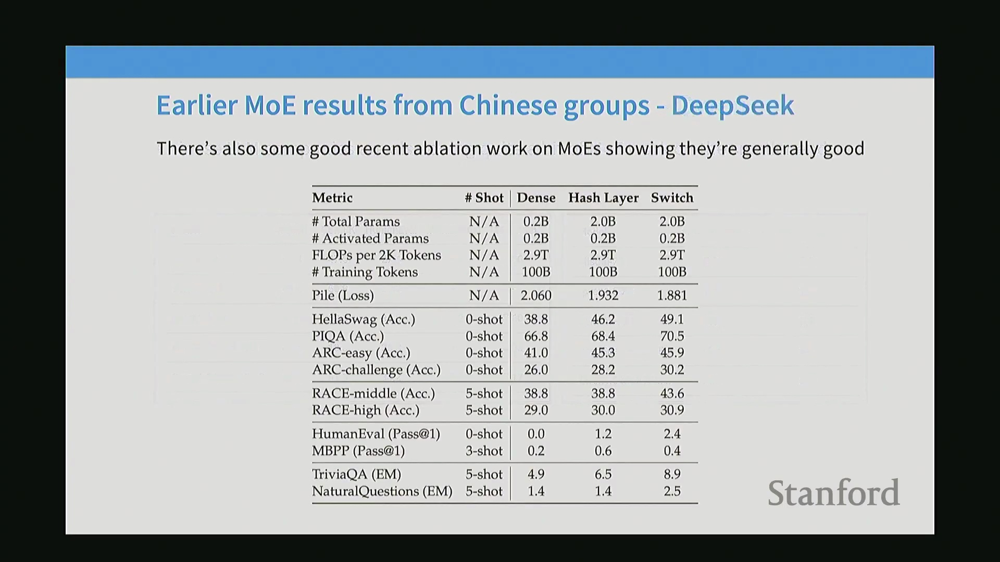

## 基础设施障碍与训练不稳定性
尽管优势已得到充分验证，但由于显著的工程复杂性，MoE 尚未成为标准机器学习课程或小型项目的默认选择。MoE 的核心优势仅在多节点分布式训练(Distributed Training)中才能充分显现。由于大规模模型本身就需要跨设备切分，将模型按专家进行分区(Expert Partitioning)便成为一种自然且高效的并行策略。对于规模较小的配置，其额外开销往往超过收益。一个主要的技术障碍是路由决策(Routing Decision)的不可微性(Non-differentiability)。深度学习依赖平滑且易于计算梯度(Gradient)的目标函数，但将标记(Token)分配给特定专家会引发离散选择(Discrete Selection)问题。这会导致启发式(Heuristic)或不稳定的训练动态(Training Dynamics)，必须通过精心设计的损失函数(Loss Function)与正则化(Regularization)技术来稳定训练过程。此外，尽管理论上可将稀疏路由应用于注意力层(Attention Layer)，但由于严重的训练不稳定性，主流模型极少采用“MoE 注意力(MoE Attention)”机制，而是普遍保持注意力层密集，仅在前馈网络(Feed-Forward Network, FFN)中应用稀疏性。
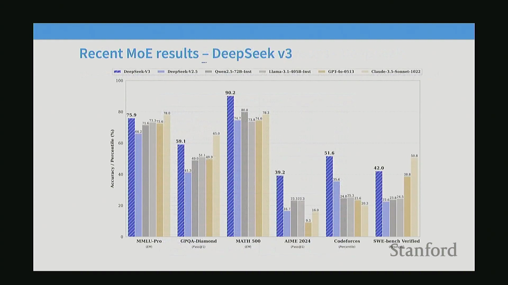
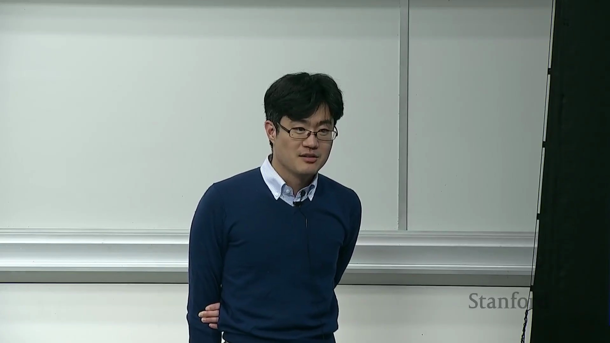
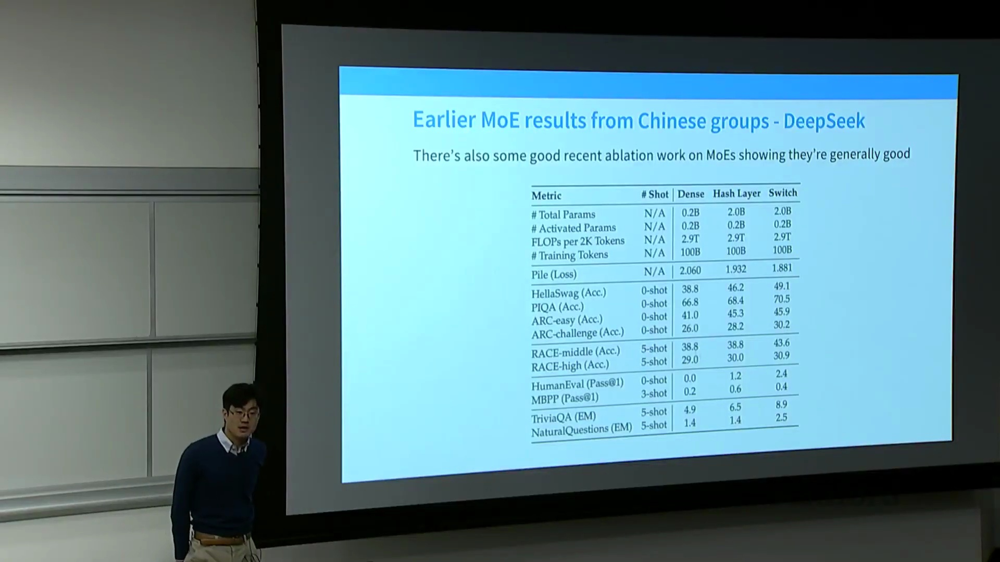
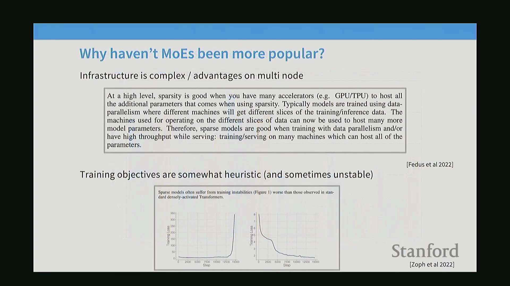

## 路由策略与业界趋同
MoE 的设计空间(Design Space)围绕三个关键的架构问题展开：应如何路由标记(Token)？应使用多少专家，且每个专家的规模应设为多大？以及如何有效训练这个不可微的路由器(Router)？将输入的标记序列映射至特定专家的路由机制是该架构的核心组件。早期研究探索了广泛的路由策略，大致可归纳为三种范式。“Token 选择(Token Choice)”允许每个标记自主选择其偏好度最高的前 K 个专家。“专家选择(Expert Choice)”则反转了这一逻辑，改为由每个专家挑选其偏好度最高的前 K 个标记，从而自然强制实现计算负载均衡(Computational Load Balancing)。“全局分配(Global Assignment)”涉及求解复杂的匹配优化(Matching Optimization)问题，以确保标记与专家之间实现完美的均衡映射。尽管早期进行了广泛探索，但业界现已高度趋同于单一方案：采用 Top-K 选择(Top-K Selection)的 Token Choice 策略。
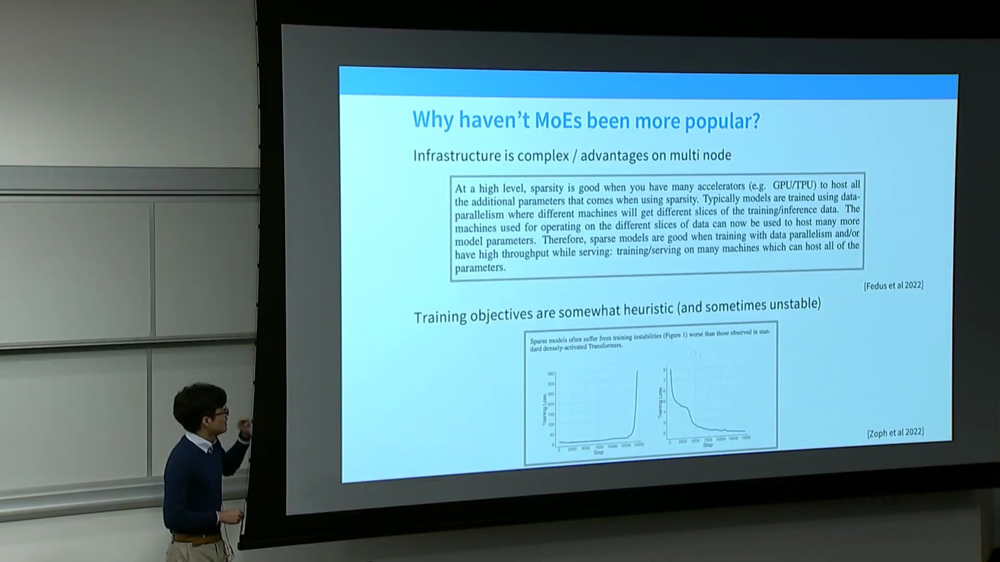
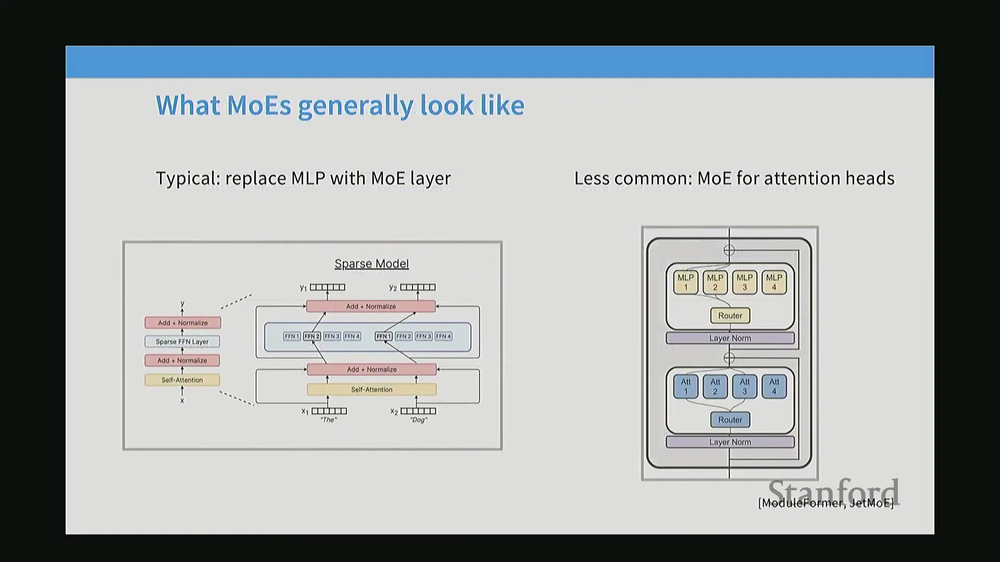

## Token Choice 与 Expert Choice：实际权衡
实证消融实验(Ablation Study)清晰地阐明了 Token Choice 为何能在现代实现中占据主导地位。在对比验证集损失(Validation Loss)的下降曲线时，Token Choice 路由比 Expert Choice 显著更稳定且收敛(Convergence)更快。这是因为路由决策基于标记的隐藏状态(Hidden State)（已融合位置嵌入(Positional Embedding)与上下文嵌入(Contextual Embedding)）进行计算，使模型能够动态地将每个标记匹配至最适合处理它的专家。然而，Expert Choice 提供了一个独特的系统级优势(System-level Advantage)：它能严格保证专家间的负载均衡(Load Balancing)。当专家被部署在不同的硬件设备上时，Expert Choice 通过确保每台设备接收数量完全一致的标记，有效避免了通信瓶颈(Communication Bottleneck)与算力闲置。最终的架构决策取决于优化优先级：是最大化每个标记的处理质量（Token Choice），还是优先保障硬件负载均衡与并行效率(Parallelism Efficiency)（Expert Choice）。
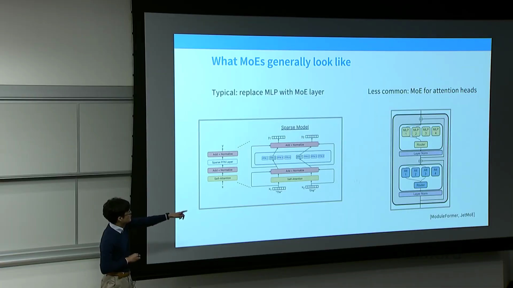
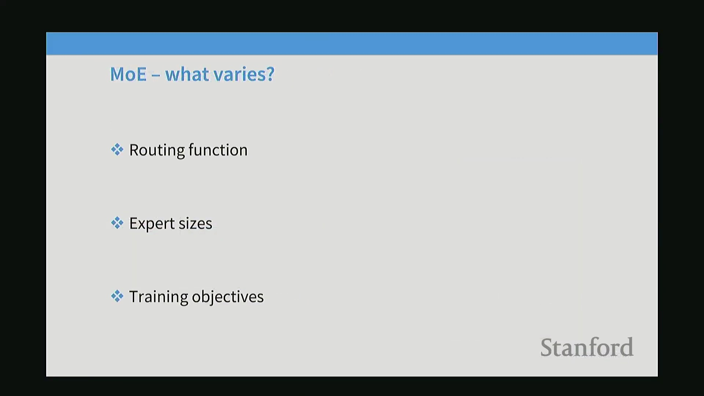
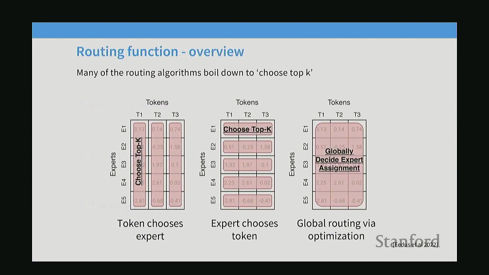

## 轻量级路由器与超参数调优
一个常见的误解是，路由器必须是一个复杂且庞大的神经网络。实际上，其结构异常轻量。路由决策通常仅通过一次简单的线性投影(Linear Projection)完成：将标记的隐藏状态向量与权重矩阵(Weight Matrix)相乘，随后经由 Sigmoid 或 Softmax 等激活函数(Activation Function)生成匹配分数。该操作本质上是一系列向量内积(Vector Dot Product)，概念上类似于注意力机制(Attention Mechanism)，但计算成本要低得多。路由器通过训练学习分配分数，以表征每个专家处理特定输入的能力强弱。最后，“Top-K”参数并非固定不变的常量，而是一个关键超参数(Hyperparameter)，在不同的 MoE 实现中各不相同。开发者会精心调整 K 值，以在模型容量(Model Capacity)、路由稀疏性(Routing Sparsity)与训练稳定性之间取得平衡。大多数现代架构都会选取一个最优值，以在计算效率与模型表征能力(Representational Capacity)之间实现最佳权衡。
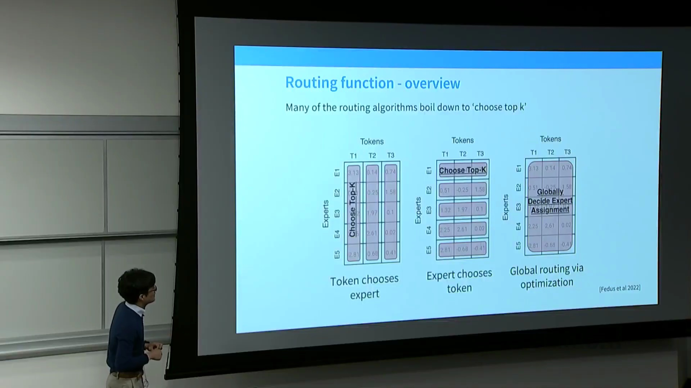
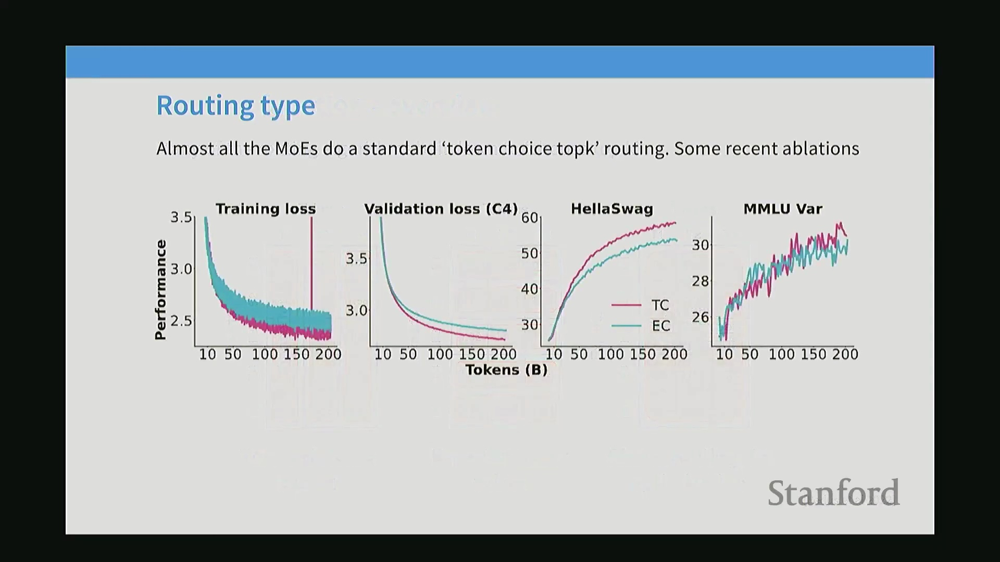
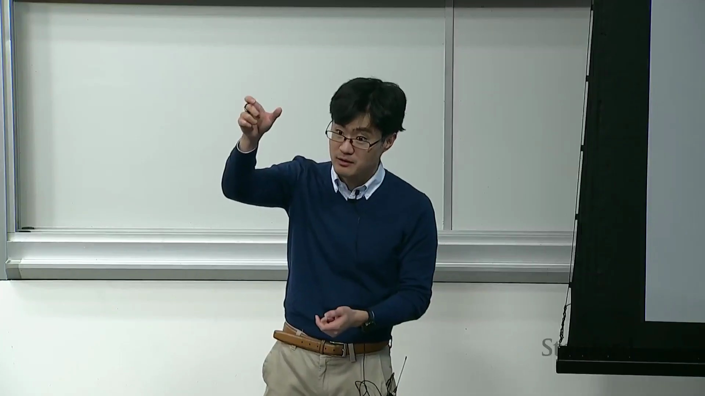
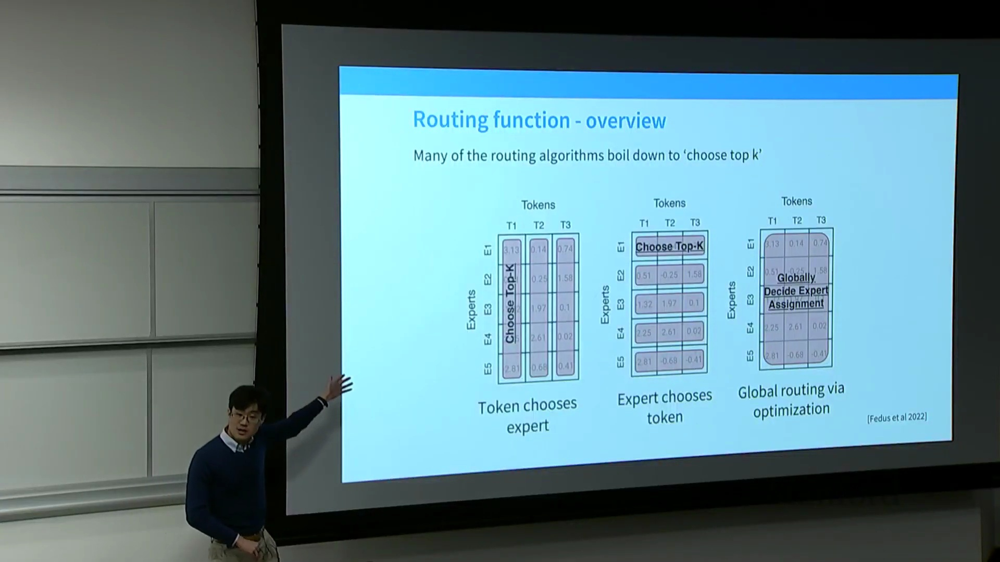
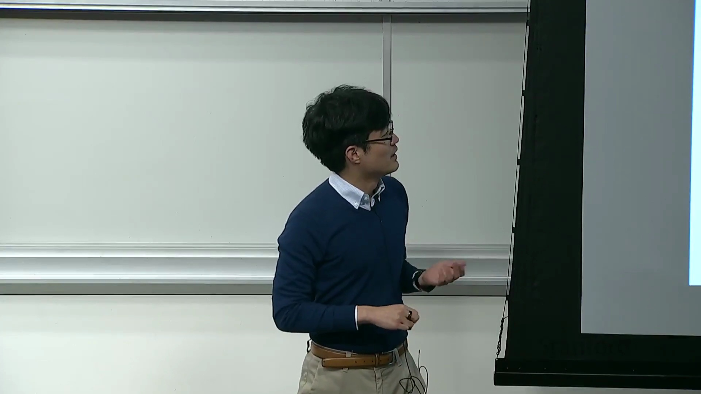

---

## `k` 参数的作用与输出聚合
在 Top-K 路由(Top-K Routing)中，`k` 值的选择是一项基础的架构超参数(Architectural Hyperparameter)。早期的 MoE 研究主张采用 `k > 1`（其中 `k = 2` 成为经典配置），旨在引入一定的探索性(Exploration)，防止模型过早收敛于单一“最佳”专家而错失其他潜在的学习路径。然而，增加 `k` 值会直接提升计算成本(Computational Cost)；例如，与仅激活单个专家相比，`k = 2` 会使有效浮点运算次数(Floating Point Operations, FLOPs)翻倍。当激活多个专家时，其输出会通过加权求和(Weighted Sum)或平均(Pooling)的方式聚合成单一表征(Representation)。路由器(Router)生成的门控分数(Gating Score)决定了各专家的贡献权重，确保最终融合的输出能够无缝地重新整合回模型的残差流(Residual Stream)中。
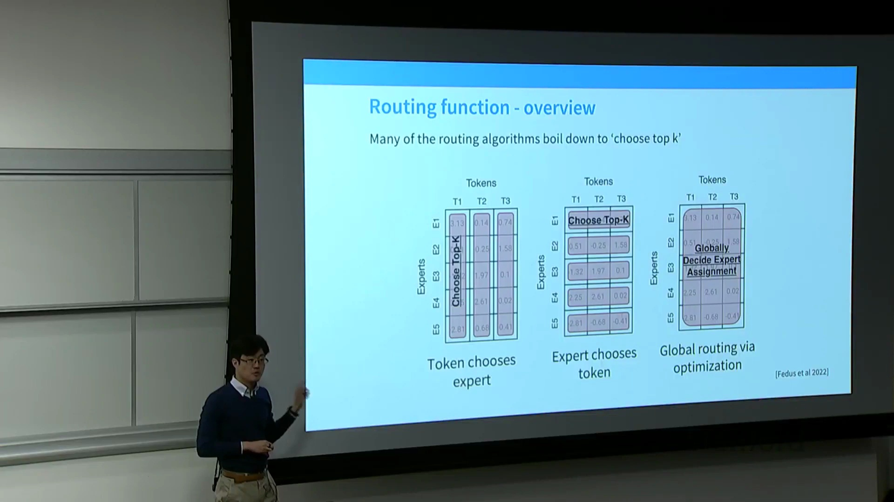

## 替代路由策略与对 Top-K 的趋同
尽管确定性的 Top-K 标记选择(Token Choice)路由在现代实现中占据主导地位，但早期的 MoE 研究曾广泛探索过其他路由范式(Routing Paradigms)。令人惊讶的是，实证结果表明，即使是非语义路由(Non-semantic Routing)（例如简单的内容无关哈希函数(Content-agnostic Hash Function)），也能相较于密集基线模型(Dense Baseline)带来可衡量的性能提升，这凸显了稀疏性(Sparsity)本身所固有的计算效率。其他在理论上更为优雅的方法，如利用强化学习(Reinforcement Learning)处理离散路由决策，或通过求解线性分配(Linear Assignment)与最优传输(Optimal Transport)问题来优化路由，在实践中大多已被淘汰。这些方法往往会带来难以承受的计算开销(Computational Overhead)或严重的训练不稳定性(Training Instability)。因此，业界已高度趋同于 Top-K 路由，因其在预测性能(Predictive Performance)、梯度稳定性(Gradient Stability)以及硬件友好型执行(Hardware-friendly Execution)之间取得了最佳平衡。
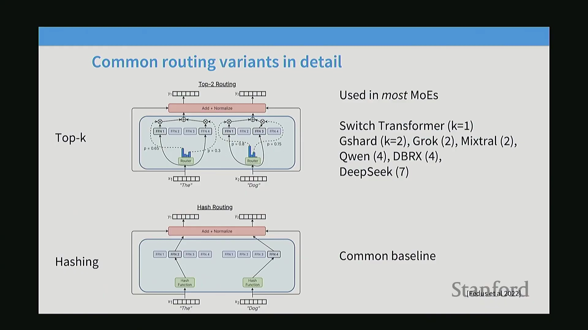
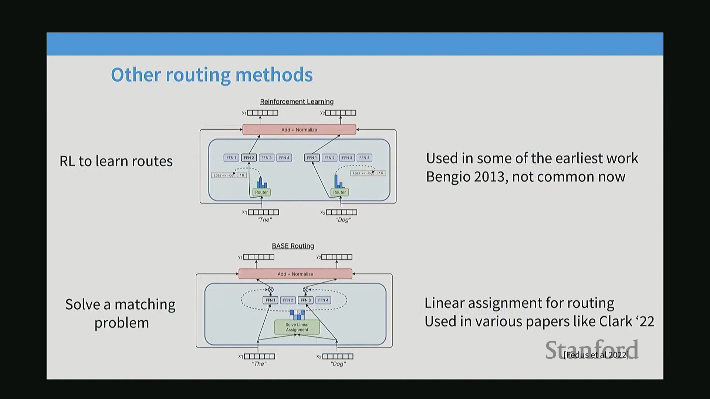

## Top-K 路由器的逐步工作机制
标准 Top-K 路由器的前向传播(Forward Pass)过程与注意力机制(Attention Mechanism)高度相似。输入残差向量(Input Residual Vector) $u$ 首先通过内积操作(Inner Product)与一组可学习的专家路由向量(Learnable Expert Routing Vectors) $e_i$ 进行比较，生成原始匹配分数(Raw Scores)。这些分数通常会经过 Softmax 函数处理（或在 DeepSeek-V3 与 Mixtral 等模型中采用 Sigmoid 或 Logit 变体），以生成归一化的门控概率(Gating Probabilities)。随后，Top-K 操作会屏蔽除得分最高专家之外的所有计算路径，将非激活专家的输出置零。被激活专家的输出将乘以相应的门控权重(Gating Weights)并进行求和。最终，这种融合后的稀疏输出(Sparse Output)会被重新加回原始的残差流中，从而在扩展模型容量(Model Capacity)的同时保持较高的计算效率。
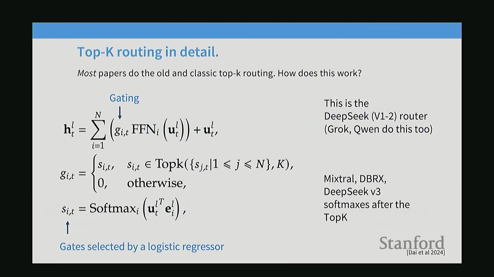

## 架构细节与常见误区
若干实现细节(Implementation Details)常常引发混淆。首先，Softmax 操作的主要作用是将门控权重归一化(Normalization)，使其总和为 1，以便进行稳定的加权平均；它并不严格强制进行单一的硬选择(Hard Selection)，尤其是因为后续的层归一化(Layer Normalization)能够自然地调整特征量级。其次，保留 Top-K 掩码(Top-K Masking)步骤对于保障计算效率不可或缺。若缺失该步骤，模型将激活所有专家，完全背离 MoE 的设计初衷，并产生与密集模型相同的全量训练成本。此外，路由器(Router)的权重向量(Weight Vectors)与前馈网络(Feed-Forward Network, FFN)的参数完全独立。尽管部分架构在训练期间尝试引入软采样(Soft Sampling)以鼓励模型探索，但为避免训练与推理分布不匹配(Train-Test Distribution Mismatch)的问题，确定性的 Top-K 策略依然是业界的标准化实践。
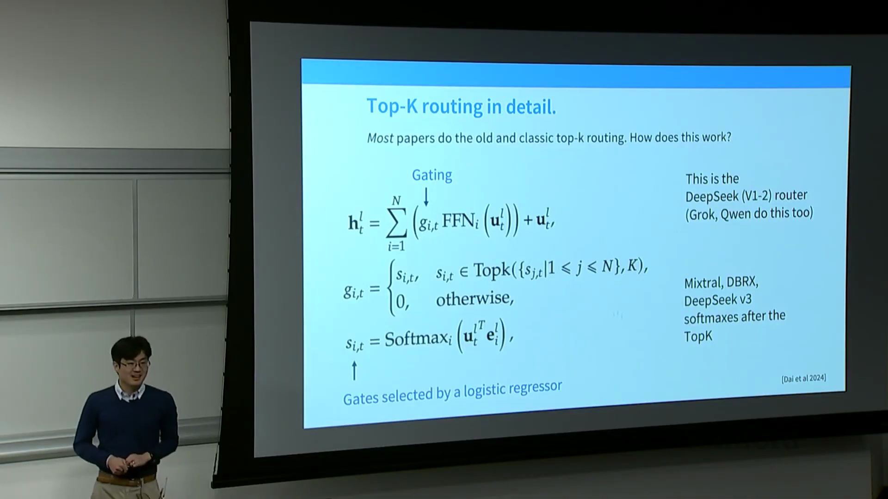
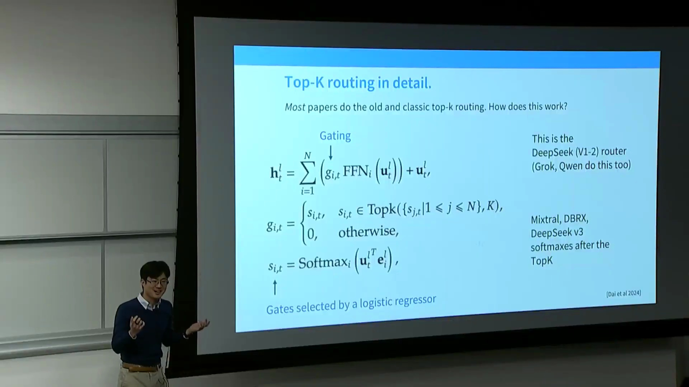
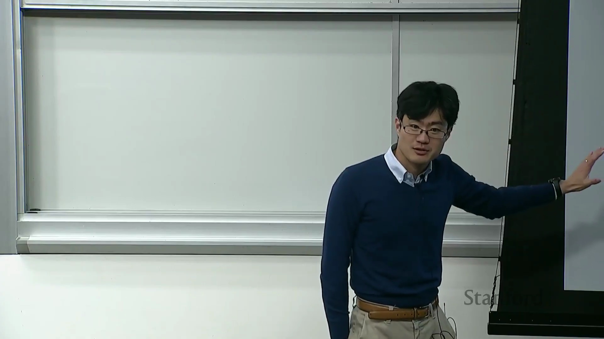

---

## 路由器的简洁性与数学直觉(Mathematical Intuition)
MoE 路由器(Router)的输出并非针对单一函数的严格数学期望(Mathematical Expectation)，而是对多个独立前馈网络(Feed-Forward Network, FFN)进行的稀疏加权选择(Sparse Weighted Selection)，随后通过标准的跳跃连接(Skip Connection)叠加回残差流(Residual Stream)中。一个常见的疑问是，为何路由器通常被参数化(Parameterized)为如此简单的形式，往往仅包含一个线性投影层(Linear Projection)。尽管早期研究曾尝试过更复杂的多层感知机(Multi-Layer Perceptron, MLP)路由器，但现代架构保持其轻量级设计主要出于系统效率(System Efficiency)与训练动态(Training Dynamics)的考量。为路由机制增加浮点运算次数(Floating Point Operations, FLOPs)会直接推高计算成本(Computational Cost)，这必须由下游任务性能(Downstream Performance)的提升来证明其合理性。此外，路由梯度(Routing Gradients)的更新机制本质上是间接的(Indirect)；模型仅能比较被激活专家（如 Top-2 专家）的相对效用(Relative Utility)，并以此反向更新匹配分数(Matching Scores)。即便采用高度复杂的路由器，也无法保证模型一定能学习到最优的路由策略(Routing Strategy)，这使得简单高效的线性层(Linear Layer)成为了最稳健且实用的工程选择。
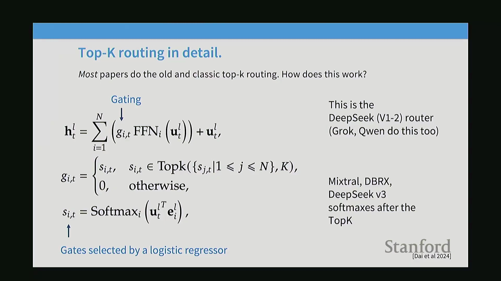
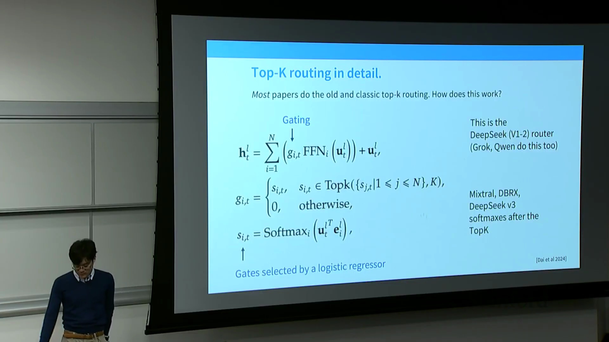

## 细粒度专家与共享专家：DeepSeek 的创新
DeepSeek 推广并迅速被现代 MoE 架构采纳的一项重大突破，是细粒度专家(Fine-grained Experts)与共享专家(Shared Experts)的双重设计。传统的 MoE 仅是对密集前馈网络(Dense FFN)的简单复制，这意味着采用 Top-2 路由会使激活参数量(Activated Parameters)直接翻倍。为在不增加总参数量或 FLOPs 的前提下扩展专家数量，架构师开始将专家切分为更小、更细粒度的计算单元。专家模块不再采用标准的隐藏层与投影层维度比例（如 1:4），而是被切分为更小的内部维度比例（如 1:2 或 1:1），从而在维持完全相同的计算成本下，将专家数量扩充 4 倍或 8 倍。与此同时，架构中引入了共享专家，用于处理无需专门路由的通用标记(Token)任务，从而有效避免了冗余的门控开销(Gating Overhead)。
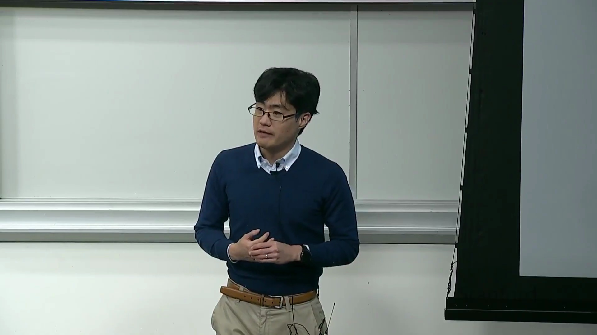
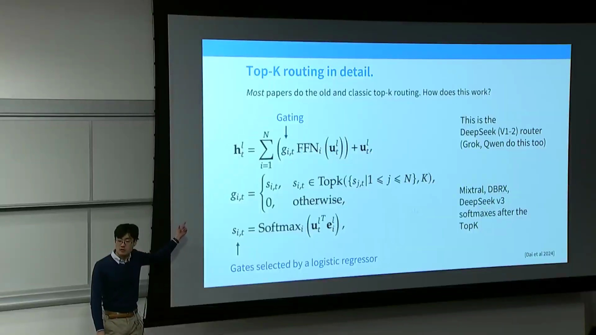
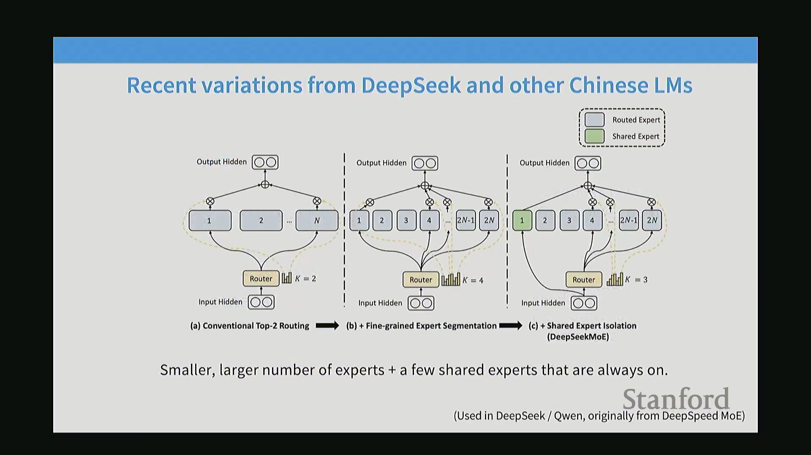

消融实验(Ablation Study)，尤其是 DeepSeek-MoE 论文中的结果表明，细粒度专家设计能持续带来显著的性能提升。共享专家的有效性则更具任务情境依赖性(Task-dependent)：DeepSeek 报告了明确的性能收益，而 OLMo 等独立复现研究则发现其增益微乎其微，最终选择在架构中移除该模块。尽管如此，细粒度化方法如今已被广泛视为业界的标准化实践。
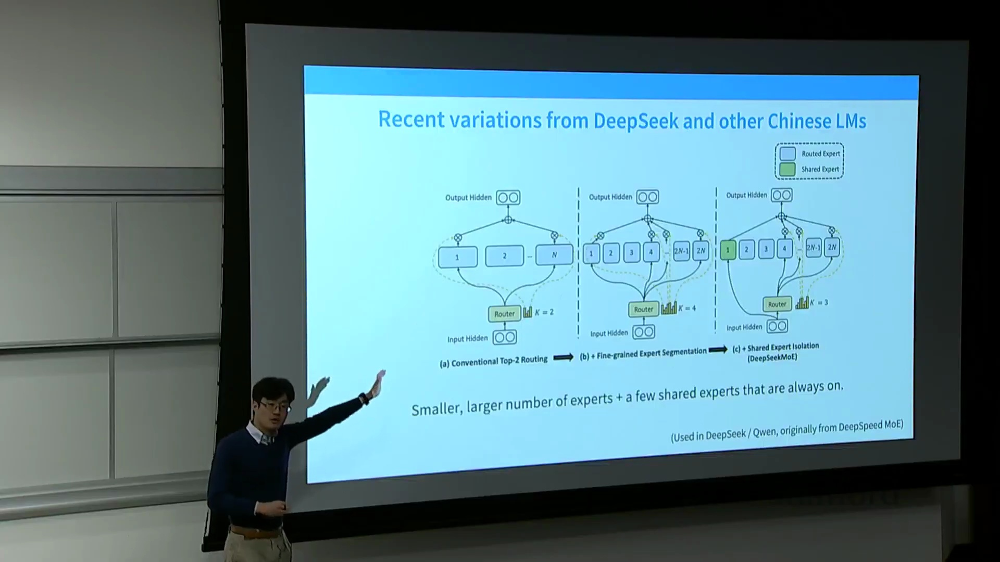
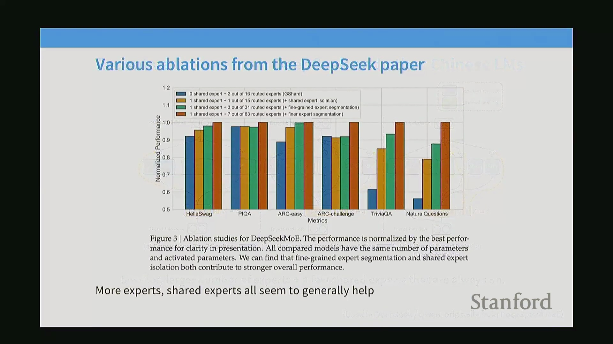

## 业界配置与架构趋势
纵观主流开源与闭源 MoE 模型的发布情况，可以发现业界已明确趋同于“高专家数量、细粒度化”的架构设计。早期的 GShard 与 Switch Transformer 探索了大规模路由专家(Routed Experts)的配置，而中期的 Mixtral 与 Grok 等系统则确立了“8 至 16 个专家、每次激活 2 个（Top-2）”的经典设定。DeepSeek-V1 则通过全新配置打破了这一范式：总计部署 64 个路由专家（每个专家的内部维度切分为原始尺寸的 1/4），每次激活 6 个，并额外配备 2 个共享专家。现代系统（涵盖 Qwen 1.5、DeepSeek-V2/V3、MiniMax 及 Llama 4）均遵循这一演进轨迹，在大幅增加专家总数的同时，严格维持激活过程的稀疏性(Sparsity)。
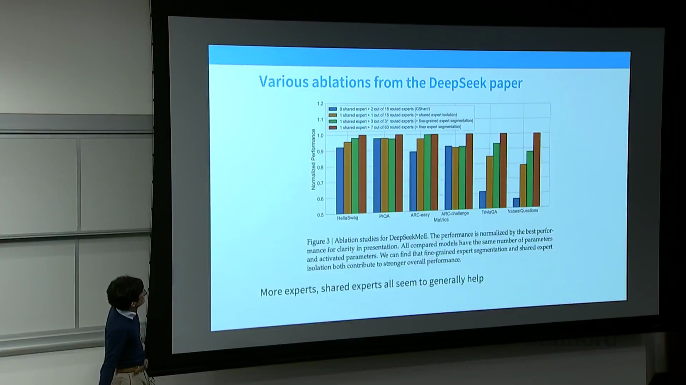
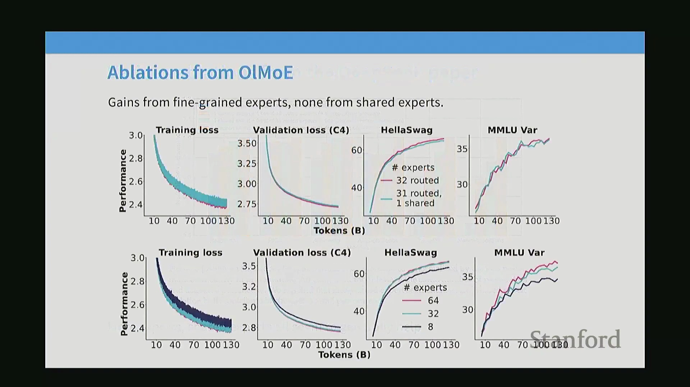

在模型配置文件(Model Configuration)中可见的“切分比例(Slicing Ratio)”参数，通常指示了标准密集 FFN 的投影维度被划分以构建细粒度单元的程度。随着模型规模的持续扩大，技术趋势已十分明确：通过高度细粒度化的专家最大化总参数规模(Total Parameter Scale)，在激活过程中严格保持稀疏性，并策略性地部署共享专家以处理基础计算任务。这一架构演进路径，已成为实现最先进(State-of-the-Art, SOTA)高效语言建模的标准化蓝图。
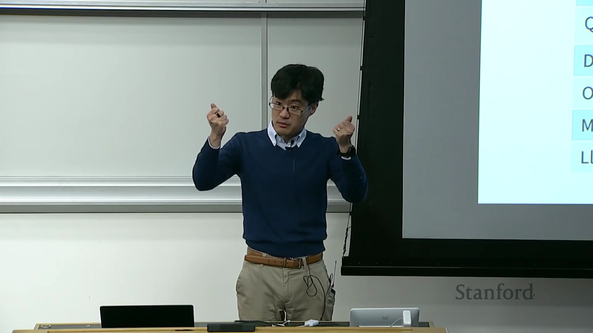
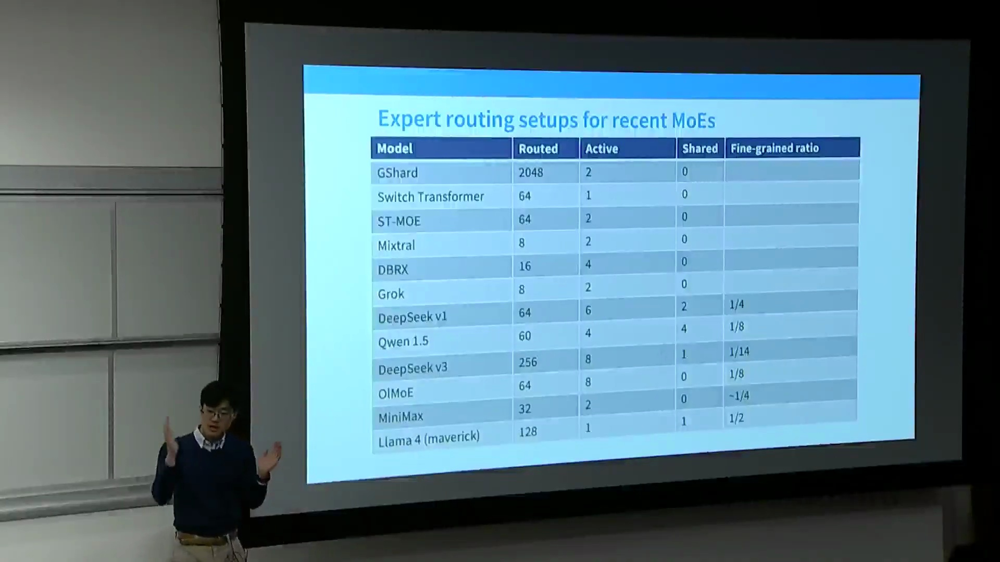

---

## 架构配置与共享专家之争
现代混合专家(Mixture of Experts, MoE)配置高度依赖细粒度专家(Fine-grained Experts)，通过将标准投影维度(Projection Dimensions)系统地切分为更小的矩阵，从而在不增加激活浮点运算次数(Activated FLOPs)的前提下，最大化专家总数。例如，某模型在概念上可能仅对应 16 个标准尺寸的专家，但通过将其切分为原尺寸的 1/4，并总共激活 8 个计算单元（通常为 6 个路由专家(Routed Experts)加 2 个共享专家(Shared Experts)），其有效计算容量(Effective Compute Capacity)可达到同等密集模型的两倍。尽管模型配置文件中的某些投影比例看似奇特，但它们通常对应精确的降维投影(Downprojection)或经过优化的“智能多层感知机(Smart MLP)”设计，这些设计往往有意偏离标准的隐藏层至投影层缩放比例(Hidden-to-Projection Scaling Ratio)。关于共享专家的设计，早期架构曾尝试部署多个共享单元，主要目的在于保持各专家模块尺寸一致，并平衡激活参数量(Activated Parameters)。然而，近期的独立消融实验(Ablation Study)（如 OLMo 团队的研究）表明，增加共享专家带来的性能收益呈现边际递减趋势，这促使业界普遍回归至仅使用零个或单个共享专家的标准化配置。
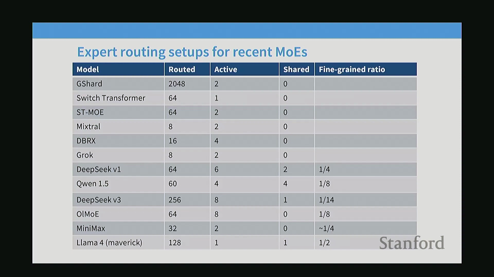
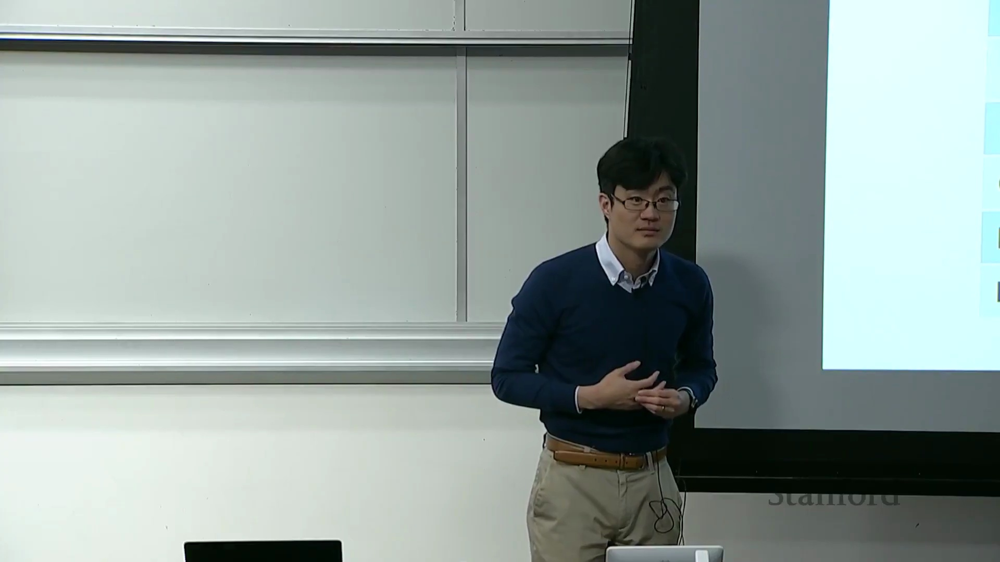
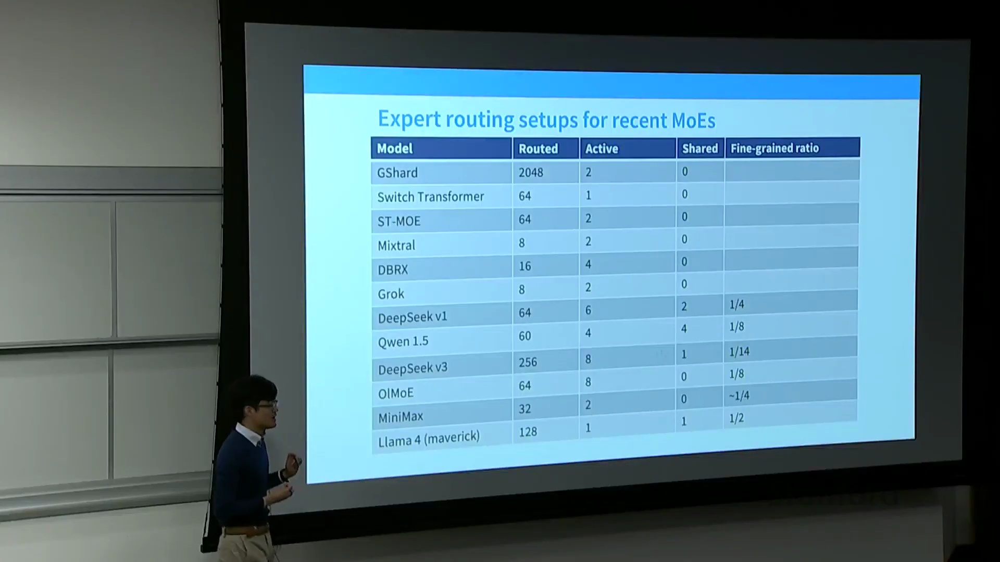

## 训练瓶颈：不可微路由
尽管 MoE 的前向传播(Forward Pass)在数学上十分直观，但其训练过程却引入了严峻的优化瓶颈：受限于计算资源，系统严格禁止同时激活所有专家，否则浮点运算次数(FLOPs)将呈指数级暴增（例如扩大 256 倍）。因此，模型在训练期间必须维持严格的硬稀疏性(Hard Sparsity)。然而，离散的 Top-K 路由决策(Top-K Routing Decision)本质上是不可微的(Non-differentiable)，这使得传统的优化问题转变为类似强化学习(Reinforcement Learning)的复杂难题。其核心挑战在于：如何在充分保留稀疏性(Sparsity)所带来的计算优势的同时，实现路由策略稳定且可靠的基于梯度(Gradient-based)的参数更新。这一困境直接催生了大量针对专用训练启发式算法(Training Heuristics)的研究。
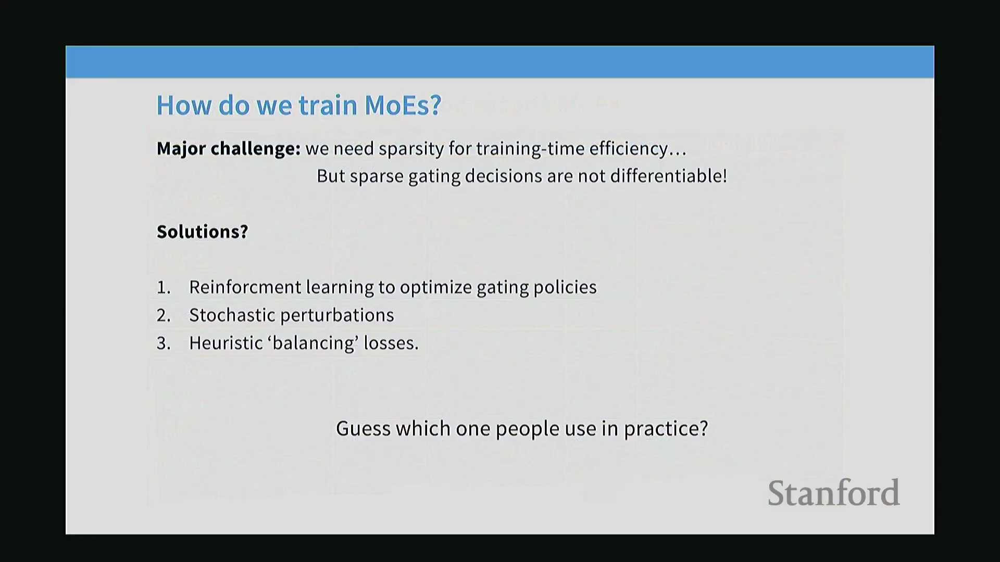
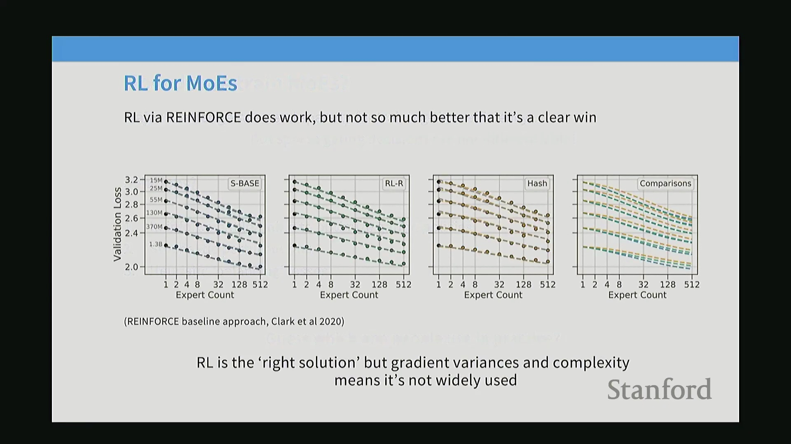

## 早期探索策略：强化学习与随机抖动
针对路由决策的不可微性问题，早期研究主要探索了两种变通方案：强化学习与随机探索(Stochastic Exploration)。基于强化学习的路由算法虽然在离散策略优化(Discrete Policy Optimization)方面理论完备，但实际计算成本极高且训练极不稳定，最终其表现未能超越哈希路由(Hash Routing)或线性分配(Linear Assignment)等更为简单的基线方法。另一种方案是引入随机抖动(Stochastic Jittering)，即在 Top-K 选择之前，将可学习的高斯噪声(Gaussian Noise)注入路由器的匹配分数(Matching Scores)中。该技术与强化学习中的 $\epsilon$-贪婪($\epsilon$-Greedy)策略类似，迫使模型偶尔将标记(Token)路由至次优专家，从而能够从原本处于休眠状态的路径中收集梯度信号(Gradient Signals)。尽管此举有助于塑造更稳健、鲁棒性(Robustness)更强的专家表征(Expert Representations)，但引入的随机性也降低了整体的专家专业化程度(Expert Specialization)与训练效率。因此，绝大多数现代训练流程(Training Pipeline)已摒弃此类复杂的随机采样与强化学习方法，转而采用确定性的、基于辅助损失函数(Auxiliary Loss)的负载均衡机制。
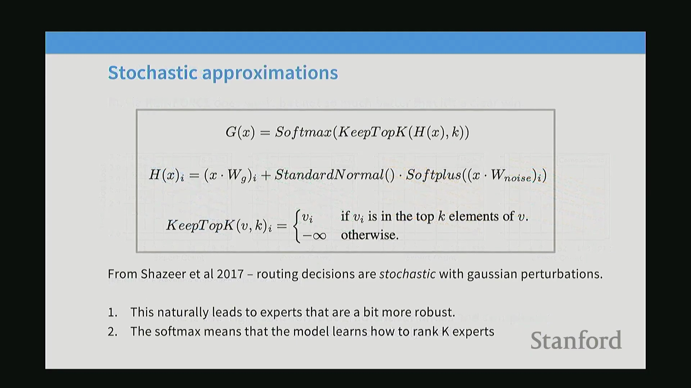
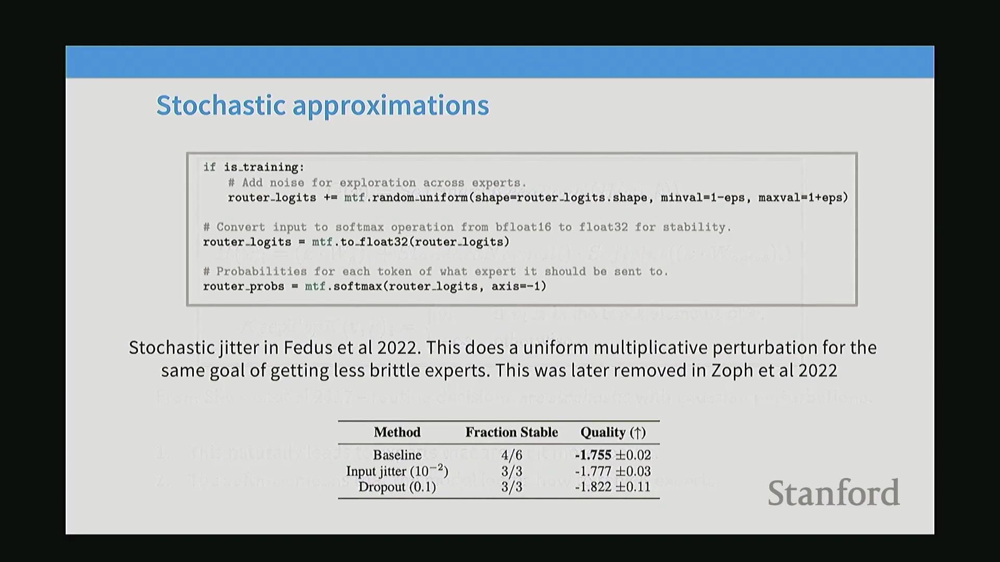
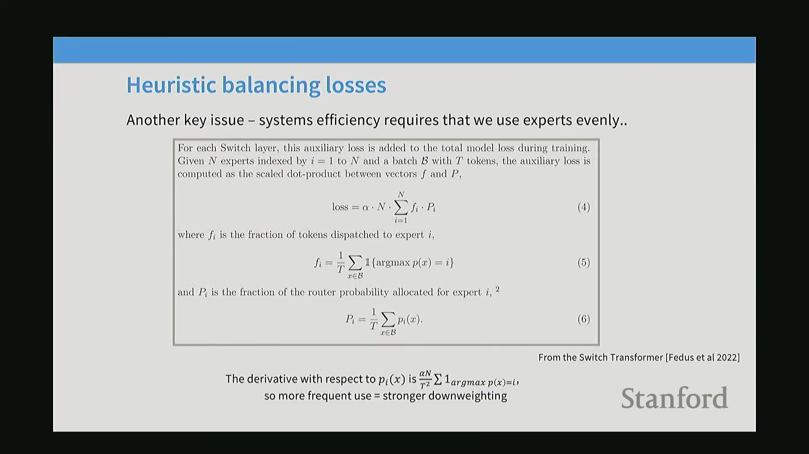

## 利用辅助平衡损失解决专家坍缩
若缺乏显式的探索机制，针对 Top-K 路由的标准梯度下降(Gradient Descent)将不可避免地引发“专家坍缩(Expert Collapse)”现象。即模型会迅速收敛并锁定单一能力突出的专家，将几乎所有标记路由至该节点，导致其余专家参数处于闲置状态，形同虚设。为逃离这一有害的局部最优解(Local Optimum)，现代架构普遍依赖于辅助负载均衡损失函数(Auxiliary Load Balancing Loss)。该损失函数最初在 Switch Transformer 论文中被正式提出，通过计算两个分布向量的内积来惩罚标记分配不均的问题：$f_i$ 表示当前批次(Batch)中实际路由至各专家的标记比例，$p_i$ 表示路由器分配给各专家的门控概率(Gating Probability)。通过在训练过程中最小化该乘积，模型被强制要求将标记均匀分配至所有可用专家，从而确保硬件层面的负载均衡(Hardware Load Balancing)，并为大规模 MoE 模型的稳定训练奠定坚实基础。
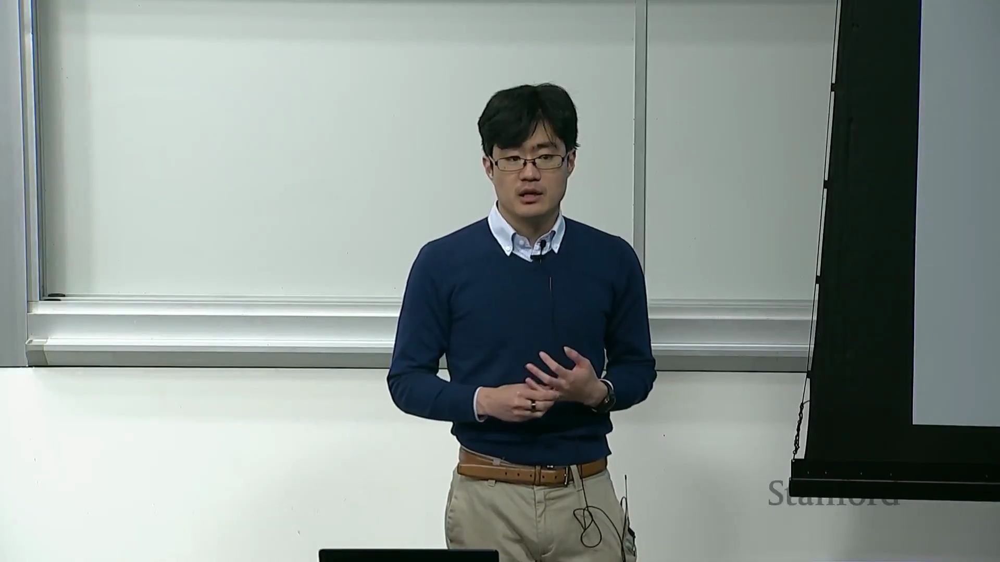
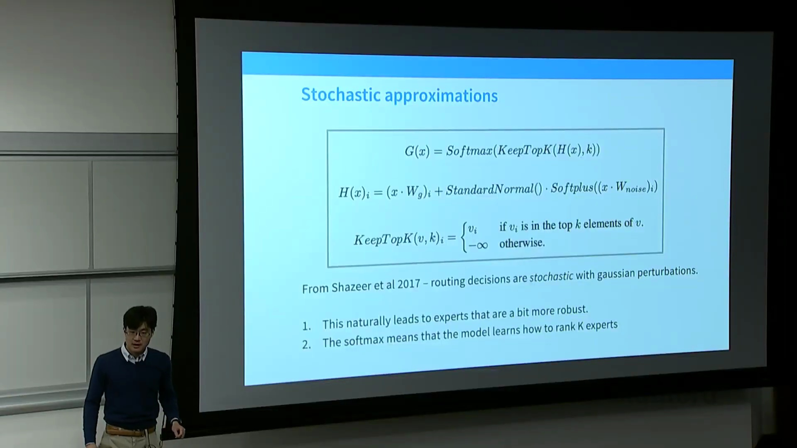

---

## 损失导数与Token比例降权
在考察损失(Loss)相对于路由概率(Routing Probability) $p(i)$ 的导数时，该导数函数呈线性变化。最强的降权效应会自然作用于接收Token(词元)最多的专家(Expert)，使得惩罚力度与该专家接收的Token数量成正比。因此，在优化过程中，处理更多Token的专家将受到更强烈的向下抑制。这种按比例降权构成了负载均衡损失(Load Balancing Loss)的基础机制，几乎所有现代实现均采用了频率惩罚(Frequency Penalty, FP)技巧，以促进Token在不同路由单元间的均匀分布。

## 批次级与设备级负载均衡策略
负载均衡的主要计算单元通常是批次(Batch)，其目标是在每个批次内将Token均匀分配给所有专家。DeepSeek及类似架构实现了一种逐专家、逐批次的平衡机制，该机制高度类似于常见的频率惩罚内积结构，并在执行Top-K选择(Top-K Selection)前利用Softmax得分(Softmax Score)。除算法层面的平衡外，系统级约束还要求将专家分布至不同的硬件设备上。为解决这一问题，可在设备级(Device-Level)引入辅助损失函数(Auxiliary Loss Function)。该损失函数不再对每个专家的Token分配进行全局求和，而是专门追踪每个GPU或TPU上的Token分布情况。通过优化该损失，可训练路由函数(Routing Function)在物理硬件间保持均衡的利用率，从而显著提升系统效率与并行吞吐量(Parallel Throughput)。

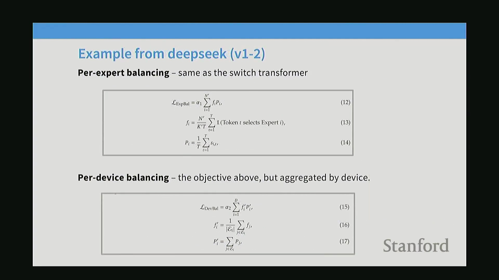
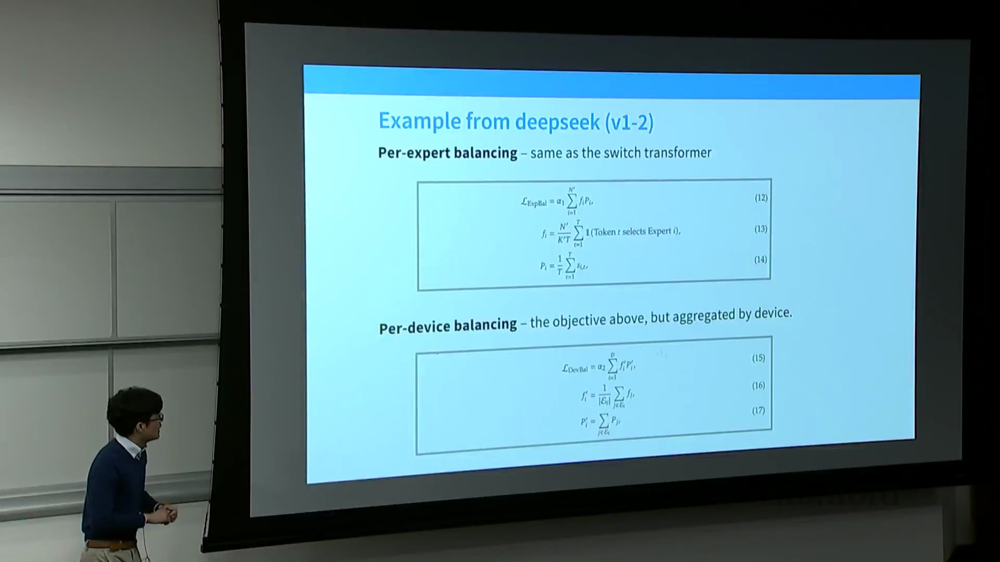

## DeepSeek V3：无辅助损失负载均衡
DeepSeek V3 完全移除了标准的辅助负载均衡损失项，标志着与传统方法的显著背离。该方法并未向损失函数添加惩罚项，而是通过为每个专家引入可学习的偏置项(Bias Term) $b_i$ 来直接调整路由机制。在进行路由决策前，该调整因子会被叠加至原始的Softmax得分上。若某专家利用率不足，则调高 $b_i$；若利用率过高，则降低 $b_i$。该调整通过一种简洁的在线梯度更新(Online Gradient Update)方案实现，根据每个批次的实时Token分布动态更新 $b_i$。关键在于，这些偏移量仅用于影响路由选择，而不会作为最终门控权重(Gating Weight)的一部分参与前向传播，从而实现了作者所称的“无辅助损失负载均衡(Auxiliary-Loss-Free Load Balancing)”。

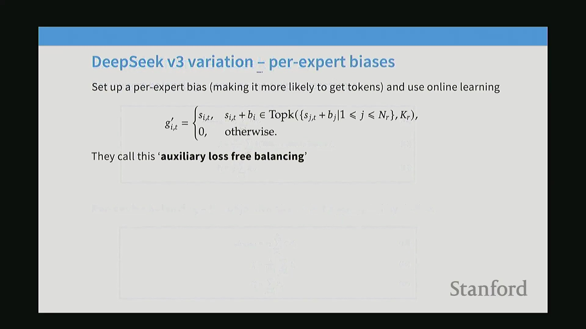
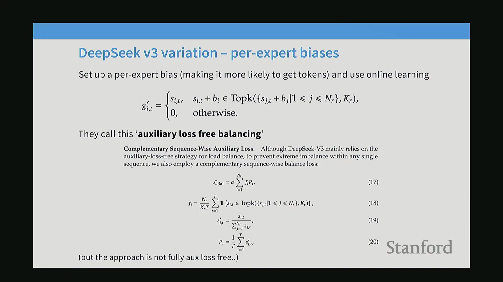

## 系统优化与模型性能
一个常见的疑问是：若忽略此类系统级优化，模型性能会纯粹提升还是维持不变？事实是，逐专家(Per-Expert)的负载均衡不仅是系统层面的考量，更是模型健康运行的基础。若缺乏显式的平衡机制，混合专家(Mixture of Experts, MoE)架构将遭受严重的表征崩溃(Representation Collapse)。模型会迅速将绝大多数Token路由至一两个表现优异的专家，导致其余专家完全“死亡(Dead Expert)”且无法获得有效训练。这实际上会将大规模MoE模型退化为容量小得多的模型，不仅造成显存浪费，还会严重损害整体预测性能。

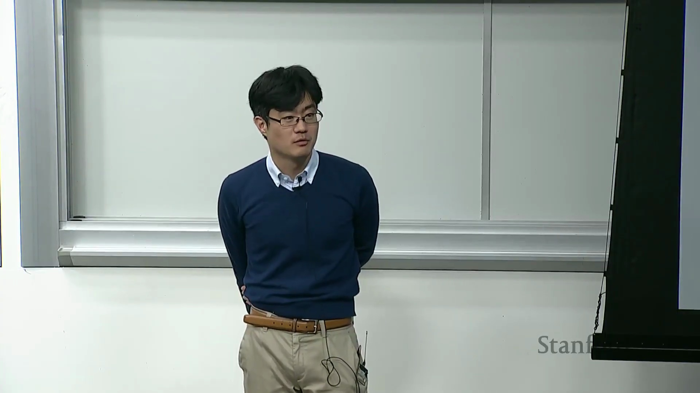
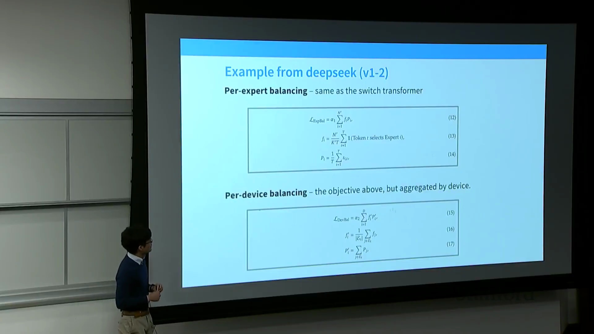

## 哈希机制与GPU分片
将学习式路由(Learned Routing)与哈希路由(Hash-based Routing)或随机路由(Random Routing)进行比较时，哈希路由仍能提供确定性的一致性保证(Deterministic Consistency Guarantee)：相同或高度相似的Token将始终被路由至同一专家。这使得专家能够实现一定程度的专业化(Specialization)，即使该专业化是非语义的或受频率分布驱动（例如，某专家专门处理高频词汇）。相比之下，完全独立于输入特征的纯随机路由由于缺乏一致的专业化能力，极易导致模型性能急剧下降。在硬件部署方面，将整块GPU专门分配给单个专家对于现代大规模模型而言效率极低。相反，专家参数通常会被分片(Sharding)，使每块GPU承载适量的专家参数子集，从而充分利用可用显存。在此架构下，并行计算的核心原则是最大化内存利用率，同时最小化不必要的通信开销(Communication Overhead)。

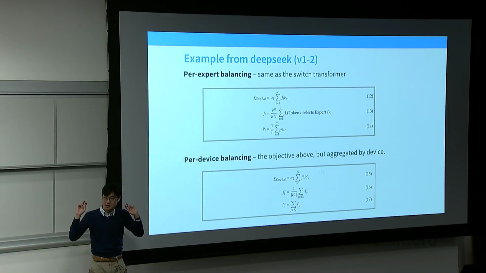
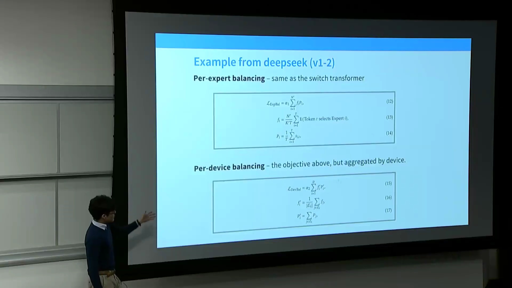
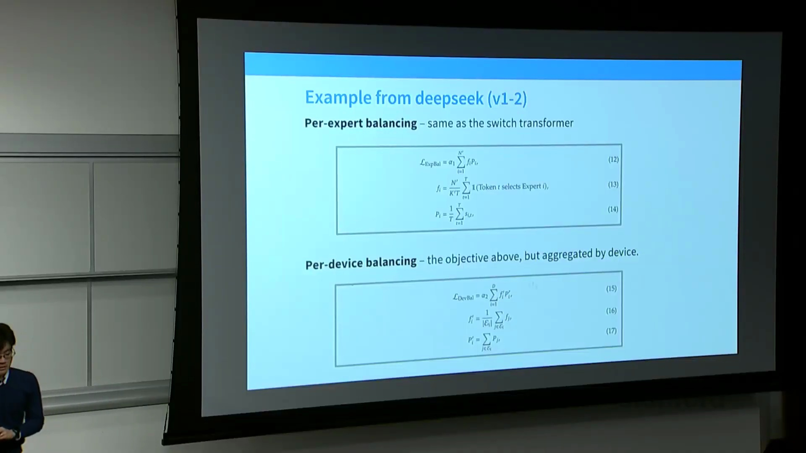
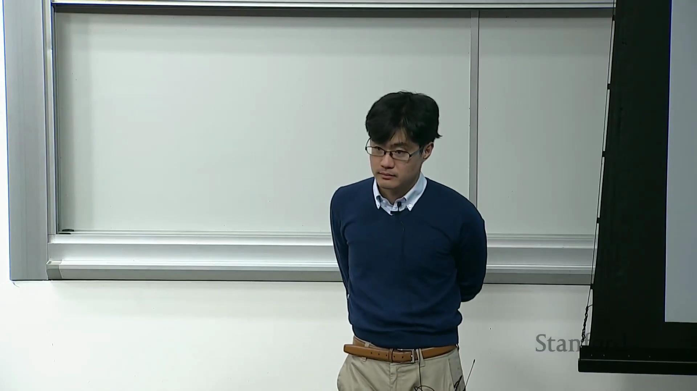

## 消融实验：移除负载均衡的后果
消融实验(Ablation Study)清晰地证明了负载均衡的必要性。对无平衡机制下的Token路由分布进行可视化可观察到，仅有两个专家会迅速占据主导地位，各自捕获约50%的Token，而其余六个专家则几乎接收不到任何流量。这种无意的模型坍缩(Model Collapse)会将8专家模型退化为等效的2专家模型，导致各项评估指标上的训练损失(Training Loss)显著上升。尽管由于部分专家的持续活跃，这种坍缩状态的性能可能仍略优于稠密基线模型(Dense Baseline Model)，但远不及经过合理负载均衡的MoE模型。因此，合理的负载均衡对于确保所有参数均被有效利用，以及充分释放稀疏架构(Sparse Architecture)所承诺的理论性能提升潜力至关重要。

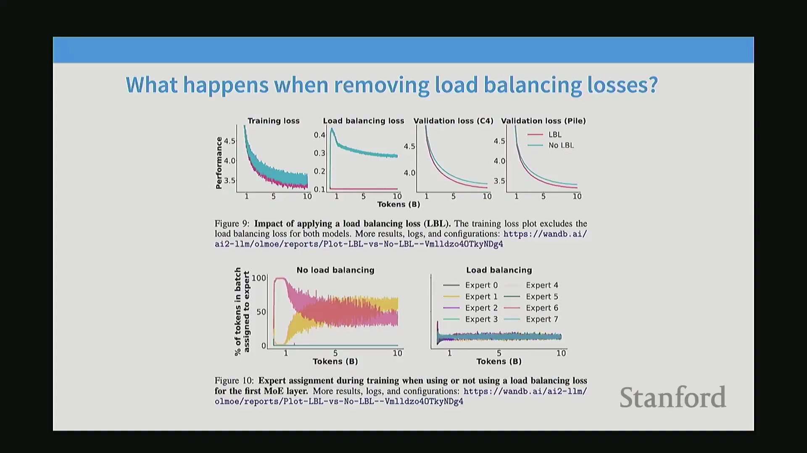

---

## 专家并行与硬件优化
MoE架构通过专家并行(Expert Parallelism)技术高效集成至分布式系统中，该技术将特定专家分配至独立的计算设备。在处理词元(Token)时，路由器(Router)会确定目标专家，并触发全对全(All-to-All)通信集合操作，将词元分发至对应的设备。前馈网络(Feed-Forward Network, FFN)完成计算后，需进入另一通信阶段以返回或聚合结果。只要专家计算的计算负载(Computational Load)足够大，即可有效摊薄通信开销(Communication Overhead)。因此，专家并行技术已成为与数据并行(Data Parallelism)和模型并行(Model Parallelism)并列的标准并行策略的重要补充，使工程师能够策略性地平衡通信带宽、批次大小(Batch Size)、显存限制(Memory Constraints)及专家总数。

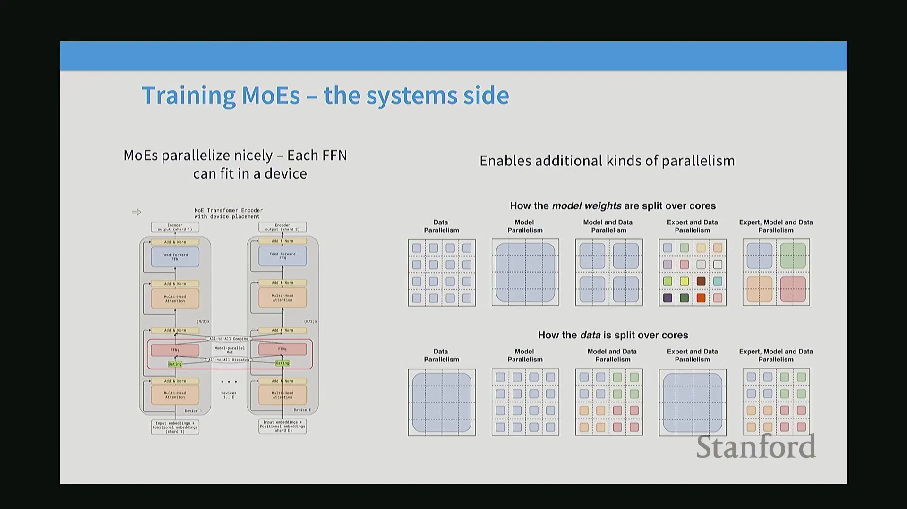
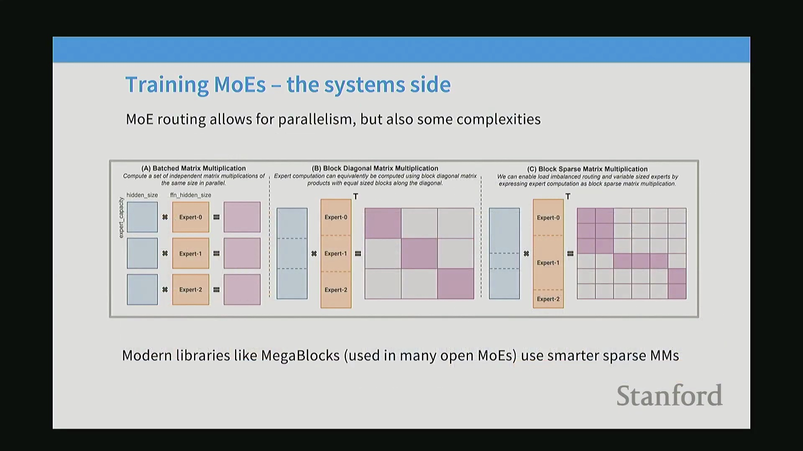

此外，MegaBlocks等现代GPU计算库能够充分利用设备级稀疏性(Device-level Sparsity)以提升性能。当多个专家驻留于同一设备时，其计算过程天然具备稀疏特性。通过精细的权重融合(Weight Fusion)与内存布局优化，现代稀疏矩阵乘法引擎能够高效执行这些离散计算任务，避免浮点运算量(FLOPs)的浪费，从而将MoE固有的稀疏性转化为直接的计算优势，而非性能瓶颈。

## 内在随机性与Token丢弃
MoE路由常被忽视的一个特性是其内在随机性(Intrinsic Stochasticity)，这解释了为何即使在确定性推理(Deterministic Inference，即temperature=0)模式下，模型仍可能产生不同的输出。词元以批次为单位进行处理，并被路由至分布在不同硬件设备上的专家。若某批次内的词元高度集中于单个专家，该设备可能超出其显存容量或预设的负载因子(Load Factor)阈值。此时，系统将触发词元丢弃(Token Dropping)机制：超额的词元将完全绕过该专家，直接通过残差连接(Residual Connection)传递，跳过任何多层感知机(MLP)变换。因此，特定词元被处理还是丢弃，完全取决于其所在批次的动态组成情况，这在训练与推理阶段均引入了跨批次的随机性(Cross-batch Stochasticity)。

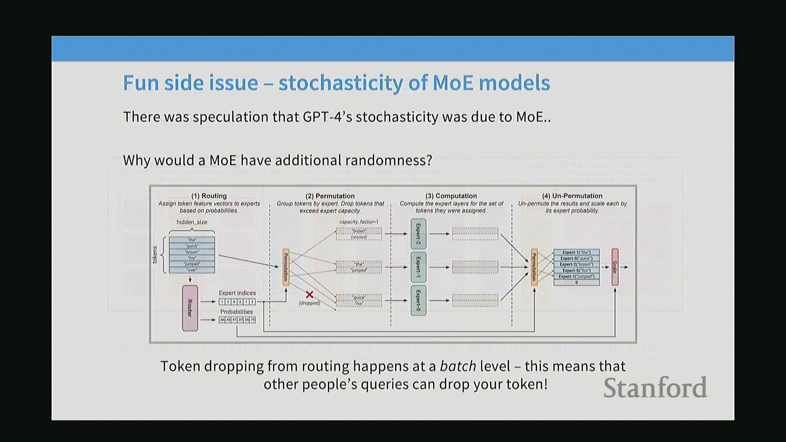
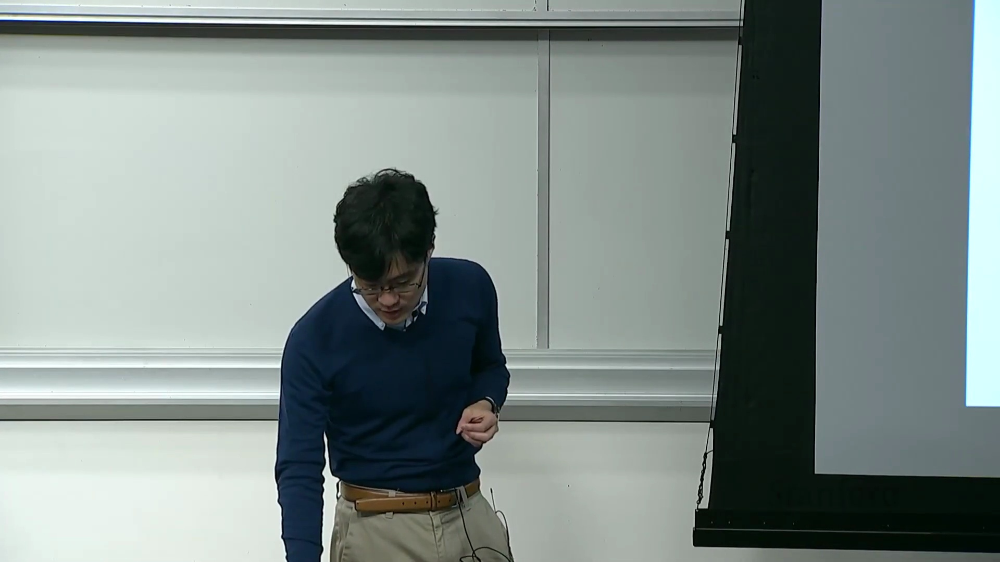
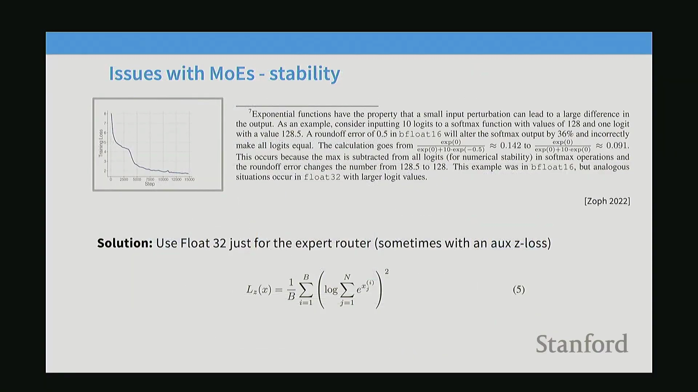

## 训练稳定性与Z-Loss机制
MoE模型素以训练不稳定(Training Instability)著称，在微调阶段极易遭遇梯度爆炸(Gradient Explosion)或损失发散(Loss Divergence)。其主要诱因在于路由Softmax操作对数值精度(Numerical Precision)极为敏感。为缓解该问题，路由计算通常采用单精度浮点数(FP32)执行，且研究者们高度依赖一种辅助损失函数——Z损失(Z-Loss)。Z-Loss通过对Softmax输入的Log-Sum-Exp项施加惩罚，有效将归一化值维持在接近1的水平，从而防止出现极端的梯度尖峰(Gradient Spikes)。消融实验(Ablation Study)清晰印证了其必要性：移除Z-Loss会导致验证损失(Validation Loss)剧烈震荡，模型需经历短暂失稳后方能恢复。尽管缺失该损失项模型最终仍可能收敛，但保留Z-Loss始终能带来更平滑的优化轨迹(Optimization Trajectory)及显著更低的最终验证损失。

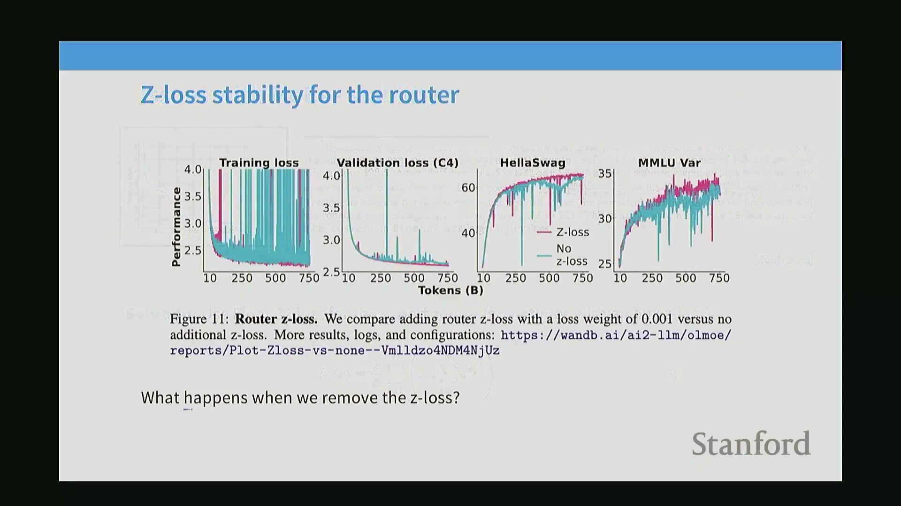
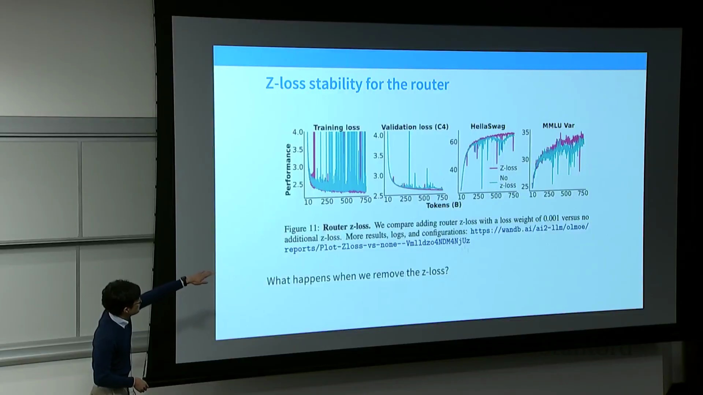
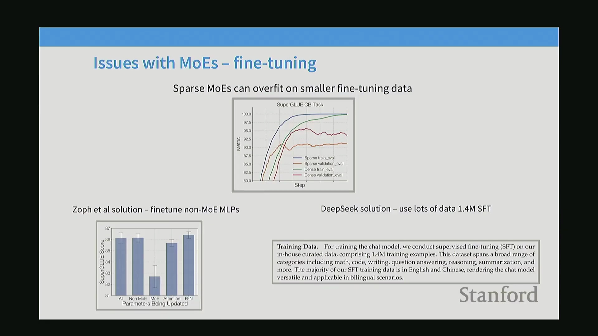

## 微调挑战与过拟合缓解
由于面临严重的过拟合(Overfitting)风险，监督微调与基于人类反馈的强化学习(Reinforcement Learning from Human Feedback, RLHF)为MoE架构带来了额外挑战。将大规模稀疏模型适配至相对较小的指令微调数据集(Instruction Dataset)时，训练损失与验证损失之间常出现显著鸿沟，而该现象在稠密模型中并不明显。一种架构层面的应对策略是在网络中交替部署稠密层(Dense Layer)与MoE层。该设计使微调过程可仅聚焦于稠密组件，此类组件行为更具可预测性，且能有效规避稀疏架构特有的过拟合问题。此外，亦可通过数据规模扩展来缓解过拟合：利用大规模监督微调(Supervised Fine-Tuning, SFT)数据集可有效稀释该风险。例如，DeepSeek的MoE微调采用了140万条训练样本，有效饱和了模型容量(Model Capacity)并稳固了模型的泛化能力(Generalization Capability)。

## 模型升级（Upcycling）：将稠密模型转换为MoE
部署MoE架构的一种极具成本效益的策略是“模型升级(Model Upcycling)”。该技术复用已充分预训练的稠密模型，通过复制其MLP层构建多个专家副本（通常附加轻微的随机扰动(Random Perturbation)），并全新初始化路由网络(Routing Network)。随后，系统将作为MoE架构继续开展后续训练。得益于基础权重(Base Weights)已具备充分的表征能力，模型升级所需的计算资源远低于从头训练(Training from Scratch)稀疏模型。其核心优势在于，推理阶段每个词元仅激活部分专家子集，从而在大幅扩展参数规模的同时，完整保留了原始稠密模型的计算效率。MiniCPM与Qwen等开源项目已成功应用该升级转换技术，将稠密模型检查点(Checkpoints)转化为高性能MoE架构，实现了显著的性能突破。

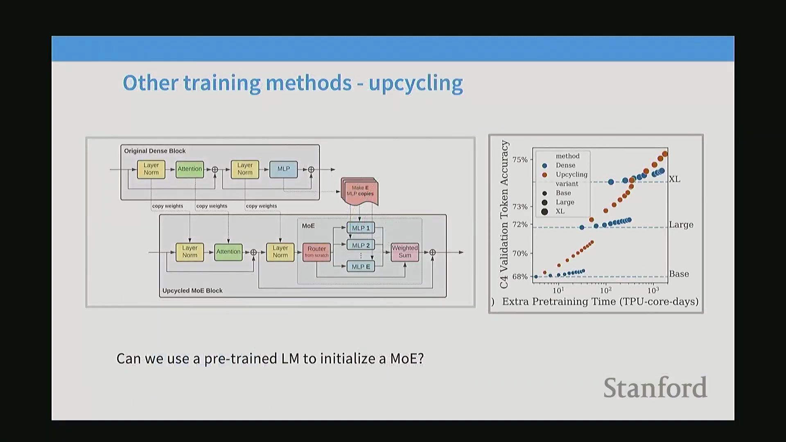
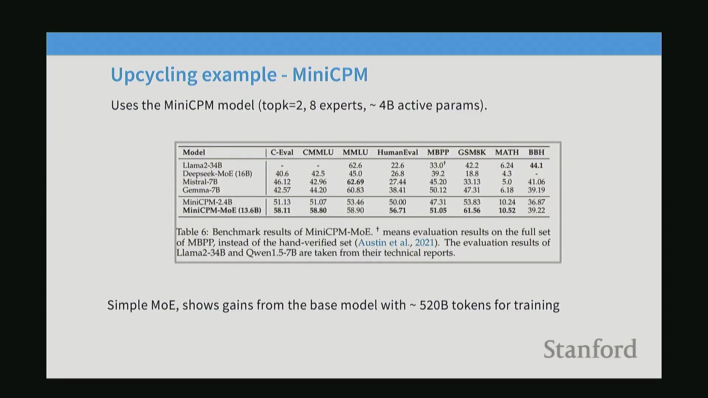
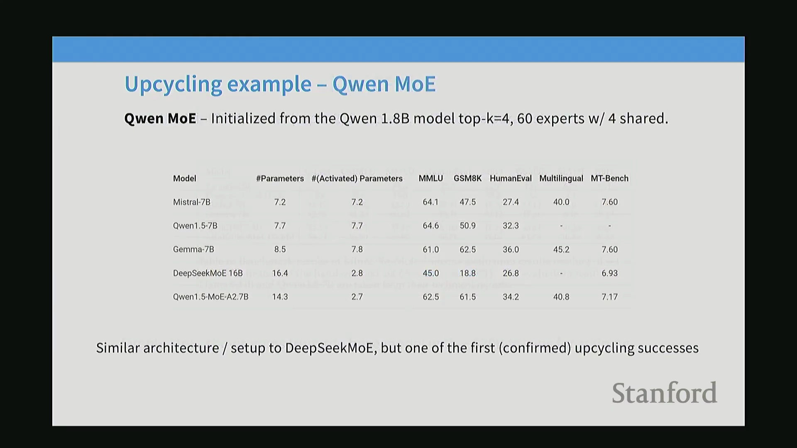

---

## DeepSeek MoE 架构从 V1 到 V2 的演进
DeepSeek的混合专家(Mixture of Experts, MoE)架构基础在V1版本中得以确立。该模型总参数量(Total Parameters)为16B，但每次前向传播仅激活2.8B参数。它采用了2个共享专家(Shared Experts)与64个细粒度专家(Fine-grained Experts)，借助辅助负载均衡损失(Auxiliary Load Balancing Loss)，通过标准的Top-K选择机制(Top-K Selection)将每个词元(Token)路由至4到6个专家。值得注意的是，该核心设计极为稳健，DeepSeek在V2版本中直接沿用了这一架构蓝图。V2仅将模型容量扩展至236B总参数（激活参数为21B），这表明一旦构建起稳定的MoE路由框架，后续的性能提升主要源于规模扩展(Scaling)，而非底层架构的彻底重构。

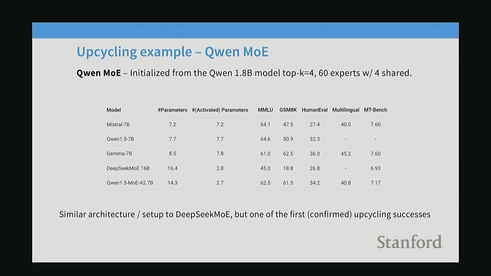
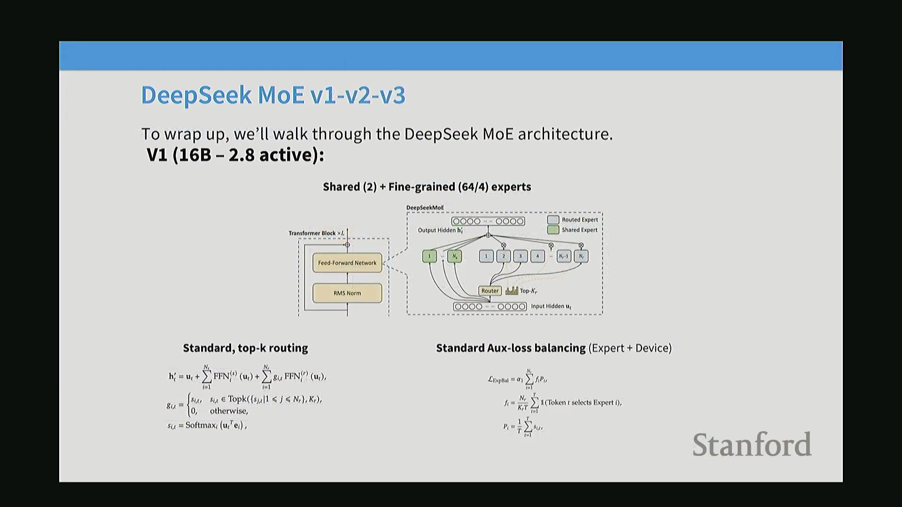
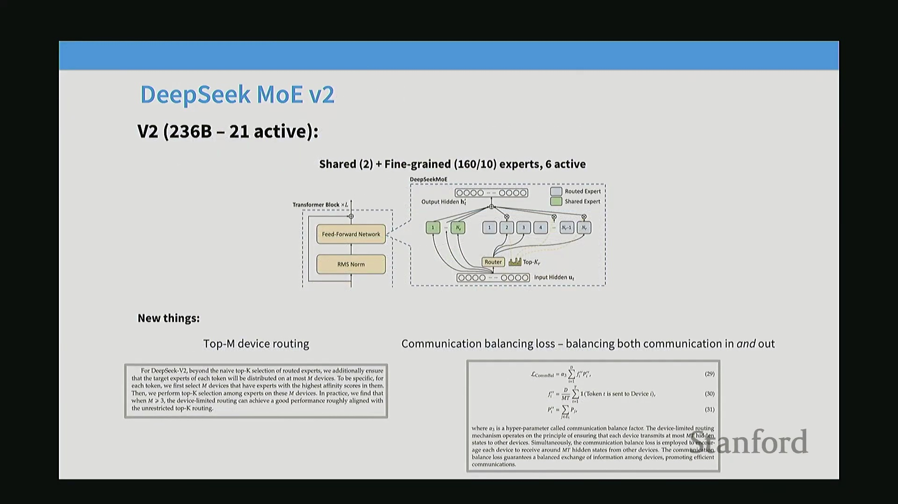

## 基于 Top-M 设备路由的通信优化
向高度细粒度的专家架构扩展，必然会增加跨设备通信开销(Cross-device Communication Overhead)。为缓解该问题，DeepSeek V2引入了一种策略性的“Top-M设备”路由(Top-M Device Routing)机制。路由器(Router)不再盲目地在整个集群(Cluster)范围内选择Top-K专家（此举易导致词元过度分散至数十台设备），而是首先筛选出综合得分最高的Top-M台设备。随后，面向Top-K专家的词元路由被严格限制在这一设备子集内部。此种分层路由机制(Hierarchical Routing)大幅降低了设备间通信成本，使得训练参数规模超200B的超大规模模型在工程实践中切实可行。此外，V2还引入了专用的通信负载均衡损失(Communication Load Balancing Loss)，以确保输入与输出的词元流量在底层硬件基础设施上实现均匀分布。

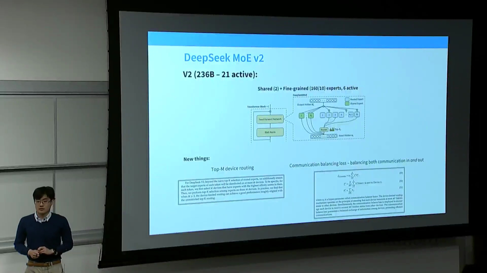

## DeepSeek V3：路由优化与序列级负载均衡
DeepSeek V3进一步将模型规模扩展至671B参数（激活37B），同时保持了MoE核心架构的延续性。V3的核心创新主要聚焦于提升路由稳定性(Routing Stability)与推理可靠性(Inference Reliability)。其门控机制(Gating Mechanism)由Softmax替换为Sigmoid归一化(Sigmoid Normalization)，从而生成更平滑且数值更稳定的路由决策。在负载均衡方面，V3采用了无辅助损失(Auxiliary-Loss-Free)策略，通过动态更新的偏置项(Bias Term) $b_i$，依据专家的实时利用率进行自适应调节。然而，考虑到分布外(Out-of-Distribution, OOD)的推理请求仍可能导致特定专家过载，V3保留了一种补充性的序列级辅助损失(Sequence-wise Auxiliary Loss)。该机制确保了即便在单序列(Single-sequence)粒度上也能维持专家激活的均衡性，从而有效防止实际部署场景中的路由崩溃(Routing Collapse)。

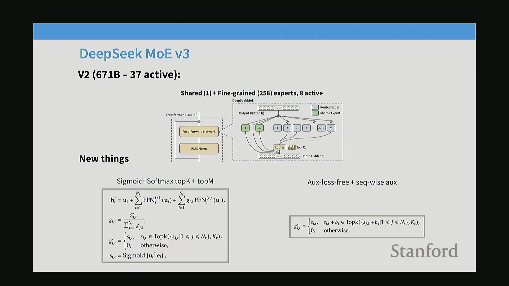

## 提升 KV Cache 效率的多潜在注意力（MLA）
除MoE路由机制外，DeepSeek V3还引入了多潜在注意力(Multi-Latent Attention, MLA)技术，旨在不削减注意力头(Attention Heads)数量的前提下，大幅降低键值缓存(Key-Value Cache, KV Cache)的显存占用。有别于传统的注意力头剪枝策略，MLA将隐藏状态(Hidden States)压缩投影为一个紧凑的低维潜在向量(Latent Vector) $c$，并在自回归生成过程中对其进行缓存。在执行注意力计算时，$c$ 会通过高效的升维投影恢复为完整维度的键(Key)与值(Value)向量。其核心优化在于：借助矩阵乘法结合律(Associative Property of Matrix Multiplication)，升维投影矩阵在数学层面与查询投影矩阵(Query Projection Matrix)预先融合，使整体计算开销与标准注意力机制保持一致。该设计在实现显著显存节省的同时，未引入任何额外的浮点运算量(FLOPs)。

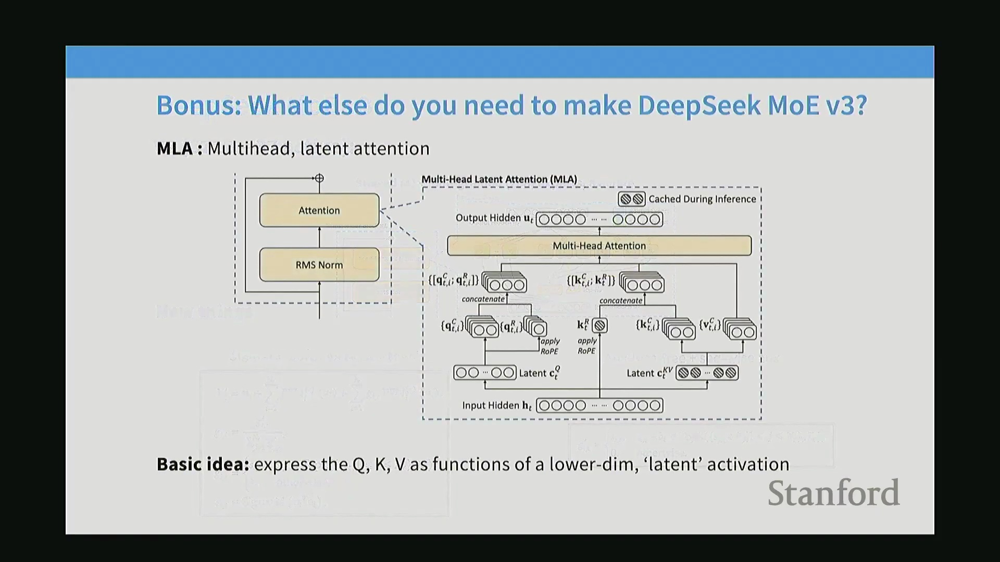
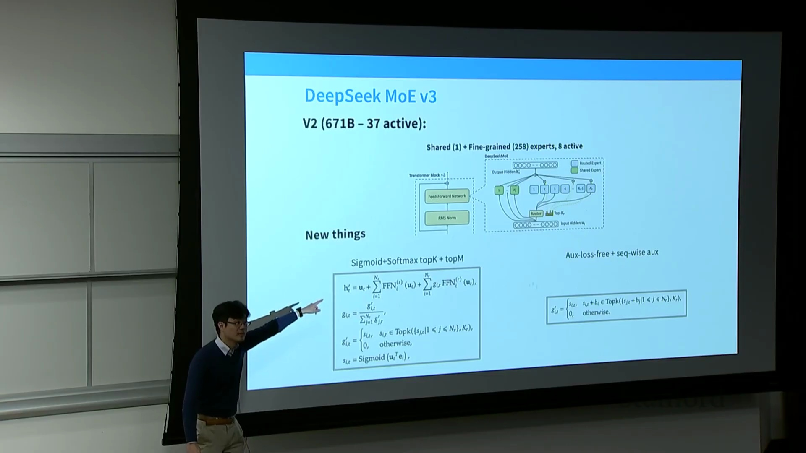

## RoPE 兼容性与架构细节处理
MLA压缩技术面临的一项关键工程挑战是其早期设计与旋转位置编码(Rotary Position Embedding, RoPE)存在兼容性冲突。RoPE会在查询(Query)与键(Key)向量完成线性投影(Linear Projection)后，直接施加旋转矩阵(Rotation Matrix)变换。若在朴素的MLA架构中直接嵌入该旋转操作，将破坏前述融合升维投影矩阵与Query矩阵所依赖的数学结合律，致使计算优化收益失效。DeepSeek的实现通过重构投影顺序与矩阵分解策略(Matrix Factorization Strategy)，巧妙规避了这一限制。该方案在确保RoPE精确应用的同时，完整保留了低维潜在缓存(Latent Caching)所带来的显存与计算效率双重优势。

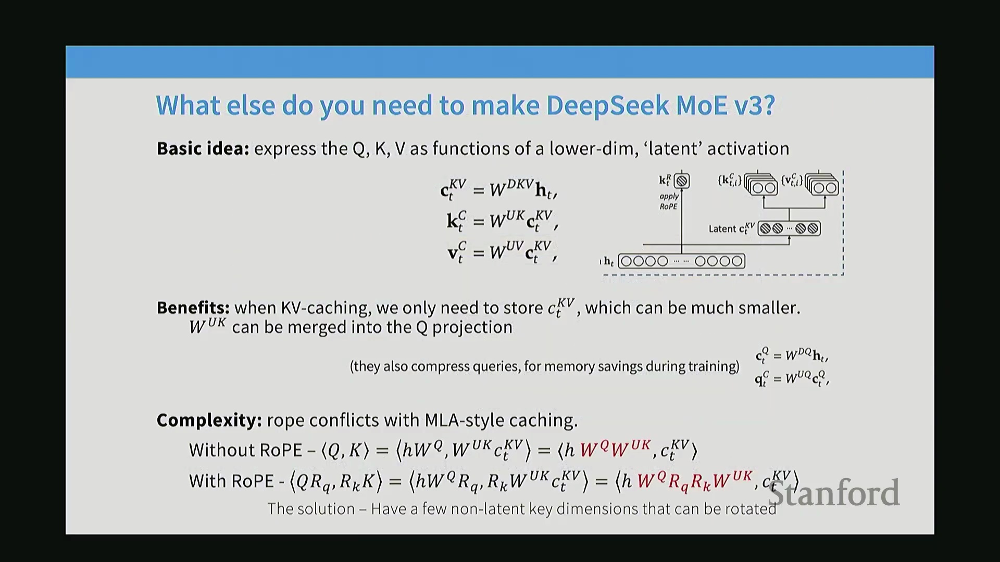

---

## 结合压缩注意力处理 RoPE
DeepSeek V3 架构中一个微小但关键的工程细节，涉及将旋转位置编码(Rotary Position Embedding, RoPE)与多潜在注意力(Multi-Latent Attention, MLA)压缩技术相结合。由于压缩步骤改变了数据维度与操作顺序，直接应用 RoPE 会破坏高效重建缓存所需的矩阵乘法结合律(Associative Property of Matrix Multiplication)。为解决这一问题，模型仅在未压缩维度(Uncompressed Dimensions)上应用 RoPE。该变通方案既保留了注意力机制所需的数学特性，又完整维持了潜在缓存压缩(Latent Cache Compression)在显存占用与计算效率方面的优势。

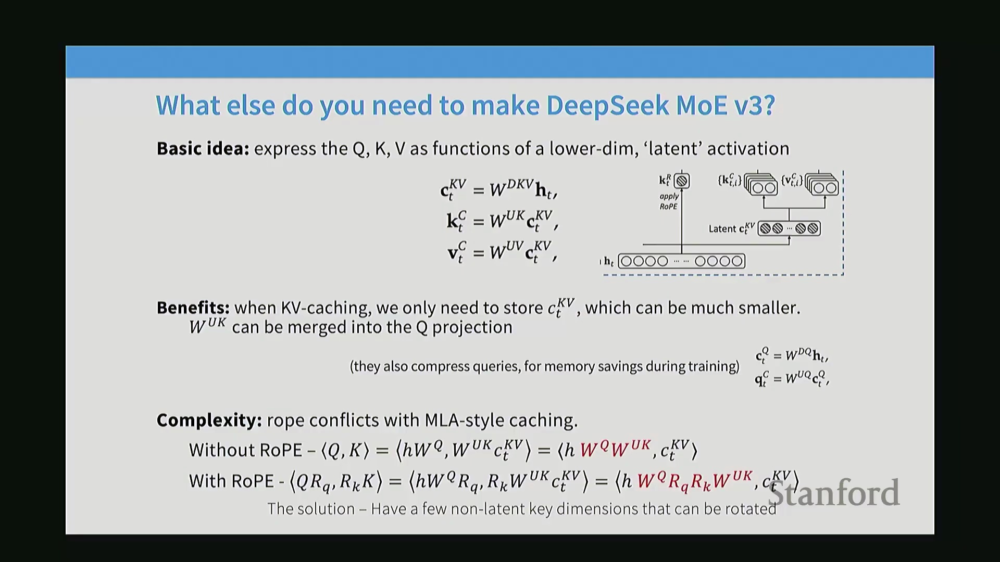
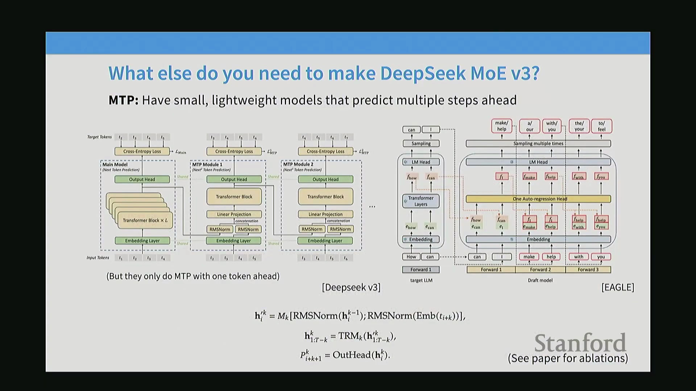

## 多Token预测（MTP）架构
DeepSeek V3 对训练目标(Training Objective)进行了一项结构性调整，引入了多Token预测(Multi-Token Prediction, MTP)机制。标准的自回归训练(Autoregressive Training)通常通过输入平移(Input Shifting)仅预测紧邻的下一个词元(Token)，而 MTP 则从模型的最终隐藏状态(Final Hidden States)中分支出一个轻量级的单层Transformer辅助头(Auxiliary Head)。该辅助头负责预测序列中更远位置的一个额外词元。通过联合优化紧邻词元与前瞻词元(Look-ahead Token)的预测任务，网络能够在避免堆叠多个完整Transformer层带来高昂计算成本的前提下，捕获更丰富的上下文依赖关系(Contextual Dependencies)。

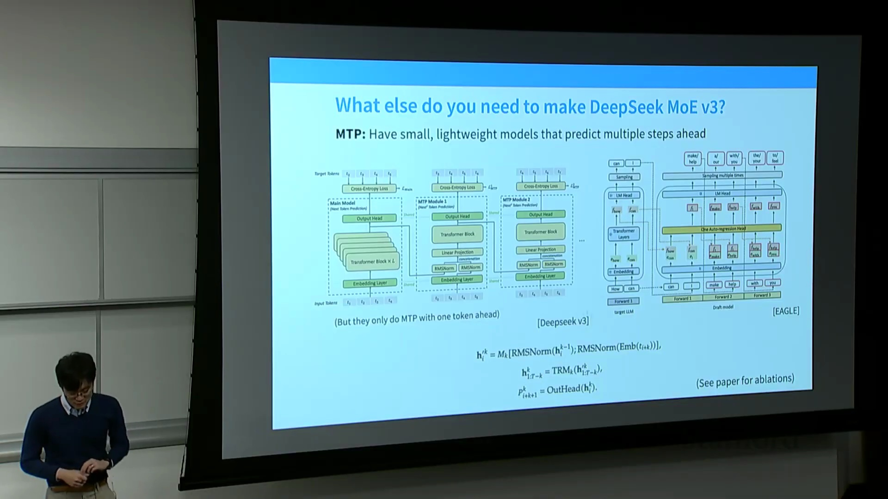

## V3 中的实现限制
尽管该架构设计在理论上支持更深度的多步前瞻预测(Multi-step Look-ahead Prediction)，但 DeepSeek V3 在实际工程实现中对此进行了刻意限制。MTP 机制仅用于向前预测单个词元。这一设计选择在扩展预测范围所带来的边际收益(Marginal Gains)与训练复杂度(Training Complexity)、稳定性之间取得了平衡，体现了在大语言模型(Large Language Models, LLMs)训练目标扩展方面的一种务实策略(Pragmatic Strategy)。

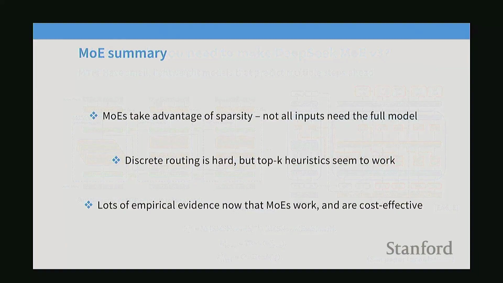

## 结论：MoE 的经验性成功
混合专家(Mixture of Experts, MoE)架构已稳固确立为构建高性能、大规模AI系统的基础范式。通过利用激活稀疏性(Activation Sparsity)，MoE模型成功将参数规模(Parameter Scale)与计算成本(Compute Cost)解耦(Decouple)，使模型能够在推理阶段保持浮点运算量(FLOPs)不呈比例增长的同时，容纳海量参数。历史上，Top-K路由(Top-K Routing)的离散性(Discreteness)与不可微性(Non-differentiability)曾带来显著的优化挑战，一度延缓了其广泛应用。然而，大量工程实践与启发式负载均衡策略(Heuristic Load Balancing Strategies)已被证明在稳定训练过程(Training Process)及防止专家坍缩(Expert Collapse)方面极为有效。在算力受限(Resource-constrained)的场景下，MoE代表了一种极具成本效益且经过充分验证的架构范式，已成为现代大语言模型开发中不可或缺的标准组件。

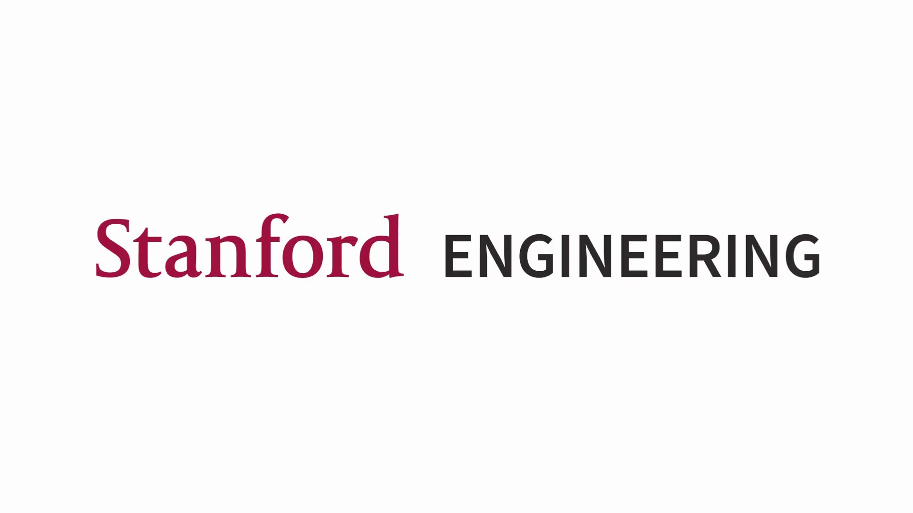