## 课程更新与初步目标

课程以事务性通知开场：作业1将于今晚截止，如有需要可申请延期。即将发布的作业2将聚焦于 Triton 编程框架(Triton)，要求学生实现 Flash Attention 2(Flash Attention 2) 的部分组件，讲师指出这将是一次非常有趣的练习。

今天讲座的主要目标是揭开图形处理器(GPU, Graphics Processing Unit) 与统一计算设备架构(CUDA, Compute Unified Device Architecture) 的神秘面纱，消除人们对硬件加速常有的“黑盒”或“魔法”感。讲师强调，GPU 的性能表现往往难以预测，其计算效率通常会随着矩阵维度的变化呈现出波动模式。理解这些特性对于优化深度学习工作负载(Deep Learning Workload)至关重要。
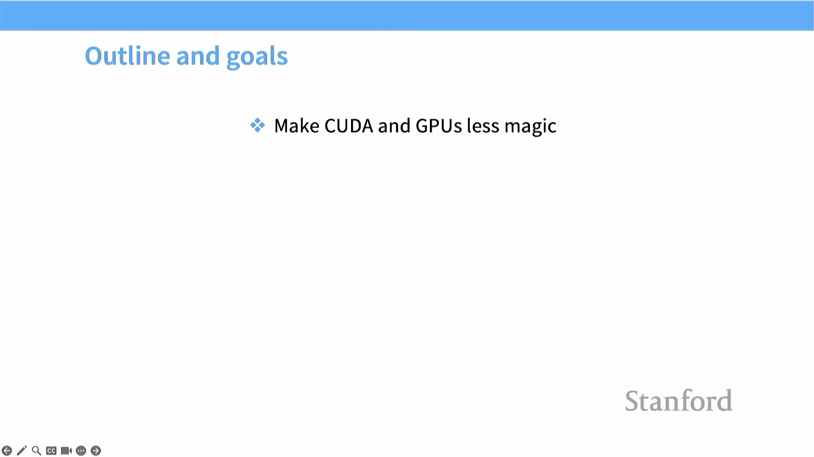
课程结束时，参与者应能熟悉 GPU 架构，并具备使用 CUDA 加速自定义算法的能力。本次讲座旨在弥合抽象模型设计与底层硬件执行之间的鸿沟，重点展示诸如 Flash Attention 等精妙实现如何使 Transformer 模型(Transformer Model) 支持显著更长的上下文窗口(Context Window)。
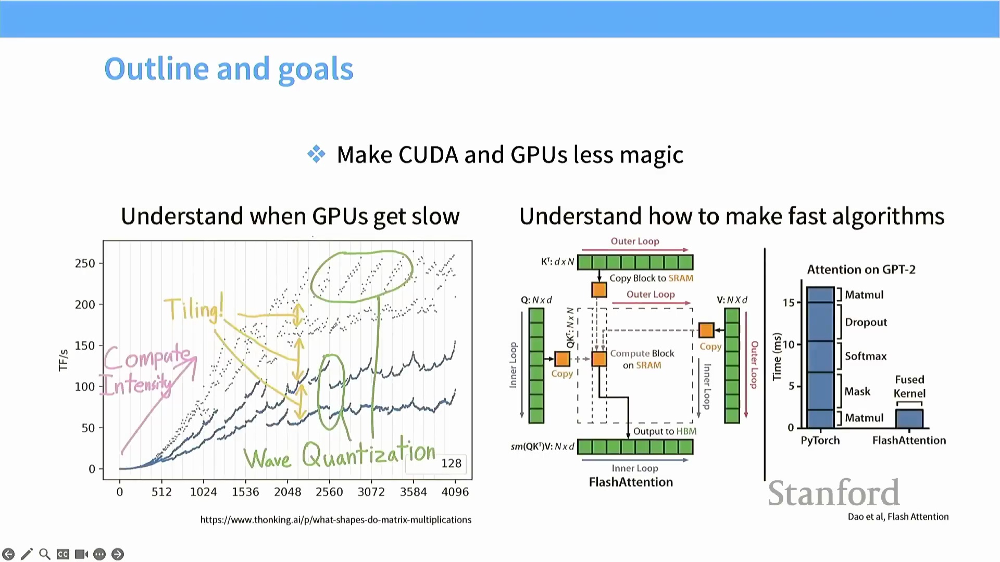

## 学习范围与推荐资源
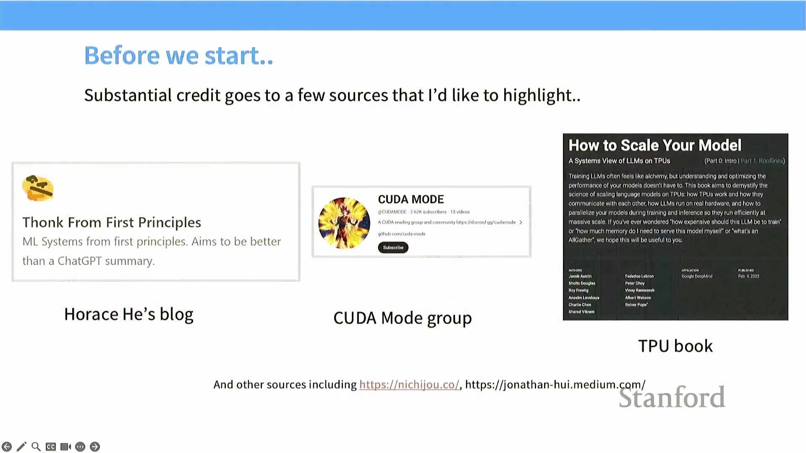
本次讲座将聚焦于硬件栈中的单卡层面，深入剖析单个 GPU 加速器。讲师推荐了一些极具价值的外部学习资源，包括涵盖冷门 GPU 特性(Edge-case GPU Behaviors) 的 Horus 博客、CUDA Mode 社区以及 Google 的张量处理单元(TPU, Tensor Processing Unit) 技术书籍，鼓励学员深入研读以获取更深刻的技术见解。
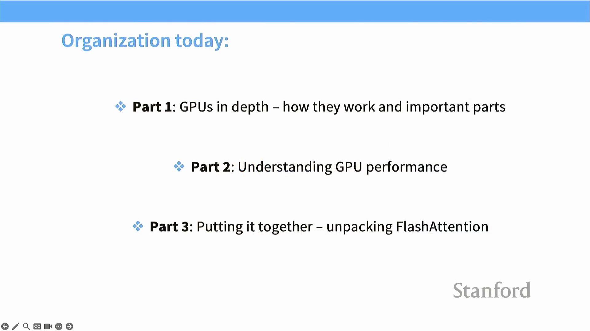
课程结构安排如下：首先讲解 GPU 硬件与执行模型(Execution Model)，接着剖析性能瓶颈(Performance Bottleneck)，最后通过 Flash Attention 的实战演练来应用上述概念。此外，课程还将简要对比 TPU 的相关概念，因为两者在底层架构原理上存在诸多相似之处。
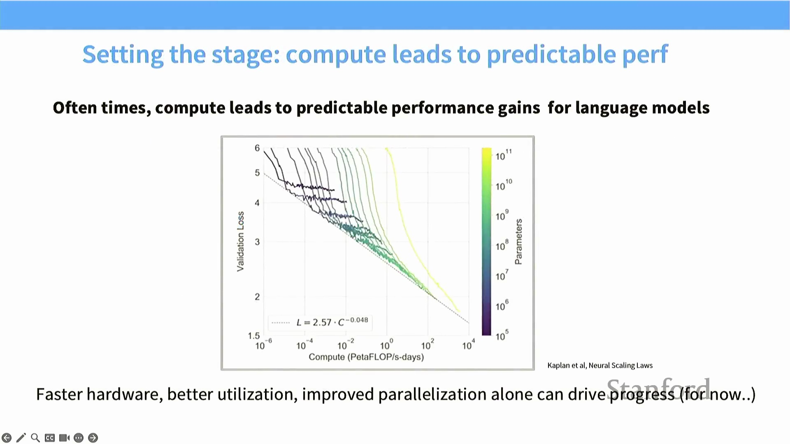

## 算力扩展的演进
现代深度学习(Modern Deep Learning) 的性能在很大程度上受硬件扩展定律的驱动。算力的提升直接转化为模型能力的增强，无论是在预训练(Pre-training) 还是推理(Inference) 阶段皆是如此。历史上，中央处理器(CPU, Central Processing Unit) 曾受益于登纳德缩放定律(Dennard Scaling) 与摩尔定律(Moore's Law)，晶体管尺寸的缩小带来了更高的时钟频率、更低的功耗以及单线程性能(Single-thread Performance) 的提升。
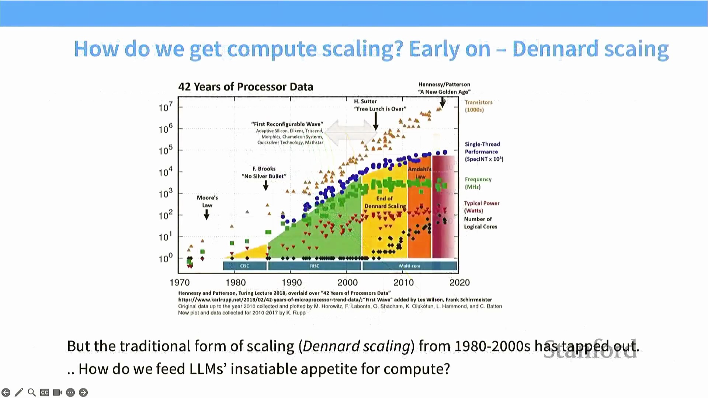
然而，尽管晶体管密度持续呈指数级增长，单线程性能在 21 世纪初已趋于停滞。这一物理瓶颈意味着我们无法再单纯依靠提升单个计算核心的频率来换取性能增长。相反，现代算力的增长完全依赖于并行扩展(Parallel Scaling)，即通过海量计算核心同时处理大规模工作负载。
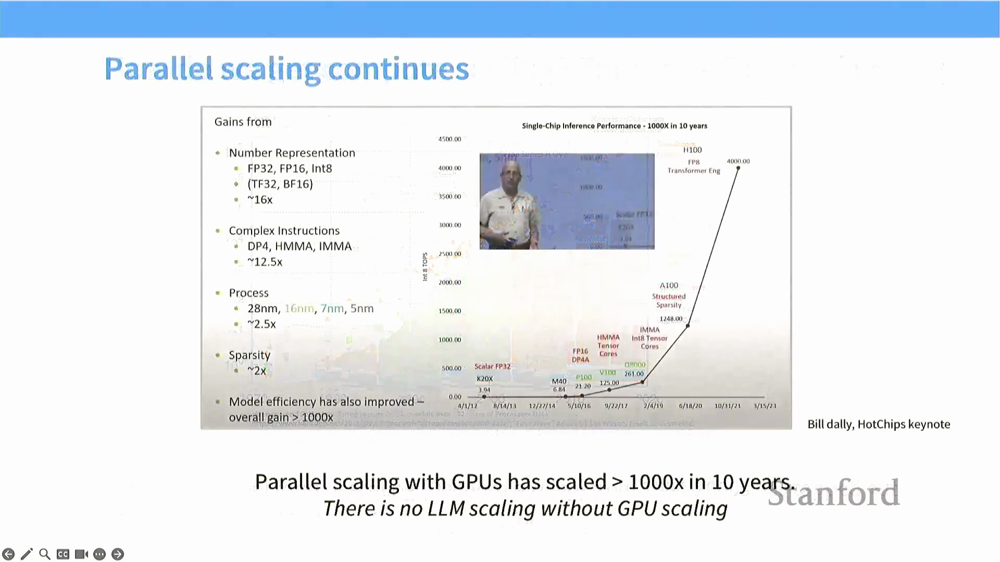
正如 Bill Daly 在算力扩展主题演讲中所强调的，从早期的 K20 架构到现代的 H100 芯片，每秒运算次数(OPS, Operations Per Second) 始终遵循着惊人的超指数增长曲线。顺应并利用这一并行扩展轨迹，已成为最大化大型语言模型(LLM, Large Language Model) 效率与能力的关键。

## CPU 与 GPU：延迟优先与吞吐量优先的设计
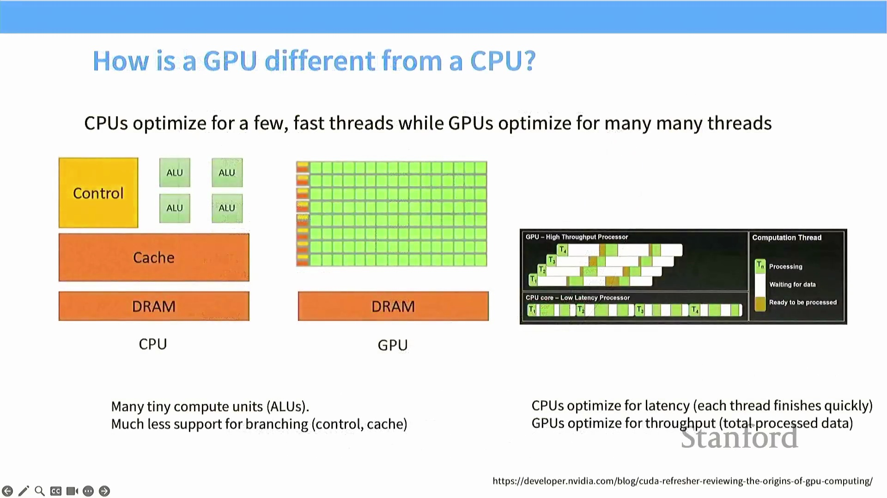
CPU 与 GPU 的设计基于截然不同的执行理念。CPU 针对低延迟(Low Latency) 进行了深度优化，采用大型控制单元、大容量缓存(Cache) 以及复杂的分支预测(Branch Prediction) 技术，旨在以最快的速度完成单个任务。它们擅长使用相对较少的线程来处理复杂的条件逻辑与顺序指令流(Sequential Instruction Streams)。
相比之下，GPU 则优先考虑高吞吐量(High Throughput)，而非单个任务的低延迟。它们将绝大部分芯片面积用于算术逻辑单元(ALU, Arithmetic Logic Unit)，并采用轻量级的控制逻辑来协调大规模并行计算。
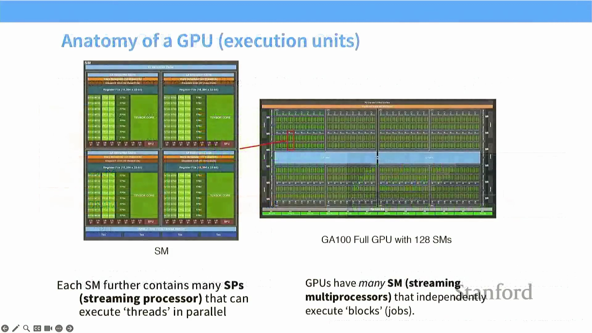
GPU 能够同时管理成千上万个可快速休眠与唤醒的线程。这种机制确保了即便单个任务的延迟较高，整体工作负载的完成速度仍远超 CPU。该架构设计使 GPU 极其适合处理神经网络训练与推理中占据主导地位的密集并行矩阵运算(Dense Parallel Matrix Operations)。

## GPU 内部架构：SM 与 SP
GPU 的底层架构围绕流式多处理器(SM, Streaming Multiprocessor) 构建，它们是 GPU 的核心执行单元。在使用 Triton 等工具进行编程时，开发者通常直接在 SM 级别进行操作。每个 SM 内部集成了大量负责实际并行计算的流处理器(SP, Streaming Processors) / CUDA 核心。
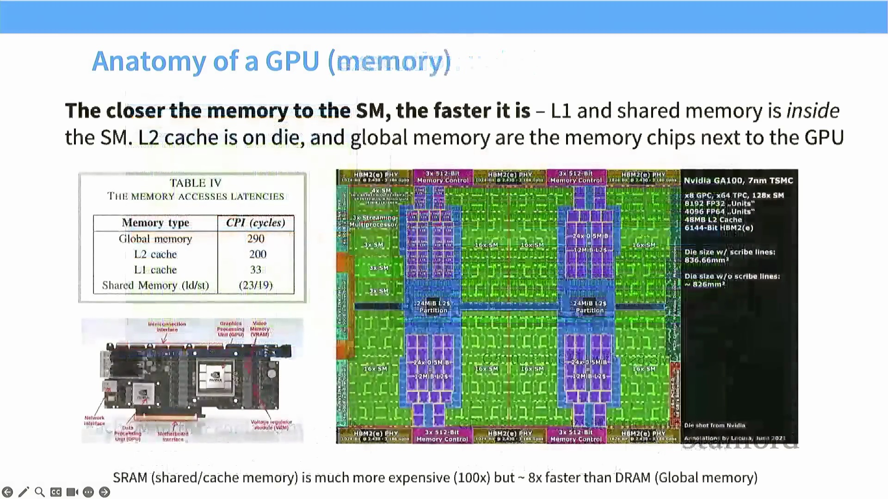
在此层级架构中，SM 负责管控控制流、指令调度(Instruction Dispatch) 与分支处理；而 SP 则遵循单指令多线程(SIMT, Single Instruction, Multiple Threads) 模型，在多个数据点上同步执行相同指令。以 NVIDIA A100 为例，其配备 128 个 SM，每个 SM 均集成了数百个 SP 以及专用的张量核心(Tensor Cores) 与矩阵乘法单元。这种高度并行的架构，为现代人工智能(AI) 工作负载所需的庞大计算吞吐量(Computational Throughput) 提供了坚实基础。

---

## 厘清 GPU 计算架构
课程首先通过示意图阐明了 GPU 的计算模型。图中每一行代表一个流多处理器(Streaming Multiprocessor, SM)，它作为具备独立控制逻辑的自治单元运行。行内的绿色方块代表专用计算单元（如 FP32 核心或张量核心(Tensor Core)），负责执行具体的算术运算。每个 SM 均独立管理其分配的资源，以确保任务的高效执行。
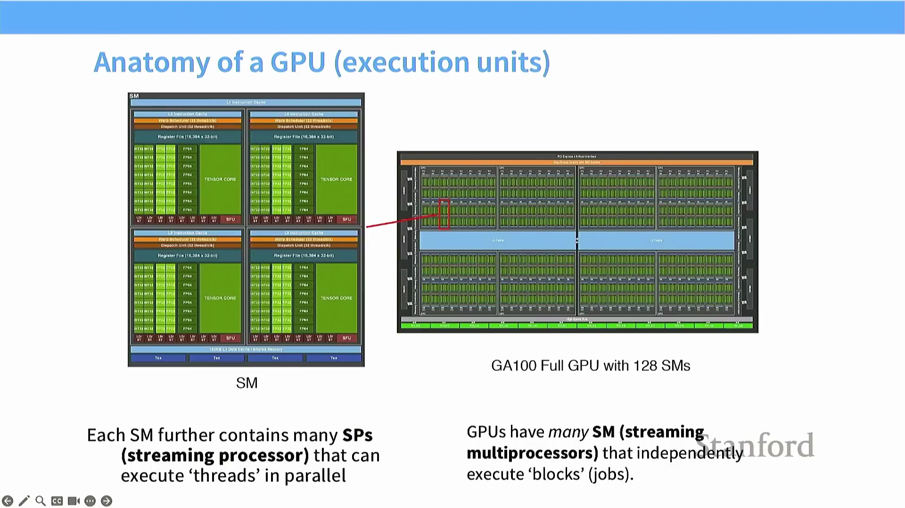
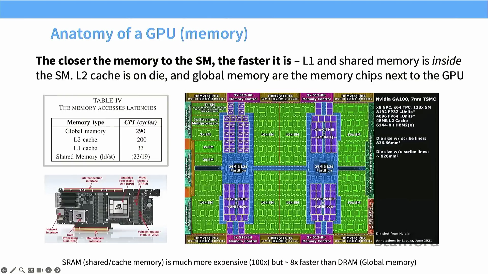

## 内存层级的关键作用
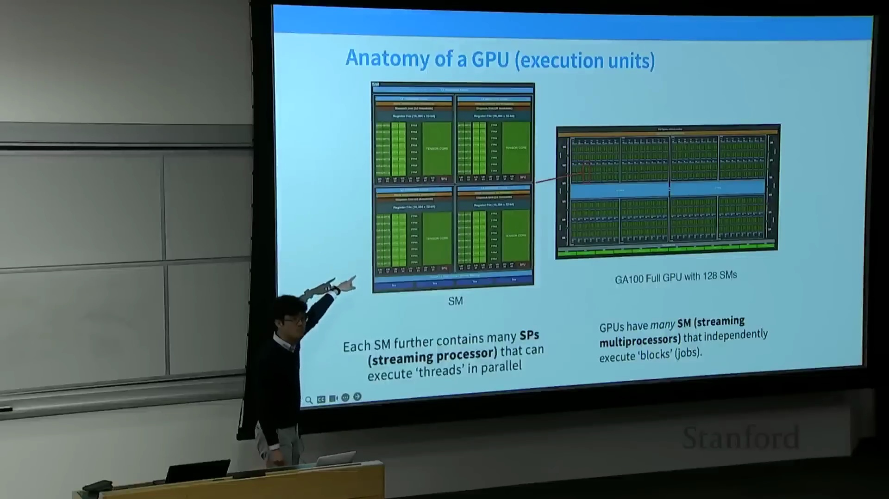
除了峰值算力(Peak Compute) 之外，内存管理(Memory Management) 往往是决定 GPU 性能的最关键因素。在高主频下，存储单元与处理核心之间的物理距离直接决定了数据访问延迟。紧邻 SM 的片上内存(On-chip Memory)（包括 L1 缓存(L1 Cache)、共享内存(Shared Memory) 和寄存器(Register)）访问速度极快，非常适合缓存高频访问的数据。位于 SM 外部的 L2 缓存(L2 Cache) 速度次之，其访问延迟大约是 SM 片上内存的十倍。

全局内存(Global Memory) 通常由高带宽内存(High Bandwidth Memory, HBM) 或 DRAM 构成，物理上位于 GPU 芯片裸片(Die) 外部，并通过封装互连技术与核心相连。访问此类内存通常需要数百个时钟周期，而访问片上内存仅需约二十个周期。若计算任务过度依赖全局内存访问，SM 将陷入数据等待状态（即内存墙(Memory Wall)），从而导致硬件利用率(Hardware Utilization) 大幅下降。因此，优化内存访问模式(Memory Access Pattern) 是进行高性能 GPU 编程的核心关键。
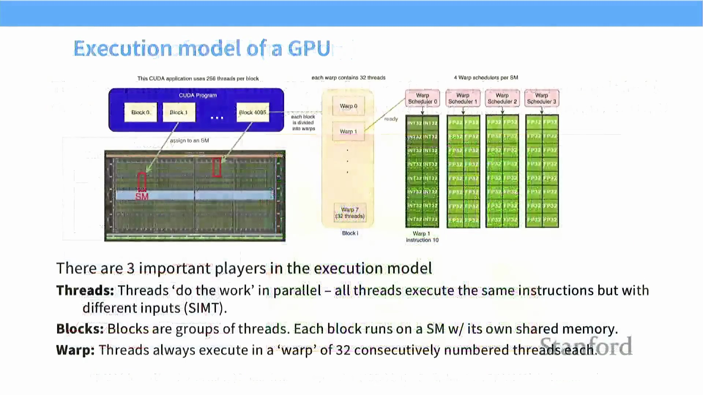

## 逻辑执行与内存模型
为编写高效代码，开发者必须深入理解 GPU 的逻辑执行模型(Logical Execution Model)，该模型主要包含三个调度粒度：线程块(Thread Block)、线程束(Warp) 和线程(Thread)。线程块是分配给单个 SM 执行的基本线程集合。在块内部，线程以固定的 32 个为一组进行硬件调度，这一组即称为线程束。遵循单指令多线程(Single Instruction, Multiple Threads, SIMT) 执行范式，线程束内的所有线程将在同一时钟周期内，对不同数据执行相同的指令。
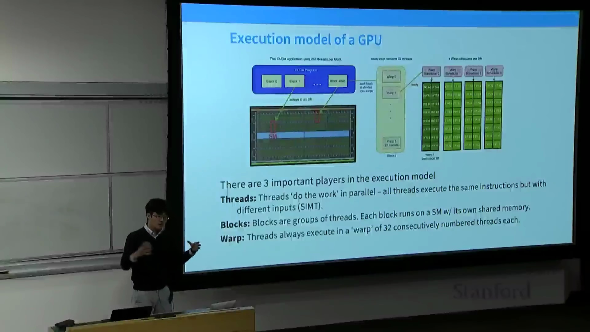

逻辑内存模型(Logical Memory Model) 与上述执行层级严格对应。寄存器(Register) 和局部内存(Local Memory) 为每个线程私有。共享内存(Shared Memory) 则对同一线程块内的所有线程可见，用于实现高效的线程间通信(Inter-thread Communication)。不同线程块之间的数据交换必须借助全局内存(Global Memory) 完成。高效的算法会将关键数据预先加载至高速共享内存中，以此最大限度减少对全局内存的访问开销，确保线程能够连续、无停滞地执行计算。

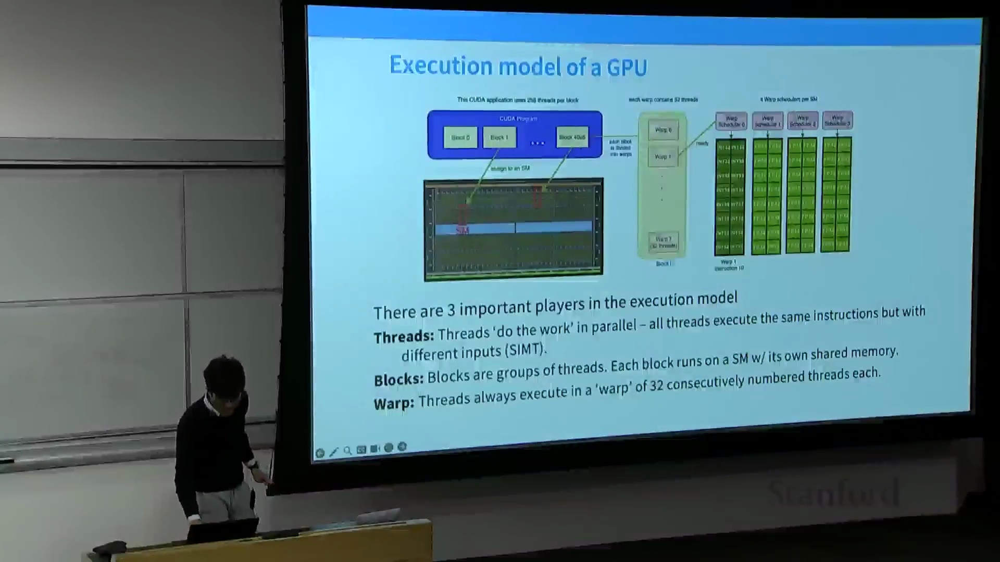
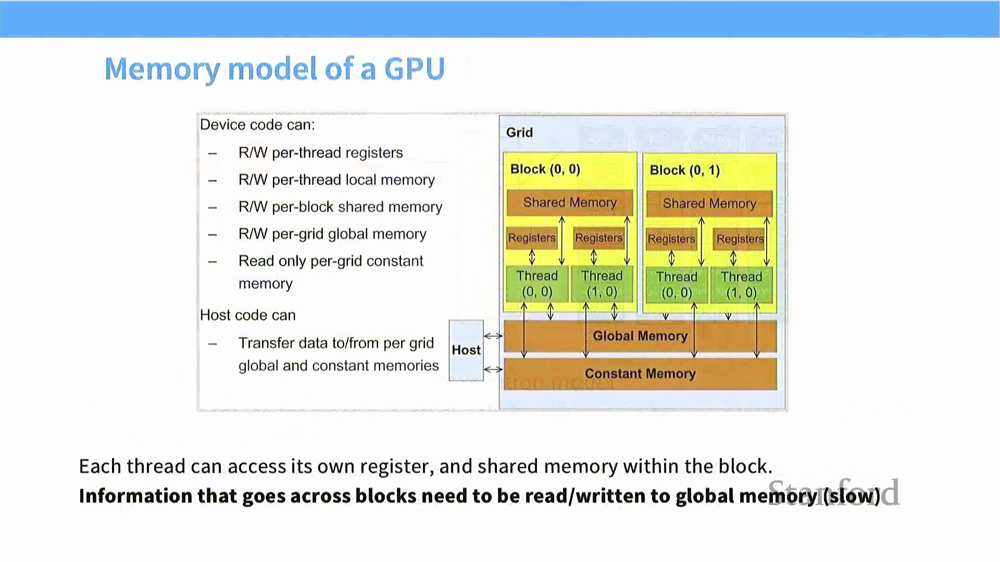

## TPU 架构：概念上的类比
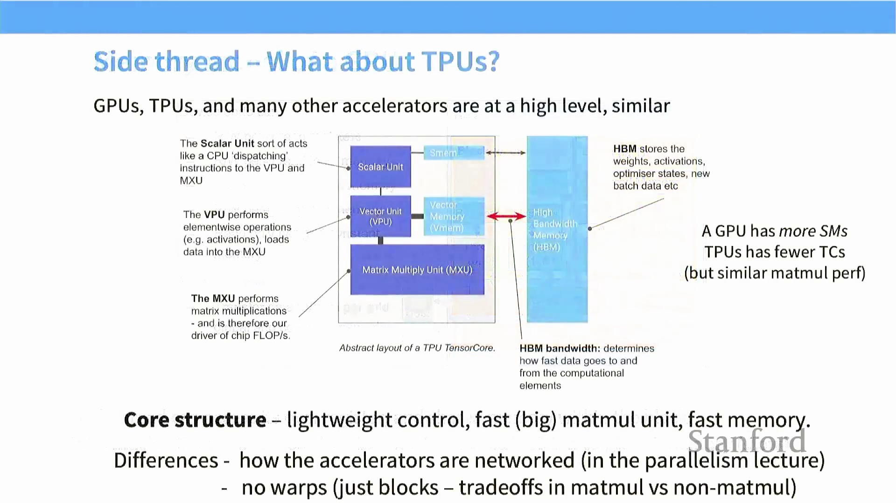
Google 的张量处理单元(Tensor Processing Unit, TPU) 与 GPU 在许多高层架构原则上高度相似。TPU 的核心计算组件是矩阵乘法单元(Matrix Multiplication Unit, MXU)，其功能定位类似于 GPU 的流多处理器(Streaming Multiprocessor, SM)。该单元内部包含一个标量控制单元(Scalar Control Unit)、负责逐元素运算的向量处理单元(Vector Processing Unit)，以及专用于处理密集线性代数任务的 MXU。与 GPU 类似，TPU 同样配备了高速片上内存(On-chip Memory)，并依赖位于芯片外部的高带宽内存(High Bandwidth Memory, HBM) 提供大容量存储。
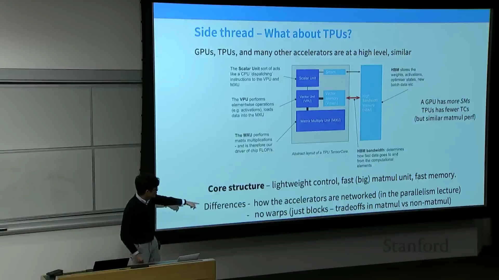
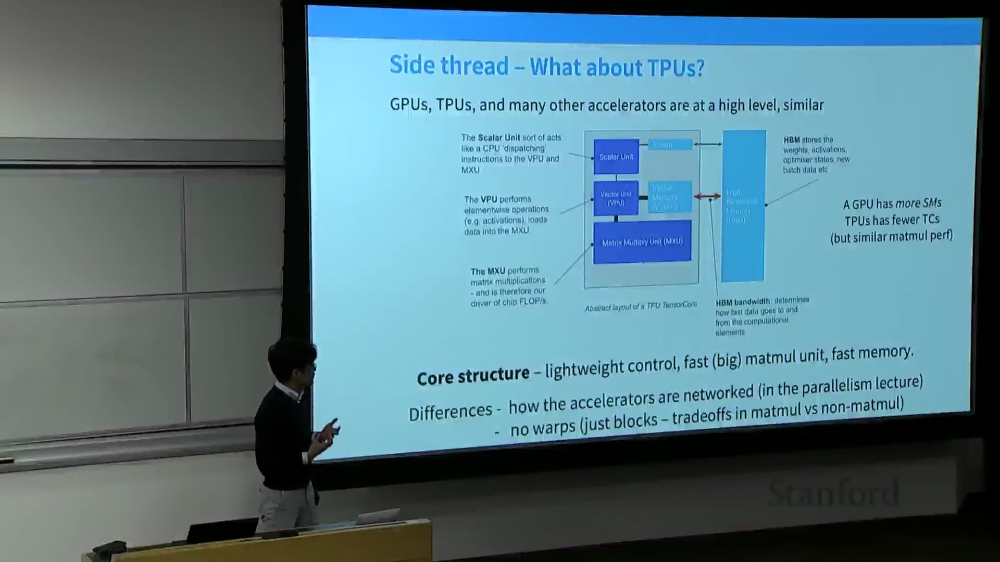

尽管架构理念相似，但 TPU 的底层设计更为精简，因其针对矩阵乘法进行了深度定制化优化，而非像 GPU 那样侧重通用的条件分支处理。TPU 擅长处理多维数组（即张量(Tensor)），其底层硬件操作本质上仍是高效的矩阵乘法运算。这种专用集成电路(ASIC) 特性使 TPU 在深度学习(Deep Learning) 工作负载中表现出极高的能效。TPU 与 GPU 的核心差异并非单芯片架构，而在于多芯片间的互联组网(Interconnect) 方式。
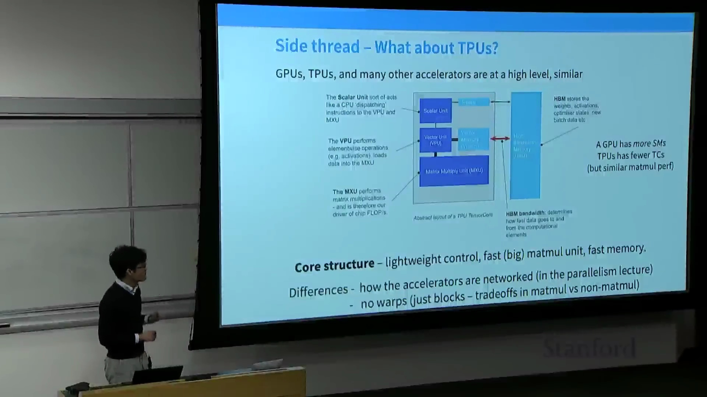

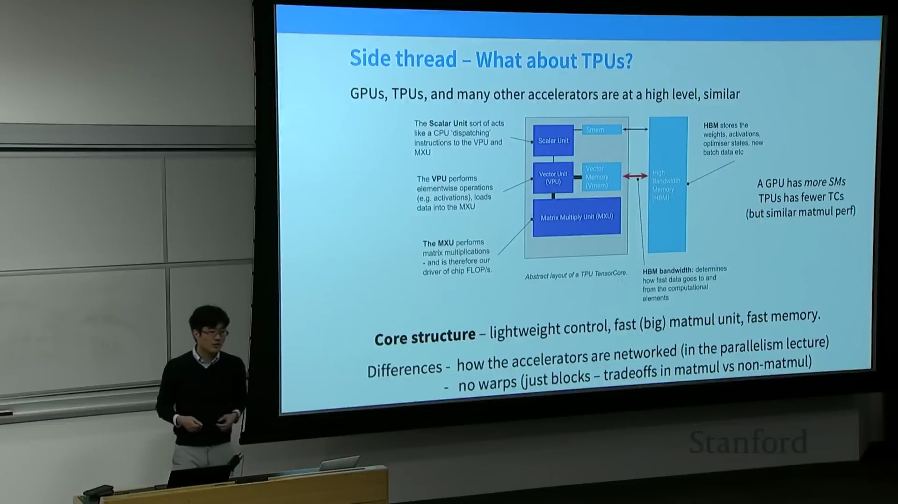

## GPU 的成功与 CUDA 编程模型
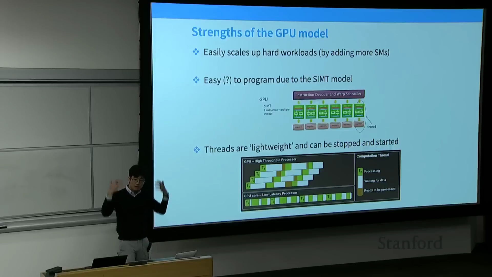
GPU 之所以取得广泛成功，主要归功于其卓越的可扩展性(Scalability)。GPU 并未盲目追求时钟频率的提升（受限于功耗墙与散热瓶颈），而是通过在芯片裸片(Die) 上堆叠更多的流多处理器(Streaming Multiprocessor, SM) 来线性提升整体吞吐量(Throughput)。此外，统一计算设备架构(CUDA, Compute Unified Device Architecture) 编程模型初看或许复杂，但其底层概念设计却极为精妙。CUDA 将大规模并行性抽象为在 SIMT 模式下执行相同指令的轻量级线程，使开发者能够沿用熟悉的顺序编程逻辑(Sequential Programming Logic) 来构思复杂的并行算法。凭借极快的硬件级上下文切换(Context Switching) 能力与对数千个轻量级线程的高效调度，GPU 计算单元得以始终保持高负载运行，从而将整体硬件利用率(Hardware Utilization) 推向极致。

---

## 轻量级线程与历史演进
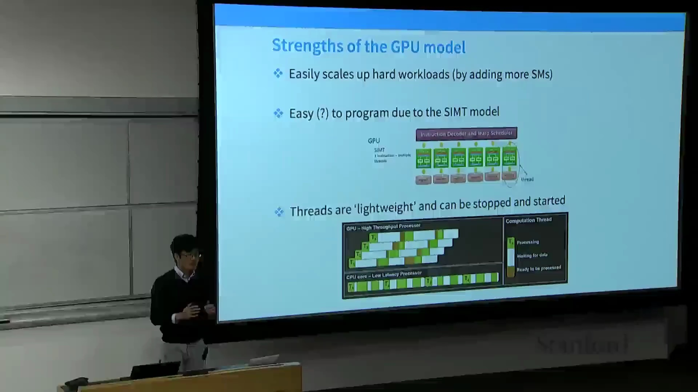
GPU 线程属于典型的轻量级线程(Lightweight Threads)，其维护的上下文状态信息极少，这使得它们能够被快速挂起、恢复或切换，且几乎不产生额外开销。这种架构设计使流多处理器(Streaming Multiprocessor, SM) 在等待数据依赖(Data Dependency) 或执行上下文切换时，能够无缝过渡至其他就绪任务，从而维持极高的硬件利用率(Hardware Utilization)。从历史演进来看，图形处理器(Graphics Processing Unit, GPU) 最初是专为图形渲染管线设计的。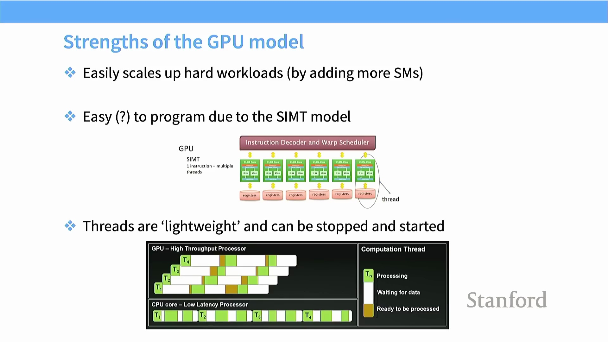 早期 GPU 并不原生支持通用科学计算，但研究人员巧妙地“复用”了可编程图形管线(Programmable Graphics Pipeline)——通过操纵纹理缓冲区(Texture Buffer) 等图形组件——在专用通用计算硬件问世之前，便成功实现了高速矩阵乘法运算。

## 矩阵乘法的统治地位
现代 GPU 架构已针对深度学习(Deep Learning) 进行了专项优化，以契合矩阵运算主导现代计算负载的趋势。在 NVIDIA 硬件生态中，矩阵乘法(Matrix Multiplication) 实际上已成为一种“获得硬件底层特权的一级操作(First-Class Hardware Operation)”。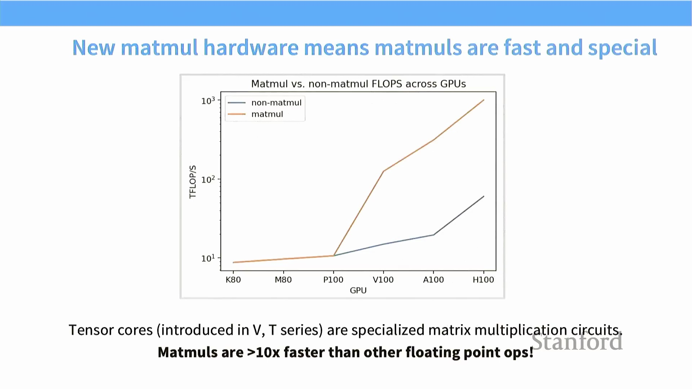 专用张量核心(Tensor Cores) 的引入（以 Volta 架构的 V100 为重要起点）拉开了巨大的性能差距：如今，矩阵浮点运算性能(Matrix FLOPS) 已比非矩阵运算高出数个数量级。因此，在设计神经网络架构(Neural Network Architecture) 时，确保核心计算负载高度集中于矩阵乘法至关重要。过度依赖非矩阵运算的模型架构将面临显著的性能瓶颈，因为此类计算无法充分利用硬件的专用加速数据通路(Accelerated Data Path)。

## 算力与内存差距的扩大
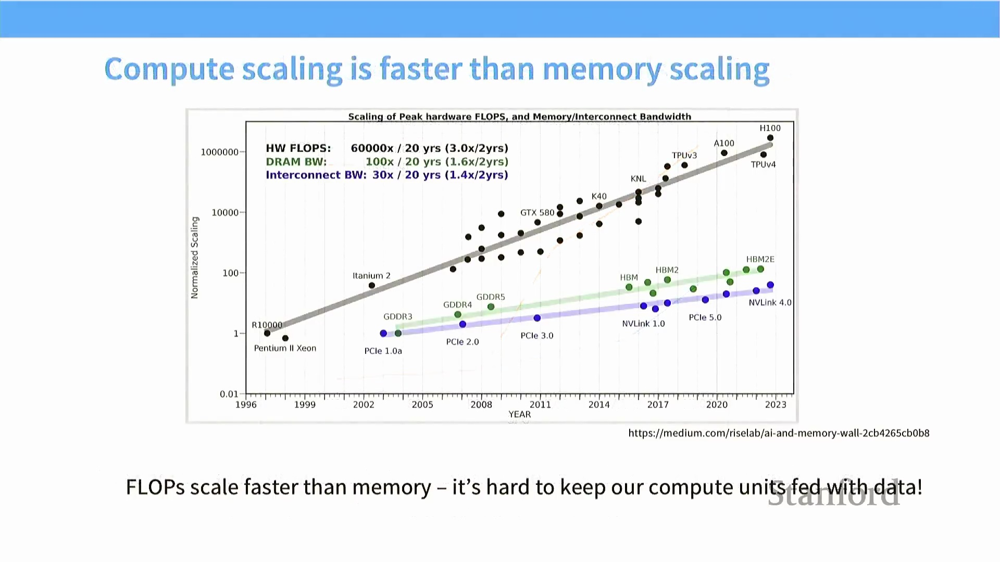
要深入剖析 GPU 的性能特征，必须追溯其核心组件随时间的演进轨迹。对比分析揭示了一个关键的分化趋势：尽管峰值算力(Peak Compute)，尤其是矩阵浮点运算能力，呈现出超指数级增长（跨代性能提升高达 10 万倍），但互连带宽(Interconnect Bandwidth) 与全局内存访问速度(Global Memory Access Speed) 的演进却相对迟缓，仅保持线性增长。 随着动态随机存取存储器(DRAM, Dynamic Random-Access Memory) 技术逼近物理微缩(Physical Scaling) 的极限，这一“算力-内存”差距将进一步扩大。因此，现代高端 GPU（如 H100）极少处于计算受限(Compute-Bound) 状态；绝大多数场景下，它们均受限于内存带宽(Memory-Bound)。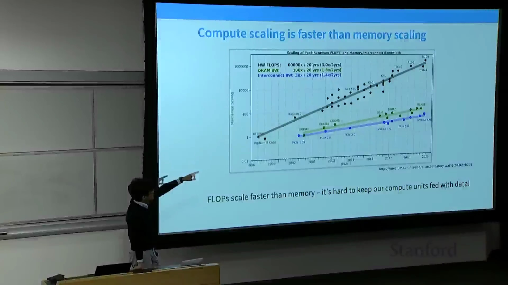 为编写出对硬件友好的高效算法，开发者必须深入理解并充分利用内存层级结构(Memory Hierarchy)，优先将数据驻留于高速片上内存(On-chip Memory) 中，并尽一切可能减少对低速全局内存(Global Memory) 的访问频率。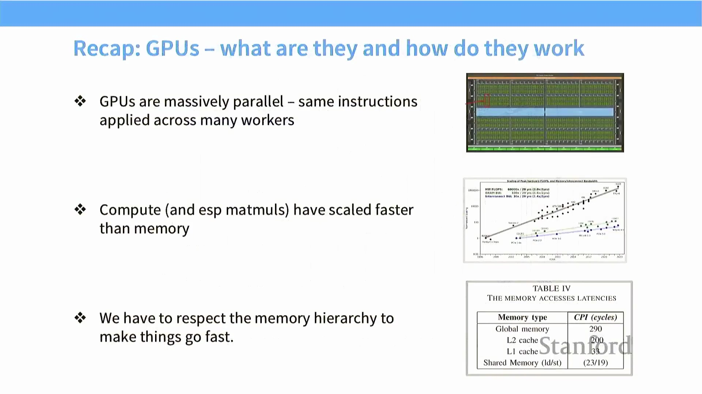

## 性能解码：Roofline 模型
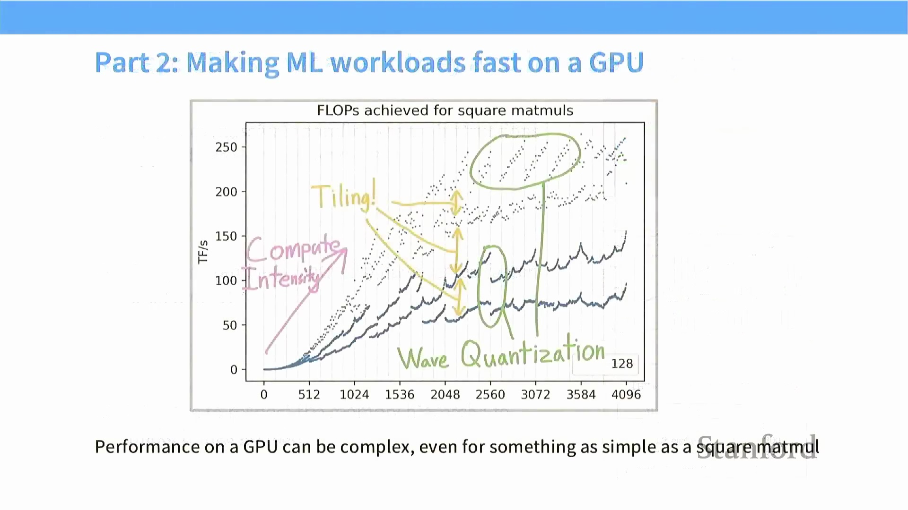
在绘制矩阵乘法吞吐量(Matrix Multiplication Throughput) 与问题规模(Problem Size) 的关系图时，实测性能曲线往往呈现难以预测的波浪状波动。然而，这些现象最适宜通过 Roofline 模型(Roofline Model) 进行解释。该模型将理论硬件性能划分为两个截然不同的工作区间：左侧的内存带宽受限区(Memory-Bound Region)（表现为对角线斜坡）与右侧的计算受限区(Compute-Bound Region)（表现为水平平台）。在内存受限区内，实际吞吐量严格受限于数据总线带宽(Memory Bandwidth)，而非芯片的峰值算力。算法优化的核心目标，正是将工作负载推入计算受限的平台区，使矩阵乘法单元达到完全饱和(Saturation) 状态，从而逼近硬件利用率的理论峰值。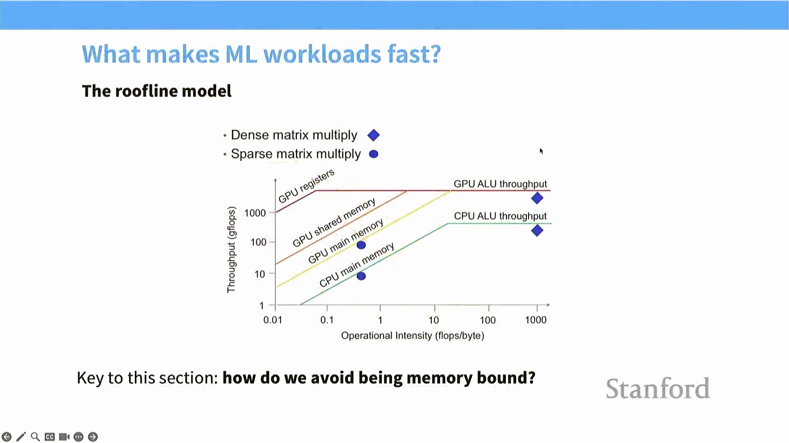

## 核心优化策略：避免线程发散
实现 GPU 的极致性能需要遵循一系列针对性的优化策略，其中首要避开的陷阱便是条件分支(Control Flow/Branching)。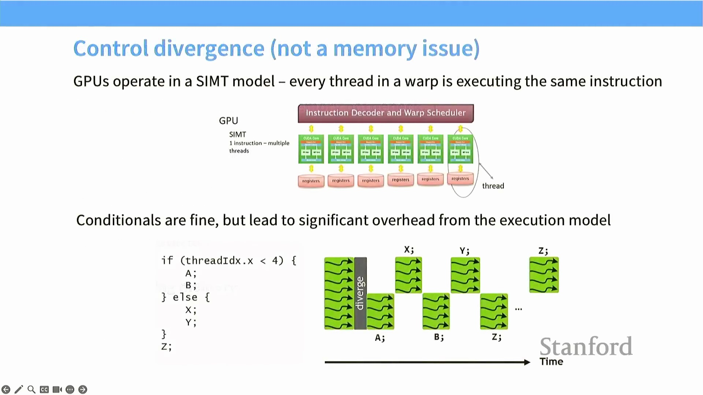 GPU 采用单指令多线程(Single Instruction, Multiple Threads, SIMT) 执行模型，这意味着一个包含 32 个线程的线程束(Warp) 内的所有线程，必须在同一时钟周期内执行完全相同的指令。当代码中引入条件语句（如 `if-else` 分支）导致控制流分化时，未满足执行条件的线程将被强制挂起(Stall) 等待，仅由满足条件的线程执行对应分支。这种现象被称为线程发散(Thread Divergence)，它会将原本并行的执行路径强制串行化(Serial Execution)，实质上扼杀了硬件并行性，并导致吞吐量大幅衰减。 除极力规避分支外，另一项至关重要的优化策略是引入低精度数据类型(Low-Precision Data Types)。这已成为现代 GPU 编程中的标准实践(Standard Practice)，能够有效突破内存带宽瓶颈并显著提升整体计算效率。

---

## 通过降低精度最大化带宽
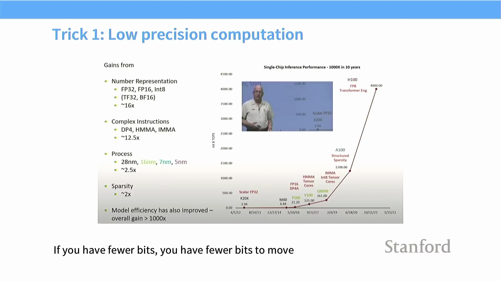
采用低精度(Reduced Precision) 是 GPU 计算中最具影响力的优化策略之一。GPU 历史性能的显著提升，在很大程度上得益于数值表示从 FP32 向 FP16、Int8 及更低位宽数据类型的演进。其核心优势在于内存带宽(Memory Bandwidth)：每个数值占用的位数更少，意味着需要从全局内存(Global Memory) 传输的数据量大幅缩减。例如，即便是 ReLU 激活函数这样简单的逐元素操作(Element-wise Operation)，也涉及数据的读取与回写。在 FP32 精度下，单次浮点运算(FLOP, Floating Point Operation) 通常伴随 8 字节的内存传输流量。切换至 FP16 可将内存访问量减半至每 FLOP 4 字节，在不增加计算开销的前提下，使有效内存带宽实现翻倍。
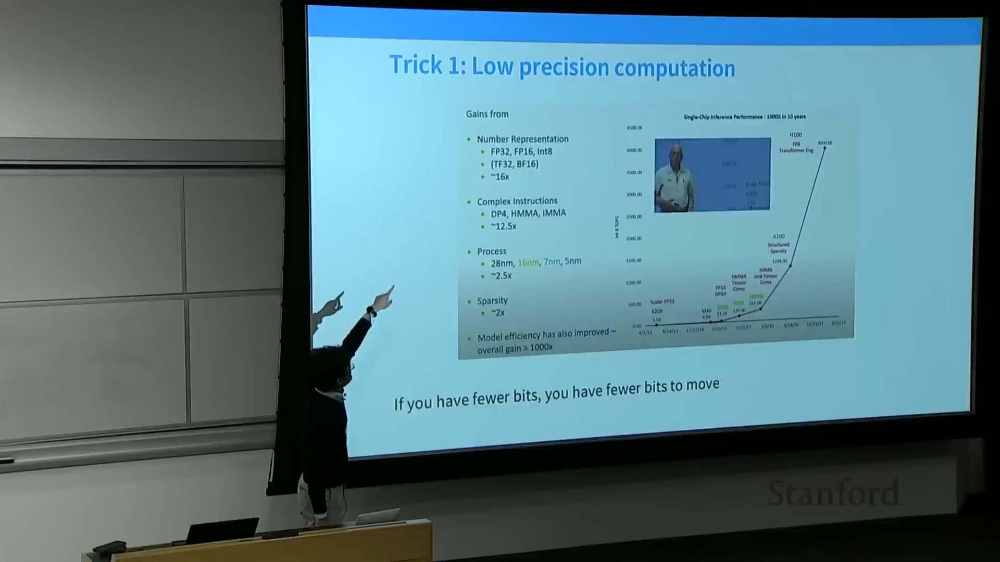

然而，降低精度需结合混合精度训练(Mixed Precision Training) 进行严谨的工程处理。并非所有运算都能在低精度下安全执行。在矩阵乘法(Matrix Multiplication) 中，标准做法是将输入张量以 FP16 格式存储，但使用 FP32 累加器(Accumulator) 来执行实际的乘法与累加操作。该策略在累加部分和(Partial Sums) 的过程中有效维持了数值稳定性(Numerical Stability)，尤其适用于指数函数(Exponential Functions) 等高动态范围(Dynamic Range) 运算。计算完成后，最终的 FP32 结果可安全地向下转型(Downcast) 回 FP16。深入理解并把控这些精度权衡(Precision Trade-offs)，对于在显著提升内存受限(Memory-Bound) 场景吞吐量(Throughput) 的同时保障模型稳定性至关重要。
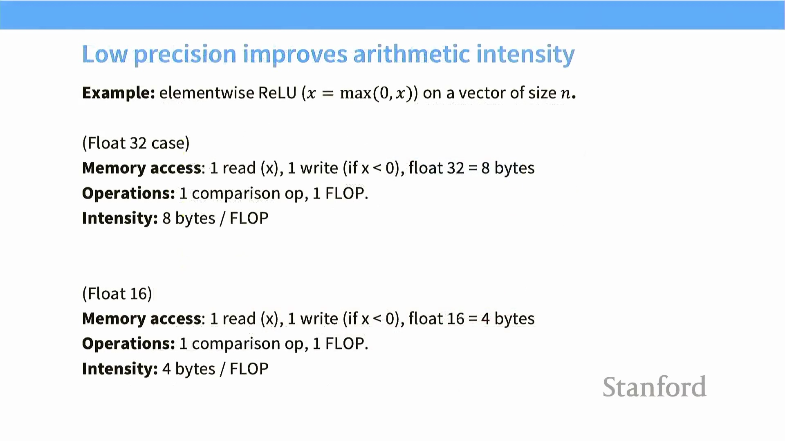

## 算子融合与核函数效率
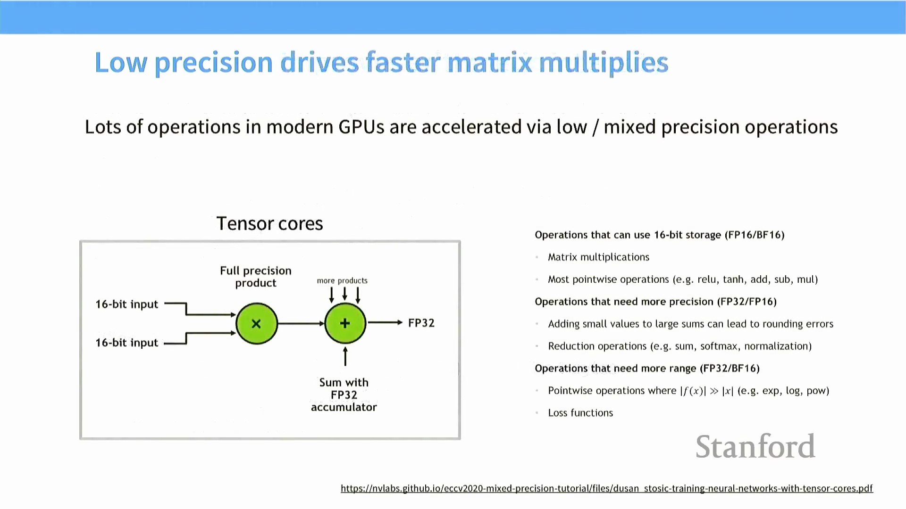
算子融合(Operator Fusion) 通过最大限度减少全局内存与计算单元之间冗余的数据搬运，有效破解了内存瓶颈(Memory Bottleneck)。理解此问题的一个直观心智模型(Mental Model) 是将 GPU 视作一条带宽固定的工厂传送带。在朴素实现(Naive Implementation) 中，每个算子独立从全局内存读取数据，计算完毕后再将结果写回。若后续算子依赖该中间结果，则需再次触发全局内存读取，导致巨大的通信开销。算子融合技术通过将多个具有依赖关系的操作合并至单个核函数(Kernel) 中，彻底改变了这一低效模式。在整个计算序列执行期间，中间数据将全程驻留于高速片上内存(On-chip Memory) 或寄存器(Register) 中，直至最终结果生成后才一次性写回全局内存。
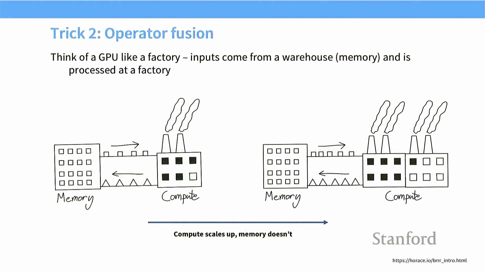
例如，在 PyTorch 中朴素计算表达式 $\sin^2(x) + \cos^2(x)$ 时，会依次触发五个独立的 CUDA 核函数(CUDA Kernel)：正弦计算、余弦计算、两次平方运算以及最终的加法操作。每个步骤均需将中间结果写回全局内存，并在下一步骤中重新读取。通过融合这些操作（无论是借助自定义 CUDA 核函数，还是利用 `torch.compile` 等图编译工具），整个计算序列仅需一次核函数调用即可完成。此举彻底消除了中间数据的内存访问开销(Intermediate Memory Traffic)，显著提升了逐元素操作(Element-wise Operations) 及低算术强度(Low Arithmetic Intensity) 运算的整体性能。
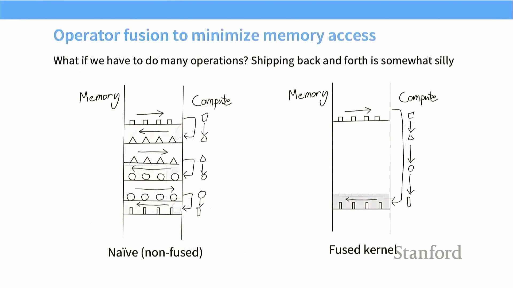

## 重计算：以算力换内存
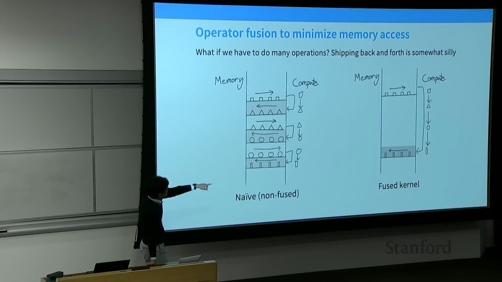
重计算(Recomputation)（通常与梯度检查点技术(Gradient Checkpointing) 结合使用）是另一项强大的优化策略，其核心思想是主动增加计算量以换取显存占用的降低。在标准反向传播(Backpropagation) 过程中，前向传播(Forward Propagation) 产生的中间激活值(Intermediate Activations) 必须持久化存储至全局内存(Global Memory)，以便后续用于梯度计算。频繁读取和写入这些缓存值会带来巨大的内存读写开销，这在算术强度(Arithmetic Intensity) 较低的网络中尤为凸显。
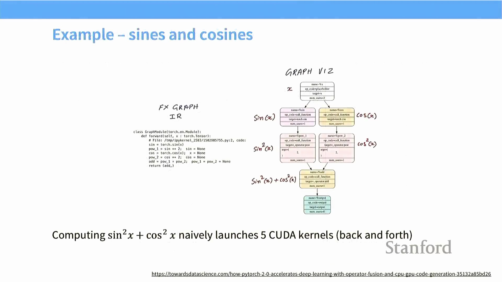
以一个由多层 Sigmoid 激活函数堆叠构成的网络为例。在朴素实现下，反向传播需从内存中读取先前保存的激活值（如 S1, S2），执行梯度计算(Gradient Computation) 后，再将计算出的梯度写回。对于单个基础层而言，此过程极易引发多达八次独立的内存事务(Memory Transactions)。引入重计算技术后，系统不再持久化存储这些中间激活值，而是在前向传播结束后将其丢弃，待反向传播需要时再按需重新计算(Recompute)。通过以相对廉价的计算算力换取高昂的全局内存访问开销，该策略有效缓解了内存带宽压力，使得开发者能够在不触及视频随机存取存储器(VRAM) 容量上限的前提下，采用更大的批量大小(Batch Size) 或训练更深度的网络模型。
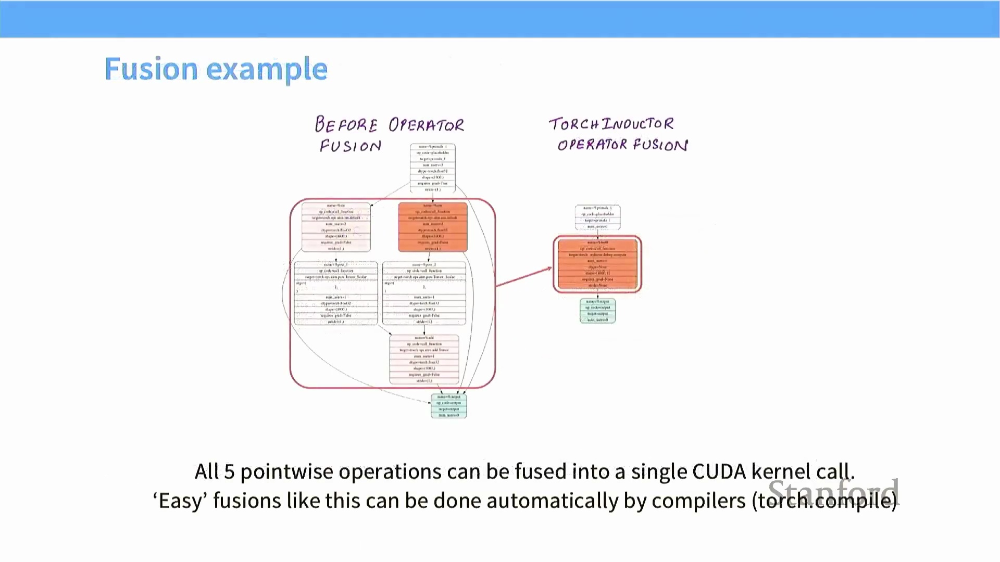

---

## 重计算：以算力换取带宽
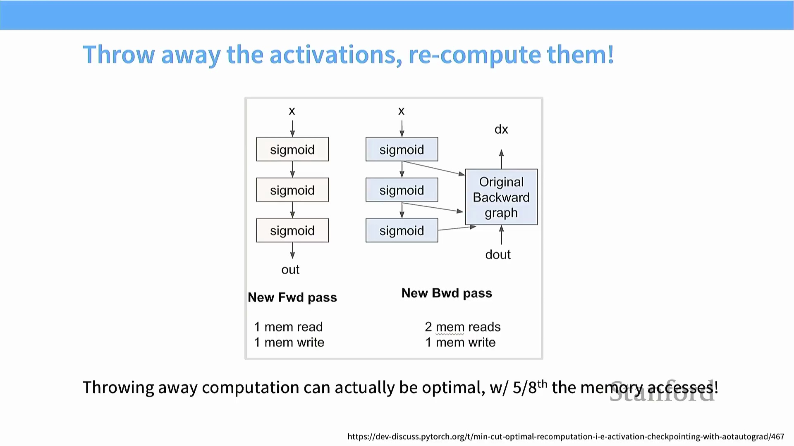
重计算(Recomputation) 技术通过在前向传播(Forward Propagation) 阶段主动丢弃中间激活值(Intermediate Activations)，进一步优化了内存使用策略。该算法不再将 S1 和 S2 等中间值缓存至全局内存(Global Memory)，而是仅保留初始输入与最终输出。在反向传播(Backpropagation) 阶段，系统会重新加载输入数据与上游传入的梯度(Upstream Gradients)，并直接在流多处理器(SM, Streaming Multiprocessor) 的片上内存(On-chip Memory) 中即时重算所需的激活值。该策略将全局内存事务(Global Memory Transactions) 的总数降至朴素实现(Naive Implementation) 的约 5/8。尽管引入了额外的算术运算开销，但在工作负载处于内存受限(Memory-Bound) 状态时，这是一种极具收益的性能权衡(Trade-off)。在功能实现上，其与梯度检查点(Gradient Checkpointing) 完全一致，但此处应用该技术的核心目的在于提升执行速度，而非仅仅为了突破显存(VRAM, Video RAM) 的容量瓶颈。

## DRAM 突发模式与硬件现实
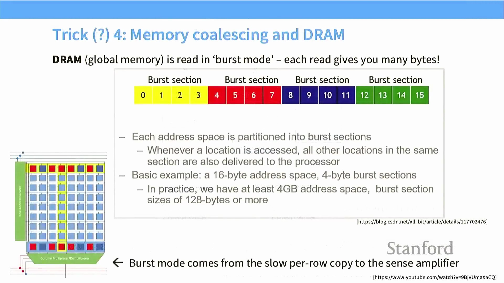
优化 GPU 性能需深入理解全局动态随机存取存储器(DRAM, Dynamic Random-Access Memory) 的物理行为特征。为缓解固有的高内存访问延迟(Memory Latency)，DRAM 内存控制器(Memory Controller) 采用了“突发模式(Burst Mode)”机制。当线程请求单一内存地址时，硬件返回的并非仅是该地址对应的数据，而是整块连续的内存数据块。这是因为在 DRAM 中，激活物理内存行(Row Activation) 是最耗时的步骤；一旦行地址被激活，读取相邻字节的数据几乎可在瞬间完成。通过设计顺序读取连续数据的算法，开发者可有效掩盖(Overlap) 行激活延迟，并充分压榨每次突发读取(Burst Read) 的数据带宽，从而使有效内存吞吐量(Effective Memory Throughput) 提升高达 4 倍。
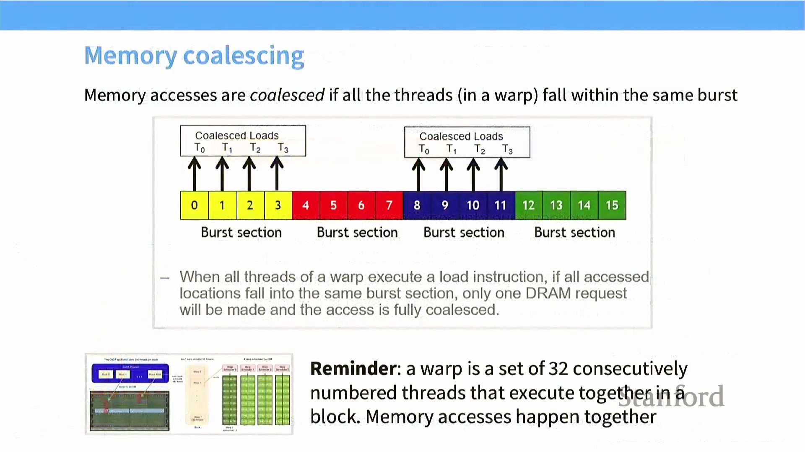

## 内存合并访问与访问模式
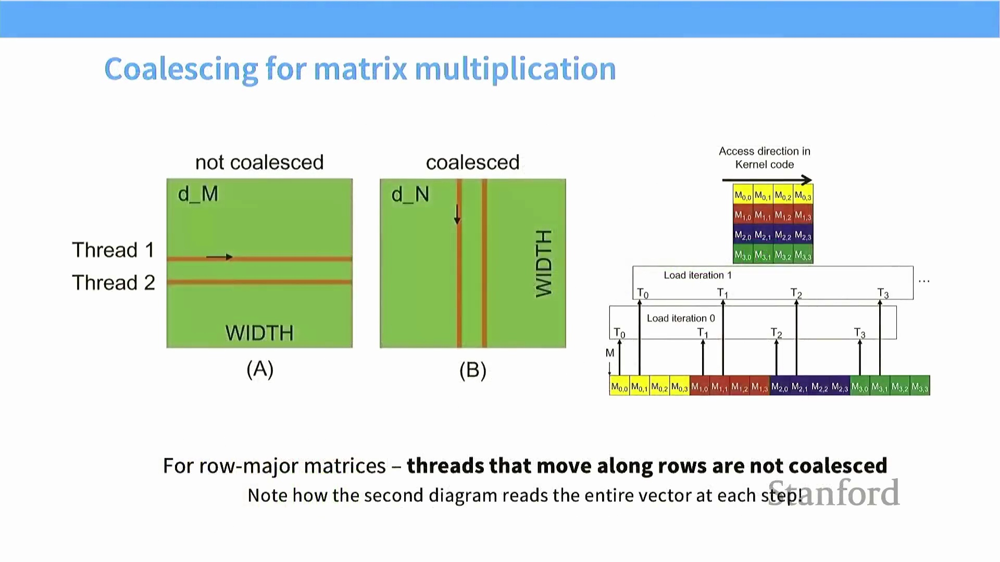
这一硬件特性直接催生了“内存合并访问(Memory Coalescing)”这一核心优化概念。由于包含 32 个线程的线程束(Warp) 采用同步执行机制，其内存请求会被硬件自动分组聚合。若束内所有线程访问的内存地址均落入同一个突发数据块(Burst Block) 或缓存行(Cache Line) 内，硬件便会将这些离散请求合并为单次高效的内存事务(Memory Transaction)。数据结构的内存布局与遍历顺序对此影响显著。在矩阵运算中，采用行优先(Row-Major) 顺序遍历元素（即递增列索引）可确保各线程的内存请求落在连续的内存地址块内，从而完美触发合并访问。相反，若采用列优先(Column-Major) 方向跨步访问，内存请求将分散至不同的突发块中，迫使 GPU 发起大量低效的独立内存事务。
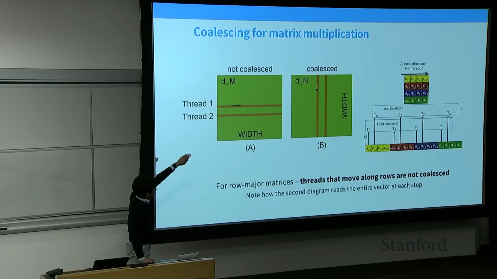
深入理解此访问模式至关重要：线程必须访问连续对齐的内存地址方能触发合并访问。当地址对齐正确时，单个线程束仅需一次内存操作即可获取完整数据块，从而将内存带宽利用率最大化。反之，若地址对齐错误，冗余且未合并的 DRAM 读取操作将导致性能断崖式下跌。

## 用于优化矩阵乘法的分块技术
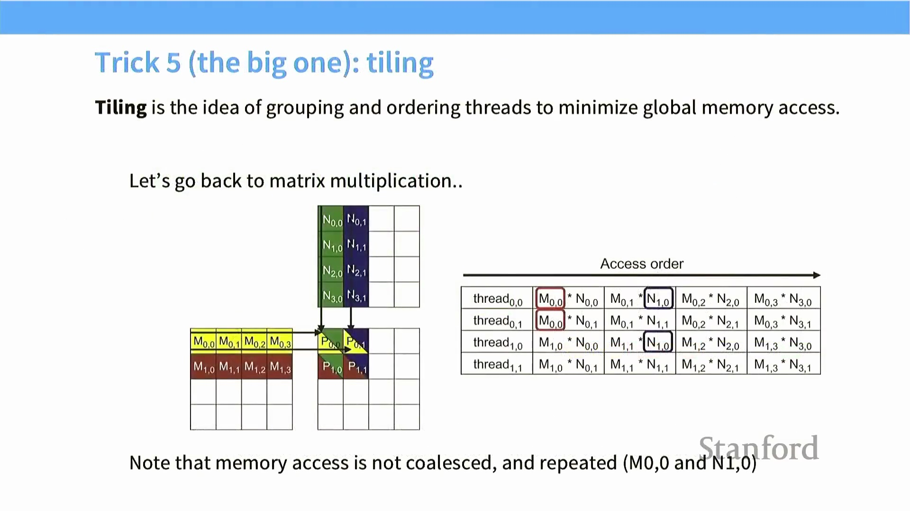
针对矩阵乘法(Matrix Multiplication) 等计算密集型操作，最具威力的优化策略是“分块技术(Tiling/Blocking)”。在朴素实现中，每次执行点积(Dot Product) 运算时，算法都会反复直接从全局内存中拉取行与列向量，这不仅造成严重的数据冗余，还会引发大量未合并的内存访问。理想的优化目标是：将数据从低速的全局内存(Global Memory) 仅加载一次至高速的片上共享内存(On-chip Shared Memory) 中，在此完成密集计算后，再将其释放。
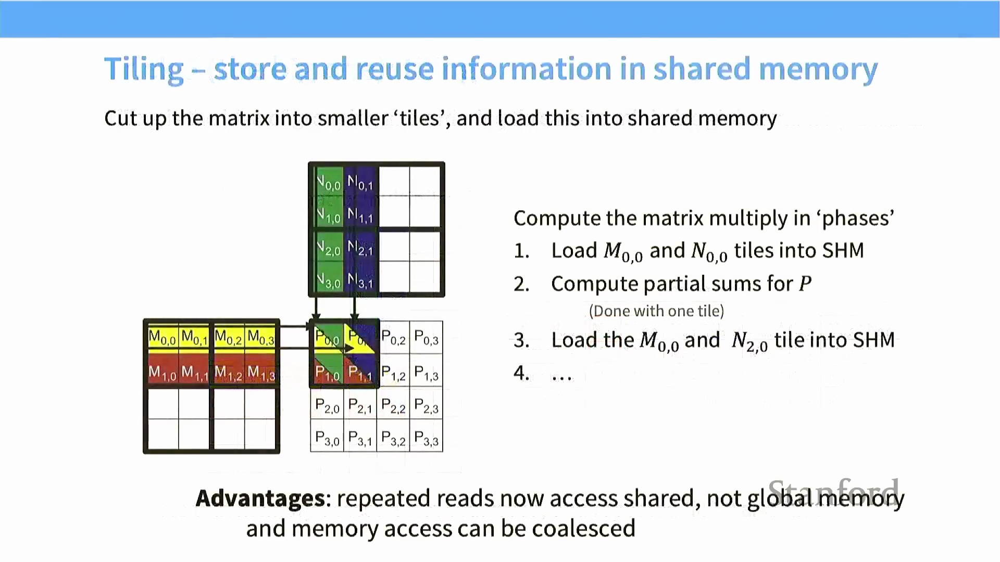
为达成此目标，大型矩阵被切割为若干较小的子矩阵，即“数据块(Tiles)”。只要单个数据块的尺寸适配 SM 的共享内存(Shared Memory) 容量，算法便可借助一次合并内存访问(Coalesced Memory Access)，同步将两个输入矩阵的对应数据块加载至片上。
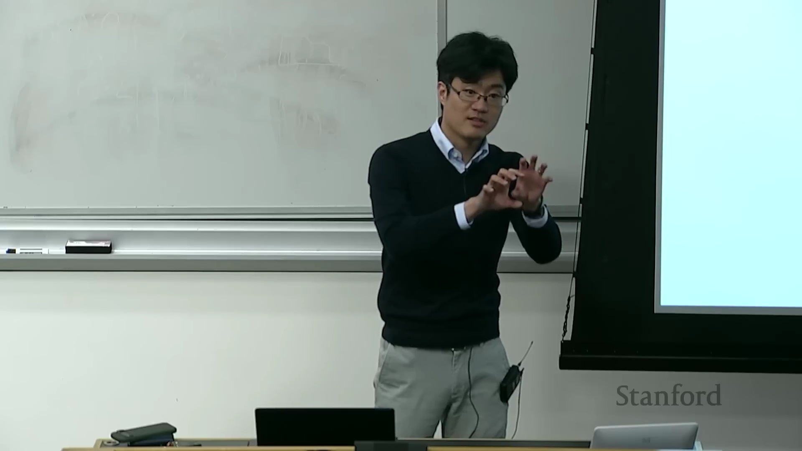
随后，线程束利用这些驻留于高速缓存中的局部数据计算部分累加和(Partial Sums)，完成当前块对的处理后，再滑动至下一对数据块。
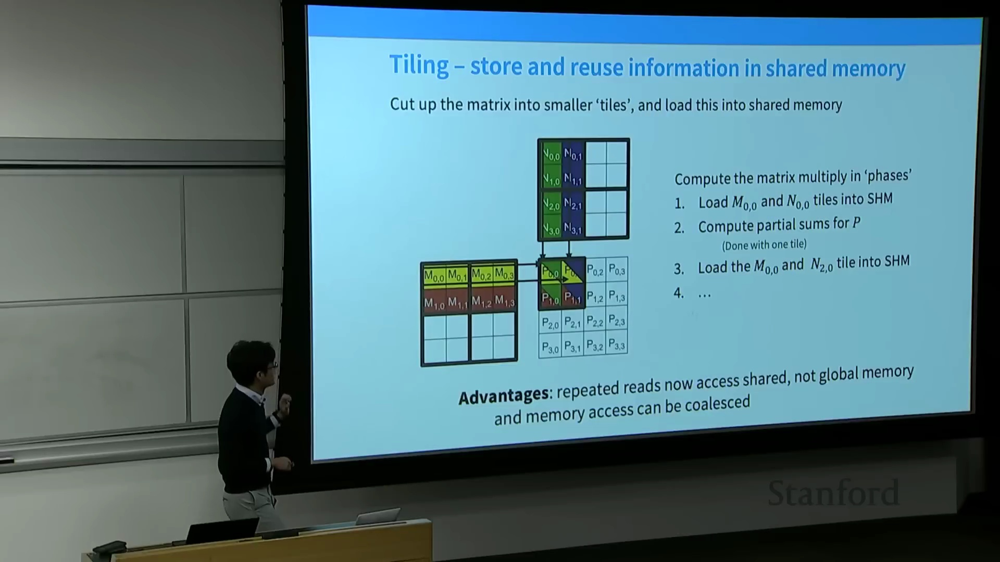
通过在共享内存中循环迭代处理这些数据块，该算法大幅削减了对全局内存带宽(Global Memory Bandwidth) 的依赖，有效提升了算术强度(Arithmetic Intensity)，并使张量核心(Tensor Cores) 能够持续以峰值硬件利用率(Peak Hardware Utilization) 满载运行。

---

## 分块算法与共享内存优化
优化矩阵乘法(Matrix Multiplication) 的核心策略是分块技术(Tiling/Blocking)。该算法摒弃了反复从低速全局内存(Global Memory) 中读取行向量与列向量的做法，转而将大型矩阵划分为若干更小的子矩阵，即“数据块(Tiles)”。 这些数据块仅需一次性加载至高速的片上共享内存(On-chip Shared Memory) 中。随后，线程利用这些驻留于高速缓存的数据计算部分累加和(Partial Sums)，并将结果累加至输出矩阵。当当前数据块计算完毕后，系统再加载下一对数据块。该方法大幅降低了对全局内存带宽(Global Memory Bandwidth) 的依赖，同时确保在加载数据块时的每次内存读取均能实现合并访问(Memory Coalescing)，从而逼近硬件的最大吞吐量(Throughput)。

## 分块效率的数学原理
分块技术带来的性能增益可通过数学模型进行量化。在 $N \times N$ 矩阵乘法的朴素实现(Naive Implementation) 中，每个输入元素需从全局内存(Global Memory) 中读取约 $N$ 次。引入块大小 $T$ 后，算法将绝大部分数据搬运(Data Movement) 转移至共享内存(Shared Memory) 层级。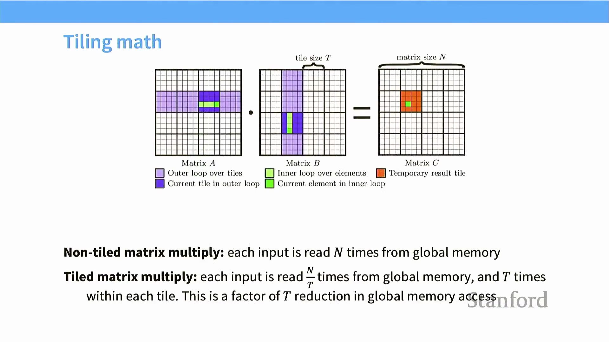 此时，每个元素仅需从全局内存中加载 $N/T$ 次，其余 $T$ 次访问均在流多处理器(SM, Streaming Multiprocessor) 内部本地完成。这一优化直接将全局内存访问流量(Global Memory Traffic) 降低了 $T$ 倍，成功将原有的内存受限(Memory-Bound) 瓶颈转化为高效的计算受限(Compute-Bound) 工作负载。

## 负载均衡与离散化陷阱
选取最优的块大小(Block Size) 是一项复杂的权衡(Trade-off) 过程，受限于共享内存容量与矩阵的实际维度。若矩阵尺寸无法被块大小整除，算法必须分配额外的、仅包含部分有效数据的边界块(Boundary Tiles) 以覆盖剩余元素。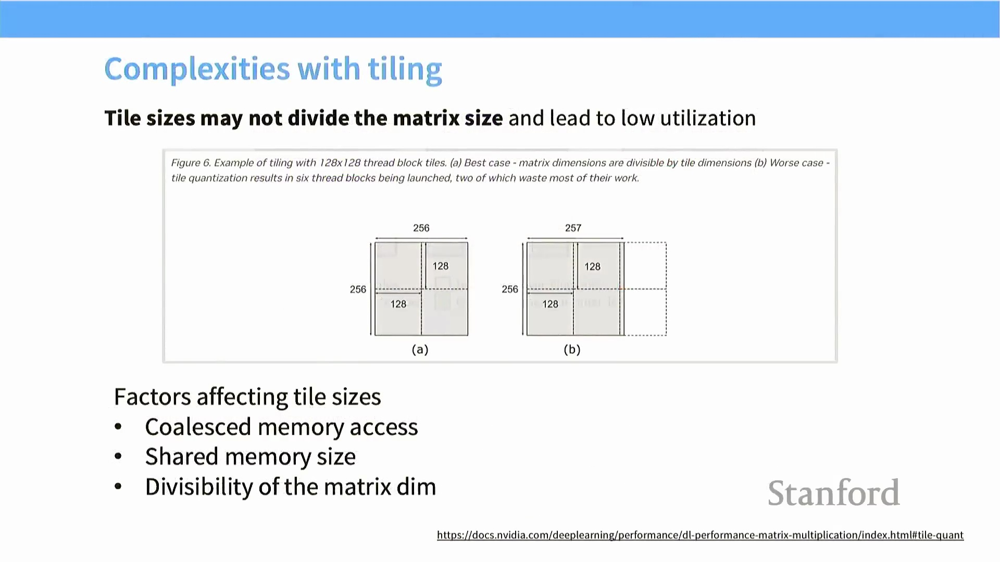 此类边缘块包含大量无效计算或冗余填充，导致分配给它们的流多处理器(SM) 在大部分时钟周期内处于空闲(Idle) 状态。由于每个数据块均映射至一个独立的硬件线程块(Thread Block)，维度无法整除会引发严重的负载不均衡(Load Imbalance) 与硬件资源利用率(Resource Utilization) 低下，从而削弱分块技术带来的理论性能优势。

## DRAM 对齐、突发段与填充
软件层面定义的数据块与硬件层面的动态随机存取存储器(DRAM, Dynamic Random-Access Memory) 突发传输(Memory Burst) 机制之间的交互，构成了影响性能的另一个关键维度。GPU 以固定大小的突发块为单位进行内存读取。当数据块的行长度与硬件突发边界(Burst Boundary) 完美对齐(Memory Alignment) 时，仅需极少的内存事务(Memory Transaction) 即可完成数据检索。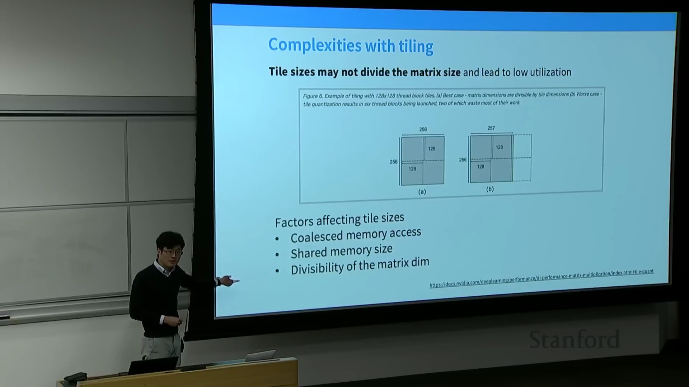 然而，若数据块未对齐——即便仅偏移一个元素——行数据便会跨越多个突发边界，导致所需的内存读取次数成倍增加。为规避此问题，开发者通常会对矩阵执行填充操作(Padding)，将其维度向上取整至突发大小（如 64）的倍数，从而确保绝对的内存对齐。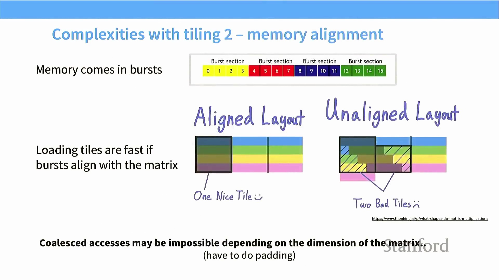

## 实际影响与解读性能图表
内存填充的必要性在 Karpathy 的 nanoGPT 优化案例中得到了经典印证：尽管引入的占位符词元(Dummy Tokens) 本身并无实际语义，但仅将词汇表大小(Vocabulary Size) 从 50,257 调整至 50,304（最接近的 64 的倍数），便带来了高达 25% 的训练速度提升。这一硬件对齐原则直接解释了矩阵乘法基准测试(Benchmark) 中广为流传的“波浪状”性能曲线。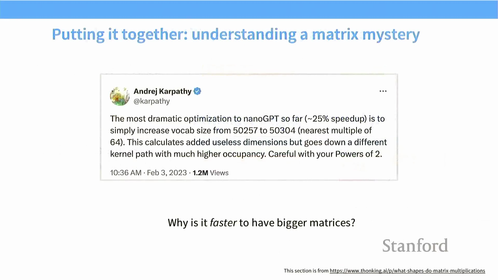 曲线初始的对角线斜坡代表内存受限区(Memory-Bound Region)，此时问题规模过小，尚不足以使计算单元达到饱和(Compute Saturation) 状态。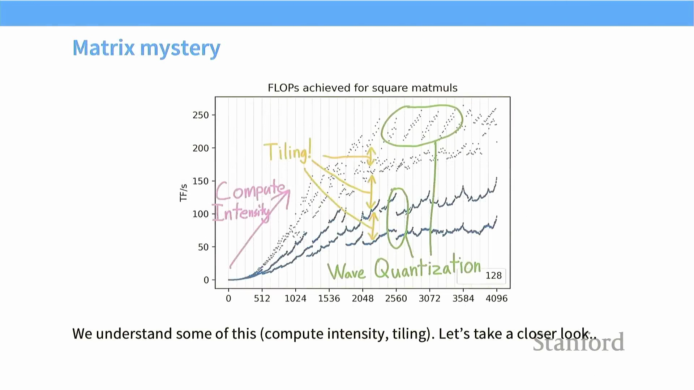 理论上，一旦跨越该阈值，性能应在峰值吞吐量(Peak Throughput) 处进入平稳平台期。然而，该平台期中特征性的性能波谷与凹陷，正是由数据块未对齐(Misaligned Tiling) 及突发传输边界不匹配所直接引发的。 深入理解这些底层硬件约束，将帮助开发者在调优时，有意识地选取能落在性能波峰而非效率波谷的矩阵维度与分块配置(Block Configuration)。

---

## 矩阵整除性与硬件对齐
图形处理器(GPU, Graphics Processing Unit) 的性能对矩阵维度(Matrix Dimensions) 的整除性极为敏感。当矩阵维度能够被 2 的幂次（如 32、16 或 8）整除时，计算工作负载(Workload) 能够与底层 DRAM 的内存突发(Memory Burst) 机制完美对齐，从而实现峰值吞吐量(Peak Throughput)。相反，若采用质数(Prime Numbers) 或难以整除的维度，则会强制引发非对齐的内存访问模式(Misaligned Memory Access Patterns)。这将破坏高效的内存合并与分块策略(Memory Coalescing and Tiling Strategies)，迫使 GPU 发起额外且冗余的内存突发读取，进而导致矩阵乘法(Matrix Multiplication) 性能大幅衰减。
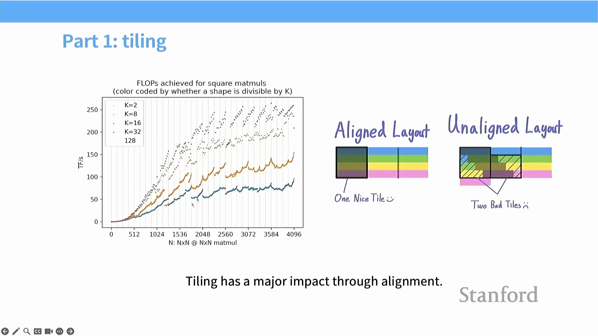

## 波次量化与 SM 断崖现象
即便矩阵维度具备良好的整除性，其微小的尺寸变化仍可能引发性能的断崖式下跌。这一现象可通过“波次量化(Wave Quantization)”理论加以解释：当待处理的计算块(Tile/Block) 总数超过流多处理器(Streaming Multiprocessor, SM) 的可用数量时，便会触发该效应。例如，NVIDIA A100 配备 108 个 SM。若某工作负载生成 98 个计算块，GPU 可将其全部分发至所有 SM 并行执行，实现极高的硬件利用率(Hardware Utilization)。然而，若矩阵维度略微增加导致计算块数量跃升至 120 个，前 108 个块将率先执行完毕，而 GPU 必须等待剩余的 12 个块在下一波次(Wave) 中串行执行。这种因硬件资源调度产生的序列化(Serialization) 现象会导致整体吞吐量急剧下滑，深刻说明了计算块数量必须与硬件并行度(Hardware Parallelism) 保持精密平衡。
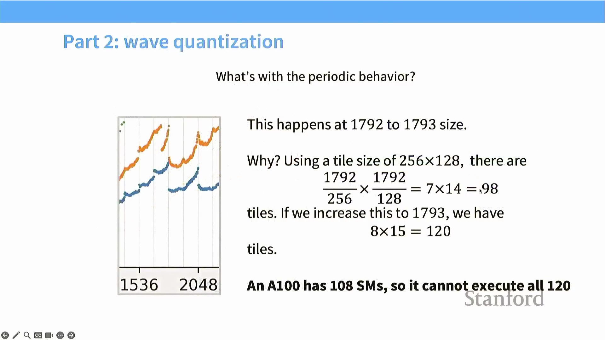

## 核心 GPU 优化工具包
最大化 GPU 性能的核心宗旨，在于将昂贵的高带宽内存(High Bandwidth Memory, HBM) 访问次数降至最低，同时将计算单元(Compute Units) 的利用率推向极致。其核心优化工具包(Optimization Toolkit) 主要包含：利用突发传输特性的内存合并访问(Memory Coalescing)、消除冗余中间数据写入的算子融合(Operator Fusion)，以及将数据高效驻留于高速片上共享内存(Shared Memory) 的分块技术(Tiling/Blocking)。此外，开发者可通过巧妙的资源置换策略进一步榨取性能：例如，重计算(Recomputation) 策略以额外的计算周期(Compute Cycles) 换取内存带宽的节省；而量化(Quantization) 技术则以牺牲部分数值精度(Numerical Precision) 为代价，大幅压缩内存占用。熟练掌握这些以内存优化为中心(Memory-Centric) 的策略，对于高效扩展(Scaling) 大型语言模型(Large Language Models) 至关重要。
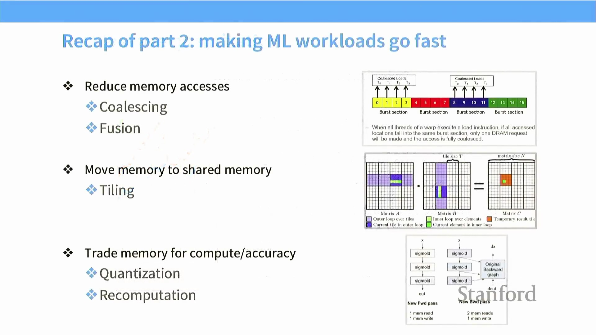

## Flash Attention 与分块矩阵乘法
Flash Attention 算法深度融合了上述优化原则，为 Transformer 模型成功实现了亚二次方复杂度(Sub-Quadratic Complexity) 的 HBM 内存访问。尽管标准的自注意力机制(Self-Attention Mechanism) 涉及多次矩阵乘法运算（如 $Q \times K^T$、Softmax 归一化、$P \times V$），但其核心的矩阵乘法部分已可通过标准的分块技术(Tiling) 进行高效优化。
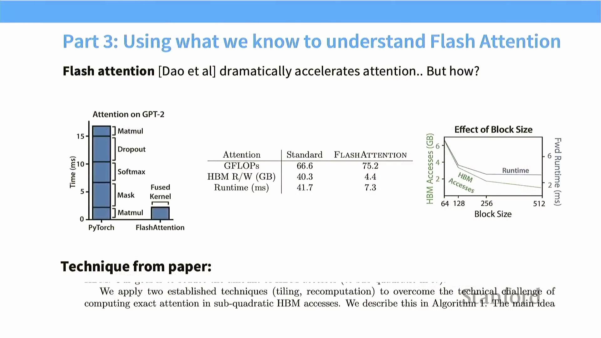
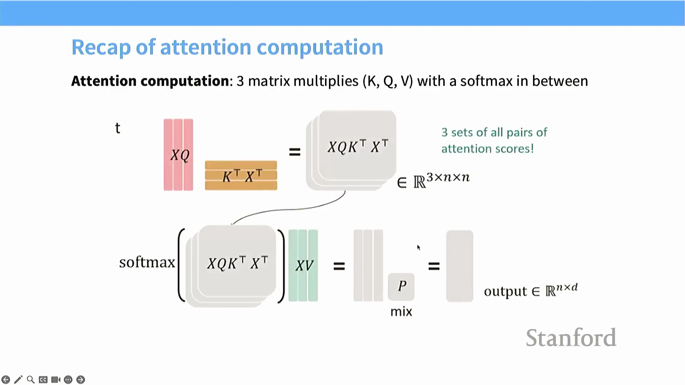
查询(Query)、键(Key) 与值(Value) 矩阵的数据块被流式传输(Streamed) 至静态随机存取存储器(SRAM, Static RAM) 中执行乘加运算(Multiply-Accumulate, MAC)，全程无需在全局内存(Global Memory) 中显式构造完整的注意力矩阵(Attention Matrix)。该算法的真正技术难点，在于如何在此分块计算范式内高效且精确地处理 Softmax 操作。

## 用于增量计算的在线 Softmax
传统的 Softmax 函数属于全局归一化操作(Global Normalization Operation)，必须遍历完整行向量以求和计算归一化常数(Normalization Constant)，这通常在实现上强制要求将完整的 $N \times N$ 矩阵持久化存储于 HBM 中。Flash Attention 通过引入“在线 Softmax(Online Softmax)”算法巧妙地攻克了这一难题。
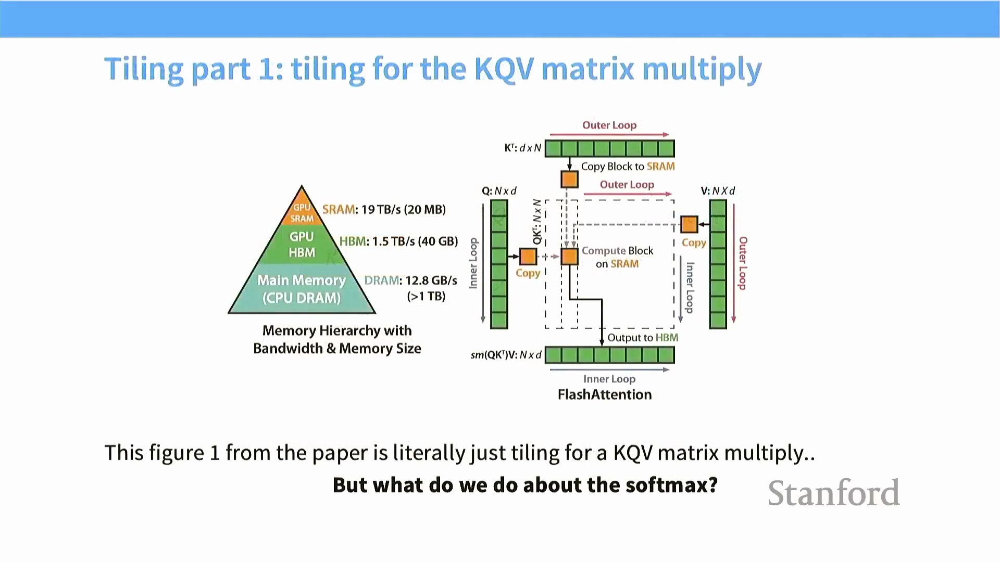
该算法在分块增量处理数据的过程中，会动态维护当前行的运行最大值(Running Maximum) 与实时更新的归一化因子(Normalization Factor)。通过逐块累积部分和(Partial Sums) 并应用数值校正因子(Correction Factors)，Softmax 计算被无缝融合至分块矩阵乘法的循环体中。这一设计使得模型能够以数学等价的方式计算出精确的注意力权重(Attention Weights)，同时彻底免除了在全局内存中存储二次方规模(Quadratic-Scale) 中间矩阵的开销。
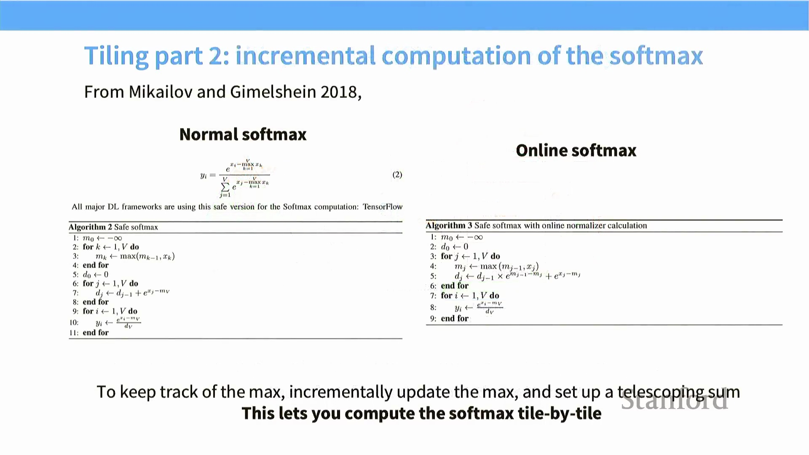
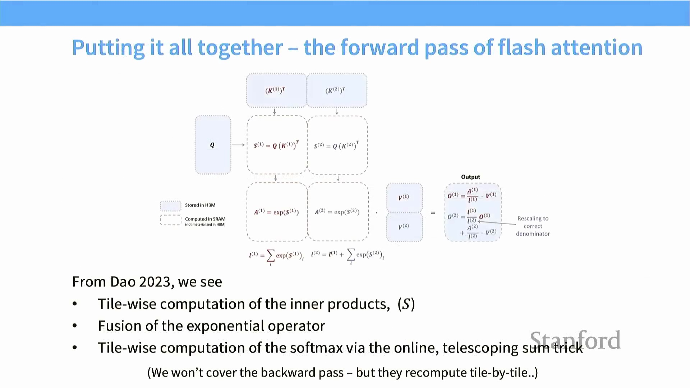

---

## 构建 Flash Attention 的前向传播
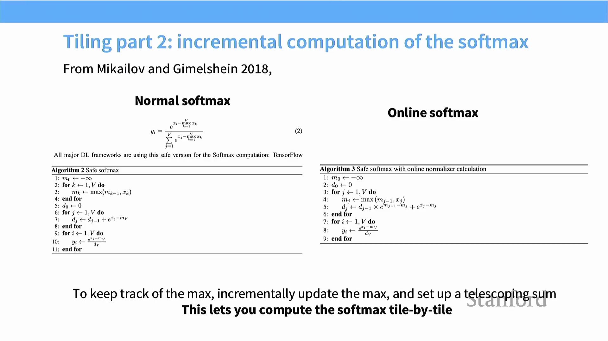
Flash Attention 的前向传播(Forward Pass) 将分块技术(Tiling) 与在线 Softmax(Online Softmax) 深度融合，构建出一条连贯且内存高效的计算流水线。该过程始于查询矩阵(Query, Q) 与键矩阵(Key, K) 之间的分块矩阵乘法(Tiled Matrix Multiplication)。在处理这些数据块时，算法会动态维护运行最大值(Running Maximum) 与累计指数和(Running Sum of Exponentials)，并逐步进行数值校正。这使得 Softmax 的计算能够以分块方式增量完成，无需在全局内存(Global Memory) 中显式构造完整的 $N \times N$ 注意力矩阵(Attention Matrix)。当所有数据块完成 $QK^T$ 乘法与 Softmax 归一化(Normalization) 的增量更新后，最后一步将归一化后的注意力分数与分块的值矩阵(Value, V) 相乘，最终生成完整的输出张量。

## 完成 Softmax 与反向传播
理解在线 Softmax(Online Softmax) 的一个关键前提是：在处理完所有数据块(Tile) 之前，算法无法直接输出最终的归一化结果。算法需首先完整遍历一次序列，在共享内存(Shared Memory) 中累加得到全局分母和（即归一化因子 Normalization Factor）。确定该全局总和后，即可应用最终的除法与指数缩放操作，从而在不进行完全重计算的情况下写出 Softmax 的最终输出。在反向传播(Backpropagation) 阶段，核心挑战在于避免为中间激活值(Intermediate Activations) 分配高达 $O(N^2)$ 级别的显存。Flash Attention 采用逐块重计算(Block-wise Recomputation) 策略攻克了这一难题，在梯度计算过程中按需即时重新计算所需的中间状态。该策略在严格遵循自动微分(Automatic Differentiation) 规则的同时，有效保障了反向传播阶段的内存效率(Memory Efficiency)。

## 课程回顾：内存优化的首要地位
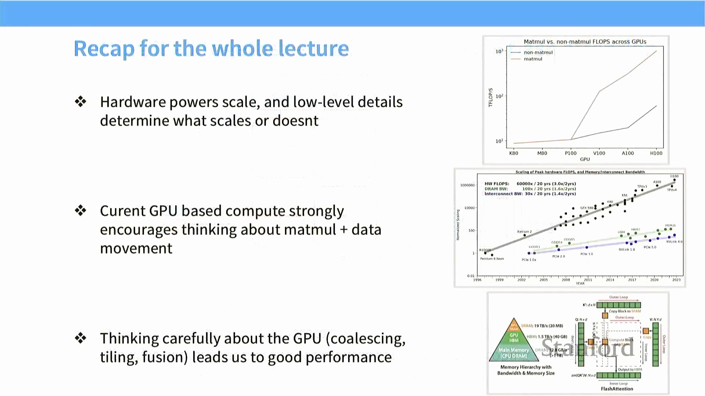
本次讲座的核心主旨在于：硬件演进一直是推动现代大型语言模型(Large Language Models, LLMs) 发展的核心驱动力。为充分释放硬件潜能，开发者必须深入剖析底层的硬件架构细节。当前 GPU 算力(Compute) 的指数级扩展趋势明确指向一个优化方向：优先优化内存数据搬运(Memory Movement)，而非单纯追求降低浮点运算次数(FLOPs)。鉴于内存带宽(Memory Bandwidth) 仍是制约性能的关键瓶颈，性能突破主要依赖于最小化高带宽内存(High Bandwidth Memory, HBM) 与计算核心(Compute Units) 之间高昂的数据传输开销。高效算法的设计准则应是：将中间计算结果尽可能驻留于高速片上共享内存(On-chip Shared Memory) 中，以此最大化数据局部性(Data Locality)。

## 结语
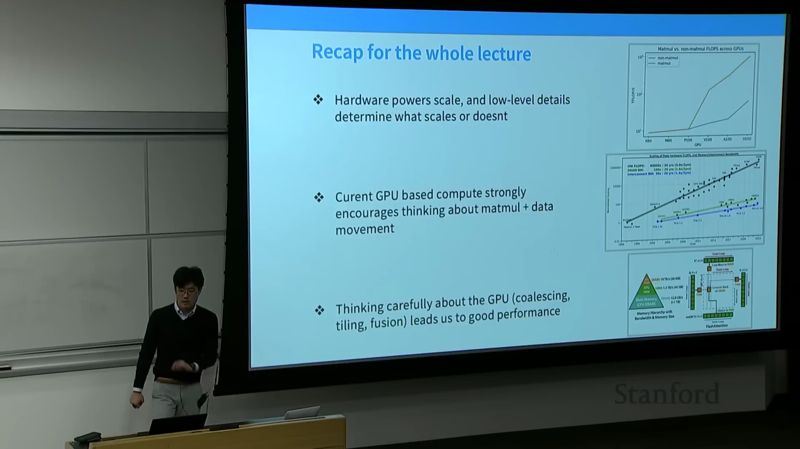

要真正驾驭 GPU 性能，开发者需完成根本性的视角转变：将数据移动效率(Data Movement Efficiency) 置于单纯减少算术运算之上。通过策略性地运用分块技术(Tiling)、内存合并访问(Memory Coalescing)、算子融合(Operator Fusion) 与重计算(Recomputation) 等核心优化手段，开发者得以构建出如 Flash Attention 般能够高效支持超长上下文(Long Context) 的先进算法。深入掌握这些系统级优化(System-level Optimizations) 技术，对于任何旨在突破深度学习(Deep Learning) 性能瓶颈、高效训练下一代 Transformer 模型(Transformer Models) 的研究者与工程师而言，都具有不可替代的关键意义。