#  Lecture 6： Kernels, Triton

生成时间: 2026-03-08 19:05:06

---

**英文**: Today we're going to be going into details on writing high performance code for GPUs. So part of assignment two is going to be you're going to have to do a bunch of profiling, you will have to write your own Triton kernel for flash attention two. You will need to sort of make all of this stuff very high performance. And so in this lecture, we're going to kind of drill down a little bit and we're going to try to write some high performance code for standard components in a language model. So the plan for this lecture is we're going to just do a brief amount of review about GPU stuff just to make sure you have once again the basic components of the GPUs that. we need to understand in order to follow the rest of the lecture. And then I'm going to show you a bunch of sort of really basic things about benchmarking which will be helpful for both the assignment and in general if you want to write high performance PyTorch or deep learning code. And then we're going to basically write some kernels. We're going to write CUDA kernels in sort of C++. We will then do the same thing in Triton.

**中文**: 今天我们将深入探讨如何为 **GPU** 编写高性能代码。

**第二次作业**的一部分内容将要求你们进行大量的**性能分析（profiling）**，并且需要亲手为 **Flash Attention 2** 编写自定义的 **Triton 内核（kernel）**。你们需要确保所有这些组件都达到极高的性能标准。

因此，在本讲座中，我们将深入细节，尝试为语言模型中的标准组件编写一些高性能代码。

本次讲座的计划如下：
1.  **简要回顾 GPU 基础知识**：确保大家再次掌握 GPU 的基本组成部分，这是理解后续内容的前提。
2.  **基准测试（Benchmarking）基础**：我将展示一些关于基准测试的基础知识。这不仅对完成作业至关重要，对于一般性地编写高性能 PyTorch 或深度学习代码也非常有帮助。
3.  **编写内核（Kernels）**：我们将实际动手编写内核。首先，我们会用 **C++** 编写 **CUDA 内核**；随后，我们将用 **Triton** 实现相同的功能。

**英文**: And then lastly, we're going to do the easy but very good thing of using PyTorch's existing. JIT compiler to have it optimized for us. And then we'll compare all of those and profile and benchmark things. Throughout, we're going to really dig in deep. We're going to go down all the way to the PTX, so pretty close to the machine code, to understand what the GPU is actually doing under the hood when we write all of this code. And then hopefully we'll have time, and I think we will. We'll finish by writing sort of a fast Triton implementation of softmax at the very end. So assignment one has come to a close. There's still a leaderboard. You can still submit and update things there.

**中文**: 最后，我们将采取一个简单但非常有效的方法：利用 **PyTorch** 现有的 **JIT（即时）编译器** 来自动为我们优化代码。

随后，我们将对上述所有方法（手写 CUDA、Triton 以及 JIT 编译）进行**对比**，并通过**性能分析（profiling）**和**基准测试（benchmarking）**来评估它们的表现。

在整个过程中，我们将深入底层细节，一直剖析到 **PTX**（并行线程执行）级别——这非常接近机器码。这样做的目的是为了透彻理解当我们编写这些代码时，GPU 内部究竟在执行什么操作。

如果时间允许（我认为应该没问题），我们将在最后通过编写一个高效的 **Softmax** **Triton** 实现来结束本次课程。

另外，**第一次作业**已经接近尾声。不过，**排行榜 leaderboard**仍然开放，大家依然可以提交结果或更新你们的方案。

**英文**: Some of you may be using late days, so please finish up assignment one. And then assignment two is now out. And as I said before, there's going to be a bunch of systems stuff that you're going to need to do. There's fun parts that you can do now involving GPU kernels. And then next week, we're going to talk about parallelism, and that's going to be the other. half of the assignment, writing fast parallel code like data parallelism and so on. So we will get to that next week. All right. So now remember how GPUs work, right? So when we have something like an A100 or an H100, we're going to have a whole bunch of SMs, streaming multiprocessors. Within each SM is a large number of units that can do computation.

**中文**: 有些同学可能正在使用**宽限期 late days**，请尽快完成**第一次作业**。

另外，**第二次作业**现在已经发布。正如我之前提到的，这次作业包含大量涉及**系统底层**的内容。其中有趣的部分是现在就可以开始的 **GPU 内核 kernel** 编写工作。

下周，我们将讨论**并行计算 parallelism**，这将是作业的另一半内容：编写高效的并行代码，例如**数据并行 data parallelism**等。我们下周会详细展开这部分。

好了，让我们回顾一下 **GPU** 的工作原理：
当我们使用像 **A100** 或 **H100** 这样的显卡时，它们内部包含大量的 **流式多处理器 SMs, Streaming Multiprocessors**。而在每个 SM 内部，又集成了大量的计算单元来执行运算任务。

**英文**: We have in 32 ones or FP32 ones. And then each SM is going to launch a large number of threads, right? And we have the memory hierarchy, which is that we have DRAM or global memory, which is big and slow. And then we've got caches that are much faster. And in fact, you see here there's a thing called the register file. This is very, very fast memory that each thread can access. And we're going to be making heavy use of these registers as we write high performance code for GPUs today. So the basic structure for the execution model is going to be we're going to have a collection of thread blocks and a block is going to be scheduled on a single SM. Right. So this is kind of the atomic unit that we're going to be thinking about, especially when we write code and things like Triton. And then within each block, there's going to be a whole bunch of threads and the threads are actually going to be the ones doing the computation.

**中文**: 每个 SM 包含 32 个（或更多）**FP32** 计算单元。随后，每个 SM 将启动大量的**线程 threads**。

我们需要理解 GPU 的**内存层次结构 memory hierarchy**：
*   **DRAM 显存/全局内存**：容量大但速度较慢。
*   **缓存 Caches**：速度要快得多。
*   **寄存器文件 Register File**：正如大家在此处所见，这是一种极快的内存，供每个线程直接访问。今天我们在编写高性能 GPU 代码时，将大量依赖这些寄存器。

GPU 执行模型的基本结构如下：
我们将拥有一组**线程块 thread blocks**。一个线程块会被调度到**单个 SM** 上运行。这是我们思考问题的基本原子单位，特别是在编写如 **Triton** 这类代码时尤为重要。

在每个线程块内部，包含大量的**线程**，而真正执行计算任务的正是这些线程。

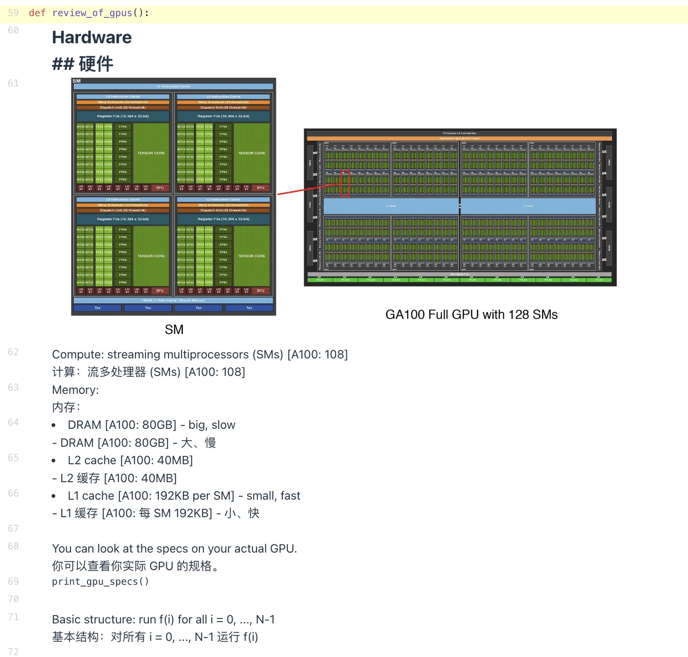

**英文**: And so if you have a vector and you're going to be operating over elements of that vector, right, you're going to write code where each thread is going to go in and maybe operate. over a few elements of that vector at once. Right. And all the threads together will sort of process the vector completely. So why do we have these things called thread blocks? Right. Why not just have threads and your big global context? Well, thread blocks can communicate with each other. There's shared memory kind of within the SM. That's pretty fast. Right. So when you need to do something like matrix multiplication, you're going to need to pass information from threat to thread. And within a thread block, that's very fast across thread blocks or across these groups. It's going to be very expensive. So any data that you need, you're going to want to keep within the same thread block or within the same sort of pile. And that's going to keep things very, very fast. And that's going to be as fast as sort of a L1 cache. And that's a great place to be. And so you can use this to synchronize across threads, but you can't, for example, synchronize across blocks. You can't really control what's going to happen. Right.

**中文**: 因此，如果你有一个向量并需要对其元素进行运算，你编写的代码会让每个线程同时处理该向量的几个元素。所有线程协同工作，从而完成对整个向量的处理。

那么，为什么我们需要线程块（thread blocks）这个概念呢？为什么不直接让所有线程在一个巨大的全局上下文中运行？

原因在于：线程块内部的线程可以相互通信。在每个 SM 内部存在一种称为共享内存（shared memory）的存储区域，它的速度非常快。因此，当你需要执行像矩阵乘法这样的操作时，就需要在线程之间传递信息。

在同一个线程块内部，这种通信非常迅速；而如果是跨线程块或跨这些组进行通信，开销则会非常大。因此，任何你需要频繁访问的数据，都应尽量保留在同一个线程块（或同一组）内，这样才能保持极高的速度。这种速度大致相当于 L1 缓存，是非常理想的状态。

你可以利用这一机制在线程之间进行同步（synchronize），但请注意，你无法跨线程块进行同步。你也无法真正控制跨块时会发生什么（例如调度顺序等）。

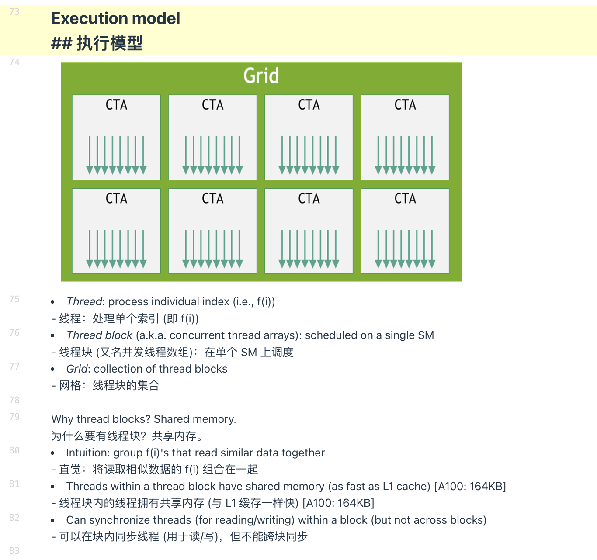

**英文**: And remember the thing that I mentioned last week, there's this thing called waves, right? Waves aren't sort of an inherent thing that you normally think about. But for performance, it is an important component. So when we actually run these things, the threads are grouped into into consecutive blocks of 32 threads. And that's a wave. And that gets executed kind of all at once in an SM. And so one thing that we would like to do is to make sure all the waves have an equal amount of computation. We can't always do that. But, you know, if we can, we would like to do that. Right. So we want to make the number of thread blocks, ideally divide the number of SM's and to make sure that each wave has an equal amount of work.

**中文**: 还记得我上周提到的波次（waves）吗？虽然“波次”并不是你在常规编程思维中通常会直接考虑的概念，但对于性能优化而言，它却是一个至关重要的组成部分。

当我们实际运行这些程序时，线程会被分组为连续的、每组 32 个线程 的块，这就是一个波次（在 NVIDIA CUDA 架构中通常称为 Warp）。这些波次会在 SM 上被同时执行（单指令多线程，SIMT）。

因此，我们努力的目标之一是确保所有波次承载的计算量是均衡的。虽然并不总能完美实现这一点，但如果能做到，我们应当尽力去做。

具体来说，我们希望：
线程块的数量 ideally（理想情况下）能够被 SM 的数量整除，以实现负载均衡。
确保每个波次分配到的工作量相等，避免出现部分波次空闲等待（即“波次发散”或负载不均），从而最大化硬件利用率。

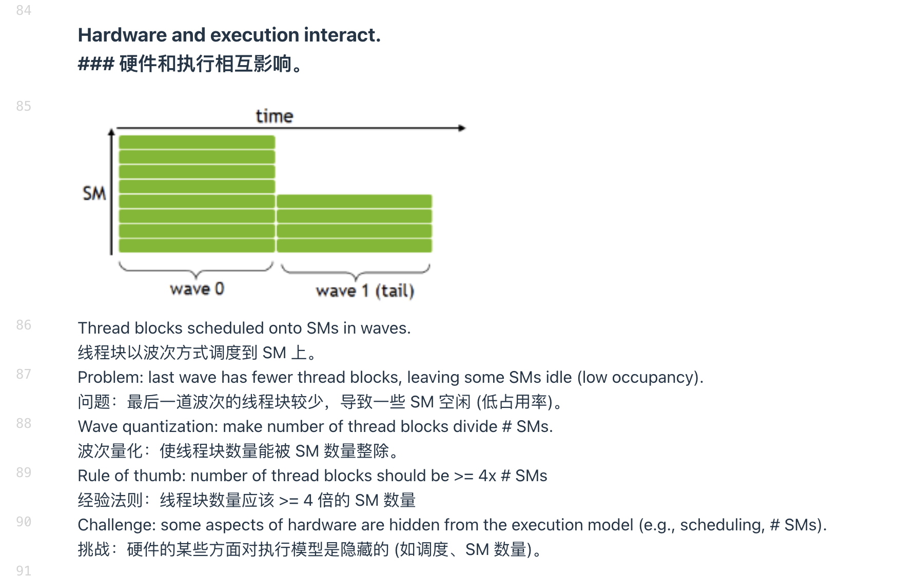

**英文**: So we're going to ideally have a lot more thread blocks than SM's. So we're going to try to make that happen as we write high performance code. OK. And then the last concept and maybe maybe amongst the most important concepts here is arithmetic intensity. We would like to keep arithmetic intensity high. We would like to have more flops than we have bytes of memory movement. And this is because, you know, if you remember the scaling plot from from last lecture, our compute scaling is much, much faster than memory scaling. So a lot of the time, computations are going to end up being memory bound. And we're not actually getting all of the work done. Right.

**中文**: 因此，理想情况下，我们的线程块（thread blocks）数量应该远多于 SM（流多处理器）的数量。在编写高性能代码时，我们会努力达成这一目标。

接下来是最后一个概念，或许也是这里最重要的概念：算术强度（Arithmetic Intensity）。

我们希望保持高算术强度。也就是说，我们希望执行的浮点运算次数（FLOPs） 远远超过内存中传输的字节数（Bytes）。

这是因为，正如大家在上一讲看到的缩放比例图（scaling plot） 所示，我们的计算能力增长速度远快于内存带宽的增长速度。因此，在很多情况下，计算任务最终会受限于内存带宽（memory bound），导致我们无法充分发挥计算单元的全部算力，无法完成所有本该完成的计算工作。

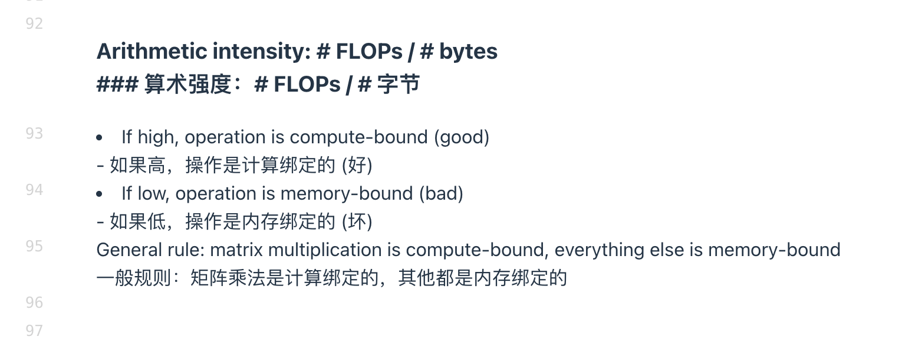

**英文**: So as a general rule, you know, matrix multiplication is compute bound. If we kind of do it cleverly, everything else is going to be memory bound. And we're going to try to cleverly reduce the amount of things that are memory bound or how badly things are memory bound. OK, so that's our very, very brief sort of review of GPUs. Hopefully everyone remembers this. You still have a fresh sort of memory of the execution model. Feel free to stop me and ask questions if any of you, you know, have sort of lingering doubts or questions about how this is all going to work. Yes. What was the function of? Sorry. A warp.

**中文**: 因此，作为一个通用原则：矩阵乘法通常是计算受限（compute bound）的；如果我们设计得足够巧妙，其他大多数操作则往往是内存受限（memory bound）的。我们的目标就是通过巧妙的设计，尽量减少受内存带宽限制的操作数量，或者减轻内存瓶颈带来的负面影响。

好了，以上就是我们对 GPU 非常简要的回顾。希望大家都能记住这些内容，并对 GPU 的执行模型保持清晰的印象。如果大家对这些机制是否有任何 lingering doubts（遗留的疑惑）或具体问题，请随时打断我提问。

（听众提问）：不好意思，刚才那个概念的功能是什么？
（回答）：你是问 Warp（波次/线程束） 吗？

**英文**: A warp is essentially a group of threads that get executed together. And the reason why warps exist is that they reduce the amount of control machinery that's needed because you're executing all these threads at the same time. You don't need a control thing for each thread. You need them for blocks of 32. Right. And so you see, for example, there's a lot more compute units than there are sort of warp schedulers. And so you're able to do a lot more parallel work without worrying about control. And this is one of the tradeoffs with CPUs, right? CPUs, a lot more sort of silicon area dedicated control and branch prediction and things like this. Whereas for GPUs, much more emphasis on computation with simpler controls. OK, so now we're going to get into sort of sort of newer content now.

**中文**: Warp（线程束） 本质上是一组被同时执行的线程。

Warp 之所以存在，是因为它能减少所需的控制硬件开销。既然这些线程是同时执行的，我们就不需要为每一个线程单独配备一套控制逻辑，而只需要为每 32 个线程组成的块配备一套即可。

因此你会发现，GPU 中的计算单元数量远多于 Warp 调度器（warp schedulers） 的数量。这使得 GPU 能够在无需过度担心控制复杂度的情况下，并行处理大量的工作。

这正是 GPU 与 CPU 之间的一个关键权衡（tradeoff）：
CPU：将更多的硅片面积 dedicated（专门用于）复杂的控制逻辑、分支预测等机制，以优化单线程性能和复杂任务处理。
GPU：则更侧重于大规模计算，采用更简单的控制逻辑，以换取更高的吞吐量和并行度。

好了，接下来我们将进入新的内容部分。

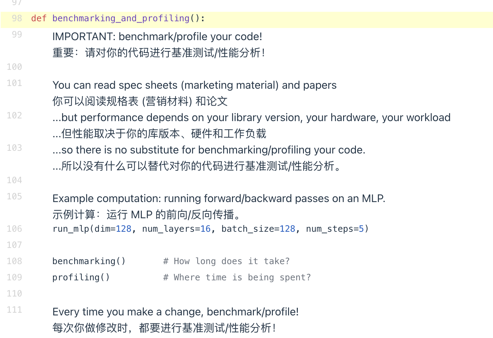

**英文**: And I think if there's one high level thing to remember, it's if you want to write high performance code, you should remember to benchmark and profile your code. And that seems very obvious. But I've seen a lot of things where students or people go in and they're like, well, I think this is the bottleneck. I'm going to spend three hours optimizing it. And it turns out it wasn't the bottleneck at all. I'm sure it was fun, but it was kind of time that was misallocated. And so if you actually use a high performance or very detailed profiler, you can kind of see exactly where your bottlenecks are and exactly what the machine is doing. And once you have that, you can go and spend your efforts in sort of the most important parts of your code execution. And so that's the high level thing I want to get across, because some of the details about GPU execution and how you write a softmax kernel, that's going to kind of change. And maybe you even want to just rely on the torch compile autojit thing.

**中文**: 我认为，如果要记住一个高层级的核心原则，那就是：如果你想编写高性能代码，就必须对你的代码进行基准测试（benchmarking）和性能剖析（profiling）。

这听起来似乎显而易见，但我见过很多学生或开发者径直上手，心想：“我觉得这里是瓶颈，我要花三个小时优化它。”结果发现，那里根本不是瓶颈。虽然优化过程可能很有趣，但这实际上是一种时间的错配。

因此，如果你使用专业的高性能剖析工具或详细的分析器，你就能精确地看到瓶颈在哪里，以及机器到底在执行什么操作。一旦掌握了这些信息，你就可以将精力集中在代码执行中最关键的部分。

这就是我想传达的核心理念。因为关于 GPU 执行细节以及如何编写 Softmax 核函数的具体知识可能会随着时间推移而变化（甚至你可能最终只想依赖 torch.compile 或 autojit 这样的自动化工具），但“先剖析，后优化”这一原则是永恒不变的。

**英文**: But the fact that you should profile isn't really going to change no matter what the. tools are. So I want you to sort of internalize that idea. That you should be always profiling if you want to be writing high performance code. And really, you know, there's a limit to the theory. I think systems is part of this course that you can reason about pretty well. Architecture is somewhat hard to reason about. And you can really think about sort of the roofline model and so on. But, you know, how fast is your matrix multiply? Well, maybe that depends on the library version or your hardware, like which things are. bottlenecking, for what reason.

**中文**: 但无论工具如何演变，“必须进行性能剖析”这一事实是不会改变的。所以我希望大家能将这一理念内化于心：如果你想编写高性能代码，就必须始终进行性能剖析。

实际上，理论分析是有局限性的。我认为本课程中的系统部分（Systems）是你能够进行相当严密推理的领域；而架构部分（Architecture）则相对难以单纯通过推理来把握。你确实可以思考屋顶线模型（Roofline Model）等理论框架，但是：

“你的矩阵乘法到底有多快？”

这个问题可能取决于库的版本或具体的硬件型号。究竟是哪些因素成为了瓶颈？又是出于什么原因？这些往往无法仅凭理论推导得出，必须通过实际测量才能知晓。

**英文**: There's all sorts of microcode things that you don't really fully know. And so you have to in the end have to do end to end benchmarking whenever you're developing these things. OK, so I'm going to have an example computation. This is the simplest thing that we can run compared to all the things that you all are doing in your assignment one. But I'm going to run a very simple MLP. It's going to have 128 dimensions. It's going to have 16 layers. It's going to have some batch size and it's going to have five steps. I'm going to just do forwards and backwards for five different steps here. And just to make the code clear, it's something like this.

**中文**: 存在各种各样的微码（microcode）细节，是你无法完全知晓的。因此，在开发这类系统时，你最终必须进行端到端的基准测试（end-to-end benchmarking）。

好了，接下来我将展示一个计算示例。与大家在“作业一”中所做的复杂任务相比，这是我们能运行的最简单的例子。

我将运行一个非常简单的多层感知机（MLP）：
维度：128
层数：16 层
批次大小（Batch Size）：设定为某个值
步数：5 步

在这里，我将仅仅执行 5 个步骤的前向传播和反向传播。为了让代码逻辑清晰，其结构大致如下：

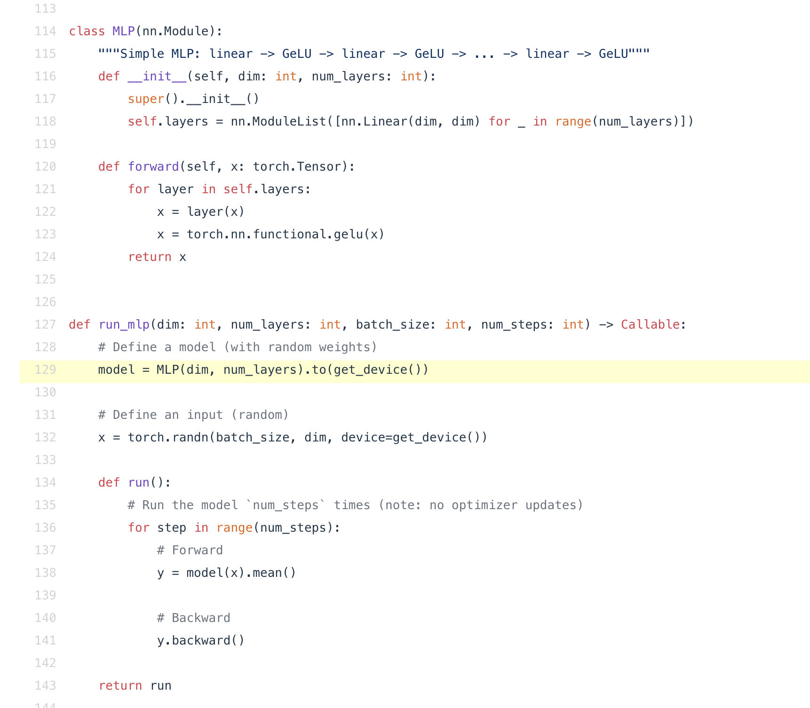

**英文**: I'm going to define an MLP model and we'll sort of I'll show you that in a moment here. And then I'll define a random Gaussian input and then I'll run it for five steps in that last case where I compute some forward and then I compute it backwards and I return sort of the result, which is just the mean of the output of my MLP. There's not even losses. It's so simple. It's just you run the MLP forward and I just average pool at the end. And then the MLP is just kind of the simplest thing you can also imagine here. It's just a bunch of linear layers stacked on top of each other, which is this bit. And then, you know, I've got a GELU in between. So this is just GELU, linear, linear, GELU, so on and so forth. Everything is nice and square.

**中文**: 我将定义一个 MLP（多层感知机）模型，稍后就会向大家展示具体代码。

接着，我会生成一个随机的高斯分布输入数据。然后，在之前的设定下运行 5 个步骤：每个步骤先执行前向传播，再执行反向传播。最后返回结果，这里的结果仅仅是 MLP 输出的均值。

甚至没有涉及任何损失函数（losses），非常简单：就是运行 MLP 的前向传播，然后在末尾做一个平均池化（average pool）。

至于这个 MLP 本身，也是你能想象到的最简结构：它仅仅是一堆线性层（Linear Layers）的堆叠，具体就是这段代码所示。在线性层之间，我插入了 GELU 激活函数。所以整体结构就是：GELU、线性层、线性层、GELU……以此类推。所有的维度都设计得整整齐齐（nice and square）。

**英文**: So hopefully this is a very simple MLP that you all feel pretty comfortable with. And then let's go back. Yes. Oh, sorry. I want to go back up to here. OK, good. And so now I have this, you know, MLP code that I want to run. And now I'm going to do two things. I'm going to benchmark. So I'm going to do some timings.

**中文**: 希望大家对这个非常简单的 MLP 模型已经感到相当熟悉了。

现在让我们往回看……啊，抱歉，我想回到这里。好，没问题。

现在我有了这段想要运行的 MLP 代码。接下来，我将做两件事：首先，我要进行基准测试（benchmark），也就是测量一些时间数据（timings）。

**英文**: So I want to know how long does this function take to run? And then I'll do profiling, which is to go inside the function and ask,. you know, where am I spending all of my time? So let's start with benchmarking. Right. So benchmarking is just the measurement of walk, walk time of performing these operations. And I'm only looking for the end to end execution time of, in this case, my MLP function. And, you know, there are some subtleties to this, like you're sitting there and you're like, why am I being told how to invoke? I don't know the time it function. But you do have to be a little bit careful about how you measure times. And I think, you know, if you're not paying attention, you will run into these pitfalls when you do assignment to. And so what are we doing this for? We're going to compare implementations later. We're going to compare our Triton to our handwritten C++ to PyTorch's implementation and Torch compile.

**中文**: 所以我想知道运行这个函数需要多长时间？

接着，我将进行性能剖析（profiling），也就是深入函数内部，分析时间主要消耗在哪里。

让我们先从基准测试（benchmarking）开始。基准测试本质上就是测量执行这些操作所需的实际运行时间（wall-clock time）。在这里，我关注的仅仅是我的 MLP 函数的端到端执行时间。

这其中其实有一些微妙之处（subtleties）。你可能会想：“为什么要教我如何调用计时函数？难道我不知道怎么测时间吗？”但事实上，在测量时间时你必须非常小心。如果你不注意，在做“作业二”（assignment two）时很可能会掉进这些陷阱（pitfalls）。

那么我们做这些是为了什么呢？是为了稍后对比不同的实现方案：我们将对比 Triton 实现、手写 C++ 实现、PyTorch 原生实现以及 Torch Compile 的性能。

**英文**: And we want to know, was it worth it to write that CUDA kernel?. And we'd also like to understand when I make my matrix multiplies bigger, how much slower does it get? Right. So we'd like to do some empirical benchmarking of those. So throughout this lecture, I'm going to be using this benchmark function. And that's going to be sort of a wrapper function. I'll step through it. Benchmark is going to do the following things, right. It's going to have a function that I want to benchmark, which is run. And then I'm going to do some number of warm up iterations. And then I'll do some number of trials.

**中文**: 我们想要知道：编写那个 CUDA 核函数（CUDA kernel）究竟值不值得？

同时，我们也希望了解：当我的矩阵乘法规模变大时，运行速度会变慢多少？

因此，我们需要对这些情况进行一些实证基准测试（empirical benchmarking）。

在本讲座中，我将一直使用这个 benchmark 函数。它本质上是一个包装函数（wrapper function）。让我逐步讲解一下：

benchmark 函数将执行以下操作：
接收一个我想要测试的目标函数，这里称为 run。
执行若干次预热迭代（warm-up iterations），以消除初始运行时的开销（如缓存未命中等）。
接着执行若干次正式试验（trials），用于采集实际的性能数据。

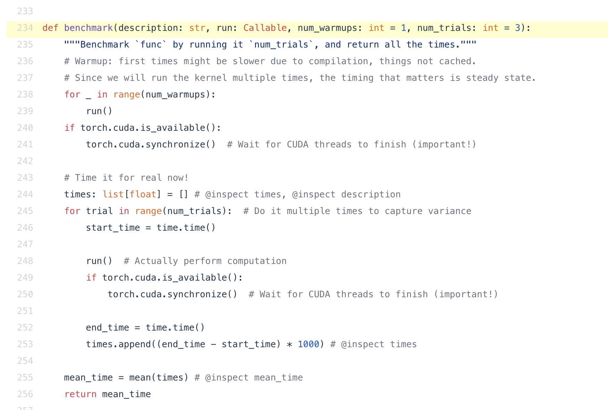

**英文**: Right. And you might wonder, OK, so like, what's this warm up thing that we're doing here? Well, one thing that's really important is, you know, when you do when you first run your PyTorch code and let's say dispatches something to the GPU, it might look very fast and transparent to you. But that very first time something is executed in the background,. machine code is being compiled. You know, that code instruction might be being sent to the GPU. There's all sorts of things that happen to sort of initialize your code. And so you always want to do some warm up iteration to make sure that you're not measuring sort of the startup speed. Instead, you want to measure kind of the steady state speed. Right. If you're running thousands and thousands of iterations, you know, what you're interested in is that part, not necessarily, you know, how fast can you do on the fly compilation of your of your CUDA code. Right. So that's why we have warm up and you should always have a bit of warm up. And then another thing that's really important. And I'll get to this once we get to the profiler is you want to call this thing called Torch CUDA Synchronize. Like, what is that? Well, the GPU and the CPU are basically two independent compute units in your in your computer. Right. And they can basically run kind of independently. And so the execution model is going to be this Python code that I have here. This lives on the CPU.

**中文**: 没错。你可能会想：“好吧，那我们在这里做的预热（warm-up）到底是什么？”

有一点非常关键：当你第一次运行 PyTorch 代码（比如将任务分发到 GPU）时，它看起来可能非常快且透明。但实际上，在首次执行的背后，系统正在进行大量的初始化工作：
机器码正在被编译；
代码指令可能正在被发送到 GPU；
还有各种其他用于初始化代码的操作。

因此，你总是需要执行一些预热迭代，以确保你测量的不是启动速度，而是稳态速度（steady state speed）。

如果你要运行成千上万次迭代，你真正关心的是那个稳态部分的性能，而不是你的 CUDA 代码进行即时编译（on-the-fly compilation）有多快。这就是为什么我们需要预热，而且你应该始终保留一定的预热步骤。

另外还有一件非常重要的事情（稍后讲到性能剖析器 profiler 时我会详细展开）：你需要调用一个名为 torch.cuda.synchronize() 的函数。

这是什么意思呢？
简单来说，GPU 和 CPU 基本上是你计算机中两个独立的计算单元，它们可以大致独立地运行。
这里的执行模型是这样的：我这里的这段 Python 代码是运行在 CPU 上的。

**英文**: Right. And when I run something, it's going to dispatch a bunch of CUDA kernels right to the GPU. It says, please run these things for me. Right. And the GPU will go off and execute those things. And the CPU will actually go on and keep running. Right. It doesn't wait for those CUDA executions to stop. And so that's great for for writing high performance code. But you should hopefully see the immediate problem if you want to do benchmarking.

**中文**: 没错。当我运行某段代码时，它会向 GPU 分发（dispatch）一堆 CUDA 核函数，相当于说：“请帮我执行这些任务。”

随后，GPU 会接手去执行这些任务，而 CPU 则会继续向下运行后续代码，它不会等待那些 CUDA 任务执行完毕。

这种机制对于编写高性能代码来说非常棒（因为它实现了异步并行）。但是，如果你想要进行基准测试（benchmarking），你应该能立刻看出这里存在的问题：如果 CPU 不等待 GPU 完成就继续计时，那么你测量的时间将是不准确的，因为它没有包含 GPU 实际执行任务所花费的时间。

**英文**: Right. If you're benchmarking and you've got this model where the GPU runs off in the side and your CPU is doing something different, you're actually not measuring the GPU execution time. Right. So Torch CUDA Synchronize basically says, all right, let's make sure that the GPU and CPU are in the same state and there's sort of no cued things running and that we're. we're kind of at the same point in terms of the code that's being executed. And now, so the GPU and CPU are kind of in the same state and I'm going to time it for real. Right. And I'm going to time something for for some number of times and I'm going to run the computation, which in this case is the is the sleep command. I'm going to do it three times. And since I'm trying to sleep for for 50 milliseconds, that's the time that I'm going to kind of get at the end.

**中文**: 没错。如果你在进行基准测试，而系统处于这种“GPU 在一旁运行，CPU 在做其他事情”的模式下，那么你实际上并没有测量到 GPU 的执行时间。

因此，torch.cuda.synchronize() 的作用 basically 就是：确保 GPU 和 CPU 处于同步状态。它会等待所有排队的任务执行完毕，确保两者在代码执行进度上达到同一点。

一旦 GPU 和 CPU 同步到了同一状态，我就可以开始真实地计时了。

接下来，我会对某个操作进行多次计时。在这个例子中，运行的计算是一个 sleep（休眠）命令。我会执行三次，每次休眠 50 毫秒，那么最终测得的时间大约就是 50 毫秒（或者是三次的总和，取决于具体的计时逻辑，但核心意图是验证计时的准确性）。

**英文**: Right. So I do time that time three times. And of course, here, right, I'm also calling Torch CUDA Synchronize at the end of run to make sure that the GPU and CPU states are the same. So right. So if the CPU is running ahead, it's going to wait for the GPU execution to actually finish here and vice versa. And so now I sort of finished and then I'm going to average because, you know, each single measurement might be fluctuating because of things like thermal. properties of the GPU. And so you want to take multiple replicates, take them in and return that. That's our benchmarking code. Right. Very simple. But remember kind of the two important pieces here. Right. Always do a warm up. Make sure to call CUDA Synchronize. If you do those very simple, if you forget to do those, you'll get pretty crazy numbers like you'll get that your big matrix. multiply finished instantly, which is definitely not true. Right. OK, so now we can do some benchmarking of matrix multiplies. I'm going to walk through some of these.

**中文**: 没错，所以我执行了三次计时。当然，在这里，我在 run 函数结束时也调用了 torch.cuda.synchronize()，以确保 GPU 和 CPU 的状态保持一致。

这意味着：如果 CPU 跑得太快（领先了），它会在这里等待 GPU 执行完毕；反之亦然（确保双方同步）。

同步完成后，我会对结果取平均值。这是因为单次测量可能会因为各种因素（比如 GPU 的热特性、温度波动等）而产生抖动。因此，我们需要进行多次重复实验（replicates），计算它们的平均值并返回。这就是我们的基准测试代码。

非常简单，但请记住这里有两个关键要点：
始终进行预热（Warm-up）。
务必调用 cuda.synchronize()。

如果你忘记了这两个简单的步骤，你会得到非常荒谬的数据。例如，你可能会发现巨大的矩阵乘法瞬间就完成了，这显然是不可能的。

好了，现在我们可以开始对矩阵乘法进行一些基准测试了。我将逐步演示其中的一些例子。

**英文**: They're just putting numbers to things that we already know. But I want to just walk through it and make sure we're on the same page. Right. So I ran this on the on the class H100. I have GPU. So I'm going to do matrix multiplies over over these sizes. And then I'm going to go and collect a whole bunch of matrix multiply timings for each of these dimensions, stepping through kind of this benchmark result. And so we kind of see, you know, as we expect, right, super linear scaling of our runtimes as we increase the matrix size, of course, at the smallest sizes, like 1024 and 2048, we actually see that the times don't grow at all because there's constant factor overhead in just doing these matrix multiplies. Like these numbers have to get shipped from the CPU to the GPU. You know, there's overhead and like launching the kernel.

**中文**: 这些测试只是为我们已知的现象赋予具体的数值。但我还是想带大家过一遍，确保我们的理解是一致的。

我是在班级的 H100 GPU 上运行这些测试的。我将针对一系列不同的矩阵尺寸执行矩阵乘法，然后收集每个尺寸对应的耗时数据，逐步分析这些基准测试结果。

正如我们预期的那样，随着矩阵尺寸的增大，运行时间呈现出超线性（super-linear）的增长趋势（因为矩阵乘法的计算复杂度通常是 O(N^3)）。

当然，在最小的尺寸（比如 1024 和 2048）下，我们会发现时间几乎没有增长。这是因为在执行这些矩阵乘法时存在一个固定的常数开销（constant factor overhead）。
数据必须从 CPU 传输到 GPU；
还有启动核函数（launching the kernel）的开销。

在这些小尺寸情况下，这些固定开销占据了主导地位，掩盖了计算本身随尺寸增长带来的时间变化。

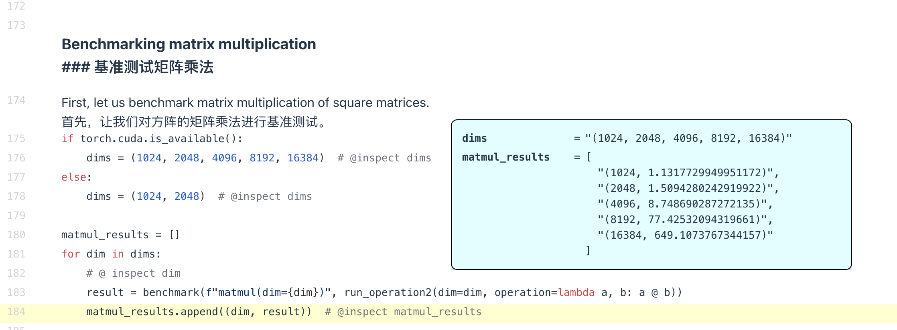

**英文**: And so it's not the case that, you know, it's super linear all the way to zero. But once the matrices get big enough, we see exactly the kind of scaling that we expect to see with our matrix multiplies. Right. OK. So hopefully straightforward. Now, let's try to benchmark our MLP. So what are we going to do? We're going to make our MLP bigger. We're going to have 256 dimensions. We're going to have four layers back size of 256 take two steps. And so what's the time that it takes to do that? Well, it's going to take six point two seconds to do that. And now I could do some basic things. I can scale the number of steps from two to five, and I can benchmark all those. And I will get two, three, four, and then five steps. And unlike in the in the matrix multiply case, right, if I'm scaling the number of steps, the number of forward and backward passes. on my MLP, right, what do I expect the runtime to behave like? Well, I expect sort of linear scaling. Right. And that's kind of what we see. There's about five seconds per MLP execution. And we see it's about n times five for the runtime of kind of the end end object here. Right.

**中文**: 所以，超线性增长的趋势并不会一直延续到零（小尺寸）。但是，一旦矩阵足够大，我们就会看到矩阵乘法所预期的那种缩放比例。

好了，希望这部分很直观。现在，让我们尝试对我们的 MLP（多层感知机） 进行基准测试。

我们要怎么做呢？我们将构建一个更大的 MLP：
维度设为 256；
包含 4 个层；
执行 2 个步骤（即前向和反向传播的轮数）。

那么，完成这些需要多少时间呢？结果显示需要 6.2 秒。

接下来，我可以做一些基本的调整。比如，将步数（steps）从 2 增加到 5，并对所有这些情况进行基准测试。我会分别测试 2、3、4 和 5 个步骤的情况。

与之前的矩阵乘法案例不同（那里是改变矩阵大小），这里我改变的是 MLP 的执行步数（即前向和反向传播的次数）。那么，我预期运行时间会如何表现呢？

我预期会呈现线性缩放（linear scaling）。

这也正是我们观察到的结果：每次执行 MLP 大约需要 5 秒。因此，对于 N 次执行的总运行时间，大约就是 N X 5 秒。

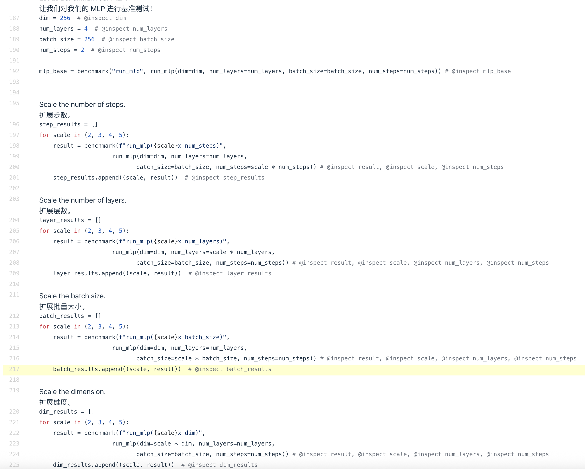

**英文**: Let me see if I can reset the thing that's being monitored here. Oh, no, I can't. OK, I'm going to zoom out a little bit. Sorry about that. OK, now we can also scale the number of layers from two, three, four to five. And what does that give us? Well, it gives us, you know, increasing run times once again, linear in the number of layers. Right. This time, once again, one layer takes about five seconds, a little bit less than that. And so we get about four times, actually four times the number of layers. and linear scaling sort of shows up again.

**中文**: 让我看看能不能重置一下这里被监控的内容……哦，不行，重置不了。好吧，我把视图缩小一点。抱歉刚才那样。

好了，现在我们可以将层数从 2 层、3 层、4 层扩展到 5 层。这会带来什么结果呢？

结果是：运行时间再次随着层数的增加而线性增长。

这一次，每一层大约耗时 5 秒（或者略少一点）。因此，总运行时间大致是层数的四倍（对应之前的基准），线性缩放的规律再次显现。

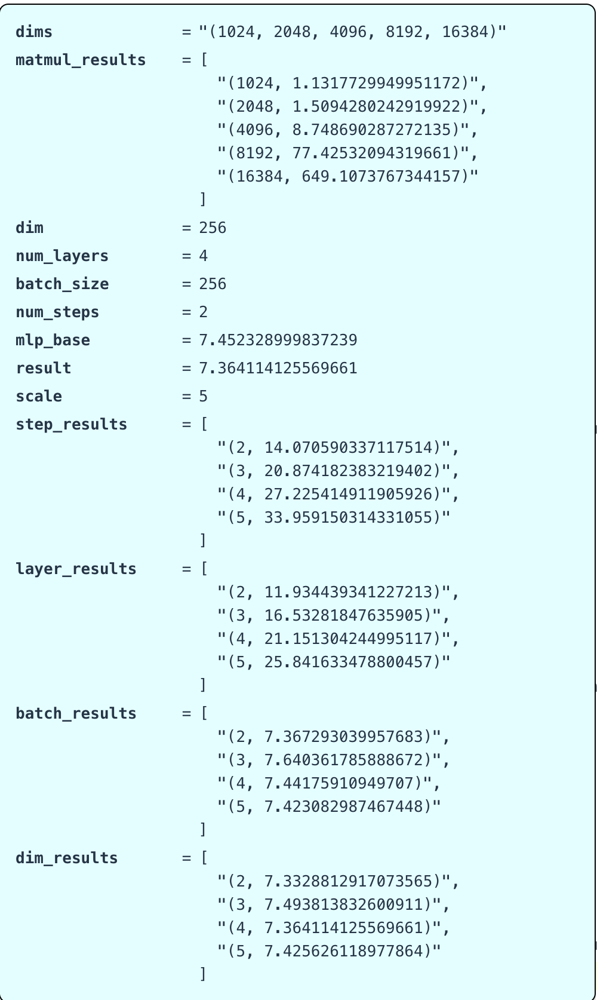

**英文**: Unsurprising. Right. So both steps and layers obviously have linear relationships with the runtime. And that is exactly kind of what we end up seeing at the end here. I'm going to skip the batch size thing, because this is getting a little bit unwieldy in terms of the amount of things that are being tracked here. OK. All right. So that's the end of this benchmarking bit. We can kind of make this nice function that that does a little bit of warm up, this kuda synchronize, and we can measure the runtime of anything that we want. And this is good.

**中文**: 这并不令人意外。显然，步数（steps）和层数（layers）都与运行时间呈线性关系，这也正是我们最终观察到的结果。

我将跳过关于批量大小（batch size）的部分，因为目前需要追踪的变量已经有点过于繁杂了。

好了，基准测试部分就到此结束。我们可以编写一个实用的函数，它包含预热（warm-up）和 cuda.synchronize() 步骤，从而能够测量任何我们想要测试的代码的运行时间。这样就很完善了。

**英文**: And you should do this all the time in your code. You can measure how long it takes for your new fancy architecture to run. But then I think if you want to fix some problems, benchmarking is a very coarse grained tool. It tells you that your code is slow, but it doesn't tell you where the time is being spent. And so what we would like to do is instead do profiling. And so this is going to be a much more fine grained object. that we're going to want to do. And so profiling is really nice because it not only helps you see where the time is being spent, which functions. But when you look at what you're calling, usually you interact with the PyTorch interface, right, like the parts of PyTorch that you call. But beneath PyTorch, there's this whole universe of kuda stuff that's being called.

**中文**: 你应该在代码中始终进行这样的测量。你可以测算你那个新颖的架构运行需要多长时间。

但是，如果你想解决性能问题，基准测试（benchmarking）只是一个非常粗粒度的工具。它只能告诉你“代码运行很慢”，却无法告诉你时间具体消耗在哪里。

因此，我们真正需要做的是性能剖析（profiling）。这将是一个更细粒度的操作。

性能剖析非常好用，因为它不仅能帮你定位时间消耗在哪些函数上，还能揭示更深层的细节：
通常你只与 PyTorch 接口交互（即你调用的那些 PyTorch 部分），但在 PyTorch 之下，其实还有一个庞大的 CUDA 底层世界正在被调用。

**英文**: And when you run a profiler, you can actually see all the way to the low level calls what is actually being called. And so you can get a much nicer intuition for how the program is actually being executed on the hardware. And so we'll step through profiling a few simple functions and then get a little bit of intuition about what is happening. And so one of the things that is nice is that if you want basic profiling, PyTorch has a very nice kind of built in profiler that you can use. And this will allow you to not leave the Python PyTorch world and get some fairly reasonable looking outputs. And so I've profiled some functions here and you can kind of see the output of this as well. And so I've taken the sleep example from before. And here is the sleep function. And when we profile the sleep function, the profile function looks something like this. You know, I have a warm up again, I have Torch kuda synchronize, and then I call the profiler and I'm tracking both CPU and the GPU times.

**中文**: 当你运行性能剖析器（profiler）时，你实际上可以一直追踪到底层调用，看清究竟调用了什么。这能让你对程序在硬件上的实际执行方式形成更直观的认知。

接下来，我们将逐步剖析几个简单的函数，从而建立一些直觉。

值得庆幸的是，如果你只需要基础的剖析功能，PyTorch 内置了一个非常好用的剖析器。它让你无需离开 Python/PyTorch 环境，就能获得相当清晰合理的输出结果。

我在这里已经对一些函数进行了剖析，大家也可以看到相应的输出。我沿用了
- 之前的 sleep 示例：
- 这里是 sleep 函数。

当我们对它进行剖析时，剖析函数的代码结构大致如下：

1.再次进行预热（warm-up）；
2.调用 torch.cuda.synchronize()；
3.启动剖析器，同时追踪 CPU 和 GPU 的时间消耗。

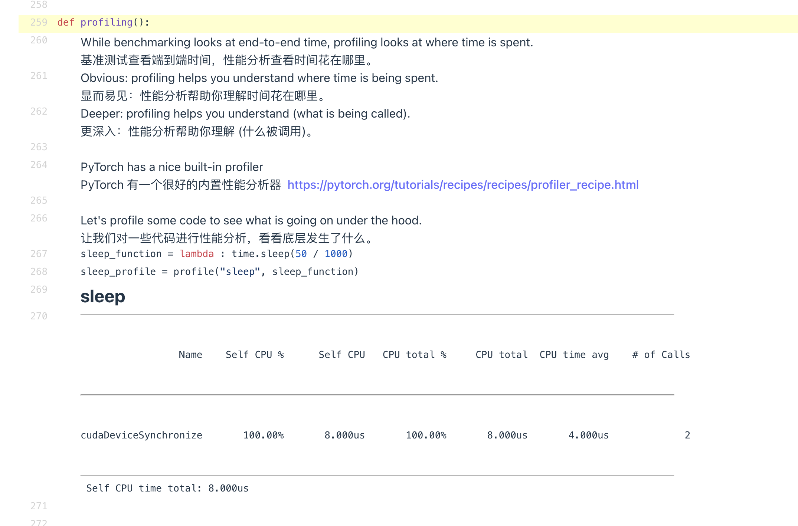

**英文**: And then I run something and then I synchronize again and I print out. the average table across all the time. OK, so I go back now. So now I'm going to profile the sleep function. And if we look at what's happening, what happens here? Well, 100 percent of the time is being spent on something called kuda device synchronize because there's no GPU work being done. This is just kind of a no up. You know, it's kind of a silly thing to be profiling. And so now let's look at something kind of nontrivial. Right. So let's look at this basic operation here of adding to matrices.

**中文**: 然后我运行一段代码，再次进行同步，最后打印出平均耗时统计表。

好，现在让我们回来看一看。接下来我要对 sleep 函数进行剖析。

如果我们观察运行情况，会发生什么呢？
结果是：100% 的时间都消耗在了一个叫 cudaDeviceSynchronize 的操作上。这是因为实际上并没有执行任何 GPU 计算工作，这纯粹是一个“空操作”（no-op）。拿它来剖析确实有点多此一举。

那么，现在让我们来看一些更有实际意义的例子。
比如，我们来剖析这个基本操作：两个矩阵相加。

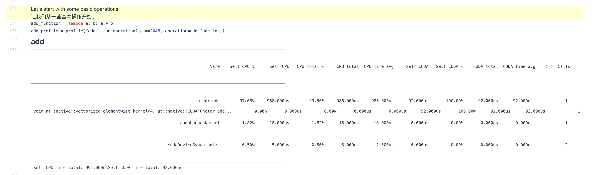

**英文**: Right. So I defined an add function that takes an A and a B and adds them together. And this is a helper function that instantiates two random Gaussian matrices and then invokes whatever is in the operation argument. So this is adding to 20, 48 size matrices together. OK, so now I'm going to profile this and I'm going to call the profiler and I'll get back something that looks like this block over here. Right. So this is what I get back. And I'm going to have to zoom back out because this is not going to be all right. OK, is this visible from the back? Can someone give me a thumbs up if it's visible from the back and OK, good, good, good. Or thumbs down if it's not.

**中文**: 好的，我定义了一个 add 函数，它接收两个参数 A 和 B 并将它们相加。

这里还有一个辅助函数，它会实例化两个随机高斯矩阵，然后调用作为参数传入的那个操作（operation）。在这个例子中，我们要执行的是两个 2048×2048 大小矩阵的相加操作。

接下来，我将对这个操作进行剖析。调用剖析器后，我会得到类似屏幕上这个区块的输出结果。

这就是返回的结果。不过我需要把视图缩小（zoom out）一些，因为当前显示不全。

（询问观众）后面的同学能看清楚吗？
如果看得清，请竖起大拇指；如果看不清，请竖起大拇指朝下。
好，很好，很好……

**英文**: All right. So when we when we call the ad function in Python, right, this is kind of all that we interact with this ad function A plus B. Right. That's all we think about. But actually underneath here, the underneath the iceberg, so to speak, there's a lot more that happens. So this gets dispatched to the GPU. And first, there's this thing called A10, which is the C sort of interface for PyTorch. And so this wrapper gets called and it says, OK, I'm going to add some numbers. Right. This is what's being called. That's the outer wrapper. And then that dispatches to a particular kernel called vectorized element wise kernel for comma native CUDA functor ad dot dot dot dot dot dot. Right. And this is the thing that's actually doing the adding. And then there's this also other thing called CUDA launch kernel that's taking some time. And this is actually the CPU is taking the command and sending it over to the GPU. That's the kernel launch. And that takes some time. And then finally, the CUDA device synchronizes. We're waiting for the GPU to finish and send things back to us.

**中文**: 好的。当我们在 Python 中调用 add 函数时（即执行 A + B），这似乎就是我们要交互的全部内容，也是我们要考虑的全部逻辑。

但实际上，在这之下——可以说是冰山之下——发生了更多的事情：

分发到 GPU：操作首先被分发到了 GPU。
ATen 接口：首先出现的是 ATen，这是 PyTorch 的 C++ 接口层。这个外层包装器（wrapper）被调用，它的任务很简单：“我要执行一些数值相加操作”。这就是最外层的调用。
核心 Kernel：接着，它分发到了一个特定的 Kernel（核函数），名为 vectorized_elementwise_kernel（对应于 native_cuda_functor_add...）。这才是真正执行加法运算的部分。
Kernel 启动开销：此外，还有一个名为 cudaLaunchKernel 的操作也消耗了时间。这实际上是 CPU 接收指令并将其发送给 GPU 的过程，也就是所谓的“核函数启动”（kernel launch），这一步是需要耗时的。
同步等待：最后，执行 cudaDeviceSynchronize。这意味着我们在等待 GPU 完成计算并将结果传回给 CPU。

**英文**: And that also takes some time. The mere act of having a synchronization barrier is going to cost us some time. And so we basically have the time total in the end here, one point four milliseconds on the CPU and 17 microseconds on the CUDA. Right. So it is really fast on the GPU, slower on the CPU. And if we're looking at the CPU time that's being spent, which is the self CPU time, we see that kind of the C plus plus interface or the C interface is actually the thing that's costing us a whole bunch of CPU time. And they're sort of overhead to doing anything where we're sending stuff over to the GPU. That's the ad function. And we see what's happening under the hood. Same story here. If I want to do a matrix multiply. So I'm doing A multiplied by B. So this is a matrix multiply of A and B. I'm doing 2048 matrices once again. And then I do profiling. Now, this time I see A10 mapmul. So this is saying like this is the lower level interface to do matrix multiplies. And this is going to dispatch the cut lists, which is Nvidia's sort of high performance matrix multiply CUDA library. And then it's dispatching to a very particular cut list kernel, which is going to have some tile size. The names are truncated here.

**中文**: 这一步同样需要消耗时间。仅仅是设置一个同步屏障（synchronization barrier）这一行为本身，就会带来一定的开销。

因此，我们最终看到的总耗时数据是：
CPU 端：1.4 毫秒
CUDA (GPU) 端：17 微秒

可以看出，在 GPU 上执行非常快，而在 CPU 上则相对较慢。

如果我们观察所消耗的 CPU 时间（即 self CPU time），会发现 C++ 接口（或 C 接口）实际上占用了大量的 CPU 时间。这些是将任务发送到 GPU 时产生的固有开销。这就是 add 函数内部发生的实际情况——我们看到了“引擎盖下”的运作机制。

同样的情况也发生在矩阵乘法中：

- 如果我执行矩阵乘法（A times B），即对两个 2048 维的矩阵再次进行运算并剖析。
- 这次我会看到 aten::mm（ATen 矩阵乘法）。这表明它是执行矩阵乘法的底层接口。
- 它会分发调用 cuBLAS，这是 NVIDIA 提供的高性能矩阵乘法 CUDA 库。
- 接着，它会进一步分发到一个非常具体的 cuBLAS Kernel，该 Kernel 会使用特定的 瓦片大小（tile size）进行计算。（注：由于显示空间限制，这里的名称被截断了。）

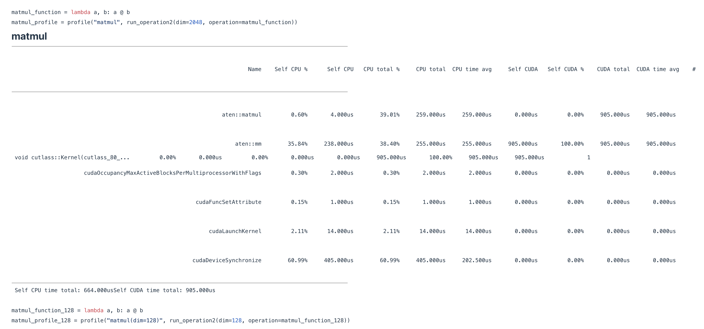

**英文**: I'll show you a more detailed version in a minute. This is basically pointing towards a very particular set of like tile sizes and the number of blocks and so on. And so this thing is parameterized and that's actually doing the matrix multiply. And once again, we see the same two things at the bottom here, the kernel launch and the synchronization of CUDA devices. And you can sort of see once again, the CPU time, CUDA time split. And we're spending way more time in CUDA because, you know, matrix multiplies do take more time than just adding two vectors. OK, any questions so far? I can I can pause for a moment here. I think I've just been going sort of very quickly and on my own through the profiler. If anyone has questions, I can I can stop for a moment. If not, I can keep going.

**中文**: 我稍后会展示一个更详细的版本。这里基本上指向了一组非常具体的参数，比如瓦片大小（tile sizes）、块数量（number of blocks）等等。这个核函数正是通过这些参数化配置来实际执行矩阵乘法的。

再次观察底部，我们会看到相同的两个环节：核函数启动（kernel launch）和 CUDA 设备同步（synchronization of CUDA devices）。

大家也可以再次看到 CPU 时间 与 CUDA 时间 的分配情况。
这一次，我们在 CUDA（GPU）上花费的时间要多得多，这是合理的，因为矩阵乘法所耗费的计算时间确实远多于简单的向量相加。

到目前为止，大家有什么问题吗？
我可以在这里暂停一下。我觉得刚才自己讲得有点快，一直在独自快速过一遍剖析器的内容。
如果有人有问题，我现在就可以停下来解答；如果没有的话，我就继续往下讲了。

**英文**: OK, oh, yes. In this case, our CUDA time is greater than our CPU time, but we did have a barrier that said to for the CPU to be synchronized. And so by that, shouldn't the CPU time be the same amount of time? No, I'm counting the time that this is used. Yeah, I don't think it's counting the time that this is vital. Cool. Oh, yes, sorry. There's too much to think of. Is there any particular reason why like when we switch from adding the matmul to the CPU time went down? Is there a reason why when we go from adding to matmul, the CPU time goes down? That I am not sure, to be entirely honest. Yes. Is there overhead in the profiler that can distort things compared to running it in the real world? Yes, there is overhead in the profiler. Like the barriers will do that. I'll show you a more advanced profiler from Nvidia and you can add things like annotations that will also slightly distort the timings. But but not by much. The really large scale things that you see aren't going to be really distorted by the profiler. So if you're looking at like micro timings, yes, probably. But a lot of the things that that we care about in the class know. Yes. Just to make sure I'm interpreting this correctly. So is that for the ad base?. Is the IDA for some CPU being utilized over the time period that it's the millisecond time period? That's right.

**中文**: 好的，哦，是的。

**学生提问：** 在这种情况下，我们的 CUDA 时间大于 CPU 时间，但我们确实设置了一个屏障（barrier），要求 CPU 进行同步。既然如此，CPU 时间难道不应该和 CUDA 时间一样长吗？

**讲师回答：** 不，这里统计的是该函数**被占用**的时间（active time）。
**学生追问：** 是啊，但我认为它并没有计算等待（wait）的时间。
**讲师确认：** 没错。

**学生提问：** 哦，抱歉，要思考的事情太多了。我想问一个具体的问题：为什么当我们从加法（add）切换到矩阵乘法（matmul）时，CPU 时间反而下降了？这有什么原因吗？

**讲师回答：** 老实说，我不太确定具体原因。

**学生提问：** 剖析器（profiler）本身是否存在开销，从而导致结果与实际运行时的情况产生偏差？

**讲师回答：** 是的，剖析器确实存在开销。就像刚才提到的同步屏障就会造成这种情况。稍后我会展示一个来自 NVIDIA 的高级剖析器，你可以在其中添加注释（annotations），这也可能会轻微地扭曲时间数据，但影响不大。你所看到的那些大规模的时间消耗并不会被剖析器严重扭曲。所以，如果你关注的是**微观层面的计时**（micro timings），那确实可能会有偏差；但我们课程中关注的许多主要问题不会受此影响。

**学生提问：** 是的，只是想确认我的理解是否正确。所以这是针对 `aten::add` 的吗？这里的 ID（或数据）是否表示在毫秒级的时间段内，某个 CPU 核心一直被占用？

**讲师回答：** 没错。

**英文**: Yeah. So this is the percentage of time as you can see that the actual millisecond time that A10 ad was actually executing in some capacity on the CPU. I don't think the CPU utilization is the percent of what the CPU is doing. Yeah, that's right. This is the time the CPU is active, not percentage utilization. If that's yeah. So this is not like the total amount of CPU flops or something. This is the total percentage of time that the CPU is doing something. Yes. OK, cool. All right. Here's another example of a matmul. So this is a different dimensionality. Right. So this is a multiplying 128 dimensional matrix here. So 128 by 128, much smaller. And you'll actually see that now it's actually directly executing sort of this different command. It's executing XMM, GMM. GMM is a matrix multiply type. And this is float 32 float 32.

**中文**: 是的。所以这个百分比代表的是，正如你所看到的，A10广告实际在 CPU 上以某种形式执行所花费的时间（以毫秒计）。我觉得这个 CPU 利用率并不是指 CPU 正在做什么的百分比。没错，就是这样。这指的是 CPU 处于活跃状态的时间，而不是百分比利用率。没错。所以这并不是指 CPU 的总浮点运算能力（FLOPs）之类的东西。这是指 CPU 在忙于处理任务的总时间百分比。对，好的，明白了。

好，这里还有一个矩阵乘法（matmul）的例子。所以这是个不同维度的矩阵，对吧？这是一个 128 维度的矩阵相乘，也就是 128 乘以 128，要小得多。你会看到，现在它实际上是在直接执行一个不同的指令，它在执行 XMM, GMM。GMM 是一种矩阵乘法类型。这是单精度浮点数（float 32）对单精度浮点数的运算。

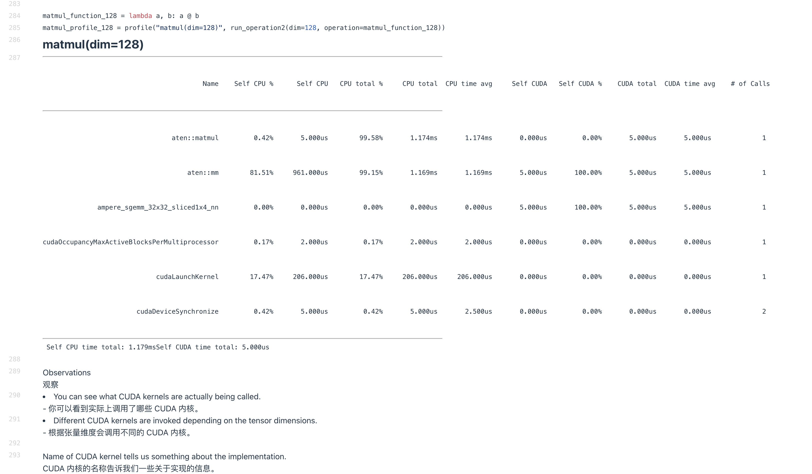

**英文**: You can kind of see from the naming of this kernel what's actually happening here, which is that this is a tiled matrix multiply of some kind. And it's not sort of going through cut lists. It's executing this particular command directly. And so for a small matrix multiply, you see that is dispatching to a different kernel now. You can kind of see kind of the complexity of matrix multiply. When we're operating at this high level abstraction, we just think of matrix multiply as a single thing. Right. We call like A at B and we're done. But underneath the hood, depending on the dimensionality that you have, depending on the hardware that you have, it will actually dispatch to very different matrix multiply sort of primitives under the hood. And that will actually manifest in very, very different sort of performance characteristics.

**中文**: 从这个内核（kernel）的命名方式，你就能大概看出这里实际发生的事情，即这是一种某种形式的分块矩阵乘法（tiled matrix multiply）。它并没有通过像 cuBLAS 这样的库函数间接调用，而是直接执行了这个特定的指令。

因此，对于小规模的矩阵乘法，你会发现它现在会分发到一个不同的内核去执行。你也能从中窥见矩阵乘法运算本身的复杂性。当我们处于像 PyTorch/TensorFlow 这样的高级抽象层面时，我们往往把矩阵乘法看作是一个单一的操作，对吧？我们只要调用 A @ B 就完事了。但在底层，根据你具体的矩阵维度以及你所拥有的硬件（比如 CPU 或不同架构的 GPU），系统实际上会分发到非常不同的、底层的矩阵乘法原语（primitives）去执行。而这最终会体现出截然不同的性能特征。

**英文**: And so one fun tip is Torch compile, which I will talk about later, actually has an option to sort of micro benchmark the matrix multiply performance on your hardware. And then it will actually then pick the highest performing matrix multiply subroutines for your model, which in the past I found gives you like 10 percent speed up for free. It's very cool that like optimizing for these things actually gives you free gains out in the real world. OK, so that's another Matmul example. And so the cool thing about the profiler compared to the just the raw benchmarking is we can now kind of see which CUDA kernels are being called. We can see that different sizes of matrices lead to different CUDA kernels. And we see, you know, CUTLESS 80, SIMPTES, SGEM, right, is a is this CUTLESS linear algebra library. And it tells us things like the tile size. So so far, these operations are very boring in a way like matrix multiplies and adds. They're basically one to one.

**中文**: 这里有一个有趣的小技巧：稍后我会讲到的 **Torch Compile** 实际上提供了一个选项，可以对你的硬件上的矩阵乘法性能进行**微基准测试**（micro benchmark）。然后，它会为你的模型自动选择性能最高的矩阵乘法子程序。根据我过去的经验，这能免费带来大约 **10% 的加速**。非常酷的是，针对这些底层细节进行优化，确实能在实际应用中直接获得性能提升。

好了，这是另一个矩阵乘法的例子。

剖析器（profiler）相比于单纯的原始基准测试（raw benchmarking），其妙处在于我们现在可以看到具体调用了哪些 **CUDA 内核**（kernels）。我们可以看到，不同尺寸的矩阵会触发不同的 CUDA 内核。例如，大家看到了 `CUTLASS 80`、`SIMT`、`SGEMM` 等，这里的 `CUTLASS` 是一个线性代数库。它还会告诉我们诸如**瓦片大小**（tile size）这样的信息。

到目前为止，这些操作在某种程度上显得比较“枯燥”，无非就是矩阵乘法和加法，基本上是一一对应的关系。

**英文**: You have, you know, operation on the CPU side. It translates to a GPU operation and it just gets shipped over. Right. So there's just a single operation in all of these that does anything on the GPU. So I want to look at some more complicated operations, two more of these that have sort of more compound behavior. So what I want to do now is I want to do I want to look at this operation called Torch. CDist. And this is computing, you know, for two sets of matrices, the pairwise Euclidean distance between two sets of vectors. Right. So this is going to be a big distance matrix computation between A's and B's that I want. So that's CDist. And so this is obviously a much more complicated operation. If you want to compute Euclidean distances, you're going to need to compute dot products. You're going to need to compute square roots. And we're going to see that once we compute C. Dist. So now here is the is the profiled output of C. Dist. So we see that this Torch Python command does map in the C interface to some sort of lower level C. cDist. So this is A10 C. Dist, which then maps to A10 Euclidean Dist. And then this will decompose into a whole bunch of things like A10 MatMul, A10Pow and then sum. Because these are all primitives that you're going to need in order to actually to compute the Euclidean distances between all of your vectors. And when you for each one of these like matrix multiplies and concatenation and taking the powers, you have a corresponding CUDA command that is being called here. You know, we have GEMM, which we've become familiar with. So this is a matrix multiply. It's taking 78 percent of our compute or our compute time on the GPU. We've got, you know, copies and sort of concatenation of arrays.cDist. So this is A10 C. Dist, which then maps to A10 Euclidean Dist. And then this will decompose into a whole bunch of things like A10 MatMul, A10Pow and then sum. Because these are all primitives that you're going to need in order to actually to compute the Euclidean distances between all of your vectors. And when you for each one of these like matrix multiplies and concatenation and taking the powers, you have a corresponding CUDA command that is being called here. You know, we have GEMM, which we've become familiar with. So this is a matrix multiply. It's taking 78 percent of our compute or our compute time on the GPU. We've got, you know, copies and sort of concatenation of arrays.

**中文**: 大家可以看到，这里有一个在 CPU 端发起的操作，它被转换成了一个 GPU 操作，然后直接下发执行。也就是说，在上述所有例子中，真正在 GPU 上干活的只有一个单一的操作。

因此，我想看一些更复杂的操作，再举两个具有**复合行为**（compound behavior）的例子。

接下来，我想研究一个名为 `torch.cdist` 的操作。这个操作用于计算两组矩阵（或者说两组向量）之间的**成对欧几里得距离**（pairwise Euclidean distance）。换句话说，我要计算的是集合 A 和集合 B 之间的大型距离矩阵。这就是 `cdist` 的功能。

显然，这是一个复杂得多的操作。如果要计算欧几里得距离，你就需要计算**点积**（dot products），还需要计算**平方根**（square roots）。当我们执行 `cdist` 时，就会看到这些步骤。

现在展示的是 `cdist` 的剖析（profiled）输出结果。我们可以看到，这个 Torch 的 Python 命令在 C 接口层面映射到了某种底层的 C 函数 `cDist`。具体来说，这是 `A10 cDist`，它随后又映射到 `A10 Euclidean Dist`。接着，它会分解成一堆更底层的操作，比如 `A10 MatMul`（矩阵乘法）、`A10 Pow`（幂运算）以及 `Sum`（求和）。因为要计算所有向量之间的欧几里得距离，确实需要这些基本原语。

对于其中的每一个步骤——无论是矩阵乘法、数组拼接还是幂运算——这里都有对应的 **CUDA 命令**被调用。

大家已经熟悉了 **GEMM**，这就是一种矩阵乘法。在这里，它占用了我们 GPU **78% 的计算时间**。此外，还有数组的**复制**（copies）和**拼接**（concatenation）等操作。

**英文**: This takes six percent of the execution time. And then this sort of vectorized element wise kernel, which is taking the power, takes five percent of the GPU time and three percent goes to the sum. So now we get this very nice low level breakdown of where, you know, my GPU is spending all of its time. And from this, you know, I can get some sense of where maybe I should spend my time optimizing. You know, maybe I think I can optimize my matrix multiply. That would be great because that's 70 plus percent of the time spent in the GPU. The final example, the final two examples, sorry, that I want to talk about is GeliU and SoftMAC. So these will be our running. Oh, sorry, there's a question. What's the CPU up to while the computation is going on? OK, so I will maybe answer that question in a few minutes because there's a cooler profiler that shows you a much nicer picture.

**中文**: 这部分操作占用了 6% 的执行时间。接着是那个向量化逐元素内核（vectorized element-wise kernel），它负责执行幂运算，占用了 5% 的 GPU 时间；而求和（sum）操作则占用了 3%。

现在，我们就得到了一个非常清晰的底层细分视图，可以看到我的 GPU 时间究竟都花在了哪里。据此，我可以大致判断应该把优化精力投向何处。例如，我可能会想：“也许我可以优化一下矩阵乘法？”那将是非常棒的，因为它占据了 GPU 70% 以上的时间。

我想讨论的最后两个例子是 GELU 和 Softmax。这将是我们接下来的……哦，抱歉，有个问题。

问： “在计算进行时，CPU 在做什么？”

答： 好的，我会在几分钟后回答这个问题，因为接下来我要介绍一个更酷的剖析器（profiler），它能展示出一幅清晰得多的图景。

**英文**: And so I can just speculate here, but I think it'll be better to show that with pictures. OK, so I'm going to talk about now the GeliU and the SoftMAC. So the GeliU is going to be our running example throughout the class. So this is a non-linearity. If you remember, it's the Gaussian error unit, Gaussian error linear unit. And that's going to be a product of a tanh and a exponential, if I remember right. And so we're going to have, you know, all sorts of operations. So we're going to add a and b and then we're going to call GeliU sort of simulating the linear plus nonlinear structure that we might have in our MLP. And so we see once again, basically the same sort of mapping. We see a tanh add corresponding to a plus b.

**中文**: 所以我在这里只能推测一下，但我觉得用图表来展示会更好。

好的，现在我要讲讲 **GELU** 和 **Softmax**。其中，**GELU** 将作为我们整个课程中的**贯穿示例**（running example）。

这是一种**非线性激活函数**。如果大家还记得的话，它的全称是**高斯误差线性单元**（Gaussian Error Linear Unit）。如果我没记错的话，它的计算涉及 **tanh** 和**指数函数**（exponential）的乘积。

因此，我们会看到各种各样的操作。比如，我们先对 $a$ 和 $b$ 进行**加法**运算，然后调用 **GELU**。这模拟了我们在**多层感知机**（MLP）中可能遇到的“线性层 + 非线性激活”的结构。

大家可以看到，这里再次出现了基本上相同的映射关系：我们看到了对应于 $a + b$ 的 **tanh** 和 **add** 操作。

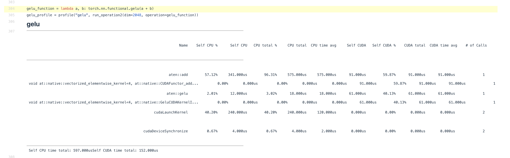

**英文**: And then we have the CUDA equivalent. And then we have actually a GeliU function implemented in CUDA, which is all the way down here. And that takes about 33 percent of the compute. OK, fairly reasonable. And then we have once again the SoftMAC. I won't go through all of these in sort of gory detail since, you know, they all start to look the same after a while. But the thing to really point out that I think is cool is that a lot of these really core primitives like SoftMAC and GeliU, there's just kernels written for them. Right. So it's not like the GPU is executing the basic primitives. There's sort of a fused operator that computes all of this.

**中文**: 然后，我们有对应的 **CUDA** 实现。实际上，这里有一个直接用 CUDA 实现的 **GELU** 函数，就在最底层。它大约占据了 **33%** 的计算量，这个比例相当合理。

接下来是 **Softmax**。我不会再逐一深入剖析这些细节了，因为看多了之后，它们的模式都大同小异。

但我认为真正值得强调、也非常酷的一点是：像 **Softmax** 和 **GELU** 这样许多核心的基本原语，都有专门为它们编写的**内核**（kernels）。

也就是说，GPU 并不是在执行一堆基础的原语操作来拼凑出结果，而是有一个**融合算子**（fused operator）直接一次性计算出所有这些内容。

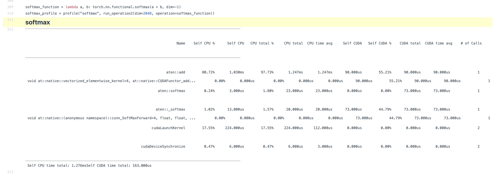

**英文**: So there's no back and forth between CPU and GPU for all of these. OK, I mentioned before that I was going to sort of answer this question of what the CPU was doing. And so let's think about something a little more sophisticated. Right. I had the MLP example that I started with for benchmarking and I would, let's say, like to optimize that MLP, make it run really fast. So how can we do that? Well, ideally, we would sort of profile this in a nice sort of fine grained way. So if we use the torch profiler, this is kind of what we would get. If you remember the MLP, there's, you know, stack linear layers, there's a forward and a backward. And you see roughly, you know, there's this backward thing that's happening. There is a matrix multiply, there's linear and then there's accumulate grad operation for the backward.

**中文**: 所以，对于这些操作，CPU 和 GPU 之间并不需要来回通信。

好的，我之前提到过要回答“CPU 在做什么”这个问题。现在让我们思考一个更复杂的场景。

假设我一开始用来做基准测试的那个 **MLP**（多层感知机）示例，我想要优化它，让它运行得飞快。我们该怎么做呢？

理想情况下，我们需要一种更精细的剖析方式。如果我们使用 **Torch Profiler**，大概会得到这样的结果：

回想一下那个 MLP 的结构：它包含堆叠的**线性层**（linear layers），既有**前向传播**（forward），也有**反向传播**（backward）。

大家可以大致看到，这里正在发生反向传播的过程：其中包含了**矩阵乘法**、**线性变换**，以及反向传播中的**梯度累加**（accumulate grad）操作。

**英文**: And here's the matrix multiply kernel. And then there's only 10 things that can fit here. So I think this this gets cut off at a certain point. But this this is nice. It does tell you that most of the time is being spent in the matmul's. But you do kind of wonder, like, where does all the rest of the time go and why does only 31 percent of my time stay here? And where is the 60 percent here? It's a 10 mm, but there's no corresponding kernel. Right. This is a little bit mysterious. And for something that's very complex module, this is not a very good visualization. And so for that, I think we have to actually get out a real sort of grown up profiler. And you will have to, you know, or we will ask you to look at this thing, which is Nvidia's insight systems. And this is the kind of Nvidia's sort of detailed way of looking at GPU behavior and performance. And so we will actually kind of see exactly what is happening as we run this MLP. So actually in the back, can you see, I don't know, this tiny text over here? Thumbs up. OK. All right. If you can see it, then I'm not going to zoom in. But it does seem small even from here. All right. So basically, if we look here, we see several different things.

**中文**: 这里显示的是**矩阵乘法内核**（matrix multiply kernel）。不过，这里只能容纳大约 10 个条目，所以到了某个点就被截断了。

虽然这个视图还不错，它确实告诉了我们大部分时间都花在了矩阵乘法（matmul）上，但你难免会想：**剩下的时间都去哪了？** 为什么只有 **31%** 的时间花在这里？那 **60%** 的时间又在哪呢？

这里显示耗时 10 毫秒，但却没有对应的内核显示，这有点令人费解。对于一个非常复杂的模块来说，这种可视化效果并不理想。

因此，我们需要拿出一个真正“成年级”的剖析器。你们将需要（或者我们会要求大家去查看）**NVIDIA Nsight Systems**。这是 NVIDIA 提供的一种用于深入观察 GPU 行为和性能的工具。

借助它，我们实际上可以精确地看到运行这个 MLP 时到底发生了什么。

（看向后排）大家能看到这边微小的文字吗？看到的请竖起大拇指。好的。如果你们能看清，我就不放大了。不过即使从这里看，字确实有点小。

好吧，基本上，如果我们看这里，我们会发现几种不同的情况……

**英文**: We see CUDA HW over here and then we see threads. And so this top half, this CUDA part, this is what the GPU is kind of doing. And then in this threads part, we see kind of what the CPU is doing. And I can also pull up the code, I think. Yes. The code here, when I profiled it, I've added a few annotations. OK, this one I zoom in for sure. OK. Excellent. All right.

**中文**: 我们看到这边是 **CUDA 硬件**（CUDA HW），那边是 **线程**（Threads）。

上半部分，也就是这个 **CUDA** 区域，展示的是 **GPU** 正在执行的操作；而在下方的 **Threads** 区域，我们看到的则是 **CPU** 的活动情况。

我想我也可以把代码调出来给大家看看。没错，这就是我在进行性能剖析时所用的代码，我在其中添加了一些**标注**（annotations）。

好的，这部分我一定要放大来看。太棒了。

**英文**: So I've annotated the code with this set of things that says, let's see, NVTX, which basically annotates my code with annotate with markers. So when the profiler comes in here, it will know that this piece of code belongs to a block called define model. And for example, this part that says step range push and range pop, this range here from line 77 to line 55 should be annotated with something that says step underscore step. OK, so I've added all these annotations in my code before calling my profiler. And so let's go back here. So now if we go to this line that says NVTX, we can kind of see define model, which is the thing that I wrapped my model construction call. And then I see step zero, step one, step two, step three, step four, step five. So each step is now nicely annotated in this profiler. And we can kind of see all of the things that the model is doing as we as it goes along. And I'll start on this side.

**中文**: 所以，我用一组 **NVTX** 标记对代码进行了标注。这基本上就是给代码打上了“路标”。

当剖析器运行时，它就能识别出这段代码属于一个名为 `define_model` 的代码块。

例如，这里看到的 `range_push` 和 `range_pop`，意味着从第 77 行到第 55 行（注：此处演讲者可能口误，通常应为从第 55 行到第 77 行）的这个范围，会被标注为 `step_0`（或类似的步骤名称）。

也就是说，在调用剖析器之前，我已经在代码中添加了所有这些标注。

现在让我们回到这个视图。如果我们看标有 **NVTX** 的这一行，就能看到 `define_model`，这就是我包裹模型构建调用的部分。

接着，我看到了 `step_0`, `step_1`, `step_2`, `step_3`, `step_4`, `step_5`。

因此，每一个训练步骤在这个剖析器中都得到了清晰的标注。我们可以清楚地看到模型在运行过程中所执行的所有操作。

接下来，我从这一侧开始讲解。

**英文**: One thing we see is that this piece of code, it doesn't do very much work. It takes only 14 seconds. So actually, most of the time for the profiler is spent on overhead. So the part up until roughly here is, you know, things like just loading the libraries. And that takes a long time. It takes apparently seven point five seconds to just initialize everything. And then on at least on the GPU, at seven point five seconds or so into the program, it starts actually building the model. And you see here on the memory footprint, you know, this is the place where now memory is being sort of allocated. And on the GPU memory, the memory usage starts to grow. Right.

**中文**: 我们注意到，这段代码实际执行的工作量并不大，仅耗时 **14 秒**。

事实上，剖析器记录的大部分时间都消耗在了**系统开销**（overhead）上。

直到大约图示的这个位置之前，主要都是在做一些诸如**加载库文件**之类的事情。这花费了相当长的时间——显然，光是**初始化**所有环境就用了 **7.5 秒**。

然后，至少在 **GPU** 这一侧，程序运行到约 **7.5 秒** 时，才真正开始**构建模型**。

大家可以看到这里的**内存占用**（memory footprint）曲线，正是在这个时间点，内存开始被分配。

**英文**: Now, the model is now constructed at this point. And then step zero is where sort of the action starts to happen. And so you were asking earlier what's happening between the CPU and sort of GPU. And so how the execution model of this works is here is sort of step zero on the CPU. And I'm starting right here. And here's the forward pass. And this is layer zero. So let's just kind of think through what's happening. As I said before, when you first encounter or when you first call a piece of code in PyTorch, it doesn't just directly execute. It will actually do things like, you know, on the fly, compile things. And so this thing like runtime triggered module loading is sort of overhead work that's being done in order to just initialize the layer and the computation and move sort of various bits of code into the GPU. So this takes a long time. And then after this layer zero is done, now, if I look at sort of any slice here, let's sort of zoom in to selection. We'll see that each of these layers is really, really, really quick. And what happens here is when I highlight this layer one over here on the CPU side, notice that that's not where layer one is on the GPU side. Right. So as I said before, the CPU and GPU are kind of two different execution devices. So I start at layer zero. I'm done with layer zero. I start layer one.

**中文**: 现在，模型已经构建完成。接下来的 **Step 0** 才是真正开始“干活”的地方。

之前大家问过，**CPU** 和 **GPU** 之间究竟在发生什么？这个执行模型的工作原理是这样的：

这里显示的是 CPU 上的 **Step 0**，我从这里开始。首先是**前向传播**（forward pass），从 **第 0 层**（Layer 0）开始。

我们来梳理一下正在发生的事情。正如我之前提到的，当你在 PyTorch 中首次调用某段代码时，它并不会直接执行。实际上，它会进行一些**即时编译**（on-the-fly compilation）等工作。

像这种**运行时触发的模块加载**（runtime triggered module loading），本质上是为了初始化层和计算、并将各种代码片段迁移到 GPU 上而必须完成的**开销工作**。因此，这一步耗时较长。

一旦 **第 0 层** 完成之后，如果我们放大查看任意一个时间切片，就会发现后续的每一层运行得都**非常、非常快**。

这里有一个关键点：当我在 CPU 这一侧高亮显示 **第 1 层**（Layer 1）时，请注意，在 GPU 那一侧，**第 1 层** 并不在同一个时间位置。

正如我之前所说，CPU 和 GPU 是两个不同的执行设备。所以流程是这样的：我在 CPU 上启动 **第 0 层**，等 **第 0 层** 完成后，我再启动 **第 1 层**……

**英文**: Now, the CPU is actually just sending all of the sort of CUDA commands, the CUDA kernels. It's launching all the CUDA kernels already to the GPU at this point. Right. So when the CPU is saying I'm doing layer one, what it's actually doing is it's queuing commands into the GPU. It says now run this thing next, run this thing next, run this thing next. Right. And so the CPU is running way ahead of the GPU. And by the time layer one starts executing on the GPU, actually, we're already at layer nine on the CPU. And there's basically a queue that the CPU maintains where it's sending a fixed number of kernel CUDA kernels to the GPU. And so once you hit that queue depth, it's going to sort of stop running ahead.

**中文**: 现在，CPU 实际上只是在向 GPU 发送所有的 **CUDA 命令**（即 **CUDA 内核**）。在这个阶段，它正在将所有 CUDA 内核启动并推送给 GPU。

也就是说，当 CPU 显示它正在处理 **第 1 层**（Layer 1）时，它实际在做的事情是将命令**排队**送入 GPU，指令类似于：“接下来运行这个，再运行那个，接着运行下一个”。

因此，CPU 的运行速度远远**领先**于 GPU。

等到 GPU 真正开始执行 **第 1 层** 时，CPU 实际上已经跑到了 **第 9 层**。

这背后基本上有一个由 CPU 维护的**队列**，CPU 会向 GPU 发送固定数量的 CUDA 内核。一旦达到了这个**队列深度**（queue depth），CPU 就不会再继续超前运行了（它会等待 GPU 消费掉一些任务后再继续发射）。

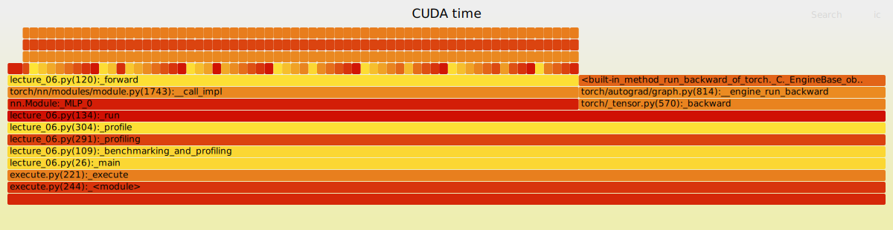

**英文**: But until that point, it's just going to keep going and going and going as far as it can. Right. And in this case, this does become I'm going to zoom out again. OK. I'll do the zoom. There you go. In this case, this kind of gets a little extreme, because if I zoom out once more, notice how, you know, in these steps, I'm running way ahead. Like the step zero is here. Step two is here. This was step one, which basically took no time at all. Step two is here. So it's the CPU is basically running one entire step forward and backward ahead of the GPU. One interesting thing that you might do is if you're writing, you know, various code for for training a language model, one normal thing that you might do is let's go back to the code. I might do something like print, you know, my losses in between iterations. This seems like it should have no effect on what the GPU is doing. Right. You're like, well, it's a print statement. How much could it could it do? If you think about it for a moment, this will have big impacts on the execution layout on the GPU, because in order to print this statement, right, this print statement happens on the CPU and the CPU needs to get the loss. That means it needs to wait for the GPU to compute that loss. And so let's look at what happens.

**中文**: 但在达到那个极限之前，CPU 会一直不停地全速前进。

让我再次缩小视图……好，放大操作完成，就是这样。

在这种情况下，这种现象变得有点极端。如果我再缩小一点，大家注意看：在这些步骤中，CPU 领先了非常多。
**Step 0** 在这里，**Step 2** 也在这里。而中间的 **Step 1** 几乎没花什么时间。
实际上，CPU 已经完整地超前运行了整整一个**前向传播和反向传播**的步骤，把 GPU 远远甩在了后面。

这里有一个有趣的现象：如果你在编写训练语言模型的代码时，做了一个很常规的操作——让我们回到代码界面——比如在迭代之间添加一句 `print` 来打印损失值（loss）。

你可能会想：“这应该不会影响 GPU 的工作吧？毕竟只是个打印语句，能有多大影响呢？”

但如果你仔细思考一下，你会发现这对 GPU 的**执行布局**会产生巨大的影响。
原因在于：这个 `print` 语句是在 **CPU** 上执行的，而 CPU 需要获取损失值。这意味着 **CPU 必须等待 GPU 计算出该损失值**。

那么，让我们来看看具体会发生什么。

**英文**: So here, you know, as I said, you know, step four on the CPU happens way before the GPU equivalent. Now, let's switch back. Now, this is the version that I profiled where it has the print statement. Right. And then now I sort of zoom into selection here. Now, see how step one and step two are basically kind of synchronized now. Right. Because I have to wait for the loss to get computed. And you look at this and you say, oh, but it's still a little offset. Right. Like step two, step one isn't exactly aligned with each other. So now let's kind of zoom back in and see, OK, what happened to step one of the CPU? Well, basically, the end point of step one on the CPU is also kind of where the optimizer step starts. Right. So by the time that Ford is done, sorry, this CUDA stream synchronizes the thing. So this CUDA stream synchronized command on the CPU, this is basically saying I'm just waiting for the GPU because I can't run ahead. I'm waiting for this loss to be computed and to be sent back to me. Right. So this is kind of a dummy operation where it's saying CPU waits, waits, waits, waits, waits, waits, waits. Well, the backward step is done. So now I can print the loss.

**中文**: 所以，正如我之前所说，CPU 上的 **Step 4** 发生的时间远远早于 GPU 上对应的步骤。

现在，让我们切换回那个**包含 `print` 语句**的剖析版本。

当我放大查看这一区域时，大家会发现：**Step 1** 和 **Step 2** 现在基本上已经**同步**了。
这是因为程序必须等待损失值（loss）计算完成。

你可能会想：“嗯，但它们似乎还是有一点错位？Step 1 和 Step 2 并没有完全对齐。”

那让我们再放大一点，看看 CPU 上的 **Step 1** 到底发生了什么。
基本上，CPU 上 Step 1 的结束点，也正是**优化器步骤**（optimizer step）开始的地方。

准确地说，当前向传播（Forward）完成后——或者更确切地说，当执行了这个 **CUDA 流同步命令**（CUDA stream synchronize）时——情况是这样的：
这个位于 CPU 上的同步命令，本质上就是在说：“我正在等待 GPU，因为我无法继续超前运行了。我必须等待这个损失值被计算出来并传回给我。”

因此，这里出现了一段看似“空转”的操作：CPU 在不停地**等待、等待、再等待**……
直到**反向传播**（Backward）步骤完成，它才能打印出损失值。

**英文**: I've printed the loss. OK, now the CPU can start running ahead and it does run ahead and start sending step two stuff now. And then, well, once it hits here, it's sort of run out of commands. It's waiting for the loss again. CUDA synchronized. Wait, wait, wait, wait, wait. Backward step is done. Now I can print the loss. Now I run ahead again. Right. So in this case, you know, the GPU is still essentially full utilization in both cases. But in extreme cases where, let's say, you're printing tons of stuff all the time, actually, you're going to introduce a CPU bottleneck. Because the GPU has to the CPU has to keep waiting for the GPU and it can't launch the kernels sort of ahead of time. So that's kind of a really cool thing that you can see with the profiler sort of the CPU versus GPU. And they're actually different devices that communicate to each other. It's not a single unified object. And you wouldn't see that unless you you started to look at some of these like more advanced profilers. Any any question about that sort of set of things? Cool. OK. And the other thing that I want to kind of show you is, you know, the profiler thing that I was playing with before, you can also generate very similar views in NSYS as well, where you sort of select some range of things that you want to let's do a warm up.

**中文**: 所以，正如我之前所说，CPU 上的 **Step 4** 发生的时间远远早于 GPU 上对应的步骤。

现在，让我们切换回那个**包含 `print` 语句**的剖析版本。

当我放大查看这一区域时，大家会发现：**Step 1** 和 **Step 2** 现在基本上已经**同步**了。
这是因为程序必须等待损失值（loss）计算完成。

你可能会想：“嗯，但它们似乎还是有一点错位？Step 1 和 Step 2 并没有完全对齐。”

那让我们再放大一点，看看 CPU 上的 **Step 1** 到底发生了什么。
基本上，CPU 上 Step 1 的结束点，也正是**优化器步骤**（optimizer step）开始的地方。

准确地说，当前向传播（Forward）完成后——或者更确切地说，当执行了这个 **CUDA 流同步命令**（CUDA stream synchronize）时——情况是这样的：
这个位于 CPU 上的同步命令，本质上就是在说：“我正在等待 GPU，因为我无法继续超前运行了。我必须等待这个损失值被计算出来并传回给我。”

因此，这里出现了一段看似“空转”的操作：CPU 在不停地**等待、等待、再等待**……
直到**反向传播**（Backward）步骤完成，它才能打印出损失值。

**英文**: I said we should. So we should exclude the first couple of steps. So we'll start a step three and we'll measure some steps sort of in this range. We could take the kernels. This is what's doing the computation. And you can see that there's actually many different kinds of matrix multiply. This is one matrix multiply kernel. This is a different matrix multiply kernel. There's a different sort of like vectorized element kernel. And all of these are taking different amounts of computation.

**中文**: 正如我之前所说，我们应该**排除前几个步骤**。

因此，我们将从 **Step 3** 开始，并测量这个范围内的若干步骤。

我们可以关注这些**内核**（kernels），因为正是它们在承担实际的计算任务。
大家可以看到，这里实际上存在多种不同类型的**矩阵乘法**（matrix multiply）：
*   这是一种矩阵乘法内核；
*   那是另一种不同的矩阵乘法内核；
*   还有一些不同类型的**向量化元素级内核**（vectorized element kernel）。

所有这些内核所需的**计算量**（或耗时）都是各不相同的。

**英文**: And we can take this and we can say, oh, show me in the events view all of the things that are happening. And I can also see sort of the stats view, all of the the time that it takes. Wait, let's see. We want we want the average time that we want. Sorry. The CUDA kernel execution summary. Yeah, we want the total duration of the kernels. And so we can see which kernels are taking the most time and aggregate across these views. This is actually a very, very powerful tool that can give you both like the aggregate view of what's slow and what's fast, as well as individual kernels that are being launched and when they're launched and where the CPU commands for that came from. And I guess one final side note here is this is one of the reasons why it doesn't matter that we're programming in Python and Python is not a very high performance language, right? Because the CPU is never the bottleneck because the CPU can run ahead and sort of queue commands into the GPU.

**中文**: 我们可以利用这些信息，在**事件视图**（Events View）中查看所有正在发生的事件。

同时，我也可以查看**统计视图**（Stats View），了解各项操作所花费的时间。稍等，让我确认一下……我们需要的是**平均时间**。抱歉，应该是 **CUDA 内核执行摘要**（CUDA Kernel Execution Summary）。没错，我们要看的是内核的**总耗时**（Total Duration）。

通过这种方式，我们可以识别出哪些内核最耗时，并综合这些视图进行分析。

这实际上是一个非常强大的工具，它既能提供宏观视角，告诉你哪些部分慢、哪些部分快；也能展示微观细节，包括启动了哪些具体的内核、何时启动的，以及这些 CPU 命令的来源。

最后顺便提一点：这也正是为什么我们使用 **Python** 编程并不重要（尽管 Python 本身并不是一种高性能语言）的原因之一。
因为 **CPU 从来都不是瓶颈**——CPU 可以超前运行，并将命令排队发送给 GPU，从而掩盖了 Python 解释器的开销。

**英文**: And so this sort of detaching or like this disconnecting aspect between the GPU and the CPU is one of the key reasons why we can use this nice high level programming language and yet still get sort of full utilization out of sort of our GPUs. Cool. OK, any questions before I sort of switch back to this, because I'm going to leave NSYS sort of forever for this lecture at this point. Cool. Yeah, but you'll get to play with it in assignment too, and I think you'll appreciate it because it gives you like a really interesting view into what your hardware is actually doing to make these like language models train. OK, that was benchmarking and profiling. Now you have all the tools you need to be able to do sort of performance things. And now we're going to write some kernels in the remaining time. So remember kernel fusion, right? So this was the image that I showed you in lecture, right? There's a little factory every time I need to do an operation and to ship it from the warehouse to the factory and back. And so if I naively do a bunch of operations in sequence without thinking about it, I'm paying for a lot of sort of shipping costs back and forth from from the warehouse.

**中文**: 因此，这种 GPU 与 CPU 之间的**解耦**（detaching）或**分离**特性，正是我们能够使用如此便捷的高级编程语言，同时又能让 GPU 获得**充分利用率**的关键原因之一。

好的，在我切换回之前的内容之前，大家还有什么问题吗？因为从今天这堂课开始，我将暂时不再使用 **NSYS** 工具了。

不过，你们在后续的**作业**中会有机会亲自上手操作。我相信届时你们会非常欣赏它，因为它能让你们深入洞察硬件底层究竟是如何运作，从而驱动这些大语言模型进行训练的。

好了，关于**基准测试**（benchmarking）和**性能剖析**（profiling）的部分就讲到这里。现在，你们已经掌握了进行性能优化所需的所有工具。

接下来，利用剩下的时间，我们将动手编写一些**内核**（kernels）。

大家还记得**内核融合**（kernel fusion）的概念吧？
我在之前的讲座中展示过这样一张图：每次我需要执行一个操作时，就好像有一个小工厂，必须把数据从“仓库”（显存）运到“工厂”（计算单元），处理完后再运回去。

因此，如果我不加思考地按顺序盲目执行一堆操作，我就得为这些数据在“仓库”和“工厂”之间反复运输支付高昂的**运输成本**。

## 段落 68

**英文**: What I should do is have one factory that does all the operations at once. So I do not pay for this cost multiple times. That's very important. So now we're going to do Gell-U and we're going to write a kernel for Gell-U and I'm going to write that kernel in several different ways. And we're going to look at the performance impact of doing that. And so we have the pie torch implementation of Gell-U and that looks just like this torch and functional Gell-U. And I invoke approximate equals tanh because I want this to exactly match the naive thing that I'm going to do next. So this is not going to be actually multiplying by the CDF of the Gaussian. It's going to be some approximation to that. That's easier to compute.

**中文**: 我应该做的是构建一个能一次性完成所有运算的工厂，从而避免多次支付此项成本，这一点至关重要。接下来，我们将实现GELU函数，并为其编写内核代码，且我会以多种不同方式来编写该内核，进而分析不同实现方式对性能的影响。我们首先采用PyTorch提供的GELU实现，其形式与`torch.nn.functional.gelu`完全一致；在调用时，我使用近似等价的`tanh`函数，以确保其结果与接下来将要实现的朴素方法完全一致。因此，该实现实际上并非乘以高斯分布的累积分布函数（CDF），而是采用一种计算更简便的近似方法。

## 段落 69

**英文**: So that's the pie torch Gell-U. Now I'm going to do the dumb thing. Right. You're going to look at this code and say this is going to be low performance. I'm going to go in and in pie torch, I'm going to write Gell-U as 0. 5 times X times 1 plus tanh square root pi over 2 times X plus 0. 044715 times X cube. Magic formula, but this is a good approximation to the Gell-U. You can you can look it up or convince yourself this is true. But if you do this, you see that there's a lot of operations that happen.

**中文**: 这就是PyTorch中的GELU激活函数。接下来我要做一件看似愚蠢的事：没错，你看到这段代码后会说，这性能肯定很低。我将在PyTorch中将GELU实现为0.5 × X × (1 + tanh(√(π/2) × X + 0.044715 × X³))。这是一个“魔法公式”，但确实是对GELU的良好近似——你可以查阅相关资料，或自行验证其正确性。然而，若采用这种实现方式，你会发现其中涉及大量运算。

## 段落 70

**英文**: There's like a tanh, there's a X cube, there's multiplication by a constant and addition and multiplication by 0. 5 and X. If this involves multiple different CUDA kernels, this is probably going to be slow. That should be our intuition at this point from fusion. So let's see if that's true. OK, so these two are the same. You can see at the top left, they compute the exact same numbers. And we can systematically check this on random Gaussians. And now let's sort of benchmark the two. OK, so the manual time is eight point one seconds for a really, really big Gell-U and pie torch time is one point one, right? Millisecond.

**中文**: 这里有一个双曲正切函数（tanh），一个三次方运算（X³），还有一个乘以常数、加法、乘以0.5以及乘以X的运算。如果这些操作需要调用多个不同的CUDA核函数，那么执行速度很可能会很慢。从算子融合的角度来看，这应该就是我们目前的直观判断。那么，让我们来验证一下这个判断是否正确。好的，这两个实现是等价的。你可以看到左上角的结果完全一致，计算出的数值完全相同。我们还可以在随机高斯分布数据上系统性地验证这一点。现在，我们来对这两种实现进行性能基准测试。好的，手动实现耗时8.1秒，而PyTorch实现仅需1.1毫秒。

## 段落 71

**英文**: Sorry. And the fused version is going to be significantly faster, in fact, eight times faster. Wow. You know, big difference from from writing a simple kernel. Of course, your matmols are probably still going to be the bottleneck. But it would be really cool if we could go from that eight milliseconds to that one millisecond. That would feel very satisfying. So we're going to try to get close to that one point one millisecond in the next few parts of the lecture. So now let's look at what's happening under the hood. I don't need to look at NSYS because all I really want to know is some very high level stuff.

**中文**: 抱歉。而融合版本的速度将显著提升，实际上快了八倍。哇！这与编写一个简单内核相比，差异巨大。当然，您的矩阵乘法（matmuls）可能仍是性能瓶颈。但若能将耗时从八毫秒缩短至一毫秒，那将非常酷，也会令人十分满意。因此，在接下来的几节课程中，我们将努力逼近这一毫秒级目标（即1.1毫秒）。现在，让我们来看看底层究竟发生了什么。我无需查看NSYS工具，因为我真正关心的只是一些高层次的信息。

## 段落 72

**英文**: For the manual Gell-U, you know, kind of just like I said, it's going to do a whole bunch of operations. It's going to do a bunch of multiplications. It's vectorized, but it's a bunch of, you know, CUDA kernels being launched here. And notice on the right, this CUDA kernel gets called three times because we have a whole bunch of multiplications floating around here. We've also got addition. We've got a tanh. And each one of these is probably kind of slow. And in the end, you know, we're incurring fairly large overhead doing this. Now, let's do the same thing with the PyTorch Gell-U. And this is this is really great.

**中文**: 对于手动实现的GELU，如前所述，它将执行大量运算，包括大量乘法运算。虽然该实现是向量化的，但此处会启动多个CUDA核函数。请注意右侧：该CUDA核函数被调用了三次，因为我们此处涉及大量乘法运算。此外，我们还包含加法运算和tanh函数。而上述每一项运算的执行速度可能都相对较慢。最终，这种实现方式带来了相当大的开销。现在，让我们使用PyTorch内置的GELU来执行相同操作——这效果非常出色。

## 段落 73

**英文**: There's a single CUDA kernel launch. It happens once and it just processes the whole thing. This is what we'd like to see. And of course, this is very, very fast because it's just a single CUDA kernel. So this is really nice. And we would like to somehow get to the CUDA kernel. And so the first thing you might think of, depending on how much you know about writing GPU efficient code, is, all right, the PyTorch people must have written this in the lowest level language possible. So we're going to do the same thing. We're going to go to not the lowest level possible, but we're going to go to the C++ API and we're going to write the CUDA kernel in C++. So let's open it up and write our own CUDA kernel.

**中文**: 仅执行一次 CUDA 核函数启动，一次性处理全部数据。这正是我们希望看到的。当然，这种方式非常、非常快，因为只涉及单个 CUDA 核函数。因此效果极佳。我们的目标是设法直接调用 CUDA 核函数。那么，你首先想到的方案（取决于你对编写高效 GPU 代码的了解程度）可能是：PyTorch 团队必然已用尽可能底层的语言实现了该功能，因此我们也应照此办理——虽不追求绝对最低层，但至少采用 C++ API，并用 C++ 编写 CUDA 核函数。现在，让我们打开代码并自行编写 CUDA 核函数。

## 段落 74

**英文**: So how is that going to work? OK. So we have gone in and sort of created a C++ version of the whole thing. So CUDA, you know, when we say CUDA is actually the C++ API for interfacing with and programming GPUs. And just like sort of the logical model of a GPU that we describe, you know, we're going to write some sort of function F. And then when we sort of invoke this CUDA kernel, it's going to automatically call F on all of the elements of a vector or a matrix. And then we will get to parallel compute everything that we want. As nomenclature, we're going to have a grid, which is a collection of thread blocks. So think of this as I have a task. I'm going to cut it up into pieces. And there's going to be a number of blocks.

**中文**: 那么这将如何实现呢？好的，我们已经着手开发了整个系统的C++版本。众所周知，CUDA实际上是一套用于与GPU交互及对GPU进行编程的C++应用程序接口（API）。正如我们之前所描述的GPU逻辑模型那样，我们将编写一个函数F；随后，当我们调用该CUDA核函数时，它会自动在向量或矩阵的所有元素上执行函数F，从而实现我们所需的一切并行计算。在术语上，我们将使用“网格”（grid）这一概念，它由若干线程块（thread block）组成。你可以将其理解为：我有一个任务，需要将其划分为多个部分，而每个部分就对应一个线程块。

## 段落 75

**英文**: This is the, you know, in a 2D grid, for example, there's going to be sort of a row coordinate and there's going to be a column coordinate. And this will be very useful if you're working with matrices. And then there will be the size of each of these blocks, like, you know, how big are these in terms of the number of thread blocks? So this is the dimension of the blocks. And then there's a collection of threads within these blocks. And this is the coordinate that, for example, one thread block lives in. And then each thread is within each block. So there's sort of hierarchical structure here. There's a grid and then there's a thread inside a grid. And then we're going to basically each function is going to take in three things. It's going to take the block index, like which thread block do I belong to? Which what's kind of the block dimensions? And then what is the index that I am like my thread index?.

**中文**: 这是指在二维网格中，例如，会有一个行坐标和一个列坐标。当你处理矩阵时，这种结构将非常有用。接着是每个线程块的尺寸，即这些线程块在数量上有多大？这便是线程块的维度。然后，每个线程块内部还包含一组线程。该坐标用于标识某个线程块所处的位置；而每个线程则位于其所属的线程块内部。因此，这里存在一种层次化结构：最外层是网格，网格内包含线程块，线程块内又包含线程。最后，每个函数将接收三个参数：线程块索引（即我属于哪一个线程块）、线程块维度（即线程块的尺寸），以及我的线程索引（即我在该线程块内的编号）。

## 段落 76

**英文**: And with these, I can kind of know which coordinate that I am in in the matrix or the vector. And then I can sort of decide what logic that I want. One sort of last thing before we go through the actual C++ code is, you know, whenever you're you're trying to debug CUDA, you want to launch with CUDA launch blocking equals one. This will allow you to actually debug your CUDA kernel. It will give you sort of error messages back at a cost in terms of the runtime. If you don't do that, you are going to have a bad time if you're writing CUDA code and needing to debug. So, OK, here is my Gell-U code. And let's go through it kind of piece by piece. And then I'll talk about what all the pieces are doing. This will probably take the longest out of the things that we're going to walk through.

**中文**: 借助这些，我就能大致确定自己在矩阵或向量中的坐标位置，从而决定要采用何种逻辑。在进入实际的C++代码之前，最后再强调一点：调试CUDA程序时，务必设置CUDA_LAUNCH_BLOCKING=1来启动程序，这样才能对CUDA核函数进行有效调试；虽然这会以运行时性能为代价，但能返回具体的错误信息。如果不这样做，当你编写并调试CUDA代码时，将会遇到极大困难。好了，这是我的Gell-U代码，我们逐段分析，然后逐一说明各部分的功能。这部分内容很可能是本次讲解中耗时最长的部分。

## 段落 77

**英文**: Other than the machine code. And once you understand this, you should be able to understand all the other pieces. So we'll go through this a little slowly. So there's two parts of this code. So the first part, this Gell-U kernel piece up here, this is the actual kernel. This does the computation. Right. This is going to get sent to the GPU. It's going to do the computation and then it will return the results. This piece, the Gell-U function here, this is a wrapper.

**中文**: 除了机器码之外。一旦你理解了这一点，就应该能够理解所有其他部分。因此，我们将逐步详细地讲解这部分内容。这段代码包含两个部分：第一部分是上方的“Gell-U内核”代码段，这实际上是内核本身，负责执行计算；它将被发送至GPU进行运算，然后返回结果。而此处的“Gell-U函数”部分则是一个封装函数。

## 段落 78

**英文**: Right. This lives on the CPU. It's going to orchestrate the launch of the kernel, which is actually going to go out and live in the GPU. Right. So maybe we can start with kind of this sort of wrapper piece, this Gell-U function first. Right. So we're always going to check two things. Basically, in the Triton or the CUDA code, we're always going to check. Oh, sorry. There's a question back there.

**中文**: 没错。这部分运行在CPU上，负责协调内核的启动，而该内核实际上将部署并运行在GPU上。没错。因此，我们或许可以先从这个封装部分——即Gell-U函数——开始。没错。我们始终需要检查两个事项。基本上，在Triton或CUDA代码中，我们总会进行这两项检查。哦，抱歉，后面有人提问。

## 段落 79

**英文**: OK. Sorry. That's my bad. OK. That is an easy fix, but I needed to know that you can't see. OK. Good. Right. Is this good? OK. Excellent.

**中文**: 好的。抱歉，这是我的疏忽。好的，这个问题很容易解决，但我需要确认您确实看不到。好的，很好。对吧？这样可以吗？好的，非常棒。

## 段落 80

**英文**: OK. So we're going to start with the Gell-U function and there's two things that we're always going to need to do. The first one is to make sure that X lives in the GPU device. It's a CUDA tensor of some kind. Right. If it's not, well, that's going to be a problem. We're not going to be able to do anything on the GPU. The second thing, which is maybe less obvious, is that we want to check to make sure X is contiguous. What that means is it lives in a contiguous block of memory because when we index into X, we're going to do a whole bunch of indexing arithmetic and we're going to assume that X lives in a block of memory. Right.

**中文**: 好的，我们将从Gell-U函数开始，而我们始终需要做两件事：第一，确保X位于GPU设备上，即它必须是某种CUDA张量；如果X不在GPU上，就会出现问题，因为我们无法在GPU上执行任何操作。第二点可能不太明显，即我们需要检查X是否为连续张量——这意味着X必须存储在一块连续的内存中，因为当我们对X进行索引时，会执行大量索引运算，而这些运算均基于X存于连续内存块这一假设。

## 段落 81

**英文**: And if it doesn't, it's just going to be basically impossible to do this with any level of generality. And so when we compute the Gell-U, we take in an input X and we're going to output a Y. Right. And so we need to allocate output. So torch tensor Y equals torch empty like X. This is just saying, well, give me sort of an output tensor space or a pointer to output tensor that is just like the dimension of X. And notice that I'm not calling zeros. This will save on extra operations. I don't need to zero out these Ys because I'm going to write into them anyway. Right.

**中文**: 如果做不到这一点，那么以任何通用程度来实现这一功能基本上都是不可能的。因此，在计算Gell-U时，我们接收一个输入X，并输出一个Y。对吧？所以我们需要为输出分配空间。于是，我们定义PyTorch张量Y为：`Y = torch.empty_like(X)`。这行代码的意思是：请为我提供一个输出张量空间（或指向输出张量的指针），其维度与X完全相同。请注意，这里我并未调用`zeros`函数——这样可以省去额外的操作开销。我不需要将Y初始化为零，因为无论如何我都会向其中写入数据。

## 段落 82

**英文**: So this is a minor, but you might as well do it. Optimization. And then basically in all the code that we write, we're going to need to figure out the grid. Right. So what's the total number of elements that I have? What's the size of each block? The number of threads that I have in each block. And then how many blocks total do I have? And when I need to figure out the number of blocks, I'm going to call C div, which is going to be essentially take the ratio of num elements to block size and then take the ceiling. Right. Because they need to round up to make sure that very last set of elements that sort of isn't divisible by block size still gets computed. Right. So I take the ceiling rather than the floor.

**中文**: 因此，这虽是一个小问题，但你最好还是处理一下——即优化。接着，在我们编写的所有代码中，基本上都需要确定网格配置，对吧？那么，我总共拥有多少个元素？每个线程块的大小是多少？每个线程块中包含多少个线程？而总的线程块数量又是多少？当需要计算线程块总数时，我将调用 C 语言中的“向上取整除法”（ceiling division），其本质是将元素总数除以线程块大小，然后向上取整。对，因为必须向上取整，才能确保最后那组无法被线程块大小整除的元素也能得到计算。因此，我们采用向上取整而非向下取整。

## 段落 83

**英文**: And then this is all very simple bookkeeping stuff. And then I say, all right, launch the kernel. You know, the Geliou kernel gets launched. And this sort of angle brackets is saying this is kind of the with the given number of blocks and the size of each block. And this is going to be passed into sort of the kernel command. And then I'm going to pass in the pointers to X's and Y's. Right. I'm not actually going to pass the values of X's and Y's and the total number of elements. And I need this to compute sort of essentially the boundary conditions of my kernel. So now let's go to the actual kernel itself.

**中文**: 然后，这些都只是非常简单的记账工作。接着我说：“好，启动内核。” 你知道，Geliou 内核随即启动。这种尖括号语法表示：给定线程块的数量以及每个线程块的大小。这些参数将传入内核调用命令中。然后，我将传入指向数组 X 和 Y 的指针——注意，我实际传递的并非 X 和 Y 的具体数值，而是它们的指针，此外还需传入元素总数。我需要该总数来计算内核运行所需的边界条件。现在，让我们进入内核本身的代码。

## 段落 84

**英文**: Right. So I have global void Geliou kernel and I get in pointers for in and out and I have number of elements items and this keyword global. The website, sorry, the rendering here has mangled it a little bit, but you should think of this as underscore underscore global. And this is a keyword that distinguishes it as a Kuda kernel function. And so what am I doing? Well, you know, this thread is actually supposed to operate on a single element I. Right. But I don't get I as input. Like the code doesn't actually tell me you're in a vector in coordinate I. So I need to compute where I am and how I'm how am I going to do that. It's going to be I take my block index.

**中文**: 没错。因此，我有一个全局的 void Geliou 内核函数，并接收指向输入和输出数据的指针，以及元素数量 items，还有 global 关键字。网站——抱歉，此处的渲染略有错乱，但您应将其理解为“__global”。这是一个用于标识 CUDA 内核函数的关键字。那么，我究竟在做什么呢？您知道，当前线程实际上应处理单个元素 I，对吧？但我并未直接获得 I 作为输入参数；代码并未明确告知我：“您正位于向量的第 I 个坐标位置。”因此，我需要自行计算当前所处的位置，即如何确定 I 的值。方法是：获取我的线程块索引。

## 段落 85

**英文**: Right. I only have one dimension. So it's block index dot X. So just the first coordinate and then multiply it by the size of each block, the block dim dot X. And this tells me, you know, basically the starting point within within my current block. And then now I add in thread IDX. So, you know, I know where the start of my current block is. And I add in the offset to where I am within the block. And that gives me my global coordinate. Right.

**中文**: 对。我只有一维，因此是块索引的 X 分量（block index.x），即第一个坐标，再乘以每个块的尺寸（blockDim.x）。这便给出了我在当前块内的起始位置。接着再加上线程索引（threadIdx），即：我已知当前块的起始位置，再叠加我在该块内的偏移量，从而得到我的全局坐标。

## 段落 86

**英文**: So some some bookkeeping computation just to get the coordinates here. And then this is important, too. You see this pattern basically in all the Kuda code that people write. There's no kind of out of bounds checking naturally. And so what you do is I have my coordinate and I'm going to check to make sure that, you know, I am supposed to be processing something that's in bounds and some of the threads at the very end of your block, they're going to be processing stuff that's out of bounds in memory. And you do not want to touch those. And so you you basically condition it on I less than num elements. And you do nothing if you're outside of that. Sorry. Yes.

**中文**: 因此，需要进行一些简单的簿记计算来获取此处的坐标。此外，这一点也很重要：你在人们编写的几乎所有CUDA代码中都能看到这种模式——它本身并不包含越界检查。因此，你需要先获取自己的坐标，然后检查该坐标是否在有效范围内，确保自己处理的是合法的数据；而线程块末尾的一些线程则可能试图访问内存中越界的数据，你绝不能触碰这些越界数据。所以，你通常会以“i < num_elements”作为条件进行判断，一旦超出该范围，就直接跳过，不做任何操作。抱歉，是的。

## 段落 87

**英文**: Sorry, that's this is just the extension that you sort of write the Kuda code and it's to distinguish it from, you know, just your standard C code. OK, so it's just a file name thing is this dot CU. There's nothing particularly special about it. OK, and then so now, you know, within here, we're going to just do our computation, right? It's just going to be I'm going to write out I have my input I and I'm going to index into the element and I compute my Gell you just like I did before and I assign it to out of I and then I'm done. Right. That's all that I need to do. And since this is all pointer stuff, I don't really need to worry too much about what is kind of actually happening here. So that's basically it. I can then take my sort of CUDA, Gell you code that I have and then I can load this sort of C plus plus code in line. And then I can just have it compile into a module all within Python.

**中文**: 抱歉，这只是个扩展名，用于标识您编写的CUDA代码，以便将其与标准C代码区分开来。好的，因此这只是个文件名约定，即以“.cu”为后缀。它本身并无特别之处。好的，那么现在，在此文件中，我们将执行计算，对吧？我只需写出输入数组“I”，通过索引访问其元素，然后像之前一样计算出对应的“Gell”值，并将结果赋值给输出数组的第I个元素，这样就完成了。对吧？这便是我需要做的全部工作。而且由于这里全部涉及指针操作，我实际上无需过多担心底层具体发生了什么。基本上就是这样了。接着，我可以将上述CUDA“Gell”代码与内联的C++代码整合起来，然后直接在Python中将其编译为一个模块。

## 段落 88

**英文**: It's all very nice and convenient. You don't really have to go out onto the command line and do things. So now we have CUDA, Gell you defined. So this is nice. And basically, it's a compilation of this. And I can call it from within Python and we'll use the C bindings to call this guy. OK, we're done calling CUDA, Gell you. I have my you know, I can check that the manual Gell you and the CUDA, Gell you are the same. And now let's benchmark the two. So I have the time that it takes to run Pytorch.

**中文**: 这一切都非常好且方便，你实际上无需进入命令行去执行操作。现在我们已拥有 CUDA Gell you（应为 CUDA GeLU，下同），你已将其定义好了，这很好。本质上，这是对该函数的编译实现。我可以在 Python 内部直接调用它，并通过 C 绑定调用该函数。好的，CUDA GeLU 的调用已完成。我已有自己的实现（即手动实现的 GeLU），可以验证手动实现的 GeLU 与 CUDA GeLU 的结果是否一致。接下来，我们对二者进行性能基准测试。我已获取 PyTorch 实现的运行耗时。

## 段落 89

**英文**: And, you know, just like last time, it's about one point one milliseconds and manual time. Remember, it's eight point one milliseconds. So drum roll. What is our CUDA time? Well, we've gotten it down to one point eight. Not quite as good as Pytorch's implementation. But, you know, we're getting pretty close to Pytorch time. Right. We've we've gone from eight milliseconds to one point eight milliseconds, which is not bad. because that C code wasn't that hard to write. And so now we also do some profiling and we can kind of see what is happening here now.

**中文**: 而且，和上次一样，耗时约为1.1毫秒，这是手动计时的结果。请记住，实际耗时是8.1毫秒。那么，让我们隆重揭晓：我们的CUDA耗时是多少？目前我们已将其降低至1.8毫秒。虽然尚未达到PyTorch实现的水平，但已非常接近PyTorch的耗时了。没错，我们已从8毫秒降至1.8毫秒，这表现相当不错，毕竟这段C代码编写起来并不困难。现在，我们还进行了一些性能分析，从而能够大致了解当前的运行情况。

## 段落 90

**英文**: And, you know, it's called the Gell you kernel. This is the code that got shipped off to the GPU. And then it's calling empty like. This is the initialization and then empty strided. Right. And then CUDA launch kernel and CUDA device synchronize. And that's basically all that's happening. And notice how, you know, once again, this is a single CUDA kernel eats up 100 percent of the GPU time, kind of like what we what we wanted. Right. So there's some further optimization we can do.

**中文**: 而且，如你所知，它被称为“Gell you”内核。这部分代码被发送至GPU执行。随后调用的是empty_like（空张量创建函数），即初始化操作，接着是empty_strided（按步幅创建空张量）。然后是CUDA launch kernel（CUDA内核启动）和CUDA device synchronize（CUDA设备同步）。基本上整个过程就仅此而已。请注意，再次强调，这是一个单一CUDA内核独占了100%的GPU运行时间，这正是我们所期望的效果，对吧？因此，我们还可进一步优化。

## 段落 91

**英文**: But this is really already solved the problem of, you know, kernel fusion. We fused all the operators together. OK, so pretty good. These kinds of element wise operations are easy to write in CUDA. Like if you have a new kind of, I don't know, non-linearity,. you could easily write a CUDA kernel for it yourself if you really wanted to. But more interesting operations are going to require reading multiple values like doing reductions. Those are going to get a little more complicated. Flash detention will be a little bit more complicated, but not too much so when you have to do it in the assignment. OK, any questions on the on the simple C plus plus CUDA kernel? Yes.

**中文**: 但这个问题实际上早已通过核函数融合（kernel fusion）得以解决。我们已将所有算子融合在一起。很好，效果相当不错。这类逐元素操作在CUDA中很容易编写。例如，如果你有一种新型的（比如某种非线性变换），即使你不太熟悉，也能轻松自行编写对应的CUDA核函数。但更复杂的操作（例如需要读取多个值的规约操作）则会稍显复杂。Flash Attention的实现也会略为复杂一些，但在作业中实现时并不会过于困难。关于这个简单的C++/CUDA核函数，大家有什么问题吗？是的。

## 段落 92

**英文**: What happened to the check at the beginning? Yeah. Is that for an error? Does it call some sort of kernel? Yeah. So the question was what happens if it's not contiguous, at least in the code that we wrote, it will just throw an error because it's an assert. You could potentially write code to handle it, but there's almost no reason for memory to be fragmented because it will allocate. contiguously and you won't deallocate the middle of a memory unless you're doing something really tricky. And so you should really, unless you're doing something pretty advanced, expect to have contiguous memory. Do like a transposer jump operation that makes memory not contiguous? Right. So like when you're encoding at a higher level, you should be careful to reverse something you've made,. like you're forced to be contiguous before calling operation. Yeah.

**中文**: 最开始的检查发生了什么？是的。那是用来检测错误的吗？它会调用某种内核吗？是的。因此问题在于：如果内存不连续，会发生什么？至少在我们编写的代码中，这会直接抛出错误，因为这是一个断言（assert）。你当然可以编写代码来处理这种情况，但内存几乎不会出现碎片化，因为内存分配本就是连续进行的；除非你做了非常特殊、复杂的事情，否则你也不会只释放一块内存中间的部分。因此，除非你正在实现相当高级的功能，否则你理应默认内存是连续的。比如执行转置（transpose）之类的跳转操作，是否会导致内存变得不连续？没错。因此，在更高层进行编码时，你需格外注意，及时撤销此前引入的非连续性——例如，在调用相关操作前，必须确保内存恢复为连续状态。

## 段落 93

**英文**: So the question was like if you're transposing, then you're no longer going to be contiguous. You're going to have like a jump between all the elements in the index. If you're sort of row traversing something that's sort of column store. Yeah. So I think transpose or like views or like essentially shuffling dimensions is like the one exception to this, but that's handleable in like the outer, sort of the wrapper part, right?. You can basically pass it something that is contiguously indexed. And for a lot of the matrices, you won't really care. So, yes. Right. So what would happen if you chose a different block size? The sort of GPU related sort of concerns would kick in, sort of like do you have enough blocks to saturate your SMs? And do you have enough work within each block? And those are kind of the two things that could matter here.

**中文**: 因此，问题在于：如果你进行转置操作，数据就不再连续存储了，索引中的各个元素之间会出现跳变。例如，当你以行优先方式遍历一个按列存储的数据结构时，就会出现这种情况。是的。我认为，转置操作、视图（view）操作，或者本质上对维度顺序进行重排的操作，是这一规则的唯一例外；但这类操作可以在外层、即封装层中加以处理，对吧？你基本上可以传入一个索引连续的数据结构。而对于许多矩阵运算而言，你实际上并不在意这一点。所以，是的。那么，如果选择不同的分块大小，会发生什么情况呢？此时就会涉及与GPU相关的考量，比如：你是否拥有足够多的线程块来充分占用流式多处理器（SM）？每个线程块内部是否有足够的计算任务？这两点正是此处需要关注的关键因素。

## 段落 94

**英文**: But I think my guess is that for block sizes that are relatively large, like 1024, it probably won't matter past this certain point. Because we're not doing anything advanced. It's all entry-wise operations for this very, very simple example. Yeah. Is the reason that our non-GPU operation is so slow because this huge asset like this small operation, and then some GPU asset kind of goes like that?. So the question was like, why was our non-CUDA kernel, sort of like manual thing, so slow? It's not that it's sending things back from GPU to CPU per se. Like X is going to live in the GPU. We allocate it in GPU. Like we'll do like as the device like CUDA. But it's going to basically not be in the SM the whole time, right? So once we do like X squared, right, that's a CUDA kernel.

**中文**: 但我猜测，对于像1024这样相对较大的块尺寸而言，超过某个特定点后，性能差异可能就不再明显了。因为我们并未执行任何高级操作，而只是对这个极其简单的示例进行逐元素运算。是的。我们非GPU操作之所以如此缓慢，是否是因为这类微小操作需处理庞大的数据量，而GPU操作则能高效完成？因此问题在于：为何我们未使用CUDA核函数的手动实现方式会如此缓慢？这并非因为需要将数据频繁地从GPU传回CPU。例如，变量X将始终驻留在GPU上——我们是在GPU上为其分配内存的，即在设备端（如CUDA设备）上分配。但X并不会始终驻留在流式多处理器（SM）中，对吧？因此，当我们执行X的平方运算时，这实际上调用的是一个CUDA核函数。

## 段落 95

**英文**: And so that multiplication operation will read the sort of vector from the global memory into the SMs, do the computation, it will write it back. And so this is all in the sort of DRAM to SM communication cost, rather than the CPU to GPU communication cost. Of course, if you write like as device CPU, then you'll get the CPU transfer cost in addition to the DRAM transfer cost. Okay, so now you've seen that and like, okay, so that was not too painful. But it would be really nice if we had nicer sort of Python abstractions for. writing CUDA kernels. And this is what Triton is. And Triton is quite nice. It has this very nice middle ground where you don't have to manage literally everything about the GPU. So Triton is sort of a domain specific language, developed by OpenAI in 2021.

**中文**: 因此，该乘法运算会将向量从全局内存读取到流式多处理器（SM）中，执行计算，再将结果写回。整个过程涉及的是DRAM与SM之间的通信开销，而非CPU与GPU之间的通信开销。当然，如果你像在设备端（device）与CPU之间进行数据传输，那么除了DRAM传输开销外，还会额外产生CPU传输开销。好的，现在你已经了解了这一点，嗯，看起来还不算太难。但如果我们能拥有更简洁、更友好的Python抽象来编写CUDA核函数，那就再好不过了。而Triton正是为此而生。Triton非常出色，它提供了一个极佳的中间层次：你无需事无巨细地管理GPU的所有细节。Triton是一种领域特定语言（DSL），由OpenAI于2021年开发。

## 段落 96

**英文**: And it makes GPU programming much more accessible. So you write everything kind of in Python, and you don't really think about the threads anymore. You think about thread blocks. And Triton manages a lot of stuff that is annoying, but can be automatically optimized. So it can manage coalescing of memory. So remember that from DRAM, you get four sort of adjacent values at once, what's something called burst mode. So you really wanna make sure that your memory retrievals are sort of grouped into adjacent sort of four element or more sort of calls at once. So it will handle those automatically, it will group those. It will do shared memory management when you need to sort of manage which sort of memory that you're writing to within the SM with multiple threads. From within each SM, you might need to stop or start threads all managed automatically.

**中文**: 这使得GPU编程变得更加便捷。你只需用Python编写所有代码，而无需再过多考虑线程问题，只需关注线程块即可。Triton能够自动处理许多繁琐但可优化的细节：例如，它能自动管理内存访问的合并（coalescing）。如前所述，从DRAM中读取数据时，系统会以“突发模式”（burst mode）一次性获取四个相邻的数据值；因此，你需确保内存访问请求尽可能按相邻的四元素（或更多）为一组进行。Triton会自动完成此类分组操作。此外，在需要对流式多处理器（SM）内部由多个线程共享的内存进行管理时（例如指定写入哪类内存），Triton也会自动处理共享内存的分配与管理；在每个SM内部，线程的启动与暂停同样由Triton全自动管理。

## 段落 97

**英文**: But scheduling across SMs or what different SMs do, that's manual. So the programming model is that you're gonna think at the SM centric level and the compiler will handle a lot more of the lower level details. And Triton's quite nice because it can outperform by quite a bit a lot of high torch implementations. So it's kind of like going all the way to writing CUDA, but you're still in the very familiar Python land. And I think a very underappreciated advantage is sort of as it's written here, it's all in Python. You can step through it, you can kind of debug it fairly nicely. And so let's step through a Triton kernel. Like once again, we're gonna write GALU. And we're gonna do it in Triton. So this, I've put the code to be as similar structure as possible to our other code, right? So this is sort of the CPU side code, so to speak.

**中文**: 但跨流式多处理器（SM）的调度，或是不同SM各自执行的任务，都需要手动完成。因此，编程模型要求你以SM为中心进行思考，而编译器则负责处理大量底层细节。Triton的优势十分显著，其性能往往大幅超越许多高度优化的PyTorch实现。它相当于直接编写CUDA代码，但你仍完全处于熟悉的Python环境中。我认为一个常被低估的重要优势正如文中所述：所有代码均用Python编写，你可以逐行调试，也能相当方便地进行调试。接下来，我们一起来剖析一个Triton核函数——再次以实现GALU为例，并使用Triton来完成。此处我已将代码结构尽量设计得与我们之前的其他代码保持一致，也就是说，这部分可视为“CPU端”的代码。

## 段落 98

**英文**: This is the wrapper Triton GALU code. It takes an X, which is a torch tensor, and I've got my two asserts at the top. And I'm gonna allocate an output tensor Y using empty like once again. And it has the same exact sort of coordinate computation sort of components. And even the kernel launch looks very similar. I've got this num blocks annotation. And then my block size is at the end here, not in part of this brackets. But basically I'm passing the same information to my kernel. And now trying GALU kernel is this code over here. And this is gonna do the same thing as what we were doing before, but now it's nicely written in Python.

**中文**: 这是 Triton GALU 的封装代码。它接收一个张量 X（PyTorch 张量），我在开头添加了两个断言。接着，我再次使用 `empty_like` 分配输出张量 Y。其坐标计算逻辑组件与之前完全相同，甚至连核函数启动方式也极为相似：我仍使用 `num_blocks` 注解，而线程块大小则置于末尾，而非括号内。本质上，我向核函数传递的是相同的信息。现在，GALU 核函数即此处的代码，它将执行与之前相同的操作，但如今以清晰、规范的 Python 代码实现。

## 段落 99

**英文**: And the mental model here is the inputs are going to be at X pointer. Y pointer is the output vector, sort of the starting coordinate. And the block size is how big each of my blocks are. And num elements is gonna be sort of the very end of my array. So now I need to get this set of lines, 557 to 561. This is doing the computation of my index, right?. I did I equals some formula before. This is doing the same calculation over here. I'm calculating where is the start of my current block. Well, that's my block ID times the size of the block.

**中文**: 此处的思维模型是：输入位于X指针处，Y指针是输出向量（即起始坐标），块大小表示每个块的尺寸，而元素数量则对应数组末尾的位置。现在我需要处理第557至561行的代码，这部分用于计算索引，对吧？此前我已用某个公式计算出i值，此处执行的是相同的计算：我正在计算当前块的起始位置，即块ID乘以块大小。

## 段落 100

**英文**: That gets me, let's say I live in block one. It'll get me this point right here at the middle. And then afterwards I need to know where do I live within my block? Well, that's gonna be kind of the offset. But now notice one difference. I don't get in an offset because I'm not programming threads, right? I'm programming blocks. And so what does that mean? Well, my offsets are actually a vector, not a single value. Cuz this is basically going to be, I'm gonna do vectorized operation, where the vectorized operation is gonna be handled by different threads. So here, my offsets are the start of the block plus a vector,. this range of block size sort of offset. So my offsets are all of these coordinates within block one at once.

**中文**: 这让我想到，假设我住在第一区块，那么它会定位到该区块正中央的这个点。之后，我还需要知道我在自己所属区块内的具体位置，而这实际上就是一种偏移量。但请注意一个区别：我获取的并非单一的偏移量，因为我并非在直接编程线程，而是在编程区块。这意味着什么呢？我的偏移量实际上是一个向量，而非单个数值。原因在于，这本质上是一种向量化操作，而向量化操作将由不同的线程来并行处理。因此，我的偏移量是区块起始位置加上一个向量——即一个覆盖整个区块尺寸范围的偏移向量。换言之，我的偏移量是一次性涵盖第一区块内所有这些坐标的向量。

## 段落 101

**英文**: Of course, if I'm at the very end, I might go off the edge, and so I need a mask to handle anything that lives off the boundary of my vector. Now, I'm gonna load in a sort of single vectorized operation everything at once, so x pointer plus offsets. These are sort of the values that I'm responsible for masked up, and it's loaded into x, which is my sort of internal values,. my internal sort of temporary vector that I need. And with this temporary vector, I'm gonna do exactly the old Galu computation. There's no tanh, so I compute that manually. But this formula you can convince yourself is the same as what we have here. And then y is going to be the formula computed up here. Now, once I'm done, I need to write it back into my output sort of buffer, or my output vector, and so I compute sort of my targets. So this is y pointer plus offsets.

**中文**: 当然，如果我位于向量的最末端，就可能越界，因此我需要一个掩码来处理向量边界之外的数据。现在，我将通过一次单指令多数据（SIMD）操作，同时加载所有数据：即 x 指针加上各偏移量。这些便是我负责处理并经掩码保护的数据，它们被加载到 x 中——也就是我的内部值、我所需的内部临时向量。接着，我将使用该临时向量执行与之前完全相同的门控线性单元（GLU）计算：此处不使用 tanh 函数，因此需手动计算；但你可以自行验证，该公式与上文所列公式完全等价。随后，y 将按上方公式计算得出。完成计算后，我需要将结果写回输出缓冲区（即输出向量），因此我需计算目标地址，即 y 指针加上各偏移量。

## 段落 102

**英文**: I take my temporary values y, and then I store it, right? So this is very, very, very similar to what came before, but this one is the vectorized version. I get to operate on an entire block at once. And so instead of kind of thinking at the perspective of a thread, I'm thinking from the perspective of a block, but not too different, right? This is all fairly similar stuff. So now I've written my Triton-Galu, and all right,. I will do this fairly quickly, all right. So one last thing, I will only point out a few things here, because I don't wanna get so in the weeds that you all get up and leave. But the one last cool thing that we can do is Triton, of course, compiles into low level sort of almost machine code for the GPU. And we can look at this very low level called PTX code after the Triton compiler sort of goes over it. And it's actually kind of cool. You can kind of see how the GPU actually works at the thread level.

**中文**: 我取出临时变量 y，然后将其存储起来，对吧？因此，这与之前的内容非常、非常、非常相似，但此处是向量化版本。我可以一次性对整个数据块进行操作。因此，我不再以线程为视角思考，而是以数据块为视角思考——不过差别其实并不大，对吧？这些内容整体上都相当类似。现在，我已经写好了 Triton-Gelu 实现，接下来我会快速演示一下。最后再强调一点：我仅指出其中几个要点，以免讲得过于深入而让大家失去兴趣甚至离席。最后一件很酷的事情是：Triton 当然会编译成面向 GPU 的底层代码（近乎机器码），我们可以在 Triton 编译器处理之后查看这种极底层的 PTX 代码。这实际上相当有趣，你甚至能从中窥见 GPU 在线程级别上的实际运行机制。

## 段落 103

**英文**: So this is the Triton-Galu kernel. It was generated by the compiler. And at first, it's going to do some of the really basic stuff. So what's it doing here? It's saying, well, I'm going to need to store some values, right? I'm gonna need to store intermediate computations. B means actually sort of untyped sort of basically like bytes. So I need bytes that are sort of 32-bit size. I need floats for doing computations called F. And I need another set of registers that are 64 bits, and that's another set of registers. And so I have all these sort of registers that I need for temporary computations. And then starting here, I'm gonna start computing basically my coordinates.

**中文**: 这就是Triton-Galu内核，由编译器生成。初始阶段，它将执行一些非常基础的操作。那么，此处它在做什么呢？它表示：我需要存储一些数值，对吧？我需要存储中间计算结果。“B”表示一种无类型的数据，本质上类似于字节，因此我需要大小为32位的字节；用于计算的浮点数用“F”表示；此外还需要另一组64位的寄存器，这是另一套寄存器。因此，我拥有所有这些用于临时计算的寄存器。随后，从这里开始，我将着手计算我的坐标。

## 段落 104

**英文**: So sorry, this part is loading the various arguments to the function. So things like the x pointer and the y pointer get loaded here. Starting here, I start computing the coordinate offsets of my Triton sort of kernel. And then once I get down here, this LD global, this is the code that's used to load the values from x pointer back into my temporary registers. So it's basically saying load R2, R3, R4, R5 using the memory position in RD1. And notice how it's loading four things at once because it's cleverly handling coalescing, right? We know we can get four values for free. We should operate on all four of these values at once cuz we get them. And then you do the same thing again for, you do the same thing again here. And then you start to get basically the floating point operations, mall F dot 32, which basically goes through and does the tanh computations. I'm not gonna explain all the different pieces, but here it's multiplying by.

**中文**: 非常抱歉，这部分代码正在加载函数所需的各项参数，例如x指针和y指针等均在此处加载。从这里开始，我着手计算Triton风格核函数的坐标偏移量。接着，当执行到此处时，“LD global”指令即用于将x指针所指向内存中的数值加载回我的临时寄存器中。其含义实质上是：利用RD1中存储的内存地址，同时将值加载至R2、R3、R4和R5寄存器。请注意，它是一次性加载四个值，这是因为编译器巧妙地实现了内存访问合并（coalescing）——我们已知可免费获取四个值，因此理应一次性对这四个值进行运算。随后，您会看到同样的操作再次执行一遍。之后便进入浮点运算阶段，即“mall F dot 32”指令，该指令遍历并执行tanh计算。我不会逐一解释所有细节，但此处正在进行的是乘法运算。

## 段落 105

**英文**: a constant. It does x to the cube by multiplying the same numbers multiple times. And then it's gonna compute here 2 to the x, but we want e to the x. And so it multiplies by log 2 to get the exponentiated base. You can really see all of the different literal step by step operations that the GPU does in order to get you the final result. And so I'll skip all over to the end. This is all floating point computations that it needs to do. And then at the very end, it stores the values that it has, R38 through R41, into RD4, which is the memory position of our output. So this is kind of what's actually happening at the low level. And we see that each thread is operating on four values at a time.

**中文**: 一个常量。它通过对同一数字进行多次相乘来计算 x 的立方。接着，它在此处计算 2 的 x 次方，但我们实际需要的是 e 的 x 次方，因此需乘以 log 2，以将底数转换为指数形式。你可以清晰地看到 GPU 为获得最终结果所执行的每一步具体字面操作。接下来我直接跳至最后部分：所有这些均为所需的浮点运算；最后，它将寄存器 R38 至 R41 中存储的值写入内存位置 RD4，即我们输出数据的存储地址。这便是底层实际发生的过程。我们还可观察到，每个线程一次处理四个数值。

## 段落 106

**英文**: And its temporary storage is the registers, which is the really, really high speed storage that it has very locally. So we can see this is gonna, just looking at it, be probably pretty fast code, right?. Okay, so that was the PTX. And we can go through and see what it's doing for all sorts of things. But now, let's go back and actually benchmark things. So we got manual GeliU, 8. 1 seconds. PyTorch time, 1. 1 seconds. CUDA time, 1.

**中文**: 其临时存储为寄存器，即位于处理器本地、速度极快的存储单元。因此，仅从表面上看，这段代码的执行速度很可能相当快，对吧？好了，以上便是PTX代码。我们可以逐条分析它在各种操作中的具体行为。但现在，让我们回到实际的性能基准测试环节。手动实现的Gelu函数耗时8.1秒；PyTorch实现耗时1.1秒；CUDA实现耗时1秒。

## 段落 107

**英文**: 84 seconds. Triton time, 1. 848 seconds. So we didn't get any faster, but it was much easier to write Triton code, right?. We wrote it in Python. We thought about blocks. We could do vectorized additions. If you're doing more sophisticated stuff, basically Triton will handle a lot of the memory stuff for you. And so it's actually pretty good. And then profiling, once again we see single kernel launch that consumes all of the GPU time, right?.

**中文**: 84秒。海神（Triton）时间：1.848秒。因此，我们并未获得速度提升，但编写海神代码确实容易得多，对吧？我们使用Python编写，以“块”为单位进行思考，可以执行向量化加法。如果你要实现更复杂的操作，海神基本上会为你自动处理大量内存相关事务，因此其实际表现相当出色。此外，在性能分析中，我们再次看到仅一次内核启动便占用了全部GPU时间，对吧？

## 段落 108

**英文**: So that's great, and that gets Triton kernels. The last thing, at least in this sort of, whoops, one second here, okay. That I wanna talk about is Torch compile. Of course, writing CUDA kernels is cool and it makes you feel really good. But maybe we don't need to do that, right? The things that we were doing here were very simple. We were just taking these x cubed and exponentiation operations, and we were just shoving them all into a single CUDA kernel. And so maybe we can just do that without doing much. And so we've had the several different ways that we've showed you. But the last one I wanna talk about is this thing called Torch compile, which will take our non-optimized PyTorch code. And it will write more optimized code.

**中文**: 所以这很棒，而且能获得 Triton 内核。最后一点——至少在这一类内容中——哎呀，稍等一下，好了。我想讨论的是 Torch Compile。当然，编写 CUDA 内核很酷，也会让你感觉特别棒。但也许我们根本不需要这么做，对吧？我们刚才所做的一切其实非常简单：只是将 x 的立方和指数运算等操作全部塞进一个 CUDA 内核中。因此，或许我们完全可以不费太多力气就实现这一点。我们之前已向大家展示了多种方法，而最后我要介绍的便是这个名为 Torch Compile 的工具，它能接收我们未经优化的 PyTorch 代码，并生成更优化的代码。

## 段落 109

**英文**: And so here, it's gonna attempt to automatically do optimizations like kernel fusion. And this compiled GALU is gonna be equivalent in the actual. outputs that it generates, but now let's look at the run times, right? So we've got some runtime variation, but basically the same kind of numbers, right? 8. 1 seconds manual, 1. 1 seconds PyTorch, 1. 8 seconds CUDA, and 1. 47 seconds on Torch compile, right? So the punchline here is modern JIT compilers are pretty good. It can do optimizations like operation fusion without you having to do very much at all. And if you look under the hood, you can kind of see that there's. basically once again one thing that happens.

**中文**: 因此，在此处，系统将尝试自动执行诸如内核融合之类的优化。而经编译的GALU在实际生成的输出上与原始版本完全等效；但接下来我们来看运行时间，对吧？尽管存在一些运行时波动，但总体数值基本一致：手动实现耗时8.1秒，PyTorch耗时1.1秒，CUDA耗时1.8秒，Torch Compile耗时1.47秒，对吧？因此，此处的关键结论是：现代即时编译器（JIT）性能相当出色，它能自动完成操作融合等优化，而你几乎无需做任何额外工作。若深入探究其内部机制，你便会发现——本质上，再次仅发生了一件事。

## 段落 110

**英文**: This is a sort of fused add multiply 10H Triton code. So it's generating Triton under the hood that basically is doing similar kinds of things as our Triton code, but it's actually slightly more optimized than what we did. And so it's getting slightly better performance than even our code. So Torch compile is quite nice, yes? How do you feel like the nation's current Torch compile will do better? Like, you're just gonna try to implement your price version C,. and probably just move like, if GEM, do you smash it, right? Yeah, so the question was like, when do you know that, I guess maybe the better way to phrase that question is, when do you know you can do better than Torch compile, right? Is sort of the relevant question. And I think for simple stuff like simple operator fusion, or the other thing that it's very good at is optimizing matrix multiplies. So Torch compile, as I said before, can do things like,. if it knows the shape of the matrices, can figure out which kernels to dispatch. It is very good at those things. I doubt that you can get much better than that.

**中文**: 这是一种融合了加法与乘法的10H Triton代码。因此，它在底层生成的Triton代码所执行的操作与我们的Triton代码类似，但实际优化程度略高，因而性能也略优于我们自己的代码。所以Torch Compile效果相当不错，对吧？那么，您觉得当前版本的Torch Compile在哪些方面还能进一步提升呢？比如，您是否会尝试自行实现一个定制版本的C代码，然后直接替换——例如，若涉及GEMM（通用矩阵乘法），就直接用更优的内核替代，对吗？是的，这个问题实质上是在问：我们何时能判断自己实现的方案会优于Torch Compile？这才是真正关键的问题。我认为，对于诸如简单算子融合之类的基础任务，或它特别擅长的矩阵乘法优化，Torch Compile表现非常出色。如前所述，Torch Compile若已知矩阵形状，便能自动选择最优内核进行调度，这类任务它处理得极为高效。我怀疑，在这些方面我们很难再取得显著超越。

## 段落 111

**英文**: But there are things like, if you see flash attention one, two, and three, those are pretty non-trivial optimizations. Like these days, Torch compile and like, Jax's XLA compiler can do those. But that's because we know in hindsight that those are the right optimizations to do. I think some of those things are a little bit non-trivial to figure out. Like, flash attention three has additional sort of hardware level optimizations that leverage the H100 hardware. That's not obvious to do with a JIT compiler. So there are some things that I think are quite hard with Torch compile, that I think you could do better. But in general, I think the point here is, you shouldn't go home and say, I'm gonna write CUDA kernels for every single part of my language model. That's probably not a good use of your time. But if you're writing a new architecture with some complicated piece, and you're not getting utilization, but you think you can, that's maybe the time to really bust out the triton.

**中文**: 但有些优化确实非同小可，比如你看到的FlashAttention 1、2和3。如今，Torch Compile以及JAX的XLA编译器都能实现这类优化，但这恰恰是因为我们事后才明确知道这些正是正确的优化方向。我认为，其中一些优化的发现过程本身并不容易。例如，FlashAttention 3还引入了额外的硬件级优化，专门针对H100硬件特性进行深度适配——而这一点对即时编译（JIT）器而言并不显而易见。因此，我认为Torch Compile在某些方面确实面临较大挑战，而这些地方或许你能做得更好。但总体而言，此处的关键在于：你不应回家后就立刻宣称“我要为语言模型的每一部分都手写CUDA内核”——这很可能并非你时间的最佳利用方式。然而，如果你正在设计一种新架构，其中包含某个复杂模块，当前GPU利用率不足，而你确信本应能实现更高利用率，那么此时或许正是动用Triton大展身手的恰当时机。

## 段落 112

**英文**: Okay, so we're basically at time, but we can quickly go through one last example of triton. Maybe this will be useful for you in assignment two of doing softmax. So one difference is, until now we were doing just basic element-wise operations. And that's really easy, because you just operate on each element, and there's sort of no sort of complexity to those kinds of things. So now let's do softmax, which is, it has a reduction operation where you have to add across all of the elements. So how do we do that? Well, what we wanna do is we wanna normalize across each row of the matrix. And what we would like to do is we'd like to make this fast. So a naive version of this is gonna be pretty slow, and. now we're gonna write the triton kernel. So if I want it to be lazy, the easiest way to do this is, okay, actually you can think for a moment about what the easiest way to do this.

**中文**: 好的，时间差不多了，但我们还是快速浏览一下 Triton 的最后一个示例。这或许对你们完成第二次作业中的 softmax 实现有帮助。此前我们一直仅进行基础的逐元素运算，这类操作非常简单，因为只需对每个元素单独处理，几乎不涉及任何复杂性。现在，我们来实现 softmax，它包含一个归约操作（reduction operation），即需要将所有元素相加。那么，我们该如何实现呢？我们的目标是对矩阵的每一行进行归一化。同时，我们希望该实现尽可能高效。因此，朴素的实现方式会相当慢，接下来我们将编写 Triton 内核。如果我希望实现是“惰性”的，最简便的方式是什么呢？实际上，你可以先花一点时间思考一下，什么才是最简单的实现方法。

## 段落 113

**英文**: Now, let's say you wanna write a softmax, so you're gonna normalize each row of a matrix. And imagine these matrices are pretty small. So you're just writing a kernel for small matrices, right? So if you're doing this, what's the right kind of block design?. Well, maybe what we should do is our grid should actually just be rows. So each SM is gonna handle a single row. That's kind of the optimal thing to do, because if we can fit a whole row into an SM, then we just sum across that row in the SM, and then we divide, right? That's great. And so that's gonna be the simple design for our very naive softmax kernel here. So all we're gonna do is that we're gonna make the block size basically, sorry,. we're gonna make each block a row. And so the block size should be number of columns plus a little bit of buffer to sort of be able to fit all the columns.

**中文**: 现在，假设你想实现一个 Softmax 函数，即对矩阵的每一行进行归一化。再假设这些矩阵尺寸较小，因此你只需为小矩阵编写一个核函数，对吧？那么，此时最合适的线程块（block）设计是怎样的呢？  
或许，我们的网格（grid）应直接按行组织：每个流式多处理器（SM）负责处理一行数据。这实际上是最优方案，因为若整行数据能完全装入一个 SM，则我们便可在该 SM 内直接对该行求和，再执行除法操作，对吧？这样效果很好。因此，这就是我们当前这个非常朴素的 Softmax 核函数所采用的简单设计方案。具体而言，我们将每个线程块设为对应矩阵的一整行；因此，线程块大小应等于列数，再额外预留少量缓冲空间，以确保能容纳全部列。

## 段落 114

**英文**: So this is triton next power of 2 of n, and that's a nice way of padding out your columns. And then I'm gonna make each block a row. So the number of blocks is exactly the number of rows. And then I have my triton softmax kernel,. which is written in kind of the way that you expect. So now we have a matrix rather than a vector. So we have x pointers, we have y pointers, we need the strides of the matrices. And then we can basically figure out what row index I'm in. I can get the column offsets. This is gonna be the same kind of code as before.

**中文**: 因此，这是 n 的下一个 2 的幂次方（即 Triton 中的 next_power_of_2(n)），这是一种对列进行填充的简洁方法。接着，我将每个 block 视为一行，因此 block 的数量恰好等于行数。然后，我编写了 Triton Softmax 核函数，其写法符合常规预期：此时我们处理的是矩阵而非向量，因此需要 x 指针和 y 指针，并需提供矩阵的步长（strides）；随后即可确定当前所在的行索引，并获取列偏移量——这部分代码与之前基本相同。

## 段落 115

**英文**: In fact, getting the row offsets simpler because each row is a block. And then now I'm gonna do basically the same kind of stuff. I'm gonna load in each row into my sort of SM's sort of local memory. And then I'm gonna do computation exactly in a way that looks like a softmax. I have my row, I subtract my max, I take the exponent, I sum it, and then I divide, which is going to give me my softmax normalized row. And I write it back to global memory, right? No complexity at all. Whenever your computations fit nicely in SM, writing Triton code looks very similar to writing just normal Python code,. just with a little bit of load and store and keeping track of where the blocks are. Right, so life is pretty simple. Let's go back, wait, where were we? To the Triton, here we go.

**中文**: 事实上，获取行偏移变得更加简单，因为每一行都是一个数据块。接下来，我将执行基本相同的操作：将每一行加载到流式多处理器（SM）的本地内存中，然后以类似于Softmax的方式进行计算——我先获取当前行，减去该行的最大值，再取指数，接着求和，最后进行除法运算，从而得到归一化后的Softmax行结果，并将其写回全局内存，对吧？整个过程毫无复杂性可言。只要你的计算能够很好地适配SM，编写Triton代码就与编写普通Python代码非常相似，只需添加少量的加载（load）、存储（store）操作，并留意数据块的位置即可。没错，生活就是如此简单。我们再回到前面——等等，刚才我们说到哪儿了？对，回到Triton，就是这里。

## 段落 116

**英文**: And then we can kind of see how fast all of our different pieces of code are. So I'll zoom out again, just to make sure. Okay, so manual time takes 3. 7 seconds. Our compile time is 1. 3 seconds for torch compile. The PyTorch time is 1. 5 seconds. And the Triton time is 1. 9 seconds.

**中文**: 然后我们就能大致看出各个代码片段的运行速度。我再放大一下视图，以确保无误。好的，手动实现耗时3.7秒，Torch Compile编译耗时1.3秒，PyTorch原生实现耗时1.5秒，Triton实现耗时1.9秒。

## 段落 117

**英文**: It's still a little bit slow. Torch compile can actually do better than sort of the native PyTorch implementation, especially when it knows about the shapes and sizes of certain operations. So finally, we can look in the profiler. The manual softmax is kind of a disaster here. You see all sorts of crazy operations happening all over the place. Let me clear this, if we go back up here, yep. We see all sorts of operations happening. We have x, we have max, we have sum, because we've implemented things naively. And we've got memory reads and writes everywhere. The compiled softmax is just gonna be sort of one fused softmax operation that goes quite fast.

**中文**: 它的运行速度仍然略慢。Torch Compile 实际上可以比原生 PyTorch 实现表现得更好，尤其是在它已知某些运算的形状和尺寸时。最后，我们可以在性能分析器中查看结果：手动实现的 Softmax 在此处表现堪称灾难——你将看到各种混乱的操作遍布各处。让我清空一下视图；如果我们回到上方，没错，就能看到大量杂乱的操作：有输入 x、求最大值（max）、求和（sum），因为我们是以一种朴素的方式实现的，导致内存读写操作无处不在。而经过编译的 Softmax 则会被融合为单一的 Softmax 操作，因此运行速度非常快。

## 段落 118

**英文**: And then we've got PyTorch softmax, which is also one CUDA kernel call. And same thing with our Triton softmax. We have our nice Triton softmax kernel that is a single fused kernel for everything. Okay, I won't go through the PTX code for this. I think we're kind of at time and I don't wanna drag you through that low level again. But hopefully this has given you a flavor of lower level GPU programming for the purpose of making language models go fast. And hopefully you'll have fun doing assignment too. Thanks.

**中文**: 然后是 PyTorch 的 softmax，它也只需一次 CUDA 内核调用；我们的 Triton softmax 同样如此。我们拥有一个简洁高效的 Triton softmax 内核，将所有操作融合为单个内核。好了，这部分的 PTX 代码我就不展开了——时间差不多了，我也不想再带大家深入这一底层细节。但希望这已让你初步领略了面向大语言模型加速的底层 GPU 编程风格。也希望你做作业时同样乐在其中。谢谢！

---

*共 118 个段落，1178 句话*
