## 课程介绍与目标
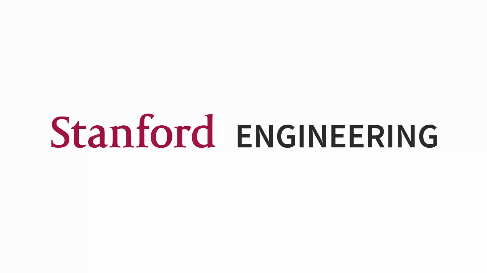
本节是系统基础(System Fundamentals)课程的第二讲，重点将从优化单 GPU(Single GPU)吞吐量转向多机优化(Multi-Machine Optimization)。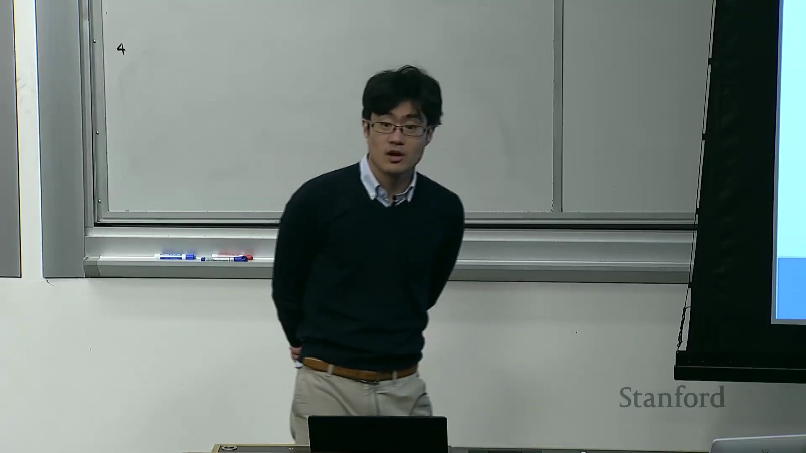 随着模型规模的扩大，必须将其拆分到多台机器上，以同时突破计算(Compute)和内存(Memory)限制。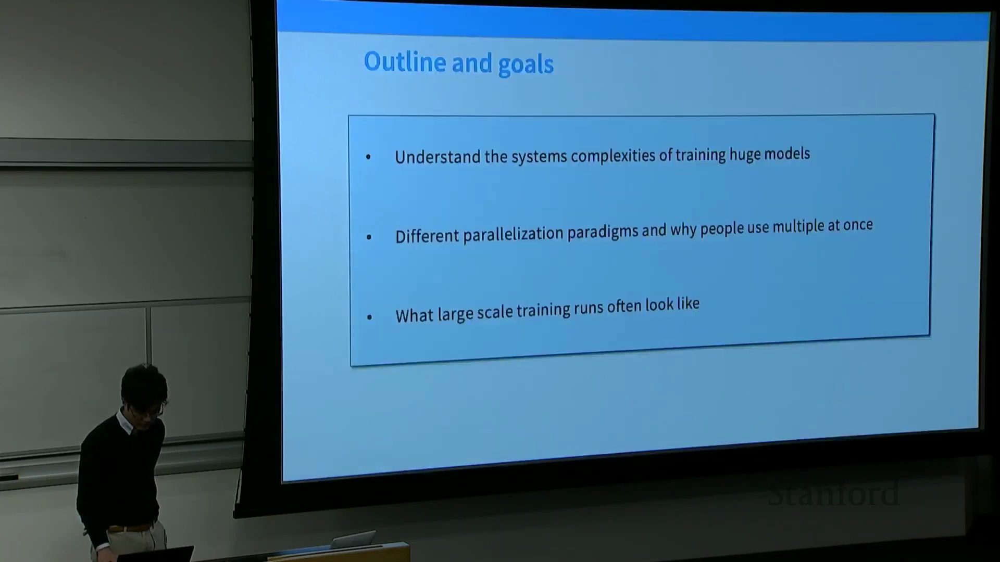 这种分布式架构(Distributed Architecture)在不同硬件层级间引入了异构的通信挑战，因此需要采用多种并行范式(Parallelism Paradigms)，且在实践中通常组合使用。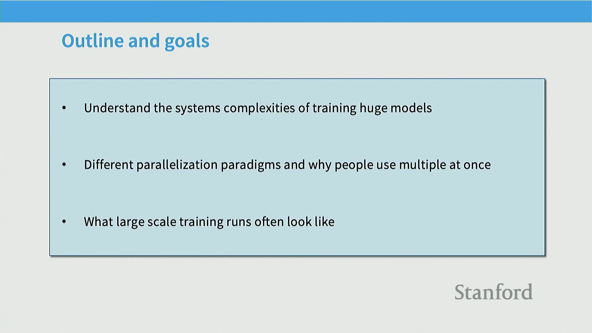 本课程将首先讲解网络基础知识(Networking Fundamentals)，接着将硬件概念映射到并行策略(Parallelism Strategies)，最后以大规模分布式训练(Large-Scale Distributed Training)的实际案例作为总结。

## 多机扩展的必要性
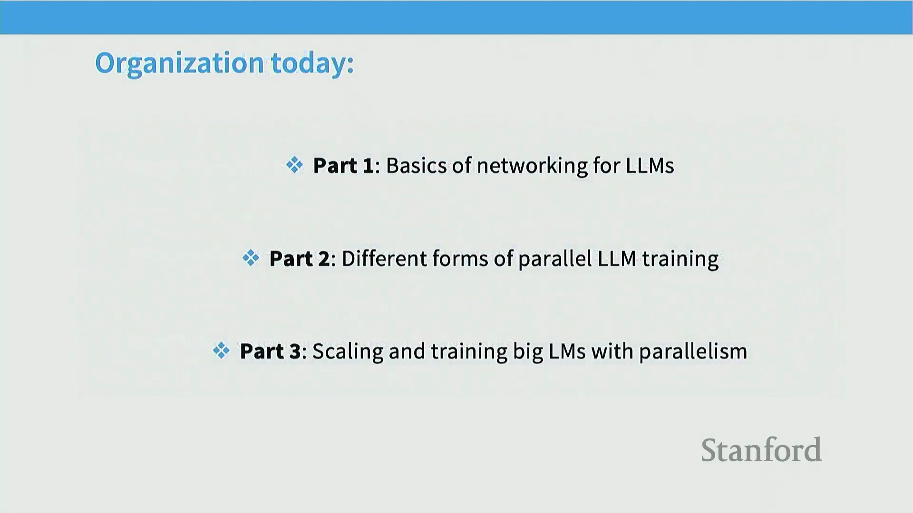
尽管单 GPU 的 FLOPS(Floating Point Operations Per Second，每秒浮点运算次数)已实现令人瞩目的指数级增长，但仅依赖未来的硬件进步无法满足当前的训练需求。为了在当下快速扩展计算与内存能力，多机并行(Multi-Machine Parallelism)是不可或缺的。全球最快的超级计算机已达到 exaflop(ExaFLOP，百亿亿次)运算级别，这代表了训练最先进(State-of-the-Art)语言模型所需的基础算力。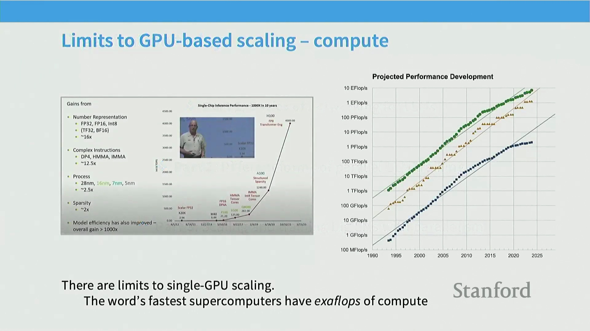 内存限制同样紧迫；尽管 GPU 显存容量(GPU Memory Capacity)在不断增加，但并未跟上模型参数(Model Parameters)增长的速度。包含数十亿参数的模型无法装入单个 GPU 的显存(VRAM)中，这使得分布式内存架构(Distributed Memory Architecture)和严格的内存管理(Memory Management)成为现代 AI 工作负载(AI Workloads)的必备条件。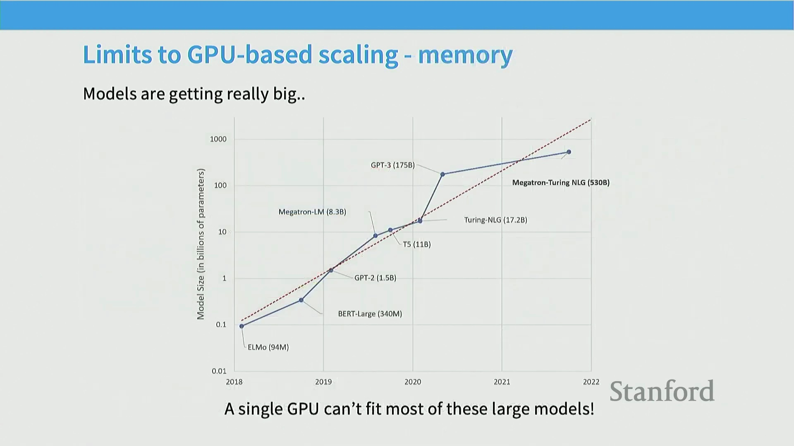

## 硬件层级与通信瓶颈
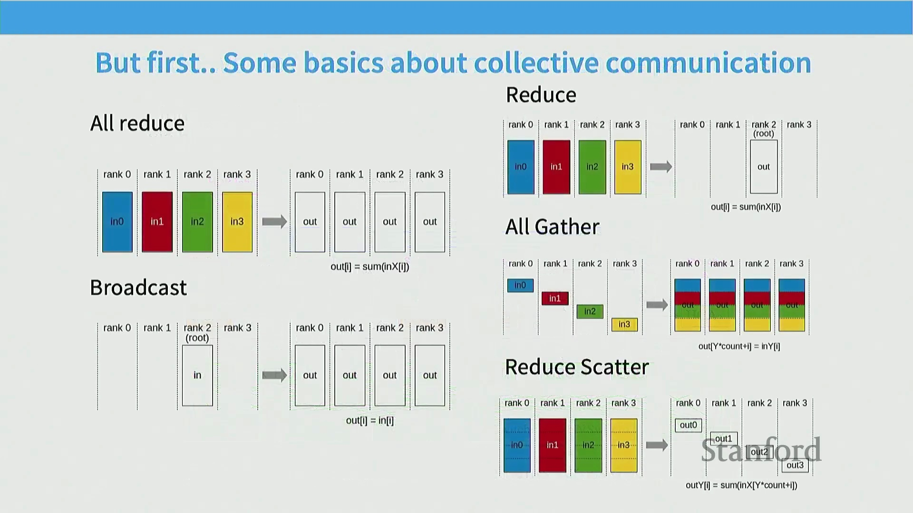
GPU 通常以集群配置(Cluster Configuration)部署，每个物理节点(Physical Node)通常包含多个加速卡(Accelerators)。在单机内部，GPU 通过 NVLink 等超高速互连技术(High-Speed Interconnects)进行通信。然而，跨节点通信(Cross-Node Communication)依赖于外部网络交换机(External Network Switches)和 HDR InfiniBand 等协议，其链路带宽(Link Bandwidth)仅为机内互连链路的大约八分之一。这种硬件层级结构(Hardware Hierarchy)造就了多层级的性能表现：节点内(Intra-Node)通信极快，跨越节点边界(Inter-Node)时性能下降，而在互连 GPU 数量超过约 256 个进行扩展时，则会面临额外的延迟瓶颈(Latency Bottlenecks)。理解这种带宽(Bandwidth)和延迟(Latency)的梯度变化，对于选择合适的并行策略(Parallelism Strategy)至关重要。

## 集合通信基础
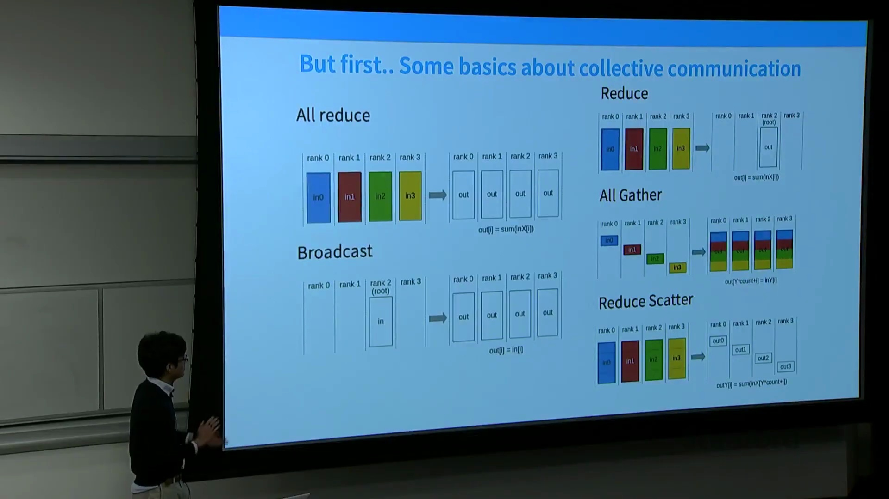
高效的分布式训练高度依赖集合通信原语(Collective Communication Primitives)。**All-reduce(全规约)** 会聚合所有 Rank(进程标识)的数据（例如对梯度求和）并将结果广播回所有 Rank，其通信成本通常为数据量的两倍。**Broadcast(广播)** 将来自一个 Rank 的单一输入分发给所有其他 Rank，而 **Reduce(规约)** 则聚合输入数据，但仅将结果返回给一个指定的 Rank。现代并行化的两个基础操作是 **all-gather(全收集)** 和 **reduce-scatter(规约散射)**。All-gather 将每个 Rank 独有的数据分区(Data Partition)分发给所有其他 Rank。Reduce-scatter 则跨 Rank 聚合对应的数据段(Data Chunks)并分配部分和(Partial Sums)，确保每个 Rank 仅接收其指定的部分。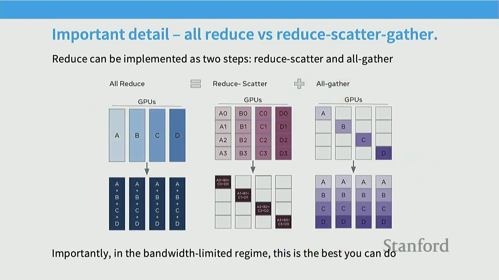
在带宽受限(Bandwidth-Bound)的场景下，一个关键的性能等价关系是：**all-reduce 可以被最优地分解为先执行 reduce-scatter，再执行 all-gather**。这种分解方式被广泛采用，因为许多现代并行算法正是明确基于 all-gather 和 reduce-scatter 原语构建的，从而最大化带宽利用率(Bandwidth Utilization)。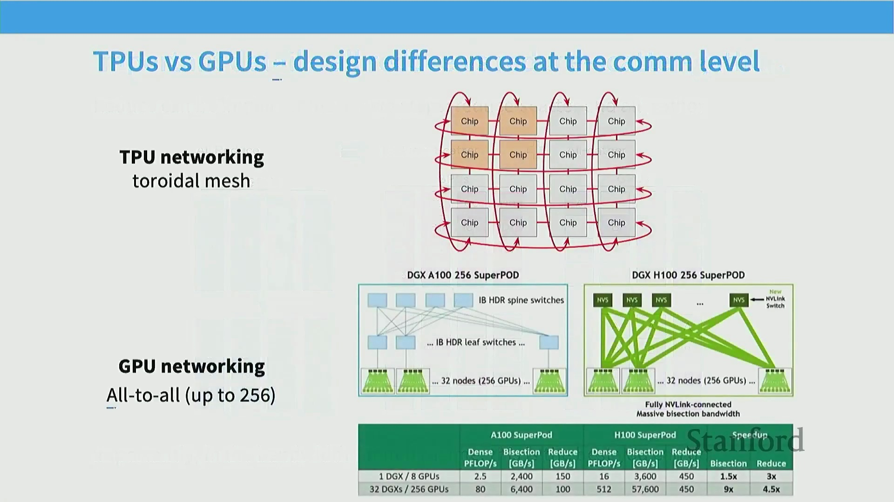

## 网络拓扑对比：GPU 与 TPU
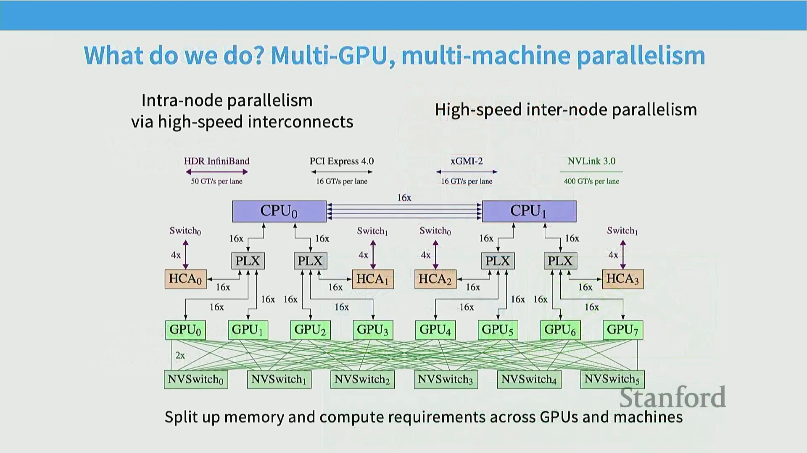
底层硬件架构(Underlying Hardware Architecture)决定了通信模式(Communication Patterns)和可扩展性上限(Scalability Limits)。GPU 集群传统上采用基于交换机的分层拓扑结构(Switch-Based Hierarchical Topology)，在大约 256 个 GPU 的阈值内支持高速的全对全(All-to-All)通信。超过该规模后，会引入额外的叶脊(Leaf-Spine)交换层，这会不可避免地增加延迟并限制带宽。相比之下，Google 的 TPU 架构采用环形(Torus)或二维网格(2D Mesh)拓扑。在该设计中，每个 TPU 芯片仅与其直接相邻的芯片进行快速通信。这种邻居中心架构(Neighbor-Centric Architecture)优先考虑高可扩展的局部数据交换(Local Data Exchange)，使网络易于扩展，同时有意限制任意的全局广播(Global Broadcasts)，以优化大规模训练的效率。

---

## 网络拓扑与集合通信效率
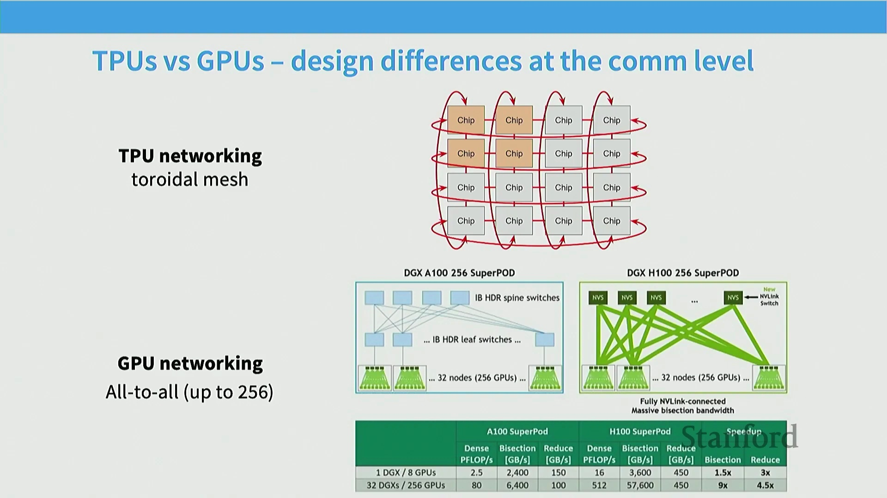
在评估分布式训练硬件时，选择采用 GPU 的全互联(All-to-All)架构还是 TPU 的环面网格(Toroidal Mesh)拓扑，将显著影响集合通信操作(Collective Communication Operations)的性能。 GPU 依赖分层交换机(Hierarchical Switches)，在大规模扩展时会引入额外延迟；而 TPU 采用以相邻节点为中心的网格设计(Mesh Architecture)。关键在于，全规约(All-reduce)或规约散射(Reduce-Scatter)等集合操作在环面网格上的实现效率，可与全互联网络相媲美。这种等价性表明，对于围绕集合通信进行深度优化的工作负载(Workloads)，TPU 风格的网络架构在可扩展性(Scalability)和可预测的带宽利用率(Bandwidth Utilization)方面具有显著优势。

## 数据中心作为基础计算单元
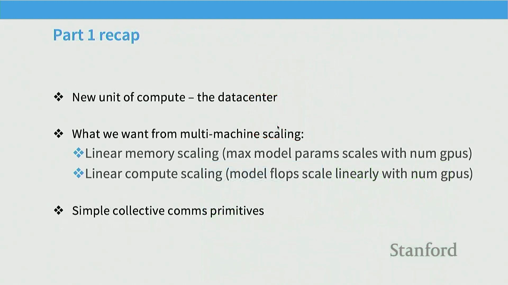
随着训练规模超越单个节点，数据中心(Data Center)本身就成为了主要的计算单元(Compute Unit)。分布式算法的核心目标是实现内存(Memory)与计算(Compute)的线性扩展(Linear Scaling)。内存线性扩展确保随着 GPU 数量的增加，可训练的最大模型规模也能成比例增长。计算线性扩展则保证有效计算吞吐量(Effective Compute Throughput)随加速卡(Accelerators)数量直接增长。现代分布式训练框架主要通过编排基础的集合通信原语(Collective Communication Primitives)来实现这些目标，这使得性能分析能够聚焦于通信模式(Communication Patterns)，而非底层硬件的具体实现细节。

## 核心并行策略概述
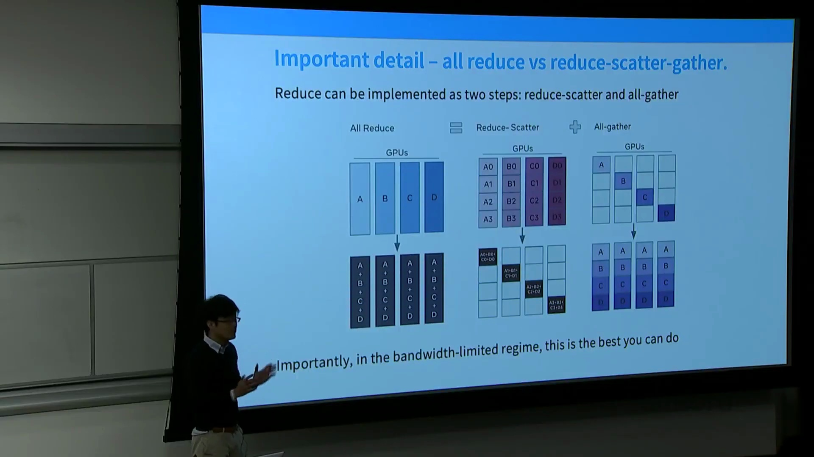
为应对内存与计算分布的双重挑战，通常采用三种基础并行范式(Parallelism Paradigms)。数据并行(Data Parallelism)在多个设备上复制模型参数，同时拆分训练批次(Training Batches)，其实现简单但内存效率(Memory Efficiency)较低。模型并行(Model Parallelism)将模型架构本身切分到多个 GPU 上，从而能够训练超出单设备显存限制(VRAM Limit)的模型。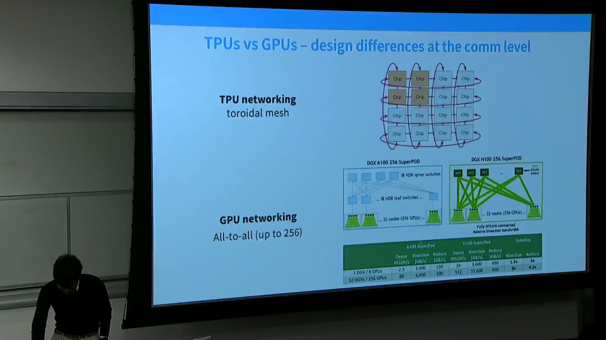 激活并行(Activation Parallelism)则解决了常被忽视的中间激活值(Intermediate Activations)内存占用问题，这在训练具有超长序列(Ultra-Long Sequences)或大批次的大规模模型时尤为关键。有效管理激活内存(Activation Memory)对于维持高硬件利用率(Hardware Utilization)以及防止前向传播(Forward Pass)与反向传播(Backward Pass)过程中的内存溢出(Out-Of-Memory, OOM)错误至关重要。

## 朴素数据并行与性能权衡
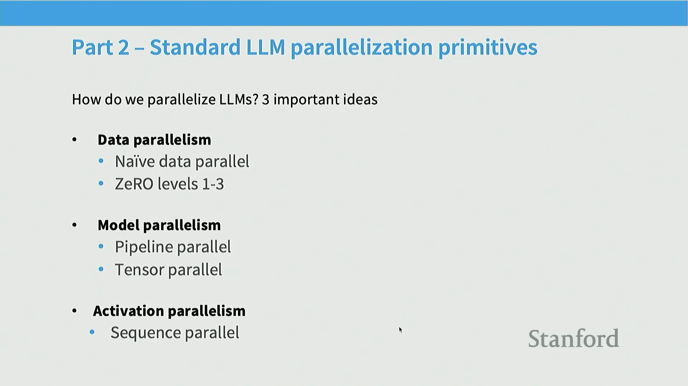
朴素数据并行(Naive Data Parallelism)始于标准的随机梯度下降(Stochastic Gradient Descent, SGD)。全局批次(Global Batch)被划分到各个设备上，每个 GPU 独立处理一个微批次(Micro-batch)。在前向和反向传播完成后，通过一次 All-reduce操作(All-reduce Operation)在所有设备间同步梯度(Gradient Synchronization)，随后应用统一的参数更新(Parameter Update)。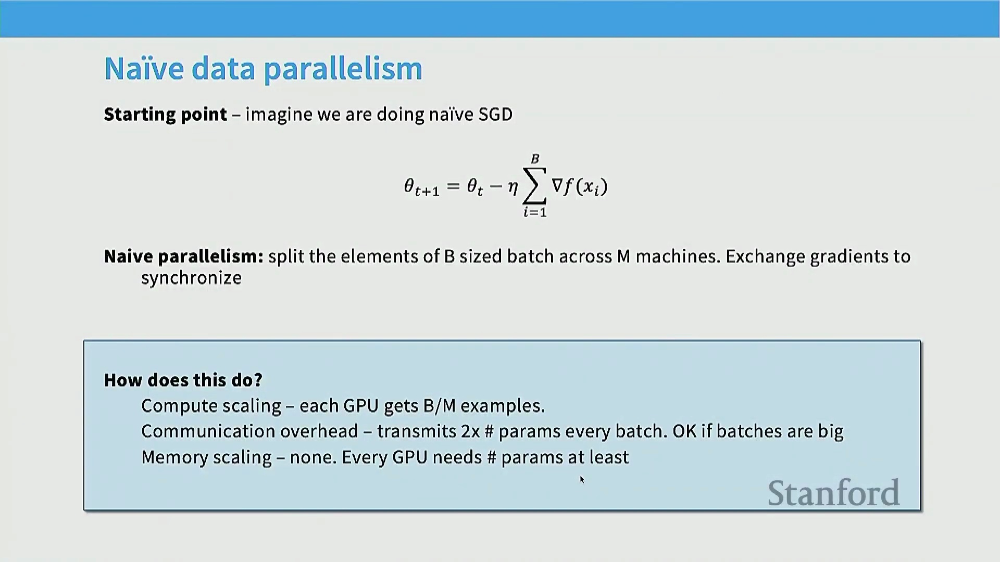 从计算视角(Compute Perspective)来看，该策略非常高效，因为只要微批次(Micro-batch)足够大，每个 GPU 的计算单元都能达到饱和状态(Compute Saturation)。然而，该策略在每个训练步(Training Step)中会产生约等于模型总参数量两倍的通信开销(Communication Overhead)。尽管这一开销可通过增大批次(Batch Size)来掩盖，但其根本瓶颈在于内存：每个 GPU 都必须完整复制模型权重(Model Weights)、梯度(Gradients)和优化器状态(Optimizer States)，导致无法实现有效的内存扩展(Memory Scaling)。

## 内存瓶颈与优化器状态开销
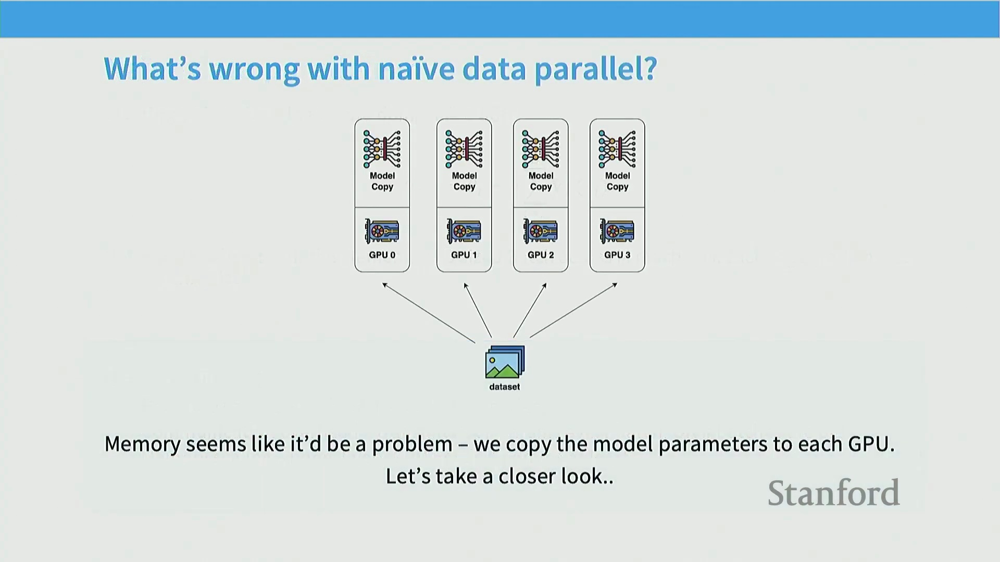
朴素数据并行的内存低效(Memory Inefficiency)问题远比初看起来严重。训练模型时，每个参数通常需存储约 16 字节的数据。相较于仅保存 2 字节的模型权重，这带来了巨大的额外开销。这种开销源于维护多份数据副本的需求：包括 BF16格式(BF16 Format)的梯度、用于参数更新的 FP32主权重(FP32 Master Weights)，以及包含一阶与二阶矩估计(First- and Second-Moment Estimates)的 Adam优化器状态(Adam Optimizer States)。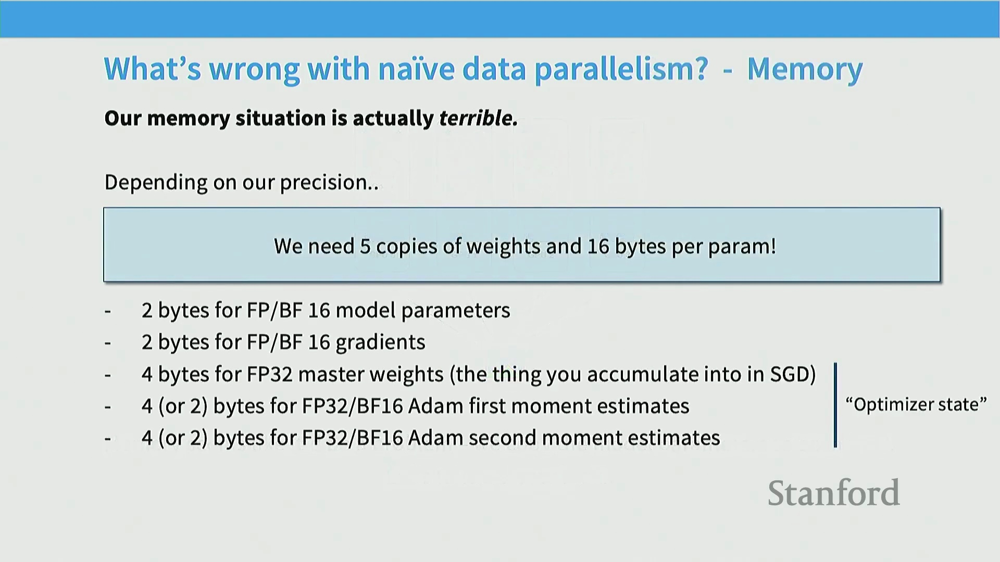 对于大模型而言，优化器状态占据了内存的主要部分。例如，一个 75 亿参数的模型即使分布在 64 个 GPU 上，仍会消耗过大的总内存。这是因为每个设备都冗余存储了完整的优化器状态，导致总内存消耗随 GPU 数量线性增长，而单卡内存压力并未得到有效缓解。

## 优化器状态分片与高级内存优化
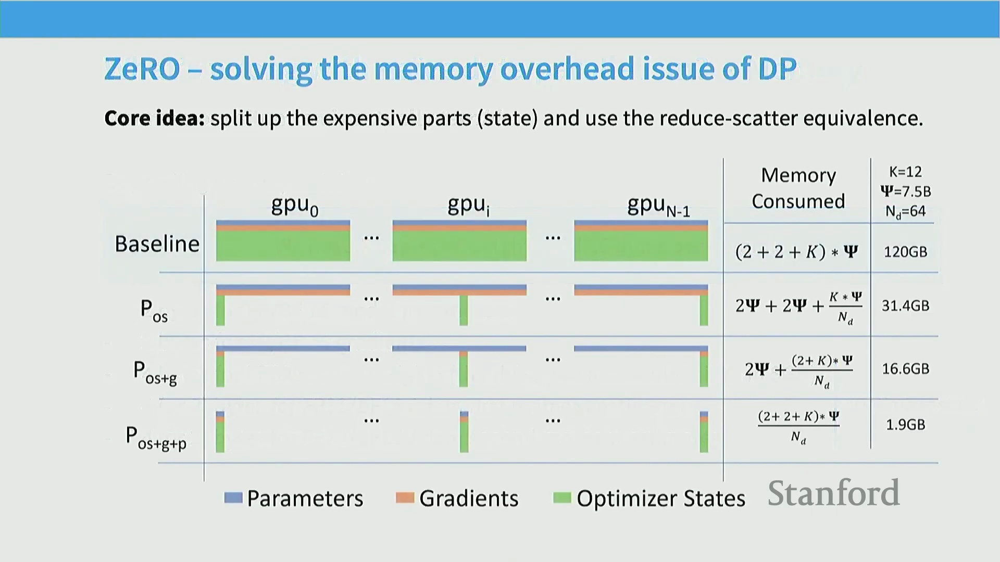
意识到在数据并行中无需完整复制优化器状态，从而催生了内存效率的突破：优化器状态分片(Optimizer State Sharding)。通过将优化器状态划分到不同设备上，并仅在需要更新参数时才进行通信，可以大幅降低内存占用(Memory Footprint)。这一概念可逐步扩展：对梯度进行分片(Gradient Sharding)可进一步减少内存开销，最终对模型参数本身进行分片(Parameter Sharding)，则完成了向完全分片数据并行(Fully Sharded Data Parallel, FSDP)架构的过渡。这种分层分片策略(Hierarchical Sharding Strategy)将原本需要超过 120 GB 内存的配置，优化为仅需其一小部分内存即可高效运行。这使得在不牺牲计算吞吐量(Compute Throughput)或过度消耗昂贵硬件资源的前提下，训练超大规模模型(Ultra-Large Models)成为可能。

---

## 优化器状态分片的机制
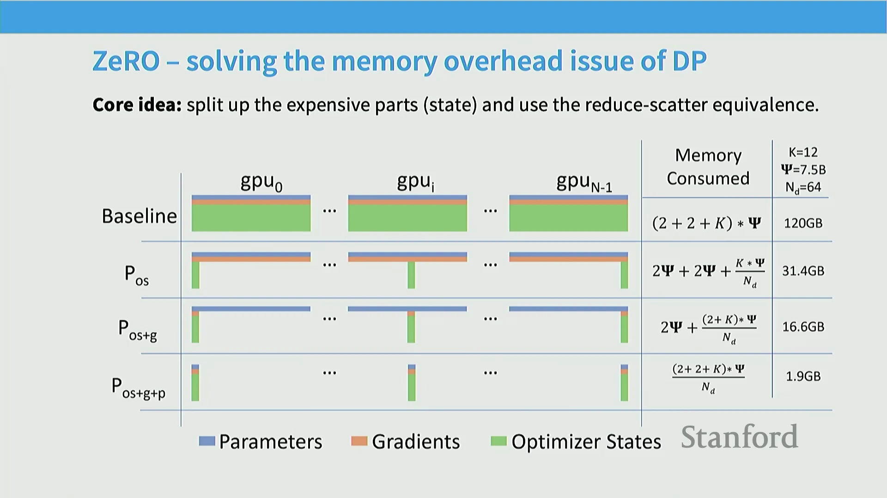
分布式训练内存优化的一项基础性突破在于认识到：在数据并行(Data Parallelism)架构中，优化器状态(Optimizer States)无需在每个 GPU 上完全复制。由于每个设备已持有完整的模型参数(Model Parameters)，并能从分配的微批次(Micro-batch)中计算出完整梯度，因此参数更新所缺的唯一组件便是优化器状态（例如 Adam 的一阶与二阶矩估计(First- and Second-Moment Estimates)）。通过将这些矩估计划分到可用的加速卡(Accelerators)上，每个 GPU 都成为特定参数分片(Parameter Shards)的指定所有者。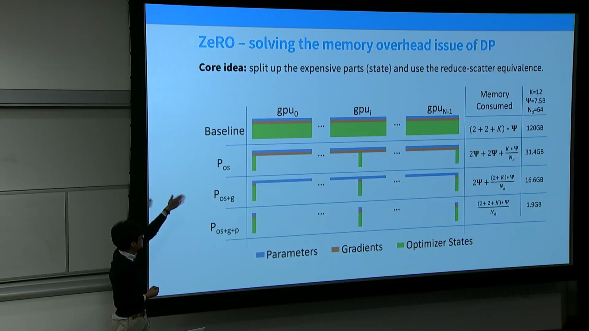 在训练步骤(Training Step)中，每个设备计算整个模型的梯度，但仅对其拥有的参数分片应用优化器更新(Optimizer Update)。一旦本地分片更新完成，新的权重(Weights)将被同步回所有 Rank(进程标识)，从而在保证数学等价性(Mathematical Equivalence)的训练结果的同时，大幅降低每个设备的内存占用(Memory Footprint)。

## 通信等价性与零开销效率
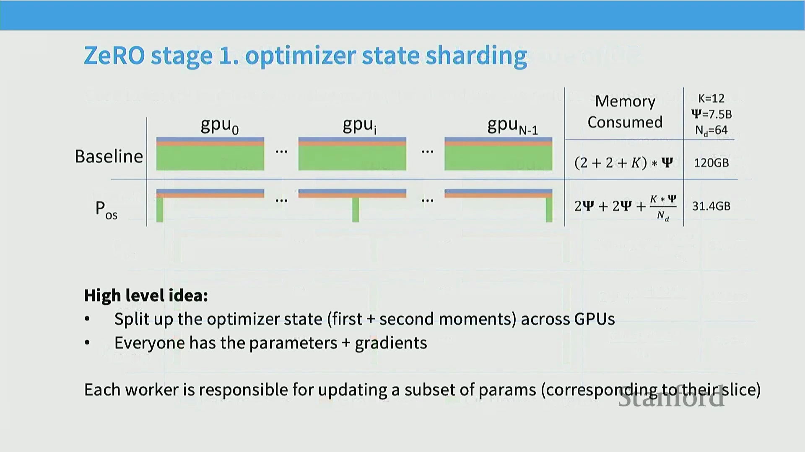
实现该分片策略依赖于特定的集合通信序列(Collective Communication Sequence)：首先执行规约散射(Reduce-Scatter)操作，将每个参数分片的梯度聚合至其所属 GPU；接着执行本地优化器更新步骤；最后通过全收集(All-Gather)操作广播更新后的参数。一个关键认知在于：Reduce-Scatter 与 All-Gather 组合的带宽开销(Bandwidth Overhead)在数学上等同于标准的全规约(All-Reduce)操作。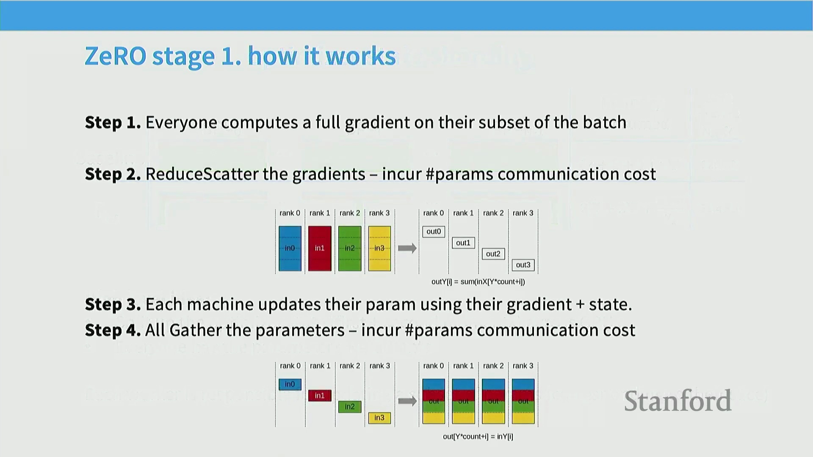 通过在两个通信阶段之间策略性地插入本地优化器计算，系统实现了计算与通信的重叠(Communication-Computation Overlap)。这意味着 ZeRO 阶段 1(ZeRO Stage 1) 在大幅节省优化器状态内存的同时，并未在带宽受限(Bandwidth-Bound)的场景中引入额外通信开销，使其成为一种极其高效的基础优化方案。

## 关于优化器独立性与分片机制的澄清
在技术讲解中，常出现关于 AdamW 等优化器中对角独立性假设(Diagonal Independence Assumption)的疑问。尽管 Adam 独立处理各个参数，但如 KFAC(Kronecker-Factored Approximate Curvature) 等更复杂的二阶优化方法(Second-Order Optimization Methods)则尝试对参数间的相关性进行建模。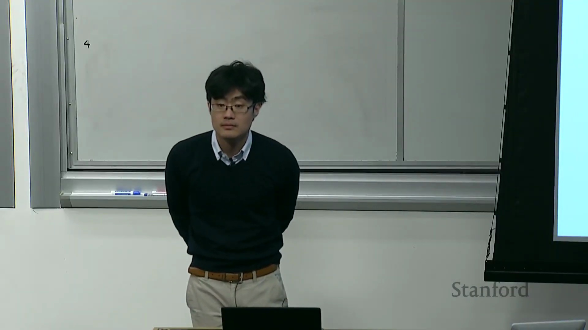 然而，凭借在实际应用中的有效性(Effectiveness)与计算简洁性(Computational Simplicity)，Adam 在大规模训练中依然占据主导地位。在分片示意图中，纵轴代表连续的模型参数块(Contiguous Model Parameter Blocks)，横轴代表各个独立的 GPU。Reduce-Scatter 操作会系统地汇总所有设备上对每个参数块的梯度贡献(Gradient Contributions)，并将聚合结果精确路由至负责该参数块的 GPU，从而确保数据所有权(Data Ownership)明确且不重叠。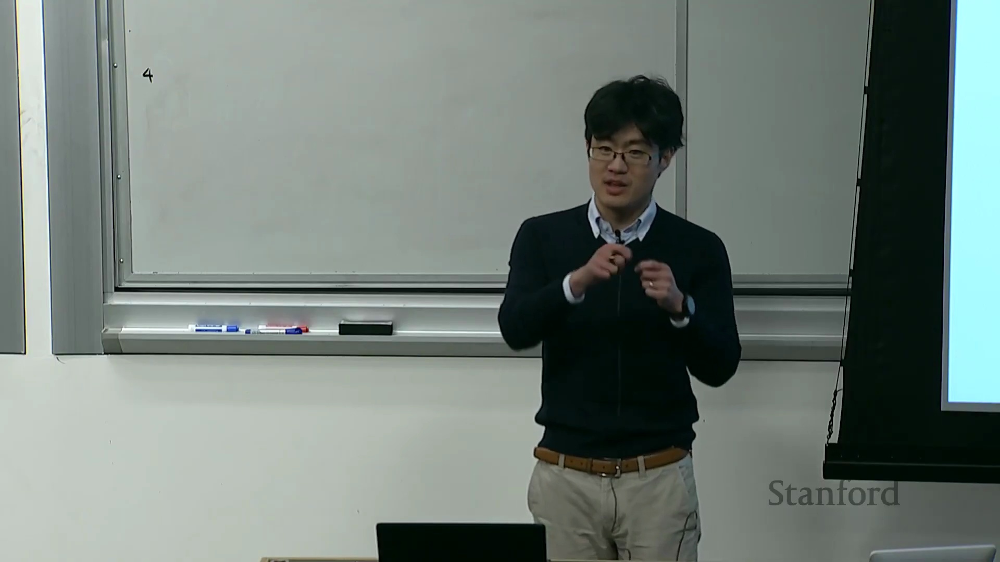

## 梯度分片与内存受限的反向传播
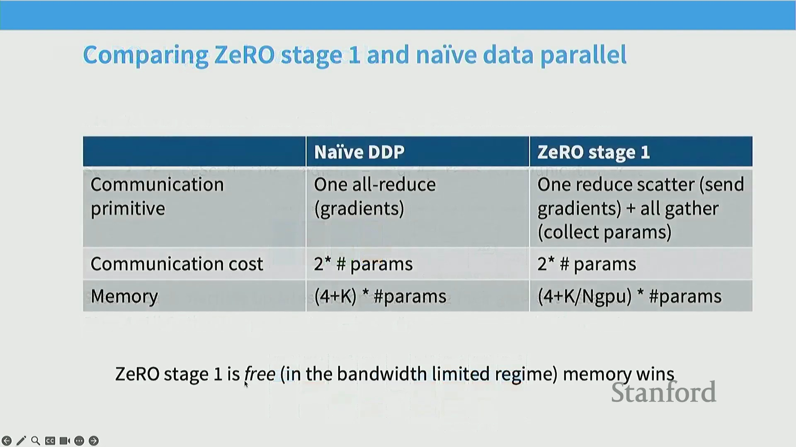
在优化器状态分片(Optimizer State Sharding)的基础上，ZeRO 阶段 2(ZeRO Stage 2) 将优化目标转向下一个内存消耗大户：梯度(Gradients)本身。在标准的反向传播(Backward Pass)过程中，框架会在执行任何通信前，于内存中实例化(Instantiate)整个模型的完整梯度向量(Full Gradient Vector)，这极易导致十亿参数级模型触发内存溢出(Out-Of-Memory, OOM)错误。阶段 2 通过同时分片梯度与优化器状态来解决该问题。其核心创新在于：完整的梯度向量永远不会被同时实例化在内存中。相反，反向传播采用增量执行(Incremental Execution)的方式，内存占用被严格限制在分片参数(Sharded Parameters)、分片梯度(Sharded Gradients)与分片优化器状态(Sharded Optimizer States)的大小范围内。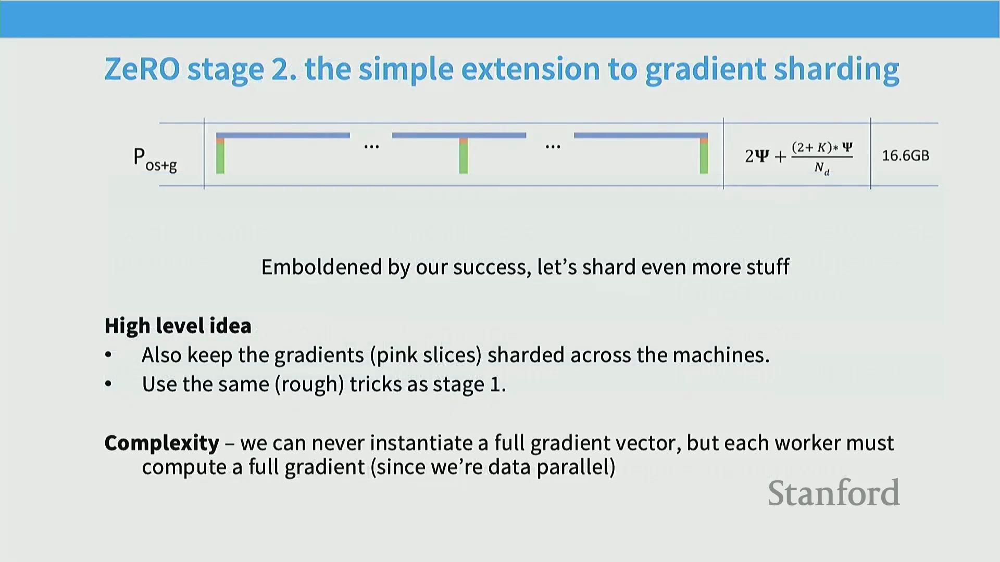

## 逐层通信与实现权衡

为避免 OOM，框架在反向传播期间向计算图(Computational Graph)注册钩子(Hook)。一旦计算出单层(Single Layer)的梯度，立即触发的规约操作(Reduce Operation)会将该层梯度数据分发至其所属的 GPU。传输完成后，本地梯度张量(Local Gradient Tensors)会被立即释放，从而防止内存累积(Memory Accumulation)。尽管这种逐层同步(Layer-by-Layer Synchronization)因频繁的通信调用会引入稍高的延迟(Latency)，但其消耗的总带宽(Total Bandwidth)与单次全局 Reduce-Scatter 操作完全一致。 这种增量方法在维持训练稳定性(Training Stability)的同时成功消除了梯度冗余(Gradient Redundancy)，为 ZeRO 阶段 3(ZeRO Stage 3) 奠定了必要基础。阶段 3 将进一步将分片原则扩展至模型参数本身，以实现完全优化的分布式训练。

---

## ZeRO 阶段 3 与完全分片数据并行（FSDP）简介
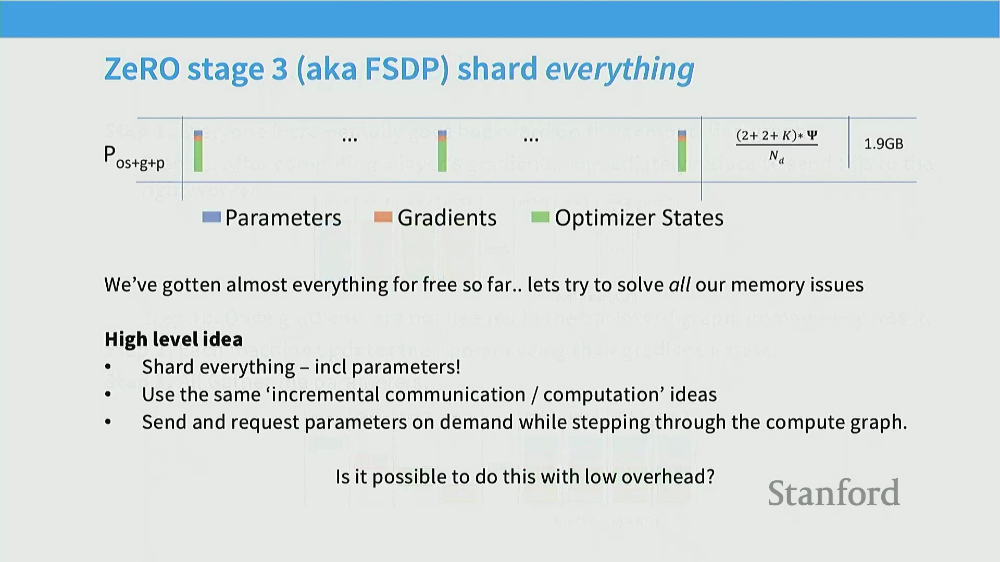
基于 ZeRO 阶段 1(ZeRO Stage 1) 与阶段 2(ZeRO Stage 2) 的渐进式内存优化(Progressive Memory Optimization)，ZeRO 阶段 3(ZeRO Stage 3) 通过在所有可用 GPU 上对*所有*模型组件（参数(Parameters)、梯度(Gradients)和优化器状态(Optimizer States)）进行分片(Sharding)，实现了极致的内存效率(Memory Efficiency)。在现代框架中，该策略通常以完全分片数据并行(Fully Sharded Data Parallel, FSDP)的形式部署，引入了一种更为复杂但极其高效的训练范式(Training Paradigm)。每个设备不再于本地维护完整的模型权重(Model Weights)，而仅负责存储对应的一小部分分片(Shards)。在执行过程中，随着计算图(Computational Graph)的遍历，参数会按需动态加载(Dynamic Fetching)。尽管该策略本质上增加了通信开销(Communication Overhead)，但其架构设计成功掩盖了网络延迟(Network Latency)，提供了前所未有的内存扩展能力(Memory Scalability)，使得训练规模远超单设备显存限制(VRAM Limits)的模型成为可能。

## 逐层按需参数生命周期
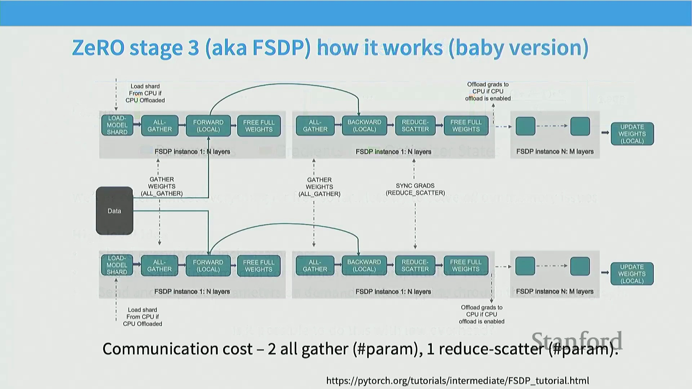
FSDP 的运行核心围绕严格的逐层内存管理周期(Layer-by-Layer Memory Management Cycle)展开。由于没有任何单个 GPU 持有完整模型，标准的全量前向传播(Full Forward Pass)无法直接实现。相反，随着计算沿网络深度(Network Depth)推进，每个设备会发起一次 `all-gather` 操作，仅重构当前层所需的权重(Weights)。在该层的前向计算(Forward Computation)完成后，这些权重会立即从内存中释放。这种“加载-计算-释放”(Load-Compute-Release)序列在反向传播(Backward Pass)中被完全一致地复现：收集参数、计算梯度(Gradients)、通过 `reduce-scatter` 规约至指定的目标分片(Target Shard)，随后立即释放内存。通过确保完整的参数或梯度张量(Gradient Tensors)永远不会同时实例化(Instantiate)于内存中，每个设备的内存消耗(Memory Consumption)几乎随 GPU 数量呈线性比例下降。

## 通过计算与通信重叠隐藏延迟
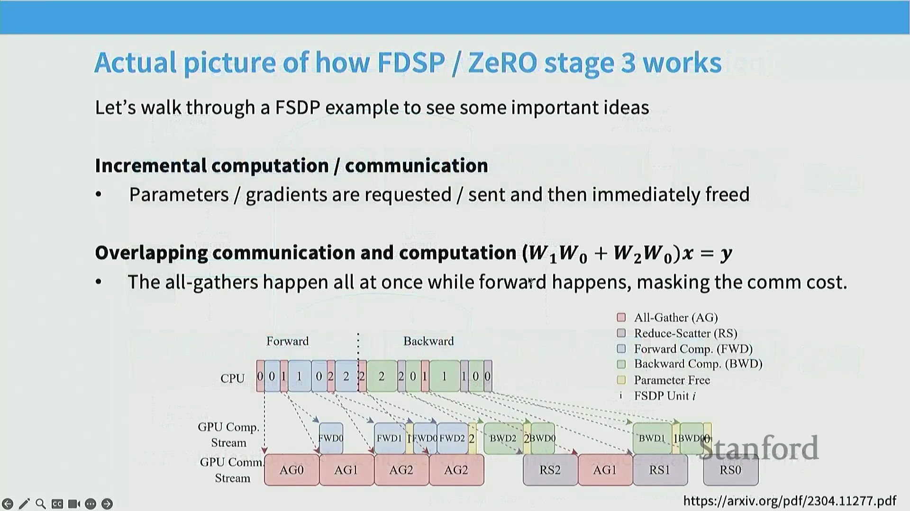
ZeRO 阶段 3(ZeRO Stage 3) 理论上会产生约等于模型总参数量三倍的通信开销(Communication Overhead)；若采用同步执行(Synchronous Execution)模式，这将构成严重的训练瓶颈(Training Bottleneck)。FSDP 通过积极的重叠通信与计算(Communication-Computation Overlap)机制来规避此问题，其工作原理类似于硬件预取(Hardware Prefetching)。当 GPU 正在密集计算*当前*层的矩阵乘法(Matrix Multiplication)时，系统会异步派发(Asynchronously Dispatch)命令以预取*下一*层的参数。通过在计算周期(Compute Cycle)内提前触发后续的 `all-gather` 操作，网络延迟(Network Latency)被有效地隐藏于有效计算工作之后。该调度策略(Scheduling Strategy)最大限度地减少了 GPU 空闲时间（即“气泡”(Bubbles)），确保数据能在需要时精准就绪。同时，它允许被重复使用的权重（常见于 Transformer 注意力块(Attention Blocks)中）直接利用缓存数据(Cached Data)，无需发起冗余的网络请求。

## 实际内存权衡与缓冲区管理
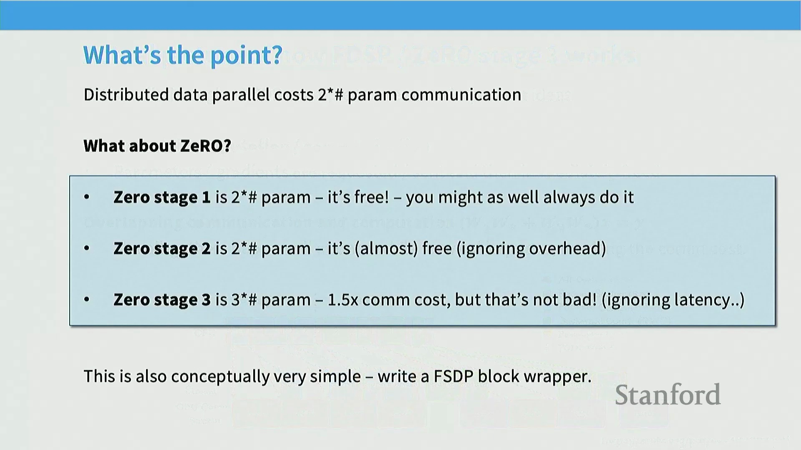
尽管效率极高，但实现逐层参数流式传输(Parameter Streaming)也会引入实际的内存与调度限制(Scheduling Constraints)。该架构需要维护一个专用的缓冲区池(Buffer Pool)，用于在计算内核(Compute Kernels)执行前异步暂存加载的权重。此外，尽管 FSDP 成功消除了参数和梯度的冗余，激活内存(Activation Memory)仍然是制约扩展的关键瓶颈(Scalability Bottleneck)。中间激活张量(Intermediate Activation Tensors)仍会随模型深度(Model Depth)和批次大小(Batch Size)线性累积，这使得激活内存往往成为新的性能限制因素。为了在超大规模(Ultra-Large Scale)下保持最佳的资源利用率(Resource Utilization)，FSDP 通常需与激活检查点(Activation Checkpointing)或 CPU/NVMe 卸载(Offloading)等辅助技术结合使用。

## ZeRO 阶段总结与架构无关的优势
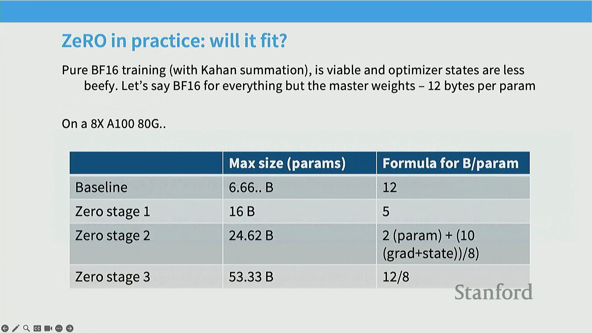
ZeRO 框架(ZeRO Framework)为分布式训练提供了一种循序渐进且高度实用的解决方案。ZeRO 阶段 1(ZeRO Stage 1) 对优化器状态(Optimizer States)进行分片，相较于朴素数据并行(Naive Data Parallelism)几乎不引入额外的通信开销。ZeRO 阶段 2(ZeRO Stage 2) 将该策略扩展至梯度(Gradients)，在保持总带宽(Total Bandwidth)不变的前提下，于反向传播中引入增量通信(Incremental Communication)。ZeRO 阶段 3(ZeRO Stage 3) 通过对参数(Parameters)进行分片完成优化闭环。尽管其基准通信带宽需求增至三倍，但凭借精密的计算-通信重叠(Compute-Communication Overlap)技术，提供了无可比拟的内存扩展能力(Memory Scalability)。FSDP/ZeRO 的一项决定性优势在于其架构无关性(Architecture-Agnostic)；它作为一个透明的包装器(Transparent Wrapper)运行，无需针对底层神经网络结构(Neural Network Architecture)进行深度修改或剖析。这种抽象机制(Abstraction Mechanism)使其能够无缝集成至任意模型代码库(Model Codebase)中，奠定了其作为现代大规模 AI 训练基础设施(Training Infrastructure)核心标准的地位。

---

## 内存扩展极限与 FSDP 的优势
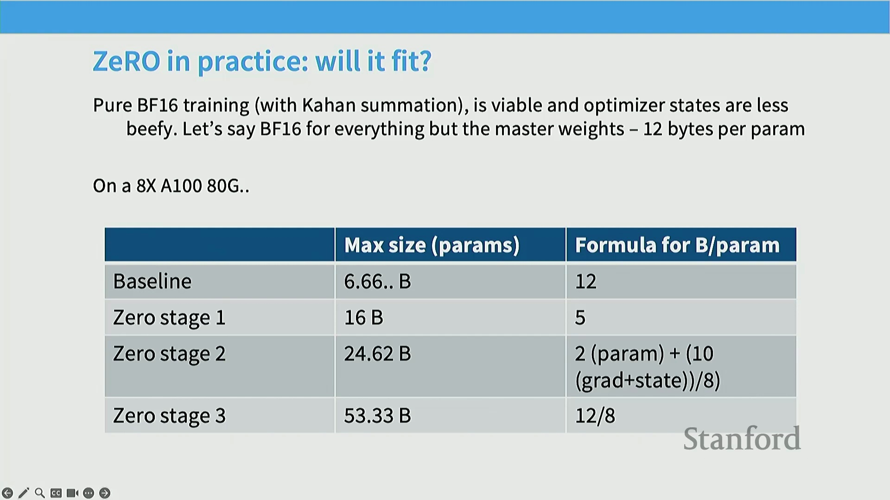
在 8 卡 A100 节点(8-GPU A100 Node)上，基础配置通常在显存(VRAM)耗尽前最多只能容纳约 60 亿参数(6B Parameters)的模型。相比之下，部署 ZeRO 阶段 3 (ZeRO Stage 3) / 完全分片数据并行(Fully Sharded Data Parallel, FSDP)可将此上限推高至约 500 亿参数(50B Parameters)，充分展示了通过智能分片(Intelligent Sharding)所能实现的巨大内存效率提升(Memory Efficiency Gains)。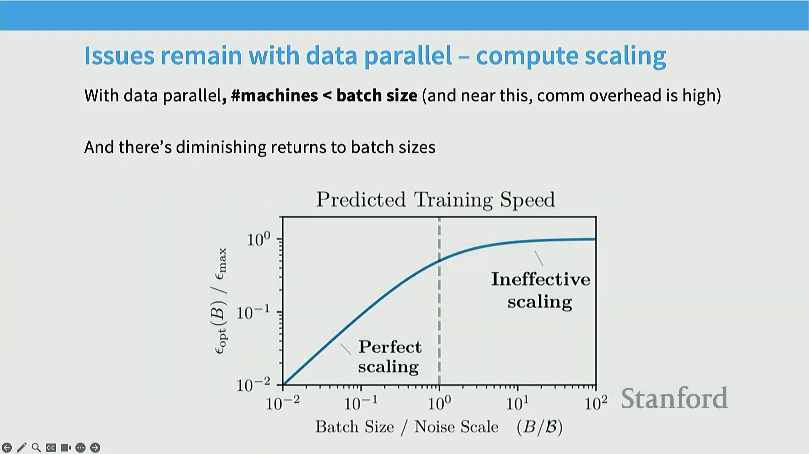 然而，必须严格区分 FSDP 与真正的模型并行(True Model Parallelism)。尽管 FSDP 对参数进行了分片(Sharding)，但在每次前向与反向传播(Forward and Backward Pass)过程中，仍需在设备间频繁同步(Synchronize)这些参数。相反，真正的模型并行会将参数永久固定(Pinned)在特定设备上，设备间仅通信中间激活值(Intermediate Activations)。

## 集合通信操作与术语澄清
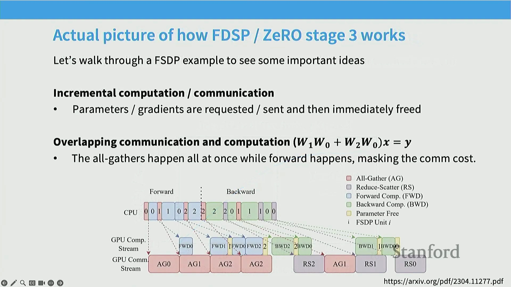
关于用于分发模型权重(Model Weights)的具体集合通信原语(Collective Communication Primitives)，尤其是为何优先选择 `all-gather` 而非 `broadcast`，常引发疑问。若参数分片(Parameter Shards)最初仅驻留(Reside)于单个设备，理论上 `broadcast` 亦能达到相同效果。然而，在生产环境实现(Production Implementation)中，`all-gather` 是标准选择，这得益于其对称性(Symmetry)、对非均匀初始分片布局(Non-uniform Initial Sharding Layouts)的鲁棒性(Robustness)，以及在不同框架架构(Framework Architectures)下的灵活性。

## 批次大小作为有限的计算资源
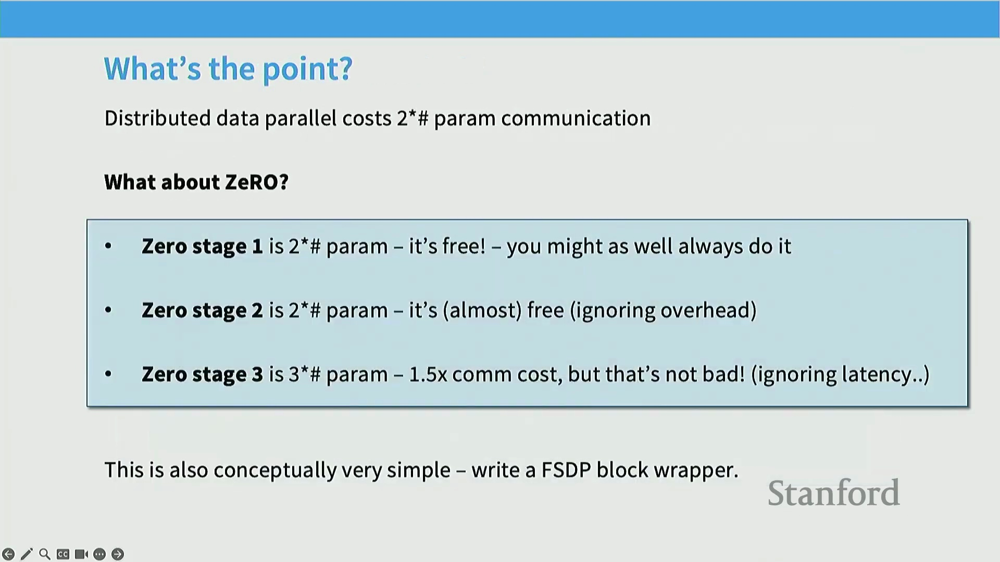
分布式训练中的一个基础限制在于，必须将批次大小(Batch Size)视为一种有限且关键的资源。数据并行(Data Parallelism)的扩展规模受限于全局批次大小(Global Batch Size)，因为每个加速卡(Accelerator)至少需处理一个样本(Sample)。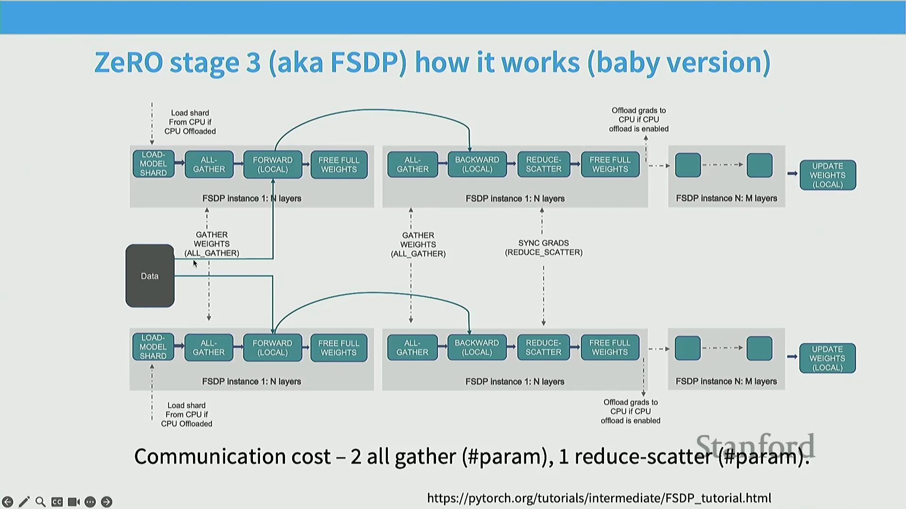 此外，OpenAI 关于“关键批次大小(Critical Batch Sizes)”的研究表明，超过特定阈值后，优化效率会出现显著的边际递减效应(Diminishing Returns)。跨越该临界点(Critical Point)后，降低梯度噪声(Gradient Noise)的收益微乎其微，训练进度将根本性地受限于梯度更新步数(Total Gradient Updates)的总量，而非统计方差(Statistical Variance)的进一步降低。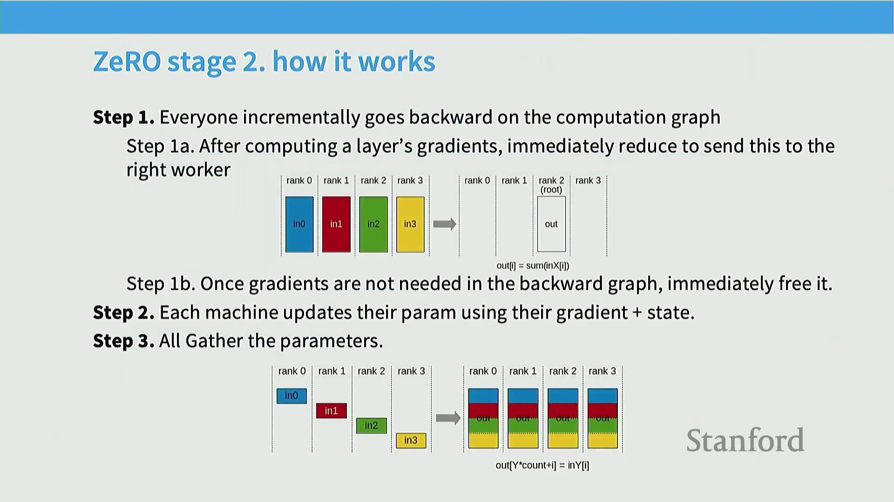 这一现实为纯数据并行(Pure Data Parallelism)的可扩展性(Scalability)设定了硬性上限(Hard Upper Bound)。

## 转向模型并行
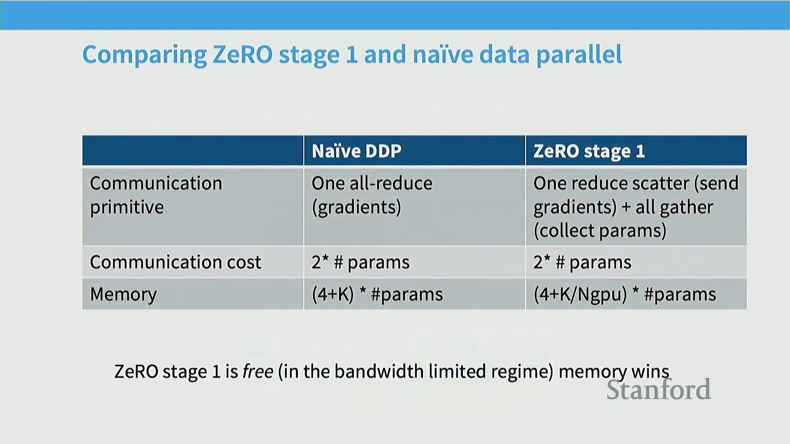
ZeRO 系列变体(ZeRO Variants)面临固有的局限性(Inherent Limitations)：阶段 1 和 2 无法提升最大模型容量(Maximum Model Capacity)；而阶段 3 虽引入了通信延迟(Communication Latency)，且其关键局限在于无法降低激活内存占用(Activation Memory Footprint)。为在不盲目增大批次大小的前提下扩展模型规模，训练架构必须转向模型并行(Model Parallelism)。该方法将模型权重永久划分(Partition)至多个 GPU 上，从而将通信负担(Communication Overhead)从庞大的参数张量(Parameter Tensors)转移至通常体积更小的中间激活张量(Intermediate Activation Tensors)。两大主流范式为流水线并行(Pipeline Parallelism)与张量并行(Tensor Parallelism)。

## 流水线并行：概念与气泡问题
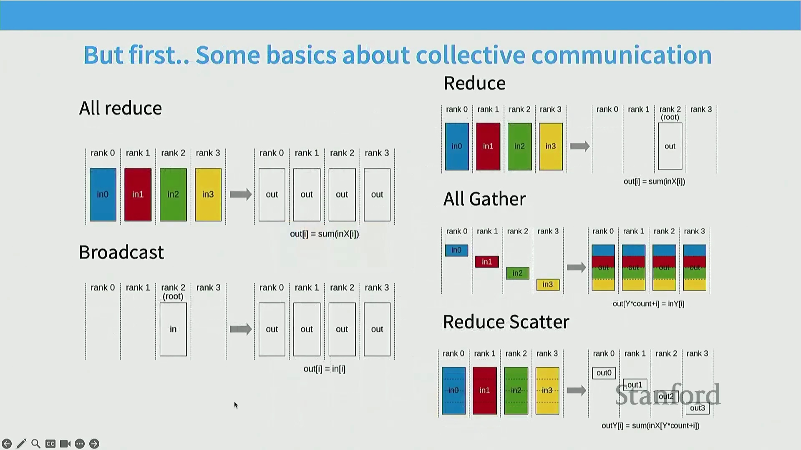
流水线并行在概念上于网络层边界(Network Layer Boundaries)处对深度神经网络进行切分，将连续的层块(Consecutive Layer Blocks)分配给不同的 GPU。在前向传播(Forward Pass)时，激活值(Activations)从一个阶段(Stage)流向下一个阶段；而在反向传播(Backward Pass)时，梯度(Gradients)则逆向流动。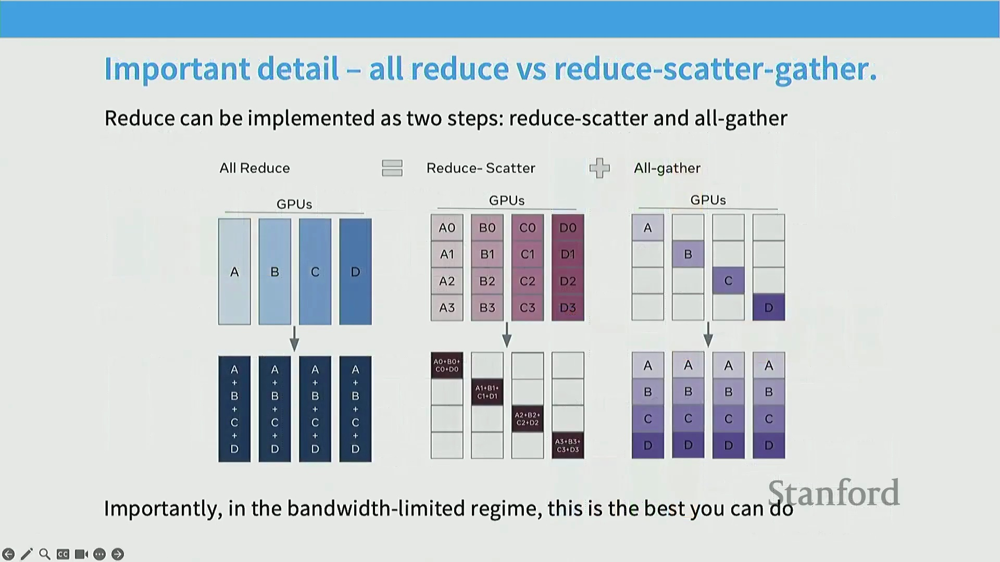 然而，朴素实现(Naive Implementation)会遭遇灾难性的效率低下(Efficiency Loss)。顺序处理(Sequential Processing)单个批次会产生巨大的空闲期，即“流水线气泡(Pipeline Bubbles)”，此时下游 GPU(Downstream GPUs)必须等待上游计算完成。在此情况下，硬件利用率(Hardware Utilization)会骤降至约 1/N，意味着增加多个 GPU 仅能获得相当于单设备的吞吐量(Throughput)。

## 微批次缓解流水线气泡
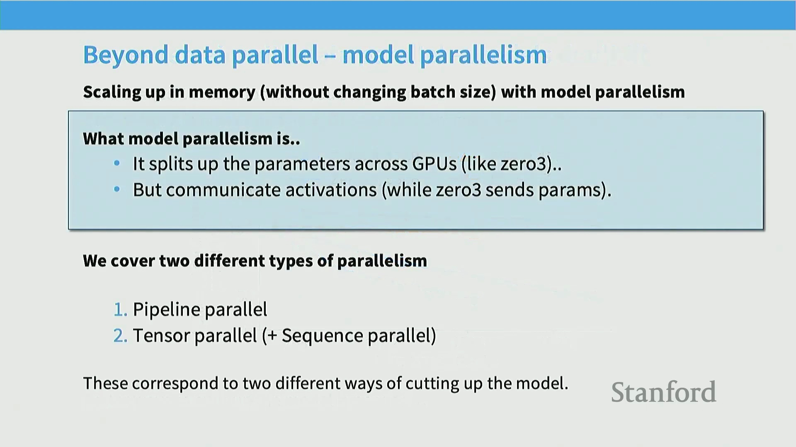
缓解流水线气泡的标准方案是采用微批次(Micro-batching)技术。通过将全局批次拆分为更小的微批次，GPU 在完成当前任务后可立即开始处理后续数据点，从而有效实现各阶段间的计算重叠(Computation Overlap)。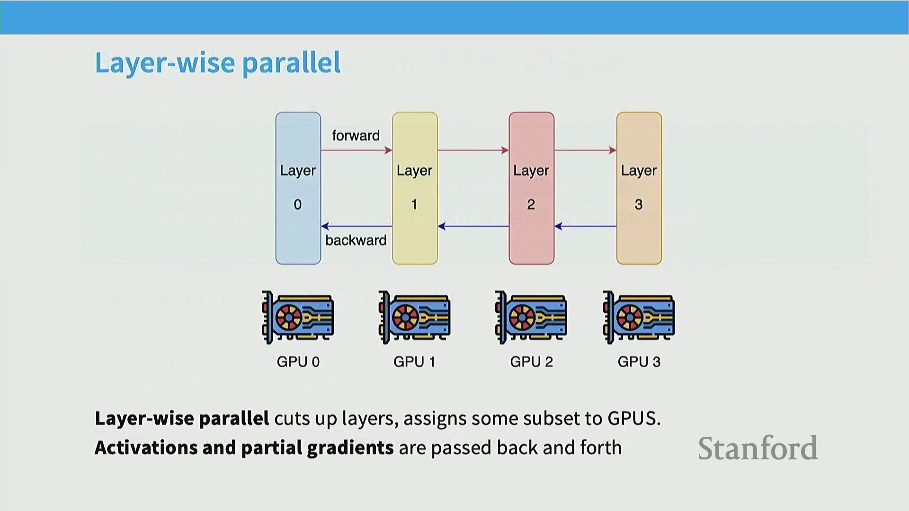 理论开销比(Theoretical Overhead Ratio)定义为 `(stages - 1) / micro_batches`。增加微批次数量可稀释气泡的相对影响。然而，该策略直接消耗了有限的批次大小资源，如前所述，这本身也会引发优化效率的边际递减效应。

## 流水线并行的战略价值
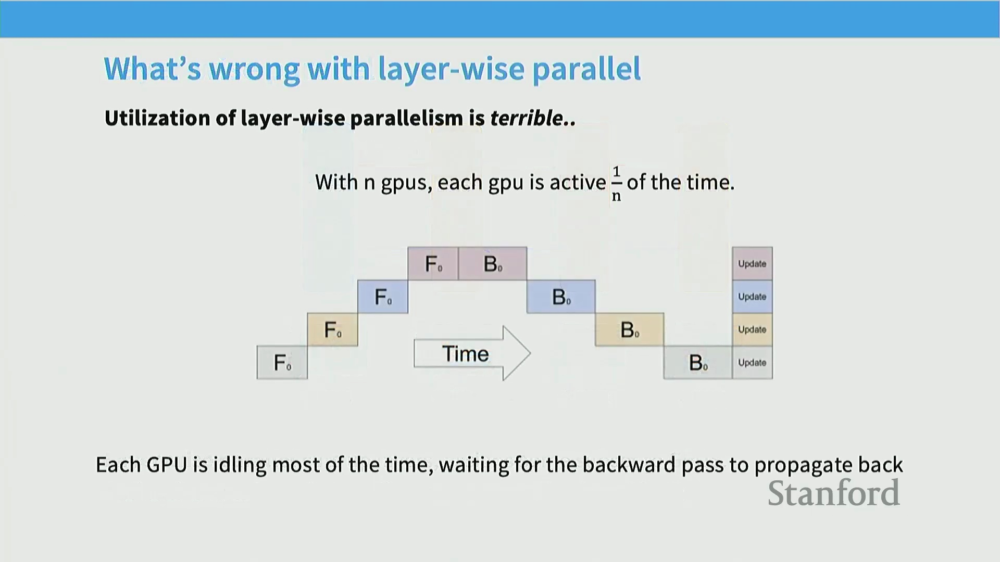
尽管存在气泡开销(Bubble Overhead)与批次大小的权衡(Trade-off)，流水线并行在大规模训练(Large-Scale Training)中依然不可或缺。与 ZeRO 阶段 3 不同，该方法将激活值在物理上划分(Partition)至不同设备，直接解决了困扰单机或完全复制方案的激活内存瓶颈(Activation Memory Bottleneck)问题。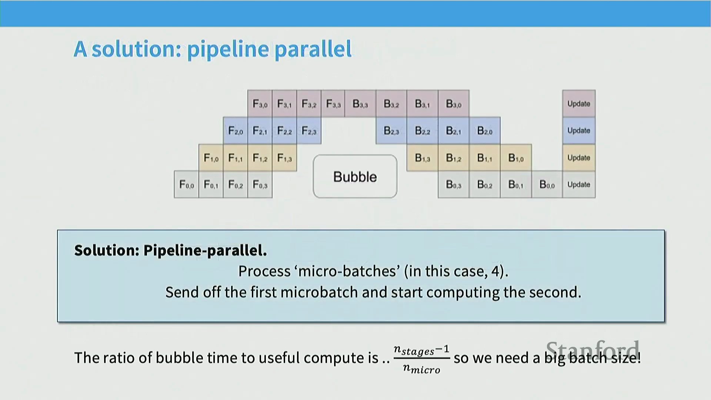 此外，其通信模式完全依赖于点对点(Point-to-Point)的激活值传输，而非昂贵的全局集合通信操作(Global Collective Communication Operations)。这种定向通信特征(Directional Communication Pattern)，结合与其他并行技术的策略性混合(Hybrid Parallelism)，使开发者能够将模型容量(Model Capacity)扩展至远超数据并行的限制，同时维持高效的硬件利用率。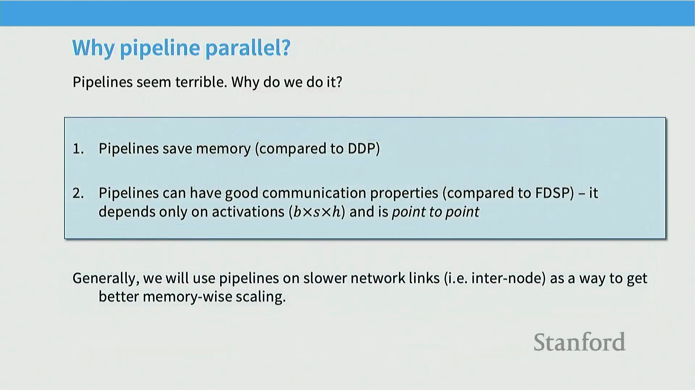

---

## 流水线并行与网络拓扑限制
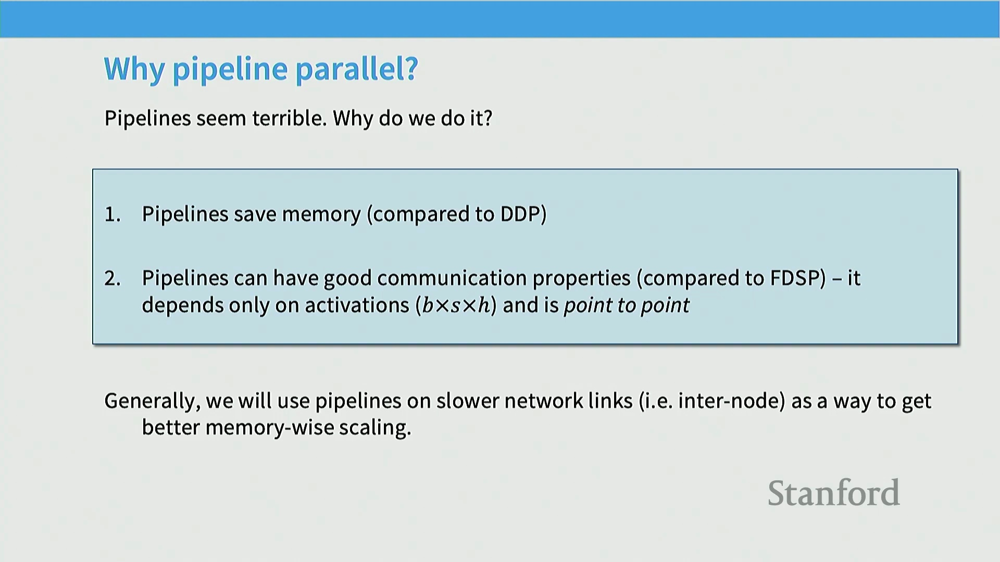
流水线并行(Pipeline Parallelism)通常被策略性地部署在带宽较低的网络链路（如节点间(Inter-node)或机架间(Inter-rack)连接）上。在此类场景中，激活值(Activations)的点对点通信(Point-to-Point Communication)远比消耗大量带宽的集合通信操作(Collective Communication Operations)更具优势。相比之下，Google TPU 等架构采用高带宽的二维网格拓扑(2D Mesh Topology)，能够突破典型 GPU 集群的规模上限（如 256 卡）。通过在更大规模的设备间维持高速的全互联网络，此类架构显著降低了对流水线并行的依赖。

## 批次大小利用率与气泡缓解
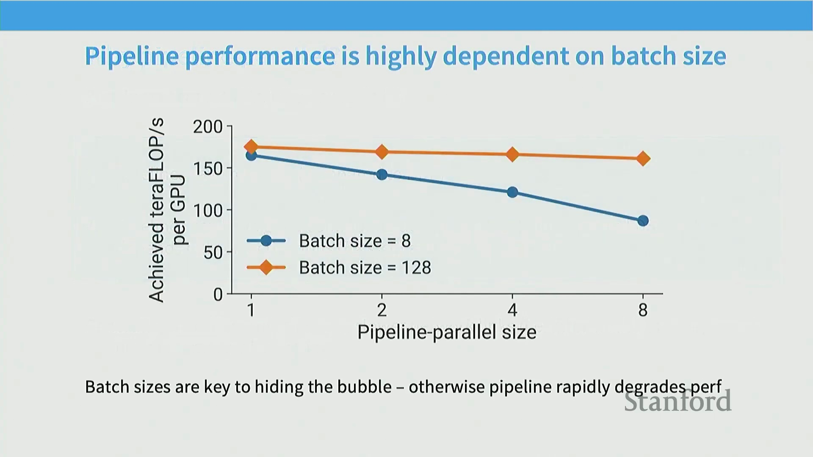
流水线并行(Pipeline Parallelism)的效率高度依赖于批次大小(Batch Size)。性能分析表明，在较小的批次大小（如 8）下，增加流水线深度(Pipeline Depth)会导致 GPU 利用率因出现明显的空闲期（即“气泡”(Pipeline Bubbles)）而骤降。反之，采用较大的批次大小（如 128）能有效掩盖这些气泡，在合理的流水线级数(Pipeline Stages)下维持较高的硬件利用率。这进一步印证了批次大小是一种关键的有限资源，直接决定了流水线的运行效率。

## 高级调度：零气泡流水线技术
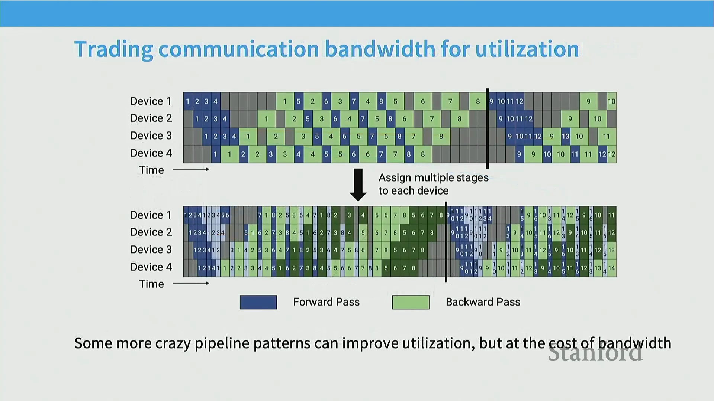
为克服固有的气泡低效问题，高级调度策略如零气泡流水线(Zero-Bubble Pipelining，或称“双流水线”)将反向传播(Backward Pass)拆分为两个独立阶段：激活值梯度(Activation Gradients)的反向传播与权重梯度(Weight Gradients)的计算。由于权重梯度的计算并不严格串行依赖于前向激活链(Forward Activation Chain)，因此可对其进行动态重调度(Dynamic Rescheduling)。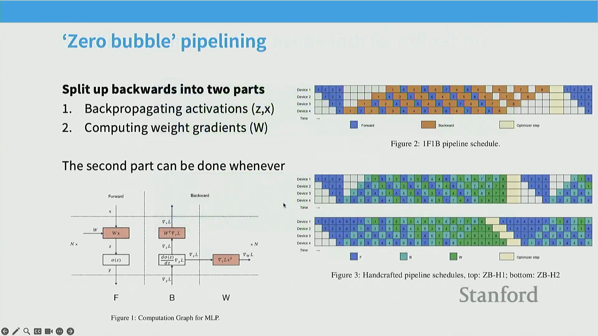 调度器(Scheduler)通过将这些独立的权重计算任务插入传统空闲的流水线间隙(Pipeline Gaps)中，实现了近乎连续的 GPU 利用率，从而有效消除了标准流水线气泡带来的性能损耗。

## 实现复杂度与工程现实
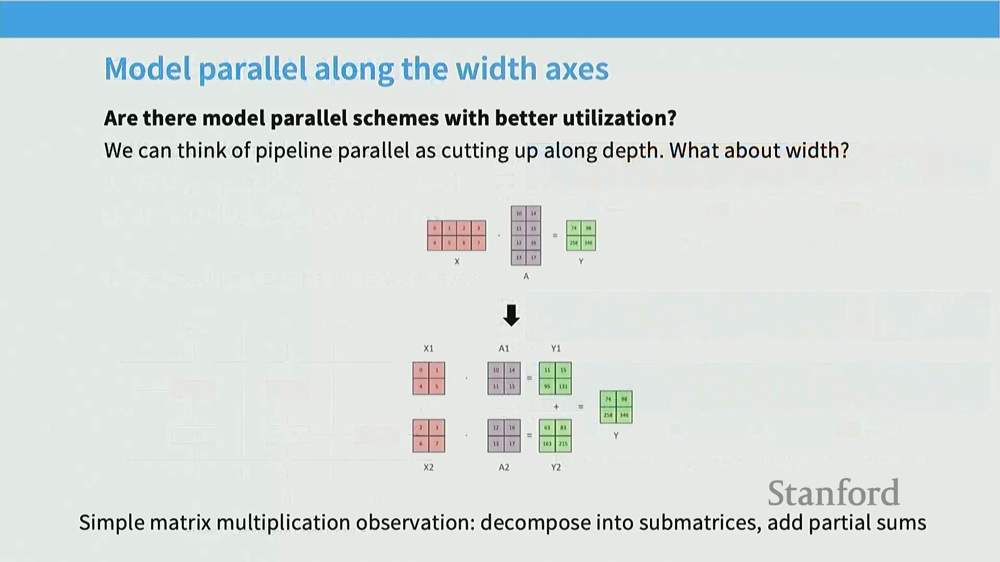
尽管在理论上十分优雅，但零气泡调度技术(Zero-Bubble Scheduling)引入了极高的实现复杂度(Implementation Complexity)。该技术需要深度介入自动微分引擎(Autograd Engine)，并依赖复杂的队列管理(Queue Management)来追踪计算依赖关系(Computational Dependencies)。在实际工程中，这类系统以极难维护而著称。前沿 AI 实验室的经验表明，流水线基础设施(Pipeline Infrastructure)往往严重依赖特定的“核心骨干(Load-bearing)”工程师，这充分暴露了此类高度优化的分布式训练框架背后高昂的工程维护成本(Engineering Maintenance Costs)。

## 张量并行：矩阵宽度维度的分解
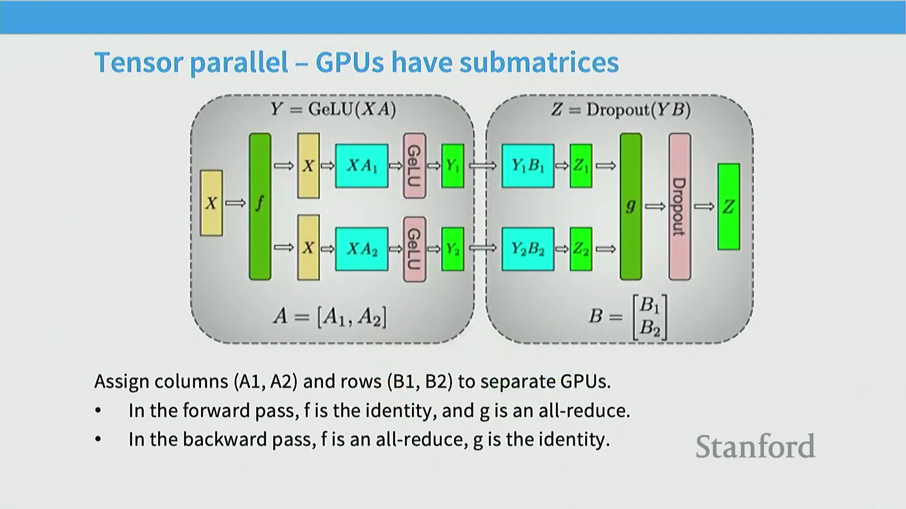
张量并行(Tensor Parallelism)通过在矩阵乘法(Matrix Multiplication)的“宽度”维度上对模型进行切分，提供了一种概念更简洁且应用更广泛的替代方案。与按层顺序拆分(Layer-wise Splitting)不同，该方法将大型权重矩阵(Weight Matrices)划分为多个子矩阵(Sub-matrices)并分发至不同设备。在前向传播(Forward Pass)中，输入激活值(Input Activations)被复制，各 GPU 分别计算部分矩阵乘法结果，随后通过 `all-reduce`(全规约)操作同步局部结果以生成最终输出。反向传播(Backward Pass)则逆向执行该流程：先通过 `broadcast`(广播)分发梯度，随后在计算依赖边界处执行 `all-reduce` 以确保数学等价性(Mathematical Equivalence)。

## 硬件限制与节点内应用
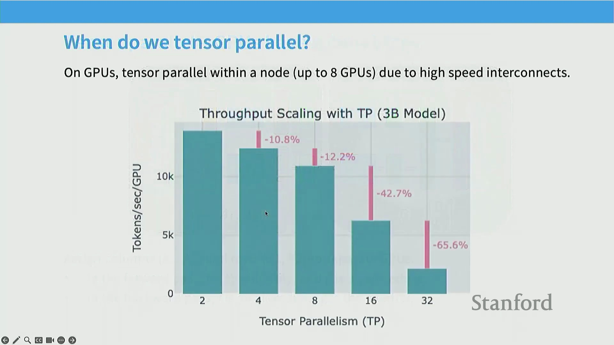
张量并行对通信带宽(Communication Bandwidth)要求极高，几乎需要在每一层设置同步屏障(Synchronization Barrier)，以便在每个前向-反向传播周期中交换两次中间激活值(Intermediate Activations)。因此，其部署遵循一条基本经验法则(Empirical Rule)：张量并行必须严格限制在单个物理节点(Physical Node)内部。通过将通信范围限定在超高速的机内互连链路(Intra-node Interconnect)（如单节点内 8 张 GPU 间的 NVLink）上，开发者能够将延迟损耗(Latency Overhead)降至最低，并维持最佳的计算吞吐量(Compute Throughput)。

---

## 张量并行吞吐量与硬件限制
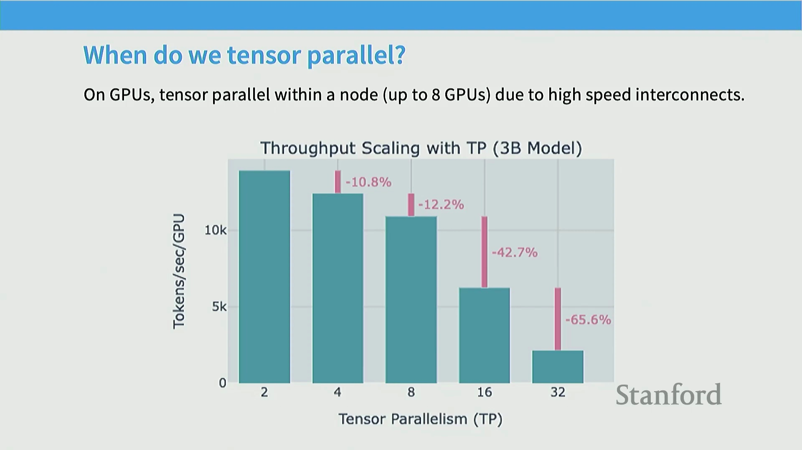
尽管张量并行(Tensor Parallelism, TP)提供了一种在设备间分配矩阵乘法(Matrix Multiplication)的直观方法，但它会引入可测量的通信开销(Communication Overhead)。基准测试(Benchmark)表明，在中等 TP 规模下吞吐量(Throughput)会下降 10%–12%，但随着并行度(Parallelism Degree)增加，这一性能损耗呈非线性急剧上升。扩展至 16 个设备可能导致约 42% 的吞吐量下降，而扩展至 32 个设备则会造成高达 65% 的显著性能损失。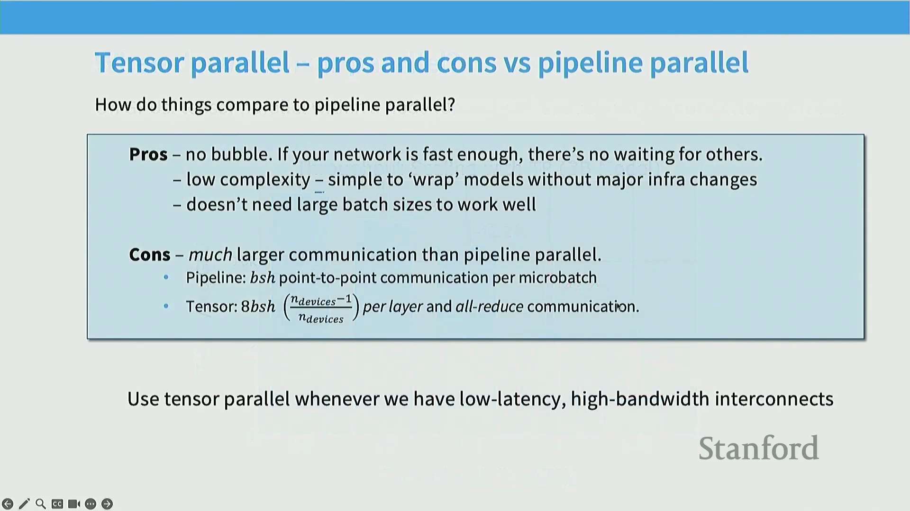 因此，业界标准的 TP 最佳规模(Optimal TP Size)被严格限制在 8 个设备以内。这一限制从根本上由硬件拓扑(Hardware Topology)决定；TP 要求在每一层都进行极高带宽(Ultra-High Bandwidth)、极低延迟(Low Latency)的同步，因此仅在通过 NVLink 等超高速互连(High-Speed Interconnects)连接 GPU 的单个物理节点(Physical Node)内才具备可行性。

## 张量并行与流水线并行及混合部署
与流水线并行(Pipeline Parallelism)不同，张量并行消除了使用较大规模微批次(Large Micro-batches)来掩盖空闲流水线气泡(Pipeline Bubbles)的需求，并避免了零气泡调度(Zero-Bubble Scheduling)所需的极端自动微分(Autograd)调度复杂度。然而，这种实现上的简洁性是以显著更高的通信开销为代价的，它要求每一层都频繁执行 `all-reduce`(全规约)同步。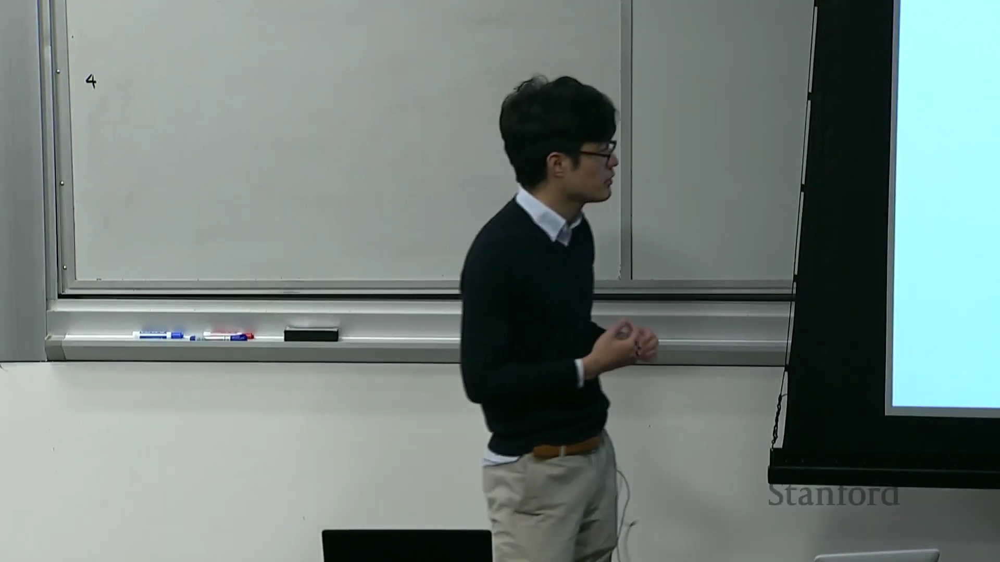 在生产级训练(Production-Grade Training)中，这些并行范式(Parallelism Paradigms)通常被战略性地分层叠加(Hybrid Stacking)使用，而非孤立应用。标准架构在单个节点内部应用张量并行以最大化节点内带宽效率(Intra-Node Bandwidth Efficiency)，同时在节点间(Inter-Node)部署流水线并行和数据并行(Data Parallelism)以扩展模型深度和批量处理能力，从而有效规避跨节点互连延迟瓶颈(Cross-Node Interconnect Latency Bottlenecks)。

## 动态激活内存瓶颈
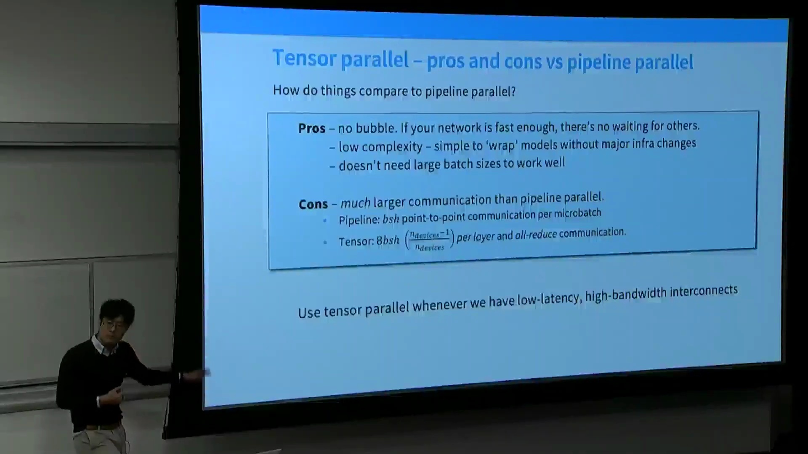
尽管模型参数(Model Parameters)和优化器状态(Optimizer States)可以被激进地分片(Aggressively Sharded)，但激活内存(Activation Memory)仍然是一个持久且高度动态的扩展瓶颈(Scalability Bottleneck)。在标准训练迭代(Training Iteration)过程中，显存(VRAM)使用量波动剧烈：激活值在前向传播(Forward Pass)期间线性累积，在反向传播(Backward Pass)中期达到峰值（此时梯度正在累积而旧的激活值尚未释放），随后逐渐下降。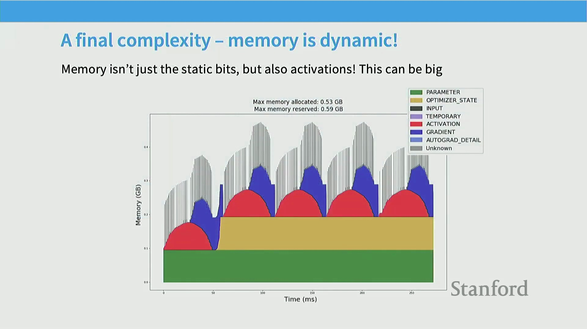 随着模型规模扩大，即使采用重度并行化(Heavy Parallelization)，单设备的激活内存占用仍会持续增长，因为某些计算组件无法通过标准的矩阵并行策略进行有效划分(Efficient Partitioning)。

## 张量并行在激活值上的局限性
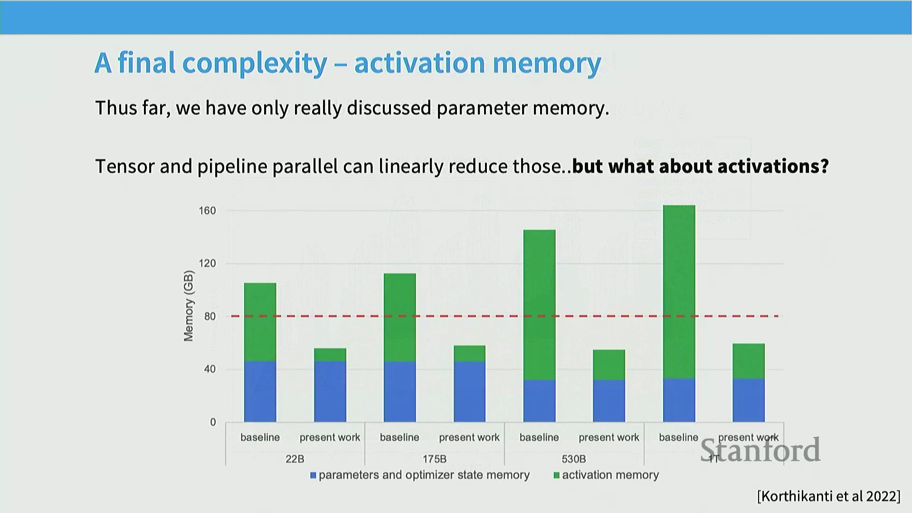
拆解每层的激活内存公式(Activation Memory Formula)可揭示两个主要组成部分：随隐藏维度(Hidden Dimension)缩放的项（由 MLP 和权重矩阵驱动），以及随序列长度(Sequence Length)呈二次方缩放(Quadratic Scaling)的项（由注意力 Softmax 操作驱动）。应用张量并行成功地将与 MLP 相关的激活值按并行设备数量（$t$）进行了分片，但它对显著的“残留项(Straggler Term)”却无能为力。这部分残留内存对应于层归一化(Layer Normalization, LayerNorm)、Dropout 和残差连接(Residual Connections)等逐点操作(Point-wise Operations)。这些操作在序列位置上独立运行，仅靠权重矩阵分片无法降低其内存占用。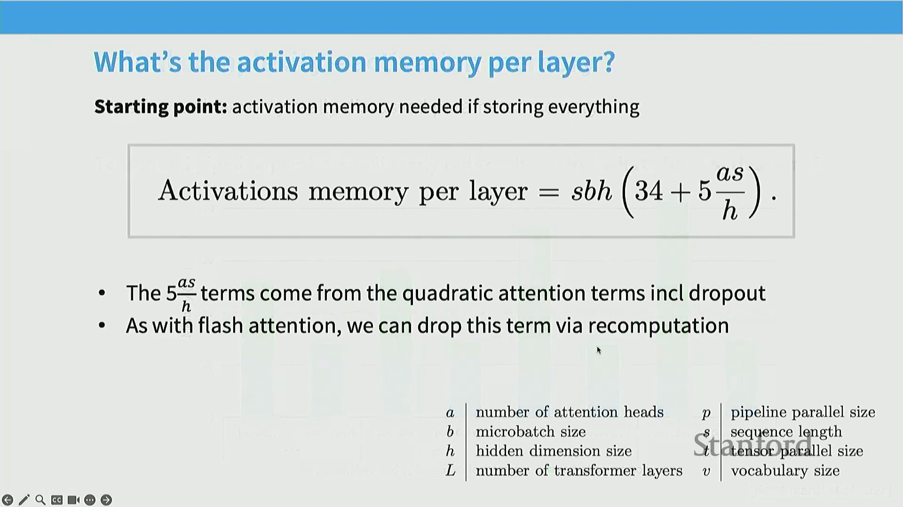

## 序列并行与同步对偶性
为了消除这一剩余开销，序列并行(Sequence Parallelism)直接沿序列维度(Sequence Dimension)对逐点操作进行划分。通过将序列拆分至不同设备，每个加速卡(Accelerator)仅计算层归一化或 Dropout 激活值的部分数据。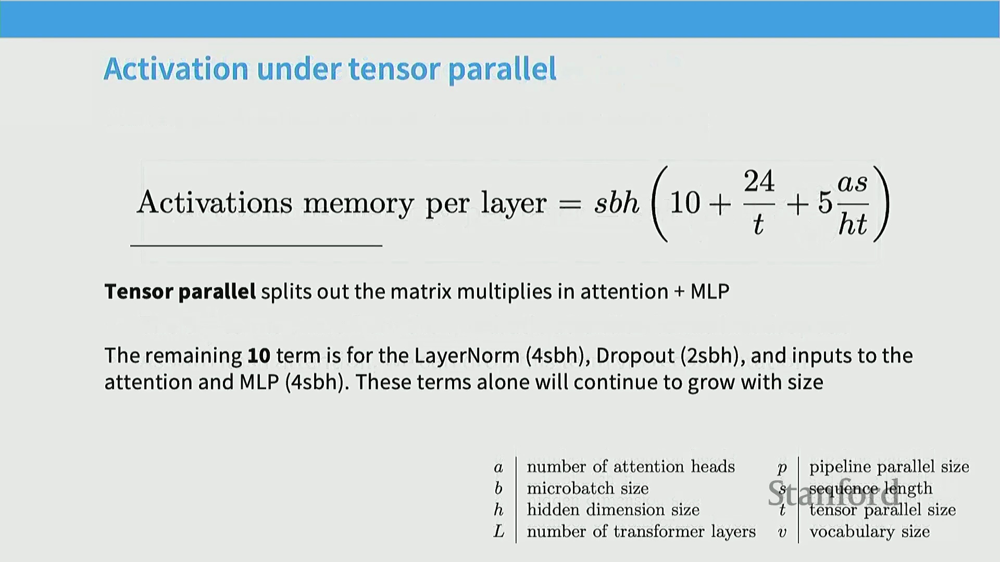 该方法需要明确的同步边界(Synchronization Boundaries)：在依赖完整上下文的操作之前，必须通过 `all-gather`(全收集)收集数据，随后通过 `reduce-scatter`(规约散射)进行分发。反向传播(Backward Pass)则应用完全相反的操作序列，维持严格的数学对偶性(Mathematical Duality)，在确保梯度正确性(Gradient Correctness)的同时，成功分摊了此前未分片层的内存负担(Memory Burden)。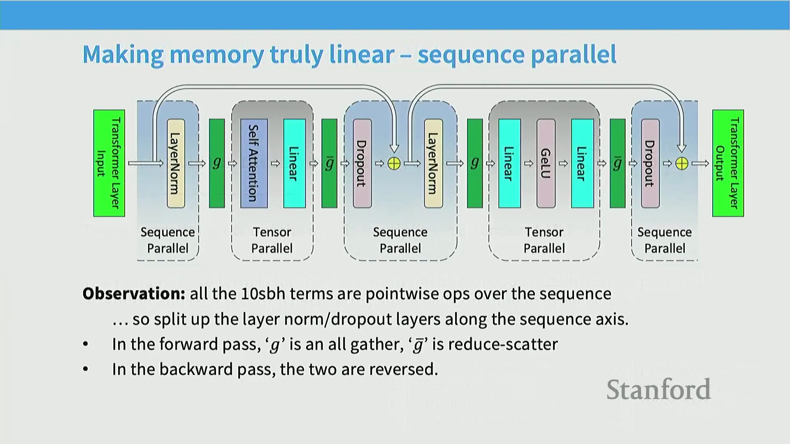

## 终极内存优化策略
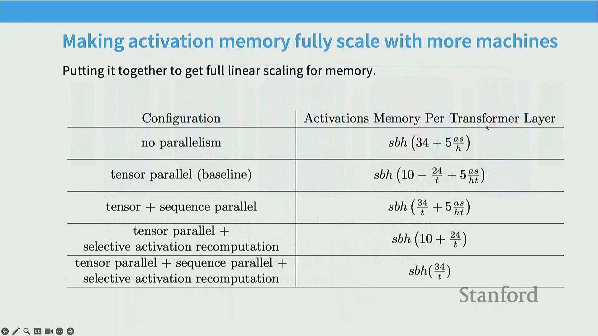
结合这些技术可构建高度优化的内存分布(Highly Optimized Memory Distribution)。张量并行降低了矩阵密集型激活值(Matrix-Intensive Activations)的占用，序列并行解决了残留的逐点操作开销(Point-wise Operation Overhead)，而激活重计算(Activation Recomputation)与高效注意力算法（如 Flash Attention）则有效消除了随序列长度呈二次方增长的内存项。通过这种分层架构方法(Hierarchical Architectural Approach)，每层的激活内存可降至约 `sbh * 6 / t` 的理论下限(Theoretical Lower Bound)。这种复合优化(Composite Optimization)使得训练超大规模模型(Ultra-Large Models)成为可能（否则将超出可用显存限制），充分证明了现代大规模训练依赖于对多种互补并行范式(Complementary Parallelism Paradigms)的精确编排(Precise Orchestration)。

---

## 高级并行范式：上下文并行与专家并行
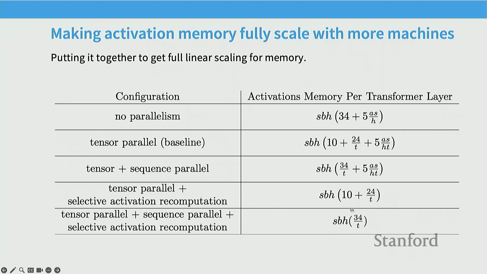
除标准的数据并行(Data Parallelism)、流水线并行(Pipeline Parallelism)和张量并行(Tensor Parallelism)外，还有多种专用策略用于解决特定的扩展瓶颈(Scalability Bottlenecks)。上下文并行(Context Parallelism)通常以环形注意力(Ring Attention)形式实现，它通过将查询(Query)分片至不同设备，并在环形拓扑(Ring Topology)中循环传递键(Key)与值(Value)，以分摊长序列注意力机制(Long-Sequence Attention Mechanism)中呈二次方增长(Quadratic Growth)的计算与内存开销。这与 Flash Attention 的分块(Tiling)逻辑一脉相承，使得跨多机环境下的内存优化在线计算(Online Computation)成为可能。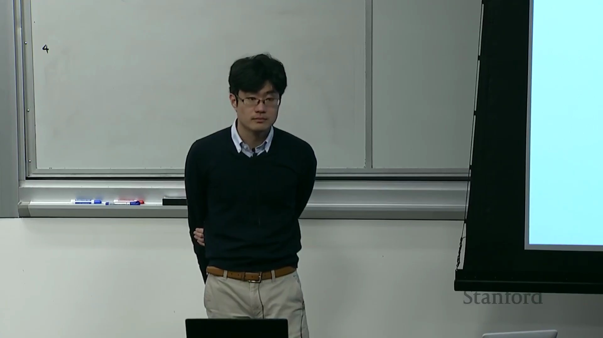 类似地，专家并行(Expert Parallelism)将张量并行的理念延伸至混合专家模型(Mixture of Experts, MoE)架构。通过将各个专家 MLP(Expert MLPs)分布至不同设备，模型得以实现海量参数规模的扩展。然而，与张量并行中可预测的全互联(All-to-All)通信模式不同，专家并行引入了稀疏且动态的路由机制(Routing Mechanism)。这带来了复杂的负载均衡(Load Balancing)与网络挑战，因为根据不同的激活模式(Activation Patterns)，部分专家节点极易成为通信瓶颈(Communication Bottlenecks)。

## 战略权衡与资源分配
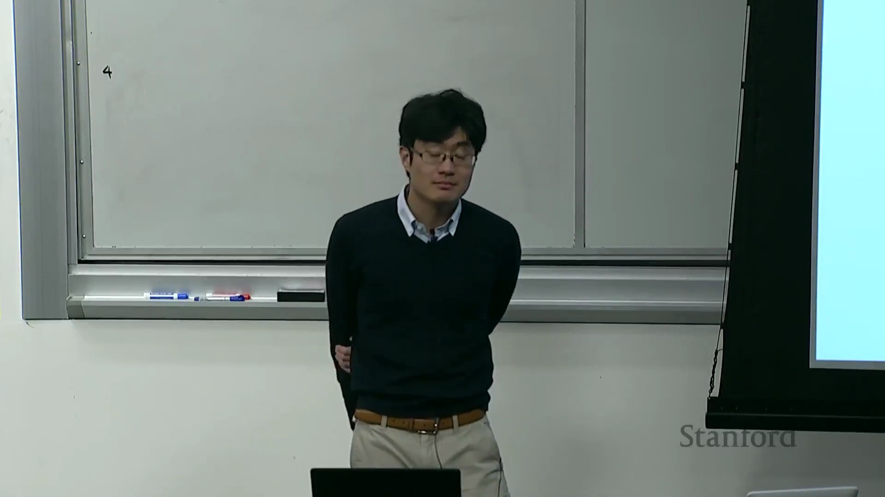
并行策略(Parallelism Strategies)的选择需在三种有限资源间取得平衡：内存(Memory)、带宽与算力(Bandwidth & Compute)，以及批次大小(Batch Size)。对比分析揭示了它们之间各异的权衡关系(Trade-offs)。分布式数据并行(Distributed Data Parallel, DDP/ZeRO-1)的通信带宽开销较低，但无法实现模型容量的内存扩展，其效率严格依赖于较大的批次大小。完全分片数据并行(Fully Sharded Data Parallel, FSDP/ZeRO-3)通过对参数进行分片(Parameter Sharding)实现了内存的线性扩展，但引入了更高的层间通信(Inter-Layer Communication)成本与同步屏障(Synchronization Barriers)，可能降低硬件利用率(Hardware Utilization)。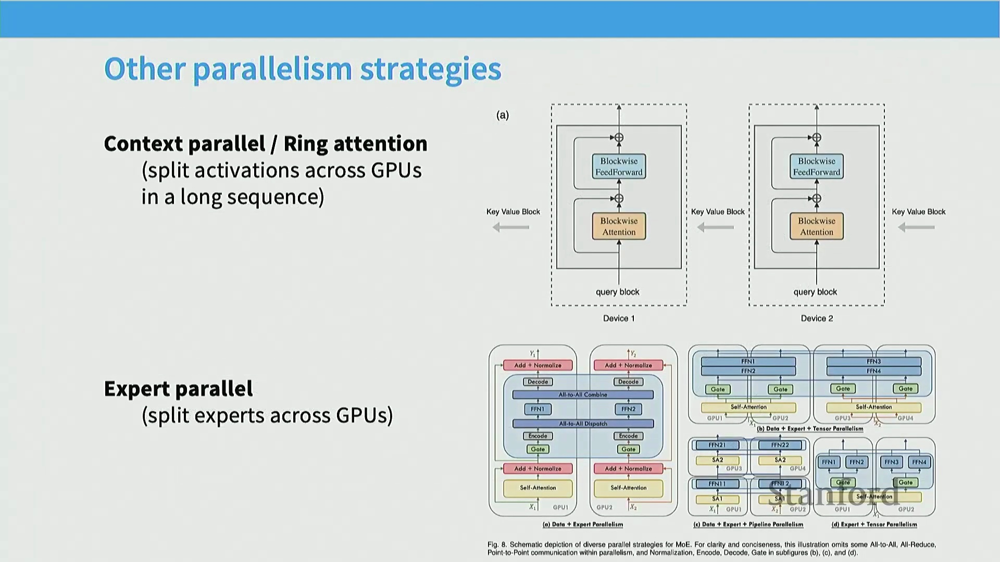 流水线并行通过跨设备分布模型层来有效扩展内存，但其实现极为复杂，且本质上需消耗批次大小资源以掩盖流水线气泡(Pipeline Bubbles)。张量并行虽然极度消耗带宽且仅限于节点内高速互连(Intra-Node High-Speed Interconnects)，但它能在不消耗批次大小或引入流水线空闲时间(Idling)的前提下，有效扩展激活内存。

## 批次大小作为关键的扩展资源
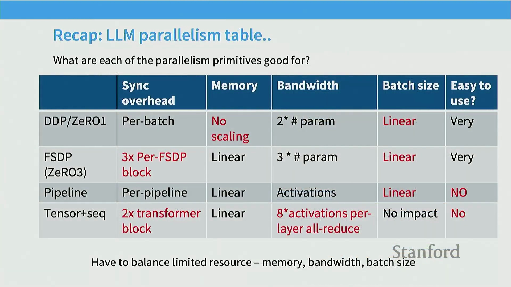
批次大小本质上是一种受限资源(Constrained Resource)，直接决定了系统的通信效率。当在大量 GPU 上使用较小批次大小进行训练时，系统会严格处于通信受限(Communication-Bound)状态，花在同步(Synchronization)上的时间远超计算时间，导致扩展效率低下。随着单 GPU 分配批次大小(Batch Size per GPU)的增加，混合并行策略(Hybrid Parallelism Strategies)成为最优解。将 FSDP 与张量并行结合，可推动系统进入计算受限(Compute-Bound)状态，使算力(FLOPs)得到充分饱和，无需等待网络传输。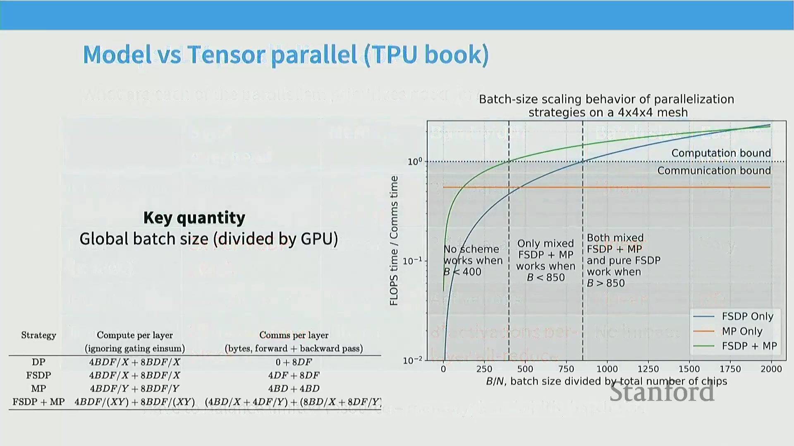 相反，在批次大小充足的情况下，纯 FSDP 或标准数据并行即可胜任，因为较高的计算/通信比(Compute-to-Communication Ratio)能自然掩盖同步延迟(Synchronization Latency)。这一动态特性阐明了为何必须策略性地将批次大小“分配”至不同的并行维度(Parallelism Dimensions)，以最大化整体硬件效率。

## 3D/4D 并行的经验法则
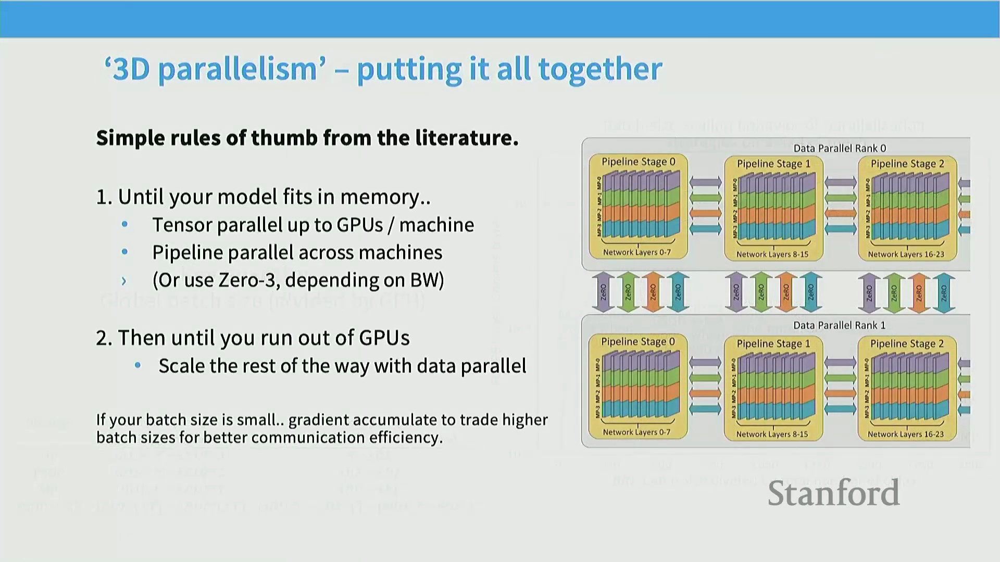
为系统性地应对上述权衡，从业者通常遵循分层部署策略(Hierarchical Deployment Strategy)，业界常称之为 3D 或 4D 并行(3D/4D Parallelism)。其首要原则是确保模型权重(Model Weights)及激活值(Activations)能够适配设备内存。这通常通过在节点内(Intra-Node)极限范围（通常为 8 张 GPU）应用张量并行来实现。一旦模型成功装入内存，跨节点(Inter-Node)的进一步内存扩展则交由 FSDP 或流水线并行处理，具体选型取决于网络带宽容忍度(Network Bandwidth Tolerance)与实现复杂度(Implementation Complexity)。在解除内存约束(Memory Constraints)后，剩余的 GPU 算力将用于数据并行，以最大化总体吞吐量(Compute Throughput)。若可用批次大小过小，难以高效驱动数据并行，则可通过梯度累积(Gradient Accumulation)在本地模拟更大的有效批次(Effective Batch Size)，从而在不增加内存占用(Memory Footprint)的前提下，有效分摊跨节点通信开销。

## 实际应用：Megatron-LM 扩展案例研究
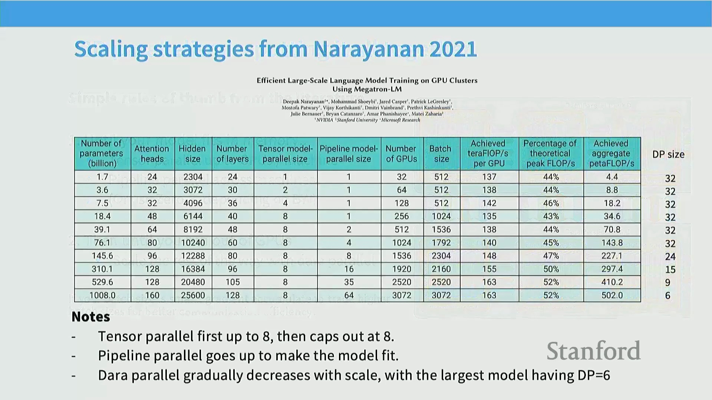
生产级规模(Production-Grade Scale)的训练实践验证了该分层方法(Hierarchical Approach)的可行性。在将模型从 17 亿参数扩展至 1 万亿参数的里程碑实验中，研究人员通过动态调整并行比例，维持了 40%–52% 的理论峰值硬件利用率(Theoretical Peak Hardware Utilization)。系统首先应用张量并行，在单节点内线性扩展至 8 个设备后，受限于互连带宽瓶颈(Interconnect Bandwidth Limits)而达到上限。随着模型深度与宽度超出单节点容量，逐步增加流水线并行以应对不断增长的内存占用(Memory Footprint)。相应地，数据并行度被逐渐削减，因为流水线阶段本身会持续消耗可用的批次大小预算(Batch Size Budget)。该案例研究表明，最优的大规模训练并非追求单一并行维度的极致，而是在整个集群(Cluster)范围内持续动态平衡(Dynamically Rebalance)内存、计算与通信资源。

---

## 线性扩展与最优 3D 并行配置
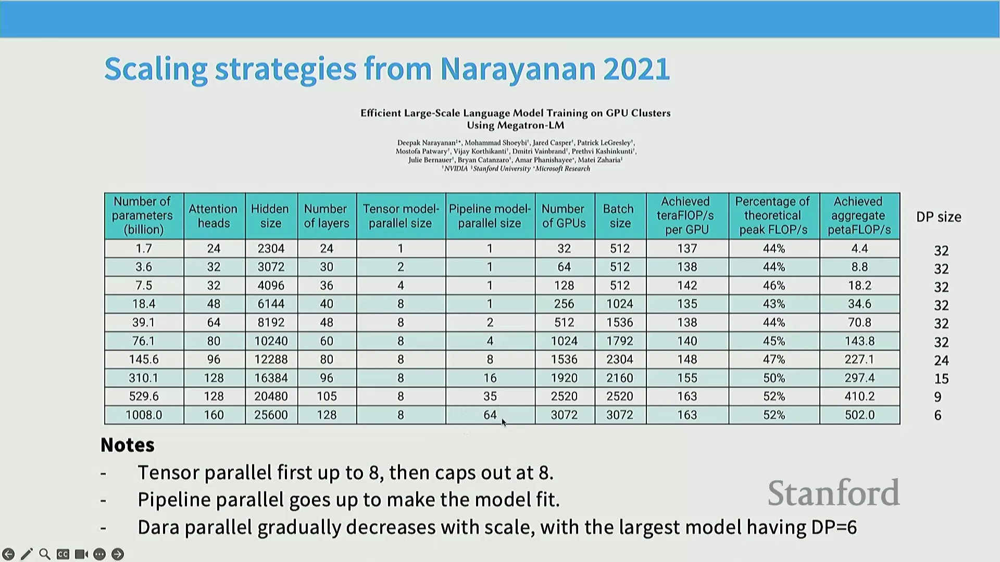
精心编排的 3D 并行(3D Parallelism) 能够实现整体计算吞吐量(Compute Throughput)的线性增长。当并行策略配置得当时，随着集群规模的扩大，单 GPU 实际达到的 FLOPS(Floating Point Operations Per Second) 保持极为平稳，确保增加硬件能直接转化为成比例的训练加速。实证分析始终表明，无论全局批次大小(Global Batch Size)如何变化，张量并行度(Tensor Parallelism Degree)设为 8 始终是最优选择。这种稳定性源于张量并行根本上受限于节点内互连带宽(Intra-Node Interconnect Bandwidth)，使得 8 张 GPU 成为高效同步的自然上限。
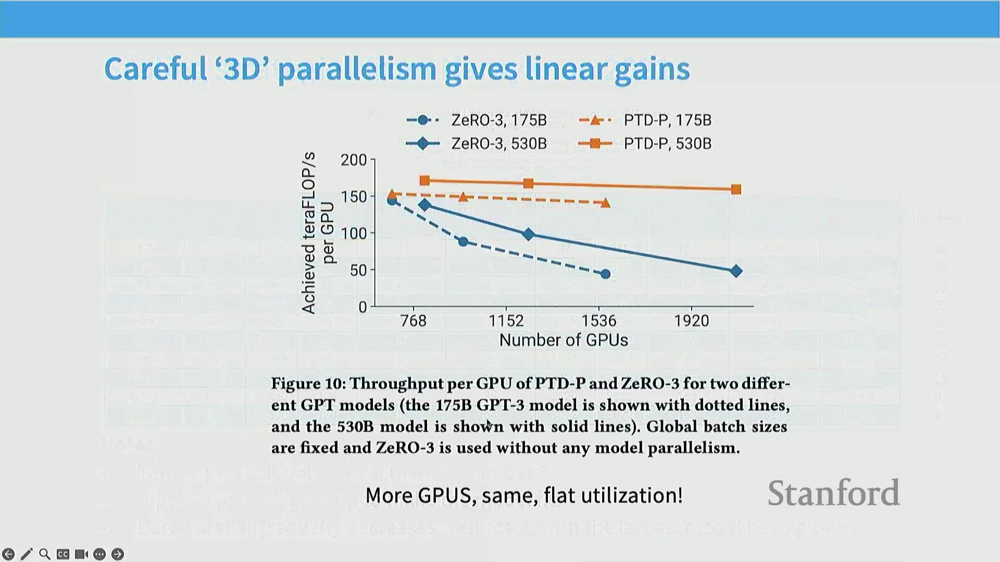
激活重计算(Activation Recomputation)在此平衡中发挥了意想不到的积极作用。尽管在反向传播期间重新计算前向激活值会消耗额外的算力，但它能大幅降低峰值内存消耗(Peak Memory Consumption)。节省出的内存使得使用更大的有效批次大小(Effective Batch Size)成为可能，这反过来又提供了足够的计算量来掩盖流水线并行(Pipeline Parallelism)的开销。额外的计算成本通过维持高硬件利用率(Hardware Utilization)与最小化通信气泡(Communication Bubbles)得到了充分补偿。
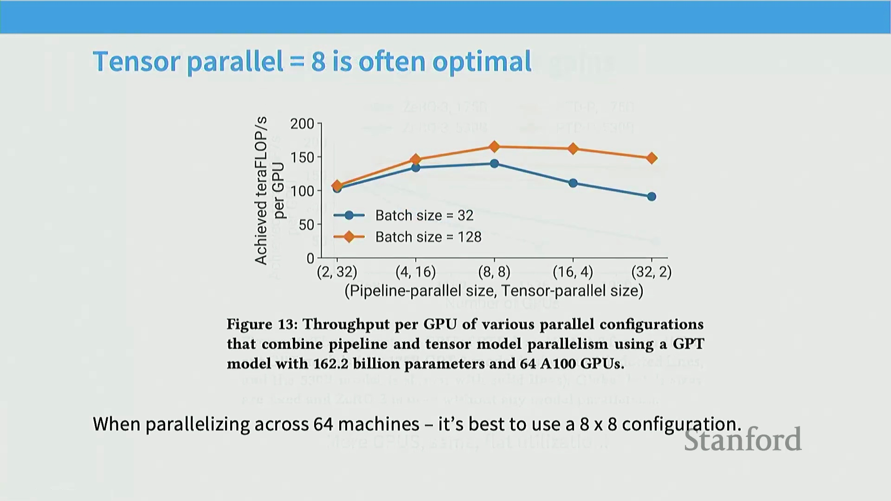

## 前沿模型的生产级配置
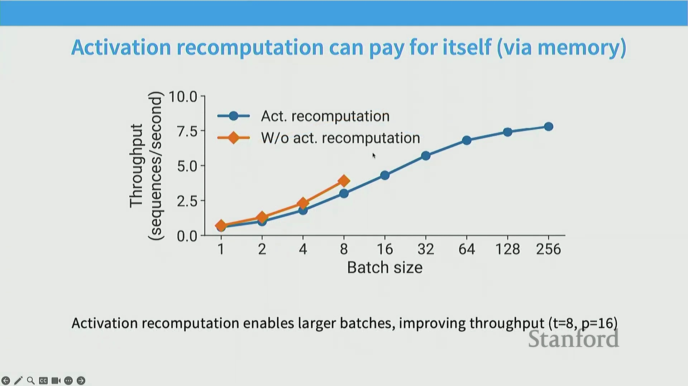
现实世界的大规模训练部署通过多样化的混合配置验证了这些理论原则。OLMo 与 DORA 论文针对 70 亿参数模型采用了 FSDP(Fully Sharded Data Parallel, ZeRO-3)，优先考虑内存效率(Memory Efficiency)而非传统的模型分片(Model Sharding)。DeepSeek V2 采用了一种综合方案，结合了 ZeRO-1、张量并行、序列并行(Sequence Parallelism)和流水线并行。其继任者 DeepSeek V3 则摒弃了标准张量并行，转而采用大规模模型参数分片，部署了 16 路流水线并行(16-Way Pipeline Parallelism)与 64 路专家并行(64-Way Expert Parallelism)，并结合 ZeRO-1 数据并行，以高效支撑其混合专家(Mixture of Experts, MoE)架构。
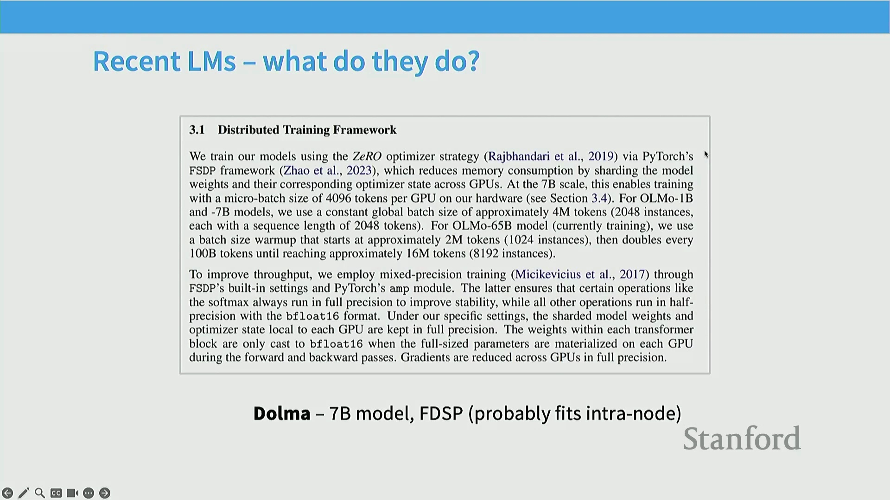
同样，Yi 模型家族依赖于经典的 ZeRO-1、张量并行和流水线并行组合。然而，Yi Lightning 完全用专家并行取代了张量并行，以更好地适配其 MoE 结构。这些差异表明，尽管底层原则保持不变，但具体的并行组合在很大程度上由模型架构决定，尤其是从稠密网络(Dense Networks)向稀疏专家网络(Sparse Expert Networks)的转变。

## Llama 3 架构与硬件故障的现实
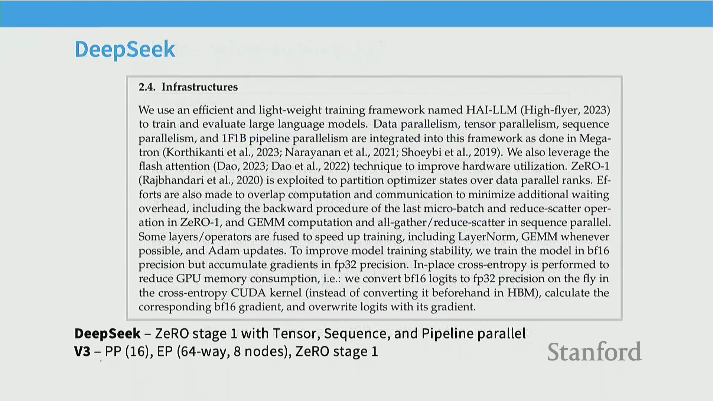
Llama 3 技术报告提供了最先进分布式训练的详细蓝图。它采用了张量并行(Tensor Parallelism, TP=8)、用于长序列的上下文并行(Context Parallelism, CP)、流水线并行以及数据并行。其实现严格遵循带宽层级规则(Bandwidth Hierarchy Rules)：首先在节点内应用高带宽的张量并行和上下文并行，随后在节点间部署流水线并行，最后通过数据并行扩展剩余的计算资源。这种分层架构允许异步获取权重(Asynchronous Weight Fetching)，并能容忍较高的节点间延迟(Inter-Node Latency)。
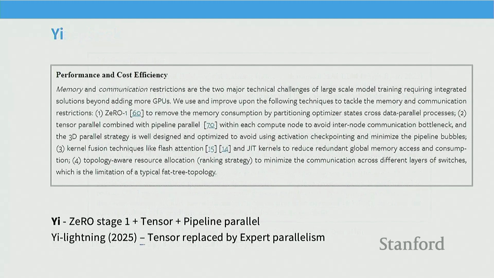
然而，在这种规模下进行训练暴露出严重的基础设施脆弱性(Infrastructure Fragility)。Llama 3 经历了 148 次由故障 GPU 引起的独立中断，占所有训练暂停(Training Pauses)的 30%。此外，计划外维护(Unscheduled Maintenance)和硬件故障又增加了数十次中断。这些统计数据凸显出，算法效率仅是成功的一半；具备快速检查点保存(Checkpointing)与节点替换能力的强容错架构(Highly Fault-Tolerant Architecture)，是成功完成长达数周训练任务的绝对前提。
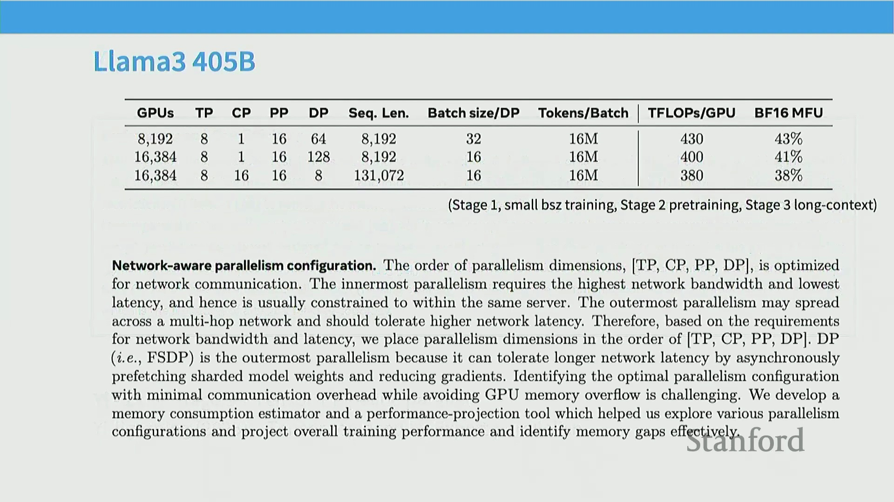
或许比明显的硬件故障更严重的威胁是静默数据损坏(Silent Data Corruption, SDC)。现代加速卡偶尔会发生故障却不触发错误标志(Error Flags)，从而向优化过程中悄然注入垃圾梯度(Garbage Gradients)。此类未被察觉的故障会不可逆地破坏模型的训练轨迹(Training Trajectory)，这使得严格的验证流水线(Verification Pipelines)与基于校验和的监控机制(Checksum Monitoring)成为大规模机器学习基础设施不可或缺的组成部分。
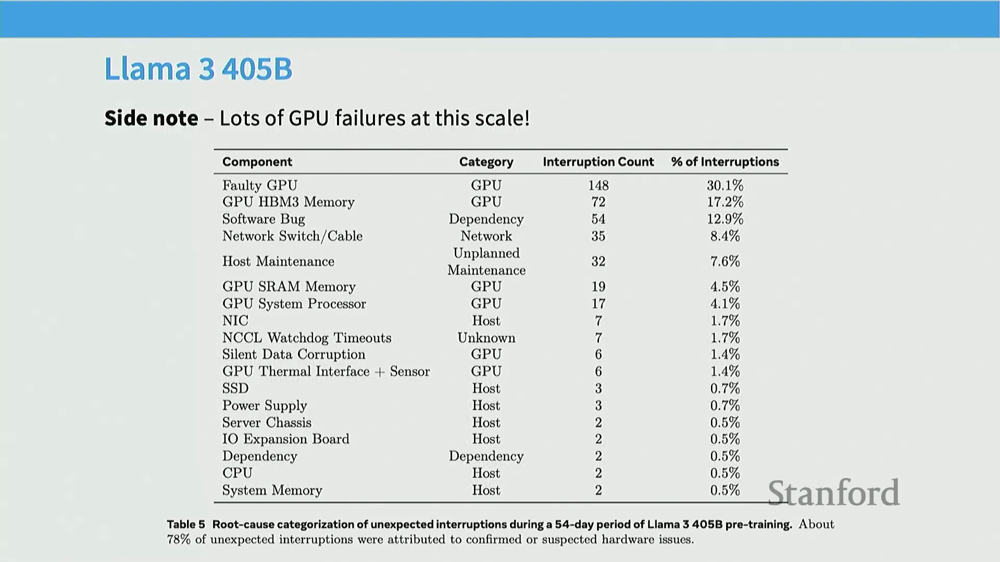

## TPU 架构与核心结论

以 Google TPU 为代表的替代硬件范式，凭借其卓越的网络拓扑结构(Network Topology)深刻影响着并行策略的选择。Gemma 2 的训练利用了 ZeRO-3(FSDP)，并结合了模型并行(Model Parallelism)与数据并行。与受限于 PCIe/NVLink 交换架构(Switching Architecture)的传统 GPU 集群不同，TPU 的高速二维网格互连(2D Mesh Interconnect)使开发者能够将模型并行扩展至更多设备，而不会遭遇严重的通信瓶颈。
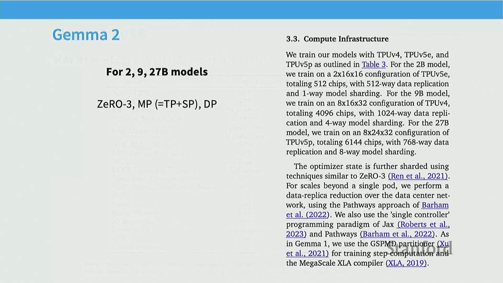
这一架构优势降低了对复杂流水线调度的依赖，在保持整个 Pod(计算集群单元)高带宽效率的同时，实现了更直接的扩展模式(Scaling Pattern)。
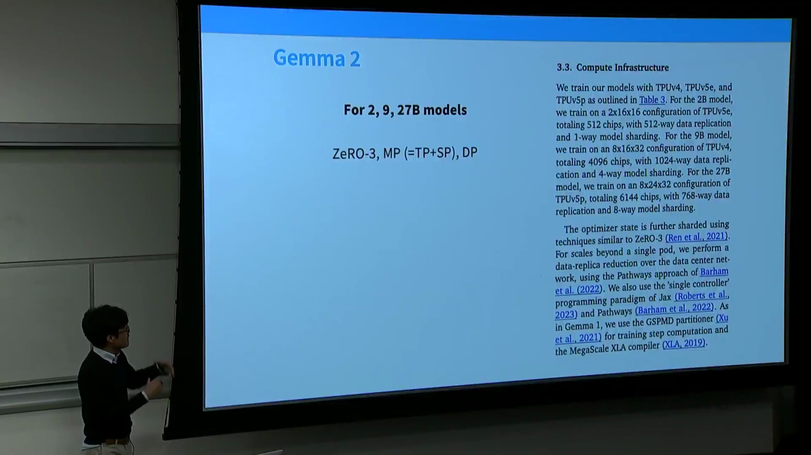
归根结底，将现代 AI 模型扩展至单机之外，必须采用混合并行方法(Hybrid Parallelism Approach)。没有任何单一的并行策略能够同时优化内存、计算和通信约束。通过依据清晰的带宽与内存规则，系统性地结合张量并行、流水线并行与数据并行，从业者能够实现吞吐量的线性扩展。掌握这些多维度的权衡取舍(Trade-offs)，是训练下一代前沿语言模型的基础要求。
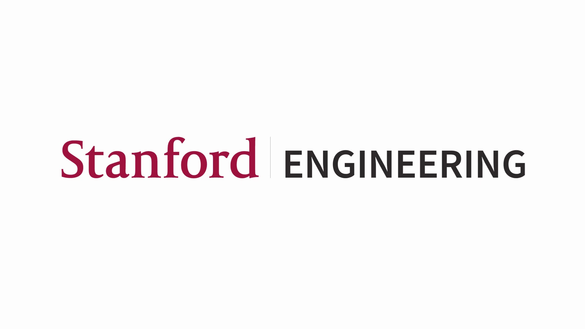