## 多GPU并行(Multi-GPU Parallelism)与显存层次结构(Memory Hierarchy)简介
这是系统课程的第二周内容，我们将探讨如何充分挖掘硬件潜力，从而加速模型训练。

上周我们探讨了单张GPU内部的并行性，本周则将目光转向跨多张GPU的并行化。请大家在脑海中构建这样一幅架构图景。
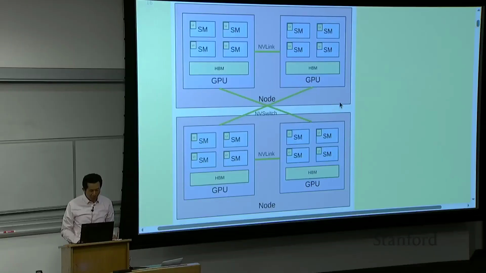
我们拥有一系列节点（本质上即服务器主机），每个节点通常配备八张GPU。在每张GPU内部，包含众多流多处理器(Streaming Multiprocessor)，它们是实际执行计算任务的核心单元。图中绿色区域主要代表显存与通信链路。每个SM内部均配备了一个极小的L1缓存(L1 Cache)。而在GPU芯片层级，则配备了容量更大的高带宽内存(High Bandwidth Memory)。此外，系统中还存在用于连接不同GPU的互连链路。
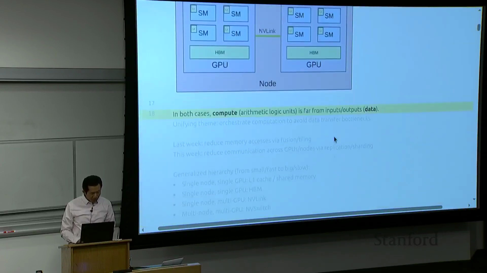

## 优化计算与规避数据传输瓶颈
理解这一层级的关键在于：所有计算都必须在SM的算术逻辑单元(Arithmetic Logic Unit)上执行。计算过程既需要读取输入数据，也需写回输出数据，而这些数据往往存储在相对较远的层级中。
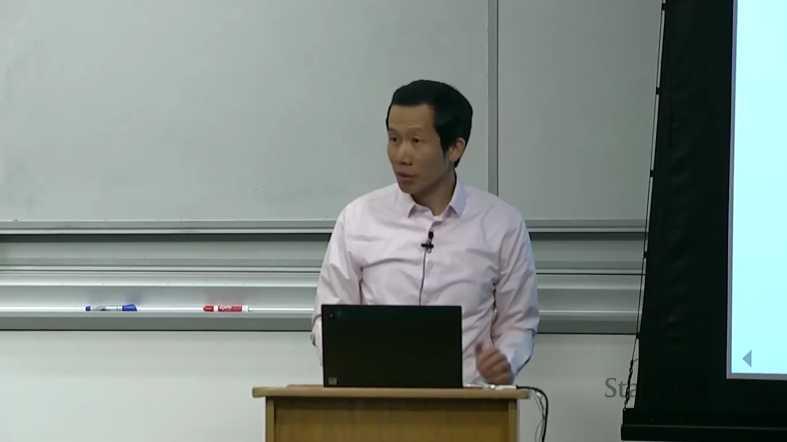
理想情况下，数据驻留于L1缓存中；若情况稍逊，数据则位于HBM中。而本周聚焦的多GPU与多节点训练场景下，所需数据甚至可能位于另一张GPU上。因此，核心问题在于：如何组织计算以规避数据传输瓶颈？我们必须时刻牢记维持较高的计算强度(Compute Intensity)，力求让GPU保持满载高效运转。通常情况下，数据传输速率远低于计算速率，极易成为系统瓶颈。上周我们探讨了在单卡内部缓解该问题的技术，主要包括算子融合(Operator Fusion)与分块(Tiling)。其核心思想是：与其频繁读写HBM，不如将数据预加载至速度更快的L1缓存或共享内存(Shared Memory)中，在本地暂存区完成计算，仅在必要时将最终结果写回HBM。本周，我们将深入研究跨GPU与跨节点的通信机制，届时将涉及对模型、参数及优化器状态(Optimizer States)的复制(Replication)与分片(Sharding)。
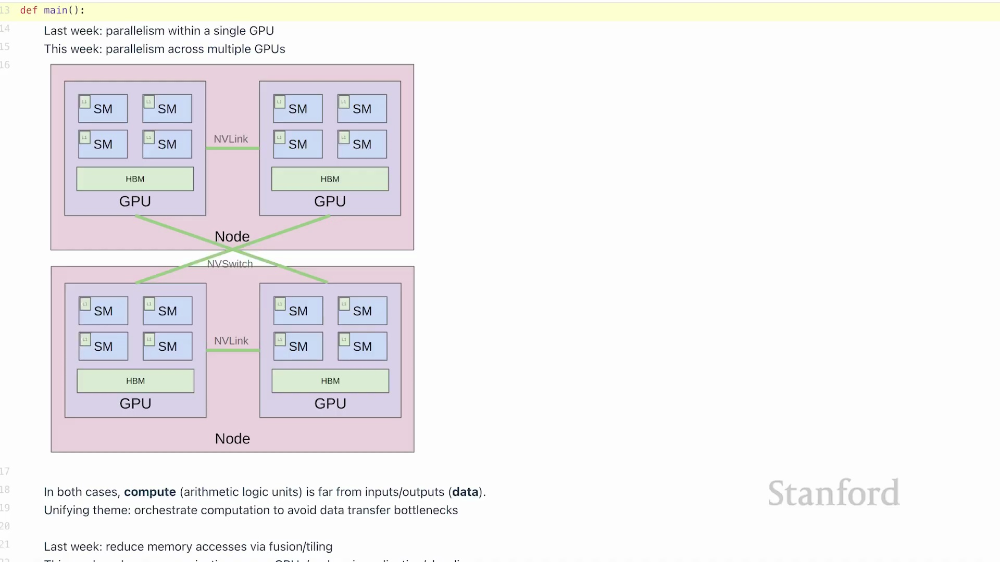

## 课程结构与集合通信原语
在此背景下，具体的实现策略将直接决定通信开销的大小。大家可以从“容量小、速度快”到“容量大、速度慢”的维度，来理解这种存储与通信的层次结构。
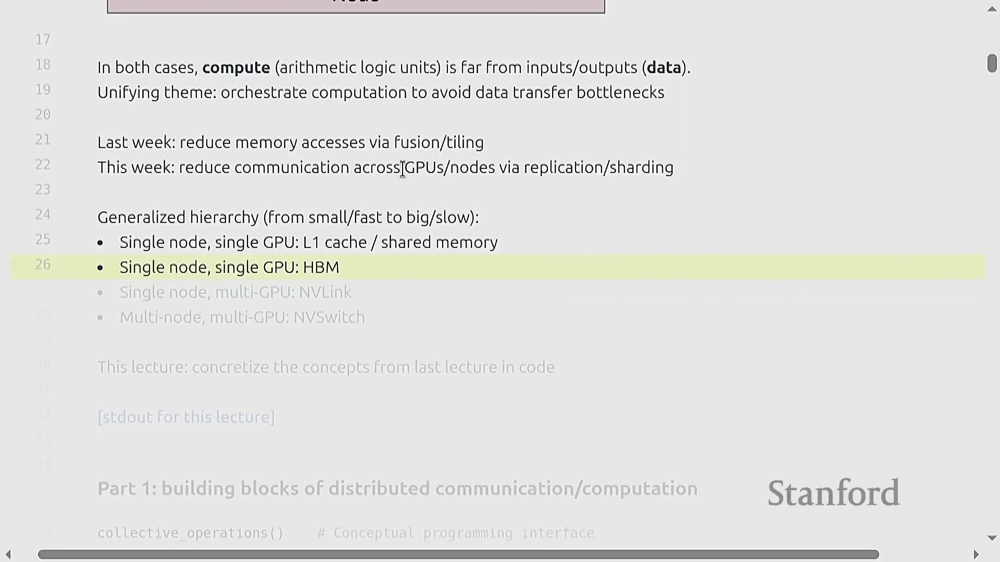
位于层次结构顶端的是单节点单卡内的L1缓存，其速度极快但容量极小；其次是单卡内的HBM；再次是同一节点内GPU间的NVLink互连；最后是跨节点的NVSwitch。当然，上述架构均基于NVIDIA生态系统。尽管L1缓存与NVSwitch等硬件的具体工作机制各异，但“最小化数据搬运”这一核心设计理念是相通的。
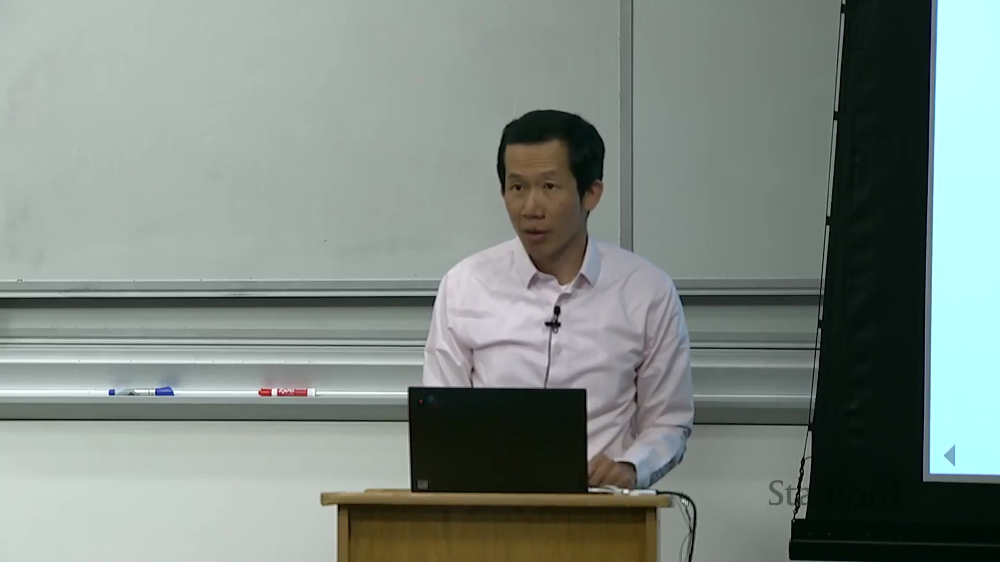
因此，本次讲座将主要通过代码演示来具象化这些概念。虽然会涉及一些新内容，但Totsu此前已出色地为大家梳理了各类并行范式。我将尝试以代码为锚点，帮助大家更深入地剖析底层原理。接下来展示的标准输出日志，即为运行本次讲座代码的实测结果。本次讲座分为两部分：第一部分将深入探讨基础组件——集合操作(Collective Operations)（上期已作概述），解析它们在NCCL与PyTorch中的具体实现，并进行性能基准测试(Benchmarking)。
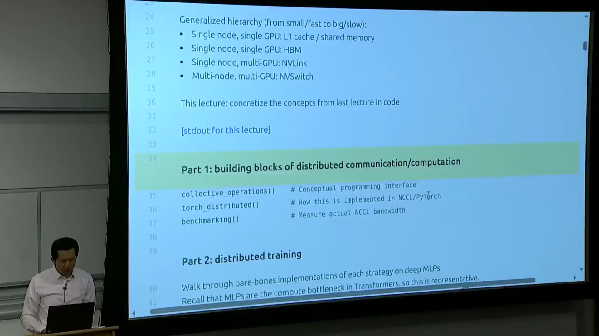
第二部分将深入实战分布式训练，涵盖数据并行(Data Parallelism)、张量并行(Tensor Parallelism)与流水线并行(Pipeline Parallelism)。现在，让我们从集合操作讲起。集合操作是分布式编程中广泛使用的底层原语(Primitives)，“集合”一词意指该操作涉及多个参与节点（或进程）。这些概念在并行编程文献中历史悠久，至少可追溯至20世纪80年代。相较于手动管理点对点通信(Point-to-Point Communication)，它们提供了更优越的抽象层，且均为久经沙场、历经时间检验的成熟原语。首先明确几个术语：“World Size”本质上指参与通信的设备（或进程）总数（例如4个）；而“Rank”（请勿与线性代数中的“秩”混淆）仅指设备的唯一标识符(ID)。若有四个设备，则对应Rank 0至Rank 3。下面，我们正式介绍各类集合操作。
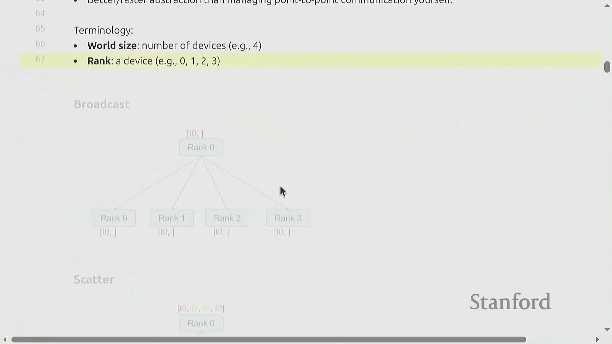
首先是广播(Broadcast)：其概念极为直观，即将位于特定Rank上的一个张量(Tensor)副本发送至所有其他Rank（或全体Rank）。分散(Scatter)操作与之类似，但区别在于：源端持有多个数据块（例如四个值），系统会将每个数据块分别分发至不同的Rank。
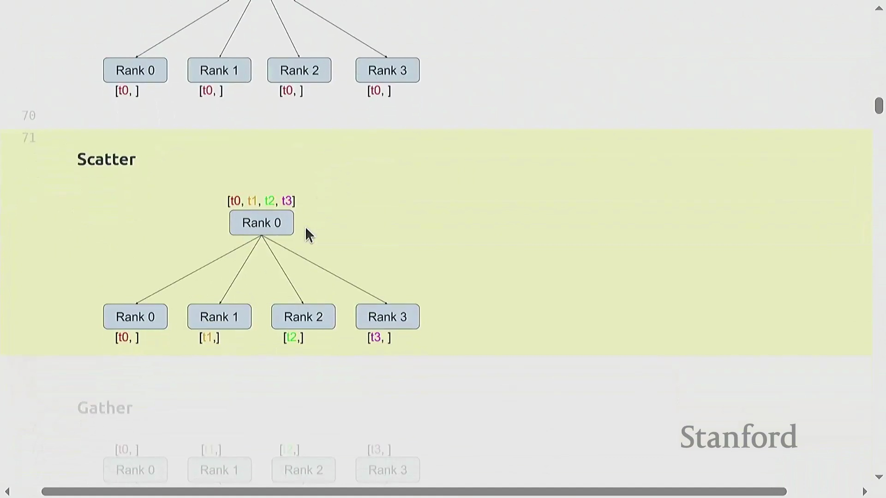
如此一来，每个Rank获取的将是互不相同的数据分片。收集(Gather)操作大致是Scatter的逆过程：各Rank持有不同的数据块，随后将它们全部汇聚至单一的目标Rank上。归约(Reduce)操作与Gather类似，但区别在于它并非简单地将数据拼接，而是对各Rank传来的数据执行聚合运算（如求和）。
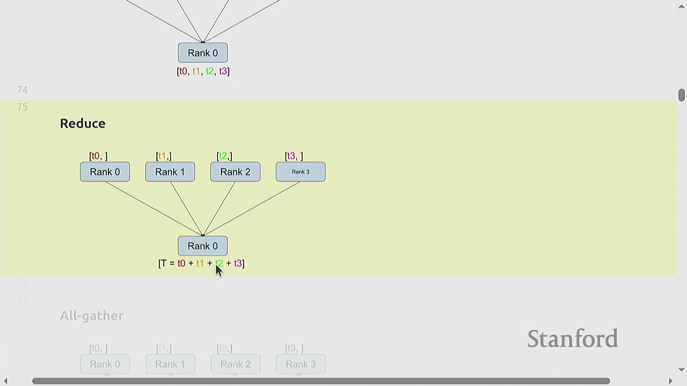
全收集(All-Gather)与Gather的原理一致，唯一区别在于目标端扩展至所有设备，即每个Rank最终都会收到完整的数据集合。
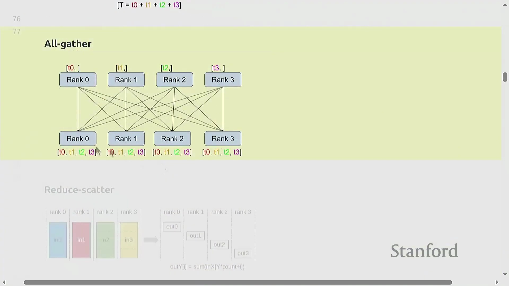
最后是归约分散(Reduce-Scatter)：该操作前半部分类似Reduce，会对多份数据执行满足交换律与结合律的聚合运算；后半部分则类似Scatter，会将聚合后的结果向量或张量按分片拆分，并分别分发至不同的Rank上。
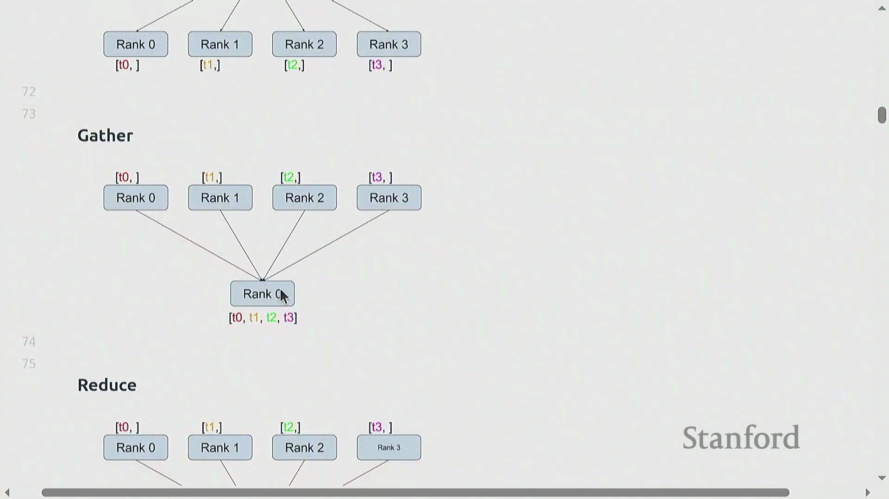
请务必牢记：全归约(All-Reduce)在逻辑上可等效为归约(Reduce)与全收集(All-Gather)的组合操作。
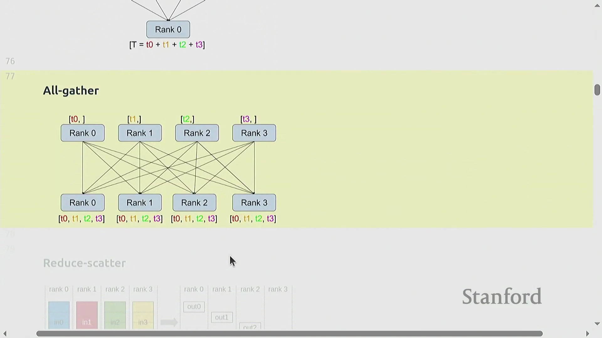
为了便于记忆这些易混淆的术语，可遵循以下规则：“Reduce”仅代表执行某种满足结合律与交换律的聚合运算（如求和、求最小/最大值或均值）；“Broadcast”与“Scatter”互为“Gather”的逆操作；而前缀“All”仅表示操作的参与目标涵盖集群内的所有设备。
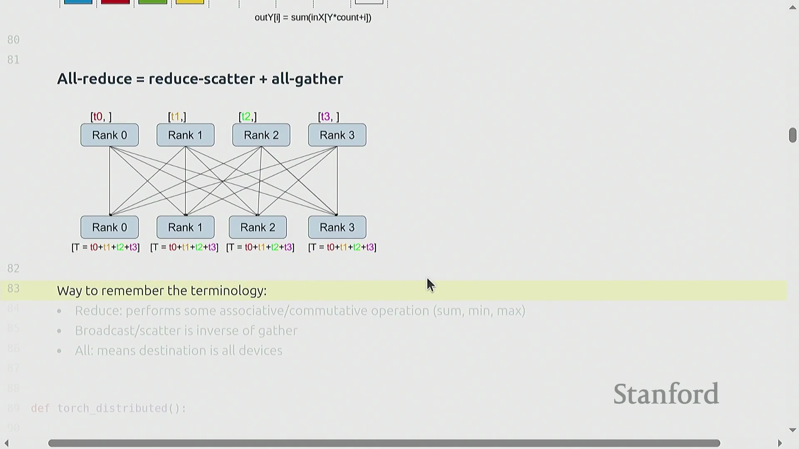

## 硬件演进：从传统架构到GPU直连
以上内容是对前期知识体系的全面回顾。在推进后续内容前，大家是否有任何疑问？由于接下来的讲解将深度依赖这些通信原语，确保全员充分理解至关重要。
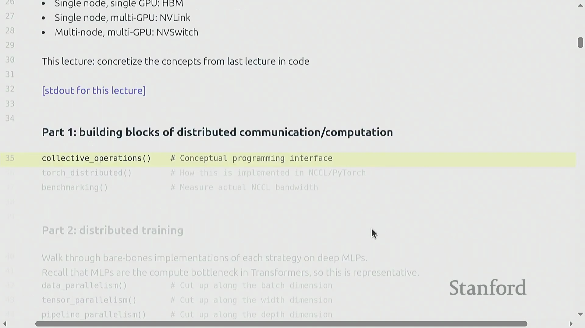
接下来，让我们下沉至硬件层级，探究这些通信机制在物理层面是如何具体实现的。
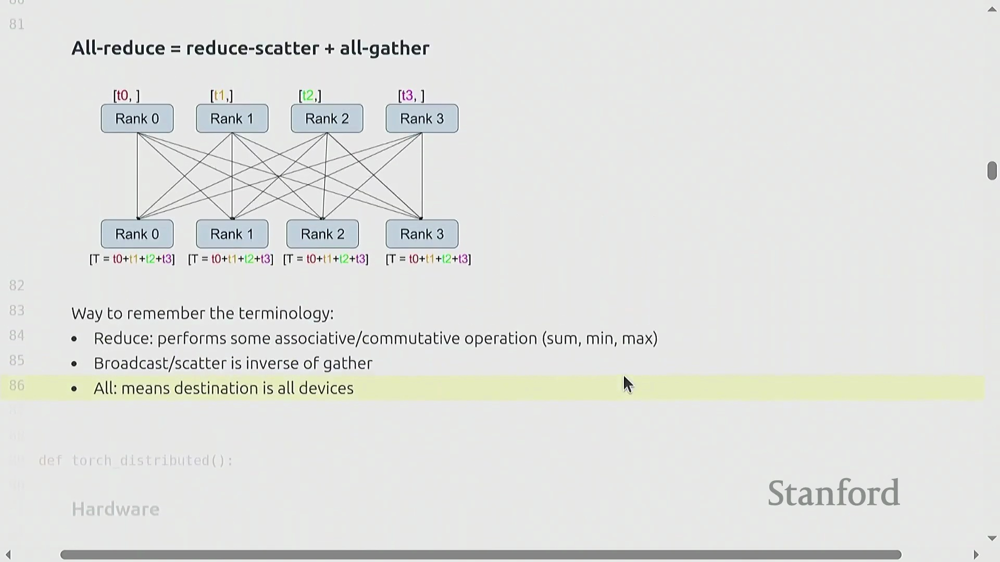
上图展示了传统的GPU硬件拓扑。在典型的个人计算机环境中，主机配备CPU，而同一节点内的多张GPU通常通过PCIe总线(PCI Express Bus)与CPU进行通信。若需跨节点通信，则所有流量最终都会路由至以太网(Ethernet)交换机。
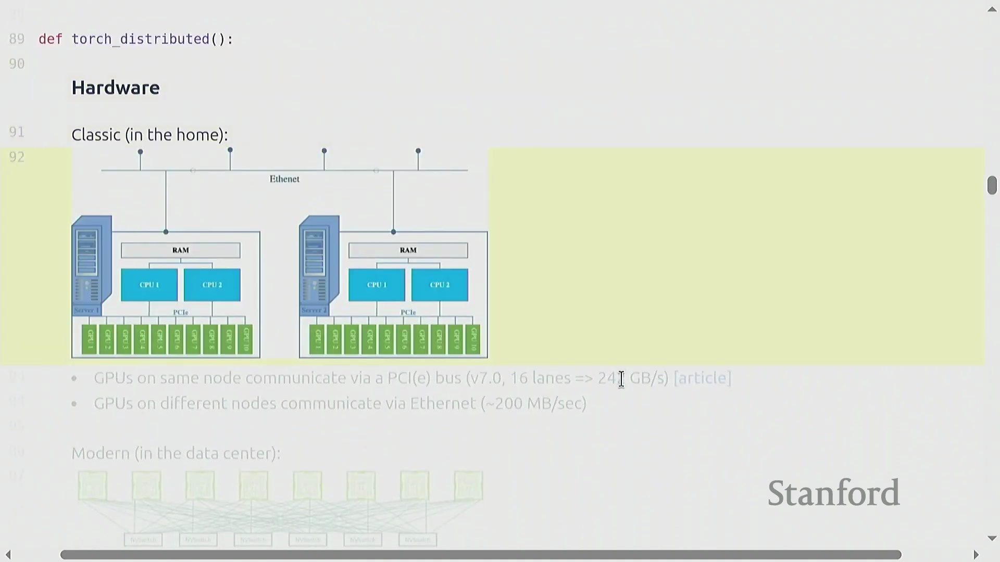
因此，这是消费级设备的常规构建范式。若您购买GPU用于游戏或通用计算，配置大抵如此。然而正如后续所述，该架构在高性能计算场景下并非最优解。当数据需在GPU间传输时，会引发显著的性能开销：数据必须穿越操作系统内核态，经历多次缓冲区拷贝，最终才经由以太网发出，这一过程会引入巨大的延迟与带宽损耗。
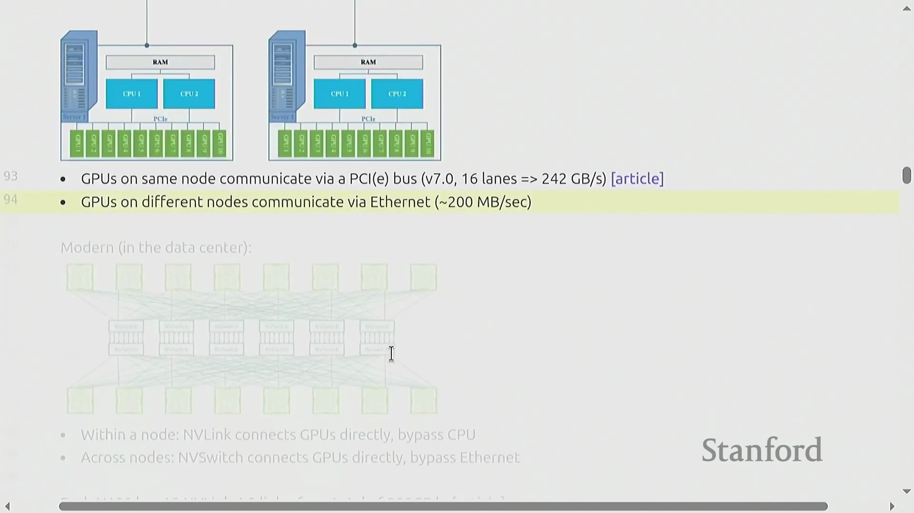
因此，在现代科学计算与深度学习领域，若明确需要将大量GPU串联以协同工作，业界普遍采用GPU直连的互连方案。
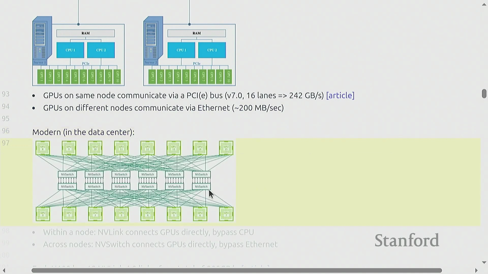
在NVIDIA生态系统中，我们利用NVLink高速互连技术直接桥接各GPU。该方案实现了设备间的数据直达，有效绕过了CPU，并免去了主机操作系统内核态的介入与调度开销。
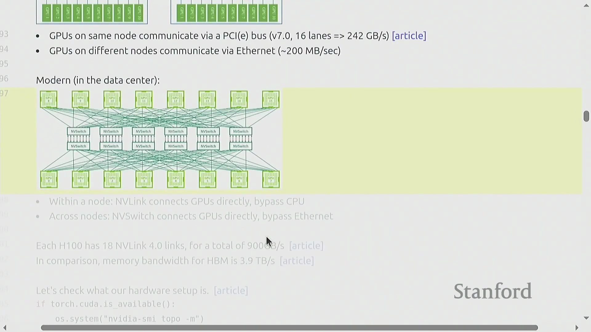

---

## 使用 NVLink 和 NVSwitch 绕过传统网络
即使在跨节点(Cross-Node)通信场景下，我们依然可以通过NVSwitch直接互联GPU，从而完全绕过以太网(Ethernet)。以太网诞生较早，其设计初衷显然并非面向此类高性能计算场景。与NVLink类似，NVSwitch直接摒弃了传统的通信路径，专门针对深度学习等特定工作负载(Workload)进行了深度优化。
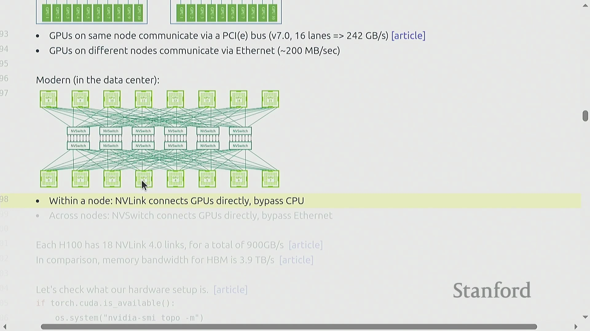

## 硬件拓扑与带宽对比
以H100为例，每张GPU均配备了18条第四代NVLink通道，可提供高达900 GB/s的双向总带宽。相比之下，其速度不仅远超PCIe(Peripheral Component Interconnect Express)总线，更是将以太网远远甩在身后。即便与流多处理器(Streaming Multiprocessor, SM)从高带宽内存(High Bandwidth Memory, HBM)中读取数据的延迟相比，NVLink的通信速率依然要快上四倍左右。当然，随着新一代Blackwell架构的发布，这些性能指标仍在持续演进。据我推测，新一代硬件的带宽规模有望达到当前数值的两到三倍。
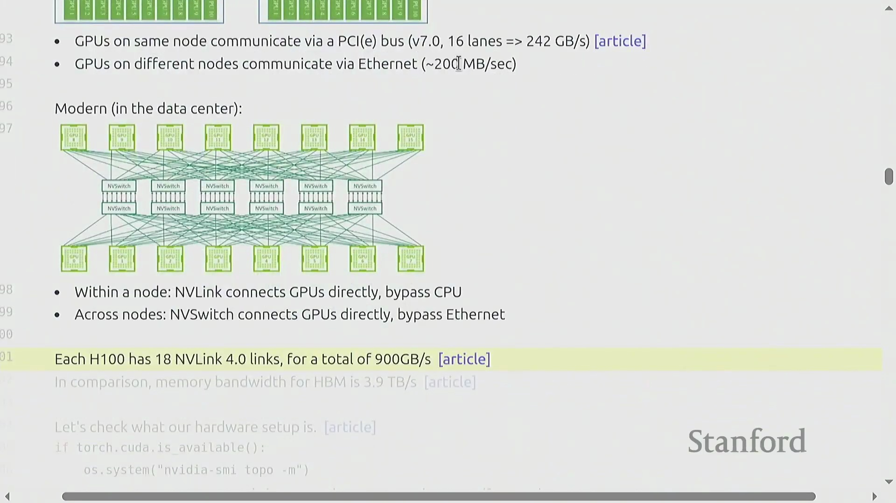
那么问题来了：通过PCIe传输数据时，数据流究竟是如何走线的？通常情况下，它依然需要经由CPU中转。PCIe最初的设计目标是连接各类外设（如CPU、声卡或SSD固态硬盘等），因此它并非专为GPU通信而生，更像是一条用于设备间互联的通用总线。没错，它确实需要与CPU交互。这就引出了另一个问题：NVLink是否也会连接到CPU？我们将在后续的幻灯片中详细展示具体的拓扑连接方式。是的，系统当然仍需保留与CPU的通信路径。
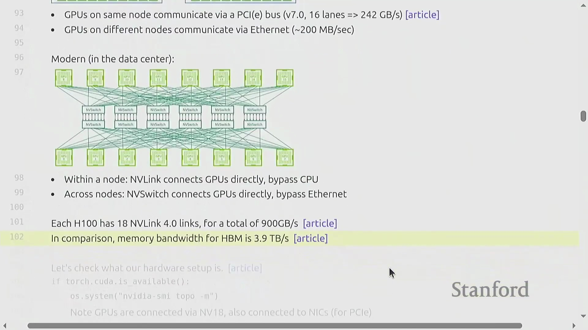
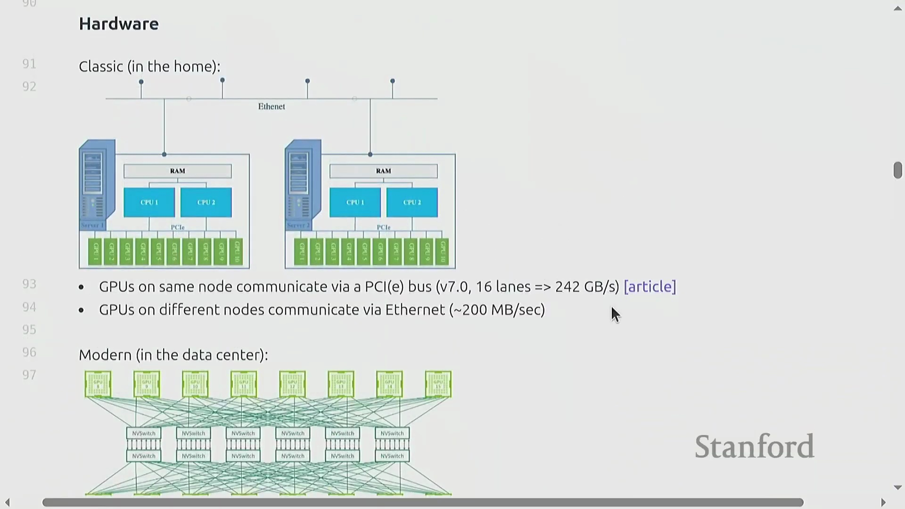
接下来，我们可以运行一条特定命令。该命令会输出详细的拓扑信息，直观展示GPU之间的实际物理连接。我在集群上执行了该命令……大家可以看到，任意两张GPU之间均通过NVLink直连（共计18条通道）。此外，图中还列出了网络接口卡(Network Interface Card, NIC)等其他设备。没错，网卡的作用正是提供PCIe链路，并负责将节点与CPU及外部网络相连。
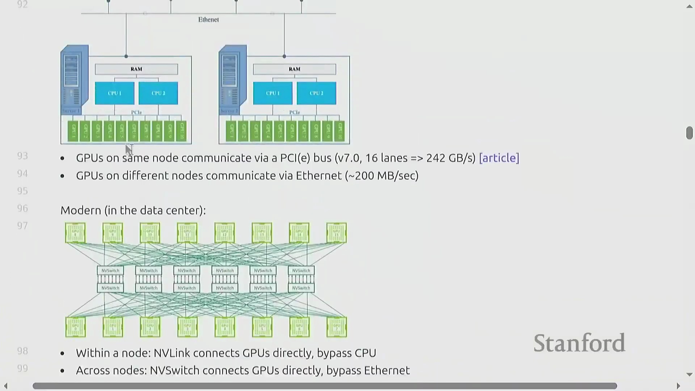
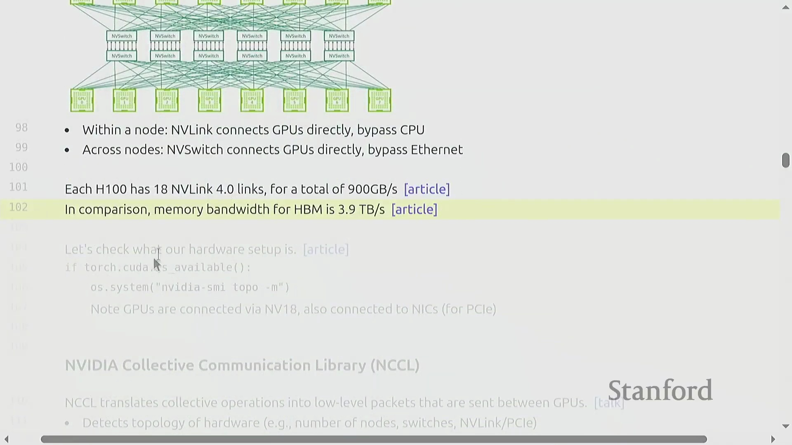
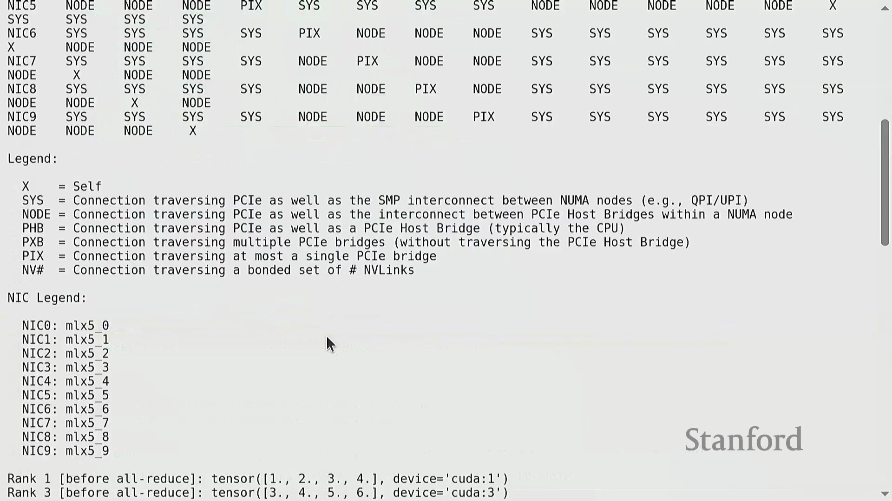

## 软件栈：从 NCCL 到 PyTorch Distributed
了解了硬件架构后，我们该如何高效调用这些资源呢？NVIDIA在其卓越的硬件生态之上，投入了大量精力研发了配套的高性能软件栈。其中最具代表性的便是NVIDIA集合通信库(NVIDIA Collective Communications Library, NCCL)。本质上，NCCL将我们前文探讨的各类集合操作（如全归约(All-Reduce)）高效映射为GPU间传输的底层数据包。该库在底层承担了极其繁重的优化工作，使得程序员仅需在高层声明“我需要将此张量同步至所有设备”，底层通信便会自动、高效地完成。
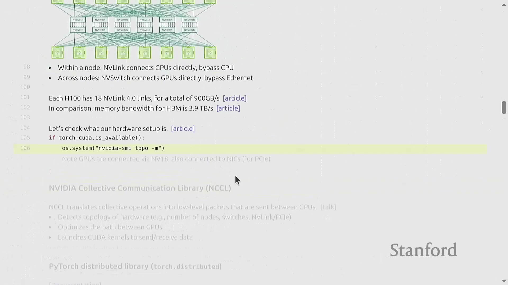
在配置与初始化NCCL时，系统会启动所有目标设备，并通过少量探测通信来感知底层的硬件拓扑结构，进而自动寻优GPU间的通信路径。随后，当实际触发集合通信调用时，NCCL会启动大规模的CUDA内核(CUDA Kernel)来执行数据的发送与接收。以上就是NCCL的核心机制，它以底层库的形式提供。然而，对于主要使用Python的开发人员而言，直接调用NCCL仍显得过于底层。为此，PyTorch提供了`torch.distributed`模块，为这些集合操作封装了极为简洁的高层API。在你的PyTorch代码中，只需对张量调用`all_gather`，该操作便会自动将数据同步至所有进程标识符(Rank)。该模块还具备一项极具实用性的特性：支持多后端(Multi-Backend)切换以适应不同硬件。具体而言，GPU环境默认采用NCCL后端。但需牢记，集合操作并非GPU专属，它可泛化至任何设备集群。因此，你也可选用名为`Gloo`的后端在纯CPU环境下执行集合通信。例如，在笔记本电脑上调试代码或完成课程作业时，即便缺乏GPU资源，依然可借助`Gloo`后端顺利运行程序。总而言之，采用这些高级原语的另一大优势在于其卓越的可移植性(Portability)，远胜于针对特定GPU硬编码的实现。尽管实际吞吐量仍受限于物理硬件，但至少从逻辑层面而言，你能确保算法的正确性与跨平台兼容性。
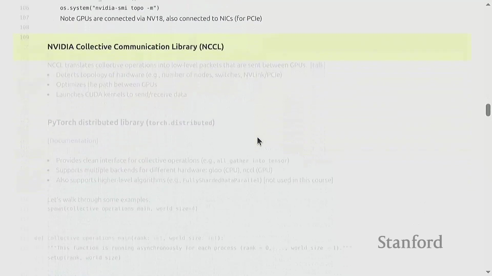
`PyTorch Distributed`还支持诸多高级特性，例如Totsu在上一讲中详述的完全分片数据并行(Fully Sharded Data Parallel, FSDP)。不过，在本课程中我们将暂不直接调用这些现成模块。秉持“从零构建(From Scratch)”的教学理念，我们将亲自上手实现这些核心机制，以深入理解其底层逻辑。

## 实际实现：进程初始化与同步
接下来，我们通过具体示例来剖析`torch.distributed`中集合操作的运行机制。我编写了一个辅助工具函数（详见配套代码），该函数接收一个可调用对象并负责执行。本质上，它是对Python多进程(Multiprocessing)模块的轻量级封装，会并发启动四个进程来运行目标函数。因此，当你置身于该函数内部时，需明确意识到：当前实际上共有`world_size`个进程在并行执行完全相同的代码逻辑，且每个进程都分配了从`0`至`world_size - 1`的唯一Rank索引。为便于讲解，目前我将逐步演示单个Rank的执行轨迹，因为本次讲座演示本身并非并发环境。
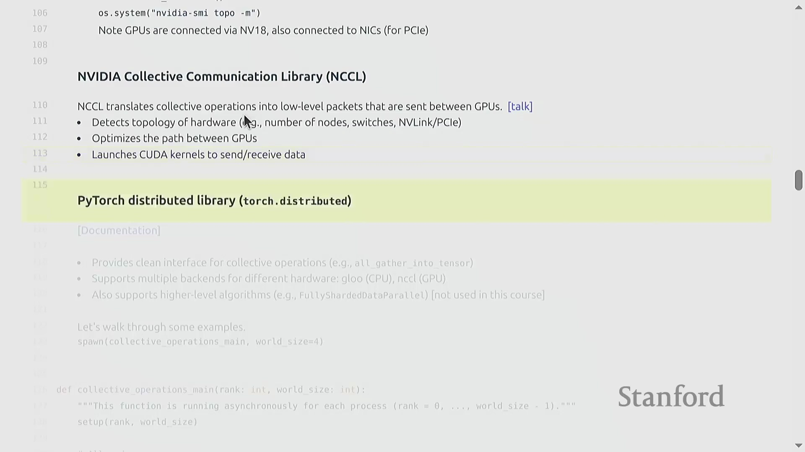
通常，多进程启动后的首要步骤是执行初始化(Initialization)。本质上，各进程需要完成相互发现(Peer Discovery)。在分布式环境中，所有进程需先连接至一个预设的主节点(Master Node)，以建立通信组并确认彼此的就绪状态。请注意，此初始化阶段建立的仅是控制信道(Control Channel)，而非实际的数据传输路径。真实的数据搬运工作后续将由NCCL接管，此处仅负责元数据与状态的协调。由于当前环境配备GPU，我们自然选用NCCL作为后端；若在无GPU的纯CPU环境中，则需切换至Gloo后端。
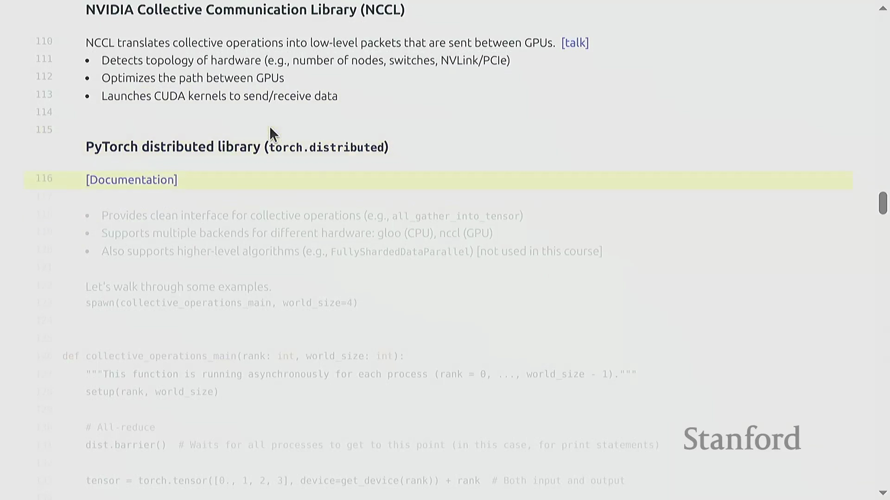
环境配置完毕后，我们即可进入核心操作阶段。此处引入一个极为关键的同步原语——`barrier`（屏障(Barrier)）。其核心作用是阻塞当前进程，直至进程组(Process Group)内的所有成员均执行至该同步点。请务必牢记，分布式进程默认以异步(Asynchronous)方式推进。在特定场景下，若需强制设立全局同步点，`barrier`便是实现该目标的标准手段。本例中调用它的原因较为简单：仅为了确保各进程的终端打印输出能对齐集中显示，便于观察。然而，在实际的分布式训练中，`barrier`还承担着诸如防止竞态条件(Race Condition)、确保梯度同步等关键职责，这些我们将在后续环节深入探讨。
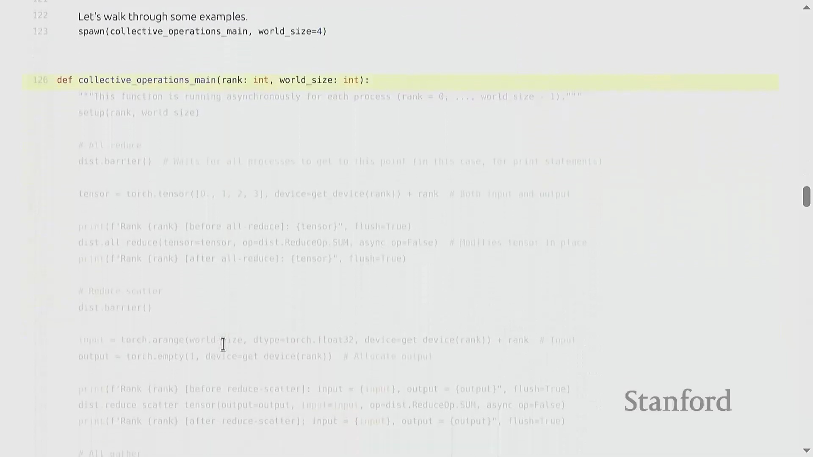

## 演示集合操作：All-Reduce 实战
接下来，我将为每个Rank实例化一个张量(Tensor)。该张量的初始值设定为基向量`[0, 1, 2, 3]`与当前Rank索引的标量加法。在正式执行归约操作前，我们先打印各Rank持有的局部张量状态。输出结果如下所示：Rank 0的张量为`[0, 1, 2, 3]`，Rank 1为`[1, 2, 3, 4]`，其余Rank依此规律递增。
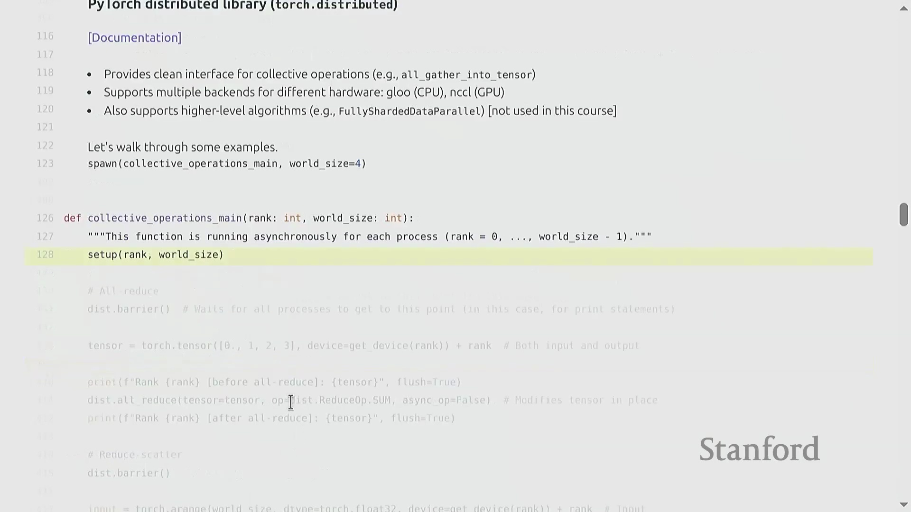
值得注意的是，受限于终端输出的异步特性，打印顺序呈现随机交错状态，这完全取决于各进程调度至打印语句的先后时序。可见，每个Rank当前均持有独立的局部张量。随后，我们触发`all_reduce`操作。调用该函数时，需传入目标张量并指定聚合算子(Reduction Operator)，例如本例中的求和(Sum)操作。为简化演示，此处采用同步阻塞模式(Synchronous Mode)，但在实际生产环境中，强烈建议启用异步模式(Asynchronous Mode)。异步执行能有效实现通信与计算的重叠(Overlap of Communication and Computation)，从而大幅提升系统吞吐量。
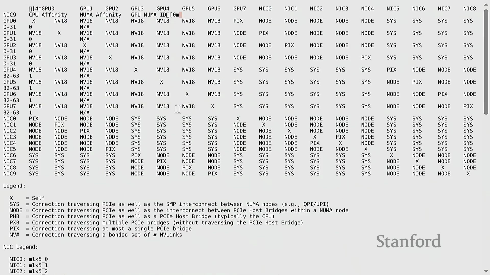
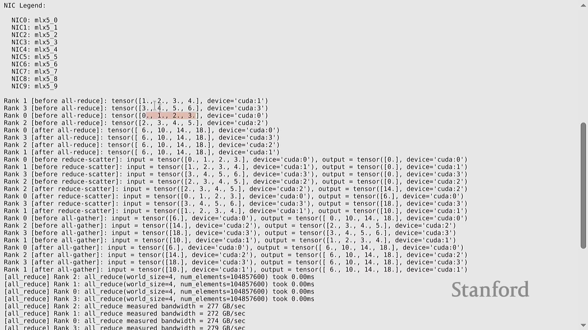
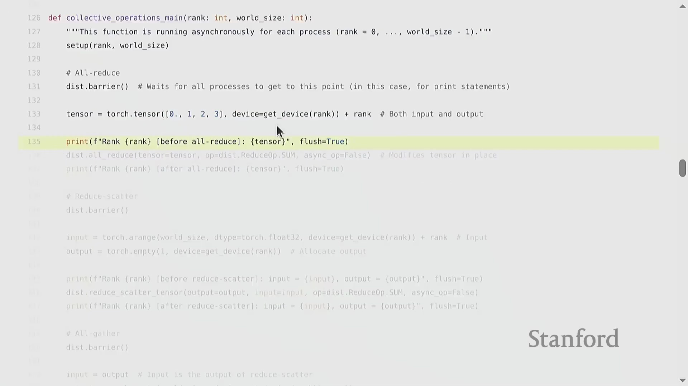
那么，`all_reduce`执行完毕后，各Rank上的数据将如何变化？正如预期，对首列元素执行全局求和可得`0+1+2+3=6`，第二列为`10`，第三列为`14`，第四列为`18`。换言之，`all_reduce`会直接在原张量上执行就地更新(In-place Update)，将其替换为全局聚合后的结果。该API的设计极为优雅且易于调用。接下来，我们将演示`reduce_scatter`（归约分散(Reduce-Scatter)）操作。针对该操作，我将首先构建一个……
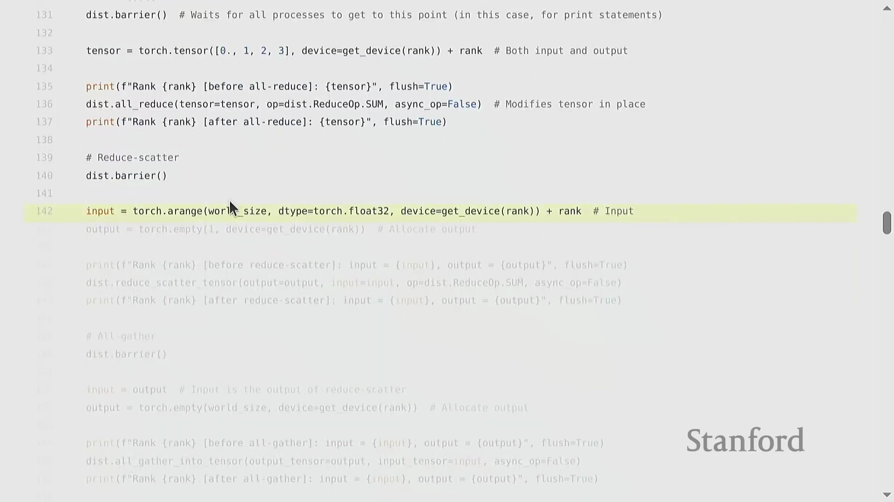

---

## 演示归约分散(Reduce-Scatter)与全收集(All-Gather)操作
我将创建一个第一维与进程总数(`world_size`，此处为4)相匹配的输入张量。由于`reduce_scatter`操作不支持就地更新(In-place)，我需要单独分配一块内存用于输出张量。
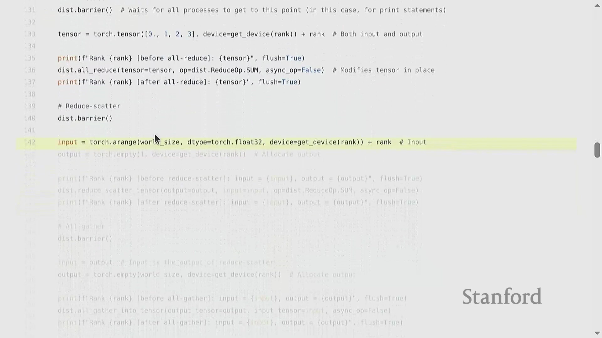
在触发操作前，输入张量已准备完毕，输出张量被初始化为全零（当然，其初始值可为任意数据，不影响最终计算结果）。
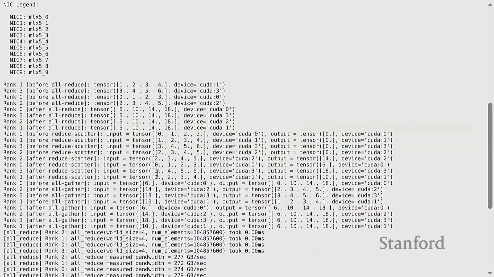
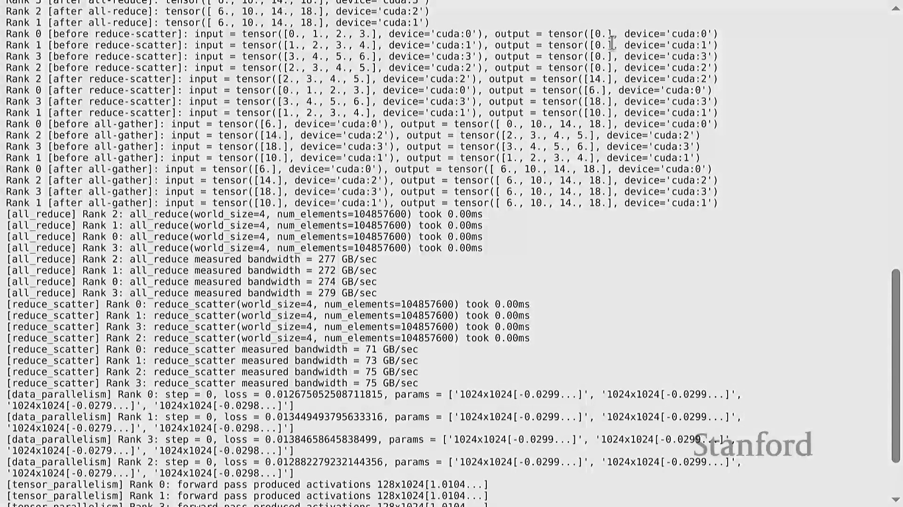
执行基于求和模式的`reduce_scatter`后，所有进程标识符(Rank)的第一个数据分块将被全局聚合求和，并精准分发至Rank 0；第二个分块同理分发至Rank 1，依此类推。
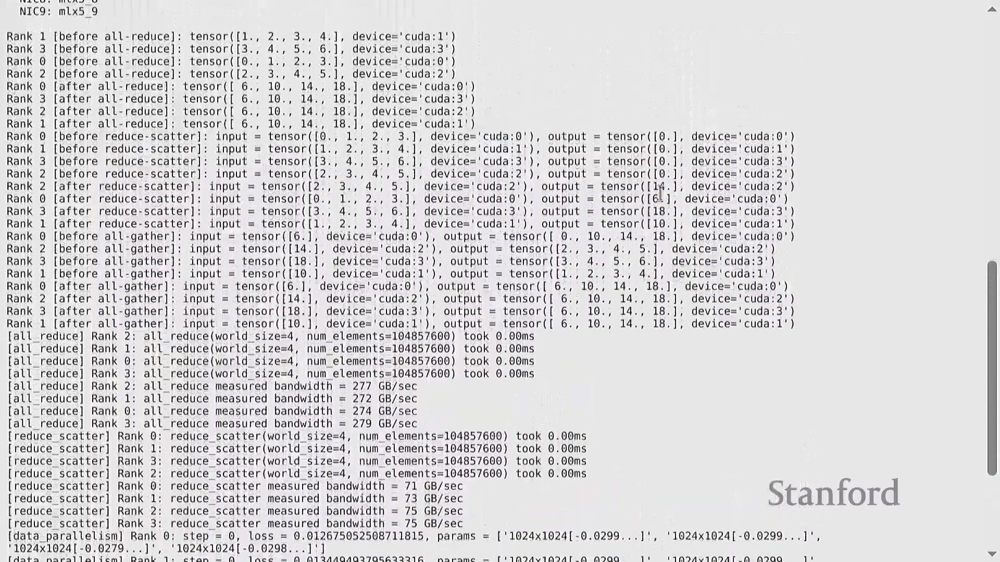
从数学角度看，其全局聚合结果与`all_reduce`（全归约）完全一致，但核心区别在于：计算结果被切分并分散存储于各个Rank上，而非在每个设备上保存完整的副本。

接下来，我们演示`all_gather`（全收集）操作。
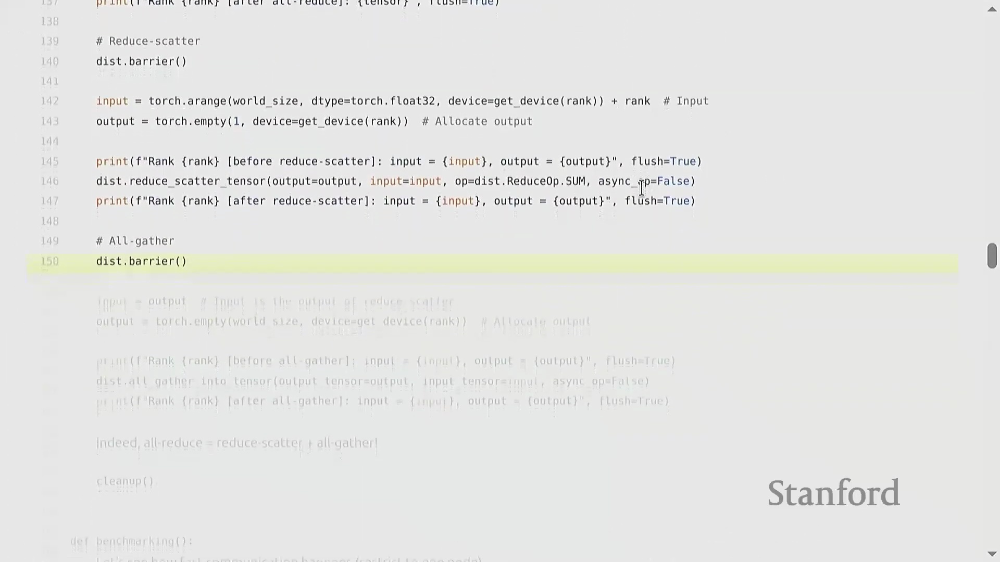
我们将上一步`reduce_scatter`的输出作为输入源，并预先分配一个空张量用于接收结果，随后执行该操作。
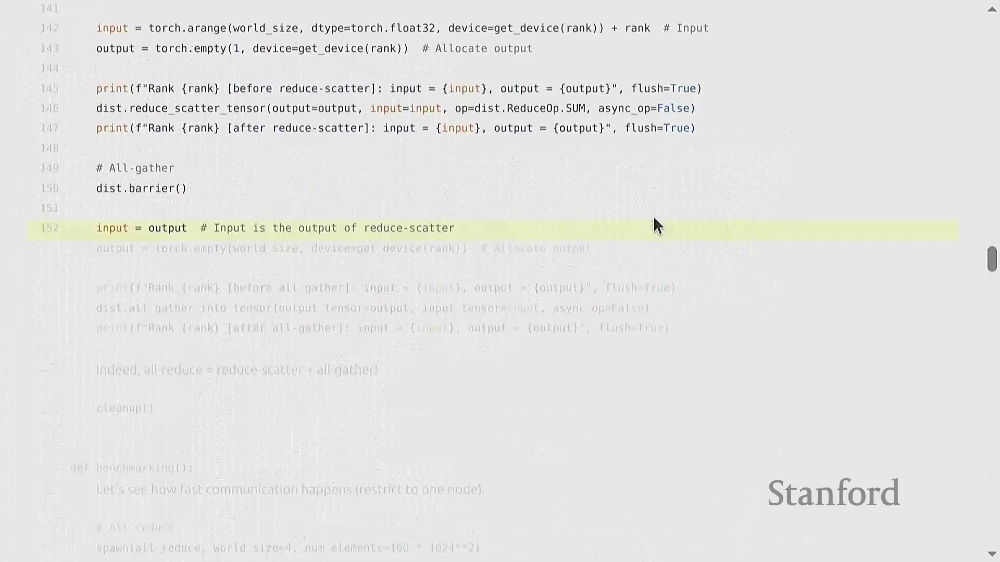
`all_gather`执行完毕后，所有张量分片将完整同步至每个设备上。这一过程清晰地证明：`reduce_scatter`与`all_gather`的组合在功能上等价于`all_reduce`，因为两者最终计算并分发了完全一致的全局聚合结果。

## 理解张量维度与进程映射
开发者常有的一个疑问是：在执行`reduce_scatter`时，是否需要手动维护张量索引与具体GPU之间的映射关系？
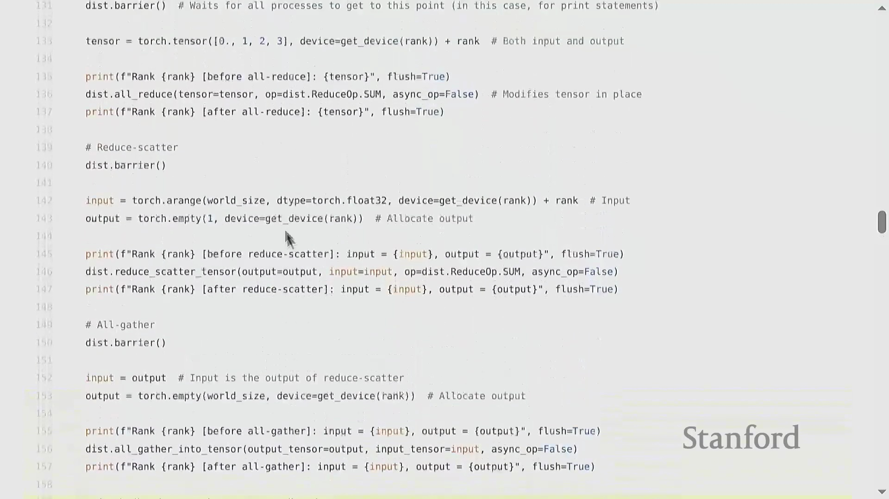
根据深度学习框架的约定，输入张量的某一特定维度必须显式地与`world_size`保持一致。底层库会自动推导映射逻辑，沿该指定维度对输入进行切分，并将对应的数据块精准路由至各Rank的输出缓冲区。严格对齐张量维度以避免运行时错误(Runtime Error)至关重要，这也是我们强烈建议通过轻量级示例进行逐步调试的根本原因。
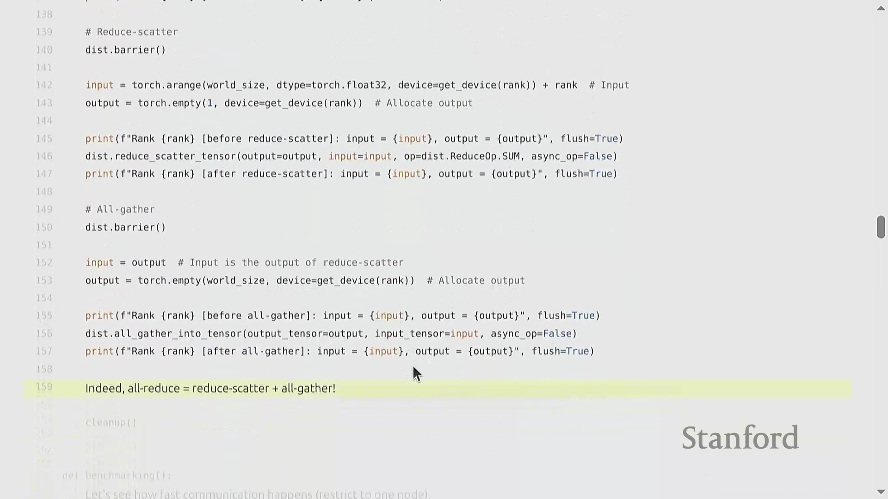
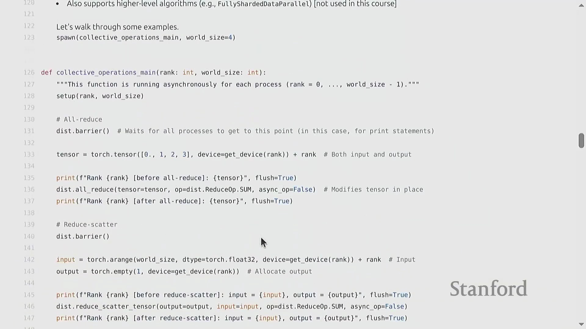
最后，当分布式进程完成所有通信任务后，在进程终止前必须执行规范的清理(Cleanup)与显存资源释放操作。
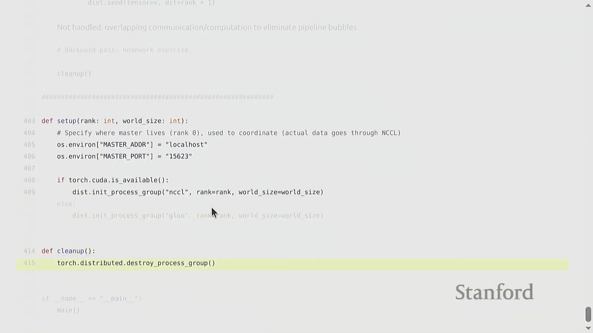

## 集合通信原语的性能基准测试方法
在深入理解集合操作及其在PyTorch/NCCL中的底层实现后，我们将转向性能基准测试(Benchmarking)环节。
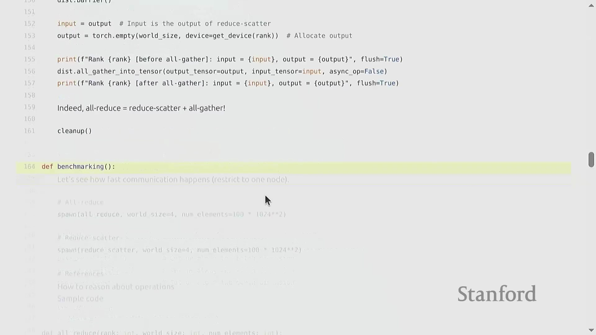
本次测试将聚焦于单节点环境（`world_size` = 4），使用包含1亿个元素的张量作为负载。精确的基准测试依赖于严格的状态管理：首先需执行一次预热迭代(Warm-up Iteration)以“重置硬件与运行时状态”，随后触发同步屏障(Barrier)，确保所有相关的CUDA内核(CUDA Kernel)均已加载并完成即时编译。
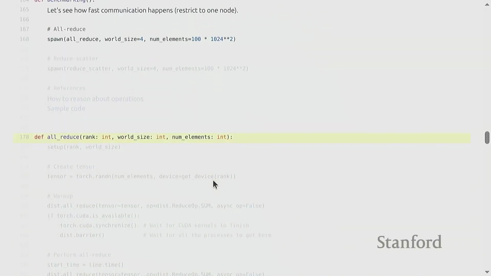
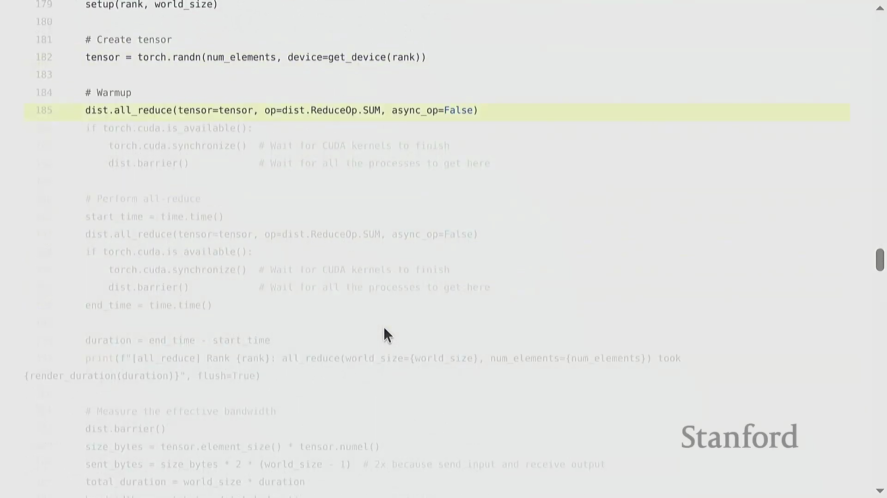
完成上述初始化后，方可启动高精度计时器，执行目标集合操作，并再次调用同步原语以确保操作彻底完成，最终停止计时并记录耗时。

## 剖析全归约(All-Reduce)通信带宽
获取精确的耗时数据后，我们即可推算有效的通信带宽(Effective Bandwidth)。

为计算带宽（单位：GB/s），需首先确定通信的总数据量。每个Rank持有一个元素数据类型已知（如单精度浮点数(Float32)占用4字节）的张量。在`all_reduce`的带宽计算模型中，存在一个关键系数`2`：这是因为在典型的环状或树状算法中，每个Rank不仅需要向外发送局部数据参与全局聚合，还需接收并写回最终的聚合结果，数据流经链路的总量近似为原始数据量的两倍。


将(单个Rank的数据量 × 系数2 × `world_size`)除以实际耗时，即可得出系统的聚合带宽(Aggregate Bandwidth)。在本次特定测试中，实测带宽约为277 GB/s。尽管H100搭载的NVLink理论峰值带宽可逼近900 GB/s，但实际吞吐量会因张量尺寸、参与设备数量及系统负载状况而产生显著波动。因此，针对具体工作负载(Workload)进行实测始终是必不可少的环节。


## 归约分散(Reduce-Scatter)性能测试
`reduce_scatter`的测试流程与前述方法基本一致。

我们构建一个形状为`world_size × num_elements`的输入张量，使得每个Rank初始均持有完整的数据矩阵。在完成预热与计时后，我们即可评估其数据传输速率。


与`all_reduce`不同，此处的数据量计算无需乘以系数`2`。在`reduce_scatter`中，数据流呈单向传输特征：局部数据被发送至通信拓扑中进行聚合归约，随后对应的结果分块直接分发至目标Rank，无需额外的回传阶段。本例中实测带宽约为70 GB/s。该性能差异主要源于底层通信库对`all_reduce`进行了深度优化，这既归因于`all_reduce`更高的通信复杂度与流量模式(Traffic Pattern)，也得益于其在分布式训练流水线中的极高使用频率。


---

## 性能差异与带宽计算
`all_reduce`（全归约）与`reduce_scatter`（归约分散）之间观察到的性能差异，通常源于底层的硬件级优化。NVIDIA的网络架构内置了专用的加速引擎，能够在数据传输过程中直接执行部分归约(Reduction)计算，这正是造成两者吞吐量差异的主要原因。然而，鉴于NCCL内部路由算法的复杂性，实际基准测试(Benchmarking)依然是评估真实性能的唯一可靠标准。

在计算有效带宽(Effective Bandwidth)时，必须充分考量数据流动的方向。对于`all_reduce`操作，计算总通信量时需乘以系数`2`，这是因为每个进程标识符(Rank)不仅需要向外发送局部数据以参与全局聚合，还需接收并写回最终同步后的聚合结果。

相比之下，`reduce_scatter`呈现为单向数据流：输入数据在通信拓扑中完成归约后，其对应的计算结果分块直接被分发至各自的目标Rank，无需额外的回传阶段，因此计算带宽时无需乘以系数`2`。

若将`reduce_scatter`与后续的`all_gather`（全收集）操作相结合，便会重现`all_reduce`的双向通信流量模式(Traffic Pattern)，这也从理论上验证了它们之间的带宽等效关系。


## 数据并行的概念框架
从集合通信原语(Collective Communication Primitives)过渡至实际的分布式训练(Distributed Training)，其核心策略在于探索如何在多设备间对模型参数或训练数据集进行高效划分。

选取多层感知机(Multilayer Perceptron, MLP)作为代表性工作负载(Workload)极具教学价值，因为MLP（以及Transformer架构中的前馈神经网络(Feed-Forward Network, FFN)模块）通常属于计算密集型(Compute-Bound)任务，而非访存密集型(Memory-Bound)任务。

数据并行(Data Parallelism)严格遵循沿批次(Batch)维度对输入数据进行切分的原则。

若将训练数据集抽象为形状为`[batch_size, hidden_dim]`的张量(Tensor)，数据并行仅需将该张量沿第一维切分为若干连续且互斥的子块。每个GPU Rank将分配到批次中唯一的一个数据子集，并利用模型的完整副本(Replica)进行独立的前向与反向传播计算，随后再同步所学习到的参数更新。


## DDP 的底层实现
从零构建分布式数据并行(Distributed Data Parallel, DDP)算法，对标准训练脚本的代码结构改动极为微小。首要步骤是将全局批次大小(Global Batch Size)除以进程总数(`world_size`)，以计算出每个设备负责的本地批次大小(Local Batch Size)。

随后，各Rank依据其唯一的进程标识符(`rank`索引)从全局数据集中提取对应的数据分片，严格确保各设备间的数据互不重叠(Non-overlapping)。

接下来，需在所有设备上独立初始化完全相同的MLP模型参数与优化器(Optimizer)。由于分布式进程组(Process Group)在跨Rank运行时默认处于异步状态，每个设备将并行且独立地执行这份初始化逻辑。

训练循环(Training Loop)的执行流程与标准的随机梯度下降(Stochastic Gradient Descent, SGD)完全一致：依次执行包含矩阵乘法与非线性激活函数(Non-linear Activation Function)的前向传播(Forward Pass)，随后计算损失函数(Loss Function)并触发反向传播(Backward Pass)。

DDP机制最具标志性的修改在于反向传播完成后插入的同步操作：针对模型中每一个可训练参数的`.grad`（梯度）属性，调用`all_reduce`操作。


该操作会在优化器应用参数更新(Parameter Update)之前，对所有工作节点(Workers)本地计算出的梯度进行全局求和并取平均，从而确保梯度的一致性。


## 同步保证与执行流程
在训练执行过程中，你会观察到各Rank报告的损失值(Loss Value)存在自然差异，这是因为它们各自基于不同的微型批次(Mini-batch)独立计算损失。

然而，得益于反向传播后触发的`all_reduce`操作，各设备计算的梯度在数学意义上被精确平均，从而严格保证了所有设备上的模型参数更新保持全局同步。

此处的关键在于，`all_reduce`操作本身充当了一个隐式的同步屏障(Synchronization Barrier)；它会强制阻塞所有参与进程，直至每一个Rank均抵达该通信同步点。

若任一Rank遗漏调用或参数错配了`all_reduce`，整个分布式训练任务将陷入无限期死锁(Deadlock)或挂起状态。这种内置的同步机制确保了即便底层操作系统级进程以异步方式调度，算法层面的训练迭代(Iteration)仍能保持严格的步调对齐。

严谨的初始化流程确保了所有Rank均从部署于各自GPU上的相同模型权重(Model Weights)起步。这在维持与单GPU训练数学等价性(Mathematical Equivalence)的同时，使得系统吞吐量(Throughput)能够随`world_size`的实现近乎线性的扩展。


这种最基础的DDP范式构成了支撑更复杂模型架构（如Transformer）的基石。在Transformer的训练中，完全相同的梯度同步原理被无缝扩展并逐层应用于庞大的参数矩阵之中。


---

## 同步 SGD 与计算-通信权衡
分布式数据并行(Distributed Data Parallel, DDP)本质上是在`world_size`个设备上并行运行同步的随机梯度下降(Stochastic Gradient Descent, SGD)进程。该架构的设计哲学与激活检查点(Activation Checkpointing)异曲同工：在本地进行冗余计算，通常远比承担跨设备数据通信的高昂延迟成本更为经济高效。具体而言，每个进程标识符(Rank)会在本地原地(In-place)计算并应用优化器更新(Optimizer Updates)，而非通过网络传输庞大的优化器状态(Optimizer States)。同步瓶颈(Synchronization Bottleneck)被严格限制在梯度平均(Gradient Averaging)阶段，从而确保实际的权重更新过程保持极高的执行效率。


## 张量并行：沿模型维度分片
突破单纯的数据划分策略，**张量并行**(Tensor Parallelism)选择沿模型的隐藏维度(Hidden Dimension, `num_dim`)对网络架构本身进行切分。在此模式下，每个GPU Rank均保留模型的所有网络层，但仅持有每层参数矩阵的特定分片(Shard)（通常比例为`1/world_size`）。当模型规模突破单张GPU的显存容量(Memory Capacity)极限时，该策略显得尤为关键。相应地，全局参数矩阵的形状将从`[num_dim, num_dim]`重塑为`[num_dim, local_num_dim]`。


在前向传播(Forward Pass)阶段，每个Rank首先基于其持有的局部权重分片计算局部激活值(Local Activations)。然而，由于后续网络层依赖于完整的激活向量，必须对这些部分结果进行全局同步。此过程通过全收集(All-Gather)集合通信原语实现：每个Rank预先分配用于容纳完整`[batch_size, num_dim]`张量的缓冲区，随后从所有对等节点(Peer Ranks)收集局部激活分片并完成拼接。重构后的完整激活张量随后被无缝传递至后续层继续计算。


这种逐层同步机制凸显了张量并行对极高带宽互连(High-Bandwidth Interconnect)的严苛依赖。尽管反向传播(Backward Pass)涉及同样复杂的通信拓扑，但前向实现的逻辑已清晰阐明：局部计算结果如何通过高效聚合，确保所有Rank在每一推理阶段均能处理尺寸完整的全量激活张量。


## 流水线并行：按层划分模型
第三种核心策略为**流水线并行**(Pipeline Parallelism)，其核心思想是依据网络层的拓扑顺序(Topological Order)而非权重张量的维度来对模型进行垂直切分。在此架构下，每个Rank处理相同的全局输入数据流，但每张GPU仅负责执行模型中特定且连续的网络层阶段(Network Stage)。例如，将一个包含4层的神经网络分配给2个Rank时，Rank 0将承载第1至2层，而Rank 1负责第3至4层。该策略通过强制每个设备仅加载其专属阶段的模型权重，从根本上突破了单卡显存的物理限制。


然而，朴素的流水线实现会遭遇严重的“流水线气泡”(Pipeline Bubble)问题，即下游GPU因等待上游计算完成而陷入空闲状态。为有效缓解这一算力浪费，全局批次(Global Batch)通常被进一步细分为多个更小的**微批次**(Micro-batches)（例如，将大小为128的全局批次拆分为4个大小为32的微批次）。此时，数据流转机制将从集合通信切换为点对点通信原语(Point-to-Point Communication Primitives)，主要依赖`recv`（接收）与`send`（发送）操作。具体流程为：Rank 0率先处理首个微批次，并将产出的中间激活值(Intermediate Activations)发送至Rank 1；Rank 1接收数据后立即启动计算，并在完成后将输出结果向下游节点转发。


## 朴素流水线实现的局限性
尽管概念直观易懂，但这种基础的流水线范式会引发显著的性能损耗。该实现强依赖阻塞式(Blocking)接收(`recv`)调用，强制Rank处于空闲等待状态直至数据就绪。此外，该方案完全缺乏通信与计算重叠(Communication-Computation Overlap)的优化机制。在现代生产级分布式系统中，这些瓶颈通常通过引入非阻塞异步传输(Non-blocking Asynchronous Transfers)、设计复杂的微批次调度算法(Micro-batch Scheduling)以及实施精细的显存管理(Precision Memory Management)来攻克，从而确保GPU在整个训练循环(Training Loop)中维持极高的算力利用率。


---

## 流水线中的通信与计算重叠
前文探讨的朴素流水线实现(Naive Pipeline Implementation)依赖于同步的发送(`send`)与接收(`recv`)操作，这会导致设备产生大量的空闲时间(Idle Time)。为优化性能，需将这些操作替换为异步模式。此外，生产环境中的流水线必须精细地交错执行前向传播(Forward Pass)与反向传播(Backward Pass)，以最大化GPU利用率(GPU Utilization)。现代实现方案在数据传输期间不会阻塞，而是触发非阻塞通信操作(Non-blocking Communication Operations)，并立即转向处理下一个微批次(Micro-batch)。该机制仅在必要时才执行显式同步(Explicit Synchronization)，从而确保计算任务与数据搬运能够高度并发。


## 步调同步与事件驱动架构的对比
一个常见的疑问是：分布式训练是否如同事件驱动编程(Event-Driven Programming)那般，由工作节点(Workers)被动响应传入的数据？尽管早期的异步训练(Asynchronous Training)范式与此类似，但现代大规模分布式训练严格遵循步调一致(Lockstep)的同步模型。尽管各进程在操作系统(OS)层面独立调度，但训练循环(Training Loop)会强制执行严格的协调机制。当调用`iSend`等异步原语(Asynchronous Primitives)时，函数会立即返回一个通信请求句柄(Communication Request Handle)，程序可继续执行后续非依赖任务。然而，在进入依赖该通信结果的关键步骤前，必须显式等待(Wait)所有句柄状态置为完成，以此确保所有进程标识符(Rank)上的执行流程具备严格的确定性(Determinism)。


## 管理点对点通信顺序
在处理多项并发传输(Concurrent Transfers)时，PyTorch的分布式后端依赖源进程标识符(Source Rank)与目标进程标识符(Destination Rank)（而非张量名称）进行数据路由。消息会在通信流(Communication Streams)中有序排队，严格遵循特定Rank配对间的发送与接收时序。若某Rank发起数据发送，而对端尚未准备好执行匹配的接收操作，发送方将进入阻塞(Block)状态，直至接收方触发对应的调用。这种严格的顺序控制机制有效避免了竞态条件(Race Condition)，但也要求开发者进行严谨的逻辑设计，以防引发分布式死锁(Distributed Deadlock)。


当末尾的Rank完成前向传播(Forward Pass)后，其将持有最终的输出激活值(Output Activations)并计算初始损失(Loss)。随后，反向传播(Backward Pass)沿拓扑逆向展开：梯度(Gradients)被逐层计算，并从`Rank N`显式回传至`Rank N-1`，将误差信号(Error Signal)逐层向上游传播，直至模型所有层级的参数均获得更新。


## 实际复杂性与生产级框架
尽管多层感知机(MLP)奠定了清晰的概念基础，但将这些并行策略迁移至Transformer等复杂架构时，将衍生出庞大的工程开销。生产级系统需动态映射任意类型的网络层、精细管理激活检查点(Activation Checkpointing)，并妥善处理不规则的显存占用(Memory Footprint)。诸如Megatron-LM与PyTorch FSDP(Fully Sharded Data Parallel)等成熟框架虽对外屏蔽了底层复杂性，但其内部依赖精密的状态管理机制，以便在大规模集群上自动完成模型参数、优化器状态(Optimizer States)及梯度的分片(Sharding)。


## JAX 与编译器栈的声明式分片
相较于PyTorch的命令式编程范式(Imperative Paradigm)，JAX/TPU生态体系提供了一种高度声明式(Declarative)的替代方案。开发者只需预先定义模型架构并指定分片策略(Sharding Strategy)，即可依赖XLA编译器(XLA Compiler)自动推演并生成分布式通信与计算图(Computation Graph)。以`Levator`等工具链为例，其仅需寥寥数行代码即可实现FSDP等高级并行技术。用户无需手动编排`all_gather`或`reduce_scatter`等通信循环，仅需通过注解标明张量(Tensor)的特定维度如何映射至设备网格(Device Mesh)的物理轴。随后，编译器将全自动优化从注意力头切分(Attention Head Partitioning)到流水线阶段分配(Pipeline Stage Assignment)的全局调度，在维持极致性能的同时，大幅削减冗余的样板代码(Boilerplate Code)。


---

## 声明式分片(Declarative Sharding)与 JAX 编译器栈(Compiler Stack)
相较于PyTorch对集合操作采用的命令式(Imperative)与底层封装方式，JAX与TPU生态系统提供了一种高度声明式(Declarative)的编程范式。开发者无需手动编排通信原语(Communication Primitives)，仅需定义模型架构，并明确指定哪些张量维度（如注意力头(Attention Heads)、嵌入维度(Embedding Dimensions)、序列长度(Sequence Length)）需要进行划分，以及如何将其映射至物理设备网格(Physical Device Mesh)。随后，JAX编译器将自动推导并生成所需的`all_gather`（全收集）、`reduce_scatter`（归约分散）及数据重排(Data Reshuffling)操作，从而将底层的通信复杂性彻底抽象。


尽管这种编译器驱动(Compiler-Driven)的方法在概念上极为简洁优雅，但本课程仍以PyTorch为核心，旨在帮助大家深入剖析分布式训练的底层运行机制。然而，在实际生产环境中，强烈建议直接采用此类高级抽象或成熟的第三方库，而非从零手写分布式逻辑。


## 根本性权衡：计算、内存与通信
纵观各类并行策略——无论是沿批次(Batch)、模型宽度(Model Width)、网络深度(Model Depth)还是上下文长度(Context Length)维度进行划分——其核心始终围绕一个永恒的主题：在计算重算(Recomputation)、本地显存存储(Local Memory Storage)与跨设备通信(Cross-Device Communication)之间进行权衡。开发者可以选择通过从头重算(Recompute)来节省激活值(Activations)，将其缓存在昂贵但高速的片上内存(On-Chip Memory/SRAM)中，亦或是以消耗互连带宽(Interconnect Bandwidth)为代价，将其卸载(Offload)至其他GPU的显存中。

通常情况下，策略性重算(Strategic Recomputation)往往比承担高昂的通信开销(Communication Overhead)或触发显存瓶颈(Memory Bottleneck)更为高效。即便硬件性能持续跃升，模型架构的指数级扩展仍会不断逼近物理边界。计算、显存与通信之间的根本性制约(Fundamental Trade-off)构成了系统设计永恒的约束条件；随着硬件算力的迭代，实际工作负载(Workload)的规模亦将随之膨胀，以充分填满新增的容量上限。


## 处理框架特定细节：BatchNorm 与确定性(Determinism)
在部署数据并行(Data Parallelism)时，依赖批次全局统计量(Global Batch Statistics)的操作（如批归一化(Batch Normalization)）会引入显著的同步开销。与已成为现代大语言模型标准、且支持逐样本(Per-Sample)独立计算的层归一化(Layer Normalization)不同，BatchNorm必须跨设备聚合均值(Mean)与方差(Variance)以维持统计一致性。若缺乏严谨的同步机制，各进程标识符(Rank)将计算出偏差的局部统计量，进而破坏训练过程的数值稳定性。

在确保各Rank采用一致的归一化策略且共享相同随机种子(Random Seed)进行初始化的前提下，参数更新将保持严格的确定性(Determinism)。需注意的是，受限于浮点数归约操作(Floating-Point Reduction)的舍入误差累积，极端情况下可能引发微弱的GPU级非确定性(Non-determinism)，但此类数值扰动在大规模训练流水线中通常可忽略不计。

## 生态系统差异：PyTorch、JAX 与 DeepSpeed
分布式训练的具体实现路径高度依赖于底层的软硬件生态系统。PyTorch提供了诸如`FSDP`(Fully Sharded Data Parallel，完全分片数据并行)等健壮的高级封装，能够自动为任意模型架构处理参数分片(Parameter Sharding)与梯度同步(Gradient Synchronization)，使开发者得以从繁琐的底层样板代码(Boilerplate Code)中解脱出来。

在技术谱系的一端，JAX依托编译器优化(Compiler Optimizations)与深度集成的TPU基础设施，以声明式(Declarative)方式自动化处理数据分片。而在另一端，诸如DeepSpeed等框架则倾向于采用激进的底层NCCL深度调优(Low-level NCCL Tuning)策略与自定义通信调度器(Custom Communication Schedulers)，旨在互连性能受限的硬件集群上最大化系统吞吐量(Throughput)。简言之，若将JAX视为从高层数学定义出发进行抽象推演，那么DeepSpeed便是深入网络协议栈底层，致力于榨干每一比特的通信带宽。


## 策略性激活检查点(Activation Checkpointing)
PyTorch与JAX均提供了激活检查点（亦称梯度检查点(Gradient Checkpointing)）的API，允许开发者显式标记在前向传播(Forward Pass)阶段需释放的中间激活值(Intermediate Activations)，并在反向传播(Backward Pass)阶段按需重新计算(Recompute)。该技术的核心哲学并非盲目地对所有层启用或完全禁用检查点，而是在显存占用与计算开销之间寻求最优平衡。

最佳实践建议在计算密集型与显存高占用操作（如大型矩阵乘法(Matrix Multiplication)）之后部署检查点。相反，在低开销的逐元素操作(Element-wise Operations，如逐点加法或激活函数)之后立即插入检查点是低效的，因为此举节省的显存微乎其微，而后续重算引入的计算开销将严重抵消收益。

## 专用 AI 硬件与通用 GPU
Groq与Cerebras等面向Transformer架构的专用加速器(Domain-Specific Accelerators)的崛起，标志着硬件设计正全面转向针对深度学习工作负载(Deep Learning Workloads)的定向优化。此类架构不再单纯追逐峰值浮点运算能力(Peak FLOPs)，而是优先堆叠海量片上静态随机存取存储器(On-Chip SRAM)，使其在逻辑上充当超大容量的L1缓存(L1 Cache)，从而彻底规避了频繁且迟缓的片外内存访问(Off-Chip Memory Access)瓶颈。

相比之下，通用图形处理器(General-Purpose GPUs)因继承图形渲染历史而背负着冗余包袱，诸如复杂的控制流分支(Control Flow Branching)与传统图形渲染管线(Graphics Pipelines)，这些特性在现代张量计算中往往显得多余。通过剥离这些低效组件，并将硅片算力专用于高可预测性、数据并行(Data-Parallel)的矩阵运算，专用加速器大幅简化了内存层次结构(Memory Hierarchy)，为模型训练与推理(Inference)带来了数量级的吞吐量跃升。

## 从检查点(Checkpoint)恢复训练
前述各类分布式并行策略在算法层面并不改变模型的优化轨迹(Optimization Trajectory)，且整个训练流程具备完善的状态持久化能力。系统严格依赖每一步的梯度更新(Gradient Updates)进行推进，这意味着无论训练因何中断，均可从持久化的检查点无缝恢复。

无论是从零初始化(Initialization)还是续跑长期训练任务(Long-running Jobs)，恢复流程均保持一致：加载分片的模型参数(Sharded Model Parameters)、重建优化器状态(Optimizer States)与学习率调度器(Learning Rate Schedulers)，随后继续推进下一批次的梯度更新。分布式基础设施(Distributed Infrastructure)本质上仅是对算力规模的横向扩展(Horizontal Scaling)，它绝不会破坏优化算法在数学意义上的等价性与连续性。

---

## 物理限制与专用 AI 硬件
扩展多 GPU 节点(Scaling Multi-GPU Nodes)面临根本性的物理限制。受限于供电(Power Delivery)、散热(Thermal Dissipation)以及单颗硅芯片(Silicon Die)上可物理布线的有限带宽等硬性约束，我们无法简单地将 GPU 的尺寸无限扩大或提升其集成密度。

为突破传统瓶颈，以 Cerebras 为代表的专用架构(Specialized Architectures)采用了创新的晶圆级集成技术(Wafer-Scale Integration)，将海量内存直接集成至计算晶圆(Compute Wafer)之上。


尽管这种单体架构(Monolithic Architecture)大幅降低了数据搬运延迟并彻底消除了片外内存(Off-Chip Memory)瓶颈，但其在本质上牺牲了传统多 GPU 集群设计的灵活性与模块化(Modularity)优势。

## 从控制流到数据流范式的转变
上述硬件差异，折射出计算领域更为深远的范式转变(Paradigm Shift)。传统 GPU 继承了 CPU 时代的理念，其本质属于控制流驱动(Control-Flow Driven)模型：指令执行占据主导地位，数据必须依据指令流动态获取并调度至指定计算单元。

相比之下，深度学习工作负载(Deep Learning Workloads)运行在高度可预测的数据流模型(Data-Flow Model)之上。计算图(Computational Graph)在很大程度上是静态的(Static)；自训练伊始，系统便能精确预知在数百万次迭代(Iterations)中将执行哪些张量操作、矩阵乘法(Matrix Multiplication)及梯度更新(Gradient Updates)。这种结构上的可预测性，使得编译器(Compiler)与专用硬件能够进行更为激进的内存布局预调度(Memory Layout Pre-scheduling)与数据流水线(Data Pipeline)优化，其效率远超充斥着临时动态分支(Ad-hoc Dynamic Branches)的传统执行环境。

## 执行架构：CPU 编排与 GPU 内核
分布式训练(Distributed Training)中一个常见的困惑在于：计算图(Computational Graph)与通信原语(Communication Primitives)究竟驻留于何处。从概念层面而言，计算图属于主机端(Host-Side/CPU)的逻辑结构，专门用于依赖关系跟踪(Dependency Tracking)与自动微分(Automatic Differentiation)的计算图规划。


CPU 并不承担繁重的数值计算(Numerical Computation)任务；相反，它扮演着主调度器(Primary Orchestrator)的角色。当用户调用张量操作(Tensor Operations)时，主机代码会向设备端派发指令，启动高度优化的 CUDA 内核(CUDA Kernels)，这些内核随后在 GPU 的流多处理器(Streaming Multiprocessor, SM)上并行执行。

集合通信操作(Collective Communication Operations)遵循相同的模式：它们本质上是抽象规范(Abstract Specifications)，可由不同的运行时后端(Runtime Backends)提供支持（例如，GPU 间通信依赖 NCCL，而 CPU 通信则使用 Gloo）。

操作触发时，CPU 会将请求递交给后端库，后端库随即在 GPU 上启动专用的数据搬运内核(Data Movement Kernels)，通过 NVLink 或底层网络拓扑(Network Topology)完成张量的重排与传输。这种清晰的职责分离(Clear Separation of Duties)使得主机得以专注于任务编排(Task Orchestration)，而硬件加速器(Hardware Accelerator)则能将其计算算力与显存带宽(Memory Bandwidth)利用率推向极限。

至此，关于多 GPU 并行(Multi-GPU Parallelism)、硬件物理限制(Hardware Physical Constraints)及分布式执行模型(Distributed Execution Models)的深度剖析便告一段落。我们下期再见。
