## 引言与前沿模型挑战
我将简要谈谈缩放定律(Scaling Laws)。原本的计划是讨论推理(Inference)，但我会先花几分钟从缩放定律讲起，再探讨后续的技术方向。  为了引出话题，不妨想象你有一位非常富有的朋友，借给你10万张 H100 GPU 使用一个月，让你构建尽可能优秀的开源语言模型(Language Model)。 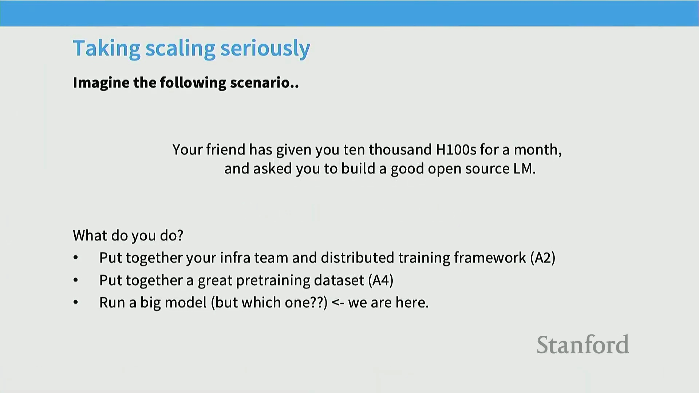 尽管这是一项极具挑战的任务，但你已握有必要的工具：基础设施团队、分布式训练框架、高质量的预训练数据集，以及扎实的模型架构知识。与其简单地复现 Llama 等现有模型——这种做法既枯燥又无法推进技术边界，你更希望在类似前沿实验室的设定中进行创新，探索更优的解决方案。 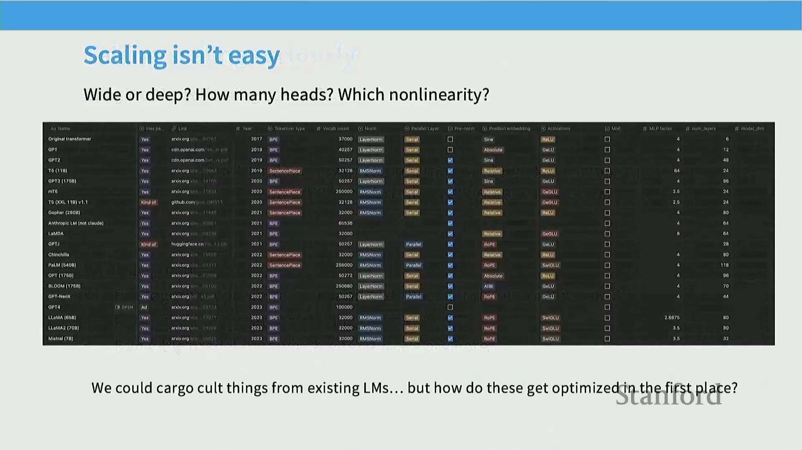

## 核心概念：语言模型的预测定律
缩放定律(Scaling Laws)的根本目标是为语言模型的行为构建简单且可预测的经验模型。其核心思想是：先训练小规模模型，从中提取有价值的见解并进行外推(Extrapolation)，从而有信心地将规模扩展至巨型模型。这与过去那种计算成本高昂、依赖暴力搜索(Brute-force Search) 训练大量大型模型并反复调整超参数(Hyperparameters) 的旧方法形成了鲜明对比。 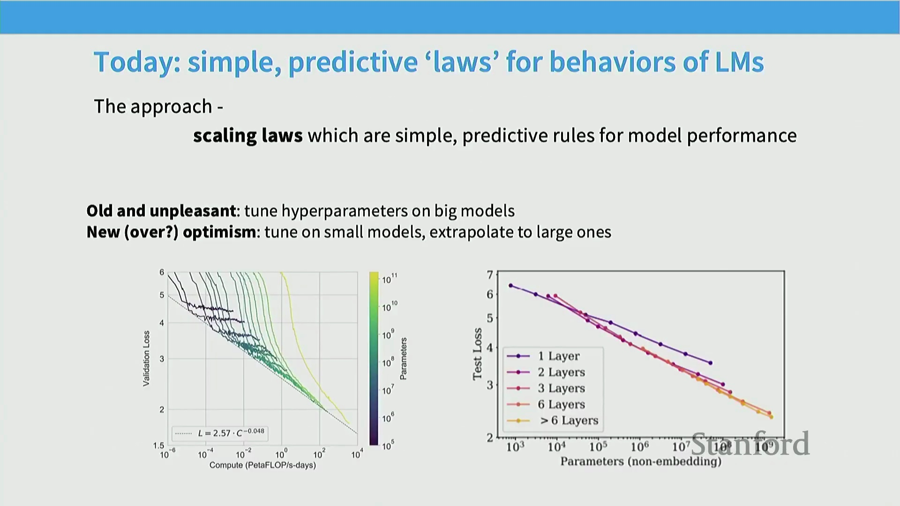 通过利用小规模训练阶段积累的经验规律，你可以在构建最终的大型模型时高效规避试错，并在一次经过充分验证的训练任务(Training Run) 中精准确定模型架构与超参数。

## 统计学习理论基础
缩放定律常被笼罩在关于通用人工智能(AGI, Artificial General Intelligence) 的神秘叙事中，但实际上它深深植根于成熟的统计机器学习(Statistical Machine Learning) 理论。如果你还记得入门机器学习课程中的 VC维(Vapnik-Chervonenkis Dimension) 和 Rademacher复杂度(Rademacher Complexity) 等概念，就会发现缩放定律本质上是这些理论思想的实证演化。它们预测了随着数据量增加或模型规模调整，模型行为应如何变化。 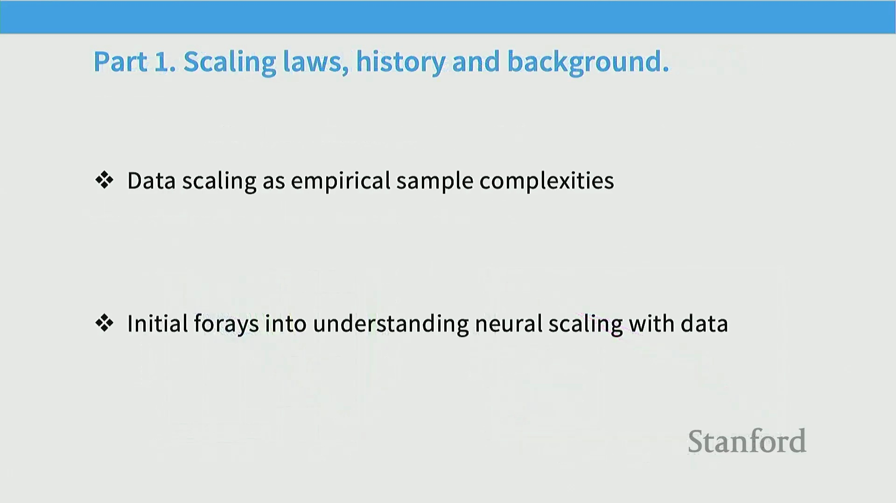 经典理论提供了泛化边界(Generalization Bounds)，阐明了超额风险(Excess Risk) 如何随数据量变化（例如，与样本量的平方根成反比），或勾勒出灵活生成模型的非参数收敛速率(Non-parametric Convergence Rates)。尽管这些仅是理论上的性能上限而非实际观测到的损失值(Loss)，但缩放定律实现了从理论推导到经验拟合(Empirical Fitting) 的关键跨越，使我们能够对未来模型的实际性能轨迹进行精确建模与预测。

## 历史渊源与早期研究
缩放定律的起源远比现代深度学习(Deep Learning) 更为久远。该领域早期文献的有力候选者，是 Vapnik 和 Cortes 等先驱于1993年在贝尔实验室发表的一篇 NIPS(Conference on Neural Information Processing Systems) 论文。 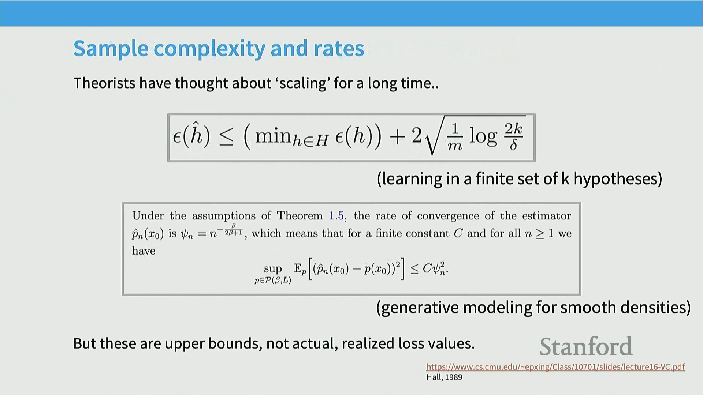 该研究极具前瞻性，明确指出了在大规模数据集上训练所面临的高昂计算成本，并提出了一种预测方法，能够在无需完成完整训练的情况下估计测试误差(Test Error)。他们将误差建模为不可约误差(Irreducible Error) 与多项式衰减项之和，通过在小规模模型上拟合曲线，成功预测了更大规模模型的性能表现。Banko 和 Brill 的另一项奠基性工作探讨了自然语言处理(NLP, Natural Language Processing) 系统性能如何随数据规模增长，展示了可预测的性能提升曲线，并引发了对算法开发与数据收集之间关键权衡的深入分析。 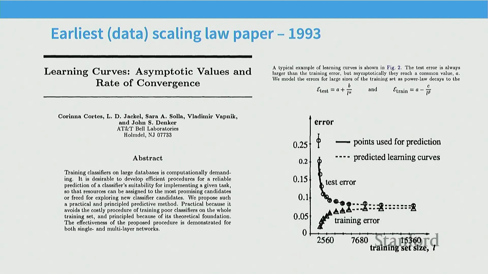 长期以来，学界一直就这些趋势的可预测性，以及将数据量映射至模型能力的最佳函数形式（如幂律(Power Law)）展开争论。 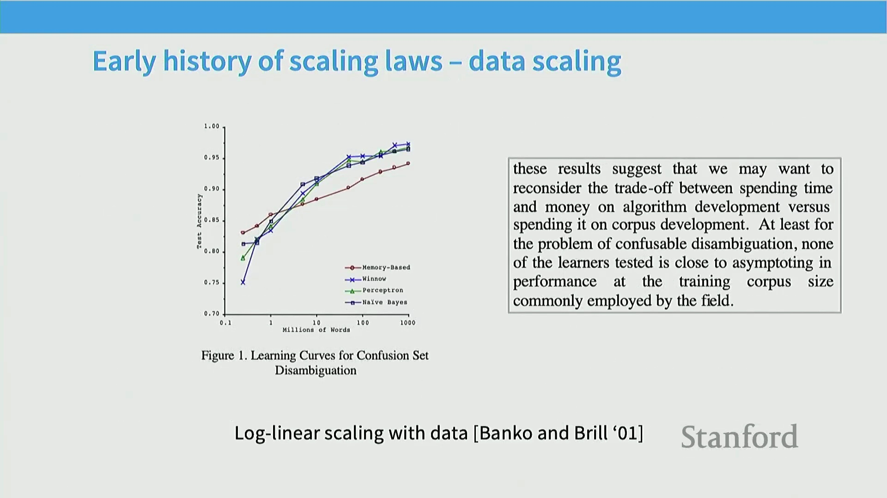

## 现代神经缩放与性能阶段
最早的大规模神经缩放定律论文被广泛认为是百度研究院(Baidu Research) 的 Hestness 等人于2017年发表的研究。他们在机器翻译、语音识别和计算机视觉任务中证明，错误率始终遵循幂律下降规律。  该研究明确了模型训练过程中的三个显著阶段：初始的随机猜测区间(Random Guessing Regime)、受幂律缩放(Power-law Scaling) 主导的可预测中间区间，以及最终逼近该模型族不可约误差的渐近区间(Asymptotic Regime)。有趣的是，诸如“涌现能力”(Emergent Abilities)、算力扩展(Compute Scaling) 的关键作用，以及模型量化(Quantization) 等技术路线的合理性，均在这项2017年的研究中初现端倪。作者指出，缩放预测在随机猜测阶段会失效，同时强调了计算资源的瓶颈限制，并有力论证了可预测的缩放特性使得“通过增加原始计算资源换取模型精度”这一策略具备了充分的合理性。 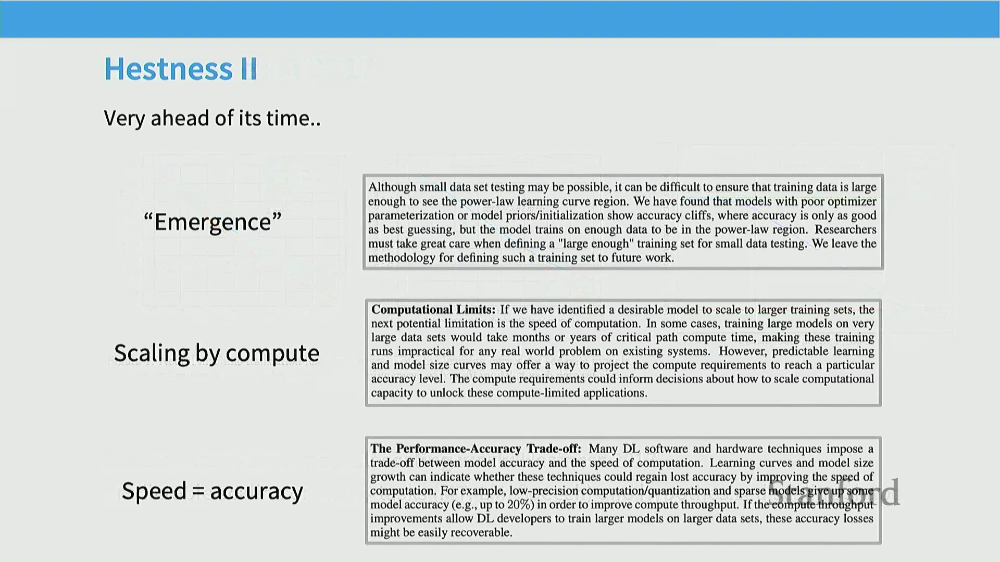

---

## 规模定律的基础背景
本文开篇将规模定律(Scaling Laws)界定为机器学习(Machine Learning)领域中一个现代且直观易懂的概念。早期研究认识到，对计算资源(Computational Resources)进行可预测的投入，能够直接转化为模型能力(Model Capabilities)的可预测提升。这一关系构成了规模定律（尤其是在数据规模扩展(Data Scaling)方面）发展与应用的核心理念。
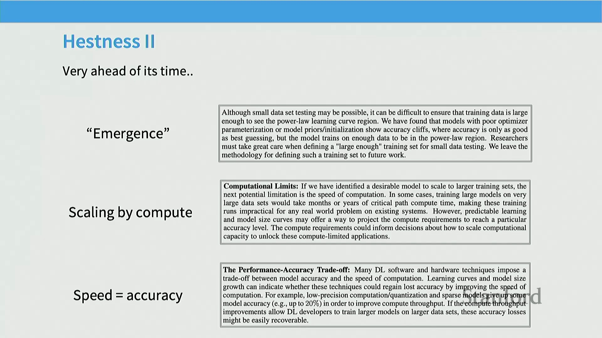
通过图表将这些演化趋势可视化，研究人员可以清晰地观察到系统性的资源分配如何推动性能的持续提升。这种基础性的理解为后续探讨规模扩展的理论预期(Theoretical Expectations)与实证现实(Empirical Reality)奠定了基础。
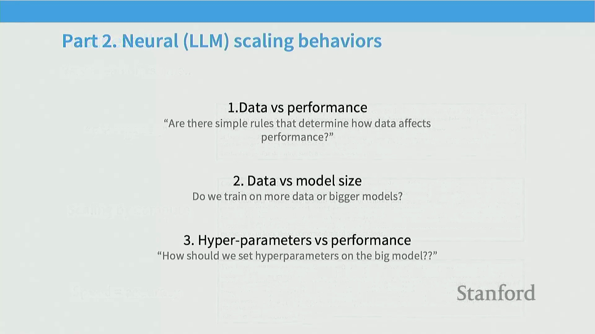

## 异常现象：逆规模效应与分布外影响
尽管训练损失(Training Loss)或留出集损失(Hold-out Set Loss)的改善通常遵循符合经典统计理论的自然、单调收敛(Monotonic Convergence)模式，但例外情况依然存在。“逆规模效应(Inverse Scaling Effect)”现象表明，在某些情况下，随着模型规模的扩大，性能反而会出现下降。例如，“逆规模奖(Inverse Scaling Prize)”等研究倡议就发现了一些特定场景，其中规模更大的模型表现反而更差，例如在试图抑制模型固有的文本复现倾向(Copying Tendency)时。
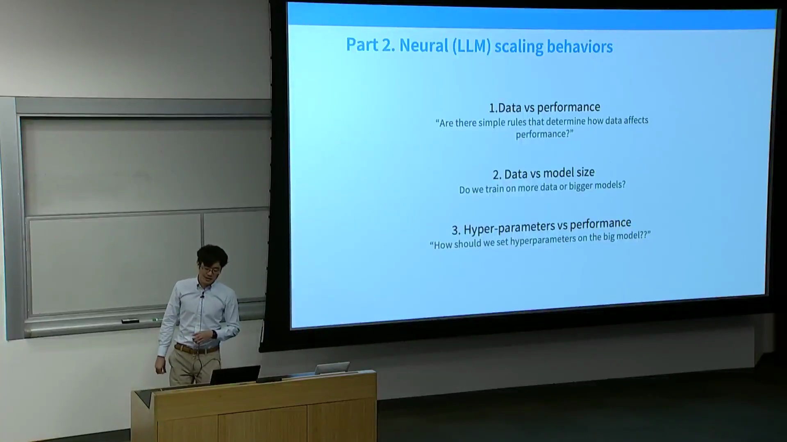
这些异常现象通常出现在模型面临严重的分布外(Out-of-Distribution, OOD)场景时，此时底层数据分布已无法充分支撑模型学习预期的行为模式。在此类情况下，规模扩展可能会停滞、逆转或表现出不可预测性，从而将经典的深度学习鲁棒性(Robustness)挑战有效延伸到了超大规模架构中。

## 大语言模型中的经验幂律
实证研究强烈支持大语言模型(Large Language Models, LLMs)中的多个变量均遵循规模定律。参考 Kaplan 等人关于规模定律的奠基性论文，当在双对数坐标轴(Log-log Axes)上绘制计算量(Compute)、数据集大小(Dataset Size)、参数量(Parameters)与测试损失(Test Loss)的关系时，会呈现出高度一致的线性关系。即使在非标准设置下（包括下游评估任务(Downstream Evaluation Tasks)和分布外任务），这些幂律关系(Power-law Relationships)依然保持稳健。
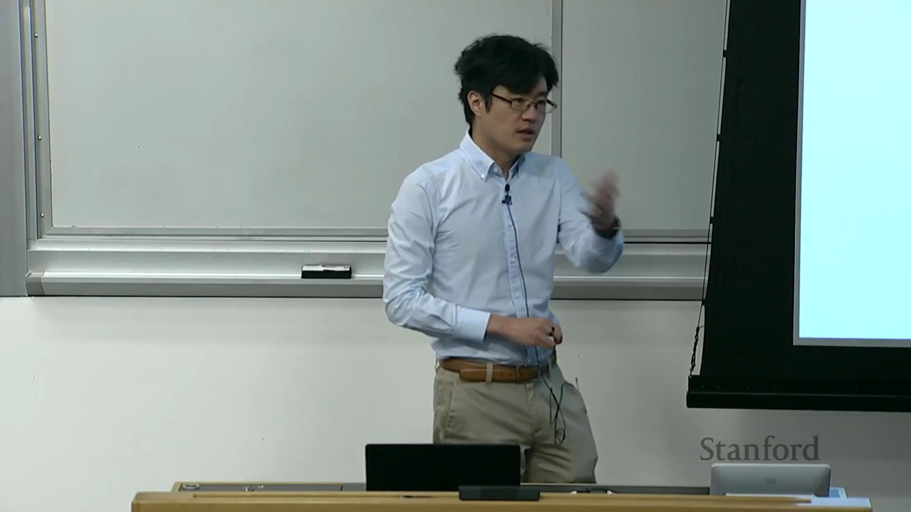
这些研究的一个关键假设是，未被同步缩放的变量（例如在扩展数据规模时的模型参数量）必须保持足够大，以避免出现渐近饱和(Asymptotic Saturation)。数据规模的扩展分析尤为直观，因为从数据集大小（$n$）到超额误差(Excess Error)的映射遵循一条可预测的单调曲线。
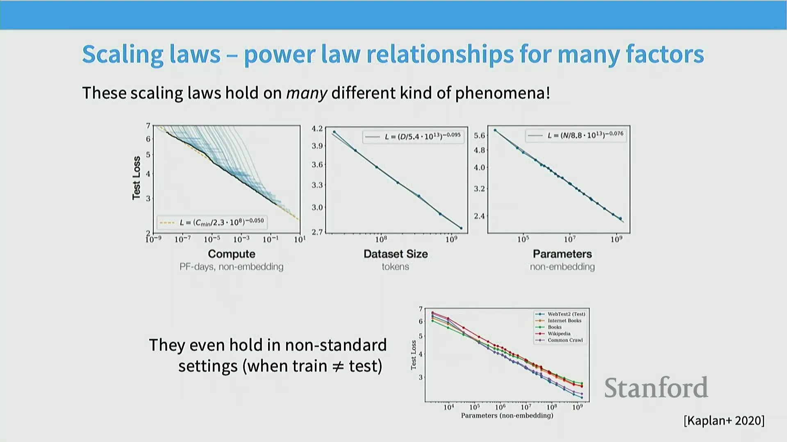

## 理论基线：均值估计与预期速率
为了理解这些幂律的数学起源，本文将问题简化为基本的统计估计(Statistical Estimation)。在估计高斯分布(Gaussian Distribution)的均值时，预期平方误差(Expected Squared Error)的缩放比例为 $\sigma^2/n$。对等式两边取对数后，可在双对数空间(Log-log Space)中揭示出一种线性关系，其理论斜率为 $-1$。
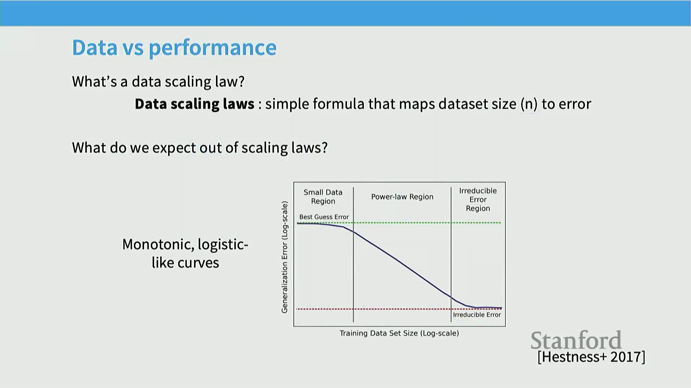
经典理论表明，简单的参数估计(Parametric Estimation)应产生直观的缩放速率(Scaling Rate)，例如在不可知学习(Agnostic Learning)框架下，误差速率通常为 $1/n$ 或 $1/\sqrt{n}$。这意味着在绘制误差与数据集大小的关系图时，应得到清晰规整的整数斜率。然而，深度学习(Deep Learning)的表现始终偏离这些参数化基线(Parametric Baselines)。

## 现实差距：慢于预期的经验斜率
现实世界的测量结果表明，实际的经验缩放速率显著慢于经典统计学的预测。实证研究指出，机器翻译(Machine Translation)的斜率约为 $-0.13$，语音识别(Speech Recognition)约为 $-0.3$，语言建模(Language Modeling)约为 $-0.095$。这些数值明显慢于理论预期的 $1/n$ 或 $1/\sqrt{n}$ 衰减速率。
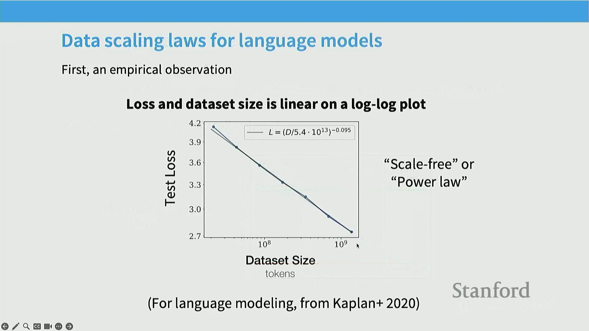
这种差异源于神经网络并非仅仅估计简单的统计量，而是逼近(Approximating)高度复杂且非结构化的函数。灵活的非参数模型(Non-parametric Models)的学习动态(Learning Dynamics)引入了维度依赖性(Dimensionality Dependence)，从根本上重塑了缩放行为。
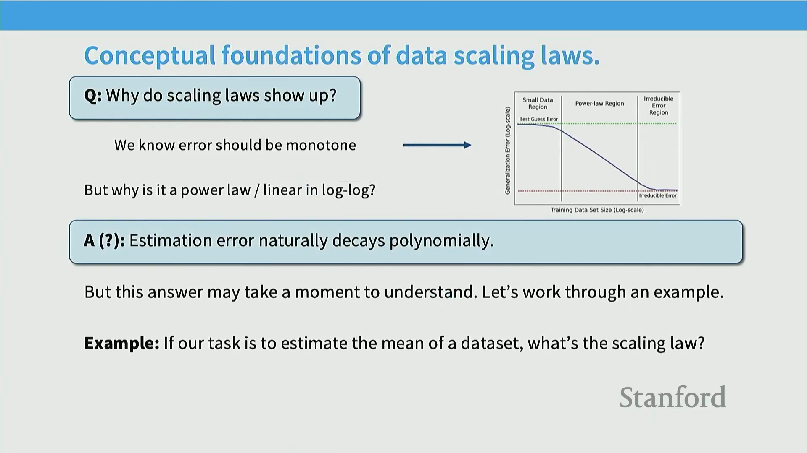

## 非参数逼近与维度依赖性
为了解释这些反常的速率，分析视角转向了非参数回归(Non-parametric Regression)。假设通过将空间划分为更小的区域并计算局部平均值(Local Averages)，来估计 $d$ 维空间上的平滑函数(Smooth Function) $f(x)$。理论推导表明，误差的缩放比例为 $n^{-1/d}$，这直接对应于双对数坐标系下的斜率 $-1/d$。
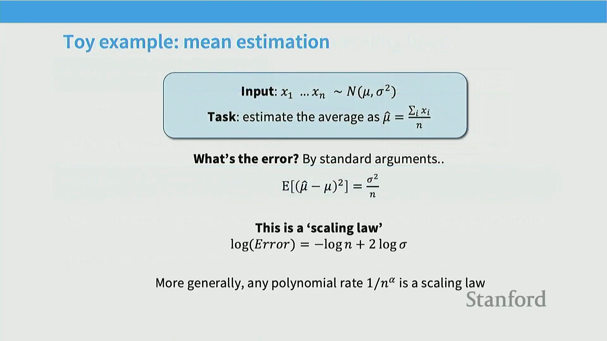
这种维度依赖性阐明了为何经验斜率(Empirical Slopes)如此平缓：神经网络在高维函数空间(High-dimensional Function Space)中运行，其有效学习难度由数据的内在维度(Intrinsic Dimensionality)决定。因此，规模定律的斜率可作为衡量任务内在维度或“学习难易程度”的实用代理指标(Proxy Metric)。
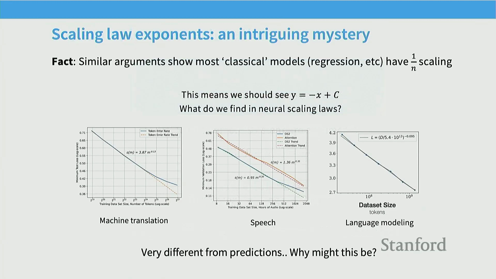
近期的理论与实证研究支持这一框架，并指出现代人工智能(Artificial Intelligence)中观察到的非标准学习速率(Non-standard Learning Rates)，正是对灵活的高维数据分布进行建模的直接结果。理解这些原理，有助于弥合经典统计学习(Classical Statistical Learning)与当代深度学习规模扩展现象之间的鸿沟。
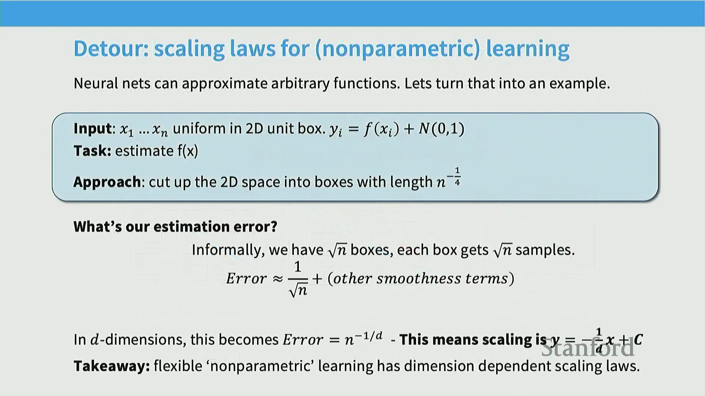
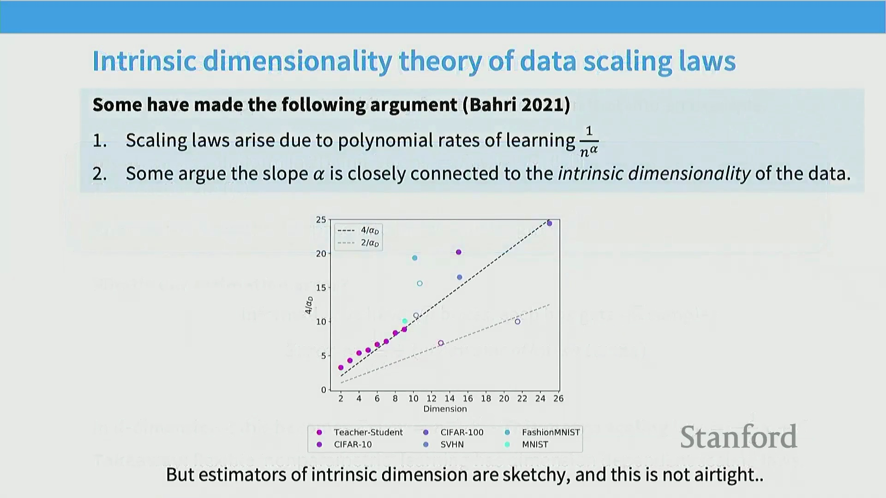

---

## 内在维度与学习动态
本文开篇将反常或非标准的学习速率(Learning Rates)与数据的内在维度(Intrinsic Dimensionality)联系起来。尽管理论曲线与实证结果展现出合理的吻合度，但估计真实数据集的内在维度仍是一项极具挑战的任务，其难度往往不亚于直接对数据进行建模。虽然生成具有已知内在维度的合成数据(Synthetic Data)相对容易，但将这些理论概念应用于复杂的高维数据分布(High-dimensional Distributions)时，仍需谨慎的理论与实证考量。
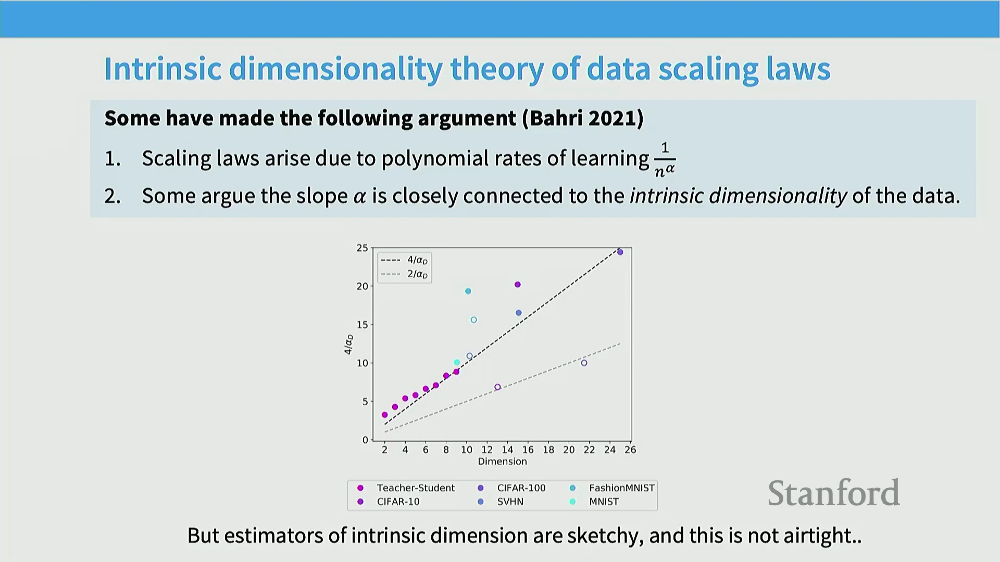
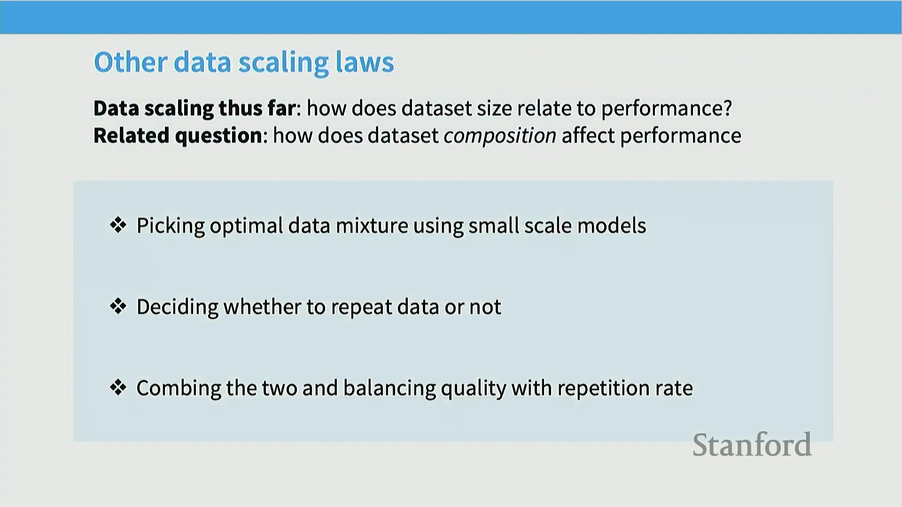

## 数据规模定律的工程应用
数据规模定律(Data Scaling Laws)不仅是理论研究的对象，更是指导实际工程决策的强大工具。研究表明，调整数据集的组成(Data Composition)主要会平移规模曲线的截距(Intercept)，而不会改变其斜率(Slope)。这意味着从业者(Practitioners)无需训练超大规模模型即可评估数据质量；借助回归分析(Regression Analysis)，利用较小规模模型的性能即可有效指导数据筛选与最优混合策略(Optimal Mixing Strategies)的制定。然而，在大规模训练场景下可靠地落地这些数据选择策略(Data Selection Strategies)，仍是一项复杂的工程挑战。
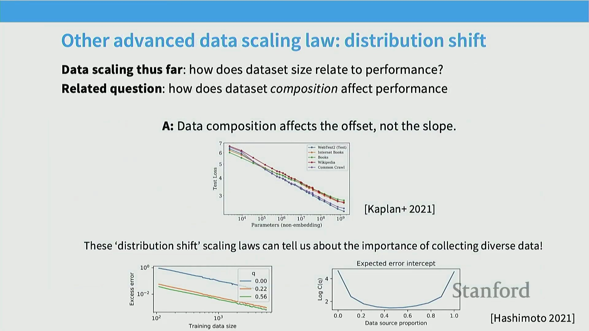

## 多轮次训练与数据稀缺缓解
随着业界对高质量互联网数据(High-quality Internet Data)枯竭的担忧日益加剧，规模定律(Scaling Laws)已被扩展至多轮次训练(Multi-epoch Training)的分析中。研究揭示，经过约四个训练轮次(Epochs)后，重复使用数据将导致模型性能出现收益递减(Diminishing Returns)效应，从而有效界定了一个“有效样本量(Effective Sample Size)”。该框架使工程师能够对“在高质量数据源上进行重复训练”与“引入更大规模但质量较低的新数据”之间的权衡(Trade-off)进行量化建模。研究进一步展示了修正后的规模定律(Modified Scaling Laws)如何优化数据混合维度，从而在决策“是重复利用高质量词元(Tokens)”还是“扩充训练语料库(Corpus)”时，能够可靠地外推(Extrapolate)模型的性能表现。
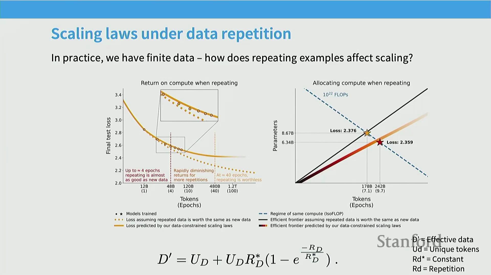
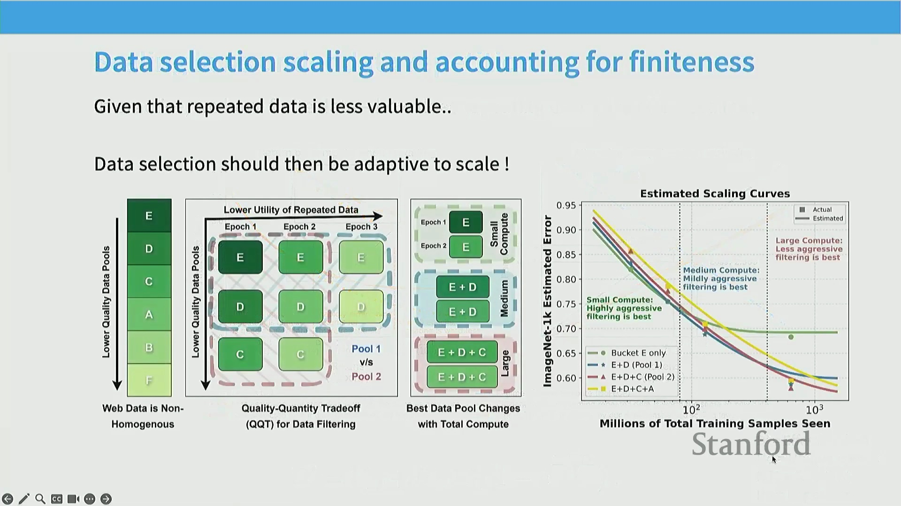

## 转向模型规模扩展与资源分配
在超越以数据为中心(Data-centric)的分析后，研究焦点转向了模型规模扩展(Model Scaling)，这一过程涉及极具现实意义的工程权衡(Engineering Trade-offs)。开发者(Developers)必须权衡如何分配有限的计算资源(Compute Resources)：是延长训练时间还是扩大模型参数量，是增加数据规模还是采购额外硬件。规模定律为此提供了一个系统化的框架(Systematic Framework)，使团队无需承担全尺寸模型训练的高昂成本，即可科学评估这些决策。诸如 Kaplan 等人提出的规模定律奠基性论文，至今仍是理解此类计算高效评估(Compute-efficient Evaluation)方法的重要参考文献。
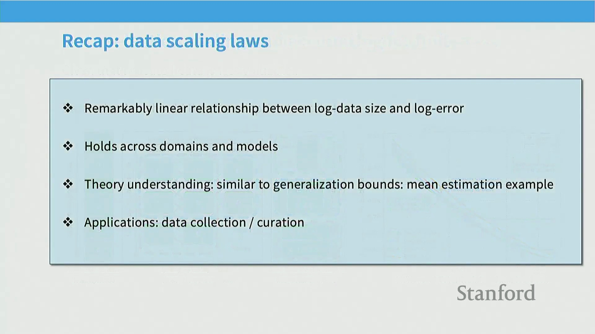
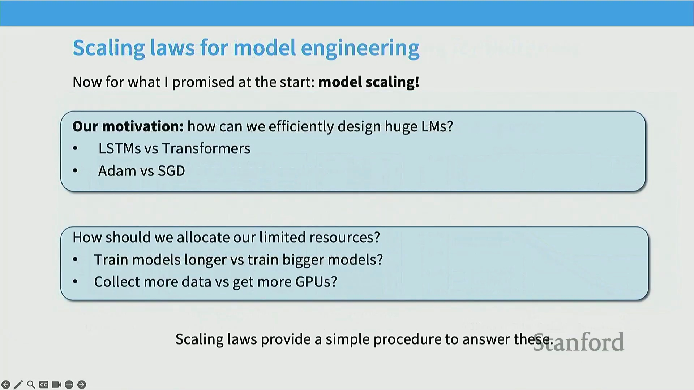

## 基于规模定律的架构评估
规模定律使得高效对比不同神经网络架构(Neural Network Architectures)成为可能，且无需将其扩展至生产级规模(Production-scale)。通过在不同计算预算(Compute Budgets)下训练多种架构并分析其规模轨迹(Scaling Trajectories)，研究人员能够精准识别出架构间内在的效率差距(Intrinsic Efficiency Gaps)。例如，Transformer 与长短期记忆网络(Long Short-Term Memory, LSTM)的对比表明，LSTM 在所有规模下均存在显著的恒定倍数计算开销(Constant Multiplier Compute Overhead)。这种对数线性差距(Log-linear Gap)充分证明了 Transformer 在计算效率上具备根本性优势。该结论完全可通过小规模扩展实验得出，无需耗费资源进行数十亿参数(Billion-parameter)的训练。
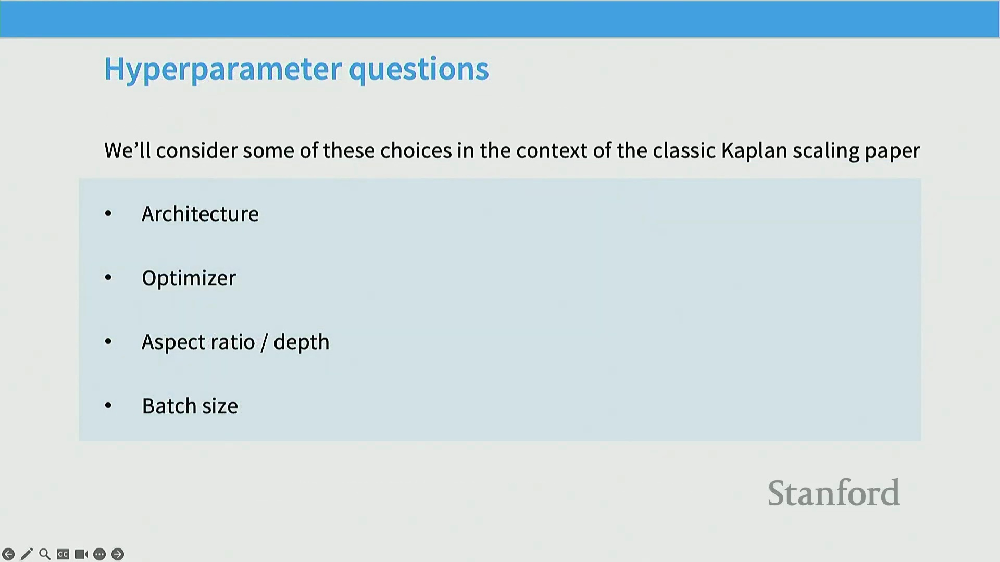
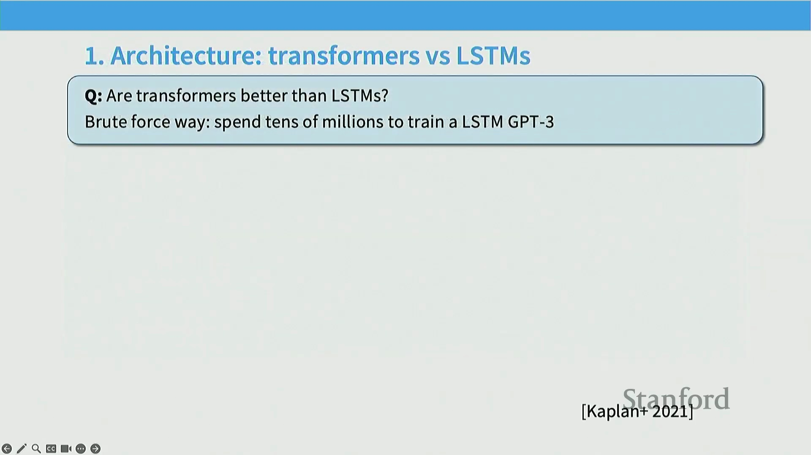
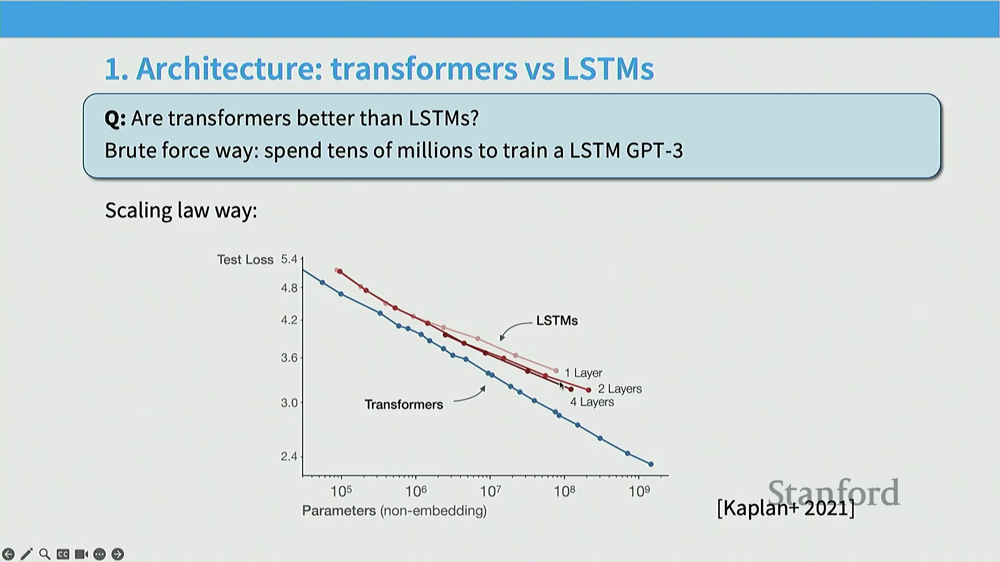
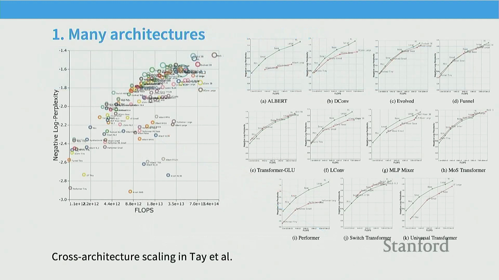

## 识别下一代架构组件
广泛的架构调研(Architecture Surveys)应用规模原理(Scaling Principles)，以 Transformer 为基线评估了众多替代性架构。实证规模轨迹(Empirical Scaling Trajectories)表明，在大规模扩展时，大多数新型架构均无法匹敌或超越标准 Transformer。显著的例外是门控线性单元(Gated Linear Units, GLU)与混合专家(Mixture of Experts, MoE)层。这种基于规模扩展的验证解释了为何现代大模型广泛采用 Switch Transformer 与 GLU 组件。这为当代架构选择提供了清晰、数据驱动(Data-driven)的理论依据，使其显著优于其他纯理论替代方案。
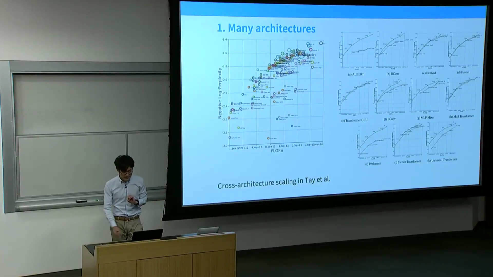

## 优化器规模扩展与恒定倍数差距
相同的规模扩展方法同样适用于优化器(Optimizer)的选择与评估。随机梯度下降(Stochastic Gradient Descent, SGD)与 Adam 优化器的对比研究表明，两者在计算效率(Compute Efficiency)和数据集利用率(Data Utilization)上存在一致的恒定倍数差距(Constant Multiplier Gap)。无论底层架构环境如何，在规模扩展过程中，Adam 始终以可预测的优势稳定优于 SGD。这进一步印证了规模定律作为通用诊断工具(Universal Diagnostic Tool)的实用价值。它不仅揭示了哪些模型组件具备良好的可扩展性，更精确量化了在模型开发的不同维度上，特定工程决策相较于替代方案所能带来的具体效率增益。

---

## 深度与宽度的权衡及纵横比优化
对模型几何结构(Model Geometry)的分析表明，在深度(Depth)与宽度(Width)之间进行权衡时，规模扩展(Scaling)行为呈现出微妙的特性。尽管直觉可能暗示增加网络层数会带来显著的性能飞跃，但实证规模曲线(Empirical Scaling Curves)却揭示了一个广阔的“近最优平台区(Near-Optimal Plateau)”。一旦超过某个最低阈值(Minimum Threshold)，层数的变化对最终性能的影响出人意料地微小，这进一步印证了：只要满足基本的深度要求，模型架构就具备高度的鲁棒性(Robustness)。
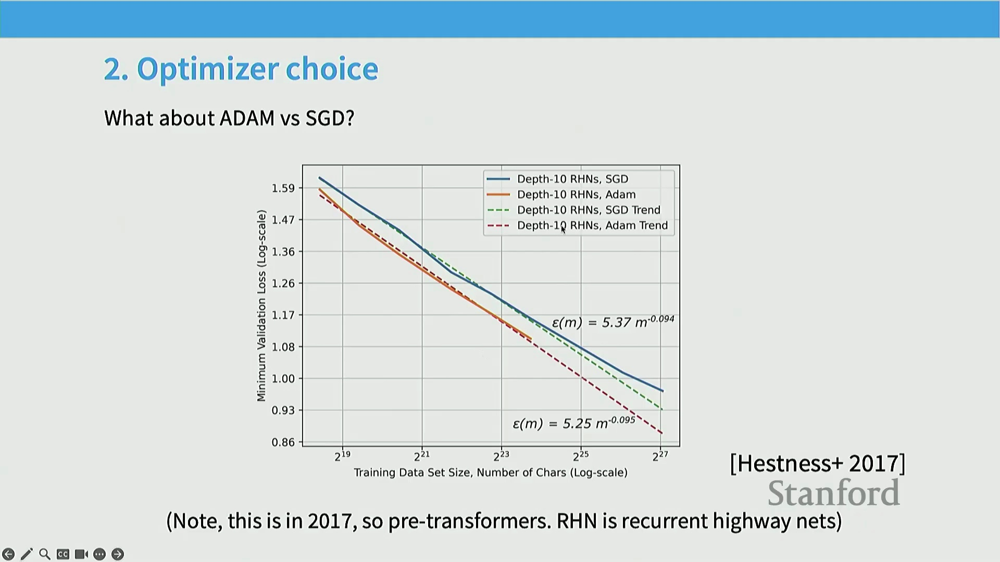
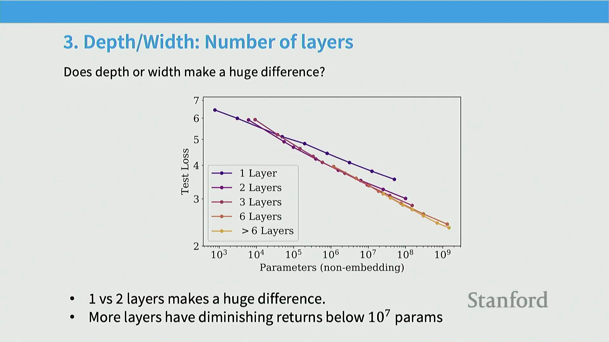
这一实证观察与理论预期相吻合：模型的纵横比(Aspect Ratio)（即宽度与深度的比例）通常在一个宽泛的最优区间内波动，该区间一般覆盖 4 到 16 的范围。规模定律的可视化图表证实，一旦脱离浅层配置(Shallow Configurations)，模型的性能地形图(Performance Landscape)在各种结构选择下都保持惊人的平坦。这意味着，架构设计的极端精确性远没有此前假设的那么关键。
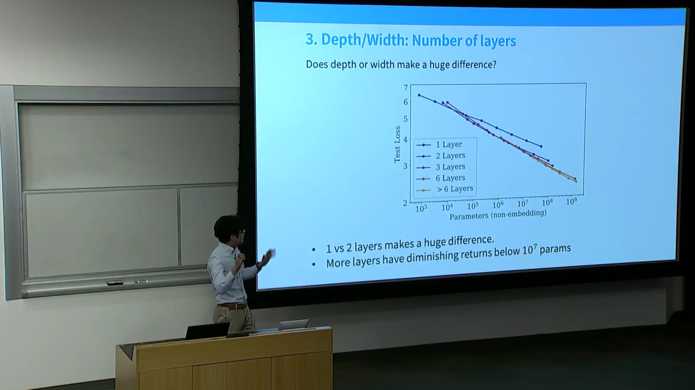

## 参数统计的细微差异与嵌入层
规模分析中一个关键的细微之处在于：并非模型中的所有参数(Parameters)都对性能轨迹(Performance Trajectories)产生同等的影响。在进行参数规模扩展(Parameter Scaling)研究时，若将嵌入层(Embedding Layers)参数计算在内，往往会在规模定律中引入明显的曲率(Curvature)，从而破坏核心网络中所观察到的清晰的对数线性关系(Log-linear Relationships)。
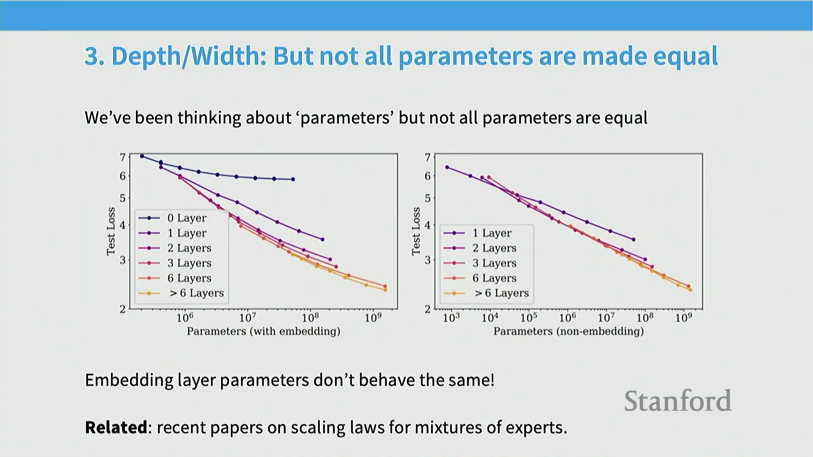
排除嵌入层后，模型会展现出可预测性高得多的规模扩展轨迹(Scaling Trajectories)。这一区别在稀疏架构(Sparse Architectures)（如混合专家模型(Mixture of Experts, MoE)）中尤为重要。研究人员必须推导出等效指标(Equivalent Metrics)（例如“等效密集参数量”），以便在不扭曲规模信号(Scaling Signals)的前提下，准确地对不同架构范式(Architecture Paradigms)间的参数效率(Parameter Efficiency)进行归一化(Normalization)与比较。
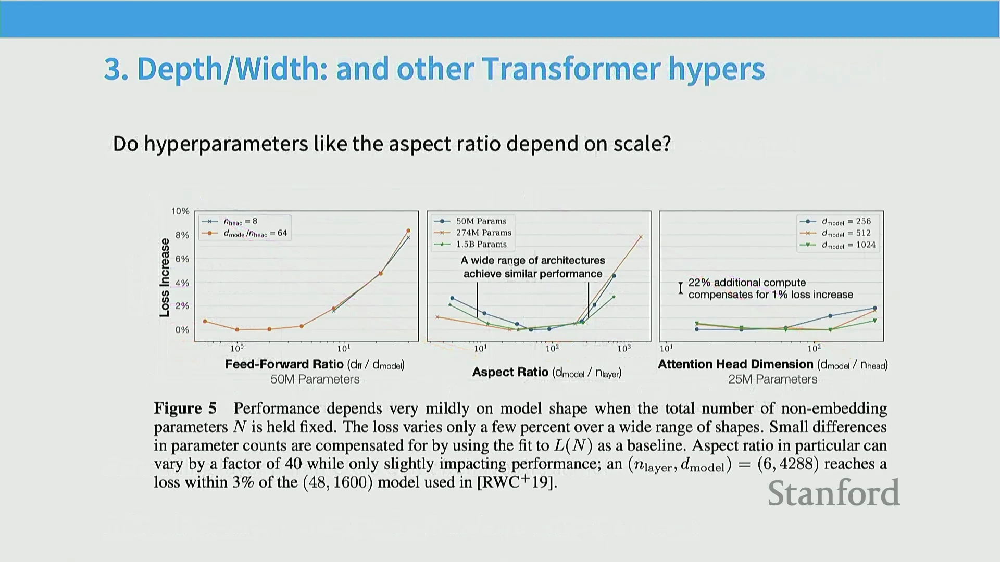

## 尺度不变的超参数调优
规模定律为实现本质上更高效的超参数优化(Hyperparameter Optimization)提供了途径。当不同配置的规模曲线保持平行的斜率，仅存在恒定的垂直偏移(Constant Vertical Offset)时，这意味着超参数的权衡(Hyperparameter Trade-offs)在很大程度上具有“尺度不变性(Scale Invariance)”。通过在较小模型规模下分析“计算量-性能(Compute-Performance)”地形图的特定“切片(Slices)”，研究人员能够精准地确定前馈网络扩展比(FFN Expansion Ratios)和注意力头维度(Attention Head Dimensions)等变量的最优设置。
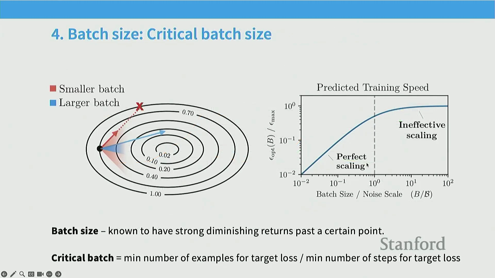
这种具备尺度感知能力(Scale-aware)的方法使工程师能够放心地在计算成本较低的模型上调优超参数，因为他们深知，性能的相对排序(Relative Rankings)与最优配置能够可靠地外推(Extrapolate)至规模大得多的架构中。这标志着训练理念从“暴力扩展(Brute-force Scaling)”向“基于预测与数据驱动的配置(Predictive and Data-driven Configuration)”转变。

## 批量大小动态与临界阈值
批量大小(Batch Size)的扩展受“临界批量大小(Critical Batch Size)”概念的支配，该概念标志着从完美并行效率(Perfect Parallel Efficiency)向显著收益递减(Diminishing Returns)的精确转折点。低于此阈值时，增大批量大小大致等同于增加额外的梯度更新步数(Gradient Update Steps)，能够带来显著的计算与优化收益。然而，一旦越过该临界点，模型训练的进展将不再受梯度噪声(Gradient Noise)的限制，而是受限于损失地形图(Loss Landscape)固有的曲率。
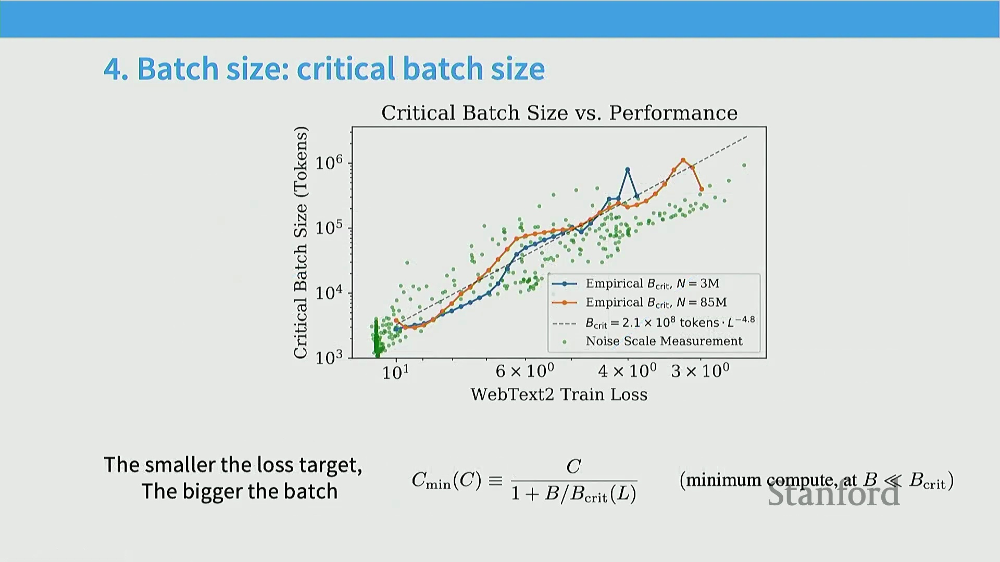
有趣的是，临界批量大小与目标损失值(Target Loss Values)存在动态关联：随着模型达成更低的损失值，其能够有效利用的批量大小也会逐步增大。这一动态特性解释了现代训练策略(Training Strategies)（如 Llama 3 训练报告中所记载的方法）：在训练后期，随着优化目标(Optimization Objectives)趋于严苛，系统性地增大批量大小可以最大化硬件利用率(Hardware Utilization)。
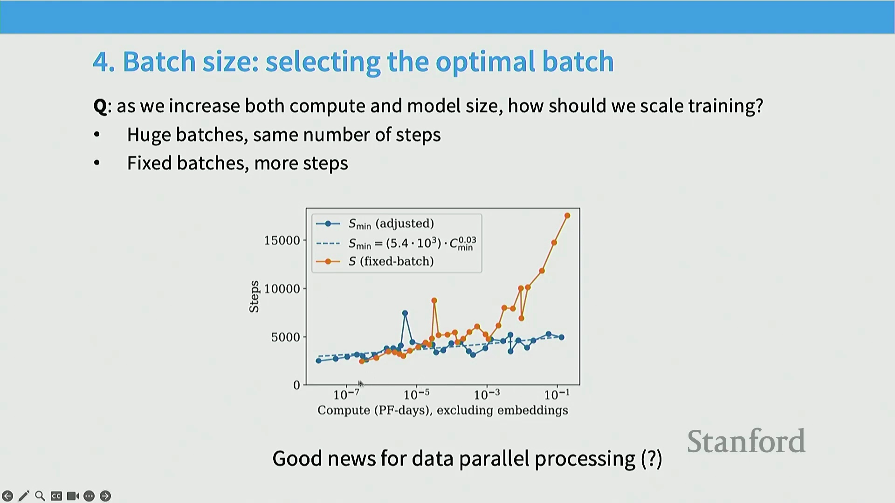

## 学习率扩展与宽度依赖性
学习率(Learning Rate)的选择与批量大小及模型规模内在相关，随着架构的扩大，需要对其进行精细校准(Fine-grained Calibration)。在标准训练实践中，最优学习率对模型宽度表现出可预测的依赖性：较宽的网络需要逐步降低学习率以维持训练稳定性(Training Stability)，而较窄的网络则能容忍更高的学习率。
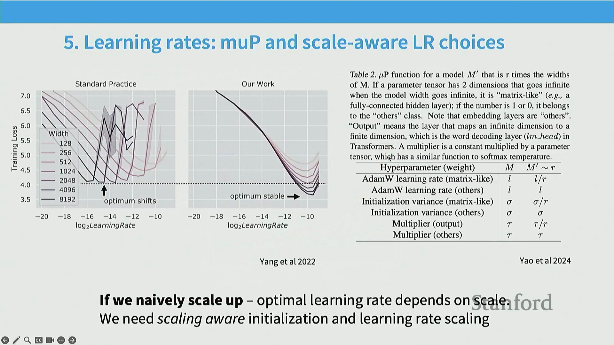
一种常见的经验法则(Empirical Rule)建议，学习率的缩放应与模型宽度成反比。更精细的方法则包括：通过实证手段绘制不同宽度下的损失地形图，精准识别每个规模下的最优学习率，并拟合出专属的规模定律。这种可预测的衰减规律确保了学习率调度策略(Learning Rate Scheduling)能够被系统化地调整，从而在差异巨大的模型容量(Model Capacity)下最大化优化效率，也为最大更新参数化(Maximal Update Parameterization, muP)等先进技术奠定了理论基础。

---

## 面向尺度不变优化的重参数化方法
一种跨模型规模管理学习率不稳定性(Learning Rate Instability)的有效方法是模型重参数化(Model Reparameterization)。通过调整初始化方差(Initialization Variance)、根据网络宽度缩放特定层的学习率，并对前向传播(Forward Pass)的输出进行相应缩放，模型可被设计为具备尺度不变性，即其最优学习率(Optimal Learning Rate)在不同规模下均能保持稳定。这一概念被称为最大更新参数化(Maximal Update Parameterization, muP) 或其变体（如 metaP），旨在消除通过复杂拟合规模定律(Scaling Laws)来预测最优超参数(Hyperparameters)的需求。在理想情况下，工程师仅需在极小规模模型上完成学习率调优(Learning Rate Tuning)，即可直接将其迁移至最大规模模型，从而大幅简化扩展流程(Scaling Pipeline)。
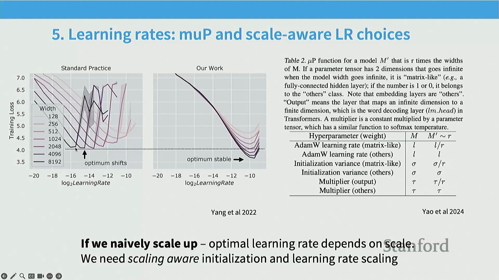
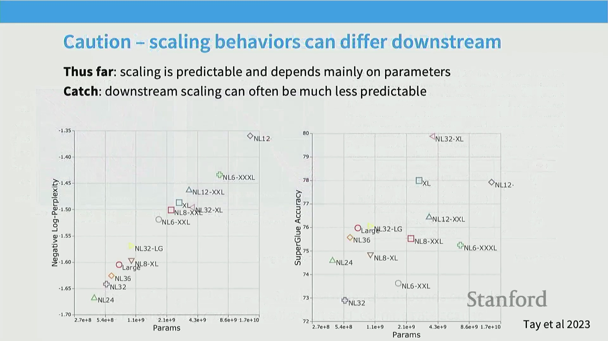

## 优化动态：批量大小与噪声尺度
目标损失(Target Loss)、批量大小(Batch Size)与学习率之间的关系本质上是动态耦合的。随着模型逼近更低的损失值，优化地形图(Optimization Landscape)变得更加敏感；为维持训练稳定性(Training Stability)，必须逐步降低学习率。同时，增大批量大小更为有利，因其能有效降低梯度噪声(Gradient Noise)并提升参数更新(Parameter Updates)的精度。理论上的“噪声尺度(Noise Scale)”量化了随机小批量采样(Stochastic Mini-batch Sampling)引入的预期梯度方差(Expected Gradient Variance)，可作为训练期间动态调整批量大小的指导依据。这种反向耦合机制(Inverse Coupling Mechanism)确保了在训练后期学习率衰减时，批量大小可安全提升，从而在不损害收敛稳定性(Convergence Stability)的前提下最大化硬件利用率(Hardware Utilization)。
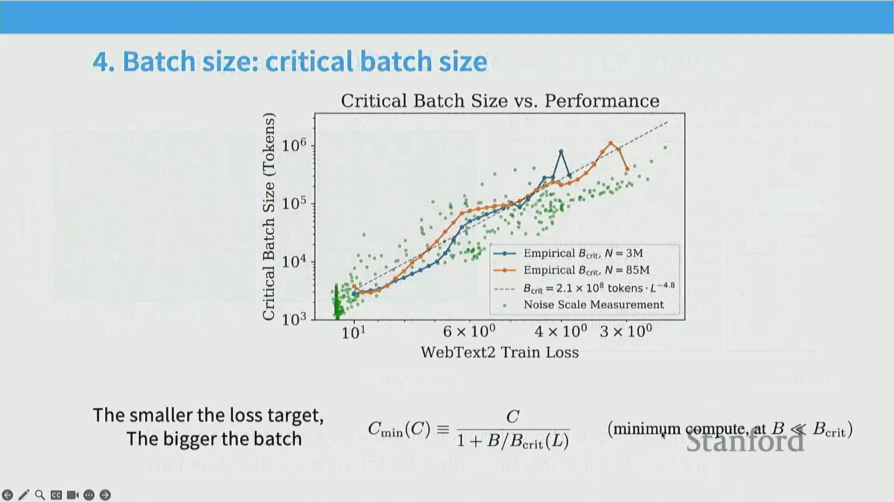

## 规模扩展的局限：困惑度与下游性能的脱节
尽管规模定律在下一个词元预测(Next-token Prediction)与困惑度(Perplexity)等预训练目标上呈现出高度一致的对数线性规律(Log-linear Behavior)，但这种可预测性往往无法直接转化为下游任务(Downstream Tasks)的实际能力。在 SuperGLUE 等基准测试(Benchmarks)评估中，具有相似困惑度扩展轨迹的模型，可能因架构或超参数选择的差异而表现出巨大的性能差距。这种脱节在状态空间模型(State Space Models, SSMs)等替代性架构(Alternative Architectures)中尤为显著：它们可能在语言建模损失(Language Modeling Loss)上展现出高效的扩展性，但在上下文学习(In-Context Learning)或问答等特定能力上却表现欠佳。因此，从业者必须谨慎对待，明确认识到困惑度的扩展规律并不能作为现实世界任务性能可靠代理指标(Reliable Proxy Metric)的充分保证。
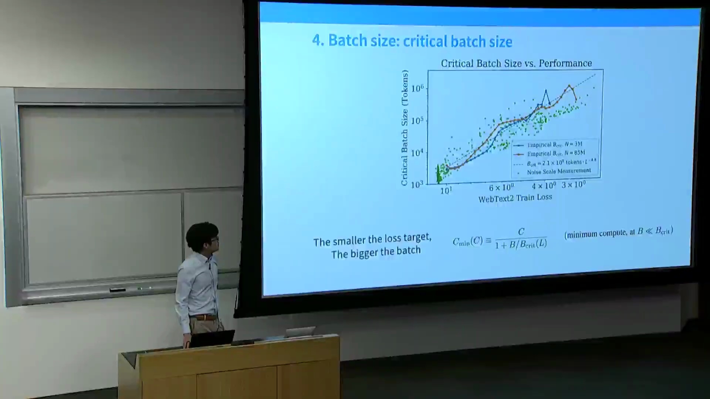
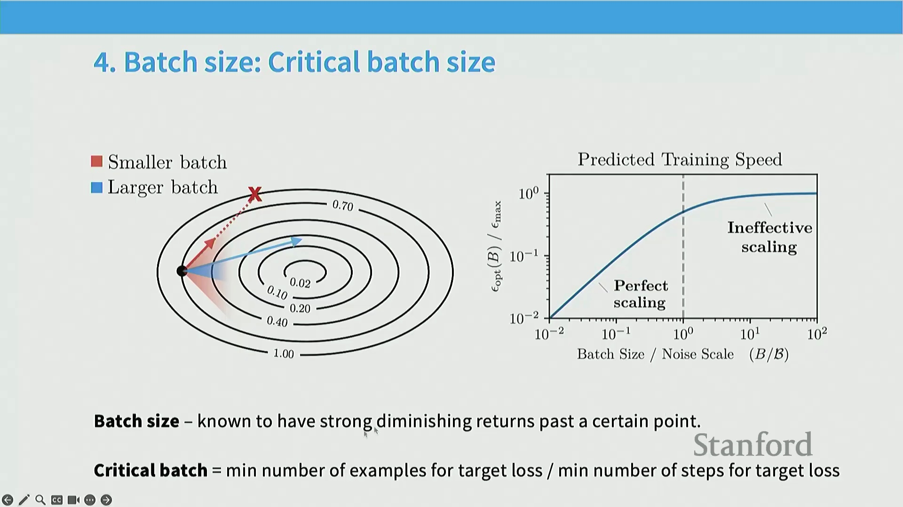

## 规模定律设计流程
为将规模定律应用于实际工程，业界通常采用一套系统化的设计工作流(Systematic Design Workflow)。研究人员首先训练一系列较小规模的模型，其计算预算(Compute Budgets)需跨越数个数量级(Orders of Magnitude)。通过对这些实验数据进行双对数线性拟合(Log-linear Fits)，可建立基线规模轨迹(Baseline Scaling Trajectories)。当不同配置下的规模曲线斜率(Slopes)保持一致时，表明在小规模实验中验证的优化策略可可靠地外推(Extrapolate)至更大规模模型。该方法使团队能够在投入昂贵的大规模训练前，自信地选定架构、调整前馈网络扩展比(FFN Expansion Ratios)及注意力头维度(Attention Head Dimensions)，从而将超参数选择(Hyperparameter Selection)从“经验猜测”转变为一门“可预测的科学(Predictive Science)”。
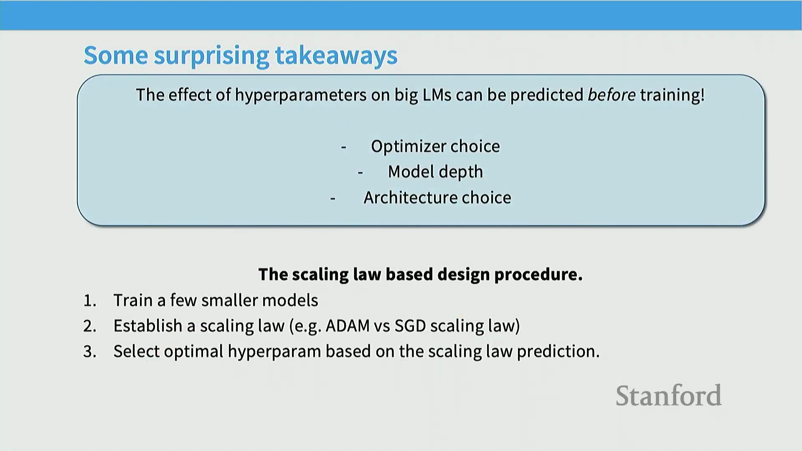
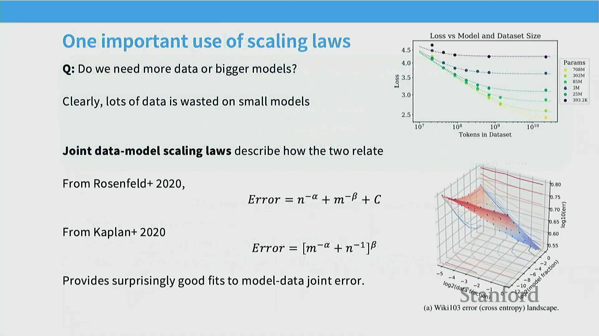

## 联合数据-模型规模定律与计算资源分配
大规模训练的核心挑战之一，在于如何在固定计算预算(Fixed Compute Budget)下，实现数据集大小与模型参数量之间的最优资源分配(Optimal Resource Allocation)。联合数据-模型规模定律(Joint Data-Model Scaling Laws)通过将测试损失(Test Loss)建模为数据量(Data Size)和模型规模的多项式衰减项，并叠加一个不可约误差下限(Irreducible Error Floor)来解决该问题。由 Kaplan 等研究者开创的此类参数化形式虽源于经验拟合(Empirical Fitting)，却能以极高精度刻画复杂的三维损失曲面(3D Loss Surfaces)。通过映射这些联合关系，工程师可精准计算数据与模型的最优配比，既避免在海量数据上训练过小模型导致的算力浪费，也防止因数据不足而无法充分激活高参数模型潜力的困境。
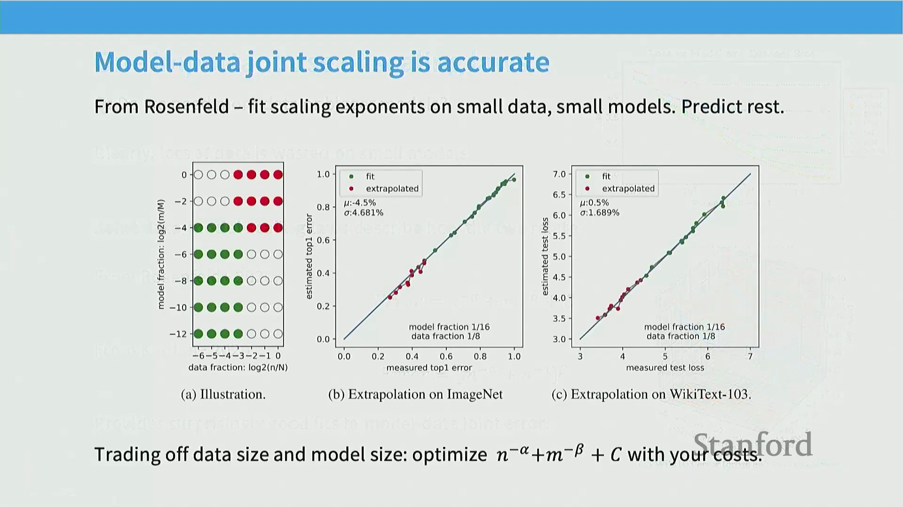

---

## 联合规模动态与计算优化
Kaplan 和 Rosenfeld 等研究人员的早期奠基性工作确立了联合规模定律(Joint Scaling Laws)，将训练损失(Training Loss)建模为数据集大小(Dataset Size)与模型参数量(Number of Parameters)的联合函数。此类函数形式通常将误差表示为数据规模与模型容量(Model Capacity)的多项式衰减项之和，并叠加一个不可约误差下限(Irreducible Error Floor)。尽管这些模型源于经验拟合(Empirical Fitting)而非第一性原理(First Principles)的理论推导，但在从小规模训练外推至超大规模架构时，仍展现出惊人的准确性。通过在不同计算预算(Compute Budget)下绘制损失曲面(Loss Surface)，工程师无需预先训练全尺寸模型，即可预测最优的资源分配策略。
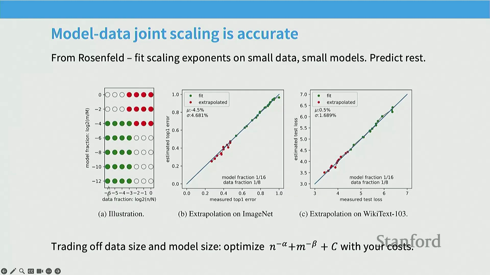
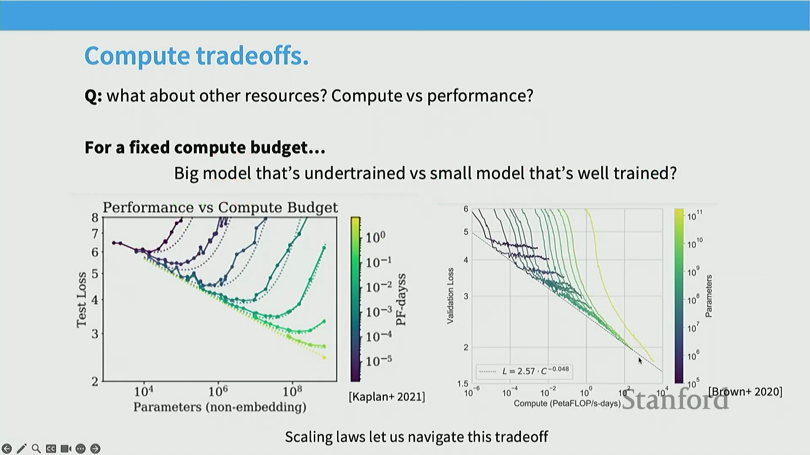

## Chinchilla 范式：最优词元-参数比例
尽管早期的规模研究提供了理论框架，但 Chinchilla 论文通过实证研究，明确了在计算高效训练(Compute-efficient Training)中数据量与模型规模之间的关键权衡(Trade-off)。通过在固定的浮点运算次数(FLOPs)预算下系统测试多种配置，作者得出了如今著名的 Chinchilla 比例：每个模型参数约对应 20 个训练词元(Training Tokens)。该比例确保了模型容量与数据规模均不成为性能瓶颈，从而最大化了单位计算量(Per-compute Performance)下的模型表现。这一发现从根本上改变了业界实践，推动模型训练范式从“重度依赖参数(Parameter-heavy)”转向数据与参数更加均衡的模式。
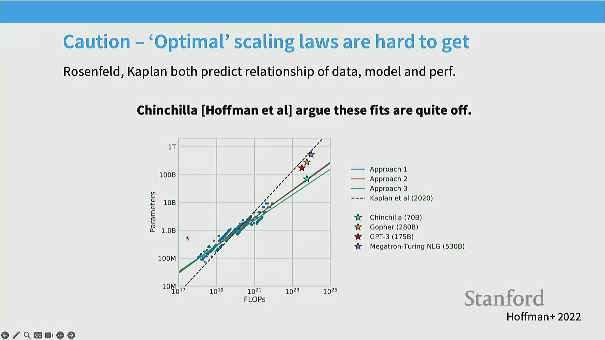
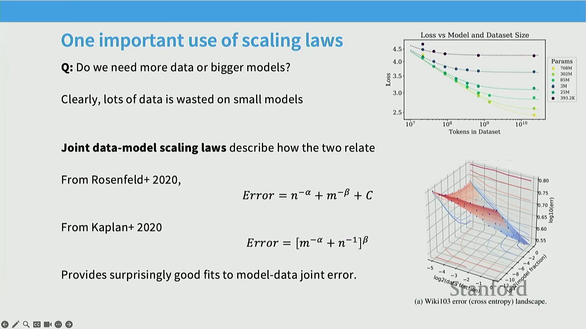

## 学习率调度的关键作用
Kaplan 的早期估算值与 Chinchilla 的精细化比例之间存在差异，其关键因素之一在于学习率调度策略(Learning Rate Scheduling)。现代训练高度依赖余弦衰减(Cosine Decay)调度，该策略需要完整的预热(Warm-up)和冷却(Cool-down)阶段，才能生成有效的模型检查点(Model Checkpoints)。在训练中途截断余弦调度会破坏优化轨迹(Optimization Trajectory)，这意味着中途保存的检查点无法等效于使用较短调度周期从头训练的模型。这一细微差别解释了为何早期依赖截断训练(Truncated Training Runs)或简单调度策略的规模定律，往往会低估最优的数据需求量。
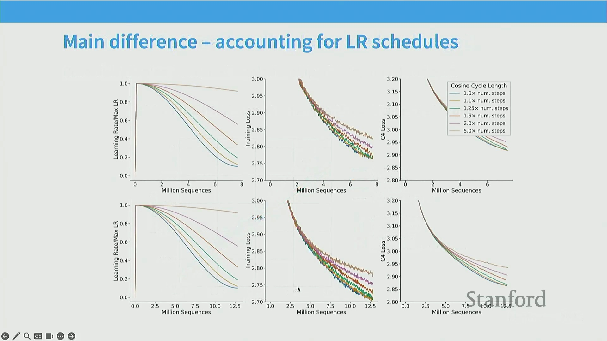

## 方法一：下包络线法
Chinchilla 研究采用的第一种方法是识别多条训练曲线(Training Curves)中的“下包络线(Lower Envelope)”。通过叠加不同规模模型在各类计算预算下的损失轨迹(Loss Trajectories)，研究人员能够追踪在任意给定 FLOPs 下所能达到的最低损失值。该包络线天然地捕捉了数据规模与参数量之间的最优平衡点。对这些最优检查点拟合幂律关系(Power-law Relationships)，可揭示出一致的规模指数(Scaling Exponents)，从而为在未来任意计算约束下外推理想模型规模提供了直接途径。
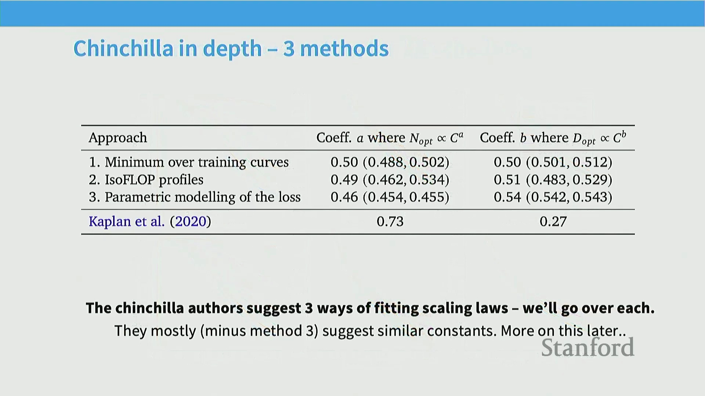
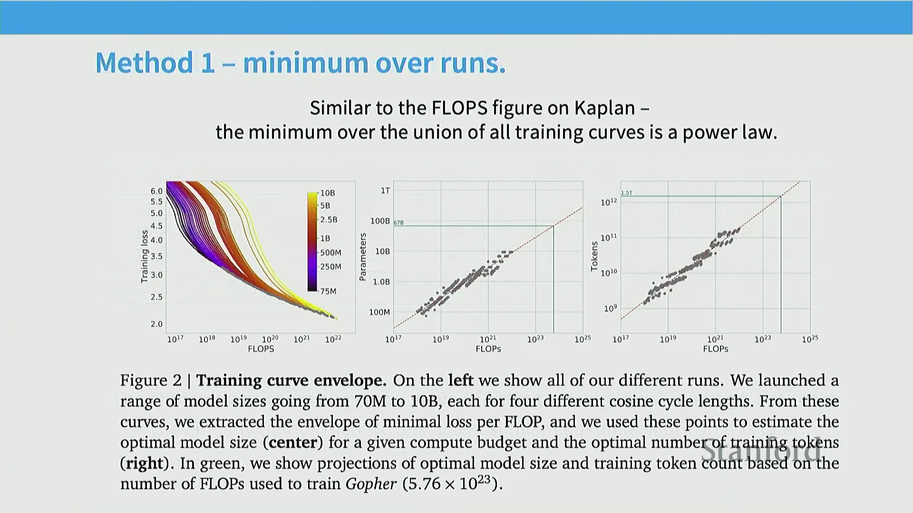

## 方法二：等计算量（Isoflop）分析
第二种且在概念上最直观的方法是等计算量(Isoflop)分析。该方法固定总计算预算(Total Compute Budget)，遍历不同的参数-数据比例(Parameters-to-Data Ratios)，并为每个固定计算水平绘制损失随模型规模变化的曲线。每条曲线均呈现出清晰的最小值(Minima)，代表该特定预算下的最优配置(Optimal Configuration)。通过提取多个计算规模下的这些最小值并将其拟合至规模定律，研究人员能够同时精确确定最优的参数量与词元数量(Token Count)。该方法有力地证实了约 20:1 的参数-词元比例，并提供了高度可靠的外推(Extrapolation)结果。
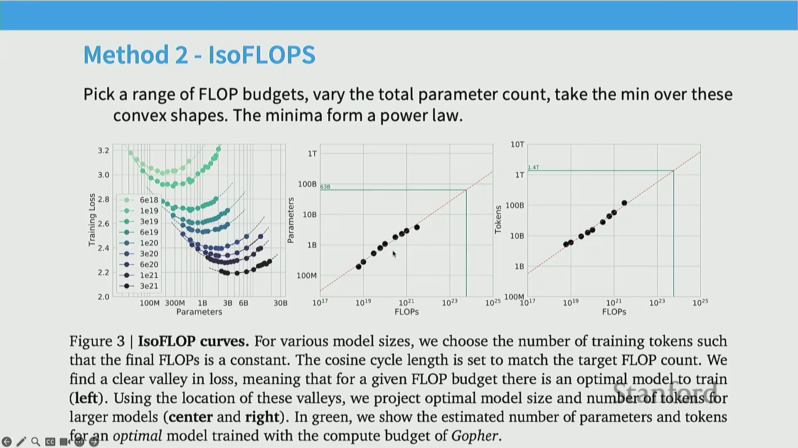

## 方法三：函数形式拟合与复现挑战
第三种方法尝试将理论上的联合规模方程(Joint Scaling Equations)（表现为三维曲面）直接拟合到实证训练数据(Empirical Training Data)中。尽管在概念上与 Rosenfeld 的原始公式相一致，但该方法在实践中对噪声极为敏感，表现出显著的拟合波动。所得出的系数往往与通过包络线或等计算量方法推导的结果存在偏差，凸显了三维曲面拟合对数据稀疏性(Data Sparsity)和优化噪声(Optimization Noise)的高度敏感性。Epoch AI 近期的复现工作难以精确重现这些拟合结果，主要原因在于无法获取原始实验中细粒度的检查点数据(Fine-grained Checkpoint Data)。这凸显了规模扩展研究(Scaling Research)领域的一个广泛挑战：尽管函数形式(Functional Forms)在数学上十分优雅，但基于实证寻找最小值(Empirical Minima-finding)的方法通常能提供更稳健的工程指导(Engineering Guidance)。
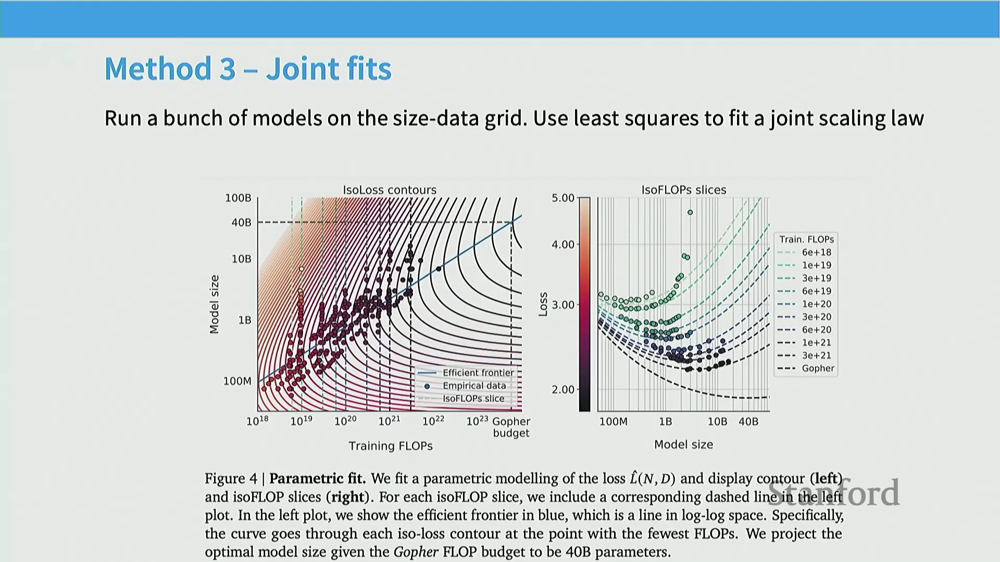
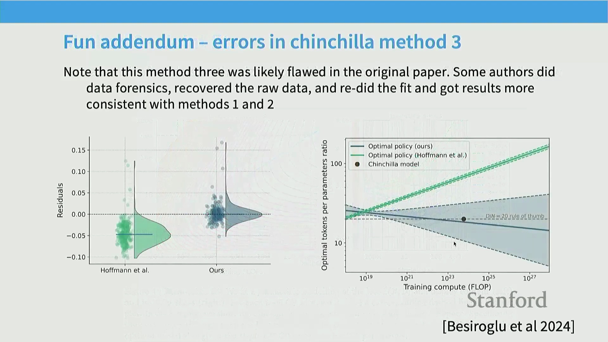

---

## 复现工作与曲线拟合修正
当 Epoch AI 的研究人员尝试复现 Chinchilla 论文中的第三种估算方法时，规模定律(Scaling Laws)的有效性受到了严格检验。由于无法获取原始的训练日志(Training Logs)，他们采用数据提取工具(Data Extraction Tools)直接从已发表的图表中读取精确的坐标值。此次复现揭示了原始曲线拟合(Curve Fitting)过程中一个微妙但关键的统计疏忽：回归残差(Regression Residuals)未能正确实现零均值化(Zero-meaning)，从而在最优参数估计中引入了系统性偏差(Systematic Bias)。 
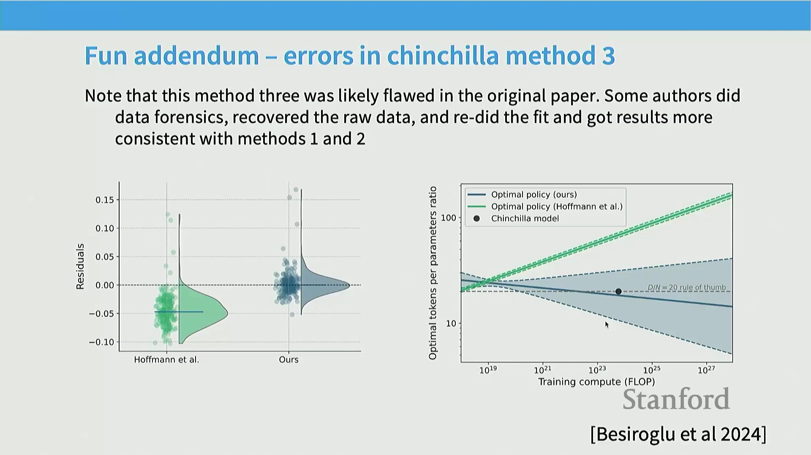
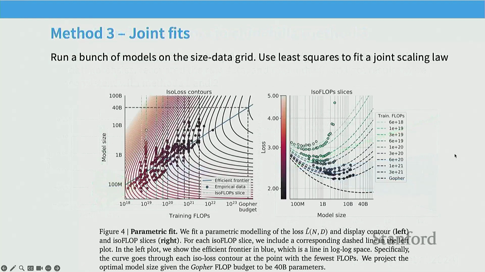
在修正拟合过程以强制残差均值为零后，得出的规模系数(Scaling Coefficients)与其他两种 Chinchilla 方法的结果几乎完美吻合。这一结果尤为引人瞩目，因为它表明严格的复现工作(Replication Work)并不总是为了推翻奠基性研究(Seminal Research)；相反，它能够在完善细节技术实现的同时，最终验证核心理论洞见(Theoretical Insights)。
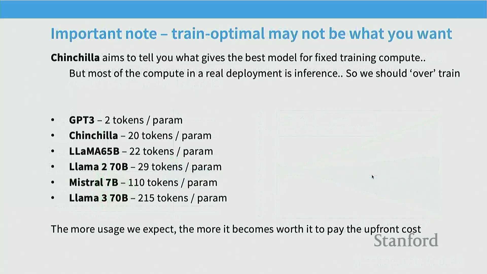

## 向推理最优规模扩展的范式转变
历史上，Kaplan 和 Chinchilla 提出的规模定律主要围绕“训练最优性(Training Optimality)”设计：即在固定的预训练计算预算(Pre-training Compute Budget)下，追求模型性能的最大化。然而，随着大语言模型(Large Language Models, LLMs)逐步走向商业化落地，行业焦点已明确转向“推理效率(Inference Efficiency)”。部署超大规模架构所产生的持续运营成本(Ongoing Operational Costs)，迅速超过了单次训练的一次性投入，这从根本上改变了业界评估资源权衡(Resource Trade-offs)的方式。
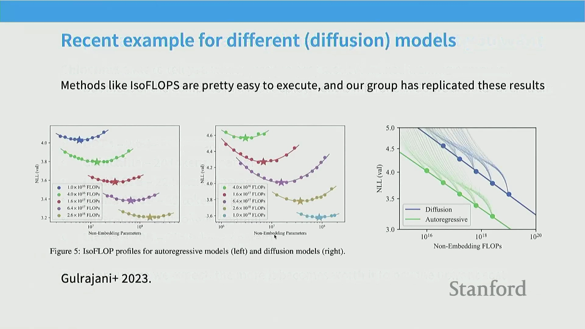
因此，在近年来的模型迭代中，“词元-参数比(Token-to-Parameter Ratio)”急剧攀升。GPT-3 的比例约为每个参数对应 2 个词元(Tokens)，Chinchilla 确立了 20:1 的基线，而现代架构通常以相对精简的参数量，在数十万亿词元的语料(Corpus)上进行训练。这一趋势反映出一种明确的战略偏好：在前期训练计算(Training Compute)上投入重金，以换取体积更小、智能程度更高的模型，从而最大限度地降低长期的推理延迟(Inference Latency)与硬件开销(Hardware Overhead)。

## 生成模型中的跨架构鲁棒性
当将这些原理应用于标准自回归 Transformer(Autoregressive Transformer)之外时，规模定律(Scaling Laws)的鲁棒性(Robustness)得到了有力的验证。在一项将扩散模型(Diffusion Models)适配于文本生成的实验研究中，研究人员面对的是一个全新的架构范式(Architecture Paradigm)，其最优数据-参数比(Data-to-Parameter Ratio)尚属未知。通过套用此前用于语言模型的等计算量(Isoflop)分析方法，他们发现扩散模型遵循着几乎完全相同的规模扩展轨迹(Scaling Trajectories)。
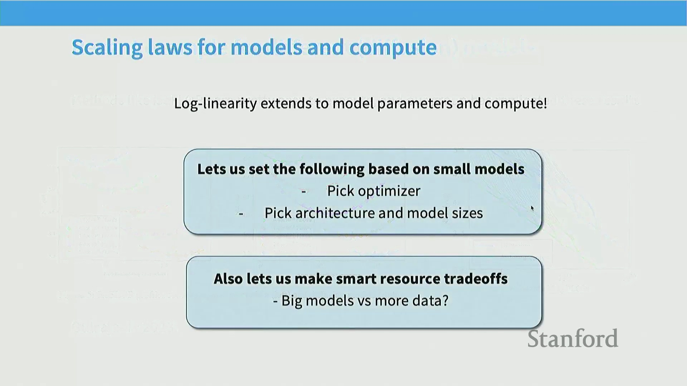
所得的损失曲线(Loss Curves)保持了可预测的幂律行为(Power-law Behavior)，与 Transformer 基线之间仅存在一个恒定的性能偏移量(Performance Offset)。在不同计算预算(Compute Budgets)下绘制最低损失值，即可得到清晰且可外推的规模定律(Scaling Laws)，无需引入全新的理论框架。该案例研究证实，规模扩展动力学(Scaling Dynamics)是高维优化(High-dimensional Optimization)的一项基本属性，而非特定网络拓扑结构(Network Topologies)的偶然产物。这使得从业者能够有信心地将成熟的规模分析策略(Scaling Analysis Strategies)直接应用于新兴的模型架构(Model Architectures)。

## 结论：预测性规模扩展作为工程指南针
对规模定律(Scaling Laws)的深入探讨充分表明，对数线性关系(Log-linear Relationships)能够在数据集大小、参数量与总计算开销(Total Compute Cost)之间无缝贯通。这种高度的可预测性，将模型开发从依赖“暴力试错(Brute-force Trial-and-Error)”的粗放过程，转变为一门严谨的工程学科。借助最小包络线追踪(Minimal Envelope Tracking)和等计算量分析(Isoflop Analysis)等技术，团队无需承担昂贵的大规模训练成本，便能在项目早期对超参数选择(Hyperparameter Selection)、架构比例(Architectural Ratios)及数据分配(Data Allocation)做出高度精准的决策。
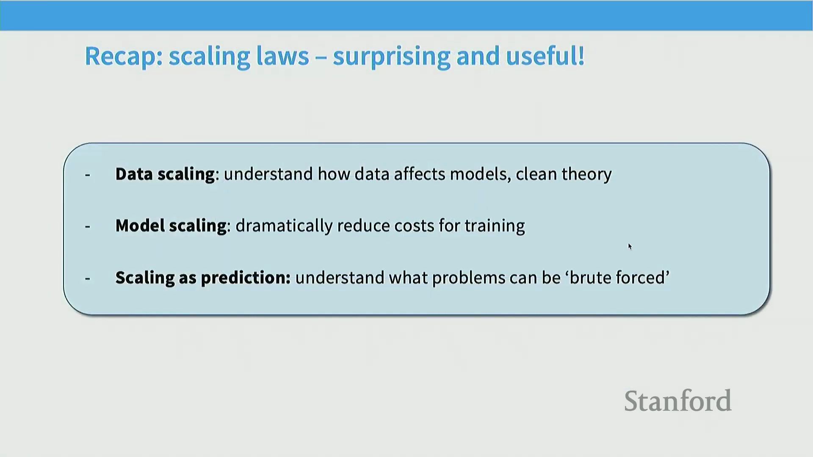
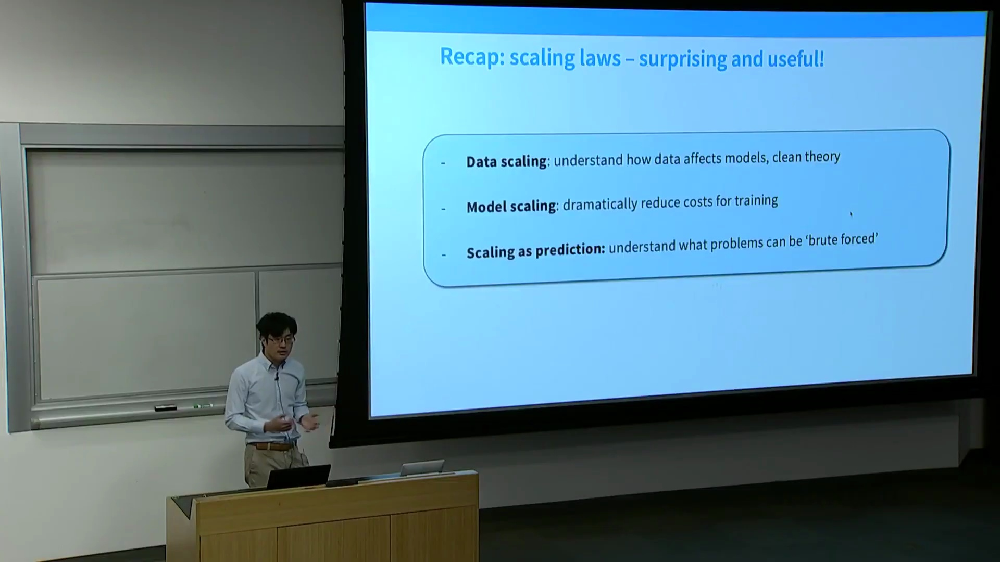
归根结底，规模定律为我们在模型容量(Model Capacity)、数据规模(Data Scale)与计算资源(Compute Resources)之间的复杂权衡中，提供了一枚可靠的数学指南针。无论是追求极致的训练效率(Training Efficiency)，还是力求最小化推理成本(Inference Costs)，这些经验框架(Empirical Frameworks)都能帮助开发者将小规模实验的成功精准外推至大规模生产环境(Production Environments)，确保每一分计算资源都得到精确、高效的配置。
