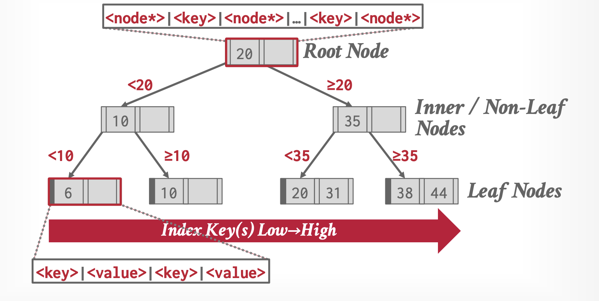
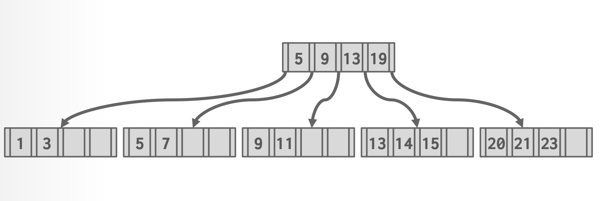
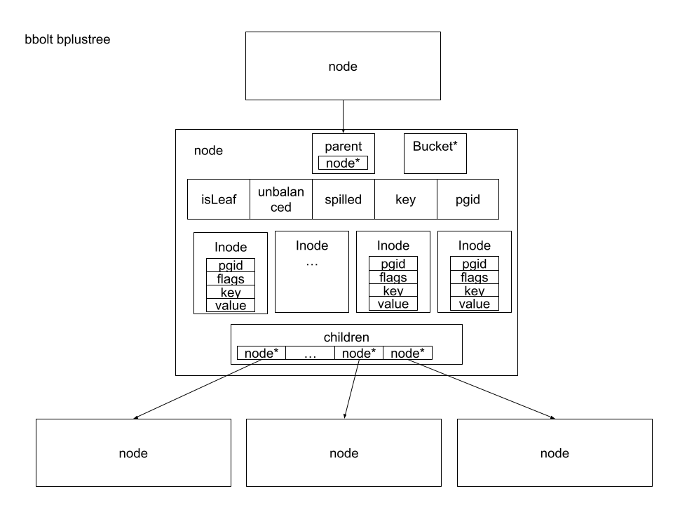

## bbolt 存储引擎的基本原理

在上一章节中我们的 raftexample kvstore 的实现是在内存中简单的维护了一个 map，对于实际的工业化分布式存储系统中，往往需要把数据存储在专业的存储引擎中，这一章我们将介绍 etcd bbolt 存储引擎。

### B+ 树介绍

boltdb 使用了 B+ 树来保存并索引数据

B+ 树是一种自平衡的树型数据结构，它可以保持数据有序存储，并且支持查找、顺序访问插入和删除操作，时间复杂度都是 O(log n)。形式上，B+树是一棵 m 阶（表示一个节点可以最多拥有的子节点数）的搜索树，它具有以下特性：

- 它是完美平衡的（每个叶子节点都有相同的高度）。
- 每个内部节点至少是半满的（m/2 - 1 <= key 的数量<= m - 1）。
- 每个包含 k 个 key 的内部节点都有 k+1 个非空子节点。

#### B+ 树的插入操作

要在 B+ 树中插入一个新的节点，我们需要通过内部节点向下寻找到我们需要插入 key 的叶子节点，整个插入节点的操作可以分为以下主要步骤：

- 1.找到正确的叶子节点 L

- 2.把新的节点按顺序插入到节点 L，如果 L 空间足够，操作完
成；否则，需要将 L 拆分成节点 L1 和 L2。L1、L2 中的存储的键按中间键，同时需要在 L 的父节点中插入一个键，并添加只想 L2 的链接。
- 3.如果内部节点在拆分的过程中满了，需要按中间键上推，继续拆分节点。

#### B+ 树的删除操作

在插入操作中，当树的节点的键数量满时，我们分裂叶子节点。反之、在删除操作中，如果删除操作将导致一个节点键的数量小于半满状态，我们需要合并节点来使树达到重平衡状态。

- 1.找到要执行删除操作的叶子节点 L。
- 2.如果删除操作执行后，节点在半满状态以上，操作完成。否则，节点将从兄弟节点借节点过来。如果借节点也失败了，就将 L 与其兄弟节点合并。
- 3.如果 L 被合并了，你还需要删除父节点中指向 L 的条目。

### bbolt B+ 树的实现

bbolt 中实现 B+ 树的关键结构为 node 和 inode，node 即为 B+ 树的一个节点，inode 为节点中的内部节点，即 node 节点包含的元素。

| 结构字段 | 含义 |
| ---:|:---:| 
| bucket *Bucket | 指向阶段所属 bucket 的指针 | 
| isLeaf bool | 当前节点是否为叶子节点 |
| unbalanced bool | 当前节点是否可能不平衡 | 
| key []byte	 | node 初始化时候的第一个 key | 
| pgid pgid	 | 当前node在mmap内存中相应的页id | 
| parent *node | 父节点指针 | 
| children nodes | 指向孩子节点的指针 | 
| inodes inodes	 | 该node的内部节点，即该node所包含的元素 | 

bbolt node 结构实现的主要方法

| 函数名 | 含义 |
| ---:|:---:| 
| root() *node | 返回该树的根节点 |
| minKeys() int | 节点至少应有的key的个数，leafNode返回1，branchNode返回2 |
| size() int | 返回节点序列化之后的长度 |
| sizeLessThan(v uintptr) bool | 计算节点序列化之后是否小于 v |
| pageElementSize() | 按节点类型返回节点序列化之后的字节数 |
| childAt(index int) *node | 获取 node 第 index 个孩子节点的指针  |
| childIndex(child *node) int | 返回给定子节点在当前节点 inode 中的序号 |
| numChildren() int |  返回当前节点拥有 inode 节点的个数 |
| nextSibling() *node | 返回拥有同一个父节点的下一个兄弟节点 |
| prevSibling() *node | 返回拥有同一个父节点的上一个兄弟节点 |
