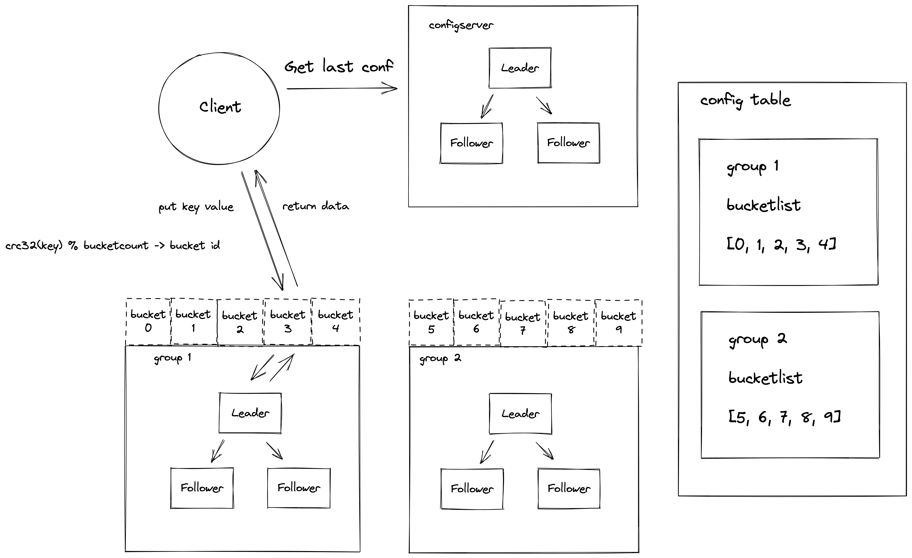

### 体验分布式 KV 存储系统 eraftkv

#### 开篇

作为本书的开篇，我们将带着大家从顶层体验下分布式系统，我们将忽略系统实现的细节点，直观感受一个分布式系统所具备的能力。本书还是第一个版本，我们还在不断的校对完善中，评论区是放开的，欢迎大家讨论参与本书的优化。

#### 安装 go 编译环境
首先我们需要在电脑上安装好 go 语言编译器，你可以在 https://go.dev/dl/ 官网下载对应你系统版本的安装包。
按指示 https://go.dev/doc/install 安装 golang 编译环境。

#### 编译构建 eraftkv

执行以下命令 (确保你的机器上安装了 Go 语言编译器以及 git, make 等基础工具)
编译很简单，下载代码之后，进入根目录直接 make

```
git clone https://github.com/eraft-io/eraft.git
cd eraft
make
```

#### 架构概览

在我们运行 eraftkv 之前我们先概览以下它的架构，以便于我们对于接下来运行的程序功能有清晰的认识。



eraftkv 作为一个分布式 kv 存储系统，其中包含的服务角色以及一些概念需要提前给大家介绍一下。

##### 系统中的一些概念

1.bucket - 它是集群做数据管理的逻辑单元，一个分组的 ShardServer 服务可以负责多个 bucket 的数据。

2.config table - 集群配置表，它主要维护了集群服务分组与 bucket 的映射关系，客户端访问集群数据之前需要先到这个表查询要访问 bucket 所在的服务分组列表。


##### 系统中有三种角色

1.Client - 客户端，它是用户使用我们这个分布式的接入端。

2.ConfigServer - 配置服务器，它是系统的配置管理中心，它存储了集群的路由配置信息。

3.ShardServer - 数据服务器，它是系统中实际存储用户数据的服务器。

##### 请求处理流程

看了架构概览，大家可能有觉得概念有些模糊，我们接下来就分析一个具体的请求示例，看看这个分布式系统是如何工作起来的。

例如现在客户端来了一个 put testkey testvalue 的请求：

1.客户端程序启动运行的时候会从 ConfigServer 获取到最新的路由信息表。

2.put testkey testvalue 操作首先会计算 testkey 的 CRC32 哈希值对集群中的 bucket 数取模算到这个 key 命中了哪个 bucket。

3.之后客户端将 put 请求内容打包成一个 rpc 请求包，发送到集群配置表中负责这个 bucket 的 ShardServer 服务分组。

4.Leader ShardServer 服务收到这个 rpc 请求后并不是直接写入存储引擎，而是构造一个 raft 提案，提交到 raft 状态机，当分组中半数节点以上的 ShardServer 都同意这个操作后 (如果你没有接触过分布式一致性算法，这里可以先不用理解细节，我们会在 Raft  论文解读一章详细解读为什么要这样做)，作为 Leader 的 ShardServer 服务器才能返回给客户端写入成功。

#### 让系统跑起来，体验它！

前面我们构建完 eraftkv 之后，在 eraft 目录有一个 output 文件夹，里面有我们需要运行的 bin 文件。

```
colin@B-M1-0045 eraft % ls -l output 
total 124120
-rwxr-xr-x  1 colin  staff  12119296  5 25 20:40 bench_cli
-rwxr-xr-x  1 colin  staff  12114784  5 25 20:40 cfgcli
-rwxr-xr-x  1 colin  staff  13578848  5 25 20:40 cfgserver
-rwxr-xr-x  1 colin  staff  12127328  5 25 20:40 shardcli
-rwxr-xr-x  1 colin  staff  13600368  5 25 20:40 shardserver
```

##### 可执行文件介绍

1.cfgserver 

ConfigServer 的可执行文件，系统的配置管理中心，需要首先启动

2.cfgcli

ConfigServer 的客户端工具，它和 ConfigServer 交互用来管理集群的配置

3.shardserver

ShardServer 的可执行文件，它负责存储用户的数据

4.shardcli

ShardServer 的客户端工具，用户可以使用它向集群中写入数据

5.bench_cli

系统的性能测试工具

##### 启动服务

1.启动配置服务器分组

```
./cfgserver 0 127.0.0.1:8088,127.0.0.1:8089,127.0.0.1:8090

./cfgserver 1 127.0.0.1:8088,127.0.0.1:8089,127.0.0.1:8090

./cfgserver 2 127.0.0.1:8088,127.0.0.1:8089,127.0.0.1:8090

```

2.初始化集群配置

```

./cfgcli 127.0.0.1:8088,127.0.0.1:8089,127.0.0.1:8090 
join 1 127.0.0.1:6088,127.0.0.1:6089,127.0.0.1:6090

./cfgcli 127.0.0.1:8088,127.0.0.1:8089,127.0.0.1:8090 
join 2  127.0.0.1:7088,127.0.0.1:7089,127.0.0.1:7090

./cfgcli 127.0.0.1:8088,127.0.0.1:8089,127.0.0.1:8090
 move 0-4 1

./cfgcli 127.0.0.1:8088,127.0.0.1:8089,127.0.0.1:8090
 move 5-9 2

```

3.启动数据服务器分组

```

./shardserver 0 1 127.0.0.1:8088,127.0.0.1:8089,127.0.0.1:8090
 127.0.0.1:6088,127.0.0.1:6089,127.0.0.1:6090

./shardserver 1 1 127.0.0.1:8088,127.0.0.1:8089,127.0.0.1:8090
 127.0.0.1:6088,127.0.0.1:6089,127.0.0.1:6090

./shardserver 2 1 127.0.0.1:8088,127.0.0.1:8089,127.0.0.1:8090
 127.0.0.1:6088,127.0.0.1:6089,127.0.0.1:6090
 
 
./shardserver 0 2 127.0.0.1:8088,127.0.0.1:8089,127.0.0.1:8090
 127.0.0.1:7088,127.0.0.1:7089,127.0.0.1:7090

./shardserver 1 2 127.0.0.1:8088,127.0.0.1:8089,127.0.0.1:8090
 127.0.0.1:7088,127.0.0.1:7089,127.0.0.1:7090

./shardserver 2 2 127.0.0.1:8088,127.0.0.1:8089,127.0.0.1:8090
 127.0.0.1:7088,127.0.0.1:7089,127.0.0.1:7090

```

4.读写数据

```

./shardcli 127.0.0.1:8088,127.0.0.1:8089,127.0.0.1:8090 put 
testkey testvalue

./shardcli 127.0.0.1:8088,127.0.0.1:8089,127.0.0.1:8090 get 
testkey
```

5.运行基准测试

```
./bench_cli 127.0.0.1:8088,127.0.0.1:8089,127.0.0.1:8090 100 
put
```

#### 捐赠

整理这本书耗费了我们大量的时间和精力。如果你觉得有帮助，一瓶矿泉水的价格支持我们继续输出优质的分布式存储知识体系，2.99¥，感谢大家的支持。


