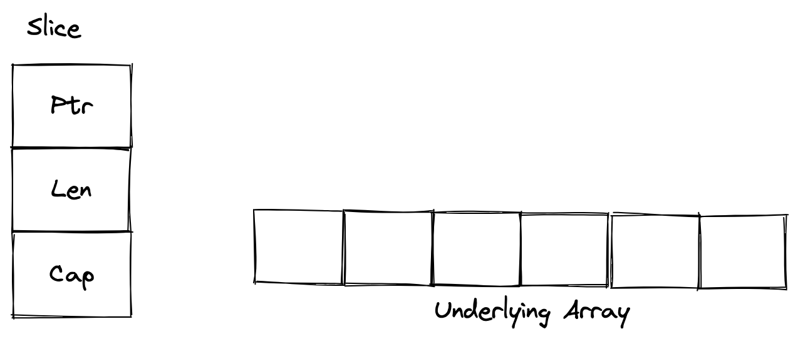
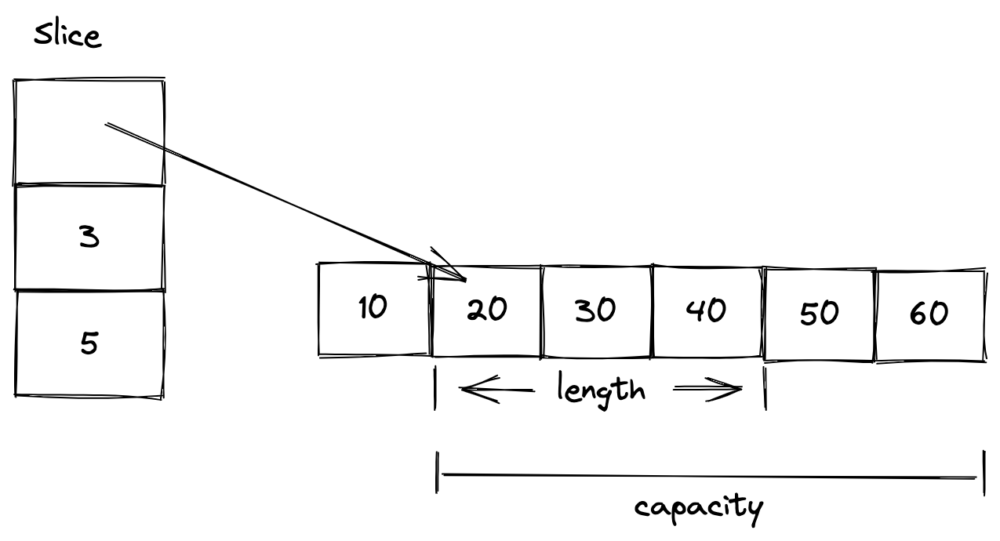
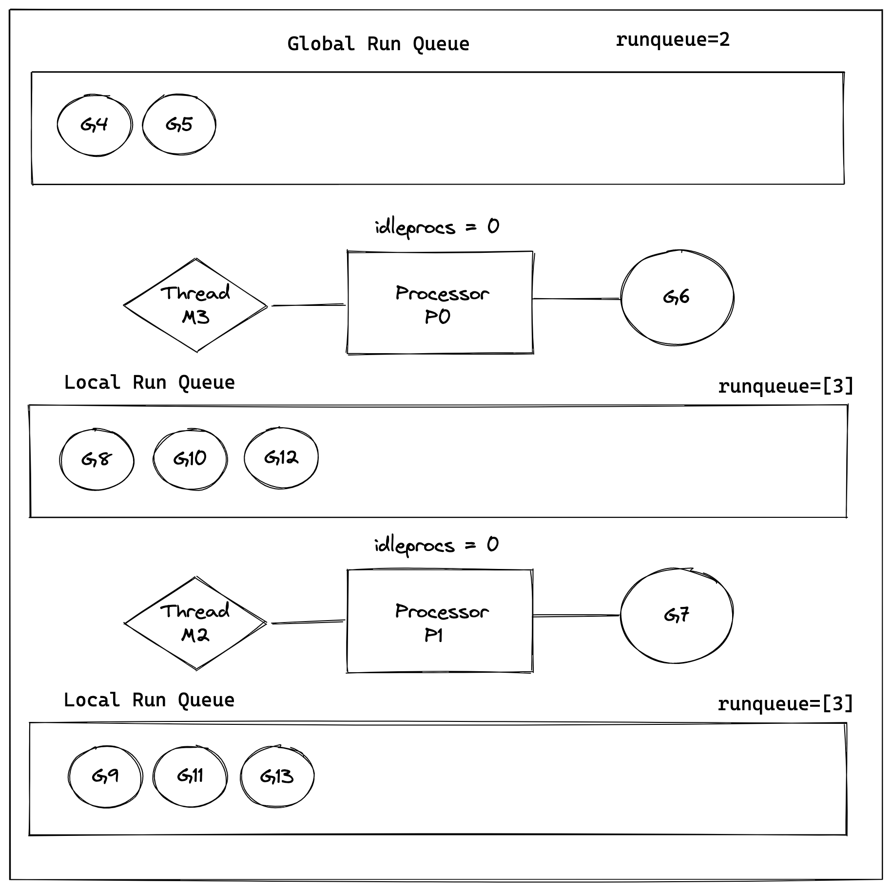
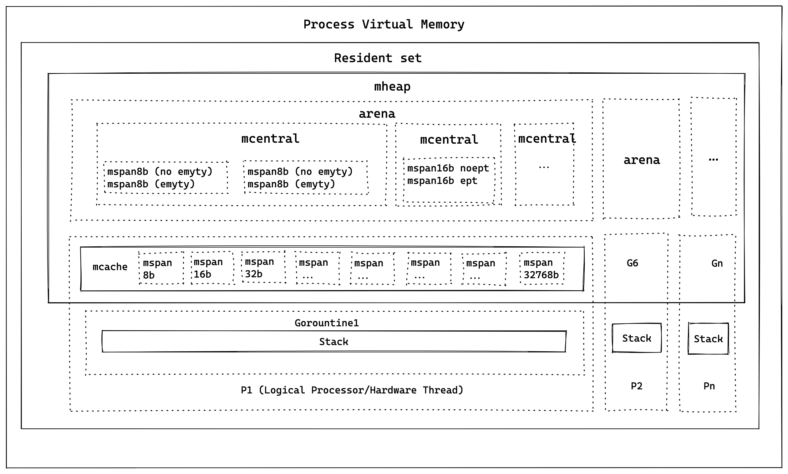
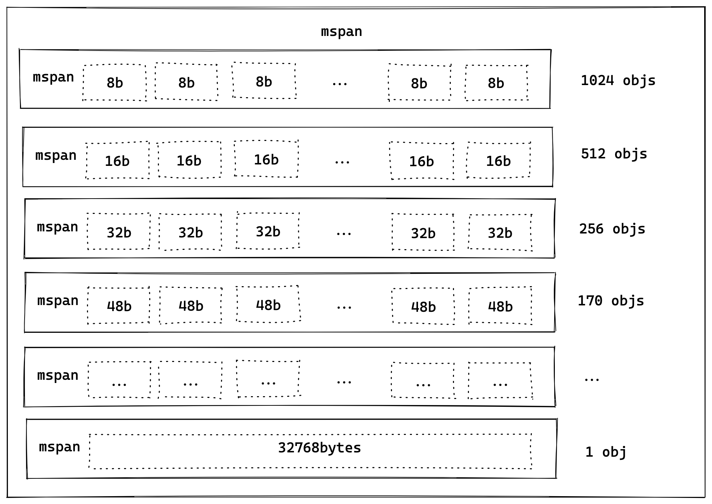

### Go 语言基础知识

#### Go语言优点

首先 Go 是一门开源的语言，他出生名门 Google，社区有强有力的顶级技术人员支撑。它最开始的设计者是 Rob Pike，Robert Griesemer，Ken Thompson。 你可以在这个页面找到他们的资料 https://golang.design/history/,  其中 Ken Thompson 是 UNIX 系统的发明者。 

Go 语言对于初学者很友好，很容易在短时间内快速上手，你可以通过这个网站上提供的代码示例快速的入门 Go 语言：https://gobyexample.com。

作为多核时代的语言，Go 语言在设计之初就对并发编程有很多内置的支持，提供的及其健壮的相关标准库。利用它，我们可以快速的编写出高并发的应用程序。

最后，国内外很多大厂都在使用 Go 语言，它有一个强大的社区，全世界优秀的技术人员开发了丰富的工具生态，有很多脚手架帮你快速的构建应用程序。

#### 切片

https://www.callicoder.com/golang-slices/

切片是一个数组的一段，它基于数组构建，并提供了更多丰富的数据操作功能，提供开发者灵活和便利的操作数组结构。

在 Go 语言内部，切片只是对底层数组数据结构的引用。接下来我们将熟悉如何创建和使用切片，并了解它底层是怎么工作的。

##### 使用字面量列表创建

这种方式类似 c++ 里面的初始化列表

```
var s = []int{3, 5, 7, 9, 11, 13, 17}
```


这种方式创建切片的时候，它首先会创建一个数组，然后返回对该数组切片的引用。

##### 从已有数组创建切片

```
// Obtaining a slice from an array `a`
a[low:high]
```

这里我们对 a 数组进行切割得到切片，这个操作得到的结果是索引 [low, high) 的元素，生成的切片包括索引低，但是不包括索引高之间的所有数组元素。

你可以运行下面的示例，理解这个切片操作


```
package main
import "fmt"

func main() {
	var a = [5]string{"Alpha", "Beta", "Gamma", "Delta", "Epsilon"}

	// Creating a slice from the array
	var s []string = a[1:4]

	fmt.Println("Array a = ", a)
	fmt.Println("Slice s = ", s)
}

// output

Array a =  [Alpha Beta Gamma Delta Epsilon]
Slice s =  [Beta Gamma Delta]

```


```
# Output
Array a =  [C C++ Java Python Go]
slice1 =  [C++ Java Python]
slice2 =  [C C++ Java]
slice3 =  [Java Python Go]
slice4 =  [C C++ Java Python Go]
```

##### 修改切片中的元素

由于切片是引用类型，它指向了底层的数组。所以当我们使用切片引用去修改数组中对应的元素的时候，引用相同数组的其他切片对象也会看到这个修改结果。


```
package main
import "fmt"

func main() {
	a := [7]string{"Mon", "Tue", "Wed", "Thu", "Fri", "Sat", "Sun"}

	slice1 := a[1:]
	slice2 := a[3:]

	fmt.Println("------- Before Modifications -------")
	fmt.Println("a  = ", a)
	fmt.Println("slice1 = ", slice1)
	fmt.Println("slice2 = ", slice2)

	slice1[0] = "TUE"
	slice1[1] = "WED"
	slice1[2] = "THU"

	slice2[1] = "FRIDAY"

	fmt.Println("\n-------- After Modifications --------")
	fmt.Println("a  = ", a)
	fmt.Println("slice1 = ", slice1)
	fmt.Println("slice2 = ", slice2)
}

// Output

------- Before Modifications -------
a  =  [Mon Tue Wed Thu Fri Sat Sun]
slice1 =  [Tue Wed Thu Fri Sat Sun]
slice2 =  [Thu Fri Sat Sun]

type: post
-------- After Modifications --------
a  =  [Mon TUE WED THU FRIDAY Sat Sun]
slice1 =  [TUE WED THU FRIDAY Sat Sun]
slice2 =  [THU FRIDAY Sat Sun]

```

例如上面这个示例，slice2 的修改操作在 slice1 中是能被看到的, slice1 的修改在 slice2 也能被看到。


##### 切片底层结构

一个切片由三个部分组成，如图 b 中

1.一个指向底层数组的指针 Ptr

2.切片所包含数组段的长度 Len
 
3.切片的容量 Cap



我们看一个具体的切片结构的底层示例：

```
var a = [6]int{10, 20, 30, 40, 50, 60}
var s = [1:4]
```

s 在 Go 内部是这样表示的：




一个切片的长度和容量我们是可以通过 len(), cap() 函数获取的，例如我们可以通过下面的方式获取 s   的长度和容量。

```
package main
import "fmt"

func main() {
	a := [6]int{10, 20, 30, 40, 50, 60}
	s := a[1:4]

	fmt.Printf("s = %v, len = %d, cap = %d\n", s, len(s), cap(s))
}

// output
s = [20 30 40], len = 3, cap = 5

```

#### Goruntine

Goruntine 是由 Go 运行时所管理的一个轻量级的线程，一个 Go 程序中的 Goroutines 在相同的地址空间中运行，因此对共享内存的访问必须同步。

我们运行一个简单地示例来看看：
```
package main

import (
	"fmt"
	"time"
)

func say(s string) {
	for i := 0; i < 5; i++ {
		time.Sleep(100 * time.Millisecond)
		fmt.Println(s)
	}
}

func main() {
	go say("world")
	say("hello")
}

// output


package main

import (
	"fmt"
	"time"
)

func say(s string) {
	for i := 0; i < 5; i++ {
		time.Sleep(100 * time.Millisecond)
		fmt.Println(s)
	}
}

func main() {
	go say("world")
	say("hello")
}
​
hello
world
hello
world
hello
world
world
hello
hello


```
我们可以看到主线程中 say("hello") 和 goruntine 的 say("world") 在交替的输出，它们在同时的运行，在其他语言做这个事情先要创建线程，然后绑定相关的执行函数，而 Go 语言直接把并发设计到了编译器语言支持层面，用 go 关键字就可以轻松地创建轻量级的线程。


#### 调度器


##### 调度器的设计决策

在解释 Go 语言调度器之前，我们先一个例子：

```

func main() {
    var wg sync.WaitGroup
    wg.Add(11)
    for i := 0; i <= 10; i++ {
        go func(i int) {
          defer wg.Done()
          fmt.Printf("loop i is - %d\n", i)
        }(i)
    }
    wg.Wait()
    fmt.Println("Hello, Welcome to Go")
}


// output

loop i is - 0
loop i is - 4
loop i is - 1
loop i is - 2
loop i is - 3
loop i is - 8
loop i is - 7
loop i is - 9
loop i is - 5
loop i is - 10
loop i is - 6
Hello, Welcome to Go

```

这个程序创建了 11 个 Goruntine，对于这个输出结果，我们可能会问：

这 11 个 Goruntine 是如何并行运行的？

它们运行有没有特别的顺序？

要回答这两个问题，我们需要思考:

如何将多个 Goruntine 分配到我们有限个数的 CPU 核心的机器上运行的多个 OS 线程上?

为了公平的让这些 Goruntine 获得 CPU 资源，这些 Goruntine 应该以什么的顺序在这多个 CPU 核心上运行?


##### Go 调度器的模型介绍



为了解决上面的调度问题，Go 语言设计了图 d 中的调度器模型：

Go 语言使用协程调度被称为 GMP 模型，其中：

G: 代表一个 Goruntine，是我们使用 go 关键字创建出来的可以并行运行的代码块。

M: 代表一个操作系统线程

P: 代表逻辑处理器

我们看到上图中由两个 P 处理核心运行时调度正在调度执行 8 个 Goruntine。

图中我们还看到了有两种类型的队列：

本地队列 (Local Run Queue): 存放等待运行的 G，这个队列存储的数量有限，一般不能超过 256个，当用户新建 Goruntine 时，如果这个队列满了，Go 运行时会将一半的 G 移动到全局队列中。

全局队列 (Global Queue): 存放等待运行的 G，其他的本地队列满了，会移动 G  过来。

**Go 调度器的工作流程**


GMP 调度器调度 Goruntine 执行的大致逻辑如下：

1.线程想要调度 G 执行就必须要先与某个 P 关联

2.然后从 P 的本地队列中获取 G

3.如果本地队列中没有可运行的 G 了，M 就会从全局队列拿一批 G 放到本地的 P 队列

4.如果全局队列也没有可以运行的 G 的时候，M 会随机的从其他的 P 的本地队列偷一半 G 任务放到自己（P）的本地队列中。

5.拿到可以运行的 G 之后，M 运行 G, G 执行完成之后，M 会运行下一个 G，一直重复执行下去。

**跟踪 Go 调度器工作流程**

Go 提供了 GODEBUG 工具可以跟踪调度器调度过程上述模型实时状态

我们使用下面的程序示例来追踪一下 Go 调度器是如何调度执行程序中的 Goruntine 的

```

package main

import (
	"sync"
	"time"
)

func main() {
	var wg sync.WaitGroup
	wg.Add(10)
	for i := 0; i < 10; i++ {
		go work(&wg)
	}

	wg.Wait()

	// Wait to see the global run queue deplete.
	time.Sleep(3 * time.Second)
}

func work(wg *sync.WaitGroup) {
	time.Sleep(time.Second)

	var counter int
	for i := 0; i < 1e10; i++ {
		counter++
	}

	wg.Done()
}

```

代码中创建了十个 Goruntine, 每个 Goruntine 都在做循环加 counter 值的操作。

我们编译上述例子

```

go build go_demo.go

```

然后使用 GODEBUG 工具来分析观察这些 Goruntine 的调度情况

执行命令：

```

GOMAXPROCS=2 GODEBUG=schedtrace=1000 ./go_demo

```

可以得到看到如下的输出，当然机器不一样可能输出会不一样, 以下是在我的笔记本上输出的， 我的本子有四个核心，下面的指令我指定了创建两个逻辑处理核心

```

colin@book % GOMAXPROCS=2 GODEBUG=schedtrace=1000 ./go_demo
SCHED 0ms: gomaxprocs=2 idleprocs=1 threads=4 spinningthreads=0 idlethreads=1 runqueue=0 [0 0]
SCHED 1009ms: gomaxprocs=2 idleprocs=0 threads=4 spinningthreads=0 idlethreads=1 runqueue=0 [8 0]
SCHED 2009ms: gomaxprocs=2 idleprocs=0 threads=4 spinningthreads=0 idlethreads=1 runqueue=2 [3 3]
SCHED 3016ms: gomaxprocs=2 idleprocs=0 threads=4 spinningthreads=0 idlethreads=1 runqueue=2 [3 3]
SCHED 4017ms: gomaxprocs=2 idleprocs=0 threads=4 spinningthreads=0 idlethreads=1 runqueue=7 [0 1]
SCHED 5027ms: gomaxprocs=2 idleprocs=0 threads=4 spinningthreads=0 idlethreads=1 runqueue=5 [0 3]
SCHED 6031ms: gomaxprocs=2 idleprocs=0 threads=4 spinningthreads=0 idlethreads=1 runqueue=3 [2 3]
SCHED 7037ms: gomaxprocs=2 idleprocs=0 threads=4 spinningthreads=0 idlethreads=1 runqueue=5 [1 2]
SCHED 8045ms: gomaxprocs=2 idleprocs=0 threads=4 spinningthreads=0 idlethreads=1 runqueue=4 [2 2]
SCHED 9052ms: gomaxprocs=2 idleprocs=0 threads=4 spinningthreads=0 idlethreads=1 runqueue=8 [0 0]
SCHED 10065ms: gomaxprocs=2 idleprocs=0 threads=4 spinningthreads=0 idlethreads=1 runqueue=4 [0 4]
SCHED 11069ms: gomaxprocs=2 idleprocs=0 threads=4 spinningthreads=0 idlethreads=1 runqueue=4 [1 3]
```

输出信息的含义如下

我们选取第二条分析

1009ms: 这个是从程序启动到这个 trace 采集度过的时间

gomaxprocs=2：配置的逻辑处理核心，我们启动命令中写的

idleprocs=0：空闲逻辑核心的数量

threads=4：运行时正在管理的线程数量

idlethreads=1：空闲线程的数量，这里有1个空闲，3个正在运行中

runqueue=0：全局运行队列中 Goruntine 的数量

[8 0]：表示逻辑核心上本地队列中排队中 Goruntine 的数量，我们看到有一个核心上面有 8 个 Goruntine，另一个有 0 个，当然我们看后面的 trace 后续这两个核心的本地队列上都有任务了

**了解更多调度器原理**

Go 语言是开源的，你可以在这个文件里面找到调度器的主要逻辑，https://github.com/golang/go/blob/master/src/runtime/proc.go，目前最新的代码有 6千多行了，值得去读一读，弄懂个大概也是很有收获的。


#### 内存管理


##### 内存管理架构概览

Go 最早的内存分配发源自 tcmalloc，它比普通的 malloc 性能要好，随着 Go 语言的不断演进，当前的内存管理性能已经非常好了。

我们首先通过图 e 来看 Go 内存管理架构的概览



图中涉及到的主要结构如下：

##### resident set (常驻集)


虚拟内存划分为每个 8kb 的页面，由一个全局的  mheap 对象管理

##### mheap

这里管理了 Go 语言动态存储的数据结构（即编译时无法计算大小的任何数据），这是最大的内存块，也是 Go 垃圾收集发生的地方。

mheap 里面有管理了不同结构的页面，主要结构如下

##### mspan

mspan 是 mheap 中管理内存页的最基本结构，它底层结构是一个双向链表，span size class，以及 span 中的页面数量。和 tcmalloc 的操作一样，Go 将内存页面按大小划分为 67 个不同类的块，8b ~ 32kb 不等，如图 f 所示



##### mcentral

mcentral 将相同大小 span 类组成分组，每个 mcentral 中包含两个 mspan：

empty: 一个双向的 span 链表,其中没有空闲的对象或者 span 缓存在 mcache 中

non-empty: 有空闲对象的双链接列表，当 mcentral 请求新的 span 的时候，会从 non-empty 移动到  empty list

当 mcentral 没哟任何空闲的 span 是，它会向 mheap 请求一个新的运行页面

##### arena

堆内存在分配的虚拟内存中根据需要进行扩大和收缩，当需要更多的内存时，mheap 从虚拟内存中拉大小为 64MB 的内存块出来，这个被叫做 arean。

##### mcache

mcache 是提供给 P（逻辑处理核心）的内存缓存，用来存储小对象（也就是大小 <= 32kb）。这有点类似于线程栈，但是它其实是堆的一部分，用于动态数据。mcache 中包含了 scan 和 noscan 类型所有大小的 mspan 对象

Goroutine 们可以从 mcache中获取内存，不需要加人任何锁，因为 P 在同一时刻只能调度一个 G, 因此这是很高效的， mcache 在需要的时候会向 mcentral 中获取新的  span

##### Stack

这里是管理堆栈的内存区域，每个 Goroutine 都有一个堆栈，这里用来存储静态数据，包括函数框架，静态的结构，原语值和指向动态数据机构的指针。


##### 内存分配流程概要

分配器会按对象大小分配

**Tiny**

对于 Tiny (超小, size < 16 B) 对象:

直接使用 mcache 的  tiny 分配器分配大小小于 16 字节的对象，这是非常高效的。

**Small**

对于 Small (小型，size 16B ~ 32KB) 对象：

大小在 16 字节到 32 k字节的对象分配时，在运行中 G 的 P 上的 mcache 里面获取。

在 Tiny 和 Small 分配中，如果 mspan 列表为空，没有页面用来分配了，分配器将从 mheap 获取一系列页面用于 mspan。

**Large**

对于 Large (大型，size > 32KB) 对象, 直接分配在 mheap 相应大小的类上。如果 mheap 为空或者没有足够大的页面来分配了，那么它会从操作系统的进程虚拟内存分配一组新的页面过来（至少 1MB）。
