### 构建 Raft 库

#### 核心数据结构设计

我们上一章节讲了 Raft 算法的主要内容，现在我们要代码实现它们了。首先我们需要抽象出我们需要的数据结构。先来梳理一下可能用到的数据结构，首先节点之间需要互相访问，那我们需要定义访问其他节点的网络客户端，这里面要包含节点的 id, 地址，还有 rpc 的客户端，整个结构我们抽象为 RaftClientEnd，主要数据内容如下：

```

type RaftClientEnd struct {
	id             uint64
	addr           string
	raftServiceCli *raftpb.RaftServiceClient  // grpc 客户端
}

```

节点状态我们之前描述的有三种，定义如下：

```

const (
	NodeRoleFollower NodeRole = iota
	NodeRoleCandidate
	NodeRoleLeader
)

```

我们要完成选举操作的话需要两个超时时间，这里我们使用  Golang time 库里面的 Timer 实现，它可以定时的给一个通道发送消息，我们可以用它来实现选举超时和心跳超时。

```

electionTimer    *time.Timer
heartbeatTimer   *time.Timer

```

除此之外我们还需要记录当前节点的 id, 当前的任期号，为谁投票，获得票数的统计，已经提交的日志索引号，最后 apply 到状态机的日志号，以及节点如果是 Leader 的话需要记录到其他节点复制最新匹配的日志号，这写数据结构定义如下：

```

type Raft struct {
	mu             sync.RWMutex
	peers          []*RaftClientEnd // rpc 客户端
	me_            int  // 自己的 id
	dead           int32 // 节点的状态
	applyCh        chan *pb.ApplyMsg // apply 协程通道，协程模型中会讲到
	applyCond      *sync.Cond // apply 流程控制的信号量
	replicatorCond []*sync.Cond // 复制操作控制的信号量
	role           NodeRole  // 节点当前的状态
	curTerm        int64  // 当前的任期
	votedFor       int64  // 为谁投票
	grantedVotes   int    // 已经获得的票数 
	logs           *RaftLog  // 日志信息
	commitIdx      int64     // 已经提交的最大的日志 id
	lastApplied    int64     // 已经 apply 的最大日志的 id
	nextIdx        []int     // 到其他节点下一个匹配的日志 id 信息
	matchIdx       []int     // 到其他节点当前匹配的日志 id 信息

	leaderId         int64   // 集群中当前 Leader 节点的 id
	electionTimer    *time.Timer  // 选举超时定时器
	heartbeatTimer   *time.Timer  // 心跳超时定时器
	heartBeatTimeout uint64       // 心跳超时时间
	baseElecTimeout  uint64       // 选举超时时间
}

```

首先系统启动的时候需要构造 Raft 这个结构体，这个流程是在 MakeRaft 里面实现的，它主要是初始化与一些变量，两个定时器，并启动相关的协程，我们这里对每个对端节点复制有 Replicator 协程，触发两个超时时间有 Tick 协程，应用已经提交的日志有 Applier 协程。

#### 协程模型

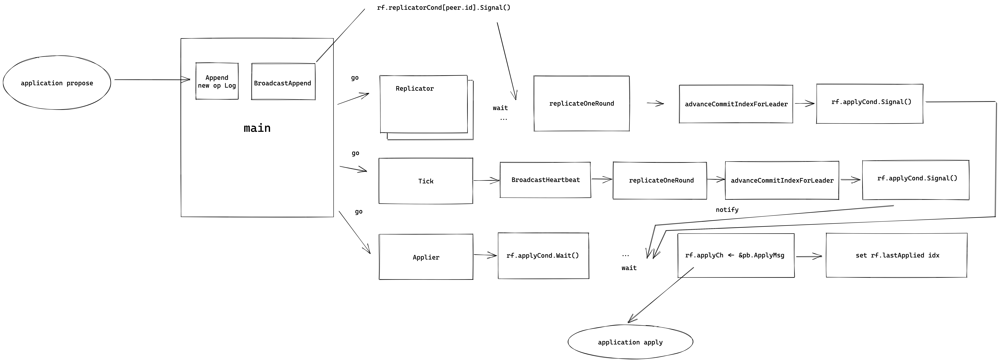

上图展示了我们 raftcore 里面的协程模型，当应用层提案 (propose) 到来之后主协程会在本地追加日志，然后发送 BroadcastAppend，然后到其他节点复制日志的协程的等待就会被唤醒，开始进行一轮的的复制，replicateOneRound 成功复制半数节点日志之后会触发 commit, rf.applyCond.Signal() 会唤醒等待做 Apply 操作的 Applier 协程。

另外 Tick 协程会监听 Timer 两个超时的 C 通道信号，一旦心跳超时并且当前节点的状态是 Leader，就会调用 BroadcastHeartbeat 发送心跳，发心跳的时候也会 replicateOneRound 就和上述一样，如果成功复制半数节点日志之后会触发 commit, rf.applyCond.Signal() 就会唤醒等待做 Apply 操作的 Applier 协程。

Applier 协程 apply 完消息之后会把 ApplyMsg 消息写入 rf.applyCh 通知应用层，应用层的协程和以监听这个通道，如果有 ApplyMsg 到来就把它应用到状态机。

#### Rpc 定义

eraft 的 rpc 定义文件在 pbs 目录下的 raftbasic.proto 文件中，主要的消息如下：

##### Entry

这个是一个日志条目信息表示，和我们之前描述的一样，它有任期号 term，索引号 index, 以及操作的序列化数据 data 我们用一个字节流来存储，日志条目有两种类型一种是 Normal 正常日志，另一种是 ConfChange 配置变更的日志：

```

enum EntryType {
    EntryNormal = 0;
    EntryConfChange = 1;
}

message Entry {
    EntryType entry_type = 1;
    uint64    term = 2;
    int64     index = 3;
    bytes     data = 4;
}


```


##### RequestVote 相关

下面是请求投票 RPC 的定义，基本和论文里面保持一致：

请求投票里面有候选人的任期号，它的 id 以及它最后一条日志的索引以及任期号信息。

响应里面有个任期号，这个用来给候选人在选举失败的时候更新自己的任期，还有一个 vote_granted 表示这个请求投票操作是否被对端节点接受。

```

message RequestVoteRequest {
    int64 term = 1;
    int64 candidate_id = 2;
    int64 last_log_index = 3;
    int64 last_log_term = 4;
}

message RequestVoteResponse {
    int64 term = 1;
    bool  vote_granted = 2;
}

service RaftService {
    //...
    rpc RequestVote (RequestVoteRequest) returns (RequestVoteResponse) {}
}

```

##### AppendEntries 相关

日志追加操作的定义如下，基本也和论文里面一致：

请求里面有 Leader 的任期，id （用来告诉 follower, 这样 client 访问了 follower 之后可以被告知 leader 节点是哪个），
prev_log_index 表示消息里面将要同步的第一条日志前一条日志的的索引信息，prev_log_term 是它的任期信息，leader_commit 则是 leader 的 commit 号 (可以用来周知 follower 节点当前的 commit 进度)，entries 表示日志条目信息。

响应里面 term 用来告诉 leader 是否出新的任期的消息，可以用来更新 leader 的任期号，success 表示日志追加操作是否成功，conflict_index 用来记录冲突日志的索引号，conflict_term 用来记录冲突日志的任期号。

```

message AppendEntriesRequest {
    int64    term = 1;
    int64    leader_id = 2;
    int64    prev_log_index = 3;
    int64    prev_log_term = 4;
    int64    leader_commit = 5;
    repeated Entry entries = 6;
}

message AppendEntriesResponse {
    int64  term = 1;
    bool  success = 2;
    int64 conflict_index = 3;
    int64 conflict_term = 4;
}


service RaftService {
    //...
    rpc AppendEntries (AppendEntriesRequest) returns (AppendEntriesResponse) {}
}

```

#### Leader 选举实现分析

Raft 官网提供了一个算法的动态演示动画，我们先来直观感受下 Leader 选举的流程，然后结合代码介绍这个流程。

首先 Raft 算法中有两个超时时间用来控制着 Leader 选举的流程，首先是选举超时，这个是 Candidate 等待变成 Leader 的时间跨度，如果在这个时间内还没被选成 Leader, 这个超时定时器会被重置。我们前面也介绍过，这个超时时间设置一般在 150ms 到 300ms 之间。

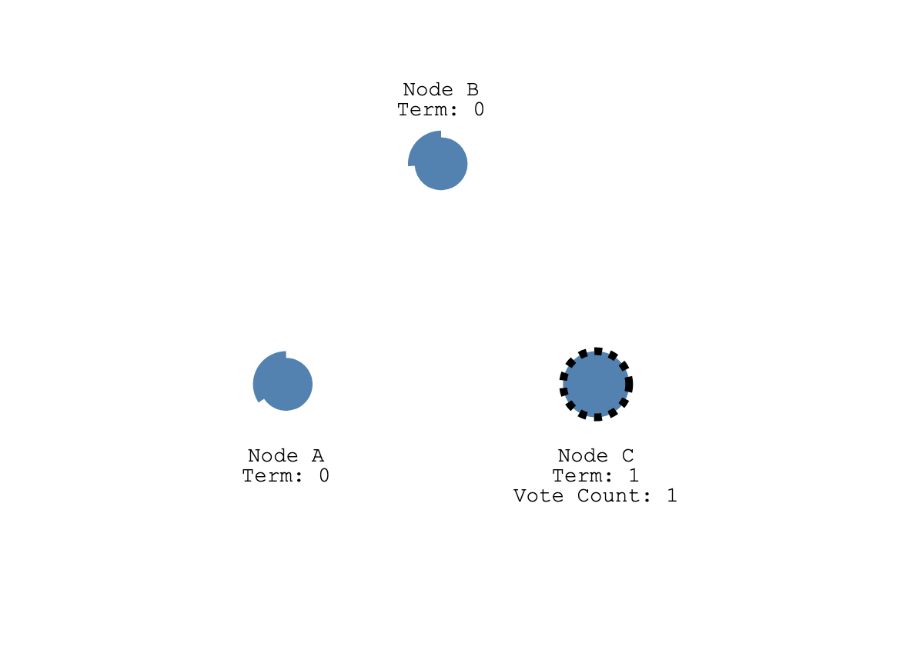

启动的时候，所有节点的选举超市时间都被设置到 150～300ms 之间的随机值，那么大概率有一个节点会率先达到超市时间，如图 A,B,C 节点的 C 先达到超时时间，它从 Follower 变成 Candidate, 随后开始新任期的选举，它会给自己投一票，然后向集群中的其他节点发送 RequestVoteRequest rpc 请求它们的投票。


1.eraft 代码中在启动，也就是应用层调用 MakeRaft 函数的时候会传入 baseElectionTimeOutMs 和 heartbeatTimeOutMs，
这里心跳超市时间是固定的，选举超时时间我们使用 MakeAnRandomElectionTimeout 构造生成了一个随机超市时间。

```

func MakeRaft(peers []*RaftClientEnd, me int, newdbEng storage_eng.KvStore, applyCh chan *pb.ApplyMsg, heartbeatTimeOutMs uint64, baseElectionTimeOutMs uint64) *Raft {

...

heartbeatTimer:   time.NewTimer(time.Millisecond * time.Duration(heartbeatTimeOutMs)),
electionTimer:    time.NewTimer(time.Millisecond * time.Duration(MakeAnRandomElectionTimeout(int(baseElectionTimeOutMs)))),
...

```

2.达到选举超时后, 节点 C 首先把自己状态改成 Candidate，然后增加自己的任期号，开始选举。

```

//
// Tick raft heart, this ticket trigger raft main flow running
//
func (rf *Raft) Tick() {
	for !rf.IsKilled() {
		select {
		case <-rf.electionTimer.C:
			{
				rf.SwitchRaftNodeRole(NodeRoleCandidate)
				rf.IncrCurrentTerm()
				rf.Election()
				rf.electionTimer.Reset(time.Millisecond * time.Duration(MakeAnRandomElectionTimeout(int(rf.baseElecTimeout))))
			}
		...
	}
}

```

3.下面这段代码就是发起选举的核心逻辑了，首先节点 IncrGrantedVotes 给自己投一票，然后把 votedFor 设置成自己，之后构造 RequestVoteRequest rpc 请求，带上自己的任期号，CandidateId 也就是自己的 id, 最后一个日志条目的索引还有任期号，然后把当前 Raft 状态持久化，向集群中的其他节点并行的发送，RequestVote 请求


```

//
// Election  make a new election
//
func (rf *Raft) Election() {
	fmt.Printf("%d start election \n", rf.me_)
	rf.IncrGrantedVotes()
	rf.votedFor = int64(rf.me_)
	voteReq := &pb.RequestVoteRequest{
		Term:         rf.curTerm,
		CandidateId:  int64(rf.me_),
		LastLogIndex: int64(rf.logs.GetLast().Index),
		LastLogTerm:  int64(rf.logs.GetLast().Term),
	}
	rf.PersistRaftState()
	for _, peer := range rf.peers {
		if int(peer.id) == rf.me_ {
			continue
		}
		go func(peer *RaftClientEnd) {
			PrintDebugLog(fmt.Sprintf("send request vote to %s %s\n", peer.addr, voteReq.String()))

			requestVoteResp, err := (*peer.raftServiceCli).RequestVote(context.Background(), voteReq)
			if err != nil {
				PrintDebugLog(fmt.Sprintf("send request vote to %s failed %v\n", peer.addr, err.Error()))
			}
			...
		}(peer)
	}
}
```

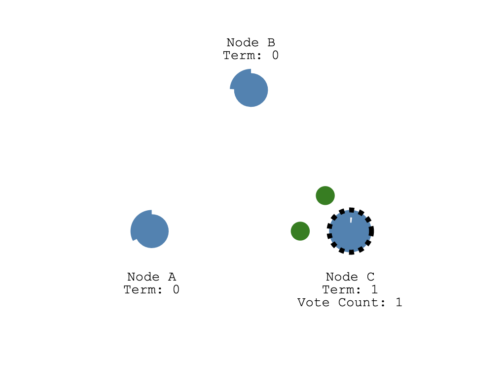

如果 A,B 收到请求的时候还没有发出投票（因为它们还没达到选举超时时间），它们就会给候选人节点 C 投票, 同时重设自己的选举超时定时器。

4. eraft 处理投票请求的细节如下, 我们结合图中的例子分析下面的逻辑，假设 A 节点正在处理来自 C 的投票请求，那么首先 C 的 任期号大于 A 的, 代码中 1 的 if 分支不会执行, 在 2 这里， A 节点发现来自 C 的请求投票消息的任期号大于自己的，它会调用 SwitchRaftNodeRole 变成 Follower 节点, 在回 C 消息之前，代码中 3 号位置 A 调用 electionTimer.Reset 重设了自己的选举超时定时器。

```

//
// HandleRequestVote  handle request vote from other node
//
func (rf *Raft) HandleRequestVote(req *pb.RequestVoteRequest, resp *pb.RequestVoteResponse) {
	rf.mu.Lock()
	defer rf.mu.Unlock()
	defer rf.PersistRaftState()

    // 1
	if req.Term < rf.curTerm || (req.Term == rf.curTerm && rf.votedFor != -1 && rf.votedFor != req.CandidateId) {
		resp.Term, resp.VoteGranted = rf.curTerm, false
		return
	}

    // 2 
	if req.Term > rf.curTerm {
		rf.SwitchRaftNodeRole(NodeRoleFollower)
		rf.curTerm, rf.votedFor = req.Term, -1
	}
	
	...
	
	rf.votedFor = req.CandidateId
	
	// 3
	rf.electionTimer.Reset(time.Millisecond * time.Duration(MakeAnRandomElectionTimeout(int(rf.baseElecTimeout))))
	resp.Term, resp.VoteGranted = rf.curTerm, true
}
```

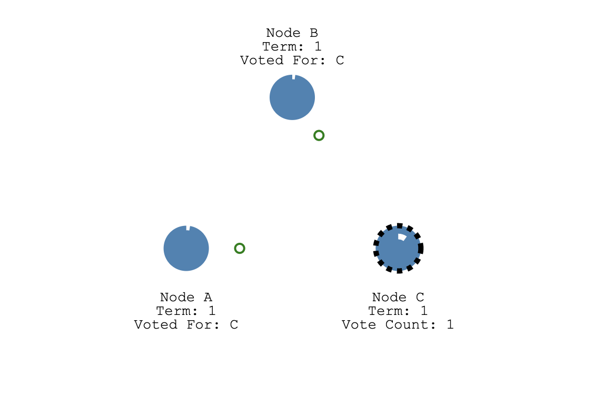

C 收到半数票以上，也就是 A, B 节点的任意一个的投票加上自己那一张选票，它就变成了 Leader，然后停止自己的选举超时定时器。

5.C 统计票数处理请求投票的响应如下，注意：这段代码加了锁，应为这里涉及到多个 Goruntine 去修改 rf 中的非原子变量，如果不加锁可能会导致逻辑错误。代码中 1 处，如果收到投票的响应 VoteGranted 是 true。C 就会调用 IncrGrantedVotes 递增自己拥有的票书，然后 if rf.grantedVotes > len(rf.peers)/2 判断是否拿到了半数以上票，如果是的调用 SwitchRaftNodeRole 切换自己的状态为 Leader，之后 BroadcastHeartbeat 广播心跳消息，并重新设置自己的得票数 grantedVotes 为 0。

```
if requestVoteResp != nil {
	rf.mu.Lock()
	defer rf.mu.Unlock()
	PrintDebugLog(fmt.Sprintf("send request vote to %s recive -> %s, curterm %d, req term %d", peer.addr, requestVoteResp.String(), rf.curTerm, voteReq.Term))
	if rf.curTerm == voteReq.Term && rf.role == NodeRoleCandidate {
	    // 1
		if requestVoteResp.VoteGranted {
			// success granted the votes
			PrintDebugLog("I grant vote")
			rf.IncrGrantedVotes()
			if rf.grantedVotes > len(rf.peers)/2 {
				PrintDebugLog(fmt.Sprintf("node %d get majority votes int term %d ", rf.me_, rf.curTerm))
				rf.SwitchRaftNodeRole(NodeRoleLeader)
				rf.BroadcastHeartbeat()
				rf.grantedVotes = 0
			}
	    // 2
		} else if requestVoteResp.Term > rf.curTerm {
			// request vote reject
			rf.SwitchRaftNodeRole(NodeRoleFollower)
			rf.curTerm, rf.votedFor = requestVoteResp.Term, -1
			rf.PersistRaftState()
		}
	}
}
```

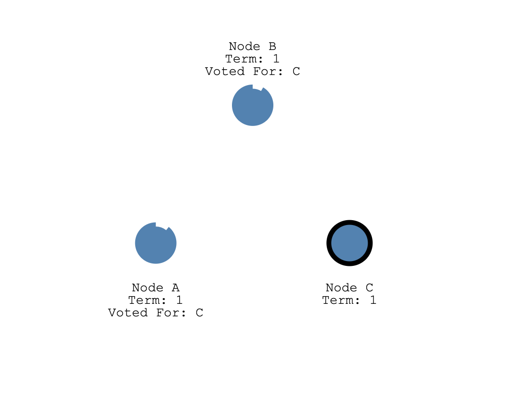

我们知道 A,B 在前面处理投票请求的时候只是重设的超时定时器，那么万一再一次超时定时器到达，会不会重新出发选举，然后陷入选举循环呢？

答案是不会的，我们前面只介绍了选举超时时间，还有一个心跳超时时间，这个超时时间比选举超市时间短，一般是选举超时时间的 1/3。也就是说在 A, B 还没到达选举超时时间之前，这个心跳超市时间会先出发，如果是 Leader 节点的话，它会给集群中其他节点发送心跳包，其他节点 (A, B) 接受到心跳包之后, 又会重设自己的选举超时定时器。也就是说，只要 Leader C 一直正常运心发送心跳包，那么 A,B 节点不可能触发选举，只有当 Leader C 挂了。A,B 节点才会开始下一轮选举。

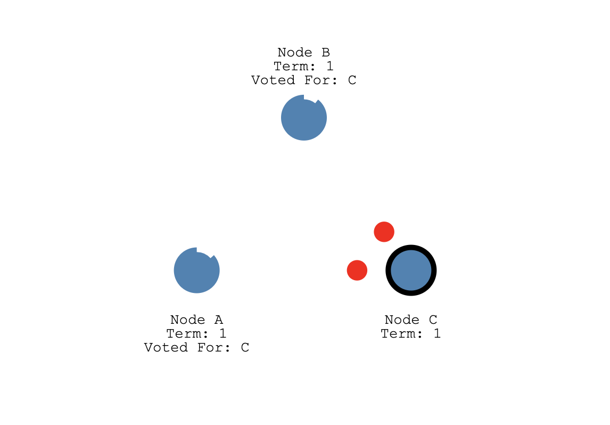

#### 日志复制实现分析

经过上述的选举流程，我们现在就有一个拥有主节点和多个从节点的系统了，主节点会不断的给从节点发送心跳消息。现在我们要开始考虑处理客户端请求了，如果客户端发送一个操作过来，我们这个系统是如何处理的呢？

首先，Raft 规定只有 Leader 节点能处理请求写入，客户端发送请求首先会到达 Leader 节点。

在 eraft 库中用户请求到来和 raft 交互的入口函数是 Propose，这个函数首先会查询当前节点状态，只有 Leader 节点才能处理提案（propose），之后会把用户操作的序列化之后的 []byte 调用 Append 追加到自己的日志中，之后 BroadcastAppend 将日志内容发送给集群中的 Follower 节点。

```
//
// Propose the interface to the appplication propose a operation
//

func (rf *Raft) Propose(payload []byte) (int, int, bool) {
	rf.mu.Lock()
	defer rf.mu.Unlock()
	if rf.role != NodeRoleLeader {
		return -1, -1, false
	}
	newLog := rf.Append(payload)
	rf.BroadcastAppend()
	return int(newLog.Index), int(newLog.Term), true
}
```

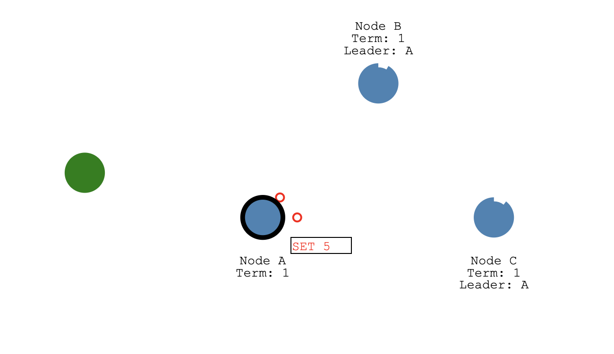


如上图中，绿色的表示客户端节点，它发送 SET 5 的请求过来，A 作为当前集群中的 Leader 节点首先会把这个 SET 5 操作封装成一个日志条目写入到自己的日志存储结构中，然后在下一次给从节点发送心跳消息的时候带上这个日志发送给 Follower 节点。

在 eraft 实现中，我们专门有一组 Goruntine 做日志复制相关的事情，用户提案到达 Leader 之后调用 BroadcastAppend 会唤醒做日志复制操作的 Goruntine, replicatorCond 这个信号量用来完成 Goruntine 之间的同步操作。

```

func (rf *Raft) BroadcastAppend() {
	for _, peer := range rf.peers {
		if peer.id == uint64(rf.me_) {
			continue
		}
		rf.replicatorCond[peer.id].Signal()
	}
}
```

复制操作的 Goruntine 执行的任务函数是 Replicator，当 BroadcastAppend 中通过 Signal 函数唤醒信号量，rf.replicatorCond[].Wait() 就会停止阻塞，继续往下执行，调用 replicateOneRound 进行数据复制。

```

//
// Replicator manager duplicate run
//
func (rf *Raft) Replicator(peer *RaftClientEnd) {
	rf.replicatorCond[peer.id].L.Lock()
	defer rf.replicatorCond[peer.id].L.Unlock()
	for !rf.IsKilled() {
		PrintDebugLog("peer id wait for replicating...")
		for !(rf.role == NodeRoleLeader && rf.matchIdx[peer.id] < int(rf.logs.GetLast().Index)) {
			rf.replicatorCond[peer.id].Wait()
		}
		rf.replicateOneRound(peer)
	}
}

```

replicateOneRound 就会把日志打包到一个 AppendEntriesRequest 中发送到 Follower 节点了。
 
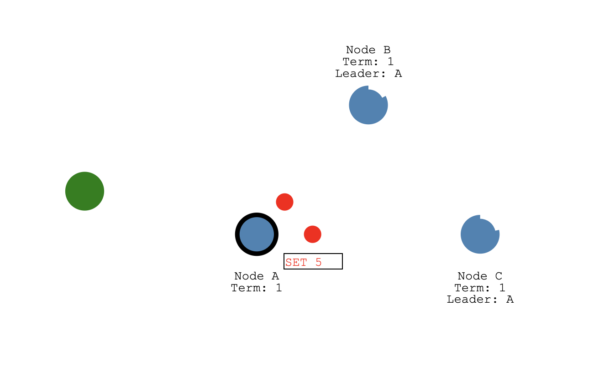

Follower 收到追加请求后会把日志条目追加到自己的日志存储结构中，然后给 Leader 发送成功追加的响应。Leader 统计到集群半数节点（包括自己）日志追加成功之后，它会把这条日志状态设置为已经提交 (committed)，然后将操作结果发送给客户端, 如下图所示，A 设置 SET 5 

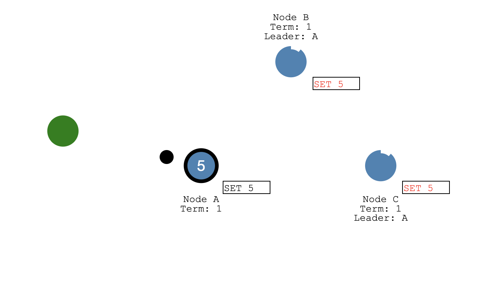


之后这个日志提交的信息会在下一次给 Follower 发送的心跳包中带过去，Follower 收到日志也会更新自己的日志提交状态。

日志提交之后，Apply 协程会收到通知，开始将已经提交的日志 apply 到状态机中，日志的成功 Apply 之后给客户端发送成功写入的响应包。

对应 eraft 实现中，日志提交之后 Leader 节点会调用 advanceCommitIndexForLeader 函数。它会计算当前日志提交的索引号，然后和之前已经提交的 commitIdx 进行对比，如果更大，就会更新 commitIdx，同时调用 rf.applyCond.Signal() 唤醒做 Apply 操作的 Goruntine。Applier 函数是 Apply Goruntine 运行的任务函数，它会 Wait applyCond 这个信号量，如果被唤醒，它会拷贝初节点中已经提交的日志，打包成  ApplyMsg 发送到 applyCh 通道通知应用层，应用层拿到 apply 消息之后会更新状态机并回包给客户端。

```

func (rf *Raft) advanceCommitIndexForLeader() {
	sort.Ints(rf.matchIdx)
	n := len(rf.matchIdx)
	newCommitIndex := rf.matchIdx[n-(n/2+1)]
	if newCommitIndex > int(rf.commitIdx) {
		if rf.MatchLog(rf.curTerm, int64(newCommitIndex)) {
			PrintDebugLog(fmt.Sprintf("peer %d advance commit index %d at term %d", rf.me_, rf.commitIdx, rf.curTerm))
			rf.commitIdx = int64(newCommitIndex)
			rf.applyCond.Signal()
		}
	}
}

//
// Applier() Write the commited message to the applyCh channel
// and update lastApplied
//
func (rf *Raft) Applier() {
	for !rf.IsKilled() {
		rf.mu.Lock()
		for rf.lastApplied >= rf.commitIdx {
			PrintDebugLog("applier ...")
			rf.applyCond.Wait()
		}
		firstIndex, commitIndex, lastApplied := rf.logs.GetFirst().Index, rf.commitIdx, rf.lastApplied
		entries := make([]*pb.Entry, commitIndex-lastApplied)
		copy(entries, rf.logs.GetRange(lastApplied+1-int64(firstIndex), commitIndex+1-int64(firstIndex)))
		rf.mu.Unlock()

		PrintDebugLog(fmt.Sprintf("%d, applies entries %d-%d in term %d", rf.me_, rf.lastApplied, commitIndex, rf.curTerm))

		for _, entry := range entries {
			rf.applyCh <- &pb.ApplyMsg{
				CommandValid: true,
				Command:      entry.Data,
				CommandTerm:  int64(entry.Term),
				CommandIndex: int64(entry.Index),
			}
		}

		rf.mu.Lock()
		rf.lastApplied = int64(Max(int(rf.lastApplied), int(commitIndex)))
		rf.mu.Unlock()
	}
}
```

#### Raft 快照实现分析

下面是日志快照的 RPC 定义
```
message InstallSnapshotRequest {
    int64 term =                1;
    int64 leader_id =           2;
    int64 last_included_index = 3;
    int64 last_included_term  = 4;
    bytes data                = 5;
}

message InstallSnapshotResponse {
    int64 term = 1; 
}

rpc Snapshot (InstallSnapshotRequest) returns (InstallSnapshotResponse) {}
```

InstallSnapshotRequest 中 term 代表当前发送快照的 Leader 的任期，Follower 将它与自己的任期号来决定是否要接收这个快照。leader_id 是当前 leader 的 id, 这样客户端访问到 Follower 节点之后也能快速知道 Leader 信息。last_included_index 和  last_included_term 还有 data 可以参见我们第三章图中的介绍，它们记录了打完快照之后第一条日志的索引号和任期号，以及状态机序列化之后的数据。

什么时间点 Raft 会打快照呢?

我们知道日志条目过多了，我们就需要打快照。在 eraft 中就是计算当前 level 中的日志条目 s.Rf.GetLogCount() 来打快照的，打快照的入口函数是 takeSnapshot(index int), 传入了当前 applied 日志的 id, 然后将状态机的数据序列化，调用 Raft层的 Snapshot 函数。
这个函数通过 EraseBeforeWithDel 做了删除日志的操作，然后 PersisSnapshot 将快照中状态数据缓存到了存储引擎中。

```

//
// take a snapshot
//
func (rf *Raft) Snapshot(index int, snapshot []byte) {
	rf.mu.Lock()
	defer rf.mu.Unlock()
	rf.isSnapshoting = true
	snapshotIndex := rf.logs.GetFirstLogId()
	if index <= int(snapshotIndex) {
		rf.isSnapshoting = false
		PrintDebugLog("reject snapshot, current snapshotIndex is larger in cur term")
		return
	}
	rf.logs.EraseBeforeWithDel(int64(index) - int64(snapshotIndex))
	rf.logs.SetEntFirstData([]byte{}) // 第一个操作日志号设为空
	PrintDebugLog(fmt.Sprintf("del log entry before idx %d", index))
	rf.isSnapshoting = false
	rf.logs.PersisSnapshot(snapshot)
}
```

什么时间点 Leader 会发送快照呢？

在复制的时候我们会判断到 peer 的 prevLogIndex, 如果比当前日志的第一条索引号还小，就说明 Leader 已经把这条日志打到快照中了，这里我们就要构造 InstallSnapshotRequest 调用 Snapshot RPC 将快照数据发送给 Followr 节点，在收到成功响应之后，我们会更新 rf.matchIdx，rf.nextId 为 LastIncludedIndex 和 LastIncludedIndex + 1，更新到 Follower 节点复制进度。

```

if prevLogIndex < uint64(rf.logs.GetFirst().Index) {
	firstLog := rf.logs.GetFirst()
	snapShotReq := &pb.InstallSnapshotRequest{
		Term:              rf.curTerm,
		LeaderId:          int64(rf.me_),
		LastIncludedIndex: firstLog.Index,
		LastIncludedTerm:  int64(firstLog.Term),
		Data:              rf.ReadSnapshot(),
	}

	rf.mu.RUnlock()

	PrintDebugLog(fmt.Sprintf("send snapshot to %s with %s\n", peer.addr, snapShotReq.String()))

	snapShotResp, err := (*peer.raftServiceCli).Snapshot(context.Background(), snapShotReq)
	if err != nil {
		PrintDebugLog(fmt.Sprintf("send snapshot to %s failed %v\n", peer.addr, err.Error()))
	}

	rf.mu.Lock()
	PrintDebugLog(fmt.Sprintf("send snapshot to %s with resp %s\n", peer.addr, snapShotResp.String()))

	if snapShotResp != nil {
		if rf.role == NodeRoleLeader && rf.curTerm == snapShotReq.Term {
			if snapShotResp.Term > rf.curTerm {
				rf.SwitchRaftNodeRole(NodeRoleFollower)
				rf.curTerm = snapShotResp.Term
				rf.votedFor = -1
				rf.PersistRaftState()
			} else {
				PrintDebugLog(fmt.Sprintf("set peer %d matchIdx %d\n", peer.id, snapShotReq.LastIncludedIndex))
				rf.matchIdx[peer.id] = int(snapShotReq.LastIncludedIndex)
				rf.nextIdx[peer.id] = int(snapShotReq.LastIncludedIndex) + 1
			}
		}
	}
	rf.mu.Unlock()
}
```

Follower 这边操作就比较简单了，它会调用 HandleInstallSnapshot 处理快照数据，并把快照数据构造 pb.ApplyMsg 写到 rf.applyCh，最后负责日志 Apply 的 Goruntine 会调用 CondInstallSnapshot 安装快照，最后在 restoreSnapshot 会将快照的 data 数据解析，让后写入自己的状态机。


#### Raft 如何应对脑裂

在第三章中我们，介绍了脑裂的场景，并且分过多数派选举协议可以避免脑裂的场景，使得分布式系统在网络分区的情况下也能保持正确性。

Raft 是一种多数派选举的协议，现在我们就来看看它是如何应对脑裂的。

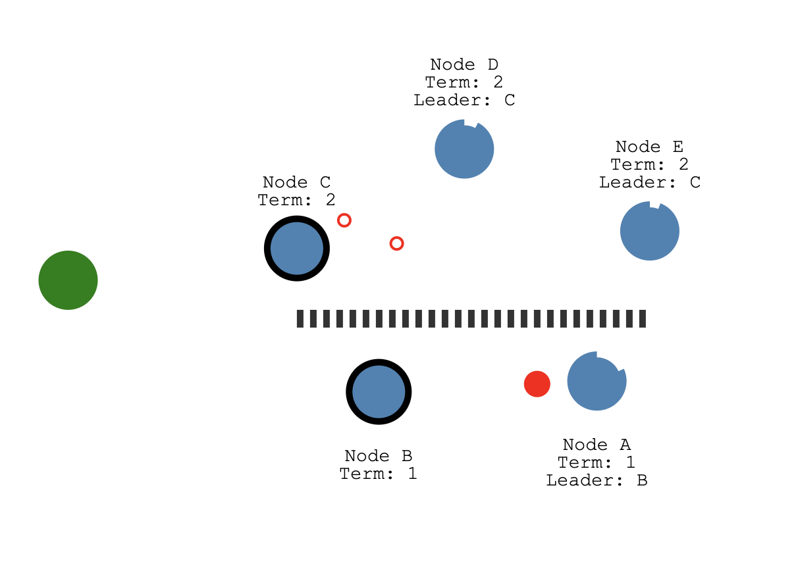

我们看到上图中的场景，一个五节点的系统被分成了两个区，C,D,E 为一个区，A,B 为一个区。这时候两个分区中都选出了各自的 Leader，但是注意 B 是任期 1 的 Leader，C 是任期 2 Leader。大家可能会有疑问为什么一定有一个任期更高的 Leader，这其实也是多数派选举决定的，分区后，肯定会出现一个多数节点所在的分区，如果这个分区还没有 Leader, 那么肯定会触发选举。

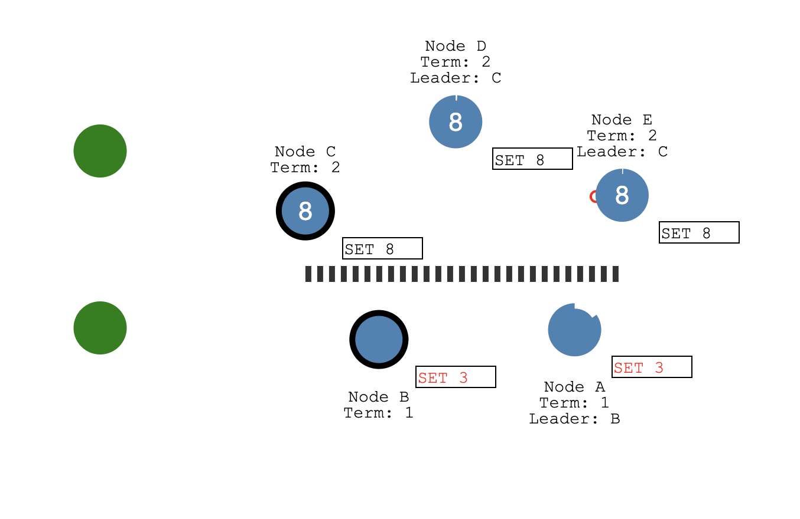

之后如下图所示，C,D,E 所在分区被写入了 SET 8 的操作，由于 C,D,E 有三个节点，超过 5 个节点的半数以上，所以 SET 8 这个操作被提交了。然后 A,B 分区被写入 SET 3 操作，但是由于它们是少数派，只有两个节点，所以 SET 3 这个操作写入它们的日志之后并不能被提交。

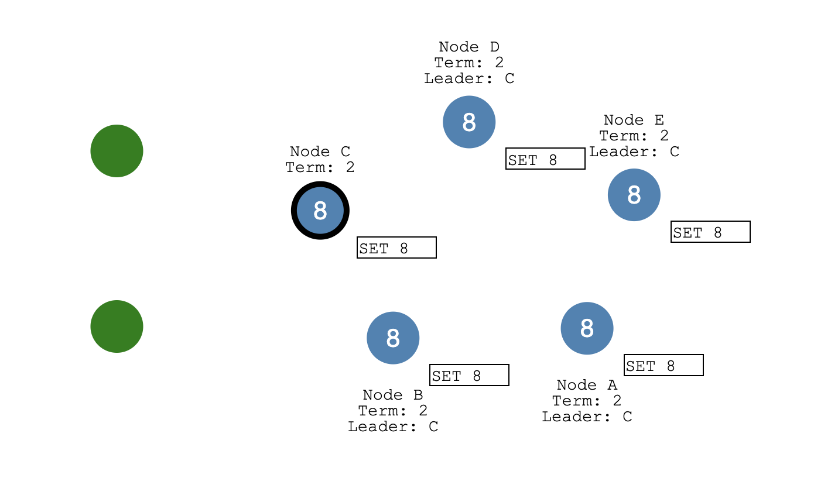

最后网络恢复了，B,A 收到来自 C 的更高任期的心跳会秒变 Follower 并且会将之前没有提交的日志擦除，将 Leader C 发过来的新日志（带有 SET 8 操作）写到自己的日志中，这样整个系统仍然是一致的。
