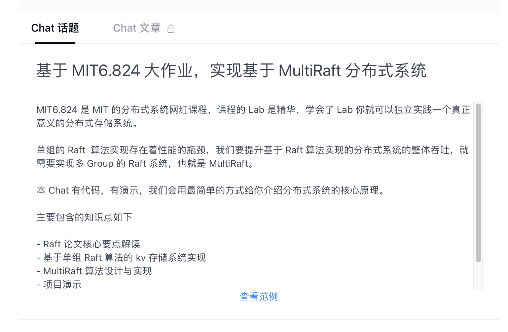

### Multi-Raft 设计与实现

#### 设计思考

#### 配置服务的实现分析

#### 数据分片服务器实现分析

#### 客户端实现分析

#### 线性一致性介绍

#### 客户端实现分析

我们后续会将更新发不到 gitbook 上，整理这本书耗费了我们大量的时间和精力。故上述章节尚未开放，一瓶矿泉水的价格支持我们继续输出优质的分布式存储知识体系，2.99¥，感谢大家的支持。

见我们 gitbook eraft 主页 [https://gitbook.cn/gitchat/author/5d7fad728aef5b7c8fd126a3](https://gitbook.cn/gitchat/author/5d7fad728aef5b7c8fd126a3)

文章审核通过之后我们会发布我们的主页，欢迎大家订阅。
