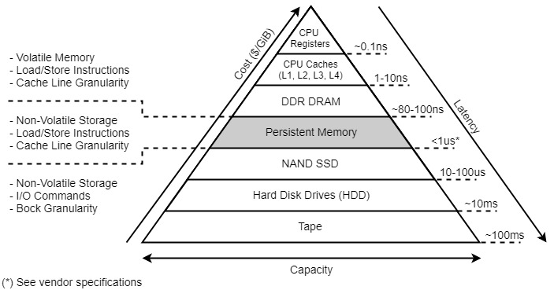
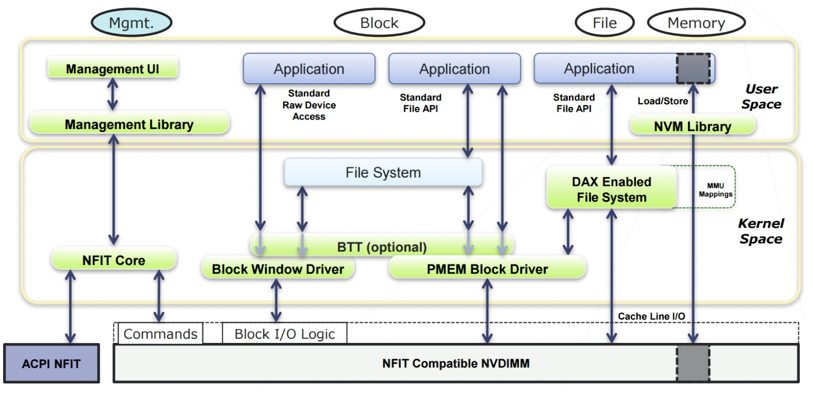
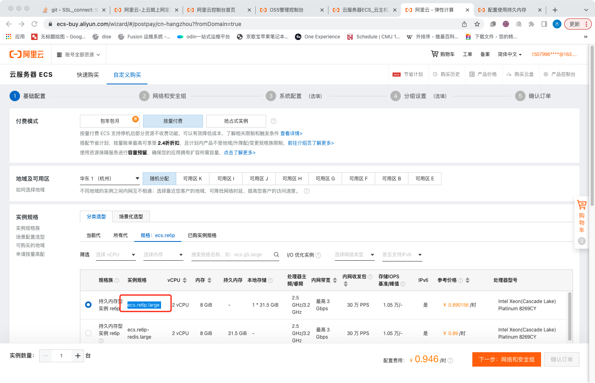
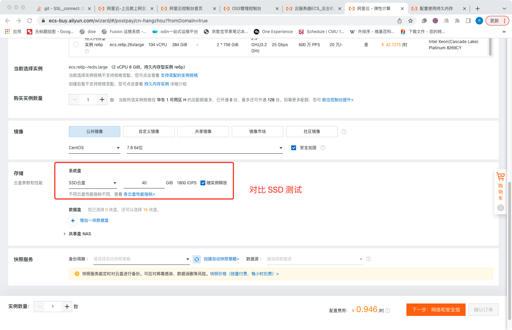
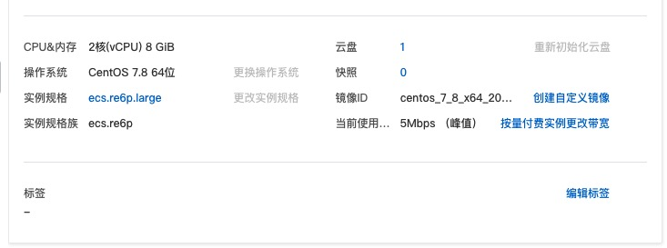
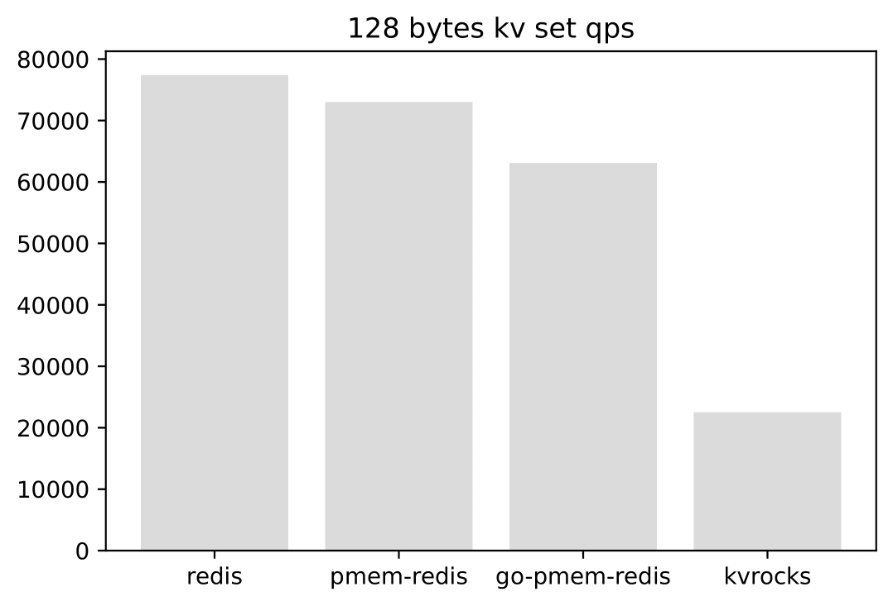
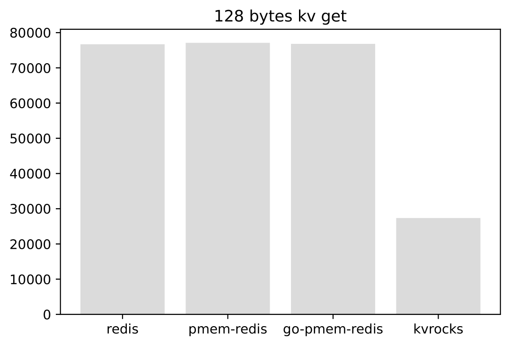
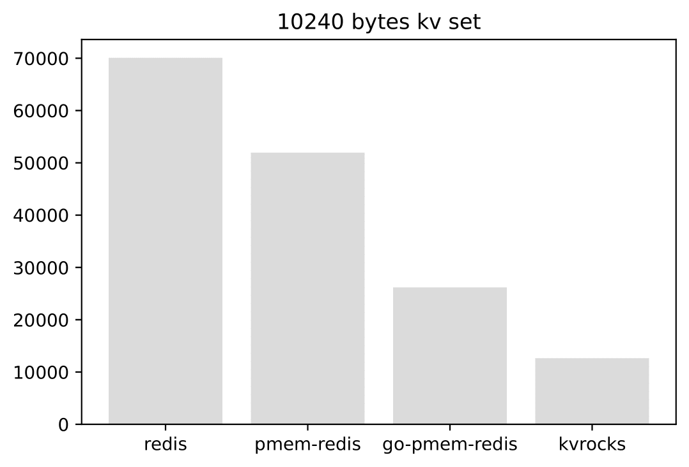
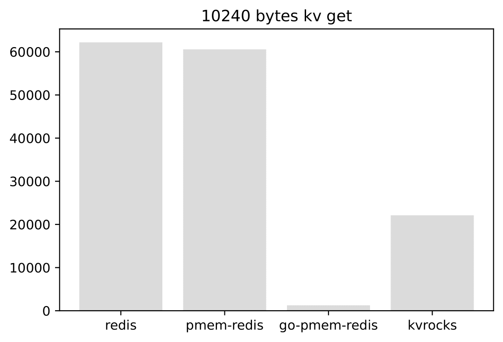

### Multi-Raft 设计与实现

#### 设计思考

在上一章中，我们应用 Raft 实现了一个单分组的 Raft KV 集群。客户端写请求到 Leader，Leader 把操作复制到 Follower 节点。当 Leader 挂了，会按我们第四章描述的 Raft 算法库，进行一轮新的选举，选出新的 Leader 后继续提供服务。这样我们就有了一个高可用的集群。

我们通过单分组的 KV 集群实现了高可用，以及分区容忍性，但是分布式系统还有一个可扩展的特性，也就是我们可以通过堆机器的方式来让系统实现更高的吞吐量。我们第五章实现的是单分组集群，只有单个 Leader 节点承担客户端的写入。单分组集群系统的吞吐量上线取决于单机的性能。那么我们该如何实现分布式可扩展性呢？

接下来我们将介绍 Multi-Raft 实现，它可以解决单分组集群的可扩展性问题。它的思路是这样的：既然单组有上限，那么我们可不可以用多组 Raft KV 集群来实现扩展呢？我们需要有一个配置中心来管理多个分组服务器的地址信息。有了多个分组之后，我们就要考虑怎么样把用户的请求均衡地分发到相应的分组服务器上了。我们可以使用哈希算法来解决这个问题，对用户的 key 做哈希计算，然后映射到不同的服务分组上，这样可以保证流量的均衡。

整合一下上面的思路，我们可以得到如下的系统架构图 a：


在第一章开篇，我们介绍了系统的整体架构并且带大家体验了系统的运行。之后，我们讲解了Go语言的基础知识、Raft 算法库以及应用 Raft 算法库的示例。相信大家现在对这个系统已经有了一个更加深入的理解。

首先，客户端启动之后，会从配置服务器（ConfigServer）拉取集群的分组信息，以及分组负责的数据桶（Bucket）信息到本地。客户端发送请求的时候会计算 key 的哈希值，找到相应的桶以及负责这个桶的服务器分组（ShardServer）地址信息，然后将操作发送到对应的服务器分组进行处理。这里 ConfigServer 服务器分组和 ShardServer 服务器分组都是高可用的，多个 ShardServer 实现了系统的可扩展性。

#### 配置服务器实现分析

配置服务的实现在 eraft/configserver 目录下。根据上面的架构图，我们大概可以知道配置服务器需要存储哪些信息：（1）每个服务分组的服务器地址信息；（2）服务分组负责的数据桶信息。这个结构定义如下：

```

type Config struct {
	Version int
	Buckets [common.NBuckets]int
	Groups  map[int][]string
}
```

Version 表示当前配置的版本号。Buckets 存储了分组负责的桶信息。NBuckets 是一个常量，表示系统中最大的桶数量。这里我们默认是 10。对于大规模的分布式系统， Buckets 值可以被设置为很大。

我们看到下面的配置示例：配置版本号为 6 ，10 个桶和1个分组服务。

我们设置 127.0.0.1:6088，127.0.0.1:6089，127.0.0.1:6090 这三台服务器组成分组 1。Buckets 数组中 0-4 号桶都是分组 1 负责的。5-9 号桶为 0，表示当前没有分组负责这些桶的数据写入。

```

{"Version":6,"Buckets":[1,1,1,1,1,0,0,0,0,0],"Groups":{"1":["127.0.0.1:6088","127.0.0.1:6089","127.0.0.1:6090"]}}

```

eraft 中把上述配置信息存储到了 leveldb 中。下面是几个操作的接口，Join 操作 是把一个分组的服务器加入到集群配置中；Leave 操作是删除某些分组的服务器配置信息；Move 操作是将某个桶分配给相应的分组负责；Query 操作是查询配置信息。这些操作是通过修改 Config 这个结构，并将数据持久化到 leveldb 中实现。操作的代码实现逻辑在 eraft/configserver/config_stm.go 
里面。

```

type ConfigStm interface {
	Join(groups map[int][]string) error
	Leave(gids []int) error
	Move(bucket_id, gid int) error
	Query(num int) (Config, error)
}
```

配置服务器的核心逻辑在 config\_server.go 里面，可以看到和我们第四章实现的单分组 kv 极其类似。这里只是把 Put, Get 操作给改成了对配置的 Join、Leave、Move、Query 操作。
每一次操作都经过一次共识，保证三个服务节点都有一致的配置。这样 Leader 配置节点挂掉后，集群中仍然可以从新的 Leader 配置服务器中获取配置信息。

#### 分片服务器实现分析
首先，我们看到 bucket 定义如下：

```
// a bucket is a logical partition in a distributed system
//  it has a unique id, a pointer to db engine, and status
//
type Bucket struct {
	ID     int
	KvDB   storage_eng.KvStore
	Status buketStatus
}

```


桶具有一个唯一标识的 ID。 前面我们介绍配置服务器的时，介绍过一个服务分组负责一部分桶的数据。在配置服务器中，1·桶关联的 ID 值就是配置数组的索引号。
同时，桶还关联了一个 KvStore 的接口。我们写数据的时候会传入当前服务器持有的数据存储引擎，下面是对桶中数据的操作，有 Get, Put, Append。

```
//
// get encode key data from engine
//
func (bu *Bucket) Get(key string) (string, error) {
	encodeKey := strconv.Itoa(bu.ID) + SPLIT + key
	v, err := bu.KvDB.Get(encodeKey)
	if err != nil {
		return "", err
	}
	return v, nil
}

//
// put key, value data to db engine
//
func (bu *Bucket) Put(key, value string) error {
	encodeKey := strconv.Itoa(bu.ID) + SPLIT + key
	return bu.KvDB.Put(encodeKey, value)
}

//
// appned data  to engine
//
func (bu *Bucket) Append(key, value string) error {
	oldV, err := bu.Get(key)
	if err != nil {
		return err
	}
	return bu.Put(key, oldV+value)
}

```

接下来我们来看看 ShardServer 定义的结构体

```
type ShardKV struct {
	mu      sync.RWMutex
	dead    int32
	rf      *raftcore.Raft
	applyCh chan *pb.ApplyMsg
	gid_    int
	cvCli   *configserver.CfgCli

	lastApplied int
	lastConfig  configserver.Config
	curConfig   configserver.Config

	stm map[int]*Bucket

	dbEng storage_eng.KvStore

	notifyChans map[int]chan *pb.CommandResponse

	stopApplyCh chan interface{}

	pb.UnimplementedRaftServiceServer
}
```


这个结构和我们应用 Raft 实现单组 KvServer 的结构特别类似。这里的状态机是 map[int]*Bucket 类型的，代表当前服务器的桶的数据。分片服务器需要和配置服务器交互，知道自己负责哪些分片的数据。cvCli 定义了到配置服务器的客户端。lastConfig，curConfig 分别记录了上一个版本以及当前版本的集群配置表。服务器知道这个表之后就知道自己负责哪些分片的数据。当集群拓扑变更后，配置表会变化，分片服务器能第一时间感知到变化，并且应用新的配置表。其他结构就和我们之前介绍单组 KvServer 一样了。

我们看看 ShardServer 构造流程和单组 KvServer 的区别。首先， Server 启动的时候我们初始化了两个引擎，一个用来存储 Raft 日志的 logDbEng，另一个用来存储实际数据的 newdbEng。cvCli 是到配置服务器分组的连接客户。，我们调用 MakeCfgSvrClient 构造到配置服务器的客户端，传入配置服务器分组的地址列表。

```
//
// MakeShardKVServer make a new shard kv server
// peerMaps: init peer map in the raft group
// nodeId: the peer's nodeId in the raft group
// gid: the node's raft group id
// configServerAddr: config server addr (leader addr, need to optimized into config server peer map)
//
func MakeShardKVServer(peerMaps map[int]string, nodeId int, gid int, configServerAddrs string) *ShardKV {
    ...

	logDbEng := storage_eng.EngineFactory("leveldb", "./log_data/shard_svr/group_"+strconv.Itoa(gid)+"/node_"+strconv.Itoa(nodeId))
	newRf := raftcore.MakeRaft(clientEnds, nodeId, logDbEng, newApplyCh, 500, 1500)
	newdbEng := storage_eng.EngineFactory("leveldb", "./data/group_"+strconv.Itoa(gid)+"/node_"+strconv.Itoa(nodeId))

	shardKv := &ShardKV{
        ...
		cvCli:       configserver.MakeCfgSvrClient(common.UN_UNSED_TID, strings.Split(configServerAddrs, ",")),
		lastApplied: 0,
		curConfig:   configserver.DefaultConfig(),
		lastConfig:  configserver.DefaultConfig(),
		stm:         make(map[int]*Bucket),
		...
	}

	shardKv.initStm(shardKv.dbEng)

	shardKv.curConfig = *shardKv.cvCli.Query(-1)
	shardKv.lastConfig = *shardKv.cvCli.Query(-1)
    ...

	go shardKv.ConfigAction()

	return shardKv
}
```

我们 initStm 函数初始化了状态机里面的每个 Bucket。之后，调用 cvCli.Query(-1) 查询当前最新的配置缓存到本地的 curConfig，lastConfig，初始启动，这两个配置是一样的。

这里有一个执行任务为 ConfigAction 的 Goruntine，我们来看看它干了啥。
核心逻辑如下，下面的逻辑是一个循环执行的，时间间隔是 1s。
首先我们通过 cvCli.Query 尝试查询下一个配置版本信息，如果当前集群没有配置变更，返回 nil，我们 
continue 进入下一轮循环，啥也不干。

如果有新的配置变更，比如加入了新的服务器分组，我们就会对比新的配置和当前配置的版本信息。如果匹配上，当前节点作为 Leader 需要把这个配置变化信息发送到这个服务器分组，让大家都知道新的配置变化。分组服务里面的每个服务器配置都要是一致的，这里我们通过 Propose 提交一个 OpType\_OpConfigChange 的提案。

```
if _, isLeader := s.rf.GetState(); isLeader {
...
	nextConfig := s.cvCli.Query(int64(curConfVersion) + 1)
	if nextConfig == nil {
		continue
	}
	nextCfBytes, _ := json.Marshal(nextConfig)
	curCfBytes, _ := json.Marshal(s.curConfig)
	raftcore.PrintDebugLog("next config -> " + string(nextCfBytes))
	raftcore.PrintDebugLog("cur config -> " + string(curCfBytes))
	if nextConfig.Version == curConfVersion+1 {
		req := &pb.CommandRequest{}
		nextCfBytes, _ := json.Marshal(nextConfig)
		raftcore.PrintDebugLog("can perform next conf -> " + string(nextCfBytes))
		req.Context = nextCfBytes
		req.OpType = pb.OpType_OpConfigChange
		reqBytes, _ := json.Marshal(req)
		idx, _, isLeader := s.rf.Propose(reqBytes)
		if !isLeader {
			return
		}
		
		...
	}
}
```


最后我们看看分组中的服务器是怎么 Apply 这个日志的

```

nextConfig := &configserver.Config{}
json.Unmarshal(req.Context, nextConfig)
if nextConfig.Version == s.curConfig.Version+1 {
    ...
	s.lastConfig = s.curConfig
	s.curConfig = *nextConfig
	cfBytes, _ := json.Marshal(s.curConfig)
	raftcore.PrintDebugLog("applied config to server -> " + string(cfBytes))
}
				
```

我们会更新 Server 的 lastConfig 和 curConfig 配置信息。

#### 客户端实现分析

当客户端写入一个 Key 到系统中时，我们首先需要知道 Key 属于那个分组服务器负责。在构造客户端的时候，我们会先将最新的配置信息缓存到本地。

```

// make a kv cilent
//
func MakeKvClient(csAddrs string) *KvClient {
	...
	kvCli.config = kvCli.csCli.Query(-1)
	return kvCli
}
```

客户端中我们提供了  Get(key string) 和 Put(key, value string) 的接口，它们都是调用公用的 Command  方法去访问我们的分组服务器。

```
//
// Command
// do user normal command
//
func (kvCli *KvClient) Command(req *pb.CommandRequest) (string, error) {
	bucket_id := common.Key2BucketID(req.Key)
	gid := kvCli.config.Buckets[bucket_id]
	if gid == 0 {
		return "", errors.New("there is no shard in charge of this bucket, please join the server group before")
	}
	if servers, ok := kvCli.config.Groups[gid]; ok {
		for _, svrAddr := range servers {
			if kvCli.GetConnFromCache(svrAddr) == nil {
				kvCli.rpcCli = raftcore.MakeRaftClientEnd(svrAddr, common.UN_UNSED_TID)
			} else {
				kvCli.rpcCli = kvCli.GetConnFromCache(svrAddr)
			}
			resp, err := (*kvCli.rpcCli.GetRaftServiceCli()).DoCommand(context.Background(), req)
			if err != nil {
				// node down
				raftcore.PrintDebugLog("there is a node down is cluster, but we can continue with outher node")
				continue
			}
			switch resp.ErrCode {
			case common.ErrCodeNoErr:
				kvCli.commandId++
				return resp.Value, nil
			case common.ErrCodeWrongGroup:
				kvCli.config = kvCli.csCli.Query(-1)
				return "", errors.New("WrongGroup")
			case common.ErrCodeWrongLeader:
				kvCli.rpcCli = raftcore.MakeRaftClientEnd(servers[resp.LeaderId], common.UN_UNSED_TID)
				resp, err := (*kvCli.rpcCli.GetRaftServiceCli()).DoCommand(context.Background(), req)
				if err != nil {
					fmt.Printf("err %s", err.Error())
					panic(err)
				}
				if resp.ErrCode == common.ErrCodeNoErr {
					kvCli.commandId++
					return resp.Value, nil
				}
			default:
				return "", errors.New("unknow code")
			}
		}
	} else {
		return "", errors.New("please join the server group first")
	}
	return "", errors.New("unknow code")
}
```


1. 首先我们会使用 Key2BucketID 函数对 Key 做 CRC32 运算，得到它应该被分配到桶的 ID；

2. 然后
从本地缓存的  kvCli.config 配置里面找到负责这个 bucket id 数据的服务器分组；
3. 拿到服务器分组之后，我们会向第一个服务器发送 DoCommand RPC；

4. 如果这个服务器不是 Leader，它会返回 Leader 的 ID。然后客户端会重新发 DoCommand RPC 给 Leader 节点。

#### 用新硬件加速持久化存储

\subsubsection{持久内存介绍}
Non-volatile memory (NVM) 是一种新型的计算机内存，它可以持久化的保存数据，保证断电重启后数据仍然存在，同时性能能媲美通用 DRAM 内存。



上图是持久化内存在当前分层存储体系的位置。我们可以看到它的读写速度位于 DRAM 和 SSD 之间，而且它存储的数据是持久化的。Raft 中日志和状态都需要持久化存储，我们可以把它们存储到持久内存上，获得更高的性能。



上图是 Intel 傲腾持久化内存 (AEP) 架构

它主要有下面两种工作模式：

1. Memory Mode：在这种模式下，DRAM+AEP一起呈现为大容量内存。总容量为AEP的容量。DRAM被用作cache，对系统不可见。注意这种模式下内存是非持久性的，即断电后内容就丢失。

2. App Direct模式：在这种模式下，AEP呈现为pmem持久性内存设备（/dev/pmem）。系统看到的内存是DRAM，应用通过操作pmem设备来读写AEP。目前主流的文件系统ext4, xfs 都支持Direct Access的选项（-o dax)。 当挂载完并且映射完地址空间后，读写就通过Load/Store的内存指令来进行，绕过了传统的文件系统或者块设备访问路径。

###### 试用持久内存设备

https://ecs-buy.aliyun.com/wizard/#/prepay/cn-hangzhou?fromDomain=true

目前阿里云上有按时租用的实例，可以申请 ECS 的时候规格选择 ecs.re6p.large



我们给 ECS 选上 SSD 云盘，用来给 KvRocks 做存储盘，对照性能。




配置持久化内存

我们这里将持久内存配置为一块本地盘

安装持久内存管理工具并将使用模式配置为fsdax。

```
yum install -y ndctl daxctl && \
ndctl create-namespace -f -e namespace0.0 --mode=fsdax
```

格式化并挂载磁盘。

```
mkfs -t ext4 /dev/pmem0 && \
mkdir /mnt/sdb && \
mount -o dax,noatime /dev/pmem0 /mnt/sdb
```

查看已挂载的磁盘。

```
df -h
```

测试的库

go-redis-pmem - Golang - 持久化内存 30GiB

pmem-redis - C - 持久化内存 30GiB

kvrocks - C++ - SSD云盘 40GiB (3000 IOPS) 

redis - C - 8GiB 内存

测试环境




测试命令

测试 GET，SET 不用 SIZE 的 key 的 qps, -d 参数设置测试 k,v 大小，单位为 bytes

```
[root@iZbp1gqpip163xihy2oh56Z ~]# redis-benchmark -t set,get -d 128 -n 100000

[root@iZbp1gqpip163xihy2oh56Z ~]# redis-benchmark -t set,get -d 512 -n 100000

[root@iZbp1gqpip163xihy2oh56Z ~]# redis-benchmark -t set,get -d 1024 -n 100000

[root@iZbp1gqpip163xihy2oh56Z ~]# redis-benchmark -t set,get -d 4096 -n 100000

[root@iZbp1gqpip163xihy2oh56Z ~]# redis-benchmark -t set,get -d 8192 -n 100000

[root@iZbp1gqpip163xihy2oh56Z ~]# redis-benchmark -t set,get -d 10240 -n 100000
```


测试结果

128 bytes kv set



128 bytes kv get



10240 bytes kv set



10240 bytes kv get




#### 捐赠

整理这本书耗费了我们大量的时间和精力。如果你觉得有帮助，一瓶矿泉水的价格支持我们继续输出优质的分布式存储知识体系，2.99¥，感谢大家的支持。


