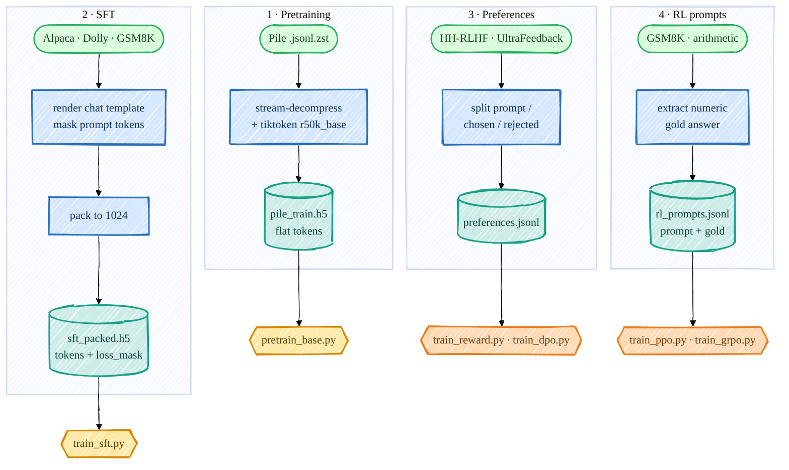
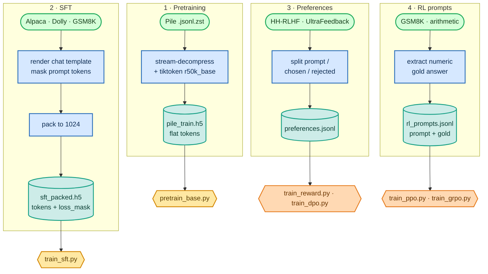

<!-- omit in toc -->
# Data Handling & Preprocessing

Every stage needs data in a different shape, and getting these shapes right is honestly half the
battle — a misaligned loss mask or a mis-parsed gold answer will silently wreck training. So before
any model code, here is exactly how I download and preprocess each dataset, and the format each
trainer expects.

For the first-principles background behind these shapes, read
[Tokenization & Data Shapes](foundations/tokenization.md). That page explains why pretraining uses
flat token streams, why SFT needs `loss_mask`, and why preference data must preserve a shared prompt.

There are **four** data pipelines, all feeding off real public datasets:



<details>
<summary>Mermaid source (live, editable)</summary>



</details>

Everything lands on the big `/ephemeral` disk and uses the OpenAI **`r50k_base`** tokenizer
(`vocab_size = 50304`, the only special token is `<|endoftext|>` = id `50256`).

## 1 · Pretraining data (Pile → flat-token HDF5)

[`scripts/prepare_pretrain_data.py`](https://github.com/FareedKhan-dev/train-llm-from-scratch/blob/main/scripts/prepare_pretrain_data.py) streams the compressed
Pile shards, batch-tokenizes with tiktoken, and writes one flat `int32` token array to HDF5 (far
faster than the original per-document resize). Each document is terminated with `<|endoftext|>`:

```python
for ids in enc.encode_ordinary_batch(docs):
    buf.extend(ids)
    buf.append(EOT_ID)          # 50256 separates documents
    if len(buf) >= WRITE_CHUNK:
        flush()                 # append ~8M tokens to the HDF5 dataset at once
```

```bash
PYTHONPATH=. python scripts/prepare_pretrain_data.py --split val   --out /ephemeral/data/pile_dev.h5
PYTHONPATH=. python scripts/prepare_pretrain_data.py --split train --num_shards 1 --out /ephemeral/data/pile_train.h5
```

The base [`get_batch_iterator`](https://github.com/FareedKhan-dev/train-llm-from-scratch/blob/main/data_loader/data_loader.py) then slices random
`context_length + 1` windows out of this flat array for next-token training.

## 2 · SFT data (instructions → packed tokens **+ loss mask**)

This is the subtle one. We only want to train the model to produce the **assistant** tokens, not to
parrot the prompt. The chat format ([`chat_template.py`](https://github.com/FareedKhan-dev/train-llm-from-scratch/blob/main/src/post_training/chat_template.py)) uses
plain-text role markers (since `r50k_base` has no spare special tokens) and `<|endoftext|>` as the
turn terminator:

```
<|user|>
{question}<|endoftext|><|assistant|>
{answer}<|endoftext|>
```

[`encode_chat`](https://github.com/FareedKhan-dev/train-llm-from-scratch/blob/main/src/post_training/chat_template.py#L95) builds the token ids **and** an aligned
`loss_mask` that is `1` only over the assistant completion (and its terminating EOT):

```python
content_ids = _encode_ordinary(m["content"])
is_completion = role == "assistant"
ids.extend(content_ids)
mask.extend([1 if is_completion else 0] * len(content_ids))   # train ONLY assistant tokens
ids.append(EOT_ID)
mask.append(1 if is_completion else 0)                        # ...and teach it to stop
```

[`prepare_sft_data.py`](https://github.com/FareedKhan-dev/train-llm-from-scratch/blob/main/scripts/prepare_sft_data.py) renders Alpaca + Dolly + GSM8K through this,
reformatting GSM8K into the `<think>…</think><answer>N</answer>` structure (so the model learns the
exact shape the RL verifier later rewards), then [`pack_examples`](https://github.com/FareedKhan-dev/train-llm-from-scratch/blob/main/src/post_training/sft.py#L41)
concatenates everything and slices it into fixed `1024`-token rows, writing two aligned HDF5 datasets,
`tokens` and `loss_mask`.

```bash
PYTHONPATH=. python scripts/prepare_sft_data.py --context_length 1024 --out_dir /ephemeral/data
```

I verified on the real file that the mask covers exactly `<answer>4</answer>` and excludes the user
question — that alignment is what makes SFT work.

## 3 · Preference data (→ `{prompt, chosen, rejected}` JSONL)

[`prepare_preference_data.py`](https://github.com/FareedKhan-dev/train-llm-from-scratch/blob/main/scripts/prepare_preference_data.py) pulls **Anthropic/hh-rlhf** and
**HuggingFaceH4/ultrafeedback_binarized** and normalizes both to one schema. For HH-RLHF I split each
dialogue at the last `Assistant:` turn so the chosen/rejected share a prompt and differ only in the
final response:

```python
def _split_hh(text):
    idx = text.rfind("\n\nAssistant:")
    return text[:idx].strip(), text[idx + len("\n\nAssistant:"):].strip()
```

Output is `preferences.jsonl` (train) + `preferences_test.jsonl` (held-out, for measuring reward-model
accuracy). [`preference_dataset.py`](https://github.com/FareedKhan-dev/train-llm-from-scratch/blob/main/data_loader/preference_dataset.py) tokenizes each side through
the same chat template and right-pads a batch — which is safe because the model's attention is
**causal**, so the last real token never attends to padding after it (no attention mask needed).

```bash
PYTHONPATH=. python scripts/prepare_preference_data.py --source both --max_per_source 40000
```

## 4 · RL prompt data (→ `{prompt, gold}` JSONL)

[`prepare_rl_prompts.py`](https://github.com/FareedKhan-dev/train-llm-from-scratch/blob/main/scripts/prepare_rl_prompts.py) turns GSM8K into prompts with a **verifiable
numeric gold answer** (parsed from the dataset's `#### N`), plus a programmatic **arithmetic curriculum**
that even a weak policy can partly solve — so RL has non-zero reward signal to bootstrap from:

```python
gold = gsm8k_gold_answer(ex["answer"])           # the number after '####'
rows.append({"prompt": ex["question"].strip(), "gold": gold})
```

```bash
PYTHONPATH=. python scripts/prepare_rl_prompts.py --out_dir /ephemeral/data
```

I cross-checked the emitted gold answers 50/50 against the live GSM8K dataset — they match exactly,
which matters because the verifier reward ([08_evaluation.md](08_evaluation.md)) is only as trustworthy
as the gold it compares against.

## What you end up with

| File | Shape | Used by |
|---|---|---|
| `pile_train.h5` / `pile_dev.h5` | flat `int32` tokens | pretraining |
| `sft_packed.h5` | `tokens` + `loss_mask`, `(N, 1024)` | SFT |
| `preferences.jsonl` (+ `_test`) | `{prompt, chosen, rejected}` | Reward Model, DPO |
| `rl_prompts_train.jsonl` / `_test` | `{prompt, gold}` | PPO, GRPO |
| `arithmetic_prompts.jsonl` | `{prompt, gold}` | GRPO curriculum warm-up |
<br>

➡️ Next: [Stage 1 — Pretraining](02_pretraining.md).
