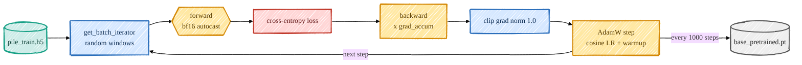

<!-- omit in toc -->
# Stage 1 — Pretraining the base model

Everything downstream is only as good as the base model, so the first thing I do is pretrain a
**~400M-parameter** version of this repo's own `Transformer` from scratch on the Pile. The original
[`train_transformer.py`](https://github.com/FareedKhan-dev/train-llm-from-scratch/blob/main/scripts/train_transformer.py) is a clean single-GPU loop; for a mid-size
model on 2×H100 I wrote [`pretrain_base.py`](https://github.com/FareedKhan-dev/train-llm-from-scratch/blob/main/scripts/pretrain_base.py), which adds the few things
that actually matter at this scale — DistributedDataParallel, bf16 autocast, gradient accumulation, a
cosine LR schedule with warmup, and periodic checkpointing — without touching the model itself.

If the architecture or training terms are unfamiliar, read the foundations chapters first:
[Decoder-Only Transformer](foundations/transformer.md),
[Attention, Masks & Heads](foundations/attention.md),
[Objectives, Losses & Perplexity](foundations/objectives.md), and
[Optimization & Training Systems](foundations/optimization.md).

```mermaid
flowchart LR
    H[(pile_train.h5)]:::store --> IT[get_batch_iterator<br/>random windows]:::proc
    IT --> FWD{{forward<br/>bf16 autocast}}:::model
    FWD --> L[cross-entropy loss]:::loss
    L --> BWD[backward<br/>x grad_accum]:::model
    BWD --> CL[clip grad norm 1.0]:::proc
    CL --> ST[AdamW step<br/>cosine LR + warmup]:::model
    ST -->|every 1000 steps| CK[(base_pretrained.pt)]:::ckpt
    ST -->|next step| IT
    classDef store fill:#cdece8,stroke:#16a085,stroke-width:2px,color:#0a3d33;
    classDef proc fill:#d6e8ff,stroke:#2c6fbb,stroke-width:2px,color:#0d2c52;
    classDef model fill:#ffe8a3,stroke:#d48806,stroke-width:2px,color:#5a3d00;
    classDef loss fill:#ffd6d6,stroke:#c0392b,stroke-width:2px,color:#5c1212;
    classDef ckpt fill:#eeeeee,stroke:#555,stroke-width:2px,color:#222;
```



<details>
<summary>Mermaid source (live, editable)</summary>



</details>

## The model

The base config lives in [`config/post_training_config.py`](https://github.com/FareedKhan-dev/train-llm-from-scratch/blob/main/config/post_training_config.py)
(`BaseModelConfig`): `n_embed=1024, n_head=16, n_blocks=24, context_length=1024` → ~406M params. The
context length is bumped to 1024 (vs the original 512) so GSM8K reasoning chains fit later.

## The training step

The heart of [`pretrain_base.py`](https://github.com/FareedKhan-dev/train-llm-from-scratch/blob/main/scripts/pretrain_base.py) is a gradient-accumulation loop under
bf16 autocast, syncing gradients across GPUs only on the last micro-step:

```python
for micro in range(cfg.grad_accum):
    xb, yb = next(batch_iter)
    sync = (micro == cfg.grad_accum - 1) or not ctx.enabled
    cm = model.no_sync() if (ctx.enabled and not sync) else _nullcm()
    with cm, amp_autocast(cfg.amp_dtype, ctx.device):   # bf16 on H100, no GradScaler needed
        _, loss = model(xb, yb)
        loss = loss / cfg.grad_accum
    loss.backward()

torch.nn.utils.clip_grad_norm_(model.parameters(), cfg.grad_clip)   # stability
optimizer.step()
```

A few choices worth calling out:
- **bf16 autocast** ([`amp_autocast`](https://github.com/FareedKhan-dev/train-llm-from-scratch/blob/main/src/post_training/utils.py)) needs no `GradScaler` (unlike
  fp16), which keeps the loop clean. Master weights stay fp32.
- **AdamW with a weight-decay split** ([`configure_optimizer`](https://github.com/FareedKhan-dev/train-llm-from-scratch/blob/main/src/post_training/optim.py)) — decay
  the 2-D weight matrices, never the biases / norms / embeddings (the standard GPT recipe).
- **Cosine LR with warmup** ([`cosine_lr`](https://github.com/FareedKhan-dev/train-llm-from-scratch/blob/main/src/post_training/optim.py)) — linear ramp for
  `warmup_steps`, then cosine decay to `min_lr`.
- **DDP** ([`distributed.py`](https://github.com/FareedKhan-dev/train-llm-from-scratch/blob/main/src/post_training/distributed.py)) — each rank seeds its data shuffle
  differently so the two GPUs see different windows; only rank 0 logs and checkpoints.

## Run it

```bash
# single GPU
PYTHONPATH=. python scripts/pretrain_base.py
# both H100s (effective batch = batch_size * grad_accum * num_gpus)
PYTORCH_CUDA_ALLOC_CONF=expandable_segments:True PYTHONPATH=. \
  torchrun --standalone --nproc_per_node=2 scripts/pretrain_base.py \
  --batch_size 8 --grad_accum 12 --train_steps 50000
```

> **Why `batch_size 8`?** The repo's educational attention materializes a `(B, n_head, T, T)` tensor
> per block, so memory is dominated by the sequence-length term. At context 1024, batch 8 fits an 80GB
> H100 comfortably under DDP; we recover the effective batch with `grad_accum`.

## What the numbers mean

- **train_loss** — running cross-entropy; starts near `ln(vocab) ≈ 10.8` and should fall steadily
  (mine went `11.06 → 8.6 → 6.0 → …`). This is the single best health signal.
- **tok/s** — throughput (~32k/s combined on 2×H100 here).
- **eval train/dev** — averaged loss on held-out windows, printed every `eval_steps`; watch the dev
  loss to spot overfitting.

Checkpoints are written to `/ephemeral/ckpts/base_pretrained.pt` every `save_every` steps and carry the
config, so every later stage can rebuild the exact model with [`load_backbone_from_ckpt`](https://github.com/FareedKhan-dev/train-llm-from-scratch/blob/main/src/post_training/utils.py).

➡️ Next: [Stage 2 — SFT](03_sft.md).
