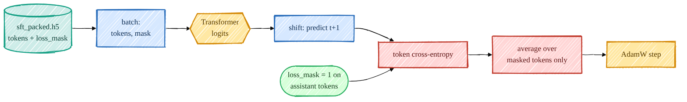
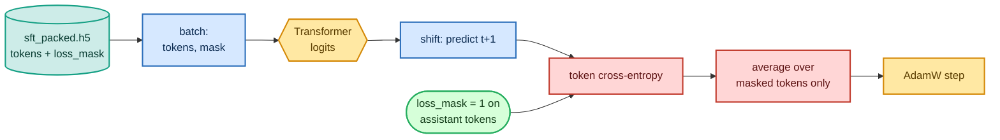

<!-- omit in toc -->
# Stage 2 — Supervised Fine-Tuning (SFT)

The base model can continue text but it doesn't know it's supposed to *answer* you. SFT fixes that by
showing it thousands of `(instruction, response)` pairs and training it to produce the **response**.
The only real difference from pretraining is a per-token **loss mask**: we compute the loss on the
assistant tokens and ignore the prompt.

The exact token/mask mechanics are explained in
[Tokenization & Data Shapes](foundations/tokenization.md), and the masked objective is derived in
[Objectives, Losses & Perplexity](foundations/objectives.md).



<details>
<summary>Mermaid source (live, editable)</summary>



</details>

## The masked loss

The whole stage hinges on [`sft_loss`](https://github.com/FareedKhan-dev/train-llm-from-scratch/blob/main/src/post_training/sft.py#L18). It's ordinary next-token
cross-entropy, except every target position is weighted by the mask so only completion tokens count:

```python
def sft_loss(logits, tokens, loss_mask):
    logits = logits[:, :-1, :]        # predict token t+1 from position t (same shift as pretraining)
    targets = tokens[:, 1:]
    mask = loss_mask[:, 1:].to(logits.dtype)
    V = logits.size(-1)
    ce = F.cross_entropy(logits.reshape(-1, V).float(), targets.reshape(-1).long(), reduction="none")
    ce = ce.view(targets.shape) * mask
    return ce.sum() / mask.sum().clamp(min=1.0)     # mean over ASSISTANT tokens only
```

The mask itself was produced at data-prep time by
[`encode_chat`](https://github.com/FareedKhan-dev/train-llm-from-scratch/blob/main/src/post_training/chat_template.py#L95) (see
[01_data_pipeline.md](01_data_pipeline.md)) and packed alongside the tokens. The `.float()` on the
logits keeps the cross-entropy numerically clean under bf16.

## The trainer

[`train_sft.py`](https://github.com/FareedKhan-dev/train-llm-from-scratch/blob/main/scripts/train_sft.py) loads the pretrained base with
[`load_backbone_from_ckpt`](https://github.com/FareedKhan-dev/train-llm-from-scratch/blob/main/src/post_training/utils.py), then runs a compact loop — autocast forward,
masked loss, clip, step, cosine LR — with periodic dev evaluation:

```python
tokens, mask, epoch = next(train_it)
with amp_autocast(cfg.amp_dtype, ctx.device):
    logits, _ = model(tokens)
    loss = sft_loss(logits, tokens, mask)
loss.backward()
torch.nn.utils.clip_grad_norm_(model.parameters(), cfg.grad_clip)
optimizer.step()
```

Batches come from [`get_sft_batch_iterator`](https://github.com/FareedKhan-dev/train-llm-from-scratch/blob/main/data_loader/sft_dataset.py), which shards the packed
rows across DDP ranks and yields `(tokens, loss_mask, epoch)`.

## Run it

```bash
PYTHONPATH=. python scripts/train_sft.py                                   # single GPU
PYTHONPATH=. torchrun --standalone --nproc_per_node=2 scripts/train_sft.py # both GPUs
# tune: --lr 1e-5 --epochs 3 --batch_size 16
```

## What the numbers mean

- **train_loss / ppl** — masked cross-entropy (and its perplexity) over assistant tokens; should drop
  well below the base model's loss. To sanity-check the mechanics I ran an *overfit* test on 8 rows and
  watched the loss collapse `11.0 → 4.7`, confirming the gradient path learns.
- **dev_loss** — the same masked loss on a held-out split (`sft_dev_packed.h5`); the honest signal.
- **GSM8K dev accuracy** — after SFT the model both follows instructions *and* emits the
  `<answer>…</answer>` format, so this should rise above the base model (see [08_evaluation.md](08_evaluation.md)).

The result is saved to `/ephemeral/ckpts/sft.pt` and becomes the starting point for the reward model,
DPO, PPO and GRPO.

➡️ Next: [Stage 3 — Reward Model](04_reward_model.md) or jump to [DPO](05_dpo.md).
