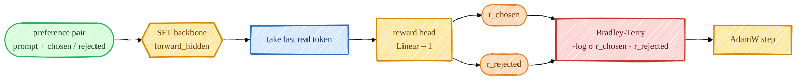
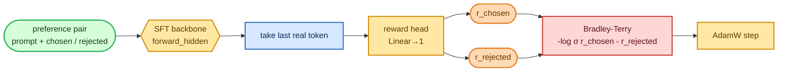

<!-- omit in toc -->
# Stage 3 — Reward Model

To do classic RLHF (PPO) we need something that scores a response with a single number: higher = more
preferred. That's the reward model. I build it by putting a tiny scalar head on top of the SFT
backbone and training it on human preference pairs with the **Bradley-Terry** loss — the same recipe
as InstructGPT.

This page assumes you already know how the backbone produces hidden states. If not, start with
[Decoder-Only Transformer](foundations/transformer.md). The preference-data shape is covered in
[Tokenization & Data Shapes](foundations/tokenization.md).



<details>
<summary>Mermaid source (live, editable)</summary>



</details>

## The model: a scalar head on the backbone

[`RewardModel`](https://github.com/FareedKhan-dev/train-llm-from-scratch/blob/main/src/post_training/reward_model.py#L37) wraps a `Transformer`, drops the `lm_head`,
and reads the reward off the **last real token's** hidden state (the InstructGPT convention). Because
attention is causal, that last token has seen the whole sequence and never attends to the right-padding
after it — so we need no attention mask:

```python
class RewardModel(nn.Module):
    def __init__(self, transformer):
        self.transformer = transformer
        self.reward_head = nn.Linear(transformer.lm_head.in_features, 1, bias=False)

    def forward(self, idx, seq_lengths=None):
        rewards = self.reward_head(self.transformer.forward_hidden(idx)).squeeze(-1)  # (B, T)
        return gather_last(rewards, seq_lengths)   # reward at the last real token -> (B,)
```

[`gather_last`](https://github.com/FareedKhan-dev/train-llm-from-scratch/blob/main/src/post_training/utils.py) just indexes `rewards[i, seq_lengths[i]-1]`.

## The objective: Bradley-Terry

[`bradley_terry_loss`](https://github.com/FareedKhan-dev/train-llm-from-scratch/blob/main/src/post_training/reward_train.py#L18) pushes the chosen reward above the
rejected one. That's the entire training signal:

```python
def bradley_terry_loss(chosen_rewards, rejected_rewards):
    return -F.logsigmoid(chosen_rewards - rejected_rewards).mean()
```

[`preference_accuracy`](https://github.com/FareedKhan-dev/train-llm-from-scratch/blob/main/src/post_training/reward_train.py#L23) — the fraction of pairs where
`r_chosen > r_rejected` — is the metric I actually watch.

## The trainer

[`train_reward.py`](https://github.com/FareedKhan-dev/train-llm-from-scratch/blob/main/scripts/train_reward.py) initializes the backbone from `sft.pt`, then for each
batch runs the **chosen and rejected sequences through the model in a single forward** (concatenated to
`2B`), splits the rewards, and applies the loss:

```python
ids  = torch.cat([batch["chosen_ids"], batch["rejected_ids"]], dim=0)
lens = torch.cat([batch["chosen_len"], batch["rejected_len"]], dim=0)
rewards = rm(ids, seq_lengths=lens).float()
chosen_r, rejected_r = rewards[:B], rewards[B:]
loss = bradley_terry_loss(chosen_r, rejected_r)
```

Pairs come from [`get_preference_iterator`](https://github.com/FareedKhan-dev/train-llm-from-scratch/blob/main/data_loader/preference_dataset.py), which right-pads each
batch (safe under causal attention) and tracks the true length of each side.

## Run it

```bash
PYTHONPATH=. python scripts/train_reward.py
PYTHONPATH=. torchrun --standalone --nproc_per_node=2 scripts/train_reward.py
# tune: --lr 1e-5 --max_len 768
```

## What the numbers mean

- **loss** — Bradley-Terry; starts at `-log σ(0) = 0.693` (chance) and drops as the gap widens.
- **train_acc / test_acc** — preference accuracy. On clean fixtures it goes to `1.0`; on **real, noisy**
  HH-RLHF / UltraFeedback expect roughly **0.65–0.75** — that's normal, human preferences are noisy.
- **margin** — mean `r_chosen − r_rejected`; a useful "is it still separating them" signal.

Saved to `/ephemeral/ckpts/reward.pt`; PPO loads it with
[`load_reward_model`](https://github.com/FareedKhan-dev/train-llm-from-scratch/blob/main/src/post_training/reward_model.py) when `--reward_source rm`.

➡️ Next: [Stage 5 — PPO](06_ppo.md) (which consumes this), or the RM-free path: [DPO](05_dpo.md).
