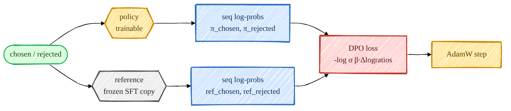
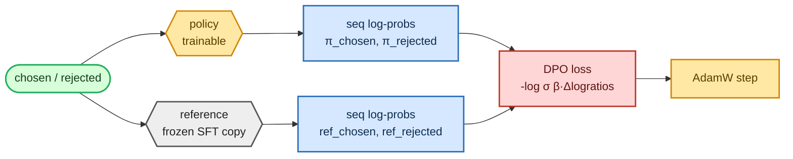

<!-- omit in toc -->
# Stage 4 — DPO (and ORPO / KTO)

Direct Preference Optimization is the shortcut around RLHF: instead of training a reward model and then
running an RL loop, DPO optimizes the policy *directly* on preference pairs, using a frozen copy of the
SFT model as a reference anchor. No reward model, no rollouts, no value function — just one clean loss.
I also implemented two popular variants behind a `--loss_type` flag: **ORPO** (reference-free) and
**KTO** (works from a desirable/undesirable signal).

For the sequence log-probability notation used here, see
[Objectives, Losses & Perplexity](foundations/objectives.md).



<details>
<summary>Mermaid source (live, editable)</summary>



</details>

## Sequence log-probs (the shared ingredient)

DPO compares how much *more* likely the policy makes the chosen response vs the rejected one, relative
to the reference. So I need the **summed log-prob of each response** under both models.
[`sequence_logprobs`](https://github.com/FareedKhan-dev/train-llm-from-scratch/blob/main/src/post_training/rollout.py#L268) does exactly that (and is reused by PPO/GRPO):

```python
def sequence_logprobs(model, sequences, response_mask, *, temperature=1.0, requires_grad=True):
    lp, mask = compute_logprobs(model, sequences, response_mask, temperature=temperature, requires_grad=requires_grad)
    m = mask.to(lp.dtype)
    return (lp * m).sum(dim=-1), m.sum(dim=-1)      # (summed logprob, #tokens) per sequence
```

## The DPO loss

[`dpo_loss`](https://github.com/FareedKhan-dev/train-llm-from-scratch/blob/main/src/post_training/dpo.py#L21) is the canonical objective. The β temperature controls how
hard it pushes away from the reference:

```python
def dpo_loss(policy_chosen_logps, policy_rejected_logps, ref_chosen_logps, ref_rejected_logps, beta=0.1):
    pi_logratios  = policy_chosen_logps  - policy_rejected_logps
    ref_logratios = ref_chosen_logps     - ref_rejected_logps
    logits = pi_logratios - ref_logratios
    loss = -F.logsigmoid(beta * logits).mean()
    chosen_reward   = beta * (policy_chosen_logps   - ref_chosen_logps).detach()
    rejected_reward = beta * (policy_rejected_logps - ref_rejected_logps).detach()
    return loss, chosen_reward, rejected_reward
```

The two **variants** ([`orpo_loss`](https://github.com/FareedKhan-dev/train-llm-from-scratch/blob/main/src/post_training/dpo.py#L48),
[`kto_loss`](https://github.com/FareedKhan-dev/train-llm-from-scratch/blob/main/src/post_training/dpo.py#L71)) live in the same file:
- **ORPO** — reference-free: combines the SFT negative-log-likelihood on the chosen response with an
  odds-ratio preference term, folding SFT + alignment into one stage (no frozen reference needed).
- **KTO** — treats chosen as *desirable* and rejected as *undesirable* against a reference-KL baseline
  estimated from the batch; useful when you only have thumbs-up/down rather than pairs.

## The trainer

[`train_dpo.py`](https://github.com/FareedKhan-dev/train-llm-from-scratch/blob/main/scripts/train_dpo.py) loads the policy from `sft.pt`, makes a frozen reference with
[`make_frozen_copy`](https://github.com/FareedKhan-dev/train-llm-from-scratch/blob/main/src/post_training/utils.py) (skipped for ORPO), and computes policy + reference
log-probs each step:

```python
policy = load_backbone_from_ckpt(cfg, cfg.sft_ckpt, ctx.device)
ref = make_frozen_copy(policy, device=ctx.device) if cfg.loss_type != "orpo" else None
...
loss, cr, rr = _compute_losses(policy, ref, batch, cfg, ctx)   # picks dpo/orpo/kto by cfg.loss_type
loss.backward()
```

## Run it

```bash
PYTHONPATH=. python scripts/train_dpo.py --loss_type dpo  --beta 0.1
PYTHONPATH=. python scripts/train_dpo.py --loss_type orpo --orpo_lambda 1.0
PYTHONPATH=. torchrun --standalone --nproc_per_node=2 scripts/train_dpo.py
```

> DPO uses a **small** learning rate (`5e-7` by default) — it's easy to over-push away from the
> reference and degrade the model, so go gentle.

## What the numbers mean

- **loss** — DPO/KTO start near `0.693`; ORPO starts higher (it includes the NLL term).
- **acc** — implicit-reward accuracy: fraction of pairs where the policy's implicit reward prefers the
  chosen response. Should climb above 0.5.
- **r_chosen / r_rejected** — the implicit rewards `β·(logπ − logref)`; the gap (margin) should widen.
- **GSM8K dev accuracy** — the real downstream check.

Saved to `/ephemeral/ckpts/dpo.pt`.

➡️ Next: the RL path — [PPO](06_ppo.md) and [GRPO](07_grpo.md).
