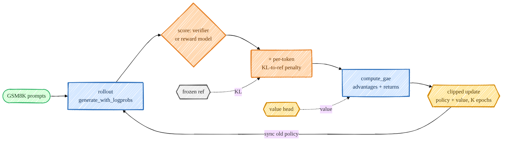
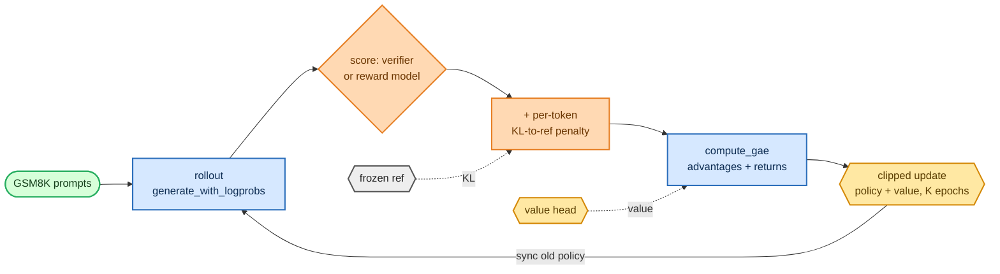

<!-- omit in toc -->
# Stage 5 — PPO (classic RLHF)

This is the original ChatGPT recipe: let the model generate, score the generations with a reward, and
nudge the policy toward higher-reward behaviour using Proximal Policy Optimization — with a value
network (critic) for variance reduction and a KL penalty to keep it from drifting too far from the SFT
model. I wrote the whole loop from scratch: rollout → reward → GAE advantages → clipped update.

The clipped objective and policy-ratio notation are introduced in
[Objectives, Losses & Perplexity](foundations/objectives.md). The optimizer and stability pieces are
covered in [Optimization & Training Systems](foundations/optimization.md).



<details>
<summary>Mermaid source (live, editable)</summary>



</details>

## The actor-critic

PPO needs a per-token value estimate `V(s_t)` next to the policy logits. I get both from one backbone
with [`TransformerWithValueHead`](https://github.com/FareedKhan-dev/train-llm-from-scratch/blob/main/src/post_training/value_head.py#L19) — it reuses
`forward_hidden` + `lm_head` for the policy and adds a small scalar value head (initialized to ~0 so the
critic doesn't destabilize early training):

```python
def forward(self, idx):
    hidden = self.transformer.forward_hidden(idx)
    logits = self.transformer.lm_head(hidden)      # policy
    values = self.value_head(hidden).squeeze(-1)   # critic, (B, T)
    return logits, values
```

## Rollout + log-probs

[`rollout_prompts`](https://github.com/FareedKhan-dev/train-llm-from-scratch/blob/main/src/post_training/rollout.py#L180) length-buckets the prompts and samples a
completion for each, and [`generate_with_logprobs`](https://github.com/FareedKhan-dev/train-llm-from-scratch/blob/main/src/post_training/rollout.py#L94) records the
sampling log-probs. Log-probs are always taken in **fp32** ([`compute_logprobs`](https://github.com/FareedKhan-dev/train-llm-from-scratch/blob/main/src/post_training/rollout.py#L233))
because PPO subtracts them and bf16 rounding there is harmful.

## GAE — Generalized Advantage Estimation

[`compute_gae`](https://github.com/FareedKhan-dev/train-llm-from-scratch/blob/main/src/post_training/ppo.py#L24) works in the "action frame" (index `t` = producing
token `t+1`), bootstrapping only while the next action is still a response token:

```python
for t in reversed(range(L)):
    nonterminal = m[:, t + 1] if t + 1 < L else 0.0      # episode ends after the last response token
    delta = rewards[:, t] + gamma * values_next[:, t] * nonterminal - values[:, t]
    lastgae = delta + gamma * lam * nonterminal * lastgae
    adv[:, t] = lastgae
returns = adv + values
```

The per-token reward is the **KL-to-reference penalty** at every response token, plus the scalar task
reward added at the **last** response token. Advantages are then normalized with
[`whiten`](https://github.com/FareedKhan-dev/train-llm-from-scratch/blob/main/src/post_training/ppo.py#L60).

## The clipped objective

[`ppo_policy_loss`](https://github.com/FareedKhan-dev/train-llm-from-scratch/blob/main/src/post_training/ppo.py#L68) is the standard clipped surrogate;
[`ppo_value_loss`](https://github.com/FareedKhan-dev/train-llm-from-scratch/blob/main/src/post_training/ppo.py#L84) clips the value update too:

```python
ratio = torch.exp(new_logp - old_logp)
surr1 = ratio * advantages
surr2 = torch.clamp(ratio, 1.0 - clip, 1.0 + clip) * advantages
loss  = -masked_mean(torch.min(surr1, surr2), mask)
```

[`train_ppo.py`](https://github.com/FareedKhan-dev/train-llm-from-scratch/blob/main/scripts/train_ppo.py) ties it together: rollout once, compute old log-probs / ref
log-probs / values, build rewards, GAE, then run `ppo_epochs` of minibatched clipped updates.

## Run it

```bash
PYTHONPATH=. python scripts/train_ppo.py --reward_source verifier   # GSM8K checker as reward
PYTHONPATH=. python scripts/train_ppo.py --reward_source rm         # use the trained reward.pt
PYTHONPATH=. torchrun --standalone --nproc_per_node=2 scripts/train_ppo.py
```

## What the numbers mean

- **reward** — mean task reward per iteration; the headline curve, should trend up.
- **KL_ref** — mean KL of the policy from the SFT reference; must stay **bounded**. If it blows up the
  model is degenerating — lower the LR or raise `--kl_coef`.
- **clipfrac** — fraction of tokens hitting the PPO clip; a health/▒step-size signal.
- **value_loss** — critic regression error.
- **GSM8K test accuracy** — the real outcome, evaluated every `--eval_every`.

> PPO is the touchy one: small LR (`1e-6`), `clip 0.2`, grad-clip 1.0, and watch KL. I verified the loop
> truly *optimizes* by giving it a learnable synthetic reward — reward climbed `0.10 → 1.00`.

Saved to `/ephemeral/ckpts/ppo.pt`.

➡️ Next: [Stage 6 — GRPO](07_grpo.md), which drops the critic entirely.
