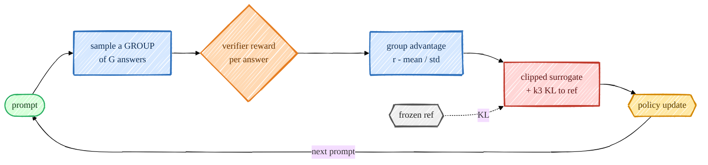
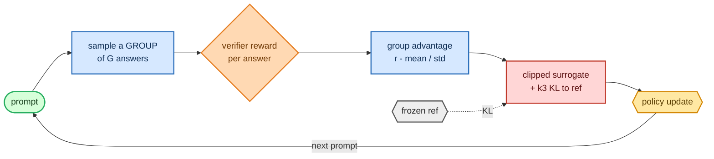

<!-- omit in toc -->
# Stage 6 — GRPO / RLVR (the reasoning frontier)

GRPO (Group Relative Policy Optimization) is the algorithm behind DeepSeek-R1, and it's beautifully
simple: **throw away PPO's value network**. For each prompt, sample a whole *group* of answers, score
them with a verifiable reward, and use the group's own mean/std as the baseline. The advantage is just
"how much better than your groupmates was this answer?" — no critic to train, no value loss.

For the group-relative advantage formula and how it relates to PPO-style policy ratios, see
[Objectives, Losses & Perplexity](foundations/objectives.md).



<details>
<summary>Mermaid source (live, editable)</summary>



</details>

## Group-relative advantage

[`group_advantages`](https://github.com/FareedKhan-dev/train-llm-from-scratch/blob/main/src/post_training/grpo.py#L17) is the whole idea — standardize rewards *within
each group*, so a good answer is one that beats its siblings on the same prompt:

```python
def group_advantages(rewards, group_size, eps=1e-4):
    r = rewards.view(-1, group_size)             # rewards laid out group-contiguously
    adv = (r - r.mean(1, keepdim=True)) / (r.std(1, keepdim=True) + eps)
    return adv.reshape(-1)
```

A nice property: if every answer in a group gets the same reward (all right or all wrong), the std-based
advantage is ~0 and that group simply contributes no gradient — so I log the fraction of *informative*
groups as a health metric.

## The loss: clipped surrogate + KL

[`grpo_loss`](https://github.com/FareedKhan-dev/train-llm-from-scratch/blob/main/src/post_training/grpo.py#L37) applies the same PPO-style token-level clipped surrogate
(advantage broadcast across a completion's tokens) plus a per-token KL penalty to the reference, using
Schulman's non-negative **k3** estimator ([`k3_kl`](https://github.com/FareedKhan-dev/train-llm-from-scratch/blob/main/src/post_training/grpo.py#L31)):

```python
ratio = torch.exp(new_logp - old_logp)
surrogate = torch.min(ratio * adv, torch.clamp(ratio, 1 - clip, 1 + clip) * adv)
kl = k3_kl(new_logp, ref_logp)                  # exp(Δ) - Δ - 1, always ≥ 0
loss = -masked_mean(surrogate - kl_coef * kl, resp_mask)
```

## The trainer + curriculum

[`train_grpo.py`](https://github.com/FareedKhan-dev/train-llm-from-scratch/blob/main/scripts/train_grpo.py) loads the policy from `sft.pt`, replicates each prompt `G`
times (group-contiguously), rolls them out, scores with the GSM8K verifier, and updates. It runs an
**arithmetic curriculum** for the first `--curriculum_iters` iterations so the policy earns some reward
*before* facing full GSM8K (otherwise every group is all-wrong and there's no signal):

```python
rows = next(warm_it if it < cfg.curriculum_iters else main_it)
prompts = [p for p in base_prompts for _ in range(G)]            # group-contiguous
rewards = torch.tensor([reward_gsm8k(responses[i], golds[i]) for i in range(len(prompts))])
adv = group_advantages(rewards, G)
```

## Run it

```bash
PYTHONPATH=. python scripts/train_grpo.py --group_size 8
PYTHONPATH=. torchrun --standalone --nproc_per_node=2 scripts/train_grpo.py
# tune: --curriculum_iters 100 --kl_coef 0.04 --temperature 1.0
```

## What the numbers mean

- **reward** — mean verifier reward across the group samples; the curve you want climbing.
- **informative** — fraction of groups with non-zero reward spread (groups that actually teach
  something). If this collapses to 0, raise temperature / group size or stay longer on the curriculum.
- **KL** — KL to the reference; keep it bounded.
- **GSM8K test accuracy** — the headline reasoning metric, evaluated every `--eval_every`.

> I verified the GRPO path genuinely optimizes: with a learnable reward the mean reward climbed
> **0.10 → 0.69 → 1.00** in ~15 iterations and saturated. PPO and GRPO share the same rollout/log-prob
> core, so this also exercises the common machinery.

Saved to `/ephemeral/ckpts/grpo.pt`.

➡️ Next: [measure all stages on GSM8K](08_evaluation.md) and [chat with the result](09_inference.md).
