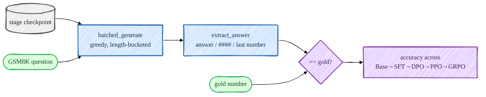
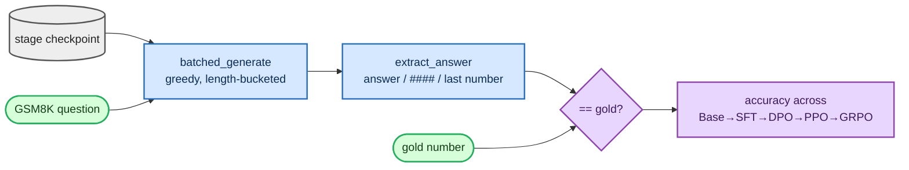

<!-- omit in toc -->
# Evaluation

A pipeline is only believable if you can measure it, so I evaluate every stage on the **same** held-out
GSM8K test set with greedy decoding. The headline deliverable is a single table: GSM8K accuracy as it
moves Base → SFT → DPO → PPO → GRPO. The reward is *verifiable* — I parse the model's final number and
compare it to the gold answer — so the score is objective, not a judgment call.



<details>
<summary>Mermaid source (live, editable)</summary>



</details>

## Generation: length-bucketed, greedy

The educational model has no padding-aware attention mask, so
[`batched_generate`](https://github.com/FareedKhan-dev/train-llm-from-scratch/blob/main/src/post_training/evaluation.py#L24) groups prompts of equal length and decodes
each bucket together; `greedy=True` forces argmax (`top_k=1`) for comparable, deterministic numbers.

## Scoring: a verifiable reward

[`gsm8k_accuracy`](https://github.com/FareedKhan-dev/train-llm-from-scratch/blob/main/src/post_training/evaluation.py#L77) generates an answer per question and checks
it with the verifier:

```python
prompts = [encode_prompt([{"role": "user", "content": q}]) for q, _ in qa_pairs]
responses = batched_generate(model, prompts, max_new_tokens, device=device, greedy=greedy)
correct = sum(is_correct(resp, gsm8k_gold_answer(ans)) for (q, ans), resp in zip(qa_pairs, responses))
```

The reward/checker lives in [`rewards/`](https://github.com/FareedKhan-dev/train-llm-from-scratch/blob/main/src/post_training/rewards/). `extract_answer` is tolerant —
it prefers an `<answer>…</answer>` tag, then a GSM8K-style `#### N`, then falls back to the last number
in the text — and [`reward_gsm8k`](https://github.com/FareedKhan-dev/train-llm-from-scratch/blob/main/src/post_training/rewards/verifiers.py#L35) is
**correctness-dominant** with only a small, bounded format bonus, to discourage reward hacking:

```python
r = 0.0
if _answers_match(extract_answer(text), gold): r += 1.0     # the reward that matters
if has_well_formed_answer(text):               r += 0.2     # small format nudge
return min(r, 1.2)                                           # clipped
```

I sanity-checked this scorer independently of any model: feeding it correct answers scores **100/100**
and wrong answers **0/100** false positives, with gold cross-verified against the live GSM8K dataset.

## The across-stages table

[`eval_post_training.py`](https://github.com/FareedKhan-dev/train-llm-from-scratch/blob/main/scripts/eval_post_training.py) loads any checkpoint (reading its dims from
the stored `cfg`), scores it, and appends a row to a JSONL you can render as a table:

```bash
for s in base_pretrained sft dpo ppo grpo; do
  PYTHONPATH=. python scripts/eval_post_training.py --ckpt /ephemeral/ckpts/$s.pt \
    --label $s --limit 200 --append /ephemeral/logs/stage_table.jsonl
done
PYTHONPATH=. python scripts/eval_post_training.py --table /ephemeral/logs/stage_table.jsonl
```

```
stage              GSM8K acc       n
------------------------------------
base_pretrained         ...      200
sft                     ...      200
dpo                     ...      200
ppo                     ...      200
grpo                    ...      200
```

## In-training metrics

Each trainer also writes a metrics JSONL under `/ephemeral/logs/` (via
[`MetricsLogger`](https://github.com/FareedKhan-dev/train-llm-from-scratch/blob/main/src/post_training/logging_utils.py)) — train/dev loss for SFT, preference accuracy
for the reward model, implicit-reward accuracy for DPO, and reward/KL/clip-fraction + GSM8K accuracy for
PPO/GRPO. Pass `--use_wandb true` to also mirror to Weights & Biases; the JSONL is always written so you
can plot offline.

## What "good" looks like at this scale

A ~400M from-scratch model won't top the GSM8K leaderboard — the point is the **relative** climb across
stages and bounded KL during RL. Expect modest absolute numbers but a clear, real before/after gain at
each step.

➡️ Next: [talk to any checkpoint](09_inference.md).
