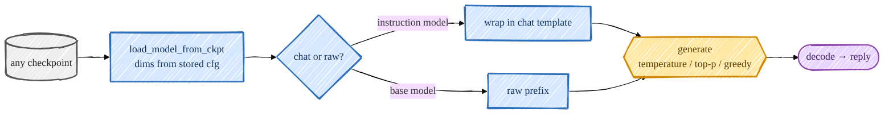
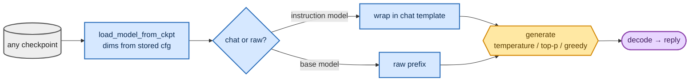

<!-- omit in toc -->
# Inference & Chat

Training is only satisfying if you can actually *talk* to the result. The original
[`generate_text.py`](https://github.com/FareedKhan-dev/train-llm-from-scratch/blob/main/scripts/generate_text.py) does raw continuation for the base model, but it's
hard-wired to the legacy config and has no chat template — so I added a small inference layer that loads
**any** stage checkpoint (base / SFT / DPO / PPO / GRPO) and talks to it correctly.

For the underlying decoding loop, context cropping, temperature, and stop-token behavior, read
[Generation & Sampling](foundations/generation.md).



<details>
<summary>Mermaid source (live, editable)</summary>



</details>

## Load any checkpoint by its stored config

[`load_model_from_ckpt`](https://github.com/FareedKhan-dev/train-llm-from-scratch/blob/main/src/post_training/inference.py) reads the model dimensions from the
checkpoint's saved `cfg`, so you never re-specify `n_embed`/`n_blocks`, and it tolerates DDP /
reward-head key prefixes:

```python
ck = torch.load(ckpt_path, map_location="cpu", weights_only=False)
cfg = {**(ck.get("cfg") or {}), **(overrides or {})}
model = Transformer(n_head=cfg["n_head"], n_embed=cfg["n_embed"], ...)
state = {k.removeprefix("module.").removeprefix("transformer."): v for k, v in state.items()}
```

## Chat vs raw

[`generate_reply`](https://github.com/FareedKhan-dev/train-llm-from-scratch/blob/main/src/post_training/inference.py#L37) has two modes, reusing the same tested
generation core as training/eval ([`batched_generate`](https://github.com/FareedKhan-dev/train-llm-from-scratch/blob/main/src/post_training/evaluation.py#L24)):

- **chat** (default) — wraps your text in the chat template (optionally with a `system` message) and
  returns the decoded assistant turn. Use this for SFT/DPO/PPO/GRPO checkpoints.
- **raw** (`--raw`) — treats your text as a prefix and returns the base model's continuation (no
  template). Use this for `base_pretrained.pt`.

```python
if raw:
    ids = get_tokenizer().encode_ordinary(user_text)
else:
    ids = encode_prompt([{"role": "user", "content": user_text}])   # ...ends at <|assistant|>
out = batched_generate(model, [ids], max_new_tokens, device=device,
                       temperature=temperature, top_k=top_k, top_p=top_p, greedy=greedy)
```

Decoding is defensive — [`decode`](https://github.com/FareedKhan-dev/train-llm-from-scratch/blob/main/src/post_training/chat_template.py) drops the EOT terminator and
any padding-vocab ids (the model's vocab is padded to 50304 but r50k_base only decodes 0–50255).

## The CLI

[`scripts/chat.py`](https://github.com/FareedKhan-dev/train-llm-from-scratch/blob/main/scripts/chat.py) is one-shot or an interactive REPL:

```bash
# instruction-tuned models (chat template applied automatically)
PYTHONPATH=. python scripts/chat.py --ckpt /ephemeral/ckpts/sft.pt  --prompt "What is 13 + 29?"
PYTHONPATH=. python scripts/chat.py --ckpt /ephemeral/ckpts/grpo.pt --prompt "..." --greedy
# base-model continuation
PYTHONPATH=. python scripts/chat.py --ckpt /ephemeral/ckpts/base_pretrained.pt --raw --prompt "Once upon a time"
# interactive REPL (omit --prompt)
PYTHONPATH=. python scripts/chat.py --ckpt /ephemeral/ckpts/sft.pt
```

Sampling controls: `--temperature`, `--top_p`, `--top_k`, or `--greedy` for deterministic argmax. Runs
on `--device cuda` or `cpu` (both verified).

## Sampling knobs, briefly

- **greedy** — reproducible, best for eval / math (`--greedy`).
- **temperature** — higher = more random; ~`0.7–1.0` for open-ended chat.
- **top_p / top_k** — nucleus / top-k truncation to cut the long tail of unlikely tokens.

That's the full loop: pretrain → align → reason → measure → chat. Back to the [overview](README.md).
