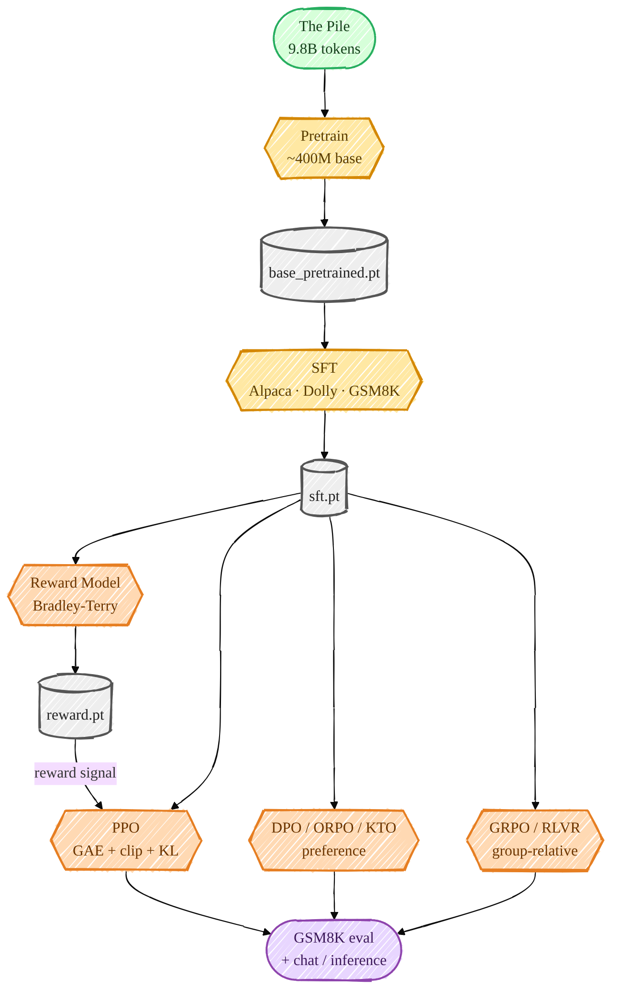
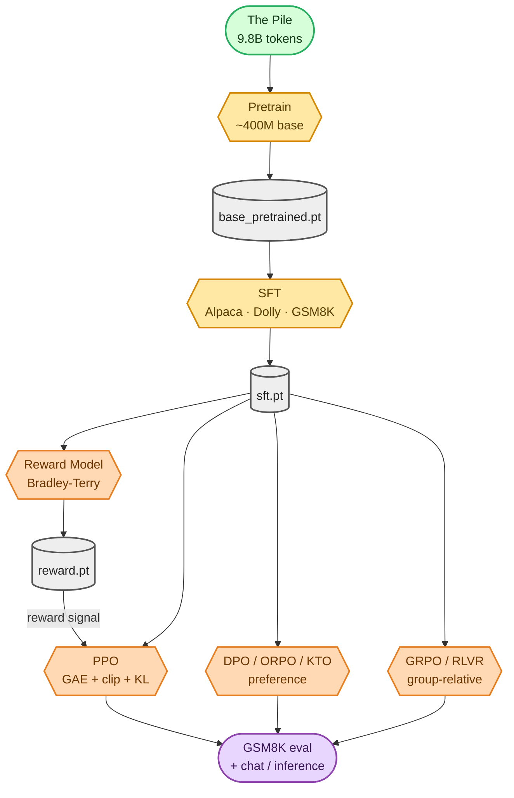

<!-- omit in toc -->
# Post-Training & Alignment — Overview

When I first trained this transformer from scratch, it could *continue* text but it couldn't
*follow instructions* or *reason*. That's what post-training fixes. This `docs/` folder walks
through the whole journey I built on top of the base model — every stage written from scratch
in plain PyTorch (no `trl`, no `peft`, no `transformers`), trained on real public datasets, and
runnable on a single GPU or scaled across multiple GPUs with DDP.

If you are new to LLM training internals, start with the new
**[LLM Foundations](foundations/README.md)** section before reading the stage pages. It explains the
token shapes, decoder-only Transformer, attention masks, objectives, optimization loop, and generation
mechanics that every later page relies on.

## Recommended reading order

1. **Foundations first**:
   [Tokenization](foundations/tokenization.md) ->
   [Transformer](foundations/transformer.md) ->
   [Attention](foundations/attention.md) ->
   [Objectives](foundations/objectives.md) ->
   [Optimization](foundations/optimization.md) ->
   [Generation](foundations/generation.md).
2. **Then the full pipeline**:
   [Data](01_data_pipeline.md) ->
   [Pretraining](02_pretraining.md) ->
   [SFT](03_sft.md) ->
   [Reward Model](04_reward_model.md) ->
   [DPO](05_dpo.md) ->
   [PPO](06_ppo.md) ->
   [GRPO](07_grpo.md).
3. **Finally run and inspect**:
   [Evaluation](08_evaluation.md), [Inference / Chat](09_inference.md), and the
   [command cheatsheet](howto/commands.md).

The pipeline mirrors how modern aligned/reasoning models are actually built:



<details>
<summary>Mermaid source (live, editable)</summary>



</details>

## The stages, in order

| # | Stage | What it teaches the model | Doc |
|---|---|---|---|
| 1 | **Pretraining** | language itself (next-token prediction on the Pile) | [02_pretraining.md](02_pretraining.md) |
| 2 | **SFT** | to follow instructions & produce the `<think>/<answer>` format | [03_sft.md](03_sft.md) |
| 3 | **Reward Model** | to score which answer humans prefer | [04_reward_model.md](04_reward_model.md) |
| 4 | **DPO / ORPO / KTO** | to prefer better answers *without* an RL loop | [05_dpo.md](05_dpo.md) |
| 5 | **PPO** | to maximize a reward (RM or verifier) with the classic RLHF loop | [06_ppo.md](06_ppo.md) |
| 6 | **GRPO / RLVR** | to reason, using verifiable rewards (DeepSeek-R1 style) | [07_grpo.md](07_grpo.md) |
| — | **Data pipeline** | how every dataset above is downloaded & preprocessed | [01_data_pipeline.md](01_data_pipeline.md) |
| — | **Evaluation** | how I measure GSM8K accuracy across all stages | [08_evaluation.md](08_evaluation.md) |
| — | **Inference / chat** | how to actually talk to any checkpoint | [09_inference.md](09_inference.md) |

## The one design rule: *wrap, don't rewrite*

Everything here sits on top of the original [`Transformer`](https://github.com/FareedKhan-dev/train-llm-from-scratch/blob/main/src/models/transformer.py). I changed the
educational model in exactly **one** place — I added a [`forward_hidden`](https://github.com/FareedKhan-dev/train-llm-from-scratch/blob/main/src/models/transformer.py#L56)
method that returns the final hidden states the `lm_head` consumes. Every post-training head (a value
head for PPO, a scalar reward head for the reward model) and every RL log-prob computation composes
*around* that one method, so the from-scratch model you already understand stays intact.

## Colour legend (used in every diagram in these docs)

🟩 data / corpus  ·  🟦 preprocessing  ·  🟦‍⬛ storage (HDF5 / JSONL)  ·  🟨 model / training loop
·  🟧 RL / reward  ·  🟥 loss / objective  ·  🟪 evaluation  ·  ⬜ checkpoint

> Each diagram is a hand-drawn, colour-coded Mermaid sketch, **pre-rendered to a PNG and embedded as
> an image** (GitHub's live Mermaid doesn't reliably do `look: handDrawn`, and some viewers — e.g. the
> VS Code preview — block SVGs, so an embedded PNG shows everywhere). The editable Mermaid source sits
> in a collapsible *"Mermaid source"* block under each image. To regenerate the images after editing,
> see [diagrams/README.md](diagrams/README.md).

## Run the whole thing

Once the base model has pretrained ([02_pretraining.md](02_pretraining.md)), the entire chain is one script:

```bash
bash scripts/run_posttraining.sh          # SFT -> RM -> DPO -> PPO -> GRPO -> eval table
```

See [POST_TRAINING.md](https://github.com/FareedKhan-dev/train-llm-from-scratch/blob/main/POST_TRAINING.md) for the condensed command reference.
