# LLM Foundations

This section explains the ideas that the training code assumes you know. It is not a PyTorch primer.
It is a bridge between the source files in this repository and the core concepts behind modern
decoder-only language models.

The priority is:

1. understand the base model and pretraining mechanics;
2. connect those mechanics to every existing stage in the site;
3. use the same language later for SFT, reward models, DPO, PPO, and GRPO.

## The whole training story

```mermaid
flowchart LR
    RAW[raw text] --> TOK[tokenizer]
    TOK --> IDS[token ids]
    IDS --> BASE[decoder-only Transformer]
    BASE --> CE[next-token cross-entropy]
    CE --> CKPT[base checkpoint]
    CKPT --> SFT[SFT: instruction following]
    SFT --> PREF[preference optimization]
    PREF --> RL[RL / verifier optimization]
    RL --> CHAT[inference and chat]

    classDef data fill:#d6ffd9,stroke:#27ae60,stroke-width:2px,color:#143d1a;
    classDef model fill:#ffe8a3,stroke:#d48806,stroke-width:2px,color:#5a3d00;
    classDef loss fill:#ffd6d6,stroke:#c0392b,stroke-width:2px,color:#5c1212;
    class RAW,TOK,IDS data;
    class BASE,CKPT,SFT,PREF,RL,CHAT model;
    class CE loss;
```

At the base level, an LLM is a conditional probability model:

\[
p_\theta(x_1, x_2, \ldots, x_T)
= \prod_{t=1}^{T} p_\theta(x_t \mid x_{<t})
\]

The Transformer does not learn "truth" directly. It learns a distribution over the next token. A
large amount of useful behavior appears because the next-token task forces the model to compress
syntax, facts, formats, style, and reasoning traces into its weights.

## Where each concept lives in this repo

| Concept | Why it matters | Main code |
|---|---|---|
| Tokenization | Text must become integer ids before the model can train. | `scripts/prepare_pretrain_data.py`, `src/post_training/chat_template.py` |
| Fixed context windows | Training examples are contiguous windows of tokens. | `data_loader/data_loader.py` |
| Token and position embeddings | Integer ids become vectors and positions. | `src/models/transformer.py` |
| Causal self-attention | Each token mixes information from previous tokens only. | `src/models/attention.py` |
| Transformer block | Attention plus MLP, with pre-norm residual structure. | `src/models/transformer_block.py` |
| Logits | Hidden states become unnormalized vocabulary scores. | `src/models/transformer.py` |
| Cross-entropy | The base objective rewards probability on the true next token. | `src/models/transformer.py`, `src/post_training/sft.py` |
| AdamW and LR schedule | Optimization details that decide whether training is stable. | `src/post_training/optim.py` |
| Gradient accumulation | Simulates a larger batch under memory limits. | `scripts/pretrain_base.py`, `scripts/train_sft.py` |
| Generation | The model feeds sampled tokens back into itself. | `src/models/transformer.py`, `src/post_training/inference.py` |

## Learning path

Read in this order:

1. [Tokenization & Data Shapes](tokenization.md) - how text becomes batches.
2. [Decoder-Only Transformer](transformer.md) - the model skeleton.
3. [Attention, Masks & Heads](attention.md) - the core operation.
4. [Objectives, Losses & Perplexity](objectives.md) - what the model is optimized to do.
5. [Optimization & Training Systems](optimization.md) - how the loop stays stable.
6. [Generation & Sampling](generation.md) - how logits become text.

Then continue to the pipeline pages:

- [Data handling](../01_data_pipeline.md)
- [Pretraining](../02_pretraining.md)
- [SFT](../03_sft.md)
- [Reward Model](../04_reward_model.md)
- [DPO / ORPO / KTO](../05_dpo.md)
- [PPO](../06_ppo.md)
- [GRPO / RLVR](../07_grpo.md)

## Mental model

The base training loop is compact:

\[
\text{text} \to \text{token ids} \to \text{embeddings} \to \text{Transformer blocks}
\to \text{logits} \to \text{cross-entropy} \to \nabla_\theta
\]

Post-training mostly changes the data and the loss:

- SFT keeps next-token prediction, but masks the loss to assistant tokens.
- Reward modeling changes the output from vocabulary logits to one scalar score.
- DPO compares sequence log-probabilities for chosen and rejected responses.
- PPO and GRPO sample completions, score them, and update the policy with a constrained RL objective.

The same backbone is reused throughout. That is the most important design idea in this repo.

## Primary references

- [Attention Is All You Need](https://arxiv.org/abs/1706.03762) introduced the Transformer and scaled dot-product attention.
- [The Pile](https://arxiv.org/abs/2101.00027) describes the 825 GiB text corpus used by the pretraining path.
- [Neural Machine Translation of Rare Words with Subword Units](https://arxiv.org/abs/1508.07909) introduced the BPE subword idea that modern tokenizers build on.
- [Decoupled Weight Decay Regularization](https://arxiv.org/abs/1711.05101) motivates AdamW.
- [Training language models to follow instructions with human feedback](https://arxiv.org/abs/2203.02155) is the classic SFT -> reward model -> PPO RLHF recipe.
- [Direct Preference Optimization](https://arxiv.org/abs/2305.18290) motivates the DPO page.
- [DeepSeekMath](https://arxiv.org/abs/2402.03300) introduces GRPO in the mathematical reasoning setting.
