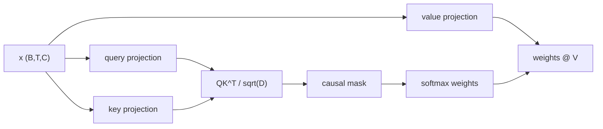

# Attention, Masks & Heads

Self-attention is the operation that lets each token decide which previous tokens matter.

In a decoder-only language model, position \(t\) can use information from positions \(0..t\), but not
from positions \(t+1..T-1\). That restriction is what makes next-token training honest.

## The attention equation

For an input tensor \(X \in \mathbb{R}^{B \times T \times C}\), one attention head learns three
linear projections:

\[
Q = X W_Q,\quad K = X W_K,\quad V = X W_V
\]

where \(Q,K,V \in \mathbb{R}^{B \times T \times D}\).

Scaled dot-product attention is:

\[
\text{Attention}(Q,K,V)
= \text{softmax}\left(\frac{QK^T}{\sqrt{D}} + M\right)V
\]

The mask \(M\) is `0` for allowed positions and \(-\infty\) for future positions.

## Query, key, value intuition

For each token:

- query: "what am I looking for?"
- key: "what information do I contain?"
- value: "what content should I pass forward if selected?"

The dot product \(q_t \cdot k_s\) measures how much token \(t\) wants information from token \(s\).

## Why divide by \(\sqrt{D}\)?

If the components of queries and keys have roughly unit variance, their dot product has variance
proportional to \(D\). Larger head sizes would create large logits, making softmax overly sharp and
gradients weak. The scale factor keeps attention logits in a more stable range:

\[
\frac{q_t \cdot k_s}{\sqrt{D}}
\]

## Causal masking

For \(T=5\), the allowed attention pattern is:

\[
\begin{bmatrix}
1 & 0 & 0 & 0 & 0 \\
1 & 1 & 0 & 0 & 0 \\
1 & 1 & 1 & 0 & 0 \\
1 & 1 & 1 & 1 & 0 \\
1 & 1 & 1 & 1 & 1
\end{bmatrix}
\]

The repo stores this as a lower-triangular buffer:

```python
self.register_buffer("tril", torch.tril(torch.ones(context_length, context_length)))
```

Then masks future locations before softmax:

```python
attn_weights = q @ k.transpose(-2, -1) * scale_factor
attn_weights = attn_weights.masked_fill(self.tril[:T, :T] == 0, float("-inf"))
attn_weights = F.softmax(attn_weights, dim=-1)
out = attn_weights @ v
```

Because the future logits become \(-\infty\), their softmax probability becomes zero.



## Multi-head attention

One head has one attention pattern. Multiple heads let the model learn several patterns in parallel:

- syntax dependencies;
- repeated names or entities;
- local phrase structure;
- delimiter and format tracking;
- arithmetic or code-like dependencies.

The repo creates `n_head` independent `Head` modules:

```python
self.heads = nn.ModuleList([
    Head(n_embed // n_head, n_embed, context_length)
    for _ in range(n_head)
])
self.proj = nn.Linear(n_embed, n_embed)
```

Then concatenates head outputs:

```python
x = torch.cat([h(x) for h in self.heads], dim=-1)
x = self.proj(x)
```

If \(H\) heads each emit width \(D=C/H\), concatenation returns width \(C\):

\[
\text{Concat}(\text{head}_1,\ldots,\text{head}_H) \in \mathbb{R}^{B \times T \times C}
\]

The final projection mixes information across heads.

## Attention cost

The attention score matrix has shape:

\[
B \times T \times T
\]

per head. With \(H\) heads, the core score storage is roughly:

\[
O(BHT^2)
\]

This is why context length is expensive. Doubling \(T\) roughly quadruples the attention matrix size.
The repo's educational attention implementation is intentionally readable and materializes these
matrices directly.

## What attention can and cannot do

Attention mixes information between positions. It does not by itself:

- create a probability distribution over the vocabulary;
- know token order without positional information;
- perform nonlinear transformation beyond weighted averaging.

Those jobs come from position embeddings, the MLP, layer norms, residual paths, and the final LM head.

## Debugging attention mentally

If training behaves oddly, ask these questions:

1. Is the mask causal, or can tokens see the answer?
2. Are `q`, `k`, and `v` projected from the same normalized input?
3. Is `head_size = n_embed // n_head` an integer?
4. Does concatenating all heads return exactly `n_embed` channels?
5. Is sequence length `T` less than or equal to `context_length`?

## Next

Attention creates hidden states. The loss decides how hidden states become learning signal. Continue
to [Objectives, Losses & Perplexity](objectives.md).
