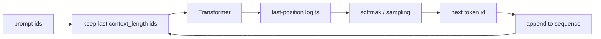

# Generation & Sampling

Training predicts the next token for known text. Generation uses the model's own sampled token as the
next input.

That feedback loop is why small probability differences can produce very different completions.

## Autoregressive loop



The simple implementation in `src/models/transformer.py`:

```python
for _ in range(max_new_tokens):
    idx_cond = idx[:, -self.context_length:]
    logits, _ = self(idx_cond)
    logits = logits[:, -1, :]
    probs = F.softmax(logits, dim=-1)
    idx_next = torch.multinomial(probs, num_samples=1)
    idx = torch.cat((idx, idx_next), dim=1)
```

Only the final position is used because that position has attended to the whole current context.

## Greedy decoding vs sampling

Greedy decoding chooses:

\[
\arg\max_i p_i
\]

Sampling draws:

\[
x \sim \text{Categorical}(p)
\]

Greedy decoding is deterministic and often repetitive. Sampling is stochastic and can produce more
varied text.

This repo's simple base `generate` method samples directly from the full softmax distribution.
The post-training inference utilities add more controls.

## Temperature

Temperature rescales logits before softmax:

\[
p_i =
\frac{\exp(z_i / \tau)}
{\sum_j \exp(z_j / \tau)}
\]

Effects:

- \(\tau < 1\): sharper distribution, safer but less diverse;
- \(\tau = 1\): unchanged;
- \(\tau > 1\): flatter distribution, more diverse but more error-prone.

Temperature operates on logits, not probabilities.

## Top-k and top-p

Many generation systems restrict the candidate set before sampling.

Top-k keeps only the \(k\) highest-probability tokens.

Top-p, also called nucleus sampling, keeps the smallest set of tokens whose cumulative probability is
at least \(p\).

These controls are not part of the base model architecture. They are decoding policies layered on top
of the model's logits.

## Context cropping

The model has a fixed maximum context length:

```python
idx_cond = idx[:, -self.context_length:]
```

If the conversation grows beyond that, the oldest tokens are dropped. The model cannot attend to text
outside the retained context window.

This is why context length is a product constraint, not just a training hyperparameter.

## Stop tokens

The tokenizer's EOT token is:

```python
EOT_ID = 50256
```

During training, EOT appears between documents and after assistant messages. During inference, a chat
loop can stop when EOT appears or when a formatted answer is complete.

If the model was never trained to emit a clear stop token or answer delimiter, decoding has to guess
when to stop.

## Why generated text can drift

During teacher-forced training, every input prefix comes from the dataset. During generation, prefixes
come from the model itself. If the model samples a poor token early, future predictions condition on
that poor token.

This distribution shift is one reason post-training matters:

- SFT teaches the answer format;
- reward/preference methods push the model toward preferred completions;
- RLVR/GRPO can reward final answers that satisfy an external verifier.

## Useful generation diagnostics

| Symptom | Likely cause | Check |
|---|---|---|
| Repeats forever | distribution too sharp or no learned stop behavior | lower max tokens, check EOT handling, adjust sampling |
| Ignores instruction | base model not SFT-trained enough | test an SFT checkpoint |
| Wrong answer format | SFT data format mismatch | inspect chat template and masks |
| Random-looking text | undertrained model or high temperature | compare train/dev loss and lower temperature |
| Crashes on long prompts | prompt exceeds context or device memory | crop context and inspect `context_length` |

## Next

You now have the foundation for the full pipeline. Continue to:

- [Data handling](../01_data_pipeline.md)
- [Pretraining](../02_pretraining.md)
- [SFT](../03_sft.md)
