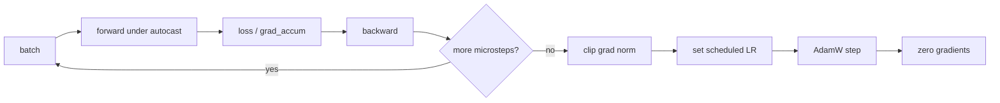
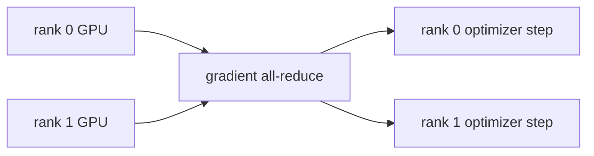

# Optimization & Training Systems

Once the loss is defined, training is an engineering problem: move parameters in the right direction
without numerical instability, memory blowups, or throughput collapse.

The main ingredients in this repo are:

- AdamW;
- linear warmup plus cosine learning-rate decay;
- gradient accumulation;
- gradient clipping;
- bf16 autocast;
- DistributedDataParallel for multi-GPU training.

## The training step



The pretraining loop in `scripts/pretrain_base.py` uses this pattern:

```python
for micro in range(cfg.grad_accum):
    xb, yb = next(batch_iter)
    with amp_autocast(cfg.amp_dtype, ctx.device):
        _, loss = model(xb, yb)
        loss = loss / cfg.grad_accum
    loss.backward()

torch.nn.utils.clip_grad_norm_(model.parameters(), cfg.grad_clip)
optimizer.step()
optimizer.zero_grad(set_to_none=True)
```

Dividing the loss by `grad_accum` keeps the gradient scale the same as if the full effective batch had
fit in memory.

## AdamW

Adam keeps exponential moving averages of gradients and squared gradients:

\[
m_t = \beta_1 m_{t-1} + (1-\beta_1)g_t
\]

\[
v_t = \beta_2 v_{t-1} + (1-\beta_2)g_t^2
\]

After bias correction, parameters are updated approximately by:

\[
\theta_{t+1}
= \theta_t - \eta \frac{\hat{m}_t}{\sqrt{\hat{v}_t}+\epsilon}
\]

AdamW decouples weight decay from the gradient update:

\[
\theta_{t+1}
= \theta_t - \eta \left(
\frac{\hat{m}_t}{\sqrt{\hat{v}_t}+\epsilon}
+ \lambda \theta_t
\right)
\]

The repo applies weight decay only to matrix-like parameters:

```python
if p.dim() >= 2:
    decay.append(p)
else:
    no_decay.append(p)
```

This is the standard GPT recipe: decay large weight matrices, but not biases, LayerNorm scales, or
one-dimensional parameters.

## Learning-rate warmup and cosine decay

The learning rate is small at the start, ramps up, then decays:

\[
\eta(s) =
\eta_{\max}\frac{s+1}{S_{\text{warmup}}}
\quad \text{if } s < S_{\text{warmup}}
\]

After warmup:

\[
\eta(s) =
\eta_{\min}
+ \frac{1}{2}(1+\cos(\pi p))(\eta_{\max}-\eta_{\min})
\]

where:

\[
p = \frac{s-S_{\text{warmup}}}{S_{\max}-S_{\text{warmup}}}
\]

Implementation in `src/post_training/optim.py`:

```python
if step < warmup_steps:
    return lr * (step + 1) / max(1, warmup_steps)
progress = (step - warmup_steps) / max(1, max_steps - warmup_steps)
coeff = 0.5 * (1.0 + math.cos(math.pi * progress))
return min_lr + coeff * (lr - min_lr)
```

Warmup prevents early unstable updates while weights are still poorly calibrated. Cosine decay reduces
step size as training approaches the end of the budget.

## Gradient accumulation

If one batch is too large for GPU memory, split it into microbatches:

\[
B_{\text{effective}} = B_{\text{micro}} \times N_{\text{accum}} \times N_{\text{gpus}}
\]

Example:

- microbatch size: 8;
- accumulation steps: 12;
- GPUs: 2.

\[
B_{\text{effective}} = 8 \times 12 \times 2 = 192
\]

The optimizer steps once after all microbatches have contributed gradients.

## Gradient clipping

Gradient clipping limits the global norm:

\[
g \leftarrow g \cdot \min\left(1, \frac{c}{\|g\|_2}\right)
\]

If the gradient norm is below the threshold \(c\), nothing changes. If it is too large, the whole
gradient vector is scaled down. This is a stability guard, especially useful in RL and long-sequence
training.

## bf16 autocast

`bf16` uses fewer bits than fp32, but keeps an 8-bit exponent like fp32. That makes it much more
forgiving than fp16 for deep learning training.

The repo uses autocast for forward computation:

```python
with amp_autocast(cfg.amp_dtype, ctx.device):
    logits, _ = model(tokens)
    loss = sft_loss(logits, tokens, mask)
```

Model parameters usually remain fp32. Many matrix multiplications run in bf16, improving memory and
throughput on supported GPUs.

## DistributedDataParallel

DDP creates one process per GPU. Each process:

1. owns a full copy of the model;
2. receives a different shard or random stream of data;
3. computes gradients locally;
4. synchronizes gradients across processes before the optimizer step.

With gradient accumulation, synchronization is needed only on the last microstep. The repo uses
`model.no_sync()` for earlier microsteps to avoid unnecessary communication.



## What to watch during training

| Metric | Healthy behavior | Problem signal |
|---|---|---|
| train loss | falls steadily | flat near random baseline |
| dev loss | falls, then stabilizes | rises while train loss falls |
| grad norm | finite, bounded after clipping | NaN or repeated huge spikes |
| tokens/sec | stable for same config | sudden drop or dataloader stall |
| KL in RL stages | bounded | runaway drift from reference |
| reward in RL stages | rises with variance | zero signal for many iterations |

## Memory levers

If a config does not fit, reduce in this order:

1. `batch_size`;
2. `context_length`;
3. `n_blocks`;
4. `n_embed`;
5. `n_head` only if it still divides `n_embed`.

Context length is especially expensive because attention uses a \(T \times T\) score matrix.

## Next

After training, the model still only emits logits. Generation turns those logits into text. Continue
to [Generation & Sampling](generation.md).
