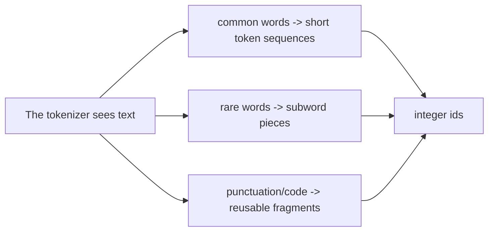
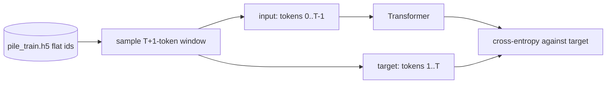

# Tokenization & Data Shapes

The Transformer never sees characters or words. It sees integer token ids. A tokenizer is the boundary
between language and tensors.

This repo uses OpenAI's `r50k_base` tokenizer through `tiktoken`, with:

- vocabulary size `50304`;
- end-of-text token `<|endoftext|>` with id `50256`;
- plain text role markers for chat because the tokenizer has no custom chat tokens.

## Why subword tokenization exists

A word-level vocabulary cannot handle rare names, typos, code identifiers, URLs, and new terms without
exploding in size. A character-level vocabulary handles everything but makes sequences long. Subword
tokenization is the compromise: frequent words can be one token, rare words can be decomposed.



The original BPE idea is simple: start with small units, repeatedly merge frequent adjacent pairs, and
end with a fixed vocabulary of reusable pieces. The repo does not train its own tokenizer; it reuses
`r50k_base`.

## Pretraining shape: one long token stream

For pretraining, documents are converted into one flat array:

\[
[d_1, \text{EOT}, d_2, \text{EOT}, \ldots, d_N, \text{EOT}]
\]

`scripts/prepare_pretrain_data.py` streams Pile shards, tokenizes documents, appends EOT, and writes
the result to HDF5:

```python
for ids in enc.encode_ordinary_batch(docs):
    buf.extend(ids)
    buf.append(EOT_ID)
    if len(buf) >= WRITE_CHUNK:
        flush()
```

The training loader slices random windows of length `context_length + 1`. The first `context_length`
tokens are inputs. The next `context_length` tokens are targets shifted by one position:

\[
x = [t_0, t_1, \ldots, t_{T-1}]
\]

\[
y = [t_1, t_2, \ldots, t_T]
\]

That shift is the entire next-token prediction task.



## SFT shape: tokens plus a loss mask

SFT examples are conversations. We want the model to learn the assistant answer, not memorize the user
prompt. So the data contains two aligned arrays:

- `tokens`: token ids;
- `loss_mask`: `1` for assistant completion tokens, `0` for prompt tokens.

The chat template is plain text:

```text
<|user|>
{question}<|endoftext|><|assistant|>
{answer}<|endoftext|>
```

The key implementation is in `src/post_training/chat_template.py`:

```python
content_ids = _encode_ordinary(m["content"])
is_completion = role == "assistant"
ids.extend(content_ids)
mask.extend([1 if is_completion else 0] * len(content_ids))
ids.append(EOT_ID)
mask.append(1 if is_completion else 0)
```

The mask aligns with the token ids:

| Span | Example | Mask |
|---|---|---|
| user marker | `<|user|>` | 0 |
| user question | `What is 2+2?` | 0 |
| assistant marker | `<|assistant|>` | 0 |
| assistant answer | `<answer>4</answer>` | 1 |
| assistant EOT | `<|endoftext|>` | 1 |

## Preference shape: prompt, chosen, rejected

Preference learning uses pairs:

```json
{"prompt": "...", "chosen": "...", "rejected": "..."}
```

Both responses share the same prompt. That matters because DPO and reward modeling should compare
answer quality, not prompt difficulty.

For a batch, the loader creates two tokenized sequences:

\[
\text{chosen ids} = \text{chat}(prompt, chosen)
\]

\[
\text{rejected ids} = \text{chat}(prompt, rejected)
\]

The chosen and rejected sides are padded to the same length for batching. The repo tracks true sequence
lengths so the reward model can read the last real token instead of a padding token.

## RL prompt shape: prompt plus verifiable gold answer

PPO and GRPO need prompts that can be scored after generation:

```json
{"prompt": "Jan has 3 apples...", "gold": "12"}
```

The verifier extracts the model's final answer and compares it to `gold`. This is called verifiable
reward because the training signal does not require a human labeler or a learned reward model.

## Common shape bugs

| Bug | Symptom | Prevention |
|---|---|---|
| Target not shifted | Model learns to copy the current token. | Always predict `tokens[:, 1:]` from `tokens[:, :-1]`. |
| Prompt tokens included in SFT loss | Model wastes capacity predicting user input. | Use `loss_mask` and average over masked positions only. |
| Missing EOT | Model does not learn when to stop. | Include EOT after documents and assistant messages. |
| Preference prompt mismatch | Reward/DPO compares different tasks. | Normalize to shared prompt plus chosen/rejected responses. |
| Padding used as reward position | Reward model trains on meaningless pad hidden states. | Track `seq_lengths` and gather the last real token. |

## Next

Once text is tokenized, the model needs to turn ids into vectors. Continue to
[Decoder-Only Transformer](transformer.md).
