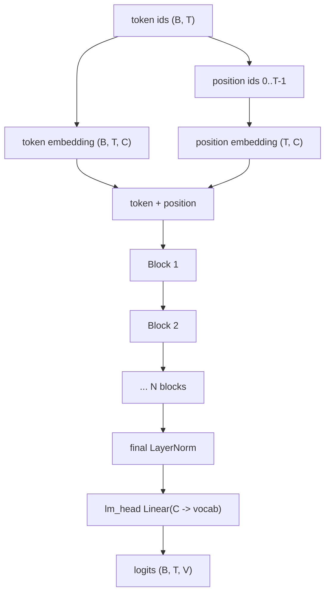

# Decoder-Only Transformer

This repo implements a GPT-style decoder-only Transformer. "Decoder-only" means:

- the model reads a single token sequence;
- each position can attend only to previous positions;
- the output at every position is a distribution over the next token.

It is the right architecture for autoregressive language modeling:

\[
p_\theta(x_t \mid x_{<t})
\]

## The forward pass



The implementation is in `src/models/transformer.py`:

```python
self.token_embed = nn.Embedding(vocab_size, n_embed)
self.position_embed = nn.Embedding(context_length, n_embed)
self.attn_blocks = nn.ModuleList([
    Block(n_head, n_embed, context_length) for _ in range(N_BLOCKS)
])
self.layer_norm = nn.LayerNorm(n_embed)
self.lm_head = nn.Linear(n_embed, vocab_size)
```

Shape symbols used throughout the docs:

| Symbol | Meaning |
|---|---|
| `B` | batch size |
| `T` | sequence length / context length |
| `C` | embedding width, `n_embed` |
| `H` | number of attention heads |
| `D` | head width, usually `C / H` |
| `V` | vocabulary size |

## Embeddings

Token ids are categorical. The embedding table is a learned lookup:

\[
E_{\text{tok}} \in \mathbb{R}^{V \times C}
\]

For token id \(x_t\), the token vector is:

\[
e_t = E_{\text{tok}}[x_t]
\]

The model also learns absolute position embeddings:

\[
E_{\text{pos}} \in \mathbb{R}^{T_{\max} \times C}
\]

The input to the first block is:

\[
h_t^{(0)} = E_{\text{tok}}[x_t] + E_{\text{pos}}[t]
\]

In code:

```python
tok_embedding = self.token_embed(idx)
pos_embedding = self.position_embed(self.pos_idxs[:T])
return tok_embedding + pos_embedding
```

The position embedding is necessary because attention alone is permutation-equivariant: without
position information, the model would not know whether a token occurred first, last, or in the middle.

## Transformer block

Each block in `src/models/transformer_block.py` uses pre-norm residual structure:

```python
x = x + self.attn(self.ln1(x))
x = x + self.mlp(self.ln2(x))
```

Mathematically:

\[
u = x + \text{MHA}(\text{LN}(x))
\]

\[
y = u + \text{MLP}(\text{LN}(u))
\]

This gives each block two jobs:

- attention moves information across token positions;
- the MLP transforms each position independently.

## Why residual connections matter

A residual block learns an update, not a full replacement:

\[
y = x + f(x)
\]

If a layer is not useful yet, it can learn a small update and let information pass through. This makes
deep stacks trainable because gradients have a direct path backward through the addition.

## Why LayerNorm appears before sublayers

LayerNorm normalizes each token vector across its feature dimension:

\[
\text{LN}(x) = \gamma \odot \frac{x - \mu}{\sqrt{\sigma^2 + \epsilon}} + \beta
\]

For a token vector \(x \in \mathbb{R}^{C}\):

\[
\mu = \frac{1}{C} \sum_{i=1}^{C} x_i
\]

\[
\sigma^2 = \frac{1}{C} \sum_{i=1}^{C} (x_i - \mu)^2
\]

This repo uses pre-norm (`LN -> sublayer -> residual`) instead of post-norm (`sublayer -> residual ->
LN`). Pre-norm is common in GPT-like models because it tends to make deeper stacks easier to optimize.

## MLP / feed-forward network

The block MLP in `src/models/mlp.py` is:

```python
self.hidden = nn.Linear(n_embed, 4 * n_embed)
self.relu = nn.ReLU()
self.proj = nn.Linear(4 * n_embed, n_embed)
```

For each position independently:

\[
\text{MLP}(x) = W_2 \, \text{ReLU}(W_1 x + b_1) + b_2
\]

where:

- \(W_1\) expands from \(C\) to \(4C\);
- \(W_2\) projects from \(4C\) back to \(C\).

Attention lets tokens communicate. The MLP gives each token vector nonlinear compute after that
communication.

## Logits and the language-model head

After the final block and final norm:

\[
z_t = W_{\text{lm}} h_t + b_{\text{lm}}
\]

The result \(z_t \in \mathbb{R}^{V}\) is a vector of logits: one unnormalized score per token in the
vocabulary.

The probability distribution comes from softmax:

\[
p_\theta(x_{t+1}=i \mid x_{\leq t}) =
\frac{\exp(z_{t,i})}{\sum_{j=1}^{V}\exp(z_{t,j})}
\]

## Parameter count intuition

Ignoring biases and norms, a rough per-block parameter estimate is:

\[
\text{attention} \approx 4C^2
\]

because Q, K, V, and the output projection are each \(C \times C\).

\[
\text{MLP} \approx 8C^2
\]

because \(C \to 4C\) and \(4C \to C\).

So each block is roughly:

\[
12C^2
\]

The embedding and LM head add:

\[
V C + C V
\]

This repo does not tie token embeddings and output embeddings, so the input embedding and `lm_head`
are separate parameter matrices.

## Repo-specific architecture notes

| Choice | Repo implementation | Consequence |
|---|---|---|
| Absolute learned positions | `nn.Embedding(context_length, n_embed)` | Simple and readable; fixed max context. |
| Causal attention mask | lower-triangular buffer in each head | Prevents future-token leakage. |
| MLP activation | ReLU | Educationally simple; many production GPT models use GELU/SwiGLU variants. |
| Dropout | not present in base modules | Less code noise; regularization comes mostly from data and optimizer choices. |
| Weight tying | not used | Easier to read; more parameters than tied embeddings. |
| Post-training heads | use `forward_hidden` | Reward/value heads reuse the same backbone. |

## Next

The most important sublayer is attention. Continue to [Attention, Masks & Heads](attention.md).
