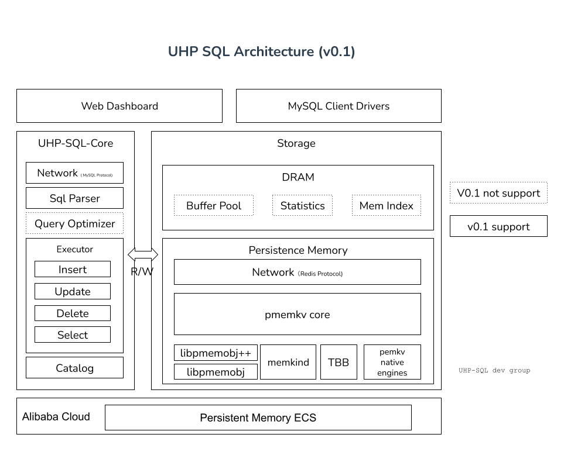

[首页](https://eraft.cn)  ｜ [UHP-SQL 文档](https://eraft.cn/uhp_sql)  ｜   [博客](https://eraft.cn/blogs)   ｜   [数据库研究](https://eraft.cn/database_theory) 

### 总体架构



整个系统的架构如上图，主要分为两个大模块

#### UHP-SQL Core
这里是整个系统的核心计算层逻辑，它包括的解析 MySQL 协议的网络层（NewWork）、对 SQL 语句进行解析的 (Sql Parser)、对查询进行优化的模块（Query Optimizer）[目前 UHP-SQL 暂时不做这一层优化，先在 PMem 上能顺利的进行一个数据的基本操作]、对 SQL 进行执行运行的 (Executor)、以及记录了系统中有哪些数据库，表，表字段信息的的系统目录（Catalog）模块。

#### Storage

这个模块主要负责数据的存储，它是架构在阿里云持久内存型实例上的，引擎层主要是 pmemkv，我们从 pmemkv 拉出一个自己的分支，在上面加了 redis 网络协议，同时由于PMem 随机读的延迟比 DRAM 高了 2.5 倍，随机写更是高了快 5 倍，所以我们在内存里面加上了 buffer pool，MemIndex（内存索引），用来优化性能。数据库的状态采集 Statistics 也是存储在内存中的。

#### 用户端

##### Web Dashboard

这个模块我们会打通阿里云内存型实例自动申请的操作，可以让用户一键启动 UHP-SQL 实例，并提供在线数据导入能力，在线执行 SQL 的能力。

##### MySQL Client Drivers

针对不同语言的应用程序接入 UHP-SQL，我们维护了支持我们系统 MySQL 协议版本的客户端程序，修复 BUG，改进性能，并对 UHP-SQL 一些限制的语句在接入 Client 里面定制化。

### SQL -> KV 编码

如何从 SQL 编码到 kv 呢？要回答这个问题我们先来分析几个 SQL 语句：

1.数据库元数据
```
CREATE DATABASE [dbname];
SHOW DATABASES;
```
这两个 SQL 很简单，只需要把 database_ 前缀和 dbname 拼接成 key，value 就是 dbname，这样接可以支持这两个 SQL 了， SHOW DATABASES 就是去扫描 database_ 的 key 读取 value 编码返回。

2.表元数据
  
```
CREATE DATABASE default;
CREATE TABLE classtab 
( 
Name VARCHAR(100), 
Class VARCHAR(100), 
Score INT, 
PRIMARY KEY(Name)
);
```
这个是 SQL 里面的建表语句，我们需要存储这个 Schema 到 KV 中，可以用 table_ 做前缀，key 里面包含数据库名和表名，value 里面包含字段名称以及字段类型信息。
编码如下：

```
key -> table_default_classtab

value -> Name^8$$Class^8$$Score^1
         [colName1^col1TypeId$$...colNamen^colnTypeId]
```


