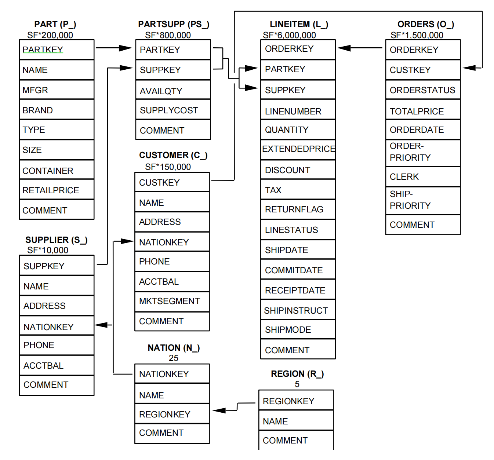

[首页](https://eraft.cn)  ｜ [UHP-SQL 文档](https://eraft.cn/uhp_sql)  ｜   [博客](https://eraft.cn/blogs)   ｜   [数据库研究](https://eraft.cn/database_theory) 

### TPC-H 介绍

TPC-H 是 [TPC-事务处理性能委员会 Transaction ProcessingPerformance Council](http://tpc.org) 针对 OLAP 数据库推出的。它是一个决策支持
基准，由一套面向业务的临时查询和并发数据修改组成。选择的查询和填充数据库的数据具有广泛的行业相关性。该基准测试
说明了决策支持系统可以检查大量数据，执行高度复杂的查询，并解答关键的业务问题。

### 测试数据集介绍

- 有 8 张数据表
- 箭头方向表示表之间的关系



详细的介绍读 [http://www.tpc.org/tpc_documents_current_versions/pdf/tpc-h_v2.17.1.pdf](http://www.tpc.org/tpc_documents_current_versions/pdf/tpc-h_v2.17.1.pdf)

### 上手生成测试数据集

创建数据表

```
CREATE TABLE NATION  ( N_NATIONKEY  INTEGER NOT NULL,
                            N_NAME       CHAR(25) NOT NULL,
                            N_REGIONKEY  INTEGER NOT NULL,
                            N_COMMENT    VARCHAR(152));

CREATE TABLE REGION  ( R_REGIONKEY  INTEGER NOT NULL,
                            R_NAME       CHAR(25) NOT NULL,
                            R_COMMENT    VARCHAR(152));

CREATE TABLE PART  ( P_PARTKEY     INTEGER NOT NULL,
                          P_NAME        VARCHAR(55) NOT NULL,
                          P_MFGR        CHAR(25) NOT NULL,
                          P_BRAND       CHAR(10) NOT NULL,
                          P_TYPE        VARCHAR(25) NOT NULL,
                          P_SIZE        INTEGER NOT NULL,
                          P_CONTAINER   CHAR(10) NOT NULL,
                          P_RETAILPRICE DECIMAL(15,2) NOT NULL,
                          P_COMMENT     VARCHAR(23) NOT NULL );

CREATE TABLE SUPPLIER ( S_SUPPKEY     INTEGER NOT NULL,
                             S_NAME        CHAR(25) NOT NULL,
                             S_ADDRESS     VARCHAR(40) NOT NULL,
                             S_NATIONKEY   INTEGER NOT NULL,
                             S_PHONE       CHAR(15) NOT NULL,
                             S_ACCTBAL     DECIMAL(15,2) NOT NULL,
                             S_COMMENT     VARCHAR(101) NOT NULL);

CREATE TABLE PARTSUPP ( PS_PARTKEY     INTEGER NOT NULL,
                             PS_SUPPKEY     INTEGER NOT NULL,
                             PS_AVAILQTY    INTEGER NOT NULL,
                             PS_SUPPLYCOST  DECIMAL(15,2)  NOT NULL,
                             PS_COMMENT     VARCHAR(199) NOT NULL );

CREATE TABLE CUSTOMER ( C_CUSTKEY     INTEGER NOT NULL,
                             C_NAME        VARCHAR(25) NOT NULL,
                             C_ADDRESS     VARCHAR(40) NOT NULL,
                             C_NATIONKEY   INTEGER NOT NULL,
                             C_PHONE       CHAR(15) NOT NULL,
                             C_ACCTBAL     DECIMAL(15,2)   NOT NULL,
                             C_MKTSEGMENT  CHAR(10) NOT NULL,
                             C_COMMENT     VARCHAR(117) NOT NULL);

CREATE TABLE ORDERS  ( O_ORDERKEY       INTEGER NOT NULL,
                           O_CUSTKEY        INTEGER NOT NULL,
                           O_ORDERSTATUS    CHAR(1) NOT NULL,
                           O_TOTALPRICE     DECIMAL(15,2) NOT NULL,
                           O_ORDERDATE      DATE NOT NULL,
                           O_ORDERPRIORITY  CHAR(15) NOT NULL,  
                           O_CLERK          CHAR(15) NOT NULL, 
                           O_SHIPPRIORITY   INTEGER NOT NULL,
                           O_COMMENT        VARCHAR(79) NOT NULL);

CREATE TABLE LINEITEM ( L_ORDERKEY    INTEGER NOT NULL,
                             L_PARTKEY     INTEGER NOT NULL,
                             L_SUPPKEY     INTEGER NOT NULL,
                             L_LINENUMBER  INTEGER NOT NULL,
                             L_QUANTITY    DECIMAL(15,2) NOT NULL,
                             L_EXTENDEDPRICE  DECIMAL(15,2) NOT NULL,
                             L_DISCOUNT    DECIMAL(15,2) NOT NULL,
                             L_TAX         DECIMAL(15,2) NOT NULL,
                             L_RETURNFLAG  CHAR(1) NOT NULL,
                             L_LINESTATUS  CHAR(1) NOT NULL,
                             L_SHIPDATE    DATE NOT NULL,
                             L_COMMITDATE  DATE NOT NULL,
                             L_RECEIPTDATE DATE NOT NULL,
                             L_SHIPINSTRUCT CHAR(25) NOT NULL,
                             L_SHIPMODE     CHAR(10) NOT NULL,
                             L_COMMENT      VARCHAR(44) NOT NULL);
```

安装 CockroachDB
[https://www.cockroachlabs.com/docs/v21.2/install-cockroachdb-mac.html](https://www.cockroachlabs.com/docs/v21.2/install-cockroachdb-mac.html)

[https://www.cockroachlabs.com/docs/v21.2/secure-a-cluster.html](https://www.cockroachlabs.com/docs/v21.2/secure-a-cluster.html)

加载数据集到 cockroach

```

// 生成
./dbgen -vf -s 1

// 处理
awk '{sub(/.{1}$/,"")}1' lineitem.tbl > newlineitem.tbl

// 这里我们直接用处理好的 newlineitem.tbl

IMPORT INTO LINEITEM  (   l_orderkey,   l_partkey ,   l_suppkey,  l_linenumber,  l_quantity ,   l_extendedprice ,    l_discount,   l_tax ,   l_returnflag ,  l_linestatus ,   l_shipdate ,   l_commitdate,  l_receiptdate ,  l_shipinstruct ,   l_shipmode,  l_comment )
     DELIMITED DATA (
       'https://eraft.oss-cn-beijing.aliyuncs.com/newlineitem.tbl'
     ) WITH
      fields_terminated_by='|', fields_enclosed_by='"',
      fields_escaped_by='\';
```

iMac2020 64GB-8core-500GB SSD 测试结果

```
root@localhost:26257/defaultdb> select count(*) from lineitem;
   count
-----------
  6001215
(1 row)


Time: 808ms total (execution 807ms / network 0ms)

root@localhost:26257/defaultdb> select
l_returnflag,
l_linestatus,
sum(l_quantity) as sum_qty,
sum(l_extendedprice) as sum_base_price,
sum(l_extendedprice*(1-l_discount)) as sum_disc_price,
sum(l_extendedprice*(1-l_discount)*(1+l_tax)) as sum_charge,
avg(l_quantity) as avg_qty,
avg(l_extendedprice) as avg_price,
avg(l_discount) as avg_disc,
count(*) as count_order
from
lineitem
where
l_shipdate <= '1998-12-01'
group by
l_returnflag,
l_linestatus
order by
l_returnflag,
l_linestatus;
  l_returnflag | l_linestatus |   sum_qty   | sum_base_price  |  sum_disc_price   |     sum_charge      |        avg_qty        |       avg_price       |        avg_disc         | count_order
---------------+--------------+-------------+-----------------+-------------------+---------------------+-----------------------+-----------------------+-------------------------+--------------
  A            | F            | 37734107.00 |  56586554400.73 |  53758257134.8700 |  55909065222.827692 | 25.522005853257337032 | 38273.129734621672203 | 0.049985295838397611622 |     1478493
  N            | F            |   991417.00 |   1487504710.38 |   1413082168.0541 |   1469649223.194375 | 25.516471920522983477 | 38284.467760848303907 | 0.050093426674216296906 |       38854
  N            | O            | 76633518.00 | 114935210409.19 | 109189591897.4720 | 113561024263.013782 | 25.502019635287610840 | 38248.015609058641636 | 0.050000259567560444300 |     3004998
  R            | F            | 37719753.00 |  56568041380.90 |  53741292684.6040 |  55889619119.831932 | 25.505793612690770656 | 38250.854626099657171 | 0.050009405830127056469 |     1478870
(4 rows)


Time: 12.581s total (execution 12.581s / network 0.000s)
```

### UHP-SQL 对这 22 个 SQL 进行 parser 结果测试

1. PASS

```

// l_shipdate <= '19981201' 这里数据库应该拿到日期先转换成 UNIX 时间戳，底层存储是 UNIX 时间戳来对比

root@aa959a7b3842:/UHP-SQL/build/parser# ./parser_demo 'select
l_returnflag,
l_linestatus,
sum(l_quantity) as sum_qty,
sum(l_extendedprice) as sum_base_price,
sum(l_extendedprice*(1-l_discount)) as sum_disc_price,
sum(l_extendedprice*(1-l_discount)*(1+l_tax)) as sum_charge,
avg(l_quantity) as avg_qty,
avg(l_extendedprice) as avg_price,
avg(l_discount) as avg_disc,
count(*) as count_order
from
lineitem
where
l_shipdate <= '19981201'
group by
l_returnflag,
l_linestatus
order by
l_returnflag,
l_linestatus;'
Parsed successfully!
Number of statements: 1
SelectStatement
	Fields:
		l_returnflag
		l_linestatus
		sum
			l_quantity
			Alias
				sum_qty
		sum
			l_extendedprice
			Alias
				sum_base_price
		sum
			*
				l_extendedprice
				-
					1
					l_discount
			Alias
				sum_disc_price
		sum
			*
				*
					l_extendedprice
					-
						1
						l_discount
				+
					1
					l_tax
			Alias
				sum_charge
		avg
			l_quantity
			Alias
				avg_qty
		avg
			l_extendedprice
			Alias
				avg_price
		avg
			l_discount
			Alias
				avg_disc
		count
			*
			Alias
				count_order
	Sources:
		lineitem
	Search Conditions:
		<=
			l_shipdate
			19981201
	GroupBy:
		l_returnflag
		l_linestatus
	OrderBy:
		l_returnflag
		ascending
		l_linestatus
		ascending

```

2. PASS

```
root@aa959a7b3842:/UHP-SQL/build/parser# ./parser_demo 'select
> s_acctbal,
> s_name,
> n_name,
> p_partkey,
> p_mfgr,
> s_address,
> s_phone,
> s_comment
> from
> part,
> supplier,
> partsupp,
> nation,
> region
> where
> p_partkey = ps_partkey
> and s_suppkey = ps_suppkey
> and p_size = 25
> and p_type like "TYPE"
> and s_nationkey = n_nationkey
> and n_regionkey = r_regionkey
> and r_name = "REGION"
> and ps_supplycost = (
> select
> min(ps_supplycost)
> from
> partsupp, supplier,
> nation, region
> where
> p_partkey = ps_partkey
> and s_suppkey = ps_suppkey
> and s_nationkey = n_nationkey
> and n_regionkey = r_regionkey
> and r_name = "REGION"
> )
> order by
> s_acctbal desc,
> n_name,
> s_name,
> p_partkey;'
Parsed successfully!
Number of statements: 1
SelectStatement
	Fields:
		s_acctbal
		s_name
		n_name
		p_partkey
		p_mfgr
		s_address
		s_phone
		s_comment
	Sources:
		part
		supplier
		partsupp
		nation
		region
	Search Conditions:
		AND
			AND
				AND
					AND
						AND
							AND
								AND
									=
										p_partkey
										ps_partkey
									=
										s_suppkey
										ps_suppkey
								=
									p_size
									25
							LIKE
								p_type
								TYPE
						=
							s_nationkey
							n_nationkey
					=
						n_regionkey
						r_regionkey
				=
					r_name
					REGION
			=
				ps_supplycost
				SelectStatement
					Fields:
						min
							ps_supplycost
					Sources:
						partsupp
						supplier
						nation
						region
					Search Conditions:
						AND
							AND
								AND
									AND
										=
											p_partkey
											ps_partkey
										=
											s_suppkey
											ps_suppkey
									=
										s_nationkey
										n_nationkey
								=
									n_regionkey
									r_regionkey
							=
								r_name
								REGION
	OrderBy:
		s_acctbal
		descending
		n_name
		ascending
		s_name
		ascending
		p_partkey
		ascending
```

3.


